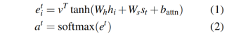
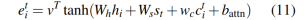
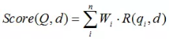

<div class="title">

<h2>数据挖掘与自然语言处理</h2><h4>——科技，改变世界。</h4>
</div>

<div class="tip">
想做的项目：
(1)、一个能与人智能对弈五子棋或象棋的智能程序;(2)、机器与机器的博弈；
(3)、一个集成了图像识别(识别常见事物)，智能聊天，能和人互动的3D美女。
(4)、搜索算法、搜索引擎。(5)、人脸识别。(6)、关联分析+深度神经网络打造推荐功能。
(7)、撩妹神器。(8)、根据文章给出摘要。(9)、时间识别。(10)、地名识别。(11)、关键词提取。
(12)、输入联想词。(13)、图片文字互转。(14)、计算文档或网页相似度。(15)、物体分割。
(16)、定制一个指定物体检测器。(17)、智能聊天。(18)、语音识别。(19)、中英互译。
(20)、根据题目写一篇简短文章。(21)、对对联。
</div>

#### 1、全局声明：
文本型数学符号集：† ← ↑ → ↓ ↔ €  Œ œ Š š Ÿ ƒ ⊗  σ η ω ρ ∈ ⊙▽⊙ ∑  λ μ ξ α β θ ≠
#### 2、python操作mysql：
**SQL**：Structed Query Language是用于访问和处理数据库的标准的计算机语言。而可以使用sql处理数据库的数据库有MySQL、SQL Server、Access、Oracle、Sybase、DB2 等等。在进入到各数据库模式下后可以直接使用sql语句对数据库进行操作。
**分布式存储系统**：就是将用户需要存储的数据根据某种规则存储到不同的机器上，当用户想要获取指定数据时，再按照规则到存储数据的机器里获取。
当用户（即应用程序）想要访问数据 D，分布式操作引擎通过一些映射方式，比如 Hash、一致性 Hash、数据范围分类等，将用户引导至数据 D 所属的存储节点获取数据。
##### a、安装及问题：
<i class="label1">windows上安装</i>低版本：安装包解压后进入文件夹创建一个`my-small.ini`文件然后在文件最低部添加：basedir=该文件夹绝对路径	/n  datadir=文件夹绝对路径/data。高版本的话不要设置datadir参数，不然启动服务时报错，按照菜鸟教程走即可。
进入bin目录cmd>>`mysql --initialize --console `//初始化数据库。会输出初始账户，密码，请记住！！！
>提示找不到VCRUNTIME140_1.dll：安装微软常用库。
>mysqld isntall 服务时提示：Install/Remove of the Service Denied!#可进入<i class="red">管理员身份运行</i>
```
mysqld install MySQL//安装名为MySQL的服务。注意在管理员身份下运行命令。`c:>d:`#切换到d盘
mysqld --remove MySQL `//移除指定服务。
net start mysql //启动mysql服务 ，启动失败的话直接到服务列表手动启动即可。
mysql -h root -p //登录(初始密码为空)，
```
数据库表字段属性：空\不为空值、主键、为一键、自增长、默认值、字段描述、补充、复合键。
**使用前**：注意使用前必须修改用户密码，方法如下：  :bulb:
```
D:\mysql\bin>mysql -u root -p    #目录下登入mysql
Enter password:****            #输入原密码进入
#进入到mysql模式，此时可使用sql等语句。每条语句后都要打分号再enter运行。
mysql>alter user root@localhost identified by 'xsww';将密码更改为xsww
```
<i class="label1">linux上安装</i>[linux上安装mysql学习地址。](https://blog.csdn.net/qq_40223688/article/details/90733495)
- mysql的用密码设置是有规则要求的。[mysql用户密码设置规则。](https://www.cnblogs.com/pythonywy/p/11815028.html)
- mysql服务管理(linux)：
```
service mysqld status    //查看服务状态
service mysqld stop //关闭
service mysqld start //开启
service mysqld restart    //重启
```
[mysql驱动包下载地址。](https://mvnrepository.com/artifact/mysql/mysql-connector-java)
[连接mysql时提示：Authentication method 'caching_sha2_password' is not supported解决方法](https://blog.csdn.net/u011583336/article/details/80999043)。
##### b、可视化：
**mysql可视化管理工具**：navicat for MySQL破解：https://blog.csdn.net/wypersist/article/details/79834490
<i class="label1">mysql数据表与csv文件互导</i>简单的操作可使用navicate的导入直接将一个csv文件转为一个新表。
使用命令导入则需要先建立一个新表(数据类型使用varchar)，然后将文件导入该表。导入的文件放到安装时my.ini配置文件中datadir或basedir指定的文件夹中去，不然会被认为不是安全的文件。
[null值相关控制。](https://blog.csdn.net/duckyamd/article/details/53143639)[mysql数据表与csv文件互导。](https://www.cnblogs.com/luruiyuan/p/5713273.html)

##### c、python连接mysql使用：
```python
from mysql import connector #pip install mysql-connector    和pymysql库一样的使用方法。
#连接mysql,主机名(ip),..database指定连接到的数据库，没有的话则只是连接mysql
wcs=connector.connect(host='localhost',user='root',passwd='',database='mysql')
ac=wcs.cursor()#创建一个光标用于操作mysql
#execute()执行sql语句来操作mysql，SHOW DATABASES展示数据库
ac.execute("SHOW DATABASES")#SHOW TABLES 显示当期库下的所有表格
for x in ac:print(x)#查看所有数据库或当期数据库下的所有表格；配合上面的语句

# 若上面没有指定连到哪个数据库的话，需要先ac.execute("use mysql")

# 在查询时
val = ac.execute("SELECT * FROM user")    #选取所有列
print(val)#列的数量，直接使用sql语句时还会显示各行的键类型、等其它属性。

```

**增、删、查、改**：
//插入数据,（增）。单条插入,使用占位符%时execute()内需要填两个值
```python
sql = "INSERT INFO sites (name,url) VALUES (%s,%s)"
ac.execute(sql,('wcs','http:'))#批量插入操作，第二值传入一元组,改成executemany()即可
ac.executemany(sql,[('google','url'),('github','url'),...])
wcs.commit()#涉及到更改数据库的操作需要使用commit()提交。

#查找数据,(查)。查找表sites中的所有数据

ac.execute("SELECT * FROM sites")#"SELECT name FROM sites"只查找name字段数据，选多个列时用逗号隔开。
#"SELECT * From sites ORDER BY name DESC"按name字段排序，默认升序，DESC为降
#"SELECT * FROM sites WHERE name = 'google'" 按条件查询
#定义占位符，避免sql注入攻击
sql1 = "SELECT * FROM sites WHERE name = %s"
ac.execute(sql1,("wcs",))#第二个参数必须是一个元组或列表
res=ac.fetchall()#获取到结果的一个迭代对象，需要使用for循环来获取

#删除表数据"DELETE FROM sites WHERE name = %s"不用WHERE的话会删除说所有数据
#更新数据，修改数据,更新name为wcs的数据为xsww

sql2 = "UPDATA sites SET name = 'xsww' WHERE name = %s"
ac.execute(sql2,('wcs',))
wcs.commit()

```
##### d、sql语句：
<i class="label1">SQL</i>注意，虽然是sql语句，但在不同的数据库中可能用法略有不同。这里是mysql中可用的语句形式。
进入到mysql模式以后如下：    以下语句大小写均支持。
<i class="label2">查看部分</i>
```sql
show databases;    //显示所有已有的数据库
use mysql;    //选择其中一个数据库
SHOW TABLES;    //显示该库下的所有表
//查看表db的所有列，或用DESCRIB from db;效果一样。显示的Field项就是它的所有列，后面还有type等各列的属性描述。
SHOW COLUMNS from db;
//    其它SHOW命令。
SHOW STATUS：显示广泛的服务器状态信息
SHOW CREATE DATABASE 和 SHOW CREATE TABLE：显示创建特定数据库或表
SHOW GRANTS：显示授权用户（所有用户或特定用户）的安全权限
SHOW ERRORS 和 SHOW WARNINGS：显示服务器错误或警告消息
HELP SHOW：显示允许的SHOW语句
SHOW create table games;    //查看表games的所以有列属性，及使用的字符集编码
show create database wcs; //查看数据库详情。
```
<i class="label2">增、删、查、改</i>
```sql
/***************建库建表*/
create database wcs character set utf8;    #创建一个名为wcs的库。
#在当前库下建一个名为blogs的表。括号中的是表的字段，列名、数据类型。
create table blogs(id char(20) primary key,user_id char(20),name char(20) COMMENT '姓名',)character set utf8;
/*删除数据表 "DROP TABLE IF EXISTS sites"   IF EXISTS为判断*/

/    ***************修改操作，字段操作*/
alter table 表名 modify column 字段名 类型；
ALTER TABLE 表名 ADD COLUMN 字段名 numeric(18,0);    #添加
ALTER TABLE games DROP COLUMN id;    //删除某一个列。

/**********删除操作*/
DELETE FROM games WHERE id=15;    //删除id为15的那行。
DELETE FROM games WHERE year is null;    //剔除空值。
DELETE FROM gamse;    //删除所有的行。
DROP TABLE games;    //删除整个表。

#************插入操作
INSERT INTO table VALUES (v1,v2,v3);    #直接插入值
INSERT INTO table (id,name,url) VALUES (1,'wcs','http://');    #指定键值的插入。
INSERT INTO table2 SELECT * FROM table1;    #从表1中选择一些字段插入到表2中。
#    注意：插入就会新增行，即使你要插入的那列值之前的是为空，也会从表尾插入。
#    DELAYED插入数据会做延迟操作，如果在插入期间有查询操作的话，会暂缓这些插入。
INSERT DELAYED INTO games (name) VALUES ('qq');


#******更新操作,UPDATE操作一般比较费时间。
UPDATE games SET ys=10,avg_al=22.45 WHERE id=10;    //查找指定行，更新指定列值。


/*查询语句**************SELECT,WHERE是接一个字句。    可选择从多个表中查询*/
SELECT shop_id,item_id FROM test1,test2 LIMIT 2;    #LIMIT限制返回的条数。对应sql的TOP作用。    有子句时写在子句后。
SELECT DISTINCT country FROM Websites;    #DISTINCT选取country列中所有的项(去除了重复部分)。
/*like可指定用后面的匹配项去匹配指定列中满足条件的数据。第一个item_id是要显示的列，第二个item_id是要用于匹配的。*/
SELECT item_id from test WHERE item_id LIKE '24%';    /*#LIKE可用来匹配符合规则的数据。24%表示以24开头的。*/
SELECT * FROM Websites WHERE name REGEXP '^[GFs]';    /*#REGEXP后面使用正则表达式。*/
SELECT * FROM test WHERE name IN ('wcs','xsww');    /*#精确的查找，IN指定name字段中，在指定值内的数据。*/
SELECT * FROM test WHERE item_id BETWEEN 1 AND 20;    /*#BETWEEN指定一个范围。包括字符串范围。'a' AND 'z'*/
SELECT * FROM test WHERE item_id NOT BETWEEN 1 AND 20;    /*#NOT取反向，还能加在IN前面。*/
/*    多条件查询时的写法。用and链接，条件太多时，可能要拼接。*/
SELECT shop_id,item_id FROM test WHERE shop_id IN (59,24) and mount NOT BETWEEN 2 AND 5 LIMIT 10;
/*    用AS来为前一个表名或列名重新命名。*/
SELECT w.name, w.url, a.count, a.date FROM Websites AS w, access_log AS a WHERE a.site_id=w.id and w.name="菜鸟教程";
/* *****检测空值，库中显示为None*/
SELECT id,year FROM games WHERE year is null;    //使用year=null不能检测出来。*/


/* 通配符，通常与LIKE和REGEXP 一起使用。*/
/*%    #代替0个或多个字符，aa%表示以aa开头，%aa%则可匹配字符中任意位置的aa字符。*/
/*-    #代替1个字符。
[charlist]    #匹配到中阔号中任一字符。
[^abc]    #非括号中的字符。

/*    多张表一起查询。不过SELECT后要选择是哪个表的列名，不然报错。*/
SELECT test.Coupon_id FROM test,offline WHERE test.Coupon_id=offline.Coupon_id LIMIT 10;

/*    聚合函数：*/
count() 求值的个数、sum() 求值的和、avg() 平均数、max() 最大值、min() 最小值
year()    getdate()#返回系统当前时间    month() day()#    year(GETDATE())#放到其它对应的函数中获取当前年份、月份等。

/*    GROUP BY的使用：表示通过某个字段进行分组，一般与聚合函数使用。当然可以和WHERE一起使用，并不冲突。*/
SELECT sum(mount) as '销量' FROM test GROUP BY shop_id;    #表示通过shop_id进行分组，然后计算各店铺的总销量。
SELECT sum(mount) FROM test WHERE area="云南" GROUP BY shop_id;    #表示选择云南的店。
/******多条件的group by。name和str_time一样时才分为一组*/
SELECT name,sum(money) FROM users GROUP BY name,str_time;

/*    having子句的使用：与WHERE类似，都是用于条件划分的。不过having是放在group by语句后用于筛选组的。*/
SELECT item_id,AVG(mount) FROM test GROUP BY shop_id having AVG(mount)>20;    #选出平均销量大于20的商店的信息。
/* 剔除空值*/
SELECT User_id FROM test WHERE
/*    查询最大值，这项稍有点特殊：*/
SELECT MAX(mount) FROM test WHERE shop_id=59;    MAX放在查询项而不是条件项。

/*    ORDER BY的使用*/
SELECT shop_id FROM test ORDER BY mount asc;    #asc是升序，desc是降序。
SELECT shop_id FROM test GROUP BY shop_id ORDER BY sum(mount);#    mount中不含有sum(mount)值。

/*   select嵌套使用：*/
SELECT shop_id FROM test WHERE mount=(select max(mount) from test);    #第二个select查询的结果作为第一个select句的条件值使用。

/*    EXISTS的使用：只返回布尔值，前面可加not配合使用。后面语句返回为True时才会执行前面的语句，否则返回empty set.*/
SELECT shop_id FROM test WHERE EXISTS(select shop_id from test where shop_id==60);

/* JOIN,联表查询，INNER JOIN 指定联合哪个表，ON指定用哪个列来联合，一般用同列名。*/
/* INNER JOIN返回的查询结果是两表最大相同公共长度结果集。而LEFT JOIN 和 RIGHT JOIN 则分别是返回以左或右表的最大结果集。*/
SELECT a FROM test INNER JOIN train ON test.b=train.b
/*指定多条件的链接*/
SELECT * FROM t1 INNER JOIN t2 ON (t1.name,t2.money) = (t2.name,t2.money + 1);


/*    UNION语句使用,联合多个查询语句。*/
SELECT name FROM tab1 UNION SELECT name FROM tab2;       /*如果两个表对应列中查出的值有重复会被合并，得到一个列表结果*/
SELECT name FROM tab1 UNION ALL SELECT name FROM tab2;   /*UNION ALL则不会合并重复的值。*/
```
[两个表联合。](https://www.jb51.net/article/154006.htm)
<i class="label2">特殊部分</i>
```sql
/*OVER()函数需要配合row_number(),rank(),dense_rank()等一起使用。*/
/*partion by type表示按照type字段来分组。order by sales表示按sales字段来排序*/
/*row_number()会对select结果的每条数据进行编号(每一组都从1开始编号)，结果类似:分好组，拍好序，编好号，但是返回一个一维的*/
SELECT id,type ROW_NUMBER() OVER(partition by type order by sales) FROM games;

/******with as的使用。定义一个sql片段，可被引用，类似于sql子句功能*/
/*用ntb代表括号内的查询结果，后一个select语句的FROM需要指定ntb才能使用ntb中的值*/
with ntb as (SELET id,name FROM users) SELECT id,name FROM ntb WHERE ntb.name LIKE 'w%';
/**数据类型转换
第一个参数为值，第二个为数据类型。char(19)表示从头开始取19个为字符串。
其它类型：DATE>日期。TIME(时间)、DATETIME、DECIMAL、SIGNED(整数)、 UNSIGNED(无符号整数)。
*/
SELECT CONVERT('2020-09-05 16:32:04',char(19));
 SELECT CAST('3.35' AS signed); /*与convert一个作用*/

/****         找出连续3天消费金额超过100的用户。*/

/*将消费时间转换为字符串，后面用于分组*/
/*gp1,gp2,gp3都一样，计算用户单天的总消费，而且按（name,sale_time）分组，再将时间字符串转为时间格式，便于后面计算*/
/*按(name,time)=(name,time+1)的形式连接3个表，这样得到的一条数据就是用户连续3天消费的记录。*/
/*再条件筛选3天的金额超过一定值。其它类似情况也可以借鉴此写法。*/
with nt as (SELECT id,name,money,CONVERT(sale_time,char(10)) as t FROM user_cord),
gp1 as (SELECT name,CONVERT(t,DATE) as t1,sum(money) as ms FROM nt WHERE nt.name=nt.name GROUP BY nt.t,nt.name), 
gp2 as (SELECT name,CONVERT(t,DATE) as t1,sum(money) as ms FROM nt WHERE nt.name=nt.name GROUP BY nt.t,nt.name),
gp3 as (SELECT name,CONVERT(t,DATE) as t1,sum(money) as ms FROM nt WHERE nt.name=nt.name GROUP BY nt.t,nt.name) 
SELECT * FROM gp1 LEFT JOIN gp2 ON ((gp1.t1 + interval 1 day),gp1.name) = (gp2.t1,gp2.name) 
LEFT JOIN gp3 ON (gp2.name,(gp2.t1 + INTERVAL 1 day)) = (gp3.name,gp3.t1) 
WHERE gp1.name=gp2.name AND gp2.name=gp3.name AND (gp1.ms + gp2.ms + gp3.ms) > 100;
```

##### e、字段属性及建表原则：
|   数据类型    |            含义             |   数据类型    |         含义         |  数据类型   |         含义          |
| :-----------: | :-------------------------: | :----------: | :------------------: | :--------: | :---------------------: |
|     date      | 3字节，日期，格式：2014-09-18 |   tinyint    |     （-128~127）     |  char(n)   |  固定长度，最多255个字符  |
|     time      |  3字节，时间格式：08:42:30   |   smallint   |   （-32768~32767）   | varchar(n) | 可变长度，最多65535个字符 |
|   datetime    |        8字节，日期时间        |  mediumint   | （-8388608~8388607） |  tinytext  |  可变长度，最多255个字符  |
|   timestamp   | 4字节，自动存储记录修改的时间  |     int      |                      |    text    |                         |
|     year      |            年份             |    bigint    |                      | mediumtext |                         |
|     float     |      4字节，单精度浮点型      | double(m, d) |  8字节，双精度浮点型   |  longtext  |                         |
| decimal(m, d) |     存储为字符串的浮点数      |              |                      |            |                         |

**数据类型属性**：
- auto_increment：新插入的行赋一个唯一的整数标识符。每个表只允许一个。
- binary：只用于char和varchar值。当为列指定了该属性时，将以区分大小写的方式排序。与之相反，忽略binary属性时，将使用不区分大小写的方式排序。
- default：确保在没有任何值可用的情况下，赋予某个常量值。如default NULL。
- null，not null：允许和不允许空值。
- primary key：用于确保指定行的唯一性。指定为主键的列中，值不能重复，也不能为空。常与auto_increment使用。
- unique：属性的列将确保所有值都有不同的值，只是null值可以重复。
- zerofill：可用于任何数值类型，用0填充所有剩余字段空间。
**建表原则**：
1. 表示是否...概念的字段必须用：is_...格式命名，数据类型为tinyint，属性为unsigned。
2. 表名、字段名必须使用小写字母或数字，禁止出现数字开头，禁止两个下划线中间只出现数字。
3. 表名，字段名等禁用保留字，如desc、range、match、delayed等。
4. 小数类型为decimal，禁止使用float和double。[//]: #float和double的存储的时候，存在精度损失的问题，很可能在值的比较时，得到不正确的结果。如果存储的数据范围超过decimal的范围，建议将数据拆成整数和小数分开存储。
5. 如果存储的字符串的字符长度几乎相等，使用char定长字符串类型。
6. varchar是可变长字符串，不预先分配存储空间，长度不要超过5000，如果存储长度大于此值，定义字段类型为text，独立出来一张表，用主键来对应，避免影响其它字段索引效率。
7. 建表时，id，创建时间、更新时间都要带上，操作如下：
```sql
CREATE TABLE users(id smallint primary key auto_increment,create_time timestamp DEFAULT CURRENT_TIMESTAMP COMMENT '创建时间',update_time timestamp NULL DEFAULT NULL ON UPDATE CURRENT_TIMESTAMP COMMENT '更新时间');
```
8.库名与应用名一致，表明为业务名加作用。
9.单表行数 超过500万行或者表单容量超过2GB，才推荐进行分库分表。
10.合适的选择整型、字符型，既节约空间又节约时间。
[建表原则学习地址。](https://www.jianshu.com/p/b7aaa973dc1d?from=timeline&isappinstalled=0)
可设置的数据类型：[mysql中可设置的数据类型](https://www.cnblogs.com/cqlb/p/9856841.html)。[建表时设置字段属性。](https://www.jianshu.com/p/c6ca399b88ae)
##### f、日期相关计算：
```sql
 /*返回指定日期上添加天数后的日期，interval指定值和类型，还有year、day、hour、minu、second*/
SELECT DATE_ADD('2020-03-20',interval 2 month);
SELECT DATE_SUB('2020-03-20',interval 2 day);    /*和上面相反*/
SELECT '2020-07-20 13:55:02' + INTERVAL 2 MONTH;    /*或者直接这样计算。*/
/* CURDATE()#返回当前日期、CURTIME()#返回当前时间、NOW()#当前日期和时间*/
select SEC_TO_TIME(2378);//转为》时：分：秒表示。
SELECT TIME_TO_SEC('22:23:00');//转为总的秒数。
select WEEKDAY('1997-10-04 22:23:00');/*返回日期对于的星期，0为星期一。**/
/******查询时直接比较时间前后.    大于是指在这时间之后，小于则是在此之前*/
SELECT id FROM create_time > "2020-06-23 18:05:22";
/*转换时间格式,注意小写m表示月份，M表示分钟，这样可以将日期中的时间去掉*/
SELECT DATE_FORMAT(create_time,"%Y-%m-%d") as t FROM users;
```
##### g、备份与恢复：
备份会将表的创建命令，数据转为一条条插入命令存储为一个文件，恢复时再按照格式运行其中的命令。[参考学习地址。](https://blog.csdn.net/weixin_34345560/article/details/92419746)
```bash
/*非mysql模式下使用，wcs为指定的库，tools为其下面的表，多个表时空格隔开即可，最后指定路径文件*/
/*不指定表时，默认备份所有表*/
mysqldump -u root -p wcs tools > /home/wcs/back.sql
// 备份所有库
mysqldump -u username -p --all-databases > BackupName.sql
```
**其它数据库及使用选择**：
- sccess，foxbass：负载量100人以内，对安全性要求不高时可选择。
- mysql、sql server、informix：日访问量5000～15000，如商务网站。
- sybass、oracle、db2：负载量大，安全性高，成本也较贵。
**数据迁移**：常会遇到把外面的离线数据倒入到当前使用的库中、把当前使用中的库迁移到一个新的库或服务器上、数据太多时分库分表、更新数据库版本，更换数据库引擎等，这些操作在停机情况下进行操作还算简便，但一般要求固定时间内完成，压力较大。**在线数据迁移**：可以不停机的情况下进行迁移，迁移完成后切换成新的库使用即可，对新库和旧库进行一个双写操作，即涉及到插入、更新、删除的操作在两个库同时进行，然后按顺序从旧库中将数据复制到新库中(迁移完后再做一遍数据校验，以旧库数据为准)。
[一篇较详细的数据迁移文章。](https://www.cnblogs.com/skying555/p/8479471.html)
#### 3、python的面向对象：
类中__init__(self)方法是一个内部规定的方法若在类中写了该函数则在执行该类中的任意一个方时都会执行一次类中的__init__函数,若要调用类中的方法得先将该类赋值给另一个变量，然后由该变量调用类中的函数。列：

```python
class animal():#类中不一定要写这个初始化函数，但每个函数都要传入self
    def __init__(self):
        self.name='animal'
    def a(self):
        print(“hello”)
b = animal()
b.a()

```
[继承，多继承]不推荐使用多继承，多数编程语言中也不支持多继承，这在逻辑上会比较复杂

```python
class animal(object):
    def eat(self,data):
        return data*2

class plant(object):
    def drink(self,data):
        return data*3
//如果3个类中有重复的方法则会报错        
class dog(animal,plant):#继承两个父类，若第一个父类没构造函数会从左
//向右查找，把第一个有构造函数的类设为self域。
    def __init__(self,name):
        animal.__init__(self)#先运行父类的初始化，这样父类中的实例
 //才能在子类中直接使用self调用       
        self.name = name#推荐先初始化父类的初始化函数。
        self.info = animal.eat(self,5)#这样调用父类中的函数
   @classmethod#它对应的函数不需要实例化，不需要self参数，但是第一个参数
//需要是表示自身类的cls参数，可以用来调用类的方法，类的属性，     
   def ability(cls):
       print(cls.num)
       return data
dog2 = dog('dog2')
v = dog2.drink(12)

```
#### 4、爬虫：
python2方法：

```python
url = “http://www.huaban.com”
Req = urllib2.Request(url，data,header)#3个参数
Res = urllib2.urlopen(Req,timeout=10)#2个参数
print Res.read()
```
python3方法：
<i class="label1">简单爬取</i>
```python
import requests
url = “http://www.huaban.com”
s = request.get(url=url)
print(s.text)

from bs4 import BeautifulSoup
//BeautifulSoup是一个html解析器
bf = BeautifulSoup(html)//html是上面获取到的网页内容
//find_all()方法按条件查找：标签名、类名、id名,返回一个列表
content = bf.find_all('div',class_='a',id='k')
print(content[0].text)//返回的是带着标签的列表，用text获取标签内文本内容。

```
若未获得内容则有可能是网页设置了需要头部请求,打开要扒的网页打开f12下的
Network项查看Response header中的内容,注意其中的 User-Agent,Content-Type,Referer项，将其内容写到头部字典中一并发送 出去.
<i class="label1">SSL验证</i>ssl是http上加的一层协议，用上面的方法直接爬取可能会报SSLError，这是需要做ssl验证，如下方法解决：

s = request.get(url=url,verify=False) //verify设为false来绕过验证。

<i class="label1">抓包</i>在爬取一些由js动态加载(ajax)出来的数据的网页时，获取到的是未加载出数据的页面(一般是.html页面)，此时就需要探查这个网页做了哪些请求，请求的接口等信息，浏览器控制台network项中可以查看请求记录，不过使用专门的抓包工具会更简便好用。
这里使用抓包工具：Fiddler。[Fiddler下载地址(所有系统都支持)。](http://www.telerik.com/fiddler)(进入Fiddler后，可以打开浏览器进入一个网站，然后Fiddler就能监听到这台计算机作出的网络请求，将信息列出来)
<i class="label1">头部请求设置</i>js向后台发送请求时，可以设置头部信息来控制要传的数据类型，规定验证信息等东西来做一个反爬虫的东西(后台配合)。以下是几个重要的头部：
User-Agent：这里面存放浏览器的信息。可以看到上图的参数值，它表示我是通过Windows的Chrome浏览器，访问的这个服务器。如果我们不设置这个参数，用Python程序直接发送GET请求，服务器接受到的User-Agent信息就会是一个包含python字样的User-Agent。如果后台设计者验证这个User-Agent参数是否合法，不让带Python字样的User-Agent访问，这样就起到了反爬虫的作用。这是一个最简单的，最常用的反爬虫手段。
Referer：这个参数也可以用于反爬虫，它表示这个请求是从哪发出的。可以看到我们通过浏览器访问网站，这个请求是从https://unsplash.com/，这个地址发出的。如果后台设计者，验证这个参数，对于不是从这个地址跳转过来的请求一律禁止访问，这样就也起到了反爬虫的作用。
authorization：这个参数是基于AAA模型中的身份验证信息允许访问一种资源的行为。在我们用浏览器访问的时候，服务器会为访问者分配这个用户ID。如果后台设计者，验证这个参数，对于没有用户ID的请求一律禁止访问，这样就又起到了反爬虫的作用。

headers = {'authorization':'your Client-ID'} # 这里的your client-ID是抓包中获得的，后面再补充。
req = requests.get(url=target, headers=headers, verify=False)

爬取js动态加载数据的网页的方法：https://www.znian.cn/932.html
[w3c的python3爬虫教程地址。](https://www.w3cschool.cn/python3/python3-enbl2pw9.html)
#### 5、Django和flask的使用:
<i class="label1">django安装</i>下载地址https://www.djangoproject.com/download/，使用git下载到本地后使用python来安装(也可以使用pip或conda安装，下载的和地址下载中的django文件夹一样)，进入到下载好的django目录下使用命令：python setup.py install //如果想安装到anaconda环境中使用其python对应系统变量即可。安装后在python环境中的script文件夹下会有dnango-admin.exe文件可以直接在cmd中使用,cmd中输入django-admin能运行则成功。(若无法全局使用django-admin的话直接进入scripts文件夹下去运行即可。)
[开始一个项目]django-admin startproject HelloWorld //创建一个HelloWorld目录,
里面有一些初始化文件，再使用命令：python manage.py runserver 0.0.0.0:8000,然后在浏览器输入127.0.0.1:8000即可看到初始化页面。在urls.py文件配置如下：
```python
from django.conf.urls import url
#2.0以后的版本的path在django.urls下,1.0所属版本在conf.urls下
from django.urls import path
#from django.conf.urls import path
from . import view#这样写直接运行view文件可能会报错,不过cmd运行不会
#导入非环境中的包必须这样，否则会报错;导入anaconda中的包没问题
#urlpatterns中配置接口路径对应的指定页面中的函数，可以全部改成url配置
urlpatterns = [url(r'^$',view.hello),path('index/',view.ajax)]
#前端访问接口或浏览器打开时为http://127.0.0.1:8000/index/最后一个斜杠
#与urls文件同级的view.py文件中：

from django.http import HttpResponse,JsonResponse
import json
def hello(request):
    return JsonResponse('hello')
#当浏览器输入127.0.0.1:8000/index时就会触发ajax()函数
def ajax(request):#若有值传来则

```
<i class="label1">使用docker部署django项目</i>可以使用apache来部署django项目，但是经常遇到很多问题，而docker部署可以为每个项目单独建一个环境，将多个项目分开，非常便于维护(docker的安装见36)，而且使用docker来部署项目也会方便很多(只不过windows上docker的安装很多坑)。[docker部署django教程。](https://blog.csdn.net/BlueBlueSkyZ/article/details/89083285)[Dockerfile文件编写规则。](https://www.cnblogs.com/549294286/p/11044901.html)
<i class="label1">flask的使用</i>pip install flask#安装flask。pip install flask-cors

```python
from flask import Flask,request
from flask_cors import *
import json,os
AI = Flask(__name__)
CORS(AI,supports_credentials=True) #设置跨域

@AI.route('/ai/nlp/',methods=['POST','GET']) #methods可设置规定访问的方法。
def extract():
    mt = request.method #获取请求的方式。
    st = request.form['sentence'] if mt=='POST' else request.args.get('sentence',None) #获取参数
    return json.dumps({"status":200}) #返回的数据格式要用json封装。

# flask接受前台传来的文件
@AI.route('/file/',methods=['POST','GET'])
def fl():
    from werkzeug.utils import secure_filename
    #    前端直接传送一整个formdata数据过来。
    a = request.form.get('name')# 获取form表单中普通的数据，如type为text类型的输入框中的值。
    b = request.files['file']# 获取文件对象。file是input标签中指定的名。
    fname = secure_filename(b.filename)# 使用secure_filename()能获取到正确的文件名。
    if fname!=None:
        save_path = os.path.join('data',fname)
        b.save(save_path)# 直接调用save()方法保存文件。
        # 先保存好文件才能读取文件内容。使用完后可以用命令删除文件。
        with open(fname,'r') as f:
            for c in f:
                print(f)
```
<i  class="violet">传参注意：接口中使用到的参数都必须传，不然会直接报404错误，而不是找不到参数的错误，即使使用了判断要不要获取参数的情况(比如后台根据typ值为0则使用文本参数text，否则使用获取文件参数file，那么前端需要3个都上传，且file是文件类型，都要与后台对应)。，要求之外的参数，前端可以多传。</i>
[flask使用教程。](https://www.cnblogs.com/klb561/p/8679320.html)[flask的部署。](https://www.jianshu.com/p/5b09394bebfe)
#### 7、python时间：
```python
import datetime
from datetime import timedelta
import time
import calendar
tim1 = time.time()#一个时间戳，适合做计算支持1970-2038年之间
tod = datetime.datetime.today()#2019-06-29 15：23：57.514309，获取当前点时间
#datetime.today(),与timedelta结合查询最近几天时间
res=(datetime.today() + timedelta(days=1,hours=0)).strftime('%y-%m-%d')#表
#示查询1天后此刻的时间，再转为-格式。
tim2 = time.localtime(time.time())#时间戳转换了一种形式，但不能直接使用
tim3 = time.asctime(tim2)#/最简单的获取可读时间的方法
time4=time.strftime('%Y-%m-%d %H:%M:%S',time.localtime())#格式化时间按照
#指定的格式输出时间2019-5-18 11:30:27,%Y,%H...是属于时间的格式化字符串。
month = calendar.month(2018,10)#获取年份下某月份的日历表。
#strptime()将一个字符串时间转为程序识别的时间。
tt = datetime.datetime.strptime("2012-08-21", "%Y-%m-%d %H:%M:%S")# 不加时间的话会自动补为00:00:00
tm = datetime.datetime.strptime("2010-08-21", "%Y-%m-%d %H:%M:%S")
mq = (tt - tm).days    #时间转为int型。

# 计算几天后的日期：
s = time.sleep(5)
end = datetime.datetime.now()    #获取到的是5天后的世界。

def minNums(startTime, endTime):
    '''计算两个时间点之间的分钟数'''
    # 处理格式,加上秒位
    startTime1 = startTime + ':00'
    endTime1 = endTime + ':00'
    # 计算分钟数
    startTime2 = datetime.datetime.strptime(startTime1, "%Y-%m-%d %H:%M:%S")
    endTime2 = datetime.datetime.strptime(endTime1, "%Y-%m-%d %H:%M:%S")
    seconds = (endTime2 - startTime2).seconds
    # 来获取时间差中的秒数。注意，seconds获得的秒只是时间差中的小时、分钟和秒部分的和，并没有包含时间差的天数（既是两个时间点不是同一天，失效）
    total_seconds = (endTime2 - startTime2).total_seconds()
    # 来获取准确的时间差，并将时间差转换为秒
    print(total_seconds)
    mins = total_seconds / 60
    return int(mins)

if __name__ == "__main__":
    startTime_1 = '2019-07-28 00:00'
    endTime_1 = '2019-07-29 00:00'
    fenNum = minNums(startTime_1, endTime_1)
    print(fenNum)
```
**定时器**：
```python
from datetime import datetime
import time
def timer(n):
    while True:
        print(datetime.now().strftime("%Y-%m-%d %H:%M:%S"))
        time.sleep(n)# sleep()是阻塞式的，期间不能做其它操作。
timer(5)# 每5秒执行一次

import sched

# 初始化sched模块的 scheduler 类
# 第一个参数是一个可以返回时间戳的函数，第二个参数可以在定时未到达之前阻塞。
schedule = sched.scheduler(time.time, time.sleep)
# 被周期性调度触发的函数
def printTime(inc):
    print(datetime.now().strftime("%Y-%m-%d %H:%M:%S"))
    schedule.enter(inc, 0, printTime, (inc,))
# 默认参数60s
def main(inc=60):
    # enter四个参数分别为：间隔事件、优先级（用于同时间到达的两个事件同时执行时定序）、被调用触发的函数，
    # 给该触发函数的参数（tuple形式）
    schedule.enter(0, 0, printTime, (inc,))
    schedule.run()
# 10s 输出一次
main(10)
```

#https://www.runoob.com/python3/python3-date-time.html
i = datetime.datetime.now()
print(i.year,i.month,i.day,i.hour...)
#### 8、python读取pdf、excel表格和word文档：
<i class="label1">读取excel</i>
<i class="label2">csv文件读取与存储</i>
```python
import csv
#读取
c = open('data.csv','r')
reader = csv.reader(c)
a = []
for f in reader:
    print(f)# 每列以列表形似呈现。
    if f == '\x00': # 提示存在null bytes时可这样跳过。
        continue
    a.append(f)
# 存储
with open('av.csv','w') as w:
    writer = csv.writer(w,delimiter=' ')#delimiter可以设置每列值之间使用的隔开符，默认是每个值占一格。
    writer.writerow(['id','name','val'])#写入一行。
    writer.writerows([[],[],[]]) #writerows()同时写入多行

[xml格式读取。](https://www.cnblogs.com/xiaobaixiaobai/p/10724829.html)
pip install python_docx #需要安装python_docx，安装docx的话是2版本的3中用不了。

# docx文档读取
from docx import Document
from docx.shared import Inches
document = Document('/home/wcs/data/人工智能.docx')
i = 0
for p in document.paragraphs:
    print(p.text) # 打印每行的文本内容。
    if i > 5:
        break
    i += 1
document.add_paragraph('net text',style="ListNumber") #添加新的内容。
document.save('/data/av.docx')

```
[pdf的读取学习地址。](https://www.cnblogs.com/xiao-apple36/p/10496707.html)   pip install pdfplumber #另一个读取pdf的库是pdfminer功能更强大，但没有这个易用。

```python
import pdfplumber
with pdfplumber.open("/home/wcs/data/vv.pdf") as pdf:
    # 逐行读取。
    for c in pdf.pages:
        print(c.extract_text())#读取每行的文本，还有其它函数：extract_words(),extract_tables(),extract_image()
```
xlsxwrite模块，可用于自动化生成报表使用：
```python
import xlsxwriter

# 新建一个xlsx文件
book = xlsxwriter.Workbook(filename=u'员工统计表.xlsx',
   options={  # 全局设置
        'strings_to_numbers': True,  # str 类型数字转换为 int 数字
        'strings_to_urls': False,  # 自动识别超链接
        'constant_memory': False,  # 连续内存模式 (True 适用于大数据量输出)
        'default_format_properties': {
            'font_name': '微软雅黑',  # 字体. 默认值 "Arial"
            'font_size': 14,  # 字号. 默认值 11
            # 'bold': False,  # 字体加粗
            # 'border': 1,  # 单元格边框宽度. 默认值 0
            # 'align': 'left',  # 对齐方式
            # 'valign': 'vcenter',  # 垂直对齐方式
            # 'text_wrap': False,  # 单元格内是否自动换行
            # ...
        },
    })

# 单元格合并后居中
fmt = book.add_format({'align': 'center', 'valign': 'vcenter'})
# sheet.merge_range(x1, y1, x2, y2, value, cell_format=None)
sheet.merge_range(0, 0, 1, 10, 'hello', cell_format=fmt)# 合并(0,0)到(1,10)

# 文件中创建一个工作表
sheet = book.add_worksheet(u'基本信息')
sheet.set_column('A:A',20)# 设置第一列宽度。
sheet.write('A1','Hello')　　#在A1单元格写入hello
sheet.insert_image('C3','/root/test/2.png')# 插入图片

head = [u'姓名',u'出生日期',u'学历',u'身高']
names = [u'张三',u'李四',u'赵五',u'钱六',u'泰七']
learn = [u'博士',u'研究生',u'本科',u'专科',u'高中']
lens = [1.75,1.8,1.7,1.69,1.68,1.65]


sheet.write_column('A2',names) # 写入列
sheet.write_column('C2',learn)
# 也可以指定行，列索引来指定位置，1对应行号2.
sheet.write_column(1,1,['1991/6/23','1995/2/28','1997/9/21','1996/5/24','1992/7/30'])
sheet.write_column('D2',lens)

# 创建一个设置样式，格式的对象。在写入时使用
workfomat = sheet.add_format()
workfomat.set_bold(1)                #设置边框宽度
workfomat.set_num_format('0.00')     #格式化数据格式为小数点后两位
workfomat.set_align('center')        #设置对齐方式
workfomat.set_fg_color('blue')       #设置单元格背景颜色
workfomat.set_bg_color('red')         # 也是设置背景色

# 写入时，指定使用上面的format样式。
sheet.write_row('A1',data=head,cell_format=workfomat)# 写入一行，从指定位置开始，依次每格写入数组值


# 插入图表，
chart = book.add_chart({'type': 'column'})    #创建一个图表对象
#设置图表数据
chart.add_series({
    'categories':'=基本信息!$A$2:$A$6',
    'values':'=基本信息!$D$2:$D$6',
    'line':dict(color='blue',width=1),
    'name':'图1'
})
# 设置图表样式
chart.set_size({'width': 577, 'height': 287})            #设置图表大小
chart.set_title ({'name': u'员工身高'})          #设置图表(上方)大标题
chart.set_y_axis({'name': 'm'})         #设置y轴(左侧)小标题
chart.set_table() #设置x轴为数据表格式，对应的值展示在下方表格中。
sheet.insert_chart('G1', chart)

# 其它图表类型：id分别为1,2,...。可用chart.set_type(1)#这样来设置类型。
area：创建一个面积样式的图表；
bar：创建一个条形样式的图表；
column：创建一个柱形样式的图表；
line：创建一个线条样式的图表；
pie：创建一个饼图样式的图表；
scatter：创建一个散点样式的图表；
stock：创建一个股票样式的图表；
radar：创建一个雷达样式的图表

book.close()# 关闭文件。

```

[xlsxwrite模块其它方法学习地址。](https://www.jianshu.com/p/9952293a4bb8)
#### 10、业务分析：
<div class="introduce">无论是开发岗还是算法岗，最终都是要解决业务上的问题，而且人生与社会，不能只着重于技术本身，这是改变自己的一个转折点。这里收集一些看过的，自己做过的项目分析，记录一些很实用且重要的分析方法。具体的业务知识查看life笔记中的业务知识。</div>

<i class="label1">某产品6月份的平均日活率比7月多很多，从哪几方面分析？</i>1、活动方面：分析参与活动的用户后续行为，分析未参与活动用户当时的行为。(若未参与活动的用户行为正常，参与的用户后续骤降，多半是活动原因)。2、功能改版：改版前后用量对比。3、历史趋势对比：若app用量一直呈下降趋势，则涉及的因素很多，此法用做参考。
<i class="label1">流失用户</i>不同产品对流失用户的定义不同，例如社交类产品一般将1个月未使用的用户定义为流失用户，而淘宝，京东类电商产品将6个月未使用过的用户定义为流失用户，在产品生命周期内可以绘制一个用户流失曲线来帮助查看用户使用量，正常情况该流失曲线是一个类似正态分布的曲线。如果流失曲线在某部分下降趋于稳定，那么这部分称为流失用户周期，若公司对该类用户进行补救，可能会出现一个回访周期(回访率 = 回访用户数 / 流失用户数)。
<i class="label2">用户生命周期</i>用户从注册到流失即是他的一次生命周期，用户最后一次与第一次的交易时间差值即是生命周期天数。只有过1次交易的用户不算在内。
##### a1、检测用户是否窃电：
在电线接入各家时在入口处安装一个用电表用于统计用电情况，便于缴费，各户用电情况在各地供电局可查看到。目的是构建分类是否窃电用户模型来辅助电力局监管用户用电。
**涉及到的数据特征项**：用户编号、时间、有工总、电流(A/B/C箱)、电压(A/B/C箱)、功率因素(A/B/C箱)。一般企业用户会有多个箱，使用这些数据时将各箱相加即可。
**关键分析部分**：节假日多数用户用电较少，所以节假日用电数据不做参考。通过对各类型用户做分布分析查看他们的窃电次数情况，发现银行、政府机等没有出现过窃电记录，所以将这类户的数据剔除。
**趋势指标**：通过对窃电类用户和正常用户做周期分析，发现窃电类用户会出现用电负荷项一直有下降趋势，而正常用户用电较平稳，<i class="green">因此将各天用电数据转化为各天的前后5天用电趋势(斜率)数据表示，这种将全局的表现体现在各数据点上，而且与问题相关的转换数据方法非常有效，不仅查看当个数据更直观，也更适合拿来训练。</i>
**线损指标**：用于衡量供电线路损失比率(一条线路同时供给多个用户)，地k天该线路上各用户总供电量为`∑f`，供电量为s，则线损率`s = (s - ∑f) / s`#因为电线的电阻，用户窃电情况所以`∑f`会比s小，若这条线路有用户窃电，那么线损率会变大，单看单天线损率，并不能说明什么，所以取该天前后几天的线损率平均值做该天线损率数据，然后线损率上升1%有窃电用户的概率比较大，所以把>1%的值转为1表示，其余用0表示。
**报警类指标**：电压缺箱，电压断箱，电流反极性等会触发报警，会被记录下来。计算窃电类数据中报警的总次数作为报警指标。
**使用模型**：全部转换完成后选择291个窃电类的数据作为专家样本，这些样本是描述窃电类用户的一个比较全面的特征库。使用上面3各指标的数据，使用决策树和dnn都得到不错的效果。
##### a2、用户价值挖掘、精准营销：
挖掘客户的价值多数时候会使用到RFM模型<i class="violet">(分别为：最近消费时间间隔(Recently)、消费频率(Frequency)、消费金额(Money)。获取这三项特征对用户做分析，根据具体业务可以在此方面扩展其它特征)。不过对于一些特殊的业务场景需要适当的改变，例如航班客户价值分析中，因为飞行距离近但购买金额更高(购买的头等舱位情况)，比一个飞行距离远，购买普通舱位的客户价值高。</i>一般是基于CRM<i class="green">(客户关系管理系统，一个专门针对用户管理、分析的系统，中小公司对这块要求简单。有专门的CRM软件)。</i>或数据库来获取客户相关信息。决定好使用哪些特征后，进行数据清洗等工作，对用户进行聚类分析，将他们划分为不同等级的用户，描述各等级客户的特征，来有针对性的营销。
**过程**：根据RFM模型和业务，决定抽取哪些特征作为分辨客户价值的特征，`选取一个观测窗口(开始时间到结束时间)`，对数据进行预处理，标准化(如果各特征项量纲差异大的情况)后进行聚类分析<i class="violet">(一般分为5类)</i>。对得到的各类群体进行特征分析，列出它们的优势特征和弱势特征<i class="orange">(这个类别中对应特征项值较符合优质客户标准的，弱势特征则是值较差的)。</i>常见客户类型如下：
**重要保持客户**：理想的客户类型，对公司的贡献最大，但占比较小。公司应该将资源优先放到他们身上，进行差异化管理和一对一营销，尽量延长他们的高水平消费。
**重要发展客户**：不像重要保持客户类型那样有较高的消费，但这类客户有很大的发展潜力，需要增加这类客户的满意度，使他们逐渐增加公司的忠诚度。
**重要挽留客户**：这类客户一般是进入公司较旧的一些客户，且累计消费次数较多，但已较旧没有出现过消费记录，这些客户衰退的原因各不相同，所以需要掌握他们的最新信息，维持与客户的互动显得尤为重要。
一般客户和低价值客户：这两类客户可能是在公司有优惠促销活动的时候才消费。<i class="red">前3类客户纳入生命周期计算中。</i>
<div class="tip">对于新的客户信息利用训练好的模型将他们聚到对应的类，如果聚类结果与实际结果相差较大需要考虑是否重新训练模型，保证模型的稳健性，一般过半年时间需要再训练一次模型，且是增加更多数据量的情况下。一些优惠力度较大的活动可能因为客户没具体了解到其结束时间和完成要求，因此可以在活动要结束前一段时间对那些快要达到要求的客户进行提醒，促使他们消费，避免他们的不满和流失。或在一些特别的节点进行提醒。交叉销售：通过与其它公司合作，让客户在别的公司消费时也能积攒消费积分，以此找到用户的一些其它相关信息(比如查看他们在合伙公司喜欢购买什么产品)。客户的流失需要引起重视，这影响仅次与公司规模，而且找一个新客户比保持一个老客户花费的价值更高。</div>

<i class="label1">客户流失预测模型</i>不同业务对应的客户流失定义不同，甚至会针对不同功能定义客户流失。且流失的定义前提是实行对应的方案还能挽回的客户。一般是根据业务的特点对客户的消费时间做分期，比如航空公司，飞行频率本就不高，所以一般一年算做一期，然后依据该期客户的数据和依据建立好的模型来预测客户是否下一期会成为流失客户(即每过一期就运行一次模型)。<i class="violet">对预测为可能流失的客户给予手段补救，然后添加补救次数的标记，如果连续两三次之后，该客户依然成为了流失客户或更糟，那么可能就放弃该用户。</i>客户流失预测模型的目的应该是为了提高挽留关怀工作的有效性，最大限度地让客户保持活跃状态，而不是所谓的大幅度降低客户流失率。
<i class="label2">分析</i>根据现有的数据决定一个观测窗口(因为各用户注册的时间不一样)，窗口期内才注册的用户不算在内。根据当前业务定义好流失用户的指标(业务上的流失定义与数据上的流失定义可能不一样)， 然后根据指标(如第二期与第一期消费次数比值、或前几期的趋势等)将满足观测窗口的客户划分为未流失、准流失、已流失3类。然后选择用户的一些消费次数、频率、积分等属性<i class="blue">(因为模型没期都要运行一次，而用户可能已经是一个有过几期记录的老客户，根据上面的指标能划分用户类型，所以客户类型也加入到训练特征中，而且最好使用客户最后几期的一个平均消费趋势)</i>。 在训练阶段，3个类型的用户数据都用于训练，但预测阶段，如果检测到客户已经是一个流失客户，那么其下一期不可能是一个未流失客户，所以这类客户可以不纳入预测，在检测客户类型步骤时可能将一个回访客户分为未流失客户，对此类可以额外加一个回访客户类型，用特别营销活动对待。除了这四类用户外还可以添加一个新用户标志，新用户一般不纳入这个预测模型，但在营销上会对新用户有特别的服务。 

[一个分析示例。](https://blog.csdn.net/wanglingli95/article/details/79444432)[CRM软件组成介绍。](https://www.cnblogs.com/OOAbooke/archive/2013/02/28/2936804.html)[CRM系统的三种模型。](https://www.zkcrm.com/article442.html)
##### a3、关联分析挖掘三阴乳腺癌的症状与结果的关联规则：
医学方面的病情统计多数写在纸上，所以数据较缺乏，可以用电子问卷的方式来向症者获取数据，然后取出不可分析出结果的，不完整的问卷，将其它整合为数据使用。
**重要分析**：将患者各症状描述转为该症状得分，将症状得分转为症状系数(症状分数/症状总分)，因为关联分析需要使用离散型数据，用聚类将各症状系数数据聚为4类(因为对应癌症的四个诊断结果，尽量保持类数一致)。将各症状离散化后的数据与该患者诊断结果作为一条数据。然后使用aproiar挖掘它们的规则，得到的结果中有一些组是不包含诊断结果数据在内的，这类组可以视为无效，其它挖掘到的包含结果数据且置信度高的组作为重要结果，`每组置信度就表示该组症状对应其诊断结果的概率`。可让相关专业医生鉴定结果是否合理，来决定是否要调整置信度。
##### a4、用户行为分析：
一个用户使用热水器的行为分析示例。各地各季节人们使用热水器的行为不同，如果能这些用户用水的差异，那么公司将能深入理解用户，对不同用户做产品优化，提升产品智能。
使用热水器行为分析主要是根据用户使用水流间隔，识别用户哪几次用水是一个用水事件(同一次用水事件中用户可能多次中断水流)，识别该次用水事件可能是什么事件(如洗脸、洗菜、洗浴等)。
**分析**：热水器在开始流失时记录开始时间、是否加热、水温、流水结束时间等属性，每隔两秒记录一次。由于数据量很庞大，对数据进行抽样(抽取一年的用水记录)。第一次流水结束与第二次流水开始的时间间隔为这两次流水事件的用水间隔。根据用水试验统计，用水事件间的间隔一般为6分钟以上，所以将用水事件间隔阈值定位5分钟。但由于不同的季节，不同的地区用水事件间隔也会不同，所以做一个**阈值择优模型**：查看选择不同的阈值时得到的划分用水事件数，在一段阈值内划分出的事件数趋于平缓的话则说明这是个不错的阈值，具体的选择方法是计算出前一个阈值到该阈值的斜率，然后将该点之后的四段斜率的均值作为该阈值点的斜率k，如果k<1则将该点作为最优阈值。若全局找不到有小于1的，则选择最小的k的那个阈值点(还要求最大限制)。
**特征选择**：我们需要延展更多的属性来描述一次用水事件。所以衍生的属性是结合一次用水事件中多次流水事件特征结合描述的，选取一些特别的特征：水流量波动、停顿时长波动(方差表示)、平均水流量、总用水量...这样就形成了没条用水事件。
洗浴识别：基于这些变换后的用水事件数据来识别哪些是洗浴事件，先剔除掉一些值较小的用水事件。让一些用户提供了几周的用水日志(这相当于是专门出钱来获取该方面的数据，更长事件的用水日志用户操作有些困难)，使用神经网络模型来训练。连续洗浴事件的判别！
**1、行为事件分析**：主要用于研究某行为事件的发生对产品的影响以及影响程度。确认导致该行为的原因;或针对某一结果现象。比如最近搞了一个活动，分析没点击该用户的行为和点击了的用户的行为。或者像上面一样，根据行为，对各用户分群，然后专门针对各类用户设计功能<i class="green">(比如，一些用户是通过状态栏的推送点进来的，一些是通过点app进来的，分析可能是一些用户不喜欢状态栏有推送，那么我们可以在设置中添加是否推送或在重要活动时才推送功能)</i>。<i class="blue">又比如推送资讯类功能，发现一些用户只浏览固定的几类资讯。因为开发一个资讯关注功能。</i>
**2、页面点击分析**：直观的对比和分析用户在页面的聚焦度、页面浏览次数和人数以及页面内各个可点击元素的百分比。通常用于首页、活动页、产品详情页等存在复杂交互逻辑的页面分析。例如：<i class="violet">发现页面某个功能会点击的用户很少，或者多数是从其他入口进入的，那么可以考虑减小该功能在此页面上的比例，或该页面去除该功能。</i>常涉及的指标：浏览次数（PV）、浏览人数（UV）、页面内点击次数、页面内点击人数、点击人数占比。
**3、用户画像分析**：常涉及数据：人口属性：性别、年龄等人的基本信息、兴趣特征：浏览内容、收藏内容、阅读咨询、购买物品偏好等。位置特征：所处城市、所处居住区域、用户移动轨迹等
设备属性：使用的终端特征等、行为数据：访问时间、浏览路径等用户在网站的行为日志数据、社交数据：用户社交相关数据。
[行为分析参考地址。](http://www.hbapsw.cn/wen/7778.html)
##### a5、杂项：

<i class="label1">数据表格优化</i>：就是指excel表格，当列数达到6列之多时，若设计不美观，各列间关系复杂，看上去就会比较难懂。设计是表格的关键：如果设计得当，浏览比较复杂的数据会很容易，如果设计不妥，信息就完全无法理解。
**一些原则**：数字要右对齐(容易比较大小)、文字要左对齐、 表头与数据对齐(各列对齐方式包括其表头在内)、不要使用居中对齐(水平上不居中，但垂直上居中)。浮点数据型以小数点对齐更为直观。
**单位**：最常见的标签是数据的度量单位；一般每一行/列数据都使用同一单位，因此，与其在每一个格数据后面都写单位，不如在**每一列的标题上标出单位**。
**标题**：不能太长，当要表达出重要信息，尽量让不是本业务的人也能懂。
**分割线**：水平分隔线的用处是最大的，因为它可显著减轻长表格占用的垂直方向的视觉重心，加快大量数据的对比工作，以及随着时间看清趋势。少用斑马线，少用装饰。如果对表格中的数据使用了合适的对齐方式，分隔线就会很多余。即便要使用分隔线，也应该把颜色尽量减淡，不能妨碍快速浏览。
**背景色**：当指示不同领域的数据时，背景是最有用的：例如在单个数据与总和或平均数之间转换。当我们要突出显示数据。[表格优化学习地址。](http://www.woshipm.com/pd/718196.html)
<i class="label1">员工效能</i>员工效能是指员工单位时间付出的劳动成果量，一般认为，是员工个人在组织的工作与行为表现。
测量有两种方法：客观法、主观法。客观法主要是以能够达成组织目标的客观数据，做为员工个人效能的指标，如：个人的实际生产量、不良品数、缺勤率、人为错误等。
<i class="label1">库存控制</i>精准控制库存，减少库存太多(导致部分物品过期)、库存太少(销量降低)、各地库存分配不均匀导致的损失。将企业的全部存货分为A、B、C三类，管理时，对金额高的A类物资，作为重点加强管理与控制;B类物质按照通常的方法进行管理和控制;C类物资品种数量繁多，但价值不大，可以采用最简便的方法加以管理和控制。可通过预测各店铺各商品下月销量，来辅助调配库存。对A类产品可再增添一些规则控制。找一个合适的阈值做库存预警指标。
决策支持、业绩、店铺、销售情况分析、产品出库情况、店铺排名情况、季度分析、销售指标的提报，业绩预警，各重大节日数据分析，KPI数据情况分析。
##### a6、一些概念：
**数据集市**：(Data Mart) ，也叫数据市场，数据集市就是满足特定的部门或者用户的需求，按照多维的方式进行存储，包括定义维度、需要计算的指标、维度的层次等，生成面向决策分析需求的数据立方体。数据中心的重点就在于它迎合了专业用户群体的特殊需求，在分析、内容、表现，以及易用方面。数据中心的用户希望数据是由他们熟悉的术语表现的。
**笛卡尔乘积**：是指在数学中，两个集合X和Y的笛卡尔积（Cartesian product），又称直积，表示为X × Y，第一个对象是X的成员而第二个对象是Y的所有可能有序对的其中一个成员，所得的结果数是两个集合长度的乘积。 `A×B ≠ B×A`#不满足交换律。假设集合A={a, b}，集合B={0, 1, 2}，则两个集合的笛卡尔积为{(a, 0), (a, 1), (a, 2), (b, 0), (b, 1), (b, 2)}。
[一些陌生的概念。](https://blog.csdn.net/iteye_11539/article/details/82411042)
##### a7、用户标签：
用户标签需要划分类型。尽可能按照MECE原则，相互独立，完全穷尽。每一个子集的组合都能覆盖到父集所有数据。标签深度控制在四级比较合适，方便管理，到了第四级就是具体的标签实例。前几类大致如下：
人口属性(生日，性别、星座等)、行为属性(设备信息、活跃情况[消费频率、消费金额等])、商业属性（消费习惯[喜好的支付方式、品牌偏好]、积分、优惠券使用情况等）。具体根据需要支持的业务来划分。

**按时效性划分**：静态(一般不会变化，甚至永远不变)、动态(会变化的，需要定期更新)。该种划分便于运营人员了解业务。
**使用**：构建好标签体系后可用于精准推送(一个商品的标签与用户标签匹配度较高时推送给用户)。精准营销。其它业务模型的建模使用。 
[用户标签综述和构建学习地址。](http://www.woshipm.com/user-research/1016865.html)
##### a8、传统的网站衡量指标PULSE
PULSE是基于商业和技术的产品评估系统，被很多组织和公司广泛应用于监测产品的状况，这里的PULSE 是指：
Page View（页面访问次数）。Uptime（持续运行时间）。Latency（延迟）。Seven Days Active User(7 天活跃用户数）。Earning（收入）
补充的度量体系：HEART框架，这里的HEART分别是指：
Happiness（愉悦感）。Engagement（参与度）。Adoption（接受度）。Retention（留存率）。Task Success（任务完成率）
#### 12、python文件IO：
假设当前路径为E:\mypython\test\文件IO.py。文件分为文本型和二进制型，所以读取的模式也只分为两种。(写入文件时需要保证写入的类型是字符串类型或byte型，不然非字符型会出现output Decode utf-8错误，不易查找)。部分特别的符号需要使用特别的编码才能实现，所以文件中有不同编码格式的字符时需要使用rb模式来读后再解码，不过解码后每个字符后还会有\r符。
读取二进制型文件时需要对读取的结果解码，用如下方法查看文件的编码方式：
```python
import chardet
tf = open('dat.bin','rb').read()
print(chardet.detect(tf))#{'encoding':'utf-8','confidence':0.1,'language':}

open()函数所有参数：https://www.cnblogs.com/IMWU/p/10947262.html
fil = open('tt.txt','w')#w为只写模式一般文件是文本文档的格式,(原有内容被删)
fil = open('tt.txt','wb+')#wb+以一个二进制方式打开文件,写入的也必须是二进制
fil = open('tt.txt','r')# 只读模式,rb+为以一个二进制格式打开文件读写(图片)
fil=open('tt.txt','a','gb2312')#打开文本写入是追加模式，第三个参数为解码
fil=open('tt.txt','ab+',encoding='utf-8')#以二进制格式打开文件用于追加
fil.readline()#读取第一行，类似一个迭代器，一直运行会逐行读取
fil.readlines()#按行读取，返回每一行的文本,读取的每一行会
#带上\n符号，需要去除。(行是以\n结尾的为行)
fil.write(data)#写入文件，关闭文件前一直写入的话是追加的形式。
fil.writelines(list)#将一个列表写入，但不会自动加换行符。
```
OS模块提供的文件IO：
```python
import os
print(os.path.isfile('adr.txt'))#判断路径是否为一个文件，True或False
os.path.join('/mypython','test\wds.txt')#将路径与文件名结合,第一项后面，第二项前面都不要加/
os.rename('data/p1','data/av1')#对指定路径文件进行重命名
os.path.exists(file)#判断该文件是否存在。
os.path.splitext('file_name')#一个二元组(文件名，文件后缀名)
fad=os.open('w.txt',os.O_RDONLY|os.O_CREAT)//os.O_RDONLY表示只读,无则创建
#os.O_WRONLY(只写),os.O_RDWR(读写),os.O_CREAT(创建并打开)
os.read(fad,10)#10为读取的最大长度,要全部读取只能使用open()方法。

with open('a.txt','rb') as f:
    for i in f:#读取文件的每一行内容
        print(i.decode('gb2312'))
avt=os.getcwd()#获取当前目录一般类似 /mypython
os.chdir('/pscs6')#改变当前工作目录pscs6是与mython同一级的文件夹
ak = os.listdir('/mypython')#/获取目录下的所有目录及文件
for r,dirs,files in ak:
    print(r,dirs,files)#分别是当前目录下的所有一级目录，当前目录下的一级目录下
    #/的所有目录，当前路径下所有非目录的子文件
```
[获取文件属性]os.stat(file)#属性如下：
st_model:保护模式;st_ino:节点号;st_dev:驻留的设备;st_nlink:连接数;st_uid:所有者的用户id;
st_gid:所有者的组id;st_size:以字节为单位的文字大小;st_atime:上次访问的时间;st_mtime:最后一次修改的时间;
st_ctime:由操作系统报告的"ctime"。在某些系统上（如Unix）是最新的元数据更改的时间，在其它系统上（如Windows）是创建时间。
[复制文件]from shutil import copy	==>copy(a,b)#a文件位置复制到b文件位置或b文件夹下
注：无论是使用open()方法还是使用OS模块最初的目录状态是你进入编辑器时打开的那个目录（E:\mypython）...
进入当前目录下的一个子目录：os.chdir('/mypython/test')//os模块open()都适用选择目录下的一个文件：fc=os.open('test\wds.txt')//需要直接写mypython下的目录然后反斜杠选择其下的文件(坑爹的用法!),且如果test目录下还有其它python文件则会报错。
保险的方法读取当前工作目录下一个子目录中的文件：
有时os.open('test\wds.txt',os.O_RDONLY)这样写会报找不到文件的错误。可以：
```python
import os
#改变工作区最好也用这种全路径拼接的方法
herePath = os.getcwd()#获取当前工作路径
dirs = os.listdir()#获取当前路径下所有一级子目录及文件

for i in dirs:
    if i=='test_batch':
        path = os.path.join(herePath,i)
        read_ = os.open(path,os.O_RDONLY) 
       print(os.read(read_,100))#成功
os.walk('E:/obj',topdown=True)#遍历指定路径下文件目录反回一个三元组
#:(所有一级文件夹路径、所有一级文件、一级文件夹下所有文件名称)
os.stat('E:/obj')#获取目标路径下所有信息包括:保护模式、驻留设备...[有一个
#st_size属性为文件中数据的长度。]
os.path.basename(path)#返回文件名
```
获取、设置系统环境变量：
```python
os.system()：system()函数可以将传入的字符串转为在电脑上执行cmd命令，执行时会创建一个子进程，示例如下：
os.system('shutdown -s -t 60') #1分钟后关机
os.system("net start mysql") #开启mysql服务
os.environ//获取系统的环境变量，返回一个字典，所以可以用get()，[]等方法。
# 获取cpu核数,一般将线程数设置为核数-1。
os.cpu_count()
```
图片的存储与读取:(点击图片属性>尺寸显示的是宽x高，但程序获取的是[高,宽,通道数])
```python
from PIL import Image #python自带的一个读取图片的包
import tensorflow as tf
im = Image.open('av10.jpg')#PIL读入的图片数据需要先转为numpy型再转为张量才能
#被tensorflow使用
x = np.array(img)#使用numpy额array()可以将图片对象转为像素数据。
im.convert('LA')#将图片转为灰色(只右两个通道)
w,h = im.size()#获取图片的宽高
ig = im.resize((100,100))#将图片压缩到指定尺寸(最近邻插值)。
saveim = open('av10.bin','rb+')
img = im.tobytes()#将图片数据转换为原生byte型
saveim.write(img)#之后再用tensorflow中的读取器读取bin文件即可
#可用scipy下的ndimage模块读取到的图片直接是像素数据
dats = ndimage.imread('av.jpg')
```
https://blog.csdn.net/qq_38255689/article/details/78461398
https://blog.csdn.net/u014061630/article/details/80712635
#### 13、woe和iv：
<div class="introduce">
WOE的全称是“Weight of Evidence”，即证据权重。WOE是对原始自变量的一种编码形式(一种表示自变量特征项中关于目标变量各类别的差异)。常用于风控指标。而iv全称是Information Value，中文意思是信息价值，或者信息量。在分类模型中常用来筛选自变量。</div>

<i class="label2">woe原理</i>如果自变量是连续型变量，则需要先做离散化处理，离散后被分为几组。公式如下，pyi是该组中响应客户的数量(目标分类中对应正向的类，风控分析中对应违约客户)，pni则是其对应的另一类，yi,ni分别是该组中响应和非响应的数据数，yt,nt分别表示总的响应数据数和非响应数。根据变换后可以理解为<i class="blue">该组内非响应数与响应数的比值与总体中这种比值的差异，然后取对数来表示</i>。WOE越大，这种差异越大，这个分组里的样本响应的可能性就越大。<i class="green">如果自变量为离散型变量则把相同的离散值作为一组，然后计算即可。</i>
                                        
<i class="label2">iv</i>iv的计算使用到woe，如上右图，计算得到各组的iv值，则总的iv值：IV=∑IVi。一般用iv值表示该用户的违约系数(先将用户分组，查看其所在组的iv值)，为什么不用woe做风控系数：原因1=>>(pyi-pni)符号与woe公式符号同号，能保证结果为正，符合人们的认知。原因2=>>(pyi-pni)都是小于1的数，若该分组总人数就不多，那么它发生的概率本就不会高，对应的iv值也应该更低。

[iv和woe学习地址。](https://blog.csdn.net/kingzone_2008/article/details/80449287)
#### 15、收集到的算法论文地址：
脸部特征点检测(face landmark estimation)http://www.csc.kth.se/~vahidk/papers/KazemiCVPR14.pdf
方向梯度直方图：http://lear.inrialpes.fr/people/triggs/pubs/Dalal-cvpr05.pdf
FLANN:https://www.cs.ubc.ca/~lowe/papers/ijcv04.pdf
卡尔曼滤波：https://www.cs.unc.edu/~welch/kalman/media/pdf/kalman_intro_chinese.pdf
Google Vizier：https://research.google.com/pubs/pub46180.html
微软小冰实现：https://arxiv.org/pdf/1812.08989v1.pdf
transformer模型：https://arxiv.org/pdf/1706.03762.pdfs
BERT模型：https://arxiv.org/pdf/1810.04805.pdf
WordPiece：https://arxiv.org/pdf/1609.08144.pdf
多轮对话实现论文：https://www.aclweb.org/anthology/P18-1103.pdf
oov和低频词解决：https://arxiv.org/pdf/1602.06023.pdf
关系抽取BRCNNRC：https://www.aclweb.org/anthology/P16-1072.pdf
基于bert的文本摘要实现：https://arxiv.org/pdf/1902.09243.pdf
#### 16、一些知识来源：
国外论文来源网站：https://arxiv.org/
小波分析文档：https://max.book118.com/html/2019/0315/8070124126002012.shtm
好多陌生的模型：https://www.cnblogs.com/jiangxinyang/p/10207482.html    DBN/SparceCoding
多数库whl文件的下载地址：https://www.lfd.uci.edu/~gohlke/pythonlibs/
python设计模式书籍、腾讯基于SKIP-GRAM改进的DSG词向量训练算法、
gooleNET模型：https://www.jianshu.com/p/006248a3fd7f
机器学习测试题：https://www.sohu.com/a/214560722_728045
机器之心网站：https://www.jiqizhixin.com/
[亚马逊aws云计算使用](https://study.163.com/course/courseLearn.htm?courseId=1004600021#/learn/text?lessonId=1049177430&courseId=1004600021)
算法、AI竞赛社区：https://www.flyai.com/
AllenNLP：https://allennlp.org/。[几个nlp工具库的描述](https://www.csdn.net/gather_21/MtTacg4sNjM2OC1ibG9n.html)
nlp相关资源：[很多nlp工具、学习资源、开源代码(还有几乎所有it领域的资源，点见项目描述页面右侧可以点击访问github项目地址)](https://www.ctolib.com/python/categories/python-natural-language-processing.html)
几乎能找到所有python库的下载：https://pypi.org/project/tensorflow/#files
标注工具：https://www.ctolib.com/crownpku-Chinese-Annotator.html
人工智能技术博客：
https://baijiahao.baidu.com/s?id=1575598730603787&wfr=spider&for=pc
https://blog.csdn.net/qq_35409640/article/details/72453599
国内百度学术论文：http://xueshu.baidu.com/usercenter/paper/show?paperid=c59cc405abea2084c3c05a82b102a1a4&site=xueshu_se
#### 17、几个提供数据集的网站：
ICPSR:http://www.icpsr.umich.edu/icpsrweb/ICPSR/
APublicDatasets:https://github.com/caesar0301/awesome-public-datasets
YahooWebscopeProgram:http://webscope.sandbox.yahoo.com/
数据堂:http://www.datatang.com/
[几个数据集网站地址分享。](https://blog.csdn.net/luochao5862426/article/details/79564311)
一个比较全的nlp各类型数据集汇总：https://www.ctolib.com/CLUEbenchmark-CLUEDatasetSearch.html
实体数据、情感分析、问答、推荐数据：https://blog.csdn.net/mrjkzhangma/article/details/91988492
图像识别(文章)：https://blog.csdn.net/Song_Esther/article/details/82808281
http://www.atyun.com/resources/?act=download_list&id=1
各种类型数据集下载地址：https://blog.csdn.net/m0_37167788/article/details/79093827
自然语言处理数据集：https://blog.csdn.net/tmb8z9vdm66wh68vx1/article/details/93426915
对话系统语料数据：https://github.com/candlewill/Dialog_Corpus    (点击README.md,里面有很多对话语料数下载链接)
目标跟踪视频数据：https://blog.csdn.net/weixin_30679823/article/details/94832966
文本分类数据：https://github.com/fate233/toutiao-text-classfication-dataset
一些中文数据：https://blog.csdn.net/mrjkzhangma/article/details/91988492
中文词向量训练数据：https://zhuanlan.zhihu.com/p/47133426
https://chinesenlp.xyz/zh/docs/word_embedding.html
文本摘要数据：http://www.sogou.com/labs/resource/cs.php
#### 18、各库学习地址：
numpy:https://www.yiibai.com/numpy/numpy_linear_algebra.html
pandas:http://pandas.pydata.org/pandas-docs/stable/10min.html#concat
https://www.e-learn.cn/content/qita/1236403
matplotlib:https://wizardforcel.gitbooks.io/matplotlib-intro-tut/content/
scipy:https://www.yiibai.com/scipy/scipy_integrate.html
statsmodels:http://www.statsmodels.org/stable/
scikit-learn：[sklearn的中文文档，exapmle中有分好类的算法使用示例，API中可以查找没列出来的。](https://www.cntofu.com/book/170/readme.html)
pyqt5:https://maicss.gitbooks.io/pyqt5/content/hello_world.html
python中文文档:https://yiyibooks.cn/xx/python_352/tutorial/index.html
Tensorflow官网：https://www.tensorflow.org/versions
[tensorflow2.0知乎中文教程](https://zhuanlan.zhihu.com/c_1091021863043624960)
https://www.w3cschool.cn/tensorflow_python/tensorflow_python-bm7y28si.html
opencv学习：http://www.opencv.org.cn/opencvdoc/2.3.2/html/doc/tutorials/tutorials.html
#### 19、数组、字典、元组、集合常用方法：
list = [];obj = {},arr = (),st = set()
**集合的使用**：若创建时有重复的元素则只会保留一个，可使用len(),in,pop(),clear()方法
st = set()#创建空集合；set(('ac','vb))#传入一个tuple/list时每个值为集合值
st.update({1,3},[2,4])#{1,2,3,4}向集合中添加值,集合中不会有非数值和字符的数据
st.add('hello')#添加值
st.remove(1)#将值1移除,若值不存在会报错
st.discard(9)#移除值9，若值不存在不会报错
b = {'a','b','c','v','m'}
#集合间的运算
st - b#减掉同时包含的元素，剩下st中的元素
st | b#合集，两个个集合中的所有元素
st & b#交集，两个集合同时包含的元素
st ^ b#两个集合不同时包含的元素，交集的补集
**列表使用**：
**反转列表**：`c = x[::-1]`
min(list),max(list),len(list);#求列表的最小最大值和元素个数。sum([1,2,3])求一维列表的总和
list.append()#只能使用此方法在列表中添加新的值（末尾添加）
list[::2]#2表示从第一个起每隔1个值就取一个值。
append()方法是按引用添加的而不是按值添加的，例：x = [],obj = {"a":1,"b":2}
x.append(obj),obj['a']=3,obj['b']=4,x.append(obj) ;结果：
x[obj,obj] >> x[{'a':3,'b':4},{'a':3,'b':4}];是按obj这个引用添加进去的。
list.extend(obj)//extend方法在列表后添加一个列表
list.pop(2)#移除列表最后(默认)一个值，2选择位置，返回删除的值，直接在原值上操作。
list.insert(index,obj)#向列表中插入值，位置，插入对象
list.index(obj)#查找值obj所在索引位置,若值不在列表中会报错
list.count(obj)#查看obj在列表中出现的次数,没有为0，有1个则为1
元组中的数据可以是任意，包括列表和字典，但元组中的数据不可更改
arr[0]#查询元组索引值为0处的值。
list.sort(reverse=True)//将列表排序，作用与原数据，默认从小到大排序。
list.reverse()#将列表中的元素反向排列。
list.remove(x)#移除列表中第一个与x匹配的值。
zip([1,2,3],[4,5,6]) >> [(1,4),(2,5),(3,6)]，
求和：sum(listData)#求出列表各值的总和。
**字典使用**：
`res=dict(zip(obj.keys(),obj.values()))`，`dict(a=1,b=2)`//将其创建为一个字典。dict([(a,2),(b,3)])>>{'a':2,'b':3}
obj.items()//将字典每对键值对封做一个
for循环可迭代字典，不过迭代的是键值，for i in dict:
enumerate(list)#可枚举列表，元组，字典，for index,value in enumerate(list),注意：在枚举字典时得到的是索引和键，并不是键和值。
用in判断一个值是否在一个字典中是用该值与字典的键值名比较而不是依据value值
obj.get('age',None)#get()方法返回字典中指定键的值，第一个参数为键值名第二个参数规定键不存在时返回的值。obj.keys(),obj.values()#返回字典的键值和value值。obj.clearn()#清空字典
[sorted()排序字典]注意：第二个参数函数名必须用key。返回按原数据格式排好序的结果
obj = {'a':10,'b':3,'c':16,'d':8}
移除元素：obj.pop('a','45')#移除键值为a的元素，第二个参数是若没有该键值返回的值，可赋给一个变量。
#sorted()方法参数：要排序的数据,一个函数(会将每条数据传入这个函数),处理返回一个
#值，内部会根据该值大小**排序**，默认从小到大。
`v = [t[0] for t in sorted(obj.items(),key=lambda k:abs(k[0]),reverse=True)]`#['c','a','d','b']
lambda是一个简单构建函数的方法里面可以写一些简单的逻辑,后面跟一个k是函数参数。
#第一个参数可以是任何可迭代的对象,第二个参数指定排序根据的属性,k就表示obj.items()//中每一个可迭代的对象。
```
Fruits = [‘banana’,  ‘apple’];
for fruit in Fruits:
    print(fruit);
for c,d in [['a',1],['b',2]]:
    obj[c] = d// {'a':1,'b':2}注意迭代的方向,不过zip()后迭代的方向不同    
for (x,y) in zip(trainx,trainy):
    print(x,y)//一起迭代两个对象    
```
// 若将fruit当做一个函数的参数传入函数中供pandas,numpy等库使用会报错
字典键值对反转：dat = dict(zip(obj.values(),obj.keys()))
对字典排序：sorted(obj)=>[3,8,10,16]
list[::2]//表示隔行取样,比如list是一个5x3的二维数组,读取的将是0，2，4行的数据。
数组中使用for循环：
a = [i for i in dat]#相当于循环得到的i逐个加入到数组中，i*2,i[0],...可随意组合
map(function,[1,2,3])//map方法是一个映射函数将第二个参数拿到第一个参数(函数)运行，第二个参数是一个字符串时传入函数的是每一个字符，得到的结果是一个迭代对象，可用list转为列表。
x = ['1','2','3']
s = list(mat(float,x))#将x中的每个值转为浮点型
sorted(a)//若a是一个列表则将其值按从小到大的顺序排序，若为字符则将其按字节大小英文字母顺序来排列，为字典则按键值来排。
obj.updata({'a':56})//如果原对象obj中存在键值a则更新其值，若不存在则将该键值对加入。
#### 20、shell编程：
Shell 是一个用 C 语言编写的程序，它是用户使用 Linux 的桥梁。Shell 既是一种命令语言，又是一种程序设计语言。Shell 是指一种应用程序，这个应用程序提供了一个界面，用户通过这个界面访问操作系统内核的服务。
Shell 编程跟 JavaScript、php 编程一样，只要有一个能编写代码的文本编辑器和一个能解释执行的脚本解释器就可以了。Linux 的 Shell 种类众多，常见的有：
Bourne Shell（/usr/bin/sh或/bin/sh）。Bourne Again Shell（/bin/bash）。C Shell（/usr/bin/csh）。K Shell（/usr/bin/ksh）。Shell for Root（/sbin/sh）……
这里记录的是Bash，也就是 Bourne Again Shell，由于易用和免费，Bash 在日常工作中被广泛使用。同时，Bash 也是大多数Linux 系统默认的 Shell。
```
# #! 告诉系统其后路径所指定的程序即是解释此脚本文件的 Shell 程序。    或#!/bin/sh
#!/bin/bash
echo "Hello World!"    #echo命令将内容输出到窗口中可视。
name="wcs"    #定义一个变量，等号两边不能有空格，命名规则与其它语音类似。
age=22
echo "my name is ${name}" #${}中放变量，不在字符串使用的话，直接$加变量名即可使用，不过${}是个好习惯。
readonly name #设置name变量为只读模式，下面再使用其它值赋给name时就会报错。
unset age #unset可以删除变量，但不能删只读变量。
```
运行shell时，会同时存在三种变量：
1) 局部变量 局部变量在脚本或命令中定义，仅在当前shell实例中有效，其他shell启动的程序不能访问局部变量。
2) 环境变量 所有的程序，包括shell启动的程序，都能访问环境变量，有些程序需要环境变量来保证其正常运行。必要的时候shell脚本也可以定义环境变量。
3) shell变量 shell变量是由shell程序设置的特殊变量。shell变量中有一部分是环境变量，有一部分是局部变量，这些变量保证了shell的正常运行
保存为test.sh文件`chmod +x ./test.sh`#赋予执行权限，如果不加./那系统会到PATH变量中找该文件。./告诉系统是在当前路径下。
#### 22、常见距离公式：
曼哈顿距离：点p1(x1,y1),p2(x2,y2)的距离：d = |x2-x1| + |y2-y1|
欧几里得距离：(欧式距离,平时常用的计算)sqrt((x2-x1)^2+(y2-y1)^2)
切比雪夫距离：(各坐标值差的最大距离)d=max(|x1-y1|,|x2-y2|,...)
马式距离：(数据的协方差距离,一种有效的计算两个样本集相识度的方法,考虑到特性之间的联系不受限于单位的不同) 对于一个均值为u=(u1,u2,...un)',协方差为Σ的多变量矢量
x=(x1,x2,...xn)'其马氏距离为:d=sqrt((x-u)'Σ(x-u)),马氏距离也可定义为服从同一分布并且其并且其协方差矩阵为cov(x,y)=Σ的随机变量x,y的差异程度：
d(x,y)=sqrt((x-y)'Σ(x-y))(如果协方差矩阵为单位矩阵，马氏距离就简化为欧式距离；如	果协方差矩阵为对角阵，其也可称为正规化的马氏距离,它的缺点是夸大了变化微小的变量的作用;要求总体样本数大于样本的维数,值越小说明样本相识度越高)。
汉明距离：信息论中两个等长字符串的距离是两个字符串相对应位置上的不同字符串的个数
x=x1,x2,,,xny=y1,y2,,,yndistance(x,y)=∑I(xi,yi)；
I(xi,yi)={1|ifxi≠yi，0|ifxi=yi}
余弦相似度：余弦相似度是通过测量两个向量夹角的度数来度量他们之间的相似度。0度的相	似度是1，90度的相似度是0，180的相似度是-1。结果的测量只与向量的指向方向有关，与向量的长度无关。余弦相似度通常用于正空间，因此给出的值为0到1之间。对于A和B的距离是：
`cos(θ)=A⋅B||A||⋅||B||=∑n1(Ai×Bi)/∑ni(Ai)^2*√×∑ni(Bi)^2`
杰卡德距离：杰卡德相似系数用于度量两个集合之间的相似性，定义为两个集合交集集合元素的个数比上并集集合元素的个数。
皮尔森相关系数：皮尔森相关系数是一种线性相关系数。是两个变量线性相关程度的统计量，皮尔森相关系数的绝对值越大则相关性越强。
r=∑ni((Xi−x)(Yi−y))/∑n1(xi−x)^2*√∑ni(yi−y)^2
编辑距离：是指两个字串之间，由一个转成另一个所需的最少编辑操作次数。许可的编辑操作包括将一个字符替换成另一个字符，插入一个字符，删除一个字符。
python编辑距离库：https://www.jianshu.com/p/9a53f32cf62b
K-L散度：即相对熵；是衡量两个分布(P、Q)之间的距离；越小越相似。
D(P||Q)=∑inP(i)logP(i)/Q(i)
https://www.cnblogs.com/likai198981/p/3167928.html
https://www.cnblogs.com/WingPig/p/9760882.html
#### 23、回归：
现实中我们寻找多个变量与某个变量的关系，通过变量的些数据找到一个它们之间关系的式子，这类问题都可以叫回归问题。回归包括线性回归、逻辑回归(逻辑思帝回归Logistic)、非线性回归。
<i class="label1">逻辑回归</i>与线性回归类似，都是wx+b这样的表达式，不同的是，逻辑回归将这些表达式通过一个映射函数再得到预测值，所以它实质上是一个非线性回归，适合分类。逻辑回归选用的变换函数是sigmoid，0~1范围，符合概率分布，抑制两头，对中间细微变化敏感。
<i class="label1">线性和非线性回归</i>根据自变量的个数可以分为一元和多元回归，一般自变量较少，与因变量成较强的线性关系时就称为线性回归，而一般自变量较多时，因变量的变化往往是很怪异的曲线，这时就是非线性回归。对于非线性回归效果一般是不好的，需要想办法让非线性变得线性。
**推导**：回归是企图求出一条直线能够让尽量多的点落到上面，而svm是企图找一条线尽量分开所有点，这是两者的区别。通过求各个点真实值与预测值(通过模型wx+b输出的)差的平方的和，列成一个式子，求该式的最小值，求偏导解出w和b。这里以多元线性回归为列：
多元回归式子：f(x)=w1x1+...+wnxn + b，用向量的形式代替f(x)=w'x+ b。对于真实分布：{y1,y2,...,yn}有式子：
`z = ∑[y-(w'x+b)]^2`要求该式的最小值，即：`argmin(y-xw)'(y-xw)`#因为这里是向量形式所以分开写是乘以它的转置得平方。用矩阵的微分公式对该式求w的偏导得：
`f(w)=2X'(Xw-y)`。x'x为满秩矩阵或正定矩阵时(保证方程数>=未知数个数)，令该式为0得(注意是用向量的方法来变换)`w=(x'x)^- * x'y`#这里^-表示逆矩阵。
因为是矩阵的运算，求得的结果也是矩阵，对应位置的值就是对应w的值。现实情况中几乎都不是满秩矩阵(不是方阵就不是满秩的)，这样在其系数矩阵中会出现多列或多行化为0的情况，此时这些位置对应的w就可以取多个可能的值。可用正则化缓解。
<i class="label2">岭回归和lasso回归</i>模型是为了解决现实问题而抽象成数学的方法，所以再好的模型也会有误差，<i class="blue">把这个模型与现实的误差叫做模型误差，模型误差主要有模型偏差(模型的到的结果与实际值偏离的程度)、方差(模型结果在实际值出上下波动)、数据误差组成，</i>偏差主要是使用了不合适的模型，方差主要是因为模型太复杂的原因。岭回归和lass回归都是为了减少方差的方法(式子加上正则化项)：`lin=∑ w*x + b + (λ / 2) * ∑ w^2`#这是岭回归，最后加上了l2正则化项，因为多加了一项l2正则化，所以前面的wx项比不加之前需要更小的值，导致w减小，wx变化更为平稳，达到减小方差，避免过拟合的目的(因为实际值是线的两侧都有的)。`lin=∑ w*x + b + λ * ∑|w|`#这是lass回归，与岭回归相似，只是使用的l1正则化项。其它变体还有贝叶斯岭回归等等。
<i class="label2">非线性转为线性</i>如果自变量与因变量有一些线性关系，但不是那么强烈，可以用Log函数<i class="green">(能缩小y值间的差距，然线变得平稳)</i>、指数函数<i class="green">(底数大于1时指数函数能放大y值间的差距，适合y值变化平稳情况)</i>等来对因变量进行转换后使用。
<i class="label3">观察多自变量与因变量</i>自变量较多时不易观察与因变量的关系，自变量可逐个与因变量进行绘图观察，若多数自变量与因变量都有线性关系，那么它们合起来与因变量的关系多半也有较好的线性关系。
[lass回归和岭回归学习参考地址。](https://blog.csdn.net/Joker_sir5/article/details/82756089)
#### 24、聚类: 
聚类属于非监督学习方法，从某种程度上来说机器学习的终极目标就是无监督学习(不过k-means是一个较简单的算法)。这里列举遇到的聚类算法：
聚类坚持使用少而精的数据量，数据过多也可能造成效果不好，聚类慢的问题，高共线性的变量也要注意好进行筛选。
<i class="label1">**k-means算法**</i>：
**基本思想**：给出一组数据，将这组数据分成规定的几类(按照各个类的特征),转化为纯数学问题求解时要将分类的标准转化为距离来划分特别是在面对海量数据时，所以在分类时是按照距离来划分为几个簇，然后求出各个簇的平均值再以这几个平均值为质心在所有数据中重新进行分类，依次直到这几个质心不在变化后结束。**选择聚类点**的方法有如下：
随机选择法：随机选择k个点做为初始聚类点。
最小最大法：先选择所有点中最远的两个点做为初始聚类点，然后再在其它点中选择一个点与这两个聚类点是最远的，依次这样选择。
最小距离法：从左右点中选择其中心做为第一个聚类点，然后选定一个距离r，之后依次输入数据点，若当前输入点与中心点距离大于r则将该点做为一个新的聚类点，依次进行下去...
最近归类法：将当前对象归类于最近的聚类点。(最常用的方法)
**选择聚类数**：知道数据集包含哪几个时直接指定。不知道时可用**肘部法**(Elbow method):画一个图，横轴是一聚类个数、纵轴是各数据点到其所属聚类中心的距离的平方和比上所有数据点个数，在哪个点左右的下降趋势相差最大就选该点x值为最大聚类数(对全程下降趋势变化不大的数据也不太适用)。轮廓系数判断聚类好坏：https://www.jianshu.com/p/f2b3a66188f1
**算法缺点**：惯性假设簇是凸(convex)的和各项同性(isotropic)，这并不是总是对的。它对 细长的簇或具有不规则形状的流行反应不佳。
惯性不是一个归一化度量(normalized metric): 我们只知道当惯量的值较低是较好的，并且零是最优的。但是在非常高维的空间中，欧氏距离往往会膨胀（这就是所谓的 “维度诅咒/维度惩罚”(curse of dimensionality)）。在 k-means 聚类算法之前运行诸如 PCA之类的降维算法可以减轻这个问题并加快计算速度。
[初始化质心优化]K-means 将总是收敛的，但这可能是局部最小。这很大程度上取决于质心的初始化。通常会进行几次初始化不同质心的计算，使用k-means++方案优化：让初始化质心彼此远离。
**小批量k-means(miniBachK-Means)**：k-means的一个变种，速度更快，但效果稍差。先初始化好质心，然后从样本中随机取一批样本，计算该样本质心，依据该质心直接将这批样本分到最近的初始化质心，更新质心。
<i class="label1">**DBSCAN算法**</i>：knn算法是计算点之间的距离，是一个以球心点为中心的计算聚类方式，所以当聚集点组成的形状不是球形时，knn聚类的效果会较差。而DBSCAN是以密度为度量的聚类方法，所以对任意形状的数据很好的找到集群。将簇定义为密度相连的点的最大集合。大体实现如下：
a、规定一个最小距离eps，最少数据点个数min_points，任意选一个点o，以该点圆心，eps为半径，计算落入该圈内的点个数ps，若ps<min_points则点o称为噪音点，且不会被划分到一个簇内，ps=min_points称o为边界点，ps>min_Points时称其为核心样本点，核心点会被赋予一个新的簇标签。
b、计算核心点所在簇内相邻的所有邻居，直到eps半径内的点小于min_points为止。这样就能保持着密集的趋势慢慢扩散开。
在同一个簇内，如果p对q满足{eps,min_points}，那么称p和q是**密度直达**的。若p满足q的{eps,min_points}，但对核心点q的邻居点满足{eps,min_points}，那么称它们是**密度可达**的，两个点再远一点，若p与q不是密度可达，但都是与o密度可达的，那么称它们为**密度相连**的。
<i class="label1">GMM(Gaussian Mixture Model)算法</i>高斯混合模型，多个高斯模型的叠加使用。GMM与K-emans较类似，不过gmm能适应椭圆形状的聚集数据。大致步骤如下：
a、选择簇的数量，假设每个簇的数据符合高斯分布，为每个簇分配一个高斯分布(用随机化初始高斯分布的mean和var)。当然是先观察数据，给出合适范围的初始化。
b、计算每个数据点属于每个高斯分布的概率（数据点看做连续型随机变量，然后用对应的正态密度函数计算其概率）。
c、第一次为每个簇分好数据点后再计算这个簇的数据点的mean和var来更新高斯分布，然后重复b，依次迭代，直到这个簇中的mean和std趋于稳定时结束。
因为gmm是基于概率的计算，所以每个数据点可以说是属于多个簇的，gmm用公式表示如下：p(x|k)是各簇的正态密度，p(k)是各点属于正态密度的概率。

[常见的六大聚类算法。](https://blog.csdn.net/Katherine_hsr/article/details/79382249)[DBSCAN算法参考学习地址。](https://www.jianshu.com/p/e594c2ce0ac0)
#### 25、各种loss函数：
好的loss函数对模型的训练也能有很大改进，因此基于交叉熵loss有很多改进版本。
[基于权重的交叉熵]用于计算样本类数相差过大时使用，在普通计算loss式上乘一个权重即可，训练过程中不断调整达到自适应。
tf.losses模块：https://blog.csdn.net/ErenTuring/article/details/80239247
https://blog.csdn.net/baobei0112/article/details/95060370
https://www.cnblogs.com/jeshy/p/10629556.html
#### 26、正则表达式：
`[0-9]`：表示匹配字符串中0-9的数字（包括0和9），默认全局匹配,但是只返回找到的第一个。
`^[0-9]`：^号表示匹配以0-9数字开头的。
`^[0-9]+a`：要使用多个子规则匹配时使用+号连接，如2a就满足这个正则匹配结果。且加号前一个字符可以有多个(runo+b可以匹配到runoob,runooob...)
`runo?b`：?则代表？前一个字符最多只能出现1次，匹配runob,runb
`[0-6]+yy$`：$符号表示以指定字符结尾的规则。如aad0yy满足该规则。
`[a-z0-9-_]{5,9}`：表示字符串中可以有a-z间的字母,0-9间的数字及符号，长度在5-9
匹配转义字符：\n(换行符),\r(回车符),\s(匹配任何空白符空格、回车...),\S(匹配任何非空白符)
匹配特殊字符：匹配字符串中的特殊字符时需要对正则式中的特殊字符转义如`+,*...变\+,\*`
限定符：`*,+,?,{n},{n,},{n,m}`
`*`：匹配前后的子表达式0次或多次，如`wc*s`可匹配到ws,wcs,cs,s，wcswcs...
()：可以将要匹配的字符用()包含，`ac*(abc)`匹配acabc
`{n}`：匹配前一个字符多个(连在一起的情况),如：a{2}可匹配chaa,与()一起使用：(ab){2}匹配jabab，
列如：^1{1}[0-9]{10}匹配电话号码格式。
`{n,}`：表示至少匹配前一个字符n次，不过要求n时一个非负整数。
.：表示一个任意字符,如a.b匹配acb得到cvg
`{n,m}`：n和m均为非负数且m>n
[]：[]内可以匹配多个字符如[abc]n可匹配到an,bm,cn。[0-9]表示可以是0-9内的任一个数字
贪婪：`<.*>`匹配`<abc><dv>`得到abc,dv。`.*`组合匹配字符串中所有满足模式的字符。
非贪婪：在贪婪模式后加?符只匹配第一个满足规则的。
`\b`：边界匹配符(与控格相连的字符)，如\ba\b匹配到'jk a op'中的a，注意在python正则中使用时会被当做回退符被忽略解决办法使用r进行转译：re.search(r'\btc\b','j btc op')//\b放单边也行
`\B`：非边界匹配符，只匹配不与空格相连的字符。
`\W`：匹配非字母、数字、下划线、中文。如'\W'匹配'kc_&op78'得到&。等价于'[^A-Za-z0-9_]'
`\w`：匹配字母、数字、下划线、中文。等价于'[A-Za-z0-9_]'
`\d`：匹配一个数字字符。等价于[0-9]
`\D`：匹配一个非数字字符。
`[^0-5]`：赋值字符串，在[]中第一项加^表示取中括号中范围外的值。
`|`：或字符，如a|b表示匹配a或b。
**精准匹配**：`^abc$`
**匹配中文**：`[\u4e00-\u9fa5]+`表示匹配所有中文。(只要有中文就能匹配成功)
**全部为中文**：`^[\u4e00-\u9fa5]+$`必须全部为中文。
**全部为同一类型的写法**：先表示好一个匹配的规则，然后开头加`^`，最后加`+$`。
所有转义字符：\a:响铃(BEL) 		\b:退格(BS) 	\f:换页(FF)		\n:换行		\r:回车
`\t`:水平制表(HT)table符		\v：垂直制表(VT)		\o:空字符   		\s：空格
#### 27、python知识积累：
<div class="introduce">
python并非完全是解释性语言，它是有编译的，先把源码py文件编译成pyc或者pyo，然后由python的虚拟机执行，相对于py文件来说，编译成pyc和pyo本质上和py没有太大区别，只是对于这个模块的加载速度提高了，并没有提高代码的执行速度，通常情况下不用主动去编译pyc文件。ython和Java/C#一样，也是一门基于虚拟机的语言，当我们在命令行中输入python hello.py时，其实是激活了Python的“解释器”。可是在“解释”之前，其实执行的第一项工作和Java一样，交由虚拟机执行：(1)完成模块的加载和链接、(2)编译，即将源码转换为PyCodeObject(字节码)。(3)从上述内存空间中读取指令并执行、(4)程序结束后，根据命令行调用情况（即运行程序的方式）决定是否将 PyCodeObject 写回硬盘当中（也就是直接复制到 .pyc 或 .pyo 文件中）。(5)之后若再次执行该脚本，则先检查本地是否有上述字节码文件。有则执行，否则重复上述步骤。
</div>

<div class="tip">
计算机是不能够识别高级语言的，所以当我们运行一个高级语言程序的时候，就需要一个“翻译机”来从事把高级语言转变成计算机能读懂的机器语言的过程。这个过程分成两类，第一种是编译，第二种是解释。
编译型语言在程序执行之前，先会通过编译器对程序执行一个编译的过程，把程序转变成机器语言。运行时就不需要翻译，而直接执行就可以了。最典型的例子就是C语言。
解释型语言就没有这个编译的过程，而是在程序运行的时候，通过解释器对程序逐行作出解释，然后直接运行，最典型的例子是Ruby。
</div>

生成pyc或pyo文件：.pyo是更优化的编译，比.pyc略小。[参考学习地址。](https://blog.csdn.net/chinesehuazhou2/article/details/105236390)
```
python -m py_compile /path/to/需要生成.pyc的脚本.py
# 或
import py_compile
py_compile.compile(r'/path/to/需要生成.pyc的脚本.py')
# 生成pyo
python -O -m py_compile /path/to/需要生成.pyo的脚本.py
```

在编写python程序时开头使用# -*-coding:utf-8-*-用于规定使用的字符集编码,这	样程序注释中可以使用中文，#!/usr/bin/python规定使用python解析器解析程序。
frozenset(range(10))//创建一个不可变集，frozenset('thisisaman')//返回：
frozenset({'s', 'h', 'm', 'a', 'n', 't', 'i'})；set(range(5))//创建一个可变集。
双斜杠运算符, // 表示取整除部分(向上取整)
##### a1、collections模块
```
from collections import Counter,OrderedDict
print(Counter('string'))//将字符串转换为一个字典,以每个字符为键，以其出现次数为值。若目标对象是一个列表则是一个一维数组时才能使用Counter()方法。
Counter('str').most_common(2)//Counter()对象下的方法得到出现数最大的前两组。
import random
lv = [1,2,3,4,5]
print(Counter(lv))# 统计列表中各元素出现的次数。
'+'.join(lv)#将数组各个数之间用+号连接。
random.shuffle(lv)#打乱数组List中值的顺序,但并不返回一个打乱后的结果
print(lv)#[3,1,5,4,2]
#非运算：if not (y=20):print('ok')
#OrderedDict也是一个字典，不过里面存储会按添加的顺序来顺序存储，而普通字典不一定
d = OrderedDict()
for c,n in d.items():
```
##### a2、数据类型转换
int('8'),str(12),eval("1+2")//转为整型、字符串、可执行的python语句
float(1),ord("w")//转为浮点型、反回对应的ASCII码(同时只能转一个长度字符串)
hex(10),oct(10)//返回对应的16进制，8进制。
b'123',bytes('string')//变为byte型,(字符串可被编码为字节,字节可解码为字符串)
string.endswith('.av')//判断字符是否以.av结尾，返回布尔值。
string.strip('0')//删除字符串首尾所有满足条件的字符,如果是byte型则条件也要加上
byte型【string.strip(b'0')】
string.split('avbnvmk'.split('v',1))//将字符串以第1个v开始分割['a',bnvmk'']
string.count('i')//反回子字符串在string中出现的次数。
对列表进行排序时直接x.sort(),x = x.sort()会被置为None因为sort()方法不返回值
编码：'wcs'.encode(encoding='utf-8')  >> b'wcs'
解码：b'wcs'.decode(encoding='utf-8') >> wcs。[python中的字符集有：gbk,utf-8,
gb2312,ascii]
触发异常:if not s:#not是非运算,raise抛出异常,后面是异常名,括号内是输出的内容
raise ValueError('s is not false')#后面的代码会终止运行
__import__('a')//动态导入a.py模块，如果导入的类，函数是经常变化的情况
##### a3、字符串
b'xx08eu'(字符串前加b表示是一个byte类型)，r'e:\b\d'(字符串前加r表示去掉反斜杆的影响)。
u'字符'(字符串前加u表示使用unicode[utf-8]进行编码，中文使用)。f"zzr{name}ko"，字符串前加f后该字符串中可以用{}号然后里面写变量名。
**格式化字符串**：
print('a is s% and %d c'%('b',20))>'a is b and 20 c' //%s和%d相当与占位符把%后的元组依次写入站位符中。
`%s,%d,%c,%o,%x,%f...`分别表示占位字符串、整数、字符及ASCII码、八进制数、十六进制数，浮点数。
字符串前使用r或R可以输出原始字符串：r'\n,%s,uio',里面的特殊字符不会被转译。'%(name)s--%(age)d'%{'name':'wcs','age':21}
保留两位小数：使用round()不生效的时候可以："%.2f"%number
cv = x.replace('二',1)#替换x中为二的字符串为1，返回一个结果，不在原结果上修改
'str'.find('t')//匹配字符串中所包含的指定子字符的第一次出现位置有则返回位置无则返回-1
str()方法将数据转换为字符串类型，可以直接转换一个数组的所有值：str(list)。[学习地址。](https://www.runoob.com/python/python-strings.html)
空字符串判断：`string.isalnum()`#如果 string 至少有一个字符并且所有字符都是字母或数字则返回 True,否则返回 False。还有很多其他字符串操作函数。
#join()的使用：
```
c = '-'.join(('a','b'))#将列表或元组用指定字符连接，如果列表值为数值型要转str
txt.strip('\n')//删除字符串中的转行符，rstrip(),lstrip()删除左右的，string.replace('a','s')//将string字符串中的a全部替换为s。
[startswith()]str.startswith(str, beg=0,end=len(string));检查字符串是否以指定字符开头，beg，end指定检查的起始和结束位置。
[format格式化函数]使用方法与格式化字符串类似：(与字符串连接使用)
print("name is {0},age is {1}".format('w',22))#{}内传索引时指定顺序
print("{0},{1},{0}").format('a','b')
print("{name},{age}".format(name='wcs',age=22))#指定键值
```
条件赋值简写：tag = 10 if tag>15 else 20
使用with同时打开多个操作：用逗号隔开，换行写时加上\号。
```
with open('data/train.txt','w') as data_a,\
    open('data/test.txt','a') as data_b,open('c.txt','r') as c:
    print(data_a.read())
```
##### a4、sys模块
[一个详解教程](https://www.cnblogs.com/fmgao-technology/p/9074282.html)
```
import sys
print(sys.maxunicode)#查看python内部使用的编码，1114111就是UCS-4编码，65535就是UCS-2
sys.path.append("/home/wcs/ITEM") #改变但前文件的运行位置，但是os.getcwd()不会改变。
```
##### a5、codecs模块
python的内部是使用unicode来处理的，但是unicode的使用需要考虑的是它的编码格式有两种，一是UCS-2，它一共有65536个码 位，另一种是UCS-4，它有2147483648g个码位。对于这两种格式，python都是支持的。import codecs
```
look1 = codecs.lookup('gb2312')#创建编码器，传入类型。
a = look1.encode('中文')#对str类型编码
b = look1.decode(a)#对bytes类型解码
#codecs模块自带的open()方法在读取文件时按指定编码类型解码数据。
file = codecs.open('data/words.txt','r','gb2312')
print(file.read())
```
##### a6、yield的使用
举例，如果我们想要自己实现一个和range()函数一样功能的函数可能会使用循环来生成一个列表然后返回该列表来实现，但当要生产的列表非常长时这会非常占用内存，更有效的解决办法是让其变成一个迭代对象(一种惰性获取数据项的方式：可理解为先记录要生产的列表长度，然后在使用其值时才会去生成对应的那个值，这样就解决了占用内存的问题)，所以在用print()打印出来时，列表直接时一串值，而迭代对像是一个(iterable(i=10))之类的信息。python中使用yield实现：
```
def self_range(x):
    i = 0
    while i<x:
        yield i
        i += 1
#在赋值给一个变量时不会运行，获取所有迭代值后才运行这里        
    print('err')    
for n in self_range(5):
    print(n)#0,1,2,3,4 
```
#注意：如果将该迭代赋值给一个变量则智能执行一个完整迭代(迭代完后失效)
##### a7、装饰器@
```
def log(func):#会先运行log函数再运行test函数
    print('enter log')
    func()
    def back():
        return 20
    return back#被@修饰的函数必须返回一个函数
@log#@修饰一个函数将下一个函数test作为log的参数
def test():
    print('test')
```
test()#若不运行test函数也不会运行log函数 
类中使用的@property：
```
class animale(object):
    @property#为避免类中的公共变量被随意修改，使用@property和函数
    def weight(self):#配合才能修改，确保一定安全
        return self.aw
#函数上加了@property后这个函数就成了@property的一个实例，
#下面才能使用@weight      
    @weight.setter#还有.deleter
    def height(self,inp):
        self.aw = inp    
dog = animale()
print(dog.weight)#直接获取其值
dog.weight = 15#其实改变的是aw的值。若是改变一个列表or字典的值可
#改为dog.list=('a',12);修饰符内:self._val[arg[0]]=arg[1]形式     
```
##### a8、json与python字典互转
```
import json
dat = open("dat.json","r")
dat = dat.read()#获取json文件中的数据
res = json.loads(dat)#将json转为字典
x = json.dumps(res)#将字典转为json对象
#当数据中有自己定义的类如numpy时，json不能将其序列化存储，可以：
class DecimalEncoder(json.JSONEncoder):#似乎无效，以后研究
	def default(self,o):
		if isinstance(o,decimal.Decimal):
			for i,j in enumerate(o):
				o[i] = list(j)
			return list(o)
		super(DecimalEncoder,self).default(o)
```
##### a9、piclke模块的使用
pickle类似于json的使用，pickle也是用于序列化的模块，不过pickle用于python特有的类型和python数据类型间进行转换。
```
import pickle
obj = ['a','b',1]
with open('k.txt','wb') as file:
#dump将数据obj转换为byte型,写入文件,file为文件对象,必须以二进制模式打开,若不
#传入文件对象则不写入文件，返回序列化后的数据，protocol为协议
    pickle.dump(obj,file,protocol=None)
#以二进制打开文件后用load导入，file一样是文件对象
    ag = pickle.load(file,encoding='ascii',errors='strict')
```

##### b1、杂项：
**math模块**：
```
import math
x = math.floor(2.3)#2 下舍
x = math.ceil(2.3)#3 上舍
```
**lambda的使用**：lambda用于构成一个简单的函数：h = lambda x,y:x+y#x,y为参数，返回引号后的结果。
**callable()函数**：判断一个对象是否是可调用()函数。if callable(fun):#若fun是一个函数的话则返回True
[argparse模块]https://www.cnblogs.com/dengtou/p/8413609.html
[tqdm]tqdm模块可以在循环体中显示进度。(非python自带模块，需要pip install tqdm)
```
from tqdm import tqdm
for i in tqdm(range(1314520)):#套在一个迭代器外使用即可
    print('zz')
```
[Decode error - output not utf-8]**错误解决**：python默认使用的编码方式一般是cp936而文件一般使用的编码是utf-8，在运行中解析非英文型字符时就会报这种错误，一些编辑器对此问题做了处理所以不会报错，而一些编辑器未做处理时就有这样的错误，解决如下：
```
import sys,io
sys.stdout=io.TextIOWrapper(sys.stdout.buffer,encoding='utf-8')
```
**编解码器模块**：https://yiyibooks.cn/xx/python_352/library/codecs.html#module-codecs    https://www.cnblogs.com/misswangxing/p/8603529.html
**__future__模块**：把下一个版本的功能导入到这个版本测试使用。
**PIL模块**：https://www.cnblogs.com/moying-wq/p/10982135.html
**any() 函数**：用于判断给定的可迭代参数 iterable 是否全部为 False，则返回 False，如果有一个为 True，则返回 True。元素除了是 0、空、FALSE 外都算 TRUE。
##### b2、random模块
```
import random
a = random.random()#随机生成一个在0-1之间的数
b = random.uniform(1,10)#随机生成指定范围内的浮点数
c = random.randint(1,10)#随机生成指定范围内的整数
d = random.randrange(1,10,2)#相当于从[1,3,5,...,9]中随机选一个数
e = random.choice('l love math')#math,向指定序列(list,tuple等)中随机选一个
f = random.shuffle([1,2,3])#打乱指定序列顺序，作用于原始序列，不返回值
g = random.sample(lst,3)#向lst中随机选取3个数
```
##### b3、python正则
在匹配函数后加.span()获得索引值，加group()获得匹配结果
```
import re
#compile()创建一个正则模式,参数为正则规则,第二个参数为匹配模式，
#re.l表示忽略大小写,re.M(多行模式),re.X(忽略空格和#后面的注释)
r = re.compile(r'*c$',re.l)

s = re.search(reg,'qq68786476号哈哈')#查找符合规则的第一个位置及返回结果。
v = r.search('fdjsklfd')
s.group()#qq68786476,查找结果为None的话则会报错。
s1=re.sub(reg,'替换值','qq26号string')#替换符合规则的字符串
s2=re.match(reg,'string')#只匹配字符串的开头，没有则失败。
```
##### b4、python程序调试方法
1、断点打印：怀疑会出错的地方用print()输出，太low！
2、assert断言：assert a==0,'a不等于0' //不满足a==0的话就会在控制台打印逗号后的字符串，且中断后面的代码。(与print一样，程序太大时也不建议使用)。
3、日志logging：使用时需要导入import
logger = logging.getLogger()
logging.basicConfig(level=logging.INFO)
logger.info('open file')#用basicConfig设置level为INFO后该信息能打印出来。
其它日志等级：
FATAL：致命错误
CRITICAL：特别糟糕的事情，如内存耗尽、磁盘空间为空，一般很少使用
ERROR：发生错误时，如IO操作失败或者连接问题
WARNING：发生很重要的事件，但是并不是错误时，如用户登录密码错误
INFO：处理请求或者状态变化等日常事务
DEBUG：调试
4、pdb调试：import pdb 然后在想设置断点的地方pdb.set_trace()，运行时会在此处停止，控制台出现(pdb)输入n运行下一步。
5，raise:显示的触发异常，直接抛出指定异常，停止运行后面的代码
if a==None:
    raise ValueError('this value is None')#错误类型和详细提示。[常见Error类型。](https://www.cnblogs.com/zln1021/p/6106185.html)
https://blog.csdn.net/qq_38542085/article/details/78562458
##### b5、数据类型判断
使用type(data)来获取数据的类型，使用isinstance(data,cla)判断是哪一类型：
```
v = (1,2,3,4,5)
if isinstance(v,tuple):print('is tuple')
if isinstance(v,list):print('is list')
if isinstance(v,dict):print('is dict')
if isinstance(v,int):print('is int')
if isinstance(v,np.ndarray):
#也可以使用type()
if(type(v)==tuple):
    print('this is a tuple')
```
Python中使用del进行垃圾回收，将不用的对象销毁。
数据类型转换：`int("6",32)`#字符串转整型。`float(3);float('5.5')`#转浮点型。`str(4)`#转串。
##### b6、requests模块的使用：
```
import requests
url = 'http://localhost:8080'
r = requests.get(url)#get(),post()对应请求的方式，其它请求方式也类似这样使用。如：put(),delete(),head()...
#data是要传送的数据，params可以将键值拼在url上一起发送
r1 = requests.post(url,data={"txt":'hello'},params={"key":'val1',"key2":[0,1]})
print(r1.url)#编码后的url
print(r1.text,r1.json,r1.content)#text是网页结构内容，json是解析后的数据，content文数据的二进制形式。
```
[requests模块的使用。](https://blog.csdn.net/lmz_lmz/article/details/83864863)
##### b7、python的深浅拷贝：
浅拷贝：数据完全共享
```
a = [1,2,3]
b = a#改变b的值也会改变a的值，字典也是如此
```
浅拷贝：数据半共享
```
# 其它的python数据结构都有copy()功能。
a = [[2,3,4],[5,6,7],7,8,9]
b = a.copy()#内部多层子数组是共享的，第一层的7,8,9是不共享的。
```
深拷贝：完全不共享
```
import copy
a = [1,[2,3,4]]
b = copy.deepcopy(a)
```
##### b8、实现排列组合：
```
import itertools
print(list(itertools.combinations([1,2,3,4],2)))#组合，无顺序限制
list(itertools.permutations([1,2,3,4],2))#排列
```
嵌套函数修改其主函数的变量：
```
def a():
    mm = 1
    def b():
        nonlocal mm    #导入主函数的mm变量，否则下面报错
        mm += 1
        print(mm)
    b()
```
##### b9、异常检测：
```
try:
    prt('vv')
except IndexError as e:
    print('---->', e)
    # except后面写上异常类型时可以列举多个。不写异常类型时只能用一个。
except KeyError as e:
    print(e)
else:    # 可以和else一起用。
    print('else')
finally:    #无论上面是进入了try还是进入了except,最后都会再执行finally下的语句。
    print('不管被检测的代码块有没有发生异常都会执行')

```
##### c1、PEP:
PEP的全称是Python Enhancement Proposals，其中Enhancement是增强改进的意思，Proposals则可译为提案或建议书，比较常见的翻译是Python增强提案或Python改进建议书。
[pep提案地址](https://www.python.org/dev/peps/pep-0020/%20)   。[pep简介地址，需看。](https://www.cnblogs.com/abella/p/10056875.html)
##### c2、help()和dir():
dir()用来查询一个类或者对象所有属性，比如：
help()帮助查看类型详细信息，包含类的创建方式、属性、方法
```
help(pandas)
dir(list)
```
##### c3、operator模块：
operator模块是一些实现和python自带的计算方法，如加、减、异或运算、包含等操作，不过该模块使用c语言实现的，运算速度比python快。[参考学习地址。](https://www.cnblogs.com/who-care/p/9839058.html)
#### 28、交叉熵与相对熵(kl散度)：[熵的本质是香农信息量log1/p] 
信息熵：生活中描述信息的多少是很难用一个数字来衡量的，之后香农用信息熵概念来度量信息的量，信息熵代表整个系统的不确定性，熵越大不确定性就越大；需要引入交叉熵消除这个不确定性。交叉熵是信息论中的一个重要理论，主要用于度量两个概率分布间的差异性信息。
定义：一个概率分布中`pi*log(2,pi)就称为pi的信息熵`#pi是第i项对应的概率值。假设这个pi是真实分布(这个pi是个概率值，不是不是样本出现的次数)，而预测中我们得到的是qi那么-qi*log(1/pi)就称为交叉熵；真实分布的信息熵与非真实分布的信息熵之差就称为相对熵([Kullback–Leibler divergence])：

D(p||q)=H(p,q)-H(p)    https://www.zhihu.com/question/41252833
#### 29、PCA主成分分析法：(Principal Component Analysis)
原理：假设有一组三维数据它们在三维空间中构成一个平面(部分数据有脱离平面的抖动)，我们可认为其主成分是出于这个平面上，因此可以将其放到二维上来分析，若分到二维上发现该数据分布只在x轴上分布比较散而在y轴上很好分散则可以认为该数据主成分是与x轴相关可再将其降为一维。
步骤：开始之前需要保证数据统一量纲(如木材长度、钢筋长度两项使用的单位不一样)；(以一个二维数组为例)计算每一列的均值然后每一列的数值减去该均值(中心化(均值化))；求每一列的方差和矩阵协方差(协方差表示两个变量的总体误差,方差是协方差的一种,cov(x,y)是x和y的协方差,cov(x,x)则是x的方差)主对角线是各列方差，次对角线是协方差，多列数据时协方差矩阵为：

协方差公式：Cov(x,y)=E[(x-E(x))(y-E(y))] = E[xy] - E[x]E[y]	//E[x]表示均值
求协方差的特征值和特征向量：求出特征值和特征向量后将特征值按从大到小排序选择其中的k个特征(这k个总特征值的和大小一般不应小于总和的70%)值然后将其对应的特征向量作为特征向量矩阵的各列放置；用步骤一中的中心化后的矩阵与特征向量矩阵相乘所得结果即为降维后的结果。PCA要求目标矩阵必须是方阵
缺点：这些算法明确规定了如何来选择数据的“有趣的”线性投影。它们虽然高效，但是经常错失数据中重要的非线性结构。一般数据上万、维度上千时效果较好，小样本数据则不大可观。
https://blog.csdn.net/lyl771857509/article/details/79435402
#### 30、SVD 奇异值分解：(Singular Value Decomposition)
优点:可以简化数据、压缩维度、去除数据噪声、提升算法结果，加快模型计算性能可针对任一普通矩阵进行分解，不受于方阵。
缺点:转换后的数据比较难理解，如何与具体业务知识对应起来是难点。 
**步骤**：设矩阵A是一个mxn的矩阵，用A的转置A'乘A会得到一个方阵，用|tE - A*A'|=0得到所有特征值，据公式:(A*A')*V=t*V右奇异向量V；
奇异值Σi=sqrt(ti),左奇异向量ui=1/ci*A*vi;Σ(对角线全是奇异值的对角矩阵)；
求到的U是一个mxm的矩阵，n个奇异值和nxn的矩阵V，(使用库中的svd()方法的到的数据也是这么显示的)，将奇异值从大到小排列选取前个值相加，若结果大于所有奇异值总和的90%则选取该几个奇异值做为奇异值矩阵(对角矩阵)，然后矩阵U和V配合其将列改成r,行数改成r,选取U的前r列，v的前r行即：A分解成mxr的U乘rxr的Σ乘rxn的V，这个得到的结果即为降维后的结果
ps:在矩阵M的奇异值分解中M=UΣV·U的列(columns)组成一套对M的正交"输入"或"分析"的基向量。这些向量是MM*的特征向量。·V的列(columns)组成一套对M的正交"输出"的基向量。这些向量是M*M的特征向量。·Σ对角线上的元素是奇异值，可视为是在输入与输出间进行的标量的"膨胀控制"。这些是M*M及	MM*的奇异值，并与U和V的列向量相对应。
https://baijiahao.baidu.com/s?id=1568089926820560&wfr=spider&for=pc
https://baijiahao.baidu.com/s?id=1593718971327680624&wfr=spider&for=pc
https://blog.csdn.net/xiaocong1990/article/details/54909126/

#### 31、自然语言处理细小问题集：
一篇比较全的seq2seq模型涉及的问题：https://jianwenjun.xyz/2018/07/18/Seq2Seq%E7%9A%84%E9%82%A3%E4%BA%9B%E4%BA%8B/
<i class="label">文字编码、空格问题：</i>一些特殊字符和汉字放到一起，特殊字符使用的编码和汉字的会不一样，所以在写入文件时会报错，读取出来连成字符时部分显示decode error(在列表中时正常的)。部分分词结果中会有空格，且这些空格用replace()方法无法去除，需要用正则表达中的sub()方法,re.sub(r'\s','',string),模式一定用r'\s'，或strip('\s')
一行字符太长显示Decode error问题：该问题引起上面两条错误，将太多的汉字链接做一行会发现打印出来的有Decode error问题。逐条打印时没有但写入文件时会报错。
**解决以上的办法**：在打开文件(open(file,'w'))时加上encoding='utf-8',即可，只要时报错`'gbk' codec can't encode character '\xa0'...`都可以这样。(但即使这样写入文件成功，在同样的方式读取文件时还是会显示部分字符无法解码)
<i class="label1">词向量问题</i>
Word2Vec()中用Linesentence()训练词向量时报错：https://www.cnblogs.com/jiangxinyang/p/10411595.html
使用word2vec训练词向量时应该去除所有符号即可拿来训练，而'是'之类的停用词不该去除。
<i class="label2">词向量维度选择</i>维度至少为50，多为256，512维，很大的语料库使用1024维。迭代次数大约
30-50次，语料大于500M时选CBOW模型，小的时候可以选skip-gram(1)。
<i class="label2">部分词无词向量问题</i>一些普通的通用词向量数据会缺少很多专项的词向量，比如人名、小地名、
电影电视剧名、游戏名、新词、缩写词等(因为jieba库在分词时默认使用HMM模型发现新词，所以这些词会被分出来，这些词过多时会影响准确度，只能通过专门训练来提升准确率)。
(9)如果所使用的编辑器编码有问题(控制台打印中文乱码)会影响分词等操作。
<i class="label2">训练模型中的词向量选用</i>我之前使用的是已经训练好的词向，在训练模型前找到对应词的词向量后用到训练当中，这样导致在用于生成模型时只能与目标词向量求一个均方差计算loss，然后测试阶段只能用匹配最相似的词。推荐使用：训练模型中将词转化为id的形式，然后使用tensorflow的embedding_lookup()来生成词向量，训练中不断优化改词向量，然后在计算loss时把每条数据的词id转换为one_hot这样又可以用交叉熵的形式来计算loss。这是别人的做法。
<i class="label1">词频统计注意</i>在上一条中我们决定使用统计词频生成词-id的文件到使用中，除了生成所有词的id数据之外我还需要加入几个标记符：`<pad>`符号(填充符,在使用中因为每批数据的序列长度需要填充一致，使用词符号对应的id来填充)、`<s>`符号(开始符，在seq2seq或transformer这类的模型中需要对decode输入的数据加1个开始符)、`<s/>`(结尾符，encode和decode的输入数据都要加上该符号)、`<unk>`符号(未知词符号，应用阶段可能会出现未在词典中的词，用这个符号的id代替)、`<total>`符号(词数总量，在词频统计文件中可以加入此符号，但转换为词-id文件后该符号无用，可以去除)。
词频统计的目的：统计完词频后往往会发现词典中有几十万的词汇量，而我们选用的又是一个分类型的loss计算，如果使用这么大的词典这意味着我们最后的数据维度是[batch,seq_len,10000+],这可能直接导致Resource Exhoust，即使够用也会严重拖拽模型的训练，所以一般选用词频较高的词放到词表(15000词是我的电脑极限,这些词能覆盖多数情况)。但这会导致另一个问题——未登录词过多
<i class="violet">生成模型决定生成序列长度问题：</i>由上面两条得到的启发，因为训练是如果一句话的长度小于最大要求长度，其余的长度用\<pad>符号的id来填充，taget序列也是如此，所以inference阶段可以检测生成的词id(使用tf.argmax()获取到的)，哪个位置出现\<pad>符号的id就从这个位置截断。
<i class="violet">生成模型使用数据注意：</i>类似seq2seq这样的模型 需要对输入数据做一点特殊处理；decode层在inference阶段是没有decode_input的只能随机一个开始值通过一个cell预测下一个字，然后用预测到的下一个字再往下预测，所以inference阶段都会为decode_input数据前加一个一样的开始符(11中的\<s>符对应的id)。因为最后一个词预测出的下一个词是无效的，所以我们会为encode层和decode层的
数据最后都加一个\<s/>结尾符，让每句话的最后一个词预测出的都是这个符号，这样在inference时可以检测\<s/>符的id决定生成的序列；不过在取数据时取得不一样：
decode_input = data[:-1]#decode的输入数据不包含结束符target = data[1:]#用于计算loss的标签数据不需要开始符。
虽然transformer模型不同于seq2seq，但都是依靠上一个词来预测下一个词，所以在预处理数据时都要加上上面的符号。
<i class="label1">loss添加mask技巧</i>生成式模型中为了让得到的结果更准确可以在计算出loss值后将loss与target_mask相乘，然后除以mask的和来当作最终loss，batch_loss。公式：
`batch_loss = tf.div(tf.multiply(loss,target_mask),tf.reduce_sum(target_mask))`
<i class="label1">文本去重和机械压缩</i>每条文本相似性较高就会被视为重复文本，根据模糊匹配、编辑距离计算其相似度，然后根据实际情况选定一个阈值。而机械压缩是要去除同一句内一个词连续出现的情况，如：`真的很好很好很好！`与`真的很好`两句意思一样，但前句有很多冗余，我们要去除它，有单字的连续，多词的连续，一般出现在文头和文尾，可以写一些规则去除
<i class="label1">预测阶段的分词</i>在预测阶段也需要对输入的句子分词，因为输入语句与训练中的语句很可能没有相同的，即使是使用同一个分词工具分词的结果可能也有差异，所以，将训练阶段分词的结果做成一个自定义词典，在预测阶段临时导入使用(多数工具都支持自定义词典)。这样能然分词结果尽量统一，提供应用阶段的效率。
计算机视觉细小问题集：
[1]使用tensorflow中的损失函数(soft_max_crop_...)求出来的是一个矩阵，因为部分值会非常小时就会显示none，一般又会对结果求均值结果得到的值就会是一个none，对损失函数求得的值可以使用 tf.clip_by_value(cost,1e-10,1.0)>>低于1.0时就返回1.0。
[2]图片数据一般会比较大，建议先将图片压缩、裁剪到150x150以下进行计算，不然很容易导致内存不足报错：ResourceExhaustError.
[3]数据批量使用注意:如果使用yield创建数据批量获取函数则在用for循环迭代时千万不能将其赋给一个变量来迭代该变量，因为赋给一个变量，迭代完后，这个迭代对象就失效了。
[4]多维数据计算的维度变化：多维矩阵与二维矩阵相乘是将先前的维度都与二维矩阵分别相乘，库内部实现该机制。维度为[5,10,100]的矩阵与维度为[5,1,100]的矩阵相加后维度不变。维度为[2,1,4]的矩阵乘以维度为[2,3,4]的矩阵得到维度为[2,3,4]的矩阵。

#### 32、时间序列分析预测：
<i class="label1">自回归模型(Autoregressive model，简称AR模型)</i>是统计上一种处理时间序列的方法，用同一变数例如x的之前各期，亦即x1至xt-1来预测本期xt的表现，并假设它们为一线性关系。因为这是从回归分析中的线性回归发展而来，只是不用x预测y，而是用x预测 x（自己）；所以叫做自回归。
计算公式：`Xt = a1*X1+...+ap*Xp-1 + b`#a1,...ap是参数，b是满足均值为0，标准差为c的随机误差值。[参数求解学习地址。](https://wenku.baidu.com/view/93d8052e58fb770bf78a55a5.html)
<i class="green">自回归只能适用于预测与自身前期相关的经济现象，即受自身历史因素影响较大的经济现象，如矿的开采量，各种自然资源产量等；对于受社会因素影响较大的经济现象，不宜采用自回归</i>
<i class="label1">Holt-Winters(霍尔特-温特)模型</i>`适用于趋势线性且周期固定的非平稳序列`，分为加法模型和乘法模型。加法模型也叫做加性季节 (additive seasonality) 模型，假定时间序列 {xt} 的趋势成分 ut 与季节成分 st 是相加的关系，即理想情况下 xt = ut + st，其中 ut 随时间线性递增（或递减），st 为周期 T 的季节成分。实际情况下，由于序列 {xt} 的非平稳性，其趋势成分 ut 的线性递增速度和季节成分 st 都只是短期相对固定，而长期来看是可以缓慢变化的。<i class="green">此外，xt 中还可能含有无规律的噪声成分。因此，我们需要采用指数平滑法（EMA），根据实际观测值 xt 不断校准模型中的 ut 和 st 成分。</i>左为加性，右为乘性。
                                        
<i class="orange">注意：这里公式中的ut与80数据挖掘中的二次指数平滑中的st是一个东西，而这个式中的st是季节性成分。一般乘性模型会更稳定一些。</i>
<i class="label1">ARIMA模型</i>
步骤：收集资料整理、绘图；分析看时间序列是否平稳，用statsmodels库中的
（p,d,q）模型决定p:自相关系数;d:差分数;q:偏自相关系数;p和q的取值依据所画出的自相关图和偏自相关图的波动周期值来决定(暂用此法),靠经验。(用于做时间序列预测分析的数据需要使用浮点型)
自相关性:各随机误差项之间存在着一定相关关系，yi=b0+b1x1+...+bnxn;若cov!=0(cov为协方差)则它们存在自相关性。
偏自相关性：在研究一要素对另一要素的影响或相关程度时将其它要素的影响看作常数不考虑，这样得到的结果称为偏自相关系数，偏自相关性。选几个觉得可行的ARIMA模型，计算它们的AIC(法则信息量:AIC=-2ln(L)+2k),
BIC(贝叶斯信息量:BIC=-2ln(L)+ln(n)*k),HQIC(HQIC=-2ln(L)+ln(ln(n))*k)值.然后求各模型的3各值的平均值取均值最小的那个模型。
求时间序列长期趋势、季节变动、不规则变动值选定数学模型;
选定好数学模型(确定了ARIMA(p,d,q)的参数)需要对模型进行检验：对所选模型的残差做自相关图和偏自相关图。
res = data.resid # data是根据sm.tsa.ARMA(dta,(7,1)).fit()方法求的数据。再依据前面的方法画自相关图、偏自相关图(观察残差平均值是否为0(即：各点的值的平均值)且方差为常数的正态分布)。
再做D-W(德宾-沃森)检验:(目前检验自相关性最常用的方法)

```
#使用durbin_watson()对数据的残差检验若结果值接近0或4则存在自相关性，
#若接近2则不存在。使用QQ图观察是否符合正太分布：
sm.stats.durbin_watson(data.resid)
fig = sm.qqplot(resid,line='q',ax=ax_,fit=True)#sm模块下的qqplot()方法
resid是求的的数据的残差。再用Ljung-Box检验其残差是否为高斯白噪声序列，若不是则说明这个ARIMA模型不是适合的模型。
r,q,p = sm.tsa.acf(resid.squeeze(),qstat=True)
data = np.c_[range(1,41),r[1:],q,p]
table = pd.DataFrame(data,columns=['lag',"AC",'Q',"Prob(>Q)"])
print(table.set_index('lag'))
```
然后查看数组最后一列前十二行(一般都查看前十二行),这十二个数表示的是概率，看它们是否满足高斯白噪声分布(正太分布>均值为0，方差不变)。若它们的均值接近0则为白噪声序列。
决定好数学模型后预测未来的长期趋势T和季节变动S及不规则变动L用以下模式计算未来时间点Y。加法模式：T+S+L = Y;乘法模式：T*S*L = Y；
res = arma.predict(91,100) #这里res的长度会是100
#arma是前面计算的arma = sm.tsa.ARMA(dta.values,(8,0)).fit()
print(res[91:])#去掉前90个测试数据。
常用时间序列预测法：季节性趋势预测法、指数平均法、市场寿命周期预测法。
https://blog.csdn.net/u014281392/article/details/77585419
ARIMA(Box-Jenkins)模型：
ARIMA(p,d,q):p为自回归项，d为所做的差分次数，q为移动平均项数。
思想：将预测对象随时间推移而形成的数据序列视为一个随机序列，用一定的数学模型来近似的描述这个序列。
步骤：
(1)、根据时间序列的散点图、自相关函数和偏相关函数等判断时间序列平稳性(一般来说经济运行的时间序列都不是平稳序列)，(自相关是拖尾，偏自相关是截尾??)
http://classroom.dufe.edu.cn/spsk/c102/wlkj/CourseContents/Chapter10/10_04_01.htm
(2)、对非平稳序列进行平稳化处理(差分处理...)，直到处理后的数据的自相关函数值和偏相关函数值无显著地异于零。(???)
(3)、根据时间序列模型的识别规则建立相应模型。
(4)、进行参数估计，检验是否具有统计意义。
(5)、进行假设检验，诊断残差序列是否为白噪声。
(6)、利用已通过检验的模型进行预测分析。
#### 33、部分词向量数据的使用
当词向量文件只有几个G大小时一般用gensim库就导入查询相似向量就能满足(对于直接查找词对应的词向量似乎没有速度提升)。annoy库处理腾讯词向量：腾讯AI实验室训练的882万条词向量，每个词向量长200，两次解压后得到一个txt文件大概16G大，直接查找使用的话非常慢，需要使用annoy库和gensim库特殊的搜索方法：
```
from gensim.models import KeyedVectors
tc_wv_model = KeyedVectors.load_word2vec_format('G:/cnWords/Tencent_AILab_ChineseEmbedding.txt',binary=False)
word_index = OrderedDict()
for counter,key in enumerate(tc_wv_model.vocab.keys()):
    word_index[key] = counter
with open('tc_word_index.json','w') as fp:
    json.dump(word_index,fp)
    #词向量长度为200
tc_index = AnnoyIndex(200)
i = 0
for key in tc_wv_model.vocab.keys():
    v = tc_wv_model[key]
        #索引，词
    tc_index.add_item(i,v)
    i = i + 1
tc_index.build(10)
tc_index.save('tc_index_build10.index')
```

https://zhuanlan.zhihu.com/p/36835964
https://cloud.tencent.com/developer/article/1441591
annoy原理及使用：https://blog.csdn.net/m0_37850187/article/details/92712490
https://zhuanlan.zhihu.com/p/50604120
百度百科，搜狐新闻等训练好的词向量：https://www.jianshu.com/p/ae5b45e96dbf
#导入.bin文件使用
model = gensim.models.KeyedVectors.load_word2vec_format(model_path, binary=True)
#导入.model文件使用
model = gensim.models.Word2Vec.load(model_path)

搜狐新闻中文数据：https://www.jianshu.com/p/370d3e67a18f
#### 34、python多线程和锁:
一个程序可以有多个进程,一个进程可以有多个线程这与js的异步执行是一样的，Python2中使用thread模块，在python3中废弃，使用_thread和threading模块，这里记录threading模块的使用。
```
import threading
arr = []
class c_thread(threading.Thread):#继承threading中的Thread类
    def __init__(self,id,name,value):
        self.ID = id
        self.NAME = name
        self.VALUE = value
    def run():#会自动运行run()函数，应该与Thread类内部设置有关
        print(self.NAME+'start')#线程开始运行
       function()#要执行的操作
       print(self.NAME+'end')#结束
#创建两个线程
td1 = c_thread(1,'td1',1)
td2 = c_thread(2,'td2',2)
td1.start()#开启线程
td1.join()#等待开启的所有线程结束，一些需要等到所有线程结束的操作写在这步后面即可。
```
虽然是多线程不过在计算的数据量不大时还是几乎会看到一个线程运行的结束了另一个才开始这种效果，因为计算机的运行速度很快的原因。如果多个线程都操作一个共同的变量可能产生的结果并不是我们想要的(例如:我们运行一段代码看结果是否要继续之后的操)。<i class="blue">所以引入了锁的概念(这也叫线程同步)，锁有两个状态：锁定和未锁定</i>，当第一个线程访问到共享变量时获得锁定，操作完共享变量后结束锁定，如果该操作期间有其它线程也运行到访问该变量则让该线程挂起，即同步阻塞,实现如下：
```
lock = threading.Lock()#创建锁
#run()函数中如下
lock.acquire()#运行到此处的线程获得锁定
function()#执行的操作
lock.release()#释放锁，让下一个线程进入。
```
<i class="blue">线程优先级队列Queue</i>，Queue模块提供了同步的、安全的队列类：
```
import queue
q = queue.Queue(10)#创建先进先出队列，10个
q.put(1)#填充数据
a = q.get()#获取数据，一次取一个
#后进先出队列,使用与上一个一样
q2 = queue.LifoQueue()
```
Queue.qsize()#返回队列大小，Queue.empty()#判断队列是否为空，Queue.join()#等队列为空再执行其它操作。 
https://blog.csdn.net/hellenlee22/article/details/91047807
#### 35、Anaconda:
windows安装：进入[Anaconda官网下载地址](https://www.anaconda.com/products/individual)下载；打开Anaconda prompt命令 窗口；自己	使用pip安装的第三方库会出现下载不全，子模块缺失等问题， 非常头疼，而安装	Anaconda后在其中下载并使用它里面的软件进行编程则 不会出现问题。以Anaconda2开头命名的是对python2版本的支持,以Anaconda3开头的是对python3版本的支持。
进入Anaconda自带指令工具Anaconda Prompt的base环境安装各种第三方库后可以不用进入设置的虚拟环境中更不用使用Anacaonda中打开代码编辑工具就可以编程使用。
创建环境:使用conda create -n name python=3.5可以创建一个虚拟环境， name名可随意起，后面是想使用的python的版本号。自己安装的Anaconda包目录下有一个envs文件夹(environments的缩写)是放自己所创建的环境的。script文件夹下是一些库附带的可直接运行的cmd命令程序，如tensorboard。[python官网下载地址](https://www.python.org/downloads/windows/)
<i class="red">进入环境</i>：windows使用activate name；linux使用source activate wcs.
<i class="red">安装库</i>：conda install scipy (安装的库在所有虚拟环境中可用)
<i class="red">卸载库</i>：conda remove scipy
<i class="red">更新包</i>：pip install --upgrade package_name    	conda update package_name
或 pip install 包名 --upgrade --ignore-installed 包名    #能忽略一些问题
<i class="orange">pip安装包时提示权限不够：</i>安装时命令末尾添加--user
pip和conda更新：若非要求，不要随便更新
pip install requests		pip install requests --upgrade
conda install requests		conda update requests
<i class="red">查看所有包</i>：conda list,[存在包库的地方:安装目录下的Lib>site-packages,每个环境下的Lib>site-packages和安装目录下的pkgs,如果想要做库的转译可以转到这三个目录试试]
注：打开Anaconda Prompt使用conda install tensorflow安装tenforflow框架，若
弹出提示有包与该框架冲突则将其卸载直到没有冲突的包为止，将删除的包做好记录
。在Anaconda Prompt也可以使用pip指令。各个环境安装的库不能共用
(当使用conda 下载包时若出现中断或缓慢的问题可以尝试使用pip下载)
<i class="red">安装指定版本</i>：conda install cudatoolkit==8.0
<i class="red">在Anaconda中加入自己的库</i>：只要把自己的个人库放到相应的python环境中(site-packages文件夹下)，就能向其它环境中的包一样导入使用。
Anaconda下载pytesseract库：https://www.cnblogs.com/daacheng/p/9627136.html
<i class="red">安装后无法进入base环境问题</i>：不能安装在中文名文件下，需要加入环境变量。
<i class="red">linux上的安装及使用注意：</i>到官网根据相应的linux系统下载或按命令指引下载包安装，安装过程中有指定安装路径位置，可以更改，回车则表示使用默认，若默认安装在/root下则以后想要进入就需要切换为root模式进入，若未自动配置环境变量可以自行添加，位置是/root/anaconda3/bin<i class="violet">注意：似乎如果不安装在用户分区下面，在vscode中就检测不到anaconda环境，设置了也没用，所以还是尽量将其安装在用户分区下。</i>。
<i class="red">配置安装源和克隆环境：</i>conda create --name wcs --clone base  #克隆已有的库，克隆base并命名为。若克隆环境的pip报错就将原克隆环境的pip包复制过来，bin/pip文件的导入main的命令也改为和原环境的bin/pip一致。conda config --add channels https://mirrors.tuna.tsinghua.edu.cn/anaconda/pkgs/free/ # 配置库的下载源。[统一配置安装源](https://blog.csdn.net/hanguo1577717382/article/details/80245707)
[cannot import relative]relative在dateutil包下，重新安装即可，但使用:pip install python-dateutil
<i class="red">pip安装经常中断</i>：将外国的安装源改为国内的会有所改善：（-i参数指定安装源）
Pip install rasa_core -i https://pypi.douban.com/simple
豆瓣：https://pypi.douban.com/simple		阿里：https://mirrors.aliyun.com/pypi/simple
清华： https://pypi.tuna.tsinghua.edu.cn/simple/ 		中科大：http://pypi.mirrors.ustc.edu.cn/simple/
#### 36、tensorflow serving的安装与使用：
<span class="label1">安装</span>tensorflow serving可以将深度学习模型部署到线上，在服务器上开启一个服务提供访问的api。可以使用3种方法安装(docker、源码安装、二进制编译)。
[windows上docker工具下载。](http://mirrors.aliyun.com/docker-toolbox/windows/docker-toolbox/)
<span class="label2">linux上docker的安装</span>
<i class="label3">centos上安装</i>`wget   https://download.docker.com/linux/static/stable/x86_64/docker-18.06.0-ce.tgz`#下载二进制包。
```
//使用以下命令
tar -zxf   docker-18.06.0-ce.tgz
ll   ./docker
cp ./docker/docker*   /usr/bin
vim  /etc/systemd/system/docker.service #新建文件，把下面的内容复制进去。
##以下是文件内容。
[Unit]
Description=Docker Application Container Engine
Documentation=https://docs.docker.com
After=network-online.target firewalld.service
Wants=network-online.target
[Service]
Type=notify
# the default is not to use systemd for cgroups because the delegate issues still
# exists and systemd currently does not support the cgroup feature set required
# for containers run by docker
ExecStart=/usr/bin/dockerd
ExecReload=/bin/kill -s HUP $MAINPID
# Having non-zero Limit*s causes performance problems due to accounting overhead
# in the kernel. We recommend using cgroups to do container-local accounting.
LimitNOFILE=infinity
LimitNPROC=infinity
LimitCORE=infinity
# Uncomment TasksMax if your systemd version supports it.
# Only systemd 226 and above support this version.
#TasksMax=infinity
TimeoutStartSec=0
# set delegate yes so that systemd does not reset the cgroups of docker containers
Delegate=yes
# kill only the docker process, not all processes in the cgroup
KillMode=process
# restart the docker process if it exits prematurely
Restart=on-failure
StartLimitBurst=3
StartLimitInterval=60s
[Install]
WantedBy=multi-user.target
###结束
systemctl daemon-reload
systemctl start docker #启动docker
systemctl status docker #查看状态。
```
<i class="label1">使用</i>Docker 是一个开源的应用容器引擎，让开发者可以打包他们的应用以及依赖包到一个可移植的容器中，然后能发布到任何windows或linux上。
使用命令：`docker run -p 8500:8500 --mount type=bind,source=/tmp/counter,target=/models/test -e MODEL_NAME=test -t tensorflow/serving`  #布置模型。其中MODEL_NAME的值与target指定的最后一个目录文件名一致，target指定的路径会作为api的路径(这个路径不要求存在对应的路径)，-t指定使用的镜像，source指定模型所在路径
<i class="blue">获取模型状态：</i>`curl 0.0.0.0:8500/v1/models/test `   获取可用模型元数据：`curl 0.0.0.0:8050/v1/models/test/meradata`
<i class="blue">传值获取结果：</i>`curl 0.0.0.0:8500/v1/models/test:predict -X POST -d'{...}'`
[学习地址1](https://www.cnblogs.com/weiyinfu/p/9928363.html#7)。[学习地址2](https://www.jianshu.com/p/d11a5c3dc757)。
<i class="label2">问题</i>使用docker pull拉取镜像时显示连接不到docker-daemon，先systemctl stop docker.service然后/etc/docker/daemon.json文件中(不存在该文件的话直接创建一个)写入：
```
{
    "registry-mirrors":["https://registry.docker-cn.com"]
}
```
保存好然后使用`systemctl daemon-reload然后systemctl restart docker`。[ubuntu上docker的安装](https://blog.csdn.net/weixin_42273782/article/details/88942204) 
<em class="label3">拉取镜像文件太慢问题</em>[解决方法](https://www.cnblogs.com/sxdcgaq8080/p/9198748.html)。<span class="green">在添加官方GPG密钥时出错则可以从[gpg文件下载](https://download.docker.com/linux/ubuntu/gpg)下载GPG key到本地，然后`sudo apt-key gpg`安装。<em class="green">docker ps报错：Got permission denied</em>运行时前面加上sudo。或者[将docker加入用户组、用户加入docker组即可。](https://blog.csdn.net/qq_40600507/article/details/101679838) 
<i class="label3">docker常用命令</i>
```
# 启动/停止容器
docker start/stop $container_id或$container_name
# 查看运行容器
docker ps #以一个表格形式展示，第一行是表头，意思：容器id、使用的镜像、启动容器时运行的命令、容器的创建时间、容器状态。
# 查看全部容器
docker ps -a
# 删除指定容器
docker rm $container_id或$container_name
# 查看运行容器的日志
docker logs -f $container_id或$container_name
# docker 删除镜像
docker rmi image:tag # 例如docker rmi tensorflow/serving:latest
```
<i class="label3">docker run参数解释</i>
```
--mount：   表示要进行挂载
source：    指定要运行部署的模型地址， 也就是挂载的源，这个是在宿主机上的servable模型目录（pb格式模型而不是checkpoint模型）
target:     这个是要挂载的目标位置，也就是挂载到docker容器中的哪个位置，这是docker容器中的目录，模型默认挂在/models/目录下，如果改变路径会出现找不到model的错误
-t:         指定的是挂载到哪个容器
-d:         后台运行
-p:         指定主机到docker容器的端口映射
-e:         环境变量
-v:         docker数据卷
--name:     指定容器name，后续使用比用container_id更方便
```
<i class="label1">转换模型为可部署的形式</i>代码如下：
```
import os
import tensorflow as tf
# 处理输入输出。
def signature(function_dict):
    signature_dict = {}
    for k, v in function_dict.items():
        inputs = {k: tf.saved_model.utils.build_tensor_info(v) for k, v in v['inputs'].items()}
        outputs = {k: tf.saved_model.utils.build_tensor_info(v) for k, v in v['outputs'].items()}
        signature_dict[k] = tf.saved_model.build_signature_def(inputs=inputs, outputs=outputs, method_name=v['method_name'])
    return signature_dict
#模型保存路径
output_dir = "/tmp/counter"
for i in range(100000, 9999999):
    # /tmp/counter/100000
    cur = os.path.join(output_dir, str(i))
    if not tf.gfile.Exists(cur):
        output_dir = cur
        break
method_name = tf.saved_model.signature_constants.PREDICT_METHOD_NAME
with tf.Graph().as_default(),tf.Session() as sess:
    # ...这中间写模型迭代训练的代码和变量初始化，一些构建模型的代码可写在with外。
    # 配合signature()函数，定义好接口可传入的参数，及其返回的值。
    signature_def_map = signature({
        "get_counter": {"inputs": {"nothing": nothing},
                        "outputs": {"output": counter},
                        "method_name": method_name},
        "incr_counter": {"inputs": {"nothing": nothing},
                         "outputs": {"output": incr_counter},
                         "method_name": method_name},
        "incr_counter_by": {"inputs": {'delta': delta, },
                            "outputs": {'output': incr_counter_by},
                            "method_name": method_name},
        "reset_counter": {"inputs": {"nothing": nothing},
                          "outputs": {"output": reset_counter},
                          "method_name": method_name}
    })

    #调用saved_model,传入生成的路径。
    builder = tf.saved_model.builder.SavedModelBuilder(output_dir)
    # 生成tensorflow serving可部署的模型文件。
    builder.add_meta_graph_and_variables(sess, tags=[tf.saved_model.tag_constants.SERVING], signature_def_map=signature_def_map)
    builder.save()
```
<i class="label1">使用代码调用接口</i>用docker+tensorflow serving部署提供两种规范的接口：grpc和rest api
```
def use_grpc():
    # grpc代码调用请求接口示例。(自己的textcnn模型)
    import grpc
    import requests
    import tensorflow as tf
    from selfTool import file as fl
    # tensorflow_serving模块不存在的话使用pip install tensorflow-serving-api
    from tensorflow_serving.apis import predict_pb2
    from tensorflow_serving.apis import prediction_service_pb2_grpc

    x,y = reader_file2()    #这里是获取数据

    """"""
    channel = grpc.insecure_channel(target='localhost:8500')# 指定ip地址加端口。
    stub = prediction_service_pb2_grpc.PredictionServiceStub(channel)

    request = predict_pb2.PredictRequest()
    # name对应的是docker部署时为模型起的名。
    request.model_spec.name = 'tc'
    # signature_name对应的是保存时最外层输出的名，也可以不要这一行。
    request.model_spec.signature_name = 'serving_default'
    # inputs中指定导出模型时指定好的输入名。tf.make_tensor_proto()转化数据。久版本似乎使用：tf.contrib.util.make_tensor_proto()
    request.inputs['texts'].CopyFrom(tf.make_tensor_proto(x[0:3],shape=[3,32]))
    request.inputs['labels'].CopyFrom(tf.make_tensor_proto(y[0:3],shape=[3]))
    # 直接打印result可以看清所有结构。(写着key注释的是dict数据，其余是当作类的方式来调用)
    result = stub.Predict(request, 1.0)  # 10 secs timeout
    print(result.outputs['probabilities'].int64_val)
```
[一篇相关博客。](https://blog.csdn.net/zb1165048017/article/details/100527880)
#### 37、监督、半监督、无监督、强化、集成、迁移学习：
<i class="label1">监督学习：</i>利用一组已知类别的样本调整分类器的参数，使其达到所要求的性能的过程。列入：决策树，svm，多数深度学习模型等。
<i class="label1">无监督学习：</i>目标不明确，不需要打标签的数据，效果很难评估。无监督学习常用于对数据的处理，便于我们之后的分析和使用。[算法]两种常见的无监督学习方式：聚类，降维。k-means,pca
，svd，生成模型和gan。[案列]聚类发现数据中的异常，推荐系统，一些推荐系统根据你的购买记录为你推荐商品，是对购买记录进行聚类发现购买记录类似的用户。
<i class="label1">半监督学习</i>：监督学习与无监督学习相结合的一种学习方法。半监督学习使用大量的未标记数据，以及同时使用标记数据，来进行模式识别工作。半监督学习有两个样本集，一个有标记，一个没有标记，Lable={(xi,yi)},Unlabled={(xi)}.并且数量上,L<<U。大体步骤如下：
(1)单独使用有标记的样本能生成有监督分类算法。(2)单独使用无标记样本能生成无监督聚类算法。
(3)两者都使用，我们希望在1中加入无标记样本，增强有监督分类下过；2中加入有标记数据增强无监督聚类效果。[常见半监督学习算法]self-training,generative models生成模型，svms半监督支持向量机，graph-basedmethods图论方法，multiview learing多视觉算法。
<i class="label1">强化学习(Reinforcement learning,RL)</i>：强调如何基于环境而行动，以获取最大化预期利益，灵感来源于心理学中的行为主义理论。多个领域都有研究，如：博弈论，控制论，运筹学等，强化学习被用来解释在有限理论性的条件下如何出现平衡。强化学是通过模型做出正确的行为时给予奖励，这样让模型一直学习，所以不同于其它学习类型那样需要大量数据喂养，而是通过其不同的学习来达到目的。强化学习的前景目前还不好，暂时只有游戏上有运用(例如AlphGao,腾讯农药AI)。分为免模型学习和有模型学习。详细知识见89.
<i class="label1">集成学习：</i>集成学习本身属于监督学习，通过组合多种学习算法来获得比单独算法效果更好的模型，集成学习更倾向于解决普通模型的过拟合问题。(随机森林)
<i class="label1">迁移学习：</i>将在某个领域上学习到的知识或模式应用到不同当相关的领域上。模仿人类的举一反三。
迁移学习就是利用数据、任务或模型之间的相似性，将在旧的领域学习过或训练好的模型，应用于新的领域这样的一个过程。比如我们要训练的模型数据量很少，这样训练出来的模型必然是很糟糕的，我们可以在已训练好的相似领域模型做下改动然后换上要训练的数据即可；或者是要训练一个全新的模型也可以使用迁移学习。迁移学习有两种使用套路。第一种便是常说的 finetune，即微调，简单而言就是将别人训练好的网络拿来进行简单修改用于自己的学习任务。在实际操作中，通常用预训练的网络权值对自己网络的权值进行初始化，以代替原先的随机初始化。第二种称为 fixed feature extractor，即将预训练的网络作为新任务的特征提取器，在实际操作中通常将网络的前几层进行冻结，只训练最后的全连接层，这时候预训练网络便是一个特征提取器。
https://zhuanlan.zhihu.com/p/42501134
<i class="label1">判别模型与生成模型：</i>按模型上来分机器学习也可以分为判别模型和生成模型，用数据直接学习决策函数或条件概率分布作为预测模型，得到的值是在我们已规定好的结果集当中的模型，即为判别模型。将数据输入得到输出，输出的值并不在我们规定的结果集中，称为生成模型。(例如：在做智能聊天时，可以使用判别模型让输出的结果跟已知的数据库中的回答做最优匹配。而生成模型则是根据输出的序列找出每个序列对应的字词，然后这些字词组成一句全新的话，这个得到的结果可能不在数据库当中的。)
半监督 https://blog.csdn.net/ice110956/article/details/13775071
一篇认知扩展：https://linux.cn/article-4515-1-rel.html
#### 39、pytorch框架的使用：
```
import torch
```
**[数据生成]** x = torch.empty(3,5)#构造一个矩阵，不初始化。torch.rand(3,3)#初始化一个3x3的矩阵。x=torch.zeros(2,2,dtype=torch.long)#0矩阵。
y=torch.tensor([5,3])#传入数据，将列表转为张量。torch.rand_like(x,dtype=torch.float)#生成一个和x一样形状的初始化矩阵。
c = torch.LongTensor([1,2,3,4,5]).to(torch.device('cuda')) #转变为张量，torch.device('cpu')
**[张量数据属性]** print(torch.tensor([1,2,3]))#能直接看到张量的具体值。print(x[0:5])#直接切片查看。x.size()#查看张量形状,或用torch.Size(x)。
**[张量操作]** z=torch.add(x,y)#两个张量想加。u=z.mean()#求均值。m=z.sum()#求和。v=torch.cat((x,y),0)#拼接两个张量，0表示在行上。
**[自动微分]**
```
x = torch.ones(2,2,requires_grad=True)
y = x + 2
z = y * y * 3
out = z.mean()
out.backward() #反向传播
print(x.grad) #方向传播后能打印x的梯度。
```
**[一个简单的卷积神经网络]**
```
import torch
import torch.nn as nn
import torch.nn.functional as F

x = torch.rand([5,1,4,3])
dp = nn.Dropout(0.5)
fc = nn.Conv2d(1,150,(3,3))# 定义一个卷积层，参数：输入通道数(对应数据第二维维数)、输出深度(数据第二维维数)、卷积核高、宽
ln = nn.Linear(1,150)#参数：输入数据最后一维的输入维度、输出的最后一维维度。
layer_out = F.maxpoll2d(F.relu(fc(x)),(2,2))# 最大池化，第一个参数传入数据，第二个参数是滤波器尺寸。relu()是激活函数。
out = dp(layer_out)#dropout
out = ln(out)#再经过Linear()计算。
```
[pytorch入门教程。](http://pytorchchina.com/2018/12/25/neural-networks/)[pytorch中文文档。](https://pytorch-cn.readthedocs.io/zh/latest/package_references/functional/)
#### 40、IDE工具:
##### (1)、vscode：
支持各种语言的开发,但需要对应的插件来支持,所以会有一定缺陷。
打开vscode点击第四个图标(方形)，安装python在点右边的安装.
(开始运行程序时编辑器会先代码进行从上到下的扫描存储好变量名,函数名,确定指针、执行上下文等操作,在这个期间debugger调是处于右三角形形态,如果这部分的操作没问题的话会变成双竖杆形状开始执行语句,如果一直是处于右三角形态的话可能是某些语句写法错误,但编译器不会提示,建议用其它编辑器运行以下可能会出提示;如果一直是双竖杆形态的话多半是其中需要的计算比较多或者设计到下载之类的。)
快捷键: 参考地址:https://www.cnblogs.com/pleiades/p/8146658.html
· 首先是F1/Ctrl+Shit+P万能键，谁用谁知道
· Ctrl+P：文件切换
· Ctrl+空格：自动提示
· F12/Ctrl+左键：跳转到定义
· Shift+F12：预览定义
· Ctrl+G：跳转行号
· Ctrl+/：注释切换
· Alt+↑↓：整行上下移动
· Ctrl+↑↓：编辑器垂直滚动条上下移动，光标不动
· Ctrl+Backspace/Delete：整词/连续空白删除
· Ctrl+→←：光标整词移动
· Ctrl+F查找/Ctrl+Shift+F在文件中查找，这都属于通用的，类似的就不说了啊。
F5：运行代码
Ctrl+F5：运行当前文件代码
<i class="label1">部分插件配置</i>vscode上一款不错的颜色主题：搜索Code Blue点击install右界面点击Reload使用
 vscode下载项输入框搜索Live Serve点击下载安装后右界面点击Reload to Active 后在html文件页面点击最下方(软件脚部)的Go Live(也可能是@go live)会在浏览器打开页面此时浏览器地址栏就变成了ip地址而不是本地路径地址，(使用默认浏览器时有效)。
Powern Model插件：在选择颜色主题栏最下方选择安装其它主题，下载Power Model插件然后在左下角点击设置打开 user settings文件或按F1输入user settings，界面右半部分大括号中加上"powermode.enabled":true,就能使用该插件了,"powermode.enableShake":false//桌面是否震动
，"powermode.presets":"particles"/"fireworks"/"magic"/"flames"/样式。
(配置的文件是json文件一定要用双引号)然后点击Reload to Active载入即可使用。
vscode-icons:颜色主题安装列表中安装vscode-icoons，点击Reload to Active然后按F1输入
icon在弹出的列表中点击激活vscode icons即可使用该插件。
[同时选中多个相同的字符]ctrl+shift+L选中该页中所有相同的字符。ctrl+D选择下一个相同的字符
[代码格式化]先安装yapf库，pip install yapf 然后在cscode设置搜索框中搜python.formatting.provider
右边下拉框中选择yapf。设置好后选中要整理的代码块，右键点format selection整理，但对缩进无效
空格只有半字符长问题：设置>搜索框输入font，FontFamily项输入'monospace'
<i class="label1">修改python环境：</i>设置中搜索python.python path将框内的路径修改为自己想要的(worker pace和user项都修改)，如果不成功则参考35中的注意事项。
<i class="label1">控制台打印中文乱码问题</i>点击左侧工具栏第四个按钮，左上角点击生成launch.json文件，选择python环境，然后在生成的文件中以下位置填入：
```
  "version": "0.2.0",
  "configurations": [
    {
      "name": "Python: 当前文件",
      "type": "python",
      "request": "launch",
      "program": "${file}",
      "console": "integratedTerminal",
      "env":{/*添加这个env配置*/
        "PYTHONIOENCODING":"GBK"
      }
    }
```
 [Anaconda环境设置]插件安装栏搜索anaconda安装运行即可。
 **好用的插件**：Dracula(颜色样式插件)、city Lights icon package(icon插件)、vue、Anaconda。
 **插件使用**：左侧栏最后一个功能搜索下载，下载好后右边界面上方有设置使用按钮。
 <i class="label3">写python代码没有提示和补全</i>先确保安装了kite Autocomplete(一个python和javascript的自动补全插件)插件(顺便安装kiteConnect插件)，若安装重启vscode后还未生效，右下角会有kite query install ...的提示，点击install按钮跳到git地址，下方有各系统下载地址，按照教程安装，使用即可，安装后重启vscode即可生效。[git地址。](https://github.com/kiteco/vscode-plugin#installation)
##### (2)、sublim编辑器：
sublim使用起来在提示方面和运行速度方面都很不错，要使用Anaconda中的环境需要安装一些插件:
CTRL+SHIFT+p打开输入框输入install Package Control 回车安装再：install Package都安装好后就可以在搜索框中搜索Anaconda回车安装了(左下角)
[ctrl+Tab]鼠标放在一个调用的函数括号中按ctrl+Tab能还呼出该函数的所有参数。
去除白框：anaconda插件，用户设置中添加："anaconda_linting": false
sublim3配置python环境：https://blog.csdn.net/Ti__iT/article/details/78830040
https://www.jianshu.com/p/0ad5625e9717
[选中多个相同字符]ctrl + d,一直按，从当前向下查找相同字符。
[改变运行环境]anaconda插件，默认设置下修改python_interpreter后的值为想要设置的python.exe
文件所在的目录，注意使用\\。然后工具栏>编译系统中选择Anaconda Python Build
[新建一个编译系统]选择编译系统后，sublim会按指定的编译系统解析文件中的代码。编译系统,新建:
#修改下面python.exe所在的路径path即可。
{
 "cmd":["python.exe", "-u", "$file"], 
 "path":"E:\\somtwar\\Anaconda\\plateform\\envs\\wcs",
 "file_regex": "^[ ]*File \"(...*?)\", line ([0-9]*)",
 "selector": "source.python"
}
##### (3)、jetBring公司产品：
获取注册码：http://idea.lanyus.com/
永久破解：https://www.jianshu.com/p/4c81cf31b94d
**主题样式下载**：http://www.riaway.com/theme.php。更换主题后字体会变小，在setting>Editor>Color Scheme>color scheme Font中设置字体大小。注意不是consol Font
**主题的使用**：setting/color scheme/右侧齿轮按钮点击选：Import setting导入自己下载的jar包，应用即可。
pycharm破解：https://blog.csdn.net/fantasic_van/article/details/89282100。
一些强大的插件：[Pycharm中一些强大的插件。](https://www.cnblogs.com/jfdwd/p/11137798.html)
常用功能：[常用快捷键。](https://www.cnblogs.com/sui776265233/p/10200809.html)
Ctrl + F(当前文件查找 )。Ctrl + R(当前文件替换)。Ctrl + Shift + F(全局查找)。
Ctrl + Shift + R(全局替换)。
隐藏左边的文件栏：shift+esc       。 打开左侧项目目录：ALT+1
Shift + F10#运行。Shift + F9#调试。Alt + Shift + F10  运行模式配置。Alt + Shift + F9   调试模式配置
Alt+j#同时选择相同字符串的下一个。Ctrl+Alt+shift+j#选中当前文件所有相同字符串。
[linux上安装pycharm。](https://blog.csdn.net/xiaoxiaofengsun/article/details/82257391)
使用Anaconda环境：setting>project:name>Project interpreter下拉框中选择运行的环境，添加新的运行环境：下拉框点show all后点击+号>选第二个单选文件夹中选择Anaconda安装目录>envs>wcs>python.exe(envs是自己在anaconda创建的所有环境,wcs是自己创建的一个环境,每个环境下都有一个python.exe)不过似乎还会要下载点东西，网速不好就恼火咯，包括sublim中切换环境也是切换python.exe的位置。
##### (4)、jupyter:
一个web式的ide工具，通过电脑上安装jupyter notebook工具，运行后会开通一个本地服务，按照其给出的链接进入web页面，在上面进行编辑代码。支持50多种语言。
安装：pip install jupyter#安装后，命令行jupyter notebook直接运行会出现一个链接，在web中打开。#windows端应该是一个虚拟机形似的运行工具。
使用：进入web页面后会将当前用户下所有的目录显示出来，右侧的view选项中选择python3进入一个编辑页面。
运行不显示结果问题：pip install -i https://pypi.mirrors.ustc.edu.cn/simple/ prompt-toolkit==1.0.15    # prompt-toolkit 的版本过高致使与Jupyter-notebook的版本不兼容
#### 41、numpy库常用函数:
**数据的生成**：
av=np.arange(10,20,3,dtype='int32');#3是每两个值之间的差值
a = np.array([[],[],[]]);//a.tolist()//将numpy数组转为python列表
np.random.shuffle(av)//打乱指定数组的顺序,再a[av]获取打乱后的数据
np.random.rand(10,15)#随机生成一个10X15的二维数组与random.random()一样[0~1]之间
np.random.randn(2,3)//生成的值在-1~1之间。
np.random.choice(2,5)//根据第一个参数生成一个序列数组,然后生成一个长度与第二个参数一样的数组(每个值从刚才生成的数组中随机抽取,第一个值必须是整型)
np.linspace(1,45,15);#15个数
np.logspace(18,69,3);#3个数
np.zeros(5),np.one(3)。np.zeros([2,3])#多维度
np.zeros_like([1,2,3,4,5])//生成一个维度与目标数组维度相同的0矩阵。(如果目标矩阵不规			则的话只能生成行数相同的0矩阵)
x = np.array([[1,2,3],[2,3,4],[3,np.nan,5]])
[矩阵的转置]x.T 不改变原矩阵
**对比两个矩阵**：
z = x==y =>[True,False,True] //numpy数据写等于时返回对应位置是否相等的布尔矩阵
(x==y).all() //如果所有位置全等反回True
(x==y).any() //存在相等的位置就返回True
数组是否包含：`np.any(np.in1d(a1, a2))`#a2是否包含a1，数组值是字符时有问题
**读存文件**：
data = np.genfromtxt('aa.csv',delimiter="",skip_header=1,dtype='U75')
np.save('name.npy',x);np.load('name.npy')#保存数组到文件，导出数据。
np.savetext('name.text',x);np.load('name.text')#文本形式
**数据操作、计算**：
x = np.power(2,3)#计算指数值，第二个参数为指数。
x = np.transpose(data,[1,0,2])#与tensorflow的transpose作用一样
data.astype(np.int32)//数据类型
b=np.argsort(a)//返回数组a培训后的值对应在排序前的索引位置。
x.itemsize;#返回存储的字节长
x.shape=(2,-1)#改变行列比//shape是改变该数组的形状,reshape是复制该数组然后
改变其形状(不影响原数组的形状)，返回被改变的那个数组。
x.min();x.max();x.var()#求最大最小值,方差
x.std()或np.std(x,axis=0)#计算矩阵的标准差
x.mean()或np.mean(x,axis=1)#计算矩阵的平均值
求中位数：`np.meadian(xs)`
非负整数统计(可用其求众数)：`np.bincount(x, weights=None, minlength=0)`#统计结果是按从小到大排序后，对应各值的出现次数。
Y = np.splice([2,0])   print(x[y])#3
X[~np.isnan(x)]#去除缺失值返回一维x[np.iscomplex()]  
x*2(整个数组乘2)  x.T(求转置矩阵)
**排序**：`a.sort()`或`a = np.sort(b)`#前者直接改变原值。
np.concatenate((a,b),axis=0) #连接两个矩阵 行/列
np.broadcast(x,y)#将数组x广播到y
np.add(a,b)//矩阵与值，矩阵与矩阵的相加
np.multiply(x,y)//**矩阵与值相乘**，若都是矩阵则是对应位置乘。若是一列与一行的乘请用multiply()。
np.matmul(a,b)//矩阵与矩阵的**内积实现**，与np.dot()一样，一维矩阵相乘时结果是一个值，但在进行多维矩阵相乘时np.matmul()能保证预期的结果(将大于2维外的看成一个batch，然后与对应的b中的那个batch相乘)，而dot则是按照叉乘来的。
np.squeeze(x)#将目标数组降低一维(数组为最高维的第0个)，如果这个二维数组还
存在行标记或列标记的话则squeeze()无效，得先用x.values去除标记再squeeze()(pandas中的Series和DataFrame创建的数组也能用)。
X.flat[2]#左到右，上到下的索引位置处的值
X.flatten(order=”F”)#转为一维数组输出 C为按行的顺序，F为按列的 顺序;
np.split(a,3)#将一维数组分为3份  np.split(a,[2,4])#指定位置处分
np.roll(x,3)//将数组x按第二个参数位移(0位移到3,最后一位移到2位...)。负值时表示向左移位。
np.hsplit(b,1)#划分二维数组，1表示在行维度上划分，2表示在第二个维度即列上划分。
x=np.append(a,[1,2,3])#目标、位置、值、轴;不填写axis值时返回一维数组，填写
axis值时添加的数组的维数需要与目标数组维数一致。如：
x=np.array([[1,2,3],[4,5,6]])
y = np.append(x,[[7,8,9]],axis=0)#[7,8,9]外多套了一维。

np.insert(a,2,[2,5,8],axis=1);    #插入的是一个矩阵的时候会将其中的值依次插入。
np.unique(c)#去除重复的值，返回去重后的一维数组
x.resize(3,4)#与reshape()方法一样
np.vdot(a,b)#x1*y1+x2*y2+...+xn*yn  计算来个向量的点积
np.matrix([[1,2,3],[4,5,6],[7,8,9]])#matrix()生成一个矩阵
np.c_[[1,2],[2,3],[3,4]]#np.c_[]方法中每一个数组为一列生成在这个新数组中最后的结果是2行3列的一个二维数组。
np.flipud(x)#将一个二维数组倒置(非转置)即：第一行变为最后一行.....
np.meshgrid([0,1,2],[0,1,2],sparse=False)#meshgrid()方法用于将两个数组扩展构成一个二维坐标系，扩展为([[0,1,2],[0,1,2],[0,1,2]],[[0,0,0],
[1,1,1],[2,2,2]]),以上两个二维数组重合对应的点的位置就是坐标点若sparse改为True则不会扩展
np.diag(s)#diag()方法将一维数组变为**对角矩阵**。
(NumPy 经常用于加载、操作和预处理数据。)
a,b,c = np.linalg.svd(arr)#调用奇异值分解方法
【numpy中的newaxis】
A = np.array([1,2,3,4,5])
B = A[np.newaxis,:]
C = A[:,np.newaxis]
Print(C);   》》[[1],[2],[3],[4],[5]] 冒号放第一位是降维
Print(C[0])   》》[1]
Print(B)；   》》[[1,2,3,4,5]]np.newaxis让原本的数组加一维
#### 42、Pandas库常用函数：
<i class="label1">创建数据</i>
Pandas中常用Series()和DataFrame()创建数组：
`Pd.Series([[1,2],[2,1]],index=pd.date_range(“20181025”,periods=2))`#Series可以自定义index，但不能定义columns
`pd.DataFrame([[1,2],[3,4]],columns=[...].index=[...])`或`pd.DataFrame({"a":[...],"b":[...]},index=[...])`
DF.index #获取所有列索引
Df.columns #显示所有列标记；
Df.values #显示整个数组(不显示标记);
DF.info()#查看各特征项数据的三个属性：数量、有无缺失值，数据类型
用a['a']查找列，Series()创建的数组可用a[0]的方式查找行。<i class="violet">使用c=a['a']列明的方式切片得到的值不再有columns，谨慎使用。之后还能c[0]#索引行，c[:][0]#与前面一样</i>
#columns属性中写列标记
#date_range()方法生成时间系列,periods:周期，时期；
每一个DataFrame()创建的数组中都可以有index（行标记）,columns(列标记)，
若Series创建的数据再放到DataFrame()中则所有的列会被当成1个列。
**打乱数据**：`x = x.sample(frac=1.0)`
**重置列名**：`dataframe.rename(columns = {"old1": "new1", "old2":"new2"},  inplace=True)`
**数据类型转换**：`dt.x = dt.x.astype(int)`#x列数据转为Int型。
**值转为list**：`dt.x.index.tolist()`
**添加新的列**：`dt['newProp'] = 0`#若没有newProp属性会直接添加这列。
**one_hot编码**：`_oh = pd.get_dummies(dt.x)`#统计x列所有类，生成一个One_hot矩阵，`dt['x'][0] = _oh[1]`#使用示例。
**分箱**：`_cut = pd.cut(dt.y,[-1,10,20,30,33],labels=[0,1,2,3])`#两个值至今的被分为一个对应label。
<i class="label1">切片、索引</i>
查看series数据dt前5行：dt.head(5)
<i class="label2">注意</i>使用索引来改变值时，最好是先改变对应列的数据类型，与改变后的值的数据类型一致。之前遇到过的：
```
a1.reset_index(inplace=True)#重置index,
x.columns = ['a','b','c']
a = pd.concat([b,pd.DataFrame({"a":b.index})])
a['a'][2240567] = 0.53   //之前的index是int64类型，之后的赋值是float64类型，这样更改后可能只会变成0,尤其是在循环中。
a = pd.concat([b,pd.DataFrame({"a":np.zero(len(b.index),dtype=np.float64)})])    //这样来处理可以。
```
**选择多列值**：`y=x[['a','b','d']]`#选择a,b,d三列组成一个新的dataFrame，选择多列时类似。但**不能同时选择多列多行**(如x[['a','b']][[0,1]])，会报错。可以使用下面的
`a.loc[0]`#先查找行 `a.loc[0,'a']`#第二个参数查找列。`a.loc[[0,1]][['a','b']]`#支持同时多列多行索引。`Df.iloc[1,2]`#iloc可全按索引查值，iloc也不支持同时多行多列。
<i class="red">注：为多列赋值时请使用`a['key'][[0,1,2]]`的形式，loc和iloc只用于读取时使用，虽然用于赋值操作不会报错，但不能赋值成功。</i>
`x['a'][0]`能精确的访问到一个具体的值，如果要很明确的访问那几个值得使用x['a'][[0,6,3,4]]的格式。
**指定的多行中选取得写法**：`x['a'][[0,1,2]][x['a'].notnull()]`
**选择在指定范围内的值**：`a[a["a"].isin([1,2,3])]`#用isin来查找指定范围。
**排序**：`b.sort_values(by="e",inplace=True,ascending=False,axis=0)`#sor_values()指定用列排序。ascending为True时是升序，axis=0是指定在列上排。
**像调用类一样使用列属性**：print(x.a)#a是数据x的列属性，可直接这样调用。包括像其它形式一样使用方法。
**直接添加列**：x['date'] = 0#若原columns中无该列的话会直接添加。
<i class="label1">时间日期相关</i>便于时间计算、转为日、周、月等表示。
**时间大小比较及查找**：`x[x['date']>'2018-01-10']`#pandas中可以直接进行时间的比较，不过要写成这种固定格式。
**时间格式转换及其计算**：
```
qq = pd.DataFrame({'a':['2020-01-02','2020-01-09'，'2020-11-02'],'b':[1,2,3]})
#format格式与原格式一致。先转化为可识别的时间
qq['a'] = pd.to_datetime(qq['a'],format="%Y-%m-%d",errors="raise")#这里的Y最好大写，不然很可能失败。errors可选Ignore或其它。
# 可单独定义一个时间
fix = pd.to_datetime('2015-4-28')
qq.b = qq.a.dt.weekday    # 转对应日期转为周几表示。
# 计算时差
qq.a = qq.a - fix    #得出的是天数。
# 时间类型转化为其它类型数据，pandas中的时间处理使用python自带的datetime,time处理，
# 所以可以考虑用这两个模块来尝试，做法未知！
# 另一个方法，先转为str，再分割处理
qq.a = qq.a.apply(lambda x:x.split(" day")[0]) #获取到天数。
```
<i class="label1">字符串部分</i>提供，匹配、长度等字符串操作查询：[字符串部分学习地址。](https://jingyan.baidu.com/article/a17d52853379828098c8f222.html)
```
dt[dt.date.str.len()<8]    #对属性date找其长度小于8的。
dt[dt.date.str.match('\d')] #匹配满足条件的
dt[dt.date.str.contains('aa')] #包含指定字符的。
```
<i class="blue">若选取的位置超出范围会被算做None填充查找</i>。使用x['a'][0:5]能访问紧挨着的值。
x[x.notnull()]返回的是去除nan的值后的数组使用list(x)的效果和x.values()的效果一样都是去除了标记后的数组。
<i class="label2">数据离散化分箱</i>pd.qcut(lst,q=3)#等深分箱，lst时一个一位列表，q=3表示分为3份。pd.cut(lst,bins=3)#等宽分箱。
<i class="label1">复杂的查找操作</i>条件框[]左侧的是显示域(显示符合条件的那几行的哪几列)，内部是查找域(指定的列范围查找)。
**全列查找**：`c=x[x.values==3].index.tolist()`#会显示有符合条件的值所在行(查找不到None值)。**全局查找时建议使用values**，否则会把不符合条件的作为None值返回。
**单列查找**：`c=x[x["a"]==3]`#只想对单列值做条件查找时。`c=x['a'][x["a"]==3]`#显示域为指定单列时只显示对应列的值。
**多条件查找示例**：
`x[(x.values[:,1]>1)&(x.values[:,1]<10)] `//and操作
`x[(x.values[:,1]>1)|(x.values[:,1]==10)]` //一个竖杆表示 or操作
`Df[df[‘a’]>1],df[df>0] `#按条件查值,若是使用索引的话当然的加上values
`df['a'][df['a']>10] = None与df[df["a"]>10]=Non`e查找出的结果不同,前一个只会将列a中的符合条件的数据置为NaN,而后一个会将满足条件的那一列置为NaN。
`Df[df[‘b’].isin([1,2])]` #**isin查找**在b列有1和2的所对应的行；
**数组是否包含**：`q = pd.Series(a1).isin(a2)`#a1是否在a2中，a1,a2是numpy类型。
查找条件前加列的情况得到的是没有column值的dataFrame，使用：`a[a['b']>2]`类似的查找的到的包含column值。
<i class="label1">去除None值</i>
`df.count()`#**统计非NaN值的数量**，不是python自带的count()方法。
`res = X.dropna(axis=0,how="any")`#axis为0表示去掉None值所在的那一行,1为去掉列返回结果，**how为all时表示该行/列全为None时才剔除**。
`x = x.drop(index=[0,1],axis=0,columns=['a','b'],inplace=False, errors='raise')`#drop()方法去掉数组的行和列,axis值指定列或行,index,columns中写删除的那几行和列。
<i class="red">注：pandas数据中的None值只能用pandas的方法检测出来，其它None in x['a']或np.nan in x['a']之类的方法无法检测。</i>
X.fillna(value=2,method,axis) #将缺失值替代为2
`X.fillna({1:x[1].mean(),3:x[3].mean()})`#传入字典表示，第1列缺失值用均值代替,第3列缺失值用均值代替
`x.isnull()`#isnull()方法将数组中的所有值变为True和False，nan的值为True，其余为False；`x.isnull().any()`则判断**哪些列存在缺失值**。`notnull()`方法与isnull()方法相反

**排序**：Df.sort_values(axis=1,by='price',ascending=True,inplace=False,kind="quicksort")#by指定使用那一列来排序，axis为0时则指定索引。
Df.sort_index(axis=1) #按行标来。
ascending为True则升序(默认)，inplace表示排序后的数据是否替换原先的数据(默认False)
kind表示排序使用的方法('quicksort','mergesort','headsort')。
**去除重复的行**：`dt.duplicated()`#显示数据dt，重复的行为True(从第二个起)，不重复的为False。`dt[dt.duplicated()].index`#用duplicated来做查找。`dt.drop_duplicates(['a'],keep="last",inplace=True)`#参数分别为去除指定列中重复数据所在的行、keep='last'表示保留最后一行。inplace为True表示在原数据上删除。三个不用可省略，默认会检测所有列重复的行。
**分组**：
```
#指定用User_id来分组(相同的划分一组)，返回一个元组，0索引是该组User_id值，索引1是一个Serias类型，里面是该组全部的记录。
gp = x.groupby("User_id")
gp = gp.size()    #统计各组的数量，生成一个新列。
gp = gp.reset_index(name='u2')    #为新列赋一个名字。
# 结果类似：
     d    u2
0    2    3
1    5    2
...
```
**merge()的使用**：
```python
left = pd.DataFrame({'key': ['K0', 'K1', 'K2', 'K5'],
                       'A': ['A0', 'A1', 'A2', 'A3'],
                       'B': ['B0', 'B1', 'B2', 'B3']})
right = pd.DataFrame({'key': ['K0', 'K1', 'K2', 'K4'],
                        'C': ['C0', 'C1', 'C2', 'C3'],
                        'D': ['D0', 'D1', 'D2', 'D3']})
# 将两个series数据在列上连接，on是两个数据中共有的列，表示该列相同的行值合并，
# how指定按哪个series中的Key连接，默认为left，若right数据中没有对应的值(如k5)则右侧对应用None代替。outer表示以key做并集。
result = pd.merge(left, right, on='key',how='outer')
```
<i class="label1">计算</i>
**求均值方差**：`dt.mean(axis=0);dt.std(axis=0)`#求均值，方差，axis=0表示求各列的。
`v=data.describe()`#describe()方法返回数组的一些信息，如下：(data是多列的情况下会列出各列的column名，用`v['列名']['mean']`的方式来获取相应值)。<i class="blue">如果有哪列的值是字符串类型的那么它的describe()方法不会统计该列的信息。</i>count：描述每列的数值个数，max,min:描述每列的最大最小值；mean,std:描述每列的平均值，方差；25%,50%,75%...。`dict(v['列名'])`#将该列变为字典
x.mean()#求平均值; x.std(ddof=1)#标准方差，要使用pandas中的std求标准差时需要加ddof=1属性。
`pd.concat([a,b],axis=1)`#连接两个数组(添加新的列的方式做连接)，默认是在行上连接(无论列名是否相同)。<i class="red">注意：在合并时pandas会根据其index值来合并，比如a是删除了一些None值之后，一些index是没有的，而b的index则是顺序完好的(但是两个的总行数一样)，那么合并时a和b中没有的index会以None值来填充。</i>解决如下：
```
a1.reset_index(inplace=True)#重置index,
b1.reset_index()
c = pd.concat([a1,b1],axis=1)#用直接改变index的方法会报错。
```
df.sum(axis=1)#求数组每列的和，axis=1时求每行的和
df.idxmin(axis=0)#求每列的最小值所在的行,axis=1时相反
df.idxmax(axis=0)#与idxmin()相反
df.var()#var()方法计算数组方
**求各特征间的相关系数**：`dt.corr()`#计算各特征的相关系数矩阵。
`print(data['power'].corr(data['price'],method='spearman'))`#计算power和price特征的相关系数，指定方法为spearman。
#映射函数，不改变原数据。#选中多列时，每列都会被映射。
`x['a'] = x['a'].apply(lambda k:np.log(k))`#传入的k是对应列的所有数据，简单计算可以用numpy计算性质一步解决，但复杂点的需要循环：
```
def ms(x):
    ar = []
    for i in x:
        s = "s" + str(i)
        ar.append(s)
    return ar    #返回一整个数组，赋给整个列。
```
<i class="label1">读存csv文件和xlsx文件</i>
//若读取时出现`codec can't decode byte...`错误的话尝试`encoding='gb18030'`。
`pd.read_csv('a.csv',names={"a":np.str[],skiprows =1,dtype=,na_filter=True,skip_blank_lines=True,encoding="gb231")`
#read_csv()方法将csv中的数据读入(自动成为一个数组，names设置列标记,skipprows指定跳过多少行，na_filter为True表示不读取缺失值skip_blank_lines为True表示跳过空格行,否则记为None);#读取的数据有限，一个csv文档中最多读取30000多条数据。读取含有中文的csv文件时可能报错，可尝试encoding改为gb231
`pd.read_excel("data/cat.xlsx")`#读取xlsx类型的文件。文件中的图表似乎不能读入。
`dt.to_excel('qq.xlsx',index=False)`#保存为excel文件。
(在网站中下载好数据(点进去是数据的页面按ctrl+s直接进行下载)后将文件扩展改为csv(早前的一种存数据的格式,读取到的数据格式比较神奇难于与其它数据类型做匹配调缺失值，例：一些数据文件会使用一些特定的值表示缺失值如"?",但用dat["col"][dat["col"]=="?"]==None))并不能更改其值，因为读取的"?"与"?"不一样(未知原因),解决方法：可以用读取的文件中的值与缺失值匹配，例：dat["col"][2]="?",dat["row"][dat["row"]==dat["col"][2]]=None;这样就能将dat中表示缺失值的"?"改成None进一步解决缺失值问题。但这种改变值的方法配合for循环使用会报invalid type comparison,如下：)
```
for i in dat.columns:
    dat[i][dat[i]=dat['a'][2]] = None
valueTypeError:invalid type comparison
#可使用这种方式批量修改：
for i in dat.columns:
    for j in range(len(dat[i])):
        if(dat[i][j]==dat['a'][2]):
            dat[i][j] = None
        else:
            continue
#to_csv()保存数据到csv文件,sep设置数据分隔符(为,时各数据占一格),heaer和index要写名时传入列表。
#index不设为False的话保存时会多出一列索引列。或index=True,index_label="id"#为索引列设一个id属性。
dat.to_csv("file.csv",sep=",", encoding="utf-8-sig", mode="a", header=False, index=False)
"""
方法读取xlsx(wps的excel文件)格式中的数据,但使用前需要确保环境中安装了xlrd用于支持读取xlsx文件，
Anaconda中直接使用conda安装xlrd即可(将xlsx改为csv扩展名用read_csv()方法并不能读取)。
"""
pd.read_excel("dat.xlsx")#read_excel()
```
data.diff(1)#diff()方法用于做时间序列的差分，1表示做1次差分(numpy创建的数组不能使用)，差分就是数组后一个数减去前一个数。x.set_index('lag')#set_index()方法是按参数查找列标记，但输出的结果是整个数组，但显示的数组没有行标记。
df.to_csv("a.csv",index=False)#将数组df保存为csv文件中，index=False表示不加行序号。
<i class="label1">plot简易绘图模块</i>内部是是否matplot模块来绘图，不过提供的可传参数简易化了。
```
import matplotlib.pyplot as plt
# 散点图。指定x轴，y轴数据。
dat.plot.scatter(x='a',y='b',color='DarkBlue',label='Class1')
dat['a'].plot.hist()#绘制该属性的直方图

plt.show()#开始绘图并显示。
```
#### 43、Scipy库常用函数：
from scipy.interpolate import UnivariateSpline,interp1d,lagrange
from scipy import misc,ndimage
**[插值]**
```
f = interp1d(x,y,kind='line')#x,y是已知的一组数据的输入，输出
g = UnicariateSpline(x,y)
a = lagrange(x,y)(10)#不太符合拉格朗日使用的情况下，可能会得到太大或太小的值，导致直接返回inf,会被当做缺失值。
print(f(2),g(missi))#f成为一个回归函数，来预测新值。kind还有cubic...
```
**[图片处理模块]**
face = misc.face()#misc模块中存放着图片,face()方法表示选中了里面的一张
face.png图片，应该说是获得了该图片的像素数据以一个矩阵的形式
x,y=face.shape#获得像素矩阵face的行数和列数。
dat=face[int(x/4):-int(x/4),int(y/4):-int(y/4)]#获取face矩阵中心区域做裁剪用。
ndimage.gaussian_filter(face,sigma=3)#ndimage模块用于做图像的处理其中的
gaussian_filter()方法用于模糊图像,face是要模糊的像素数据，sigma是模糊度
模糊广泛用于减少图像中的噪声。
ndimage.imread('ss.jpg')#imread()方法读取外部图片数据转化为像素矩阵。
misc.imread(path)//与上相同
x=ndimage.gaussian_filter(img,sigma=3)//高斯模糊sigma值大于0时为黑白，为0时则是还是彩色图片
ndimage.rotate(face,45)#rotate()方法旋转图片第二个参数为旋转度数
ndimage.sobel(face,axis=0,mode='constant')#sobel(）方法是ndimage模块下的一个边缘检测算法返回face像素矩阵中检测到的物体轮廓像素数据(将其标记)
需要检测x轴和y轴的再用np.hypot(x,y)合成一个矩阵。
边缘检测算法还有(canny坎尼)、(Prewitt普鲁伊特)、(Roberts罗伯)、模糊逻辑方法。
misc.toimage(imgDat).save('av.jpg')//将数组数据变为图片数据保存到av中
misc.imsave('ac.jpg',img)//也是一个图片保存的方法
from scipy.linalg import svd
u,s,v = svd(X)#调用奇异值分解方法得到mxm的矩阵u，奇异值数为n的s，nxr的矩阵v
卷积：ndimage.convolve(img,kernel)#卷积操作，img是图片数据,kernel是卷积核
**[读取音频文件]**
from scipy.io import wavfile as wav
rate,sig = wav.read('av.wav')#rate是采样率，sig是采样得的数据
**正态分布检验**：尽量数据是连续型变量时使用。
[参考学习地址1。](https://www.cnblogs.com/shona/p/12364216.html)[参考学习地址2。](http://blog.sina.com.cn/s/blog_8f03874a0102vxxq.html)
```
from scipy import stats
a = np.random.normal(0,1,1500)
# shapiro-wilk的W统计量检验。得到的第一个值是统计量，第二个值是p值。适合小样本，一般<=2000时使用。
b = ss.shapiro(a)#统计量值越接近1则越近似正态分布，p值大于设置的显著性水平则接受原假设(是正态分布)，[一般设置为0.05]

# k-s检验，第二个参数norm表示做正态分布假设检验，还能做其它分布检验。
c = ss.kstest(rvs=a,cdf='norm',alternative='two_sided', mode='approx')#得到统计量、p两个值，这个统计量越接近0越近似正态分布，p值与上面一样使用。

# 一个基于偏态和峰态方法的检验。同样返回统计量和p值。
nan_policy为有空值时的处理方法：propagate=>返回空值，rais=>有空值时抛出异常。omit=>省略空值。
d = stats.normaltest(a,axis=0, nan_policy='propagate')#axis指定在哪个轴上做检验。
```
**使用z检验**：评估两组变量平均值的差异性(z检验,使用样本数大于30时使用)
```
from statsmodels.stats import weightstats
#单样本检验时x2写为None，value写为与arr检验的值。m[1]是p值，与t检验一样处理
m = weightstats.ztest(arr, x2=akk, value=0,#双样本检验时x2,arr为列表,value=0
                     alternative='two-sided',
                      usevar='pooled', ddof=1.)
```
**使用t检验**：
```
from scipy.stats import ttest_1samp,levene,ttest_ind
ages = [18,23,10,5,8,30,32,58,40,67,72]
x = [13,22,70,50,42,36]
q=levene(ages,x).pvalue # 检测方差对齐性
bl = True if q > 0.05 else False
#第二个参数可以是列表得到的pval也会是列表，对应每个值的p值。
tset,pval = ttest_1samp(ages,12)#单总体检验，第二个参数是已知的总体样本均值
t1,p1 = ttest_ind(ages,x,equal_var=bl)
```
其它检验：f检验，leven检验，ANOVA检验。
**使用卡法检验**，具体原理查看subject笔记。
```
from sklearn.feature_selection import SelectKBest
from sklearn.feature_selection import chi2
from sklearn.datasets import load_iris
iris = load_iris()
调用卡方分布公式，k=2表示选择最佳的两个特征
model1 = SelectKBest(chi2,k=2)
q = model1.fit_transform(iris.data,iris.target)
print(q)#得到的两项特征数据。
print(model1.scores_)#每个特征项的得分
print(model1.pvalues_)#每个特征项的卡方分布值。
```
**3个相关系数的使用**：
```
from scipy.stats import pearsonr,spearmanr,kendalltau
ps = pearsonr(x,y)
sm = spearmanr(x,y)
kd = kendalltau(x,y)
# 都得到两个结果：(相关系数，置信度)
```
#### 44、Scikit-learn库常用函数：
##### a：数据处理、插值、规范化。
```
from sklearn import preprocessing,datasets,linear_model,tree,metrics
from sklearn.preprocessing import Imputer
# 规范化，输入的数据必须为2维
scaler = preprocessing.MinMaxScaler() #调用最大最小归一化
scaler = preprocessing.MaxAbsScaler()#只除以最大值，将数据缩放到-1~1范围，所以它应该处理已经中心化的数据或者稀疏数据。
#应用幂变换以使数据更像高斯型。
scaler=preprocessing.PowerTransformer(method='box-cox',standardize=False)
#使用分位数信息变换要素。
scaler=preprocessing.QuantileTransformer(output_distribution='normal',random_state=0)
# 减均值，比方差的归一化。(和自己计算的不一样)
stand = preprocessing.StandardScaler()
norm = preprocessing.normalize(x,norm='12')#直接规范化，不需要再调用fit_transform,norm为l1和max时会将所有值变为0,1,-1
res = scaler.fit_transform(data)# 处理数据
preprocessing.scale(x)#scale()方法将数组伸缩到-2到2范围，但并不是使用最大最小规范
```

`preprocessing.Binarizer(threshold=1.1).transform(x)`#二值化使用，threshold是赋予一个阙值，二值化(Binarizer())得配合transform()方法使用，与fit()方法使用无效。
**单变量插值**：思想与多变量插补相似
```
imp = Imputer(missing_values='NaN', strategy='mean', axis=0)
imp.fit([[1, 2], [np.nan, 3], [7, 6]])#需要先拟合数据，？？？
X = [[np.nan, 2], [6, np.nan], [7, 6]]
res = imp.transform(X)#插补结果
```
**多变量插补**：将每个缺失值的特征建模为其他特征的函数，并使用该估计值进行估算。它以迭代循环方式执行：在每个步骤中，将要素目标列指定为输出y，将其他列视为输入X。使用一个回归器来在已知（未缺失）ｙ的样本上，对（Ｘ，ｙ）进行拟合。
```
from sklearn.experimental import enable_iterative_imputer
from sklearn.impute import IterativeImputer
imp = IterativeImputer(max_iter=10, random_state=0)
imp.fit([[1, 2], [3, 6], [4, 8], [np.nan, 3], [7, np.nan]])
X_test = [[np.nan, 2], [6, np.nan], [np.nan, 6]]
print(np.round(imp.transform(X_test)))
```

##### b：KNN算法的使用。
```
from sklearn.neighbors import NearestNeighbors,KNeighborsClassifier,KNeighborsRegressor #单纯最近邻计算、最近邻分类、最近邻回归
from sklearn.metrics import accuracy_score
# 最近邻计算
###sklearn中不支持一维的数值计算，可以手动构建为二维，如：[1,2,3]=>[[0,1],[0,2],[0,3]]
X = np.array([[-1, -1], [-2, -1], [-3, -2], [1, 1], [2, 1], [3, 2]])
#n_neighbors是返回最近的候选值个数，algorithm有kd_tree,ball_tree,brute,auto(自动选择最优算法)
nbrs = NearestNeighbors(n_neighbors=2, algorithm='ball_tree').fit(X)
distances, indices = nbrs.kneighbors([[2,1]])
print(distances)#[0. 1.]#与索引值点对应的距离。
print(indices)#[4 3]=>按最近顺序排出点[2,1]与x中最近的点所在索引值。

# 最近邻分类
c_knn=KNeighborsClassifier(n_neighbors=3,#返回候选个数
                        algorithm='auto',
                        leaf_size=30,
                        weights='uniform')
c_knn.predict_proba(test_x)    # 给出每条数据对应的各类的概率，适合二分类情况，多分类时感觉不准确。

# 最近邻回归
r_knn = KNeighborsRegressor(n_neighbors, weights=weights)
r_knn.fit(x,y)#要求数据是二维。
r_knn.predict(x)
# KDTree和BallTree
from sklearn.neighbors import KDTree
kdt = KDTree(X, leaf_size=30, metric='euclidean')#X是二维数据
kdt.query(X, k=2, return_distance=False)#k=2表示返回两个最近的点的索引位置。
```
其它详细使用，还有KDTree，BallTree查看官网。
所有参数：https://blog.csdn.net/weixin_41990278/article/details/93169529
##### c：支持向量机。
(支持向量机允许数据x有负值)
```
from sklearn import svm
res = svm.SVC(kernel='rbf',class_weight='balanced',c=0.05)
```
#SVC()方法调用支持向量机,kernel是指定选择的核函数，默认是rbf，其它核函数如下：
linear:线性核函数；poly:多项式核函数；rbf:高斯核函数；sigmoid;precomputed：核矩阵。c是正则化参数，可以理解允许划分错误的权重（越大，越不允许出错），当C较小时，允许少量样例划分错误，此时分界线为黄色，更加合理。
所有参数：https://blog.csdn.net/sinat_23338865/article/details/80290162
res.fit([[0.1,0.8],[1.2,1.9]],[0,1])#fit()方法拟合前后两组数据，第一组是各类的特征
值，第二组是第一组对应的所属类别。
res.predict([[1.1,1]])#预测数据格式与上面第一组数据格式统一。
lin_clf=svm.LinearSVC()#实现one-vs-rest多类别策略，训练n类别模型，不过感觉不行？
##### d：回归分析：
```
form sklearn import linear_model
# 线性回归
#用于最小二乘法拟合曲线，当输入的数据是多个自变量一个因变量时就是做多元线性回归。
regr = linear_model.LinearRegression(normalize=False)
#逻辑思帝回归
#solver为liblinear时适合小数据集，sag适合大数据集。
logr = linear_model.LogisticRegressionCV(solver='liblinear',max_iter=100,penalty='l2')
linear_model.Ridge(alpha = 0.5)#Ridge()为岭回归(带有l2正则化)，alpha值是第39条中λ值
linear_model.RidgeCV(alpha[1.0,0.1,10])#内置有交叉验证。
regr.fit(x,y)#根据数据拟合曲线，注意x和与的数据格式都为[[1],[2],...]
res = regr.predict(test)#test的数据格式也和输入的x，y一样。
```
简单回归分析：
```
reg = linear_model.Lasso(alpha = 0.1)
reg.fit([[0, 0], [1, 1]], [0, 1])
reg.predict([[1, 1]])
coef = reg.coef_ #回归拟合后得到的各项权重值
y = reg.intercept_  #截距，即所有x项为0是y的值，即b值。
```
##### e：决策树。
```
ctt = tree.DecisionTreeClassifier(max_feature=7,max_depth=6,min_samples=5,
criterion='gini',splitter='best',min_wight_fraction_leaf=0,max_leaf_nodes=15,)
```
//调用决策树方法,max_depth控制树的最大深度，min_samples控制一个叶节点所需的最小样本数，
max_feature指定要考虑的特征项数；citterion指定使用的风烈节点的方法默认为gini指数即:CART算法，可选entropy信息增益方法,min_wight_fraction_leaf指定叶子节点最小样本权重和,小于这个值会和兄弟节点一起被剪枝,默认为0则不考虑,max_leaf_nodes:最大叶子节点数,可防止过拟合,默认情况下不设该值，在特征项多时可考虑设置k=ctt.fit([[1,2,3],[4,5,60]],[0,1]);k.predict([[7,5,6]])
##### f：多层感知机的使用。
```
from sklearn.neural_network import MLPClassifier,MLPRegressor
MLPClassifier(solver='lbfgs',alpha=1e-5,hidden_layer_sizes=(5,2),random_state=1,max_iter=2000).fit(x,y)
```
#**max_iter**属性定义迭代次数，**solver**规定求解方式用于优化权重(lbfgs在面对较小的数据时比较好,Adam的鲁棒性好,sgd在参数调整到最优时使用较好),max_iter:最大迭代次数默认200,shuffle:默认True只有solver为sgd或adam时使用判断是在,learning_rate_int:初始学习率,默认0.001只有solver为sgd,adam时使用,verbose:True是否将过程打印到stdout默认False，hidden_layer_size:第i个隐藏层神经元个数。
MLPClassifier()用于调用多层感知机；alpha 作为正则化( L2 正则化)系数，正则化
MLPRegressor(solver='sgd',hidden_layer_sizes=(1,3),max_iter=1500).fit(x,y)
#MLPRegressor()方法调用BP神经网络模型，其中的参数与MLPClassifier()方法中的参数一样，迭代次数设置为几千也是常态，需要多次调整hidden_layer_sizes值。通过惩罚大数量级的权重值以避免过拟合问题，hidden_layer_sizes控制隐藏层层数及神经元个数 。
##### g：bagging随机森林。
```
from sklearn.ensemble import RandomForestClassifier,RandomForestRegressor
clf = RandomForestClassifier(n_estimators=8,criterion='gini',max_depth=None,...)
```
RandomForestClassifier()方法调用随机森林算法，其中的参数有：n_estimators:决策树数量(默认10);criterion:决策树中构建节点(分裂质量)的方法，有信息增益(entropy)和基尼指数(gini),默认基尼
max_features:寻找最佳分割节点时需要考虑的特征数目；max_depth:决策树的最大深度;
min_samples_split:分割内部节点所需的最小样本数量(样本量)...(其余属性参数查看85中资源)
##### h：AdaBoost的使用。
from sklearn.datasets import make_gaussian_quantiles
from sklearn.ensemble import AdaBoostClassifier
bdt=AdaBoostClassifier(tree.DecisionTreeClassifier(),algorithm='SAMME',n_estimators=200,
learning_rate=0.8)#AdaBoostClassifier()方法调用Adaboost算法,第一个参数为使用的弱分类器类型，可直接写入并在其中规定参数,n_estimators为使用的弱分类器个数learning_rate为学习率，越小迭代的次数越多。
bdt.score(x,y)#score()方法对需要拟合的数据集做出精度计算，反回0-100之间的打
分，可用此方法来调整参数 ；bdt是调用的sklearn库中的算法。
##### i：PCA，SVD等降维方法
```
from sklearn.datasets.samples_generator import make_blobs
from sklearn.decomposition import PCA
x,y=make_blobs(n_samples=100,n_features:3,centers=5,cluster_std=[1,2,3,4],)
#其中x是数据，y是标签。make_blobs()方法用于生产数据集,n_samples是总的样本	数,n_features每个样本的特征数(空间维数)，
#centers是每个维的样本中心,cluster_std是每个类别的方差.
pca = PCA(n_components=None,copy=True,whiten=False,svd_solver='auto',tol=0.0,iterated
_power='auto',random_state=None)#调用PCA()方法(主成分分析法)做数据降维。参数介绍：
```
n_components:降维后的特征维度数目,有默认值，写"mle"时内部会用MLE算法根据特征的方差分布情况自己选择一定数量的特征维数。
whiten:表示是否对数据进行白化。
svd_solver:指定奇异值分解SVD的方法，特征分解pca是奇异值分解的一个特例，可选值有：auto,**full**(传统的svd),**arpack**(适合稀疏性矩阵),**randomized**(适用于数据量大，数据维度多，同时主成分数目比例较低的pca降维)
```
pca.fit(dat)#线拟合数据然后求该数据中的一些性质、特征。
pca.components_#求模型的各个特征向量
pca.explained_variance_#求模型的各个特征值,选取最大的几个特征值相加若是总值的90%以上则就将该数据降为几维的。(忽略掉作用小的特征项)
new_dat = pca.transform(dat)#用fit()方法拟合后再调用transform()方法求降维结果
pca.inverse_transform(new_dat)#恢复数据
```
其它svd方法：
```
from sklearn.decomposition import FactorAnalysis,TruncatedSVD,randomized_svd
#或：from sklearn.utils.extmath import randomized_svd#和上面的randomized_svd是同一个
"""
randomized_svd:使用随机化找到（通常非常好）近似的截断奇异值分解，以加快计算速度。在您只希望提取少量成分的大型矩阵上，这特别快。
args:M(要降维的数据),n_components(必须为int型),n_iter(迭代次数，可以用于处理非常嘈杂的问题。维度很少的种情况下将其设置为7。这样可以提高精度)
power_iteration_normalizer(默认None，为QR，LU时使用对应方法分解，精度更高)
"""
vv = randomized_svd(M=x,n_components=3,n_iter=4,power_iteration_normalizer='QR')
print(vv)#直接返回降维结果
"""
TruncatedSVD：通过截断奇异值分解进行线性降维。与PCA相反，此估计器在计算奇异值分解之前不会将数据居中。这意味着它可以有效地处理稀疏矩阵。

"""
st = TruncatedSVD(n_components=3,n_iter=4)
uk = st.fit_transform(iris.data)
```
##### j：聚类部分：
```
from sklearn.cluster import KMeans,MiniBatchKMeans,DBSCAN
kmeans = KMeans(init="k-means++",n_clusters=4)#调用kmeans算法，n_clusters规定聚类的类数。
kmeans.fit_predict(x);
print(kmeans.cluster_centers_)#聚类中心点，并不是已知数据点中的。对应的类别为0,1,2,...
print(kmeans.labels_)#每条数据被分到的类
print(kmeans.inertia_)#所有数据到聚簇点的距离总和

m = metrics.calinski_harabaz_score(x,y,normalize=True)#metrics.calinski_harabaz
#DBSCAN。args:半径、最小点数量，寻找邻居点的方法，有ball_tree,kd_tree,brute。
dn = DBSCAN(eps=0.5, min_samples=5，algorithm='auto',leaf_size=30).fit(X)
print(dn.labels_)#查看被聚到的类
```
[DBSCAN函数参数详解。](https://www.cnblogs.com/pinard/p/6217852.html)
_score()方法评估聚类结果的好坏(分数),x为数据集，y为fit_predict()得的结果。
metrics.precision_score(y_true,y_pred);metrics.recall_score(y_true,y_pred);
metrics.f1_score(y_true,y_pred);#三个方法均用于计算准确率，y_true为正确分类的结果集，y_pred为使用predict()预测得到的结果集。(未清楚三者区别)
##### k：朴素贝叶斯，有负数的数据(x)无法使用。
from sklearn.naive_bayes import GaussianNB,MultinomialNB,BernoulliNB,ComplementNB
clf = GaussianNB()#GaussianNB()调用高斯朴素贝叶斯方法
clf.fit(data,target)#数据个数分别为:[[5.1,3.5,...],[1.4,2.6,...],...]		[0,1]
clf.partial_fit()#partial_fit()方法在数据集太多时分批输入训练。虽然朴树贝叶
斯对非数值型的特征项能进行分类，但scikit-learn库中的朴素贝叶斯在调用fit()方法
处理数据时会有一个类型转变为浮点型的过程，且对字符型数据不做映射处理，所以对非数值型	
特征项需要做映射为数值的处理。映射后需要再转化一下数据类型。
dat=pd.DataFrame(dat,dtype=int8),然可能会报错。
print(clf.predict(dat));clf.predict_proba(dat)#predict_proba()方法显示两类别的概率
mnb=MultinomialNB()#调用多项分布朴素贝叶斯,用法与上面一样(输入的x数据中不能有负)
BNB=BernoulliNB()#调用伯努利朴素贝叶斯算法
cnb=ComplementNB()#调用补充朴素贝叶斯算法
##### L：模型的保存与读取。
可以使用两种方法实现，第一种是使用python的pickle模块直接保存模型：
```
svm = SVC()
...
fl = open("model.pkl","wb")    #先以二进制方式打开一个文件。
mode = pickle.dumps(svm)#出入训练过的svm。
fl.write(mode)    #写入保存。
fl.close()
# 以二进制，读的模式打开文件
fl = open("model.pkl","rb")
read = fl.read()
regr = pickle.loads(read)#读取保存的模型。
```
第二种是使用scikit-learn库的joblib模块：
from sklearn.externals import joblib
svm = SVC()#svc()是sklearn中导入的支持向量机算法，这里省略
svm.fit(x,y)
joblib.dump(svm,'data/svm.pkl')#将训练的参数保存到文件中
ns = joblib.load('data/svm.pkl')
print(ns.predict(x[0:1]))#导入后直接是一个svm对象，拿来预测。
##### m：SGDClassifier
常用于大规模稀疏机器学习问题上
```
from sklearn.linear_model import SGDClassifier,LogisticRegression
# hinge是使用线性核函数的svm，modified_huber时是带平滑的hinge loss，log则是logistic回归。penalty是惩罚项。
sgd = SGDClassifier(loss='hinge',penalty='l2')
```
<i class="label1">pipline的使用</i>
模块化 Feature Transform，只需写很少的代码就能将新的 Feature 更新到训练集中。
自动化 Grid Search，只要预先设定好使用的 Model 和参数的候选，就能自动搜索并记录最佳的 Model。
自动化 Ensemble Generation，每隔一段时间将现有最好的 K 个 Model 拿来做 Ensemble。
```
from sklearn.pipeline import Pipeline
from sklearn.svm import SVC
from sklearn.decomposition import PCA
from sklearn.feature_extraction.text import CountVectorizer
estimators = [('vectorizer',CountVectorizer),('reduce_dim', PCA()), ('clf', SVC())]# Pipeline会按照这个管道进行操作。
pipe = Pipeline(estimators)#Pipeline方法传入的是一个列表，每个元素又是一个二元组，clf指定使用的模型，reduce_dim指定数据降维方法。
print(pipe)
```
##### n：文本数据特征提取
```
from sklearn.feature_extraction.text import TfidfTransformer,CountVectorizer,TfidfVectorizer
x = ['这里是文本1','这里是文本2','这里是文本3']
#min_df：允许的最小词频。max_df与min_df相反。ngram_range:分词长度范围。
vectorizer = CountVectorizer(min_df=10,max_df=500,ngram_range=(1,4))
#参数名相同的与上面一样。token_pattern是匹配文字的模式
vectorizer2 = TfidfVectorizer(token_pattern=r"(?u)\b\w+\b",min_df=1,norm='l2',smooth_idf=True,use_idf=True,ngram_range=ngram_range)
features = vectorizer.fit_transform(x)#对输入的文本会进行分词、统计词频
print(vectorizer.vocabulary_)#打印其中生成的词典。
```
[COUntVectorizer函数所有参数介绍。](https://blog.csdn.net/weixin_38278334/article/details/82320307)[TfidfVectorizer参数介绍。](https://blog.csdn.net/feng_zhiyu/article/details/81952697)[一个好用的封装了sklearn的库。](https://github.com/Windsooon/cherry#中文文档)
##### o：三种数据特征选择方法：
```
from sklearn.feature_selection import SelectBest,RFE,SelectFromModel#分别是过滤法、包裹思想、嵌入法使用的模块
import pandas as pd
from sklearn.svm import SVR
from sklearn.tree import DecisionTreeRegressor
#k为要选择的特征数。
skb = SelectKBest(k=2)
skb.fit(x,y)
m = skb.transform(x)

#////**********使用svm的rbf核函数时不支持与这些模型选择方法搭配。

#RFE是递归删除特征，通过指定的训练器用不同的特征输入来测试效果。
#step是每次迭代减少的特征数，n_features_to_select是选择的特征数
rfe = RFE(estimator=SVR(kernel="linear"),n_features_to_select=2,step=1)
rfe.fit_transform(x,y)#fit_transform是fit和transform的合并和上面的先fit再transform使用是一样
print(rfe.support_)#对应各特征是否被支持，布尔值

sfm = SelectFromModel(estimator=DecisionTreeRegressor(),threshold=0.1)

# 较定类型数据选择特征。
from sklearn.ensemble import ExtraTreesClassifier

model = ExtraTreesClassifier()
model.fit(dataset.data, dataset.target)
# 输出各特征的重要性。
print(model.feature_importances_)
```
##### p、数据离散化、数值化：
```
from sklearn import preprocessing

ux = [[12, 57.2,  153.8],
    [0,  8,  2],
    [5.1,  7.2, -8.9]]
vx = [0.1,1.2,1.3,4.5,6,10.2,11.5,50.2,66.7]
# 为数据打标签，重复的数据视做一个标签
model = preprocessing.LabelEncoder()#需要一维数据，还可以是字符数据
model = preprocessing.Binarizer()#把整个矩阵的值都二值化为0,1。要求是二维数据。
res=model.fit_transform(vx)
```
##### q、模型评估：
```
from sklearn.model_selection import train_test_split,cross_val_score,cross_val_predict,RepeatedKFold
# 数据划分
trainx,testx,trainy,testy = train_test_split(xs,ys,test_size=0.2, random_state=0)
# 普通交叉验证评估分类效果
clf = svm.SVC(kernel='linear', C=1)
# 训练，评分同时进行。参数：指定的训练器、数据x、数据y、cv表示计算5次(每次不同划分),scoring指定使用的评分模式，f1_macro是F得分。
scores = cross_val_score(clf, iris.data, iris.target, cv=5,scoring='f1_macro')
print(scores.mean(),scores.std())#scores是每次计算的评分列表。
# 普通交叉验证用于评估预测,与上面一样使用
scores = cross_val_predict(clf, iris.data, iris.target, cv=5）

# 重复k折交叉验证，参数：划分份数，重复次数
rkf = RepeatedKFold(n_splits=2, n_repeats=2, random_state=1223)
for train, test in rkf.split(X):
    print("%s  %s" % (train, test))#返回的是数据索引值。自己用这些数据分别拿去评估。

from sklearn.metrics import accuracy_score,precision_score,recall_score,f1_score,roc_curve
score = accuracy_score(y_pred,_y_true)#对比计算分类准确率
s = precision_score(y1,y2,average='macro')#计算各类别精确率
s = recall_score(y1,y2,average='macro')#计算各类别召回率
s = f1_score(y1,y2,average='macro')#计算各类别f1得分
# roc曲线，fpr是做横坐标，tpr做纵坐标来绘制，曲线越靠近左上角，模型效果越好。
fpr, tpr, thresholds = roc_curve(y1,y2), pos_label=1)

```
#### 45、matplotlib和plotly:
<i class="label1">matplotlib</i>：linux系统上使用时似乎有点问题，windows上能够很好的运行。
```
import matplotlib
matplotlib.use('Agg')    #运行时提示：Could not connect to any X display错误时使用。
matplotlib.use('WX')# 出现无法绘制图像时可以尝试使用，不过要安装wxPython，但是linux上安装wxPython似乎会报错！！！
import matplotlib.pyplot as plt
# 条形图绘制。容易对比出不同数据的差异
# 折线图。涉及时间的数据一般使用折线图。
plt.plot([],[],color="red",label='aa',linewidth=2,'b--')#plot()方法绘线,b--表示画虚线。
# 散点图。如果拿不准数据集是否适合做回归分析，散点图可以帮助看清数据的分布趋势。
plt.scatter()#绘制散点图。
# 气泡图是散点图的升级版，不但能在三维空间中看清数据的分布还能通过气泡大小体现不同数据的重要度。
# 饼图。难以察觉饼图中的细微差异，所以很少使用，同一饼图中最好不要超过5个图形。
# 雷达图也称蜘蛛图，很少使用。
plt.staceplot()#绘制堆叠图
plt.xlabel(),plt.ylabel(),plt.title()#设置x轴备注，y轴备注，标题
plt.xlim(a,b);plt.ylim(a,b)#设置x轴，y轴取值范围
plt.figure(figsize=(10,5))#sigsize设置画布宽高1单位为100px，如果设置的尺寸差不多已经占满屏幕大小的话，则再设置更大的尺寸也不会更大了。
plt.add_subplot(3,4,10)#add_subplot()方法划分画布区域，其中的3个参数表示将画布划分为3行4列，图像绘制在从上到下从左到右数的第10个区域。
#同时绘制两个图表
plt.figure(figsize=(10,5))
plt.subplot(1,2,1)
plt.plot(x,y,color='red')
plt.subplot(1,2,2)
plt.scatter(tx,ty,color='blue')
plt.show()

#sm.pgraphics.tsa是statsmodels库中的模块与plot_acf()方法配合画自相关图;
#lags为滞后阶数一般设为40,ax指定使用的布局如add_subplot(111);plot_acf()中传入的数据必须是一维
sm.graphics.tsa.plot_acf(dta,lags=40,ax=ax1)
sm.graphics.tsa.plot_pacf()#plot_pacf()画偏自相关图
plt.imread("mv.png")#导入图片数据(三维数组，分别为R,G,B值)，只能导png图片
plt.imshow(dat)#用于将像素数据绘制出来，注意使用的图片数据的尺寸为[高，宽，通道数]		或[宽，高]
#contour()方法绘制等高线(在数据集x,y,z间做分割线二维图时不显示z轴的分割)，
#x,y,z是设置的坐标位置(一般用numpy库中的meshgrid()方法创建坐标)
#contourf()方法与contour()方法一样不过contourf()方法为每个分割出的区域填充了颜色。
plt.contour(x,y,z,cmap=cmap)
plt.show()#显示所画图形
```
<i class="label1">plotly</i>：plotly也是一个非常强大的数据可视化工具，支持js、python、java等使用，其绘制的图形被保存为html文件(内部用svg绘制)，可以用浏览器打开，其界面、交互效果都非常好。因为是生成的html文件所以不会像上面matplotlib中出现无法显示的情况。[引导学习地址。](https://www.bbsmax.com/A/MAzAOyDo59/)[plotly官方文档地址。](https://plotly.com/python-api-reference/plotly.express.html)。[官网示例](https://plotly.com/python/#fundamentals)。[pdf_api地址](https://images.plot.ly/plotly-documentation/images/python_cheat_sheet.pdf)。
```
#    在线绘图示例
 import plotly
 import plotly.plotly as py
 from plotly.graph_objs import *
 plotly.tools.set_credentials_file(username="你的账号",api_key="你的API密钥")

 trace0 = Scatter(
     x=[1,2,3,4,],
     y=[10,15,13,17]
 )
 trace1 = Scatter(
     x= [1,2,3,4],
     y= [16,5,11,9]
 )
 py.plot([trace0,trace1])
```
```
#****************离线绘图示例，运行后可能会提示Unable to open X display的错误信息，但运行路径下会生成temp-plot.html文件。
#    也可尝试用Jupyter运行。
import plotly.graph_objs as go
import plotly.offline

###****************绘制散点图、折线图。
trace0 = go.Scatter(
    x=[1,2,3,4,],
    y=[10,15,13,None],#None值被视为缺失值，不会在图上显示出来。
    mode = 'lines+markers',#markers只描绘出点，lines会将各点连接
    name = 'lines+markers',#lines+markers会将点的位置突出，并且提供交互效果。
    line = dict(
            width = 2, # 设置线条的宽度
            color = 'rgb(0, 255, 0)' #设置线条的颜色
        )
)
_color = 'rgb('+ str(random.randint(1,255))+ ',' + str(random.randint(1,255)) + ',' + str(random.randint(1,255)) +')'
trace1 = go.Scatter(
    x= [1,2,3,4],
    y= [16,5,11,9],
    mode="markers" #默认是markers，此时是散点图，marker设置一些具体细节。
    marker = dict(
        size = 12,
        color = np.random.randn(500),
        colorscale = 'Viridis',#右侧显示颜色渐变条。
        showscale = True
    )
)
# 将多组数据做一个list传入。plot方法会将其在同一个坐标系中绘制它们，不过是不重叠的。
#    一些教程里是iplot，改为plot即可。filename指定保存的路径和文件名。
plotly.offline.plot([trace0,trace1],filename="temp-plot.html")

##********绘制条形图。
trace2 = go.Bar(
    x = ['Jan','Feb','Mar','Apr', 'May','Jun',
         'Jul','Aug','Sep','Oct','Nov','Dec'],#每条名称，即x轴值，会显示在每条下面。
    y = [20,14,25,16,18,22,19,15,12,16,14,17],
    name = 'Primary Product',
    marker=dict(
        color = 'rgb(49,130,189)'
    )
)
#plotly.offline.plot([trace2])    #同样的作为一个list传入plot()中，如果是多个条形图会被绘制在一个坐标系中。

#*************绘制横向条形图。
t2 = go.Bar(x=y2,    #x，y轴的数据交换过来。
            y=x2,
            name="类型年销量",
            orientation='h',    #设置为横向
            marker=dict(color='blue'))
layout = go.Layout(title="游戏销量比")
figure = go.Figure(data=[t1,t2],layout=layout)

plf.plot(figure,filename='data/games.html')


#********* 绘制气泡图。
trace3 = go.Scatter(
    x= [1,2,3,4],
    y= [16,5,11,9],# text为没个点设置悬浮窗信息。（鼠标hover时显示）
    text=['A</br>size: 40</br>default', 'B</br>size: 60</br>default', 'C</br>size: 80</br>default', 'D</br>size: 100</br>default'],
    mode="markers" #气泡图使用markers模式。
    marker = dict(
        size = [2,5,3,8],#同样使用size，但将其设为一个list，就会绘制个点对应的气泡大小。
        color= [120, 125, 130, 135],# 同样color和opacity也可以是list设置各点的颜色、透明度属性。
        opacity=[1, 0.8, 0.6, 0.4],
        colorscale = 'Viridis',
        showscale = True
    )
)
# 使用方法同上。

###    绘制饼图
labels = ['产品1','产品2','产品3','产品4','产品5']
values = [38.7,15.33,19.9,8.6,17.47]
#    饼图与上面稍有不同
trace = [go.Pie(labels=labels,
				values=values,
				#hole=0.7,	#绘制成同心圆
				hoverinfo = 'label+percent', 
				pull = [0.1,0,0,0,0],#设置各部分的突出程度。
                textinfo = 'percent', # textinfo = 'value',
                textfont = dict(size = 30, color = 'white'),
				#	设置各元素属性。line设置边框属性。
				marker=dict(colors=['#FFFF00', '#FF0000', '#E066FF', '#0D0D0D'],
							line=dict(color = '#000000', width = 2)
							)
				)]

# 布局设置。
layout = go.Layout(
    title = '产品比例配比图',
    plot_bgcolor='#E6E6FA',#图的背景颜色
    paper_bgcolor='#F8F8FF',#图像的背景颜色
    autosize=False,width=1450,height=800,#设置图像的大小
    #设置图离图像四周的边距
    margin=go.Margin(l=480,r=60,b=50,t=60,pad=0),#pad参数是刻度与标签的距离
    #设置y轴的刻度和标签
    yaxis=dict(title='人均会议申请次数',#设置坐标轴的标签
            titlefont=dict(color='rgb(148, 103, 189)',size=24),#设置坐标轴标签的字体及颜色
            tickfont=dict(color='rgb(148, 103, 189)',size = 24,),#设置刻度的字体大小及颜色
            showticklabels=False,#设置是否显示刻度
            #设置刻度的范围及刻度
            autorange=False,range=[-0.05674507980728292, -0.0527310420933204],type='linear',
            ),

    #设置x轴的刻度和标签
    xaxis=dict(title='人均会议申请次数',#设置坐标轴的标签
            titlefont=dict(color='rgb(148, 103, 189)',size=24),
            tickfont=dict(color='rgb(148, 103, 189)',size = 24,),
            tickangle=270,#设置刻度旋转的角度
            showticklabels=False,#设置是否显示坐标轴
            #设置刻度的范围及刻度
            autorange=False,range=[-0.05674507980728292, -0.0527310420933204],type='linear',
            ),

    #设置图例
    legend=dict(x=0.5,y=0.8,#设置图例的位置，[0,1]之间
        font=dict(family='sans-serif',size=26,color='black'),#设置图例的字体及颜色
        bgcolor='#E2E2E2',bordercolor='#FFFFFF'),#设置图例的背景及边框的颜色
    showlegend=False,#设置不显示图例
    annotations=[#注释可以是列表，也可以是单个字符串
    #设置注释1，...可依次设置多个注释
    dict(x=2,y=5,
        xref='x',yref='y',
        text='dict Text',
        #设置注释的字体参数
        font=dict(family='Courier New, monospace',size=16,color='#ffffff'),
        showarrow=True,#设置显示箭头
        #设置箭头的参数
        ax=20,ay=-30,align='center',arrowhead=2,arrowsize=1,arrowwidth=2,arrowcolor='#636363',
        #设置注释的边框
        bordercolor='#c7c7c7',borderwidth=2,borderpad=4,bgcolor='#ff7f0e',opacity=0.8)
)
fig = go.Figure(data = trace, layout = layout)# 需要传入Figure使用
plt.plot(fig,filename="bing.html")# 绘制生成文件。
```
<i class="label2">多图标、多坐标轴、多子图绘制</i>[学习地址。](https://www.pythonheidong.com/blog/article/327723/)
多图标：在上面data项传入一个绘图列表即可实现多个图形在一个坐标系的效果，但注意图的类型，如柱状图和饼图是不能绘在一起的。多图标时右侧点击各项标记能切换显示！！
多坐标轴：比如两个折线图想绘制在一个坐标系(便于比较趋势)，但两者单位不一样，这时候可以绘制多坐标轴。
```
trace3 = go.Scatter(x=random_x, y=random_y0, mode='lines', name='小数值展示')
trace4 = go.Scatter(x=random_x,
                    y=random_y1,
                    mode='lines+markers',
                    name='大数值展示',
                    yaxis="y2") #yaxis为y2表示指定使用layout中配置的yaxis2坐标轴
layout = go.Layout(layout = go.Layout(
    title = '产品比例配比图',
	plot_bgcolor='#E6E6FA',#图的背景颜色
    paper_bgcolor='#F8F8FF',#图像的背景颜色
    autosize=False,width=1000,height=700,#设置图像的大小（全局的图像大小，子图也在这个图内，也是下载的图像的大小）
	yaxis2=dict(title="大数值", overlaying='y', side="right")，#y轴就yaxis，还可以3，4。
	#设置第二坐标轴x,如果第二坐标轴是纵向，设置yaxis2。如果绘图中没有指向该坐标轴的则不会显示该轴刻度。
    xaxis2=dict(overlaying='x',#设置第二坐标轴的在的方向，如果第二坐标轴是纵向，设置为'y'
            side='top',#设置第二坐标轴的位置，或者是'bottom',如果第二坐标轴是纵向，设置为'right'或者'left'
            title='人均会议申请次数',#设置坐标轴的标签
            titlefont=dict(color='rgb(148, 103, 189)',size=24),
            tickfont=dict(color='rgb(148, 103, 189)',size = 24,),
            tickangle=270,#设置刻度旋转的角度
            showticklabels=False,#设置是否显示该坐标轴
            #设置刻度的范围及刻度
            autorange=False,range=[-0.05674507980728292, -0.0527310420933204],type='linear',
            )
))
```
多子图：绘制多个坐标系。
```
from plotly import tools
py.init_notebook_mode()

axis_style = dict(
    autorange=False,
    range=(0, 100),
    dtick=10,
    showline=True,
    mirror='ticks'
)
layout = go.Layout(autosize=False, width=1000, height=1000)
modes = ["lines", "markers", "lines+markers", "lines+markers+text"]

#已废弃：subplot = tools.make_subplots(2, 2, print_grid=False)#2,2是指定将整个图划分为2行2列。
subplot = plotly.make_subplots(2, 2, print_grid=False)
fig = go.FigureWidget(subplot)

# 绘制四个子图
for n in range(len(modes)):
    data = go.Scatter(
        x=[random.randint(0, 100) for n in range(10)],
        y=[random.randint(0, 100) for n in range(10)],
        text=['P{}'.format(t) for t in range(10)],
        textposition='bottom center',
        textfont={'size': 20},
        mode=modes[n])
    # 每个子图都要指定对应的x轴、y轴
    layout['xaxis{}'.format(n + 1)] = axis_style
    layout['yaxis{}'.format(n + 1)] = axis_style
    # 添加子图，并指定每个子图的位置。
    fig.add_trace(data, row=int(n / 2) + 1, col=n % 2 + 1)
fig['layout'].update(layout)
```
#### 46、TensorFlow框架：
<i class="label1">windows上tensorflow安装：</i>(nightly包包含一些依赖库,纯净版的只有tensroflow)
<i class="orange">安装nightly包：</i>pip install tf-nightly(cpu版本)conda install tf-nightly-gpu(gpu版本)
<i class="orange">安装纯净版：</i>conda install tensorflow(cpu版本)conda install tensorflow-gpu(gpu版)
建议安装gpu版本的tensorflow,安装gpu版本的话还需要下载CUDA和CUDNN,tensorflow1.0到
tensorflow1.5只支持CUDA8.0版本;CUDNN版本也要和CUDA版本对应,可到下面cudnn下载地址
中查看其对应版本,CUDNN5.1对应CUDA8.0版本;安装CUDA8.0前需要先安装viue studio软件
<span class="violet">visua studio下载地址:</span>https://visualstudio.microsoft.com/zh-hans/thank-you-downloading-visual-studio/?sku=Community&rel=15
<span class="violet">CUDA下载地址：</span>[各版本下载地址](https://developer.nvidia.com/cuda-toolkit-archive)
<span class="violet">CUDNN下载地址：</span>https://developer.nvidia.com/rdp/cudnn-archive
<span class="violet">tensorflow与各版本 cuda对应表</span>：https://blog.csdn.net/omodao1/article/details/83241074
tensorflow2.0对应的cuda版本是10.0
安装好CUDA(尽量安装到默认地址)后再下载CUDNN解压,cudnn解压后有3个文件夹bin,include,lib将它们分别复制到cuda3个对应的文件夹下如果是默认位置的话应该在C:\Program Files\NVIDIA GPU Computing Toolkit\CUDA\v8.0。(注意是将解压出来的bin文件夹下的文件复制到安装好的bin文件夹下，include文件夹下的文件复制到include文件夹下，lib/x64/路径下的文件复制到安装好的lib/x64/路径下)。(不安装gpu版本的话一些只支持gpu运算的方法无法使用会报未在openeral注册的错误)
<i class="label2">配置环境变量</i>：tensorflow需要靠设置好的环境变量找到安装好的cuda下的某些dll文件运行，部分环境变量在安装cuda时会自动加上，完整的环境变量需要有如下：
CUDA_PATH=C:\Program Files\NVIDIA GPU Computing Toolkit\CUDA\v8.0
CUDA_PATH_V8_0=C:\Program Files\NVIDIA GPU Computing Toolkit\CUDA\v8.0
CUDA_SDK_BIN_PATH = %CUDA_SDK_PATH%\bin\win64
CUDA_SDK_LIB_PATH = %CUDA_SDK_PATH%\common\lib\x64
NUMBER_OF_PROCESSORS=8
NVCUDASAMPLES_ROOT=C:\ProgramData\NVIDIA Corporation\CUDA Samples\v8.0
NVCUDASAMPLES8_0_ROOT=C:\ProgramData\NVIDIA Corporation\CUDA Samples\v8.0
NVTOOLSEXT_PATH=C:\Program Files\NVIDIA Corporation\NvToolsExt\
path中的的环境变量有如下：
C:\Program Files\NVIDIA GPU Computing Toolkit\CUDA\v8.0\bin;
C:\Program Files\NVIDIA GPU Computing Toolkit\CUDA\v8.0\libnvvp;
C:\Program Files (x86)\NVIDIA Corporation\PhysX\Common;
C:\Program Files\NVIDIA Corporation\NVIDIA NvDLISR;		//这条容易缺失
%CUDA_LIB_PATH%;
%CUDA_BIN_PATH%;
%CUDA_SDK_LIB_PATH%;
%CUDA_SDK_BIN_PATH%;
C:\Program Files\NVIDIA GPU Computing Toolkit\CUDA\v8.0\lib\x64；
C:\ProgramData\NVIDIA Corporation\CUDA Samples\v8.0\common\lib\x64;
C:\ProgramData\NVIDIA Corporation\CUDA Samples\v8.0\bin\win64;
[安装检验]进入上面的安装路径下extras/demo_suite路径下进入cmd运行：bandwidthTest.exe  然后运行deviceQuery.exe如果结果都是Result = PASS则安装成功。
nvidia-smi查看是否已经安装cuda和gpu运行情况。
[注意:若使用sublim运行则编译系统要选用安装Anaconda插件时生成的Anaconda Python Builder.
使用自己定义的Anaconda环境下的python编译也会报错not found curda64_80.dll]
[error!CUDA driver version is insufficient for CUDA runtime version(cuda驱动版本与运行时版本不一
致)尝试用Anaconda重新安装cudatoolkit版本但似乎安装不了，尝试更新显卡驱动]
[更新tensorflow后会导致cuda版本与其不对应，不到不得已不要更新]
[此次成功配比：tensoflow_gpu-1.4+cuda-8.0.44+cudnn-6.0]
[运行时的错误提示]https://blog.csdn.net/aojue1109/article/details/88824124
import tensorflow as tf
from tensorflow.examples.tutorials.mnist import input_data
from tensorflow.python.client import device_lib
[查看gpu信息] print(device_lib.list_local_devices())
tensorflow中的计算是使用c++实现的所以运行计算要创建一个会话和c++对接。
mnist = input_data.read_data_sets("MNIST_data",on_hot=true);#下载mnist数据。若要将大量外部数剧转化为tensorflow中的变量类最好先将其转化为numpy中的array型再转化。
init=tf.global_variables_initializer()#初始化所有变量,若代码中有使用到变量的话一定用使用此方法初始化所有变量【注意将所有有关赋值的操作、变量都写在初始化变量之前】
[tf.ploaceholder()的注意事项]，先写数据类型，再写尺寸
y=tf.placeholder(tf.float32)#placeholder()方法用于占位[5,5]规定了之后输入的数组必须是这个维数。若需要对y再做什么操作可以将其放到函数中处理或者换一个变量名来接收处理后的结果，如:ya = tf.reshape(y,[])否则在填充运行时会报错。对于占位输入为一维的数据tf.placeholder(tf.int32,[None])维数写一个None即可。这样可以在之后再输入x，y的值，其中的参数规定值的类型。
linear=w*x+b#自定义的一个线性模型
[程序挂起不运行也不报错问题]读入数据和计算是异步的，若计算处的线程使用数据为空就会是挂起状态，superSession()使用后也无效。可在读入数据出自开启一个多线程即可解决。
<i class="label2">导入tensorflow gpu版报错：DLL load failed</i>确保tensorflow与cuda，cudnn版本都对应，确保环境变量正确，确保已安装vs及c环境。再尝试安装visual c++。[visual c++下载地址。](https://support.microsoft.com/zh-cn/help/2977003/the-latest-supported-visual-c-downloads)
<i class="label1">ubuntu上的安装与卸载</i>下载好相应版本的cuda的deb文件后用sudo dpkg -i cuda.deb(具体用下载好的文件名)，然后sudo apt-get upgrade =》sudo apt-get install cuda。
如果是run后缀的文件用sudo sh cuda_..run运行安装(一直按住回车读完协议，然后accept>y>...)。
<i class="label3">两个报错</i>error1:unsupported compiler #在运行安装文件时后面加上--override(终端上有提示)。error2:cannot find Toolkit in /usr/local/cuda-8.0 #sudo apt install nvidia-cuda-toolkit安装cuda-toolkit，然后重新安装，若还不成功且报错error3:/cuda-install-samples-8.0.sh: not found #使用`sudo  sh ./cuda*.run --tar mxvf` 然后当前文件夹下会出现一些文件，使用命令：
`sudo cp InstallUtils.pm  /usr/lib/x86_64-linux-gnu/perl-base`=>export $PERL5LIB=>`sudo sh cuda_..run --no-opengl-libs --override`安装。
卸载：ubuntu上命令卸载不干净，重新安装其它版本的cuda时会报依赖错误，在/usr/local/cuda/bin下(默认安装路径)找到uninstall_...pl的文件以程序方式运行卸载。
<i class="green">cuda检验：</i>`cd /usr/local/cuda-8.0/samples/1_Utilities/deviceQuery`=>`sudo make`=>./deviceQuery。如果没有明显报错也没安装成功可以到提示的日志文件中查看。
<i class="label2">多cuda的安装</i>和安装一个cuda时一样的步骤，其中会提示symbol link join cuda项也输入y，是指将cuda版本加入到cuda目录下的软链接中便于查找对应的cuda版本。在切换使用时改变环境变量中的cuda版本的路径即可。[tensorflow运行出现libcudart.so.8.0: cannot open问题](https://blog.csdn.net/qq_38451119/article/details/81007904)
<i class="label2">linux上cudnn安装</i>与windows上的安装类似，上面链接中下载对应的cudnn版本(for linux结尾的)，下载后解压进入目录然后使用命令：linux版没有bin文件夹。
```
sudo cp cuda/include/cudnn.h /usr/local/cuda/include/
sudo cp cuda/lib64/libcudnn* /usr/local/cuda/lib64/
sudo chmod a+r /usr/local/cuda/include/cudnn.h
sudo chmod a+r /usr/local/cuda/lib64/libcudnn*
```
然后输入cat /usr/local/cuda/include/cudnn.h | grep CUDNN_MAJOR -A 2 #没有报错则说明安装成功。
##### a1、会话：(启动对话后关于计算会使用c语言运行)
```
a = tf.Session()#创建一个对话，使用a.close()后才会结束会话
#/运行完后自动关闭会话，然后再次用这个session运行时会正常运行但结果会报错。
#这时可以使用tf.InteractiveSession()
with tf.Session() as sess:
    sess.run(tf.gloal_varibale_initialize())
with tf.Session().as_default() as sess:#运行完后也不会关闭会话
sess=tf.InteractiveSession()#交替式会话，整个程序中只有一个会话时，不用指定
#是那个会话就可直接进行计算操作,初始化所有图中变量，使用前一定要先完成构建
sess.run(tf.global_variable_initialize())
a,b=sess.run([loss,optimize],feed_dict={})#同时计算多个量时
```
<i class="label1">指定使用GPU运算：</i>(计算大量数据时可以指定使用GPU或多个GPU计算)
```
with tf.Session() as sess:
    with tf.device("/gpu:1")：
        a = tf.Variable(12)
        b = tf.constant('str')
#这种情况也可以叫分布式训练
    with tf.device("/cpu:0"):
        y = a+b
# cpu:0指机器的cpu ,gpu:0,gpu:1 ...  为GPU按需分配计算资源：
# 创建config时直接写如gpu_options属性。如下：
gpu_options = tf.GPUOptions(allow_growth=True,per_process_gpu_memory_fraction=0.7)## 计算资源为GPU实际显存*0.7
config = tf.ConfigProto(gpu_options=gpu_options,log_device_placement=True,allow_soft_placement=True)
session = tf.Session(config=config)# 传入会话中
```
把数据，建立的变量放到cpu上，创建的占位符放到gpu上(默认)，计算放到gpu上。
GPU需要将计算时用到的数据从内存复制到GPU设备上，这也需要额外的时间。gpu显存不足时也会
出现Resource Exhausted情况。
https://dataxujing.github.io/TensorFlow-GPU-%E5%B9%B6%E8%A1%8C/

##### a2、TPUEstimator的使用：
<i class="green">另一种运行模型的方法,estimator。使用estimator只需要定义好设置、input_fn、model_fn即可开始训练，可以不再理会烦人的session(不过其内部还是封装了session来运行的，但是运行速度比用session快几倍，而且耗用的显存也比较少，如果计算机有TPU的话还能支持调用。在2.0版本后可以不再使用session)。</i>
<i class="label3">导出可部署模型部分</i>
```
def build_model_fn():
    def model_fn(features,model,labels,params):
        ...
        if mode==tf.estimator.ModeKeys.PREDICT:
            model_out = {"predictions":prediction}
            predict_out = {"serving_default":tf.estimator.export.PredictOutput(predict_out)}#将字典用PredictOutput封装
            output_spec = tf.contrib.tpu.TPUEstimatorSpec(mode=mode,
                                                        predictions=model_out,
                                                        scaffold_fn=scaffold_fn,
                                                        export_outputs=predict_out)#输出传入export_outputs参数。
        return output_spec
    return model_fn

def main(v):
    estimator = tf.contrib.tpu.TPUEstimator(...)#参数省略
    ...
    if FLAGS.predict:
        input_x = tf.placeholder(tf.int32,[None,32])
        input_y = tf.placeholder(tf.int32,[None])
        # features中的值要与model_fn()中传入的features参数格式一样。
        features = {
            "input_ids":input_x,
            "label_ids":input_y
        }
        serving_input = tf.estimator.export.ServingInputReceiver(features2,{"texts":input_x,'labels':input_y})#第二个参数定义传入的参数格式。
        estimator.export_savedmodel('serving_model',serving_input)# 导出模型。

```
[TPUEstimator的使用。](https://blog.csdn.net/wwangfabei1989/article/details/90516318)[estimator的导出可部署模型部分。](https://blog.csdn.net/ansinjay/article/details/83242699)
[tensorflow的feature_column模块的使用。](https://blog.csdn.net/u014061630/article/details/82937333)[另一种保存模型方法，暂未实现(可做参考用)。](https://zhuanlan.zhihu.com/p/73150190?from_voters_page=true)
##### a3、模型的保存与恢复示例：
保存路径为file/a.cpkt]全部训练完后可直接放到项目中(直接从文件中恢复模型跳过了训练这样就直接用于预测了)
```
save_path = 'file'
file_name = 'a.cpkt'
vs=tf.contrib.framework.get_variables_to_restore()#获取所有可恢复的参数
start = 0
saver = tf.train.saver(max_to_keep=1)#saver处指定最大保存的节点数。
files = os.listdir(save_path+'/'+file_name)
with tf.Session() as sess:
    for i in files:#若发生中断则只需要再次运行程序即可接着计算。
        if file_name in i:
            strs = i.split('.')[1]
           ord = int(strs.find('-'))
           start = strs[ord+1:]
           #恢复路径直接写路径加次数即可
           saver.restore(sess,save_path+'/'+file_name+'-'+str(start))
    for j in rage(start,550):
         #写训练的代码...
         saver.save(sess,save_path+'/'+file_name,global_step=j)
```
<i class="label2">第一种恢复方式</i>
注：恢复模型时会将checkpoint文件中存储的所有变量名及对应的值恢复到构建的图中，所以save时的图和restore时的图中的变量需要完全一致，restore过程中也需要对所有的占位符进行填充，不然会报错。
<i class="label1">指定恢复部分变量</i>：若训练阶段和预测阶段使用的变量不一样，在预测阶段恢复训练使用的节点文件时会报错，使用如下方法：
```
vs = tf.contrib.framework.get_variables_to_restore()#获取所有可恢复变量
# 放入到一个列表中，若部分变量不想恢复可以检测i.name的值，然后跳过该变量。
restore_obj = [i for i in vs]
# 变量列表传入saver()中。
ts.train.Saver(restore_obj)#传入到Saver()中，在下面调用restore()即可。
```
<i class="label2">第二种恢复方式</i>
```
import collections
init_checkpoint = 'model.ckpt'
init_vars = tf.train.list_variables(init_checkpoint) #获取所有变量：[(name1,[2,768]),(name2,[30,248]),...]
assignment_map = collections.OrderedDict()
# 在这里可以筛选不想恢复的变量。
for x in init_vars:
    assignment_map[x[0]] = x[0]
with tf.Session() as sess:
    sess.run(tf.global_variables_initializer())
    tf.train.init_from_checkpoint(init_checkpoint, assignment_map) #恢复变量。
```
<i class="label1"> tensorBoard可视化：</i>(构建模型中加一些语句，纯净版下载的tensorflow无tensorBoard)
以线性模型为例，下面是其中做tensorBoard可视化的相关代码
```
z = tf.multiply(x,w)+b
tf.summary.histogram('z',z)# 预测值以直方图显示
cost = tf.reduce_mean(tf.square(y-z))
tf.summary.scalar('loss',cost)# 损失值以标量形式显示
merged = tf.summary.merge_all()# 合并所有摘要，初始化所有变量后使用
summary_writer=tf.summary.FileWriter('log/mnist_with_summaries',sess.graph)
```
将可视化文件保存到log目录下,若使用的是纯净版tensorflow需要再下载tensorboard>
conda install tensorboard# 安装好后安装以下步骤即可
然后就在编辑器运行结果栏中输入：(--logdir后是文件绝对路径)
tensorboard --logdir G:\web\pythonKU\data/mnist_with_summaries
回车，此时可能会弹出是否允许跨过防火墙，点击允许
然后在浏览器中输入>>http:127.0.0.1:6006访问即可,(怎么看暂留)
##### a4、指定部分参数参与训练：
在使用一些预训练模型或做迁移学习的时候可能要从ckpt文件中恢复部分变量，且训练时只想让部分变量训练，其余保持不变，做法如下：
```
#指定部分变量域下的参数，scope对应variable_scope中的变量域，多个的时候用|隔开。
loss_vars = tf.get_collection(tf.GraphKeys.TRAINABLE_VARIABLES, scope='DNN|Loss')
optimize = tf.train.GradientDescentOptimizer(0.01).minimize(total_loss,var_list=loss_vars)#要更新的变量传入var_list。
```
<i class="label1">变量共享：</i>variable_scope()中reuse为True时里面使用的get_variable()的张量名必须是在外部已经存在的所以使用时要注意。get_variable()中initialize指定的是一个有维度的值时不要使用shape属性。
name_scope主要与Variable()配合使用，variable_scope主要与get_variable()使用。
va = tf.variable(2.0,name='var')# 名字为var:0
va = tf.variable(3.0,name='var')# 名字变为了var_1:0
获取一个操作的名字y.op.name;y是一个运算类的运算式不过获得的名后不带数字
#get_variable()创建变量，名，形状，初始化值，不能取同名的get_variable，如果
#initializer直接是一个值时，则外面不能写shape，相反外面写了shape则initializer
内不能再指定形状。
```
vb = tf.get_variable('var2',[1],initializer=tf.constant_initializer(0.3))
#可使用变量作用域取同名get_variable(),若reuse为True则其内部变量会继承外部同名的
#get_variable变量，variable_scope可以嵌套使用
with tf.variable_scope('test',reuse=True):
     vb = tf.Variable([1,2,3],name='vv')
     vc = tf.get_variable('var2',shape=[1],dtype=tf.init8)//name>>test/var2
#继承的名为var2的变量必须也是在一个名为test的作用域下
```
<i class="red">建立图：</i>
```
c = tf.constant(0.1)
g = tf.Graph()#调用图
with g.as_default():#启用图
    c1 = tf.constant(0.2)
    print(c.graph,c1.graph)#查看它们所在的图，在两个图里
tf.reset_default_graph()#as_default()关闭后再运行次方法(重置图)
g2 = tf.get_default_graph() # 一个新的图
```
<i class="label1">获取张量，节点：</i>
g = tf.get_default_graph()#获取默认图
t = g.get_tensor_by_name("Const:0")#通过名字获取图中的张量，注意加冒号
v= g.get_operation_by_name('test')# 图中获取操作名
g.get_operation()#获取操作列表
#若g = tf.Graph()则需要在g建立一个图并关闭后再获取张量
nam=tf.trainable_variables()#获取所有可训练的变量
##### a5、tensorflow分布式训练：
(要训练的数据量非常庞大时使用一台计算机可能需要花费若干天时间，tensorflow可以将一些训练量分配给其它计算机辅助计算)
一机多卡：https://zhuanlan.zhihu.com/p/55051665
多机多卡：https://blog.csdn.net/BmwGaara/article/details/94021563
多机多卡：https://www.cnblogs.com/hellcat/p/9194115.html
服务端(本机)，都需要是数组形式,ip不能写成localhost，因为在worker终端运行时，worker
建立好session后要通过此ip告知ps端，然后ps端再接着运行。
```
psHost = ["192.168.8.83:8080"]
workerHost=['127.0.50.3:1213','192.168.14.5:1121']#终端(也可以是本机其它接口)
task_index = 0,strjob_name = 'ps'
cluster_spec = tf.train.ClusterSpec({'ps':psHost,'worker':workerHost})
#创建服务用于连接其它端口或计算机,指定这台计算机使用的是ps中的第0个，在终端上运行
#此代码为server中的job_name需要改为worker,task_index改为0或1

#挂起线程，连接各终端,需要再在其它计算机上运行此代码(改变server中的job_name..)
isPS = True #worker上运行时isPS改为False
if isPS:
    # 可以有多个ps，改变task_index值即可。
    server = tf.train.server({'ps':psHost,'worker':workerHost},job_name="ps",task_index=0)
    print("plase wait...")
    server.join()
else:
    # 多个worker端时改变task_index。
    server = tf.train.server({'ps':psHost,'worker':workerHost},job_name="worker",task_index=0)
    with tf.device(tf.train.replica_device_setter(worker_device="/job:worker/task:%d"%task_index,cluster=cluster_spec)):
    # 这里定义该机器上使用的参数，计算的op。
      saver = tf.train.saver(max_to_keep=1)
      global_step = tf.train.get_or_create_global_step()
train_epochs = 2200
display_step = 2
init = tf.global_variable_initializer()

# 在worker端运行时需要把is_chief去掉。
sv = tf.train.Supervisor(is_chief=TRUE,
                         saver=saver,
                         global_step=global_step,
                         logdir="log/super",
                         global_step=global_step,
                         init_op=init,
                         saver=saver,
                         summary_op=None,
                         save_model_secs=5)
# Supervisor()为一个session()管理器,启动时管理全局学习参数*/
with sv.managed_session(server.target) as sess:
    # 用managed_session()管理3台计算机的计算
    # 这里面写循环迭代训练
# https://blog.csdn.net/hjimce/article/details/61197190
```
<i class="label1">统一入口模块tf.app模块的使用：</i>在使用命令行运行程序时，可以通过命令行添加程序参数。
```
flags = tf.app.flags
flags.DEFINE_string('name1','val','discript')
flags.DEFINE_integer('name2',22,'a integer')
flags.DEFINE_boolean('name3',True,'a bool type')
FLAGS = flags.FLAGS
print(FLAGS.name1)# 直接调用name
def main(_):pass #min函数要接受一个个参数。
tf.app.run(main)# 执行min函数,这样可以在终端用：python app.py --name1 val #来传递参数运行。
```
##### a6、零碎操作：
**数据生成，索引**：
列表转为张量：`tf.convert_to_tensor(cs)`
x = tf.Variable(initialVal=[[1,2],[3,4],[5,6]],dtype=tf.int16,name='x')
张量允许索引取值：x[0,:],但打印出来的依然是tensor，不支持索引赋值操作。
//2x3的矩阵乘3x2的矩阵得到2x2的矩阵，y的每一行与x的每一列相乘再加...
da = tf.reverse(da,[0,1])//两个维度上翻转矩阵
tf.scatter_nd([[1],[2]],b,shape)//根据a中所列的位置将b中的值放到一个全新的0矩阵中(shape决定的形状),b的形状要和shape写的形状一致.
tf.cast(dat,tf.int32)//转化数据类型;[True,False,True]>(float)>[1.,0.,1.],若data只是数值类型则其作用与int(),float()等的方法一样。
tf.gather(i,j)#j是一维，从i中按照j的每个值取对应的行索引对应的值。
tf.gather_nd(i,[[0,1],[1,2])#按照具体的索引位置从i中取单个值。
**生成随机数**：应该根据数据的特性决定使用哪种函数生成随机数及决定其范围
#这些随机生成函数中若形状传空()则生成的是一个标量
```
tf.random_normal([4,2],stddev=1,mean=0.5)//从正太分布中生成随机值指定形状、标准差、均值。
tf.random_uniform(shape,minval,maxval,dtype)//从均匀分布中返回随机值，最小最大值范围、类型
tf.truncated_normal(shape,mean,stddev)//截断的正太分布,生成值不会大于平均值两个标准差
tf.random_shuffle(x)//将目标张量沿着第一个维度打乱其顺序。
tf.one_hot(5,depth=10)//[0,0,0,0,0,1,0,0,0,0]
tf.fill(dims,value,name)#生成一个维度为dim，每个值都为value的矩阵
tf.zeros(shape),tf.zero_like(a)
```
**image模块部分**：//以下加上tf.image
```
decode_jpeg()//将读取的图片解码
resize_image_with_pad(img,height,width)//截取图中一块指定大小区域(图中心)
resize_image_with_crop_or_pad(img.height,width)//与上差不多...
resize_image(img,size,method=ResizeMethod.BILINEAR)//使用指定方法调整图像大小
resize_area(img,[h,w])//使用区域插值调整图像大小(调整图像大小要求图像数据是四维的)
resize_bic(img,[h,w])//使用双三次插值调整图像大小(与区域插值调整出的图像会呈比较混乱的结果)
resize_nearest_neighbor(img,[h,w])//最近邻插值调整图像大小(调整出的图像显示得比较好)。
tf.slice(inputs,begin,size)#从inputs数据中提取出一块和size一样大小的数据，从begin位置开始。
```
**操作矩阵变换、求矩阵属性**：
```
x=tf.concat(list,concat_dim)//list是一个列表，concat_dim指定在哪个维度上连接
tf.one_hot(x,5)//将张量x转换成onehot编码,5是对应的o_hot长度，对高维数据也能用。
dat = tf.reshape(dat,[10,20])//改变形状；//reshape(data,[-1])//转为一维数组形式
tensor.get_shape().as_list()#获取一个张量的形状，然后将其转换为列表。
tf.maximum(x,y),tf.minimum(x,y)//返回两数中的最大值、最小值。 
tf.argmax(dat,0),tf.argmin(dat,1)//返回dat的最大最小值，0表示求每一列最大的值。
tf.equal(a,b)//比较张量a,b是否相同返回bool值，都是数组则是数组的形式，第二个值可以是标量，与
tf.not_equal(a,b)相反，不同的为True。
tf.stack([a,b],0)//合并两个矩阵,0是在行方向;与tf.concat()的使用一样.
tf.unstack(x,10,axis=1)//按第二个参数将数组分为10份，注意的是axis为1时是划分列。
tf.transpose(x,[0,2,1])//转置矩阵x,0,1,2分别对应矩阵中的每个维度
```
**计算**：
```
#向量与矩阵相加：res = tf.nn.bias_add(x,y)
tf.reduce_sum(x,0)//[9,12],0表示行相加,tf.reduce_sum(x)>>21
tf.reduce_mean(x,1)//求平均值
tf.mulpy(a,b)// 计算两个张量的乘积。tf.add(a,b)// 求和,也可求矩阵的和
tf.sqrt(x)//求x的开方，如果x是一个数组则求得的是数组的标准差,但数据类型只能使用float32
tf.subtract(a,b),tf.square(x)// 减法,平方
tf.log(a,b)#有两个值时以第二个输入为底，一个输入时以e为底(参数值必须是tf所创)

```
tf.eval()//eval()方法作用与sess.run()方法类似,不过eval()方法只执行有op的式子
tf.squeeze(x,[])//降掉所有维度为1的维度。
tf.nn.moments(x,list(range(len(x.get_shape())-1))//获取x指定轴上的均值和方差，反回一个元组：（均值组，方差组）.
tf.assert_less_equal(x,y)#如果x>y就抛出异常
tf.control_dependencies([a,b])#返回一个控制依赖的上下文管理器，配合with使用，表示执行完a,b
操作之后才能执行下面的语句。
tf.gradients(ys,xs)//xs和ys可以是一个张量，也可以是张量列表，tf.gradients(ys,xs) 实现的功能是求ys（如果ys是列表，那就是ys中所有元素之和）关于xs的导数（如果xs是列表，那就是xs中每一个元素分别求导），返回值是一个与xs长度相同的列表。
tf.nn.batch_normal(x,mean,std,offset,scale)//对x归一化,均值、方差、偏移量、缩放
fw=tf.assign(w,[-1]),fb=tf.assign(b,[1.])#assign()方法用于在之后修改w,b的值来调整参数将损失函数值降小tf.Session().run([fw,wb]);
tf.tile(inputs,multiples)#复制inputs矩阵，multiples表示在相应的维度复制几份，multiples=[2]表示将inputs的所有行复制一份，[2,3]表示列复制两份后行再复制1份。
tf.expand_dims(inputs,axis=0)#为数组增加维度，axis为-1时表示最后一维。
tf.where(tensor)#只有1个参数时tensor要求是布尔矩阵，返回为Tue的位置。tf.where(
tensor,a,b)#3个参数时要求他们维度一样，tensor中为True的位置替换为a中对应位置的值，为False的位置替换为b中相应的值。
tf.einsum(‘ij,jk->ik’, ts1,ts2) #矩阵乘法；tf.einsum(‘ij->ji’,ts1) #矩阵转置；按照指定的规则，确定两个矩阵的维度，和计算方式。而且可以实现3维x2为的实现，但matmul函数中没有该机制。
tf.less(a,b) #对比两个张量，返回a<b的布尔值。
[tf.linalg模块]用于线性计算的类，下面包括了好多线性操作的类。一些借口移到了contrib.linalg下。
tf.linalg.LinearOperatorLowerTriangular(a)#将一个矩阵转化为三角矩阵，tensorflow1.4版本之后用：tf.contrib.LinearOperatorTriL(a)
全连接层使用：tf.contrib.layers.fully_connected(x,2,activation_fn=tf.relu)//根据输入数据x和第二个参数生成一个全连接层内部自己生成对应维度的权重和偏置值然后与输入数据相乘在经过激活函数。
tf.layer.dense(inputs,units,activation,use_bias=True,kernel_initializer=None,trainable=True)#也是实现一个全连接层,参数分别为：数据，输出维度(最后一维)，激活函数、是否使用偏置、卷积核初始化值、改层内的参数是否参与训练。
tf.image.resize_image_with_crop_or_pat(img,height,width)//将图片数据剪切或填充至指定大小。
[密集矩阵与稀疏矩阵]密集矩阵就是常见的矩阵，当密集矩阵中大部分值都为0时即鞥为稀疏矩阵，为了节省存储空间将稀疏矩阵转为另一种方式存储(记录矩阵中不为0位置的值和矩阵形状即可)，在使用时再转为矩阵使用：tf.Sparse(indices,values,shape)#存储不为0的值得索引、对应indeces的一维值矩阵、原矩阵的形状。
##### a7、激活函数：
激活函数的主要作用就是用来加入非线性因素，解决线性模型表达不足
tf.nn.sigmoid(x)//f(x)=1/(1+e^-x),sigmoid函数(将值映射到0到1之间)，结合sigmoid//的图像观察x取值在-6~6之间是合理的范围,最好的取值范围是-3~3之间看数据情况决定使用
tf.nn.tanh(x)//tanh(x)=2sigmoid(2x)-1,值域变为(-1,1)但对于某些需要y值为正的情况还是得使用sigmoid()函数,合理的x取值范围为(-4,4)
tf.nn.relu()//f(x)=max(0,x)计算快但对负值不友好，经过原点的y=x方程且不取负值
<i class="label2">ReLU激活函数：</i>大于0的留下,小于0的一律为0
tf.nn.softplus()//f(x)=ln(1+e^x)约-3时y值为0的增函数
tf.nn.elu()//Elus函数f(x)>>x>=0:x;x<0:a(e^x -1)分为x>=0和x<0处理，Elu不使用批
处理比使用批处理效果更好,Elu使用批处理比Relu使用批处理效果更好。
tf.nn.relu6()//f(x)=min(max(x,0),6)
<i class="label2">Swish函数：</i>谷歌公司发现的一个效果更优与Relu的函数：f(x)=x*sigmoid(bx)用b值对x进行缩放调整
低版本tensorflow中没有swish函数自己封装为：x*tf.nn.sigmoid(x*b)。
【我的领悟:数据很多当然是如果对不同的值给出相应的变换才是最好的，swish函数就有这个特征】
##### a8、损失函数：
按照下列中列出的例子就是每个函数适合使用的场景。
res1 = tf.nn.softmax_cross_entropy_with_logits(labels=a,logits=b)
loss1 = tf.reduce_mean(res1)
res2 = -tf.reduce_sum(labels*tf.log(logits))#等价于res1,结果相同
loss2 = tf.re1duce_mean(res2)#与结果loss1相同

//分类标签a为one_hot时使用，例：[***实现原理***]a=[[0,0,1],[0,1,0]];b=[[2,0.5,6],[0.1,0,3]]，先对b做softmax处理>>b=softmax(b)【分别对[2,0.5,6]和[0.1,0,3]做softmax变换并不是对整体的数组做softmax变换,这两者结果不一样】然后>>k=a*math.log(b)【这里两个数组的相乘是对应位置的值相乘(所以one_hot标签的深度和logits中每维值的个数需要是对应的，否则不能运算),这与矩阵的乘法不一样,矩阵的乘法调用tf.matmul()】再>>res=-tf.reduce_sum(k,0)//对每一行求和
loss=tf.nn.sparse_cross_entropy_with_logits(labels=a,logits=b)//labels为整型
cost = tf.reduce_mean(loss)#loss是损失总和，需要求均值才能满足使用。
//标签a为非one_hot型时使用例：[***实现原理***]a=[1,2];b=[[2,0.5,6],[0.1,0,3]],sparse_cross..交叉熵函数与softmax_cross_...交叉熵函数的计算差不多只是sparse_cross_...函数多了一步转换需要将
a=[1,2]转为对应的one_hot标签[[0,0,1],[0,1,0]]。[注意：2表示有3各类，所以要保证标签的类别是从0开始的，否则得到的loss值可能就是nan]
tf.nn.sigmoid_cross_entropy_with_logits(x,y)//要求y为浮点型

[****实现原理****]例:logits=[1,2,0],labels=[0,2,1]先对logits做sigmoid变换>>logits=[1/(1+exp(-1)),...]
再根据交叉熵公式：`res1=labels[0]*log(logits[0])+(1-labels[0]*log(1-logits[0])),...`需要加 负号。
tf.nn.weighted_cross_entropy_with_logits(logits,targets,pos_weight)

https://www.w3cschool.cn/tensorflow_python/tf_nn_weighted_cross_entropy_with_logits.html
//在交叉熵的基础上给第一项乘以一个系数(增加或减少正样本在计算交叉熵时的损失)
tf.reduce_mean(tf.pow(tf.subtract(logits,outs),2))#均值方差,对应相减求平方
或tf.reduce_mean(tf.square(tf.substract(a,b)))#suqare是求平方
对于预测类模型(一般值无边界)使用均值方差的方法比较简单因此tensorflow没提供相应函数。
带采样的损失函数：训练阶段使用此采样函数即可
```
tf.nn.sampled_softmax_loss(weights,biases,labels,inputs,
        num_sampled,#每一个类别随机选择的类别
        num_classes,#所有的类别数量
        num_true=1,#每一个sample的类别数量)
```
<i class="label2">计算时序类模型的损失函数：</i>ctc_loss
`loss = tf.nn.ctc_loss(labels,inputs,seq_length)`
<i class="label2">crf计算loss：</i>返回值是一个损失，和转移矩阵。
```
log_likelihood,trans = tf.contrib.crf_log_likelihood(
        inputs,#结果lstm等处理后的输入[batch,seq_len,num_tags]
        tag_indices,#对应的标签[batch,seq_len]
        sequence_lengths,#每个序列的长度[batch]
        transition_params#状态转移矩阵[num_tags,num_tags])
cost=tf.resuce_mean(-log_likelihood)
```
https://www.jianshu.com/p/3b084ec9ed80	https://blog.csdn.net/heyc861221/article/details/80127148
##### a9、退化学习率：
学习率用于在梯度下降寻找最优值的速度,一般在学习开始时梯度下降得到的都不是合适值,所以会先使用大的学习率再在训练到一定量后使用小的学习率;
<i class="orange">[指数式衰退学习率]公式：</i>`rate*decay_rate^(global_step/decay_step)`
rate=tf.train.exponential_decay(rate,global_step,decay_step,decay_rate,staircase=False)
参数为：初始学习率，当前迭代步数，衰退到decay_step时速度变为初始学习率的decay_rate倍。
global_step逐渐增加才能一直衰退,staircase为False表示连续型衰减，True时为阶梯型衰减。由公式可以看出，global_step大于decay_rate太多时rate反而会变成一个大于1的值，所以使用时，decay_step一般设置为`data_num*iter_num*2/3`
```
x = tf.Variable(0,trainable=False)#初始迭代步数为0
rate = tf.train.exponential_decay(0.1,x,100000,0.1)
opt=tf.train.AdamOptimize(rate).minimize(loss)
add_global = x.assign_add(1)#让迭代步数加1操作
for i in range(20):#循环迭代的时候add_global也要放到run里面，否则指挥衰减1步
    sess.run([rate,add_global])
```
<i class="orange">多项式衰减]公式:</i>`(slr-end_learning)*(1-global_step/decay_step)^poser +end_learning_rate`
rate=tf.train.polynomial_decay(slr,global_step,decay_step,end_learning_rate,power=0.5)
<i class="orange">自然指数衰减</i>
rate=tf.train.natural_exp_decay(rate,global_step,decay_step,decay_rate,staircase=False)
##### b1、避免过拟合：
**正则项避免过拟合**：（在损失函数后添加正则化值,w是参数,a是可调节参数）
`L1 = less + a*sum(|w|)；L2 = less + sum(w^2)*a/2`
L2的正则化函数:tf.nn.12_loss(t,name=None)//t为权重
**dropout避免过拟合**：输入的数据是不可能绝对纯净的,dropout技术在给定的训练数据中丢弃其中的几条数据,用其余数据进行训练。
tf.nn.dropout(x,keep_prob,noise_shape=None)//x为输入数据,keep_prob为保持率,为1则表示全部进行学习,noise_shape指定x中哪些维度可以用dropout例:x的shape为[n,len,w,h],noise_shape=[n,1,1,h]表示二、三维度进行dropout。
批量归一化：
```
from tensorflow.contrib.layers.python.layers import batch_norm
x = batch_norm(inputs,    #输入
               decay=0.999,    #衰退率，加权指数衰减的方法更新均值和方差。预测时设为1.
               center=True,
               scale=False,    #缩放。
               epsilon=0.001,
               activation_fn=None,    #归一化后使用的激活函数。
               is_training=True)    #是否训练状态。
```
##### b2、优化器(梯度下降)：详细原理解释见61
https://zhuanlan.zhihu.com/p/38005390（非常详细的全连接网络讲解）
https://blog.csdn.net/fireflychh/article/details/73691373
https://www.cnblogs.com/pinard/p/5970503.html
【批量梯度下降:遍历全部数据集算一次损失函数，然后算函数对各个参数的梯度,计算速度慢】
【随机梯度下降:没看一条数据就算一下损失函数求一次梯度，速度快但不易命中，精度低。】
【小批量梯度下降:结合上面两种取中每计算一批数据求一次梯度。】
```
opt=tf.train.GradientDescentOptimizer(rate).minimizer(cost)#一般的
oct=tf.train.AdadeltaOptimizer()#/Adadelta优化器
tf.train.MonmentumOptimizer(rate)
tf.train.AdamOptimizer()#Adam优化器
tf.train.FtrlOptimizer()#创建FTRL算法优化器
tf.train.RMSPropOptimizer()#创建RMSProp算法优化器
#梯度下降并不返回值，但训练时要放入到run()中运行
cost,_opt=sess.run(loss,opt,feed_dict={})
#minimizer()中包含两个操作：
gad=oct.compute_gradients(loss)#计算梯度
#用clip_by_value()截断梯度值，防止梯度爆炸和消失。
clip_gad=[[tf.clip_by_value(g, 0, 12), v]for g, v in grads_vars]
train_op=apply_gradients(clip_gad, global_step)#反向更新值
```
各种优化器解释：https://www.cnblogs.com/wisteria68/p/10849109.html
模型评估[准确率]：预测模型直接看其差值即可
#分类模型一般是使用one_hot标签对比，先求出每条标签中最大的值的位置，然后对比求均值
correct_prediction = np.equal(tf.argmax(input_y, 1), tf.argmax(logits, 1))
accuracy = tf.reduce_mean(tf.cast(correct_prediction, tf.float32), name='acc')
##### b3、卷积神经网络：
tf.nn.conv2d(input,filter,strides,padding,use_cudnn_on_gpu=None,name=None)
//input是输入的图像要求是张量形状为[一批中图像数量,图宽,图高,通道数]，filter为卷积核数据	形状为[卷积核宽,卷积核高,图像通道数,滤波器个数],strides为卷积核滑动,步长(长度为4,中间两个值是列行上的每次滑动步数),padding有'VALID'和'SAME',VALID表示不填充padding,SAME则填充。填充数计算如下：
// VALID情况:输出图宽 = (输入图宽 - 卷积核宽 + 1)/行上滑动步长；(对应求出输出高)
#valid情况就是卷积核不会超出图像区域的情况，而same会。
//SAME情况：(SAME情况下步长取1时为全卷积)outWidth = inWidth/stridesWidth
same情况outwidth若为小数则上舍，valid情况则下舍。
填充0的列数 = max((outWidth-1)*2+filterWidth-inWidth,0)
tensorflow中提供了一个合并卷积、激活函数简化输入的方法:tf.contrib.layers.conv2d(img,64,
[5,5],1,'SAME',activation_fn=tf.nn.elu)//img是输入数据维数与之前的一样,64是输出的通道数
[5,5]是卷积核大小(内部自己生产卷积核),1是步长,activation代表卷积后使用哪个激活函数。
【卷积神经网络的训练也需要加上偏置值，示例如下：】
//卷积核中第三个值为1表示输入的图像数据是单通道灰色的，若为彩色图片则为3在计算时
//会对图像的每一层通道数据做同样处理，最后合并,30表示30个卷积核，同一通道与这30个
//卷积核分别计算最后变成30个通道的图片
b1 = tf.Variable(tf.constant(0.1,shape=[30]))//偏置列数与卷积核个数对应
re1 = tf.conv2d(mnist,[3,3,1,30],[1,1,1,1],'SAME')+b1
re2 = tf.conv2d(re1,[2,2,30,10],[1,2,2,1],'SAME') + b2
//由于re1的计算得到的每个图像数据是30通道的所以第二次卷积时卷集合通道设为30

池化操作:tf.nn.max_pool(input,ksize,strides,padding)//卷积后的图像,滤波器、滑动
步长、[VALID,SAME]要求的形状与conv2d()的一样,ksize(中间两个值时滤波器高和宽)和strides(中间两个值是列向滑动步长,行向滑动步长，注意顺序。)都只用指定尺寸步长而已，不用像卷积一样还要生成一个卷积核。
均值池化：tf.nn.avg_pool(),池化后的图像大小与卷积中的计算一样,SAME情况下步长为1得到的池化结果与原图一样大[均值池化可以使用SAME方式但最大池化只能使用VALID]
tf.contrib.layers.avg_pool2d(),tf.contrib.layers.max_pool2d(conv,[2,2],stride=2,'SAME')
反卷积反池化见21.
##### b4、tensorflow读取文件：
(当读取大量的文件时使用python会比较慢,tensorflow提供的api非常快速)
```
files = ['a.bin','b.bin',...]
#用train.string_input_producer()方法生成一个文件队列供tensorflow读取
fileQue = tf.train.string_input_producer(files)
#FixedLengthRecordReader()是一个读取二进制文件的读取器
#类似的还有读取csv的读取器,对应的解析器也不一样
reader = tf.FixedLengthRecordReader(record_bytes=20*20*3)#若文件中没有这么多
#数据会默认用0来填充
#label得到的是文件绝对路径,datas是文件中的数据
label,datas = reader.read(fileQue)
#解析读取的数据变为像素数据,tf.uint8是c语言中自定义的处理过的数据格式
res = tf.decode_raw(datas,tf.uint8)
with tf.Session() as sess:
    coord = tf.train.Coordinator()#创建一个线程管理，启用队列
#用多线程一边读入数据一边计算数据高效的用了cpu,gpu资源(不然读完数据才会开始计算)
    heread = tf.train.start_queue_runners(coord=coord)
    res_ = sess.run(res)
    imgDat = np.array(np.reshape(res_,[50,50,3]),dtype=np.float16)
    #reshape时注意维度是：高、宽、通道数，不然显示出来会是扭曲的
    coord.request_stop()#停止所有读取图片的线程
    coord.join()
```
<i class="label1">tfrecords文件的存储与读取</i>这是一种将图像数据和标签放在一起的二进制文件，能更好的利用内存，在tensorflow中快速的复制，移动，读取，存储。当然不限于图片的保存，其它类型文件数据都可以使用：[一个学习地址。](https://www.cnblogs.com/zongfa/p/10148584.html)
```
import tensorflow as tf

# 指定数据格式，写入tfrecords文件。
writer = tf.python_io.TFRecordWriter('test.tfrecords')# 创建一个存入tfrecords文件的写入器，指定一个文件。
# 这里举例是将图片对应的类和图片数据写入文件。
def wr(ord,name):
    writer = 0
    path = '/home/wcs/image/' + name
    img = Image.open(path)
    img_raw = img.tobytes()
    # 可以用这三个方法转化原始数据：tf.train.BytesList()。tf.train.Int64List()。tf.train.FloatList()
    # 使用Int64List()等方法转化原始数据后在传入Feature()方法中，再放到一个字典内。
    ft = {
        "label":tf.train.Feature(int64_list=tf.train.Int64List(value=[ord])),
        "img_raw":tf.train.Feature(bytes_list=tf.train.BytesList(value=[img_raw]))
    }
    # 然后传入Features()
    v = tf.train.Features(feature=ft)
    # 创建example对象并序列化数据后再写入文件。
    example = tf.train.Example(features=v)
    writer.write(example.SerializeToString())

wr(0,'image.jpeg')
wr(1,'fenj.jpeg')
writer.close()

###tfrecords文件的读取
fq = tf.train.string_input_producer(['/home/wcs/item/transformer-xl/test.tfrecords'])
reader = tf.TFRecordReader()    #创建一个tfrecords文件读取器。
_a,serialized_example = reader.read(fq)
# 需要指定文件中的数据格式是什么样的。
features = tf.parse_single_example(serialized_example,
                                    features={
                                        "label":tf.FixedLenFeature([],tf.int64),
                                        "img_raw":tf.FixedLenFeature([],tf.string)
                                    })
# 解码数据。
img = tf.decode_raw(features['img_raw'],tf.uint8)
lab = tf.cast(features['label'],tf.int32)

with tf.Session() as sess:
    sess.run(tf.initialize_all_variables())
    coord = tf.train.Coordinator()
    threads = tf.train.start_queue_runners(sess=sess,coord=coord)
    # 写入时写入了多行，这样可以逐条打印出来。图片数据的情况这里一直很慢！！！
    for c in range(2):
        print(sess.run([img,lab]))

    coord.request_stop()
    coord.join(threads)
```

<i class="label1">单张图片的读取</i>先用gfile中的方法读取再用image模块下的方法解码。
ir = tf.gfile.FastGFile('a.jpg','rb').read()
img=tf.image.decode_jpeg(ir)
print(img.eval())

<i class="label1">多张图片的读取</i>
```
imgs = ['a.jpg','b.jpg','c.jpg']
quee = tf.train.string_input_prodecer(imgs)#创建队列
reader = tf.WholeFileReader()#用WholeFileReader读取器读取文件
_p,img = reader.read(quee)#/_p为路径，img为图片数据
image = tf.image.decode_image(img)#对img解码变为像素数据
image=tf.image.resize_img(img,size)#解码后做变换，记得变换形状
#没运行一次image就读取一个文件的数据(倒着读取的)
coord=tf.train.Coordinator()#创建多线程读取
threads = tf.train.start_quue_runners(sess,coord=coord)
...#云行session.run(image)
```
##### b5、tf.data新的读入数据的API
1.3版本位于tf.contrib.data,1.4版本位于tf.data
之前使用feed_dict填充数据效率低，使用quee读入文件不灵活所以先出了data的API解决数据读入问题。tf.data.Dataset的使用分为两种模式：Eage模式和非Eage模式
#若传入的数据每条维度不一致会报错：expected binary or unicode string
```
dats = tf.data.Dataset.from_tensor_slices(np.random.randn(5,3))
dats = dats.map(lambd x:x+2.0)#调用map方法把每个数据都用括号内函数运行
dats = dats.batch(2)#将每两条数据组成一条，配合平时的批次训练数据使用
dats = dats.shuffle(buffer_size=100)#打乱数据
dats = dats.repeat(3)#/将数据复制3份添加到原数组的后面
#为该数据创建一个迭代器（只读一次，读完一次后清空）
iterator = dats.make_one_shot_iterator()
#指定该迭代器每次只读取一条数据
one_ele = iterator.get_next()
#读入图片、标签示例
fil=tf.constant(['data/av1.jpg',...]),lab=tf.constant([1,2,3,...])
dat = tf.data.Dataset.from_tensor_slices((fil,lab))
def read(fils,labs):
    str = tf.read_file(fils)
    str_decode = tf.image.decode_image(str)
    resize = tf.image.resize_images(str_decode)
    return resize,labs
dat = dat.map(read)#传入函数处理
```

[读入变长数据]依然不是本质上的处理未对齐数据
```
def gen():
    for i in [[1,2,3],[2,2]]:#每一行长度不等
        yield i,len(i)#这里可以同时返回多个数据
#from_generator()会观察所有数据决定将不同长度的序列填充到最长那个。output_types
#与回调函数generator中返回的数据格式相对于，例如两个值时:[tf.int32,tf.int32]
#对应的output_shapes也是。
dt=tf.data.Dataset.from_generator(generator=gen,
                                  output_types=[tf.float32,tf.float32],
#如果回调函数中返回的有标量，则对应的shape写成()
                                  output_shapes=([None],[]))
dt = dt.batch(5)#两个batch中只用1个
#二者都可以使用，padded_batch可以指定batch数和用什么值填充，格式对应。
#对应的值是标量时，也写成0填充
dt = dt.padded_batch(3,shapes,paddings=(0,0))
iter_da=dt.make_one_shot_iterator()
dt_one = iter_dt.get_next()

[使用Iterator构造迭代器]#代替上面的make_one_shot_iterator()，新版本才能使用。
iterator=tf.data.Iterator.from_structure(dats.output_types,dats.output_shapes)
sess.run(iterator.make_initializer(dats))#迭代器需要初始化
x=iterator.get_next()#获取数据
```
https://zhuanlan.zhihu.com/p/30751039
https://blog.csdn.net/briblue/article/details/80789608
##### b6、循环神经网络相关：
下面的细胞类中的num_units参数是每层隐藏层输出的数据的列数，因为每个细胞中需要经过几个门的计算而这些门的计算是仿全连接网络的计算这就设计到设置权重的位数来调整输出数据的维数(他们称这个num_units是每层的神经元个数)每层隐藏层的细胞个数是有输入数据的时间序列数决定的，因为每个细胞都需要一个时间序列的输入来进行计算。
https://blog.csdn.net/notHeadache/article/details/81164264
[基本cell类]um_units是输出结果最后一个维度的维数，并不是cell个数。
```
tf.contrib.rnn.BasicRNNCell(num_units,activation,reuse)//最基本的RNN类,
tf.contrib.rnn.BasicLSTMCell(num_units,forget_bias,reuse=None)//LSTM的一个基本版,分到忘记的偏置,reuse:变量是否重用，一般默认。
cell=tf.contrib.rnn.LSTMCell(num_units,forget_bias,cell_clip)//LSTM的一个高级版本。
cell=tf.contrib.rnn.GRUCell(num_units,actiion,reuser)//GRU网络
```
[静态rnn构建]sequence_length可以不输，cell是上面的cell类，需要传入dtype，intial_state可不传
result,state=tf.contrib.rnn.static_rnn(cell,inputs,sequence_length=None,dtype,initial_state)

静态rnn要求输入的数据是[seq_num,batch,seq_len],若抱错:inputs must be sequence可以先对数据使用tf.unstack(input,seq_num,1)。
[动态rnn构建]无论cell是GRU还是LSTM都有两个输出。注意这里的sequence_length是每条数据的序列数量，但是在传入数据时需要将每条数据的序列数量填充一致，tensorflow内部在构建图时会根据传入的这个sequence_lengh减掉我们后面补充的序列数。
x,state=tf.nn.dynamic_rnn(cell,inputs,sequence_length=None,dtype,initial_state)

[动态RNN与静态RNN]（用mnist数据集示例:一次输入100张图片,28个时间序列）】动态RNN与静态RNN的构建不同，静态RNN要求输入的数据是分好时间序列数后的数据即输入维度为[序列数,图片数,每张图列数]。一条序列对应一个Cell所以静态RNN会先构建28个cell每个cell输入对应的时间序列(一个时间序列的维度是[100,28]{100张图片,每张图片的宽度})再按照调用调用cell类时输入的num_units来调整cell中各门的权重维数使最后输出为：[28,100,num_units]。而动态RNN要求输入的数据是原始数据即可不要求对数据做tf.unstack()划分时间序列处理(输入维度是[100,28,28])，dynamic_rnn()函数内会先为第一条数据划分其时间序列构建对应数量的Cell进行输入计算，然后再循环计算其它每条数据的序列，而如果下一条数据划分出的序列数不一样时就重新调整对应的Cell个数，最后输出维度为[100,28,100]([数据条数,序列数,num_units])所以动态RNN生成的结果需要先转置tf.transpose(outputs,[1,0,2])把序列维度放到前面然后取最后一条序列再计算。【所以静态RNN在生成模型需要更长的时间，其次静态生成的模型更大、耗内存更多、动态RNN能应对每条数据不同序列的情况而静态则需要保持每条数据维数一样】。
<i class="label2">多层RNN,单向时的多层</i>：将Cell类放入到一个list中cell=[LSTMCell(),...],然后做为参数传入mcell=tf.contrib.rnn.MultiRNNCell(cell),将mcell传入动态或静态rnn中tf.contrib.rnn.static_rnn(mcell,x,dtype=tf.float32)。
双向多层：双向多层rnn的构建使用如下函数：(将正向cell类列表和反向cell类列表传入到对应参数即可，或第二种是使用单向时的多层MultiRNNCell(cell)函数再将其传入到对应参数中，不过得将其放在list内：stack_bidirectional_rnn([mcell1],[mcelll2])...）
```
result,_bs,_fs=tf.contrib.rnn.stack_bidirectional_rnn(cfs,cbs,inputs,initial_states_fw,
initial_states_bw,sequence_length)//多层双向静态构建
result,_bs,_fs=tf.contrib.rnn.stack_bidirectional_dynamic_rnn(...)//参数与上面一样。
模型最后输出的state是三维的[hidden_size,batch,num_unite]，会输出每一层的cell status。
```
动态rnn的话输出的是[batch,seq_num,unm_unite]
<i class="label2">双向RNN</i>双向RNN擅长对连续数据的处理，对于连续型数据可学习其正向规律和反向规律。使用下列函数构建双向后就不需要再使用static_rnn()或dynamic_rnn()了。注意双向rnn返回的都是3个值(一个元组中的3个值)结果、反向细胞状态、正向细胞状态。
 动态双向RNN构建，参数分别为：反向cell类，正向cell类、输入数据(形状为[数据量,序列数,列数])、序列长度、反向正向细胞初始化状态。
```
output,state=tf.nn.bidrectional_dynamic_rnn(cell_fw,cell_bw,inputs,sequence_length,
initial_state_fw,initial_state_bw,dtype)
outputs = tf.concat(output,axis=-1)#连接正反向结果。
静态双向RNN构建，输入数据维度：[序列数,数据量,列数]
tf.contrib.rnn.static_bidrectional_rnn(cf,cb,inputs,initial_state_fw,
initial_state_bw,dtype,sequence_length)
```
<i class="label2">计算注意及优化</i>当使用LSTM<em class="violet">静态构建时rnn.static_rnn()</em>输出两个数组，第一个是结果第二个是细胞状态，取结果最后一个序列(最后一条数据)做全连接计算。
当使用GRU静态时输出只有一个，取输出最后一索引计算。ouputs[-1]
<i class="label3">当使用动态RNN</i>，tf.nn.dynamic_rnn()时都有两个输出取第一个结果转置(0维与1维互换)再取最后一条值做全连接计算。tf.transpose(outputs,[1,0,2])[-1].
[rnn的dropout]：tf.nn.rnn_cell.DropoutWrapper(lstm_cell,output_keep_prob,input_keep_prob)//
lstm是定义好的cell类、数据输入前的保留率、数据输出前的保留率。由于门的计算被cell类封装起来所以要对内部的数据进行droup不能再使用cnn的dropout方法。
[词向量的生成]首先，随机生成一个[vocab_size,dim]大的随机矩阵，然后embedding_lookup()函数中根据输入的inputs([batch,words_num])每一行的ids，如[1,7,9]就去embeddingh中找到对应行1,7,9的值,所以最后得返回结果就变成了：[batch,words_num,dim],然后直接参与到后续的模型训练当中，随着模型使用的梯度不断更新embedding矩阵的值。
with tf.device("/cpu:0"):#暂时只支持在cpu上计算
#生成一个vocab_size:词的个数，dim:想生成的词向量的长度
    embedding = tf.Variable(tf.random_uniform([vocab_size,dim],-1.0,1.0))
    embed = tf.nn.embedding_lookup(embedding,inputs)#inputs是每批次输入的词
#inputs是二维数据    

[word2vec模型的损失函数]封装了对比样本损失值、计算softmax、负采样操作
loss=tf.nn.nce_loss(weight,biase,input,label,num_sampled,num_classes)//权重、偏置、词向量(上面的embed)、标签(一维数据)、负采样个数、类的个数。
[旧版本(1.0前)seq2seq接口]该模型传入的值与其它网络传入的方式有些不同
```
tf.contrib.legacy_seq2seq(inp,oup,cell)//inp为输入的序列，oup为对应的目标序列，cell是传入的网络反回两个值，第一个值是各cell输出组成的序列，第二个值是cell状态。
inp = [],oup = [],cells = [],connect = []，loss = 0,expected = []
#要求输入的是一个列表，所以列表内每个索引都设置占位符
for i in range(sequence_num):#长度为序列数，所以要求每条数据序列数，长度一样
#这类似于静态rnn的数据要求，所以在传入数据时如果维度是(batchSize,seqnum,seqlen)
#则需要用tf.transpose(data,[1,0,2])转换一下
    inp.append(tf.placeholder(tf.float32,[None,9]))#9为序列长度
#oup是decode层的输入，序列数量可以不跟inp的一致，不同时单独用个循环创建占位符。
    expected.append(tf.placeholder(tf.float32,[None,9]))
#decode层的输入数据比encode层多1个序列，多余的那个序列用来做decode层的go序列，
#用的是第一个，一般用0填充。
for j in range(sequence_num+1):
    oup.append(tf.placeholder(tf.float32,[None,9]))
for j in range(2):#两层隐藏层，不能使用python列表的[]*3，会报错
    cells.append(tf.contrib.rnn.GRUCell(18))
 mcell = tf.contrib.rnn.MultiRNNCell(cells)
res,state=tf.contrib.legacy_seq2seq.basic_rnn_seq2seq(inp,oup,mcell)
#为每一个序列，加一个全连接层，转换其维度。
for k in res:
    connect.append(tf.contrib.layers.fully_connected(k,1))
#计算loss值，
for m,n in zip(connect,oup):
    loss += tf.reduce_mean(tf.pow(m-n,2))
#数据填充,循环完所有键值对
feed = {inp[i]:data[i] for i in range(len(data))}
feed.update({expected[j]:lab[j] for j in range(len(lab))})
c = np.concatenate(([np.zeros_like(lab[0])],lab[:-1]),axis=0)
feed.update({oup[i]:c[i] for i in range(len(c))})

[rnn的dropout]rnn网络的权重被cell包裹住，所以对数据进行dropout时重新用一个函数
tf.contrib.rnn.DropoutWrapper(tf.contrib.rnn.GRUCell(2),input_keep_prob,
output_keep_prob)#参数分为rnn网络，encode层数据保持率，decode层...
```
[基于注意力的seq2seq]
tf.contrib.legacy_seq2seq.embedding_attention_seq2seq(encoder_inputs,decoder_inputs,cell,num_encoder_symbols,num_decoder_symbols,embedding_size,num_heads,output_projection,
feed_previous)//对应的参数代表分别为：输入序列，目标序列，cell层、输入数据对应的词总数、输出数据对应的词总数、每个输入对应的词向量编码大小、从注意力状态读取的个数、
[带桶机制的seq2seq]由于每条数据的序列数量是不一样的，使用上面的basic_rnn_seq2seq传入数据前需要将每条数据的序列数量填充相等，如果是序列数量相差比较大的情况则对不易计算，如：
一条语句序列数为5，一条语句序列数为30，第一条语句要填充25个为0的空序列补充相等，这会代入很多无用的信息，数据量比较大时还会需要构建一个很大的计算图，计算也会比较缓慢。所以分成几个桶将序列数相近的放一起计算。(但是在传入数据时还是以[seqnum,batch,seq_len]的形状传入)
实现函数(封装了桶,模型,loss计算：
tf.contrib.legacy_seq2seq.model_with_buckets(enc,dec,targets,target_weights,buckets,seq2seq,softmax_loss_function,pre_example_loss=False)。参数:输入输出层数据，目标数据，权重(与dec维度相同，用于计算loss时做基于权重的交叉熵计算)，桶([(5,5),(20,20)]每组值得第一个是encode层序列数，第二个值是decode层序列数)，seq2seq是自己定义好的含seq2seq结构的函数(其中是自己封装好的cell,basic_rnn_seq2seq等并将其return);传入一个自己指定的loss函数；是否对每个样本求loss。返回的值是一个元祖，有几个桶就返回几项，每一项的维度是：seq_num,batch,unit
unit是最后一层cell层传入的单元数。所以暂时不清楚这桶机制的体现在哪。

[新版seq2seq口]在tf.contrib.seq2seq模块下，新版本接口被分成多个块使用，支持变长序列的数据
(tensorflow的所有读入数据的api都要求数据是对齐的，但动态rnn，新版seq2seq可处理变长序列，对长度不够的序列补0，内部tensorflow会自动求出真实序列数量)
tensorflow内的求数据真实序列长度：https://danijar.com/variable-sequence-lengths-in-tensorflow/
https://www.cnblogs.com/wf-ml/p/10967042.html
https://blog.csdn.net/thriving_fcl/article/details/74165062
http://www.wepeng.net/article/detail/74165062.html
基于注意力的：https://blog.csdn.net/qsczse943062710/article/details/79539005
求loss：https://blog.csdn.net/zjm750617105/article/details/88778442
encoder层：encoder层使用一个普通的多层动态rnn实现：
cells=[tf.contrib.rnn.GRUCell(50),...]
mcell=tf.contrib.rnn.MultiRNNCell(cells)
output,state=tf.nn.dynamic_rnn(mcell,input_data,dtype=tf.float32,sequence_length)

普通decoder层：建立一个decoder层对输入和encoder层state进行解码
```
#helper类用于辅助处理数据，例如旧版接口中需要在decode数据中加go字符
if inference:#是预测阶段,embedding可以是一个回调函数(tf.nn.embedding_lookup)
#或是一个二维张量,start_token是每条数据的起始序列([batch])，end_token是序列结束索引,
#默认所有序列填充一致，所以是一个标量，预测阶段一般是一条数据，就写0
    embedding=tf.Variable(tf.truncated_normal(shape=[1,200], stddev=0.1))
#embedding可以是一个词嵌入回调函数,返回值用于decode层输入    
    helper=GreedyEmbeddingHelper(embedding,start_token,end_token)
else：#训练阶段使用,传入每条数据对应的序列数,
    helper=TrainingHelper(decode_data,decode_seq,time_major=False)
```
#创建一个全连接层，每个序列计算后将最后一维num_units数转为vocab_size维数。
```
from tesorflow.python.layers.core import Dense#需要这样用
project_layer=Dense(200)
#decode_cell是一个多层rnn结构mcell,state是encode层的state
train_decode=BasicDecoder(cell=decode_cell,helper,output_layer=project_layer,
    initial_stae=state)
#logits中有两个对象，final_state维度与logits的rnn_output维度一样[seq_num,batch,dim]
logits,final_state,final_sequence=dynamic_decode(train_deocde,
        output_time_major=True,#True时输出数据是[batch,seq_num,dim]维度
        impute_finished=True,#为True时会拷贝最后一个时刻的状态并将输出置零，程序运行更稳定，
        #使最终状态和输出具有正确的值，在反向传播时忽略最后一个完成步。但是会降低程序运行速度。
        maximum_iterations#最大解码步数，一般训练设置为decoder_inputs_length，预测时设置一个想要的最大序列长度即可。程序会在产生<eos>或者到达最大步数处停止。)

```
在预测阶段如果不指定maximum_iterations值计算会非常耗时，因为一般全部解码由9万多。
基于注意的decoder层：在普通decoder层前多加了两步操作：
#num_units与encode层使用的num_units一样大小，output是encode层的输出，
#memory_sequence_length是decode输入的每条数据的序列数
#LuongAttention()实现将encode层输出乘以权重变成attention输入
mechanism=LuongAttention(num_units,memory=output,memory_sequence_length)
#AttentionWrapper()调用整个attention机制流程
decode_cell = AttentionWrapper(cell=decode_cell,attention_mechanism=mechanism,
			attention_layer_size=None,alignment_history=False)
#cell与上面一样，赋值decode_cell为一个实例，然后再用上面的普通decode
#cell改为这个decode_cell,initial_state改为：
initial_state = decode_cell.zero_state(batch,tf.float32) 
#注意这里的batch,在最后一批数据传入时batch一般会改变，写成:tf.shape(encode_input)[0]。

beamsearchDecoder的使用：因为生成模型中生成的最后一维长度是词表长度，然后用arg_max()获取概率最大值得那个位置来预测词id，这其实是一种贪心策略；而beamSearch会获取前几个最大概率值得位置作为预测词id，然后预测下一个词时这些候选词都拿来预测下一个词，依次类推，然后最后选择每个词的候选项中概率最大的那个作为最终输出(这种效果会比greedy稍好)。由于这种输入的机制所以直接将预测前的数据复制几份，分别输入。
```
from tensorflow.contrib.seq2seq import *
beamWidth = 4#repeat quantity
encode_result = tile_batch(encode_result,multiplier=beamWidth)
encode_seq_num = tile_batch(encode_seq_num,multiplier=beamWidth)
attention_mechanism = LuongAttention(num_units=CELL_UNITE,memory=encode_result,memory_sequence_length=encode_seq_num)
decode_cell = AttentionWrapper(...)
memory=tile_batch(encode_state,beamWidth)
decoder_initial_state=decode_cell.zero_state(beamWidth*batch,tf.float32)
decoder_initial_state = decoder_initial_state.clone(cell_state=memory)
train_decode=BeamSearchDecoder(cell=decode_cell,
            embedding=embed,
            start_tokens=tf.fill([1],0),
            end_token=1,
            initial_state=decoder_initial_state,
            beam_width=beamWidth,
            output_layer=project_layer,
            length_penalty_weight=1.0)#惩罚项。

```
https://zhuanlan.zhihu.com/p/47929039
tf.contrib.seq2seq.tile_batch(var,3)#将值var的每一行都复制3份
一个seq2seq模型：https://github.com/qhduan/just_another_seq2seq/blob/master/sequence_to_sequence.py

GreedyHelper：https://blog.csdn.net/tudaodiaozhale/article/details/99335220
注意：inference阶段的embedding是二维(shape[0]为1)，会与state合并做输入，attention_decode模型的zero_state(batch)的batch就写1.
https://yiyibooks.cn/yiyi/tensorflow_13/index.html 
https://www.w3cschool.cn/tensorflow_python/tensorflow_python-bm7y28si.html
tensorflow中添加新的op操作：http://wiki.jikexueyuan.com/project/tensorflow-zh/how_tos/adding_an_op.html
##### b7、机器学习模块：
tensorflow的contrib内有一个learn模块，里面内置了一些svm，dnn预测，分类、线性回归等实现，特别是dnn，使用起来方便，不用自己手动搭建。
DNN预测：
```
feature_cols = [tf.contrib.layers.real_valued_column(k) for k in _useColumn]
def train_input_fn():
    xs = {j:tf.Variable(_trainX[:,i],dtype=tf.float32) for i,j in enumerate(_useColumn)}
    ys = tf.constant(_trainY,dtype=tf.float32)
    return xs,ys
    
def test_input_fn():
    xs = {j:tf.Variable(_testX[:,i],dtype=tf.float32) for i,j in enumerate(_useColumn)}
    ys = tf.constant(_testY,dtype=tf.float32)
    return xs,ys
    
dnn = tf.contrib.learn.DNNRegressor(feature_columns=feature_cols,
                                        hidden_units=[10,50,70,40,20,1],
                                        model_dir='ckpts',
                                        activation_fn=tf.nn.tanh)
# 训练、评估、预测
# 直接传入x，y值的话可以使用batch_size，使用x,y时其值是字典形式，column的每个键值，对应其数据，但不要求是tensor类型。
dnn.fit(input_fn=train_input_fn,max_steps=1000)#max_steps是隔多少步保存一次模型
# 预测和评估与fit一致，使用x,y时evaluate,predict中也要改为使用x，或x，y
ev = dnn.evaluate(input_fn=train_input_fn,steps=500)
prt = dnn.predict(input_fn=test_input_fn, as_iterable=False)
```

#### 47、数据预处理：
多数机器学习算法都需要先使用大量的数据做训练算法,如果数据中存在异常值则训练出来的算法准确度会低很多,输入的质量决定了输出的质量,数据处理阶段一般会占据整个项目70%左右的时间。(项目中先处理缺失值再检测异常值)
##### 一、数据预处理步骤：
数据清洗：包括异常数据处理、缺失值处理、噪声数据处理。
数据集成：使用多个数据库，数据立方体或文件,将多个数据源合并，或统一单位等工作；
数据变换：将数据变换成使用挖掘的形式，将数据变换为适合机器学习的形式，如将文字用数值表示、连续型数据变为离散型数据、数据归一化。
数据归约： 用于降低数据量、提取核心信息的方法。用替代的，较小的数据表示形式替换元数据。方法包括维规约，数量规约和数据压缩；如去掉不相关的属性，抽样。
<i class="violet">数据预处理前应该先可视化对原数据进行查看，处理过后也需要反复进行可视化查看。各图表的可视化见45。</i>
##### 二、异常检测和相关性检测：
造成异常值的原因有人为原因和自然原因,数据有分类型(例:一个特征项中只有0，1，3的数据)和连续型,两种类型的数据在检测异常和处理时会有些不同，分类型数据比较易于检测和处理(一般知道某个分类型数据项有哪几个类别找到不是的数据建议使用直接删除该项(所处的行)的方法处理),在检测异常值时又分单变量检测和双,多变量检测(因为一些特征项之间是有关联的如身高和体重)，常用的观察数据异常的方法是数据可视化观察。<i class="green">异常值分为：连续型异常值、离散异常值、知识异常值。异常值并非都是无用的，如监听网络上的一些异常行为数据发现一些用户的恶义行为。</i>
<i class="label1">单变量(对每一特征项逐项检查)检测方法</i>
1、经验法：通过对业务的连接程度能凭经验直接的看出哪些数据是异常的。
2、正态分布，距离平均值3a外的数值认为是小概率事件。数据分布符合正太分布时使用。
假设一组数据[x1,x2,x3,...xn]np.mean()求其平均值，np.var()求其方差,np.std()。求出其标准差，若数据中x1,..xn某个值超出了3*np.std()则认为是异常值。*
3、使用箱形图判断。箱形图：(盒须图、盒式图、箱线图)
显示一组数据分散情况的统计图,各领域常用,常见与品质管理、人事管理、探索测评,反应原始数据分分布特征。步骤：找出数据集中的最大值、最小值、中位数、均值、上四分位值下四分位值，以两个四分位值为边界画一个矩形，中位数处画一根线分割箱子，两个最值处画线做为箱子的边界并连接箱子。记上四分位点为Q3,下四分位点Q1,QR=Q3-Q1,在Q3+1.5QR和Q1-1.5QR处画线称其为内限,Q3+3QR和Q1-3QR处画线,称其为外限，内限以外的点都称为异常值，内限到外限线的值为温和的异常值。(上下四分位值和中位值是指数据序列号处对应的数据值,Q1一般用(n+1)/4计算，Q3=(n+1)*3/4,*若为小数则取整,所以箱形图是以其序列号值计算判断其异常值）
4、封顶法：超出数据5%,95%的认为是异常数据。
<i class="label1">双变量检测</i>以下相关性检测是特征项与目标项之间的数据检测，若相关性很小则可以忽略该项特征，使用其余的特征项进行机器学习。
<i class="label2">a、连续型与连续型</i>：观察两个连续型变量之间的关系用散点图观察是一个不错的方法。可以用以下公式看出它们之间的相关性。
使用皮尔森相关系数检测两个变量的变化趋势的相关性(如一个变大时另一个也变大为正相关)。适合那种比较符合线性型且正态分布型的数据。
```
pccs = np.corrcoef(x, y)
from scipy.stats import pearsonr
pccs = pearsonr(x, y)
pearson(皮尔森系数) = COV(x,y)/sqrt(var(x)*var(y))(为0则无相关性,>0为正相关[接近1则正相关性非常大],反之.)
```
**协方差度量相关性**：假如两个特征项是描述一个事物，我们想知道这个事物像计算单个分布方差那样的方法来表示数据的稳定性，而协方差的公式是各变量减自己的均值相乘后求期望，所以统计学里它表示两个变量的总体误差。因为如果一个变量大于它的均值，另一个变量此时小与它的均值，那么它们的乘积就会为负，所以如果协方差为正的话就表示多数时候它们在均值线附近的变化趋势相同，因此有一定的度量相关性的作用。

<i class="label2">b、分类型与分类型</i>
**斯皮尔曼相关系数**： 它是衡量两个变量的依赖性的非参数指标。 它利用单调方程评价两个统计变量的相关性。式子中的d是分别对两列变量中的值排名后，用相同索引的排名相减后的结果。n是样本数量。所以这个系数适合那种相关性比较的情况。

**互信息**：信息论里一种有用的信息度量，可以看成是一个随机变量中包含的关于另一个随机变量的信息量，或者说是一个随机变量由于已知另一个随机变量而减少的不肯定性。公式：

p(x,y)是两个随机变量x和y的联合分布，p(x),p(y)是边际分布，这是类似信息熵的计算，所以很适合用来计算定类与定类数据或定序与定类、定序与定序的相关性，值在0～1之间，越大相关性越高。
**肯德尔相关系数**：定序与定序型数据很适合用肯德尔相关系数计算，但涉及到定类型数据还是互信息更适合。#实现代码查看43scipy库。
<i class="label2">c、分类和连续</i>
可以看得出分类型和连续型的相关性计算用以上方法都不大合适，如果是连续型数据和定距数据还可以用皮尔逊系数做一下分析，但与定类型数据(这看上去更像是因果关系的分析)，似乎没有好的办法直接计算相关性。可借助自己的一些先验知识和降维分析得到一些初步结果。
<i class="blue">另一种就是使用**分布分析**，对于分类和分类，分类与连续两种情况都适用，如比较各地区二手车的交易价格分布，如果它们的分布在图像上看起来差不多，那么价格与地区可能就没多大关系。如比较各类型用户的窃电次数，发现政府单位无窃电记录则不使用该类户数据。</i>
[参考学习地址。](https://blog.csdn.net/longxibendi/article/details/82558801)

##### 二、异常数据处理：
1、删除异常值。
2、使用前后两个数据的平均值代替。
3、视为缺失值处理（多数情况）。
三、缺失值处理方法：(连续型数据常考虑回归方法插值，离散型考虑knn，删除等)
1、最近岭插补或中值代替：使用缺失值前后平均值代替。
2、回归方法：最小二乘法,bp神经网络等预测值(若该缺失数据与其它数据关系不大则不准确)
3、插值法：一维插值，拉格朗日插值法，配合for循环使用对数组中缺失的值插值。
4、使用KNN：用当前缺失项其它类数据与其它组的对应数据用k近邻算法匹配最相似的。
5、直接删除缺失值所处的那行数据(数据特别多时可以考虑)。
6，去除重复数据，每项特征值都一样则去除。
##### 四、数据变换：
获取到的有些数据不符合我们的要求(非异常值),需要转化其形式拿来训练模型才会效果更佳，例如：获取到的数据中有学生的成绩而我们只关心该学生的成绩是处于哪一个阶段优、良、差或是只关心是否及格可将成绩转化为对应的类别用0,1..表示;或是获取到的时间数据是2018_10_3而将其拆分为2018,10_3来分析更好。
非线性的数据转化为线性的:一些简单的转化可以用反函数(y=1/x)对数函数(y=log2x)等转换,复杂的可以使用泰勒展开(留坑),转化后的线性数据用于模型训练能提高准确度(线性数据对于模型来说更容易拟合)。倾斜分布数据处理:(留坑!!!)
<i class="label1">连续型数据离散化</i>
<i class="label2">原因</i>一些情况下可以克服部分数据缺陷(容易有噪声)、部分模型需要、
<i class="label2">方法</i>分隔、拐点(排序后按跳跃度大的点划分)、聚类、不纯度、等深分箱(先排序后按照数据个数来分)、等宽分箱(先排序后计算最大小值间差然后决定等分为几份确定等分值，然后划分，然后用每个箱的平均值或边界值等来代替这个箱)。分箱法做数据噪声平滑是一个不错的方法。
**指数化**：取自然数e，将每个数据作为e的指数，这样在原数据比较小时其变换后差距缩小，原数据正向很大时其差距变得更大。
**对数化**：变换后的数据在原数据较大时缩小它们之间的差距。( 取对数后，可以将乘法计算转换称加法计算。某些情况下，在数据的整个值域中的在不同区间的差异带来的影响不同；取对数之后不会改变数据的性质和相关关系，但压缩了变量的尺度。所得到的数据易消除异方差问题。 在经济学中，常取自然对数再做回归)
##### 五、数据规范化：
<i class="violet">包括归一化和标准化，归一化是简单的对数据进行缩放(如最大归一化，小数归一化)，标准化(如max-min标准化，z-score标准化)会跟每个数据点有关，涉及到每个值有加减操作。</i>一些特征项的数值普遍较大，这些特征项的每个值之间变化也会较大(一般是定比型数据和范围较广的定序数据)，而定类型数据一般是用0,1等来表示的，且一次数据挖掘中这两种数据往往都是存在的，<i class="green">两种特征间量纲不一样，大的数据对算法结果影响较大，所以需要归一化，让它们规到一个范围内。</i>尽量将用于训练的数据规范化，因为有些分类器强烈需求规范化的数据(多层感知器)。[规范化和标准化使用选择参考学习地址。](https://blog.csdn.net/m0_37407756/article/details/80702886)
a、最大~最小规范化,公式:(x-x.min())/(x.max()-x.min()),将数据压缩到-1~1或0~1之间。(容易受离群值的影响，稀疏矩阵会变为稠密矩阵)
b、z-score，零一均值化，公式：（x-x.mean()）/x.std()。<i class="violet">适用于属性A的最大值和最小值未知的情况，或有超出取值范围的离群数据的情况。</i>
c、小数规范化,公式：x/10^np.ceil(np.log10(x.max()))
d、maxAbsScalar：除以最大值的绝对值，不会破坏稀疏矩阵。
e、一些用log，atan相关函数转换的方法。
2、稀疏矩阵的数据处理:使用上面的f规范。矩阵中若值为0的元素远远多于非0的元素且非0元素分布没有规律时则称该矩阵为稀疏矩阵如果中心化稀疏矩阵会破坏数据的稀疏结构。
3、核矩阵的中心化。`(dt - dt.mean(axis=0)) / dt.std(axis=0)`#标准化和规范化都是分别对各列特征项单独进行的。
https://www.analyticsvidhya.com/blog/2016/01/guide-data-exploration/

https://www.jianshu.com/p/4f23fb63c7a3
https://blog.csdn.net/qq_40587575/article/details/80215776
参考：https://www.jianshu.com/p/73b35d4d144c
#### 48、拉格朗日插值法：
对于平面上一系列点(x1,y1),(x2,y2),(x3,y3)...(xn,yn)可以找到一个n-1此的多项式:
y1 = a0 + a1x1 + a2x1^2 +...+a(n-1)x1^(n-1)
y2 = a0 + a1x2 + a2x2^2 +...+a(n-1)x2^(n-1)
.
.
yn = a0 + a1xn +a2xn^2 +...+a(n-1)xn^(n-1)
能够求出a0,a1,a2...an-1然后构成一个x与y的方程式，这样来插值。
地址:https://blog.csdn.net/a1368783069/article/details/51491749
<i class="red">拉格朗日插值法适合总体上有明显趋势变化的数据，如单增单减，而y值看似分布均匀的情况时，用拉格朗日插值法会得到，差异很大的预测值。</i><i class="violet">所以那种趋势明显较线性的适合回归方法，趋势变化，但线性稍差的可以用拉格朗日插值法。</i>
#### 49、模型评价相关知识：
模型的评估也是对算法的性能提升、现实中的应用起到很大作用的一步，有分类型模型的评估、预测型的模型评估，这两部分的评估已很成熟，文本类对生成式模型评估发展较差。
<i class="label1">k折交叉验证</i>分类型模型和预测型模型都能用，不过k折交叉验证是提供一种验证的方法思路，而不是具体的计算方法。普通交叉验证过程是训练集训练出相关结果后，用验证集验证模型的泛化性等，最后通过测试集测试模型效果。但这样将数据划为3份会使可训练的数据更少，特别是数据量本就不多的情况，所以出现了k折交叉验证，将数据等分为k份，其中k-1份用于训练，剩下的1份用于测试，然后轮流的按这个比例切换份数进行训练，测试，最后计算平均值。所以要进行k次训练和测试，虽然计算代价高，但不会浪费太多数据。使用这种思路和下面的计算准确率的方法结合使用。
<i class="label2">留一法</i>与k折交叉验证类似，不过留一法只留1各样本进行测试，其余样本做训练，训练k次测试k次，适合小样本数据集。
<i class="label1">分类模型评估</i>分类模型的评估方法比较多，以下列举见到的：
**P-R曲线**：如下表，是<i class="red">表示一个类的信息</i>数据总量s条数据，该类有m条，预测结果该类有n条，A+B=n，A+C=m。D则是不属于该类也未被分类器分到该类的数量。
|    科技 | True     |  False   |
| --- | --- | --- |
|  positive   |   A  |  B   |
|  negative   |  C   |  D   |
该类的评测指标：正确率(P,Precision)：A/(A+B)。召回率(R,Recall)：A/(A+C)。F1测度(F-measure)：2*P*R/(P+R)。错误率(error)：(B + C)/(A+B+C+D)。虚报率(fallout)：B/(B+D)。
绘制曲线：与roc曲线一样，各样本分类时会对应一个概率值，设置不同的阈值来确定各阈值情况下的p和r，然后将(p,r)当做坐标绘制在坐标系中。大致是一个弧度趋于右上角的曲线。
**ks指标**：`KS=max(TPR-FPR)`#[ks洛伦兹曲线详解。](https://blog.csdn.net/sinat_30316741/article/details/80018932)
真正类率(true positive rate ,TPR)：`TPR=TP/ (TP+ FN)`#TP想当与上面的A，FN相当于上面的C，所以TPR相当于上面的召回率
假正类率(false positive rate, FPR)：`FPR= FP / (FP + TN)`#FP是上面的B，TN是D，所以FPR相当于上面的虚报率。
`ks<0.2` #一般认为模型没有区分能力。`ks∈[0.2,0.3]`#模型有一定区分能力。`ks∈[0.3,0.5]`#模型有较强的区分能力。`ks>0.75`#模型有异常。
**混淆矩阵**：也称误差矩阵，是表示精度评价的一种标准格式，用n行n列的矩阵形式来表示。具体评价指标有总体精度、制图精度、用户精度等。混淆矩阵（confusion matrix）是可视化工具，特别用于监督学习，在无监督学习一般叫做匹配矩阵。如下图所示：

<div class="row container">
<div class="el-3"></div>
<div class="el-7">
如图所示，列是预测的所有类别信息，行是实际的所有类别信息，[0,0]位置是类1与类1交叉的点表示预测类1正确的个数有43个，[1,0]表示预测为类1的结果中有5个其实是属于类2的。
</div>
</div>

**roc曲线(Receiver Operating Characteristic Curve)**：中文名字叫受试者工作特征曲线。同样用于描述分类模型，曲线绘制过程如下：
对于分类模型的预测结果，我们能够知道各样本点被预测为对应类的概率大小，我们选择一个阈值，如0.8，大于0.8的分类结果才会被认为是真的属于该类，然后计算这个类的TPR和FPR值，将其当做一个点(FPR,TPR)绘制在坐标系中，然后再选择其它阈值，确定预测分类结果，再计算各类的(FPR,TPR)并绘制在坐标系中...。最后各点相连绘制成折线图即是roc曲线。[roc曲线学习参考地址。](https://www.jianshu.com/p/2ca96fce7e81)
<div class="history">算法来源于二战时期雷达兵监测飞机的问题，当时雷达技术落后，会将大型飞鸟和飞机都当做是飞机，roc的诞生是为这个二分类结果做评估。</div>

**AUC值**：（Area Under Curve）被定义为ROC曲线下的面积。我们往往使用AUC值作为模型的评价标准是因为很多时候ROC曲线并不能清晰的说明哪个分类器的效果更好，而作为一个数值，对应AUC更大的分类器效果更好。由于FPR,TPR的值都是在0~1之间，所以这个面积也是小于1的，又因为多数情况roc曲线在y=x直线上方，所以auc值一般在0.5和1之间，值越高说明模型检测真实性效果越好，<=0.5时，模型没有应用价值。一般和roc结合使用。</br>
<i class="label1">回归模型</i>
MAE(Mean Absolute Error)：使用平均误差作为评价值，比较直观。
均方误差：MAE的基础上求平方，最后求和的均值。
https://blog.csdn.net/shy19890510/article/details/79375062
[各种类型的评价指标学习地址。](https://blog.csdn.net/PacosonSWJTU/article/details/59112907)
[数据挖掘面试经历。](https://blog.csdn.net/sinat_30316741/article/details/79930604)</br>

#### 50、sentencepiece的使用：
google开源的自然语言处理工具包，数据驱动、跨语言、高性能、轻量级、面向神经网络文本生成系统的无监督文本词条华工具。使用jieba分词常会把我们想合在一起的词分成两个，导致效果很差，sentencepiece经过训练可以将一些常见的组合词放在一起。
安装：从github下载好项目，然后安装cmake，MinGW(安装跳到一个展示包的界面后标记要下载的包然后点关闭弹出一个对话框点左边的review change然后点apply下载刚才标记的包。安装好后进入bin文件将那个exe文件改名为make,然后bin文件路径加入环境变量)。
MinGW下载：http://sourceforge.net/projects/mingw/files/latest/download?source=files
gperftools：https://www.cnblogs.com/gnivor/p/11719958.html
下载：https://pypi.org/project/sentencepiece/0.1.7/#files
git项目地址：https://github.com/google/sentencepiece
https://blog.csdn.net/sinat_33455447/article/details/90265938

#### 51、k近岭算法（KNN）:
knn更像是一种查找、搜索算法，对已存储好的数据，输入新的数据时要用一些距离公式去计算，与已有数据中最近的点，而用于分类时，会在已有数据点上多存储一个其对应的类别(所以knn有一定的拟合非线性数据的能力)。<i class="red">因为是搜索，所以knn更适合那种范围稍大一点的定序数据(自变量)，更适合于分类任务。</i>
最常用的欧式距离计算最近邻，还有基于其它计算距离方法的计算，这根据具体的数值类型。还有KDTree、BallTree(类似构建二叉查找树来计算最近点)、annoy等方法。
优点：无需参数估计，无需训练；个别噪声数据集对结果影响不大、适合对稀有数据进行分类、适合多分类问题。
缺点：计算量大，内存开销大、可解释性差、样本容量大而内部个体容量又较小时很容易出现偏差、一种消极学习方法,懒惰算法。
原理：计算要判断的数据与各特征数据之间的距离,然后选择最小距离的数据中的几个，看其中哪一个类所占的比例最大那么就认为该输入数据属于这一类。
公式：`s = math.sqrt((xi-xj)**2);`或`s = math.sqrt((xi-xj)**2+(yi-yj)**2)`;由此可以看出这些特征值可以是1个，2个，3个...即数组可以是一维，二维...(根据不同数据可以改变距离计算方法)，都计算完后按值排序。(一般只用于插值)
**KDTree算法**：是一种高维索引树形数据结构，例如有一堆图像的特征矩阵，依照某一维度的值将这些图像特征矩阵分到不同的分支上。因为knn本质上是一个搜索算法，所以自然就想到了常用于搜索的二叉查找树，将k维数据用二叉查找树存储，然后输入新值时在树种查找最近似的即可。不过不像普通数值型数据那样直接比对大小。要存储的数据是一个二维的：`[[x1,x2,...],[y1,y2,...],...]`，大体构建过程如下：
a、因为需要对每个节点[x1,x2,...]等进行大小比较(小的放左侧，大的放右侧)，但不是以向量大小的计算方式。对每个节点的k维数据中选取一个维度的数据值来划分(如从[x1,x2,..,xn]中选择x2来划分)，计算每一列数据的方差，以方差大的列的值做划分(方差大说明数据分散，易于划分，区别度高)。
b、选好用那一列数据做区分后，还需要从该列数据中选取一个值来划分，一般选择中位数和均值(因为二叉查找树要求两侧数据量尽量相同)。
c、第一次划分后，需要重新选择列(因为数据被划分成了两份，此时之前用于划分的列的方差可能变得很小，因此需要重新计算)。然后再计算中位数或均值划分，如此迭代，知道结束。
**BallTree算法**：为了优化kdtree查询效率低的问题，从而诞生了BallTree，它是以球的方式划分，而kdTree以超矩阵划分，大体实现如下：
a、ballTree也是一颗二叉树，每个节点是多个节点的中心点(或中心点也是一个数据点)，选择两个点分别作为左节点和右节点，其它节点分别计算到这两个点的距离来划分它们属于哪一侧。
b、重复a的步骤继续寻找球节点，划分数据，知道最后剩余规定的最小数据量。怎样寻找球节点作为其它数据的中心点，如果使用聚类方法，那BallTree就类似于是一个层次聚类树。
[KDTree算法学习参考地址。](https://www.cnblogs.com/lysuns/articles/4710712.html)

#### 53、朴素贝叶斯：
                                                                                
贝叶斯分类器根据已有的数据量(即已知各类别出现的频率来当做概率)，想最小化各样本被误判的损失来训练模型，公式：`R(ci|x)=∑ a*p(cj|x)`#ci是真实分布，cj是对于预测分布，a是误判损失(即不是该类的概率)，用1-p表示，即：`R(ci|x)=∑ (1-p(cj|x))*p(cj|x)`#其中的p(cj|x)用贝叶斯公式表示成上图。 
上左图公式表名在x1,x2...xn条件下y发生的概率。所以要通过对数据的观察求出`p(y),p(x1...xn|y),p(x1...xn)`、`p(x1,...xn|y) = p(x1|y)*p(x2|y)*...*p(xn|y)`
`p(x1,...xn) = p(x1)*p(x2)*...*p(xn)`;#互相独立的情况下可以直接分解成这种。
**注意**：由于p(x|c)#x是各项特征，c是类别，这是一个联合概率，各特征项之间并非是相互独立的，所以这是一个复杂的概率关系，难以从有限的数据中求得，所以朴素贝叶斯中假设其是独立的，这样就可表示为右图公式。
计算p(x1|y)...p(xn|y)时要注意他们的总原本空间，这个总样本空间可能与这整个大的事件的样本总量不一样。
注：p(x1|y)是指在y这个条件的总样本中x1的数量/总样本数；p(x1),p(x2)...是在最大样本空中来求。p(yx1...xn)是这些事件的交集，他们的值不一定是1而且多数情况下都小于1，需要求出p(y1|xn)和p(y2|xn)来比较,y1,y2是整个数据中的两个分类，`p(y1|..xn) = p(y1)*p(x1|y1)...p(xn|y1)/p(x1)*...p(xn)` ,
`p(y2|..xn) = p(y2)*p(x1|y2)...p(xn|y2)/p(x1)*...p(xn)`两式分母相同，所以只要求出两个概率的分子比大小就能得出结果，较大的值为倾向的分类。在一些特征项中是用数字表示的且有多个数值，在处理时可以用划分区间的形式来处理(如年龄：>20,<=15),在上式中若有一个属性不存在整个概率就会为0，可以将不存在的特征项设为1个来处理。[例：我们先计算1000条数据中分类1的概率、分类2的概率，各个特征项在各个分类条件下的概率，在预测一条新数据所属类别时使用前面计算好的分类概率，然后确定该条数据中其特征项对应前面计算好的概率是多少然后进行计算。]
情况：在很多实际情况下，朴素贝叶斯工作得很好，特别是文档分类和垃圾邮件过滤。相比于其他更复杂的方法，朴素贝叶斯学习器和分类器非常快。 分类条件分布的解耦意味着可以		独立单独地把每个特征视为一维分布来估计。这样反过来有助于缓解维度灾难带来的问题。尽管朴素贝叶斯被认为是一种相当不错的分类器，但却不是好的估计器。
<i class="label1">高斯朴素贝叶斯</i>在数据是连续型且更需要对其进行详细区分时适合使用高斯朴素贝叶斯(将上式中的p(x|y)替换为这个公式，y是类别：

这是正太概率密度，我们只需对连续型随机变量求其概率密度而不用求其分布(两者不同)，而且这里是一个具体的x的值的情况，并不是范围情况。把上面的p(xi|y)部分看成是正太分布情况，然后用正太分布公式来计算每个p(xi|y)的值。
<i class="label1">多项分布朴素贝叶斯</i>结合多项分布的思想，设向量ry=(ry1,...ryn),式中y表示整个数据分成的类别，n是特征数量(如词汇量的大小)，ryi就表示类y中特征i的概率p(xi|y).频率计数如下：
`ryi=(Nyi+a) / (Nyi+a*n)`；(N是频率。比普通的概率计算改为加a*n项)。a是先验平滑因子(因为这是我们预估计到的)，a=1称为拉普拉斯平滑，a<1称为Lidstone平滑。ry使用平滑过的最大似然估计法来估计(这很符合最大似然估计的情况)。因为多项分布的特点，所以它适合用来做文本分类(对于文字都会将其转换为词向量表示)。如垃圾邮件检测。
<i class="label1">伯努利朴素贝叶斯</i>实现了用于多重伯努利分布数据的朴素贝叶斯训练和分类算法，即有多个特征，但每个特征都假设是一个二元(Bernoulli,boolean)变量(两个结果？)，因此，这类算法要求样本以二元 值特征向量表示，如果样本含有其他类型的数据，一个BernoulliNB实例会将其二值化。计算： 

从式子中可以看出与多项分布区别在于：对类y中没出现的特征因子做了明确的惩罚。在文本分类中如果使用词频向量(word occurrence vectors非词数向量(word count vectors))可能在一些数据上伯努利朴素贝叶斯会表现得更好，特别是那些更短的文档(每个文档的词数)。
<i class="label1">补充朴素贝叶斯</i>ComplementNB是标准多项式朴素贝叶斯(MNB)算法的一种改进，特别适用于不平衡数据集。CNB使用来自每个类的补数(各类中未出现的特征因子)的统计数据来计算模型的权重。CNB的参数估计比MNB的参数估计更稳定，CNB在文本分类任务上常比MNB更好。计算：

对不在类c中的特征因子j求和，dij表示求特征因子j中的i的tf-idf值
ai是平滑参数，第一个wci是对求得的类c中i的概率求对数，第二个wci是做归一化(解决长记录主导MNB参数估计的问题)。分类规则：(将记录分配给补充匹配度最低的类)
所以计算依然是用MNB计算个特征的概率，然后使用CNM做补充计算。
LDA(未了解)
https://www.cnblogs.com/rongyux/p/5388752.html
https://blog.csdn.net/lyl771857509/article/details/78993493
#### 54、SVM支持向量机(suport vector machine)：
<div class="introduce">支持向量机是一种分类算法(深度学习出来之前被认为是最好的分类算法)，可用于监督学习算法的分类和异常检测。优势：高维空间中非常高效(列入一个物体有很多特征值的情况)；数据维比样本数量大的情况下任然有效；决策函数中使用能高效利用内存。缺点：不直接提供概率估计；如果特征数量比样本数量大得多,在选择核函数 时要避免过拟合。
原理：基本思想是二维上找到一条线或高维空间中找到一个超平面将两种数据分割开，所以基础的svm是一个二分类算法。使所有点到平面的距离最大则能找到一个最优平面做分割</div>

<i class="label2">推导</i>
svm试图用一条直线或一个超平面`y = w1x1 + w2x2 + ...+b`#与回归方程一样。来划分开不同类型的样本点。
`d=|w0*x0+w1*x1+w2*x2+b|/sqrt(w0^2+w1^2+w2^2) `分母用||w||表示，分子用|w'x+b|表示。
但是只凭这个公式我们无法知道它怎么将数据分为了两类，所以我们对每个点做个标记：di=1表示在平面的正面为一类，di=-1表示在平面的负面为另一类，用式子可以表示为：
`(w'x+b)/||w||>0 (di=1)`		`(w'x+b)/||w||<0 (di=-1)`
因为||w||>=0，且模型训练号后||w||不再变化。所以看(w'x+b)正负即可分辨，若这个分割平面再好一些可以写成:
`(w'x+b)/||w||>=d (di=1)`	`(w'x+b)/||w||<=-d (di=-1)`		两边同时除d得：
`(w'x / d+b / d)/||w||>=1 (yi=1)`		`(w'x / d+b / d)/||w||<=-1 	(yi=-1)`//比上一个参数依然还可以写为：
`(w'x+b)/||w||>=1 (yi=1)`		`(w'x+b)/||w||<=-1 	(yi=-1)`#相当于求比上d之后的b值和w值。
满足以上两个式子的点可以称为支持向量。要使`(w'dx+bd)/||w||`达到最大值需要(w'dx+bd)很大且分母||w||很小，但是分子分母都共有w0,w1,...等n个变元,现假设我们取得w0,w1,...的值对所有支持向量来说是一个最优的选择那么`对于坐标原点也一样成立`，所以将原点带入得bd/||w||。这是个蛮不错的思想，则变为b/||w||=d，要求这个式子的最大值即变成了求`||w||^2`的最小值(因为||w||是`sqrt(w0^2+w1^2+...)`一系列的表示，这里取平方是消除开方，便于求值)，若是无条件极值可直对其求导，<i class="blue">但这是在s.t.d(w'x+b)>=1条件下的求极值(s.t.表示服从...的条件),所以需要使用条件极值的求法：拉格朗日乘子法，如下：</i>    这里的**yi就是训练数据中的标签**。不过以乘的形式出现。
(1)`L(w,b,α) = (||w||^2) / 2 + ∑αi * (1-yi(w'xi+b))`#分别对w，b，α求偏导，令为0，求出它们的值。||w||项多了1/2是为了求导后让式子更简洁。
对w求偏导：`w=∑αi * yi * xi`,#这里的w表示(`w0+w1+...`)。对b求偏导：`∑αi * yi = 0`。
将两个偏导结果带入原式(1)得到：(2)`max(∑αi - ∑∑αiajyiyjxi'xj / 2)`#只有x当做矩阵，其余做参数看待。
将训练数据集xi,yi带入式子解出ai，然后解出w和b即解出方程。
<i class="label2">线性可分与线性不可分</i>线性可分-linearly separable, 在二维空间可以理解为可以用一条直线（一个函数）把两类型的样本隔开，被隔离开来的两类样本即为线性可分样本。同理在高维空间，可以理解为可以被一个曲面(高维函数)隔开的两类样本。线性不可分，则可以理解为自变量和因变量之间的关系不是线性的，这种情况更多。svm通过高斯核函数将其映射到高维空间，在高维空间非线性的问题转化为线性可分的问题。
**核函数**：核函数用于将维度从低维映射到高维度空间，形如：`y = wf(x) + b`#f就是对x做映射的函数。
svm有很多核函数版本，不同情况下选择不同的核函数使用：
样本数量远小于特征数量：这种情况，利用情况利用linear核效果会高于RBF核。
样本数量和特征数量一样大：线性核合适，且速度也更快。liblinear更适合
样本数量远大于特征数量： 非线性核RBF等合适。
https://blog.csdn.net/jcjx0315/article/details/61929439
https://blog.csdn.net/hx14301009/article/details/79762666

<div class="important">怎样求解式2(二次规划问题)，注意求解时要满足的3各kkt条件。去感受ai的变化对式子的影响。</div>

#### 56、DecisionTrees(DTs)决策树: 
也叫tree-base。决策树算法有多种,这里析解的是ID3(Iterrative Dichotomiser 3)算法：ID3算法是决策树的一种,ID3算法是一种贪心算法(是指在对问题求解时总是做出在当前来看	是最好的选择,不从整体上加以考虑,是某种意义上的局部最优解)
**核心思想**：选择最大信息增益的属性来划分,因为信息增益越大,区分样本的能力就越强，越具有代表性,很显然这是一种自顶向下的贪心策略.(优:准确性高：挖掘出来的分类规则准确性高，便于理解、速度快。缺:容易过拟合、忽略了属性之间的相关性、对于各类别样本数量不一致的数据，信息增益偏向于那些更多数值的特征）
在机器学习中(无参监督学习),决策树一般用于分类(classification)和回归(regression)即：分类决策树和回归决策树。通过对各属性中特征值组的计算创建好一颗决策树(类似于数据结构中的二叉树)，将目标从顶部根据我们规定对每个属性筛选的度来做一个类似布尔逻辑的筛选(是和不是)，最终得到结果(两个状态是或不是)。
构建决策树：在筛选一个东西是否符合我们的要求时我们要根据这个目标的各个属性各个属性中的特征值做出决定(属性选择)，而在构造决策树时，有两个属性选择方法信息增益或基尼指数。(可用于多分类)
**信息增益**：信息增益在面对类别较少的离散数据时效果较好，而面对取值较多的特征时则效果比较差例：公式中log底数为2
                   
A,B,C,D各是一组属性值，其对应的数据是它们的特征值，E是各属性值对应的结果。
假设我们按这样的规则划分A（>=5,<5）,B(>=3.0,<3.0),C(>=4.2,<4.2),D(>=1.4,<1.4)
（这规则是个属性组中的平均值？？？）Positive有8个，Negative有8个。
**目标熵**：`E(8,8)=-((p(ve)*log(p(ve)))+(p(-ve)*log(p(-ve))) = -((8/16)*log2(8/16)+(8/16*log2(8/16))) = 1`
#p(ve),p(-ve)表示positive和negtive在总样本空间中的概率。（各占一半）
**计算A的信息增益**:
A中>=5且结果为positive的有5个，>=5结果为negative的结果有7个
A>=5的熵`:E(5,7)=-((p(A>=5)*log2(p(A>=5)))+(p(A>=5)*log2(p(A>=5))))=0.9799`
//加号左边的是>=5且结果为positive的概率，右边为>=5且结果为negative的概率
A中<5&&positive的有3个，<5&&negative的有1个。
A<5的熵:`E(3,1) = -((3/4*log2(3/4))+(1/4*log2(1/4))) = 0.81128`
A的熵:`E(Target,A) = p(>=5)*E(5,7) + p(<5)*E(3,1) = 0.937745`
A的信息增益:InformationGain(IG) = 目标熵 - A的熵 = 1-0.937745 = 0.062255
注意：计算一个属性的熵需要先计算一个属性两种结果时的熵(对应概率乘对应的熵)和其对应的样本总空间,一个属性的信息增益有目标熵，也就是上面计算得的结果熵减掉属性的熵。其余各属性的信息增益类与A的计算同似。
按照计算得的各个属性的信息增益从大到小向下排（最大的作为跟节点，依次...），j结果如下：A：0.062255，B：0.707095，C:0.5488,D:0.41189(太小的可忽略？A)。如上图。
**基尼指数**：(基尼系数是经济学中产生的概念，起初用于衡量地区的贫富差距，值位于0-1之间，值越小说明差距越小，警戒点为0.4)。现在决策树算法中用于表示随机变量不确定性的程度，随机选择元素被错误识别的频率的度量标准，所以优先选择gini指数较低的。使用上述数据为例：
var A的基尼指数：依然以>=5作为分割点
A>=5 && result==positive:5/12		A>=5&&result==negative:7/12
>>`gini(5,7)=1-((5/12)^2+(7/12)^2)=0.4860`#注：原**公式**为`∑pk(1-pk)=1-∑pk^2`#pk表示属于第k个类的概率。
A<5&&result==positive:3/4			A<5&&result==negative:1/4
>>gini(3,1) = `1-((3/4)^2+(1/4)^2)`=0.375>>gini(Target,A)=`(12/16)*(0.48)+(4/16)*0.375`=0.45825
...依次计算出其它特征的基尼系数。再以低到高放置节点构建决策树。
过拟合：构建决策树模型时，过拟合是一个实际问题。当算法越来越深入以减少训练集误差	时，测试集误差却会增加，我们的模型的预测精度会下降。它通常发生于由于异常值和数据不规则而	构建多个分支的时候。使用预修剪和后修剪避免过拟合。
<i class="label1">c4.5算法</i>：是用于生成决策树的一种经典算法，是ID3算法的一种延伸和优化，如下：通过信息增益率选择分裂属性，克服了ID3算法中通过信息增益选择的不足；<i class="blue">属性信息增益率=属性信息增益/属性的信息熵</i>。<i class="green">能处理离散型和连续型的属性类型，连续型数据会被离散化处理；构造决策树后会进行剪枝操作避免过拟合；能处理有缺失属性值的训练数据。</i>
缺点：计算效率低，有连续属性值时尤为突出。算法在选择分裂属性时没有考虑属性间的相关性，只计算数据集中每一个条件属性与决策属性之间的期望信息，有可能影响到属性选择的正确性。
https://blog.csdn.net/zhihua_oba/article/details/70632622
<i class="label1">CART算法</i>：ID3算法与C4.5算法虽在可以尽可能多的挖掘，但其生成的决策树分支较大，为提高生成决策树的速度出现了根据GINI系数来选择测试属性的决策树算法，所以，CART是决策树算法中的一种。CART算法采用的是一种二分递归分割的技术，将当前样本分为两个样本子集，使得在跟节点处就有两个分支，这就是与ID3，C4.5的一点不同
多分类情况：因为决策树中每个节点的分支最多只有两支，所以多分类问题只能先将多个类先分为两个组，再在后面将这个组分为两份...，确定好所有的分类组合(例:0,1,2有(0,1),2;(0,2),1;(1,2),0三种)再从特征项中挑选一项计算出各类对应的那个特征项的方差，选择方差最小的那一组做为当前节点的二分类。(具体情况待定)
回归情况：决策树的回归与多分类很相似，逐渐向下分类使用方法与多分类方法一样，然后在按ID3或C4.5，CART算法选择最优分裂点，最后得出的回归结果是该节点在划分类组时对应的结果集的平均值。[cart树详解参考地址。](https://www.cnblogs.com/xingshansi/p/6847334.html)
剪枝：分为预剪枝和后剪枝，都是防止过拟合的手段，且以上3个算法都能使用。
**预剪枝**：生成决策树时对当前节点进行评估，若划分该节点不能带来性能的提示那么就对该节点不再划分。使用验证集验证通过树的正确率，若比通过上一个节点的正确率低则不划分该点。
**后剪枝**：生成一颗决策树之后自底向上的剪枝，一样是利用验证集的精度做对比决定是否剪枝。
#### 57、Apriori算法：
Apriori算法是一种关联分析,关联分析是一种无监督机器学习方法，用于发现大规模数据集中事件的关联性和依赖性。
原理：找出所有数据中出现次数最多的几个数据、物(项)再从这几个项中随意组合(两个一组或3个...)找出满足出现次数最多的组合(计算支持度)，再计算他们的置信度确定前件后件，确定强关联规则。置信度高的组说明该组间关系强，可信度高。
**步骤**：(以购物为例)
1、在所有交易事务中找出被购买次数最多的几个商品(计算其支持度:含有该商品的事务项数/所有交易事务数;规定大于多少算频繁项,将不是频繁项的项删除(便于加快接下来的计算));
2、将第一次筛选得到的频繁项集两两组合(随意,不重复)；
3、再计算每一个组合的支持度，该组合在原数据中出现的次数。(用1中减去非频繁项后的数据集但项集总数得用最先的那个数据集,因为可能有一个交易项中只有一两个项且这些项都是非频繁项,那么它们可能在第一步中就被删除了),筛选出大于规定支持度的组合；
4、若要筛选3项及以上项数的关联度可重复2和3步骤(一般计算3个项的关联性)否则直接进入步骤5
5、确定前件、后件(一组中支持度大的算做该组的前件,其余为后件);
6、计算每组的置信度(该组的支持度/前件的支持度)筛选掉小于规定值的组，这样就确定了整个数据集中的关联规则。
其中置信度的设置以分析结果为准，参考结果来调整置信度得到一个较好的结果为止。
https://www.cnblogs.com/doctorzeng/p/4673952.html
https://blog.csdn.net/baimafujinji/article/details/53456931
<i class="label1">FP-Growth算法</i>
FP-Growth算法是一种在Apriori算法基础上使用FP(Frequent Pattern)模式对原始数据进行压缩能及快的找出一堆数据中的频繁项，尤其是在数据集非常大的时候。
**步骤**：扫描一遍数据计算数据集中各类项的支持度筛选支持度大于规定值的项(单项，而不是单项所在的组合)。放到头指针表中(按支持度从高到低排序)。
再扫描一遍数据集求出每一个事务(交易)中各项的支持度过滤掉支持度不符合指定值的项并按大到小排序。
构建FP树：将过滤后的每一个事务中的项拿到以null为根节点的树中若该事务的第一个项(支持度大那个)在树中则该项频繁度加1，若没有则算做一颗新的节点。
找到除了最大频繁项外以其余各项为结尾的模式基：包括直接与结尾项相连的和间接与结尾项相连的(每个模式基频繁度不能超过结尾项的频繁度)。
用条件模式基本构建条件FP树：(每一项找出的个条件模式都要构建一颗树)以上步中的每个条件模式的结尾项(头指针表的每一项)为根节点创建FP树记录好每个节点的频繁度，然后剔除掉频繁度不符合的节点...这样就找到了所有频繁项集。[FP-Growth详解及实现。](https://blog.csdn.net/baixiangxue/article/details/80335469)
https://www.cnblogs.com/bigmonkey/p/7478698.html
https://www.cnblogs.com/ybjourney/p/4851540.html
#### 58、Boost与bagging：
<i class="violet">AdaBoost是boost中的一种，它们和bagging(随机森林是bagging中的一种)都属于集成学习，其它普通的机器学习对于数据集太多时只能学习到一部分，而集成学习策略性的将数据划分为多个小数据集分别训练然后再策略性的组合。bagging方法能降低模型的方差，改善模型过拟合的问题，boosting方法则能降低模型的偏差，改善模型qin拟合问题，不过两个模型都能解决分类问题中的非均衡分类问题(各类别样本数量相差较大)。</i>
<i class="label1">AdaBoost元算法</i>：在分类运用中我们会选择使用哪一个分类器，或者同一种分类器使用多个，如果我们使用多个同类的分类器或不同分类器来共同决策分类结果这样会更可靠。
<i class="label2">AdaBoost原理</i>：准备好多组样本和决定好使用几个弱分类器(一般使用一层决策树)初始时为n个样本赋予权重1/n,然后训练第一个弱分类器(**使用所有样本**)，根据训练的结果可以判断出刚用于训练的这些样本哪些是没被正确分类的，依次计算这个分类器的错误率E，E = 未正确分类样本数/所有样本数；根据该分类器错误率计算该分类器权重：`a=1/2((1-E)/E)`;然后<i class="green">更新所有样本权重D(所有样本权重构成的向量)，</i>某个样本被**错误分类的更新**:`Di=Di*e^a / sum(D)`。(i是对应的那个样本，sum()是求和)某个样本被**正确分类**：`Di=Di*e^-a / sum(D)`。分类错误的样本权重被增加，正确的权重被减少，在训练下一个分类器时重点训练权重大的样本，如此重复直到某个分类器错误率为0为止或达到指定分类器数目为止。使用加权后选取的训练数据代替随机选取的训练样本，这样将训练的焦点集中在比较难分的训练数据样本上；<i class="green">将弱分类器联合起来，使用加权的投票机制代替平均投票机制.让分类效果好的弱分类器具有较大的权重,而分类效果差的分类器具有较小的权重权重高的分类器所占最终结果评判大</i>，得到最终训练结果。
**boostIng相关公式**：有多种推导方法，这里用加线性模型，即基学习器的线性组合。
用`H(x) = ∑ αt*ht(x)`#h(x)表示使用的基学习器，αt是其对应的权重：`α = 1/2 * ln( (1-E) /  E)`#E是上面描述的错误率。
来最小化**指数损失函数**：`epd = E|e^-f(x)*H(x)|`#f(x)是真实函数，只取1或-1，表示分类正确的样本，错误的样本。若损失函数最小化，则分类器错误率也将最小化。
经过上面描述的那样进行循环迭代结束，得到最后的H(x)，如果H(x)能使得指数损失函数最小化，则对epd函数**求H(x)的偏导**：
`σepd / σH(x) = -e^(-H(x)) * p(f=1|x) + e^(H(x)) * p(f=-1|x)`    #因为f是分段函数，所以求偏导时多种情况列出来写。
然后令式子为0解得H(x)：    这里将上面的第一个p写为p1,第二个为p2。
`e^H(x) * p2 - e^-H(x) * p1 = 0`=>`ln(e^H(x) * p2 / p1 / e^H(x)) = 0`=>`2H(x) + ln(p2 / p1) = 0`=>`H(x) = ln(p1 / p2) / 2`#这里交换了p1,p2位置。所以正号
**Adaboost相关公式**：adaboost中的指数损失函数稍有不同，`epd = E|e^-f(x) * αt * ht(x)|`，#t表示第t个学习器，相当于是每一轮都求一次。`H(x)=αt * ht(x)`
每一轮学习完，得到Ht-1，之后将原本重新分布，当前基学习器要纠正上一轮的错误，理想的基学习器能纠正上一轮的所有错误，如下表示：
`epd = E|e^-f(x) * (Ht-1 + ht(x))|`#理想的情况下其αt为1。之后要求解使用哪部分数据训练！
<i class="blue">基学习器不可以使用svm，因为svm不能提供概率估计。</i>
<i class="label1">Gradient Boosting</i>同样属于boost中的一种，与adaboost一样采用加法模型，不过稍有不同。`fm(x) = fm-1(x) + ph(x)`#h(x)是基学习器。在第m步时才计算最小化损失函数：`L(f) = ∑L(yi,fm(x))`#f(x)看成参数，对齐求导，发现hm(x)能表示称为损失化函数的负梯度，即用基学习器 h(x)拟合前一轮模型损失函数的负梯度，就是通过梯度下降法最小化损失函数。具体流程如下：

式中的yi是训练集中的标签数据，L则表示yi与预测值f(x)的损失关系函数。其中的基学习器常用决策树种的cart，简称GBDT。[GBD学习地址。](https://zhuanlan.zhihu.com/p/38329631)
<i class="label1">XGBoost</i>在一棵树上不断的加树，每加一次树是学习一个函数来拟合上一棵树预测的残差。训练完成后对一个样本点预测，落到所有叶节点的分值相加就是该样本点的预测值。
其目标函数如下，使其最小化来求拟合上一颗树残差的f(x)。
                                                                                            
左侧的L函数为真实分布与预测分布的评分，右侧为正则化项。因为要拟合上一颗树的残差，所以`y^ = y^-1 + f(x)`#可带入到上图左1公式，由于每次迭代f(x)在改变，xgb中使用泰勒二阶展开来近似这个目标函数，如图右。其中gi为一阶导，hi为二阶导。由于前t-1棵树的预测分数与y的残差对目标函数优化不影响，**可以直接去掉，将右图公式中的L()函数去掉**。
每个样本都最终会落到一个叶子结点中，所以我们可以将同一个叶子结点的所有样本重组起来。对优化了的目标函数求偏导求f(x)。
[xgboost算法原理学习地址。](http://blog.itpub.net/31542119/viewspace-2199549/)
<i class="label1">随机森林算法</i>
步骤：在准备好的训练集中使用Bagging(装袋的意思，这里是一种抽样算法)算法的思想<i class="green">从这些训练集中随机抽取(有放回抽样和不放回抽样等几种具体查看scikit-learn中文文档>分类>集成)几组样本再在每一组样本中随机选取一些特征值(一组样本中的所有特征值里选择),用这些选中的特征值及对应的结果使用决策树的思想构建一颗决策树</i>(一般构建几颗决策树组成一个随机森林，并非是一组数据对应一颗决策树)；在使用决策树算法构建决策树时每个节点的阙值也可随机，这样能得到更合理的结果(减小方差增大偏差)；
训练结束后得到的随机森林拿来预测数据得到的结果就是在多颗决策树中选择结果偏多的一个做为最终结果。
特点：随机森林算法将多颗决策树组合起来，这种方法在运算量没有显著提高的前提下提高了预测精度，对多元非线性不敏感、结果对缺失数据和非平衡的数据比较稳健(主要表现在数据随机选取和特征随机选取)；Bagging与随机森林的组合是集成学习中的一种。(可使用scikit-learn库中的ensemble类下的RandomForestClassifier)
http://www.elecfans.com/d/647463.html。[boosting与bagging的区别](https://blog.csdn.net/qq_24753293/article/details/81067692)
https://blog.csdn.net/w952470866/article/details/78987265
<div class="important">Adaboost后续求解使用哪部分数据集来训练，还需要学习推导。GB和xgb都还需要学习推导。</div>

#### 59、各机器学习算法场景选择和调参经验：
 首先从数据量上来看，如果数据量非常大会优先考虑深度学习模型<i class="green">(一般10w条左右都还可以使用普通机器学习尝试)</i>；中等数据量会优先考虑Adaboost，随即森林这类的集成学习；而数据量小，又较线性的考虑svm,贝叶斯这些模型。其次从任务上看，普通机器学习更适合分类任务，而且是而分类任务。对于预测值的任务可能不会使用svm和贝叶斯。一些特殊的任务如生成式文本摘要则只有用深度学习模型。
 <i class="label1">普通机器学习</i>
朴素贝叶斯：对缺失数据不太敏感，简单，对小规模数据表现好。其中数据比较连续且比较符合正太分布的适合用高斯朴素贝叶斯，多分类适合用多项分布朴素贝叶斯，二项分布的适合用伯努利朴素贝叶斯，样本不平衡的多分类适合用补充朴素贝叶斯。
如果特征数量很多，跟样本数量差不多可以选择逻辑回归或者线性的svm。如果特征数量比较少，样本数量一般，不大也不小可以选择svm的高斯核函数版本。如果数据量非常大，又非线性，可以使用决策树的升级版本随机森林。
<i class="label2">一点使用经验</i>使用的数据多为文本数据，不需要转化为词id，但要使用分词后去处停用词，然后再用一个符号(逗号或其它)将它们连接起来，然后传入tfidf的特征提取器或词带模型提取器(训练数据、测试数据需要共用一个特在提取器，这个特征暂时还看不懂)。sgd在多数时候表现的还不错。<i class="green">如果使用adaboost来做的话可以先试试svm,决策树这些哪个效果较好，然后将其用于adaboost中，反之若mnb或sgd等表现还可以的话可以试试将其用于对应的adaboost。</i>
提升模型效果比较好的方法是尽量将不相关的特征都剔除。
<i class="label1">深度学习</i>
深度学习中的模型对应任务相对较明显，一般分类模型有：FastCnn、TextCnn、RCnn、Transformer。序列标注类：BiRnn、BiLSTM+CRF。生成类：seq2seq、基于注意力的seq2seq、新出的Transformer。这些模型上再加上各种Trick、预训练模型的变体、强化学习等。
<i class="label2">调参经验</i>如果从开始训练，模型的loss没出现过较大变动或几乎不下降，那么这个模型或者数据集几乎就是有问题的。先使用少量数据(1w条左右)进行训练来快速试错，先尝试不同的模型层数/神经元节点数(若是已知的不错模型可以跳过这步，或微调)。模型训练期间loss出现较大的变动，那么这个模型最后多半能得到各不错的效果。如果loss长期在上下跳动，且幅度较大(如0.6-1.3-0.5-1.2)，那么此时可以稍微调小学习率和增大batch数<i class="gray">(0.001多数时候会是各不错的学习率，可在训练到一半时固定在此值)</i>。如果模型loss长期几个小时变化很小(如0.67-0.68-0.66-0.65这样上下微小变化)，那么可以停止训练，这可能还要对模型进行改进。<i class="green">并不是每个模型都要把loss值降到接近指定小值才会是一个不错的模型，每个模型的loss范围不一样，这得参考准确率。</i>
#### 60、EM算法，牛顿法： 
<i class="label1">Jensen不等式</i>如果f是凸函数，x是随机变量，那么：`E[f(x)]>=f(E[x])`#当且仅当x是常量时，该式取等号。[jensen不等式详细推导地址(利用凹凸函数特性)。](https://blog.csdn.net/jiandanjinxin/article/details/41204541)

<i class="label1">em算法</i>
<div class="introduce">最大期望算法（Expectation-Maximization, EM） ，是一类通过迭代进行极大似然估计（Maximum Likelihood Estimation, MLE）的优化算法，通常作为牛顿迭代法（Newton-Raphson method）的替代用于对包含隐变量（latent variable）或缺失数据（incomplete-data）的概率模型进行参数估计。</div>

<i class="label2">原理</i>对于n个样本观察数据 {x1,x2,...}，找出样本的模型参数θ(如求概率p，其与θ有关), 极大化模型分布的对数似然函数：(a)、`θ'=argmax(∑log(p(xi;θ)))`。如果我们得到的观察数据有未观察到的隐含数据(比如样本数据点所属的分布未知)，此时我们极大化模型分布的对数似然函数：(b)、a=>`θ'=argmax(∑log(∑p(xi,zi;θ)))`#p(xi,zi;θ)表示与zi相关的分布，第二个∑是基于zi分布的索引的，所以表示基于zi分布的求和。利用jensen不等式对b式进行缩放：(c)、b=>`∑log(∑Q(zi) * p(xi,zi;θ) / Q(zi)) >= ∑∑Q(zi) * log(p(xi,zi;θ) / Q(zi))`#式子中引入了新的分布Q(zi)便于使用jensen不等式，<i class="violet">因为log函数是凹函数(例：`0.1*log2+0.9*log4<=log(0.1*2+0.9*4)`>>`1.9<1.92...`)，而Q(zi)是一个分布所以其总和为1满足凸凹函数判别形式(也是jensen不等式中的推导)，再加上∑的存在满足求期望的条件</i>。
所以(b)式是我们包含隐藏数据的对数似然函数的一个下界。如果能最大化(b)式这个下界也是极大化对数似然函数。但是求该式极大值点之前我们需要知道Q(zi)。根据gensen不等式中的定义，如果X(`p(xi,zi;θ) / Q(zi)`即是log的x项)是常量则取等号(取等号是求下界)=>(1)、`p(xi,zi;θ) / Q(zi) = c`#c为常数，又(2)、`∑Q(zi)=1 >> ∑p(xi,zi;θ)=c`#因为每项`p(xi,zi;θ) / Q(zi)`都是常数c，所以分子总和`∑p(xi,zi;θ)`也是分母总和`∑Q(zi)`的c倍(可自取常数测试)。根据(1),(2)得到：`Q(zi) = p(xi,zi;θ) / ∑p(xi,zi;θ)` <=> `p(xi,zi;θ) / p(xi;θ)`#(关于zi的边际分布求和后便只剩下xi的分布) <=> `p(zi|xi;θ)`#(条件概率公式)，式子中的θ只表示有该参数的情况下。
求Q是算法的E步，求`argmax∑∑Q(zi) * log(p(xi,zi;θ)`是算法的M步，两者反复迭代，直到θ变化不大为止。
<div class="history">EM算法受到缺失思想影响，最初是为了解决数据缺失情况下的参数估计问题。曾是数据挖掘十大算法之一。Dempster、Laird和Rubin三人于1977年所做的文章《Maximum likelihood from incomplete data via the EM algorithm》中给出了详细的阐述。</div>
<i class="label1">牛顿法</i>通常作为牛顿迭代法（Newton-Raphson method）的替代用于对包含隐变量（latent variable）或缺失数据（incomplete-data）的概率模型进行参数估计。其最大优点是在方程 的单根附近具有平方收敛。
<div class="principle">设r是<i>f(x)=0</i>的根，选取x0作为r的初始近似值，过点<i>(x0,f(x0))</i>做曲线<i>y=f(x)</i>的切线L，L与x轴交点的横坐标为x1，称x1为r的一次近似值，过点(x1,f(x1))做y=f(x)的切线K,K与x轴交点的横坐标为x2，称其为r的二次近似值。如此反复可求出f(x)的多个近似解，<i>xn+1 = f(xn) / f'(xn)</i></div>
<div class="important">还需要深入解释这种方法的可行性。</div>

[EM算法学习地址1。](https://zhuanlan.zhihu.com/p/40991784)[em算法参考学习地址2.](https://www.cnblogs.com/pinard/p/6912636.html)

#### 61、梯度下降详解：
损失函数计算出损失值后用梯度下降帮助寻找最小损失值。将整个模型当做一个函数，这样就能求梯度值了。这里的寻找最小损失值并不是说计算多个损失值后取最小而是对损失函数求梯度(偏导)寻找极小值,因为损失函数中的预测值是由模型函数计算得到的,所以在计算损失函数梯度时是把预测值换做模型函数表达式放到损失函数中求梯度。由于训练是将数据分批次进行的所以求梯度的定义域范围只是整个定义域中的一部分因此求出的极小值只是局部最小值并不是全局最小值；我们求出这个当前区域内的极小值后就能找到这个极小值点的坐标,有了坐标之后就能求该点的梯度,也就是下列链接博文中所说的当前损失函数的梯度。<em class="green">求出所有参数的偏导后组合就是梯度，梯度是一个向量，由于方向导数和梯度的关系所以方向导数公式可以写为：`f=cos(x)*|grad|`，x为0时方向导数达到最大值，即此时这个函数在该方向的变化率为|grad|，所以梯度是函数在当前点的方向上和变化率大小的表示，所以令cos(x)为负的就表示向梯度降低的方向，正就表示梯度上升的方向。</em>
**反向传播**：更新权重、偏置等参数。更新w1的权重就为w1=w1-rate*r1(根据第102条中的描述得知这里这里要用减号),更新其它权重时就计算其对应的偏导更新。因为我们使用的是批量计算数据更新参数的方法,所以只能通过每次更新损失函数更新梯度来更新参数使得这整个模型靠近真实分布。更新了参数之后整个模型当然也跟着改变(不过模型大体的曲线形状是相似的)。损失度就会改变而每次的梯度下降需要有一个度(就是每次下降多少来逼近真实值)就是调用优化器时传入的一个学习率,这里注意计算偏导求梯度是是对模型中的权重求偏导而不是对输入数据data求偏导。
**梯度爆炸与梯度弥散**：梯度的爆炸与弥散都是出在网络的反向传播中，更新权重是要对对应参数求偏导(这里以sigmoid激活函数为列)sigmoid函数求导后的函数的最大值是4而当求的是倒数第二层及之后的层的权重时因为整个模型是第一层求积和后结果sigmoid在求积和再经过sigmoid所以求后面几层的权重时都是使用链式求导法则所以对于含有使用sigmoid函数的网络求导后是e的指数中包含前一层的表达式再求前一次相关参数偏导时就会成指数式的增长，这种指数式的增长当偏导值大于1时增长下去就是梯度变得很大称之为梯度爆炸，值小于1时就会是梯度消失变弥散。
#### 62、python发送邮件：
准备工作：指定的发送邮箱需要开启SMTP服务，进入电脑版邮箱中点击设置>用户选项，滚到下方点击开启POP3/SMTP服务，点击后按提示发送短信开启并获得第三方登录授权码。（SMTP协议将邮件内容转码为机器码进行发送，接受端有pop3协议进行解码为人类可识别编码方式）。
from email.mime.text import MIMEText    #导入邮件模块
import smtplib  #导入smtp协议模块
from email.header import Header
message = MIMEText('content','plain','utf-8')  #MIMEText()方法配置邮件参数，第一
个参数为邮件内容，第二个参数为邮件类型,plain:简单，第三个设置字符集.
message['From'] = Header("吴呈师",'utf-8')#发件人项处显示
message['To'] = Header('测试','utf-8')#收件人项显示
message['subject'] = Header('nice','utf-8') #邮件标题
以上的 message中的设置发件人，收件人，标题时，里面的对象名一定要用From,To,subject;并且调用Header()方法才行
server = smtplib.SMTP(server_add,port,hostname) #SMTP()方法调用SMTP服务，第一个参数为服务地址:smtp.qq.com;第二个参数为服务端口号默认25，第三个为主机名(可不填)。
server.login(from,password) #login()方法登录，第一个参数为发送者邮箱，第二个参数为授权码(使用python操作是属于第三方登录所以不能使用密码只能使用授权码(授权码无空格))。
server.sendmail(from,to,message.as_string())#使用sendmail()方法开始发送邮件，to(收件者换位一个数组时可发送多个),参数为发送者邮箱、收件者邮箱、信息，as_string()方法将其转换为字符串。(可同时发送给多个人)。
[我的邮箱登录授权码]mdmiylsovcthdjfd
server.set_debuglevel(1)#set_debuglevel(1)打印相关信息
server.quit()#退出服务;如下图：

#### 63、分词：
分词分为规则匹配分词和统计分词。基于规则分词时将目标句子中的词拿去与词典库中的词比较。
<i class="label1">基于规则类型</i>
<i class="label2">一、正向最大匹配法：</i>我们有一个词典如：['吴呈师很帅'.'南京'.'昆明市'....]知道这个词典中最长的一个词的长度为5，就对目标字符串选择前5个字符到词典中匹配，若存在则成功返回，若词典中找不到则取前4个长度词再匹配，知道找到。
<i class="label2">二、逆向最大匹配法：</i>与正向最大匹配法相反的操作。
<i class="label2">三、双向最大匹配法：</i>比较正向最大匹配法与逆向最大匹配法的结果选择对应词中最短那个，如：正向匹配结果:吴呈师，逆向匹配结果:吴呈师帅，则会选择前一个。据统计双向最大匹配法的错误率小于0.1比上面两个都好，因此双向匹配使用较广。
<i class="label1">基于统计的分词：</i>
随着各种词语的增加基于规则的分词需要维护的词典很庞大，因此基于统计的分词逐渐成为主流，基本思想：把每个字看成词的最小组成单位，如果相连的字出现的次数越多就说明这些连在一起的字就是一个词，若更多的字组在一起超过一个频率它们就可能是一个成语。(对句子进行单词划分，然后对划分结果进行概率计算，获得最大的分词方式，这里用到统计学习方法：隐含马尔可夫(HMM)、条件随机场(CRF))。
<i class="label2">用概率论的专业术语描述语言模型：</i>用p(w1,w2,...wn)表示长度为n的字符串的概率分布，w1,w2,...表示各个词，用链式法则计算其概率值：p(w1,w2,..,wm)=p(w1)p(w2|w1)p(w3|w1,w2)...当文本很长时有边式子的计算就会很庞大所以提出了n元模型,即忽略与该词距离较远的词,计算简化如下：p(wi|w1,w1,...wi-1)~=p(wi|wi-(n-1),...,wi-1),当n=1时就称为一元模型p(w1,...,wm)=p(w1)p(w2)..p(w)
如此w1,w2,...就变成了相互独立的模型这丧失了词之间的关系，所以一般取n>=2。一般使用频率计数的比例来计算n元概率：p(wi|wi-(n-1),...wi-1)=count(wi-(n-1),...wi)/count(wi-(n-1),...wi-1)式子中可以看出文本较长时会出现分母分子为0的情况，这需要使用拉普拉斯平滑算法等解决(暂留。)
<i class="label1">隐含马尔可夫(HMM)模型</i>：是将分词作为字在字串中的序列标注任务来实现的。基本思路：每个字在构造一个词语时占据着一个确定的构词位置，规定每个字最多只有四个构词位置：B(词首)、M(词中)、E(词尾)、S(单独成词)。如：中文分词是文本处理不可或缺的一步！标记为：中/'B文/E分/B词/E是/S文本/B处/M理/E不/B可/M或/M缺/E的/S一/B步/E！/S。将此用数学的方法表示为：
max=maxP(o1o2...on|r1r2...rn)r1,...rn表示各个字，o1...on表示四种标记。引入独立观测性假设进行计算(每个字的输出仅仅与当前字有关)：p(01...0n|r1...rn)=p(o1|r1)p(o2|r2)...p(0n|rrn)，这种独立性的计算简单很多但却是不合理的，字与字之间是有关系的。而HMM模型中解决了这个问题，通过贝叶斯公式得到：p(o|r)=p(r|o)p(o)/p(r),因为p(r)是固定的所以最大化p(r|0)p(o)结果就会是最好的：
(1)、p(r|0)=p(r1|o1)p(r2|o2)...p(rn|on)		马尔可夫的独立性假设
(2)、p(o)=p(o1)p(o2|o1)p(o3|o1,o2)...p(on|o1,o2,...on-1)	语言统计模型
2式是上面的统计语言模型再根据马尔可夫的另一个假设(齐次马尔可夫假设)，每个输出仅仅与上一个输入出有关，则2式可变为：(3)p(o)=p(o1)p(o2|o1)p(o3|o2)...p(on|on-1)就是前面的二元模型，所以结合1,3两式计算得到(4)p(r|o)~p(r1|o1)p(o2|o1)p(r2|o2)p(o3|o2)...p(on|on-1)o(rn|on)。HMM中将p(rk|ok)称为发射率，p(ok|ok-1)称为转移概率。实现中对应求每个字的对应标记概率为：
max([p(r1|o1)*p(o1|o1),p(r1|o1)*p(o1|o2),...])；max([p(r1|o2)*p(o2|o1),p(r1|o2)*p(o2|o2),...])
这样求出每个字对应的最大概率的标记，然后再求下一个字的。在统计各标记后对应的各标记的频率时(转移概率)，将一些不肯的排序如BBB等设置为0，能约束这类错误的出现。因为当前字的标记还与前一个字的标记状态有关，所以不能纯粹的靠当前字的最大概率的标记来做选择，这是一种动态规划方案。HMM中常用的求解maxP(r|o)p(o)的方法是Veterbi。
viterbi算法思想(每个时刻对应k个节点，每个时刻选择一个节点，彼此相连求最短的那条路径)：如果最大概率路径结果篱笆网络中的某个点，那么该最大路径在该节点前的路径是所有该节点前子路径中概率最大的；假定第i时刻有k个状态，从开始时刻到i时刻的k个状态有k条最短，那么最终的最短路径必然是其中的一条；因此在每个时刻处只需选择前一个决定的点到该时刻各点中路径最短的那条即可。https://blog.csdn.net/liangjiubujiu/article/details/80046388
[7个中文分词库介绍。](https://www.jianshu.com/p/acab9e2a97e5)
<i class="label1">jieba(中文分词工具)分词框架及其三种分词模式：</i>
import jieba
精确模式：视图将句子最精确地切开，适合文本分析。
res = jieba.cut(ci,cut_all=False)//若不填写cut_all参数则默认是精确模式。
全模式：把句子中所有可以成词的词语都扫描出来，速度非常快，但是不能解决歧义。
res = jieba.cut(ci,cut_all=True)
搜索引擎模式：在精确模式的基础上对长词再次切分，提高召回率，适合用于搜索引擎分词。
res = jieba.cut_for_search(ci)
自定义词典：jieba可以支持开发者自己加载定义的词典：
jieba.load_userdict(file_name)#导入自定义的词典后正常分词即可，自定义的词典文件可以是普通的txt文件或者二进制文件，若为二进制文件的话，要求使用的编码是utf-8类型。词典格式如下：
阳光 15 n       #每一行格式：词，词频，词性(词频，词性可省略)，中间用空格隔开。
其它中文分词工具还有：snownlp、thulac、nlpir等，百度、阿里等大公司有自己制作的分词工具效果比jieba好，但使用得付费。
<i class="label1">FoolNltk的使用</i>pip install foolnltk    #可能不是最快的分词库，但可能是最准确的分词库。
```
import fool
fool.load_userdict(file) #导入自定义辞典，格式与jieba中使用的一样。
words = fool.cut("我是一个菜鸟")#分词，结果直接是一个列表。
pos = fool.pos_cut("我是一个菜鸟") #带词性标注。[(word,'n'),(),...]
dd = fool.analysis(text) #实体识别。
```
<i class="label1">snownlp的使用</i>安装：pip install snownlp
```
from snownlp import SnowNLP
s = SnowNLP("这里是中文句子")
s.words#分词结果，直接是一个列表
s.pinyin#每个字对应的汉语拼音列表['zhe','li',...]
s.han#若原句中有繁体字，会将其转化为简体，在这里查看
s.summary(5)#给出文本摘要。
s.sim(['词1','词2'])#调用bm2.5计算该句与每句的相似度，对应SowNLP()的输入格式为
#[[w1,w2,w3],[w1,w2,...],...]
```
https://blog.csdn.net/gdh756462786/article/details/79102642
英文文本的分析处理：(按照此顺序进行处理)
[1]拼写检查，英文存在拼写错误的问题。一般做数据挖掘的会做这一步的处理，机器学习中做此步处理的较少，使用pyenchant处理(暂时找到的whl文件没有支持win64的)。
[2]英文的分词一般按照空格、符号将词分开即可(也可在此步进行停用词过滤)。
[3]词干提取(stemming)和词形还原(lemmatisation)：词干提取是去除单词前后缀得到词根的过程；词形还原是基于词典，将单词的复杂形态转变成最基础的形态。两者有相似之处也有不同之处。词干提取和词形还原的目的就是将长相不同，但是含义相同的词统一起来，这样方便后续的处理和分析。
[4]转化为小写
https://www.jianshu.com/p/56e62a6fe004
英文分词工具：nltk(除了上面的拼写检查，其余步骤都能使用nltk)
```
import nltk
import ssl
#调用nltk.download()之前先使用下面的语句能顺利下载，不过不能传入具体下载项。
#默认下载位置：C:\Users\xsww\AppData\Roaming\nltk_data；双击想下载的包下载。
try:
	_create_unverified_https_context = ssl._create_unverified_context
except AttributeError:
	pass
else:
	ssl._create_default_https_context = _create_unverified_https_context
nltk.download()#第一次使用时需要下载语料库，但这个下载很容易失败。
#可以到该网站下载：http://www.nltk.org/nltk_data/；
###***分词操作
words=nltk.word_tokenize(sentence)#对英文句子分词，得到一个列表
###***词干提取(做词干提取的方法有PorterStemmer，LancasterStemmer和
#SnowballStemmer。个人推荐使用SnowballStemmer。这个类可以处理很多种语言)
from nltk.stem import SnowballStemmer,WordNetLemmatizer
stemmer=SnowballStemmer('english')#选择要处理的语言类型
v = stemmer.stem('countries")#提取改词词干
###***词型还原
wnl = WordNetLemmatizer()
w = wnl.lemmatize('countries')#效果似乎更好一些。
```
https://www.cnblogs.com/pinard/p/6756534.html
#### 64、词性标注：
词性是词汇基本的语法属性，通常也称为词类，词性标注是在给定句子中判定每个词的语法范畴。例如标注一个词是表示人、地点或是动词、名词等。在中文中一个词的词性很多时候都不是固定的，一般表现为同音同形的词在不同场景下其表示的语法属性截然不同。过程如下：
（1）首先基于正则表达式进行汉字判断，正则如下：
res=re.compile('([\urE00-\u9FD5a-zA-z0-9+#&\._]+)')
（2）若符合上面正则判为汉字其后基于其前缀词典构建有向无环图，再基于有向无环图计算最大概率路径，同时在前缀词典中找出它所分出的词性，若找不到则赋予x(代表未知)
（3）若不符合上面正则那么将继续通过正则进行判断分别赋予x,m(数词)和eng(英文)。
使用jieba库做词性标注：(jieba中也是使用规则和统计两种方法结合，统计使用HMM模型，对词的标记使用复合标记的方法。)
```
import jieba.posseg as psg
word = psg.cut('今年是二零一八年10月十二日')
for i,j in word:
    print(i,j)//结果如下
```
(今年,t),(是,v),(二零一,m)(八年,t),(10,m),(月,m)(十二日,m)。m为数词，t为时间，还是有一些词标记错误,且一些数词与年月日相连时会将年、月、日判为数词。
#### 65、命名实体识别(Named Entities Recognition,NER)：
对语料中的人名、地名、组织机构一般需要做特别的识别处理。NER研究的命名实体一般分为3大类(实体类、时间类和数字类)和7小类(人名、地名、组织机构名、时间、日期、货币和百分比)。数量、时间、日期、货币等实体识别通常可以采用模式匹配的方式获得较好的识别效果，而人名、地名、机构名较复杂。
时间识别：在文本中时间算是比较有规律可寻的一种可以用一些规则将它们提取出来。分词中年、月,
二一八、8年等词会被标记为m,t，将这些属性的词拼接在一起再用正则表达式匹配提取出时间。
地名识别：使用条件随机场(CRF)来识别。CRF主要思想来源与HMM模型，是计算整个标记序列的联合概率，而HMM是在给定当前状态下定义下一个状态的分布。
地理命名实体标记：
B：当前词为地理命名实体的首部；M：当前词为地理命名实体的内部；E：当前词为地理命名实体的尾部；S：当前词单独构成地理命名实体；O：当前词不是地理命名实体或组成部分 。
若Y为标签，X是标记字符，为字打上标记后就形成了一个随机场，加一些约束，如p(X|Y)就是条件随机场，HMM模型中是当前词与上一个词有关来计算概率，而条件随机场中是当前词与周围的词都有关，所以条件随机场是一个线性链条件随机场。
<i class="label1">crf算法原理</i>公式如下：其中的λ μ是参数，tk()是转移函数：yi-1的条件下yi的概率，sl()是状态函数：x是yi标记的概率。第二个图是简化表示的公式，fk()就表示tk()和sl()，其中的wk()表示参数λ μ。(2001年诞生)。[学习地址](https://www.cnblogs.com/dplearning/p/10060130.html)
                            
crf的三个问题：概率计算问题([详解地址](https://blog.csdn.net/xueyingxue001/article/details/51499058))、学习算法(目标是求权重ω。为了实现这个目标，需要先定义目标函数，可以采用极大似然估计，用对数极大似然函数作为目标函数，然后用梯度下降法)、预测算法(<i class="gray">crf的预测阶段与hmm一样，去掉上式中的z(x)和exp部分，然后iterbi求解</i>)。
<i class="label2">注意</i>虽然crf中也像hmm那样有转移概率、发射概率、但crf中并没有引入朴素贝叶斯思想，而是将他们分别求和再相加。因为中文语言一句话中往往是一个词与其上下文有关的(前后的词语)，所以crf的无向性效果会比hmm更好，但实现也变得更复杂了。几乎所有标记性的任务使用crf都能有一个不错的效果，再加上下面的深度学习表示更佳。
<i class="label1">使用深度学习来做NER：</i>
[bilstm-crf模型]可用于分词，词性标注，实体识别，短语识别等类似序列标注的问题。
介绍：bilstm-crf模型可以用于分词、词性标记、实体识别任务。模型结构是一个多层的双向lstm加一个crf层，是双向lstm做NER的一个升级版。
思想：将句子分词然后转化为词向量，整个句子通过bilstm后得到一个各字对应几种标记的得分(最后一维是mark_num)，然后通过crf层计算loss。
使用的标记：B-Person(人名的开始部分)、I-Person(人名中间部分)、B-Organization(组织机构开始部分)、I-Organization(组织机构中间部分)、O(非实体信息)
https://www.cnblogs.com/shona/p/11563112.html
模型实现：一层双向lstm，两层dl，然后使用crf计算loss。使用的标记：人名(B-PER,I-PER)，机构
(B-ORG,I-ORG)，地名(B-LOC,I-LOC)。其中B-表示开头，I-表示其它部分。
使用：https://www.jianshu.com/p/495c23aa5560
模型下载：https://github.com/zjy-ucas/ChineseNER
[NCRF++模型]由于bilstm-crf是先将词转为词向量做输入，所以会出现oov问题。NCRF++模型采用CNN或者LSTM对这个词汇的字符向量进行编码，将其转化为一个字符向量，然后将字符向量与词向量进行拼接，再进去BILSTM层。
[BERT+LSTM+CRF]如果计算资源足够的话尽量使用这个模型
【使用CRF++做地名识别】CRF++中使用的是条件随机场算法，但对每句话中词的B,M,S,E,O标注需要我们自己提供再放到一个文件(要求格式：每一行可以有三列，最少两列，分别为:词、词性、标记；词和标记必须有(所以标记是对每个字做标记而不是词)。每句话之间用空格隔开)。
CRF++中有两个特征函数：转移函数tk(yi-1,yi,i)和状态函数sl(yi,x,i),tk(yi-1,yi,i)表示从标注序列中位置i-1的标记到i的标记的概率。sl(yi,x,i)表示标记序列在位置i上为标记yi的概率。CRF参数化形式：
p(y|x)=exp(sum(rktk(yi-1,yi,i))+sum(ulsl(yi,x,i)))/z(x)，其中z(x)如下：
z(x)=sum(exp(sum(rktk(yi-1,yi,i)+sum(ulsl(yi,x,i)))) //规范化因子。
这两个函数类似与HMM模型中的发射率和转移率。
【特征模板】特征模板对应着CRF++中的特征函数，里面可以自定义规则来传入到特征函数进行计算；如我们考虑当前词周围与记个词的关系、我们猜测一句话中哪几个位置的字构成地名等。有两种模板类型：Unigram template:crf++会自动为其生成一个特征函数集合。和Bigram template：系统会自动产生当前输出与前一个输出token的组合。如下：
#unigram
u01:%x[-1,0]	//-1是行坐标，0是列坐标，[0,0]表示传入当前词时的坐标，所以[-1,0]表示当前字的前一个字。通过这样选择字传入到特征函数中。
u06:%x[0,0]/%x[-1,0]
【CRF++的使用】解压完后在目录下将crf_learn.exe和crf_test.exe复制到example/chunking文件夹下可立刻尝试使用，该文件夹下的template就是特征模板使用如下命令进行训练和测试。(训练文件、测试文件、特征模板可以使用txt文件)
训练： crf_learn -f 4 -p 3 -c 3 template train.data model
测试：crf_test -m model test.data > test.rst
-f,-p等为参数：-f=》使用属性的出现次数不少于4次，-p=》线程数减少训练时间，-c=》设置一个浮点数为代价参数，过大会导致过拟合默认为0.1，还有很多其它参数...,上句中train.data是自己标记好的训练文件，训练完后会生成一个model文件在当前目录下。训练过程中有一些参数，表示如下：
iter：迭代次数。terr：标记错误率。serr：句子错误率。obj：当前对象的值。diff：与上一个对象值之间的相对差。crf_test句运行生成一个test.rst文件。
window系统下载文件解压后即可使用，地址：https://drive.google.com/drive/folders/0B4y35FiV1wh7fngteFhHQUN2Y1B5eUJBNHZUemJYQV9VWlBUb3JlX0xBdWVZTWtSbVBneU0
使用方法：https://blog.csdn.net/u010626937/article/details/78414292
python接口安装：https://blog.csdn.net/lytk1/article/details/68956953
对一些地点词识别不了的改进：扩展语料、改进模型。加入词性特征、调整分词算法、整理地理位置词库。识别时先通过词库匹配，再采用模型进行发现。
#### 66、关键词提取：
对文本聚类、分类、自动摘要等起重要作用。
关键词提取算法一般也可以分为有监督和无监督两类。有监督方法是通过构建一个较为完善的词表，然后通过判断每个文档与词表中每个词的匹配度达到效果(人工成本高)。无监督算法主要有：TF-IDF
TextRank算法和主题模型算法(LSA,LSI,LDA)
【TF-IDF算法】有TF算法和IDF算法结合而成，计算词a在所有文档中出现的次数/总词数：
tfij=nij/sum(nkj)即TF算法计算词出现过的文档数比上总文档数；idfi=log(|D|/|DI|+1)。最后用`tf*idf`得出各词的结果，值越高越可能是关键词，也可以选取前几个词做为关键词。
【TextRank算法】TextRank算法思想基本来源与Google的PageRank算法。
【PageRank算法】(搜索引擎使用的网页排名算法)，有两条基本思想：
（1）链接数量，一个网页被越多其它网页链接说明这个网页越重要。
（2）链接质量，一个网页被一个越高权值的网页链接，也能表明这个网页越重要。
 以下ln(vi)表示vi的入链集合(一个网页被其它网页链接的网页集合)，out(vi)表示出链集合(该网页中链接了其它网页的网页集合)，|out(vi)|表示出链数量。每个页面要将自己的分数平均分给自己出链集合的网页，所以每个网页的分数初始化分数为1，最终分数等于其入链集合的各网页贡献分数的和：
s(vi) = sum(S(VJ)/Out(vj))；为防止时孤立网页时出现分母为0情况加一个阻尼系数(`1-d+d*(表达式)`)：`s(vi)=(1-d)+d*sum(S(VJ)/Out(vj))`。
TextRank算法是一个文本摘要提取算法基于其上做了一些改造：因为句与句之间是有关系的不同网页那样，所以在为每个句贡献其分数时需要加一个权重w(默认每个句子都参与贡献)，这个权重采用句与句之间的相似度：`ws(vi)=(1-d)+d*sum(wji*WS(vj)/sum(out(vj)*wjk))`。[式中的WS(vj)是上一轮计算的得分，所以这是一个迭代的过程]
而将textrank用于关键词提取时词与词之间的关联没有权重所以依然去除权重，并不是所有的词都参与贡献，所以提出了一个窗口概念即：一个窗口只包含5个词，每个词只与所属各窗口中的词有关。从头开始以窗口长度为5步长为1划取。因此最终公式与pagerank一致。
使用Gensim库提取关键词：
gensim库安装：pip install -i https://pypi.tuna.tsinghua.edu.cn/simple gensim
用这个路径安装完之后以后直接使用conda install gensim或pip install gensim也能安装。在import gensim库时可能会报错ImportError:no moudel htmlentitydefs,可以将报错行的try except两个条件下的语句互换再尝试，接下来可能还会报错：No module named 'request'，可以在当前工作目录下找到html.pyc文件删除（可能被隐藏）。
【LSA/LSI算法】LSA(Latent Semantic Analysis){潜在语义分析}和LSI(Latent Semantic Index){潜在语义索引}二者常被认为是同一种算法。LSA主要步骤如下：
1、使用BOW模型将每个文档表示为词向量；2、将所有文档词向量拼接起来构成文档矩阵；
3、对文档矩阵进行奇异值分解(SVD);4、根据分解结果将矩阵降低到一个更低的维度，然后计算每个词和文档的相似度(可使用余弦相似度或KL散度)取相似度最高的几个值做为关键词。
LSA缺点：SVD计算复杂度高、特征空间维度大的计算效率很低、对词的频率分布不敏感。学者们对此改进使用EM算法拟合替代SVD的暴力破解成为PLSA算法，但仍有很多不足，又引入了贝叶斯模型
形成了主题模型的主流算法LDA。
【LDA算法】(Latent Dirichlet Allocation,隐含狄利克雷函数分布)，其思想、实现较为复杂，暂略。
大体实现过程如下：
1、随机初始化，对语料中每篇文档中每个词w随机赋予一个topic编号z。
2、重新扫描语料库，对每个词w按吉布斯采样公式重新采样它的topic，在语料中进行更新。
3、重复以上语料库的重新采样过程直到吉布斯采样收敛。
4、统计语料库topic-word共现频率矩阵，该矩阵就是LDA的模型。
接下来对新文档的topic进行预估，步骤如下(训练好后对目标进行取词)：
1、随机初始化，对语料中每篇文档中每个词w随机赋予一个topic编号z。
2、重新扫描当前文档，对每个词w按吉布斯采样公式重新采样它的topic。
3、重复以上语料库的重新采样过程直到吉布斯采样收敛。
4、统计文档中的topic分布即为预估结果。
使用jieba库中的TextRank算法：

```
from jieba import analyse
textrank = analyse.textrank
keywords = textrank(text,keyword_num=10)#text是位处理过的文本。

gensim库的使用：https://www.cnblogs.com/keye/p/9190304.html
from gensim import models,corpora
#corpora可以将一篇文档用向量形式表示,txts中是两个文档的词
txts = [['jian','is','my','dog'],['jian','is','my','dog']]-
dictionary=corpora.Dictionary(txts)
cp=[dictionary.doc2bow(txt) for txt in txts]//[[(0,1),(1,1)...],[]]
#存储词典和词向量
dictionary.save('ci.dict')
corpora.mMCorpous.serialize('ci.mm',cp)
r=corpora.mMCorpous('ci.mm')#读取词典

分批处理和分布式计算：文本规模很大时会造成内存不足的情况，需要分批处理后再汇总结果。
ditct1,corp1,dict2,corp2是两组词典，词向量。
dict1.merge_with(dtc2)//将dtc2合并到dict1中
res=[x for x in corp1]+[x for x in corp2]//合并词向量
models的使用：
tfidf=models.TfidfModel(cp)
//每个元组中第一个值是该词在所有文档中的标记，第二个值未知
dats=tfidf[cp]//一个可迭代对象，[[(0,0.568),(5,0.689),...],[(),(),...]]
```
lsi与lda：参数为TfidfModel()处理生成的数据、向量词典、关键词数。
lsi=models.LsiModel(dats,id2word=dictionary,num_topics=10)
lsi_res=lsi[dats]//可迭代对象[[(0,0.786),(1,0.23596)],[]]
#### 67、句法分析：
句法分析：从单词串中得到句法结构的过程，即：获取主语、谓语、宾语、定语、状语、补语成分的词。
各车语句成分介绍：**主语**<i class="green">(被陈述或被说明的对象，常由名词、代词、名词性短语充当)</i>、**谓语**<i class="green">(用来说明陈述主语，常由动词、形容词充当)</i>、**宾语**<i class="green">(表示谓语动词涉及对象的语言单位，常由名词、代词、名词性短语充当)</i>、**定语**<i class="green">(用在主语和宾语前面，起修饰和限定作用的语言单位，常由名词、代词、名词性短语充当)</i>、**状语**<i class="green">(用在动词、形容词谓语前，起修饰和限制作用的语言单位，常由副词、形容词、动词表示所处和时间的名词和方位词充当)</i>、**补语**<i class="green">(谓语后面的附加成分，对谓语起补充说明作用，常由动词、形容词、副词充当)</i>。<i class="gray">主谓宾、定状补，主干枝叶分清楚。   定语必居主宾前，谓前为状谓后补。状语有时位主前，逗号分开心有数。</i>
两个难点：[歧义]自然语言区别于人工语言的一个重要特点就是它存在大量歧义现象。人类能用大量先验知识消除各种歧义，但机器的知识表示不足，很难消除歧义。[搜索空间]句法分析是一个很复杂的任务，候选树个数随句子增多呈指数级增长，因此需要合适的解码器。
句法分析评测方法：主流句法分析评测方法(PARSEVAL),评价指标有：准确率、召回率、交叉括号，
准确率：分析正确的短语个数在句法分析结果中所占比例。召回率：分析正确的短语个数占标准分析树全部短语个数的比例。交叉括号：分析得到的某一个短语的覆盖范围与标准句法分析结果的某个短语的覆盖范围存在重叠又不存在包含关系，则构成了一个交叉括号。
基于PCFG的句法分析：PCFG(Probabilistic Context Free Grammar)是基于概率的短语结构分析方法。其短语结构文法可表示为一个五元组（X,V,S,R,P）： 
X;是一个有限词汇集合（词典）。V：是一个有限标注的集合，称为非终结符集合。
S：文法的开始符号，S属于V。R：产生的规则集。p:每个产生规则的统计概率。
pcfg求解最优句法树过程中使用的规则集：以astronomers saw stars with ears.为列。
|    s->NP |    VP  |    1.0 | vp-> vp pp    |  0.3   |   0.4  |   NP->saw  |  0.04   |
|    pp-> p NP  | 1.0    |  p-> with   | 1.0    |   NP>astronomers  |  0.1   |   NP->stars  |  0.18   |
|   vp-> v np  | 0.7    |  v-> saw   | 1.0    |  NP->ears   |  0.18   |   NP->telescope  | 0.1    |
其中NP,VP等是对应汉语中的各种名词短语，不同的树库使用的标记体系也不同。给定上下文无关文法G以及句子s如何选择最佳句法树？即：arg maxP(T/s,G).如何为文法规则选择参数，使得训练句子的概率最大，即计算arg maxP(S/G)。分别使用内向算法：https://www.cnblogs.com/weilen/p/9231351.html。viterbi算法、EM算法解决。
基于最大间隔马尔可夫网络的句法分析、基于CRF的句法分析、基于移进-归约的句法分析。
使用Stanford Parser的PCFG算法进行句法分析：
Stanford Parser为斯坦福大学开发的开源句法分析器，使用滨州树库。
```
from nltk.parse import stanford//需要使用nltk库
parser=stanford.StanfordParser(path_to_jar,path_to_models_jar,model_path)
sentence = parser.raw_parse('他 骑 自行车 去 了 菜市场 。')
for line in sentence:
    print(line)
    print(line.leaves())
    line.draw()
```
//将下载的压缩包解压，如果是3.8版本，第一个参数是文件夹下的stanford-parser.jar的所在路径，第二个参数是stanford-parser-3.8.0-models.jar路径，第三个参数是调用的算法路径：edu/stanford/nlp/
models/lexparser/chinesePCFG.ser.gz,可以复制stanford-parser-3.8.0-models.jar后解压能得到一个edu文件夹，可查看里面其它算法的路径。raw_parser()方法中传的参数是分词后再用空格连接的句子。line是句法树每层的结构。line.leaves()得到节点上的词。draw()方法将句法树绘制出来。
句法分析通常结合一定的规则来辅助解决一些任务，如模板解析类的任务可通过句法分析进行语义标注，提取其中一些主谓宾关系，然后通过规则模板标出重要角色信息和行为。
下载地址：https://nlp.stanford.edu/software/lex-parser.shtml#Download
#### 68、文本向量化：
文本表示也是自然语言处理中的基础工作。(向量表示中分为按以词为基本单元的流派和按段落为基本单元的流派所以分为doc2vec和str2vec，word2vec是doc2vec中google使用的一种技术，word2vec包括CBOW和Skip-gramlian两种算法模型)
词袋模型(Bag of Word)：最早的以词为基础单元的文本向量化算法。对给定的文本标记其中各个不同词于一个唯一的标记然后将一句话用对应的标记表示出来，不过可能词序不是按原文本的，所以在语料非常庞大时这非常损耗资源，且丢失了词与词之间的关系。
Neural Network Language Model(NNLM)模型：大体过程是将一系列文本序列做输入到全连接网络中计算`h=tanh(x*H+b)`,`y = b+Uh`,h是隐藏层的输出，y是输出层结果(|v|维向量每一个分量依次是对应下一个词为词表中某个词的概率)。解决了词袋模型的数据稀疏、语义鸿沟问题。
C&W模型：NNLM模型是构建一个语言概率模型，而c&w是以生成词向量为目标的模型，c&w是对n元短语打分，如果短语在语料库中出现过就会给该短语打高分。目标函数如下：
`sum()sum(max(0,1-score(w,c)+score(w',c))),`w是目标词，c是目标词上下文。
c&w模型输入层中就包含了目标词，输出层是一个值，大小代表对n元短语打分的高低，最后一层运算次数为|h|而NNLM模型最后一层运算次数是|v|*|h|。
CBOW模型：cbow模型输入层使用目标词的上下文做输入，去掉了隐藏层所以计算速度更快。得到的是预测当前词的概率。
Skip-gram模型：skip-gram模型与cbow相反，输入当前词预测上下文的概率。
向量化算法：doc2vec/str2vec(word2vec的基础上提出了文本向量化doc2vec，又称str2vec和para2vec)，其中包含DM模型和DBOW模型。
Distribute Memory(DM)：DM模型增加了一个与词向量长度相等的段向量，即DM模型结合词向量和段落向量预测目标词的概率分布。
Distribute Bag of Words(DBOW):DBOW模型的输入只有段落向量，通过段落向量预测段落中某个词的概率分布。
zh_wiki.py文件下载：https://github.com/skydark/nstools/blob/master/zhtools/zh_wiki.py
里面有一个zh2Hant字典，简体字为键，对应的繁体字为值，可用来做简繁字体互转。
langconv.py文件下载：https://github.com/skydark/nstools/blob/master/zhtools/langconv.py
使用gensim库进行向量化训练： (词向量训练和段落向量训练)
**候选采样技术**：语言模型的训练也是监督学习，在输出层也和其它网络一样根据计算的类别与标签对比计算损失梯度再反向更新，但是语言模型的类别非常的多(因为词量特别多)，所以最后一层去计算上亿的分类数再求梯度优化则会导致计算非常缓慢，而候选样是解决这个问题的一种方法，而采样的算法也有多种：Negative Sampling (均匀采样)、齐夫分布采样。
【negative sampling采样算法原理】在构建语言模型时多会将文本先分词再统计每个词出现的频率，而采样是选择其中的一部分做为标签所以应该满足词频高的词更容易被采样到；将所有的词按其频率大小将其映射到不同大小的区间上，每个区间就代表着一个词(使用普通的概率计算：`s=counter(w1)^0.75/sum(counter(w)^0.75))`[词频的0.75次是做一个平滑处理(减小各词的词频大小差距就像若次数大于1的话各值之间的差距会加大)]这样词频小的词更容易被选样到(词w1就称为正样本在标签数组中用1表示[标签数据中也会有该词],其余词就称为该词的负样本在标签数组中用0表示)；然后计算指定个数的随机数，如：总350个词，选样100个词，计算100个0-区间总长度间的随即数然后对应到区间上选词做为标签，再用全连接层计算得到100个维度的分类，因为选出的词都是词频大的所以这种选样计算能保持一定的准确性。
https://blog.csdn.net/HHTNAN/article/details/78750005
#词向量的训练
```
from gensim.models import Word2Vec
from gensim.models.word2vec import LineSentence
#words.txt是分割好的词，每个词之间用空格隔开(LineSentence的需要)。
wiki_news = open('data/words.txt','r')
#传入的参数分别是文件对象、sg为0表示用CBOW模型训练词向量，1表示用Skip-gram。
#size是指定词向量的维度、window表示当前词和预测词可能的最大距离、min_count表示
#词最小的出现次数，小于该次数的词不会参与到训练中。若不使用LineSentence()
#处理的话，可以直接传一个words的list：['智能','蝴蝶',...]
model=Word2Vec(LineSentence(wiki_news),sg=0,
size=192,window=5,min_count=5,workers=9)
model.save('data/zh_model.word2vec')#保存模型，扩展名.word2vec
#这里读取保存的模型
model2 = Word2Vec.load('data/zh_model.word2vec')
#使用加载的模型计算AI与人工智能这两个词的相似度,前提是这些词都在训练过的模型中
#且是属于去除了限制出现次数的词内。
print(model2.similarity('AI','人工智能'))#0.62
word = '人工智能'
print(model2['AI'])#直接获取词AI的词向量,不过得在词典中。可以一次训练一个
#很大的词向量模型供以后使用，或为了精确单独训练。
if word in model2.wv.index2word:#若词在词典中
#找出模型词典中与word最相似的10个词
    print(model2.most_s，imilary(word))#[('AI',0.6235),...]
```

段落向量的训练：
```
import gensim.models as g
from gensim.corpora import WikiCorpus
import jieba
#使用维基百科预料数据
wiki_path = 'data/zhwiki-latest-pages-articles.xml.bz2'
wiki = WikiCorpus(wiki_path,lematize=False,dictionary={})
#get_texts()获取xml中的文本
def tagged(obj):
    wiki = obj
    for content,(page_id,title) in wiki.get_texts():
    #转换xml为文本并生产一个迭代器。
        yield g.doc2vec.TaggedDocument([Converter('zh-hans')
        .convert(c)for c in content],[title])
document1 = tagged(wiki)
#使用普通文本数据
texts = ['段落一...','段落二...']#读取普通文本后处理的,按每一段存放
document2 = []
for i,text in enumerate(texts):
    doc = g.doc2vec.TaggedDocument(text,tags=[i])
    #(['文本'],[0]),(['文本'],[1]),...
    document2.append(doc)
#调用Doc2Vec()开始训练，document1 or document2
model = g.Doc2Vec(document1,dm=0,dbow_words=1,window=8,
     main_count=15,iter=10,workers=8)
model.save('corpus.doc2vec')#存储训练好的模型

使用训练好的段落向量和doc2vec计算文档相似度：
model = g.Doc2Vec.load('data/zhiwiki_news.doc2vec')#导入训练好的词
#doc1和doc2是两个文档分词后的结果
doc1 = ['词1','词2',...],doc2 = ['词1','词2',...]
#infer_vector()函数返回一个值，内部计算未知。
vec1 = model.infer_vector(doc1,alpha=1,steps=200)
vec2 = model.infer_vector(doc2,alpha=1,steps=200)
vec1Mod = np.sqrt(vec1.dot(vec1))
vec2Mod = np.sqrt(vec2.dot(vec2))
if vec1Mod!=0 and vec2Mod!=0:
    simlarity = (vec1.dot(vec2))/(vec1Mod*vec2Mod)
else:simlarity = 0#simlarity即为两个文档的相似度。
```
使用word2vec计算网页相似度：抽取网页新闻中的关键词、将关键词用训练好的词向量向量化、将各个词向量相加、用这个相加后的结果进行相似度计算。计算结果不如doc2vec准确，因为doc2vec加入了段落向量，更适合用于计算相似度。
除gensim库之外，还有Glove，FastText也是专门用于训练词向量的。
#### 69、指代消解：
一些别名：共指消解、对象对齐、实体匹配和实体同义。指代类型：分为共指(多个指代词指向同一个实体)、回指(后一个实体指代前一个实体，但两者并非指代真实世界中同一个事物。)和下指(和回指是相反的关系，也就是词语的解释取决于这个词之后的某些词的解释)。
加入知识图谱做消歧：通过统计方法消歧后可以再根据规则、知识图谱等做纠正(如某个名人与特定事件、别名有关)，能得到更好的结果，其它任务中也可以使用。[一个开放的知识图谱接口](https://www.ctolib.com/ownthink-KnowledgeGraph.html)
https://www.cnblogs.com/peng8098/p/nlp_12.html
综述篇：https://zhuanlan.zhihu.com/p/53550123
句法与词义结合的指代消解处理：http://ir.hit.edu.cn/~wsong/pronounresolution.pdf
基于强化学习的mention-ranking：https://www.jiqizhixin.com/articles/2018-05-21-6
https://blog.csdn.net/weixin_42538265/article/details/98482679
#### 70、纠错：
纠错是提供上层应用中的关键一环，各种文字输入场景中都可以使用纠错技术。
基于统计机器学习的共指消解方法通常受限于2个问题：训练数据的（特征）稀疏性和难以在不同的概念上下文中建立实体关联。
https://zhuanlan.zhihu.com/p/82807092
pycorrector库的使用：提供了一种规则式检错、纠错方案，该方法因逻辑清晰、不依赖大量标注样本从而较容易实现落地。实现思想：检错部分利用常用字典、混淆字典与传统语言模型共同判断当前位置是否有错。因为是通用型的所以在专项业务中不建议使用。
[另一种基于规则的方法]https://www.cnblogs.com/sss-justdDoIt/p/9873990.html
[安装方法]：https://cloud.tencent.com/developer/article/1387643
[导入报错]使用的文件路径为非字符型，将config.py,detector.py用到USER_DIR和USER_DATA_DIR
的地方用str()将其转为字符型即可。
[自定义词典]安装好的包中data路径下有使用的一些列字典文件，包括人名文件、地名文件、相近词文件等，可以按照格式更换为自己的词典。

import pycorrector
//返回的第一个值是纠正后的结果。第二个值是一个列表：[['因该', '应该', 1, 3]]
corrected_sent, detail = pycorrector.correct('你因该给老人让坐。')
[深度学习方法]使用lstm+crf能取得不错的成果，不过因为这方面语料很少，所以使用的较少。
[汉字转拼音pypinyin库]直接pip安装即可。
```
from pypinyin import pinyin,Style
#得到的结果是一个二维列表，每个字对应一个小列表。heteronym为True时是多音字会显示
#所有拼音。style是控制返回的声调风格，其它风格查看其源码即可。
print(pinyin('中心',heteronym=True,style=Style.TONE3))
```
https://www.jianshu.com/p/f926353f3d01
[拼音转汉字Pinyin2Hanzi库]到pypi官网下载库安装即可
```
from Pinyin2Hanzi import DefaultDagParams,dag
#得到的结果是一个迭代对象，每个对象是一个类的形式，包括分值和path(汉字)
result = dag(dagParams,['zhong','xin'],path_num=10,log=True)
```
#### 71、机器翻译研究：
https://www.jianshu.com/p/4fc3fa8cdfe0
https://blog.csdn.net/weixin_42137700/article/details/90746926
http://baijiahao.baidu.com/s?id=1640659532802393767&wfr=spider&for=pc
nmt模型：https://blog.csdn.net/lqfarmer/article/details/71057063
#### 72、文本分类研究：
文本分类可以分为单标签分类和多标签分类，单标签分类中只选择最大那个概率值分类(二分类和多分类稍有技巧上的不同)，多分类则选择前几个概率最大的作为文本标签。
<i class="violet">深度学习常用模型</i>：FastText,TextCnn,TextRnn,RCnn,Transformer。以及加上bert的各模型。下面是一些模型的详细描述：
<i class="label2">FastText</i>模型比较简单，在要求高速度，端文本的情况下适合使用。结构：将各个词转化为词向量，然后将它们都想加，然后用两层dnn做分类。
<i class="label2">TextCnn</i>结构：一层多通道卷积层(卷积核大小分别为2，3，4，5)，每一个通道的卷积操作后都做激活和最大池化操作(不改变大小)，卷积层结束后将其几个卷积结果在第最后一维度上连接。然后用reshape()将其摊平为二维矩阵，再经过dropout和归一化后进入一层dnn分类。配置的参数如下：
```
激活函数：relu    学习率：0.001    优化器：Adam    batch:100    
```
[bert文本分类模型](https://github.com/morenjiujiu/Chinese_Bert_Classification)
[多标签文本分类简述。](http://www.zijin.net/news/tech/366913.html)
[一个基于pytorch的文本分类(有多个文本分类模型可用)](https://github.com/649453932/Chinese-Text-Classification-Pytorch)
[几个深度学习的文本分类模型](http://www.52nlp.cn/tag/文本分类模型)
[一个tensorflow实现的](https://github.com/jiangxinyang227/textClassifier)
#### 73、解决oov和低频词问题
<i class="label1">point-generator-networks(指针生成器网络)</i>基于seq2seq模型上建立的改进机制，seq2seq模型倾向于生成重复的词，指针网络中还有coverage chanism机制处理重复词问题。而且有些场景输出严重依赖与输入，比如从句子中抽取关键词、关键信息等，<em class="green">所以指针网络在decoder端的输入中是从encoder端中选择</em>。
<i class="label2">公式讲解</i>式中e和a(注意力分布)具体公式：v，wh，ws，b均是随机生成的参数，训练中更新。注意力分布a<em class="gray">(该注意力属于线性型的注意力计算)</em>用于从encoder端隐藏状态选择信息，如式(3)。(4)中pvocab得到词汇表分布，v'，v，b均是可学习参数。(8)式中计算一个pgen概率指示当前词是从词表中生成还是从原文中选取，搭配公式(9)得到最终的词表概率分布，若是从原文中选取则依据计算的attention矩阵a中<unk>对应的最大概率位置选词。x是解码端的输入。文中将之前的attention矩阵相加来代替当前的attention矩阵。然后上面的(1)中的e改为(11)所示公式。使用covloss来对同一点生成重复问题。



式中e和a(注意力分布)具体公式：v，wh，ws，b均是随机生成的参数，训练中更新。注意力分布a用于产生编码器隐藏状态的加权和，如式(3)。(4)中pvocab得到词汇表分布，v'，v，b均是可学习参数。(8)式中计算一个pgen概率指示当前词是从词数。(8)式中计算一个pgen概率指示当前词是从词。表中生成还是从原文中选取，搭配公式(9)得到最终的词表概率分布，若是从原文中选取则依据计算的attention矩阵a中<unk>对应的最大概率位置选词。x是解码端的输入。





文中将之前的attention矩阵相加来代替当前的attention矩阵。然后上面的(1)中的e改为(11)所示公式。使用covloss来对同一点生成重复问题。施加惩罚机制。最终整个模型loss如13所示。
<i class="label3">注意项</i><i class="green">源代码实现中attention函数就是attention机制的实现、glimpse和output_fn是多层h*的实现，相当于对encode_out的迭代选择。decoder端的输入都是从encode_out中选取的，inference则可以任意；decode_fn函数(decode时内部会循环调用)是inference阶段使用的，下一个时序的输入从encode_out中选择(因为指针网络本就是重视输入的，且训练时decode输入都是从encode中选择的)当中的arg_max得到的最大是decode_seq_len，而不是vocab_size。</i> <i class="gray">要求tensorflow版本在1.0-1.1之间。</i><i class="green">要求的数据格式：output左边是encode输入，每两个值表示一个id序列。右边是decode输入，表示在encode中序列的位置索引。</i>
详细原理：https://blog.csdn.net/mr2zhang/article/details/90754134
point work代码下载与使用：https://www.jianshu.com/p/2ad389e91467
https://www.jiqizhixin.com/articles/2016-04-12
copynet：https://zhuanlan.zhihu.com/p/102752918
合集：https://zhuanlan.zhihu.com/p/73590690
copynet模型：https://github.com/MultiPath/CopyNet?spm=a2c4e.10696291.0.0.727d19a4JoXMQm
#### 74、信息抽取(IE)：
<i class="label1">简述：</i>把文本里包含的信息进行结构化处理，变成表格一样的组织形式。抽取出关键信息并结构化显示，可供推荐算法、分类等使用。
<i class="label1">信息抽取包括：</i>实体识别抽取、实体消歧、关系抽取、事件抽取。[一篇相关文章](https://baijiahao.baidu.com/s?id=1642933065001528188&wfr=spider&for=pc)
<em class="label2">实体识别：</em>识别出所有的实体，人名、地名、时间、货币等。
<em class="label2">实体消歧：</em>一个实体可能是另一个实体的简称或别名或两个实体名一样但代表的意思不一样，在后面还有多个实体的情况下就得为第一个实体做消歧，从后面的多个实体中选出一个与其作为关系对。
<span class="label3">两个实体消歧办法：</span><span class="blue">基于链接的实体消歧</span>(根据规则、相似度等方法选择)，如<span class="green">knn，取第一个实体词的上下文词向量与后面每个实体词的上下文词向量或实体描述做距离计算，选择最小那个。</span><span class="blue">基于聚类的实体消歧</span>(<i class="gray">将所有候选实体进行聚类</i>)。
<span class="label3">关系抽取：</span><em class="blue">传统关系抽取</em>(为每对实体做好关系标记，然后使用svm等算法进行分类训练)。<em class="blue">开放域关系抽取</em>(基于Query Log的抽取方法，基于Web Page的抽取方法，融合多个数据源的抽取方法)。(不限定关系类别、不限定目标文本)、<em class="blue">按需抽取</em>。
<em class="blue">深度学习方法：</em> Bidirectional Recurrent Convolutional Neural Network for Relation Classification论文模型：文中使用语句实体的SDP作为输入(对语句进行简化,实体换为相关类代表词的语句)，网络结构是两个双向LSTM网络，这两个是并行的结构，然后各接一层cnn，再接全链接或全剧池化做分类，计算loss。然后将前面两个网络经过cnn的结果拼接起来再经过一个
cnn或dl做第三个分类器，所有有3个分类器、3个loss，total_loss用3个相加即可。最后预测时的分类结果用公式：y_last=a*y + (1-a)*y' #论文中取a=0.65。[一个深度学习信息抽取模型](https://www.ctolib.com/yuanxiaosc-Entity-Relation-Extraction.html)。[openner深度学习关系抽取模型。](https://github.com/thunlp/OpenNRE)
[一个使用依存句法分析的三元信息抽取库](https://github.com/lemonhu/open-entity-relation-extraction)：(其中需要使用pyltp库，直接pip安装即可，[使用到的模型数据文件下载地址](http://ltp.ai/download.html)，下载最左侧的zip包。[pyltp的使用](https://www.cnblogs.com/huiyichanmian/p/10844285.html))。[一个基于pytorch的关系抽取模型](https://www.ctolib.com/zjunlp-deepke.html)
[关系抽取的多篇深度学习论文简述](https://www.cnblogs.com/sandwichnlp/p/12020066.html)
<I class="label1">使用cocoNLP库进行信息抽取：</i>若一直安装不上可以直接将下载包里面的cocoNLP复制到对应的环境下，然后运行cocoNLP中的extractor.py文件，接下来会报很多的包名导入失败，一一安装这些依赖包即可(<span class="green">pyhanlp需要下载数据包，按提示的地址下载后放到指定位置即可，需要安装jdk并配好环境变量</span>)。[cocoNLP库github地址(有教程)](https://github.com/fighting41love/cocoNLP)
<i class="red">pyhanlp库：</i>[pyhanlp库git地址，含教程(分词、依存句法分析、自动摘要等)](https://github.com/hankcs/pyhanlp)。
<i class="label1">pynlpir的使用</i>[pynlpir报lincence error问题。](https://www.cnblogs.com/pythoner6833/p/10108964.html)
#### 75、智能聊天研究：
**三个层次**：问答、对话、聊天。http://www.sohu.com/a/302618857_99979179
对话系统包含以下四个部分：NLU(自然语言理解)、DST(对话状态跟踪)、DPL(对话策略学习)、NLG(自然语言生成)。
**<i class="label1">按有无目标驱动划分</i>**：目标驱动的聊天机器人指的是聊天机器人有明确的服务目标或者服务对象，这种目标驱动的聊天机器人也可以称作特定领域的聊天机器人。无目标驱动聊天机器人指的是聊天机器人，如纯粹聊天。这种无明确任务目标的聊天机器人也可以称作为开放领域的聊天机器人。
**<i class="label1">按检索式与生成式划分</i>**：检索式聊天机器人指的是事先存在一个对话库，聊天系统接收到用户输入句子后，通过在对话库中以搜索匹配的方式进行应答内容提取。这种方式对对话库要求很高，需要对话库足够大，能够尽量多地匹配用户问句，但它的好处是回答质量高，因为对话库中的内容都是真实的对话数据，表达比较自然。生成式聊天机器人这个路线机器人的好处是可能覆盖任意话题的用户问句，但是缺点是生成应答句子质量很可能会存在问题，比如语句不通顺、句法错误等看上去比较低级的错误。“安全回答”的问题，“个性表达一致”难题。
**单轮对话与多轮对话**:单轮对话就是普通的一问一答式的聊天，容易实现，但用途较窄。多轮对话则是要求与用户交流一个或多个话题，需要基于上下文的回答，较难实现。多轮对话中会出现当前句子出现指代词，指代上面说过的话中的某个实体或事件，出现这样信息缺失的问题。
**自然语言理解(NLU)**：将用户输入的自然语言语句映射为机器可读的结构化语义表述，这种结构化语义一般由两部分构成，分别是用户意图(user intention)和槽值(slot-value)。意图识别主要用于识别大方向的意图，如：打车、购票等，而对话跟踪则具体跟踪意图下面的详细状态，如：时间、地点、车次选择等。(在输入使用的是语言数据时也叫spoken language understand SLU)
**意图识别(suc)**:在与用户的聊天过程中需要检测出用户的需求从而提供相关的服务，分为显示意图(如话句中带有想、想要等明显需求的词)和隐式意图(如：我饿了)。意图识别也是一个分类模型，目前主流的意图识别常用方法：基于词典模板的规则分类、基于过往日志匹配（适用于搜索引擎）、基于分类模型进行意图识别(普通机器学习，深度学习[长文本一般用rnn，短文本一般用rnn])。
https://blog.csdn.net/qq_16555103/article/details/100767984
**填充槽**：在检测到用户的意图分到具体一项后还需要将意图转换为明确的指令补全信息，如：我要听歌(1)，检测到听歌可直接播放一首音乐，但若是复杂点的：(2)我想坐车去公园转一转。 
**曹的属性**：句2中检测到用户要打车出去玩，这需要3个槽(曹由槽位构成，一个槽位就是一种填槽的方式； 槽位的属性：接口槽与词槽，词槽:通过用户对话的关键词获取信息的填槽方式.接口槽:通过其他方式获取信息的填槽方式.槽位优先级)：出发地点、目的地、出发时间，出发地点是当前点可通过定位获得，所以曹分为可默认和不可默认，不可默认则需要用户补充，聊天中可以接着问，这是曹的澄清话术,多个槽位需要澄清时是澄清顺序。平级槽或依赖槽，打车中的3个曹。槽的能力：多轮记忆状态。https://blog.csdn.net/everlasting_188/article/details/83016818
https://zhuanlan.zhihu.com/p/29075764
**<i class="label1">对话管理(Dialog Management)</i>**：对话管理包括对话状态跟踪(dst)和对话策略学习(dpl)。
**<i class="label1">对话状态跟踪(DST dialog state tracking)</i>**：对话状态跟踪就是根据多轮的对话来确定用户当前的目标到底是什么的过程，确保对话系统健壮性的重要组件，对话状态St是一种将到t时刻为止的对话历史简化为可供系统选择下一时刻action信息的数据结构。对话的每一轮次对用户的目标进行预估，管理每个回合的输入和对话历史，输出当前对话状态(通常称为槽填充或语义框架)。常用的四种类型方法：基于规则的方法，生成式模型，判别式模型、web rank，目前判别式表现最好。深度学习模型：
DNN for DSTC1：使用DNN(全连接网络)做分类，输入是时间窗口T内的对话轮次提取出的特征，输出是各个曹的概率分布。Word-based RNN：直接使用ASR的解码前的特征作为输入而不使用NLU中转换的特征，使用n-gram来提取特征后作为rnn网络的输入，训练一个分类器。Delexicalised R NN：仍然延续上述模型，只不过增加了无监督自适应学习过程，而且为了将模型泛化到一个新的domain(需要大量的语义词典、模板等人工构造的信息才能够学习出相似、相关词进行替换，整个模型的复杂度仍然很高)。Neural Belief Tracker：使用word2vec将用户输入编码成语义向量。然后使用context modeling + semantic decoding两个子模块对分别实现上下文建模和单轮NLU的功能。
Fully NBT：其在NBT的基础上，将原始的规则式状态更新模型，融合到模型中进行联合训练。原理：

(1)用户输入表征(user utterance)：两种表征方法：NBT-DNN，NBT-CNN。NBT-DNN表示方法：
(使用n-gram的方式取词，n为窗口大小，每取一个词向右滑动一步)ui表示句子中第i个词的词向量，Vni表示从第i个位置开始取的n个词的向量拼接的结果。这里取了1-gram，2-gram，3-gram的结果，最后相加得到用户输入的向量表示r。NBT-CNN方法：用卷积池化提取即可。
(2)语义解码部分(右边的候选曹值对于用户输入互作用表示)：cs是槽s的词向量，cv是对应的值的词向量，r 和c之间是element-wise相乘的。
(3)上下文建模(表征用户输入和系统状态直接的关系)：两种系统的动作：一是系统请求用户告知某个槽的值，用tq表示。二是系统向用户确认槽值对是否正确，槽用ts表示，值用tv表示。(cs.tq)是计算点积得到一个相似度可以作为门控机制用来控制对r的选择。槽值对每次只选一个，因此最后做一个二分类的决策：ϕdim=σ(Wx+b)， dim表示输出的维度。
(4)信令状态更新机制(更新整个状态概率,取概率大于0.5的槽值对出来更新当前的状态值)：full NBT改进了NBT模型的信念状态更新机制。
https://www.cnblogs.com/jiangxinyang/p/10794364.html
Fully NBT模型源码：https://github.com/nmrksic/neural-belief-tracker
DSTC数据集下载地址：http://camdial.org/~mh521/dstc/
对话策略学习(Dialogue policy learning DPL):根据当前的对话状态，对话策略决定下一步执行什么系统动作。系统行动与用户意图类似，也由意图和槽位构成。它的输入是Sn，输出是An。
S?? = {Gn,Un,Hn}，Gn是用户目标、Un是用户意图和曹值对集合、Hn是聊天的历史 ，An是系统状态
使用到的技术：基于规则的方法(适合冷启动，能很好结合先验知识，但需要庞大的手工编写)
k近邻+ 蒙特卡罗算法+ POMDP(部分可观察马尔可夫决策过程)：一个比较久远的方法。
高斯过程 + POMDP(部分可观察马尔可夫决策过程)做DPL。
LSPI-FFS(最小二乘策略迭代+快速特征选择)：具有很高的效率，并且可以从静态语料库或在线中学习。另外，这个方法能够更好地处理在对话模拟中评估的大量特征，设计者可以提出一大组潜在的有用特征，因此在当时达到了SOTA的效果。 
POMDP(部分可观察马尔可夫决策过程)+离线学：提出了一个样本有效、在线和非策略强化学习算法来学习最优策略。该算法结合到一个紧凑的非线性值函数表示，能够处理大规模系统。
很多DPL跟DST或NLG已经joint一起训练和学习，而且没有好的评估方法。
https://cloud.tencent.com/developer/article/1422620
检索式多轮聊天的五个模型：2016年的multi-view模型(基于表示的匹配模型，将多轮对话语句连接在一起作为输入，通过rnn类网络做语义表示，然后在word-level和utterance-level上匹配)、2017年推出的SMN模型(基于交互的匹配模型，给定一个candidate response，在生成word-level的每个utterance的向量表示的时候，首先计算出历史上每个utterance跟该response的对齐矩阵，然后对每个对齐矩阵，均使用cnn网络生成high-level表征文本对相似度的特征向量)，2018UDA模型()、2018DAM模型(AM首先就用transformer的encoder来得到了每个utterance和response的多粒度文本表示，之后作者对每个dutterance-response pair的每个粒度下的表示分别计算两个对齐矩阵)
https://www.jiqizhixin.com/articles/2018-09-25-15
DAM模型：引入了transformer模型的encoder阶段，输出之后又使用交叉注意，最后通过卷积池化得到各句子与回复的得分。所以DAM模型是一个完全基于注意力的神经网络。原理如下：

如上图所示整个模型分为3个阶段，特征表示部分：多轮对话中的各语句u，和回复r，都通过同一个transformer的encoder部分得到自注意力后的特征表示。交叉注意匹配部分：得到的各句的特征经过 和回复句r进行一个交叉注意计算(与转置相乘)。聚合部分：然后将各句与回复的交叉注意结果concat
然后通过卷积，池化得到一个长为sentence_num的一维矩阵。注意：在应用过程中可批量输入候选回复r进入模型，这样计算匹配比较快。https://ai.baidu.com/forum/topic/show/942946
SIGIR模型：基于bert的历史答案检索式多轮聊天。大体思路如下：
当前问题q，给定一段文本p，前k-1轮对话H。根据当前的问题q和前k-1轮的对话信息H在p中找到一句话来回复。模型包含3个部分：ConvQA model, history selection module, and history modeling module。将q拼接到p的前面，转化为embedding，然history selection部分选择前k轮的信息词向量加到上面，再加上位置向量、句向量做为输入，最后添加两层全连接层，输出的是文本p中每个token对应的是答案开始和结束的概率。https://zhuanlan.zhihu.com/p/68481797
生成式多轮对话相关模型： A Hierarchical Latent Variable Encoder-Decoder Model for Generating Dialogues(把vae思想引入到dialogue中，结构：encoder RNN、context RNN、latent variable、decoder RNN，latent variable 根据当前对话的前n-1句话建立多元正态分布，与前n-1句话和第n句话的前m-1个已生成word一起共同影响第n句话第m个word的生成)。Diversity-Promoting Objective Function for Neural Conversation Models(使用MMI, 最大化输入与输出的互信息，能够有效避免与输入无关的relogsponses,使用下式作为目标函数：t=argmax(log(t|s) - log(s)))。A persona-based neural conversation model(将speaker-level vector representation 集成到decode 端,将每一个speaker表示为一个embedding vi, 该 embedding 蕴含了用户的具体信息，试图让训练数据中加上风格向量让机器的回复风格一致)。Deep Reinforcement Learning for Dialogue Generation(基于强化学习的模型)。Adversarial learning for neural dialogue generation(加入对抗网络GAN的seq2seq模型)。
自然语言生成(NLG)：传统的nlg：基于模版的NLG、基于树的NLG。新的方法则是使用深度学习模型，seq2seq，transformer,基于GAN的生成等。不同类型对话系统中的NLG方法并不一样：
[1]闲聊型对话中的NLG就是根据上下文进行意图识别、情感分析等，然后生成开放性回复；
[2]任务型对话中的NLG就是在NLU（领域分类和意图识别、槽填充）、DST、DPL的基础上，根据学习到的策略来生成对话回复，一般回复包括，澄清需求、引导用户、询问、确认、对话结束语等。
[3]知识问答型对话的NLG就是根据问句类型识别与分类、信息检索或文本匹配二生成用户需要的知识（知识、实体、片段等），这类回复相比单纯的信息检索一般用户体验会更好，因为一般信息检索还需要用户根据搜索结果自己找所需信息。
[4]推荐型对话系统中的NLG就是根据用户的爱好来进行兴趣匹配以及候选推荐内容排序，然后生成给用户推荐的内容。
https://blog.csdn.net/weixin_41089007/article/details/90375741
**<i class="label1">rasa框架的使用</i>**：用于构建多轮任务型对话，任务型驱动的聊天机器人。目前是1.x版本，推荐使用yml格式做配置文件。[不分散的rasa的使用](https://zhuanlan.zhihu.com/p/95984921)
主要有两个模块：rasa NLU(意图识别、实体识别)和Rasa Core(对话管理)。
[安装]先安装一些前置库，vs2015、cmake、boost、mitie(cmake和boost用pip直接安装)。pip install nlu      pip install cmake		pip install boost		pip install rasa_nlu[tensorflow]
<span class="label2">rasa_nlu部分</span>：这部分负责意图识别和实体识别部分，需要两个文件:nlu_config.yml和nlu_data.json#(格式如下)。
```
// rasa_config.yml格式
language: "zh"

pipeline:
- name: "nlp_mitie"
  model: "data/total_word_feature_extractor_zh.dat" #使用的词向量文件路径
- name: "tokenizer_jieba"
- name: "ner_mitie"
- name: "ner_synonyms"
- name: "intent_entity_featurizer_regex"
- name: "intent_classifier_mitie"

// rasa_data.json格式
{
  "rasa_nlu_data": {
    "common_examples": [
      {
        "text": "你好",
        "intent": "greet",
        "entities": []
      },
      {
        "text": "想知道广州的天气",
        "intent": "weather_state",
        "entities": [
          {
            "start": 3,
            "end": 5,
            "value": "广州",
            "entity": "city"
          }
        ]
      }
    ]
  }
}
```
<span class="blue">训练命令</span>：`python -m rasa_nlu.train -c nlu_config.yml --data nlu_data.json --path models --project nlu`
<span class="blue">训练配置文件</span>：-c,训练语料：--data,模型保存路径：--path,项目名称：--project。训练好的模型放在--path指定的文件夹下。<em class="violet">启动服务：</em>`python -m rasa_nlu.server -c nlu_config.yml --path models` #config.yml是上面的yml文件，启动服务会调用rasa_nlu下的server.py文件来运行，默认端口是5000。
<span class="blue">测试：curl -XPOST localhost:5000/parse -d '{"q":"明天天气预报", "project":"nlu", "model":"model_20190821-160150"}'</span>。<em class="gray">报错bad value(s) in fds_to_keep是因为scikit-learn库版本问题，重新装一个低版本的即可。</em>
**<span class="label2">rasa_core部分</span>**：有两个训练文件：domain.yml：包括对话系统所适用的领域，包含意图集合，实体集合和相应集合。story.md：训练数据集合，原始对话在domain中的映射(一个任务对话的场景流程)。[自定义action示例](https://blog.csdn.net/u012526436/article/details/88061902)
**<span class="label3">流程理解</span>**：rasa_core接收到意图后与sory.md文件中定义好的意图比对，按照其定义好的动作到domain.yml文件下查找相应动作的回复，如果是自定义动作类型则进行接口调用。
**<i class="label3">story.md文件格式</i>**：##后是一个story的标题，也用此符号分割多个story。*后是意图和填充的曹值(用户的动作)。-后是机器的动作。<span class="blue">> check_*：</span> 用于模块化和简化训练数据，即story复用。OR ：用于处理同一个story中可能出现2个以上意图，这有利于简化story，但是相应的训练时间等于训练了两个以上的故事，不建议密集使用。
<em class="green">需要注意的是：定制一个场景需要按顺序列出来，在使用时如果实际流程与该sotry流程差别过大的话，rasa可能会调用utter_default中的回复。</em>
<span class="blue">一个意图识别中想要收集多个信息片段：</span>使用forms(又称FormAction)，使用了form的话还需要在domain.yml文件中定义forms列表，policy.yml中也加入FormPolicy具体见下面domain介绍，stories.md中使用示例：[关于form使用的讲解](https://zhuanlan.zhihu.com/p/84441651)
```
##restaurant
* request_restaurant
    - restaurant_form
    - form{"name": "restaurant_form"}    #要询问收集的信息。
    - form{"name": null}    # 结束询问，不然会一直循环。
##taking a taxi
* taking_taxi{"addr":"val1"}:
 - action_query_addr
```
**<i class="label3">domain.yml文件格式</i>**：actions下的定义的每种类型的回复前都加utter_表示机器操作。项目中所有用到的定义项都列在下面这些模块中：intents(意图)、entities(实体)、slots(曹)、actions(机器人做出的动作)、templates(回复的模板语句)。actions有以下四种：[1]utter_开头的动作(该类动作只用于回复用户一条与业务无直接关联的回复，在template定义中可找到回复)，[2]默认动作(rasa中自带的一些默认动作)，[3]response_开头的，[4]自定义动作(涉及到要调用后台接口时rasa会根据在endpoints.yml中定义的后台接口进行访问。访问时所传送的数据格式是一个json对象，内有四个键：next_action(一个string)，sender_id(用户id),tracker(dict),domain(dict)。返回也是json，两个键值events,responses)。utter_default:当决策低于一个阈值时会从这个项里随机抽取一项来回答。intents和entities和NLU部分定义的一样，slot部分与entities顺序对应，多余的slot用于特殊情况使用。actions是与NLU识别后的意图对应，经过DM决定选择哪一个action。
```
intents:
 - greet
entities:
 - city
slots:
 city:
  type: text
  initial_value: "shanhai"
// 对应上面story中的form
forms:
  - restaurant_form

// policy.yml文件
policies:
  - name: "FormPolicy" #对应的加入form的policy
```
<i class="label3">自定义action</i>：rasa提供一个actions server，将action类写在actions.py文件中，使用python -m rasa_core_sdk.endpoint --actions actions来搭起服务，接口如下：
http://localhost:5055/health(返回状态)，http://localhost:5055/actions(返回定义了的action类列表)。actions.py文件示例如下：
```
from rasa_sdk import Action
from rasa_sdk.events import SlotSet
# 类名对应自定义action=> action_ask_weather
class ActionAskWeather(Action):
    # 需要一个name函数来返回action名
    def name(self):
        return 'action_ask_weather'
    # 会调用run方法执行。
    def run(self,dispatcher,tracker,domain):
        dispatcher.utter_message(f"你问哪的天气")# 向用户发送一条消息。
        return [SlotSet('city','广州')] #返回下一个意图要用到的槽值。
```
**rasa_core模型训练**：使用命令python -m rasa_core.train -d domain.yml -s stories.md -o models/dialogue -c policy_config.yml#-s,-d分别指定用到的两个文件位置，-o指定生成的模型所在位置。训练过程中默认迭代100次，会列出每次得到的loss和accu值。训练rasa_core过程中会遇到一些库不存在的问题，一一安装即可，对于engineio可以去下载engineio-client安装。
**模型测试**：使用命令python -m rasa_core.run -d models/dialogue #因为是rasa_core部分，<span class="green">这里输入的是意图</span>。
**<i class="label3">联合测试</i>**：python -m rasa_core.run -d models/dialogue -u models/nlu/model_...    #尽量将两个模型的训练文件放同一个目录下训练，且两部分内容对应，这样能避免一些错误
rasa部署：[rasa部署](http://rasachatbot.com/9_Running_Rasa_with_Docker/)
mitie下载：https://github.com/mit-nlp/MITIE
大体介绍：https://juejin.im/post/5d5d065fe51d453b730b0f4d
Rasa_NLU_chi下载：https://github.com/crownpku/rasa_nlu_chi
mitie使用：https://blog.csdn.net/qq_42142152/article/details/82962914
语料标注工具：https://rasahq.github.io/rasa-nlu-trainer/
官方文档：https://rasa.com/docs/rasa/core/about/#about-rasa-core
爬坑笔记：https://www.jianshu.com/u/4b912e917c2e
https://www.jianshu.com/u/6c643a7fc0e6
智能聊天相关优质文章：https://zhuanlan.zhihu.com/p/82827048
一个聊天机器人git项目：https://github.com/Conchylicultor/DeepQA
kashgari中文教程：https://kashgari-zh.bmio.net/
微软小冰设计与实现：https://zhuanlan.zhihu.com/p/53850846
#### 76、检索、文本匹配：
检索，文本匹配都属于搜索引擎的知识，不过这里记录的知识可应对一些产品的站内搜索功能。
搜索情景：基于文字的搜索(根据输入的字词查找相关的文章、图片、视频音乐等(常用))、基于图片的搜索(输入一张图片，查找相似的商品，较少)、还有一些输入歌曲，文档查找相似等的搜索(如网易的听声识曲，这其实也是一种搜索)。
在进行搜索之前需要先对数据做些处理，数据可分为结构化数据(如字典、列表、数据库等直接搜索时速度会很快)和非结构化数据(图片、文章、视频等)。对非结构化数据需要先对它们建立索引，如提取标题、描述、时间建立id等，然后为它们创建索引库，待查询时利用其中建立的索引查询速度才能快(这称为全文检索)。
https://blog.csdn.net/qq_40136685/article/details/90632828
<i class="red">文本匹配</i>：传统文本匹配技术有BOW,VSM.TF-IDF,BM25等算法，主要解决词汇层面的匹配问题，所以有：词义局限、结构局限、知识局限的问题。
<i class="label1">bm25算法</i>：类似于搜索中输入一句话匹配相似的文档，或文本摘要中计算各句之间的相识度作为权重时能使用该算法。公式：

Q是输入的句子，d是对应的文档，计算句子与文档的相似度。qi是Q中的各语素(分词后选择的重要词),R(qi,d)表示语素qi和文档d的得分；wi是语素qi对应的权重，使用图2公式进行计算。


是文档总数(Q要计算的文档总数)，摘要运用中也可以将每个句子看成一个文档；n(qi)表示含有语素qi的文档数(n(qi)越大时权重越小，说明含qi的文档数越多时越不能依赖其做相似度计算)。图3中fi表示qi在文档d中的频率，qfi是qi在Q中的频率、k1=2,k2=1,b=0.75为调节因子、dl为当前文档长度、avgdl为所有文档平均长度。[BM25学习地址](https://www.jiansh.com/p/1e498888f505)
<i class="label1">深度语义匹配模型</i>随着深度学习兴起而产生，分为表示型和交互型。
<em class="label2">表示型</em>：将文本转换成唯一的一个整体表示向量，将两文本映射到统一空间(如一个二维矩阵)，然后使用RNN,CNN，transformer等进行编码(特征提取)，匹配层进行交互计算，用点积、mlp、余弦相似度等方法决定匹配。经典模型：DSSM, CDSSM, MV-LSTM等。(优点：可以对文本预处理，构建索引，大幅度降低在线计算耗时;缺点：失去语义焦点，易语义漂移，难以衡量词的上下文重要性。)
<em class="label2">交互型</em>思路是捕捉直接的匹配信号（模式），将词间的匹配信号作为灰度图，再进行后续建模抽象
交互层，由两文本词与词构成交互矩阵，交互运算类似于 attention，加性乘性都可以。
表征层，负责对交互矩阵进行抽象表征，CNN、S-RNN均可。经典模型有：ARC-II、MatchPyramid、Match-SRNN.(优点：更好地把握了语义焦点，能对上下文重要性进行更好的建模.缺点：忽视了句法、句间对照等全局性信息，无法由局部匹配信息刻画全局匹配信息)
<em class="violet">根据文本长度的不同，语义匹配可以细分为三类：</em>
<span class="blue">短文本-短文本</span>：如按输入的句子与文本标题做匹配，分别进行分词转化为词向量然后累加，计算最后两个向量的余弦相识度或距离来匹配。(该模式中这种方法比较普遍)
<span class="blue">短文本-长文本</span>：规避对短文本直接进行主题映射，而是根据长文本的 主题分布，计算该分布生成短文本的概率，作为他们之间的相似度。使用如下公式计算相识度：
q表示Query，c表示content， w表示q中的词，zk 表示第k个主题。
<span class="blue">长文本-长文本</span>通过使用主题模型，我们可以得到两个长文本的主题分布，再通过计算两个多项式分布的距离来衡量它们之间的相似度。衡量多项式的距离 可以利用Hellinger Distance
https://blog.csdn.net/ling620/article/details/95468908
<span class="label1">模式匹配：</span>又称字符串查找，分为精确匹配和模糊匹配，精确匹配常用算法有KMP,BM,BMH等。模糊匹配有N-Gram,模糊匹配关键在于衡量两个长的很像的词，这方面有基于编辑距离的概念，人们设计出了 Smith-Waterman 算法和Needleman-Wunsch 算法。模糊匹配还常用于拼写检查。
<span class="label2">N-Gram算法：</span>先将要计算的两个字符串按长度N(2或3)切分成多个子字符串，按以下公式计算：
G(s1)+G(s2)-N*|G(s1)nG(s2)|	(两个字符串划分后的子字符串的长度相加，然后减去N乘以两个字符串交集的长度，如果两个字符串完全一样结果就为0)
https://www.jianshu.com/p/4452cf120bd7
<i class="label2">BMH算法</i>BMH算法是BM的改进版，属于精确匹配(在匹配串中找到和目标串完全一样的子串)。先从头部开始进行匹配，如果目标串最后一个字符不在当前模板串(匹配串当前使用的子串)内，则直接跳动目标串长度再进行匹配，否则跳动距最后一个字符最近的字符长度再进行匹配。
[矩阵相似度计算]以词矩阵举例，矩阵的每一行是一个词向量，一个矩阵表示一句话。
词-词比较的方式分为加性和乘性，加性就是将要比较的两个word embedding进行相加（相加前可以先过一个线性变换甚至MLP）然后激活后跟一个虚拟的向量做内积（其实这个虚拟向量就是个可训练的同维度向量，对每个维度的加法比较+激活后的结果进行scaling，毕竟维度不同方差也可能不同嘛），内积的结果就是对齐程度。乘性则容易理解一些，就是将两个word embedding直接进行相乘（准确说是内积）或中间夹一个可训练方阵，内积的结果就是对齐的程度。不过要记得当维度很高时，乘性方式最好对结果做个归一化以免进入softmax饱和区
[Lucene]是一个开放源代码的全文检索引擎工具包，但它不是一个完整的全文检索引擎，而是一个全文检索引擎的架构,在Java开发环境里Lucene是一个成熟的免费开源工具。
<i class="orange">solr的使用：</i>solr是开放源代码的，基于Lucene java的搜索服务器。solr依存于Lucene，底层核心技术用Lucene实现，Lucene本质上是个搜索库，不是独立的应用程序，而solr是。
ubutun上solr的安装：https://blog.csdn.net/xiatiancc/article/details/78902211
jdk安装及环境配置：https://www.cnblogs.com/yeluowuti/p/11458878.html
注：要把solr和tomcat放在一个隐式文件夹内，/opt 而不是opt。
启动执行tomcat，在/usr/local/tomcat/bin运行startup.sh输入命令：./startup.sh
建立solrcore：在以上配置好后浏览器输入：http://localhost:8080/solr/index.html能看到solr界面，则说明安装成功。然后在solrhome文件夹下新建一个my_core文件夹，一个solrcore相当于MySQL中一个数据库，把/opt/bigdata/solr/server/solr/configsets/sample_techproducts_configs下的conf目录拷贝到solrhome/my_core中。然后在solr界面左侧菜单栏中点击core Admin，点击添加core，instanceDir是实例目录，对应刚才建立的文件夹my_core，会在该文件夹下生成dataDir(索引数据存放目录)项对应的文件夹，和一个core.properties。
配置scheme：my_core/conf目录下有一个managed-scheme文件(旧版本是scheme.xml文件)，配置当前实例(my_core)数据建立索引的格式。文件中用标签形式进行配置，大体结构如下：
```
<schema name="example" version="1.6">
    <field name="_version_" type="plong" indexed="false" stored="false"/>
    <field name="inStock" type="boolean" indexed="true" stored="true" />
    <dynamicField name="*_is" type="pint" indexed="true" stored="true" multiValued="true"/>
    <copyField source="name" dest="text"/>
    <copyField source="manu" dest="text"/>

    <fieldType name="text_general" class="solr.TextField" positionIncrementGap="100">
      <analyzer type="index">
        <tokenizer class="solr.StandardTokenizerFactory"/>
        <filter class="solr.StopFilterFactory" ignoreCase="true" words="stopwords.txt" />
        <filter class="solr.LowerCaseFilterFactory"/>
      </analyzer>
      <analyzer type="query">
        <tokenizer class="solr.StandardTokenizerFactory"/>
        <filter class="solr.StopFilterFactory" ignoreCase="true" words="stopwords.txt" />
        <filter class="solr.SynonymGraphFilterFactory" synonyms="synonyms.txt" ignoreCase="true" expand="true"/>
        <filter class="solr.LowerCaseFilterFactory"/>
      </analyzer>
    </fieldType>
</schema>
```
如上述代码所述，最外层是schema标签，内部有一些标签节点，先看fieldTpe部分：
fieldTpe定义类型：属性class是solr提供的包，solr.TextField允许用户通过分析器来定制索引和查询，内部包括分词器(tokenizer)、多个过滤器(filter)。需要使用一个分析器(analyzer属性type分为index，query两种)套在tokenizer和filter外，solr.StandardTokenizerFactory是标准分词器包，过滤器包：
solr.StopFilterFctory(停用词过滤器)、solr.LowerCaseFilterFactory(小写过滤器)。。。
field标签定义具体的数据类型：属性type(对应fieldTpe标签中的name，表示该类型的fieldTpe下的数据定义)、indexed(是否被索引)、stored(是否被存储)、multiValued(是否存储多个值)。
copyField(复制域)：当搜索要求同时使用作者名、书内容等多个类型数据来搜索时能用到，source定义数据的类别，dest统一这些类别。
dynamicField：提供一个自定义的匹配搜索，不用指定具体的名称，符合该名称规则的就能匹配到，
如name="*_t"，sc_t就符合该定义。
uniqueKey：默认用id做唯一主键，solr在删除，更新索引时用id域判断。
少量数据导入：solr界面选择一个索引库，点击Documents，选择操作类型、数据类型，documents文本框内输入对应数据，例json：{"id":"100","title":"python",...}，键值是自己managed-scheme文件中定义的数据，下方点击提交。然后左侧选择Query项测试，q项：id:100，wt指定数据类型，第一项选择数据类型。
从mysql批量导入数据：solrconfig.xml文件位置：solrhome/core实例/conf。
https://blog.csdn.net/sunbrightness/article/details/80221709
使用接口操作solr：solr界面点击按钮实现导入、查询、修改等功能。
查询操作
```
import requests,json
#my_core是索引库，select是查询操作，后面参数与Query界面上对应的一致。
select_url = "http://localhost:8080/solr/my_core/select?q=id:100&wt=json&indent=True"
r = requests.get(select_url,verify=False)
r = r.json()
print(r)
"""数据类型：
{
  "responseHeader":{
    "status":0,
    "QTime":9,
    "params":{
      "q":"id:100",
      "wt":"json",
      "_":"1579479943445"}
  },
  "response":{#docs中时具体的匹配的项。空时是空的列表
  "numFound":0,"start":0,"docs":[]
  }
}
```
插入一条数据
```
data = {"add":{ "doc":{"id":"100001","*字段名*":u"我是一个大好人"}}}
params = {"boost":1.0,"overwrite":"true","commitWithin":1000}
url = 'http://*IP*:8985/solr/*集合名*/update?wt=json'
headers = {"Content-Type": "application/json"}
r = requests.post(url, json=data, params=params, headers=headers)
print(r.text)
```
solr使用：https://blog.csdn.net/u010510107/article/details/81051795
用接口来配置managed-scheme：http://lucene.apache.org/solr/guide/7_4/schema-api.html
windows安装solr教程：https://blog.csdn.net/appleyk/article/details/79267566
#### 77、语音识别研究：ASR(Automatic Speech Recognition)
<i class="red">声音的组成：</i>音调(频率)、响度(振幅)、音色(材料)
<i class="red">音频数据</i>：声音数据是一种波(模拟信号，模拟信号是连续信号，而数字信号是非连续即断续的信号)，实际上就是以一定的频率对来自microphone 等设备的连续的模拟音频信号进行模数转换(ADC)得到音频数据的过程(各帧之间一般有交叠);数字化声音的播放就是将音频数据进行数模转换(DAC)变成模拟音频信号输出。首尾端一般有静音(vad)。
<i class="red">声音频谱图</i>：频谱表示频率与能量的关系声音的频谱图分为线性振幅谱(纵坐标有明确的物理量纲，常用)、对数振幅谱(各谱线的振幅都对原振幅A作了对数计算（20logA），所以其纵坐标的单位是dB[分贝];这个变换的目的是使那些振幅较低的成分相对高振幅成分得以拉高，以便观察掩盖在低幅噪声中的周期信号)、自宫率谱(先对测量信号作自相关卷积，目的是去掉随机干扰噪声，保留并突出周期性信号，损失了相位特征，然后再作傅里叶变换。使得周期性信号更加突出)。
高音频段：这个频段的声音幅度影响音色的表现力。如果这个频段的泛音幅度比较丰满，那么音色的个性表现良好，音色的解析能力强，音色的彩色比较鲜明。
中高音频段：这个频段是人耳听觉比较灵敏的频段，它影响音色的明亮度、清晰度、透明度。如果这个频段的音色成分太少了，则音色会变和黯淡了，朦朦胧胧的好像声音被罩上一层面纱一样；如果这频段成分过高了，音色就变得尖利，显得呆板、发楞。
中低音频段：这个频段是人声和主要乐器的主音区基音的频段。这个频段音色比较丰满，则音色将显得比较圆润、有力度。
低音频段：如果低音频段比较丰满，则音色会变得混厚，有空间感，因为整房间都有共振频率，而且都是低频区域；如果这个频率成分多了，会使人自然联想到房间的空间声音传播状态。
<i class="red">普通机器学习的语音识别</i>：系统主要包含特征提取、声学模型，语言模型以及字典与解码四大部分.特征提取工作将声音信号从时域转换到频域，为声学模型提供合适的特征向量；声学模型中再根据声学特性计算每一个特征向量在声学特征上的得分；而语言模型根据语言学相关的理论，计算该声音信号对应可能词组序列的概率；最后根据已有的字典，对词组序列进行解码，得到最后可能的文本表示。流程图如下：

<em class="orange">声音的特征提取，分析</em>：声音的时域波形只代表声压随时间变化的关系，不能很好的代表声音的特征，因此，必须将声音波形转换为声学特征向量。常用的特征提取算法：梅尔频率倒谱系数MFCC、线性预测倒谱系数LPCC、多媒体内容描述接口MPEG7等，其中MFCC是基于倒谱的，更符合人的听觉原理，因而是最普遍。使用以上算法提取之前得先对模拟信号转化为数字信号：采样(就是按一定的频率，即每个一小段时间，测得模拟信号的模拟量值，一般隔8KHz或16KHz采一个样)和量化(通过采样时测的的模拟电压值，要进行分级量化，按整个电压变化的最大幅度划分成几个区段，把落在某区段的采样到的样品值归成一类，并给出相应的量化值)。一般库中的MFCC已经做了该步处理。
<em class="orange">MFCC算法</em>
<span class="violet">预加重：</span>声音信号频谱中往往低频部分的能量高于高频部分，每经过10HZ，频谱能量就会衰减20
db，为消除发声过程中声带和嘴唇的效应，来补偿语音信号受到发音系统所抑制的高频部分，让高频部分能量和底频部分能量有相似的幅度，能用同样的信噪比求频谱，用一个一阶高通滤波器实现：
y(n)=x(n)-u*x(n-1),频域表示为：H(Z)=1-u*z^(-1)。u取0.97
<span class="violet">分帧加窗</span>：将整个频谱分为很多帧，一般取N(256or512)个点做一帧(20-30ms).为避免相邻帧间变化多大，让相邻帧间有一段重叠的采样M(N/3)个点。在一段相当短的时间内，可以认为信号是平稳的，这就是加窗。窗由三个参数来描述：窗长(单位毫秒)、偏移和形状。每一个加窗的声音信号叫做一帧，每一帧的毫秒数叫做帧长，相邻两帧左边界的距离叫帧移。
<span class="violet">离散傅里叶变换(FFT)：</span>在时域上很难看出信号的特征，需要对每一帧做傅里叶变换得到每帧在频谱上的能量分布。将得到的每一帧频谱图逆时针旋转90度，将幅度值映射到一个灰度表示，0表示黑色，255表示白色，幅度值越大相应区域越黑。[MFCC详解](https://blog.csdn.net/suan2014/article/details/82021324)
MFCC：https://blog.csdn.net/bvngh3247/article/details/80778165


<span class="violet">Mel滤波器组：</span>FFT的结果包含此帧信号在每一频带的能量信息。但是，人耳听觉对不同频带的敏感度是不同的，人耳对高频不如低频敏感，这一分界线大约是1000Hz，在提取声音特征时模拟人耳听觉这一性质可以提高识别性能。
<span class="violet">倒谱分析(离散余弦变换DCT)</span>：频谱的峰值称为共振峰，具有很好的声音辨识属性，所以需要对它单独提取出来(在频谱上提取包络，而不是基于fft的结果)。倒谱的定义可以看做是频谱对数的频谱，即将标准幅度谱的幅度值先取对数，然后形象化对数谱使其看起来像声音波形。倒谱则是将频域信号又变换回时域信号；在波形上，倒谱与频谱有相似的波形，即如果频谱在低频处有个峰值，则倒谱在低倒谱系数上也有峰值。取DCT后的第2个到第13个系数作为MFCC系数，输出后的数据的列数就是这个ml(梅尔)倒谱系数个数。
(提取特征后的数据是一个矩阵，因为每个时序的特征数不一样需要对齐，而每一条数据的序列数也不一样，也需要对齐。)
<i class="red">深度学习实现语言识别</i>：一种方法是经过mfcc提取特征后输入到3个全连接层，1个双向lstm层，两个全连接层的模型中得到输出，然后使用CTC算法计算损失完成整个识别的过程。
<i class="orange">CTC算法：</i>ctc算法是用来计算loss值得，常用于计算时序类数据的损失。要计算输出序列和label序列的相似程度，所以不能使用交叉熵和均方误差来计算损失。以前的做法是让人工标注每一帧对应的语素，而ctc中不需要；输出序列会比label序列长得多，所以将label序列中的每个字id等比的翻倍扩张，让整体序列和输出序列对齐，这种方式无法解决重复字问题和空白字问题，所以ctc中使用一个占位符r来辅助label的扩张(重复的字中间用r隔开，无对应语素的帧处用r占位)，这个也就是所说的空白标签。然后来计算每帧对应的损失求和(该模型中计算每帧对应的整个字表的概率矩阵)。因为各语素还和其上一个语素有关，所以对各帧对应的字概率还需要选出一条最大路径，这是一个动态规划问题，使用一些动态规划算法来解决，如viterbi。
<i class="label1">一个专做语音识别的代码库</i>[github地址](https://github.com/audier/DeepSpeechRecognition)
dfmsn模型：http://www.sohu.com/a/234590313_629652
tensorflow中使用tf.nn.ctc_loss或tf.python.ops.ctc_loss计算。
https://www.cnblogs.com/qcloud1001/p/9041218.html
https://www.jianshu.com/p/0cca89f64987
#### 78、自动文本摘要研究：
按输入文本类型的不同，可以分为单文档文本摘要和多文档文本摘要。按实现技术方案不同，可分为抽取式文本摘要、生成式文本摘要、混合式文本摘要。按摘要目的不同，可分为关键词摘要、短语摘要、句子摘要、段落摘要等。
<i class="label1">抽取式文本摘要</i>：就是从文档，或者文档集中抽取其中一句话，或者几句话，构成摘要。这种方案的好处在于简单实用，不会完全脱离于文档本身。换言之，域值比较好判断，不容易产生完全偏离文章主旨的点。主要方法有如下：
A. 基于经验(nous_base)的Lead3算法(抽取前3个句子作为摘要)、keyword算法;
B. 基于特征(feature_base)的word_significance算法、text_pronouns算法、text_teaser算法等;
C. 基于图(graph_base)的textrank算法、lex_rank算法等；
D. 基于主题模型(topic_base)的NMF算法、LSI算法、LDA算法；
E. 基于规则(rule_base)的Grammer算法；
F.  基于有监督学习(supervised_machine_learning_base)的传统算法、SummaRuNNer算法；
G. 基于有监督学习(supervised_deeplearning_learning_base)的深度学习算法，如Bertsum；
 H. 基于中心度(centroid_base)的centroid bow算法；
I.  基于信息冗余(information_base)的mmr算法。
(textrank摘要实现步骤：1、将文档分割为句子。2、将每个句子分词，每个词转换为词向量，然后用该句所有词向量的均值作为该句的句向量。3、计算各句子之间的相似度生成一个相似度矩阵。4、使用textrank算法的思想计算各句子的得分，然后排序，选出前几句作为摘要。注：句子初始化分数为1，为各句子分配分数。)https://www.jianshu.com/p/3e440410a1f9
(k-means摘要实现步骤：1、将整篇文档决定分为几个类。2、与textrank中的1,2步相同。3、对句子进行聚类。4、每个类中选择最靠近质心的那个句子作为文本摘要。)
(基于关键词的摘要实现：1、从文中提取出100个关键词。2、用簇的思想为每个句子计算得分：如果两个关键词的距离小于4or5个词则包含这两个关键词的边界构成一个簇，所以1个句子可能有多个簇。3、簇的分数计算：簇包含的关键词数^2 / 簇的长度(总词数) 多个簇的情况相加即可。4、选择前几个句子作为文本摘要。缺点：容易选到很长的句子。改进：对关键词进行打分并添加到计算公式中，对较长的句子进行惩罚。)
(一个改进思想：候选句子再加上其与标题的距离作为最终分数来排序；不过由于一些情况下需要避免标题党也不能使用此思想。) 
http://m.elecfans.com/article/895610.html
<i class="label1">基于transformer和bert的生成式文本摘要实现：</i>
(1)将文本段经过bert模型生成document embedding。
(2)1中得到的document embedding与标签数据(summary)一起输入到transformer模型的decode端生成粗略的文本摘要(这个decode过程是由beamsearch方法，这里计算第一个loss)。 
(3)将2中生成的粗略摘要的每一个在词表中的词都mask然后输入到bert模型中去预测更加合适的词(
refine过程，不需要加额外的层)。
(4)3中经过bert生成的数据与1中的document embedding一起再输入到transformer的decode端(与2中的decode是同一个)进行解码得到最后得summary(这里的decode用greedy方法，计算第二个loss)。
(5)为第一个阶段的损失函数加上强化学习方案，最终损失是两个阶段的损失相加。
[gpt2(一个预训练好的transformer模型)，拿来微调后可使用。](https://github.com/rish-16/gpt2client)[一个调好参的seq2seq模型。](https://github.com/Schellings/Seq2SeqModel)[一个不错的Transformer xl模型。](https://github.com/GaoPeng97/transformer-xl-chinese)
https://blog.kkyan.cn/posts/2019/03/14/bert-text-summary.html
发展：https://blog.csdn.net/wjmnju/article/details/78710498
其它实现文本摘要的深度学习模型：ConvS2S模型
A Deep Reinforced Model for Abstractive Summarization
https://blog.csdn.net/youngair/article/details/78302794
#### 79、知识图谱(knowledge Graph)：
2012年google提出知识图谱后该方向成为研究热点，被运用到各方面。知识图谱本质上是语义网络，基于图的数据结构，有节点(实体)和边(实体间的关系)组成，一个主节点和多个节点相连。可运用于搜索(搜索与目标相关关系的信息)、问答系统、风控、深度学习(将实体的相关信息也作为特征加入到输入中，或在结果处用基于知识图谱的规则辅助输出)。
构建技术：主要有自顶向下和自底向上两种。其中自顶向下构建是指借助百科类网站等结构化数据源，从高质量数据中提取本体和模式信息，加入到知识库里。而自底向上构建，则是借助一定的技术手段，从公开采集的数据中提取出资源模式，选择其中置信度较高的信息，加入到知识库中。[构建流程。](https://blog.csdn.net/omnispace/article/details/80267160)
<i class="label1">知识图谱的存储</i>主要有两种存储方式：rdf存储数据格式和图数据库，图形式的存储比较天然的表示知识图谱，但更新复杂，而数据格式形式的存储相反。一些简单的量较小的也可以用普通的方式来存储。
<i class="label2">rdf存储数据格式</i>这个方式存储的常用开源库时Apache jean fuseki：[下载地址。](http://jena.apache.org/download/index.cgi)(下载带fuseki名的文件)
将文件解压后进入文件夹，java -jar fuseki-server.jar#启动fuseki服务，在浏览器输入http://localhost:3030能访问到页面。fuseki-server –port=PORT_NUMBER#更改端口号。
首页点击add one创建一个数据库，选中创建的数据库点击upload data可以选择文件导入数据库中。
使用时将run/shiro.ini文件中的/$/**=localhostFIle行注释调，这样可以让局域网的电脑也访问到。
<i class="label3">要求的数据格式</i>需要使用rdf(资源描述框架)数据格式，使用如下代码转换：
```
import rdflib
import re
g = rdflib.Graph()
for c in title_list:
    s = rdflib.URIRef(c)
    for t in title_list[c]:
        # 数据前需要加链接
        p = rdflib.URIRef('http://baike.com/resource/'+re.sub('\s','',t[0]))# 数据最好把里面的特殊字符处理调，不然上传时可能报错。
        o = rdflib.URIRef('http://baike.com/resource/'+re.sub('\s','',t[1]))
        g.add((s,p,o))
# 保存数据
g.serialize('resource/hello.rdf',encoding="UTF-8")
```
[使用教程。](https://blog.csdn.net/pelhans/article/details/80020462)
<i class="label2">图形存储方式</i>常用的开源库是neo4j。
<em class="green">安装：</em>[neo4j的下载地址。](http://we-yun.com/index.php/blog/releases-56.html)    tar -zxvf neo4j-...tar #解压包，进入conf/neo4j.conf文件夹内保证`dbms.connectors.default_listen_address=0.0.0.0`行没有被注释。#dbms.active_database=graph.db 行解开注释更改名，可以修改数据库名。
<em class="green">启动(启动前确保已经安装了jdk且配置了环境变量)：</em>进入bin目录下./neo4j start启动，在浏览器访问http://localhost:7474。./neo4j stop关闭。默认账户和密码都是neo4j。
[neo4j的使用。](https://www.jianshu.com/p/f75235c4db79)    [neo4j数据要求。](https://cloud.tencent.com/developer/article/1451738)
<em class="green">数据导入：</em>bin/neo4j-impot --into data/database/graph.db --nodes entity.csv --relationships relation.csv #一定要使用bin/neo4j-import而不是进入bin目录后使用，--into指定导入的数据库<em class="gray">neo4j只有一个库，不同与sql，oracl那样能创建多个</em>。--nodes指定实体csv文件，可以使用多个--nodes指定多个文件，--relationships指定关系集文件。<span class="gray">先关闭服务再导入数据。注意导入的时候有没有报import error错误不会用特殊颜色提示。若同一个库导入第二次就会报错(这是neo4j的一个缺点)，可以更改库名(备份，别乱删库)，再重新导入。导入完成后再开启服务。</span>
```
#数据要求,带：号的属性是构建好后用于查询的基础项(各实体的:LABEL值可以不一样，关系的也是)，name也是必要的，可以为实体、关系加一些其它的属性值。
###entity.csv文件格式
:ID    name     class    :LABEL
ent0  红色食品   食物     ENTITY
###relation.csv文件格式
:START_ID    name    :END_ID    :TYPE
ent0       适宜人群    ent1    RELATIONSHIP
```
<i class="label2">用py2neo库操作neo4j</i>
```
from py2neo import Graph,Node,Relationship
graph = Graph("http://127.0.0.1:7474",username="neo4j",password="neo4j") #连接库
#创建节点和关系
tx = graph.begin()
a = Node("ENTITY",name="红色食品") #第一个参数是节点的:LABEL,name指定节点值
tx.create(a) #创建节点
b = Node("ENTITY",name="全部人群")
b.update({"name":"hello","age":45}) #对节点进行更新
ab = Relationship(a,"适用",b)
tx.create(ab)
tx.commit()# 提交

#######获取节点属性
c = dict(a)#将该节点变为一个字典，里面有创建时这个节点的所有属性。
c.get("born") #注意获取的是节点属性，而不是节点关系。

###### 节点及关系查询
nodes = graph.nodes #所有nodes
nd1 = nodes.match('ENTITY',name="红色食品") #条件筛选出符合的节点。
nd2 = nodes.match('ENTITY',name="生活")

mt = graph.match(list(nd1),"RELATIONSHIP")#第一个参数需要用list()变化，用Node()查找的会报错。
for r in mt:
    print(r.start_node['name'],r.end_node['name'],dict(i)) #开始节点、结束节点、关系属性，要获取关系名直接在后面加['name']
```
[使用教程1。](https://blog.csdn.net/sinat_26917383/article/details/79901207)[使用教程2。](https://cloud.tencent.com/developer/news/156578)
<i class="label3">Nebula的使用</i>nebula是一个完全分布式的关系数据存储库。下载：[下载地址](https://github.com/vesoft-inc/nebula/actions)。<span class="green">进去点击左侧packages，然后右侧出现的package随便点一个，此时登录，右上角会出现一个action，点击选择相应的系统下载(如果多次下载失败或下载的包解压失败，可以尝试其它package项)。</span>解压后里面有rpm包，rpm -ivh nebula-...rpm #安装，若出现依赖，yum安装对应依赖即可，找不到包则使用yum update更新后再试。
<i class="label1">知识图谱的构建</i>信息抽取、知识融合(实体链接、知识合并)、知识加工(本体构建、知识推理、质量评估)。
[1.4亿中文知识图谱下载](https://www.ctolib.com/ownthink-KnowledgeGraphData.html)
<i class="label1">KBQA(knowledge base question answering)基于知识图谱的问答</i>
#### 80、数据挖掘：
从海量知识中发现有用的数据并为企业提供帮助和指导。
**容易犯的道的错误**：轻视业务论(不注重业务逻辑、背景)、技术万能论(认为技术就可以解决所有难题)、技术尖端论(着重于选择最先进的模型，而不是选合适的)、建模与应用两段论(不关注模型应用阶段的效果来改进模型)、机器万能论(把多数任务都丢给自动化的挖掘软件或自带的默认方法)。
<i class="label1">挖掘流程</i><i class="red">深入理解业务、</i><i class="orange">数据抽取，抽样(在数据量较大的情况下都会抽样，抽样的数据要满足：一些稀有的事件占比较小，抽样得到的也会很好，这样去挖掘很难得到有意义的预测，所以可以多抽取一些这类事件到子样中，但其对应的目标样本占比就会增加，因此需要加权，在得出预测概率时进行相应恢复。抽取的离散型变量种类要有全体样本的总类，连续型数据的值域要与总样本的高度近似。缺失值的分布也要近似)、</i><i class="violet">数据摸底，包括连接数据缺失情况、总量、相关性情况、可衍生的变量等</i>、<i class="blue">数据处理、建模。分析缺失值和异常值时还需要清楚它们异常或缺失的原因，这些值是否有其它商业价值，或可根据原因用具体处理情况。根据业务，相关性进一步筛选特征。线性相关情况：高度相关(>0.6)的自变量保留一个就行，或将它们合并，变换等。相关性低的可不管。相关性稍高的易引起模型不稳定，因为它们互相影响。</i>
数据准备(数据收集：好的数据满足时效性[数据是新的]、准确性、客观性[数据不是人为捏造的]、全面性[数据的数量多]、结构性[数据有好的变量结构具有可分析性]等多个条件。
使用到的技术：关联规则分析、分类和预测、聚类、推荐技术、链接分析(如pagerank)。
<i class="label1">探索性数据分析</i>主要包括数据预处理和数据的探索性分析(包括查看数据分布、相关性分析、方差分析等)。数据的探索性分析让我们了解各特征项数据的特点，便于我们做一些其它处理，如要不要舍弃该特征项，要不要进行离散化，或用哪个模型来拟合这种类型的数据。数据的收集便不属于探索性数据分析。
<i class="label1">常见使用情境</i>客户分类，价值挖掘、流失用户预测、各季度产品活跃度，销售情况对比、用户行为分析、路径分析、漏斗分析、下期销售预测、决策支持、风控、推荐。
##### a1、特征工程：
特征使用、特征处理、特征获取、特征监控(建立起模型可用的特征后，随着时间的流逝需要对这些现有特征判断是否还适用，又没有新的特征可以加入使用)。
<i class="label2">特征选择</i>有过滤方法(使用下面的相关性分析等来使用相关性大的特征)、包裹思想(随机一些特征子集，用这些子集拿去模型中训练查看各特征子集对应的评价指标，选择高的再随机其特征子集重复，知道评价下降明显或低于阙值时停止)、嵌入思想(建立一个简单的线性回归模型[具体自选]，来拟合模型(各特征数据分别输入模型)，得到的权重系数进行正则化，依据大小来选择剔除对应的特征项)。
<i class="label1">数据仓库</i>数据仓库是企业管理和决策中面向主题的、集成的、与时间相关的不可修改的数据集合。数据仓库是决策支持系统（dss）和联机分析应用数据源的结构化数据环境。数据仓库研究和解决从数据库中获取信息的问题。数据仓库的特征在于面向主题(对一个数据进行全面的描述)、集成性、稳定性和时变性。仓库可能冗余(因为不一定所有数据都会用到)、相对变化大、数据量大。数据库是面向应用的且组织规范。[数据仓库的构建。](https://bigdata.163yun.com/mammut?channel=B_baidu_sjck_00338&sdclkid=ALf_152Rb6DixLopALf_)
<i class="label1">数据分类</i>把数据分为离散型和连续型是一个比较粗糙的分法，详细的分：定类数据(无差别属性进行的分类，如性别、名族)、定序(数据间有大小关系，但无法计算两个数据间具体的差值)、定距(可测定差值，但无绝对零点即数据间的乘除表示无意义，如温度)、定比(可测差值，有绝对零点，较常见，如身高，体重等)。
<i class="label2">数值转化</i>定类和定序列数据不能直接用于模型中，需要转换为数据表示，定序数据可以使用0,1,2这样的标识数据来表示，因为已知它们是有大小区别的。但定类型数据是无大小之分的(如颜色)，所以用0，1去标记用到模型中会多少有问题，一般用one_hot编码表示。
<i class="label1">部分经验</i>现实中可以用的特征往往只有几个，而且多数是不能直接拿来使用的，经过扩展后达到上100维的特征也是很正常的。衍生，抽取特征尽量遵循以下几点：
(1)、确定业务目标后，从业务角度出发找到有用的特征，这种特征往往是最有效的特征。以下几点也要求是在业务的限制下。
(2)、确定用哪项特征作为达到业务目标的参考指标：已有的数据中不一定有一项特征能直接拿来衡量效果的好坏，比如预测用户领卷后15天内使用的概率，这应该用领券且15天内使用、未领且消费、领取但15天后消费一起做分类呢，还是将未领且消费的天数置为45来一起做一个回归型的预测呢？另外这个天数也是需要从其它两个特征中计算的。
(3)、缺失值与异常值：一些情况下缺失值和异常值有特殊意义，并不是自然错误，比如缺失值表示用户未使用过。异常值是用户不端行为所致，而不是统计的错误等其它的肯能。那么在处理它们时我们要考虑是用-1代替，还是改为该项中**更大或更小的值**？**一般用后者**。
(4)、将所有能想到的认为可能对结果有影响的特征都列出来<i class="green">(比如就用户使用的消费券一项=》使用过的各种券占比、领券数量占比、使用数量占比、普通消费占比、15天内用券率、用券平均时间间隔...等**衍生出60多个特征**)</i>。最后再来做合并或筛选。
(5)、画一个业务逻辑图(包括业务流程，及其中涉及的业务知识)、一个数据分析逻辑图(能衍生出的特征、猜测等)。便于中途参考、补充、收藏等。
(6)、一般型与时间型：一般型的数据往往可以直接拿来用或做一些简单变换后可以使用。时间型数据是那种随时间推移，不断有新增数据的(如用户消费记录，使用记录等)、这种带有时间属性的数据往往需要计算其以往消费次数、消费趋势、平均消费间隔等。如果是时间比较密集的可以划段<i class="violet">(比如从最后的时间开始按一个周、15天或一个月为一段，计算各段时间内相关属性的平均值、趋势等，但数据量不变)</i>。带时间的属性数据往往还**需要考虑特殊时间**：如周末多数人消费较多、月初、月中、月末这是可能发工资的时间段、节假日(如中秋、国庆、双十一、春节等这些节日可能活动多)等。
(7)、特征扩展：离散型数据用One_hot编码表示<i class="green">(比如一个特征总有5类，改为One_hot表示后就再添加5个列，类对应列下的值为1)</i>。这能把线性函数转换成分段阶跃函数，减少过拟合。不过这一般对于已经是定类或定序型数据，对应离散化后的离散型特征不建议这样。
(8)、特征组合：一些两者相关性很高的两个特征需要去除一个，或者合并。或两个特征单独无意义，但合在一起后有很大作用，如经度和纬度、其它还有一些不能线性划分的可用特征交叉、笛卡尔积、求**交并补**等。交并容易理解，将两个特征项的交集Or并集(交并的个数)当做一个新的特征。但这里的补集比如是：使用了优惠券的次数，没使用优惠券的次数，如果两者和为定值，那么则没有必要做补或并了。
(9)、特征交叉：就是做笛卡尔积，如特征a：`[x>0 & x<10,x>12 & x<15]`，特征b：`[x>5 & x<8,x>9 & x<12,x>13 & x<15]`#做笛卡尔积后是两个条件的两两组合，同时满足两个条件的用1表示，否则用0表示，更经典的还有经纬度分段后做笛卡尔积表示区域等。特征交叉一般是各项特征与目标特征的交叉情况，或者某特征与目标有很高相关性情况，或者两个特征交叉后有特殊意义的情况。统计各类别平均目标值，或数量，这也属于特征交叉。
(10)、最后筛选特征时可以各特征拿去与目标项做分布分析或计算相关性来决定是否使用。或尝试加到模型中查看效果是否有提示来决定是否保留。
(11)、是否离散化：如果特征项的具体数值变化对结果影响并不大，而只是大体的在数据分布上能聚为几类的话，建议离散化表示。否则可以不离散化。
(12)、是否要扩展到多维特征：如果已有的一些特征和衍生出来的特征项并不能对结果有很好的区分度的话，说明这个问题是比较非线性的问题。可以尝试上面的特征扩展，组合，靠能想到的统计各种情况的值，特征项越多越能拟合出那些非线性的问题。扩展的过程中可以尝试多种组合，如**只做特征交叉而不做one_hot编码**(使用one_hot情况下多数情况效果反而不好)。扩展好特征后**可以不经过特征选择直接拿去训练**<i class="green">(有时候选择之后模型反而变差，尤其是对于神经网络模型)。</i>
(13)、对于目标是分类型的模型，做特征交叉一般是统计各分类特征对应的正类目标数量、及其补集反类特征数量。对于回归型可以做各类对应的均值、中位数、最小、平方差等作为衍生特征。
##### a2、相关分析：
相关分析和回归分析都是针对小样本数据提出的，数据量多于百万条时，可能计算机受不住。且这两个分析假设所分析的变量存在的关系是线性关系，且所有变量均服从正太分布且方差相同。缺点：对数值型数据分析效果较好，但对其它数据可能出现偏差，系数计算受样本量影响，因此数据量因尽量大于50。
<i class="label2">相关系数</i>有皮尔逊相关系数、肯德尔相关系数、偏相关系数、及斯皮尔曼相关系数(等级相关系数)。或计算协方差矩阵、互信息等来衡量变量间，变量与结果的影响程度。更据相关性还能决定选择合适的降维方法，减少它们之间的共线性。
<i class="label3">皮尔逊相关系数</i>适用于绝大多数数值型相关变量。`(更适合有线性相关的两个属性，如两变量都属于正太分布、都是直线、曲线数据等)`
`pearson= COV(x,y)/sqrt(var(x)*var(y))`(为0则无相关性,>0为正相关[接近1则正相关性非常大],反之。)
<div class="tip">且绝对值大于0.6为强相关。小于0.4为弱相关。介于这两者之间为中度相关。不过一般大于0.2的特征项也可以拿来使用，或许能提升精度(特别对于拟合非线性较强的模型。)</div>

<i class="label3">肯德尔相关系数(kendall)</i>肯德尔相关系数是一个用来测量两个随机变量相关性的统计值。一个肯德尔检验是一个无参数假设检验，它使用计算而得的相关系数去检验两个随机变量的统计依赖性。有n条数据(n各统计对象)，每个统计对象有两个属性(如一个人的身高、体重)，根据统计得到的第一个属性值对它们排序，然后计算`(同序对-异序对)/总对数`就是肯德尔相关系数，同样是-1~1之间的数，用来衡量这两个属性的相关线：[三个计算公式。](https://blog.csdn.net/u011089523/article/details/53056829)
<i class="blue">同序对：</i>对每条数据按第一个属性排序后，排名高的那条数据a与比它排名底的数据对比，如果a的第二个属性也比和它排名底的第二个属性值高，那么称为同序(有一条高的就是一个同序对)，依次计算出每条数据的同序对。<i class="blue">异序对：</i>等与总组合数-同序对数。
<i class="label3">斯皮尔曼相关系数</i>它是衡量两个变量的依赖性的非参数指标。 它利用单调方程评价两个统计变量的相关性。式子中的d是分别对两列变量中的值排名后，用相同索引的排名相减后的结果。n是样本数量。所以这个系数`适合那种相对比较的情况(如一个文科生和一个理科生比优秀)，属于等级相关系数`。较适合用于定序数据。

具体的使用，实现请见47。
##### a3、回归分析：
不同相关分析那样，回归分析中自变量于结果是因果关系。logistic回归分析、线性回归分析、非线性回归分析，三者并称为基本回归分析模型。
<i class="label2">线性回归分析</i>要求自变量之间彼此独立，不存在相关关系<i class="green">(自变量过多时这个要求就很难达到，需要用一些方法消除自变量相关带来的影响)</i>。(因为回归分析公式中并没有反映各自变量间关系的公式？)。分为一元回归分析和多元回归分析，通过拟合线或面或更高维结构，使得数据点到线或面...的距离最小。
缺点：只用于分析线性关系(即自变量和因变量形成的散点图因该大致围绕一条支线波动)，对于非线性分布，应该转化为线性分布后再进行分析。如果是更复杂的非线性结构的话就得考虑使用决策树、神经网络等之类的适合非线性结构的模型。
经典使用案例：预测未来产品销量进而调整库存。预测不同的促销组合带来的盈利从而确定促销方案。预测广告策略的影响，给不同消费者评分，从而寻找最有价值的消费者。
<i class="label2">Logistic回归分析</i>与线性回归分析相似，logistic回归中同样有wx+b形式的表示，不过logistic回归中用一个隐性因变量p(如流感发生的概率)，其对应的1-p(不发生的概率)，做一个比值，然后传入一个函数中：y = L(P / (1-P))#这里的L可以是任意的函数，如ln、softmax、sigmoid等，因此logistic回归的因变量数据类型可以是：二分类变量(如是否会发生流感)、无序变量(如流感发生在哪个区域)、有序变量(如流感发生的等级)。<i class="blue">因为多了一个L函数，所以logistic回归实际上是一种非线性回归，能拟合更复杂的曲线特点，这是它的优点。</i>
缺点：适用的领域并不广泛，常用流行病爆发概率、社会科学问题，房价预测也能派上用场。金融方面用的较少。
##### a4、时间预测分析：
一般类似按时间序列统计的数据，可以考虑用时间序列分析。时间序列历史数据需要满足如下3条前提假设：过去的数据规律会延续到未来；数据呈明显周期性；某一周期内数据变化趋势符合某种规律。根据所平均的数据是全部数据还是部分数据可分为序时平均数法、移动平均数法。一些周期性不明显的问题也可以用来解决。
预测未来一段时间序列时常用方法类型有：算术平均法`(过去多期观察的算术平均值作为下一期的预测值。只适合没个周期都变化不大的数据)`、加权平均法`(算术平均法基础上为每期观察值赋权，年份较近的观察值权重较大，能较合理的反映数据的整体趋势变化)`、指数平均法`(根据上期实际值和预测值，使用指数进行加权预测，不需过多数据，短期预测中表现好)`。
<i class="label2">一次指数平滑法</i>这里的一次指数是指参考的参数项，公式如下：右图是其推导公式。
                                                                                                
从推导公式中可以看出，越是以前的数据其指数项越大，其值越小，因为1-a是小于1的数(它控制着新旧信息之间的平衡：当 a 接近1，就只保留当前数据点；当 a 接近0时，就只保留前面的平滑值)。`预测使用：Xi+1 = Si#下一期的值等于前面计算得的Si。`
<i class="label2">二次指数平滑法</i>从下图公式中可以看出，在一次指数平滑法的基础上加了项ti，这个ti可以看做是上一期于该期的差值平滑，即趋势。

预测使用：Xi+1 = Si + ti#下一期的预测值等于该期得出的Si加上上一期到该期的趋势。
<i class="label3">三次指数平滑法</i>也叫Holt-Winters模型，基于二次平滑的方法上加了一个季节性特征，如果时间序列上在一个季节内呈现出较强的季节性特征则可以使用该法。


<i class="label2">时间序列分析模型</i>有AR模型、ARIMA模型等其它数十种模型，部分模型原理查看32。[学习地址。](https://blog.csdn.net/anshuai_aw1/article/details/82499095)
##### a5、降维数据分析：
提取数据中的重要特征，摒弃掉无用特征，以加快计算速度或为后面的数据分析做准备。主要分为以下两种：
**线性降维**：PCA(主成分分析方法)、LDA(判别分析方法)、SVD(奇异值分解方法)。#pca，svd的实现和使用情况在29，30。
**非线性降维**：保留局部特征`[局部重建权值(LLE)、邻接图(laplacian Eigenmaps)]`、保留全局特征`[基于核函数(KPCA、KICA)、基于流形学习(ISOMAP、LPP)]`。
**降至几维的选择**：对于pca,svd,因子分析降维方法中，只有pca有自带的选择要降到的维度的方法，但最后具体降至几维需要试验，或看下游任务，算法的要求。
<i class="label2">粗糙集算法</i>是一种人为编写规则筛选特征项的方法，和这算法名一样。下面是一个企业贷款原始数据表，要去掉一些特征项为银行做借贷风险的前提工作。
| 编号    |  企业申请贷款   |  企业类型   | 企业财产状况    |   企业是否还款  |  企业还款时间   |
| :-: | :-: | :-: | :-: | :-: | :-: |
|  1   |  中   |  第一产业   |  差   |  完全   |  拖延   |
|  2   |  小   |  第二产业   |  中   |  部分   |  提前   |
|  3  |   大  |   第一产业  |   好  |   部分  |  按时   |
|  4   |  中   |  第二产业   |  好   |  完全   |  提前   |
|  5   |  中   |  第一产业   |  差   |  完全不   |  按时   |
|  6   |  大   |  第三产业   |  好   |  部分   |  按时   |
|  7   |  大   |  第二产业   |  差   |  部分   |  提前   |
|  8   |  小   |  第二产业   |  差   |  完全不   |  按时   |
使用粗糙集算法分析之前先将它们转化为数值，且是离散型。这个表中将前3个特征称为条件属性，后两个特征是决策属性(根据前3个属性来预测后两个属性的值从而决定是否要贷款)。
<i class="blue">数据简约：</i>上表中编号1，5有相同的条件属性，2，8有相同的条件属性，但它们的决策情况却不同，将这种情况的这四条数据称为不协调决策数据，其它四条记录称为决策协调数据。然后从其它4个编号数据(3,4,6,7)中分析各特征项，发现去掉3个条件属性中的任一个都能区分开这几条数据，或满足其余两个条件属性相同的情况下其决策属性也相同。但若去掉任2个条件属性的话则不再能区分各条数据了，所以能做的`数据简约处理就是：去调3个属性中的任意一个`。
<i class="blue">属性重要性：</i>虽然上面做了数据简约，能去掉三个属性中的任意一个，但这3个属性的重要性是不同的，这也需要我们计算出来，方便决策。这里也是使用协调决策项中的四条数据(不协调决策项中的四条数据条件属性相同，所以做不了研究)，`企业申请贷款额的重要性 = (4-3) / 8 = 0.125`#即<i class="blue">(3条属性能区分开的记录数 - 去掉企业申请贷款额属性后能区分的记录数) / 总的记录数</i>。依次计算完3个条件属性的重要性后，上面的数据简约中可以尽量去掉重要性底的那一个。
<i class="label3">优点</i>因为是人为的手动去特征，所以处理后的结果易于理解，能较好的运用到实际当中，其次速度快，准确度高(数据较多时能与svm相比)。与决策树相比，其条件属性部分先后顺序，且精度更高，更适合与其它算法相结合。
<i class="label3">缺点</i>决策过程十分简单导致不够稳定，不同数据会导致不同决策规则；需要大量有效的数据来训练；只能处理离散型数据，对于需要对连续型数据离散化的情况，若离散化较差会很大程度影响粗糙集算法结果；条件属性过多时简约属性也会变得很困难。
<i class="label3">常用业务</i>投票分析、医疗诊断、股票数据分析、决策分析、地震预报等。常与svm、遗传算法、自动控制理论、神经网络结合使用。
<i class="label2">因子分析</i>因子分析也是一种数据降维算法，且实现比pca，svd算法都要复杂，不过使用比较广泛。
<i class="label3">大体实现过程</i>假设有m个变量(m个特征项)，需要找出n个主因子。
<i class="blue">相关系数矩阵：</i>先做相关性分析，分析各变量间相关性，形成一个相关系数矩阵，根据这个相关系数矩阵决定将哪几个变量作为一个主因子。
<i class="blue">载荷矩阵：</i>分好各主因子中的变量后，需要为各主因子计算其载荷矩阵。`大致步骤是：`用主成分分析​对相关系数矩阵操作，求出特征向量，特征值，和主成分贡献率；然后变形使得每个特征向量的分量和为正；利用特征值和载荷矩阵公式求出载荷矩阵。(具体的任然还未搞懂！！)；[求载荷矩阵参考学习地址。](https://www.cnblogs.com/TreeDream/p/8337748.html)
<i class="blue">因子旋转：</i>(对各载荷矩阵做因子旋转，可能会筛掉一些不达标准的变量)。如果公共因子难以和实际问题相对应，可对公因子进行旋转，使得旋转后的公因子具有实际意义，而且各主因子中代表变量不够突出时也需要一直做因子旋转。常用的旋转方法：方差最大法(包括：方差极大的正交旋转‘、方差极大的斜交旋转)、四次方最大旋转、等量最大法。[因子旋转参考学习地址。](https://baike.baidu.com/item/因子旋转)
<i class="blue">使用：</i>因子旋转完成后可写成因子旋转矩阵(可以为各主因子取一个业务相关的名称)。然后计算最终的因子得分。并根据因子得分加权计算出各条数据的得分。具体实现还未搞懂！！
<i class="label3">缺点</i>构建因子模型需要非常大的计算量，这将因子分析牢牢限定在小样本数据量中(数据量大时对计算资源、时间都很耗)。数据量大时很难用因子分析得到有效结论，但它的前生-pca算法就没有这样的顾虑。但因子分析依然是需要必备的技能。
<i class="label3">常用业务</i>在客户分析、心理学、市场调查等涉及到问卷调查方面能发挥很大的作用。另一个很大的作用是替回归分析处理数据(处理各变量间的相关性常用因子分析而不是粗糙集)。
<i class="label2">最优尺度分析</i>因子分析和最优尺度分析都是从pca中发展出来的，其最大特点在于借助降维的手段来研究原始变量之间的关系，在易于理解和可视化方面非常有优势，在市场分析方面有特殊作用。<i class="green">问卷表中的数据多是分类变量(如关心、不关心，各个话题)，一般的相关分析、回归分析不适合探索这种变量间的关系。而用于处理分类变量的交叉列联表又不能为变量降维。</i>
<i class="label3">原理</i>假设一份政治相关的调查问卷，内容有：养老保险、医疗改革、人民币是否比贬值等话题，每个话题下面的选项是：不关心、不太关心、无所谓、较关心、关心。5个(这是一个李克特量表，要做问卷调查表可以搜索相关内容，来决定怎么制作一个调查表)。当然也可以是其它选项，反正没个话题有一些自己的变量项。对所有的问卷表进行汇总，统计出每一个话题的数据，对各话题用pca算法降至二维(没个话题的选项至少是两个)，然后计算它们的均值后没个话题就对应了一个坐标，将它们绘制到一个二维坐标系中。
六种解读方法：左图是政治话题最优尺度分析。右图是汽车市场调查最优尺度分析。
                                                                        
a、各点被分在四个像限内，不在同一像限内的话题说明差别较大。b、度量话题与话题之间的相关程度：左图第三像限中金融危机会否波及亚洲，该点与原点相连做一直线，将第它想分析的点做一直线与该直线垂直，相交的那个点到金融危及否波及到亚洲这个点的距离作为一个相关性程度的度量(近则相关性大)。c、各话题都与原点相连做直线，然后两个话题的直线形成的角度也可以作为一个衡量相关性的度量(小则相关性大)。d、离原点越远的点就越具有个性，如右图，美国大型车很有特色，而中型车、商务车、男性车距原点较近说明它们在各国都差不多。e、距离较近的点可以聚为一类。f、最优尺度分析图可以指示公司的发展方向。如右图中如果选择向右方向(即设计更多小型运动车)发展的话可能和日本车正面相撞。从上方向发展则可以避开很多竞争对手。
<i class="label3">缺点</i>因为是绘图的分析(也能用数据表示)这种直观的观察方法，所以最优尺度分析很难像因子分析那样与其它分析方法结合，应用领域也就受到了限制。
因为所有话题都映射到二维坐标系中，所以当话题数超过50时一般就会堆成一团难以分析。
最优尺度分析不能回答定量问题(如购买了多少运动型车)、也不能回答两个变量的相关程度具体值。
<i class="label3">常用业务</i>市场分析、产品定位、品牌形象、顾客满意度研究方面。不过由于它的缺点，还需要结合其它分析方法来共同完成市场调查结果。与最优尺度分析相似的还有：对应分析、结合分析、决策树、因子分析。
<div class="tip">降维和相关性检验都可以减少特征，但一般先看相关性检验，如果特征与目标相关性不大就去除，去掉相关性小的特征后如果维度还是比较多则考虑降维。</div>

<i class="label1">模式识别</i>统计学、计算机科学、模式识别是大数据时代的三大发源学科。主要研究分类问题，与人工智能有很多交叉部分，如图像识别、自动驾驶等。所以分为有监督模式的识别和无监督模式的识别。
##### a6、遗传算法：
一种经典的最优化算法，模仿生物群落的繁衍行为，通过遗传因子、突变因子和交叉因子完成遗传过程，按适者生存规则推演出最优解。
<i class="label3">生物遗传机制</i>动物细胞中含有多个染色体，没个染色体上又有多个基因，动物繁衍时会提供自己体内一半的染色体与其它动物另一半染色体相结合，结合成新的个体。
<i class="label3">使用示例</i>例如使用遗传算法寻找函数`y=3x^2 + 5x`的最优解，x值取值范围是[0,31]，我们在这个范围内随机初始化几个初始群体(几个值)，然后用二进制编码表示这几个值。
<i class="green">三类编码说明：**二进制编码**(0,1组成，可更据取值范围决定编码长度，由于交叉遗传时是交换其中部分编码段，这种计算变化不稳定，在要求很高的精度时其很难接近最优值)、**浮点编码**(是指个体的每个基因值用某一范围内的一个浮点数来表示。如1.2-3.2-5.6。优点：适用于在遗传算法中表示范围较大的数、适用于精度要求较高的遗传算法、便于较大空间的遗传搜索)、**符号编码法**(个体染色体编码串中的基因值取自一个无数值含义，如{A,B,...}。于遗传算法与相关近似算法之间的混合使用)</i>
<i class="blue">适应函数：</i>用一个函数来判断染色体之间的忧差，为各染色体分配存活机会。根据不同的业务情况设置不同的适应函数，这里设置为：`F=y/∑ y`#当前y值比上所有y值和(知道x后能求y)，用n*F(*各群体适应函数值乘群体数目)，再四舍五入得到各染色体(上面说的群体)的生存数。记录最优的那个值(不同业务可能是取最小值)
<i class="blue">选择函数：</i>一般来说生存度高的染色体效果会更好，但一些生存数底的也有出现较好后代的可能性，因此使用一些选择性方法来从低的染色体中选择一些染色体参与后代遗传。几种方法：轮盘赌选择、随机竞争选择、最佳保留选择、无放回随机选择、确定式选择。[一篇非常详细的讲解遗传算法的文章。](https://www.jianshu.com/p/ae5157c26af9)
<i class="blue">交叉遗传(繁衍)：</i>根据上面使用的编码，随机两个将它们的部片段进行交换，如1011与0101最后两位交换得到新的染色体。一些交叉方法：单点交叉、两点交叉、均匀交叉、多点交叉。繁衍后得到一组全新的染色体，再计算它们的F值、生存数、依次进行迭代，知道每条染色体完全一致时得到最优解。
<i class="blue">变异因子(突破局部最优)：</i>由于上面交叉计算的一些局限和模仿真实的遗传，引入变异因子。每条染色体的没个序列都有变异的可能性，一般变异概率设置不大于0.01，每次交叉遗传前计算它们是否变异，这样就保证了不陷入局部最优解。
<i class="label3">常用业务</i>适合解决各类复杂的非线性问题，如背包问题、排课问题、资源利用最优问题(如公司一部门各职位各有一些人数，现在从外面接了3个项目[给的资金固定]，我们要来分配各项目用几个人这样的调度安排来达到利益最大化。`R=M-∑∑Cij*Xij`#根据不同业务写出不同的表达式)。常用于自动控制、运筹学、分类系统。军事，金融方面也有涉及。因为算法的实现可以并行所以可以处理庞大数据、也可和神经网络协作剔除噪声点。
<i class="label2">其它</i>决策树(适合定类型数据、对异常值不免感，准确度高，处理多分类变量，可用于分类和回归)。k-means聚类(常用于市场开发、客户细分、区分潜在罪犯守法公民。缺点：对不规则形状的聚类表现不好，要求各聚类种散点数量差不多，所以对单独小部分数据为一类的效果不好，对噪声点，离群值较为敏感)。
##### a7、马尔可夫链：
许多内部系统中充满了反复、转移、反馈的过程，如一个事件影响另一个事件，最后又影响本身。马尔可夫链能刻画系统内部运行的规律，从而预测系统达到平衡时的情况。
使用示例：现在要计算飞机、客车、火车、高铁等市场占有率(用户数量)，然后方便政府建路来改变交通拥堵的问题。要计算这三者的概率转移矩阵推测其达到稳定时的状态。统计各人每次所乘坐的交通工具的类型，然后计算飞机之后是客车的概率...统计完所有数据后就能计算它们的转移概率(这与hmm模型中的转移概率计算是一个思路)。
**市场占有率变化公式：**`Sm = Sm-1 * P = (p1,p2,p3)*P`#Sm是转移了m次以后的市场占有率，m越大这个值就越趋于稳定，不再变化，所有交通工具市场占有率和为1，所以有如下公式:`(p1,p2,p3) = (p1,p2,p3)*A`和`p1+p2+p3 = 1`#A是统计后的概率转移矩阵，p1,p2,p3是各交通工具的市场占有率。两个方程组合成求解方程求出p1,p2,p3{式中的(p1,p2,p3)与A相乘时是与其每一列相乘，是一个叉乘}。还可以向其中加入天气变量等，也可以像crf算法那样灵活设置让当前情况影响到下几次的乘坐。
<i class="label3">常用业务</i>市场占有率预测、天气、灾害预测、食品销售预测等。
##### a8、黑暗数据和数据废气：
**黑暗数据**：商业中常会为了某一特定问题专门收集一些数据，这些数据只为单一问题服务，当这一问题解决时，这些数据似乎就没用了，称这种数据为黑暗数据。**数据废气**：那些被搁置在角落的商业数据也与曾经被利用过，收集时可能也没有明确目的，收集时只是简单的记录下来，但占据了大量的存储空间又没有较大的利用价值，这就是数据废气。**再利用**：这两种数据当然还有它的价值，不过这可能是在某些特定问题中，或以后出现某个算法能用到，或者被数据分析师洞察到它们的价值。<i class="blue">这需要数据分析师的大数据意识，而培养这种意识需要数据分析师对大数据算法又深刻的认识，并熟练掌握业务知识。</i>

<i class="label1">对比分析</i>对比分析在于看出基于相同数据标准下，由其他影响因素所导致的数据差异，而对比分析的目的在于找出差异后进一步挖掘差异背后的原因，从而找到优化的方法。对比分析是数的比较，所以分为绝对数(当个值，如身高大小比较)比较和相对数比较(如两个班级中身高大于1.6的比例)。相对数比较分为：结构相对数、比例相对数、比较相对数、动态相对数、强度相对数。
比较方法：时间维度上比较(如同比[今年四月份与去年四月份是一个同比]、环比[今年四月份与今年3月份是一个环比])、空间上、经验与计划。
<i class="label2">结构分析</i>可以看作是对比分析中的比例相对数分析，是比较两者总体组成结构的差异，分为静态结构(如一个事物的各部分组成和各部分对应指标)、动态结构(时间维度上静态结构各部分指标的变化)。
<i class="label1">交叉分析</i>只对一个特征项或一行数据分析是一种较浅薄的分析，还需要分析各特征项的相关性，或取某几个特征来构成一个交叉表来分析，这称为一个交叉分析。交叉分析的方法是47条中的相关性分析。
<i class="label2">分组分析</i>是一种辅助分析类手段，常用手段为钻取，分为向上钻取(如已知各科平均分，想只取总分平均分来研究)、向下钻取(如已知一个班级平均分像详细知道每个人分数)。离散数据的分组较容易，但连续型数据分组前需要进行离散化，详细方法在47中。

<i class="label1">用户画像</i>标签化的用户行为特征，由交互设计之父Alan Cooper提出。可以由以下3类数据中整合得出：用户数据(用户注册时停写的信息、搜索的商品、发表的评论等)、商品数据(商品的类型、风格来侧面推导)、渠道数据(用户在其它平台的信息、购买的记录等)。
<i class="label2">建模产出标签和对应权重</i>除了一些用户出身日期、性别等固定标签外，用户每次行为可以描述为：用户<i class="green">(识别用户的标记，如id手机号)</i>，地点<i class="green">(如购买平台)</i>，时间<i class="green">(行为时间，计算其衰退)</i>，发生的事<i class="green">(行为类型，如搜索、评论)</i>。标签权重=时间衰减（何时）×网址权重（何地）×行为权重（做什么）。然后用一个简称来加权重来表示一个标签。
<i class="label1">偏态与峰态</i>当一个分布的中位数或众数与其平均值相差较大时就说这个数据是偏态的，也就是有偏斜的数据，偏态系数是用于描述数据偏移程度的(说明随机系列分配不对称程度的统计参数)，计算如下图左式：偏态系数为负时称为负偏态或左偏态。负偏态情况下多数大的值在中心索引轴的右侧，相反正偏态则多数大的值在左侧。

而峰态表征概率密度分布曲线在平均值处峰值高低的特征数。直观看来，峰度反映了尾部的厚度。峰态系数为上图右式，随机变量的四阶中心矩与方差平方的比值。一般峰态系数与正太分布的峰态系数(3)超过2就认为该分布不符合正太分布。
[引导。](https://blog.csdn.net/r6auo52bk/article/details/79308190)
##### a9、杂项：
<i class="label1">周期分析和分布分析</i>
**分布分析**：比如比较不同地区其二手车价格分布情况，发现各分布差不多，说明二手车价格与地区相关性不大。比较不同用户窃电情况，发现政府机关类无窃电记录，将该类用户数据不做参考。
**周期分析**：比较两个类别的用户用电情况，来查看他们的特性好做区分，适合带有时间属性的情况。
<i class="label1">漏斗模型和路径分析</i>漏斗模型是在记录一系列关键节点，分析各节点情况。例如一个购物流程，用户点击商品》添加到购物车》下单》付款。这其中各个步骤节点的人数肯定是逐渐减少，正常情况会大致呈一个漏斗形，如果那个节点异常，可能会出现人数骤降的情况，我们可以用漏斗模型发现这种异常，找到异常的问题，对各业务环节做改进，提升相应节点的转化率。而路径分析是包含漏斗模型的，其它的应用：比如发现用户点击某应用的次数比较高，但发现该应用所处路径较深，我们可以考虑改版后将其拿到首页上或其它较近的位置。
<i class="label2">日志布点</i>对应上面的路径分析需要再页面进行布点，来监听用户的行为发送到服务器形成用户操作日志。有以下几种布点形式：
页面级布点：一般覆盖网站所有页面，记录用户名、ip、浏览器、cookie信息等。点击级布点：监听用户点击了那个按钮，点击的区域，点击的链接等。追踪日志布点：一些页面有多个入口，如果我们需要对此进行区别时需要在其入口页面出做记录。
**注意事项**：如果出现多个高度线性相关的属性(>0.6)则只选择其中一个使用即可，太多高度线性相关的可能会导致模型不稳定(稍出现几个偏离严重的值就会改变很多权重)。
**共线性问题**：自变量之间存在很强的线性关系时会致使对应的自变量对因变量的可辨性降低，影响模型的预测能力。样本量较小时轻微的共线性也会有较大的影响。处理：丢弃一个、两个合并、进行一些形式的转变。
<i class="label1">样本不平衡问题</i>在分类模型中，目标类别对应的数量差异很大会导致结果数量多的类别，可使用以下方法：
抽样：分为上采样(欠采样，数量多的类别较少其一部分数据)和下采样(过采样，复制或近似一些数据少的类别数据)。使用交叉验证。转化为一分类问题(用一些其它指标代替分类，分类转化为回归)。上下采样同时使用也是可以的。
抽样可以降低数据噪声带来的影响(错误数据、异常数据)。模型运用到实际中后需要做效果评估，可以控制变量对比，然后使用假设检验的方法。
##### b1、几种数据挖掘方法论：
SEMMA：SAS公司所提出的数据挖掘方法论，过程如下：以下5各步骤中哪一个步骤不合业务或效果不好都可以再运行上一步来寻优。
                                                                                                
CRISP-DM方法论：Cross-Industry Standar Process for Data Mining,即跨行业的数据挖掘流程。6各挖掘步骤，但不都是按固定顺序运行，如上图右侧。
Tom khabaza挖掘九律：Tom kabaza是20世纪90年代著名的数据挖掘平台clementine的早期核心开发作者之一。内容如下：
第1律：业务目标律，所有的挖掘都应该服务于特定的商业目的，这也是我们挖掘的初衷。
第2律：业务知识律，了解目标后我们应该去深入了解业务知识，包括业务的运行流程，每个环节的细节，从数据中发现有价值的东西。
第3律：数据准备律，占据项目60%以上的时间，包括数据集成、清洗、规约、变换。让数据变得更干净，更能体现业务，更容易被模型发现其隐含的价值。
第4律：天下没有免费的午餐，训练好的模型需要经过验证。
第5律：沃尔金斯定律，总会有模式存在，只要有数据，就一定能从其中发现有用的价值。
第6律：将业务感知放大，发现更多的隐藏价值。
第7律：预测定律，将信息从局部扩展到整体，从已知中发现未来。
第8律：价值定律，挖掘的结果不取决于模型的精度，稳定性，而要看是否解决了商业问题，当然这可能不完全是模型的问题，也有可能是业务本身的问题。
第9律：变化定律，随着世界的快速发展，业务的改革等，刚完成的一次成功挖掘也可能很快失效，实时关注应用的效果，做好反馈。
#### 81、NLP(Natural Language Processing)简述：
自然语言研究表示语言能力、语言应用的模型，让人能用自然语言与机器交流。NLP基本可以分为两个部分：自然语言理解和自然语言生成。自然语言理解包括：音系学(指代语言中发音的系统化组织)、词态学(研究单词构成以及相互之间的关系)、句法学(给定文本的哪部分是语法正确的)、语义学(给定文本的含义是什么)、语用学(文本的目的是什么)。
通用应用：机器翻译、情感分析、智能问答、文摘生成、文本分类、舆论分析(判断目前舆论的导向)、知识图谱(知识点相互连接而成的语义网络)。
知识结构：语义分析(分词，词性标注、实体识别、多义词消歧等)、文本挖掘(主要包含了文本的聚类、分类、摘要、情感分析以及对挖掘信息的可视化和交互式呈现界面)、机器翻译、信息检索(对大规模文档进行索引，对输入进行分析后查找出匹配的文档)、问答系统、对话系统。
探讨NLP的几个层面：词法分析(包括分词、词性标注两部分，将输入的文本分为单独的词，然后在此技术上进行其它更高级的分析)、句法分析(以输入的句子为单位，对句法进行分析为更高级的自然语言处理任务提供支持。三种主流方法：依存句法分析[属于浅层句法分析，识别句子中词语词之间的相互依赖关系，适合多语言环境下应用，但提供的信息也相对较少]、深层文法句法分析[使用词汇化树邻接文法等对句子进行深层句法及语义分析，复杂度高，不太适合处理大规模数据]、短语句法[识别出句子中的短语结构及短语之间的层次句法关系，位于依存于深层之间])、语义分析(理解句子表达的真实语义，语义应该采样什么表示形式一直未有统一答案 )
#### 82、transformer模型原理：
 transformer模型是google提出的一个只有attention layer层和全连接层组合，舍弃了RNN结构，在阅读理解、机器翻译方面取得了比其它模型更好的效果。对一个句子使用注意力机制，可以捕获句子内部词级别的依赖关系。
模型结构、实现步骤如下：

分为encode层和decode层，decode层比encode层多了一个encode-decode attention层，图中左右各层结构各6个，即：6个encode层，6个decode层。
1、encode层输入：Artificial intelligence leads the future。decode层输入:人工智能引领未来。分别分词
，转换为词向量表示，放在一起形成矩阵[word_num,dim],分别乘以3个不同的权重矩阵，做线性映射，生成Q,K,V3个矩阵。
2、经过一个self attention层，公式：
V*softmax(Q*K.T/sqrt(K.shape[0]))。矩阵
Q点乘矩阵K的转置(q中每一个词向量得以和Q中各词向量相乘)再做一个归一化比上dk，然后使用
softmax()转换为概率分布之后乘以矩阵V。
3、multi Head attention,使用多个2中的self attention层将多个attention得到的结果在列上连接起来。
4、将multi Head attention结果和最初始数据在列上连接起来，然后经过全连接层，生成想要的维度
5、decode层比encode层多了一个encode-decode attention层，其它结果的处理方式与encode层一致，这个层的Q使用decode层生成的数据，而K,V使用encode层最终生成的结果(K=V)。encode层的输入数据的seq_num与decode层的seq_num不一致则需要填充一致，批量训练时每条数据的序列数页要填充一致。
模型源码：https://github.com/Kyubyong/transformer
模型源码讲解：https://blog.csdn.net/mijiaoxiaosan/article/details/74909076
https://zhuanlan.zhihu.com/p/48508221
https://www.jianshu.com/p/ef41302edeef?utm_source=oschina-app
https://www.jianshu.com/p/e40dad747651
#### 83、BERT模型：2018.10.11日google发表
bert的内部结构其实就是多个transformer 的encoder，bert其实并没有过多的结构方面的创新点。官方给出了两个参数配置版本：L表示的是transformer的层数，H表示输出的维度，A表示mutil-head attention的个数。(有论点认为低层偏向于语法特征学习，高层偏向于语义特征学习。)
BERTBASE​:L=12,H=768,A=12,TotalParameters=110M
BERTLARGE​:L=24,H=1024,A=16,TotalParameters=340M
BERT使用transformer的encode结构(双向结构？)，这样可以学习语句的正反序列。模型分为两个过程，如图：

左边的预训练过程和右边的微调过程，而预训练模型又可以分为Masked语言模型和预测下一个句子
，图中左半部分输出时根据自己的任务接上不同的层来达到不同的目标，所以这个训练的过程称为预训练过程，在以后的项目中可以做扩展到使用中。
预训练过程的数据输入：输入表示即可以是一个句子也可以是一对句子（比如问答和答案组成的问答对,用来做预测下一个句子输入时将两句话合并在一起中间用分割符，这样作为一条数据输入，其对应的标签就是一个二分类的one_hot标签；用于mask时每条数据随机mask掉1个词，然后对应的标签是词表大小的one_hot数据）。将句子分词后转为词向量，然后加上一个这句话的语句向量(每个句子有个句子整体的embedding项对应给每个单词，源码中使用随机生成一个尺寸一样大的向量然后在对应位置乘上词id作为每个词对应的语句向量)，再加上一个这句话的位置向量，每个词在语句中所在的位置，然后形成输入。
Mask LM：每个batch的数据中随机遮掩掉15%的词(每个语句中最多遮掩掉1个词)，这些遮掩词的位置中80%使用masked token(词向量)代替，10%用随机的一个词来代替，10%仍然保持不变。
微调过程：去掉预训练中的最后层，直接将作为输入，输出的句子(假设前提对，问题回答中的问题通道对等)放到模型中进行对参数的微调即可，这个过程相对简单。
一个改进思想：随机mask词改为随机mask短语或语句片段应该会有更好的效果。
BERT 可以用于问答系统，情感分析，垃圾邮件过滤，命名实体识别，文档聚类等任务中
bert源码地址：https://github.com/google-research/bert
bert模型源码解析：https://www.jianshu.com/p/2a3872148766
[下载好的bert模型文件中的README.md文件中有各种训练好的参数下载地址]
https://zhuanlan.zhihu.com/p/46997268
https://www.jianshu.com/p/d110d0c13063
m,http://fancyerii.github.io/2019/03/09/bert-theory/
https://juejin.im/post/5d954b5de51d4577f00668ae
#### 84、XLNET模型原理：
[讲解地址](https://www.cnblogs.com/mantch/archive/2019/09/30/11611554.html)
#### 85、强化学习(Reinforcement Learning)：
强化学习算法可以分为三大类：value based, policy based 和 actor critic。强化学习是一个反复迭代的过程，每一次迭代要解决两个问题：给定一个策略求值函数，和根据值函数来更新策略。
强化学习的目的：处理一件事从初始状态到结果状态的一系列状态中找到最优的策略，在运用时就能根据这些训练好的各状态之间的最优策略来决定当前的动作。
使用术语：智能体(学习器与决策者的角色)、环境(智能体之外一切组成的与之交互的事物)、动作(智能体的行为特征)、状态(智能体从环境获取的信息)、奖励(环境对于动作的反馈)、策略(智能体根据状态做出动作后进入下一状态的概率)。
四要素：状态、动作、策略、奖励。
过程理解：智能体处在当前状态需要进行下一步，而下一步可能有很多状态对应(每个动作后造成一个新的状态)，需要选取一个最优策略(一个策略可以是一系列动作，不过强化学习中将状态分为很多个，所以一个策略就对应一个动作)来决定执行哪个动作，为了评定出哪一个是最优策略需要为每个策略计算一个期望(表示得到奖励的期望)，即计算值函数，执行了动作后需要再计算一个回报值Q当做该策略的奖励值；计算到最后一个状态时就能形成一个各状态对应各动作的映射表。每次从初始状态到结束状态都训练更新策略对应的回报值。应用时依据映射表的状态对应动作映射表选取策略即可。
值函数(执行策略对应的期望)：Vπ(s)=E[Rt+b*Rt1+...+b^n * Rtn]。(Rt，Rt1...是接下来的状态对应的回报，它们是串行关系，b是当前状态对应的奖励折扣系数，对应后面的回报项其指数逐渐增加)
                                        
贝尔曼方程(Bellman equation)将上面的值函数用贝尔曼方程表示：(上图2)。
状态值函数：每个策略对应着一个状态值函数基于值函数的学习方法：（上图3）。
贪婪策略，还有另一种策略：ε-greedy策略：
引入一个参数ε，例ε=0.9表示90的概率选择回报值最大的策略做行动，10%概率会随机选取一个行动，这样可以引入一些意外性，利于更新q值。
https://www.cnblogs.com/further-further-further/p/10789375.html
基础知识：https://www.jianshu.com/p/6436b99dcaef
https://www.cnblogs.com/further-further-further/p/10789375.html
simPle：https://www.infoq.cn/article/0_JMwfd9f8tuNK8Q21Xq
#### 86、深度强化学习(DRL)：
强化学习是机器学习的一个分支，传统的强化学习局限于动作空间和样本空间都很小，且一般是离散的情境。2015年google的DeepMind团队将深度学习(DL)与强化(RL)学习结合，推出模型Deep Q 
Network(DQN)，之后又推出改进后的DDPG模型。
宗述：http://www.elecfans.com/rengongzhineng/594910.html
DQN模型：输入是状态s(数据特征表示)，经过神经网络cnn，rnn，dl等一些列传换后，输出为各个可选动作的Q值(一个动作分布的一维概率矩阵)。
experience replay(经验回放)：深度神经网络作为有监督学习模型，要求数据满足独立同分布，2）但 Q Learning 算法得到的样本前后是有关系的。为了打破数据之间的关联性，Experience Replay 方法通过存储-采样的方法将这个关联性打破了。
fixed target q-network：为了配合神经网络梯度更新参数的问题，最后同样是计算一个loss函数然后求梯度反向更新。但dqn中目标Q是未知的如果像强化学习那样选择max(Q(s,a))做为target Q那么这个
target Q也会一直跟随变化，这会导致模型一直无法收敛，所以dqn中使用了另一个网络来生成target
Q，且更新比Q网络慢。
loss函数：L(ω)=E[(R+γ⋅maxa′Q(s′,a′;ω−)−Q(s,a;ω))^2]
Q(s,a;ω)是预测到的值，R是当前状态回报，Q(s′,a′;ω−)则是真实Q，算法过程如下：

执行动作后得到的下一轮状态从具体的环境、游戏中获得。首次训练时获取下一轮的回报可随机(或者使用计算得到的1/loss作为回报？)。
应用时使用target-q网络。
https://www.cnblogs.com/huangyc/p/11547859.html
https://wanjun0511.github.io/2017/11/05/DQN/
模型源码：https://github.com/gliese581gg/DQN_tensorflow
源码解读：https://blog.csdn.net/Charel_CHEN/article/details/72793023?locationNum=15&fps=1
#### 87、推荐算法：
推荐算法可以分为5种：基于内容的推荐、协同过滤推荐、混合推荐、基于规则的推荐、基于人口统计信息的推荐。详细如下：
<i class="label1">协同过滤算法</i>协同过滤是较为常用的推荐算法，常见的猜你喜欢和购买该商品的人还购买了...几乎是用的协同过滤。该算法包括：基物品的协同过滤(跟据你购买的物品找出与该物品相似的其它物品)、基于用户的协同过滤(计算与你购买记录相似的人，按照相似度排序，选前k个将他们购买的东西作为推荐)、综合这两者做的推荐。[学习地址。](https://www.cnblogs.com/1113127139aaa/p/9830449.html)
<i class="label2">基于用户的协同过滤</i>查找出用户最近的一些购买记录，再查找出购买了其中部分商品的其他用户(可根据共同的购买记录数量筛选掉大部分数据)。然后用杰卡德相似系数计算相似度：j(A,B)=|AnB| / |AuB| #或其它方法计算相似性(如余弦相似度，根据具体情况选择)。
<i class="label2">基于物品的协同过滤</i>根据用户购买的商品，或浏览过的商品，然后根据商品的所属类别、名称、商品描述等信息找到与该商品相似的其它商品，如购买的是一个模型玩具，那么可以找出该类别下的其它玩具，然后计算相似度继续筛选。或根据商品名关键字、搜索关键字(如购买的变形金刚玩具，可以推荐变形金刚漫画等)。公式：
先构建一个两个物品同时购买的数量矩阵(a行b列值表示同时购买了a,b物品的用户量)，然后要计算两个物品间的相似度(根据物品购买记录而不是物品间的属性计算)，相似度公式：
             
这是经过一系列改良后的结果(u是同时购买了i和j的用户。N(u)表示当前用户u喜欢的物品数量[一般用u的购买过的商品数量]，N(i)表示购买了i的用户数)。计算完后构建一个物品相似度矩阵，然后做一个最大归一化(能提高精度)，做为最后的相似度矩阵。接下来要计算用户u可能喜欢的商品，上方右图所示(Puj表示用户u喜欢j的概率，S(j,k)是与商品j最相似的k个商品，其左侧的N(u)是用户u喜欢的商品集和[一般从其购买过的商品中选择]，rui是用户u对商品i的喜欢程度[一般购买过为1，其它情况可自由设置])。
<i class="label2">评测</i>[学习地址。](https://blog.csdn.net/m0_37917271/article/details/82656158)
#### 88、Hadoop与Spark的使用：
对于如今互联网的巨量数据集传统的批处理模式已经不能够满足需求，google最早实现了分布式并行程序将大量数据等分给各个计算机(分布式并行处理模式MapReduce)，让其返回计算结果，于2004年以论文的形式发表。Hadoop MapReduce是其开源实现(运行再FDS上)。
<i class="label1">Hadoop</i>由Apache基金会所开发的分布式系统基础架构。用户可以在不了解分布式底层细节的情况下，开发分布式程序。充分利用集群的威力进行高速运算和存储。Hadoop实现了一个分布式文件系统（Hadoop Distributed File System），简称HDFS。HDFS有高容错性的特点，并且设计用来部署在低廉的（low-cost）硬件上；而且它提供高吞吐量（high throughput）来访问应用程序的数据，适合那些有着超大数据集（large data set）的应用程序。由以下几部分组成：HDFS,MapReduce，Hbase，Hive，Mahout，pig，zookeeper，Amban，sqoop，flume。
##### a1、HDFS:
**轮廓**：分布式文件系统，是一种允许文件通过网络在多台主机上进行分享的文件系统，可让多台机器上的多用户分享文件和存储空间。hdfs体系结构中有两类节点，**NameNode**(名称节点，存储文件的元数据{文件名、时间、数据大小等属性、存在哪台服务器，哪个磁盘等}，内部使用一个目录树来管理这些复杂的关系)、**DataNode**(数据节点，存储真实使用到的数据)。客户端通过联系 NameNode 来获取文件的元数据，而真正的文件 I/O 操作是直接和 DataNode 交互进行的。HDFS 主要针对“一次写入，多次读取”的应用场景，不适合实时交互性很强的应用场景，也不适合存储大量小文件。<i class="green">一个典型的配置是NameNode放在一台机器上，DataNode布置在不同的机器上，这样能保证数据的一致性。NameNode还负责创建、查找的一些命令传递给DataNode，其它一些操作命令也是NameNode来负责的，DataNode会定时发送一次状态报告，若指定时间内未收到信息，说明该DataNode处了异常，将移除该DataNode(一般网络、电源，主板问题，导致副本丢失)，然后重新启动一个线程去修复。</i>
**设计理念**：如果只是简单的将文件分到其它计算机，那么会有以下几个严重问题：
1、各个存储结点的负载不均衡，单机负载可能极高。例如，如果某个文件是热门文件，则会有很多用户经常读取这个文件，这就会造成该文件所在机器的访问压力极高。
2、数据可靠性低。如果某个文件所在的机器出现故障，那么这个文件就不能访问了，甚至会造成数据的丢失。
3、文件管理困难。如果想把一些文件的存储位置进行调整，就需要查看目标机器的空间是否够用，并且需要管理员维护文件位置，在机器非常多的情况下，这种操作就极为复杂。
为了解决以上问题，hdfs系统将一个文件分成四份，将每份保存到不同的服务器上，但如果一个服务器上的文件损坏，那么返回的文件是不完全的，所以每台服务器上还保留文件的其它两个快，而且可以根据各服务器的繁忙程度决定从哪个服务器调取哪个块。
**HDFS优点**：可构建在廉价机器上、高容错性(上面的文件分块保存)、适合批处理、适合存储大文件。
**局限**：实时性差(HDFS 是为高数据吞吐量应用而优化的，这可能会以高时间延迟为代价)、小文件问题：小文件太多会占据大量的NameNode空间，NameNode存满了自然也就不再存储Data了。文件修改问题：HDFS 中的文件只有一个写入者，而且写操作总是将数据添加在文件的末尾。HDFS 不支持具有多个写入者的操作，也不支持在文件的任意位置进行修改。
**读取流程**：客户端请求与NameNode进行连接，请求查找文件和指定的块，NameNode查找是否含有，返回结果。如果有则与DataNode进行连接，完整流程如下：
1) 客户端调用 DistributedFileSystem 的 Open() 方法打开文件。
2) DistributedFileSystem 用 RPC 连接到 NameNode，请求获取文件的数据块的信息；NameNode 返回文件的部分或者全部数据块列表；对于每个数据块，NameNode 都会返回该数据块副本的 DataNode 地址；DistributedFileSystem 返回 FSDataInputStream 给客户端，用来读取数据。
3) 客户端调用 FSDataInputStream 的 Read() 方法开始读取数据。
4) FSInputStream 连接保存此文件第一个数据块的最近的 DataNode，并以数据流的形式读取数据；客户端多次调用 Read()，直到到达数据块结束位置。
5) FSInputStream连接保存此文件下一个数据块的最近的 DataNode，并读取数据。
6) 当客户端读取完所有数据块的数据后，调用 FSDataInputStream 的 Close() 方法。
**写入流程**：
1) 客户端调用 DistribuedFileSystem 的 Create() 方法来创建文件。
2) DistributedFileSystem 用 RPC 连接 NameNode，请求在文件系统的命名空间中创建一个新的文件；NameNode 首先确定文件原来不存在，并且客户端有创建文件的权限，然后创建新文件；DistributedFileSystem 返回 FSOutputStream 给客户端用于写数据。
3) 客户端调用 FSOutputStream 的 Write() 函数，向对应的文件写入数据。
4) 当客户端开始写入文件时，FSOutputStream 会将文件切分成多个分包（Packet），并写入其內部的数据队列。FSOutputStream 向 NameNode 申请用来保存文件和副本数据块的若干个 DataNode，这些 DataNode 形成一个数据流管道。队列中的分包被打包成数据包，发往数据流管道中的第一个 DataNode。第一个 DataNode 将数据包发送给第二个 DataNode，第二个 DataNode 将数据包发送到第三个 DataNode。这样，数据包会流经管道上的各个 DataNode。
5) 为了保证所有 DataNode 的数据都是准确的，接收到数据的 DataNode 要向发送者发送确认包（ACK Packet）。确认包沿着数据流管道反向而上，从数据流管道依次经过各个 DataNode，并最终发往客户端。当客户端收到应答时，它将对应的分包从内部队列中移除。
6) 不断执行第 (3)~(5)步，直到数据全部写完。
7) 调用 FSOutputStream 的 Close() 方法，将所有的数据块写入数据流管道中的数据结点，并等待确认返回成功。最后通过 NameNode 完成写入。
##### a2、生态圈：
<i class="label2">NoSQL数据库</i>NoSQL（Not only SQL）泛指非关系型数据库。随着 Web 2.0 网站的兴起，传统的关系数据库已经无法适应 Web 2.0 网站，特别是超大规模和高并发的社交类型的 Web 2.0 纯动态网站，暴露了很多难以克服的问题，而非关系型的数据库则由于其本身的特点得到了非常迅速的发展。
传统数据库的缺点：无法满足对海量数据的高效率存储和访问的需求(Web 2.0 网站要根据用户个性化信息来实时生成动态页面和提供动态信息，基本上无法使用动态页面静态化技术)、 无法满足对数据库的高可扩展性和高可用性的需求(要在一个表增加更多的字段时只能在该机器上添加，加大存储等，却不能分到多台设备上)。 关系数据库无法存储和处理半结构化/非结构化数据。
<i class="label2">Hbase</i>是基于 Apache Hadoop 的面向列的 NoSQL 数据库，是 Google 的 BigTable 的开源实现。HBase 是一个针对半结构化数据的开源的、多版本的、可伸缩的、高可靠的、高性能的、分布式的和面向列的动态模式数据库。HBase 是可以提供实时计算的分布式数据库，数据被保存在 HDFS (分布式文件系统）上，由 HDFS 保证其高容错性。
HBase 可以直接使用本地文件系统，也可以使用 Hadoop 的 HDFS。HBase 中保存的数据可以使用 MapReduce 来处理，它将数据存储和并行计算有机地结合在一起。
HBase 是按列族进行数据存储的。每个列族会包括许多列，并且这些列是经常需要同时处理的属性。也就是说，HBase 把经常需要一起处理的列构成列族一起存放，从而避免了需要对这些列进行重构的操作。

##### a3、MapReduce：
分布式并行计算模式，其中有两个函数负责。**Map(映射)**：以键值对的形式输入，对集合中的每个元素进行同一个操作(涉及到一些固化的操作，比如每条数据都x10，都+100等)，然后处理后以另一种键值对的形式输出。<i class="violet">Map 函数的输入数据来自于 HDFS 的文件块，这些文件块的格式是任意类型的，可以是文档，可以是数字，也可以是二进制。文件块是一系列元素组成的集合，这些元素也可以是任意类型的。Map 函数首先将输入的数据块转换成 `<key,Value>`形式的键值对，键和值的类型也是任意的</i>。所有映射完成后才会进入Reduce、**Reduce(简化)**：将Map的输出作为输入，通过指定的程序对每一个键值对进行计算(涉及一些稍复杂的操作，如合并多行，统计所有行数据等)，返回想要的简化后的结果。MapReduce 架构主要功能：
**任务调度**：任务调度功能主要负责为这些划分后的计算任务分配和调度计算结点（Map 结点或 Reduce 结点），同时负责监控这些结点的执行状态，以及 Map 结点执行的同步控制，也负责进行一些计算性能优化处理。例如，对最慢的计算任务采用多备份执行，选最快完成者作为结果。
**出错处理**：在以低端商用服务器构成的大规模 MapReduce 计算集群中，结点硬件（主机、兹盘、内存等）出错和软件有缺陷是常态。因此，MapReduce 架构需要能检测并隔离出错结点，并调度分配新的结点接管出错结点的计算任务。
**分布式数据存储与文件管理**：单机的分布式存储。海量数据处理需要一个良好的分布数据存储和文件管理系统作为支撑，该系统能够把海量数据分布存储在各个结点的本地磁盘上，但保持整个数据在逻辑上成为一个完整的数据文件。为了提供数据存储容错机制，该系统还要提供数据块的多备份存储管理能力。
**Combiner 和 Partitioner**：为了减少数据通信开销，中间结果数据进入 Reduce 结点前需要进行合并（Combine）处理，即把具有同样主键的数据合并到一起避免重复传送。
一个 Reduce 结点所处理的数据可能会来自多个 Map 结点，因此，Map 结点输出的中间结果需使用一定的策略进行适当的划分。**数据程序互定位**。

**一些缺点**：表达能力有限<i class="green">(所有计算都需要转换成 Map 和 Reduce 两个操作，不能适用于所有场景，对于复杂的数据处理过程难以描述)</i>、磁盘io开销大<i class="green">(要求每个步骤间的数据序列化到磁盘，所以 I/O 成本很高，导致交互分析和迭代算法开销很大，而几乎所有的最优化和机器学习都是迭代的)</i>、计算延迟高<i class="green">(如果想要完成比较复杂的工作，就必须将一系列的 MapReduce 作业串联起来然后顺序执行这些作业)</i>。
**具体结构**：目前是MapReduce2.0，这里先介绍1.0的结构。
1）JobClient：用户编写的 MapReduce 程序通过 JobClient 提交给 JobTracker。
2）JobTracker：JobTracker 主要负责资源监控和作业调度，并且监控所有 TaskTracker 与作业的健康情况，一旦有失败情况发生，就会将相应的任务分配到其他结点上去执行。
3）TaskTracker：TaskTraker 会周期性地将本结点的资源使用情况和任务进度汇报给 JobTracker，与此同时会接收 JobTracker 发送过来的命令并执行操作。
4）Task：Task 分为 Map Task 和 Reduce Task 两种，由 TaskTracker 启动，分别执行 Map 和 Reduce 任务。一般来讲，每个结点可以运行多个 Map 和 Reduce 任务。MapReduce 设计的一个核心理念就是“计算向数据靠拢”，而不是传统计算模式的“数据向计算靠拢”。因为移动大量数据需要的网络传输开销太大，同时降低了数据处理的效率。从而减少了结点间数据的移动。
<i class="green">应用程序需要指定 I/O 的路径，并通过实现合适的接口或抽象类提供 Map 和 Reduce 函数，再加上其他作业参数，就构成了作业配置（Job Configuration)。Hadoop 的 Client 提交作业（如 Jar 包、可执行程序等）和配置信息给 JobTracker，后者负责分发这些软件和配置信息给 TaskTracker，调度任务并监控它们的执行，同时提供状态和诊断信息给JobClient。</i>
<i class="label2">yarn</i>hadoop1.x版本JobTracker的作用是资源管理和任务的调度，当存在多个计算框架时，比如说spark，如果两个计算框架都有着自己的资源管理模块，就会存在资源竞争，不便于管理。此时就需要一个公共的资源管理模块，这就产生了YARN。hadoop2.x上的mapreduce是基于YARN 的，YARN支持多个计算框架，就比如说刚才说的SPARk。**Yarn上的每一个Node Manager 都与每一个dataNode与之对应**。
##### a4、win上Hadoop的单击版安装：
windows上的安装：单机安装的话不能使用HDFS，只能使用MapReduce。先安装好jdk(安装好后有Jre那种)。
hadoop官网下载hadoop压缩包，解压。[hadoop的windows配置文件地址。](https://github.com/PengShuaixin/hadoop-2.7.3_windows.git)下载下来。解压得到的bin和etc目录替换掉前面hadoop包中的bin和etc目录。
安装目录/etc/hadoop/hadoop-env.cmd#修改其中JAVA_HOME路径。/hdfs-site.xml#修改namenode和datanode存储的位置。core-site.xml#可修改本服务地址。
环境变量path中添加：安装目录/bin;安装目录/sbin;#然后将》安装目录/bin下的hadoop.dll复制到：C:\Windows\system32中去。
```
#cmd运行：
>hadoop    #若未出现error子样则说明安装成功。
>hdfs namenode -format    #初始化HDFS。
>start-all    #启动hadoop，成功会出现四个cmd框，如下图。分别是hadoop的几个重要部分。
>stop-all    #关闭hadoop。
```

**一些问题**：
cmd运行hadoop时提示：JAVA_HOME is icnoco...#jdk不要安装在有空格的目录名下。
安装成功，但初始化HDFS时失败：安装的jdk中没有jre，可换个jdk版本安装。
安装cwgin时一些可选的下载包的地址：http://mirrors.163.com。http://mirrors.kernel.org。http://cygwin.mirrors.pair.com。
打开：http://localhost:50070可看到管理hadoop的web界面。
[hadoop与spark介绍及使用，还有其它很多多数据相关知识及其它工具的使用。](http://c.biancheng.net/view/3604.html)
[官网下载地址。](https://hadoop.apache.org/releases.html)[Hadoop安装。](https://blog.csdn.net/u010993514/article/details/82914827)
##### a5、linux上Hadoop的单击版安装：
与windows上的安装类似，不过环境变量是在/etc/profile中设置，注意：如果使用系统自带的java，则jdk路径处写/usr即可，因为hadoop使用是会去找该路径下的bin/java。
使用以下三条命令做免密登陆。[linux上hadoop单击版安装。](https://blog.csdn.net/cafebar123/article/details/73500014)
```shell
ssh-keygen -t dsa -P '' -f ~/.ssh/id_dsa
cat ~/.ssh/id_dsa.pub >> ~/.ssh/authorized_keys
chmod 0600 ~/.ssh/authorized_keys
```
第一次启动前需要格式化：`./bin/hdfs namenode -format`。sbin下面有多个服务项，dfs,yarn等。然后：`./sbin/start-all.sh`#启动全部。`./sbin/stop-all.sh`#停止。
##### a6、python连接hadoop：
<i class="label1">python连接Hadoop进行读写</i>通过一些python库来操作HDFS进行读写操作。这里用pyhdfs库式例：
```python
import pyhdfs

# 连接到hadoop，注意hosts中的ip和端口号之间使用,号分隔的。这里的ip和端口号是在安装时，在core-site.xml文件中配置的那个。
#！官方文档里似乎可以连接多个地址节点。
# user_name参数是你这台电脑上的用户，而不是什么hadoop用户。所以一般在linux上使用hadoop。
# 如果使用非root用户登陆的话，可能在某些操作时会导致权限错误，所以一般会为hadoop创建一个用户，并设置其权限。
client = pyhdfs.HdfsClient(hosts="127.0.0.1,9000",user_name="root")
# 获取根目录
rt = client.get_home_directory()#user/root

# get namenode nums.=>192.1...2:50070 #获取到的是web页的地址（name节点）。
namenode = client.get_active_namenode(max_staleness=None)#获取所有name节点。
state = client.list_status('/')# 获取当前目录下的文件状态。

client.mkdirs("/data")#新建一个data目录。
dirs = client.listdir("/")#获取指定路径下的一级文件目录。

"""从本地上传到hdfs，都写具体的路径加文件名。
args:local path,origin path and name.
"""
client.copy_from_local("/home/xsww/item/crawler/test.txt",'/data/test.txt')
# 向该文件中添加新的内容。
client.append('/data/test.txt','this is new add content.')
# 远程读取集群上指定文件的内容。
response = client.open("/data/test.txt")
content = response.read()
print(content)#b'this is a test file,about hadoop.\n'
# 将集群上的文件复制到本地，具体到文件名。
client.copy_to_local('/data/test.txt','/home/xsww/datas/aa.txt')
# 查看是否存在该文件，放回布尔值。
client.exists("/user/hadoop/test.csv")
# 查看路径总览信息
client.get_content_summary("/user/hadoop")
```
以上是用python连接hadoop的一些常用操作，其实际上是调用hadoop指令完成的，如下是hadoop可在shell中使用的命令：
删除hdfs上指定文件：hadoop fs -rm -r -skipTrash /path_to_file/file_name
删除hdfs上指定文件夹：hadoop fs -rm -r -skipTrash /folder_name
[hadoop常用命令学习地址。](https://www.cnblogs.com/zhujiabin/p/5755379.html)。[python用pyhdfs连接hadoop，进行文件操作(测试使用通过)。](https://blog.csdn.net/weixin_38070561/article/details/81289601)
[hdfs3文档地址。](https://hdfs3.readthedocs.io/en/latest/api.html)[pyhdfs的git地址。](https://github.com/jingw/pyhdfs)
##### a7、编写mapReduce程序：
mapper部分编写为一个文件。将数据转为一个个键值队输出。使用hadoop2.9似乎还有问题。
```python
#!/usr/bin/env python
import sys
for line in sys.stdin:
    line = line.strip()
    words = line.split()
    for word in words:
        print("%s\t%s" % (word, 1))
```
reducer部分程序
```python
#!/usr/bin/env python
from operator import itemgetter
import sys

current_word = None
current_count = 0
word = None

for line in sys.stdin:
    line = line.strip()
    word, count = line.split('\t', 1)
    try:
        count = int(count)
    except ValueError:  #count如果不是数字的话，直接忽略掉
        continue
    if current_word == word:
        current_count += count
    else:
        if current_word:
            print("%s\t%s" % (current_word, current_count))
        current_count = count
        current_word = word

if word == current_word:  #不要忘记最后的输出
    print("%s\t%s" % (current_word, current_count))
```
使用sheel语言来写一个运行，以后更换文件路径即可。
```bash
HADOOP_CMD="/usr/local/hadoop/bin/hadoop"  #安装的hadoop路径
#用于将python程序转为可运行的程序的jar包
STREAM_JAR_PATH="/usr/local/hadoop/share/hadoop/tools/lib/hadoop-streaming-2.8.0.jar"
#要处理的文件放到hadoop集群上。
INPUT_FILE_PATH="/data/hello.txt"
#输出的文件目录要求是不存在的，使用完成以后下次可以删去。
OUTPUT_PATH="/data/output"
#-file指定要运行的程序文件路径。
$HADOOP_CMD jar $STREAM_JAR_PATH -input $INPUT_FILE_PATH -output $OUTPUT_PATH -mapper "python mapper.py" \
 -reducer "python reducer.py" -file ./mapper.py -file ./reducer.py
```
缺点：
1. 只能通过命令行参数来控制 MapReduce 框架，不像 Java 的程序那样可以在代码里使用 API，控制力比较弱。
2. 因为中间隔着一层处理，效率会比较慢。
3. 所以 Hadoop Streaming 比较适合做一些简单的任务，比如用 Python 写只有一两百行的脚本。如果项目比较复杂，或者需要进行比较细致的优化，使用 Streaming 就容易出现一些束手束脚的地方。
[使用hadoop进行计算。](https://www.cnblogs.com/lzida9223/p/10536253.html)

<i class="label1">Spark</i>Spark也是由apache基金会开发的，其是在hadoop的基础上做了一些改良而得到的。Hadoop其本身还存在一些缺陷。特别是 MapReduce 存在的延迟过高，无法胜任实时、快速计算需求的问题，使得需要进行多路计算和迭代算法的用例的作业过程并非十分高效。
<i class="label2">Spark与hadoop相比的一些优势</i>Spark 提供了内存计算，把中间结果放到内存中，带来了更高的迭代运算效率。通过支持有向无环图（DAG）的分布式并行计算的编程框架，Spark 减少了迭代过程中数据需要写入磁盘的需求，提高了处理效率。
Spark 为我们提供了一个全面、统一的框架，用于管理各种有着不同性质（文本数据、图表数据等）的数据集和数据源（批量数据或实时的流数据）的大数据处理的需求。
Spark 使用函数式编程范式扩展了 MapReduce 模型以支持更多计算类型，可以涵盖广泛的工作流，这些工 作流之前被实现为 Hadoop 之上的特殊系统。
Spark 使用内存缓存来提升性能，因此进行交互式分析也足够快速，缓存同时提升了迭代算法的性能，这使得 Spark 非常适合数据理论任务，特别是机器学习。
Spark 比 Hadoop 更加通用。Hadoop 只提供了 Map 和 Reduce 两种处理操作，而 Spark 提供的数据集操作类型更加丰富，从而可以支持更多类型的应用。
Spark 的计算模式也属于 MapReduce 类型，但提供的操作不仅包括 Map 和 Reduce，还提供了包括 Map、Filter、FlatMap、Sample、GroupByKey、ReduceByKey、Union、Join、Cogroup、MapValues、Sort、PartionBy 等多种转换操作，以及 Count、Collect、Reduce、Lookup、Save 等行为操作。
<i class="label2">RDD</i>RDD 是 Spark 提供的最重要的抽象概念，它是一种有容错机制的特殊数据集合，可以分布在集群的结点上，以函数式操作集合的方式进行各种并行操作。通俗点来讲，可以将 RDD 理解为一个分布式对象集合，本质上是一个只读的分区记录集合。每个 RDD 可以分成多个分区，每个分区就是一个数据集片段。一个 RDD 的不同分区可以保存到集群中的不同结点上，从而可以在集群中的不同结点上进行并行计算。
<i class="label2">spark结构及运行流程</i>包括集群资源管理器（Cluster Manager）、多个运行作业任务的工作结点（Worker Node）、每个应用的任务控制结点（Driver）和每个工作结点上负责具体任务的执行进程（Executor）。<i class="violet">如右图，大致概括其运行流程就是：SparkContext为主入口，向cluster Manger申请各节点运行excutor的数据，cluster manager向其分配资源并启动各excutor，然后sparkContext会将数据结合RDD构建DAG图，将 DAG 图分解成多个 Stage，并把每个 Stage 的 TaskSet（任务集）发送给 Task Scheduler (任务调度器）。Executor 向 SparkContext 申请 Task, Task Scheduler 将 Task 发放给 Executor,同时，SparkContext 将应用程序代码发放给 Executor。Task 在 Executor 上运行，把执行结果反馈给 Task Scheduler，然后再反馈给 DAG Scheduler。运行完毕后写入数据，SparkContext 向 ClusterManager 注销并释放所有资源。</i>
                                

<i class="label1">spark的使用</i>spark安装好后进入其目录下的bin路径下输入./spark-shell即可进入spark的scal模式(其内部是用scal语言实现的)，编写的scal程序或java程序需要打包才能拿来运行，scal程序用sbt打包、java程序用maven打包、python程序则直接提交即可。不过python程序要调用pyspark包(依赖与py4j库)来编写运行处理数据的代码，示例如下：
```python
from pyspark import SparkContext,SparkConf
from pyspark.serializers import MarshalSerializer
#构建一个spark应用，且一个程序中只能有一个。第一个参数为本机ip(local表本地)，第二个参数为应用名。
sc = SparkContext("local","ai",serializer=MarshalSerializer())# 第三个参数设置使用的序列化器(下面使用的parallelize()方法时会调用)，这是个更好的序列器。
# 或者使用SparkConf配置设置再传入SparkContext
conf = SparkConf().setAppName("PySpark App").setMaster("spark://master:7077")# 设置应用名和主网址，设置后任何用户都无法更改。
sc = SparkContext(conf=conf)
### 数据操作部分，数据的操作会调用RDD
words = sc.parallelize([('scala',0),'python','java','spark','pyspark'])# psrallelize()方法创建序列类数据集
y = sc.parallelize([('scala',1),('python',2)])# 可创建多个。
txt = sc.textFile("/home/wcs/data/hh.txt")# textFile()方法用于构建文件型数据操作，会将文件每一行作为一个元素封装。

words.cache()#可执行cache()命令来将数据放入缓存中。
counts = words.count()# 统计列表长度。

a = words.foreach(lambda x:'a' in x)#foreach具体作用未知！
b = words.filter(lambda x:'p' in x)#会将每个元素传入，过滤掉不满足条件的
print(b.collect())#打印过滤后的数据，多数方法后都可以调用此方法查看数据。

c = words.map(lambda k:k + 'w')#应用于RDD中的每个元素，通过函数后返回新的RDD数据。是文件数据时传入的是文件的每一行。
# 将相同数据格式，且以第一个元素为键来匹配。
d = words.join(y)# [('scala',(0,1))]

from operator import add # operator是一个运算符模块，包含加、字符串拼接、异或运算等。
nums = sc.parallelize([1,2,3,4,5])
adding = nums.reduce(add)#执行指定的可交换和关联二进制运算后，返回RDD中的元素

bd = sc.broadcast(['java','python'])# broadcast建立的变量会被缓存在所有计算机上作为各机的共享变量。
print(bd.value)#直接获取其值。

num = sc.accumulator(10)# 累加器，值为10，它存储数据并用于返回累加器的值，但仅在驱动程序中可用。
def f(x): 
   global num 
   num+=x 
rdd = sc.parallelize([20,30,40,50]) 
rdd.foreach(f) 
final = num.value# 150，直接获取其值。
###*** 可以在结尾将处理后的数据存储到指定文件路径中。
"""
除了这些操作，还有MLib模块，这个模块提供了一些机器学习常用的api(如svm、决策树、协同过滤算法等)。
控制数据是否存与磁盘的StorageLevel。具体使用查看下方的pyspark模块学习地址。
"""
```
<i class="label2">出现...dont exist in JVM的问题</i>可能是由于使用spark版本与pyspark版本号不一致导致的，目前pyspark只到2.4.5。重新更换spark版本配置好环境变量即可。若还未解决可以再尝试添加：
```
import findspark
findspark.init()
```
<i class="label1">spark运行python程序</i>用pyspark模块写好处理数据的python程序后可以进入到spark安装路径下：
`./bin/spark-submit --class "ai" /home/wcs/item/spark_test.py   ` #ai是应用名，后面的是要运行的python文件路径。
<i class="label1">spark分布集群环境部署和运行</i>[一个参考学习地址。](https://blog.csdn.net/qq_15349687/article/details/82748074)
[pyspark模块学习地址。](https://www.it1352.com/OnLineTutorial/pyspark/pyspark_sparkcontext.html)。[另一个pyspark基础操作学习地址。](https://blog.csdn.net/cymy001/article/details/78483723/)
[sparck官网下载地址(下载与hadoop对应版本的，若找不到与其版本对应的就下载没指明版本那个包)。](http://spark.apache.org/downloads.html)。
[Hadoop与spark的安装学习地址。](https://www.cnblogs.com/dion-90/articles/9058500.html)。[python编写mapReduce程序](https://blog.csdn.net/donger__chen/article/details/90450992)

#### 89、MLP、BP、DNN:
<div class="introduce">Multi-LayerPerceptron(mlp)，多层感知机是多层全连接前馈神经网络模型，没有反向传播这一步骤，是一种神经网络模型中的监督学习算法，早期的感知机只有两层，计算局限性比较大且不能处理非线性关系的数据，改进后的多层感知机包括输入层，隐藏层和输出层。而BP(back propagation)神经网络，是在mlp的基础上增加了误差的反向传播，属于浅层神经网络。而DNN是更深层的，所以叫深度神经网络。他们都属于ANN(Artificial Neural Network)，人工神经网络。</div>

<div class="row container">
<div class="el-3"></div>
<div class="el-7">如果所示，前向传播：前一层的网络的每个节点连接到下一层的任一各节点都是<code>w1*x1+b1+w2*x2+b2+...的形式</code>，如此逐层向下，到输出层，如果时分类型就将最后一个维度转为对应分类的维度输出，如果为预测型，就只剩一维。</br>后向传播：从后向前，先计算最后一层所有参数的偏导，得到该层梯度，更新权重：<code>wi=wi-rate*|Grad|</code>。</br><a href="https://www.cnblogs.com/charlotte77/p/5629865.html">一篇非常详细的dnn计算过程讲解。</a></div>
</div>

注：深度学习的网络参数不同，有时候能达到10多倍的差距！！！。经过神经网络的数据最好都适用标准化，而不是归一化，即使有分类型特征。
#### 90、(CNN)卷积神经网络：
CNN主要用来识别位移、缩放及其他形式扭曲不变性的二维图形由于CNN的特征检测层通过训练		数据进行学习，所以在使用CNN时，避免了显示的特征抽取，而隐式地从训练数据中进行学习；再者由于同一特征映射面上的神经元权值相同，所以网络可以并行学习，这也是卷积网络相对于神经元彼此相连网络的一大优势。
结构：包括输入层、卷积层、池化层、全局平均池化层、输出层。
卷积层：图片是一个二维的像素矩阵，需要经过与sobel算子(卷积核相乘)得到处理后的图像数据像素矩阵取左上角与sobel算子同样大小的一个矩阵与sobel算子相乘(并非是矩阵的乘法,而是对应位置相乘然后相加)得到一个数放到一个新的二维矩阵中然后再取右移一列对应大小的矩阵与算子相乘(一行算完后开始下一行)...所以卷积操作可以有窄卷积(卷积后的图像比原图小)、全卷积(卷积后的图像与原图一样大)、反卷积(卷积后的图像比原图大)。(卷积核的大小及其中参数没有固定的方法求出,大小据经验看一般使用奇数3x3,卷积核就是BP神经网络中的权重w,所以卷积核中的参数也是需要随机生成的,通过不断训练来改变权重使模型达到比较好的效果).
池化层：池化层的作用是对图片降维，池化操作与卷积过程很类似不过算法不一样，池化中也有
一个类似卷积核的东西叫做滤波器,滤波器像卷积核一样按步长移动对应卷积后的像素矩阵的一个个子矩阵将其中的数据取均值或最大值放到新的数组中.(均值池化:滤波器映射到的矩阵中对所有不为0的像素取均值,这样得到的数据会对背景信息更敏感;最大池化:取区域内最大的值,这样得到的数据对纹理信息比较敏感),池化的反向传播:(均值池化情况下的反向传播:将误差全部填入该像素对应的池化区域；最大池化情况的反向传播:将误差填入到对应位置,其它用0代替)
全连接层/全局平均池化层：以前的卷积神经网络中在经过个卷积、池化操作后的是全连接网络
`y‘*a=y`(a为全连接层,得到最后的分类结果y),现在使用全局平均池化层代替全连接层,即对倒数第二层得到的输出做一个平均池化。
反池化：正向传播中有均值池化和最大池化,反均值池化时按照矩阵内数据(正向池化后的数据)和滤波器大小、步长将滤波器映射到的区域内的所有值都置为这个均值。最大池化的反向：将每个数据映射还原到以前的位置(池化前滤波器映射内的最大值,其它位置设为0),tensorflow中没有直接反池化的函数,对反最大池化可用max_pool_with_argmax(dat,ksize,strides,padding)获取对应的最大值的位置。(max_pool_with_argmax()方法只支持gpu计算)。
反卷积:将卷积核反转(上下左右都翻转),让后用卷积后的数据与其做卷积相乘。tensroflow中使用tf.nn.conv2d_transpose()方法反卷积。
卷积神经网络中的优化：将卷积核用[1,2,..]*[[1],[2]...]格式表示(1行n列乘n行1列得到的是nxn)分别与数据做卷积这样能降低计算次数，变得更快。每层卷积后归一化处理,批量正则化的目的是让正向传播时的参数和反向传播时的参数分布统一(进去均值比上方差)。
我的思考：使用卷积神经网络的过程中一般都会将图片进行降维，需要注意维度越小其中能代表的信息也会越少，需要根据信息的数据的复杂度和类别的多少来合理的决定将图片降维到一个怎样的尺寸

https://www.zhihu.com/question/39022858
https://www.cnblogs.com/nsnow/p/4562308.html

#### 91、(RNN)循环神经网络：
应用领域：对无序列化的特征任务都适合采用RNN网络，例如:情感分析类、关键字提取、语音识别、机器翻译、股票分析。
原始rnn：如图所示：
       
假设这里数据样本是3个，每层的每个神经元会将计算出的结果再传给下一个神经元与另一条数据合并一起输入给下一个神经元进行计算这样就将第一条数据的一些信息与下一条数据的信息关联了起来从而计算每条数据之间的一些相关性。(对于第一个神经元则没有上一个神经元提供输出给它,所以给它一个初始值,一般为0在每个神经元计算完后更新其值;图中每个神经元有两个输出指向但值都是一个只是一个输出到下一层,一个给下一个神经元。)【情况分析：相对于较复杂的样本时RNN并会显示其缺陷原因还是出在激活函数，激活函数若使用在神经网络中最多只能使用6层左右因为那样梯度爆炸和梯度弥散就不可避免】
原始版的rnn并不能处理太长的输入序列,所以延伸了一些其它的版本：
长短记忆的时间递归神经网络Long Short Term Memory(LSTM):
LSTM是一种RNN的特殊类型,可以学习长期依赖信息,其设计是模仿生物细胞之间信息的传递设计的，如图所示模仿的一个细胞(可以理解为BP网络中的单个神经元)中有3个门:(黑线部分表示对应的门的计算路径,圈表示计算操作,矩形表示与权重相乘或激活计算,xt是输入到这个细胞的一条数据,ct-1,ht-1都是上一个细胞计算的到的数据,ht,ct是输入到下一个细胞的数据)。
**忘记门**：左图2，该门决定要模型会从细胞状态中丢弃什么信息,得到的ft是一个0~1之间的值,1表示完全保留,0表示完全丢弃,与ct-1相乘以后得到对应的要保留的数据。
**输入门**：第一张图的部分是找到需要更新的细胞状态,第二张图的部分是将第一部分计算得到的`c't*it`与忘记门得到的输出相加将数据进入下一个细胞。
                                                                            
**输出门**：将输入门的输出与忘记门的输出相加再经过一次tanh激活函数(值在-1~1之间)后与ot相乘决定最终想要输出的部分。下方左图1
**窥视孔连接**：弥补忘记门的一个缺点(当前cell状态不能影响到Input Gate,Forget Gate在下一时刻的输出。)。下方左图2。
                
**GRU网络**：(GRU网络与LSTM功能几乎一样,都是常用的网络结构)，将忘记门和输入门合成了一个单一的更新门；GRU比LSTM少一个输出状态，不过两者效果几乎一样。
Bi-RNN网络:双向RNN，采用了两个方向的RNN网络。(先按照普通的正向rnn网络输入一遍后，再从最后一个时序与0一起输入得到第一个反向输出，然后与倒数第二个时序输入，依次...，将得到的正向输出和反向输出连接在一起)。擅长对连续数据的处理，正向和反向结合的网络比单向网络有更高的拟合度[建立一个正向的网络将序列按正向输入计算，再建立一个方向cell类将序列倒着输入cell中进行计算，两个网络间计算独立参数不共享]。(类似自动回答类的问题一般使用双向RNN效果很好)
CTC(Connectionist Temporal Classification)：语言识别中的一个关键技术，基于连续的时间序列分类任务中常常选用CTC方法。

seq2seq(sequ to sequence)：是一种给出输入序列输出另一个序列可用于》对联、文本摘要生成聊天等应用。使用一个含有多个cell的隐藏层输出一个中间序列，然后将这个中间序列当做另一个层cell的初始状态计算，将另一个隐藏层的每一个cell输出的值组合在一起生成输出序列(目标序列也会参与到第二个隐层的每个cell的输入)。
【基于注意力的seq2seq】普通的seq2seq模型生成的中间状态长度都是固定的一但输入的序列是比较长的序列时这个生成的中间状态就会丢失掉很多细节部分的信息。而且对不同长度的输入序列应该输出的中间状态长度也不一样才对。原理：在encoder层每个cell输出的序列让后这些encoder层输出的每条序列都会参与decode层每个cell的输入，而模型应该对每个序列的注重有所区别才对，所以每个cell要对encode层输出的各条序列做一个权重处理，而各个序列组成一个序列矩阵所以就要乘以一个权重矩阵。如下图是一个普通的基础版的seq2seq模型：ABC->WXYZ

ABC是encode层输入序列，`<go>`wxyz是decode层的输入序列，对decode层的输入数据先要在前面加一个go起始符(和一条序列一样的形状)，因为在预测或直接放到应用中时只能知道用户输入的encode序列，不同于训练的时候可以知道target序列，所以为了配合预测情况(预测时没有已知target序列的情况只能将前面预测出的序列参与后面的计算)，初始序列用一个填充的序列。预测的结果的最后一个序列`<eos>`是无效的，最后得去掉，不过框架封装的已经处理过了。
https://www.jianshu.com/p/004869fce12c

#### 100、AI目前面临的一些问题：
算力问题：
AI芯片：专门用于处理人工智能应用中的大量计算任务的模块（其他非计算任务仍由CPU负责）。当前，AI芯片主要分为 GPU 、FPGA 、ASIC。AI的许多数据处理涉及矩阵乘法和加法。大量并行工作的GPU提供了一种廉价的方法，但缺点是更高的功率。具有内置DSP模块和本地存储器的FPGA更节能，但它们通常更昂贵。
AI芯片该使用什么方法原理去实现，仍然众说纷纭，这是新技术的特 点，探索阶段百花齐放，这也与深度学习等算法模型的研发并未成熟有关，即AI的基础理论方面仍然存在很大空白。
[缺少可被证明的理论作为基础。](https://blog.csdn.net/xiangz_csdn/article/details/78442865)

#### 101、HIVE
<p class="introduce">
hive是基于Hadoop的一个数据仓库工具，用来进行数据提取、转化、加载，这是一种可以存储、查询和分析存储在Hadoop中的大规模数据的机制。hive数据仓库工具能将结构化的数据文件映射为一张数据库表，并提供SQL查询功能，能将SQL语句转变成MapReduce任务来执行。hive不适合用于联机(online)事务处理，也不提供实时查询功能。(一般运行几百M的数据时都需要几分钟的时间)。
</i>

<i class="label1">linux上的安装</i>从[hive官网下载地址](https://mirrors.tuna.tsinghua.edu.cn/apache/hive/)下载..-bin.tar.gz包，解压到usr/local下，进入hive/conf目录，如下操作：
- `mv hive-env.sh.template hive-env.sh`#然后编辑HADOOP_HOME和HIVE_CONF_DIR的路径。[hive安装学习地址。](https://blog.csdn.net/lz6363/article/details/92269137)
- `mv hive-log4j2.properties.template hive-log4j2.properties`#文件中修改日志目录和文件名。
- `cp hive-default.xml.template hive-site.xml`#注意部分的配置如下：
```xml
<property>
	<name>javax.jdo.option.ConnectionURL</name>
	<!--记得这里指定的连接url使用自己的ip地址，或域名-->
	<value>jdbc:mysql://bigdata.fuyun:3306/hive_3__metastore?createDatabaseIfNotExist=true&amp;characterEncoding=UTF-8</value>
	<description>JDBC connect string for a JDBC metastore</description>
  </property>
  <property>
  	<name>javax.jdo.option.ConnectionUserName</name>
  	<value>root</value>    <!--这里的连接名指的是连接mysql时，mysql用户表中已有的用户名。而不是登录本机的用户名-->
  </property>
  <property>
  	<name>javax.jdo.option.ConnectionPassword</name>
  	<value>Mysql@123</value>    <!--mysql用户对对应的密码。-->
  </property>
```
- 在/etc/profile中添加如下配置，根据自己的安装路径修改，完后记得source：
```bash
export HIVE_HOME=/usr/local/hive
export PATH=$PATH:$HIVE_HOME/bin
export CLASSPATH=$CLASSPATH:/usr/local/hadoop/lib/*:.
export CLASSPATH=$CLASSPATH:/usr/local/hive/lib/*:.
```
- 进入`/usr/local/hive/bin`，输入`./schematool -dbType mysql -initSchema`#进行初始化hive。
- 初始化成功的话可输入hive，然后用类sql语句进行操作，不过部分sql语句功能是不支持的。
- 启动hive：`nohup hive --service metastore` #启动metastore。`hive `#启动hive。
<i class="label1">遇到的问题</i>[部分问题的总结学习地址。](https://blog.csdn.net/cs_mycsdn/article/details/82460238)
- 初始化hive时提示：`class com.mysql.jdbc.Driver is deprected`#将hive-site.xml文件中的对应项改为：`com.mysql.cj.jdbc.Driver`，即可。
- `Host is not allowed to connect to this MySQL server`或者`Access denied for user ...`#先检查hive-site.xml文件中的连接地址和连接用户名，密码有没有错。否则可以尝试修改mysql用户表中可允许连接的ip来源。`update mysql.user set host='%' where user='root'`#更新/mysql/user表下的root用户允许所有ip连接。
- [提示拒绝连接问题。](https://blog.csdn.net/hongchenshijie/article/details/103138745)

<i class="label1">使用</i>语法大致跟mysql一致，不过hive不支持UPDATE，DELET操作。
安装sasl时提示gcc exite status 1，可尝试：yum install gcc-c++ python-devel.x86_64 cyrus-sasl-devel.x86_64  
[问题1.](https://blog.csdn.net/weixin_33779515/article/details/94053941)。[问题2](https://my.oschina.net/u/4279466/blog/3996189)
