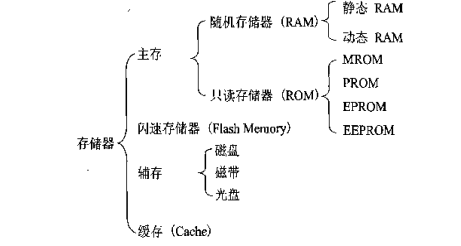
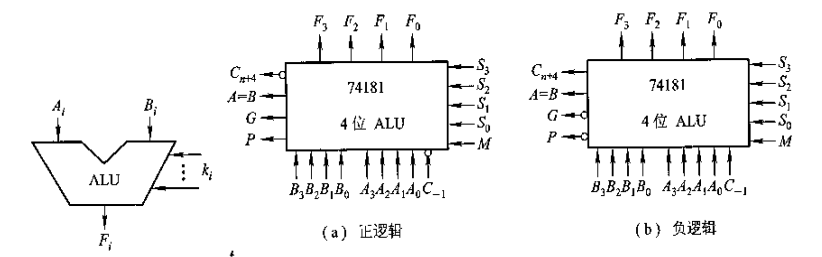
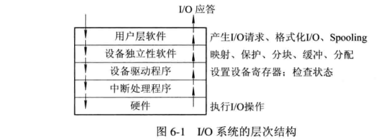
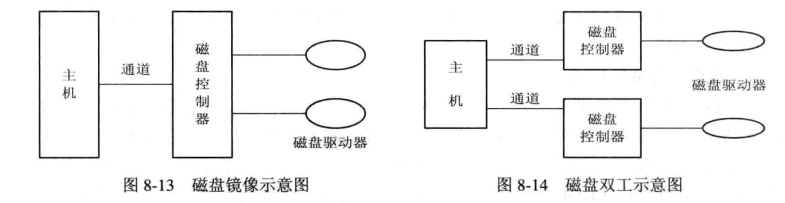

## 1、计算机组成：
这里的计算机知识多数来源与计算机组成原理一书，大致结构和运行这这里，其中详细原理，构成等暂未记录，更详细的知识可查看《计算机体系结构一书》。
### a1、零碎知识：
**计算机体系**：能被程序员所进到的计算机系统属性（指令集、数据类型等），属于概念性的机构。
**计算机组成结构**：计算机内部的，一般不可见的，如机器如何取指令、计算、送结果、一个乘法电路的实现等等。
传统的冯诺依曼计算机结构：输入设备、存储器、运算器、控制器、输出设备。
现代计算机组成：io设备、cpu、主存储器（为了实现按地址访问方式，其内还有两个寄存器MAR[存储数据地址，对应存储单元个数]，和MDR[存储代码，对应位数为存储字长]）。cpu包含算术逻辑单元(ALU)和控制单元CU。`存储容量=主存(存储单元 x 存储字长) + 辅存`。
**机器字长**：cpu一次能处理数据的位数，因此系统分为32和64位之分。列入x86与x64的区别：
(X86就是我们一般用的32位的系统，X64就是64位的系统):
第一，设计初衷不同。64位操作系统的设计初衷是：满足机械设计和分析、三维动画、创作，以及科学计算和高性能计算应用程序等领域中需要大量内存和浮点性能的客户需求。换句简明的话说就是：它们是高科技人员使用本行业特殊软件的运行平台。而32位操作系统是为普通用户设计的。
第二，要求配置不同。64位操作系统只能安装在64位电脑上(CPU必须是64位的)。同时需要安装64位常用软件以发挥64位（x64）的最佳性能。32位操作系统则可以安装在32位(32位CPU)或64位(64位CPU)电脑上。当然，32位操作系统安装在64位电脑上，其硬件恰似“大马拉小车”：64位效能就会大打折扣。
第三，运算速度不同。64位CPU GPRs(General-Purpose Registers，通用寄存器)的数据宽度为64位，64位指令集可以运行64位数据指令，也就是说处理器一次可提取64位数据(只要两个指令，一次提取8个字节的数据)，比32位(需要四个指令,一次提取4个字节的数据)提高了一倍，理论上性能会相应提升1倍。
第四，寻址能力不同。64位处理器的优势还体现在系统对内存的控制上。由于地址使用的是特殊的整数，因此一个ALU（算术逻辑运算器）和寄存器可以处理更大的整数，也就是更大的地址。比如，Windows Vista x64 Edition支持多达128 GB的内存和多达16 TB的虚拟内存，而32位CPU和操作系统最大只可支持4G内存。(64位系统可以装到32位上，当32位的不能装到64位上)。
**位、字节**：换算关系：1byte=8bit=1B,1KB=1024B 。 <i class="green">byte即为字节、bit为位，一个字母或单个数值占1个字节，一个汉字一般占两个字节。</i>传输速率用bit/s或者b/s或者bps。
cpu:中央处理器，电脑运算核心及控制中心，释放电脑指令、处理电脑软件中的数据。推荐使用i5的
cpu为intel酷睿I5 4570
**计算机硬件结构**：硬件系统由中央处理器、存储器、IO系统、连接它们的系统总线。
**单机处理器**：只一个处理器，只有一个cpu。
**多机处理器**：一台计算机装了多个处理器，即多个cpu。多数电脑只有一个cpu。
**多核cpu**：在一枚处理器中集成两个或多个完整的计算引擎(内核)，此时处理器能支持系统总线上的多个处理器，由总线控制器提供所有总线控制信号和命令信号。
### a2、总线：
之前设备部件间使用的是分散连接方式(cpu即连接各种io又连接主存)，导致cpu效率很低，之后出现了总线连接方式，一条总线连接到cpu，其它io设备、主存连接到这条总线(单总线结构)，或者主存有单独一条总线与cpu连接(这样能加快数据的传输，面向cpu的总线结构)、还有在主存连接到cpu，主存连接到io总线的面向存储的双总线结构（这样与io设备想换数据不用经过cpu）。不过同一时刻只能允许一个设备向cpu传输信息，但多个设备可以同时接受线上传来的信息。**总线是在电路板上的**。总线分为系统和片内总线。如下：
- 片内总线：cpu内部连接寄存器、逻辑单元的总线。
- 系统总线：按功能又分为》(1)、数据总线：常见的传输数据的总线，总线的宽度即是可传数据的位数，若总线宽8位要传一个16位的数据，那么cpu取数阶段必须两次访问主存，因此这是衡量电脑性能的一个重要参数。(2)、地址总线：存储各数据、io设备位置的总线，如cpu在取数时还需要将数对应的地址传到数据总线上！。地址总线为20根，则存储单元个数为2^20个。(3)、控制总线：同样连接与各个设备，用于控制设备，保证同一时刻只有一个设备占用总线，有单向的双向的，传输诸如：时钟、io读、中断请求这类信号。
### a3、存储器：
<i class="label1">按使用的介质来分类如下</i>存储器件主要有半导体、磁性、光盘等。
<i class="label2">半导体存储器</i>现代半导体存储器用大规模集成电路制成芯片，优点是体积小、功耗低。缺点：断电时，存储也会消失。半导体按材料又可以分为双极型（TTL，高速）、MOS（制造成本低、高集成、功耗小，较广泛使用）。
<i class="label2">磁表面存储器</i>在金属或塑料载体上涂上一层磁性材料用于存储，工作时随载体一起高速运转，用磁头在上面进行读写，具有不易流失性。根据载体的形状不同，有磁带、磁盘、磁鼓(矩形载体，由于共振磁原因，不能区分0，1因此现在几乎已被弃用)。
<i class="label2">磁芯储器器</i>磁性状态元件，中间有驱动线（通电流）和读出线，可进行读写，但由于功耗大，制作复杂，已几乎被弃用。
<i class="label2">光盘存储器</i>用激光在介质上(磁性材料)上进行读写。可靠性高、互换性好、不易失。如下右图所示，每个磁道存储相同多的二进制位数（内圈密集）。
<i class="label1">按存取方式分类如下</i>
<i class="label2">随机存储器</i>（Random Access Memory，RAM）可以在其存储单元随意存取，计算机主存中也有采用这种存储器，按存储信息原理不同可分为动态存储器（电容充放电原理）、静态存储器（触发器原理）。
<i class="label2">只读存储器</i>（Read Only Memory）写入之后不可随便更改，常用于存储几乎不变化的数据，如系统数据，用于系统固化，是主存的一部分，构成主存的地址域。之后也派生出一些其它的只读存储器，可编程存储器、可擦除可编程存储器、flash memory等。
<i class="label2">串形访问存储器</i>要读取一个数据必须按照其物理地址先后，读取，所以不同存储位置的数据读取时间不一样。如磁带。还有部分串形访问的存储器，如磁盘。
<i class="label1">按在计算机中的作用分类</i>
分为主存储器（cpu与主存直接相连，速度快、容量小）、辅助存储器（主存的后援存储器，存放暂时不用的数据等，容量大、速度慢）、缓冲存储器（用在两个速度不同的部件中间，如cpu与主存之间）。
寄存器与主存的区别：寄存器内的数据可直接参与alu的逻辑运算，寄存器内的地址
                                 
<i class="label1">计算机中存储器的层次结构</i>存储容量越小，速度就越快，位价越高。计算机中各存储**结构排序**：寄存器、缓存、主存、辅存。从左至右，速度逐渐降低，容量逐渐增加、位价逐渐降低。详细解释如下：
- 寄存器：cpu内部，数据直接参与alu的计算，读取速度很快。
- 缓存：由于cpu的读取速度比主存快出许多，cpu直接从主存获取数据，其速度会受限与主存，因此将主存中的数据先缓冲到缓存，然后cpu读取。现今部分计算机将缓存放入cpu内。
- 主存：可以认为主存就是所说的运行内存，cpu将要用到的数据会先存放到主存中，然后逐步移到缓存至寄存器。cpu可直接从寄存器、缓存、主存中读取数据，而且这三种结构的存储由于不长时间存储的特性，所以几乎使用半导体材料制作。
- 辅存：可以认为是电脑的磁盘，硬盘，存储平时不使用的数据。辅存的数据要拿到cpu中进行使用，需要先通过主存。主存-辅存这一次的不断法中出现了一个虚拟存储系统，程序编程中使用的存储地址与这一虚拟存储空间对应，这一虚拟存储空间比主存更大，如果程序中对应的地址不在主存中则需要重新获取。具体内容暂定！！！

存储器的校验：数据存储过程中可能存在差错，为及时发现纠正错误，可将原数据转为汉明编码。
### a4、输入输出系统IO：
io分为3类：人机交互外设（鼠标、键盘等）、信息存储设备（u盘、光盘、磁带等）[所以系统自带的磁盘也是属于io设备]、通信设备（与另一台计算机通过调制解调器）。输入输出系统由io软件和io硬件组成。结构如下：
<i class="label1">IO软件</i>输入输出系统采用接口模块方式时，由io指令和相应管理程序使得io设备和主机协调工作。如果使用通道方式的话，则有IO指令、通道指令、操作系统共同协调。
- **IO指令**：属于cpu指令系统的一部分，格式为》`操作码 | 命令码 | 设备码`，一起构成。实现的功能诸如有：读取io设备输入的数据、将数据写入指定io设备等。
- **通道指令**：对于又通道的io系统专用的一套指令，用于指明传送的数据在主存中的首地址。通道程序由通道指令组成，用来执行io指令，它并不属于cpu操作指令，具有通道结构的计算机中其io指令只负责启停io设备、查询通道、io设备状态、控制通道操作。cpu一旦执行了启动io设备命令后，由通道来代替cpu管理io设备。
- IO设备编址方式：io设备作为外来连接设备需要为其设置地址并存放，这样cpu才能找到其位置进一步操作。有设备插入时，**寻址**：对应端口执行io指令中的设备码，指出该设备设备号。**统一编址**：设备地址也存于主存中，不过划出一块区域存放它们，凡是反问这一区域的都是当作访问io设备，这占用了主存的空间但可以用cpu的io指令操作。**非统一编址**：设备地址与主存分开，不占用主存空间，不过需要针对其写专门的io指令。这些由构建计算机时如何设计。
- **传送方式**：传送数据可以并形传送（如一个6位的数据可以永6根数据线一次性传输这一数据，速度极快）、串形传送（如一个6位的数据，用一根数据线每次传输一位）。一般短距离可以使用并行传送，较远距离考虑成本会使用串型传送。

<i class="label1">IO硬件</i>由io模块、io设备组成。
<i class="label1">IO与主机之间传送信息控制方式</i>io通道，io处理两种，如上。其余三种如下：
- 程序查询方式：cpu要对io读存操作时会先查询io设备状态，若设备状态一直是未就绪，则cpu会一直查询其状态，且期间不执行其它程序。很占cpu资源
- 程序中断方式：cpu直接执行io读取指令，可以与其它程序一起并行，直到io主动发起中断操作，此时cpu会中断操作，之后由继续其它指令。比起程序查询方式，中断方式更多的利用的cpu资源，但这需要io软件程序中写专门的中断程序，硬件中也要增加相应的电路。
- 直接存读取(DMA)：io设备与主存之间直接有总线相连，进行读存操作时，io设备与主存之间直接进行数据传送，不经过cpu，不过期间它们会占据总线，此时cpu退出使用总线，但cpu仍然能计算寄存器、缓存中的数据，比起程序中断方式又更高效的利用的cpu。
### a5、逻辑单元：
计算方式：有符号数，无符号数的表示。加减乘除的运算、码位的转换。
大致运算流程：算术运算转换位逻辑运算，逻辑运算再经过相应电路得到结果，数值的表示都转位0，1表示，1位高电平，0位低电平。
ALU：现如今alu电路已被制成电路芯片，各种型号也有很多，其中74181芯片能完成4位二进制代码的逻辑运算，内又正反逻辑电路，如下图（左一位框架图）：

**计算的运行**：这包括公示计算和一些，指令操作等内容。如要计算一个sinx的值，而计算机本身只提供了加、减、乘、除这类由逻辑门编制的基础运算逻辑，计算sinx则是由这些基础计算方法代替，可写为：`sinx = x-x^3/3! + x^5/5! +...`#分解这每一个步骤，按操作符，数据（两者都用二进制表示）为一组且按顺序存储起来，然后按顺序拿到运算器中计算后存储，直到结束。
### a6、指令系统：
机器自带的能直接运行，能与人类沟通的语言。以一条条指令的形式呈现。一个指令又操作码和地址码组成，形如：操作码 | 地址码。
**操作码**：实现加减，移位等逻辑运算。最大位数与指令数有关：如操作码最大位数为7，指令数 = 2^7。操作码的位数是可以变化的，但这要求更复杂的控制器。
地址码：根据地址码个数有：零、一、二、三、四地址码，如三地址码：`op | a1 | a2 | a3`#这里op表示操作码，a1，a2是要用到的数，a3是下一条指令的地址。`a1(op)a2->a3`。
操作数类型：地址、数字、字符、逻辑数据。
操作类型：数据传送、算术逻辑运算、移位、转移、输入输出、其它。
### a7、cpu：
cpu一般由四部分组成：负责计算的ALU逻辑单元。负责取读指令，掉取数据的控制器cu。负责存储计算中临时使用的程序和数据的寄存器。为了程序运行正常和出错情况进行阻止的中断系统。包括运算器和控制器两大部分，运算器就是上面的ALU逻辑单元。程序进入存储器后，取、分析、执行都交由控制器执行：
- 取指令：能形成指令地址，发出取指令操作，将对应地址指令取到控制器中。
- 分析指令：分析取到的指令的作用，分析参与这次操作的操作数地址。
- 执行指令：分析产生的操作命令和操作数地址，形成控制星号序列，然后对各相关部件执行。

<b class="green">由于寄存器很小，CU,ALU等又只是逻辑控制，所以cpu被制作成一块普通芯片大小。</b>

### a8、其它：
内存条：属于内部存储器，存储速度快，关机时数据消失。
硬盘：属于外部存储器，断电后数据不会消失。
主板：用于连接各个模块，来实现功能。
右键文件属性中即可设置文件为共享。然后选择共享的用户或搜索。
查看共享：win+r弹出的框中输入 \\本机IP地址  回车即可看到共享的文件。
存储器讲解：https://blog.csdn.net/shuaigexiaobo/article/details/80060612
[虚拟内存]虚拟内存是文件数据交叉链接的活动文件。CPU的L1和L2缓存速度最快，内存次之，硬盘再次之，当内存占用过大时可以将指定的硬盘空间当做内存使用。设置：
系统》高级设置》性能》高级》更改：不要勾选第一个选项，然后选自定义，初始化大小是默认的虚拟内存大小。
一款破解版office下载：https://www.anxz.com/down/20474.html
<i class="label1">gpu、显卡、显存</i>显存占用和GPU利用率是两个不一样的东西，显卡是由GPU计算单元和显存等组成的。
显卡：主要用于图形渲染，将数据计算转为可显示的数字或信号，传输到显示屏上，计算速度比cpu快很多。最适合做计算的GPU计算的是GeForce GTX TITAN 和 Tesla K20，参数如下：
显卡类型：有入门级兼容级显卡、低端娱乐显卡、主流性能级显卡、高端多用途显卡和发烧级游戏卡等。主流性能级独显的意思是玩主流游戏大多没有压力，可以流畅应对目前的网络游戏和大部分3D游戏，性价比通常较高。
显存(显存容量)：(暂时存储的图像数据容量)2G，4G,...越大则说明能显示的最大分辨率越高。显存和GPU的关系有点类似于内存和CPU的关系。
<i class="label1">TPU</i>深度学习专用的ASIC芯片，负责处理深度学习计算量最大的推断部分。目标是在保障响应时间的情况下，能够尽可能地提高能效比这个指标，也就是进行同样多数量的推断工作，花费的整体能源要显著低于 CPU 和 GPU。
TPU 并没有设计成一个独立的“CPU“，而是设计成一块像显卡一样，插在主板 PCI-E 接口上的板卡。更进一步地，TPU 甚至没有像我们之前说的现代 GPU 一样，设计成自己有对应的取指令的电路，而是通过 CPU，向 TPU 发送需要执行的指令。不过，这样一个 TPU，其实是第 26 讲里我们提过的 387 浮点数计算芯片，是一个像 FPU（浮点数处理器）的协处理器（Coprocessor）而存在，仅仅用来进行需要的各种运算。
[一个计算机组成原理博客。](https://www.jianshu.com/p/23a926f0409b)
<i class="orange">网络数据传输过程：</i>https://wenku.baidu.com/view/cd306cd276eeaeaad1f330cb.html
**字符集编码**：使用一些计算机可存储的二进制位来表示人类可读的文本等信息，比如用0001代表数字0，这样的编码方式有很多，如ascii，gbk。unicode码：是为了解决传统的字符编码方案的局限而产生的，它为每种语言中的每个字符设定了统一并且唯一的二进制编码，以满足跨语言、跨平台进行文本转换、处理的要求。有utf-8,utf-16,utf-32三种，其中utf-8占用一到四个字节，utf-16占用二或四个字节，utf-32占用四个字节。
**字节码**：字节码（Byte-code）是一种包含执行程序、由一序列 op 代码/数据对组成的二进制文件。字节码是一种中间码，它比机器码更抽象。字节码需要转译为机器码才能运行。
### a8、编程语言的演化：
早期发明计算机之后只能编写二进制代码在机器上运行称为机器语言。
20世纪50年代产生了符号式程序设计语言称之为汇编语言（用户编写汇编语言经过编译转为二进制代码到机器上运行，这个编译/翻译环境称其为虚拟机），但如果是不同的指令系统(如win与LInux)汇编语言对应的语句也会不一样，要在不同系统得到同一小狗，需要编写两份汇编程序。
20世纪60年代出现高级程序设计语言，再通过一个虚拟机将高级程序编译为汇编，汇编编译/翻译为计算机语言。高级语言翻译为机器语言的程序称之为翻译程序，翻译程序分为编译程序(将源程序编译为机器语言在目标机器上运行，源程序不变则不会再编译)，和解释程序（每运行一句就翻译一句，直接翻译为机器语言运行。再次运行程序也会重新翻译）两种。

## 2、操作系统原理：
:::alert-info
简介：操作系统（operator system,os）是在计算机上的一层软件，原计算机只提供了基础功能的实现，用户想在其基础上使用各种功能得编写汇编语言来实现，而os上提供了汇编，支持用户使用高级语言编程，还提供了图形界面，让普通用户也可以轻松使用，当然os不知是因为提供易用性而诞生还有，提高资源管理、系统吞吐量、扩展性、规范性等功能。
:::
### a、操作系统的一些发展：
**单道批处理系统**：20世纪50年代当时的计算机非常昂贵（晶体管实现），为了提高cpu利用率设计了单批道处理系统，先将要执行的所有作业都写入磁盘，然后设计一个监视器，将第一个作业从磁盘写入内存，第一个作业处理完成之后，将控制器交给监视器，监视器将第二个作业写入内存，依次这样执行。但是由于一次作业完成-》io中断-》io就绪-》传输数进内存这段时间cpu几乎是空闲的，依然浪费了不少计算机资源，由于当时的计算机只支持单条程序的运行。
**多道批处理系统**：20世纪60年代IBM公司生产出一台小规模集成电路计算机，IBM360可同时执行多到程序，由此多道批处理系统也产生了，可同时执行多条程序，将数据并列传入，第一个作业空挡期间执行第二个作业的程序，依次如此，cpu就能一直处于繁忙状态。（只有1个alu，控制器的原因？？）
**分时系统**：多用户可共享一台主机，如一个主机连接多台显示屏。处理多道批处理系统中计算机运行作业后，人无法与计算机交互的问题，因此提供了多个终端，且计算机能及时回应用户的操作。因为要满足同一段时间内多个用户的操作都要回应，所以引入时间片概念，每个用户的作业运行一段时间后转为运行下一个用户的。
**实时系统**：相比于普通操作系统，在接收和处理信号能更及时和精准。分类：工业控制系统（工业制造、军事设备控制等）、信息查询系统（天气、火车票查询等）、多媒体系统、嵌入式系统（制作为芯片嵌入到各种设备上实现的智能设备等）。
**微机操作系统**：配置在微型机器上的操作系统简称，1974年出现第一代8位微机操作系统。1981年IBM推出11位，2001年出现windows xp。
### b、基本特性：
**并行与并发**：并行指多道程序在同一时刻运行，并发则是指多道程序在同一时间段内都运行，由于同一时刻计算机只能运行一个程序，所以多道程序一起运行时其实是交替运行的。
**共享**：同一资源供多个设备同时使用，有共用方式、互斥共享方式。
**时分复用**：利用一个服务空闲的时间转去服务另一个服务的这种思想（不止用于服务上）。
**空分复用**：利用存储器的空闲空间来存放和有运行其它程序（如果程序大小超过空闲程序可以使用先运行部分然后替换下一部分运行的方法），以此来提高效率。
**虚拟**：早期用于通讯系统，使用空分复用或时分复用技术，将一条物理线道划分多条逻辑线道。os中同时使用时分复用和空分复用技术实现虚拟。
**进程通信**：当多个进程需要合作完成一个大的任务时，往往需要合作，如计算进程得出结果，打印进程将结果打印。进程的通信由源进程发送消息到目标进程的消息队列，再利用目标进程读取消息队列的功能读出。
**调度**：**作业调度**：用户建立的作业放在一个队列中，选择若干个作业为他们分配资源，建立进程，调入内存，放入就绪队列。**进程调度**：从进程队列中选择一个，将处理机分配给它，使其投入执行。
**内存分配**：计算机需要为每个作业分配内存，静态分配：每个作业装入时确定其使用内存，在该内存内运行。动态分配：作业运行过程中，依然可以动态的申请所需要的内存。
**内存保护**：各作业在自己分配的内存空间运行，不允许访问其它进程的数据。
**地址映射**：每个程序在编译和链接后其可装入程序的地址都是从0开始的，但不能从0的物理地址开始装入，因此程序的逻辑地址与物理地址并不一致，由此产生了地址映射（逻辑地址转换为内存空间中对应的物理地址）。
**os结构**：（1）整体结构：早期编写的操作系统程序较整体，只注重功能的实现，但拓展很差。（2）模块结构：按功能结构将它们划分为块，将操作系统模块化。（3）分层结构：采用模块结构的基础上，将它们分层，每个层有1个或多个软件，一个程序要到达目标，需要经过多个层的校验。易扩展，保证系统正确性，但耗性能，效率较低。
**os内核**：现代os不仅是采用的模块化设计，也采用层次化设计方法，哪些层次较高，紧靠硬件的软件会被常驻内存使用，它们称之为os内核。为防止os中关键数据被有意或无意的破坏，将执行处理器分为用户态（操作受限）和系统态（可运行一切指令）两种。
原语操作：一组操作指令，要么全部执行，要么不执行，执行中不可中断。
### c、进程：
定义：是一组有序的指令集合。进程是进程实体的独立运行过程，是系统进行资源分配和调度的一个独立单位。进程独立运行，os为每个进程配置一个专门的数据结构，进程控制模块（process control block）。撤销进程实际上是撤销进程的pcb。所拥有的状态如下：
- **创建状态**：进程的创建需要向pcb中写入对应的指令集，然后os为它们分配所需的资源，将它们转为就绪状态，插入就绪队列，此时可被调度。而如果由于资源不足，os无法将其装入，此时的进程创建就不算完成，属于创建状态，也无法被调度。这样既方便了资源的管控，也保证了每个运行的进程是完整的。
- **挂起状态**：作用：（1）少数时候，用户想要暂停进程，以观察其对应程序，或配合其它进程。（2）有时操作系统需要挂起一些进程，以便检查其数据资源等。实时系统中，若负荷较重可由os先将一些不重要的进程挂起，保证实时任务的正常运行。（3）有时候父进程需要挂起子进程，以便协调其它子进程协作。因此而引入的一个状态。
- **就绪状态**：已获得资源，获得cpu后可立即运行，放在就绪队列中。引入挂起状态后又分为：活动就绪（被挂起的就绪状态的进程）、静止就绪（用suspend挂起的就绪状态进程，不会再调度）。
- **执行状态**：进程已经获得cpu，处于执行状态。
- **阻塞状态**：执行状态的程序由于io申请、访问的资源已在使用、申请缓存区失败等情况，程序会变为阻塞状态，进入阻塞队列。被挂起的阻塞进程称为活动阻塞，被suspend挂起的称为静止阻塞。
- **终止状态**：程序正常结束应该是等待os善后处理，将pcb清零，pcb空间返还系统。如果程序由于遇到os无法解决的错误，或被os其它进程终止，那么此时的该进程救属于终止状态，并不会被立即清除，其过程中涉及的数据被其它所需进程获取后才会清除该进程。
- **pcb**：记录了进程信息和os所需要的数据，具有间断运行属性，阻塞后保存进程的现场信息，再次运行后可以恢复现场。拥有实现进程通信的区域，和队列指针。
- 进程标识符：外部标识符，用于用户访问控制使用（通常数字和字母组成），内部标识符（通常系统分配的一个唯一序号）。
- 进程的创建：unix中一个进程可以创建另一个进程（层次关系），形成一个进程树（子进程继承父进程的资源，父进程可控制子进程）。而**windows**中进程都是同等的，只有在a进程创建b进程时，a获得令牌，可控制b进程。
- **进程同步**：多个进程相互合作时需要进程同步的实现，如进程a完成一部分后阻塞a，b进入缓冲区读取a写入的数据，然后唤醒a。将这些缓冲区资源称为临界区资源。用软件方法控制进程同步有一定难度，现在多数硬件上有提供相应指令进行进程同步的控制。
### d、线程：
ALS技术的发展，出现了对称多处理机（SMP），由于进程本身太重，切换调度很耗费时空间，因此重新设计了线程，线程包含在进程内，因此它变成了调度分配的基本单位。<b class="red">线程的并发实现与进程的实现类似，使用轮转调度算法，每个线程沦落执行一个时间片段。</b>
- **更小的开销**：线程在进行切换时仅需保留和设置少量寄存器内容，远比进行的消耗低（甚至不需要os内核干预），不过一个进程的线程切到另一个进程的线程时依然会引起进程的切换。
- **更好的并发**：没有线程概念时，一个进程也可以理解为单线程的。一个进程中的多个线程可以并发，且能更好的利用资源。<b class="blue">比如：一个网络服务用于接收客户请求，之前只有一个线程，一次只能处理一个，而多线程情况可同时处理多个用户。</b>
- 拥有少量资源：运行资源依然是分配给进程的，线程只含有一些少量的运行资源，如：控制线程的tcb，保存少量变量、参数的一组寄存器和堆栈。
- 共享：进程的线程可共享进程中的资源。
- 独立性：线程也有独立运行的特性，不过它本是为了同一进程合作产生的，所以独立性比起进程自然差很多，一个线程甚至可以清楚另一个线程。
- **支持多处理机**：进程只能运行在一个处理机上，但它里面的线程可以分配到多个处理机上，所以多处理机几乎都支持了线程。
- **内核支持线程**：内核也使用线程来运行，处于系统态，这类线程的运行，切换内核都会参与。！！该类线程切换比用户态线程开销大。
- **用户线程**：用户态的线程，切换、创建、撤销都无需内核的参与，即内核完全不知道用户线程存在。
- 两种类型线程的组合：部分os系统将两者组合使用，提供UTL/KST线程。这是用户及线程通过时分多路复用内核支持线程实现的。有一对一、一对多、多对一。

### e、调度与死锁：
**调度**：实质是系统资源的分配，分配算法对各资源进行分配。一个作业从创建，获得资源，到运行结束可能要经过多层调度。调度层次如下：
1. 低级调度：对进程的调度，决定进程队列中那个进程得到处理机。多道批处理、分时、实时os中都设有该调度。
2. 中级调度：将那些暂时不能运行的进程先调至外存放置，提高内存利用率和系统吞吐量。等那些进程有运行条件，且内存有空间时再由中级调度决定是否将它们调入内存，并更改状态为就绪状态。
3. 高级调度：(长程/作业调度)主要用于调度作业，将放在外存的作业为它们创建进程，分配资源、调入内存，放进就绪队列。主要用于多道批处理系统中，分时和实时系统不设高级调度。
4. 作业：作业是比程序更为广泛的概念，作业中包括使用的程序，数据和作业说明书，指定了os应该怎样控制程序。调度作业过程包括编译作业步、链接装配作业步和运行作业步。批处理系统中一般以作业为基本单位调入。<b class="violet">作业是用户给计算机的任务，是调度的对象，而进程，线程是用于调度的方法。</b>
5. 作业控制块：JCB，用于控制作业的一个数据结构，内容包含：作业所属用户名、作业标识、作业状态、调度信息、作业使用情况等。每个作业进入系统时，作业注册程序为它们分配jcb

<i class="label3">调度算法</i>
1. FCFS：先来先优先规则，最简单的调度算法。
2. SJF：短作业优先原则。
3. PSA：优先级调度算法。等待时间越长，作业的优先级约高，越早进行调度。
4. HRRN：（HIghest Response Ratio Next）高响应比优先调度算法。`优先权 = (等待时间 + 要求服务时间) / 要求服务时间`。
5. RR：**轮转调度法**，使用FCFS将进程队列排序，将cpu分给首进程，然后按照时间片大小轮流运行每个进程。
- 时间片大小的选择：过小的时间片会导致频繁切换进程上下文，也会造成不小的消耗，但过大的时间片会出现部分进程任务少但运行时间较长的情况。一般选择一个略大于一次典型的交互时间。
- 进程切换时机：虽然给定了时间片，但存在部分进程未等到时间片完就早已结束的情况，这时应该直接结束该时间片，切换进程，并启动一个新的时间片。
6. 多队列调度算法：以上调度算法都是只能在一个处理机上运行，且只有一个进程队列，而为了不同用户对调度策略的要求，和更好的适合多处理机，多队列调度算法更加适合，它将进程分成多个进程队列，可以对每个队列使用不同的调度算法，且可以为每个处理机都分配一个进程队列，如果一个进程里面有多线程，可以控制它们都在一个处理机上执行。
7. 多级反馈队列：
8. 基于公平原则的调度算法：

**死锁**：一个典型的场景是扫描仪c1，光盘刻录机c2，进程p1，p2都要使用扫描c1将信息用c2刻录下来，p1请求到了c1，p2请求到了c2，双方都希望对方把资源让出来，但双方都没有收到对方的让步会**一直变为阻塞**，因此两者一直僵持，形成死锁。<b class="gray">竞争可抢占资源也可能会引起死锁：如3个进程间需要互相接受和发送通信时，如果三个进程都开始是接受状态，那么直接死锁。</b>
- 可重用资源：可供用户多次使用，不过只允许一个进程使用，不能共享，且使用需要是：请求资源、使用资源、释放资源的步骤。
- 可消耗资源：临时性资源，一般由进程自己创建消耗，运行结束后也不归还资源类，如进程通信使用的资源。
- 可抢占资源：进程使用资源中可以被其它进程抢占使用的资源，如cpu、主存，可抢占资源不会引起死锁。
- 不可抢占资源：一旦被一个进程使用就会等到其释放才能再次使用。如打印机、光盘刻录、扫描等。

<i class="label3">处理死锁</i>
- 预防死锁：用规则去限制四个条件中的一个，较容易，已被广泛使用。相应的两种协议：
>**第一种协议**：规定所有进程在运行前必须请求所有需要使用的资源，只要有一种未请求到都不允许该进程运行。（这回造成资源浪费）
>**第二种协议**：是第一种的改进，它允许进程在获得初期需要的资源后即可运行，但在后期请求新资源时必须先释放掉自己已获得的且已不再使用的资源。
- 避免死锁：在资源动态分配过程中，避免资源进入某种不安全状态。
- 检测死锁：通过运行检测机构，及时将进程从死锁中解脱出来。
- 解决死锁：已经发生死锁，os通过撤销进程所属线程，为它们分配一些资源，使它们挣脱死锁。

### f、存储相关：
磁盘缓存：磁盘与主存间的读写速度也相差很大。与高速缓存类似，也是存储磁盘到主存常用的数据，不过磁盘缓存其实并不是一个独立的部分，它是利用主存的一部分来存储的。
**程序的装入**：编译程序对程序进行编译、形成若干个目标模块，由链接程序将编译后形成的块及所需函数库链接在一起，形成一个完整的装入模块，装入内存。
- 绝对装入：在一个很小的os系统中，完全可以知道运行的程序存放的地址，编译完成后将所有地址转为绝对地址。（程序中使用的数据地址一般是符号地址，因为如果使用绝对地址，内存中数据一旦修改或删除，就得重写所有地址）
- 可重定位装入：单道程序可使用绝对装入方法，但多道程序运行时，并不能得知程序编译后的模块存放地址，而重定位装入可以将它们放到合适的位置。
- 动态运行时装入：可重定位装入方式在程序编译后确定了绝对地址，不能再变化，但实际情况中由于程序存在于进程，而进程涉及到切入切出，这时它们的绝对地址将不再可用。而动态装入是程序编译后并不将逻辑地址转为绝对地址，而是在程序真正运行时才转换地址。为使转换地址不影响命令的执行，需要一个重定位寄存器的支持。
- 静态链接：装入前就建立所有连接。编译后的各模块有自己原始的地址，主入口模块默认地址为0，需要使用相对地址来连接它们。比如：a导入b，b导入c，那么a逻辑地址为0，b为0+L，c为L+M。然后将每个模块所用的外部调用符也换为相对地址。
- 装入时动态连接：在装入时，如果要导入指定模块，再去修改模块的链接地址，便于实现对布标模块的共享，便于修改和更新。
- **动态运行时连接**：如果按照以上两种链接方法，在程序选择性情况导入模块时，它会将所有模块都导入，但可能有些模块是整个运行中都不会用到的。这显然是低效的。而动态运行时链接会等到程序运行时，如果发现需要的模块未导入才会让os去寻找，然后链接装入。
**虚拟存储器**：一个很大的程序会将其部分装入内存运行，运行过程中若发现缺少，则将需要的部分再调入内存，若内存已满，会将被堵塞的进程先换出。让用户感觉到程序运行流畅，似乎真实内存比可见内存大得多的感觉。这是一种内存管理方式，运行速度接近内存。
<i class="label1">连续分配存储管理方式</i>这里是为程序分配内存时相关的方式。得将程序装入连续的分区中。！**会形成许多碎片**（一个分区内未装满的部分）。
- 单一连续分配：早期单程序时的分配方式，当时是将内存分为系统区和用户区，用户运行一个程序会让其独占所有用户区的内存。
- 固定分区分配：多道程序出现时，需要为每个程序分配内存，将用户分区划分为多个分区，然后将每个程序分到一个分区实现多程序运行。（当然分区也有一些方法，而且涉及到一些分配算法）。

<i class="label1">离散分配存储管理方式</i>连续分配上的改进，将各程序可以装入不相邻的分区中（os会为每个进程在创建一个页表，页面号对于内存块号）。不过最后一页也常不能装满，因此也形成了业内碎片。
- **分页存储管理**：将程序按地址空间分为若干页，将内存分为若干块，块与页大小相同。
- **分段存储**：将程序按地址空间，划分为若干大小不同的段。每个段的信息相对完整。
- **段页存储**：以上两者的结合，使用较为广泛。

**对换**：如果一个进程占用大量的内存，但由于某个原因阻塞了，而其它进程又因为内存不足无法运行，这是极其糟糕的事，所以有了对换，可以**将阻塞的进程先切换到外存等待**。相应的有一些置换算法进行具体的对换选择。
- 拥有对换的os系统会将磁盘分为对换区和文件区两种，当然文件区占大部分。
- 最佳置换算法：它所选取的页面将是最长时间不再访问的页面，但这是未知的，不过它可以用来衡量其它算法。
- 先进先出页面置换算法：选取在内存中最久的页面。

<i class="label2">页面缓冲算法PBA</i>
- 空闲页面链表：一个空闲的空间块链表，用于服务常发生缺页额进程，这些进程进行页面换出时，实际并未换出内存，而是存储到该空闲链表的最后一个物理块中，而且是有数据存在的页面，当再次使用它是便不再需要繁复的磁盘io操作。
- 修改页链表：与空闲页链表一样，也是一个物理块构成的链表。为了减少修改页换出的频率，当一个进程将已修改的页面换出时，并不会将其立刻换出内存，而是将其所在物理块挂到修改页链表的末尾，减少频繁的换出。

**抖动**：当os中存在的进程数很多时，使用上面的分页式虚拟存储方法就会产生频繁置换的现象，称之为抖动。
工作集：为了防止抖动而产生的概念，如果能够提取预知进程一段时间内需要访问的页面，将这些页面先导入到内存，就能减少进程缺页，减少抖动。称这段时间的页面为工作集。不过还是无法预知进程哪个时刻会访问哪个页面，只能像置换算法那样根据进程过去一段时间的行为来预测。
预防抖动：局部置换策略、引入工作集算法、选择暂停的进程、L=S准则调节。p172
### g、输入输出系统：
**I/O软件层次结构**：
1. 用户层i/o软件：用户可直接调用与i/o操作相关的函数进行操作设备。
2. 设备驱动程序：实现系统对设备发出的操作指令，驱动i/o设备工作。与硬件直接相关。
3. 设备独立性软件：用户程序与设备驱动的统一接口。
4. 中断处理程序。

块设备：数据读取和存储都以块的方式来传输，这种方式更快，如磁盘。
字符设备：传输的数据都是以字符为单位的，传输效率低，如打印机。
设备控制器：可控制多个I/O设备，控制cpu与I/O的数据交换。基本功能如下：
接收和识别命令、数据交换、地址识别、标识和报告设备状态、数据缓冲区、差错控制。
磁盘的访问：磁盘由磁头读写其数据，工作时一般是磁盘旋转到指定扇区，磁头开始从指定位置在磁盘上读写。所以有如下访问时间：
- 寻道时间：磁头移动到指定磁道上所经历的时间。
- 旋转延迟时间：扇区移动到磁头下所使用的时间，不同磁盘类型费时不一致。
- 传输时间：磁头在磁道上进行读写的时间。

**磁盘调度算法**：为了能较少进程对磁盘频繁的调度资源，也需要在这里使用调度算法。
- 先来先服务：公平且简单的算法。
- 最短寻道时间：要求访问的磁道与当前所在磁头位置最近，使得寻道时间最短，不过不能保证平均寻道时间最短。
- 扫描算法SCAN：基于优先级调度算法改进的，进程优先级调度算法中，优先级低的进程会出现饥饿现象，而SCAN不仅考虑要访问的磁道离当前磁道的距离，还考虑到磁头移动方向，它们优先移动到距离最近且是最外层的磁道，当最外层没有要访问的磁道时在移至内一侧的磁道。从内向外也是如此。
- 循环扫描CSCAN：SCAN中如果该圈磁道都读取完毕，但此时又有新的进程访问该圈的磁道，那么SCAN会先让其等待，**等到磁头到最内圈完结时，再从内向外扫描**。这会导致极端情况，该进程会等待很长时间。CSCAN规定磁头单向移动，由外向内读完时，**磁头立刻移到最外圈读取**，这样就能保证最长等待时间只有一个循环的时间。

### h、文件系统：
文件系统也是一个内部服务，他提供给用户一个程序接口，可用该接口操作文件。
文件名：不同的os系统对文件名的要求可能会不一样，早期的某些os限制文件名不超过8字符，14字符等。
扩展名：用于协助用户分辨文件类型的后缀名，一般1-4个字符长度。
1. **文件类型**：按不同的属性有不同的分发。
>按用途分：系统文件(用户可调用，其它没有任何权限)、用户文件、库文件(用户可调用，但不可修改)。
>按数据形式分：源文件（源程序和数据组成，通常由终端或输入设备输入的源程序和数据组成。常为ASCII和汉字）、目标文件（源文件经过编译程序编译，但未经过连接程序链接，后缀名为obj）、可执行文件：经过编译和链接的可直接运行文件，windows上后缀名为.exe。

2. **文件结构**：分为逻辑结构（可显示出来的，用户可见的文件的存放结构）和物理结构（具体存放到磁盘上的组织结构）。而逻辑结构可分为结构文件和非结构文件。
>结构文件：每个记录用于描述实体集中的一个实体，按记录长度可分为定长（文件中所有记录长度相同，每个记录有相同的顺序和记录，这种利于检索和排序，常用于数据处理）和不定长（每个记录的长度不相同，不利于检索，广泛用于商业领域）。
>无结构文件：系统中运行的源程序、可执行文件、库函数等都是无结构的，即流式文件。文件长度以字节为单位，根据指针来指出其下一个字符位置。

3. **顺序文件**：逻辑结构中，最常见的一种。
串结构：串结构文件中的记录是按时间进行排序的，其排序与关键字无关，对其记录进行检索时都要从头开始，知道找到对应的记录，因此检索很差。
顺序结构：可由用户指定一个关键字进行排序，查找速度很快。
文件目录：一种数据结构，为便于管理文件而引入的。作用：按文件名存取、提供对目录的额检索速度、文件共享、允许文件重名。
文件控制块(FCB)：控制文件存取的一个数据结构。包含文件基本信息类、控制信息类、使用信息类。   
4. **树形目录结构**：当代os中普遍使用的结构，每个文件或目录只能有一个父目录，数据文件称为树叶，其它目录称为树的节点。
>路径名：每个文件有一个唯一的路径位置，从根目录起，每个节点用/隔开。
>当前目录：如果进程每次访问文件都要从根目录开始访问的话会很低效，而且多数时候都只是使用局部文件，所以为每个进程设置一个工作目录，所有操作基于该目录进行。
 >**文件查找**：线性检索法：单级目录中根据用户给的文件名，直接与每一个相比。树形目录中，按照给的路径，每个目录匹配相应名称，再逐级进入查找。hash查找法：建立一张hash文件索引目录，然后将用户给的文件名转化为索引值，进行查找，很高效。但是使用模式匹配的方法还得使用线性检索才能支持。
5. **文件共享**：一台计算机是可以多用户的，如果不使用文件共享，那么同一个文件多个用户要使用会需要复制多份，显然非常浪费资源。之后的文件共享不仅局限于单机的文件共享，而且发展到多机、计算机网络的共享。
>用有向无循环图实现共享：树形目录下的某个目录只能有一个父目录，但要实现共享意味着有多个用户可操作，即有多个父目录，这两者是相冲突的。有向无环图的方法将在多个用户访问一个文件时，将该文件链接到多个用户的父目录中，不过如果共享文件中添加新的内容则不能被共享。
>利用索引节点：使用文件物理地址、文件属性等信息，文件目录中只设置文件名，及指向相应索引节点的指针。
>利用符号链接：允许一个文件或目录有多个父目录，但只有一个是主父目录，其它几个父目录用符号链接。

6. **文件保护**：计算机中多少会保存比较重要的数据，造成数据安全的有人为因素、系统因素、自然因素。
>保护措施：存取控制机制防止人为因素。系统容错技术防止系统因素。建立后备系统，防止自然因素。
>访问权：一个进程对某个对象进行执行的权利。
>保护域：进程对一组对象的访问权的集合。
>访问矩阵：行是域，列是访问对象，交叉处表示，该域内该对象可进行操作的权限。

### i、磁盘存储器的管理：
<i class="label3">存储管理部分</i>
- **连续组织方式**：在磁盘上为每个文件分配一个连续的物理空间，它们的物理地址是连续的。采用连续组织方式时，将记录顺序地存储到各物理盘中，这样形成的物理文件称为顺序文件，磁头在进行读取时不需要移动。这种方式存储的文件顺序访问快，但**缺点**是：连续的存储会导致外部碎片。必须先事先知道文件的大小才能进行一些操作（然而多数时候只能靠预估）这导致浪费很多空间。不能灵活的删除和插入记录。
- **链式组织方式**：记录可以随意的存储到盘上，只需要前一个磁盘上添加指向下一个盘块的指针即可。插入与删除，动态扩展都很方便。不过只适合顺序访问，对于随机访问则低效。
>隐式链接：文件目录的每个目录项中都必须有指向第一个文件盘块和最后一个文件盘块的指针。（随机读取一个文件项时需要找到第一个盘块，然后顺序查找，所以低效）
>显示链接：在内存中存放一张链表来存放每一个盘块号和指向下一个文件的指针。（每个FCB有文件的第一个盘块位置，以此查找文件）整个磁盘的都存在这张表中，因为在内存，所以检索时速度快，也省了频繁的读取磁盘。

- FAT技术：磁盘、u盘上常见到的文件系统类型。微软一直在其系统中使用的技术。
>早期的FAT12：以盘块为基本存储单位，每个分区中存放着两张FAT表，每个表项是下一个盘块号，用于做链接指针。一个物理磁盘能支持四个逻辑磁盘分区。簇：增加盘块的容量并不灵活，因此引入了簇的概念。簇是一组相邻的扇区，FAT中它是一个虚拟扇区，进行盘块分配时使用簇为基本单位分配。
>FAT32：FAT16上的改进，也是FAT系列的最后一个版本。磁盘容量的增加，簇的数量也会增加，为减少簇内零，需要拓宽FAT表宽度。
- NTFS：专门为windows NT开发的文件系统。优点：使用64位磁盘地址，支持更长的文件名，有系统容错功能。

空闲表法：os在磁盘存储文件时，为各空闲分区建立空闲表（包括空闲区的第一个盘块号等信息），然后需要在磁盘空间中查找空闲表，寻找能存放目标文件的连续的磁盘空间。
空闲链表法：将所有空闲盘区拉成一条链，根据链中所用基本元素不同可分成：空闲盘块链（所有空闲区以盘块为基本单位，每个盘块有指向后继盘块的位置）、空闲盘区链（空闲的盘区连成的链，一个盘区有多个盘块组成，每个盘区上有下一个盘区的指针）。
**廉价磁盘冗余阵列**：磁盘io的速度是影响计算机速度的一个重要因素，采用量变达到质变的思想对此依然有效。利用一台磁盘阵列控制器来管理多台磁盘驱动器，形成一个大型磁盘系统，增加了io读取速度，和可靠性。**并行交叉存取**：使用于大、中型机中，将每一个磁盘数据分为若干个子盘数据，每一个子盘的数据**存储到各盘的相同位置上**，读取数据时采用并行传输，各盘块相同位置数据同时传输，大大减少了时间。
<i class="label3">增强可靠性技术</i>
**第一级容错技术**：防止一些自然和人为造成的数据丢失。
- 备份：准备两份的文件目录和FAT表，其中一份损坏时，使用另一份也依然可以保证读存数据。
- 热修复：磁盘上空出一块区域用于存放放置在指定盘块时有问题，用该部分区域来做一个记录，并存放下来。
- 写后校验：吸入磁盘的数据同时写入到缓冲区，然后两份数据，如果一致，则认为写入成功。

**第二级容错技术**：用于防止磁盘控制器，磁盘驱动器出错时的问题解决。
- 磁盘镜像：在磁盘控制器下再加一个磁盘驱动器，写入主磁盘的数据同样写入另一个磁盘驱动器对应的磁盘中，当主磁盘及相应磁盘驱动器损坏时使用该备份。
- 磁盘双工：如果是os到磁盘控制器部分出错，磁盘镜像将不能解决问题，不过实现与镜像一样，再添加一个磁盘控制器连接到主机上，并且保证两份数据一致。


基于集群技术的容错：由多个计算机互连组成的一个统一的计算机系统，让人感觉仍然是一台机器。
1. 双机热备份模式：平时主服务器运行，副服务器监视主服务器的运行，主服务器出现问题副服务器会立刻接代，修复后的服务器又作为副服务器。两台服务器使用一条镜像链路，且使用高速通信信道相连。
2. 双机互为备份模式：两台服务器，每台负责不同的功能，它们互相接受对方发来的备份数据（所以建议每台使用两个硬盘，一个装载应用程序，一个接收备份数据）。
3. 公用磁盘模式：多台计算机使用公共的一个磁盘系统，该磁盘被分为若干个卷，每台计算机使用一个卷，其中一个计算机损坏之后，整个系统使用调度算法进行重新分配，新的机器获得该卷的所有权。<b class="blue">减少了数据的复制，节省了大量时间。</b>

<i class="label3">数据一致性控制</i>
要依据一整个流程来修改多个文件的数据，但要避免修改到一半而发生系统崩溃或其它原因导致修改结束而提出的技术。
- 事务：一系列相关读写操作，修改各个数据项的一个程序单位。修改过程中其它程序访问到的是未修改的数据，事物修改完结后才可提交，若中途发生中断则需要进行退回操作，这与之前的原子操作有相同的特性。
- 恢复算法：事务记录会被存储到存储器中，利用事务记录表来修复故障可以避免一些数据的损失。事务中会保存undo（修改前的记录）和redo（修改后的记录，若中途退出则不会有该记录）两个记录，恢复算法去事务记录中查找即有undo又有redo记录的，将redo的修改后的数据设为新值。而只有undo记录的将其数据作为新值。
- 检查点：由于系统时常记录事务，如果等到发生故障再去执行恢复，到时可能会已经有很多事务非常耗时，所以系统每隔一段时间就将内存中的事务表中的记录放到稳定存储器中去，且事务修改后的数据，检查点放到稳定存储中去，然后执行一次恢复操作，并清除一些之前的事务记录。
- 并发控制：因为事务是原子性操作，多用户系统中需要等一个用户对该文件执行的事务结束后其它用户才能访问，所以引入共享锁和互斥锁处理（执行事务时获得互斥锁锁定）。

### j、保护和安全：
实现环境安全的主要目标和威胁：
1. 数据机密性：数据为保密状态，仅允许授权用户进行查看。攻击者可能进行假冒或伪装来进入系统。
2. 数据完整性：包括数据本身信息的准确性和其来源的正确性。需要防止被篡改甚至伪造。
3. 系统可用性：保证系统正常运行，正常用户的请求都会得到响应和提供服务。需要防止被损坏软硬件，修改正常用户信息变为非发用户等让计算机拒绝服务的攻击。

**数据加密**：使用密码学的加密算法对数据进行加密，即使数据被得到也无法被使用。一些加密方法如下：
- **易位加密**：基本的简单加密方法之一，任意指定一个密钥：MEGABUCK，然后将明文please...按如下顺序排列，按密文中字母的前后位置确定列号，然后按该列好顺序逐列读出，得到密文，密文长度与明文长度一致，所以解密时可以知道最后一个字符在矩阵中的位置，而解除明文。

- **置换法**：通过将明文的字母替换为其它字母而得到，abcd...xyz对应一个打乱顺序的26个字母组成的密文(不重复)，然后将明文对应位置换为密文即可，26个字母组成的密文很多，看似很安全，不过由于自然语言统计规律（英语中单词有很多常见组合）导致其安全性一般。
- **对称加密算法**：加密算法与解密算法之间有一定联系，知道了加密密钥之后能较轻松的推出解密密钥。该类算法代表有DES。
- **非对称加密算法**：将明文A使用加密算法E和加密密钥Ke加密得到密文B，另一端用解密算法D和解密密钥Kd解密出密文，Ke和Kd，E和D几乎没有联系，由Ke推出Kd几乎不可能，所以加密密钥可以直接公开，称为公钥。常用非对称加密算法有：RSA，DSA，ECDSA。

**数字签名**：金融，商业等场景中很多时候需要在协议上签名，盖章，传统方法是使用纸质。使用电子的签名方式高效且节省纸张，不过要保证电子签名的可靠性需要满足：接受者能够核实发送者发送的报文的正确性。发送者不能事后抵赖。接收者不能伪造。
- 简单数字签名：保证以上几点要求的一种简单签名方法》发送者A使用私钥ks加密密文p，接收者使用A的公钥Km解密得到密文。（私钥只有A知道，所以A不能抵赖，B也无法伪造）。
- 保密数字签名：在简单数字签名的基础上多加了两层加解密(A，B双方都有一对公私钥)。A用自己的私钥对密文加密得到Dp，再用B的公钥加密Dp得到Dq，然后发送给B，B先用自己的私钥解密得到Qa，再用A的公钥解密得到Qb。
- **数字证明书**：由于公钥的持有者是否为合法持有者是可怀疑的，所以一般将公钥给一个公开的可信任机构，该机构为该公钥发放一个公钥证明书。其它人在请求获取公钥时，该机构会给一份数字证明书，供他们使用。如下是一个保密签名申请数字证明书的流程：
>A向机构CA请求获取公钥Ka（A需要提供自己的身份信息）。
>CA向A发送**Ka和一份数字证明书**（这两样都用CA的私钥Sc加密的，用Mp代替）。
>A向B发送报文信息，将明文p用自己的私钥Sa加密得到Ma，和Mp一起发给B。
>B请求CA的公钥Kb。B用Kb解密Mp得到Ka，并确定数字证明书的有效性。
>B用得到的Ka解密A发来的密文Ma得到密文。

**基于物理标志验证**：平时使用的银行卡，公交卡等内部多是使用磁条存储已有的身份信息等数据，可以存储一些身份标识的东西来作为门禁之类的验证。不过它可以用磁卡读写器读出，然后再写到另一张磁卡中，由此伪造身份。所以用磁卡做为身份验证时还会增设口令。
基于ic卡验证：ic卡可装入cpu和存储芯片，还可以使用加密算法对数据进行加密，ic卡有以下3类：（1）存储器卡：只有一个可编程只读存储器卡，没有装入微处理器芯片，智能靠终端，所以一般。（2）微处理器卡：有微处理器和存储芯片，支持加密，用途广泛。（3）密码卡：有加密运算和RAM，具有更高的安全性。
**生物识别验证技术**：利用生物的一些唯一性的标志且不易伪造的特点来作为验证，有指纹、声音、眼纹、人脸。
早期常用攻击方式：
- 窃取尚未清除的有用信息：进程结束后可能还会有些有用的信息没有回收，攻击者会尝试请求大量内存来获取它们。
- 搅乱系统：通过非法的调用，用参等搅乱系统的运行。
- 使os自己封杀校验口令程序：一些os中输入口令时一直按delete或backspace，使得系统不再校验口令。
- 尝试操作手册上许多没有的操作，尝试破坏系统。
- 在os中添加陷阱门，使得可以绕过口令检查直接进入系统。
- 骗取口令：假装成某个用户，让系统管理员帮忙找回密码，甚至进行贿赂。

<i class="label1">内部攻击</i>
恶意软件：独立运行类》可通过os直接调度执行，蠕虫、僵尸等。寄生类》逻辑炸弹、特洛伊木马等。
- 逻辑炸弹：早期某公司程序员为防止被解雇，在os中放入了一个破坏程序，每天输入一个指定指令后并不会发作，若哪天中断，则该程序会进行随机删除文件等破坏性行为。一般设置的满足爆炸的条件：时间、触发事件、计数器。
- **陷阱门**：程序员进行开发时往往会为便于调试，在开发过程中写一些一键跳过验证的后门，因为多数产品是迭代的，所以不会删除，被恶意者发现会利用其绕过口令。
- 特洛伊木马：寄生于正常应用程序内，可以继承这个程序的标识，因此能获得该程序同样的权限，所以它能在合法情况下进行非法操作，如修改文件权限，读写属性等，之后容易让这些资源受到其它攻击。例如：系统操作员使用了寄有特洛伊的正常软件，因为该操作员是有很高的权限，所以特洛伊就能对口令文件进行复制，传到骇客的电脑。
- 欺骗登录：与web安全中的点击劫持一样，绘制一个假的与系统登录界面一样的图像，然用户输入账号，密码，然后获取到密码后关闭该界面，打开真正的登录界面，用户可能会以为电脑突发的异常，或密码输入错误之类的不会有过多怀疑。
- **缓冲区溢出**：c语言的编译存在某些漏洞，如编写时指定某数组长度为1000，但编译时并不会检测其实际长度，所以即使是1200长度的数组也能正常编译，攻击者们可以利用这个漏洞进行攻击，如程序A想获取一个文件名，保存下来以便后续调用，os为A分配一个大小为1000的缓冲区，但如果用户提供的文件名操作该大小就会发生缓冲区溢出，超出的部分会覆盖其它区域，之后一般再执行3条指令后就会系统崩溃。

<i class="label1">外部攻击</i>
1. 病毒：一段计算机程序，能够自我复制，感染其它程序和系统，然后这些程序和系统又不断传播。隐蔽性：病毒设计者为了逃避反病毒软件的查杀，一般将自己伪装成正常应用程序、隐藏在正常应用程序中或程序不太访问的地方，自身不断的改变状态。
>文件型病毒：一般从可执行文件的后端装入，放到程序的末端，然后改变文件头中的起始地址为病毒的始端，这样就感染了那些程序。
>常用伪装办法：感染文件后会使原有执行文件长度变长，所以感染后压缩文件使其变小，病毒程序中得包含压缩和解压缩程序。修改文件的修改时间。
>隐藏手段：隐藏于注册表和目录、隐藏于程序业内零头（程序是被分页装入的，最后一页往往有剩余空间，病毒将自己添加到此，且不会改变页长）。更改坏扇区列表：将病毒藏于一个扇区内，然后修改坏扇区列表中将该扇区修改为坏的可以躲过病毒查杀。
2. 蠕虫：也能进行自我复制，但它是一个独立的运行程序，且感染性较弱，主要是在os内发现os的缺陷或其它程序的漏洞进行攻击。蠕虫借助邮件等网络传输工具进行传播，将自己的副本带到远程计算机上，然后两台计算机就能进行连接，如此循环传播。
3. 移动代码：一个程序在运行时能够在不同机器之间来回迁移就称为移动代码，如网页中的小应用程序，浏览器使用沙盒技术对它们进行控制，限制它们只使用沙盒内的数据。另一则是采用解释执行，这样在运行一句代码时解释器都能进行检查，所以js被设计为解释运行。

基于病毒数据库的病毒检测：将各种病毒收录于数据库中，病毒软件查杀时针对那些可执行文件，有疑虑的文件，模糊查询的方法搜索病毒。
安全核心数据库：存放访问控制模型和信息控制流模型。
**信息流控制**：将文件分等级（内部、秘密级、机密、绝密），用户也分为同种级别的4个等级，信息流动时遵循两条规则：不能上读（密级k层中运行的进程只能访问同等和小于其级别的文件）、不能下写（密级k层中的可以写入更高级别的文件，但不能写入同级且更下级的文件中）。
访问监视器：TCB中的一个重要组成部分，进程进行数据访问时，访问监视器会调用安全核心数据库中的两个控制模型进行检验（不允许任何程序更改核心数据库相关的信息），这样系统的安全性变得很高，不高却变得低效，所以现在的os系统一般不会使用访问监视器。
**设计安全操作系统原则**：
- 微内核原则：内核简单则不容易出错，将机制放于内核内，策略放于内核外，内核向外只提供一个接口。
- 策略与机制分离原则：<b class="green">(策略是方法，而机制是具体的去实施，这里可理解为软件是策略，硬件是机制)。</b>策略是规定系统要达到的一个目标，而机制是完成特定策略的办法，由一组专门的软件或硬件实施。
- 部分硬件实现原则：用软件实施的功能容易被绕过攻击，而硬件实现的功能则安全得多，不过经济负担较大。
- 安全入口原则：安全内核往往提供多个接口服务于各项功能，如果只提供一个安全接口，所有往来信息都要检测，那安全性就能极大提高。
- 分离原则：（1）物理分离：安全要求较高的任务是要专门的电脑完成。（2）时间分离：让各进程在不同时间运行。（3）密码分离：加密密钥与解密密钥分开保管。（4）逻辑分离：安全内核与其它部分的硬件和软件分开。
- 分层设计原则：硬件、安全内核、os、用户。
## 3、windows知识：
### a、常用cmd命令：
SndVol // 打开音量调节
control // 打开控制面板
calc // 打开计算器。mstsc//打开远程连接
shutdown -f // 重启服务;-i//显示GUI界面;-l//注销
shutdown -s // 关机;-t 60//延迟60s关机;-r//重启计算机
net view ip //ip是计算机地址(知道ip地址查看其计算机名)，可能会被拒绝
ipconfig //查看本机ip，(第一个无线局域网适配器项)
ipconfig/all    //查看该局域网内所有在线等电脑
devmgmt.msc// 打开设备管理器
// cmd命令开启防火墙中可被访问的端口号
netsh firewall add portopening protocol = UDP port = 80 name = wcs
net stop mpssvc // 关闭防火墙
net start mpssvc // 开启防火墙
where python //查看相应的安装路径
time // 输入回车后可更改系统时间
systeminfo //查看电脑一些信息
netsh winsock reset //重置网络，重启后生效
net user //查看本机所有用户名   echo %username% //查看当前使用的用户
nvcc -V //查看cuda版本
services.mc //打开服务列表，windows update...项为系统更新。
https://www.cnblogs.com/accumulater/p/7110811.html
**文件目录相关命令**：
cd G:/web,cd..，dir //进入文件目录、反回上一级、查看当前目录下所有目录及文件
打开指定目录界面：explorer D:\DATA_FILE
删除文件夹：del package    #显示目录结构：tree
**查看mac/物理地址**：ipconfig/all    #显示物理地址的那行。
**查看系统型号**：win+r弹框中输入directx看到的系统型号即是电脑型号，或者鲁大师、电脑管家中的硬件检测工具中也会显示。
### b、windows常见问题：
1. 有时常用的正常的网络会出现网速慢、无法连接等的问题这可以尝试打开设备管理器>网络适配器这下面是连接的网络点属性>高级,修改一下里面的值可能网速就会变得正常。连接不上网的话可以试试卸载该网的驱动再点检测硬件安装试试。
2. 网络连接处显示红叉，但是重新插入便携式路由器后也无反应，不一定是路由器出问题、试试重启
3. 右下角电脑图标显示正常但是连不上网，可以尝试cmd:netsh winsock reset  //重置网络然后重启。
4. 复制文件导u盘提示文件过大问题：u盘文件系统有NTFS，exfat等，NTFS文件限制大小为2T，其它限制在4G以下，手动格式化里选NTFS点确定，但会格式化优盘。【不格式化情况下修改文件系统cmd命令： convert h:fs/ntfs   //将u盘位置h转换为ntfs文件系统。
5. 桌面图标整齐排列]桌面空白右键》查看》
6. 安装cuda图像驱动程序时提示：此图形驱动程序无法找到兼容的图像硬件。https://www.iteye.com/blog/yuanlanxiaup-1330287
7. **磁盘分区**：一个盘分为多个盘=》win+r/输入diskmgmt.msc/选择c盘/右键/压缩卷
8. **笔记本电脑触摸板失灵问题**：设备管理器》鼠标和其它设备，正常情况下有一个mouse touch...类的设备，右键检测，看看是否有提示，若没有可以用驱动精灵检测驱动试试，若提示主板驱动异常，或触摸板驱动异常，安装后重启应该就能解决该问题。
9. **win10的wifi列表没有搜索到wifi列表**：尝试一下几种方法：
1、更改适配器选项(网络连接)》右键禁用wlan，再右键启用。
2、设备管理器/网络适配器/wln项网卡驱动/右键禁用，然后再启用。
3、设备管理器/网络适配器/wln项网卡驱动/右键诊断，按照诊断的去做（比如拔掉所有电源线、鼠标线，关机2分钟后重启）。
4、如果网络适配器下的网卡驱动有黄色感叹号，说明驱动有问题，这种情况不要去尝试卸载驱动。尝试从其他电脑下载驱动。还是失败可尝试恢复系统
10. 无法访问个别网站情况：[参考地址。](https://blog.csdn.net/qintaiwu/article/details/73129791)
### c、windows系统安装：
可本地一键ghost安装，也可以制作启动盘安装。
### d、windows安装centos双系统：****
先制作一个centos的启动盘。在windows上用分区助手从windows中选择一些空间，然后删除这些空间的分区(删除分区后表示该硬盘空间不再属于windows)，然后重启进入bios界面选择u盘启动，开始安装centos，选择安装位置时选择最上面那个，总容量：546G，剩余空间：164G那个即可(不是固定大小哈)，其它正常安装即可。
安装了双系统之后，两个系统的性能会受到部分影响。如果没有用系统切换工具的话，每次要进入bios来切换进入系统。
双系统切换，win+r，输入msconfig，引导设置。
**快捷键提升操作速度**：
切换已经打开的软件：window+table,ctrl+o打开文件夹，win+D直接切换到桌面
浏览器中：
ctrl+table切换页面,ctrl+n新开窗口,ctrl+L选中地址栏,ctrl+p打印当前页
### e、虚拟机：
[vmware下载地址{选择user &项下面的Pro结尾的下载，里面有windows和linux版本}](https://my.vmware.com/cn/web/vmware/downloads)。[vmware各版本集或密钥。](https://m.zdfans.com/html/23250.html)
创建系统时选择镜像文件时会检查该镜像文件，不可用则会有提示。
**linux上安装虚拟机**：sudo  chmod  +x VMware-...x86_64.bundle。然后：sudo  ./VMware...x86_64.bundle
安装好并激活后点击新建虚拟机。新建完成后可能会报intel VT-X被禁用的问题： 若是win7的话重启电脑开机时一直按Del键，进入到bios(basic input output system基本输入输出系统标准固件接口)界面，点击高级项或security项(主板不同可能不一样)点击intel 虚拟化技术点击开启。
新建虚拟机时设置的用户名密码即是系统安装好后的默认用户名，密码。
创建好后点击编辑为虚拟机安装系统，使用下载好的ios文件，并且点击开启时连接选项。这样进入后会有系统安装界面，再安装即可。 安装过程可能会一直处在命令行界面，过程较慢，一直等待即可，安装好后输入密码登录进入即可。若忘记密码则重启，在读条时一直按住e即可进入修改。
**vm-tools安装**：在开启虚拟机内部安装的系统时，点击虚拟机上方第四个功能》点击install vmware tools。开机后如果虚拟机内安装的系统是windows则打开电脑，在磁盘旁会显示一个tools的驱动器，点击安装。如果是linux系统，该tools驱动会出现在桌面上，点击安装即可。
本机与虚拟机的共享：先安装vm-tools。安装完成后宿主机和虚拟机系统间可以直接复制粘贴操作。在虚拟机系统处于关闭状态：右键虚拟机系统>设置>选项>启用共享功能>添加主机中的指定路径。安装vmware-tools灰色问题：https://www.cnblogs.com/TM0831/p/11788018.html
不能连接网络问题：https://www.cnblogs.com/ustca/p/11729312.html。[vmware激活许可证。](https://www.52pojie.cn/thread-804891-1-1.html)
ubuntu 64位系统安装：https://ubuntu.com/download/desktop
## 3、linux系统的使用：
<i class="red">unix，linux，windows系统综述：</i>UNIX系统大多是与硬件配套的，也就是说，大多数UNIX系统如AIX、HP-UX等是无法安装在 x86 服务器和个人计算机上的。Linux是一套免费使用和自由传播的类Unix操作系统，是一个基于POSIX和UNIX的多用户、多任务、支持多线程和多CPU的操作系统。它能运行主要的UNIX工具软件、应用程序和网络协议。它支持32位和64位硬件。Linux继承了Unix以网络为核心的设计思想，是一个性能稳定的多用户网络操作系统。以上是专业的解释，简单说Linux是一个免费的操作系统，其也是非常的好的支持服务器环境，且其不太适合图形化操作更适合命令行操作。windows系统除了win7,8,10外还有windows server系列，这些服务器版本的windows和普通windows版本的不同在于其是根据服务器需求进行开发的，如支持更大的内存、支持一些服务器的策略设置、支持服务器集群等，这些功能都是针对服务器的功能，总之windows server版本就是一个适合服务器的操作系统版本，其功能大多都是针对服务器的。
<i class="orange">服务器系统的选择：</i>一般服务器系统只会是linux系统和windows server系统中选择，对于不同的服务，如web网站、数据库等会选择不同的系统。
### a、linux的安装(非虚拟机上的安装)：
安装前需要先在准备一个u盘做启动盘(会格式化该u盘)，下载好想安装的ubuntu或其它版本iso文件(不要放到u盘)，然后使用usbWrite，rufus等工具制作启动盘<span class="gray">(这种是直接将映像文件写入u盘的方式，工具比较小，另一种是先制作启动盘然后将映像文件拷贝进去的方法，如果是ghost文件则只需要直接拷贝，若只是普通iso文件则还要下载其它引导安装的文件比较复杂，这适合windows系列的安装)</span>；
接下来进入bios界面使用u盘来启动电脑<span class="gray">boot项选择add boot option然后第一个输入框写名，第二项选择u盘中的efi文件夹下的合适的efi文件，然后点击下方的create，保存重启后选择刚才的那个boot option进入安装</span>。win10的u盘启动选项可以在：设置>系统更新>疑难问题部分下面选择。
- 如果安装界面分辨率不对的话，说明该iso没有带显卡驱动，建议下载那种附带很多工具、库的iso文件。
- centos7中的gnome，kde两种是对用户较为友好的。初始体验会较差，可以在设置中设置主题、外观、字体等优化体验。

### b、linux命令：
因为版本众多可能部分命令在不同版本中会不可用，特别是ubuntu，其自改的部分较多。
linux命令包下载网(搜索包名，对应的description中有下载地址)：https://pkgs.org
Ubuntu不再持rpm命令，因为它是debian的变种, 其软件以deb包或者源文件的形式出现。
命令行窗口：ctrl+alt+t
命令行操作：打开终端默认是在root位置(~表示)，即打开files(ubuntu系统左侧)的Home位置。且部分命令与windows的cmd命令一致。
ls  #查看当前文件夹下的所有一级文件夹及文件。
ls –l命令来显示一个文件的属性以及文件所属的用户和组。
mkdir #用于创建一个文件夹。sudo mkdir /java  #使用sudo能生成隐式文件夹。
cd #进入文件夹。pwd：显示目前的目录。rmdir：删除一个空的目录。rm: 移除文件或目录
/sbin/ifconfig   #第一项中的地址即是本机地址。(文件中看不到的文件夹进入时前加 /)
sudo su  #切换到root身份运行命令
ufw disable  #关闭防火墙，需要以root身份运行。ufw enable #开启防火墙
cp: 复制文件或目录。cp a.txt ~/file   #将a.txt文件复制到根目录的file文件夹下。若拷贝文件夹则要加上-r参数：cp -r a /opt/b
cp software/* ~/abs  #*表示将software下所有的文件复制到abs中*。
mv 移动文件与目录，或修改文件与目录的名称
sudo mv a.txt /java  #使用sudo开头能将文件移到到隐藏的根目录文件下。
tar -zxvf qq.tar.gz  #解压gz压缩包
vi a.txt  #使用vim编辑器打开文件，不过内容是显示在终端。
**查找文件**`sudo find / -name npm `#find命令查找指定目录和名的命令，/表示在根目录查找，/usr则表示在/usr这个目录下查找。
**删除和新建**`rmdir pckname` #删除文件夹。rm file #删除文件 mkdir pckname #新建文件夹。touch filename #新建文件
[重启]sudo reboot
[更形内核]sudo apt-get install --install-recommends linux-generic-hwe-18.04 #在遇到一些问题时可以试试这个。
**修改主机名**：终端里@后的名字是主机名。使用命令：sudo gedit /etc/hostname 后会打开该文件，里面只有一个主机名，修改它，保存，重启后生效。
**调整分辨率**：xrandr(显示所有可用分辨率)，xrandr -s 1920x1080 #更改分辨率，一般是第一个。
**图形显示文件夹**：`nautilus conf  `#nautilus命令打开conf文件夹所在位置，用另一个窗口显示出来。sudo nautilus  file#以root身份打开。

[编程相关]linux系统是为编程而生的，发行版本会自带几乎所有编程语言，多数会有多个编程版本。
**下载命令**：wget http://xxx.com/download #用wget命令从指定下载链接下载。下载后一般在/etc/apt/preferences.d/路径下。
[安装vim编辑器]sudo apt install vim #安装后可在终端用vim file编辑文件。i：插入操作。:w #保存。:wq #保存并退出。[详细使用](https://blog.csdn.net/weixin_38208741/article/details/78862368)
[查看和更改文件编码]file dm.yml #显示文件编码。转换：  iconv -f  文件编码格式  -t 想要转换的编码格式  要编码的文件名 -o 编码之后的文件名。-l #列出已知编码字符集。 -c :忽略输出的非法字符 -s :禁止警告信息，但不是错误信息。 --verbose :显示进度信息。
**截图**：prtsc(右上角)：截取整个屏幕，shift+prtsc #松开后用鼠标划好区域截图。
**修改文件权限命令**：
`chmod -R 777 software` #将software文件夹权限全开。`chmod -R jay:fefjay /my` # 加-R，修改文件所属用户为jay，所属用户组为fefjay
`chmod +x file.sh`  #赋予file.sh文件可作为程序执行的权限。之后用 ./file.sh直接运行文件。<i class="blue">如果权限不够就在前面加上sudo(chmod前和运行./前)</i>
#### b1、yum包管理与centos类型系统：
**清理缓存数据**：`yum clean`。**移除包**：yum remove npm
**清理缓存**：`dnf clean packages`
<i class="label2">yum install时提示下载元数据失败问题</i>可能是网络问题，可以多运行几次试试，若一直提示失败可以看看这个方法。[repo 'base' 下载元数据失败解决地址。](http://www.linuxidc.net/thread-9716-1-1.html)
**更新yum安装源**：https://www.jb51.net/os/RedHat/499587.html
#### b2、apt包管理与ubuntu类型系统：
**清理缓存**：`sudo apt autoremove`
**ubuntu上安装deb格式的包**：先要将其转为rpm格式的包，[deb包转为rpm包教程。](https://blog.csdn.net/cpongo3/article/details/96425227)`sudo dpkg software.deb ` #解包，设置，安装software.deb。
**安装工具**：`sudo apt-get install tool `#安装tool工具，安装工具时都使用该命令。部分工具可能无法安装，可能是已被废弃，可以使用upgrade更新apt-get后再。
**报依赖错误使用**：`sudo apt-get -f --fix-missing install`，然后再试。
**rpm包安装**：`rpm -i soft.rpm `#-i制定安装的包。需要验证的包可以：`rpm -ivh google.rpm`安装。
**rpm安装包时解决依赖问题**：在安装命令后加`--nodeps --force`。[rpm命令参数详解。](https://blog.csdn.net/ywl470812087/article/details/90140026)
[make的使用学习地址。](https://blog.csdn.net/professorman/article/details/81428113)
### c、系统问题集：
<i class="label2">查看系统状态</i>系统自带top命令可查看，或安装htop。sudo apt-get install htop。然后htop即可查看漂亮的显示界面,Mem是运行内存,swp是交换分区。[htop所有参数使用](https://blog.csdn.net/Dly_978812854/article/details/102223731)
<i class="label2">软件卸载</i>bian和ubuntu：dpkg --list #查看安装的所有包名。sudo apt-get --purge remove pckname  #--purge是可选参数，表示卸载相关配置，pckname是指定包名。centos：rpm -q -a #查看安装的所有软件及工具，`rpm -qa|grep anaconda*` #|grep是筛选操作，anaconda*表示卸载所有anaconda相关的软件包。
<i class="label2">进入TUI界面、grub节目、开机终端</i>登陆界面按ctrl+alt+f1可进入文本用户节目TUi。开机出现电脑图标时同时按esc和e键，然后选择第一个ubuntu...按enter进入然后按一下esc键就能进入有ubuntu、ubuntu高级选项、system setup。选择第二个进入后输入安全密码(之前没设在则不会有)，进入到tui界面选择boot按两次回车会在下方出现终端。
<i class="orange">环境变量查看与设置：</i><span class="violet">查看</span>：使用env或export或$PATH。<em class="violet">修改：</em>分为两种设置：
<span class="blue">终端中修改，当前终端中管用，之后会失效 </span>。<span class="blue">在当前用户下修改.bashrc文件，/etc/profile中修改能用于所有用户</span>，PATH中加入变量路径即可(Anaconda配置的python环境变量修改后，还需要在pip文件中第一行的路径修改)。[地址](https://blog.csdn.net/weixin_42185136/article/details/90768178)
\>python  #进入python2版本。>python3 #使用python3版本。ctrl+z退出python程序。
<i class="label2">网络连接问题</i>刚安装好系统由于没有驱动或部分包缺失导致无法上网，但要上网又必须先下载一些包安装，可以用这两种方式先联网》<em class="violet">usb网络共享：</em>将数据线连接手机和电脑，然后手机网络共享设置中开启usb共享，电脑上点右上角的连接。<em class="violet">蓝牙网络共享：</em>手机、电脑都开启蓝牙，然后配对连接，手机上网络共享设置中开启蓝牙网络共享，然后电脑右上角点击连接。如果这两种方法都失败可能是缺少蓝牙驱动之类的，剩下只能下载好驱动再u盘传到电脑进行安装了。
<i class="label3">无线网卡驱动下载</i>使用命令ifconfig -a #若列表中出现wlan0(类是的无线网卡)、enp2s0(有线网卡)、wlp5s0f4u2(类似的是便携路由的网卡)、benps0(类是的是蓝牙、usb开启的网卡)。如果出现对应项则说明相应的驱动已经安装，不然可能只会出现lo一项。linux上的驱动安装比较麻烦，很难找到下载地址。
[从启动盘中安装。](https://www.jianshu.com/p/83322b4ed22b)    [从官网下载。](https://www.cnblogs.com/RichardYao/p/9900207.html)
https://www.runoob.com/linux/linux-system-boot.html
<i class="label3">有线网连接</i>sudo vim /etc/sysconfig/network-scripts #然后添加以下几行(存在则修改)
```
IPADDR=192.168.0.253 # IPV4地址
NETMASK=255.255.255.0
GATEWAY=192.168.0.1 # 网关
#sudo vim /etc/resolv.conf #这里是打开另一个文件
nameserver 8.8.8.8
nameserver 114.114.114.114
#然后service network restart，如果还是不能连接就在设置》网络中点添加，不填写地址，mac地址选一个试试。
```
<i class="label2">使用sudo报错sudo:/etc/sudoers 可被任何人写 解决方案</i>sudoers的权限被改了，改回来就好了。pkexec chmod 0440 /etc/sudoers
<i class="label2">无法识别ntfs类型u盘问题</i>从：https://tuxera.com/opensource/ntfs-3g_ntfsprogs-2017.3.23.tgz 下载然后解压，进入目录执行：#./configure #make #make install 然后用命令`mount -t ntfs-3g /dev/sdb1 /home/wcs/usb`挂载u盘，只是每次开机都要这么做。
<i class="label2">没有中文输入问题</i>设置》language》添加汉语。若还是不行则：`sudo yum install ibus-libpinyin` 然后 `ibus restart` 然后再打开语言设置点添加应该会出现》
汉语(智能拼音)选项。
<i class="label2">ubuntu为到登陆界面就黑屏问题</i>刚安装好系统时没有显卡驱动，开机进入系统时容易黑屏，在3个选项那个界面，第一个按e进入编辑，将ro改为rw，在quit splish后加上nomodeset(因为没有安装显卡驱动只能调用集显)然后按F10保存并重启，进入系统后打开/etc/default/grub修改相应位置。如果是已经安装了驱动造成黑屏可以将nomodeset改为acpi_osi=linux试试<em class="green">显卡驱动未清理干净又安装先的显卡驱动造成的依赖错误也会导致开机黑屏</em>，此时卸载和安装驱动都会报依赖错误，使用以下命令解除指定显卡的所有依赖：
<i class="orange">LC_MESSAGES=C dpkg-divert --list '*nvidia-440*' | sed -nre 's/^diversion of (.*) to .*/\1/p' | xargs -rd'\n' -n1 -- sudo dpkg-divert --remove</i> #报(错误可用 \(\)
解除依赖后再`sudo apt --fix-broken install`然后按造提示sudo apt autoremove卸调不用的软件包。<span class="green">所有驱动软件包放在/var/cache/apt/archives/</span>。
<i class="label2">安装驱动时出现libglx-... 解包到 ...上 ... 处理归档 /var/cache/apt/arch...64.deb 时出错： 正试图覆盖 /usr/lib...direct.so.0，它同时被包含于软件包 nvi...</i>使用如下命令：
`sudo dpkg -i --force-overwrite 报错那个驱动包位置路径`，#这条命令是忽略上面出现的错误。然后sudo dkpg -i /var/...(驱动包路径) #安装，然后`sudo apt-get install -f` #排查软件包之间是否有问题。没有则重启(每次安装驱动后重启才能生效)。[linux系统驱动的安装，及相关命令。](https://blog.csdn.net/wf19930209/article/details/81877822)
<i class="label2">用命令来连接wifi</i>tui界面进入的终端也能用，的先确保已经安装了wifi驱动，`sudo service network-manager start`#先打开网络管理。`nmcli dev status`#显示所有本地网卡(红色那个是可用的，记住它的名字)。`nmcli dev wifi`#查看所有可用wifi。`nmcli d wifi connect "xsww" password "7578129qq" wlx30...(刚才看到的红色网卡名) `#连接wifi
<i class="label2">循环登陆问题</i>卸载调安装的nvidia显卡驱动：sudo apt remove nvidia-* 然后 sudo apt autoremove。<em class="green">调用集显进入出现likdm: error...问题，按照上面提示的路径，将文件报错的那一行alias ...删掉。</em>(可能是安装显卡驱动的时候使用了命令来忽略一些错误)。
<i class="label2">登陆进入图形界面后键盘鼠标失灵问题</i>`sudo apt install xserver-xorg-input-all`#相关的包在升级过程中被删了，需要重新安装。
<i class="label2">linux 自带命令制作启动盘</i>下载映像文件iso，插入u盘，使用命令df查看可用的u盘，插入的u盘被挂载到/dev/路径下，根据u盘名字和存储大小判断自己的u盘，然后使用命令：
 `sudo dd if=/home/.../debian...iso of=/dev/sda1` #if后面是映像文件所在位置，of后是u盘位置。<em class="orange">用命令移动东西到u盘</em>：`mount /dev/sda1 /home/wcs/usb` #先用命令将u盘挂载到一个空目录下，然后正常操作即可，umount /home/wcs/usb #卸载。
 <i class="label3">不能格式化u盘的问题</i>如果u盘插入能读但没有创建和删除权限，那么可能就不能直接格式化该u盘，使用gparted(一个分区工具且能各种操作u盘)来格式化：
```
//centos下安装
sudo yum install epel-release
sudo yum install gparted
//安装完成后直接输入gparted启动。
```
启动后会打开图形界面，右上角选择u盘，然后右键格式化为想要的u盘类型(ntfs是windows常用类型)。然后菜单栏点击勾(应用)。
 <i class="label1">gnome，kde桌面不能使用中文输入法的为问题</i>左下角搜索：im-chooser，选择出现的输入法选择，然后关闭，右下角会出现，再点击详细设置。
### d、linux nvidia显卡驱动的正确安装：
linux自带的是nouveau驱动比起nvidia驱动会差很多，而且使用cuda来调用gpu计算也需要指明的使用nvidia驱动，但是在linux上安装nvidia显卡驱动很坑，而且ubuntu和centos的稍有不同，安装步骤如下：
1、先查看自己电脑的显卡信息：lspci | grep VGA #第一行中的[nm1:nm2]冒号前的序号是商家代号，后半部分是pcid。(至今不知道怎么看，以后学习！)
2、去nvidia官网下载相应驱动：本台电脑选择Geforce系列、型号选Gforce GTX 16 series，如果是笔记本电脑选后面带(Notebook)的<span class="green">ubuntu中有软件更新项和命令直接安装，但不推荐，这很可能造成开机循环登陆情况</span>。[下载地址。](https://www.nvidia.cn/Download/index.aspx?lang=cn)
3、安装依赖：yum -y install gcc gcc-c++ wget#分别用yum安装gcc,gcc-c++,wget。不过多数情况是已经装好的。
4、安装nvidia检测工具：`rpm --importhttps://www.elrepo.org/RPM-GPG-KEY-elrepo.org`#导入key。`rpm -Uvhhttp://www.elrepo.org/elrepo-release-7.0-2.el7.elrepo.noarch.rpm`
#安装elrepo源。`yuminstall nvidia-detect`。nvidia-detect-v #会显示推荐的版本，不过不安装这个版本也是可以的。
5、禁用nouveau驱动：如果不禁用nouveau驱动在安装时会报错，而且也容易造成开机循环登陆情况， /etc/modprobe.d/blacklist.conf中禁用nouveau驱动，添加blacklist nouveau 和options nouveau modeset=0。若没有该文件可使用命令：`echo -e "blacklist nouveau\noptions nouveau modeset=0" > /etc/modprobe.d/blacklist.conf`生成，生成的是已经禁止了nouveau的。然后如果是ubuntu的话用sudo update-initramfs -u#更新一下，如果是centos的话使用命令：` mv/boot/initramfs-$(uname -r).img /boot/initramfs-$(uname -r).img.bak`#当前文件夹下备份一下镜象。` dracut/boot/initramfs-$(uname -r).img $(uname -r)`#生成一个新的境像文件(若要恢复的话，删除该镜像然后将备份的名字还原即可，然后blacklist.conf中注释调禁用的命令再重启即可)。然后用命令退出图形界面，使用纯文本模式(或开机时不登陆，ctrl+alt+f2进入纯文本界面)，重启。
6、安装驱动及过程中遇到的问题：lsmod | grep nouveau #查看是否已经禁用了nouveau驱动，禁用的话不会输出任何信息。chmod +x NVIDIA-...run #为文件赋予运行权限。./NVIDIA-L...run -no-opengl-files #最后一个命令是不安装opengl文件，安装了会造成开机循环登陆问题(<span class="green">安装前先关闭bios界面的securate boot选项</span>)。
<em class="violet">开头提示cant build kernel则可能是要求的一些包没有安装，可以看其结束时提示的日志文件位置查看解决办法。</em>提示安装完成后nvidia-smi查看显卡信息。<em class="red">nvidia-settings运行提示cant to init server情况且开机无法进入登陆界面(尝试这些办法)：</em>重启bios节目开启securate boot选项，选择内核启动界面e进编辑模式将ro改为rw然后F10进入。进入/etc/X11修改nvidia-xconfig.conf文件，环境变量中加入该文件位置。
7、成功进入图形界面，nvidia-settings仍然报错，但报错情况与之前不同，cuda运行示例显示成功。
 [centos的nvidia显卡驱动安装。](https://blog.csdn.net/qq_44906416/article/details/89281325)
 [nvidia驱动下载地址及各选项选择介绍。](https://jingyan.baidu.com/article/19020a0a6f8f44529d2842af.html)
 <i class="label1">centos纯文本模式和图形模型切换</i>`systemctl set-default multi-user.target`#纯文本模式。`systemctl set-default graphical.target `#图形模式。两种模式均在重启后生效。
### e、linux远程桌面：
yum install rdesktop #安装远程桌面工具。`rdesktop -g 1440x900 -r disk:wcs=/home/wcs -u Administrator 182.61.151.139`#-g控制远程桌面的窗口大小，全屏可使用-f然后去掉后面的分辨率大小。-r可以控制携带本地资源链接，wcs是为资源命名，后面接着想携带的本地资源路径，-u后面接目标电脑用户名，最后接着电脑ip。可以连接window系统。


linux熄屏无法唤醒问题：https://www.cnblogs.com/wly716/p/10957710.html
ubuntu目录结构及作用：https://blog.csdn.net/liajie/article/details/78616200
boostnet下载：https://github.com/BoostIO/boost-releases/releases/tag/v0.14.0
### f、linux重装为windows：
linux要重装系统只能用启动盘或光驱，不像windows那样能从本地启动安装程序，linux自带的制作启动盘的命令不会写入mbr引导，所以多数bios界面检测不到启动盘，不过linux上也有制作windows启动盘的软件：weousb。 [woeusb下载地址，下方有各linux版本下载地址(centos选第一个)](https://github.com/slacka/WoeUSB)。点进页面之后直接点下方任一个版本即可下载，下载下来的是rpm包，用：`rpm -ivh WoeUSB-3.33.0-1.fc29.x86_64.rpm`#安装woeusb。
`sudo fdisk -l `#列出所有的可用分区，u盘一般是sda1,sdb1等，但使用的是其上方显示的Disk后对应的sda和sdb等。
先要先卸载u盘后再使用woeusb，不然界面检测不到u盘，命令也会报错busy。命令制作：`woeusb --device 'win10.iso' /dev/sda --tgt-fs NTFS`#--tgt-fs后是转换为指定的文件系统，注意：FAT和NTFS都是windows可识别的模式，但在bios界面似乎知识别FAT的，所以建议转换为FAT格式。垃圾华硕。
[安装windows参考学习地址。](https://blog.csdn.net/qq_45440355/article/details/103179459)

### g、linux系统目录结构：
linux都是用文件目录来显示，包括设备。它定义了各个目录的功能，根目录下得一级目录具体如下：
/root：与系统的开机有关。
/bin：放置一些系统常用的指令，如mv,ls,yum等。
/boot：这里存放的是启动Linux时使用的一些核心文件，包括一些连接文件、Linux内核文件，以及镜像文件。
/dev：放置一些可用的设备，包括、usb设备、打印设备等都以文件形式显示。
/etc：这个目录用来存放所有的系统管理所需要的配置文件和子目录。如网卡的配置。
/home：用户的主目录，在Linux中，每个用户都有一个自己的目录，一般该目录名是以用户的账号命名的。
/media：linux 系统会自动识别一些设备，例如耳机、音响、光驱等等，当识别后，linux会把识别的设备挂载到这个目录下。
/mnt：我们可以将光驱，usb等挂载在/mnt/上，然后进入该目录就可以查看光驱里的内容了。
/opt：第三方协议软件存放位置。
/usr：软件的安装，软件的配置放在这个目录。
[目录结构详细内容学习地址。](https://blog.csdn.net/yup1212/article/details/82152106)

## 4、计算机网络：
:::alert-info
**网络**：有电信网络(提供电话、电报及传真等服务)、有线电视网络(提供电视节目)、计算机网络(提供信息、文件各种文件在计算机之间传送)。当然这三种网络可以合为一体，当然这其中牵涉到很大的商业利益，行政之类的问题。Internet中文译名有因特网和互联网，后者是使用更广泛的名字。互联网是一系列节点的链接可以互相通信，每个节点可以是计算机、路由器、交换机、集线器等。
:::
### a、概述：
**发展**：第一阶段：由几台计算机连接，无论使用什么协议都互相可以通信。第二阶段：3级网络，分主干网、地区网、校园网，之后许多商业公司加入进来，政府将主干网让给企业控制。第三阶段：多层次isp（网络服务提供者，internet service provide）结构互联网，大ISP们建造通信网络设施，小isp们向他们购买ip，有了ip之后可以连接到网络。之后20世纪90年代欧洲原子核研究组织CERN开发万维网www，得到推广，很大的方便了非网络专员对网络的使用，推动了互联网的迅速发展。
中国于1994年连如互联网，在网站`http://www.cnnic.cn`可查看中国互联网发展情况，一年两次更新。

按范围分类：（1）广域网：覆盖几十~几千公里的范围，一个国家甚至跨国。（2）城域网：5~50km，通常覆盖一个城市。（3）局域网：学校、企业之类的单位使用。(4)、个人区域网：自己家的设备连接到同一个网络上就能形成一个个人区域网。
带宽：计算机网络中用来表示传输数据的能力，单位时间内网络中某信道所通过的最高数据率。
发送时延：主机或路由器发送数据帧所需时间，数据帧长度(bit) / 发送速率(bit/s)。
传播时延：电磁波在信道中传播的时间，信道长度 / 电磁波传输速率。
处理时延：主机或路由器在收到分组时要花费时间处理（如分析分组首部、分组中获取数据等）。
排队时延：分组很多时它们需要排队等待主机或路由器的处理。
**网关**：又称网间连接器、协议转换器。网关在网络层以上实现网络互连，是复杂的网络互连设备，仅用于两个高层协议不同的网络互连。网关既可以用于广域网互连，也可以用于局域网互连。 网关是一种充当转换重任的计算机系统或设备。使用在不同的通信协议、数据格式或语言，甚至体系结构完全不同的两种系统之间，网关是一个翻译器。<b c=gn>由于历史的原因，许多有关TCP/IP的文献曾经把网络层使用的路由器称为网关，在今天很多局域网采用都是路由来接入网络，**因此通常指的网关就是路由器的IP**！网关实质上是一个网络通向其他网络的IP地址</b>。
**传输协议**：计算机之间的通信比较复杂（知道对方是否可连接、知道对方的是否可接收、数据格式是否符合、出错处理等等）。最早的国际传输标准为OSI，不过由于协议复杂、低效、重复因此废弃，而市面上流行使用TCP/IP协议，所以它成为了实际上的标准。OSI体系结构：物理层、数据链路层、网络层、运输层、会话层、表示层、应用层。TCP/IP体系结构：网络接口层、网络ip层、运输层、应用层（**实际使用的体系结构**）。折中使用的五层协议体系结构（介绍网络原理使用的）：物理层、数据链路层、网络层、运输层、应用层。<b class="gray">发送数据时发送方数据是从应用层流到物理层发送出去，接收方是从物理层接收，数据逐层到应用层。</b>

1. 物理层：物理层上传送的数据单位为bit，数据都是0,1，物理层决定使用多大的电压，电缆插头以多少引角连接，接受数据等，而使用的物理媒体（电缆线、双绞线等）在物理层之下。
一个传输示例：主机1的进程a1向主机2的进程a2发送信息，a1将信息交给5层(应用层)，数据向下传递，每层添加自己的控制信息，<b class="green">到第2层控制信息被分为两部分，分别被加到该层数据单元的首部和尾部。到物理层由于是bit流传输，所以不加控制信息。</b>数据流经过物理媒体到达路由器，从路由器1层到3层，进行相应操作每层剥去一层控制，将数据上送到上一层，到第3层时会去掉读取头部，获取目的地地址，**然后到路由表中查找转发分组接口**，然后吓到第2层，加上新的头部和尾部，到1层再传输去目标计算机。到达目标机器后再从1层升至5层，然后交给a2.
2. 链路层：数据的传输是在一段段链路上传送的！将网络层交下来的ip数据报组装成帧（帧中包含数据和控制信息）。接收数据时接收到一个帧将数据解析出来上交给网络层。
3. 网络层：（网际层/ip层）为不同计算机提供通信服务。发送数据时将运输层产生的数据封装成组或包进行传送，另一个作用是选择合适的路由，使得能找到目标主机。
4. 运输层：向主机进程之间的通信提供通用（多个网络应用可共用）的数据传输服务，应用进程利用该服务传送应用层报文。
5. 应用层：最高层，应用进程间的交互完成特定网络应用，对不同的网络应用需要不同的应用层协议，如域名系统的DNS，支持万维网的http，支持邮寄的SMTP，用户层交互的数据单元称为报文。

- 实体：表示任何可接收发送信息的软件或硬件进程。
- 协议：控制两个或多个对等实体进行通信的规则的集合。
- 服务：在协议的作用下使得两个实体在本层的通信上可以为上一层提供一个服务，所以协议是水平的（该层的通信控制），而服务是垂直的。
- 服务访问点：两层进行交互的地方称为SAP（service access point）。


### b、物理层：
数据通信基础知识：通信专业知识，数据发送通过源站点(发送bit流)->发送器(常用调制解调器[进行编码]，多内置于计算机)->传输系统->调制解调器->目标站点。
- 模拟线号：连续的线号，代表消息的参数取值是连续的。
- 数字线号：离散得线号，消息的参数取值是离散得。
- 单向通信：单工通信，只有一个方向的通信（发送/接收），如电视、广播等媒体。
- 双向交替通信：**半双工**。可以双方互相发送信息，但不能同时发送。一方向另一方发送信息，另一方接收，过一段时间后又反过来。
- 双向同时通信：**全双工通信**。双方可以同时发送和接收，有两条信道，效率很高。
- 常用编码方式：不归零制：正电平代表1，负电平代表0。归零制：正脉冲代表1，负脉冲代表0。
- 曼彻斯特编码：周期中心向上跳变代表0，向下跳变代表1。
- 差分曼彻斯特编码：每一位中心处始终跳变，开始边界有跳变则代表0，没有跳变则代表1。

频分复用：所有用户在同样的时间占用不同的带宽资源。
时分复用：所有的用户在不同的时间占用带宽资源。
波分复用：光的频分复用。
**带宽接入技术**：早期用户是通过电话的用户线通过调制解调器连接到ISP，即**拨号上网**，速度只能达到56kbit/s，之后使用带宽接（下行速率25Mbit/s，上行速率3Mbit/s）入，提高了速度，有有线带宽和无线带宽之分。
**FTTX技术**：光纤到户为FTTH技术。光纤传输的是光线号速度快，到用户家后才会转换为电信号。而其它宽带则是直接传输电信号。光纤能达到100Mbit/s的速度，不过比较昂贵且多数家庭只需要几Mbit/s的速度即可，FTTX是将光电转换点放到离用户家有一段距离的地方，这样来控制速度和成本。
### c、数据链路层：
**功能**：把网络层交下来的ip数据报上添加**首部和尾部**（作为帧界限，和包含一些控制信息）封装成帧发送到链路上，把收到的帧中的数据取出来上交给网络层。
数据链路层使用的信道的两种类型：点对点通信信道、广播信道（一对多）。
<i class="label1">点对点信道的数据链路层</i>
链路：一个节点到相邻节点的物理路线，中间没有交换点，计算机的通信路径有很多如此节点，是路径的一部分。
数据链路：在链路上传输数据时还需加上协议，实现这些协议的软硬件都加到链路上来就形成了数据链路。通常使用**网络适配器**(包含软硬件，多包含数据链路层和物理层的功能)。
透明传输：加上的首部为SOH，尾部为EOT。如果传输的是ascii码的文本数据时，若数据中也出现EOT（00000100），则接受方识别到此处会直接中断此帧。为了解决这种透明传输问题的方法是在数据的SOH或EOT前加入转义字符ESC。
**差错检测**：数据在传输过程中是会出现错误的，比如0变为1，这跟信噪比有关，但即使降低信噪比依然会出现不少的传输错误。现在链路层中广泛使用**循环冗余检测方法**检错。其它差错问题：帧丢失、帧重复、帧失序。
**ppp协议**：point-to-point protocol。用户计算机与isp进行通信时链路层使用的协议。由网络控制协议NCP、链路控制协议LCP（接入isp时为用户分配ip）、一个将ip数据报封装到串行链路的方法。
- 字节填充：进行异步传输时，把转义为0x7D，并使用字节填充。
- 零比特填充：ppp协议使用SONET/SDH链路时使用同步传输，此时使用零比特填充方法实现透明传输。

<i class="label1">广播信道的数据链路层</i>
局域网类型：总线网（多台计算机连接到一条总线上）、星形网、环形网。局域网的数据链路层使用的是广播信道。
**以太网**：符合DIX Enternet V2标准的局域网。不过数据链路层中不只这一个标准。
**适配器**：计算机与外界网的链接通过适配器进行（进行数据串行和并行传输的转换），早期是使用一块PCMCIA卡，又称网络接口卡NIC，简称**网卡**。现在多数计算机内置了这种适配器。即网络适配器，包含数据链路层和物理层功能，不过由于现在的集成技术很好，内部并不是会分的那么清晰。
以太网为保通信简便采取的两个措施：（1）、不先建立连接就直接发送数据，适配器对发送的数据帧不进行编号，也不要求对方发回确认。这是尽量的提高发送速率而出错是否重传这些由高层决定。一台计算机在发送数据时就会占用总线资源，若其它计算机也发送就会出现互相干扰情况，所以使用CSMA/CD协议（载波监听多点接入/碰撞检测）控制让一台计算机发送结束后另一台再发送，若出现多台同时干扰情况则直接结束所有发送。（2）、使用曼彻斯特编码。CSMA/CD协议不能同时接收和发送，因此它不能使用全双工模式。
**CSMA/CD具体内容**：（1）适配器从网络层获得一个分组（ip数据报），加上以太网首部和尾部，组成以太网帧，放入适配器缓存，发送前先检测信道。（2）、进行信道检测，直到检测到信道空闲，并在96比特时间内是空闲的，然后发送这个帧。（3）、边发送边监听，若发送中一直未检测到碰撞则发送成功，否则发送失败执行指数退避算法。
**星形网**：中间使用一个集线器，各台计算机使用两条双绞线(在一条光缆内)连接到集线器，10BASE-T的出现使得总线形网变为星形。不过逻辑上使用的还是总线网，共享使用的也是CSMA/DC协议。
**集线器**：工作在物理层，只对各计算机的bit数据进行转发。
以太网的MAC层：也叫物理地址、硬件地址。准确的说它是适配器的物理地址而不是计算机的物理地址。要生成局域网适配器的厂家都需要向IEEE的**注册管理机构RA**申请MAC地址的前3个字节（如02-60-8c），后3个字节有各厂家自行配置。
物理层扩展以太网：使用多个集线器分块连接各块的计算机，然后再用一个集线器将这些集线器连接起来。
数据链路层扩展以太网：...!。
**虚拟局域网**：可以让不同局域网下的计算机组成一个虚拟局域网，便于用户使用资源。每个以太网使用交换机连接，在虚拟局域网下的计算机发送数据时，每一帧数据中都含有属于虚拟局域网的标识符。所以不会影响同一以太网下的其它计算机发送数据。
高速以太网：从传统的10Mbit/s的以太网到现在的1Gbit/s的吉比特甚至更快的以太网。
1. 100BASE-T以太网：双绞线，星形以太网的基础上将适配器改换为100Mbit/s的，再跟换100Mbit/s的集线器或交换机即可从10BASE-T以太网升级到100BASE-T。
2. 吉比特以太网：允许在1Gbit/s下使用全双工后半双工，半双工下使用CSMA/CD协议，全双工下不使用该协议。
3. 10吉比特以太网。

### d、网络层：
概述：网络层属于核心部分内容，网络层向上只提供简单灵活、无连接、尽最大努力交付的数据服务。而不提供服务质量的承若。这种优势在于运行灵活、适合多种网络应用的要求、网络造价低。
网际协议ip：TCP/IP体系中最主要的协议之一，与之配套使用的3个协议还有：ARP(地址解析协议Address Resolution Protocol)、ICMP(网际控制报文协议Internet Control Message Protocol)、IGMP(Internet Group Message Protocol)。
**ip地址**：由**网络号**(如145.13.0.0中的`145.13`为网络号)和**主机号**构成，ip又分为A,B,C3类，没类的网络号，主机号的位长不同（不过总长都是32位）。
- **A类地址**：网络号有1个字节，1位被固定，有7位可用，可指派`2^7 - 2 = 126`个，其中0.0.0.0保留号，表示本机号，127.0.0.1为环回测试号（本主机进程间通信使用）。主机号有3个字节，有2^24 - 2个可用。整个A类ip地址有2^31个，占所有ip地址的50%。全1的主机号字段表示该网络上的所有主机。
- **B类地址**：网络号有两个字节，但前两位已固定为01，可用14位，128.0.0.0不会被分配，所以可用的ip有2^14 - 1个。B类地址数为2^30个，占25%，最小网络地址:`128.1.0.0`
- **C类地址**：有3个字节网络号，前3位固定为110，还有21位可分配，192.0.0.0也不分配，最小地址为`192.0.1.0`。共有2^29各地址，占全部的12.5%。
- **D类地址**：为多播地址，主机进行多播时会使用到。E类地址未使用！

ip地址与物理地址：在传输数据时经过网络层时ip地址会被封装进每一帧的数据报的首段，进入数据链路层后会再将物理地址封装到每一帧首部，即MAC帧（<b class="gray">会将原地址和目标地址都添加进去</b>）。若途经路由器等不同网络会将mac中的原地址和目标物理地址更换。
**ARP地址解析协议**：从数据链路层解析物理地址，获取ip地址。所以ARP属于网络层也可以属于数据链路层。每台主机都有一个ARP高速缓存，存储本局域网上该主机知道的ip地址到物理地址，而且会经常更新。
- 示例：主机A向B发送信息，会先在本机ARP缓存中查找其ip及对应mac地址，若没找到或A刚入电，B刚入网等没有记录，那么A会想本局域网内发送一个广播（单播）发送ARP分组信息(包含目标主机地址和本机地址)，若主机B收到该ARP分组，与自己的地址对比，一致则向A响应自己的物理地址。A收到后将其写入ARP缓存中（可能几十分钟后会删除）。因此，**ARP无法解析不同局域网的地址**。

网络层ip数据报内容如下：

- 版本：ip协议的版本号。！占4位。
- 首部长度：数据报首部的长度。固定20字节长。
- 区分服务：用来获得更好的服务，使用区分服务时改段才有用。
- 总长度：首部和数据的总长度。
- 标识：ip软件在缓存中会维持一个计数器，没产生一个数据报该计算器+1，然后赋值给标识字段（非序号标识）。
- 标志：有3位，最后一位记为MF，为1标识后面还有数据报片段，为0表示已经是最后一个片段。第二位记为DF，为0时才允许分片（帧）。
- 片偏移：该帧在该数据的所有帧中的相对位置。以8个字节为偏移单位。
- 生存时间：Time to Live，数据报寿命，为防止数据报一直存留于互联网中。每经过一次路由器就减去在该路由中消耗的时间，为0时则丢弃该帧数据。
- 协议：指定该数据报的数据使用何种协议，目标主机ip层收到后将数据交由相关协议处理数据。
- 首部检验和：检验首部，不包含数据。每次经过路由器时都会经过一次检验（生存时间、片偏移等）。
- 可变部分：用于支持排错、测量、安全等作用。

路由器：在访问不同网络时使用，路由中存放（目的网络地址，吓一跳地址），这个目的网络地址并非某一计算机的具体地址。<b class="green">路由器有自己的ip地址和物理地址</b>
**划分子网和构造超网**：上面所诉的两级ip地址利用率低(一公司申请到一个B类地址，但主机数不够又考虑以后公司的发展不想更换c类地址)、不够灵活（申请到新的ip地址前新加的网络不能连到互联网）、给每一个物理网分配一个网络号会使路由表变得很大而降低网络性能。
**划分子网**：对外任然表现为一个网络，从主机号借走若干位作为子网号，两级ip地址变为了3级》网络号，子网号，主机号。如：145.13.3.0是一个子网，其下有145.13.3.7、245.13.3.145。
**子网掩码**：从ip数据报中无法分辨是到达哪个子网，所以使用子网掩码。若是两极ip地址：145.13.3.0的子网掩码为`11111111111111110000000000000000`#没段8位，而如果时3级ip地址：145.13.3.0的子网掩码为`11111111111111111111111100000000`#外部写为255.255.255.0。这也让路由器直接将数据传到子网<b class="violet">（因为被划分为子网后子网也想到于一个网络，各子网的网络号会被存到路由表中，而根据网络号找到最近的路由表时这个路由需要从子网列表中选中具体那个）</b>。<b class="blue">子网掩码会被逐位的与ip地址进行与运算，得出网络地址。不划分子网也可以使用子网掩码。！划分子网会减少可连接的主机数量。</b>
**网络地址运算示例**：目标主机地址为141.14.72.24，子网隐码为255.255.192.0。=》将ip和子网掩码全部改为二进制表示，然后各段做与运算，得出网络地址》141.14.64.0。
**使用子网时分组的转发**：子网主机H1向子网主机H2通信，过程如下：
1. H1使用自身的子网掩码和目标ip计算网络地址，**若与本机的网络地址不同说明和自己不在一个子网上**，需要使用路由转发分组（进入2）。若相同则直接向该主机传输。
2. 路由器接收到数据帧后，网络层取得ip地址D，然后去路由表用D于各网络子网掩码做与运算，若与D的网络地址相同则直接交付，若没有则进行3。
3. 在路由表中查找是否有D连接的特定路由，实则使用其下一跳地址。否则进行4。
4. 用D与路由表中各网络的子网掩码相与，找到与其网络地址相同的那条，使用其对应的下一跳路由地址和接口。否则进入5
5. 使用默认路由进行转发，否则进入6。
6. 报告转发分组出错。

**CIDR**：无分类编地方法，且使用两级地址{网络前缀，主机号}构成，不划分子网。写法类似于128.14.35.7/20，/20表示网络号占20位。称为一个块，每个块的主机的ip地址的前缀一样。总位数不变，依然是32位，<b class="blue">所以根据前缀（网络号）就知道其使用了多少位，然后剩余的位数为主机号可随意分配，如剩余10位主机号则该块可分配`2^10`个ip。</b>这样的分配方法不会造成网络数的增加，所以能减少路由表长度的负担。
最长前缀匹配：路由表中也相应的换成{网络前缀，下一跳地址}格式。而要用匹配前缀的方式寻找路由则可能会匹配多多个前缀，但应使用最长的那个相同前缀。
**网际控制报文协议ICMP**：属于ip层协议，**在ip数据报的数据部分**。分为差错报告类型和请求应答类型。
- 差错报告报文：这四种情况会引发ICMP发送差错报文：(1)、终点不可达，此时会向原主机发送差错报文。(2)、时间超过，数据帧超过生存时间触发。(3)、参数错误，路由器或目的主机收到数据报首部字段值错误时触发。(4)、改变路由：会把改变路由的报文发给原主机，数据报发给另外的路由器。
> 这几种情况不会发送差错报文：同属数据中对第一帧后续的帧都不发送ICMP差错报文。对具有多播地址和特殊地址(127.0.0.1，0.0.0.0)不发送。
- 询问报文：有回送请求和回答（用于测试本机和目的主机是否可达并了解其状态）、时间戳请求和回答（向目的主机或路由器请求其当前的从1900年1月1日起到当前时刻一共有多少秒，有32位的一个字段）。
- ICMP应用举例：ping，如windows上的ping命令就是直接运输层调用网络层的ICMP向目的主机测试连通性（会连续发送四个报文，给出的时间是往返时间，最后给出统计）。路径跟踪：unix上使用traceroute，windows使用tracert。它会列出到目标主机所经过的路由节点。

路由器结构：有一组输入端口（进入的分组在这里排队，如果分组处理的速度跟不上转发速度，这里的队列会很长，导致空间占满，**丢失帧**）、一组输出端口（使用的是一根总线结构，一个分组转出时占据全部总线）、路由选择部分、分组转发部分。
**路由选择协议**：因为个网络访问的用户数量不同，且不同时间也不同，所以即使网络拓扑结构不变化也不能保证每次通信的时间一样，会出现通过更多路由访问目标网络也可能比更少的其它几个路由访问网络要快的现象，为此应该使用动态路由。路由协议分为两类：内部网关控议IGP(interior Gateway protocol)（一个自制系统内部使用，常用的有RIP,OSPF）。外部网关协议EGP(External Gateway Protocol)（转发的分组到达自治系统边界时，该网络使用的控制协议，常用的有BGP）。
- **RIP**：(Routing Information Protocol)，选择最短路由路径，即使其中有路由器是处于繁忙状态。所以RIP只适合小型网络内。当然这种协议的执行和其它一样都是通过放到数据报中然后各路由读取处理来实现的。
- **OSPF**：Open Shorts Path First！内部网关协议。是基于RIP的一些改进。RIP只和相邻的路由通信，而OSP是向这个自治系统的所有路由器都发送（初始和网络拓扑结构有变化时）
- **BGP**：外部网关协议！支持CIDR。网络间通信选取路由需要考虑的东西更多，如安全性、政治，商业等相关的因素，所以外部网关协议不应该是选择最佳路由，而是应该选取一个比较好的的路由。每个网络需要设置一个BGP发言人，在发送信息时，会向附近的BGP发送要查找的目标，然后各BGP将可用的路径返回。

**IPV6**：ipv4的地址已经耗尽，现已无法再从ISP申请地址块，多数人使用的都是从移动、联通这些运营商已经从ISP申请到的ip。ipv6为提高更多的地址空间和协议控制，不过现在还处于草案阶段，没有投入使用。
- 特点：更大的地址空间（从v4的32位增大到128位）。灵活的首部格式（提供了更多可扩展首部，提高路由效率[路由器并不处理扩展的首部]）。支持资源预分配。允许协议继续扩充等。
- ipv4过度到ipv6：互联网中如此多的网络要想从ipv4过渡到ipv6逐渐的转变过来-即先让部分允许v4和v6同时使用。
>双协议栈：使用具有双协议栈的主机或路由，这样设备具有ipv4和ipv6两种地址，通过DNS解析目标主机使用的是哪种地址来决定使用哪种协议来封装报文。而作为接收时既可以辨别ipv4也可以解析ipv6。
>隧道技术：在ipv6网络进入到ipv4之前将ipv6报文封装成ipv4，离开ipv4网络后再将其解析出来交给ipv6协议解析。为了让同时支持ipv4和ipv6的主机识别这是一个ipv6报文需要在ipv4首部字段值设为41。伴随ipv6的还有ICMPV6同样比起ICMPv4多了更多的功能。

ip多播：早期互联网中一台主机要向不同的其它主机发送同一份数据时是需要建立多个分组来分发这些数据，这是极其浪费资源的。1992年提出ip多播，只需要发送一个分组，到路由器后由其识别是多播，将数据复制多份再发送给对应的主机。能识别处理这种多播的分组报文也称为多播路由器。
- IGMP：网际组管理协议。让本地局域网上的路由器知道哪些主机参与了多播。<b class="red">！！！未讲解清楚ip多播原理</b>

**虚拟专用网VPN**：局域网内多数主机只需要和内部电脑通信即可所以它们只需要一个能内部通信的ip地址即可，不需要一个全球唯一的ip。不过考虑到其可能需要与外部通信的时候，RFC1981年指明了一些专用的地址，这些地址可以内部任意分配。
NAT：网络地址转发。这里指的是NAT路由器。NAT中有一个全网ip，当内部主机要向外部通信时NAT会将其数据报中的原ip地址替换为该全网ip地址。
MPLS：多协议标记交换。能对分组做标记，在路由器中能根据该标记到路由转发表中可以提高以往的路由工作效率。原理：每个ip数据报在进入MPLS域（域中是许多支持MPLS的路由器）时被打上一个固定长度标记，被打上标记的在经过路由器时会在进入数据链路层后直接用硬件进行转发，所以速度快了很多。

### e、运输层：
该层主要有TCP和UDP协议，端口号的实现也在该层当中。该层还负责进行可靠传输。
端口号：计算机之间的通信实际上是两个计算机进程之间的通信，运输层就是实现此功能，而如此多的进程需要分辨，且一个ip地址需要同时用于多个通信，所以使用端口号技术。（1）服务器使用的端口号：<系统端口号>：0~1023，IANA为HTTP,SMTP等服务等分配的端口号。<登记端口号>：1024~49151，使用这类必须在IANA按照规定的手续登记，以防止重复。<b c=v>需要让全网都熟知这些服务，所以这些服务器程序使用额端口号必须是固定的且是熟知的。</b>（2）客户端使用的端口号：49151~65535，仅在客户进程使用的端口号。<b c=r>每个进程必须有一个端口号，为了运输层能找到它们</b>。
**UDP**：**用户数据报协议**。UDP是一个较简单的协议。（1）无连接的（发送数据之前不需要建立连接）。（2）对交下来的报文添加自己的首部后就像下层传输，不会对数据进行额外操作，所以UDP并不提供可靠交付的功能。（3）没有拥塞控制，这样网络出现拥塞时不会使源主机的发送速率降低，对于ip电话、视频这类服务需要数据稳定的则比较适合用UDP。（4）可以是一对一，一对多、多对多的通信。
**TCP**：**传输控制协议**。TCP协议较为复杂，大致特定有：（1）面向连接的，在进行通信之前需要两个主机先建立连接，数据传输完毕后需要释放连接。（2）TCP只能是点对点的。（3）提供可靠交付服务，即会对数据进行差错检验、帧丢失恢复等操作。（4）提供全双工通信。（5）面向字节流，将应用程序交下来的数据全部看成是无结构的字节流处理。
- TCP的连接：TCP是点对点传输的，即两个端点，这个端点称为套接字（`套接字socket = (ip地址:端口号)`），所以一个tcp连接是由两个套接字确定的。
- **停止等待协议**：一个可靠性传输作用的协议，早期链路层使用，**运输层变未使用该协议**。协议规定主机A每发送一个分组都要等到目标主机B的发回确认，然后继续发回下一个分组，否则主机A会再次发送这个分组。
- **连续ARQ协议**：停止等待协议的分组确认方式的信道利用率太低，ARQ是其上的改进，使用多个分组连续发送的方式，而接收方只需要确认该次连续的最后一个分组即可（即使中间有分组丢失也不知道）。然后发送方将窗口向前移动一位，继续从后续的编号开始发送窗口内的数据。
- **tcp首部字段**：（1）源端口和目的端口：与UDP的分用相似，tcp的分用通过端口实现。（2）序号：因为TCP是面向字节流的，会为数据中的每一个字节编号，范围[0,2^32-1]，在建立连接时编号，编号用完又从0开始。（3）确认号：4字节，希望收到的下一个报文段的第一个字节的序号。（4）数据偏移：分组中数据起始部分距离报文首部起始部分的距离，也是首部最大长度。（5）紧急URG：为1时表示该分组数据中含有重要数据，需要优先发送。（6）确认ACK：ACK为1时才有效，建立连接后的ACK都为1。（7）推送PSH：希望在键入一个命令后能够立即受到对方的响应，可让PSH置1，这样对方受到后会将该分组数据前推给进程使用，而不要等到缓存填满再给进程处理。（8）RST复位：为1时表示需要TCP连接中出现严重差错，需要释放连接，建立新的连接。（9）同步SYN：建立连接时用于同步序号，SYN=1,ACK=0表示这是一个连接请求报文段。（10）终止FIN：用于释放连接，为1时表示发送完毕。（11）保留：占6位，用于以后的扩展。（12）窗口：发送报文段一方的接收窗口（范围）。（13）检验和。（14）紧急指针：URG=1时才有效，指出分组中紧急数据的起始位置。（15）选项。
- **超时重传**：tcp的超时的时间选择不是那么容易的，目前使用的超时时间选择是一种自适应的算法，即根据该传输报文已有的传输时间记录计算一个加权平滑后的时间，设置一个略大于该平滑时间的值作为超时时间，若发生了重传则将超时时间设得更大一些（一般取之前的超时时长的2倍），不在发生重传后恢复之前的平滑计算方法。
- 数据缺失问题：若缺失的只是某一个分组中的某一段或几段序列部分再采用超时重传的手段会浪费很多网络资源，在首部选项中添加SACK字段表示接收重传缺失序列，接收端将缺失的序列的起始与结束部分告诉发送端。
- **流量控制**：因为若接收方速度太慢赶不及处理来自发送方的数据（如处理过慢导致缓存占满，导致后续的分组丢失），所以tcp通过控制窗口的大小来控制发送方后续发送数据范围。如：B将窗口调为0-500，A发到300后，B处理变慢，将窗口调到400，A就只能再发到400，B处理完后再向后调节。
- 传输效率：当传送的数据很少，甚至比协议首部还短时这种传输是有点浪费网络资源的，TCP使用Nagle算法来缓解这一情况：将要发送的数据逐一添加到缓存中，并先发送第一个字节，若收到对方发回的对第一个字节的确认，则将后续的数据都加入缓存，缓存满后将其作为一个段发送出去。这样对于数据比较少的通信就使用了**捎带的方式**。
**TCP拥塞控制**：由于网络的复杂，发生网络拥塞的原因有很多，而且很难找到是哪些地方，具体什么原因导致的，因为发生网络拥塞常是各处协同不平衡，而不是个别节点的原因。所以控制方法中只有一些避免的方法和尝试修复的方法，而没有具体检测解决的方法，常用措施如下：
- 慢开始：TCP在开始传输时先以一个小的窗口发送数据，若未出现拥塞则每次调大窗口，若出现拥塞则适当减小窗口。（根据是否超时来猜测是否发生拥塞）。
- 主动队列管理AQM：Active Queue Management，路由器的处理队列如果排满的话后面的分组都会被丢失，如果这其中包含了许多TCP的分组那么就又会引起重传，照成更多阻塞。所以1998年提出AQM，在队列中设置一个警惕值，到达该值时就丢弃一些分组，让它们减缓速率，而丢弃的方法有许多，早期的RED随机丢弃算法（已被弃用）。
- **TCP连接建立**：两个主机间需要**发送3次报文来建立连接**，广为使用的称呼是3次握手，不过应该称之为一次握手中的3次报文传送。如下：
   `A-(SYN=1,seq=x)->B-(SYN=1,ACK=1,seq=y,ack=x+1)->A-(ACK=1,seq=x+1,ack=y+1)->B`。B发回确认后其实就可以建立连接，不过为了防止A第一次发送的报文出现滞留网络，而后B才收到就直接建立连接的情况（此时B以为建立了连接处于等待发送状态，但A是不知道的，浪费了网络资源）。所以B应该等到第二个信息无误后才建立连接。
- TCP连接释放：释放过程：`A-(FIN=1,seq=u)->B-(ACK=1,seq=v,ack=u+1)->A`#A会先向B发送FIN=1的释放报文，然后A释放连接，此时A处于半关闭状态（A能接受B的数据，但不能再发送），然后B收到后发出确认关闭报文，B再释放链接，A收到后彻底进入关闭状态。

### f、应用层：
以上几层讨论了计算机之间的通信，但如何将信息交给计算机的程序则是在应用层发生。
**DNS域名系统**：用于将解析为对应的ip地址供网络传输使用。每个域名对应一个套接字，这些数据存储在DNS服务器上，因为数量较多所以使用的分布式存储，解析域名时本机会向附近的DNS服务器请求，获取域名对应的ip地址，然后才能进行用户的通信操作。
**域名结构**：为了便于管理和域名服务器查找各域名，域名被设置为分级结构，如：acc.kv.com中以点做分割，com为顶级域名，kv为com下的一级域名，acc为kv下的二级域名（子域名就是这么构成的）。以此可以写成一颗树的形式，便于服务器快速查找，以区的形式来划分给各域名服务器(如**kv下的所有域为一个区**)。常见的通用顶级域名有：com(公司企业)、net（网络服务机构），org（非盈利组织），int（国际组织），gov（美国政府），mil（美国军事），cn（中国）等等。
域名服务器：全球范围都有部署域名服务器，不过这些域名服务器的位置都是保密的。
- 根域名服务器：最顶级的域名服务器，如果一个其他域名服务器无法解析时就会求助于根域名服务器。
- 顶级域名服务器：负责该根域名下的所有二级域名。
- 权限域名服务器：负责一个区的域名服务器（这个区指上面说的区），若该权限服务器未能查到对应域名会告知用户端下一次使用哪个权限域名服务器查找。
- 本地域名服务器：一般一个机构或组织可以自己准备一个本地域名服务器，上面存储一些常用的域名地址，主机发起域名解析请求时会先向本地域名服务器发送。

**FTP**：File Transfer Protocol（**文件传输协议**），迄今使用最广泛的文件传输协议。运输层走tcp，是一种交互式的使用文件副本的传输方式。原理：由于各计算机生产商研制的文件系统都有差异（如存储数据格式不同、控制方法不同等），导致兼容这些各种文件系统不容易，服务端的ftp有一个主进程（打开熟知端口，让客户机能连接的上，等待客户进程发出连接请求等）和若干附属进程（如控制进程和数据传输进程）。
**TELNET**：**远程终端协议**。本地运行TELNET客户进程，远程运行TELENET服务进程，网络层使用TCP建立连接，将对方的屏幕图像投放到本机上，由于各操作系统的差异，TELNET中使用网络虚拟终端NVT（network virtual network）定义命令和数据以怎样的方式通过互联网，服务器软件把收到的数据命令从NVT格式转为所需要的格式。
**万维网www**：world wide web，大规模联机式的信息储藏所，一个分布式的超媒体系统（超文本的扩展，包含其它文档链接的文本），也就是如今浏览器中的网页，里面有丰富的数据形式，且可以通过一个简单的链接跳到其它页面。服务端与客户端应用层使用http协议来传输这些数据，使用HTML语言让各人可以定制想要的样式。使用统一资源定位符URL来标志万维网上的文档。
**URL**：统一资源定位符，用来表示互联网上资源的位置和访问这些资源的方法。url形式为：`<协议>://<主机>:<端口>/<路径>`#浏览器中都会默认加上`http://www.`#使用http协议时不加端口号的话默认为80。
**HTTP**：超文本传输协议（Hyper Text Transfer Protocol），http是面向事务（一系列的信息交换）的应用层协议，规定了浏览器怎样与服务器传输数据。http协议本身是**无连接**的，网络层使用TCP协议来建立连接，所以http不用再进行数据差错的检测，部分人所说的http的3次握手协议也并**不准确**，那只是tcp中的一次握手的3次报文发送。http是**无状态**的，同一个客户第二次访问同一个服务器上的页面，服务器的响应与第一次是一样的。**http1.0**：<b c=r>http的报文会放在tcp建立连接的第三次发送报文的数据中，建立了tcp连接后也就建立了http连接，服务端直接发送所需的数据给客户端。</b><i c=gy>1.0版本的缺点是如果一个文档上出现多个链接（如来自于其它同服务器地址的图片）会需要多次建立tcp连接来请求。</i>1.1版本使用持续连接克服了这个问题，服务器发送一次响应后依然会保持这个链接，只要那些链接资源在同一个服务器上就不会再次建立新的连接。不过分为流水线方式（前一个请求未响应就能发送下一个请求，适合较大的万维网资源）和非流水线方式（客户收到一个响应后才能发送另一个请求），所以如果是请求不频繁的情况流水线方式会占用网络资源。协议报文格式如下：（左为请求报文，右为响应报文）
                                                        
- 开始行：用来区分是请求报文还是响应报文。
- 首部行：用来说明浏览器、服务器或报文主体的一些信息。
- 方法：对所请求的对象的一些操作。OPTION：请求一些选项的信息。GET：请求读取有url所标志的信息。HEAD：请求url所标志的首部。POST：给服务器添加信息。PUT：在指明的url下存储一个文档。DELETE：删除指明的url所标记的资源。TRACE：用来进行环回测试的报文。CONNECT：用于代理服务器。当然还有一些其它的方法。
- http状态码：200 OK 正常返回信息。201 Created 请求成功并且服务器创建了新的资源。202 Accepted 服务器已接受请求，但尚未处理。301 Moved Permanently 请求的网页已永久移动到新位置。302 Found 临时性重定向。303 See Other 临时性重定向，且总是使用 GET 请求新的 URI。304 Not Modified 自从上次请求后，请求的网页未修改过。
400 Bad Request 服务器无法理解请求的格式，客户端不应当尝试再次使用相同的内容发起请求。401 Unauthorized 请求未授权。403 Forbidden 禁止访问。404 Not Found 找不到如何与 URI 相匹配的资源。500 Internal Server Error 最常见的服务器端错误。503 Service Unavailable 服务器端暂时无法处理请求（可能是过载或维护）。
- **cookie**：因为http是无状态的，而一些厂商又希望记录用户在网站上的一些浏览记录（未登录情况下），所以在http首部设立了一个cookie，首次向服务器请求时服务端会为起生成一个唯一标识符，响应报文中会添加一个set-cookie首部行，客户端收到后浏览器获取Set-cookie值，存于本地，然后在下次发起请求时会添加设个set-Cookie首部。用户在几天后再次访问该网站也会加上该cookie值。cookie是一个很小的文本不用担心它会传播病毒，获取用户磁盘信息等安全问题。<b c=v>当然服务端可以设置是否使用cookie。</b>

**代理服务器**：又称为万维网高速缓存。可工作在客户端、服务端或两者中间的一个网络实体，当使用了代理服务器后访问从以前的客户端直接访问服务器变为：客户端先访问代理，代理先查看本地是否已经存在访问的对象，若存在则把该数据放到报文中返回给浏览器（能减少很多同学量），若不存在则代替浏览器向服务端发送请求（会更换源ip），服务端将资源发送给代理，代理再发送给浏览器。
**万维网文档**：
- HTML：万维网的文档，使用超文本标记语言HTML制作，其规则有w3c，即www制定。
- XML：Extensible Markup Language，可扩展标记语言是HTML的扩充，HTML是显示数据，而XML是传输数据，用于标记数据类型，使得集成来自不同类型的数据成为可能。
- XHTML：是HTML5标准的一部分，所以逐渐被称为H5，与html几乎一样，但规格更严谨，逐渐代替html。
- 动态文档：浏览器访问服务器时才由应用程序动态创建文档，输出http格式的文档给浏览器，如天气、股市行情应用，相当于由服务器实时动态生成文档，所以需要一个应用程序来实时生成这个文档，这个程序称之为CGI程序（也就是那些后台程序）。
- 活动万维网文档：在客户端实现一个小程序能够负责用户交互，实时发送请求改变数据的效果。也即现在的javascript。

**万维网信息检索系统**：万维网是一个大型的联机式的信息储藏所，所以如果可以使用一个搜索程序来让用户可以搜索这些资源的话那对将会是一个非常有意义的事。**搜索引擎**（分为全文检索搜索引擎和分类目录搜索引擎）就是这么一个程序。它使用爬虫程序从网上爬取各万维网文档内容及其内部的链接的文档内容，整理成易搜索使用的数据结构存储下来，当用户搜索时使用中文分词算法，搜索算法来从已经存储好的数据中搜索匹配度高的，然后使用pageRank之类的排序算法将各文档的相关内容，连接罗列出来。其它还有垂直搜索引擎（在一个特定的领域上或根据用户的爱好信息之类的匹配来搜索）和元搜索引擎（在多个搜索引擎上搜索，然后集中处理）。<i c=gy>博客、微博(微型博客)、社交网站是文档来源较多的地方。</i>

**电子邮件**：这种应用在应用层使用的并不是http协议。由3部分组成：用户代理（运行在客户端的一个程序）、邮件服务器、邮件发送协议（SMTP）和邮件读取协议（如pop3）。邮件地址使用格式：用户名@邮件服务器域名。
- SMTP：simple mail transfer protocol。smtp客户进程发送邮件，smtp服务进程接收邮件，连着之间使用tcp建立连接。smtp不使用中间邮件服务器，接收邮件的服务器出现故障时，发送方只能等待一段时间再次尝试与其连接。可使用RCPT发送给多个收件人。连接释放：SMTP客户端发送quit命令，服务端返回221表示服务关闭。缺点：传送的是明文，不利于保密、FROM命令后地址可任意填写，所以会导致很多垃圾邮件，smtp传送的ascii码而不是二进制。
- ESMTP：08年10月颁布的。在smtp上增加的一些安全功能：客户端的鉴别、服务端接收二进制报文、服务端接收分块的大报文、发送前先检查报文大小，使用安全传送TLS。
- POP3：邮局协议pop的第三个版本，是一个较常用的客服服务端工作方式的邮件读取协议。pop3邮件服务器只有在用户输入鉴别信息后才能读取，读取后会被立刻删除，由于部分情景不方便，所以后面有增设删除时间。
- IMAP：Internet message access protocol。网际报文存取协议，也是一个客户服务端工作方式但比pop3复杂的邮件读取协议。也是使用tcp建立连接。用户可以在不同的地方使用不同的计算机随时上网阅读自己的邮件。
- 基于万维网的电子邮件：由于以前的方式需要在计算机上安装代理软件UA及不方便，20世纪90年代中期推出了基于万维网的电子邮件服务，浏览器使用的始终是http协议，所以浏览器和邮件服务器之间使用的依然是http协议，邮件服务器间传送时使用的依然是smtp。
- MIME：通用互联网邮件扩充，由于smtp的一些局限（如：限于传送7位ascii码，许多国家文字无法传送回车换行等问题），使用的mime是对smtp的一个扩充，增加了邮件主体结构，定义了传送非ascii的规则等东西。

**DHCP**：（Dynamic Host Configuration Protocol）**动态主机配置协议**。由于计算机会随时断网连网，如果使用手工配置会及不方便，所以DHCP提供即插即用连网的让计算机获取ip的方法。**运输层使用UDP**。
- 工作过程：DHCP采用客户服务端的方式，想要获取ip的主机A向DHCP发送发现广播，由于不知道DHCP的地址且自己无ip地址，所以在发送的报文中将原地址置为全0（0.0.0.0），目的ip置为全1（255.255.255.255）,封装为数据报发送到网络上，但只有DHCP服务器收到后才会回应，会现在DHCP数据库中查找目标计算机配置信息，若有则返回找到的信息，若找不到则从服务器ip地址池取一个ip分配给该计算机，并本地数据库中记录。如果每个网络都放置一个DHCP服务器则会导致DHCP服务器过多，所以使用DHCP中继代理（一般是个路由器），当这个代理收到A发送的发现报文后，中继代理会向DHCP服务器单播发送此报文，收到DHCP返回的报文后又转发给A。DHCP还会为该ip分配一个租赁期限，长短有DHCP控制。

SNMP：简单网络管理协议，各网络可以成立自己的网络管理站，安排网络管理员管理各处的设备。snmp是按照客户服务端的方式工作的，snmp服务器不停的监视来自snmp客户端的请求。snmp可实现统计、配置和测试功能，网络故障时snmp可以差错检测和恢复功能。组成：snmp由snmp本身、管理信息结果SMI、管理信息库MIB。
p2p应用：一种下载时从其它下载用户哪里获取同一下载任务中部分数据的手段，即部分数据从其它下载用户获取，部分从服务器下载，最后拼接，这比普通从服务器下载要快。

### g、网络安全：
威胁：分为两类，被动攻击（数据报文被截获），主动攻击（篡改、恶意程序、拒绝服务【Denial of Service，Dos】，分布式的拒绝服务攻击为Distribute Dos。等），被动攻击难以检测，所以使用数据加密技术防范。对于主动攻击则使用加密与鉴别技术相结合。所以一个安全的计算机网络应该有以下特征：保密性（数据加密）、端点鉴别（对来访进行身份鉴别）、信息的完整性（就算有了数据加密和端点鉴别也不能保证数据被篡改或删除部分）、运行的安全性（对付类似DDos这类攻击，即使没有窃取任何数据也使得计算机无法运行）。
**鉴别**：鉴别是指要确认通信的对方是自己要通信的对象。授权则是指所进行的过程是否被允许。鉴别可分为报文鉴别与实体鉴别（鉴别发送报文的实体是人或进程）。
1. **报文鉴别**：数字签名虽然也能购实现报文鉴别，但对较长的报文进行加密会消耗很多计算时间，所以需要使用另一简单方法进行报文鉴别，即**密码散列函数**<i c=gy>（输入可以很长，但输出较短且长度固定，经过散列函数得出的值称为散列值，同一个散列值可以对应多个不同输入，但密码散列函数要对不同报文得到同一散列值是计算上不可行的）</i>，<b c=gn>多数协议中首部的检验和就是散列函数中的一种，不过检验和用于发现传输过程中的bit差错。</b>
>**MD5**：Message Digest 第5个版本，91年出现的一个较常用的密码散列函数，当时作者声称要找到另一个相同的明文的MD5散列报文几乎不可能。但在04年中国王小云称可以系统的找到一对不同的明文的MD5散列与其一致，且不需要1h。
>**算法原理**：（1）填充：如果输入信息的长度(bit)对512求余的结果不等于448，就需要填充使得对512求余的结果等于448。填充的方法是填充一个1和n个0。填充完后，信息的长度就为`N*512+448(bit)`（2）记录信息长度：用64位来存储填充前信息长度。这64位加在第一步结果的后面，这样信息长度就变为`N*512+448+64=(N+1)*512`位。（3）装入标准的幻数（四个整数）：标准的幻数（物理顺序）是（A=(01234567)16，B=(89ABCDEF)16，C=(FEDCBA98)16，D=(76543210)16）。（4）四轮循环运算：把填充后的数据按512长度分块，每一个512位的数据块再按128分为4份，各份送到不同的散列函数计算。[MD5学习地址](https://blog.csdn.net/u012611878/article/details/54000607)
>SHA-1：1是指SHA的第1个版本，是MD5上的改进，比MD5更安全，但计算速度比其缓慢。当然SHA也没有达到期望的安全高度，也已经被攻破。
>报文鉴别码：散列函数简单的使用就是将散列值H与明文x拼接，接收方收到后分割得到H与x，计算x的散列值与H比对，若两者一致则认为是对方发送的，不过由于这个明文x和散列H可能都被替换，所以一个解决方法是：对H进行公钥加密（加密后的值即为报文鉴别码MAC），接收方再用私钥进行解密，然后得到H。
2. **实体鉴别**：报文鉴别是对每次发送的报文都鉴别对方身份，而实体鉴别是系统接入的全部时间内对和自己通信的实体只进行一次鉴别。最简单的实体鉴别：a将带有自己身份信息的报文通过对称加密算法加密后发给b，b用私钥解密得到a的身份信息。这个过程中c可以截获这个加密后的报文，然后无需解密，直接自己发给b，那么b无法分辨c。这种攻击称之为**重放攻击**，应对重放攻击的方法是使用不重数：a将自己的身份信息a1和自己的一个不重数a2，发给b，b将自己的一个不重数b1和加密后的a2》Sa2一起发给a，a再将b1加密得Sb发给b。因为不重数不能重复使用，所以c即使截获了也不能使用这些值。若是使用非对称加密，且互相传输公钥则有以下攻击（**中间人攻击**）：因此在密钥分配上也有相关算法。


**网络层安全协议**：使用ESP或AH协议的ip数据报称为ip安全数据报（IPSec数据报），两种工作方式：运输方式（运输层报文段前后添加若干控制，再加上ip首部）、隧道方式（原始ip数据报前后添加控制信息，再加上新的ip首部）。
- 安全关联：SA(Security Association)源实体和目标实体之间创建一条网络层逻辑连接，这样就能提供安全服务。
- 示例：公司总部主机H1与分公司主机H2通信，H1发送的ip数据报需要先经过总部的路由器R1的IPsec加密处理，然后由分公司路由器R2对安全数据报解密，再传送到H2。当然公司内部主机通信和主机请求外部天气预报之类的不用通过路由加密。<b c=b>IPSec能够加密数据、含有不重复序号能防止重放攻击、R2能检查数据完整性。</b>
- 其它构件：发送安全ip数据报的实体可能需要用到多条安全关联SA（指定使用什么加密算法，密钥等），这些SA放在安全关联数据库SAD，发送方和接收方都要查找其中的SA。并不是所有的数据报都需要加密，所以还需要一个安全策略数据库SPD来指明什么数据用IPSec处理。

**运输层安全协议**：万维网上进行交易服务时也需要能够确保安全，之前有一个安全电子交易SET协议，但由于要安装独立的软件而很少有使用。
- SSL与TLS：安全套接字层SSL作用在HTTP与运输层之间，为通过TCP的数据做提供安全保障。TLS是为了对SSL标准化，在3.0上做的改进，为基于TCP的网络应用提供安全数据传输。两者在使用上相差不大，**这用SSL代替SSL/TLS**，加上SSL后结构为：TCP层、TCP套接字、SSL子层、SSL套接字、应用层。这里SSL套接字与TCP套接字类似，是提供应用编程接口API。若浏览器使用SSL的话HTTP会调起SSL，对整个网页进行加密，http变为https（s表示security），https端口号是443，发送方将数据记过SSL层加密后给TCP，接收方SSL层从TCP获取数据后再解密交给应用层。**SSL不仅限于http使用**。
- 作用：服务器鉴别（用户证实服务器身份）、客户鉴别（允许服务器鉴别客户身份）、加密SSL会话。
- 万维网使用示例：（1）协商加密：浏览器A向服务器B发送SSL版本和可选的加密算法，B选定一个加密算法，然后告知A。（2）服务器鉴别：类似数字签名那一套。（3）会话密钥计算。（4）安全数据传输。

**应用层安全协议**：PGP（Pretty Good Privacy）是一个完整的电子软件安全包，是一系列加密算法的组合使用。
防火墙：一种特殊编程路由器，安装在一个网点和网络其余部分之间。一种访问控制技术，控制网络访问边界的分组，禁止不必要的通信，降低风险。分为两类：分组过滤路由器（对通过的分组进行过滤，如根据原ip地址，使用的协议、端口号等。如USERNET新闻网端口号119，公司路由防火墙中禁用掉它，这样员工上班时间不能看这个新闻网。）、应用网关（代理服务器，所有进出网络的应用程序都必须经过网关，实现基于应用层数据的过滤和用户鉴别）
入侵检测系统：IDS，第二道防线，能检测端口扫描、网络映射、DDOS等很多网络攻击，不过由于误报率也很高，所以IDS一般不执行阻断。
未来发展：椭圆曲线密码（下一代金融系统使用的加密系统）、移动安全、量子密码（量子计算机的发展会使得很多加密算法无效）。
### h、互联网上的音视频：
使用电路传输多媒体信息本是一项很成熟的技术，但是电话网的价格太高，因此需要使用互联网。但由于多媒体数据往往较大，<b c=gn>所以会使用各种对应的压缩技术，然后传输，接收端解压后再使用（所以一些游戏下载完后会看到一个解压过程）。</b>甚至为此使用专门的媒体服务器（与普通服务器有区别）。
**播放时延**：音视频等一般较大，如果等到下载解压后再播放会很影响用户体验，所以边下载边播放是必要的。不过由于互联网的拥塞可能会造成下载播放过程中常停顿的问题，因此需在下载一部分数据后再开始播放，这也叫**缓存**，又因为传输过来的每两帧数据间的间隔不一样（拥塞造成的每一帧传输经过的时间不一样），所以接收端需要按照各分组的序号将它们排好序加入到缓存中 ，达到固定缓存队列大小**耗费时间T**，再按照间隔从缓存队列中拿出播放，这个T就是播放时延。
互联网音视频服务3种类型：
1. 流失存储音频/视频：将已经录制好的音频/视频文件存放在服务器上，用户通过互联网下载，可以实现边下载边播放。下载并非是下载到磁盘。
2. 流式实况音频/视频：一对多的传输，使用ip多播，形式上类似广播。为边录制边发送模式。
3. 交互式音频/视频：用户使用互联网和其他人进行实时交互式通信，互联网电话和互联网电视会议是这种类型。

**媒体服务器**：传统的做法是将多媒体文件放在万维网服务器上，浏览器中的播放器指定url地址，实际是使用HTTP+TCP请求资源，然后客户端可以边下载，边解压，边播放。而媒体播放器是专门为流式音视频文件而设计的（可与万维网服务器在同一个端上运行）。当浏览器中的播放器url使用的是媒体服务器上的地址时传输过程与万维网服务器过程类似，不过可选用是否使用使用UDP的协议传输（如RTP），当然使用UDP的协议有如下缺点：
媒体UDP传输缺点：（1）若传输速率低于所需的播放速度会出现暂停情况。（2）很多单位**防火墙会阻拦UDP分组进入**。（3）若是UDP，还需要使用RTP等协议才能实现暂停，播放等控制。所以YouTube等网站使用的TCP连接传输媒体。
**RTSP**：实时流失协议（Real-Time Streming Protocol）客户服务器工作方式，RTSP本身不传输数据，只是给多媒体数据添加控制操作，提供用户控制操作。浏览器用HTTP用GET向万维网服务器获取到的媒体**元文件**<i c=gy>（非音视频文件，而是一种很小的文件，描述音视频文件信息的文件）</i>发送给浏览器内的媒体播放器，媒体播放器的RTSP客户端发送SETUP报文给RTSP服务器建立连接。
**ip电话**：20世纪70年代就已经提出的概念，不过当时互联网的很多限制，并未发展起来，90年代中期VocalTec提出ip电话网关（公用电话网与ip网络接口设备），通信解构就变成了：电话->公用电话网->ip电话网关->互联网->pc主机/ip电话网关->公用电话网->电话。不过仍有很多问题存在。
RTP：实时运输协议，应用层协议。实时提供端到端的运输，但不提供任何质量服务，运输层使用UDP。
RTCP：实时运输控制协议，与RTP配合使用，也是RTP不可分的一部分，主要作用为服务质量的监视与反馈、媒体间的同步。
IntServ：**综合服务**。可供单个应用会话提供服务质量的保证。定义的两类服务：（1）有保证的服务：保证一个分组在经过路由器时时延有一个严格的上限。（2）受控负载的服务：使应用程序比通常及最大努力更有保证的服务。
>组成：资源预留协议RSVP、接纳控制（决定是否同意对某一资源的请求）、分类器（把进入路由器的分组进行分类，把不同类别的分组放入特定队列）、调度器（根据服务质量要求决定分组发放的顺序）。

DiffServ：**区分服务**，由于综合服务和资源预留协议都比较复杂，很难在大规模网络中实现，所以DiffServ力图不改变网络结构。
### i、无线网络和移动网络：
:::alert-info
20世纪80年代末，移动通信技术进入高速发展时期。由于之前的电缆连网很不方便，且费用较高。所以无线局域网的发展是迫切的，现在无线局域网连如互联网成为最常用的上网方式。便携站：便于移动，但工作时位置固定不变。移动站：可在移动过程中进行通信。
:::
**无线局域网**：WLAN（wireless local area network），可分为有固定基础设施和无固定基础设施两类。WIFI（wireless fidelity，无线保真度）已经成为无线局域网代名词（但实际上没多大关系）。
- 有固定基础设施类：最小构件是BSS（basic serve set）包括一个基站和若干个移动站。接入点AP是基本服务集内的基站，网络管理员安装AP时必须为该AP分配一个标识符SSID，BSS覆盖的一个范围<b c=v>（向周围发送电磁波，即电磁波作为无线网传输数据）</b>为服务区BSA，结构如下：

移动设备向AP发送DHCP获取ip，自动成为该AP子网下的一台主机。<i c=gy>如今电脑上几乎都已经安装了无线局域网适配器可直连wifi，而不需要安装无线局域网网卡。之前使用WEP方案对wifi加密（连接wifi需要输入密码），之后改为加密性更好的wpa。</i>
- 移动自组网络：无固定基础设施的无线局域网，又称自组网，通过一台设备连接另一台设备的串联使用。这种自组网络使用广，使用也比较方便，不过在路由选择协议、ip多播、网络安全上均存有较大问题。

**无线个人区域网**：WPAN(wireless personal area network)，把自己的个人设备在自己周围用无线技术连接起来，组成自组网。它与个人区域网PAN（可以是有线连接）不完全相同。wpan与wlan不一样。分为低速WPAN、高速WPAN。
- 蓝牙系统：最早的WPAN，使用TDM和跳频扩频FHSS技术，组成不用基站的皮可网。数据率为720kbit/s，范围为10m。

蜂窝移动通信：移动通信种类很多，如蜂窝移动通信、卫星移动通信、集群移动通信、无绳电话通信等。 wifi范围较小，蜂窝通信（一个网络分为几个小区，一个小区设置一个基站）则覆盖广泛。

### s、网站搭建：
购买服务器:(建一个普通个人网站的话1vcpu,2G运行内存就够了,可以适当再进行升配,[vcpu指虚拟cpu])。
购买域名：购买后在购买商解析域名到对应ip地址
远程连接服务器：(若连接中出现黑屏问题可以先停止服务器再在配置中更换系统镜像,试试[先手建议使用windows 2018 企业版])。[远程连接失败],若远程连接失败可以尝试在阿里云ECS管理>安全组规则>快速创建规则,常用端口选择RDP(3389),自定义端口为3389/3389,(远程桌面默认使用3389端口)。
下载tomcate和jdk：进入下载页面下载tomcate(exe文件和tomcate zip文件都需要下载[jdk也下载对应的exe文件和zip文件,8.5.4左右版本的tomcate需要1.7以上的jdk版本])注意与自己的系统对应。tomcate程序的安装需要jdk，所以先安装jdk，安装好后配置其环境变量；然后tomcate安装位置安装到jdk安装路径中的jre文件夹下(安装过程中会出现一个选择端口号,密码的界面,端口号选择8080)，全都安装好后在在浏览器输入：http://localhost:8080
(若无页面出现请在tomcate文件夹下的bin文件夹下点击startup.bat运行tomcate服务)
经验：(备过案的域名才能被解析)
**分为两种情况建站**：1、自己的服务器是处于外网的情况下(少数情况);2、自己的服务器是处于内网的情况。处于外网的情况比较好解决只需要配置一下tomcat即可。处于内网的情况会复杂一些，因为别人在浏览器中输入的公网ip(或对应域名)，需要让其映射到内网ip上实现访问。先配置tomcat，安装好tomcat并启动服务后在浏览器输入http://localhost:8080会进入到tomcat的一个默认页(只要是输入8080端口就是进webapps下的ROOT文件中的index文件,无论你是否在server.xml文件中配置了Context的docBase属性路径)。修改server.xml文件：
<Connecter connectionTimeout="20000" port="8080" protocol="HTTP/1.1" redirrectPort="8443"/>这个标签中端口使用8080,不要改为80(表示输入localhost时不需要加端口号就能访问),因为改为80后本地无法访问(!),<Engine defaultHost="wcs.net" name='Catalina'>这个标签中将defaultHost改为自己映射的域名,<Host>标签中将name也改为这个域名,可以在Host标签中加<Context path='index' docBase="C:\..."/>docBase路径一定要为绝对路径且是到webapps目录下,不然tomcat会启动失败。所以不配置<Context/>标签也行，我们将html文件就放到ROOT下首页以index为名。然后借助nat123软件做端口映射：nat123官网下载好软件进入首页底部点击添加映射选择HTTP80(要钱),如果是在服务器上也装nat123内网地址就写localhost,内网端口号与tomcat中所填的对应写8080,写上外网域名(公网ip对应域名,与tomcat中所写的一致),外网端口不用填写会自行分配,点击保存，如果映射显示成功且本地输入localhost:8080也能打开网页的话一般外网就能访问了。其它电脑中直接输入域名(不用加端口号)就能访问得到了。
(apache和tomcat是两个不同的东西，apache用于部署后台，tomcat用于部署前端网站)
[后台配置到服务器]前端的部署使用tomcat，后台的部署使用apache，这是一整套，下载好apache后(下载httpd开头那个文件，注意下载的位数要与python的位数一致，而且处理器也要相同，x64和x86，不然配置中导入路径中文件时会报错)解压进入目录，按下面的链接中的教程修改httpd.conf文件配置，在240行左右第一个<Directory>标签中要添加一个参数。
将Index.html文件放到htdocs文件夹下，默认访问的是该页面，所以用apache配置网站也可行。
配置教程：https://blog.csdn.net/ezreal_tao/article/details/82218728
mod_wsgi.io文件找不到的问题：https://blog.csdn.net/chao_8023/article/details/74012324
**apache常用命令**：
安装指定服务(bin文件夹下使用)：httpd -k install -n 服务名称
卸载服务：sc delete 服务名称
启动服务：httpd start
启动指定服务：httpd -k start -n 服务名
停止指定服务：httpd -k stop -n 服务名
重启服务：httpd restart
停止服务：httpd -k shutdwn
tomcat下载安装： https://jingyan.baidu.com/article/4b52d702a5eaa0fc5d774b72.html
apache下载安装：https://www.jianshu.com/p/cd916b8b31a8
解决外网访问问题：https://blog.csdn.net/xin_118/article/details/79956559
[jdk的安装。](https://www.jianshu.com/p/467c29949beb)
jdk下载地址(选Java SE 8u261)：https://www.oracle.com/technetwork/java/javase/downloads/jdk8-downloads-2133151.html
jdk1.8，linux版本: https://pan.baidu.com/s/1AIH1KTwJFMC2KhypiCRDVg 密码: s31c

## 5、数据结构：
:::alert-info
**简述**：要解决一个现实问题，需要将其抽象，建模成数学模型，然后设计一个解此数学模型的算法，再用编程来实现，这个过程当中，不完全是数学公式的表达。数据结构是一门研究非数值计算的程序设计问题中，计算机的操作对象以及它们之间的关系和操作等的科学。1968年国外开始设计。
:::

<i class="label1">算法复杂度</i>有时间复杂度和空间复杂度来衡量。 
**时间复杂度**：有两种方法，事后统计(由于使用的编程语言不同，计算机硬件不同等会导致得到的时间不一样，所以往往不适应这种方法)、事先预估(一个算法由控制结构(顺序、分支、循环)和原操作(固有数据类型的操作(加、减、赋值、...))构成，算法时间取决于两者综合效果)。例如：
```js
for(var i=0;i<n;i++){
    for(var j=0;j<n;j++){c[i][j] = 0;}// 时间复杂度为O(n^2)
}
```
算法中基本重复执行的次数是问题规模n的某个函数f(n)，算法时间度量记做：`T(n) = O(f(n))`。时间复杂度还可能呈现的形式有：O(1)、O(n)、O(n^2)、O(log(n))、O(2^n)#分别是常量阶、线性阶、平方阶、对数阶、指数阶。<b c=v>赋值、计算这些不用计算在时间复杂度之内</b>
如果遇到分支，可能某些基本操作就不需要执行，那么即使这个基本操作在循环中也是不计次数的，这种情况以算法最糟糕的情况来计算其时间复杂度。即使有了这些方法，计算时间复杂度依然不是那么准确的，比如算法很复杂的情况，各编程语言中调用的内置函数的时间。
```js
//s的执行次数为：(n+3)(n-2) / 2
for (var i = 1; i < N - 1; i++) {
    for (var j = N; j >= i; j--) {
        console.info('>>', i, j, num);
        num += 1;//s
    }
}
```
### 一、线性表：
最常用，最简单的一种数据结构，一个线性表是n数据元素的有限序列，一个数据元素可以是一页书，可由若干数据项组成，这种情况下常把数据元素称为记录，含有大量记录的线性表又称文件。各编程语言中的列表型数据和线性表类似但两者定义有点区别。<i class="green">(同一线性表中的元素有其相同特性，对线性表的数据不仅可以进行访问还可以插入、删除等。)</i>
**顺序存储**：逻辑关系上相邻的两个元素在物理位置上也相邻，可随机存取表中任意元素，存取位置可以用一个简单直观的方式来表达，在插入和删除时需要对应位置后面所有的元素都需要向后或向前移动一位，这可能会需要移动大量元素，耗费很多时间。
**链式存储**：可以用一个任意的存储单元存储线性表数据元素，可连续也可不连续，为了表示出任意元素ai的后继节点，所以在存储元素点时还会存储其后继元素点的位置，如下表：
| 存储地址    |  数据域   |  指针域   |
| :-: | :-: | :-: |
|  1   |  a   |  3   |
|   7  |  e   |  9   |
|   5  |  c   |   6  |
|   3  |  b   |  5   |
|   6  |  d   |  7   |
指针域指向的是其后继节点所在的存储地址。还需要一个头指正H来表示从哪一个开头，如H=1，它们间的逻辑顺序就为：a →b →c →d →e →...。这种存储结构在逻辑相邻的元素其存储的物理位置上不紧邻，也称为链式映像。 插入和删除时只需要修改指正即可，不需要移动大量元素。这种链表也称为**线性链表**。
**循环链表** ：另一种形式的链式存储结构，特点是最后一个节点的指针域指向头指针，形成一个环，因此从任意位置出发都可以找到其它节点。
**双向链表**：单向链表中要从一个节点出发查找目标节点其时间复杂度在：O(1)~O(n-1)间，为了能更快速的查找可以存储两个指针域，即后继节点位置和前驱节点位置。
### 二、栈和队列：
栈和队列也是线性表，其特殊性在于栈和队列的操作是线性表操作的子集，因此可以称为限定性的数据结构。
<i class="label1">栈</i>是限定仅在表尾进行插入或删除操作的线性表，表尾端称为栈顶，表头端称为栈底。不含元素的空表称为空栈。所以栈又称为后进先出的线性表。
<i class="label1">队列</i>和栈相反，队列是一种先进先出的线性表，它只允许在表的一端进行插入，在表的另一端进行删除元素。只允许插入的一端是队尾。
<i class="label2">链队列</i>和线性表一样，队列中也可存储指针域，不过还需要指定一个尾指针，当头指针和尾指针同时指向头节点时称为空的连队列。
<i class="label2">双端队列</i>在队列两端都允许插入和删除操作，或在这基础上自定义限制。
<i class="label1">递归与迭代</i>递归就是指递归函数，直接调用自己活结果一系列语句间接调用自己的函数就称作递归函数。这与迭代很类似，迭代是重复一个过程，每次得到的值作为下一次过程的新值使用。某些问题用递归、迭代都可以求解，具体哪种方法好的根据具体的情景。
### 三、串：
字符串一般简称为串，在汇编和语言的编译程序中，源程序和目标程序都是字符串数据。由0个或多个字符组成的有限序列就称为串，一般记为s='a1a2...an'。零个字符的串称为**空串**。串中任意连续个字符称为该串的**子串**，包含子串的串相应地称为**主串**。包含一个或多个空格的串称为**空格串**。子串起始字符在主串中出现的位置即为该子串的位置。
串的存储：也像线性表存储那样，串可以用顺序存储和链式存储，链式存储时，一些子串可以是多个字符。
**前中后缀表达式**：
- **前缀表达式**：从右至左扫描表达式，遇到数字时，将数字压入堆栈，遇到运算符时，弹出栈顶的两个元素，用运算符（栈顶元素 op 次顶元素）对它们做相应运算，并将结果入栈。重复以上操作直到扫描完表达式。如：`(3+4)×5-6 对应的前缀表达式为 -×+3456`。
- **中缀表达式**：与算式顺序一样，便于人类理解，但对计算机不友好。
- **后缀表达式**：从左至右扫描表达式，遇到数字时，将数字压入栈中，遇到运算符时，弹出栈顶的两个数，用运算符（次顶元素 op 栈顶元素）对它们做相应的计算，并将结果入栈；重复上述过程直到扫描完表达式。比如 `(3+4)×5-6，对应的后缀表达式为 34+5×6-`//注意：虽然是按栈式存储和拿出的，但在**数之间运算时是反过来的**。
### 四、数组和广义表：
这也是两种数据结构，数组和广义表可以看成是线性表的一个定义扩展——表中的数据元素也是一个数据结构。两者的定义都是一大段伪代码表示的。
**数组**：如果有一维中的一个元素是一个数据结构的话，那么其它元素也是相同的数据结构，且长度相同。数组一旦被定义，它的维数和维界就不再改变，除了初始化和销毁之外，数组只有存取元素和修改元素值的操作。所以一般采用**顺序存储**的方式。分按行的顺序存储和按列的顺序存储。对**对称、稀疏这类特殊矩阵可进行压缩存储**。示例如下：
>用**三元组线性表**表示出数组中非0位置的值：`((1,5,1),(3,2,-1),(4,5,-2),...)`序号从1开始，前两个值为行号和列号，第3个值为存储值。**顺序存储表示**时将这些当行写在表里，然后最上面加上`行数|列数|数值个数`。

**广义表**：线性表的推广，也有人称其为列表，与数组不同的是，广义表中的数据元素可以具有不同的结构(如一个是a，一个是一个子表)，因此难以用顺序存储结构表示，通常采用链式存储结构。所以广义表比线性表更灵活。程序语言设计中的列表可以说是一个广义表的设计。
**广义表的存储**：由于广义表的特殊结构需要两个存储结构，一个存储所有广义表数据，另一个存储各元素对应的数据类型，指针。数据存储：无论是原子数据还是列表数据，其中每个元素都被分开一个个存到物理地址中，一个列表中的数据连续的存储到地址中。指针域存储：一个tag指针表示该元素数据类型，一个头指针，一个尾指针(分别指向该列表的表头和表尾)，原点数据只需一个。
### 五、树：
:::alert-info
堆、栈、队列等数据结构在查找时非常费时间，而用树数据结构可以提高查询效率，且现实中很多关系符合树的结构，树的第一层只有一个节点即根节点(没有父节点的节点)，其余为子节点，每个节点可有多个子节点和一个直接父节点。一种非线性的数据结构，树和二叉树最为常用。第一个节点为根节点，子节点数不为0的节点称为分支节点后非终端节点，字节点数为0的节点称为叶子节点或终端节点，节点的分支数称为度，字节点称为孩子节点，该节点称为其双亲。 
:::

无序树：树中任意节点的子结点之间没有顺序关系,这种树称为无序树,也称为自由树;
有序树：树中任意节点的子结点之间有顺序关系，这种树称为有序树；
**度**：每个节点拥有的子节点称为该节点的度，**树的度**指该树内节点度数最大的。可以发现一个有N个节点的树，其所有节点的**度数和为N-1**。
**二叉树**：与树一样具有递归性质。每个节点最多有两个子节点，第k层最多有2^(k-1)个节点，为k层的树最多有2^k-1个节点。 节点有左右之分，是**有序树**。
**满二叉树**：除最后一层无子节点外其余层节点均有两个子节点；
**完全二叉树**：二叉树的最后一层可以不完整但其余层的节点达到最大值且最后一层的节点全部集中在左侧。
**二叉树的存储**：对于满二叉树和完全二叉树可以使用顺序存储结构，将各节点编号，依次从上到下，从左到右的存储节点即可。而对于普通树最坏的存储情况是：k层只有k个节点，却需要一个`2^k-1`长的一维数组，因为遇到空的节点要用0或其它占位表示。
**用链式存储**：存储每个节点时再存储左右指针域即可，这称为二叉链表，如果再多存一个父节点的指针域则称为三叉链表 。**操作代码**实现如下：
```c
//###***----------每个数据节点的表示。
typedef struct LNode{
    ElemType data; //结点的数据域
    struct LNode *next; //结点的指针域
}LNode,*LinkList; //LinkList 为指向结构体 LNode 的指针类型
//###***----------初始化
Status InitList(LinkList &L){//构造一个空的单链表L
    L=new LNode; //生成新结点作为头结点， 用头指针L指向头结点
    L->next=NULL; //头结点的指针域置空
    return OK;
}
//###***---------前插法创建单链表
void CreateList_H(LinkList &L,int n){
    //逆位序输入n个元素的值，建立带表头结点的单链表1
    L = new LNode;
    L->next=NULL; //先建立一个带头结点的空链表
    for(i=O;i<n;++i){
        p=new LNode; //新节点
        cin>>p->data; //输入元素值赋给新结点*p的数据域
        p->next=L->next;L->next=p;//将新结点*p插人到头结点之后
    }
}

//###***---------链表取值操作,获取第i个序号的数据。
Status GetElem(LinkList L,int i,ElemType &e){
    //在带头结点的单链表L中根据序号l.获取元素的值，用e返回L中第l.个数据元素的值
    p=L->next;j=l; //初始化，p指向首元结点，计数器］初值赋为1
    while(p&&j<i){ //顺链域向后扫描，直到p为空或p指向第l.个元素
        p=p->next; / /p指向下一个结点
        ++j; //计数器j相应加1
    }
    if(!p || j>i)return ERROR; i值不合法
    e=p->data; II取第i个结点的数据域
    return OK;
}
//###***--------链表按值查找
LNode *LocateELem(LinkList L, Elemtype e){
    //在带头结点的单链表L中查找值为e的元素
    p=L->next; //初始化，p指向首元结点
    while(p && p->data!=e){//顺链域向后扫描，直到p为空或p所指结点的数据域等于e
        p=p->next; //p指向下一个结点指向下一个结点
    }
    return p; //查找成功返回值为e的结点地址p, 查找失败p为NULL
}
//###***--------链表插入,值为 e 的新结点插人到表的第i个结点的位置上
Status Listinsert(LinkList &L,int i,ElemType e){
    //在带头结点的单链表L中第i个位置插入值为e的新结点
    p=L;j=O;
    while (p && (j<i-1)){
        p=p->next;++j;//查找第i-1个结点，p指向该结点
    }
    if (!p && j>i-1) return ERROR; //i>n+l或者i<1
    s=new LNode; //生成新结点*s
    s->data= e; //将结点*s的数据域置为e
    s->next=p->next; //将结点 *s的指针域指向结点 a,
    p->next=s;//将结点*p的指针域指向结点*s
    return OK;
}
//###***-------删除单链表第i个节点
Status ListDelete(LinkList &L,int i){
    //在带头结点的单链表L中，删除第i个元素
    while ((p->next) && (j<i-1)){p=p->next; ++j;} //查找第i-1个结点，p指向该结点
    if (!(p->next) || (j>i-1)) return ERROR; //当心n或区1时，删除位置不合理
    q=p->next;//临时保存被删结点的地址以备释放
    p->next=q->next; //改变删除结点前驱结点的指针域
    delete q;//释放删除结点的空间
    return OK;
}
```

**线索二叉树**：当以二叉链表来存储树，在查找时只能知道某个节点的左右子树，却不知道其前驱和后继，这只有在动态查找过程中才能得到的。方法如下：在二叉链表的基础上再添加两个标志域，记为：LTag，RTag，LTag为0时表示有左节点，左指针域指向其左节点，为1时左指针域指向其前驱，RTag类似。这种二叉链表称为线索链表，指向节点前驱和后继的指针较线索。加上线索的二叉树称为线索二叉树。
**二叉查找树(二叉排序树、二叉搜索树)**：左子树上所有节点的值都小于根节点的值，右子树上所有节点的值都大于等于根节点的值，左子树和右子树上的子二叉树也均满足这种排列。树种没有节点名相同的节点。
<i class="label1">哈夫曼树(最优二叉树)</i>：一个节点到另一个节点的分支称为两节点间的路径，路径上的分支数目称作路径长度，树的路径长度等于根节点到每一个节点的路径长度的总和。而每个节点有权重的情况还要乘以节点权重(如：根节点到a点经过两条路径，a点权重为8，则该条路径长度`WPL=8*2`)，这称为树的带权路径长度。而哈弗曼树是使WPL最小。构建过程如下：
1. 有n个带权值的节点构成n颗二叉树的集合：F={T1,T2,...}，其左右子树均为空(初始时全部是节点状态)，选择最小的两个权值节点构建二叉树(作为左右节点，小在左，大在右)，两节点权值之和为它们的根节点的权值。
2. 将这个新构建好的二叉树放到F中，删除F中之前用于构建二叉树的两个节点(二叉树)，重复步骤a。

<i class="label2">用途</i>：例如，在英文中，e的出现机率最高，而z的出现概率则最低。当利用哈夫曼编码对一篇英文进行压缩时，e极有可能用一个比特来表示，而z则可能花去25个比特（不是26）。用普通的表示方法时，每个英文字母均占用一个字节，即8个比特。二者相比，e使用了一般编码的1/8的长度，z则使用了3倍多。倘若我们能实现对于英文中各个字母出现概率的较准确的估算，就可以大幅度提高无损压缩的比例。**示例**：保存文本`ACBDCBBAO`的时候每个字符占1个字节，所以一般会转为其对应的二进制编码0001形式的，这样每个字符只占四位或更短，为了最小化每个字符的前缀编码(能唯一识别每个字符的编码)，可以使用赫夫曼树，先计算各字母频率，同乘10或100转为整数作为它们的节点权重，建立最优二叉树，左分支为0，右分支为1，然后从根节点查找各个节点的路径表示就是各个字母的最小前缀编码。在解码时按照最短前缀到最长前缀从编码中一一扫描匹配。
**树的遍历**：1、前序遍历:先排中间节点再排左子树节点最后排右子树节点;2、中序遍历:先排左子树的节点再排中间节点然后排右子树节点;3、后序遍历:先排左子树节点再排右子树节点最后排中间节点。如图：
其先序遍历为ABDECF。其中序遍历为DBEAFC。其后序遍历为DEBFCA。依据其中两种遍历顺序可画画该二叉树。
<i class="label1">分治法</i>分治法可以通俗的解释为：把一片领土分解，分解为若干块小部分，然后一块块地占领征服，被分解的可以是不同的政治派别或是其他什么，然后让他们彼此异化。
分治法的精髓：分--将问题分解为规模更小的子问题；治--将这些规模更小的子问题逐个击破；合--将已解决的子问题合并，最终得出“母”问题的解；
<i class="label1">回溯法</i>一种优先搜索法，又称为试探法，按优先条件向前搜索，但当探索到某一步时，发现原先选择并不优或达不到目标，就退回一步重新选择，这种走不通就退回再走的技术为回溯法，而满足回溯条件的某个状态的点称为“回溯点”。
<i class="label1">回溯与树的遍历</i>回溯法也是设计递归过程的一种重要方法，例如：求集合A={1,2,3}的所有子集，从根节点(空集)每次向前探索，左子树选择一个节点a，而右子树放弃该节点，依次这样进行递归。

<i class="label1">红黑树</i>一种自平衡二叉查找树，是在计算机科学中用到的一种数据结构，典型的用途是实现关联数组。在1972年由Rudolf Bayer发明的，当时被称为平衡二叉B树（symmetric binary B-trees）。后来，在1978年被 Leo J. Guibas 和 Robert Sedgewick 修改为如今的“红黑树”。
红黑树是一种特化的AVL树（平衡二叉树），都是在进行插入和删除操作时通过特定操作保持二叉查找树的平衡，从而获得较高的查找性能。 它虽然是复杂的，但它的最坏情况运行时间也是非常良好的，并且在实践中是高效的： 它可以在O(log n)时间内做查找，插入和删除，这里的n 是树中元素的数目。
<i class="label2">红黑性质</i>节点是红色或者黑色、 根节点是黑色、每个叶子的节点都是黑色的空节点（NULL）、每个红色节点的两个子节点都是黑色的。从任意节点到其每个叶子的所有路径都包含相同的黑色节点。按这些性质组合起来几乎就是每条路径上红黑节点相间的状态。
<i class="label2">插入与删除</i>在插入一个新的节点后可能会破坏上面红黑树的几条规则，比如一个值恰好插入到倒数第二层的一个节点(倒数第一层都是空节点黑色)，这个倒数第二层节点是红色，所以把新插入的这个节点着为红色或黑色都不符合规则。调整：从下往上尝试改变每个点颜色，若到根节点颜色更改都失败则需要尝试旋转节点。[红黑树操作详解学习地址。](https://baijiahao.baidu.com/s?id=1641940303518144126&wfr=spider&for=pc)
**森林转为树**：森林中将各颗树的各节点保持只有一个子树（各节点的右子树放到其它节点右子树上）。然后拼接为一棵树。

<div class="important">最优二叉树编码文本实操。红黑树为什么引入红黑性质！</div>

### 六、图：
:::alert-success
**简介**：图是一种较线性表和树更为复杂的数据结构，图中任意两个数据元素之间都可能有关系，也可能图中的某个点和其它点都没有关系，图是一种数据结构，加上一组基本操作就构成了抽象数据类型。图的使用非常广。
:::
**相关术语**：图中数据元素通常称作顶点，v,w是两个顶点，若`<v,w>∈VR`(两顶点之间的关系集和)，v为弧尾巴，w为弧头，此时的图称为有向图。若`<v,w>∈VR`必有<w,v>∈VR则此时的图为无向图。以节点v为弧头的弧的数目称为节点v的**入度**，以v为弧尾的弧的数目称为v的**出度**。用n表示图中节点，e表示图中边或弧的数目，对于无向图，`e∈(0,n*(n-1) / 2)`,有`n*(n-1) / 2`条边的称为**无向完全图**。对于有向图，其`e∈(0,n*(n-1))`,而有`n*(n-1)`条边的是**有向完全图**。有很少的边的称为**稀疏图**，反之称为**稠密图**。与图的边或弧相关的数叫**权**，带权的图称为**网**。

**环**：从点v到v'经过一系列点`E={v,v0,...,v'}`则称该序列点为**路径**，序列中点不重复出现的路径称为**简单路径**，第一个节点和最后一个节点相同则称为回路或**环**，而其它顶点不重复出现的回路为**简单回路**。
**连通图**：无向图的一条路径中称第一个顶点和最后一个顶点v与v'是连通的，如果该无向图中任意两个点都是连通的则称该图为**连通图**，无向图的极大连通子图称为该图的**连通分量**。对于有向图则相应的称为**强连通图**和**强连通分量**。
**图的存储**：因为图的复杂性，会自然想到使用多重链表来存储图，但由于最小边或弧数与最大数可能相差较大，这回浪费很多存储单元，而如果为不同边或弧数的分组存储又会为后面图的操作带来难度，因此很少使用该存储方式。
- **数组表示法**：用一个一维数组存储所有节点，再用一个二维数组存储各节点的关系。如果是一个无向图其得到的数组是对称的<i c=gn>(一般0表示无连接，1表示有连接，如果是带权的边可将1换成对应的权值)</i>，可以只存储一个上三角或下三角矩阵。得到的关系矩阵称为邻接矩阵。
- **邻接表**：图的一种链式存储结构，邻接表中对图的每个顶点建立一个单链表，第i个单链表中的节点表示依附于顶点vi的边。单链表的每一行都是存储于该节点相连的节点的相关信息 。每个节点由3个域组成：邻接点域(指示与当前节点vi邻接的点在途中的位置)、链域(指示下一条边或弧的节点)、数据域(存储和边弧相关的信息)。适合边稀疏，边的信息较多的情况。！插入和删除边时麻烦。（如下图，右侧的数字即是左侧的节点序列）
- **十字链表**：是有向图的一种链式存储结构，是有向图的邻接表和逆邻接表结合的。对应有向图中的每一条弧有一个链表存储，对应每个顶点也有一个链表存储。**弧链表**：5各域组成，尾域(tailvex指示弧尾顶点所在位置)，头域(headvex指示弧头所在位置)、链域hlink和tlink指向弧头相同的下一条弧，弧尾相同的下一条弧。info域存储该弧相关信息，弧头相同的在同一链表上，弧尾相同的也在同一链表上。**顶点域**：data域为存储该顶点信息，firstin和firstout分别指向以该顶点为弧头和弧尾的第一个弧节点(对应弧链表的索引)。
- **链接多重表**：与十字链表相似，不过是一个更适合无向图的存储结构，在一些边的相关操作时邻接表很不方便，这时可以使用链接多重表，有边链表和顶点链表存储，边链表：6个域组成，mark(标志域，表示该边是否被搜素过)、ivex和jvex为该边依附的两个顶点在图中的位置(对应顶点链表中的索引)、ilink和jlink分别指向下一条和两个顶点相连的边，info为边的信息。顶点链表：data域存储顶点相关信息，firstedge为指向第一条依附于该顶点的边(对应边链表中的索引)。


**散列表**：（Hash table，也叫哈希表），是根据关键码值(Key value)而直接进行访问的数据结构。也就是说，它通过把关键码值映射到表中一个位置来访问记录，以加快查找的速度。这个映射函数叫做散列函数，存放记录的数组叫做散列表。**定义**：给定表M，存在函数f(key)，对任意给定的关键字值key，代入函数后若能得到包含该关键字的记录在表中的地址，则称表M为哈希(Hash）表，函数f(key)为哈希(Hash) 函数。
**最小生成树**：根据图的结构来构建最小生成树，解决最低代价**构建连通图**问题。<b c=v>各节点的权重和最小的树称为最小生成树。</b>
- **普里姆算法**：适合**边密集的情况**。步骤：（1）先从图中获取顶点集合U={u0,...,un}，边集合V={u0-u1,...}，每条边是有权值大小的，空集合TV={}。（2）从V中选取最小的边ui-uj，放入VT，然后再从V中选择与ui和uj相关的边中最小的边放入VT。（3）重复步骤2（注意找与VT中相关的节点），<b c=gn>并注意不能形成回路。每个节点可以超过两条边。</b>
- **克鲁斯卡尔算法**：适合于求**边稀疏的网**的最小生成树。步骤：（1）令最小生成树的初始状态为只有n个顶点而无边的非连通图T=（V，{}），图中每个顶点自成一个连通分量。（2）在E中选择代价最小的边，若该边依附的顶点分别在T中不同的连通分量上（避免回路），则将此边加入到T中；否则，舍去此边而选择下一条代价最小的边（3）。依此类推，直至T中所有顶点构成一个连通分量为止 。

**图的最短路径问题**：很多问题可以抽象成图的概念，我们需要从中选择最合适的路径来解决问题。
- **迪杰斯特拉算法**：第一个集合S是已求出的到v0（起始点）最短路径的终点集合。第二个集合V-S是尚未求出最短路径的顶点集合。将V-S中的点逐个加入到S中。<b c=gn>相当于每次从V-S中选距离S中最新顶点最近的那个点（不相连的两个点距离视为无穷），然后这个点就作为S中的最新顶点。</b>
- **佛洛依德算法**：
```js
for (i=O; i < G. vexnum; ++){
    for(j=O;j <G.vexnum;++j){
        D [ i J [ j J =G. arcs [ i J [ j J ;
        if(D[i] [j]<Maxint) Path[i] [j]=i; //如果 l.和］之间有弧，则将j的前驱置为l.
    }
}

//如果 l.和］之间无弧，则将j的前驱置为-1
for (k=O; k < G. vexnum; ++k){//每个点放到i,j中计算是否比ij短。
    for (i=O; i <G.vexnum;++i) {
        for(j=O;j <G.vexnum;++j){
            if(D[i] [k]+D[k] [j] <D[i] [j]) ｛ 
                D[i] [j]=D[i] [k]+D[k] [j]; 
                Path[i] [j]=Path[k] [j]; 
            ｝
        }
    }
}
```

**AOV网**：activity on vertex network，用弧表示两个节点间优先关系的有向图称为顶点表示活动的网。有向无环图。
**拓扑排序**：aov网中不应该存在环，为检测网中是否有环需要进行拓扑排序。
- 在有向图中选一个无前驱的顶点且输出它。
- 从图中删除该顶点和所有以它为尾的弧。
- 重复 (1) 和 (2), 直至不存在无前驱的顶点。
- 若此时输出的顶点数小千有向图中的顶点数，则说明有向图中存在环， 否则输出的顶点序列即为一个拓扑序列。
### 七、查找：
1. 查找成功时的平均长度：
>$ASL=\sum_{i=1}^{n}P_iC_i其中p_i为查找表中第i个的概率，c_i为查找到第i个时和给定值已经比较过的关键字的个数。$
2. 顺序查找：从表头开始将关键字与给定值比较，一样则算查找成功。
3. 折半查找：也称二分查找，要求线性表必须采用顺序存储结构。从表中间开始查找，若与给定值相同则查找成功，否则再查找剩下的一半的中间值，依次反复。
4. 分块查找：性能介于顺序查找和折半查找之间。先将一整个表按长度均分为几个子表(块)，然后为各块建立一个索引表，内容为其子表开始值的指针及该子表最大关键字。查找时：先将给定值与索引表的比对，确定在哪一个字表中，然后在该子表范围顺序查找。
5. 树表查找：
**平衡二叉树**：为了避免二叉搜索树变成“链表”，我们引入了平衡二叉树，即让树的结构看起来尽量“均匀”，左右子树的节点数尽量一样多。又称AVL树，指的是左子树上的所有节点的值都比根节点的值小，而右子树上的所有节点的值都比根节点的值大，且左子树与右子树的高度差最大为1。构造如下：
先按照生成二叉搜索树的方法构造二叉树，直至二叉树变得不平衡，即出现这样的节点：左子树与右子树的高度差大于1。至于如何调整，要看插入的导致二叉树不平衡的节点的位置。主要有四种调整方式：LL（左旋）、RR（右旋）、LR（先左旋再右旋）、RL（先右旋再左旋）。[详细构建参考学习地址。](https://blog.csdn.net/winder9898/article/details/51098211)
[平衡二叉树参考学习地址。](https://baijiahao.baidu.com/s?id=1646617486319372351&wfr=spider&for=pc)
**B树**：<b c=gy>以上的查找方法适合数据量小，在内存中进行的查找方法，因此成为内查找法。而对于数据量较大的适合用外查找法</b>。B-树就是B树。是一个节点可以拥有多于2个子节点的二叉查找树。与自平衡二叉查找树不同，B-树为系统最优化大块数据的读和写操作。B-tree算法减少定位记录时所经历的中间过程，从而加快存取速度。普遍运用在数据库和文件系统。**每个结点中关键字从小到大排列**。**叶子结点不包含关键字**。
>**性质**：根结点至少有两个子女；每个非根节点所包含的关键字个数 j 满足：m/2 - 1 <= j <= m - 1；除根结点以外的所有结点（不包括叶子结点）的度数正好是关键字总数加1，故内部子树个数 k 满足：m/2 <= k <= m ；所有的叶子结点都位于同一层。
### 八、排序：
**分为两类排序**：非线性时间比较类排序(通过比较来决定元素间的排序)，线性时间非比较类排序(不通过比较来决定元素间的排序)。(以下均是以从小到大的排序为从下到大)。
**排序的稳定性**：若要排序的各元素关键字是唯一的，哪么任何排序算法所得结果是一样的。若其中存在两个以上关键字是相等的情况，排序前Ri=Rj，Ri在Rj前，若排序后反过来了，则称排序算法是不稳定的。当然各情况下需要选择合适的算法，不存在哪种排序算法更好的说法。
**内部排序外部排序**：要排序的内容稍小可以全部读取到内存中进行的排序情况称为内部排序，内容较多无法全部放入内存，需要向外存中依次读取的属于外部排序。
1. **冒泡排序**：for(var i=0;i<arr.length-1;i++){for(var j=0;j<arr.length-i-1;j++){}}对比相邻两个元素的大小排序，执行数组长度-1次即可排完。(i<len(dat)-1)。
>**特点**：**稳定**排序，可用于**链式存储结构**数据，由于移动数多，平均耗时比插入排序多，**适合初始记录无序，n不大时使用**。
2. **选择排序**：从中选择最大或最小的值放到开头，再从剩余之中重复次操作。**特点**：稳定、可用于链式存储、时间复杂度为`O(n^2)`。
3. **插入排序**：【直接插入】从数组位置1开始然后比较0，1位置排序，再选择2位置在0，1，2中比较排序，...【折半插入】将值选取到之后插入已排好的序列中时使用折半查找的思想。
>**特点**：**稳定**排序、直接插入适用于**链式存储结构**、更适合**初始记录基本有序的情况**。折半插入由于折半查找算法原因适合**顺序存储结构**的，**适合初始记录无序，元素较多的情况**。
4. **希尔排序**：插入排序的一种，（1）取增量d1<n，所有序号间隔为d1的分为一组（如d1=5，序号0,5就是一组），各组中分中别直接进行插入排序(如序号5的数和0的数交换)。（2）去增量d2再分组，各组进行直接插入排序。（3）取到dt=1时即为所有元素放一起进行一次直接插入排序即可。
>**特点**：记录跳跃式的移动导致算法**不稳定**，只能用于**顺序存储结构**的数据，**适合初始记录无序，n较大情况**。
5. **快速排序**：从数列中挑出一个元素，称为 “基准”（pivot）；重新排序数列，所有元素比基准值小的摆放在基准前面，所有元素比基准值大的摆在基准的后面（相同的数可以到任一边）。在这个分区退出之后，该基准就处于数列的中间位置。这个称为分区（partition）操作；递归地（recursive）把小于基准值元素的子数列和大于基准值元素的子数列排序。
>**特点**：不稳定的、排序过程中需要定位表的下界和上界，所以适合用于顺序结构，当n较大时，在平均情况下快速排序是所有内部排序方法中速度最快的一种，所以其适
合初始记录无序、 n较大时的情况。
6. **堆排序**：堆排序就是利用**堆**[^dui].这种数据结构建立的一种排序.
 - 细想：建立初大根堆，调整堆（去掉堆顶元素，将剩余的元素重新调整为大根堆）。
 - 步骤：（1）建初堆》从n/2节点开始（取floor），对比其是否满足大于两个叶子节点，小于其父节点的关系，哪个不满足则与其交换，然后检测交换后的节点是否满足大根堆规则，这样逐步调整，直到建立初堆为止。（2）调整堆：将堆顶元素和最后一个元素交换，然后各分支的分支节点与堆顶元素对比，若比堆顶小则交换（这样逐渐的向上调整节点，调整后的节点要满足其所有子孙节点大于它）。
 - 特点：是不稳定排序、只能用于顺序结构，不能用于链式结构 、记录较少时不建议使用，时间复杂度：$O(nlog_2 n)$//这里2是底数。
7. **计数排序**：例：有待排序的数组a和一个空数组b，求出a的最大最小值确定b的长度，扫描a根据其值依次将其放到b中对应下标位置处(如a[0]=12，a中为12的值的有3个那b[12]=3)全部放置完成后清空a将b中有值的位置根据其下标做为值放到a中。
桶排序：桶排序是计数排序的升级版，求出带排数组的最大最小值确定好桶数(空数组数)，分段的将其分到这些空数组中(例：<50的放到第1个空数组,>=50&&<110的放到第二个空数组...)各子数组使用其它排序算法或继续使用桶排序方法排好序，再按顺序将这些排好序的子数组拼接起来。
8. **基数排序**：是一种用多个关键字来排序的方法，如牌的花色和面值共同决定牌的大小。**最高位优先法**：先按不同 “花色 ” 分成 有次序的4堆， 每一堆的牌均具有相同的 “花色 ”，然后分别对每一堆按 “ 面值 ”大小整理有序。**最低位优先法**：先按不同面值分成13堆，然后各堆面值排序，合起来重新按照花色分堆，排序。
9. **归并排序**：（1）1,2进行对比排序，3,4进行对比排序...（2）1,2为一组，3,4为一组，这两组进行排序（内整体再排序），依次如此...


[^dui]: **堆**：计算机科学中一类特殊的数据结构的统称。堆通常是一个可以被看做一棵树的**数组对象**{k1,k2,...,kn}，堆中某个节点的值总是不大于或不小于其父节点的值。满足性质：$k_i>=k_{2i}且k_i>=k_{2i+1}或k_i<=k_{2i}且k_i<=k_{2i+1}$，如序列{1,2,3,4,5,6}，其中1的Lnode->2,Rnode->3，2的Lnode->4,Rnode->5。
**堆总是一棵完全二叉树**。将根节点最大的堆叫做最大堆或大根堆，根节点最小的堆叫做最小堆或小根堆。常见的堆有二叉堆、斐波那契堆等。堆是**非线性数据结构**，相当于一维数组，有两个直接后继。