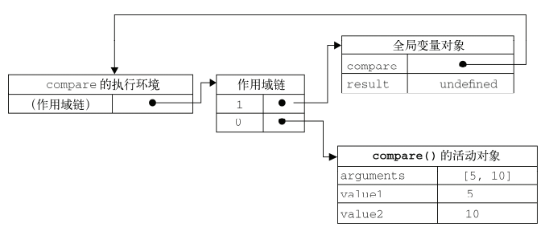
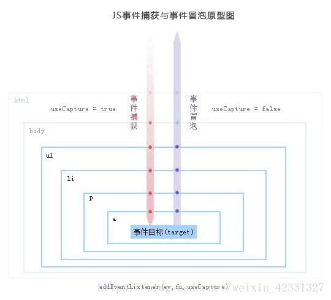

# A、javascript

**简介**：JavaScript 由 3 部分组成：**ECMAScript**：解释器。翻译兼容性：完全兼容。**DOM**：Document Object Model （文本对象）兼容性：部分不兼容。**BOM**：Browser Object Model （浏览器对象）兼容性：不兼容（例如 IE，谷歌，火狐，不可能兼容），核心是 window，全局对象。dom 针对的是标准的客户端控件，html 标记的这些浏览器展现的内容。bom 针对的是浏览器，BOM 是浏览器对象模型，DOM 是文档对象模型，前者是对浏览器本身进行操作，而后者是对浏览器（可看成容器）内的内容进行操作。js 是**脚本语言**、**单线程**语言。
**为什么是单线程**：加入它是1个多线程，那肯定会出现两个线程同时操作1个dom的复杂情况（因此workers中就是不允许操作dom的）

## 0、js中的堆栈

js的数据分为两种， 一种是**原始类型**（Boolean,Null,Undefined,Number,BigInt,String,Symbol）， 一种是**对象**（Object）==原始类型的数据放在栈中，对象的数据放在堆中==。
**堆（heap）**是不连续的内存区域，即数据可以任意存放， 主要存放的是对象等（==数组与对象都是链式结构的存储==，并非散列）

**栈（stack）**是一块连续的内存区域，每个区块按照一定次序存放（后进先出），栈中主要存放的是基本类型的变量的值以及指向堆中的数组或者对象的地址。

## 1、数据类型：

数据类型包括：数值、字符串、布尔、null(表示尚未存在的对象)、undefined(当声明的变量还未被初始化时，变量的默认值为 undefined)、对象(对象又包括列表、函数、字典)6 种。

### 一、数值：

`parseInt("fjdk889")`//转为整型 889,剔除字符串。
`parseFloat()`//转为 float 型。
`num.toFixed(2)`;//保留小数位数。8
进制，十六进制数也可直接写入：`var v = 070`#八进制的 56。`var c = 0XA`#16 进制的 10。
**转为字符串**：num.toString();

- **含 e 的数**：一般表示极大极小值`var m = 3.125e7`#等价于`3.125 * 10^7`。`var c = 3e - 7`#0.00....03。
- **浮点数计算精度丢失问题**：`console.log(24314310.3412 / 100000)>>243.14310341200002`。 `javascript`==以64位双精度浮点数存储==所有Number类型值，再浮点数在计算机中是用科学计数法表示（转为二进制时是`符号位+阶码+尾数`）一般导致阶码数很大（因为以64位表示的缘故），再加上计算时还要进行左规、舍入等处理，所以一般会导致精度丢失（结合计算机组成原理笔记理解）[参考学习地址](https://juejin.cn/post/6897870218002399246)
  **解决思路**：将小数转为整数，按特别方法计算后再移动小数点。
  数值与字符串的运算：`1 + "1" == "1" + "1" = '11'`#除了+是字符串连接，其它运算操作符情况会被先当做数值计算。
- **NaN**：用于表示一个本应该是数值，返回却是非数值的情况，如数值比上 0，NaN 与其它数值操作同为 NaN，`NaN == NaN返回false`。用 isNaN()可检测。

**与或非运算**：

```js
// 与运算
console.log(212 & 320); // 64
// 或运算
console.log(212 & 320); // 468
/* 非运算
先取反，如果是“正数”，值为正数；
先取反，如果是“负数”，保留第一位符号位，其余数字取反再加一，值为负数数
*/ 
console.log(~6); // -7
// 异或运算
console.log(5 ^ 3); // 6
```


### 二、字符：

其它类型转为 string：`String(val)`#无论 val 是什么类型都会转为对应的字符串。

```js
parseInt("0xAA", 16); //parseInt第二个参数可以指定将字符串转为直接的进制数。0xAA本身是16进制。
x.toString(); //转为字符串。`x.replace(/target/g,'')`//替换,g表示所有满足的都替换。`x.concat(“a”,”b”)`//可与x连接多个字符串。
x.charAt(index); //查找字符串的对应下标的值,`“justice”.charAt(1)=”u”`。
"a".toUpperCase(); //方法将小写字母转换为大写,`"A".toLowerCase()`#将大写字母转为小写。
str.substring(start, end); //提取字符串中介于两个下标间的字符串，一个参数时为start，截取后面所有。不改变原数据的值。
str.substr(start, length); //第二个参数为选择从start起截取多少个长度字符。<b c=r>不改变原数据的值。</b>
str.indexOf("aa"); //查找字符串位置。
s = "fdfd_fdf".replace(/f/g, "a");
str.search("abc"); //找到子串开始位置。
str1.concat(str2); //连接两个字符串，返回一个新的值。
"*".repeat(3); //生成3个重复的字符。
"mm9plk4klj1hg".split(/\d/); //分割，也可指定字符分割。

"aaj,b_b".lastIndexOf("b", 2); // 返回最后一个字符出现的位置，第二个参数表示开始检索的位置。
var str = "大米:2.57斤/元,白菜:3.65元/斤";
var arr = str.match(/\d+(.\d+)?/g); //match()方法找到所有匹配的项，返回一个数组。
```

- **js 的正则表达式**：

```js
//i表示不区分大小写，g表示匹配全局，m表示可匹配多行。
var a = /e/i;
var b = new RegExp("e");
let reg = /ac/i;
reg.compile(reg);
//compile方法：该方法的作用是能够对正则表达式进行编译，被编译过的正则在使用的时候效率会更高，适合于对一个正则多次调用的情况下
console.log(a.test("aaebc")); // 返回布尔值
console.log(a.exec("kke,mme")); //只能找到第一个匹配项，放回一个列表形式的记录（有匹配到的值）。
```

### 三、数组：

map与`forEach`区别：map会返回1个操作完后的数组，`forEach`则不会。

```js
list.indexOf(1); //找到第一个1在列表中的位置，不在则返回-1。
list.includes(1); //是否包含1，返回布尔值。
list.join("-"); //将各元素用字符链接。
list.push(1); //在列表最后添加值。
list.pop(); //删除最后一个元素。
list.unshift(); //在数组最前端添加一个新的值。
list.shift(); //移除第一个元素。
Array.from("dafl"); //[d,a,f,l]  var b = Array.from(carr); //from可实现浅拷贝
[1, 2, 3].toString(); //"1,2,3"
Array.isArray({}); //false
list.reverse(); //将数组倒置，[1,2,3].reverse();//[3,2,1]。

k = arr.from(T); //T转换成数组，T可以是字符串、列表、set。
/************数组迭代器************/
var arr = [1, 8, 2, 4, 3, 9, 0];
var e = ["a", "b", "c"].entries();
e.next().value; //[0, 'a'];
/*=====================================================
	map,find,filter等方法都是在原数据上做1个浅拷贝
	即：深层的对象元素，新列表中修改会引用旧列表中对应元素
=======================================================*/
/****map：将return的值放到新列表中（与原列表同长）*****/
var ss = [1, 3, 5, 6].map((v,i) => {
  if (v > 3) return v;
});
arr.forEach((v,i)=>{});
var k = arr.concat([1, 2, 3]); //or concat(6)
/*******返回true时会结束遍历。a为布尔值********/
var a = arr.some(function (item, index, arr) {
  if (item > 2) {
    return true;
  }
});
/*****返回true时会结束遍历，返回的a是满足true的那一项**********/
var a = arr.find((x) => {
  return x >= 4;
});
/*********全条件满足（全满足时为true）***********/
const _all = [1, 2, 3].every((v) => {
  if (v < 4) {
    return true;
  } else {
    return false;
  }
});
/********返回为true时的选项，它们放到一个新列表中********/
var r = arr.filter(function (s) {
  return s == 2; // 注意：IE9以下的版本没有trim()方法
});
//----sort()实现的排序的思想，传入函数作为参数，以灵活的用于各种情况。
arr.sort(); //不传参数的话，默认将arr中的值看成字符串来排序。
arr.sort(function (a, b) {
  //火狐使用归并排序，google使用快速+插入。b在a之前，循环用a与b比较。
  if (a > b) {
    return 1; //1表示不变。
  } else if (a < b) {
    return -1; //表示a,b交换位置。
  } else {
    return 0;
  }
});
//----reduce()计算总和。
function getSum(total, num) {
  //total是上一次return的结果，num是数组元素
  console.info(">", total, num);
  return total + num;
}
console.warn(numbers.reduce(getSum));
```

- 注意：按引用类型操作的值，其后面操作改变了值，但前面值打印出来和改变后是一样的。

- **数组去重**：

```js
function unique(arr) {
  return Array.from(new Set(arr)); //使用集和。
}
unique([1, 1, "true", "true", true, true]);
//splice
var arr = [1, 2, 3, 4, 5, 6];
arr.splice(2); //删除2及之后的值。
arr.splice(0, 2); //表示删除0,1位置的值，第二个参数表示删除的个数。
//插入、第三个参数表示在当前索引后插入的数。
arr.splice(1, 0, 7); //[1,7,2,3,4,5,6] ！！
arr.splice(1, 1, 7); //[1,7,3,4,5,6]

arr.forEach(function (value, index, data) {});
```

### 四、普通对象

**强引用与弱引用**：直接指向对象的**强引用**，通过另一个变量来指向已有对象的称**弱引用**。

```js
const uu = {name:'ccc'}; // 强引用
const dd = uu; // 弱引用（更容易被回收）
```

**浅拷贝**：两种形式（1）直接弱引用指向另一个已存在对象（2）新建1个对象，将另一个对象第一层值复制进来。
**深拷贝**：完完全全的将另一方数据复制，两者之间不存在应用。

```js
var obj = {a:2,b:[4,5,6]};
// 浅拷贝1
var obj2 = obj;
// 浅拷贝2
var obj3 = {};obj3.a = obj.a;obj3.b = obj.b;
// 深拷贝(用JSON,或循环复制)
var obj4 = JSON.parse(JSON.stringify(obj));
```

Object常用方法：

```js
var obj = {a:1,b:3};
/*================
该方法创建的数据只是指针指向原型，添加时才会在自身数据上添加，不大建议使用！
==================*/
Object.create({a:1,b:2},{
    p: {
    value: 2,           // 属性值
    writable: true,     //  是否可以重写值
    enumerable: true,   //是否可枚举
    configurable: true  //是否可以修改以上几项配置
  }
});        //第二个参数配置属性控制。
/*=============================
           属性、原型操作
===============================*/
Object.getPrototypeOf(obj) == obj.prototype; //获取指定对象的原型（内部[[Prototype]]属性的值）
Object.getPrototypeOf(person1).name;         //"Nicholas",但不能通过此方法来更改。
Object.setPrototypeOf(vue,{v:2})             //设置一个指定的对象的原型
Object.getOwnPropertyDescriptors(obj);       //返回指定对象所有自身属性【原型属性不含有】

//getOwnPropertyNames()方法可以得到所有属性，包括对象的不可枚举属性。
Object.getOwnPropertyNames(Person.prototype);
//将对象的某个属性设置为是否可枚举。//----缺点：无法监听到增加和删除操作，无法监听到内部数组的改变。
Object.keys(obj).forEach((key) => {
        let value = obj[key];
        Object.defineProperty(obj, key, {
          get: function () {
            console.log("访问属性 name 触发");
            return value; // 定义访问该属性的返回值
          },
          set: function (newValue) {
            console.log("设置属性 name", newValue);
            value = newValue; // 修改该属性的值
          },
        });
      });
/*===============
    属性控制
=================*/
Object.is(obj1,obj2);              //可对比两个值是否相等
Object.freeze(obj);                //冻结该对象，不能对其做修改
Object.preventExtensions(obj);     //对象不能再添加新的属性。可修改，删除现有属性，不能添加新属性。
Object.seal(obj);                  //将obj密封，不可扩展、删除、修改属性特性。但可修改值。
/*=============================
            键值对操作
===============================*/
Object.keys({a:1,b:2});//可枚举出对象的属性。
Object.values(dict);//value值做一个数组
// 键值对按数组返回
Object.entries({a:3,b:8});//[['a',3],['b',8]]
obj.isPrototypeOf(obj2)            //判断obj是否在obj2的原型链上。
// res是有更新部分的数据，obj1是最终数据。
var res = Object.assign(obj1, obj2,...);//将obj1后的对象中的属性赋给obj1，相同的键值会覆盖。
```

- **Object.defineProperty()**
  监听目标对象：三个参数（要监听的对象、要监听的key值，监听的操作对象）普通对象，数组均可代理，且get，set操作也能触发，如下：

```js
Object.defineProperty(obj, "name", {
  configurable: true, //表示能否通过delete删除此属性,默认为true
  writable: true, //表示能否修改此属性值，默认true
  enumerable: false, //表示该属性能否被for in等方法枚举，默认true
  value: "wcs", //直接为该属性赋值
});
/***代理数组写法***/
let arr = [1,2,3];
var apx = Object.defineProperty(arr,0,{
    get:function(){}, //get操作触发
  	set:function(){} //set操作触发
});
apx[0] = 99; // 可以触发，但数组包裹对象类（[{a:1,b:2},1,2]）会报错
```

在第三个参数中写以上属性都不能与 get,set 一起使用。

```js
Object.defineProperties(obj, {
  //defineProperties()方法同时设置多个值
  name: {
    value: "张三",
    configurable: false,
    writable: true,
    enumerable: true,
  },
  age: { value: "李四" },
});
Object.getOwnPropertyDescriptor(obj, "name"); //获取目标对象指定属性的描述
```
- **检查对象上存在某属性**：
```js
let map = {a:1,b:2};
/********hasOwnProperty()方法不会检查原型链********/
const includeA = map.hasOwnProperty('a');
/********
 * 但对于Object.create()传入空值时
 * cleanObj是一个空对象，但不再拥有Object的方法，使用Object下方法时报错
*/
const cleanObj = Object.create(null);
console.log(typeof cleanObj,'为object');console.log(cleanObj instanceof Object,'但其为false');
cleanObj.some = 'value';
console.log(cleanObj.hasOwnProperty('some'));// 报错：hasOwnProperty is not a function
/******此时可用*******/
console.log(({}).hasOwnProperty.call(cleanObj,'some'));

/*******in方法，会连原型链一起检查*******/
const includeB = 'b' in map;
```

- [Object 方法集学习地址](https://www.cnblogs.com/mopagunda/p/8328084.html)
- **列表，字典均属于 Object 类型**，即：`[1,2] instanceof Object`#为 true，但`{a:1,b:2} instanceof Array`#为 false。
  **undefined**：派生自 null，因此`null==undefined`#返回 true，使用全等符号才会返回 false。已声明，未赋值的变量依然是 undefined。但是没有声明的值使用，会直接报错。然而使用`typeof no(未声明值)`#得到的也是 undefined 类型，所以 undefined 不属于 Object。
  **null**：表示一个空对象指针，因此用 typeof 检测时返回 object（但`null instanceof Object`返回 false）
  如果该变量之后用于赋值一个对象，那初始赋值可以置为 null。
  **布尔值**：`0，空字符串、null、undefined、false`都是当做 false。

```js
// set转数组
const items = new Set([1, 2, 3, 4, 5]);
const array = Array.from(items);
```

### 五、隐式转换：

在进行变量比较时，js 内部会对数据进行相应变换如下：（全等条件下回进行类型的比较，所以这些在**全等下不成立**）

- [] == true; //false []转换为字符串'',然后转换为数字 0,true 转换为数字 1，所以为 false
- [1,2,3] == '1,2,3' // true [1,2,3]转化为`'1,2,3'`，然后和'1,2,3'， so 结果为 true;
- [1] == 1; // true `对象先转换为字符串再转换为数字，二者再比较 [1] => '1' => 1 所以结果为 true
- **~~符号的使用**：对变量进行隐式转换。

```js
~~true == 1;
~~false == 0;
~~"" == 0;
```

**数据类型检测**：`console.log(typeof val)`#有 string、number、undefined、boolean、function、object（字典和 null 都显示这个）。
<b c=r>非引用类型（字符串、数值、布尔等）推荐使用 typeof 检测。</b>引用类型（数组、object、自带对象 Date 等）推荐使用 instanceof 检测。

```js
const a = [];
let _typ;
if (typeof a === "object") {
  if (a instanceof Array) {
    _typ = "array";
  } else if (a === null) {
    _typ = "null";
  } else if (a instanceof Set) {
    _typ = "set";
  }
  {
    _typ = "map";
  }
} else {
  _typ = typeof a;
}
console.info(_typ);
```

### 六、Set与Map

```js
/******Set*****
1.成员不能重复
2.只有健值，没有健名，有点类似数组。
3.可以遍历，方法有add, delete,has
*/
var st = new Set();
st.size; // 长度
st.keys();
st.values(); // 可迭代
/*****WeakSet*****
1. 成员都是对象
2. 成员都是弱引用，随时可以消失。 可以用来保存DOM节点，不容易造成内存泄漏
3. 不能遍历，方法有add, delete,has
*/
var wst = new WeakSet();
function qq(){return 0;}
st.add(qq);
wst.add(qq);
/*****Map******
1. 本质上是健值对的集合，类似集合
2. 可以遍历，方法很多，可以干跟各种数据格式转换
*/
var uu = new Map();
/******WeakMap******
1. 直接受对象作为健名（null除外），不接受其他类型的值作为健名
2. 健名所指向的对象，不计入垃圾回收机制
3. 不能遍历，方法同get,set,has,delete
*/
var tt = new WeakMap();
uu.set('vv',34);
tt.set(qq,'ff');
console.info(st,wst,uu.get('vv'),tt.has(qq));
```


## 2、编码相关：

```js
encodeURIComponent("<svg>")#不会对 ASCII 字母和数字,标点字特殊符等进行编码
encodeURI('汉字');//url传参汉字时可以先encodeURI()对中文编码,浏览器会自动解码
decodeURI();// 再用decodeURI()转码，对汉字解码则不变。


//btoa()和atob(),这是属于base64的编解码。
var str = "javascript";
console.log(window.btoa(str))//amF2YXNjcmlwdA==
console.log(atob("amF2YXNjcmlwdA=="))// 'javascript'
```

**进制转换**：

```js
(10)
  .toString(16)(
    // =>"a"。//10进制转为16进制10进制转为16进制
    012
  )
  .toString(16)(
    // =>"a"。//8进制转为16进制//8进制转为16进制
    0x16
  )
  .toString(10)(
    // =>"22"。//16进制转为10进制
    0x16
  )
  .toString(8); // =>"26"。//16进制转为8进制
```

**utf-8编码**：要转为字节流时，将结果用**空格连接**（`bytes.join(' ')`）

```js
function encodeUtf8(text) {
    const code = encodeURIComponent(text);
    const bytes = [];
    for (var i = 0; i < code.length; i++) {
        const c = code.charAt(i);
        if (c === '%') {
            const hex = code.charAt(i + 1) + code.charAt(i + 2);
            const hexVal = parseInt(hex, 16);
            bytes.push(hexVal);
            i += 2;
        } else bytes.push(c.charCodeAt(0));
    }
    return bytes;
}
```

**utf-8解码**：

```js
function decodeUtf8(bytes) {
    var encoded = "";
    for (var i = 0; i < bytes.length; i++) {
        encoded += '%' + bytes[i].toString(16);
    }
    return decodeURIComponent(encoded);
}
```

**base64编解码**：安装`npm i js-base64`，使用`import {encode,decode} from 'js-base64';`

## 3、其它：

### a、SSE 与 WebSocket:

SSE(Server-Sent Eevents，服务器发送事件)用于创建到服务器的单向连接（连接断开后其会**自动**进行==一次重连==）。[参考地址](https://zhuanlan.zhihu.com/p/611159540?utm_id=0)

```js
// EventSource接受的参数必须同源。
// 使用message事件监听从服务器收到的消息，并存储在event.data对象里。
var source = new EventSource("http://127.0.0.1:8080/event/query");
//只要和服务器连接，就会触发open事件
source.addEventListener("open", function () {
  console.log("和服务器建立连接");
});

//处理服务器响应报文中的load事件
source.addEventListener("load", function (e) {
  console.log("服务器发送给客户端的数据为:" + e.data);
});

//如果服务器响应报文中没有指明事件，默认触发message事件
source.addEventListener("message", function (e) {
  console.log("服务器发送给客户端的数据为:" + e.data);
});

//发生错误，则会触发error事件
source.addEventListener("error", function (e) {
  console.log("服务器发送给客户端的数据为:" + e.data);
});
```

WebSocket 是一种在单个 TCP 连接上进行**全双工通讯的协议**，它允许服务端主动向客户端推送数据，浏览器和服务器只用完成一次握手两者之间即可创建持久性的连接，并进行双向数据传输。需要先安装 pywebsocket 支持 websocket 服务。

```js
if(window.WebSocket){
    // 继承webscoket类，传入url,可选子协议,wss为加密后的协议。
    var ws = new WebSocket("ws://url",[protocol]);
    ws.onopen = function(){// 连接建立时触发
        ws.send(data);//发送数据
    }
    ws.onmessage = function(res){alert(res);}// 接受到数据时触发
    ws.onclose = function(){//关闭时触发函数}
}
else{alert("连接错误")}
```

### b、Workers与PostMessage

workers 是让一个 js 文件在后台执行不影响页面执行速度的一种技术,对一些需要处理大型的数据是一个不错的优化选择，且主流浏览器都支持(除了 IE）。可以用在 canvas 绘制大量图形时，将计算结果返回到主线程然后渲染。<b c=r>worker 是一个线程而不是微任务，宏任务的概念</b>

```js
var i = 0; //postMessage()方法将传入其中的值返回给调用它的worker
function start() {
  postMessage(i);
  i += 1;
  setTimeout(start, 1000);
}
// 另一个js文件中
(function () {
  if (typeof window.Worker != "undefined") {
    // 浏览器支持Worker
    var w = new Worker("js/a.js");
    //res为postMessage()返回的对象，res.data获取其中数据
    w.onmessage = function (res) {
      console.log(res.data);
    };
    w.terminate(); //终止worker
  }
})();
```

**PostMessage**：多使用在两个窗口之间（如`window.open(), <iframe>`）带来的窗口

```js
/*子窗口
childWindow: 是window.open(), iframe打开的新窗口的引用。
message：将要发送到其他 window 的数据。
targetOrigin：通过窗口的 origin 属性来指定哪些窗口能接收到消息事件，其值可以是字符串"*"（表示无限制）或者一个 URI。
transfer 可选是一串和 message 同时传递的 Transferable 对象。这些对象的所有权将被转移给消息的接收方
*/
childWindow.postMessage(message, targetOrigin, [transfer]);
/***父窗口可以这样来监听消息***/
window.addEventListener("message", receiveMessage, false);

function receiveMessage(event)
{
  // For Chrome, the origin property is in the event.originalEvent
  // object.
  // 这里不准确，chrome 没有这个属性
  // var origin = event.origin || event.originalEvent.origin;
  var origin = event.origin;
  var data = event.data; // 对方传递的数据
  var source = event.source; //对发送消息的窗口对象的引用; 您可以使用此来在具有不同 origin 的两个窗口之间建立双向通信。
  if (origin !== "http://example.org:8080")
    return;

  // ...
}
```


### b1、一键复制功能

```html
<button onclick="get()">点击复制</button>
<script>
  function get() {
    var int = document.createElement("input");
    int.value = "这是复制内容";
    document.body.appendChild(int); //添加到DOM中才能选择(使用select())
    int.select(); //选择input中的内容
    document.execCommand("Copy"); // 执行复制语句
    int.style.display = "none"; // 复制完后才能隐藏
  }
</script>
```

- **三元运算符**：三元运算符与 if 语句同样的作用，例：if(x>10 && x<50){alert("hello");}替为 `x>10 && x<50?alert("hello"):alert("flase")`。(两者等价问号前为判断条件，问号后为执行语句，冒号后为 else 时的语句)。
  三元运算符用于赋值：val = val>20 ? 20 : 10;//表示如果 val 大于 20val 值就为 20，否则为 10；
  三元运算符中写多条语句：a == 20 ? (a=15,alert(a)) : (a = 21,alert(a))

### b2、消息通知

（1）传统实现：使用`document.title`反复变跟实现闪烁达到提醒功能。
（2）H5 新增Web Notification。兼容性也还不错
（3）**注意**：嵌套的ifram中使用无效。`web work`中也可使用。`https`环境才可用（本地文件，http环境均不可用）

```js
// 询问用户是否允许通知
Notification.requestPermission().then(function(permission) {
    Notification.permission;//获取当前的通知状态 granted, denied, 或default
    // 创建通知
    new Notification("标题", {
        dir, // 表示提示主体内容的水平书写顺序
        body, // 提示主体内容。字符串。会在标题的下面显示
        tag, // 字符串。标记当前通知的标签
        icon,//字符串。通知面板左侧那个图标地址。
        data, // 任意类型和通知相关联的数据。
        vibrate,//	通知显示时候，设备震动硬件需要的振动模式。例如[200, 100, 200]表示设备振动200毫秒，然后停止100毫秒，再振动200毫秒。
        renotify, // 布尔值。新通知出现的时候是否替换之前的。如果设为true，则表示替换，
        silent,//	布尔值。通知出现的时候，是否要有声音
        sound,//字符串。音频地址。
    });
    Notification.close();
    // 监听点击
    Notification.onclick(()=>{});
    Notification.onerror(()=>{}); // 异常时触发
    Notification.onclose(()=>{}); // 关闭时触发
    Notification.onshow(()=>{}); // 监听通知显示
});
// 示例
if (window.Notification) {
    var button = document.getElementById('button'), text = document.getElementById('text');
    
    var popNotice = function() {
        if (Notification.permission == "granted") {
            var notification = new Notification("Hi，帅哥：", {
                body: '可以加你为好友吗？',
                icon: '//image.zhangxinxu.com/image/study/s/s128/mm1.jpg'
            });
            
            notification.onclick = function() {
                text.innerHTML = '张小姐已于' + new Date().toTimeString().split(' ')[0] + '加你为好友！';
                notification.close();    
            };
        }    
    };
    
    button.onclick = function() {
        if (Notification.permission == "granted") {
            popNotice();
        } else if (Notification.permission != "denied") {
            Notification.requestPermission(function (permission) {
              popNotice();
            });
        }
    };
} else {
    alert('浏览器不支持Notification');    
}   
```


### b3、拖拽

将一个元素拖拽到另一个元素。

```html
<div id="div1" ondrop="drop(event)" ondragover="allowDrop(event)"></div>
<div id="drag1" draggable="true" ondragstart="drag(event)">可拖拽对象</div>
<script>
  //    拖拽结束触发。
  function allowDrop(ev) {
    ev.preventDefault();
  }

  function drag(ev) {
    //拖拽该元素时，设置一个键值对，第二个参数用于选中该元素。
    ev.dataTransfer.setData("Text", ev.target.id);
  }

  function drop(ev) {
    // 拖入到该元素上，松开鼠标触发，通过键获取元素id，
    ev.preventDefault();
    var data = ev.dataTransfer.getData("Text");
    ev.target.appendChild(document.getElementById(data));
  }
</script>
```


### c2、页面间传值：

1、url 传参。(域名或路径后将参数用?或#号分割,参数间用&分割)
2、cookie 缓存。(格式建议与 url 传参写成一样的)
3、Storage 缓存。(页面间调用 storage 中的值,将一个数组存入后会变为逗号分割)
4、window.open()+window.opener

```js
// 页面a：
var a = 55; // 页面a的对象
el.onclick = function () {
  /*****第二个参数为窗口名称，如果窗口名称已存在则会跳到该窗口并将地址带给它（就算url相同也会刷新对应页面，且子页面可跳到父页）*/
  window.open("b.html",'windowName','left=10, width=1000, height=800, menubar=yes, toolbar=no, personalbar=no');
}; //打开一个新窗口
// 页面b:
console.log(window.opener.a); //window.opener会将前一个页面的所有对象封装为
//一个对象的形式，b页面可以使用，但对用户体验不好。
```

### d1、formData 的使用：

```js
const el = document.getElementById("form");
let fd = new FormData(el);    // 不传入元素时是一个空的表单。
formData.append("k1", "v2");
formData.delete("k1");
formData.has("k1"); // true
formData.set("k1", "1"); // 修改
formData.get("name"); // 获取key为name的第一个值
```

### e、时间：

```js
var dat = new Date();
dat.getFullYear(); // 获取年份
dat.getMonth() + 1; // 获取月份,从0开始所以需要加1
dat.getDate(); // 获取号数
dat.getHours(); // 获取小时
dat.getMinutes(); // 分钟
dat.getTime(); //获取从1970/01/01至今过去的毫秒数。
dat.toUTCString(); // 将日期转换为字符串
dat.getDay(); // 获取星期
/*****获取指定时间左右的时间*******/
var dt1 = new Date();
var dt2 = new Date(dt1); // 将dt1当参数传入
dt2.setDate(dt1.getDate() + 5); //将今天的号数设置为5天之后的号数
// 或者（获取10分钟之前的时间）
var dy = 10 * 60 * 1000;
let dt3 = new Date(Date.parse(new Date()) - dy);
// 与当日差距的天数时间
function dateScope(fromDate) {
  const _fromDate = fromDate || 0;
  const d1 = new Date();
  const d2 = new Date();

  d2.setDate(d1.getDate() + Number(_fromDate));

  const y1 = d2.getFullYear();
  const m1 = d2.getMonth() + 1;
  const date = d2.getDate();

  return `${y1}-${m1}-${date}`;
}
```

### f1、call&apply&bind

**3者的作用**：使用`call/apply`时即会==执行目标函数，用于改变函数的执行作用域==，传入的**第一个参数相当于目标函数的this指针**；如果这个目标函数作为回调函数传入，我们可以利用`call/apply`**可易于改变它们的this指针**。

```js
/*定义一个Person类*/
function Person(name, age) {
  this.name = name;
  this.age = age;
}
/*定义一个学生类*/
function Student(name, age, grade) {
  Person.call(this, name, age); //特点：this指代student对象，可以接收任意多个参数
  this.grade = grade;
}
var student = new Student("zhangsan", 22, "二年级"); //方法Student()也是object的一个实例
/***apply的使用***/
function hhh(){
    Person.apply(this,['name','age']);// 第二个参数作为Person的参数列表
}
/****bind：可将传入的作用域，参数保存，返回1个新函数****/
function a(h){
   console.info(h,this.k);
}
var t = a.bind({k:22},11); // 保存参数
t(); // 上面绑定的参数会传给函数“a”
t(99); // 依然可以再传参数，依然会被传给函数“a”
```

### f2、console：

console 模块不只 log()一个函数，全部如下：

- `console.log("%d年%d月%d日", 2017, 1, 8)`#打印，%是占位符。console.info()#信息。
- `console.warn()`#警告。
- `console.group("第一组信息");console.log("第一组第一条：我是张三");...console.groupEnd();`#作为一组展示出来。
- `console.error()`#打印错误。
- `console.dir()`可以显示一个对象所有的属性和方法。
- `console.dirxml()`用来显示网页的某个节点（node）所包含的 html/xml 代码。
- `console.assert(a===2)`用来判断一个表达式或变量是否为真。若为否会抛出异常。
- `console.table([[1,2,3],[4,5,6],[7,8,9]])`#打印表格
- console.time()和 console.timeEnd()，用来显示代码的运行时间。
- `console.profile("性能分析器");...中间代码;console.profileEnd("性能分析器");`

### f3、动画函数：

（1）使用定时器做动画并不是很精确（**定时器时间会有少许偏差，并不完全准确**）
（2）`requestAnimationFrame`会根据系统**屏幕帧的刷新频率**来调整调用频率（最佳选择，不易丢帧，多数为`60FPS`即60次/s）
（3）该函数也会根据系统卡顿情况做出相应调整频次（如==离开当前页面时就不在执行==）
（4）浏览器或系统卡顿时其执行依然是不稳定的，因此动画函数最好做**时间动画**处理
（5）动画函数中最好不要有新建变量的操作，每次执行尽量计算量相同（具体查看`webVision.md`笔记）

```js
/****requestAnimationFrame使用****/
function play() {
  console.log(a);
  window.requestAnimationFrame(play);
}
window.requestAnimationFrame(play); //开始第一帧
cancelAnimationFrame(); //方法取消动画。

/****requestAnimationFrame兼容性写法****/
window.requestNextAnimationFrame = (function(){
    return window.requestAnimationFrame || window.webkitRequestAnimationFrame ||
        window.mozRequestAnimationFrame || window.msRequestAnimationFrame;
})();
```

### g、js 垃圾回收机制：

多数编程语言都带有垃圾回收机制。现在各大浏览器通常用采用的垃圾回收有两种方法：标记清除、引用计数。
减少 JavaScript 中的垃圾回收：
new 关键字就意味着一次内存分配，例如 new Foo()。最好的处理方法是：在初始化的时候新建对象，然后在后续过程中尽量多的重用这些创建好的对象。
为了最大限度的实现对象的重用，应该像避使用 new 语句一样避免使用{}来新建对象。
使用 delete x;手动删除一个变量。

## 3.1、严格模式

严格模式下部分语法被禁用；与非严格模式比具体如下：

1、变量必须先声明后才能赋值。
2、禁止使用with语句。（由于其会改变执行的作用域）
3、创建eval作用域：严格模式使用eval会单独创建一个作用域（像函数一样），其中新建的变量等都只在该作用域
4、禁止this指向window。否则打印出来的this是undefined。
5、函数参数不能重名。

```js
// 在其所在作用域生效
'use strict'
// 函数中使用
function ss(){
    'use strict'
    let cc = 0;
}
```


## 4、循环和分支：

for in 循环会遍历原型上的属性，耗时更长，尽量避免使用。for 循环时，多数会读取数组 length 值，**用一个局部变量缓存它**，速度更快。
**基于函数**的循环迭代（map(),some(),...等）性能**比 for 循环要稍差**，尽量减少这一类的使用！

**循环**：（for, while, do -while, for-in, for-of, map(),..）

```js
var a = 5;
switch (a) {
  case 1:
    a = 9;
    break; // 每个case完使用break;
  case 2: //匹配多个条件时写法。case相当于===，所以case 2 || 5这样的写法只等于2。
  case 5:
    alert("hello");
    break;
  default:
    // 没有匹配到时会运行default，使用switch时一定加上这个。
    alert("结束");
}
/*******for循环多条件*******/
// 多条件用逗号隔开时表示“或”，满足任1条件都会执行
for (let i = 1, k = 20; i < 10, k > 10; i++, k--) {}
// 要求同时满足，用&&即可
for (let i = 1, k = 20; i < 10 && k > 10; i++, k--) {}
```

- **for in 与 for of**：<i c=r>for 循环时，多数会读取数组 length 值，**用一个局部变量缓存它**，速度更快</i>

```js
// 在原型上绑定一些自定义属性。
Object.prototype.selProto = function (v) {
  console.info(v);
};
Array.prototype.ap = "hello ap";

var m = Object.create({ a: 5, b: 3 });
var n = [2, 4, 7];
//---for in（es5语法）会将上面自定义在原型上的属性也遍历出来。Array属于Object，所以ap依然在其中。
for (var i in n) {
  //---getOwnPropertyNames()获取只属于该对象的属性，包含length。
  //for in遍历时利用它来筛选。
  if (Object.getOwnPropertyNames(n).indexOf(i) !== -1) {
    console.info("in----", i);
  }
}
//---for of(es6语法)则输出值，且不会遍历原型上的自定义属性。
for (var j of n) {
  console.info("of----", j);
}
```

- 交换变量：`[x,y]=[y,x]`。
- 双非运算符：`const f=~~15.57;//15`#与 floor 效果一样，不过在值大于 2147483647 时会失效。
- 字符串转数字：`let a = +"13.456";//13.456`#与 parseInt，parseFloat 效果一致。
- 数字分隔符：`const H = 109_234_711;//109234711`#这种较大的数值时用分隔符并于查看。
- 感叹号：`!!"123"`#true，相当于 Boolean()方法对值变换。
- bind 的使用：

```js
function mskPhone(val) {
  console.info("this===", this);
  let _s = val.substr(0, 3);
  return _s + "*".repeat(3) + val.substr(7, 11);
}
var cc = mskPhone.bind({ a: 112 }); //bind的第一个参数是函数mskPhone的this，其它参数按序传入。
console.info("cc===", cc("18313746328")); //这里调用，参数接着上面的
```

**for 循环中使用定时器问题**：

```js
//由于var作用域为当前函数，而非当前代码块。
for (var i = 0; i < 5; i++) {
  setTimeout(function () {
    console.log(i); //5,5,5,5,5
  }, 200 * i);
}
//-----可以放到一个函数内使用。或者将var改为let。
for (var i = 0; i < 5; i++) {
  //这种匿名函数就相当于一个块及作用域。
  (function (index) {
    setTimeout(function () {
      console.log(index); //0,1,2,3,4
    }, 200 * index);
  })(i);
}
```

**分支**：（if-else, switch()）

- 条件情况较多时，`多使用switch()`，比 if-else 更易读，且**速度更快**。
- 将较**常出现的情况放在前面**判断，也能提升性能！
- 条件多时，嵌套的 if-else 比不嵌套的**速度更快**！（注意别嵌套太深）。
- 条件特别多时，可以使用查找表（数组/map 存储）；

```js
if (a < 10) {
  if (a > 5) {
  }
} else if (a >= 10) {
  if (a < 18) {
  }
}
```

## 5、函数：

**简介**：每个函数会在内存中为其创建一个空间，存储其所用变量（下图所示，顺序和链式存储结合）。**全局变量（window,document）等会被注入到该空间中**。

- map，Array 等较深的结构按链式方法查找，<b c=r>使用的数据结构越深，速度越慢！</b>

- 局部变量存储顺序靠前，其查找使用起来速度最快。

- 全局变量存储到最后，查找使用起来较慢，_因此性能最差，尽量避免使用！_

- 执行完毕后执行环境被销毁。

- 动态作用域：使用了 with、catch(){}子句、eval()函数的可以看做时动态作用域情况

```js
// new形式构造函数的用法，最后一个是函数体内容
var fn = new Function(arg1,arg2,'return arg1+arg2');
```


**性能优化方法**：
（1）将对应全局变量赋值给一个局部变量，这样在查找时就只是查找该局部变量（按标识符查找的）。
（2）避免使用 with 语句。<i c=gn>with 创建的作用域会被推到函数作用域首位，局部变量位置反而落于其后</i>
（3）适当使用`try{}catch(e){}`：执行 catch 时，对象 e 会被推到作用域首位！一般在 catch 中专门将 e 交给一个函数来处理最好。

**闭包**：是语言的一个特性，指函数可作为1个对象在其它函数中创建，它可以使用父级作用域的变量，==且使用其值，不会销毁其父级作用域的现象==
在另一个函数内部定义的函数会将包含函数（即外部函数）的活动对象添加到它的作用域链中。也教耗性能

```js
// 闭包
function abc(){
    /**arguments为当前函数的所有参数列表，callee则是当前函数**/
    console.info(arguments.callee);
    var a = 10;
    function vv(){return a;}
    return vv;
}
```

**全局与局部变量覆盖问题**：

```js
/***
1、函数内同名的局部变量会覆盖全局变量；
2、传入的同名参数也会覆盖全局变量；
3、函数内定义的局部变量可以覆盖同名参数；（let，const不行，var可以）
***/
var qq = 99;
function tt(){
  let qq = 88;console.info(qq);
}
tt();
/***创建先后与运行机制***/
var a = 15;
function cc() {
  console.info("a>>", a);
}
(function () {
  var a = 20;
  cc(); //得到15，cc的创建并不在当前函数中，所以cc的输出还是全局变量a。
})();
// 改变作用域情况
var obj = { a: 1, b: 2 };
with (obj) {
  //为obj创建一个作用域，内部的变量都是从obj中查找。
  a = 1;
  b = 2;
}
```



**函数柯里化**：只传递给函数一部分参数来调用它，让它返回一个新函数去处理剩下的参数。

```js
function klh(a){
    let aa = a+1;
    return (b)=>{
        let qq = aa*b;
        return (c)=> qq-c;
    }
}
var p = klh(1)(2)(3);
```

**纯函数**：满足以下两个条件即可称为纯函数，否则可以称为**副作用函数**。
（1）相同的输入始终获得相同的输出（即：函数中不使用全局变量，不受外部环境数据变化等影响）
（2）不会修改程序的状态或引起副作用（即：不修改引用型参数、不修改全局变量等涉及外部程序等操作）

## 6、BOM：

### a、事件流向：

**事件流**：dom事件触发会导致其触发其它dom的相同事件，有==捕获型事件流和冒泡型事件流==（以前的两种设计理念，即：先触发父元素事件还是子元素的）
冒泡型事件流：事件的传播是从最特定的事件目标到最不特定的事件目标。即从 DOM 树的叶子到根、到 window 对象。
捕获型事件流：事件的传播是从最不特定的事件目标到最特定的事件目标。即从 DOM 树的根到叶子。
**事件绑定**：w3c保留两者，==先触发事件捕获，再触发事件冒泡==，可在`addEventListener`第3个参数控制

```js
<p onclick="start()"></p>; // 原生的事件绑定。
function start() {}
/*******直接写入的方式绑定********
 * 会覆盖之前绑定过的同名事件；
 * 但可以通过判断元素事件名是否为空，判断元素是否绑定了该事件；
*/
document.getElementById("myBtn").onclick = function(e){}
/********js动态绑定事件********
 * 不会覆盖之前的绑定的同名事件
 * 但不能用其名判断元素是否绑定了该事件；
 * 可以在绑定时在元素上添加标记，之后通过该标记判断是否已绑定了事件
*/
document.getElementById("myBtn").addEventListener("click", function (e) {
  // 第一个参数是事件类型，第二个参数是一个函数，会为其传入一个参数为事件对象，可以用e.target
  document.getElementById("demo").innerHTML = "Hello World";
});
/******文档加载完成事件******
第3个参数为true时则是捕获阶段才触发；
第3个参数为false时则冒泡阶段才触发；
*/
window.addEventListener("load", function () {},true);
```

**事件冒泡与事件捕获**：由于老版本的浏览器不支持，因此很少有人使用事件捕获。我们也建议读者放心地使用事件冒泡，在有特殊需要时再使用事件捕获。


### b、鼠标事件类型

```js
var el = document.getElementById("el");
el.onmouseenter = function(e){}          //鼠标在进入时触发
el.onmousedown = function(e){}            //鼠标在元素上按下时触发
el.onmousemove = function(e){}            //鼠标在元素上移动时触发
el.onmouseup = function(e){}              //鼠标在元素上松开时触发
el.onmouseover = function(e){}            //鼠标指针移出某个元素到另一个元素上时发生
el.mouseout = function(e){}               //鼠标指针位于某个元素上且将要移出元素的边界时发
el.onmouseleave = function(e){}           //鼠标指针位移出元素时发生
doc.onmousewheel = function (event) {
    event = event || window.event;
    console.dir(event);
};
// 全局监听鼠标右键
document.oncontextmenu = function(e){
    //preventDefault会阻止浏览器弹出默认菜单
    e.preventDefault();
    // 或者使用
    e.returnValue = false;
};
<!--oncontextmenu：在元素上绑定右键事件-->
<div oncontextmenu="alert('aa')"></div>
// 或者获取
document.getElementById("test").onmousedown = function(e){
    if(e.button ==2){
       alert("你点了右键");
    }else if(e.button ==0){
       alert("你点了左键");
    }else if(e.button ==1){
       alert("你点了滚轮");
    }
}
```

**鼠标事件获取位置**：

```js
el.addEventListener("click", function (e) {
  e.clientX;
  e.clientY; //以浏览器窗口左上角为原点计算
  e.offsetX;
  e.offsetY; //以当前事件元素左上角为原点计算
  e.pageX;
  e.pageY; //以document对象左上角为原点计算
  e.screenX;
  e.screenY; //以计算机屏幕左上角为原点计算
  e.layerX;
  e.layerY; //以最近的绝对定位元素左上角计算
});
```

**事件委托/代理**：利用事件冒泡，我们想让用户点击一个块的每个子元素都触发一个事件，可以将该事件绑定再这些子元素的父元素上就可以不用每个子元素都去绑定了。
**移除事件监听**：`window.removeEventListener(事件名,fun)`；fun为监听时的函数

**获取鼠标事件目标的属性**：

```js
//e.target：触发事件元素的父级元素。
event.target.nodeName//获取事件触发的标签名
event.target.className//获取事件触发的元素的类名
event.target.id//获取事件所触发的元素的id名
event.target.innerHTML//获取事件触发的元内容
//指的是真正触发事件的那个元素;（不过它是个实时值）异步使用或输出都会为“null”
e.currentTarget;
document.getElementById("a").addEventListener('click',function(e){
    e.currentTarget.style.color = "red"; // 生效
    console.info(e.currentTarget); // null
    setTimeout(()=>{e.currentTarget.style.color = "red";// 报错},0);
})
```

**移动端手指事件**:
需要使用事件绑定函数：addEventListener()或 on()；
touchstart:手指触摸屏幕;addEventListener('touchstart',function(){})
touchmove:手指在屏幕上移动
touchend:手指离开屏幕

```js
event.touches[0].pageX, event.touches[0].pageY; //手指坐标，touchend事件中不能用
event.changedTouches[0].pageX, event.changedTouches[0].pageY; //都可用支持多指触摸事件？？？
```

### c、自定义事件：

```js
// 一个元素设置监听事件名可随意。
document.body.addEventListener("文章勿盗", (event) => {
  console.dir(event.detail);
});
// 为该自定义事件设置，要传参必须制定使用detail。
var k = new CustomEvent("文章勿盗", {
  detail: 55,
});
// 触发该事件。
document.body.dispatchEvent(k);
```

事件兼容写入如下：

```js
(function () {
  if (typeof window.CustomEvent === "function") {
    // 如果不是IE
    return false;
  }

  var CustomEvent = function (event, params) {
    params = params || {
      bubbles: false,
      cancelable: false,
      detail: undefined,
    };
    var evt = document.createEvent("CustomEvent");
    evt.initCustomEvent(
      event,
      params.bubbles,
      params.cancelable,
      params.detail
    );
    return evt;
  };

  CustomEvent.prototype = window.Event.prototype;

  window.CustomEvent = CustomEvent;
})();
```

**onselectStart 事件**：`<p onselectStart="return false">积分抵啊放假</p>`
**显示/退出/隐藏**：

```js
window.onbeforeunload = onclose; //刷新和关闭操作都会触发onbeforeunload事件。
function onclose() {
  // 该判断，关闭时才触发。
  if (
    (event.clientX > document.body.clientWidth && event.clientY < 0) ||
    event.altKey
  ) {
    return "您要离开吗？";
  }
}
/*&******浏览器获得焦点与，失去焦点事件**********/
window.addEventListener("focus", function () {
  document.title = "获得焦点";
}); // 刚打开页面不会触发。
window.addEventListener("blur", function () {
  document.title = "去哪了，快回来！";
}); // 切到其它网站页面时触发。
/***页面显示***/
window.addEventListener('pageshow', function () {
    log('pageshow: 页面显示');
});
window.addEventListener('pagehide', function () {
    log('pagehide: 页面隐藏');
});

document.addEventListener('visibilitychange', function () {
    if (document.hidden) {
        log('visibilitychange: 页面隐藏');
    } else {
        log('visibilitychange: 页面显示');
    }
});
```

### d、资源加载事件:

凡带加载性质的元素均有 onreadyStateChange 事件，不过不同浏览器的支持不同，一些浏览器可能会失效。
img.onload 事件(最好用的判断加载的方法)：

```html

<h2 id="h2"></h2>
<script>
      var img = document.getElementById("img");
      var image = new Image();
      image.src = 'https://www.baidu.com';
      if(image.width===0){//判断图片路径是否可用
          console.log('该图片不可用');
      }
      img.onload = function(){document.getElementById("img").innerHTML="ok";}
      img.onerror = funcion(){img.src='';}//图片不可用时触发
      //readyStatechange事件(试过google，不支持)
      img.onreadystatechange = function(){
      if(img.readyState=="complete"||img.readyState=="loaded"){
          document.getElementById("img").innerHTML="ok";
      }
  	  }
      window.onload=function(){}//用于在网页加载完毕后立刻执行的操作
</script>
```

https://www.cnblogs.com/snandy/p/3704938.html

### e、打印功能：

```js
// 打印print_content元素内容
function printExample() {
  let nt = document.getElementById("print_content");
  // 克隆该节点
  let clone = nt.cloneNode(true);
  clone.style.width = "1000px";

  const newWin = window.open(""); // 新打开一个空窗口

  var styleTag = document.createElement("style");
  styleTag.innerHTML = `div{box-sizing:border-box;}.table{width:100%;}.table td{padding:5px;}.right{
    text-align:right;}.right-border{border-right:1px solid black;}.product{border:2px solid black;
  border-top:none;}.row div{padding:8px 5px;}`;
  newWin.document.title = "报关单打印";

  newWin.document.head.appendChild(styleTag);
  newWin.document.body.appendChild(clone);

  newWin.document.close(); //关闭文档输入流（window.close()和document.close()的区别）
  newWin.focus(); // 让该窗口获取焦点
  newWin.closed; // 可获取窗口是否已经关闭
  setTimeout(() => {
    //定时器等待，JS单线程，异步执行此行代码
    newWin.print();
    newWin.close(); //打印完成或取消，关闭新窗口
  }, 300);
}
```

- [参考学习地址](https://www.cnblogs.com/weiyu11/p/7574726.html)

### f、运行环境检测

```js
var browser = {
  versions: (function () {
    var u = navigator.userAgent,
      app = navigator.appVersion;
    return {
      //移动终端浏览器版本信息
      trident: u.indexOf("Trident") > -1, //IE内核
      presto: u.indexOf("Presto") > -1, //opera内核
      webKit: u.indexOf("AppleWebKit") > -1, //苹果、谷歌内核
      gecko: u.indexOf("Gecko") > -1 && u.indexOf("KHTML") === -1, //火狐内核
      mobile: !!u.match(/AppleWebKit.*Mobile.*/), //是否为移动终端
      ios: !!u.match(/\(i[^;]+;( U;)? CPU.+Mac OS X/), //ios终端
      android: u.indexOf("Android") > -1 || u.indexOf("Linux") > -1, //android终端或uc浏览器
      iPhone: u.indexOf("iPhone") > -1, //是否为iPhone或者QQHD浏览器
      iPad: u.indexOf("iPad") > -1, //是否iPad
      webApp: u.indexOf("Safari") === -1, //是否web应该程序，没有头部与底部
    };
  })(),
  language: (navigator.browserLanguage || navigator.language).toLowerCase(),
};
console.info(browser);

if (browser.versions.mobile) {
  //判断是否是移动设备打开。browser代码在下面
  var ua = navigator.userAgent.toLowerCase(); //获取判断用的对象
  if (ua.match(/MicroMessenger/i) === "micromessenger") {
    //在微信中打开
  }
  if (ua.match(/WeiBo/i) === "weibo") {
    //在新浪微博客户端打开
  }
  if (ua.match(/QQ/i) === "qq") {
    //在QQ空间打开
  }
  if (browser.versions.ios) {
    //是否在IOS浏览器打开
  }
  if (browser.versions.android) {
    //是否在安卓浏览器打开
  }
} else {
  //否则就是PC浏览器打开
}
```

### g、路由事件

**hash 模式**：hash 模式 url 中会带有#号，#后值的变化**不会导致刷新**，不过依然可以添加浏览器历史记录

```js
window.onhashchange = function (event) {
  console.log(event.oldURL, event.newURL);
  // location.hash可读可写
  location.hash = "#freedom";
  let hash = location.hash.slice(1);
  document.body.style.color = hash;
};
```

**history 使用**：history 在修改 url 后，虽然页面并不会刷新，但我们在**手动刷新，或通过 url 直接进入应用的时候， 服务端是无法识别这个 url** （因为这是前端定义的路径，==后端可能并未配置识别==）

```js
// 页面回退
history.back();
// 页面前进或后退
history.go(2);
// 添加1个history记录
/*
@data: 可传的数据，map型；
@title: 页面标题；
@url: 页面地址
*/
history.pushState(data, title, url);
// 替换掉当前页
history.replaceState(data, title, url);
// 状态记录，可获取到 前后路由的路径
history.state;
/*
back: "/index"
current: "/system/user"
forward: null
position: 1
replaced: false
scroll: null
*/
```

**跳转监听**：

```js
// 拦截history模式的回退
// 添加popstate事件监听变化
window.addEventListener("popstate", function () {
  // 发生了跳转
  history.pushState(null, null, document.URL); // 用pushState阻止回退
});
// 拦截hash模式的回退
function c() {
  var url = window.location.href;
} //获取到的是变化后的地址。用正则表达式来监听是否是回退到了上一个页面。
window.onhashchange = c; //onhashchange可以今天hash模式的变化，触发函数c。
```

### h、拖拽文件

```html
<p id="box" class="box" style="width:100px;height:100px;"></p>
<script>
  box.addEventListener("dragover", function (event) {
    event.preventDefault();
    // 检测是否需要新窗口打开链接
    if (event.dataTransfer.dropEffect != "link") {
      isOpenLink = true;
    }
    event.dataTransfer.dropEffect = "link";
  });

  box.addEventListener("drop", function (event) {
    event.preventDefault();
    // 遍历文件信息
    var files = event.dataTransfer.files || [];
    // files是一个File对象列表。
    var length = files.length;
    if (length == 0) {
      this.innerHTML = "<p>没有文件</p>";
      return;
    }
    var html = "";
    for (var index = 0; index <script length; index++) {
      html += "<p>类型：" + files[index].type + "</p>";
    }
    this.innerHTML = html;
  });
</script>
```

### i、错误事件

可使用全局监听错误事件来实现**错误日志收集系统**；
img,ifram等加载标签也有加载错误事件；不过此类事件不会冒泡到`window.onerror`
属于跨域的脚本执行出错时为了避免信息泄露会简略写为`script error.`

```js
/**
- message:string 错误信息
- source:string 发生错误时的当前url
- lineno:number 发生错误的行号
- colno:number 发生错误的例号
- error:object Error对象
*/
window.onerror = function(message,source,lineno,colno,error){
    if(message.indexOf('script error.')!=-1) alert('请打开浏览器查看详细错误');
    rpc.post(url,data); // 将错误信息上传至后台
}
```


## 7、DOM

js 执行 dom 操作后，其任务会被放到**ui 任务队列**，按顺序交给**ui 线程**执行；不过，其余**同步 js 执行完毕后**才会将任务加入到队列。
js 由 javascipt 引擎执行，dom 渲染时由单独的 webCore 来实现，渲染和 js 的执行（dom 操作结束后的代码）是**异步**的！
js 的执行和 dom 的渲染是两个引擎执行的，所以每次交互时，其之间的触发就会较慢。

### a、DOM 操作：

1. **获取元素尺寸相关**

```js
el.offsetHeight; // 包括边框+内边距+内容尺寸
el.offsetTop; // 距父元素左边距含margin值
el.clientHeight; // 内边距+内容尺寸
el.clientTop; // 到上边框距离
el.scrollTop; // 元素当前内部滚动的距离 【el.scrollHeight - el.offsetHeight = el.scrollTop 时就是滚动到了底部的情况】
el.scrollHeight; // 元素内部可滚动的距离，一般比clientHeight大。
ele.style.left = ""; // 来重新写入该元素的位置，否则返回的永远都只是该元素的初始位置
ele.getBoundingRect().left; // 使用可实时获取元素位置。
```

2. **元素节点操作**

```js
p = document.createElement("p"); //创建一个节点
document.createTextNode("text"); //创建文本节点
el.appendChild(p); //添加孩子节点：末尾添加
p.setAttribute("style", "width:10px;height:20px"); //在添加完节点后可以用方法来动态改变该元素属性，直接用style则无效。</i>
fa.insertBefore(el, fa.lastChild); //插入节点：fa中插入节点el,在最后一个节点前插入。
el.parentNode; //父节点,选中el的父节点。
el.previousSibling; //选取上一个节点
el.nextSibling; //选取下一个节点
a.contains(b) / a.compareDocumentPosition(b); //判断一个元素是否包含另一个元素
el.removeChild(ak); // 删除元素节点//只能用父元素删除子元素的方式
el.cloneNode(true); // 复制元素,true是会连其子元素一齐复制
el.childNodes; // 返回元素的所有子元素(两种不同情况返回的长度)、
el.childNodes[0].nodeName; //节点名,为间隙或文字则为#text为元素则为。大写的标签名,nodeValue;//节点中的文本内容(非html结构)
/******滚动到可视区域******
 * 第1个参数true,表示元素与视窗顶部对齐
 */
el.scrollIntoView(true, {
  // smooth表示平滑滚动
  behavior: "smooth",
});
```

```html
<p><b>1</b><b>2</b><b>3</b></p>
//p.childNodes.length>>3
<p>
  <b>1</b>
  <b>2</b>
</p>
//p.childNodes.length>>4
```

3. **获取属性**：`ele.style.property`和`window.getComputedStyle('元素','伪类').getPropertyValue('属性')`//这两个方法都是只读属性。
4. **写入样式**：

- `ele.style["color"] = "red";`可以使用这两种方法来改变其元素的 css 样式(但是会显示在内嵌样式中)：
- `ele.style.cssText=”width:150px;height:200px;”`;//内嵌样式全部重写。
- `ele.style.setProperty(‘样式名’,’样式值’);`//更新的方式写入，不会去除不相关样式。
- **为元素添加类名或 id 名**：setATTribute(“class”,“new”)，element.className=””;setATTribute(“id”,”id”),element.id=””;
- 使用 removeATTribute(“class”.”id”)（也可用来移除 id 名）或.classList.remove(“id”)来移除元素类名。

5. **获取伪类元素**：

```js
var myIdElement = document.getElementById("myId");
// 添加多个类名时使用
myIdElement.classList.add("name");
var beforeStyle = window.getComputedStyle(myIdElement, ":before");
```

6. **动态添加 style 标签**

```js
var style = document.createElement("style");
style.type = "text/css";

try {
  style.appendChild(document.createTextNode("body{background-color:red}"));
} catch (ex) {
  style.styleSheet.cssText = "body{background-color:red}"; //针对IE
}
var head = document.getElementsByTagName("head")[0];
head.appendChild(style);
```

### b、元素全屏

1、进入全屏：`document.getElementById('div').requestFullscreen();`（若该元素无背景色则会默认使用黑色为背景色）
2、退出全屏：`document.getElementById('div').exitFullscreen();`（全屏后该元素可能变成1个特殊标记，此可能不生效`document.exitFullscreen`即可）

```js
// 兼容性的写法
// 退出全屏
function exitScreen(){
	if (document.exitFullscreen) {
                document.exitFullscreen();
	} else if (document.webkitCancelFullScreen) {
                document.webkitCancelFullScreen();
	} else if (document.mozCancelFullScreen) {
                document.mozCancelFullScreen();
	} else if (document.msExitFullscreen) {
                document.msExitFullscreen();
	}
}
// 全屏事件
function screen(){
	if (element.requestFullscreen) {
                element.requestFullscreen();
	} else if (element.webkitRequestFullScreen) {
                element.webkitRequestFullScreen();
	} else if (element.mozRequestFullScreen) {
                element.mozRequestFullScreen();
	} else if (element.msRequestFullscreen) {
                // IE11
                element.msRequestFullscreen();
	}
	console.log('已全屏！');
}
```

### c、元素变化监听

```js
const divElem = document.getElementById("div");
// 创建监听器
const resizeObserver = new ResizeObserver((entries) => {
  for (const entry of entries) {
      // entry.borderBoxSize 是border盒模型的信息
    if (entry.contentBoxSize) {
      const contentBoxSize = Array.isArray(entry.contentBoxSize) ? entry.contentBoxSize[0] : entry.contentBoxSize;
	  console.log('content盒子宽：',contentBoxSize.inlineSize);
    } else {
     
    }
  }
  console.log('元素尺寸变化触发：',entries);
  console.log('目标元素：',entry.target);
});
// 开启监听
resizeObserver.observe(divElem);
// 关闭监听
resizeObserver.unobserve(divElem);
```


### d、性能探究：

- `js`执行线程与**渲染线程**是互斥的，==一个执行时，另一个线程会挂起==，所以添加1个`dom`元素后，下文`js`代码中可获取其实例
- 尽量避免 DOM 修改次数；
- innerHtml 稍慢于 createElement()；
- createElement()稍慢于克隆节点；
- 将元素集合放到数组中，然后操作，比直接操作这个元素集合更快；
- 使用 offsetLeft、scrollWidth、clientTop 等属性时会导致，“刷新渲染队列”（避免在布局改变时使用它们）
- 利用`el.style.cssText="width:90px;top:15px;";`来一次写入全部属性，**这样就只会出现一次重排**；
- 或者使用`el.className="new";`的方式来修改；
- 脱离文档流减少重排：同一元素内多个 dom 操作时，为只使用一次重排来达到效果，**可使其先脱离文档流**，在上面操作完成后再恢复其文档流。

```js
/*================
    隐藏-脱离文档流-恢复
==================*/
var ul = document.getElementById("ul");
ul.style.display = "none";
ulAppend(ul); // 对ul一系列dom操作
ul.style.display = "block";
/*================
    文档片段方式-脱离文档流
==================*/
var fragment = document.createElementFragment();
ulAppend(fragment); // 对文档片段一系列dom操作
ul.appendChild(fragment);
/*================
    克隆替换方式
==================*/
var cn = ul.cloneNode(true);
ulAppend(cn); // 对文cn一系列dom操作
ul.parentNode.replaceChild(cn, ul); //替换
```

- 同个操作中，js 执行完前，其创建的 ui 任务都不会加入到任务队列，<b c=b>使用微任务或宏任务放置这些 ui 操作</b>，特别是较多 js 代码时。

```js
function click() {
  // 定时器，或放到promise。
  setTimeout(() => {
    // dom操作代码
  }, 250);
  // ...一堆op
}
```

## 8、音视频：

**video使用**：

```html
<video id="vd" poster="" loop autoplay controls width="200" height="300">
	<source src="vv.mp4"/><!--用source标签可加载各种格式的视频-->
</video>
<!--
poster：视频封面，没有播放时显示的图片
preload：预加载
autoplay：自动播放
loop：循环播放
controls：浏览器自带的控制条
-->
<video id="video">调用摄像头</video>
<script>
  var width = window.innerWidth;
  var height = window.innerHeight;
  var video = document.getElementById("video");
  var stream = null;
  /*==============
    video常用方法
  ===============
*/
  video.currentTime = 1; //设置开始播放位置
  video.controls = "controls"; // 显示控制条。
  video.play();
  video.pause(); // 播放，暂停。
  video.load(); //重新加载src指定的资源
  video.volume = value; //音量
  video.muted = value; //静音

</script>
```

**canvas播放视频**：可用canvas对视频每帧处理之后再播放出来（一般处理不同格式视频）

```js
const video = document.getElementById('video');
function animate(){
    // 判断是否播完
    if(!video.ended){
        // 获取到的是视频当前播放帧
        context.drawImage(video,0,0,canvas.width,canvas.height);
        window.requestNextAnimationFrame(animate);
    }
}
// 启动播放
video.onload = function(e){video.play();window.requestNextAnimationFrame(animate);}
```


## 9、promise

回调地狱：当许多功能需要连续调用,环环相扣依赖时,它就类似下面的代码,代码全部一层一层的嵌套,看起来就很庞大,很恶心,就产生了回调地狱.

```js
//常用情况：
function add(n) {
  return new Promise(function (resolve, reject) {
    if (n % 2 === 0) {
      resolve("ok nice"); //成功时使用resolve
    } else {
      reject(`error ${n}`); //失败使用reject，返回参数
    }
  });
}
add(3)
  .then((res) => {
    console.warn(res); //res是resolve或reject中返回的。
  })
  .catch((res) => {
    console.info(res);
  }).finally(()=>{});
/***多个then的使用：如果then函数中有返回值，则可作为下一个then函数的参数传入***/
function tt() {
      return new Promise((rs, rj) => {
        rs(99);
      }).then(res => {
          console.log('aa', res); return res+1; // 有返回值
      });
}

tt().then(res => {
   console.log(res); // res为100
})
```

- **同步使用**：只有在同一作用域才有同步效果

```js
function pcase(){
  return new Promise((rs,rj)=>{
    setTimeout(()=>{
          console.info('第3个输出');rs('fdfd');
        },1000);
    });
}
/*******async******
async 函数返回一个 Promise 对象
*/
// usep内的执行是
async function usep(){
  console.info('第1个输出');
  /****使用await时，如果目标promise返回reject()部分，则会报错，且不执行后面的逻辑
  好的做法是try{ await pcase(); }catch(){}来捕获它，但太麻烦。可以对此专门做一个封装来使用。
  ****/
  let d = await pcase();
  console.info('第4个输出');
}
usep();
console.info('第2个输出');
```

`promise.all`使用：需要多个异步完成后执行逻辑

```js
const p1 = new Promise((resolve,reject)=>{
    resolve('请求成功')
});
const p2 = new Promise((resolve,reject)=>{
    resolve('上传成功')
});
const p3 = Promise.reject('error');

Promise.all([p1,p2]).then(data=>{
    // 所有promise进入到resolve后才会触发
    console.log(data)  // data为一个数组  ['请求成功','上传成功']
}).catch(err=>{
    // 有1个加入到reject()就会加入catch。
    console.log(err)
})
 
Promise.all([p1,p2,p3]).then(data=>{
    console.log(data)
}).catch(err=>{
    console.log(err) // 失败打印结果为 'error'
})
```

**promise的模仿实现**：

```js
/**
 * Promise 实现 遵循promise/A+规范
 * 官方站: https://promisesaplus.com/
 * Promise/A+规范译文:
 * https://malcolmyu.github.io/2015/06/12/Promises-A-Plus/#note-4
 */

// promise 三个状态
const PENDING = "pending";
const FULFILLED = "fulfilled";
const REJECTED = "rejected";

function Promise(excutor) {
    let self = this; // 缓存当前promise实例对象
    self.status = PENDING; // 初始状态
    self.value = undefined; // fulfilled状态时 返回的信息
    self.reason = undefined; // rejected状态时 拒绝的原因
    self.onFulfilledCallbacks = []; // 存储fulfilled状态对应的onFulfilled函数
    self.onRejectedCallbacks = []; // 存储rejected状态对应的onRejected函数

    function resolve(value) { // value成功态时接收的终值
        if(value instanceof Promise) {
            return value.then(resolve, reject);
        }

        // 为什么resolve 加setTimeout?
        // 2.2.4规范 onFulfilled 和 onRejected 只允许在 execution context 栈仅包含平台代码时运行.
        // 这里的平台代码指的是引擎、环境以及 promise 的实施代码。实践中要确保 onFulfilled 和 onRejected 方法异步执行，且应该在 then 方法被调用的那一轮事件循环之后的新执行栈中执行。
        setTimeout(() => {
            // 调用resolve 回调对应onFulfilled函数
            if (self.status === PENDING) {
                // 只能由pedning状态 => fulfilled状态 (避免调用多次resolve reject)
                self.status = FULFILLED;
                self.value = value;
                self.onFulfilledCallbacks.forEach(cb => cb(self.value));
            }
        });
    }

    function reject(reason) { // reason为失败态时接收的原因
        setTimeout(() => {
            // 调用reject 回调对应onRejected函数
            if (self.status === PENDING) {
                // 只能由pedning状态 => rejected状态 (避免调用多次resolve reject)
                self.status = REJECTED;
                self.reason = reason;
                self.onRejectedCallbacks.forEach(cb => cb(self.reason));
            }
        });
    }

    // 捕获在excutor执行器中抛出的异常
    // new Promise((resolve, reject) => {
    //     throw new Error('error in excutor')
    // })
    try {
        excutor(resolve, reject);
    } catch (e) {
        reject(e);
    } finally(r){}
}

/**
 * [注册fulfilled状态/rejected状态对应的回调函数]
 * @param  {function} onFulfilled fulfilled状态时 执行的函数
 * @param  {function} onRejected  rejected状态时 执行的函数
 * @return {function} promise2  返回一个新的promise对象
 */
Promise.prototype.then = function (onFulfilled, onRejected) {
    // 成功和失败的回调 是可选参数
    
    // onFulfilled成功的回调 onRejected失败的回调
    let self = this;
    let promise2;
    // 需要每次调用then时都返回一个新的promise
    promise2 = new Promise((resolve, reject) => {
    // 成功态
        if (self.status === 'resolved') {
            setTimeout(()=>{
                try {
                    // 当执行成功回调的时候 可能会出现异常，那就用这个异常作为promise2的错误的结果
                    let x = onFulfilled(self.value);
                    //执行完当前成功回调后返回结果可能是promise
                    resolvePromise(promise2,x,resolve,reject);
                } catch (e) {
                    reject(e);
                }
            },0)
        }
        // 失败态
        if (self.status === 'rejected') {
            setTimeout(()=>{
                try {
                    let x = onRejected(self.reason);
                    resolvePromise(promise2,x,resolve,reject);
                } catch (e) {
                    reject(e);
                }
            },0)
        }
        if (self.status === 'pending') {
           // 等待态时，当一部调用resolve/reject时，将onFullfilled/onReject收集暂存到集合中
           self.onResolvedCallbacks.push(() => {
                setTimeout(()=>{
                    try {
                        let x = onFulfilled(self.value);
                        resolvePromise(promise2,x,resolve,reject);
                    } catch (e) {
                        reject(e);
                    }
                },0)
            });
            self.onRejectedCallbacks.push(() => {
                setTimeout(()=>{
                    try {
                        let x = onRejected(self.reason);
                        resolvePromise(promise2,x,resolve,reject);
                    } catch (e) {
                        reject(e);
                    }
                },0)
            });
        }
    });
    return promise2
}
// 其中规范要求对回调中增加setTimeout处理

```


## 10、文件&图片：

input 中的 file 属性提供了一个从本地图库选择图片文件的功能,以下代码将选中的图片显示在页面上：

```html

<input type="file" onchange="get(this)" multiple="multiple" />
<!--multiple允许一次选择多张图片-->
<canvas id="can" width="500" height="300"></canvas>
<form id="form"></form>
```

### a、选择图片并压缩

```js
function get(self) {
  // self是input元素
  var img = document.getElementById("img");
  var ctx = document.getElementById("can").getContext("2d");
  var cImg, w, h;
  //self.files.length;获取图片张数
  var fil = self.files[0];
  var read = new FileReader();
  read.readAsDataURL(fil);
  read.onload = function () {
    img.src = read.result;
    cImg = new Image();
    cImg.src = read.result;
    // 可直接将read.result直接传给后台
    cImg.onload = function () {
      // 获取原始图片大小
      w = cImg.width;
      h = cImg.height;
      //可以根据w,h的比列缩小画在canvas上再获取相应区域的像素数据传送
      ctx.drawImage(cImg, 0, 0); //不填入宽高值时是原始打下显示。
    };
  };
}
```

### b、选择视频并显示

```html
<script>
  function get(self) {
    // self是input元素
    var img = document.getElementById("img");
    var vd = document.getElementById("video");

    var cImg, w, h;
    //self.files.length;获取图片张数
    var fil = self.files[0];
    var read = new FileReader();

    read.readAsDataURL(fil);
    read.onload = function () {
      //vd.src = fil;
      vd.src = window.URL.createObjectURL(fil);
      vd.load();
      vd.onloadedmetadata = function (e) {
        // 设置当前播放位置，
        vd.currentTime = 1;
        vd.controls = "controls";
        vd.play(); // 不设置播放的话，显示有问题。离开页面后视频显示也会出现同样的问题。
      };
    };
  }
</script>
```

### c、获取图片 base64 法 1

使用 canvas 绘制图片，再使用 toDataURL 或 getImgData 方法获取 base64 数据即可；但多有跨域问题。

### d、获取图片 base64 法 2

```js
var xhr = new XMLHttpRequest();
xhr.open("get", "http://localhost:80/download/xiuxin.png");
// 注意返回设置为blob类型
xhr.responseType = "blob";
xhr.withCredentials = true;
xhr.onreadystatechange = function () {
  if (xhr.readyState == 4 && xhr.status == 200) {
    var blob = xhr.response;
    read2base64(blob);
  }
};
xhr.send();
// 使用FileReader将blob转base64
function read2base64(blob) {
  var reader = new FileReader();
  reader.readAsDataURL(blob);
  reader.onload = function (eve) {
    var txt = event.target.result;
    console.log(txt);
  };
}
```

### k1、文件api

**File**：可以创建代表任何本地文件的 File 对象。`File` 对象是**特殊类型**的 [`Blob`](https://developer.mozilla.org/zh-CN/docs/Web/API/Blob)，且可以用在任意的 Blob 类型的 context 中。

```js
/*
array：一个数组，成员可以是二进制对象或字符串，表示文件的内容。
name：字符串，表示文件名或文件路径。
options：配置对象，设置实例的属性。该参数可选。
*/
const file = new File(array, name ,options);
/**部分属性
file.lastModified：最后修改时间
file.name：文件名或文件路径
file.size：文件大小（单位字节）
file.type：文件的 MIME 类型
*/
```

**FileReader使用**：用于读取File对象。

```js
let fileReader = new FileReader();
fileReader.readAsArrayBuffer(file); // 开始读取指定的 Blob中的内容，一旦完成，result 属性中保存的将是被读取文件的 ArrayBuffer 数据
fileReader.readAsDataURL(); // 开始读取指定的Blob中的内容。一旦完成，result属性中将包含一个data: URL 格式的 Base64 字符串
fileReader.readAsBinaryString(); //非标准 result属性中将包含所读取文件的原始二进制数据
fileReader.readAsText(); // result属性中将包含一个字符串以表示所读取的文件内容。
fileReader.abort(); // 终止读取
fileReader.onload = (e) => {
  console.log(fileReader.result); // 根据使用的读取器获得的数据不同。
}
```

**本地pdf文件预览**：

```js
// arrayData情况可先转为blob
let file = new Blob([res.data], {type: "application/pdf;chartset=UTF-8"});
// file是一个File对象 或上面的blob对象
let fileURL = URL.createObjectURL(file);

window.open(fileURL);
```


### k2、新型数据

**Uint8Array**：数组类型，表示一个 8 位无符号整型数组，创建时内容被初始化为 0。创建完后，可以以对象的方式或使用数组下标索引的方式引用数组中的元素。

```js
// 几种使用形式
new Uint8Array(); // ES2017 最新语法
new Uint8Array(length); // 创建初始化为 0 的，包含 length 个元素的无符号整型数组
new Uint8Array(typedArray);
new Uint8Array(object);
new Uint8Array(buffer ,[byteOffset ,length]);

Uint8Array.from([1,2,3]); //从一个数组或可迭代的对象创建一个新的Uint8Array数组
```

**ArrayBuffer** ：用来表示通用的、固定长度的原始二进制数据缓冲区。它是一个字节数组，通常在其他语言中称为“byte array”

```js
// 创建了一个 8 字节的缓冲区
const buffer = new ArrayBuffer(8);
const view = new Int32Array(buffer);
```

**Blob**：表示一个不可变、原始数据的类文件对象。它的数据可以按文本或二进制的格式进行读取，也可以转换成 [`ReadableStream`](https://developer.mozilla.org/zh-CN/docs/Web/API/ReadableStream) 来用于数据操作

```js
// 创建1个blob
const obj = {hello: 'world'};
const blob = new Blob([JSON.stringify(obj, null, 2)], {type : 'application/json'});
/**部分方法【这些都是异步方法，返回1个promise】***/
blob.arrayBuffer(); // 返回一个 promise，其会兑现一个包含 Blob 所有内容的二进制格式的 ArrayBuffer。
blob.slice(); // 返回一个新的 Blob 对象，包含了源 Blob 对象中指定范围内的数据
blob.stream(); // 返回一个能读取 Blob 内容的
blob.text(); // 返回一个 promise，其会兑现一个包含 Blob 所有内容的 UTF-8 格式的字符串。
```

**URL**：统一资源定位器（**URL**）是指定在 Internet 上可以找到资源的位置的文本字符串（一般页面上用于引用显示时使用它）

```js
/**该静态方法会创建一个 DOMString，其中包含一个表示参数中给出的对象的 URL。
这个 URL 的生命周期和创建它的窗口中的 document 绑定。
这个新的 URL 对象表示指定的 File 对象或 Blob 对象。
- obj：用于创建 URL 的 File 对象、Blob 对象或者 MediaSource 对象。
*/
const urlObj = URL.createObjectURL(obj);  // 创建一个唯一的对象 URL，即使你已经为该文件创建了一个对象 URL
window.open(urlObj);// 可直接用于窗口资源，如打开本地pdf文件。
// 每一个 URL 都必须被释放。虽然它们会在文档卸载时自动释放，但如果你的页面动态地使用它们
URL.revokeObjectURL(urlObj); // 释放该URL
/***继承式的使用***/
const url = new URL('../cats', 'http://www.example.com/dogs');
console.log(url.hostname); // "www.example.com"
console.log(url.pathname); // "/cats"
// 其它属性：url.hash, url.host, url.href, url.protocol, ...
url.toString(); //返回包含整个 URL 的USVString。它是URL.href的同义词，尽管它不能用于修改值。
url.toJson(); // 返回包含整个 URL 的USVString。它返回与href属性相同的字符串。
```


### e、base64 转 file

```js
function base642file(base64, filename) {
  var arr = base64.split(",");
  var mime = arr[0].match(/:(.*?);/)[1];
  var bstr = atob(arr[1]),
    n = bstr.length,
    u8arr = new Uint8Array(n);
  while (n--) {
    u8arr[n] = bstr.charCodeAt(n);
  }
  return new File([u8arr], filename, { type: mime });
}
```

### f、base64 与 blob互转

```js
function base642blob(base64Data) {
  var byteString;
  var segments = base64Data.split(",");
  if (segments[0].indexOf("base64") >= 0) {
    byteString = atob(segments[1]);
  } else {
    byteString = unescape(segments[1]);
  }
  var mimeString = segments[0].split(":")[1].split(";")[0];
  var ia = new Uint8Array(byteString.length);
  for (var i = 0; i < byteString.length; i++) {
    ia[i] = byteString.charCodeAt(i);
  }
  var blob = new Blob([ia], { type: mimeString });
  return blob;
}

export function blob2Base64 (blob) {
	return new Promise((resolve, reject) => {
		const fileReader = new FileReader()
		fileReader.onload = (e) => {
			resolve(e.target.result)
		}
		// readAsDataURL
		fileReader.readAsDataURL(blob)
		fileReader.onerror = () => {
			reject(new Error('blobToBase64 error'))
		}
	})
}

```

### h、文件转 base64

```js
function file2base64() {
  // 该函数绑定文件选择点击事件
  var file = this.files[0];
  var reader = new FileReader();
  reader.readAsDataURL(file);
  reader.onload = function (e) {
    var txt = e.target.result;
    console.log(txt);
  };
}
```

## 11、兼容性问题：

事件的兼容性处理：

```js
el.onclick = function (event) {
  //ie中可直接用window.event/event读取事件，firfox中通过传参传入事件
  var eve = event || window.event;
};
```

**元素选择**：
document.idName/document.getElementById("");//IE
document.getElementById();//其它,统一使用此法
el.parentElement/el.parentNode;//IE,统一使用 parentNode

**元素中写入内容**：
el.innerText = "";//多数支持
el.textContent="";//低版本的 firefox 使用，建议全部用 innerHTML 代替。
ajax 兼容问题：

```js
if (window.XMLHttpRequest) {
  var xml = new XMLHttpRequest(); //IE7以上支持
} else {
  var xml = new ActiveXObject("Microsoft.XMLHTTP");
}
contains与compareDocumentPosition;
ela.contains(elb); //elb是否在ela中，是则返回true,IE
ela.compareDocumentPosition(elb); //是则返回20，否为10,低版本的firefox
```

https://www.jb51.net/article/81704.htm
https://www.jb51.net/article/84596.htm

## 12、网络相关：

### 1、ajax

- **原生 ajax 的写法**：

```js
var xhr = new XMLHttpRequest();
//username和password为url所需要的授权提供认证资格一般不填
xhr.open('post','url',true，username,password);
/********设置回应类型，blob时对应用xhr.response获取**********/
xhr.responseType = 'blob';
//该函数会执行3次分别是readyState为2,3,4触发
xhr.setRequestHeader(name,vlaue);//设置请求头,放在open()之后send()之前
xhr.onreadystatechange = function(){
// 开始上传后触发,readyState是本地上传的一个状态，status是服务器返回的一个状态
    if(xhr.readyState==4 && xhr.status==200){
        var res = xhr.responseText;
       res = eval("("+ res +")");
    }
}
xhr.send(obj);//发送数据,必须使用

```

- **两种数据类型**：向服务端发送的数据有 Form Data 和 Request Payload 两种，这两种数据类型可以由请求头的 Content-Type 控制。
  
  > Form Data 类型：`Content-Type:"application/x-www-form-urlencoded"`#默认使用的类型，使用 POST，但数据不是 json 格式而是：`rpc.post(url,"key=234&v=9fdf0")`#的类型，在浏览器/netWork/Headers/最下方可以看到。
  > Request Payload：`Content-Type:"application/json"`#现在几乎使用这种数据类型。使用 JSON.stringify()将数据转为 json 在发送。
  > Raw：将 json 格式数据用字符串表示，如：`'{"name":"www","age":"15"}'`#注意，里面的引号是需要的。

### 2、ajax 上传文件

使用 jquery 封装的 ajax 和 axios 的 ajax 先用 formdata 封装文件再上传时发现浏览器的 xhr/head 项中没有显示 FormData 项数据，在请求头中修改 Content-Type:'multipart/form-data'后发现 head 项出现 FormData 数据了，但是有报跨域问题，这可能跟 axios 源码中检测数据类型，做的特别处理有关。

```html
<form id="a"><input type="file" name="file" /></form>
<script>
  var form = document.getElementById("file-form");
  var _form = new FormData(form);
  var xhr = new XMLHttpRequest();
  xhr.open("post", _url, true);
  // 不用设置请求头数据类型，反而直接成功。
  xhr.send(_form);
  xhr.onreadystatechange = () => {
    if (xhr.readyState == 4 && xhr.status == 200) {
      var res = xhr.responseText;
      res = eval("(" + res + ")");
      console.log(res);
    }
  };
</script>
```

- **404 问题**：404 不完全是接口路径的原因，如果后台有请求日志情况的 404，可能是传输的数据类型与后台接收类型不一致。<b c=r>若后台没有请求日志，则是前端路径、接口、代理等问题。</b>

- **跨域问题**：解决方法如下
  
  > jsonp：使用`<script src="http://a.com?id=15">`标签能跨域的特性，发起 get 请求让后台返回想要的数据，甚至在里面写上触发前端函数的方法。
  > cros：后台直接配置 cros 即可。**浏览器将 CORS 请求分成两类**：简单请求（simple request，请求方式受限，字段受限）和非简单请求（not-so-simple request）。
  > webscoket 和 workers 的 postMessage 可以跨域。

不借助 input 的文件选择：

```js
// 打开文件
window.showOpenFilePicker();
// 打开文件夹
window.showDirectoryPicker();
```

### 3、文件下载：

```js
export function download(url, params, filename) {
  //"Content-Type": "application/x-www-form-urlencoded",
  return request
    .post(url, params, {
      headers: {
        "Content-Type": "application/json",
        "Accept-Encoding": "gzip,deflate,br",
        Accept: "*/*",
      },
      responseType: "blob",
    })
    .then((data) => {
      const content = data;
      // 将文件转为数据对象。
      const blob = new Blob([content]);
      if ("download" in document.createElement("a")) {
        // 创建a标签，主动触发其点击，然后下载（当前页面下载），用户点击的a标签下载似乎会打开新页面。
        const elink = document.createElement("a");
        elink.download = filename;
        elink.style.display = "none";
        elink.href = URL.createObjectURL(blob);
        document.body.appendChild(elink);
        elink.click();

        URL.revokeObjectURL(elink.href);
        document.body.removeChild(elink);
      } else {
        navigator.msSaveBlob(blob, filename);
      }
    })
    .catch((r) => {
      console.error("er--", r);
    });
}

import axios from "axios";
/**
 * @desc blob文件下载
 * @version version=1.0.0
 * @author yd_yuliping
 * @param {object} config 请求配置信息
 * @param {string} fileName 下载文件名
 */

export function downloadFileByBlob(config, fileName) {
  return new Promise((resolve, reject) => {
    axios({
      ...config,
      responseType: "blob",
    }).then((res) => {
      let reader = new FileReader();
      reader.readAsText(res.data);
      reader.onload = function () {
        try {
          const result = JSON.parse(reader.result);
          reject(result);
        } catch {
          const blob = new Blob([res.data], {
            type: "application/octet-stream",
          });
          if ("msSaveOrOpenBlob" in navigator) {
            window.navigator.msSaveOrOpenBlob(blob, fileName);
            return;
          }
          const href = window.URL.createObjectURL(blob);
          downloadFile(href, fileName);
          resolve(res);
        }
      };
    });
  });
}
```

[Blob 的使用](https://www.cnblogs.com/cheng825/p/11694348.html)

### 4、缓存控制

分为**强制缓存和协商缓存**，通过头部配置控制，如下：（浏览器文件时请求没有`requestHead`）

```js
Accept:text/html,application/json,...    //接收的数据类型
Accept-Encoding:gzip,deflate,br          //接收的压缩方式
Cache-Control:no-cache                   //缓存控制
/*
no-cache:请求或响应的信息都不能缓存
no-store:每次都是新的从服务器请求
max-age:获取到的资源可允许被重复使用多久，`max-age=90`表示缓存90s
must-revalidate：对于客户机的每次请求，代理服务器必须向服务器验证缓存是否过时
public:任一个人请求产生的缓存其它人也可以使用，private：只使用自己访问产生的缓存
*/
Content-Type:text/html                   //发送的数据类型
User-Agent:Mozilla/5.0 ..                //浏览器信息
Cookie:34lj324-xx                        //浏览器cookie内容
/****Last-Modified（协商缓存属性）
服务器在响应头中添加 Last-Modified 属性来指出资源最后一次修改的时间;
当浏览器下一次发起请求时，会在请求头中添加一个 If-Modified-Since 的属性，属性值为上一次资源返回时的 Last-Modified 的值。
当请求发送到服务器后，服务器会通过这个属性来和资源的最后一次的修改时间来进行比较，以此来判断资源是否做了修改。
如果资源没有修改，那么返回 304 状态，让客户端使用本地的缓存;
*/
Last-Modified:2022-xx-xx
/****Etag（协商缓存属性）
资源生成的唯一标识符，当资源发生改变的时候，这个值也会发生改变。
在下一次资源请求时，浏览器会在请求头中添加一个 If-None-Match 属性，这个属性的值就是上次返回的资源的 Etag 的值。
服务接收到请求后会根据这个值来和资源当前的 Etag 的值来进行比较，以此来判断资源是否发生改变，是否需要返回资源。
通过这种方式，比 Last-Modified 的方式更加精确。与Last-Modified同时出现时Etag优先
*/
Etag:xxx
```

==强制缓存==：根据有效时间直接使用本地缓存。后端需要设置`res.setHeader('Cache-Control', 'public, max-age=xxx');`

==协商缓存==：每次都要向服务器验证一下缓存的有效性。后端设置`'Cache-Control':'public, max-age=0'`和上面的两个协商缓存属性
配置成功后：response响应头会有如下类似属性：

```
Cache-control: max-age=324
ETag: "5efc34"
Expires: Tue,11 May 2021 02:38:34 GMT
```

**最佳缓存实现**：html文件使用协商缓存，`js/css/img`使用==强制缓存==（这些文件可加上`contenthash`【文件内容改变时只改变相关文件的hash】），这样这部分文件有更新时由于之前用户本地没有这些文件，所以会==重新拉取==。[学习地址](https://juejin.cn/post/6844903737538920462)

### 5、fetch

Fetch还提供了单个逻辑位置来定义其他HTTP相关概念，例如CORS和HTTP的扩展（axios也使用了fetch）

```js
fetch(url, {
    body: JSON.stringify(data), // must match 'Content-Type' header
    cache: 'no-cache', // *default, no-cache, reload, force-cache, only-if-cached
    credentials: 'same-origin', //请求URL与调用脚本位于同一起源处时发送凭据；
    //credentials: 'omit', 不发送凭据
    //credentials: 'include' 让浏览器发送包含凭据的请求
    headers: {
      'user-agent': 'Mozilla/4.0 MDN Example',
      'content-type': 'application/json'
    },
    method: 'POST', // *GET, POST, PUT, DELETE, etc.
    mode: 'cors', // no-cors, cors, *same-origin
    redirect: 'follow', // manual, *follow, error
    referrer: 'no-referrer', // *client, no-referrer
  }).then(response => response.json())
```

**中断fetch请求**：`AbortController`和`AbortSignal`所有现代浏览器均支持，我看了下

```js
const controller = new AbortController();
// 取消当前请求
controller.abort()
```

### 6、爬虫请求：

由于爬虫的兴起，互联网制定了robots协议（**并非强制的规范**），其是一个存与网站根目录下的`robots.txt`文件，该文件告知了允许爬取哪些内容，如下：

```shell
# User-aget代表允许爬虫的搜索引擎
User-agent: baidu
# 该属性代表爬取的时间间隔
crawl-delay: 1

# *表示对所有搜索引擎
User-agent: *
# Disallow表示禁止爬取的目录，Allow表示允许爬取的目录，文件
Disallow: /*/pulse
Disallow: /*/tree/
Allow: /gist/
```

善意的爬虫会遵循该协议来爬取，但恶意的爬虫也会完全忽视该声明。

**爬虫诱捕**：可在禁止爬虫的页面上用一个隐藏的链接`<a href='/catch-bad' style="display:none;"/>`来然恶意爬虫识别到时进行爬取，然后后台通过访问记录获取恶意爬虫者的信息。判断其访问频率可能是爬虫则将**其ip加入黑名单**。

**信息加密**：使用css的自定义字体，将页面文字信息加密（页面上正常显示，但爬虫获取的是加密后的）
校验拦截：规定访问资源时必须加上指定报文头。

## 13、js异步机制

js是单线程运行，其异步机制（也叫事件循环）是通过3个队列（同步队列、微任务队列、宏任务队列）3者轮流运行实现。

**3者运行流程如下**：（异步任务包含微任务和宏任务）

1. 先执行所有同步任务，碰到异步任务放到任务队列中
2. 同步任务执行完毕，开始执行当前所有的异步任务
3. 先执行异步任务队列里面所有的微任务
4. 然后执行一个宏任务
5. 然后再执行所有的微任务
6. 再执行一个宏任务，再执行所有的微任务·······依次类推到执行结束

**宏任务**：setTimeout，setInterval，Ajax，DOM 事件。**DOM 渲染后触发**。
**微任务**：async/await，then,catch,finally，promise。**DOM 渲染前触发**。

## 14、es6 语法

因为是在 2015 发布的，所以又用 ES2015+来代替。
1、**解构赋值&扩展符**：

```js
let obj = {a:1,b:2,c:3};
// map,array结构支持
var [a,b,c] = [1,2,3]//a=1,b=2,c=3;
var {a,b} = {a:1,b:2}//a=1,b=2;
// 带默认值的结构
const {a=0,b=''} = obj; // 等价于const a = obj.a || 0;
// 改变变量名
const {a:name,b} = obj;console.info(name);// a转变为了name
// 剩余赋值
const {a,...lack} = obj;
console.info(lack); // {b:2,c:3} 【剩余的值都被赋予到lack】
/***扩展符:将对象中的值分散出来（只有1个浅拷贝作用）***/
let aa = [1,2,3];
let bb = {a:1,b:[2,3]};
let tt = {...bb}, cc = [...aa];
```

2、常用：

`let`：块级的，定义的变量如果在{}中，则只能在{}中被执行调用，其他位置都不可以；不能重复定义变量名称；不存在变量提升。
`const`：不能重复定义变量名称；不存在变量提升；定义常量时不可修改；

```js
/********let & const *********
但 let命令、const命令、class命令声明的全局变量，不属于顶层对象的属性（被放在一个块级作用域中）
*/
let a = 10;//###块级作用域let定义变量,只在定义的块或附近的块有用，如for循环中
let a = () => 1;
alert(a);// 报错 a已被清除。
const a = 20;//const定义常量，第一次赋值后不能被改变。但如果是用来定义一个对象的话是可以改变其值的。

/********模板字符串********/
var name = 'your name is' + f_name + l_name;
var name = `your name is ${f_name} ${5>0 ? l_name:'dfd'}`;// 变量写在${}中
// 可在${}用js语法

//------- 对象属性简写：{name,age,pos}

/*********对象可选链操作符***********/
const cc = obj?.name; // 同es5的 obj.name && (cc=obj.name);
/*********对象属性表达式**********/
var obj = {[cc]:'属性写法'};
obj[`name${i}`] = 1234;

```

3、箭头函数：

```js
let foo = () => 1;//建立一个名为foo的函数返回值1，传参数时就等号后就写括号，
// var f = (1,2) =>{};多个参数时的写法，单个参数可不写括号，箭头指向执行语句
()=>{};// 将无名函数作为一个参数时的写法
v => {this.a = 20};// 将一个有名函数作为参数传入时的写法。箭头函数中的this
//不是指向他的上一级而是指向它本身
```

4、**类**（<a id="es6-class">跳转标记</a>）

```js
/**************类**************/
class animal{// 父类
    // static修饰的变量或方法不能被继承，但可用父类直接调用(animal.AS)
    static AS = '55';
    construct(dat){this.x=20;}
    run(){alert('here run');}
    //不能直接animal.run()调取父类中的方法。
}
// 子类,extends继承父类; 无法继承 父类中使用this添加的变量
class dog extends animal{
//construct中接收的参数是new时传来的参数。
    construct(i){super();this.x=23;}
    say(){alert('here say')}
}
var pig = new dog('av');dog.run();// here run
dog.say();// here say
/*construct为构造函数为该类私有方法被继承时无需调用直接运行，extends继承的
/*子类中需要先调用super()方法才能用this添加实例对象因为子类中没有this对象只能/*继承父类中的*/
console.dir(pig);
/***打印结果***/
dog:
	x:23
	[[Prototype]]: animal
    	say: f say()
		constructor: class dog
         [[Prototype]]: Object
         	 constructor: class animal
             eat: f eat()
			[[Prototype]]: Object
             	 constructor: f Object()
				hasOwnProperty: f Object()
				__proto__: animal
                 ...
```

5、**模块化**：

```js
//js文件中用export分别导出，可以是任意数据类型。
export const av = {
    a: 1,
    b: 2
};
export const ab = function() {
    return 'hello';
};
import {av} from 'utils/tool.js';//这样另一个文件中import时就能使用解构的写法。
//都放在default导出的话，另一边import是无法用解构的。
export default {
    av:{},
    ab:function(){}
}
// *****全部导入***********
import * as allModule from "./jquery.js";
const moules = allModule.default; //从defalut中获取使用
/***default 与其它可以一起导入***/
import myDefault, {foo, bar} from '/modules/my-module.js';
/***异步方式***/
import('/modules/my-module.js').then((module) => {
    // Do something with the module.
});
// 同步使用方式
let module = await import('/modules/my-module.js');
```

6、**Symbol使用**：可创建一个唯一值

```js
let obj = {name:'aa'};
/****变量bb相当于Symbol值‘name’对应的键******
不传入参数也可获得一个Symbol值
*/ 
const bb = Symbol('name'); 
obj.vv = bb;
// （用Symbol值创建的对象属性只能用Object.getOwnPropertySymbols方法才能获取）
console.info(Object.getOwnPropertySymbols(obj)); // [Symbol(name)]
/******Symbol方法******/
const nn = Symbol.for('name'); // 使用for()方法可创建一个全局的Symbol，否则创建的是本地值
console.info(Symbol.keyFor(nn)); //name ；传入变量，可查找全局创建的Symbol值
Symbol.iterator // 迭代器属性，拥有该属性才能被for of循环遍历
Symbol.length // 注册了的数量
```

**作用**：可用于模拟私有变量，私有属性；可用于标记类的作用；

7、**代理**

比起旧版本的`Object.defineProperty()`更为强大，注意是创建代理对象后在代理对象上操作，而不是在原对象上操作。
与`defineProperty`的主要区别：`defineProperty`每次只能设置1个key值的代理，**proxy则一次代理整个对象**，这一点节省很多代码。

```js
let test = {
   name: "小红"
};
let testProxy = new Proxy(test, {
    get(target, key) {
      console.log('获取了getter属性');
      return target[key];
    },
    set(){},
    has(){}
});
console.log(testProxy.name);
/*数组的代理*/
let arr = [1,2,3,5];
let arrProxy = new Proxy(arr,{
    get(){},
    set(){}
});
arrProxy[1] = 99; /***可触发get和set操作***/
```

8、**Reflect**：拥有与Proxy相同的方法，用于实现对象的取值、设值、调用普通函数等。

```js
var obj = {a:1,b:2};
Reflect.get(obj,'a');
Reflect.set(obj,'c',9);
Reflect.deleteProperty(obj, a);
...
```

9、**迭代器&生成器**

```js
function* counter(value) {
  let step;
  // yield关键字是一个基于生成器的版本的 return 关键字，实际返回一个 IteratorResult 对象
  while (true) {
    step = yield value++;
    if (step) {
      value += step;
    }
  }
}

const generatorFunc = counter(0);
console.log(generatorFunc.next().value); // 0
console.log(generatorFunc.next().value); // 1  generatorFunc.next().done为布尔值，表示是否最后一个值
```


## 15、原型：

- **js 中无类的概念**：类意味着复制，传统的类被实例化时，它的行为会被复制到实例中。类被继承时，行为也会被复制到子类中。而 js 并不会像类那样自动创建对象的副本。
- **多态**：指传入不同的参数或者配合不同的函数使用可以得到不同的结果。

- **js对象**：js中把一切都当做对象看待，所有对象打印（`console.dir(obj)`）出来都可看到其结构大致如下：

  - ==最底层都是指向==`Object`，此原生对象包含`__proto__,constructor`等众多属性。
  - js对象最底层原型**几乎都有**`[[Prototype]]，constructor，__proto__，set，get`等少数属性，其它上层是看不到这些属性的；
  - `__proto__`指向当前对象（所打印的对象）所继承的原型。
  - `constructor`指向拥有这个原型的**函数/对象**。
  - es6中的类语法则为每层添加了一个constructor指向，更加趋于合理，详细打印结果查看【[es6类](#es6-class)】

  ```js
  const map = {name:'cc',sex:'man'};
  // 字符和数值型需要使用 new String()和new Number()创建的才能看到
  console.dir(map);
  /****普通对象打印结果****/
  Object:
  	name:'cc'
  	sex:'man'
  	[[Prototype]]: Object	// 指向其所继承的原型
      	 constructor: f Object()
           isPrototypeOf: f hasOwnProperty()
           toString: f toString()
           valueOf: f valueOf()
  		__proto__: Object
  		constructor: f Object()
  		isPrototypeOf: f hasOwnProperty()
  		... 
  /***使用了原型和new继承情况***/
  function rrr(a){this.name = a;}
  rrr.prototype = {yes:()=>{console.info('hello');}}
  var bb = new rrr('gg');
  console.dir(bb);
  /***控制台打印结果***/
  rrr:
  	name:'gg'
  	[[Prototype]]: Object	// 指向其所继承的原型
      	yes: ()=>{console.info('hello');}
          [[Prototype]]: Object
          	constructor: f Object() // 指向拥有整个原型的那个函数，或对象
           	isPrototypeOf: f hasOwnProperty()
  		    __proto__: // 指向当前对象所继承的原型
  			yes: ()=>{console.info('hello');}
          	[[Prototype]]: Object
              ...
  ```

  

- **原型模式**：`prototype`中定义的对象是共用的（继承时只是指向原型来使用，而非复制）`this`添加的对象是在新创建的对象上添加属性，继承时相当于复制

```js
function Person() {}

Person.prototype.name = "Nicholas";
Person.prototype.age = 29;
Person.prototype.job = "Software Engineer";
Person.prototype.sayName = function () {
  alert(this.name);
};
var person1 = new Person();
person1.sayName(); //"Nicholas"
alert(Object.getPrototypeOf(person1) == Person.prototype); //true
alert(Object.getPrototypeOf(person1).name); //"Nicholas",但不能通过此方法来更改。

//-----直接在原型中写属性相当于重新构造了原型，所以construct会指向Object。
function Person() {}
Person.prototype = {
  //让其constructor重指向Person。不过会让该属性变为可枚举。
  constructor: Person,
  name: "Nicholas",
  age: 29,
  job: "Software Engineer",
  sayName: function () {
    alert(this.name);
  },
};
//也可以在js自带的String、Array等方法的原型上添加属性。
```

- **原型链**：Array、Object、函数都会有一个**proto**属性，这个属性是该子类继承父类之后，显示的继承的对象内容（比如[1,2,3].**proto**就是 Object），当使用该对象的某个属性时，若没有就会在它的**ptoto**属性查找，再从 Object 中查找。
- **new 的实现原理**：将一个空对象（{}）的**proto**指向对应函数的原型的，然后**ptoto**.constructor 指向该构造函数。示例如下：

```js
//原型的弊端：原型是共享的，如果属性是数组这种引用型数据时，在new之后的实例上去改变它，那么直接会改变原型的值。
function Parent(age, name) {
  this.age = age;
  this.name = name;
  this.sayAge = function () {
    console.log("this.age :", this.age);
  };
}
Parent.prototype.sayName = function () {
  console.log("this.name :", this.name);
};

function New(Fn) {
  let obj = {};
  //选择后两个参数。
  let arg = Array.prototype.slice.call(arguments, 1);

  obj.__proto__ = Fn.prototype;
  obj.__proto__.constructor = Fn;
  Fn.apply(obj, arg);
  return obj;
}
let newSon = New(Parent, 18, "lining");
console.warn(">>", newSon.name);
```

- **稳妥创建**：构造函数内部不使用 this，继承不使用 new。在要求环境安全时可以这么写。

```js
function Person(name, age, job) {
  //创建要返回的对象
  var o = new Object();
  o.name = name;
  o.age = age;
  o.job = job;
  o.sayName = function () {
    console.info(name);
  };
  return o;
}
const cc = Person("w", 23, "web");
```

# B、设计模式

## v、总览

- 链式调用：连续的执行，避免多次重复使用一个对象变量；
- 单体模式：（**解决全局变量过多问题**），全局变量都放到一个对象中管理；
- 工厂模式：（**解决同种作用类太多，导致使用麻烦的问题**），用一个类包裹它们，依据传入的参数，在内部做选择使用；
- 桥接模式：在原有方法上包裹一层函数，处理两个块接口间数据的差异性，把他们连接起来；
- 代理模式：在原有原型对象上包裹一层新的原型，新的原型上添加与旧原型相同属性，做拦截处理使用；
- 装饰器模式：使用一个函数为传入的对象添加新的属性；
- 组合模式：一个父对象中放置多个子对象，父对象执行一条命令可在多个对象上激发复杂的或递归行为（**解决循环递归嵌套多，难以替换修改的问题**）
- 享元模式：大量数据时，将固定不变的数据放一层原型，常变化的放另一层原型管理；（管理大量数据的方法）
- 发布订阅模式：订阅者向发布者订阅指定信息，发布者拥有的信息改变时，检测订阅了该信息的订阅者函数，执行它们。适合把人的行为和应用程序行为分开
- 状态和策略模式：分支过多，且各分支逻辑较多时，将各分支逻辑封装为方法，移除分支的使用（**方法选择代替分支使用**）
- 备忘录模式：缓存各次请求的数据，已经请求过得则使用缓存了的数据，这种功能的一个封装
- 迭代器模式：类似根据一个数组/可迭代对象，来生成另一个数组使用的情况，迭代器不用一次性就全部生成目标数组，而是在**使用时才去生成使用**
- 参与者模式：改变回调函数执行作用域的一个封装功能。
- MVC与MVP：用原生js写一些轮播图、树之类的插件功能，可以考虑这些思想

## a、检验函数

```js
/*==========================================================================
  **定义interface类**
  变量类型，规则定义；
  name: 变量名；methods: 包含属性
  【数值、字符串等简单结构数据，自行用typeof检查；所以这里只实现map结构的】
============================================================================*/
var Interface = function (name, methods) {
  if (arguments.length != 2) {
    throw new Error("lacks argument");
  }

  this.name = name;
  this.methods = [];

  for (var i = 0, len = methods.length; i < len; i++) {
    if (typeof methods[i] !== "string") {
      throw new Error("method name must be string");
    }
    this.methods.push(methods[i]);
  }
};

/**
 * public static class method. 不会被继承
 * 通过上面的构造函数来定义方法
 * 使用ensureImplemets()来确定其正确性
 * */

Interface.ensureImplements = function (object) {
  if (arguments.length < 2) {
    throw new Error("argument error");
  }

  for (var i = 1, len = arguments.length; i < len; i++) {
    var _interface = arguments[i];
    if (_interface.constructor !== Interface) {
      throw new Error("no constructor");
    }

    for (
      var j = 0, methodsLen = _interface.methods.length;
      j < methodsLen;
      j++
    ) {
      var method = _interface.methods[j];
      if (!object[method] || typeof object[method] !== "function") {
        throw new Error("method not found");
      }
    }
  }
};

var day = new Interface("day", ["zoom", "draw"]);

function displayRoute(map) {
  // 确认参数map是否定义了day中定义的方法
  Interface.ensureImplements(map, day);
}

displayRoute({ zoom: function () {}, draw: function () {} });
```

## b、es5 类的定义方式

```js
/*==========================================================================
  **类的基本定义**
============================================================================*/
var Book = function (newIsbn, newTitle, newAuthor) {
  // private var; [设计模式，模拟私有变量，防止外部访问]
  var isbn, title, author;
  // 常量模仿
  var constants = {
    NAME: "book-name",
    VERSION: 1.1,
  };

  function checkIsbn(isbn) {
    return true;
  }
  // 常量
  var ctor = function () {};
  // 绑定
  ctor.getConstants = function () {
    return constants;
  };
  // privileged
  this.setIsbn = function (newIsbn) {
    if (!checkIsbn(newIsbn)) throw new Error("book: invalid isbn");
  };

  this.getTitle = function () {
    return title;
  };

  this.setTitle = function (newIsbn) {
    title = newTitle || "no title";
  };

  this.getAuthor = function () {
    return author;
  };

  this.setAuthor = function (newAuthor) {
    author = newAuthor || "no author";
  };
  // constructor code
  this.setIsbn(newIsbn);
  this.setTitle(newTitle);
  this.setAuthor(newAuthor);

  //return ctor;
};

Book.prototype = {
  display: function () {},
  _version: 7.3,
};
```

## c、两种继承方式

```js
/*==========================================================================
  **继承**
  按自己需要的情况来选择下面两种继承方式！
============================================================================*/
/**
 * 原型式继承
 * constructor属性被抹除
 * prototype只有一份;构造函数中this添加的部分，new继承后直接在其中。
 * */

var internet = new Book("aa", "网络安全", "wcs");

/**
 * 类式继承 (模仿extend的实现)
 * 当superClass的构造函数中代码量过多时这样可以避免。
 * 继承后输出还是一个函数。原类的构造函数中this添加部分不在其中。
 */
function extend(subClass, superClass) {
  var F = function () {};
  F.prototype = superClass.prototype;
  subClass.prototype = new F();
  subClass.constructor = subClass;
}

function computer() {}

extend(computer, Book);
```

## 1.单体模式

```js
/*==========================================================================
  **单体模式**
  优点：
  1、几乎使用与任何大小型项目；
  2、划分命名空间，属性与方法的集合；
  3、最基础且常用；只会被实例化一次；
  4、【全局变量较多时可以放与其内，减少全局量数目，特别是引入很多第三方js情况】
  缺点：由于是多属性，方法的集合体，可能导致模块间的强耦合；
============================================================================*/
var Singleton = {
  _name: "Singleton", // 用“_”开头来表示私有
  attribute: true,
  method: function () {
    return 15;
  },
  test: function () {
    // this访问单体内的其它属性，对象
    var c = this.method();
    console.info("c--", c);
  },
};
/**
 * 另一种创建私有变量方法
 * 最后加（）：声明后会立即执行。
 * */
var ss = (function () {
  const privateVar = "private";
  return {};
})();
/**
 * 添加检测实例的使用情况
 * 使用时才会运行
 * */
var work = (function () {
  var uniqueInstance;

  // 分支1
  var activeXNew = {
    createXhrObject: function () {
      return new ActiveXObject("Msxml2.XMLH");
    },
  };
  // 分支2
  var standard = {
    createXhrObject: function () {
      return new XMLHttpRequest("Msxml2.XMLH");
    },
  };
  // 单体内容放这里
  function constructor() {
    return {
      draw: function () {},
      // 利用上面创建的分支来返回可用的rpc对象。
      rpc: function () {
        var _http = null;
        try {
          _http = standard.createXhrObject();
          return standard;
        } catch (e) {
          try {
            _http = activeXNew.createXhrObject();
            return activeXNew;
          } catch (e2) {
            throw new Error("no http object");
          }
        }
      },
    };
  }
  console.info("使用时才会运行", uniqueInstance);
  return {
    getInstance: function () {
      // 判断实例是否已经存在
      if (!uniqueInstance) {
        uniqueInstance = constructor();
      }

      return uniqueInstance;
    },
  };
})();
// 使用时：先经过检测实例一步再使用
work.getInstance().draw();
```

## 2.链式调用

```js
/*==================================================
  **链式调用模式**
  优点：
  1、用少量代码达到 “表达复杂操作的目的”，避免多次重复使用一个对象变量；
  2、适用于：单体变量进行连续操作、长步骤类业务流程；
  实现思想：最后用return this返回，实现链式功能；
====================================================*/

(function () {
  function _$(els) {
    this.elements = [];
    for (var i = 0, len = els.length; i < len; ++i) {
      var element = els[i];
      if (typeof element === "string") {
        element = document.getElementById(element);
      }
      this.elements.push(element);
    }
  }
  // prototype of _$
  _$.ptototype = {
    each: function (fn) {
      for (var i = 0, len = this.elements.length; i < len; ++i) {
        fn.call(this, this.elements[i]);
      }
      return this;
    },
    setStyle: function (prop, val) {
      this.each(function (el) {
        el.style[prop] = val;
      });
      return this;
    },
  };
  // a public interface remains the same.
  window.$ = function () {
    return new _$(arguments);
  };
})();
```

## 3.工厂模式

```js
/*==================================================
  **工厂模式**
  优点：
  1、根据条件对不同的类继承，去掉两个类之间的依赖性；
  2、构造函数中不用太多代码；
  3、适用于下面这种类似的逻辑情况（多种类型，有部分共同方法）；
====================================================*/
var Transposion = function () {};
// 各种交通类
var Car = function () {};
var Bycle = function () {};
// 将添加交通工具单独做一个工厂模式
var TransFactory = function () {};
TransFactory.prototype = {
  createTransp: function (model) {
    var _m = null;
    var _transType = new Interface("_transType", ["name", "price"]);

    switch (model) {
      case "car":
        _m = new Car();
        break;
      case "bycle":
        _m = new Bycle();
        break;
      default:
        _m = new Bycle();
        break;
    }
    // 属性检查，保证他们都有必要方法。
    Interface.ensureImplements(_transType, _m);

    return _m;
  },
};
// 交通工具售卖部分，只负责售卖。
Transposion.prototype = {
  sell: function (model) {
    var trans = TransFactory.createTransp(model);
    // 其它售卖相关代码...
    return trans;
  },
};
// ###复杂情况的工厂模式，(让各商家自动创建售卖类型)
var Transposion2 = function () {};
Transposion.prototype = {
  sell: function (model) {
    var trans = TouchList.createTransp(model);
    // 其它售卖相关代码...
    return trans;
  },
  createTransp: function () {
    throw new Error("请使用继承类重写该方法");
  },
};

var GoogleFamily = function () {};
// 类式继承
extend(GoogleFamily, Transposion2);
// 重写创建交通工具方法
GoogleFamily.prototype.createTransp = function () {
  //...这里使用上面已有的 “createTransp”中方法；
};
```

## 4.桥接模式

```js
/*==================================================
  **桥接模式**
  充当一种中间件的角色，处理两个块接口间数据的差异性，把他们连接起来。
  桥接元素应该是粘合每一个抽象的粘合因子。
  优点：
  1、实现API接口时好用；
  2、将抽象与实现分离（规则与机制分离）；
====================================================*/
function qiao(d) {
  //...对其进行抽象的代码
  return d + "-";
}
function API(data) {
  let _a = qiao(data);
  //...对其进行具体实现的代码
}
```

## 5.组合模式

```js
/*==================================================
  **组合模式**
  专为web上创建动态交互界面量身定制的模式。一条命令在多个对象上激发复杂的或递归行为。
  【复杂行为被委托给各个子对象】（把子对象组合形成一个树结构）
  优点：
  1、不用编写大量手工遍历数组的代码；耦合度低；
  2、只需要执行顶层对象的操作，让它们传递下去；
  缺点：
  1、这个层次体系较大时，会带来很大性能影响；
====================================================*/
// --动态表单验证列子
var Composite = new Interface("Composite", ["add", "getChild"]);
var FormItem = new Interface("FormItem", ["save"]);
// form validation
var CompositeForm = function (id, method, action) {
  this.formComponents = [];
  // oping ele
  this.element = document.createElement("form");
  let _e = this.element;
  _e.id = id;
  _e.method = method || "POST";
  _e.action = action || "#";
};

CompositeForm.prototype.add = function (child) {
  Interface.ensureImplements(child, Composite, FormItem);
  // 添加配置和新元素
  this.formComponents.push(child);
  this.element.appendChild(child.getElement());
};

CompositeForm.prototype.remove = function (child) {
  for (var i = 0, len = this.formComponents.length; i < len; i++) {
    if (this.formComponents[i] === child) {
      this.formComponents.splice(i, 1);
      break;
    }
  }
};

CompositeForm.prototype.save = function (child) {
  // 每个元素保存操作
  for (var i = 0, len = this.formComponents.length; i < len; i++) {
    this.formComponents[i].save();
  }
};
// 叶对象实现（各种输入类型的一个父类）
var Field = function (id) {
  this.id = id;
  this.element;
};
// prototype
Field.prototype = {
  add: function () {},
  getChild: function () {},
  save: function () {},
  getElement: function () {
    return this.element;
  },
};
// input类
var InputField = function (id, label) {
  Field.call(this, id);

  this.input = document.createElement("input");
  this.input.id = id;
  this.label = document.createElement("label");
  var labelTextNode = document.createTextNode(label);
  this.label.appendChild(labelTextNode);

  this.element = document.createElement("div");
  this.element.className = "input-field";
  this.element.appendChild(this.label);
  this.element.appendChild(this.input);
};
// 类继承
extend(InputField, Field);
//--组合使用
var contactForm = new CompositeForm("contact-form", "POST", "contact.pht");
contactForm.add(new InputField("first-name"), "First name");
```

## 5.1、门面与适配器

```js
/*==================================================
  **门面模式**
  封装一些异同，达到简化使用目的，类似于封装重复代码
  //例如；封装一个为每个元素设置相同样式的API，而不用每个元素都去单独操作一遍
  （如果封装的这个门面不常用，那也没必要封装它）
====================================================*/

/*==================================================
  **适配器模式**
  现有接口和不兼容的类之间适配，相当于在已有接口上的再一层包装
  【一般会改变现有代码去适应老接口，而不去多封装一层开销】
  使用情景较少！
====================================================*/
//例：将arg传到旧接口用
var arg = { a: 1, b: 2 };

function oldApi(a, b) {}
function newApi(obj) {
  oldApi(obj.a, obj.b);
}
```

## 6.装饰者模式

```js
/*==================================================
  **装饰者模式**
  一种为对象添加特性的技术，比起创建子类，这更灵活
  装饰者可对装饰的对象，添加、修改、替换其属性，方法。
  擅长为对象增添新特性
====================================================*/
var Bicycle = new Interface("Bicycle", ["assemble", "getprice"]);
// 公司自行车
var AcmeComfortCruiser = function () {
  (this.assemble = function () {}),
    (this.getPrice = function () {
      return 499.23;
    });
};

// 选件父类【装饰器的父类】
var BicycleDecoratory = function (bicycle) {
  Interface.ensureImplements(bicycle, Bicycle);
  this.bicycle = bicycle;
};
BicycleDecoratory.prototype = {
  assemble: function () {
    return this.bicycle.assemble();
  },
  getPrice: function () {
    return this.bicycle.getPrice();
  },
};
//选件-灯【lightBuble当做一个装饰器功能（将装饰的对象当做参数传入其中）】
var LightBuble = function (bicycle) {
  console.info("LightBuble.superClass--", LightBuble.superClass);
  //LightBuble.superClass.constructor.call(this,bicycle);
  BicycleDecoratory.call(this,  );
};
extend(LightBuble, BicycleDecoratory);
LightBuble.prototype.assemble = function () {
  return this.bicycle.assemble() + "-attach";
};

LightBuble.prototype.getPrice = function () {
  // 单车基本价+选件价格
  return this.bicycle.getPrice() + 15;
};
var myBicycle = new AcmeComfortCruiser();
console.info("price without light--", myBicycle);
myBicycle = new LightBuble(myBicycle);
console.info("price with light--", myBicycle.getPrice());
```

## 7.享元模式

```js
/*==================================================
  **享元模式**
  将数据的内在状态（已固定，不会变化）和外在状态（可变化）分开管理。
  使用时先创建外在状态的原型对象，然后用工厂模式，匹配内在状态的原型对象。
  适用场景：使用了大量资源密集型对象时
====================================================*/

var CalendarDay = function () {};
CalendarDay.prototype = {
  display: function (date, parent) {
    var element = document.createElement("div");
    parent.appendChild(element);
    element.innerHTML = date;
  },
};
// 创建外部状态数据
var cDay = new CalendaryDay();

var CalendarMonth = function (monthNum, numDays, parent) {
  this.monthNum = monthNum;
  this.element = document.createElement("div");
  this.element.style.display = "none";
  parent.appendChild(this.element);

  this.days = [];
  for (var i = 0, len = numDays; i < len; i++) {
    // 使用外部状态数据
    this.days[i] = cDay;
  }
};
// 只使用了一个CalendarMonth，享元
CalendarMonth.prototype = {
  display: function () {
    // 添加每天数据，与组合模式的结合
    for (var i = 0, len = this.days.length; i < len; i++) {
      this.days[i].display(i, this.element);
    }
    this.element.style.display = "block";
  },
};
```

## 8.代理模式

```js
/*==================================================
  **代理模式**
  用于控制那种创建开销很大的本体的访问
====================================================*/
var Publication = new Interface("Publication", ["getIsbn", "getTitle"]);

var Book = function (isbn, title, author) {};
var Library = new Interface("Library", [
  "findBooks",
  "checkoutBook",
  "returnBook",
]);
// 父实例构造函数，
var PublicLibrary = function (books) {
  this.catalog = {};
  for (var i = 0, len = books.length; i < len; i++) {
    this.catalog[books[i].getIsbn()] = { book: books[i], available: true };
  }
};

PublicLibrary.prototype = {
  findBooks: function (searchString) {
    var results = [];
    for (var isbn in this.catalog) {
      if (!this.catalog.hasOwnProperty(isbn)) continue;
      if (
        searchString.match(this.catalog[isbn].getTitle()) ||
        searchString.match(this.catalog[isbn].getAuthor())
      ) {
        results.push(this.catalog[isbn]);
      }
    }
  },
  checkoutBook: function () {},
  returnBook: function () {},
};
// 代理部分
var PublicLibraryProxy = function (catalog) {
  //this.library = new PublicLibrary(catalog);
  this.library = null; //暂不创建实例
  this.catalog = catalog; //先保留参数
};
PublicLibraryProxy.prototype = {
  findBooks: function (searchString) {
    return this.library.findBooks(searchString);
  },
  checkoutBook: function () {},
  returnBook: function () {},
};
```

## 9.观察者/订阅发布模式

```js
/*==================================================
  **观察者模式**：发现观察对象依赖有所改变就会触发更新。
  **订阅发布模式**：手动触发更新
  对许多程序员合作开发的大型程序有用，浏览器的事件监听就是一种观察者模式 适合把人的行为和应用程序行为分开
====================================================*/
// 一个观察者
function Publisher() {
  // 保存订阅者的引用
  this.subscrbers = [];
}
// 投送方法
Publisher.prototype.deliver = function (data) {
  // 处理每一个订阅者
  this.subscrbers.forEach(function (fn) {
    fn(data);
  });
  // 返回this，方便其连续地发送数据
  return this;
};
// 订阅方法；在Function上添加
Function.prototype.subscribe = function (publisher) {
  var that = this;
  // 找到可以调用subscribe的对象
  var alreadyExists = Publisher.subscribers.some(function (el) {
    return el === that;
  });
  // 还未订阅则为其添加
  if (!alreadyExists) {
    publisher.subscribers.push(this);
  }
  return this;
};
// 退订方法
Function.prototype.unsubscribe = function (publisher) {
  var that = this;
  // 移除了that项
  publisher.subscribers = publisher.subscribers.filter(function (el) {
    return el !== that;
  });
  return this;
};

var publisherObject = new Publisher();
var observerObject = function (data) {
  console.log(data);
  //【非严格模式下使用】arguments.callee指向当前arguments指向的函数。
  arguments.callee.unsubscribe(publisherObject);
};
observerObject.subscribe(publisherObject);
```

## 10、命令模式

根据传入执行器的参数不同，调用不同的方法

```js
/*==================================================
  **命令模式**
对方法调用进行参数化处理和传送
====================================================*/
var AdCommand = new Interface("AdCommand", ["execute"]);
// 不同对象，相同接口（通过部分参数的不同调用不同方法）
var StartAd = function () {};
StartAd.prototype.start = function(){}
StartAd.prototype.stop = function(){}
StartAd.prototype.execute = function (param) {
  this[params.command]();
};
/*==================================================
  **职责链模式**
对于同一任务，各执行器将自己的任务部分执行完，然后传递给下一个执行器。用来消除请求的发送者和接收者之间的耦合（如事件的捕获和冒泡就是）
====================================================*/
```

## 11、建造者模式

在需要创建一个灵活多变的类时，将方法单独提取出来，按需要添加如原型

```js
/*******创建求职者对象*****/
function Human(param){
    this.skill = param && param.skill || '保密';
}
Human.prototype = {
    getSkill:function(){return this.skill;}
}
// 实例化姓名
var Named = function(name){
    var _s = this;
    (function(name,that){
        that.wholdName = name;
        // ...
    })(name,_s);
}
var Work = function(work){
    swtich(work){
        case 'UI':
        	this.work = '设计师';
        	this.workDesc = '...';
        //...
    }
}
Work.prototype = {
    changeWork(work){this.work = work;}
}
// 创建应聘者
var Person = function(name,work){
    var _p = new Human();
    _p.name = new Named(name);
    _p.work = new Work(work);
    return _p;
}
var pp = Person('www','UI');
console.info(pp.name.wholdName);
```

## 12、状态和策略模式

分支过多，且各分支逻辑较多时，将各分支逻辑封装为方法，移除分支的使用

```js
var ResultState = function(){
    var states = {
        jump:(p)=>p+1,
        move:(p)=>p+2,
        ...
    }
    return (fn,price)=>{
        return states[fn] && states[fn](price);
    }
}
```

## 13、备忘录模式

对于类似分页器，每点击一次要一次请求的情况，备忘录模式缓存之前的请求数据，再次回反点击时，从缓存中拿取。

```js
var Page = function (rpcFn) {
  var cache = {}; // 缓存请求过的数据

  return {
    cache: cache,
    get: (page) => {
      console.info("param", cache, rpcFn);
      return new Promise((resolve, reject) => {
        if (cache[page]) {
          resolve(cache[page]);
        } else {
          // 未缓存过，执行传入的请求函数
          new Promise((rs, rj) => {rpcFn(rs, rj);}).then((res) => {
            cache[page] = res;
            resolve(res);
          }).catch(er=>reject(er));
        }
      });
    },
  };
};
/*****测试效果*****/
function rpc(resolve, reject) {
  setTimeout(() => {
    resolve(333);
  }, 1000);
}
async function aa() {
  const ff = Page(rpc);
  await ff.get("uu").then((res) => {
    console.info(res);
  });
  // 同一个缓存器才有缓存效果
  ff.get("uu").then((res) => {
    console.info("val", res);
  });
}
aa();

```

## 14、迭代器模式

类似根据一个数组/可迭代对象，来生成另一个数组使用的情况，迭代器模式不用一次性就全部生成目标数组，而是在使用时才去生成使用。

```js
function Iterator(dataList,yieldFn){
    let index = -1; // 当前索引
    return {
        index,
        pre(){
            if(index<=0) return undefined;
            const val = yieldFn(dataList[--index]);
            return val;
        }
        next(){
            if(index>=dataList.length) return undefined;
            const val = yieldFn(dataList[++index]);
            return val;
        }
    }
}
```

## 15、节流模式

多次重复的操作取最后一次结果执行即可

## 16、参与者模式

目标函数作为参数传入的情形，利用`call/apply`来改变这个函数的执行作用域

```js
var btn = document.getElementById("btn");
var scope = { title: "例子" }; // 模拟目标函数想要的作用域
function bind(fn, event) {
  return function () {
    console.info("hello");
    return fn.call(scope, event);// 执行回调函数
  };
}
// 传入的回调函数
function demoFn(e) {
  // e即为传入的事件对象
  console.log(this, e);// { title: "例子" },Event
}
btn.addEventListener("click", function (e) {
  var bindFn = bind(demoFn, e); // 进行绑定；
  bindFn();
});

```

## 17、MVC与MVP

数据层、控制层、视图层分离处理，一些没有使用框架的插件/项目中可参考如下设计；
MVC中视图层可直接使用数据层数据，这造成一些耦合；MVP中改进为视图层只使用控制器中得到的数据。

```js
var MVC = {};
// 层
MVC.model = function () {
  var M = {};
  M.data = {};
  M.conf = {}; // 配置数据，页面加载时提供
  return {
    getData: function (m) {
      return M.data[m];
    },
    getConf: () => M.conf,
    setData: (m, v) => {
      M.data[m] = v;
      return this;
    },
    setConf: function (c, v) {
      M.conf[c] = v;
      return this;
    },
  };
};
// 视图层
MVC.view = function () {
  var M = MVC.model;
  var V = {
    createSlide: () => {},
  };
  return function (key) {
    return V[key]();
  };
};
// 控制层（事件添加、动画控制等）
MVC.ctrl = function () {
  var M = MVC.model;
  var V = MVC.view;
  // 各控制数据到视图层的方法
  var C = {
    initSlideBar: function () {},
  };
};
```

## 18、MVVM

MVP中，**主要逻辑都在控制器**，添加新功能也是在控制器进行，MVVM则是==根据直观的视图层代码来添加一些功能==的策略

# C、数据结构运用

1、栈消除递归：
前端代码中，递归使用也很频繁，若函数体代码较多时，可以考虑使用自定义栈消除递归，更节省运行时间；

2、模糊匹配：
进行模糊匹配时，使用**动态规划**实现的查找**最长公共子序列**是1个不错的方法；文本较短时可以考虑`ngram`匹配

3、找前n个值：
对于从1堆数据中，只想排出前k个数时，**冒泡排序和堆排序**是最快的（数据少时使用冒泡，多时用堆）

4、求1个数的排序位：
如果只想找到这1个值所在序列的最终序号，而不想全部排序时，可以使用**快速排序**（以该值为基准）

5、分治贪心：
常用递归实现，比较常用的方法

# D、typescript

## 1、基础类型

在变量名后声明其类型。<b c=r>声明的变量类型是用小写的，不然某些情况编译不通过。</b>
`unknown`：类型会更加严格，会进行某种检查？，不允许赋值给其他有明确类型的变量。
`any`： 类型的值执行操作之前，我们不必进行任何检查（一般用于**来自用户输入**，**或第三方库的数据**时使用）。
`void`：表示没有任何类型（可以被赋值为 null 和 undefined）
`never`： 表示一个不包含值的类型，用于那些经常抛出异常或永远不会有返回的函数。
是任何类型的子类型，**可以被赋值给任何类型**（但没有任何类型是never的子类型，**any也不可赋值给never**）
`null & undefined`: 默认情况下 null 和 undefined 是所有类型的子类型。 就是说你可以把 null 和 undefined 赋值给 number 类型的变量。
`const 和 readonly`: const可以防止变量的值被修改，readonly可以防止变量的属性被修改。
`type`：用于类型别名
`interface`：接口，**同名的interface会自动合并**，同名的interface和class会自动聚合。
**类型推断**：在声明就进行变量赋值时不需要再写类型（ts会自己根据值来推断）如：`const qq = [1,2,3];`
**联合类型**：使用 `|`连接，表示两者之一；
**交叉类型**：使用 `&` 连接，表示两者都有；

`declare` ：是用来定义全局变量、全局函数、全局命名空间、js modules、class等
`declare global` ：为全局对象 `window` 增加新的属性

```typescript
let x: [string, number];//声明一个可以有多种类型的元组变量。(元组各元素类型不必相同)
let decLiteral: number = 6;
let isDone: boolean = false;
let notSure: any = 4;//any表示可以是任意类型。
//默认情况下null和undefined是所有类型的子类型。 就是说你可以把null和undefined赋值给number类型的变量。
let u: undefined = undefined;
let n: null = null;
let y:number
y = null! //用在值后可以让不符合的类型编译通过。
/*************数组************/
let list: number[] = [1, 2, 3];//数组写法
let list: Array<number> = [1, 2, 3]; // 泛型
let list2: any[] = [1,{a:3},[0,9]]; // any配合数组
/*************map方法************/
var cc:Record<string:unknow>; // 未知值类型写法
let myMap = new Map();
myMap.set("key",value); //set(),clear(),delete(),size()等方法
/*************枚举***********/
enum FileAccess {
  // constant members
  None,
  Read = 1 << 1,
  Write = 1 << 2,
  ReadWrite = Read | Write,
  // computed member
  G = "123".length,
}
//常数枚举写法
const enum Enum {
  A = 1,
  B = A * 2,
}
/***************【函数】***************/
//有返回值的函数也是如此
function warnUser(): string {
  return "hello";
}
//void类型像是与any类型相反，它表示没有任何类型。
function warnUser(a: number | string): void {
  //参数也需要定义类型。
  alert(a);
}
//never类型是那些总是会抛出异常或根本就不会有返回值的函数表达式或箭头函数表达式的返回值类型
function error(message: string): never {
  throw new Error(message);
}
function printLabel(labelledObj: LabelledValue) {
  console.log(labelledObj.label);
}
/*****【Promise】类型定义******/
type proType = Promise<string>; // string表示其返回值

/*****【dom事件类型】****/
ClipboardEvent<T = Element> 剪贴板事件对象
DragEvent<T = Element> 拖拽事件对象
ChangeEvent<T = Element> Change 事件对象
KeyboardEvent<T = Element> 键盘事件对象
MouseEvent<T = Element> 鼠标事件对象
TouchEvent<T = Element> 触摸事件对象
WheelEvent<T = Element> 滚轮事件对象
AnimationEvent<T = Element> 动画事件对象
TransitionEvent<T = Element> 过渡事件对象

// 自定义事件 CustomEventInit 中有定义 “detail” 值
let mapDom = document.getElementById('vv');
mapDom && mapDom.addEventListener('close-window', function(e:CustomEventInit) {
    // 关闭信息窗口
    console.info(e.detail);
});

/************接口（自定义类型）*************/
interface LabelledValue {
  readonly label: string;//对象必须含有该键值。readonly表示该属性只读。
  color?: string;//带?号表示可选，在判断使用时会有一些友好的提示。
}
interface windowType {
  [key: string]: string
}
//参数是函数时，参数函数也要定义类型
interface fn1 {
  (a:number,t:string): void;
}
declare global { 
   interface Window { 
        csrf: string; 
   }
}
// 继承接口
interface qqv extends LabelledValue{
    hh:number
}
interface AnimalType{
    move:void,
    clickFn: (arg: any) => void,
    constructor():void
}
interface dogType{
    name:string
}
/****************************类******************/
class Animal{
  public a: string = "11"; //默认都是public
  private name: string; //private将变量设为私有
  //这是构造函数，这些参数能在继承时作为接收参数使用。使用的protected表示被保护，不能直接用new继承这个类。
  protected constructor(theName: string) {
    this.name = "hh";
  }
}
/***类与接口的结合**/
class dog extends Animal implements AnimalType,dogType{
  //构造函数内调用super()这样，子类中也可以使用this指针。
  constructor(name: string) {
    super(name);
  }
  move(distanceInMeters = 45) {
    console.log("Galloping...");
    super.move(distanceInMeters);
  }
}
/*******************别名使用*******************/
type NG = global | LabelledValue;
type qq = 'name' | 'age' | 'job';
type vv = qqv;
```

## 2、泛型

**介绍**：定义函数、接口或类的时候，不预先指定具体类型，而在使用时再指定（如根据某一类型来动态变化，==运行时才会检测泛型部分==）
`T`：指代任意输入的类型（然后函数/接口/类中**可使用泛型**）

```typescript
/*函数名后加<T>, value是不确定的泛型*/
function createArray<T>(length:number,value:T):Array<T>{
    let result = [];
    for(let i=0;i<length;i++){
        result[i] = value;
    }
    return result;
}
// 这里使用
createArray<string>(3,'v');
createArray(3,'t'); // 也可让其自动推断
/***想用多个泛型时(定义多个泛型参数即可)***/
function swap<T,U>(tuple:[T,U]):[U,T]{
    return [tuple[1],tuple[0]];
}
/***接口中使用泛型***/
interface CreateArrayFunc<T> {
	(length: number, value: T): Array<T>;
}
let createArray: CreateArrayFunc<any>;
createArray = function<T>(length: number, value: T): Array<T> {
	let result = [];
	for (let i = 0; i < length; i++) {
	result[i] = value;
	}
	return result;
}
createArray(3, 'x');
/******类中使用泛型*****/
class GenericNumber<T> {
	zeroValue: T;
	add: (x: T, y: T) => T;
}
let myGenericNumber = new GenericNumber<number>();
myGenericNumber.zeroValue = 0;
myGenericNumber.add = function(x, y) { return x + y; };
```

**泛型约束**：以上泛型只是对原始值的指定，也可使用非原始值的约束定义

```typescript
interface Light{
    hello: string
}
// 使用extends来扩展约束
function long<T extends Light>(arg:T):T{
    return arg;
}
```


## 2、装饰器

是一个方法，可以注入到类或类的方法、属性参数上来扩展类、属性、方法、参数的功能。<b c=r>只用于类或其中</b>。[更多学习地址。](https://blog.csdn.net/weixin_33928467/article/details/87963596)

```ts
//>>>>>>>>>>>>>>>>>>普通装饰器，无法传参。
function logClass(params: any) {
  //params就是当前类
  console.log(params); //f HttpClient() {}
  params.prototype.apiUrl = "xxxx"; //相当于动态扩展的属性
  params.prototype.run = function () {
    console.log("run");
  };
}
@logClass
class HttpClient {
  //将该类作为上面的params参数
  constructor(name: string) {
    console.info(name);
  }
}
//>>>>>>>>>>>>>>可传参的装饰器，装饰器传的参数是params，而修饰的类时target参数
function logClass2(params: string) {
  return function (target: any) {
    //需要返回一个函数用于接收装饰的类。
    target.prototype.apiUrl = params; //相当于动态扩展的属性
  };
}
@logClass2("http://www.abc.com")
class HttpClient {
  constructor(name: string) {
    console.info(name);
  }
}
const cc = new HttpClient("wcs");
//>>>>>>>>>>>>>>>属性装饰器，用于类内部的变量装饰。
function logProperty(params: any) {
  //params是装饰器传入的参数，target是所在类，attr是修饰的对象。
  return function (target: any, attr: any) {
    console.log(target); //{getData:f,constructor:f}
    console.log(attr); //url
    target[attr] = params;
  };
}
class HttpClient {
  @logProperty("http://www.abc.com") //属性装饰器后面不能加分号，该值赋给url。
  public url: any | undefined;
  constructor() {
    console.log(134);
  }
  getData() {
    console.log(this.url);
  }
}
let cn = new HttpClient();
cn.getData(); //http://www.abc.com
//>>>>>>>>>>>>>>>>>类方法装饰器
function get(params: any) {
  return function (target: any, methodName: any, desc: any) {
    //params是装饰器传入的参数，target是所在原型，methodName是修饰的方法名，desc是修饰的方法的描述。
    target.apiUrl = params;
  };
}
class HttpClient {
  public url: any | undefined;
  constructor() {
    console.info("init");
  }
  @get("http://www.abc.com")
  getData() {
    console.log(this.url);
  }
}
let http = new HttpClient();
```

## 3、全局声明

当想为一些全局变量声明，或第三方库的使用定义类型时可使用此方法。
**声明文件**：放到1个声明文件中（`env.d.ts`，==声明文件必须是==`.d.ts`**结尾**）

```typescript
// 定义vue2文件模块的类型
declare module '*.vue' {
  import type { DefineComponent } from 'vue'
  const component: DefineComponent<{}, {}, any>
  export default component
}
// 第三方库的定义
declare module 'vue-schart';
// 一些变量
declare var gg: number;
declare const qq: string;
declare function f(s: string): number;
declare enum dir {
    top,
    right,
}
// 全局单体（namespace代表后面的全局变量是一个对象:）
declare namespace global {
    var n:number;
    var s:string;
}
```

**配置和使用**：配置中将其包含进来

```js
// tsconfig.json
{
    ... // 其它配置
    "include": ["env.d.ts", ...],
}

// 使用
global = {
    n: 23,
    s: '55'
}
```

## 4、高级使用

开发中很多情况比较复杂，需要动态根据数据生成类型。

```typescript
interface Person{
    name:string;
    age:number;
}
//
type Keys = keyof Person; // name | age根据Person类型动态生成
type Name = Person['name']; // 访问其中一个key
// 结合泛型使用的一个动态变化强的例子
function pick<T,K extends keyof T>(o:T,name:K):T[K]{
    return o[name];
}
// 使用
const name:string = pick(person,'name'); //正确
const age:string = pick(person,'age'); // 错误，age为number类型
```

**交叉类型**：例如一个人有姓名、年龄，学会游泳后可以有1个游戏能力。

```typescript
type Person = {
    name:string;
    age:number;
}
type Swim = {
    swim: ()=>void;
}
// 用&连接，表示有以上两种合并
type Swimmer = Person & Swim;
```


## 5、模块

模块是相关变量、函数、类和接口的集合。 你可以将模块视为包含执行任务所需的一切的容器。可以导入模块以轻松地在项目之间共享代码

```ts
export cosnt ak: number = 3489;
export * from "./StringValidator";
//一个文件只能有一个default
declare let $:JQuery;
export default $;//另一个文件import $ from "JQuery";使用。

module module_name{
  class xyz{
    export sum(x, y){
      return x+y;
    }
  }
}
```

## 10、配置文件

`tsconfig.json`文件配置ts的检测、类型等。

```js
{
  "extends": "@vue/tsconfig/tsconfig.node.json",
  "include": ["vite.config.*", "vitest.config.*", "cypress.config.*", "playwright.config.*"],
  "compilerOptions": {
    "lib":[], // 要包含在编译中的库文件。
    "allowJs": true, // 允许编译js文件
    "checkJs": true, // 报告js中的错误
    "jsx": "preserve", // jsx代码的生成，react-native / react
    "removeComments": true, // 删除编译后的所有注释
    "composite": true,
    "types": ["node"],
    // paths与baseUrl一起配置，可支持项目中使用别名。
    "baseUrl": "./",
    "paths": {
      "@/*":["src/*"]
    }
  }
}

```

资源：[typescript 中文档](https://www.tslang.cn/docs/handbook/decorators.html)。[菜鸟教程](https://www.runoob.com/typescript/ts-ambient.html)。[tsconfig.js](https://segmentfault.com/a/1190000021749847)
