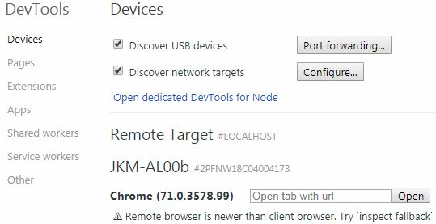

### 一、HTML
#### 1、svg：
```html
<svg width="300" height="300" xmlns="http://www.w3.org/2000/svg" version="1.1"></svg>

<!--xmlns：xlink表示前缀为xlink的元素应该由理解该规范的UA使用xlink规范来解释.
xmlns定义了默认命名空间,因此不需要前缀,-->

<!--rx，ry控制圆角-->
<rect x="" y="" width="" rx="10" ry="20" height="" style="fill:red;stroke-width:2;stroke:blue;"/>
//rect标签绘制矩形，x,y为位置,fill,stroke等属性可写在style外。
<circle cx="" cy="" r=""/>绘制圆，cx,cy为位置。
<ellipse cx="" cy="" rx="" ry=""/>绘制椭圆，cx,cy为位置，rx,ry为宽高。
<line x1="0" y1="0" x2="20" y2="20"/>绘制线条，x1,y1,x2,y2为起始及结尾坐标。
<polygon points="10,10 20,20 150,320"/>绘制多边形，points中没两个值是一对坐标。
<polyline points=""/>绘制折线
<path d="M10 5L100 15C19 60,50 99"/>绘制任意路径、形状。d中属性如下：

<g></g><!--其它元素可以放到里面，做一组使用，无其它实意-->
<defs><!--用于定义模板，其它标签用xlink引用-->
    <path id="a1" d="M0 50 C150 150 100 -50 300 50" stroke="#000" fill="none"/>
</defs>
<text x="10" y="15">
    <!--text用于在svg中放置文字-->
    <textPath xlink:href="#a1">在平坦的路上曲折前行</textPath>
</text>
```
M：移动至起始点，必须。L：直线结束点。H：从当前点画水平线。V:垂直线。C:三阶贝塞尔曲线。Q：二阶贝塞尔曲线。
(将元素使用appendChild()方法动态添加到svg中并不会被显示出来,可以使用svg.innerHTML方法将元素写入)。[基础部分学习地址](http://www.mamicode.com/info-detail-1988813.html)
**svg内联**：css的background-img的url可以显示链接图片和base64图片，将svg转为base64的也能在其中显示出来，部分版本较高的浏览器可以直接用svg代码，如下：
```css
.aa{
    background:url('data:image/svg+xml;utf8,<svg version="1.1" xmlns="http://www.w3.org/2000/svg" version="1.1">...');
}
/*ie和一些浏览器中不能显示出来，但可以使用
-------js的encodeURIComponent()方法将其转码后使用,注意需要xmlns属性：
*/
.bb{
    background: url(data:image/svg+xml,%3Csvg%...) no-repeat center;
}
/*这种内联的svg渲染几乎无延迟*/
```
**svgIcon**：目前常用的使用自绘制的svg图标方法：
1. 写一个公共组件放置引用svg图标：
```vue
<template>
  <div v-if="isExternal" :style="styleExternalIcon" class="svg-external-icon svg-icon" v-on="$listeners" />
  <svg v-else :class="svgClass" aria-hidden="true" v-on="$listeners">
    <use :xlink:href="iconName" />
  </svg>
</template>
```
2. js文件中用require.context()返回所有svg文件。

```js
/**svg文件示例：code.svg
<?xml version="1.0" standalone="no"?>
<!DOCTYPE svg PUBLIC "-//W3C//DTD SVG 1.1//EN" "http://www.w3.org/Graphics/SVG/1.1/DTD/svg11.dtd">
<svg class="icon" xmlns="..."><defs><style type="text/css"></style></defs>
<path d="..."/>
</svg>
*/

import Vue from 'vue'
import SvgIcon from '@cmp/private/SvgIcon'// svg component

// register globally
Vue.component('svg-icon', SvgIcon)

const req = require.context('./svg', false, /\.svg$/)//返回一个webpack环境上下文（函数），包含文件id，keys等属性。

const requireAll = requireContext => requireContext.keys().map(requireContext)
requireAll(req)//全部遍历出来。
```
3. 入口引入，并在webpack中使用`svg-sprite-loader`，然后配置，处理这些svg文件。

**table的使用**：
```html
<table border="1" cellspacing="0">
<thead><!--border为线宽，cellspacing为格间距-->
<tr><th></th></tr>
</thead>
<tbody>
<tr><td rowspan="2" colspan="3"></td></tr>
</tbody>
</table>
```
#### 2、页面渲染过程：
- 先向服务端请求html网页。对html内容由上至下进行扫描，然后从头加载。
- 由上至下将内容构建DOM树和CSSOM树。
- 如果中途遇到css请求资源的加载会先请求css资源，然后加入到cssom树的构建中。
- 若中途遇到js，会先阻塞DOM树，因为js可以操作DOM。
- 两颗树构建完成之后会构建渲染树，由cssom树和dom树合并而成。
- [参考学习地址。](https://www.cnblogs.com/chenyoumei/p/9156849.html)

**页面的重绘与重排**（回流）：元素颜色的改变、css3的一些变换等会引起页面的重绘，不过重绘速度非常快。而元素大小、display、position、float、overflow，js的resize等会导致对页面的重新布局，即重排（也称回流）。无论是渲染树构建过程和渲染完毕后。回流比重绘需要的时间多得多，**所以应该尽量避免重排**。
#### 3、第三方资源的加载：
很多加载资源的标签：iframe,video,audio,img,script,link等是用src属性或是用href属性，一些标签不能跨域加载资源多数标签允许跨域加载资源。除了link和script外其它标签几乎都有onload事件和onerror事件可在元素上添加这两个事件做加载成功和加载失败后的处理。js代码中的函数块语句需要达到相应的条件才能触发（body，head中添加的onload和`<script></script>`中的window.onload=“”除外)就算是onmouseout指定的函数也不行，因为它运行的前提就是有onmouseover被触发。
**link标签**：
```html
<link href="http://a...pp.jpg" rel="prefetch"/><!--prefetch表示预加载-->
<link href="http://a...pp.css" rel="stylesheet"/><!--导入css-->
```
**外部资源引入标签**：
`<embed></embed>、<iframe></iframe>、<object></object>`
`<embed type="image/svg+xml" codebase="http:"></embed>`标签是H5新标签所有主流浏览器都支持，codebase属性中写资源路径,可以引入脚本;类似iframe标签用于引入外资源(`<iframe>`标签只在大部分浏览器可用),但规范的xhtml和html中不支持`<embed>`标签.`<object data="rect.svg" type="image/svg+xml" codebase="http">`
`</object>`标签是H4的新标签，浏览器支持性差，但不能引入脚本.(引入的文件中的js对象和本页的js对象是不能共用的,且在引入的文件中获取的url也不是该页的)
**引入页面中刷新父页面更改浏览器url**：
在`<iframe><embed><object>`标签中若是有用到跳转页面使用window.location.href或window.open()或a标签中的跳转，页面跳转后还是只是显示在\<iframe>...这些标签之中，但使用window.parent.frames.location.href = ""能让上一个页面跳转或直接`window.parent.location.href,window.top.location.href`让最外层的页面跳转，a标签中的跳转可用target="parent"和target="top"来实现。获取前一页url：document.referrer;//包括传参也会获取到
#### 4、canvas:
`<canvas width="500" height="500"></canvas>`
```js
//-----HTMLCanvasElement//表示页面内所有canvas元素，其余元素也有此类似对象。
HTMLCanvasElement.toDataURL()//方法将画布转化为base64图片格式。
HTMLCanvasElement.toBlob()//方法将画布转化为Blob对象。
var ctx = canvas.getContext("2d")//获取2d对象

ctx.fillStyle = "blue"//填充颜色需要放在绘制形状前
ctx.fillRect(x,y,width,height)//矩形填充颜色...
ctx.clearRect(x,y,width,height)//矩形清除图像像素
ctx.strokeRect(x,y,width,height)//绘制一个矩形框
ctx.fillText("str",x,y)//填充文字时不能填充其它且不能绘制形状。
ctx.font = "20px Arial"//定义字体大小及类型。
ctx.textAlign='center'//left,start,right,end

ctx.beginPath()//绘制路径，不规则图圆时先调用
ctx.lineWidth=3;//线框
ctx.filter='blur(15px)';//模糊滤镜。
ctx.lineCap="butt"//线头样式,round:圆形头、square:方形头。
ctx.setLineDash([2,5,20,30])//设置为虚线，断点距头位置。
ctx.lineDashOffset=10//设置虚线起始偏离起始点距离。

a = ctx.createLinearGradient(0,0,300,0);//创建一个线性渐变，参数为区域
a.addColorStop(0,"red");//渐变a中添加位置,颜色
b=ctx.createRadialGradient(x0,y0,r0,x1,y1,r1)//中心渐变，两个圆中间的区域
patt=ctx.createPattern(ct1,null)//创建一个填充块，参数1是另一个canvas对象
//可将canvas对象ct1填充到canvas对象ctx中。
ctx.shadowBlur=20//阴影模糊程度
ctx.shadowColor="red"//阴影颜色
ctx.shadowOffsetX=2,ctx.shadowOffsetY=3//阴影偏移
ctx.strokeStyle="orange"//设置边框颜色
//坐标若超出canva画布大小则全部都不能绘制出来
ctx.quadraticCurveTo(10,10,20,20)//二次贝塞尔曲线，中转点，结束点
ctx.bezierCurveTo()//三次贝塞尔曲线
`ctx.arc(x,y,r,stAngle,Math.PI*2)`//绘制圆,控制第5个参数大小控制弧长。
ctx.ellipse(x,y,rx,ry,Math.PI/4)//绘制椭圆
//画圆，椭圆前定义lineWidth值填充strokeStyle值可画出圆环效果。
ctx.clip()//裁剪，使用之前先绘制一个路径区域再调用,裁剪掉区域外的东西
ctx.stroke()//绘制所描绘的路径
ctx.translate(10,10)//画布圆心位置移动,ctx.scale(0.1,0.1)//缩放,
ctx.rotate(Math.PI*30/180)//旋转,(在绘制时若多个变换一起使用需要先使用
translate()//变换否则出现的位置与设计的不一致)
ctx.globalAlpha=0.2;//设置画布全局透明度
/*===========
    图片相关
=============*/
img=new Image()//继承Image类，img.src="mv.jpg"//获取图片文件像素数据。
img.width、img.height、img.data//直接获取该图片的宽高，像素数据。
ctx.drawImage(img,dx,dy,width,height)//绘制图片,img可以是图片、svg、canvas
//图形对象(不写width和height时自己会计算宽高);该方法写在img.onload=function(){}内。
imgdata=ctx.createImageData(300,100)//创建一个全0像素矩阵,可操控每个点值
//使用imgdata.data[0]=230;这种形式改变。
dat=ctx.getImageData(x,y,width,height);//dat.data获取像素矩阵，
//getImageData()方法能获取canvas上任意图形的像素数据。
img.src =canvas.toDataURL(type,scl);//将整个canvas上的像素数据转换为
//base64格式,能直接显示到img中,type有图片格式,有:image/png(默认),
//image/jpeg,image/webp;scl为缩放值(更改图片质量0~1)
ctx.putImageData(imgdata,x,y)//重绘imgdata
ctx.save()//保存当前画布状态到栈空间，restore()方法依次取出。需要配合使用
save()方法放绘制的开头，restore(）方法放绘制的结尾。
```
ctx.globalCompositeOperation="source-over"//图形重叠处理，source-in:重叠部分绘制，source-out:重叠位置不绘制、source-atop:重叠处类似遮罩的绘制、lighter:颜色叠加效果、copy:只显示新内容、xor:互相重叠部分为透明、multiply:顶层像素与底层像素相乘，一般得到黑暗图形、screen:重叠处像素反转、overlay:multiply与screen叠加效果、darken:变暗
lighten:叠加部分变量、color-dodge:底层像素值除顶层像素值、color-burn:颜色加深。底部图层的色值除以顶部图层色值，得到的结果再反相、hard-light:重叠处强光、soft-light:柔光......
(利用globalCompositeOperation中的copy属性可以实现图形的位移、旋转)(如果要用一个2d对象绘制多个图形且让其能产生动画效果那么需要在每个绘制图形前都加一个globalCompositeOperation,属性值不为copy即可)
```js
var cn = document.getElementById("canvas");
function play(){
    var cv = cn.getContext("2d");
    // 以下两个图形用一个2d对象绘制。
    cv.globalCompositeOperation = "copy";
    cv.beginPath();
    cv.moveTo(10,20);
    cv.lineTo(150,230);
    cv.stroke();
    // 绘制另一个图形中间添加globalCompositeOperation属性
   cv.globalCompositeOperation = "source-over";
   //cv.save();若只想用transform中的方法产生动画在这里加上save()末尾用
   //restore()即可产生想要的结果。
   cv.beginPath();
   cv.moveTo(50,200);
   cv.lineTo(310,430);
   cv.stroke();
   cv.restore();
   // 使用这种模式，以上值处改为动态值即可产生动画
   requestAnimationFrame(play);
}

```
用for循环绘制多个图形：
```js
var can = document.getElementById("can");
var ttx = can.getContext("2d");
for(var i=0;i<3;i++){
ttx.globalCompositeOperation = "source-over";
ttx.fillStyle = "blue";
ttx.fillRect(0,i*150,300,150);
ttx.fill();
}

```
只刷新一个画笔的图形：
```js
var can = document.getElementById('can');
var ctx1 = can.getContext('2d');
var ctx2 = can.getContext('2d');
// 一个画布上有两个画笔
ctx1.fillStyle = 'blue';
ctx1.fillRect(0,0,50,100);
ctx1.fill();
ctx2.fillStyle = 'red';
ctx2.fillRect(200,30,150,90);
ctx2.fill();
window.onkeydown = function(){
    //只想改变一个画笔的图形时加上save()和restore()方法。就不影响其它图形了
	ctx2.save();
	ctx2.globalCompositeOperation = 'source';
	ctx2.fillStyle = 'red';
	ctx2.fillRect(200,30,200,90);
	ctx2.fill();
	ctx2.restore();
}

```
第一个条语句用globalCompositeOperation可用for循环配合动态变量，绘制多个图形，放在动画代码中依然可用。
ctx.isPointInPath(x,y);ctx.isPointInStroke(x,y);//检测坐标点x,y是否在画笔对象ctx所绘制的图形中和边框上，canvas上绘制的图形与html元素在生成的方式、操作上不一样所以canvas绘制的图形不能用addEventLisener()来添加鼠标事件，所以可以借用以上这两个方法来添加鼠标事件效果。(不过这两个方法只支持使用begInPath()方法绘制出来的图形对象。)

#### 5、概念
**位图与矢量图**：位图又叫做点阵图，是一个个很小的颜色小方块组合在一起的图片。一个小方块代表1px（像素）。矢量图是由一个个点链接在一起组成的，是根据几何特性来绘制的图像，和位图的分辨率是没有关系的。因此图片放大后也不会失真，不会出现位图的马赛克的样子，也就是说可以无限放大图片。
>图片处理专项：(png转为jpg后一般能缩小一半，但png色彩更丰富，且透明背景属性，所以项目中一般使用的是png)
>jpg：全名是JPEG，是数码相机的常用格式，特点呢就是色彩还原性好，天生适合风景照，可以在照片不明显失真的情况，大幅度降低体积。
>png：png是最适合网络的图片，色彩丰富，png 不适用于颜色很少，或亮度差异十分明显的较简单的图片。

**各设备屏幕尺寸**：手机屏宽范围：300 – 768 px;        平板屏宽范围: 769 – 1199px;笔记本屏宽范围:1200 – 1400px;    台式，一体机屏宽范围:1401 – 1920px;广场电视机:1921 – 99999px。
**缓存**：缓存分为CDN缓存、数据库缓存、代理服务器缓存和浏览器缓存，浏览器的缓存问题主要指的是http缓存即协议层，H5新增的storage缓存 和数据库缓存是应用层缓存。（协议层缓存可以分为强制缓存和对比缓存)。
强制缓存：缓存失效时才会去服务器获取最新资源的方式，就是强制缓存,协议层中可以使用字段expires和cache-control。（暂未知）
对比缓存：先从缓存中获取对应的数据标识，然后向服务器发送请求,确认数据是否更新,如果更新则返回新数据和新缓存;反之返回304状态码（缓存可继续使用）浏览器行为引起的缓存变化：
(1)刷新网页：如果缓存没有失效浏览器会直接使用缓存；
(2)手动刷新（F5）：浏览器会认为缓存失效；
(3)强制刷新（ctrl+F5）：浏览器会直接忽略缓存；
**CDN**：Content Delivery Network，即内容分发网络。CDN是构建在现有网络基础之上的智能虚拟网络，依靠部署在各地的边缘服务器，通过中心平台的负载均衡、内容分发、调度等功能模块，使用户就近获取所需内容，降低网络拥塞，提高用户访问响应速度和命中率。CDN的关键技术主要有内容存储和分发技术。<b c=v>中小企业使用CDN一般是使用其它服务商提供的CDN服务，类似在域名解析处更改DNS地址即可。</b>
**OSS**：OSS 是一个分布式的对象存储服务，提供的是一个 Key-Value 对形式的对象存储服务。用户可以根据 Object 的名称（Key）唯一的获取该Object的内容。
- bucket：存储空间。同一个存储空间的内部是扁平的，没有文件系统的目录等概念，所有的对象都直接隶属于其对应的存储空间。存储空间的名称在 OSS 范围内必须是全局唯一的，一旦创建之后无法修改名称。
- 对象/文件：对象是 OSS 存储数据的基本单元，也被称为 OSS 的文件。对象由元信息（Object Meta），用户数据（Data）和文件名（Key）组成。对象由存储空间内部唯一的 Key 来标识。对象元信息是一个键值对，表示了对象的一些属性，比如最后修改时间、大小等信息，同时用户也可以在元信息中存储一些自定义的信息。
- 访问域名：Endpoint 表示 OSS 对外服务的访问域名。OSS 以 HTTP RESTful API 的形式对外提供服务，当访问不同的 Region 的时候，需要不同的域名。
- AccessKey：AccessKey，简称 AK，指的是访问身份验证中用到的 AccessKeyId 和AccessKeySecret。OSS 通过使用 AccessKeyId 和 AccessKeySecret 对称加密的方法来验证某个请求的发送者身份。AccessKeyId 用于标识用户，AccessKeySecret 是用户用于加密签名字符串和 OSS 用来验证签名字符串的密钥。
- [学习地址。](http://www.360doc.com/content/18/0823/22/49604565_780716594.shtml)
#### 6、web中的安全措施：
1. **sql注入**：通过输入框中输入一些sql的插入、删除等语句，在传到后台时被运行，然后操作数据库。防御：做一些正则匹配，替换输入中的特殊字符等，后台做一些站位等措施。
2. **XSS**： (Cross-Site Scripting)，跨站脚本攻击,因为缩写和 CSS重叠，所以只能叫 XSS。跨站脚本攻击是指通过存在安全漏洞的Web网站注册用户的浏览器内运行非法的HTML标签或JavaScript进行的一种攻击。
- 可能造成以下影响：利用虚假输入表单骗取用户个人信息。利用脚本窃取用户的Cookie值，被害者在不知情的情况下，帮助攻击者发送恶意请求。显示伪造的文章或图片。
- 非持久型XSS：（反射型 XSS ），有通过url传参的网页，攻击者可以直接通过 URL (类似：https://xxx.com/xxx?default=<script>alert(document.cookie)</script>) 注入可执行的脚本代码，如果目标网页获取该参数放于页面的话就会执行该脚本内容。不过一些浏览器如Chrome其内置了一些XSS过滤器，可以防止大部分反射型XSS攻击。
3. 持久型XSS：（存储型 XSS）持久型 XSS 漏洞，一般存在于 Form 表单提交等交互功能，如文章留言，提交文本信息等，黑客利用的 XSS 漏洞，将脚本内容经正常功能提交进入数据库持久保存，当访问该文章时，前端页面获得后端从数据库中读出的内容放到页面上，就会将其渲染执行。

```js
//可以先对代码转码
console.info(btoa(`document.getElementById('tt').innerHTML="进来的人放弃一切希望!"`));
// 然后将转码的代码放到提交内容中。
//这样放到页面中后就能执行onerror里的js代码，并绕过一部分检查。
```
- **防御**：Web 页面渲染的所有内容或者渲染的数据都必须来自于服务端。尽量不要从URL，document.referrer，document.forms 等这种 DOM API 中获取数据直接渲染。尽量不要使用 eval, new Function()，document.write()，document.writeln()，window.setInterval()，innerHTML，document.createElement() 等可执行字符串的方法。<b c=gy>前后端都对输入做检查，检查是否有`<script>`等和一些特殊字符。对于混合开发类的web应用对放置页面的数据进行编码。</b>
- **禁止用户js代码中操作DOM**：
```js
//将用户js代码放到匿名函数中任然无法禁止调用window下的document中。
(function(window, document) {'use strict'
  console.log(this, window, document); // {}, null, null
  const win = (function () {
    return this;
  }());
  console.log(win);   // undefined
  setTimeout(function() {
    console.log(this);  // Window
  });
}).call({}, null, null)
```
**使用worker**：利用worker中不能操作DOM的特性，将用户代码放于worker中执行。
**使用Shadow DOM**：[参考学习地址](https://zhuanlan.zhihu.com/p/355785418)

```js
(function () {
  const root = document.body.attachShadow({mode: 'closed'});
  
  let list;

  function init() {
    root.innerHTML = `
      <h1>Todo List</h1>
      <ul></ul>
    `
    list = root.querySelector('ul');
  }
  
  function addTask(desc) {
    const task = document.createElement('li');
    task.textContent = desc;
    list.appendChild(task);
    return list.children.length - 1;
  }
  
  function removeTask(index) {
    const task = list.children[index];
    if(task) task.remove();
  }
  
  window.init = init;
  window.addTask = addTask;
  window.removeTask = removeTask;
}());

init();
addTask('task1');
```
4. CSRF：CSRF(Cross Site Request Forgery)，即跨站请求伪造，是一种常见的Web攻击，它利用用户已登录的身份，在用户毫不知情的情况下，以用户的名义完成非法操作。
完成 CSRF 攻击必须要有三个条件：用户已经登录了站点 A，并在本地记录了 cookie。在用户没有登出站点 A 的情况下（也就是 cookie 生效的情况下），访问了恶意攻击者提供的引诱危险站点 B (B 站点要求访问站点A)。站点 A 没有做任何 CSRF 防御。
防御：防范 CSRF 攻击可以遵循以下几种规则：Get 请求不对数据进行修改。不让第三方网站访问到用户 Cookie。阻止第三方网站请求接口。请求时附带验证信息，比如验证码或者 Token
5. 点击劫持：是一种视觉欺骗的攻击手段。攻击者将需要攻击的网站通过 iframe 嵌套的方式嵌入自己的网页中，并将 iframe 设置为透明，在页面中透出一个按钮诱导用户点击。
X-FRAME-OPTIONS是一个 HTTP 响应头，在现代浏览器有一个很好的支持。这个 HTTP 响应头 就是为了防御用 iframe 嵌套的点击劫持攻击。
该响应头有三个值可选，分别是：DENY，表示页面不允许通过 iframe 的方式展示。SAMEORIGIN，表示页面可以在相同域名下通过 iframe 的方式展示。ALLOW-FROM，表示页面可以在指定来源的 iframe 中展示。
[web端安全问题及应对方法。](https://www.cnblogs.com/pretty-sunshine/p/11442326.html)
#### 7、HTML规范：
`<!DOCTYPE>` 声明不是 HTML 标签；它是指示 web 浏览器关于页面使用哪个 HTML 版本进行编写的指令。在 HTML 4.01 中，<!DOCTYPE> 声明引用 DTD，因为 HTML 4.01 基于 SGML。DTD 规定了标记语言的规则，这样浏览器才能正确地呈现内容。HTML5 不基于 SGML，所以不需要引用 DTD。[doctype类型参考学习地址。](https://blog.csdn.net/Whisper_a/article/details/38706901)
html5中加了一些新的规范，如下示例：[H5的一些新标签的使用学习地址。](https://www.cnblogs.com/nuanai/p/8856814.html)
```html
<! DOCTYPE html> //声明使用H5规范来解析文档。
<html>// html5中标签名可以用大写，但推荐使用小写。不要省略html,head,body标签。
<head></head>
<body> // 如果父元素中的子元素个数很少时可以不用缩进。每个标签都必须关闭。
 //alt能在图片加载失败时代替图片显示。
// 一行代码尽量少于80个字符。少一些不必要的空行和缩进。
</body>
</html>
```
**meta标签常用属性**：
```html
<meta name="keywords" content="标签,属性,seo优化">
<!--all：文件将被检索，且页面上的链接能够被查询。none时页面上的文件、连接将不能被查询。-->
<meta name="robots" content="All|None|Index|Noindex|Follow|Nofollow">
<meta name="viewport" content="width=device-width, initial-scale=1.0"><!--viewport 是用户网页的可视区域-->
<meta http-equiv="X-UA-Compatible" content = "chrome=1" ><!--用以声明当前页面用chrome内核来渲染。-->
<meta name="renderer" content="webkit"><!--强制浏览器使用webkit内核渲染，当然前提是有该内核-->
<meta http-equiv="Cache-Control" content="cache" /><!--no-cache是不缓存该页面-->
<meta name="apple-mobile-web-app-capable" content="yes"><!--设置Web应用是否以全屏模式运行,content的默认值是no-->
```

#### 9、好用标签：
**hr标签**：
```html
<hr class="hr" data-content="分隔线" /><!--文字会显示在正中-->
<style>
.hr {
    border: 0;
    padding: 3px;
    /*/斜纹分隔线*/
    background: repeating-linear-gradient(135deg, #a2a9b6 0px, #a2a9b6 1px, transparent 1px, transparent 6px);
}
/*波浪线效果*/
.hr::before {
    content: "\2000\2000";
    /* IE浏览器实线代替 */
    text-decoration: overline;
    /* 现代浏览器 */
    text-decoration: overline wavy;
}
.hr::after{
    /*attr()函数可让样式作用与元素的某个属性上，IE8 需要声明 !DOCTYPE 才可以支持 attr() 函数。*/
    content: attr(data-content);/*这里对文字内容进行装饰*/
    position: absolute;
    padding: 4px 1ch;
    top: 50%; left: 50%;
    transform: translate(-50%, -50%);
    color: transparent;
    border: 1px solid #d0d0d5;
}
</style>
```
**marquee标签**：
◎direction表示滚动的方向，值可以是left，right，up，down，默认为left
◎behavior表示滚动的方式，值可以是scroll（连续滚动）slide（滑动一次）alternate（往返滚动）
◎loop表示循环的次数，值是正整数，默认为无限循环
◎scrollamount表示运动速度，值是正整数，默认为6
◎scrolldelay表示停顿时间，值是正整数，默认为0，单位似乎是毫秒
◎align表示元素的垂直对齐方式，值可以是top，middle，bottom，默认为middle
◎bgcolor表示运动区域的背景色，值是16进制的RGB颜色，默认为白色
◎height、width表示运动区域的高度和宽度，值是正整数（单位是像素）或百分数，默认width=100% height为标签内元素的高度
◎hspace、vspace表示元素到区域边界的水平距离和垂直距离，值是正整数，单位是像素。
◎onmouseover=this.stop() onmouseout=this.start()表示当鼠标以上区域的时候滚动停止，当鼠标移开的时候又继续滚动。
**input标签**：
```html
<input type="text" maxlength="5" pattern="[a-z]{5}"/><!--maxlength限制最大输入长度，pattern可写正则匹配-->
<input type="text" readonly="readonly" value="不可编辑" 	autofocus="autofocus"/><!--readonly让内容为只读状态。-->
<input type="number" min="5" max="10"/><!--限制输入范围-->
<!--表单和一些特殊类型的输入，可以用autocomplete属性-->
<form method="get" autocomplete="on">
    <input type="email" name="email" autocomplete="off" />
</form>
<!--list可以指定datalist的id，效果相当于select标签，不过鼠标触碰时才显示倒三角。-->
<input type="url" list="url_list" name="link" />
<datalist id="url_list">
	<option label="W3School" value="http://www.w3school.com.cn" />
	<option label="Google" value="http://www.google.com" />
	<option label="Microsoft" value="http://www.microsoft.com" />
</datalist>
<input type="file" multiple/><!--multiple可选多个-->
<input type="url" required="required" /><!--required在没有输入，但触发submit时会自行提示-->
```
**input所有type类型**：
tel、number、email、text、radio、checkbox、image、date、color、button、submit、hidden、month、password、range、reset、search、time、url、week、file、month、datetime-local
#### 10、文字继承单选框和复选框：
```html
<input type="radio" id="a"/> <label for="a">点我触发前面id为a的单选框</label>
<input type="checkbox" id="b"/> <label for="b">点我触发前面id为b的复选框</label>
{
    appearence:button;//设置单选框或复选框为正常状态。为none时无法使用
}
```
改变复选框状态：
`<input type="checkbox" checked='checked' value='1' id="ele"/>`
写上checked表示默认为选中这与value值无关，动态改变复选框或单选框状态需要用js控制：
```js
ele = document.getElementById("ele");
ele.checked = false;//false表示没选中，true改为选中。
ele.checked;//获取复选框状态返回true/false(布尔值，非字符串)。
```
#### 11、拖拽：
将一个元素拖拽到另一个元素。
```html
<div id="div1" ondrop="drop(event)" ondragover="allowDrop(event)"></div>
<div id="drag1" draggable="true" ondragstart="drag(event)">可拖拽对象</div>
<script>
//    拖拽结束触发。
    function allowDrop(ev) {
            ev.preventDefault();
        }

        function drag(ev) {
        //拖拽该元素时，设置一个键值对，第二个参数用于选中该元素。
            ev.dataTransfer.setData("Text", ev.target.id);
        }

    function drop(ev) {
    // 拖入到该元素上，松开鼠标触发，通过键获取元素id，
       ev.preventDefault();
       var data = ev.dataTransfer.getData("Text");
       ev.target.appendChild(document.getElementById(data));
    }
</script>
```
#### 12、问题及解决：
1. 单个页面多场景问题：逻辑复杂的地方解耦开，分页处理。两个页面公共组件多考虑细分，逻辑部分用mixins抽离较合理。
2. 大页海报绘制问题：使用canvas绘制，计算数据使用workers计算，提高性能。
3. 登录页安全策略：使用md5+非对称加密，使用安全键盘（前端绘制）。加密后的内容如果使用url传参的方式上送，会被浏览器转义部分内容，可以用encodeURIcomponent()编码再传，java用URLDecode
4. **vuex问题**：页面刷新会导致vuex数据丢失，解决的办法是存储时顺便存到缓存，在vuex文件中值的默认值，就使用从缓存恢复或请求的方法，这样其它页面不用做恢复操作。

```js
//===其它页面存储
window.sessionStorage.setItem("data",JSON.stringify(data));
//===vuex配置
var a = window.sessionStorage.getItem("data");
var state = {
    userInfo: JSON.parse(a);//解析使用
}
```
5. **props问题**：props中的值是单向的，子组件改变props中的值时会触发error，可以将props中的值赋值到data中去（若是接口请求的数据在子组件created阶段），然后修改data中的该值。
```html
// 父组件
<child :cas="cases"/>
<!--父组件获取值较慢，子组件created()中得到的是赋值前的状态。-->
<script>rpc(url,{}).then(res=>{
    this.cases = res.data;
    this.$refs.child.caval = this.cases;// 可以主动更新子组件中的值。
})</script>
// 子组件
<input v-model="caval"/>
<script>
export default {
    watch:{
        cas(nv){if(this.cas.length===this.caval.length){
            this.vaval = nv;//nv是深拷贝来的,注意条件判断，不然可能值接收不全或死循环。
        }}
    },
    created(){
        // 每次组件用完不销毁的话，只触发一次
        this.vaval = Object.create(this.cas);
    }
}
</script>
```
6. vue自定义组件最大复用问题：ui样式一致，但内部逻辑变化差距过大的情况不再适合作为同一个组件，但ui样式可以抽离出来，其它部分不共用。

```html
/*=======将公共样式放在一个总类中。
.common-css{...}
*/
<template></template>
<script>
export default {mixins:[mixin...]}//将一些公用的js方法以mixin注入，达到最大复用。
</script>
```

### 二、CSS
:::alert-info
简介：css(Cascading Style Sheets)层叠样式表，1996-12-17css1诞生，2003年1月svg被定为w3c规范，但当时的网页只是图文内容，css更受偏爱。
:::
#### 1、基础：
- **流**：俗称文档流，指的是css中的基本的定位和布局机制，css中的布局规则。所以从上而下从左至右的描述只是css的一个默认流而已。
- **自适应布局**：对凡是具有自适应布局的一类统称，流体布局是自适应布局的一部分，但**流体布局**狭窄的多，<b class="violet">如div+css就是流布局，而table布局则不属于流布局，因为css真正是从css2.1开始的，IE8开始支持它，在这之前table就已经存在，所以ie8前的浏览器多数使用table布局。</b>
- **css3**：移动端的掀起崔氏css3的产生，css3中新添了很多丰富网页的属性，如3d、变换、渐变、圆角、弹性布局、栅格布局、动画等。但并未影响，更新之前2.1的流属性。
- **未定义行为**：相同的css代码在不同浏览器可能效果不一样，甚至不显示，这并非bug。因为各浏览器厂商去实现css时有一些自己的理解和定义，导致一些特殊情况未在其规则内导致的差异，繁杂多变的情况总有遗漏。<b class="gray">如伪类::activity元素上同时绑定事件，事件中使用`event.preventDefault()`#这样能使拖动之类的效果更流畅，但火狐上不会显示active定义的行为。</b>
- **盒模型**：box-sizing:`content-box`;//定义的width不包含border宽度，即总宽度= padding值+border值+width值（margin值不算元素宽度）但如果是背景图片依然会占据padding部分（不会占据border部分），文本内容不会占据padding部分；Box-sizing:`border-box`//定义的width包含padding值和border值即：总宽度=width；背景图片占据padding部分。（伪类元素定义出来的是content-	box模型，即使通配符中已经定义了box-sizing:boder-box）。
- **自动换行**：word-break：break-all或white—space：normal来实现自动换行。引入外部文件中的资源地址不能用斜杠开头(一些浏览器不能识别)固定定位只相对于window窗口，无论该元素放到上面元素里。
- **BFC**：（块级格式化上下文），是一个独立的渲染区域，让处于 BFC 内部的元素与外部的元素相互隔离，使内外元素的定位不会相互影响。
**BFC的特性**
    1. 内部的Box会在垂直方向上一个接一个的放置。
    2. 垂直方向上的距离由margin决定（只以其中最大一个margin为准）。
    3. bfc的区域不会与float的元素区域重叠。
    4. 计算bfc的高度时，浮动元素也参与计算
    5. bfc就是页面上的一个独立容器，容器里面的子元素不会影响外面元素。
**形成BFC的条件**
    1. 浮动元素，float 除 none 以外的值； 
    2. 定位元素，position（absolute，fixed）； 
    3. display 为以下其中之一的值 inline-block，table-cell，table-caption； 
    4. overflow 除了 visible 以外的值（hidden，auto，scroll）；

- **css选择器**：`div+p`#两个紧挨者的元素，`[attribute]`#选择带有arrtibute属性的元素。[attribute=value]选择等于指定值的。[attribute~=value]属性值中包含该值的。[attribute|=value]属性值中以该value开头的。`p:first-child`#选择p的父元素的第一个子元素(属于p元素)。p:last-child#选最后一个子元素。`p:nth-child(n)`#选择第n个子元素(属于p元素)。p:nth-last-child(2)#从最后子元素开始计数。[css选择器全部](http://www.w3school.com.cn/cssref/css_selectors.asp)
>**选择器优先级**：带!important>内嵌样式>id>类名==属性选择器>标签选择器>通配符(*)>继承(继承父元素的属性)>浏览器默认属性。子选择器用id选择时比id选择器优先级高。
>**选择器的解析**：解析选择器时是从右往左的（如使用`#div>.cc`时是先取.cc再取#div的顺序去构建树【更容易把公共样式放在一个节点】）少用一些子选择器。
- **鼠标样式**：cursor:pointer;//手指,提示可点击。hand//IE5使用的手指样式、wait;//等待、help;//帮助、no-drop;//无法释放、text;//文字，暗示为文字内容、move;//提示可移动对象、crosshair;//十字准心、n-resize;//向上改变大小箭头、s-resize;//向下改变大小箭头、e-resize;//向右改变大小箭头、w-resize;//向左改变大小箭头、ne-resize;//向右上改变大小箭头、nw-resize;//向左上改变大小箭头、se-resize;//向右下改变大小箭头、not-allowed;//禁止、progress;//处理中、default;//提示可移动对象、url();//引入外部文件作为鼠标样式，文件格式必须为.cur或.ani。
- **边框样式**：border:1px dotted red;//dotted:点线、dashed:虚线、double:双边框、groove:3d凹槽、ridge:菱形边框、insert:3d凹边、//outset:3d凸边。
- 外边框：`outline:#00FF00 solid thick;`#样式，样式，宽度。
- textarea标签：resize属性的的各个取值:none：用户不能操纵机制调节元素的尺寸、both：用户可以调节元素的宽度和高度、horizontal：用户可以调节元素的宽度、vertical：让用户可调节元素的高度、
- 删除线：text-decoration:line-through;
- **超出隐藏**：

```css
/*文字超出省略*/
el{
overflow:hidden !important;/*!important的优先级大于内嵌样式*/
text-overflow:ellipsis;
white-space:nowrap;//3个属性一起设置可以让超出的文本变为省略号。
}

el{
overflow: hidden;
text-overflow: ellipsis;
display: -webkit-box;
-webkit-line-clamp: 2; //设置行数
-webkit-box-orient: vertical;
}
```
- **input选中后样式**：
```css
input:foucs{
    outline:none;
    border:1px solid green;
}
/*修改placeholder字体样式*/
input::-webkit-input-placeholder{
    color: revert;
}
```
- **媒体查询器**：`@media only screen and (min-width: 300px) and (max-width: 768px) {}`
- 平滑滚动：scroll-behavier:smooth;//发生滚动时更平滑(锚点跳转、改变scrollTop值)
- 调整字间距：letter-spacing:5px；
- 将table元素中的表格间距取消：border-collapse:collapse;
- 两端对齐：text-align：justify;和text-align-last:justify;(一起使用)。最好将要对其子元素设置为inline-block元素。
- 禁止选中文本：
```css
{
-moz-user-select: none; /*火狐*/
-webkit-user-select: none; /*webkit浏览器*/
-ms-user-select: none; /*IE10*/
-khtml-user-select: none; /*早期浏览器*/
user-select: none;
}
```
- **背景图片设置**：
```css
background:url(" ") no-repeat;
background-position:50% 0; //图片居中
background-size:cover; //占满
```
- **引入外部文件夹中的字体**：
[字体图标的使用]若是使用阿里图标库的话,头部link引入资源,元素中写上类名iconfont,元素内容中写上对应的unicode编码。下载到本地使用的话引入下载的iconfont.css和iconfont.js(那些eot,svg,ttf...文件也要放到项目中)。[css中自带的字体。](https://www.cnblogs.com/fozero/p/6087513.html)
```css
@font-face{
    font-family:sAir;// 自定义的字体名字
    src:url(../font/okj.otf);//一般是otf文件
}
div{font-family:"sAir";}//使用字体
```
-  FOUC(无样式内容闪烁)：Flash Of Unstyled Content ，`<style type="text/css" media="all">@import "../fouc.css";</style> `而引用CSS文件的@import就是造成这个问题的罪魁祸首。IE会先加载整个HTML文档的DOM，然后再去导入外部的CSS文件，使用`<link/>`标签代替即可。<b c=gy>link属于HTML标签，而@import是CSS提供的、页面被加载的时，link会同时被加载，而@import引用的CSS会等到页面被加载完再加载。</b>
- **滚动锚定**：滚动时或点击加载更多，新的内容导致滚动条位置变化，overflow-anchor:auto;状态会保持当前观看内容处于用户视线内，用户感觉不到滚动条位置变化。overflow-anchor:none;关闭时则会优先显示加载的内容。
- 最外层元素高度使用浏览器高：

```css
html,body{/*先让html，body高占全屏。*/
    height:100%;
    overflow:hidden;
}
```
- marker伪元素：

```css
ul::marker{
    /*marker用于定义ul，li中项目符号的颜色、大小甚至内容。普通元素也可以用：display:list-item;然后使用。*/
    content:"▶";
    color:blue;
    font-size:14px;
}
```
- static默认定位下元素**宽可以占满剩余空间**。

```html
<div class="main">
    <div class="left"></div>
    <div class="right"></div>
</div>
<style>
.main {
        height: 100%;
      }
.main > .left {
        height: 100%;
        left: 0;
        top: 0;
        width: 210px;
        background-color: red;
        position: fixed;
}
.main > .right {
        height: 100%;
        background: blue;
        margin-left: 210px;/*设置该属性，使用默认定位*/
}
</style>
```
- **关键字**：几乎可用于所有属性，浏览器上
```css
div{
    color:initial;/*initial表示使用浏览器默认属性值*/
    line-height:inherit;/*inherit表示该属性值继承它的父元素的（非继承属性也可使用）*/
    all:revert;/*all表示所有属性，revert表示该属性值重置为浏览器默认*/
    font-size:unset;/*如果该属性是默认继承属性，该值等同于 inherit。如果该属性是非继承属性，该值等同于 initial*/
}
```
- **var函数**：用于使用自定义的css变量。IE9.1开始支持。

```css
/*:root中定义自己的遍历。*/
:root{
    /*必须要--开头*/
    --wcs-bg:red;
    --wcs-size:80px;
}
/*var()中调用对应的变量值*/
.div{background-color: var(--wcs-bg);}
```
#### 2、尺寸单位：
- **em**：是根据当前元素字体大小而变化的,列入当前元素font-size:14px;width:10em,此时width为140px(每1em为字体大小)。
- **rem**：是继承根部元素(html)的字体大小的,例:html{font-size:16px;}.div{width:10rem;}//width为160px。用以下代码修改根元素大小。

```js
function transfer(win, doc) {
    var W = win.innerWidth;
    var UIW = 750;
    var RATIO = 100; // 1rem = 100px

    if (W < 1000) {
         doc.documentElement.style.fontSize = W / (UIW / RATIO) + "px";
    }
}
window.onResize = transfer;
transfer();
```
- **vw**：视窗宽度，1vw相对于视窗宽度的1%。
- **vh**：视窗高度，1vh相对于视窗高度的1%。
- vmin和vmax：vw和vh中选择最小/最大那个。

#### 3、css3：
- css3倒影：

```css
el{
    box-reflect:below 1px linear-gradient();
    /*box-reflect属性为元素添加倒影
    //效果，第一个值设置方向，第二个值为倒影与元素的距离，第三个值为线性渐变，将
    //渐变设为透明度逐渐增加的白色效果较好，做兼容处理时box-reflect前和渐变前
    //都加上前缀。
    */
}
```
- css3剪切：

```css
el{
    clip-path:polygon(50% 0,10px 100px,150px 100px);//多边形剪切，点位置
    clip-path:circle(50% at 50% 50%);//圆形剪切,半径，圆心坐标
    clip-path:ellipse(30% 20% at 50% 50%);// 椭圆剪切，宽，高，圆心位置
    clip-path:react();//矩形剪切，写入位置，宽高。
}

/*css3实现毛玻璃效果(高斯模糊)：*/
el{
    -webkit-filter:blur(10px);
    -moz-filter:blur(10px);
    -ms-filter:blur(10px);
    filter:blur(10px);
}
```
- css3贝塞尔速度曲线：
```css
el{
    /*默认的贝塞尔速度曲线是从(0,0)到(1,1)的一条匀速直线，括号中的四个数值是.
    perspective-orign:50% 50%;//改变视角位置坐标
    //贝塞尔曲线中的两个点的位置，通过这两个点拉扯曲线，速度安装曲线弯曲度改变。*/
    transition:all 1s cubic-bezier(0.7,0.1,0.9,1);
}
```

**图片遮罩**：mask-image优化png图片加载。如果是不需要透明属性的png图片我们可以直接转为jpg，但如果有透明要求转为jpg后就会透明部分变成白色。
所以使用css的mask-image属性有一张纯色png图(轮廓与原png一样，纯色填充后是以前的1/100大小)遮在jpg图上(png转化后的)，这样使用jpg图片就能代替png了。
```css
img {// 不用担心兼容性问题。
    -webkit-mask-image: url(card-mask.png);
    mask-image: url(card-mask.png);
}
```
渐变：
```css
i{
    /*第一个值为方向，可为：to right,to left,to top,to bottom,10deg*/
    /*默认为to top，使用角度时为顺时针旋转*/
    background: linear-gradient(70deg,#9b3675 15%,#1597bb 40%,#6155a6 90%,#364547 100%);
}
```
#### 4、未知大小元素居中：
- 使用table布局：
```css
.parent1{
    display: table;/*加将元素变为table元素性质*/
    height:300px;
    width: 300px;
    background-color: #FD0C70;
}
.parent1 .child{
    display: table-cell;/*display: table-row=>相当于“tr”标签；display: table-cell=>相当于“td”标签*/
    vertical-align: middle;
    text-align: center;
    color: #fff;
    font-size: 16px;
}
```
- inline-block使用vertical-align:middle;属性。
```css
#tip{
      position: absolute;
      z-index: 100;
      top: 40%;
      left: 50%;
      width: 300px;
      margin-left: -150px;
      text-align: center;
      padding-top: 1px;
      >p{
        display: inline-block;
        position: relative;
        vertical-align:middle;
        padding: 8px 20px;
        color: white;
        background: rgba(0,1,2,.6);
        border-radius: 8px;
        font-size: 14px;
        text-align: center;
      }
    }
```
- 借助css3属性
```css
.parent3 .child{
    position: absolute;
    top: 50%;
    left: 50%;
    color: #fff;
    transform: translate(-50%, -50%);
}
```
- 使用弹性布局的：justify-content:center;align-items:center;
#### 5、弹性布局：
```less
.box{
    display:flex;
    display:-webkit-flex;
    flex-direction:row;//排列方向
    flex-wrap:wrap;//转行类型
    justify-content:space-between;//同一方向一根轴线时对其方式
    align-content:stretch;//同一方向多行元素时的对齐方式，属性值与justify-content一样。
    align-items:center;//元素垂直居中,控制的是另一个轴。stretch为占满高度。
}
.child{
    align-self:flex-end;// 其子元素对应align-item方向上的位置控制.
    order:1;//定义子项目的所在顺序
    flex-basis:500px;    //定义了在分配多余空间之前，项目占据的主轴空间。若内部有内容则flex-basis不再生效。
    flex-grow:2;    //定义元素的放大比例
    flex-shrink:0.5;//定义元素的缩小比例
    //flex:1;能让子元素自适应宽或高。
    flex:0 1 auto; //flex-grow, flex-shrink 和 flex-basis的简写，默认值为0 1 auto。后两个属性可选。
}
```
[flex布局学习地址。](https://www.runoob.com/w3cnote/flex-grammar.html)
**一排固定几个元素**：使用justify-content:space-between且给子元素宽度时，这时宽度不起用，需要加上：flex-direction: row;flex-wrap: wrap;这样每行就能像想象的个数显示。
#### 6、栅栏布局：
:::alert-info
**简介**：栅栏布局也是css3的内容，是一种将元素分割为模块组合形式的布局方式。兼容性也还不错，ie9中需要对父元素做清除浮动操作才能正常显示。
:::

```html
<div class="grid">
    <div><p>1</p></div>
    <div><p>2</p></div>
    <div><p>3</p></div>
</div>
<style lang="less">
.grid{
    display:grid;/*/该box使用grid布局。*/
    grid-template-columns: 150px 1fr 2fr;/*设置每列的宽，fr表示当前列是前一列的倍数。也能用auto*/
    grid-template-rows: [r1] 100px [r2] 100px [r3] auto [r4];/*[r1]是为该位置的网格线起名*/
    grid-gap:20px 10px;/*行间距、列间距*/
    
    justify-items:start;/*各单元格内水平方向位置，end/center/stretch*/
    align-items:center;/*垂直方向，place-items:center end;是两个属性的合并*/

    justify-content:start;/*整个内容区域在容器里面的水平位置，center/end/stretch/space-around/space-between/space-evenly*/
    align-content:center;/*垂直方向，place-content是两者合并*/
    
    div:nth-child(5){
    /*定义该子元素所占行、列数,span表示跨越*/
      grid-column: span 2;
      grid-row: span 2;
    }
    div:nth-child(1){
    /*定义该项目各网格线位置，达到控制该元素位置及大小的目的。*/
      grid-column-start: 1;/*左网格线位置,也可以使用上面定义的网格线名代替数字*/
      grid-column-end: 3;/*右网格线位置*/
      grid-row-start: 2;/*上网格线位置*/
      grid-row-end: 4;/*下网格线位置*/
    }
}
</style>
```
- [学习地址。](http://www.ruanyifeng.com/blog/2019/03/grid-layout-tutorial.html)
#### 7、预编译的css：
- **sass与scss**：scss是sass的升级版。

```scss
//mixin可以定义一个你想重复使用的代码块，并可传参。
@mixin corner-icon($name, $top-or-bottom, $left-or-right) {
    background-image: url("/icons/#{$name}.svg");
    position: absolute;
    #{$top-or-bottom}: 0;
    #{$left-or-right}: 0;
}
@use 'foundation/code';//导入指定目录下的scss文件，而且下方可以使用里面定义的变量。
@import 'foundation/code', 'foundation/lists';//也用于导入文件。
.cir{
    $fs:30px;//定义变量和使用
    width:$fs / 2;
    margin: {
        bottom: 10px;//有-的属性可以这样写成对象形式。
        top: 2px;
    }
    border-radius: if($rounded-corners, 5px, null);//if函数，参数分别是条件，true对应的值，false对应的值。
    &:hover { font-size: 36px;}//伪类写法
    @include corner-icon("mail", top, left);//用include调用该代码块。
}
// 定义函数
@function px2vw($p){
    @return ($p/1920)*100vw;
}
.ff{width:px2vw(150);}
/*-----使用deep来改变第三方组件库中的样式*/
/deep/.el-input{
    .el-input_count{height:50px;}
}
/*==========
    最新语法使用::v-deep代替/deep/
============*/
::v-deep .el-input{}

// 定义变量
$menuBg: #9966ff;
$subMenuBg: #9933ff;
$subMenuHover: #9900ff;
// 使用export将它们导出，js可使用。import variable from "var.scss";//variable.menuBg
:export{
    menuBg:$menuBg;
    subMenuBg:$subMenuBg;
}
```
- [sass中文档](https://www.sasscss.com/documentation/syntax/parsing)
- **less**：
```less
@import "typo.css";//导入文件。
@width: 10px;
.bordered {
  border-top: dotted 1px black;
  border-bottom: solid 2px black;
}
#menu a {
  color: #111;
  .bordered();//less中的混合。
  &:after {
    content: " ";
    display: block;
  }
}
```
- [less文档。](https://less.bootcss.com/#概览)
#### 8. css架构：
- 命令规则：一般使用BEM命名方式：`模块_描述--详细描述`，一套组件内的命令：`c-`。表状态：`is-或has-`。示例如下：
```html
<div class="comment--info">
    <p class="comment_title--text">title<span class="is-show"></span></p>
</div>
```
- 基本样式：网站想设置的全局默认样式（大小、边距、颜色等），包括更改组件库样式。将它们在主入口文件处导入。
- 对象：只关注布局的css，将它们与基本样式分开放置。
- 全局变量：常用到的颜色、尺寸放在一个定义变量的文件中，其它文件使用。
- mixin：使用多的复杂样式也可以定义为minx，然后include注入使用。
- [参考学习地址](https://zhuanlan.zhihu.com/p/32952130)

### 三、javascript
:::alert-info
**简介**：JavaScript由3部分组成：**ECMAScript**：解释器。翻译兼容性：完全兼容。**DOM**：Document Object Model （文本对象）兼容性：部分不兼容。**BOM**：Browser Object Model （浏览器对象）兼容性：不兼容（例如IE，谷歌，火狐，不可能兼容），核心是window，全局对象。dom针对的是标准的客户端控件，html标记的这些浏览器展现的内容。bom针对的是浏览器，BOM是浏览器对象模型，DOM是文档对象模型，前者是对浏览器本身进行操作，而后者是对浏览器（可看成容器）内的内容进行操作。js是**脚本语言**、**单线程**语言。
:::

#### 1、数据类型：
数据类型包括：数值、字符串、布尔、null(表示尚未存在的对象)、undefined(当声明的变量还未被初始化时，变量的默认值为undefined。)、对象(对象又包括列表、函数、字典)，6种。#alert(null == undefined); //output "true"  。ert(null === undefined); //output "false" 
**数值**：
`parseInt("fjdk889")`//转为整型889,剔除字符串。`parseFloat()`//转为float型。`num.toFixed(2)`;//保留小数位数。8进制，十六进制数也可直接写入：`var v = 070`#八进制的56。`var c = 0XA`#16进制的10。**转为字符串**：num.toString();
- **含e的数**：一般表示极大极小值`var m = 3.125e7`#等价于`3.125 * 10^7`。`var c = 3e - 7`#0.00....03。
- **浮点数计算精度丢失问题**：`console.log(24314310.3412 / 100000)>>243.14310341200002`。所有编程语言都存在的问题，这是由于计算机本身特性导致的。小数位数过长，或有时计算中小数点参与移动。所以前端尽量不要使用浮点数的计算。**解决思路**：将小数转为整数，按特别方法计算后再移动小数点。
数值与字符串的运算：`1 + "1" == "1" + "1" = '11'`#除了+是字符串连接，其它运算操作符情况会被先当做数值计算。
- **NaN**：用于表示一个本应该是数值，返回却是非数值的情况，如数值比上0，NaN与其它数值操作同为NaN，`NaN == NaN返回false`。用isNaN()可检测。

**字符**：
其它类型转为string：`String(val)`#无论val是什么类型都会转为对应的字符串。
```js
parseInt('0xAA',16)//parseInt第二个参数可以指定将字符串转为直接的进制数。0xAA本身是16进制。
x.toString()//转为字符串。`x.replace(/target/g,'')`//替换,g表示所有满足的都替换。`x.concat(“a”,”b”)`//可与x连接多个字符串。
x.charAt(index)//查找字符串的对应下标的值,`“justice”.charAt(1)=”u”`。
"a".toUpperCase();//方法将小写字母转换为大写,`"A".toLowerCase()`#将大写字母转为小写。
str.substring(start,end)//提取字符串中介于两个下标间的字符串，一个参数时为start，截取后面所有。**在源数据上操作**。
str.substr(start,length)//第二个参数为选择从start起截取多少个长度字符。<b c=r>不改变原数据的值。</b>
str.indexOf('aa')//查找字符串位置。
str.search('abc')//找到子串开始位置。
str1.concat(str2)//连接两个字符串，返回一个新的值。
"*".repeat(3)//生成3个重复的字符。

"aaj,b_b".lastIndexOf("b",2);// 返回最后一个字符出现的位置，第二个参数表示开始检索的位置。
var str = '大米:2.57斤/元,白菜:3.65元/斤';
var arr = str.match(/\d+(.\d+)?/g); //match()方法找到所有匹配的项，返回一个数组。
```
- **js的正则表达式**：
```js
//i表示不区分大小写，g表示匹配全局，m表示可匹配多行。
var a = /e/i;
var b = new RegExp('e');
let reg = /ac/i;
reg.compile(reg);
//compile方法：该方法的作用是能够对正则表达式进行编译，被编译过的正则在使用的时候效率会更高，适合于对一个正则多次调用的情况下
console.log(a.test('aaebc'));// 返回布尔值
console.log(a.exec('kke,mme'));//只能找到第一个匹配项，放回一个列表形式的记录（有匹配到的值）。
```
**数组**：

```js
list.indexOf(1)//找到第一个1在列表中的位置，不在则返回-1。
list.includes(1)//是否包含1，返回布尔值。
list.join("-")//将各元素用字符链接。
list.push(1)//在列表最后添加值。
list.pop();//删除最后一个元素。
list.unshift();//在数组最前端添加一个新的值。
Array.from('dafl');//[d,a,f,l]
[1,2,3].toString();//"1,2,3"
Array.isArray({});//false
arr.sort()//不传参数的话，默认将arr中的值看成字符串来排序。
k = arr.from(T)//T转换成数组，T可以是字符串、列表、set。
var k = arr.concat([1,2,3]);//or concat(6)
var a = arr.some(function(item,index,arr){if(item>2){return true;}})//返回true时会结束遍历，arr是整个数组本身。a为布尔值。
var a = arr.find((x)=>{return x>=4;})//与some类似用法。返回为true时对应的值。
var b = arr.filter((x)=>{return x%2==0;})//返回所有满足条件的值，是一个数组。
list.reverse()//将数组倒置，[1,2,3].reverse();//[3,2,1]。
list.shift()//移除第一个元素。
//instanceof//检查一个对象是否为了一个对象中的实例，Console.log(p1 instanceof p2);//p1是否为p2中的实例；
/*=============
    数组迭代器
===============*/
var e = ['a', 'b', 'c'].entries();
e.next().value;//[0, 'a'];
/*===============
    全条件满足（全满足时为true）
=================*/
const _all = [1,2,3].every(v=>{
    if(v<4){return true;}
    else{return false;}
})

var arr = [1,8,2,4,3,9,0];
// filter函数接收一个函数，这个函数作用于每一个值，返回true或false决定是否丢弃该值。
var r = arr.filter(function (s) {
     return s==2; // 注意：IE9以下的版本没有trim()方法
});
//----sort()实现的排序的思想，传入函数作为参数，以灵活的用于各种情况。
arr.sort(function(a,b){
    //火狐使用归并排序，google使用快速+插入。b在a之前，循环用a与b比较。
    if (a > b) {
        return 1;//1表示不变。
      } else if (a < b) {
        return -1;//表示a,b交换位置。
      } else {
        return 0;
      }
});
//----reduce()计算总和。
function getSum(total, num) {//total是上一次return的结果，num是数组元素
    console.info(">", total, num);
    return total + num;
}
console.warn(numbers.reduce(getSum));
```

- 注意：按引用类型操作的值，其后面操作改变了值，但前面值打印出来和改变后是一样的。

- **数组去重**：

```js
function unique (arr) {
  return Array.from(new Set(arr));//使用集和。
}
unique([1,1,'true','true',true,true])
//splice
var arr = [1,2,3,4,5,6];
arr.splice(2)//删除2及之后的值。
arr.splice(0,2);//表示删除0,1位置的值，第二个参数表示删除的个数。
//插入、第三个参数表示在当前索引后插入的数。
arr.splice(1,0,7)//[1,7,2,3,4,5,6] ！！
arr.splice(1,1,7)//[1,7,3,4,5,6]

arr.forEach(function(value,index,data){});
```
**对象**：从对象中取出多个属性然后上传时的场景，如果用obj.property的方式取值，若缺少该值时程序可能会**不执行也不报错**。
```js
var obj = {a:1,b:3};
Object.getPrototypeOf(person1) == Person.prototype; //true，获取对象属性。
Object.getPrototypeOf(person1).name; //"Nicholas",但不能通过此方法来更改。
Object.keys({a:1,b:2});//可枚举出对象的属性。
Object.values(dict);//value值做一个数组
// 键值对按数组返回
Object.entries({a:3,b:8});//[['a',3],['b',8]]

Object.is(obj1,obj2);//可对比两个值是否相等
//冻结该对象，不能对其做修改
Object.freeze(obj);
//对象不能再添加新的属性。可修改，删除现有属性，不能添加新属性。
Object.preventExtensions(obj);
// 判断是否有指定属性
obj.hasOwnProperty('a');
//判断obj是否在obj2的原型链上。
obj.isPrototypeOf(obj2)
//getOwnPropertyNames()方法可以得到所有属性，包括对象的不可枚举属性。
Object.getOwnPropertyNames(Person.prototype);
//将对象的某个属性设置为是否可枚举。
Object.defineProperty(Person.prototype, "constructor", { 
 enumerable: false, 
 value: Person 
});
// res是有更新部分的数据，obj1是最终数据。
var res = Object.assign(obj1, obj2,...);//将obj1后的对象中的属性赋给obj1，相同的键值会覆盖。
//Object.defineProperty与Object.defineProperties
var obj = {name:'wcs',age:21,hob:[1,2],at:{a:5,b:9}}
Object.defineProperty(obj,'name',{
    set:function(val){alert('你修改了值name'+val);},
    get:function(){alert('你获取了值name');}
});
//----缺点：无法监听到增加和删除操作，无法监听到内部数组的改变。
Object.defineProperty(obj.hob,'0',{});// 监听改变对象中的数组值时
Object.defineProperty(obj.at,'a',{})
/*================
    Object.create()
该方法创建的数据只是指针指向原型，添加时才会在自身数据上添加，不大建议使用！
==================*/
Object.create({a:1,b:2});
```
Object.defineProperty()方法可传有三个参数，第一个是要监听的对象，第二个是参数是该对象中已有的属性或未有的属性，第三个参数是对象的形式，里面可以写两个方法，set方法在改变目标对象中指定属性(第二个参数)时触发的函数，可传入一个参数表示被修改的值，get方法在目标对象指定属性值被获取时触发。set方法和get方法都是在对应的操作前就先触发的，比如：obj.name = 'jieke',是先触发set方法再运行obj.name='jieke'语句；第三个参数中也可以写访问器属性：
```js
Object.defineProperty(obj,'name',{
    configurable:true,//表示能否通过delete删除此属性,默认为true
    writable:true,//表示能否修改此属性值，默认true
    enumerable:false,//表示该属性能否被for in等方法枚举，默认true
    value:"wcs"//直接为该属性赋值
});
```
在第三个参数中写以上属性都不能与get,set一起使用。
```js
 Object.defineProperties(obj,{//defineProperties()方法同时设置多个值
     name:{
         value:'张三',
         configurable:false,
         writable:true,
         enumerable:true
     },
     age:{value:'李四'}
 });
 Object.getOwnPropertyDescriptor(obj,'name');//获取目标对象指定属性的描述
```
- [Object方法集学习地址](https://www.cnblogs.com/mopagunda/p/8328084.html)
- **列表，字典均属于Object类型**，即：`[1,2] instanceof Object`#为true，但`{a:1,b:2} instanceof Array`#为false。
**undefined**：派生自null，因此`null==undefined`#返回true，使用全等符号才会返回false。已声明，未赋值的变量依然是undefined。但是没有声明的值使用，会直接报错。然而使用`typeof no(未声明值)`#得到的也是undefined类型，所以undefined不属于Object。
**null**：表示一个空对象指针，因此用typeof检测时返回object（但`null instanceof Object`返回false）。如果该变量之后用于赋值一个对象，那初始赋值可以置为null。
**布尔值**：`0，空字符串、null、undefined、false`都是当做false。
**Set**：es6新增数据类型，集合属于数学的概念。Set属于Object。
```js
// set转数组
const items = new Set([1,2,3,4,5]);
const array = Array.from(items);
```
**symbol**：es6新加的数据类型，用于做唯一性标识。

```js
let id = Symbol("id");//typeof id = symbol;
 let obj = {
  [id]:'symbol'//普通枚举获取不到。
 };
```
**隐式转换**：在进行变量比较时，js内部会对数据进行相应变换如下：（全等条件下回进行类型的比较，所以这些在**全等下不成立**）
- [] == true;  //false  []转换为字符串'',然后转换为数字0,true转换为数字1，所以为false
- [1,2,3] == '1,2,3' // true  [1,2,3]转化为'1,2,3'，然后和'1,2,3'， so结果为true;
- [1] == 1;  // true  `对象先转换为字符串再转换为数字，二者再比较 [1] => '1' => 1 所以结果为true
- **~~符号的使用**：对变量进行隐式转换。
```js
~~true == 1
~~false == 0
~~"" == 0
```

**数据类型检测**：`console.log(typeof val)`#有string、number、undefined、boolean、function、object（字典和null都显示这个）。
```js
const a = [];
let _typ;
if(typeof a==="object"){
    if(a instanceof Array){
        _typ = "array";
    }else if(a===null){
        _typ = "null";
    }else if(a instanceof Set){
        _typ = "set";
    }{
        _typ = "map";
    }
}else{
    _typ = typeof a;
}
console.info(_typ);
```
**for循环中使用定时器问题**：
```js
//由于var作用域为当前函数，而非当前代码块。
for(var i = 0; i < 5; i++){
   setTimeout(function(){
       console.log(i)//5,5,5,5,5
   }, 200*i);
}
//-----可以放到一个函数内使用。或者将var改为let。
for(var i = 0; i < 5; i++){
    //这种匿名函数就相当于一个块及作用域。
   (function(index){
       setTimeout(function(){
           console.log(index)//0,1,2,3,4
       }, 200*index);
   })(i);
}
```

#### 2、转码：
```js
encodeURIComponent("<svg>")#不会对 ASCII 字母和数字,标点字特殊符等进行编码
encodeURI('汉字');//url传参汉字时可以先encodeURI()对中文编码,浏览器会自动解码
decodeURI();// 再用decodeURI()转码，对汉字解码则不变。

escape()与unescape()://将url地址作为参数传参时可用
document.write(escape("Visit W3School!"))// Visit%20W3School%21
// escape()方法对输入内容进行编码转为机械码能让所有机型识别
document.write(unescape("?!=()#%&"))// %3F%21%3D%28%29%23%25%26
//unescape()方法对机械码进行转码，转为可识别码
//btoa()和atob(),这是属于base64的编解码。
var str = "javascript";
console.log(window.btoa(str))//amF2YXNjcmlwdA==
console.log(atob("amF2YXNjcmlwdA=="))// 'javascript'
```
**进制转换**：
```js
(10).toString(16) // =>"a"。//10进制转为16进制10进制转为16进制
(012).toString(16) // =>"a"。//8进制转为16进制//8进制转为16进制
(0x16).toString(10) // =>"22"。//16进制转为10进制
(0x16).toString(8) // =>"26"。//16进制转为8进制
```
#### 3、基础：
- **SSE与WebSocket**:
SSE(Server-Sent Eevents，服务器发送事件)用于创建到服务器的单向连接。

```js
// EventSource接受的参数必须同源。
// 使用message事件监听从服务器收到的消息，并存储在event.data对象里。
var source = new EventSource('http://127.0.0.1:8080/event/query');
    //只要和服务器连接，就会触发open事件
        source.addEventListener("open",function(){
           console.log("和服务器建立连接");
        });

        //处理服务器响应报文中的load事件
        source.addEventListener("load",function(e){
            console.log("服务器发送给客户端的数据为:" + e.data);
        });

        //如果服务器响应报文中没有指明事件，默认触发message事件
        source.addEventListener("message",function(e){
            console.log("服务器发送给客户端的数据为:" + e.data);
        });

        //发生错误，则会触发error事件
        source.addEventListener("error",function(e){
            console.log("服务器发送给客户端的数据为:" + e.data);
        });
```
WebSocket是一种在单个TCP连接上进行**全双工通讯的协议**，它允许服务端主动向客户端推送数据，浏览器和服务器只用完成一次握手两者之间即可创建持久性的连接，并进行双向数据传输。需要先安装pywebsocket支持websocket服务。
```js
if(window.WebSocket){
    // 继承webscoket类，传入url,可选子协议,wss为加密后的协议。
    var ws = new WebSocket("ws://url",[protocol]);
    ws.onopen = function(){// 连接建立时触发
        ws.send(data);//发送数据
    }
    ws.onmessage = function(res){alert(res);}// 接受到数据时触发
    ws.onclose = function(){//关闭时触发函数}
}
else{alert("连接错误")}
```
- **H5 web Workers**:
workers是让一个js文件在后台执行不影响页面执行速度的一种技术,对一些需要处理大型的数据是一个不错的优化选择，且主流浏览器都支持(除了IE）。可以用在canvas绘制大量图形时，将计算结果返回到主线程然后渲染。<b c=r>worker是一个线程而不是微任务，宏任务的概念</b>

```js
var i = 0;//postMessage()方法将传入其中的值返回给调用它的worker
function start(){postMessage(i);i += 1;setTimeout(start,1000);}
// 另一个js文件中
(function(){
    if(typeof(window.Worker)!='undefined'){
        // 浏览器支持Worker
        var w = new Worker('js/a.js');
        //res为postMessage()返回的对象，res.data获取其中数据
        w.onmessage = function(res){console.log(res.data);}
        w.terminate();//终止worker
    }
})()
```
- **一键复制功能**:
```html
<button onclick="get()">点击复制</button>
<script>
    function get(){
        var int = document.createElement("input");
        int.value = "这是复制内容";
        document.body.appendChild(int);//添加到DOM中才能选择(使用select())
        int.select();//选择input中的内容
        document.execCommand("Copy");// 执行复制语句
        int.style.display = "none";// 复制完后才能隐藏
    }
</script>
```
- **三元运算符**：三元运算符与if语句同样的作用，例：if(x>10 && x<50){alert("hello");}替为 `x>10 && x<50?alert("hello"):alert("flase")`。(两者等价问号前为判断条件，问号后为执行语句，冒号后为else时的语句)。
三元运算符用于赋值：val = val>20 ? 20 : 10;//表示如果val大于20val值就为20，否则为10；
三元运算符中写多条语句：a == 20 ? (a=15,alert(a)) : (a = 21,alert(a));
- **js的异步原理**：浏览器每开一个窗口就是启动一个进程，js代码的运行只使用了一个线程，所以js异步并不是真正的启动线程的异步。js中的任务分为宏任务和微任务，<b c=r>js会先运行主栈中的任务，然后取事件队列先运行微任务，然后运行宏任务</b>。<b c=b>DOM的渲染本身是同步的操作</b>。渲染引擎是另一个线程在执行，为了js线程能控制渲染引擎的动作，<b c=v>每次js微任务执行完后会去检查一下是否需要渲染，所以每帧的渲染间js的计算不要太多</b>，不然会掉帧。
- [参考学习地址。](https://www.cnblogs.com/liangye/p/13461924.html)
>**宏任务**：setTimeout，setInterval，Ajax，DOM事件。**DOM渲染后触发**。
>**微任务**：async/await，then,catch,finally。**DOM渲染前触发**。
```js
//promise中的代码则是一个主线程的执行。
let cc = new Promise((rs, rj) => {
            console.info('a');
            rs();
            console.info('b');
         });
console.info('c');
setTimeout(() => { console.info('d');}, 0);
cc.then(() => {
    console.info('e');
});
console.log('f');
//输出顺序：a,b,c,f,e,d
```
>**异步常见问题**：一个函数（或页面）异步获取数据，然后另一个函数（或跳转另一个页面【单页面跳转】）希望是之前的函数/页面已经取到了数据然后进行的操作，这时这个函数或页面可以**进行异步操作**(利用上面说的异步操作都放另一个队列)来确保之前的数据已经取得。
>**捕获异步错误问题**：
```js
try{// 异步中的错误是无法被try,catch捕获的，所以一般是使用async,await外加try,catch。
    setTimeout(()=>{var a = Mathc.pow(4)},100)
}
catch(err){}
//可以使用onerror做一个劫持。
window.onerror = function(er){return true;}
```
- 回调地狱：这么low的词！指那种多层函数嵌套调用的情况。现在用promise解决。
- **formData的使用**：
```js
const el = document.getElementById("form");
let fd = new FormData(el);    # 不传入元素时是一个空的表单。
formData.append("k1", "v2");
formData.delete("k1");
formData.has("k1"); // true
formData.set("k1", "1"); // 修改
formData.get("name"); // 获取key为name的第一个值
```
**异常**：
```js
// try,catch()
try{
    aleet('fdd');//异常情况会触发catch()
}
catch(err){console.log(err.message);}
// 主动抛出异常
throw 'not a number';//控制台输出：Uncaught: not a number
```
try,catch用于预测一些自己觉得可能会因为语法错误、取值不存在或方法不存在等情况下使用(写在try后的{}中)，catch后可传一个参数值，err.message输出
错误提示(catch后的{}中写发生错误后运行的语句)。try模块中只要有一句语句被判有误就会立刻跳到catch模块中去执行。
**时间**：
```js
var dat = new Date();
dat.getFullYear();// 获取年份
dat.getMonth() + 1;// 获取月份,从0开始所以需要加1
dat.getDate();// 获取号数
dat.getHours();// 获取小时
dat.getTime();//获取从1970/01/01至今过去的毫秒数。
dat.toUTCString();// 将日期转换为字符串
dat.getDay();// 获取星期
var dt1 = new Date();
var dt2 = new Date(dt1);// 将dt1当参数传入
dt2.setDate(dt1.getDate()+5);//将今天的号数设置为5天之后的号数
```
- **监听页面刷新与离开**：onunload：IE6，IE7，IE8 中 刷新页面、关闭浏览器之后、页面跳转之后都会执行；IE9 刷新页面 会执行，页面跳转、关闭浏览器不能执行；firefox(包括firefox3.6) 关闭标签之后、页面跳转之后、刷新页面之后能执行，但关闭浏览器不能执行；Safari 刷新页面、页面跳转之后会执行，但关闭浏览器不能执行；Opera、Chrome 任何情况都不执行。onbeforeunload：IE、Chrome、Safari 完美支持。Firefox 不支持文字提醒信息。**Opera 不支持**。
```js
// 刷新时调用。
window.onbeforeunload = function(event) {
    window.localStorage.removeItem('token');
    //event.returnValue = "我在这写点东西...";
    //return '提示信息';
};
```
- **switch的使用**：

```js
var a = 5;
switch(a){
    case 1:
        a = 9;
        break;// 每个case完使用break;
    case 2://匹配多个条件时写法。case相当于===，所以case 2 || 5这样的写法只等于2。
    case 5:
        alert('hello');
        break;
    default:// 没有匹配到时会运行default，使用switch时一定加上这个。
        alert('结束');
}
```
- **for in与for of**：

```js
// 在原型上绑定一些自定义属性。
Object.prototype.selProto = function(v){console.info(v)}
Array.prototype.ap = "hello ap";

var m = Object.create({a:5,b:3});
var n = [2,4,7];
//---for in（es5语法）会将上面自定义在原型上的属性也遍历出来。Array属于Object，所以ap依然在其中。
for(var i in n){
    //---getOwnPropertyNames()获取只属于该对象的属性，包含length。
    //for in遍历时利用它来筛选。
    if(Object.getOwnPropertyNames(n).indexOf(i)!==-1){
          console.info("in----",i,)
    }
}
//---for of(es6语法)则输出值，且不会遍历原型上的自定义属性。
for(var j of n){
    console.info("of----",j)
}
```
- 交换变量：`[x,y]=[y,x]`。
- 双非运算符：`const f=~~15.57;//15`#与floor效果一样，不过在值大于2147483647时会失效。
- 字符串转数字：`let a = +"13.456";//13.456`#与parseInt，parseFloat效果一致。
- 数字分隔符：`const H = 109_234_711;//109234711`#这种较大的数值时用分隔符并于查看。
- 感叹号：`!!"123"`#true，相当于Boolean()方法对值变换。
- bind的使用：
```js
function mskPhone(val) {
    console.info("this===",this);
    let _s = val.substr(0, 3);
    return _s + "*".repeat(3) + val.substr(7, 11);
}
var cc = mskPhone.bind({a:112});//bind的第一个参数是函数mskPhone的this，其它参数按序传入。
console.info("cc===",cc("18313746328"));//这里调用，参数接着上面的
```
#### 4、文件下载：
```js
export function download(url, params, filename) {
	//"Content-Type": "application/x-www-form-urlencoded",
	return request.post(url, params, {
		headers: {
			"Content-Type": "application/json",
			"Accept-Encoding": "gzip,deflate,br",
			"Accept": "*/*"
		},
		responseType: "blob"
	}).then((data) => {
		const content = data;
        // 将文件转为数据对象。
		const blob = new Blob([content]);
		if ("download" in document.createElement("a")) {
        // 创建a标签，主动触发其点击，然后下载（当前页面下载），用户点击的a标签下载似乎会打开新页面。
			const elink = document.createElement("a");
			elink.download = filename;
			elink.style.display = "none";
			elink.href = URL.createObjectURL(blob);
			document.body.appendChild(elink);
			elink.click();

			URL.revokeObjectURL(elink.href);
			document.body.removeChild(elink);
		} else {
			navigator.msSaveBlob(blob, filename);
		}
	}).catch((r) => {
		console.error("er--",r);
	});
}
```
[Blob的使用](https://www.cnblogs.com/cheng825/p/11694348.html)
#### 7、DOM：
**获取元素尺寸相关**：
```js
el.offsetHeight;// 包括边框+内边距+内容尺寸
el.offsetTop;// 距父元素左边距含margin值
el.clientHeight;// 内边距+内容尺寸
el.clientTop;// 到上边框距离
el.scrollTop// 元素当前内部滚动的距离
el.scrollHeight// 元素内部可滚动的距离，一般比clientHeight大。
ele.style.left="";// 来重新写入该元素的位置，否则返回的永远都只是该元素的初始位置
ele.getBoundingRect().left;// 使用可实时获取元素位置。
```
**元素节点操作**：
```js
p = document.createElement("p");//创建一个节点
document.createTextNode("text");//创建文本节点
el.appendChild(p);//添加孩子节点：末尾添加
p.setAttribute("style","width:10px;height:20px");//在添加完节点后可以用方法来动态改变该元素属性，直接用style则无效。</i>
fa.insertBefore(el,fa.lastChild);//插入节点：fa中插入节点el,在最后一个节点前插入。
el.parentNode;//父节点,选中el的父节点。
el.previousSibling;//选取上一个节点
el.nextSibling;//选取下一个节点
a.contains(b)/a.compareDocumentPosition(b);//判断一个元素是否包含另一个元素
el.removeChild(ak);// 删除元素节点//只能用父元素删除子元素的方式
el.cloneNode();// 复制元素//复制的元素会复制其所有属性,但并不会复制其文本内容和html结构。
el.childNodes;// 返回元素的所有子元素(两种不同情况返回的长度)、
el.childNodes[0].nodeName;//节点名,为间隙或文字则为#text为元素则为。大写的标签名,nodeValue;//节点中的文本内容(非html结构)
```
```html
<p><b>1</b><b>2</b><b>3</b></p>//p.childNodes.length>>3
<p>
<b>1</b>
<b>2</b>
</p>//p.childNodes.length>>4
```
**获取属性**：`ele.style.property`和`window.getComputedStyle('元素','伪类').getPropertyValue('属性')`//这两个方法都是只读属性。
**写入样式**：
- `ele.style["color"] = "red";`可以使用这两种方法来改变其元素的css样式(但是会显示在内嵌样式中)：
- `ele.style.cssText=”width:150px;height:200px;”`;//内嵌样式全部重写。
- `ele.style.setProperty(‘样式名’,’样式值’);`//更新的方式写入，不会去除不相关样式。
- **为元素添加类名或id名**：setATTribute(“class”,“new”)，element.className=””;setATTribute(“id”,”id”),element.id=””;
- 使用removeATTribute(“class”.”id”)（也可用来移除id名）或.classList.remove(“id”)来移除元素类名。
#### 8、音视频：
**调用摄像头**：[参考学习地址](https://developer.mozilla.org/zh-CN/docs/Web/API/MediaDevices/getUserMedia)
- [video所有属性及js方法](https://www.cnblogs.com/TF12138/p/4448108.html)

```html
<video id="vd" poster="" loop autoplay controls width="200" height="300"></video>
<!--
poster：视频封面，没有播放时显示的图片
preload：预加载
autoplay：自动播放
loop：循环播放
controls：浏览器自带的控制条
-->
<video id="video">调用摄像头</video>
<canvas id="canvas"></canvas>
<button onclick="get()">打开摄像头</button>
<button onclick="show()">拍照</button>
<button onclick="deviceClose()">关闭所有设备</button>
<script>
var width = window.innerWidth;
var height = window.innerHeight;
var video = document.getElementById("video");
var stream = null;
/*==============
    video常用方法
  ===============
*/
video.currentTime = 1;//设置开始播放位置
video.controls = "controls";// 显示控制条。
video.play();video.pause();// 播放，暂停。
video.load(); //重新加载src指定的资源
video.volume = value; //音量
video.muted = value; //静音


// 点击调用摄像头
function get() {
    // obj传到getUserMedia()方法中
    var obj = {
         // 设置视图大小，允许录制音频
        video: {
            width: width,
            height: height,
            bitrate: 1500 * 1000,
            keyInterval: 2,
		       // 帧率设置
            frameRate: {
                min: 5,
		           ideal: 10,// 期望最合适的帧率
                max: 15,
            },
            facingMode: "user",// 前后置摄像头设置，user:前，environment:后
        },
        audio: true
    }
    /*    
        ==============================
                兼容性处理
        ==============================
        注意：这些情况才能调用：地址为localhost:// 访问时、地址为https:// 时、为文件访问file:///
        http访问时，navigator.mediaDevices为undefined。
    */
    let photo = navigator.mediaDevices.getUserMedia(obj) ||
                navigator.webkitGetUserMedia(obj) ||
                navigator.mozGetUserMedia(obj) ||
                navigator.msGetUserMedia(obj);
    // 会先获取权限(用户控制)，调用成功的话则运行then()方法
    photo.then(function(MediaStream) {
        // srcObject属性，兼容性处理。
        stream = MediaStream;
        if("srcObject" in video){
            video.srcObject = stream; //图像显示到video元素中
        }else{
            video.src = window.URL.createObjectURL(stream);
        }
        // 导入完毕时显示。
        video.onloadedmetadata = function(e) {
            video.play();
        };
    });
    // 调用失败则运行catch()方法
    photo.catch(function() {
        alert("调用摄像头失败")
    });
}
// 点击拍照
function show() {
    var canvas = document.getElementById("canvas");
    var ctx = canvas.getContext("2d");
    // 上面获取到的but是RGB数组对象。
    ctx.drawImage(video, 0, 0, width, height);
}
// 关闭所有设备
function deviceClose(){
    const devices = stream.getTracks();
    /**数据格式。
        [{contentHint: ""
        enabled: true
        id: "0f4862bc-40cf-4e12-9134-a87f88f8a5b0"
        kind: "audio"
        label: "默认 - 麦克风 (Realtek(R) Audio)"
        muted: false
        onended: null
        onmute: null
        onunmute: null
        readyState: "ended"
        }]
    */
    devices.map(v=>{
        v.stop();
    })
}
</script>
```

**webrtc**：运输层使用的UDP传输。web端视频电话支持技术，里面处理了媒体流数据编码、杂音、画面去噪等功能。
- <b c=r>web端直播推流使用此方法（这里只有大致的思路）</b>
- [参考学习地址](https://www.dazhuanlan.com/2019/12/24/5e0191c6d8816/)，[腾讯的一套webrtc直播sdk](https://github.com/tencentyun/tweblive)
- **HLS**：的工作原理是把整个流分成一个个小的基于 HTTP 的文件来下载，每次只下载一些。当媒体流正在播放时，客户端可以选择从许多不同的备用源中以不同的速率下载同样的资源，允许流媒体会话适应不同的数据速率。[hts与m3u8](https://www.jianshu.com/p/e97f6555a070)
- **m3u8**：该文件实质是一个播放列表（playlist），其可能是一个媒体播放列表（Media Playlist），或者是一个主列表（Master Playlist）。但无论是哪种播放列表，其内部文字使用的都是 utf-8 编码。

```js
/*===*-----  直播端逻辑  ----*===*/
var stream = await navigator.mediaDevices.getUserMedia({audio,video});
var rtc = new RTCPeerConnection(null);
// 将每帧流添加到rtc中。
stream.getTracks().forEach(function (track) {
    //将一个新的媒体音轨添加到一组音轨中，这些音轨将被传输给另一个对等点。
    rtc.addTrack(track);
});
var offer = await rtc.createOffer();// 返回一个本地会话描述。
await rtc.setLocalDescription(offer);// 设置本地描述,然后通过其信令通道将此会话描述发送
// 将信令sdp发送，并获取服务端用于与该客户端连接的sdp。
const sdp = await ajax({url,data:{sdp:offer.sdp,streamurl:""}});
// 将此获取到的sdp设为远程会话描述。
await offer.setRemoteDescription(
    new RTCSessionDescription({ type: "answer", sdp: sdp })
);
/*=========
    收看端
===========*/
// 使用hls.js进行拉流，内部原理暂未了解！。
if (video.canPlayType("application/vnd.apple.mpegurl")) {
    video.src = "http://fjjla.m3u8";
    video.play();
} else if (Hls.isSupported()) {
    // hls.js播放m3u8视频流
    that.flvPlayer = new Hls();
    that.flvPlayer.loadSource("http://fjjla.m3u8");
    that.flvPlayer.attachMedia(video);
    video.play();
}
```
**flv.js**：解析flv文件的拉流实现。
**rtmp推拉流**：
- 推流协议使用rtmp，之前的借助flash插件实现rtmp推流，但flash插件各浏览器几乎已不支持。
- 这个协议建立在TCP协议或者轮询HTTP协议之上。所以理论上可以用js实现rtmp协议，似乎也有人这么做，但没找到相关的解析rtmp协议的js库。
- [git地址](https://github.com/chxj1992/rtmp-streamer)
- [流媒体服务框架](https://github.com/ZLMediaKit/ZLMediaKit)、[EasyMedia浏览器rtmp播放](https://gitee.com/52jian/EasyMedia#https://download.csdn.net/download/Janix520/15785632)
#### 10、选择文件：
input中的file属性提供了一个从本地图库选择图片文件的功能,以下代码将选中的图
片显示在页面上：
```html

<input type="file" onchange="get(this)" multiple="multiple"/>
<!--multiple允许一次选择多张图片-->
<canvas id="can" width="500" height="300"></canvas>
<form id="form"></form>
```
**选择图片并压缩**：
```js
function get(self){
    // self是input元素
    var img = document.getElementById("img");
    var ctx = document.getElementById("can").getContext("2d");
    var cImg,w,h;
    //self.files.length;获取图片张数
    var fil = self.files[0];
    var read = new FileReader();
    read.readAsDataURL(fil);
    read.onload = function(){
        img.src=read.result;
        cImg = new Image();
        cImg.src = read.result;
 // 可直接将read.result直接传给后台
        cImg.onload = function(){
            // 获取原始图片大小
            w = cImg.width;
            h = cImg.height;
   //可以根据w,h的比列缩小画在canvas上再获取相应区域的像素数据传送
            ctx.drawImage(cImg,0,0);//不填入宽高值时是原始打下显示。
        }
    }
}
```
**选择视频并显示**：
```js
<script>
    function get(self) {
        // self是input元素
        var img = document.getElementById("img");
        var vd = document.getElementById("video");
		
        var cImg, w, h;
        //self.files.length;获取图片张数
        var fil = self.files[0];
        var read = new FileReader();

        read.readAsDataURL(fil);
        read.onload = function () {
          //vd.src = fil;
          vd.src = window.URL.createObjectURL(fil);
          vd.load();
		    vd.onloadedmetadata = function(e) {
            // 设置当前播放位置，
			    vd.currentTime = 1;
			    vd.controls = "controls";
			    vd.play();// 不设置播放的话，显示有问题。离开页面后视频显示也会出现同样的问题。
		    }

        };
      }
</script>
```
图片的上传建议放到form表单中再使用FormDat用原生ajax上传,上传的键名是
```js
// form表单中input的name
var form = document.getElementById("form");
var form_ = new FormDat(form);
//设置值，添加值，获取form表单中的值，但不建议这样来改变表单中的值而是建议直接
//将值写到表单里对应的元素的value值中来上传
form_.set('name',value),form_.append('name',vlaue),form_.get('name')
```
#### 14、判断图片加载:
凡带加载性质的元素均有onreadyStateChange事件，不过不同浏览器的支持不同，一些浏览器可能会失效。
img.onload事件(最好用的判断加载的方法)：
```html
<h2 id='h2'></h2>
<script>
    var img = document.getElementById("img");
    var image = new Image();
    image.src = 'https://www.baidu.com';
    if(image.width===0){//判断图片路径是否可用
        console.log('该图片不可用');
    }
    img.onload = function(){document.getElementById("img").innerHTML="ok";}
    img.onerror = funcion(){img.src='';}//图片不可用时触发
//readyStatechange事件(试过google，不支持)
img.onreadystatechange = function(){
    if(img.readyState=="complete"||img.readyState=="loaded"){
        document.getElementById("img").innerHTML="ok";
    }
}
</script>
```
https://www.cnblogs.com/snandy/p/3704938.html
#### 15、兼容性问题：
事件的兼容性处理：
```js
el.onclick = function(event){
    //ie中可直接用window.event/event读取事件，firfox中通过传参传入事件
    var eve = event||window.event;
}

```
**元素选择**：
document.idName/document.getElementById("");//IE
document.getElementById();//其它,统一使用此法
el.parentElement/el.parentNode;//IE,统一使用parentNode

**元素中写入内容**：
el.innerText = "";//多数支持
el.textContent="";//低版本的firefox使用，建议全部用innerHTML代替。
ajax兼容问题：
```js
if(window.XMLHttpRequest){
    var xml = new XMLHttpRequest();//IE7以上支持
}
else{
    var xml = new ActiveXObject("Microsoft.XMLHTTP");
}
contains与compareDocumentPosition
ela.contains(elb);//elb是否在ela中，是则返回true,IE
ela.compareDocumentPosition(elb);//是则返回20，否为10,低版本的firefox
```
https://www.jb51.net/article/81704.htm
https://www.jb51.net/article/84596.htm
#### 16、ajax:
- **原生ajax的写法**：

```js
var xhr = new XMLHttpRequest();
//username和password为url所需要的授权提供认证资格一般不填
xhr.open('post','url',true，username,password);
//该函数会执行3次分别是readyState为2,3,4触发
xhr.setRequestHeader(name,vlaue);//设置请求头,放在open()之后send()之前
xhr.onreadystatechange = function(){
// 开始上传后触发,readyState是本地上传的一个状态，status是服务器返回的一个状态
    if(xhr.readyState==4 && xhr.status==200){
        var res = xhr.responseText;
       res = eval("("+ res +")");
    }
}
xhr.send(obj);//发送数据,必须使用

//https://www.cnblogs.com/ssj-777/p/5364070.html
//ajax中添加头部请求：
$.ajax({
    beforeSend:function(xres){
        xres.setRequestHead('token',"eyJhbGciOiJIUzUxMiJ9.eyJzdWIiOiIxOD")
    },
    //或
    headers:{'Access-Token':$.cookie('access_token')}
})
```
- **两种数据类型**：向服务端发送的数据有Form Data和Request Payload两种，这两种数据类型可以由请求头的Content-Type控制。
>Form Data类型：`Content-Type:"application/x-www-form-urlencoded"`#默认使用的类型，使用POST，但数据不是json格式而是：`rpc.post(url,"key=234&v=9fdf0")`#的类型，在浏览器/netWork/Headers/最下方可以看到。
>Request Payload：`Content-Type:"application/json"`#现在几乎使用这种数据类型，发送一个字典的话会默认将每个键值队拼在url后请求。使用JSON.stringify()将数据转为json在发送是常用的形式。
>Raw：将json格式数据用字符串表示，如：`'{"name":"www","age":"15"}'`#注意，里面的引号是需要的。

- ajax上传文件：使用jquery封装的ajax和axios的ajax先用formdata封装文件再上传时发现浏览器的xhr/head项中没有显示FormData项数据，在请求头中修改Content-Type:'multipart/form-data'后发现head项出现FormData数据了，但是有报跨域问题，这可能跟axios源码中检测数据类型，做的特别处理有关。
```html
<form id='a'><input type="file" name="file"/></form>
<script>
var form = document.getElementById("file-form")
var _form = new FormData(form)
var xhr = new XMLHttpRequest();
xhr.open('post',_url,true)
// 不用设置请求头数据类型，反而直接成功。
xhr.send(_form)
xhr.onreadystatechange = ()=>{
    if(xhr.readyState==4 && xhr.status==200){
        var res = xhr.responseText;
        res = eval("("+ res +")")
          console.log(res)
         }
    }
</script>
```
- **404问题**：404不完全是接口路径的原因，如果后台有请求日志情况的404，可能是传输的数据类型与后台接收类型不一致。<b c=r>若后台没有请求日志，则是前端路径、接口、代理等问题。</b>
- **ajax注入分页**：使用document.write(data)的方法要求分页里只有元素结构（没有meta,html,body等在主页中重复的标签）,可是这样仍会把主页<head></head>标签中的外链样式覆盖为无,我们可以再写一个分页专门用于装效head标签及其里面的外联样式（link,script等）;可是外联的js语句只执行一次就	无效了!!（弃）;若注入分页的js
代码用引入的方式则`<script async='async' src=''></script>`或在注入的ajax代码中将async改为false或ajax代码后加一个延时器延时绑定事件。(一些坑爹的后台框架会劫持所有ajax请求导致报错所以使用需谨慎,本地打开带有使用ajax的文件会产生跨域问题);
**ajax中地址为空情况**：ajax中如果url地址为空在提交时会变成提交到当前页url路径。jquery的ajax中不填写dataType值时jquery会自动判断返回值的类型(所填写的data中的格式不能是json格式)。
<i class="label2">ajax中添加加载动画</i>使用jquery的Ajax是在beforeSend:function(){}中添加动画，在complete:function(){}中取消加载动画。在原生js的ajax中也可以自行在onreadystatechange = function(){}前后添加两个函数也可实现。但beforeSend函数只在第一次请求时触发,所以显示加载动画最好是在调用ajax之前,complete中隐藏加载动画可以加一个延时取消这样交互效果更好。
<i class="label1">ajax接口的处理</i>做项目中在使用到ajax或其它方式对接数据时对接的接口需要用"http://"+获取的本地域名+接口来充当请求数据的接口，这样更换域名后也不会出错。(也可直接写域名后的接口名，在运行时会被自动添加上当前域名)。
- GET与POST的区别：规范中GET是将参数放在url中，POST是将数据放在请求体中，当然也可以反过来。
- **跨域问题**：解决方法如下
>jsonp：使用`<script src="http://a.com?id=15">`标签能跨域的特性，发起get请求让后台返回想要的数据，甚至在里面写上触发前端函数的方法。
>cros：后台直接配置cros即可。**浏览器将CORS请求分成两类**：简单请求（simple request，请求方式受限，字段受限）和非简单请求（not-so-simple request）。
>webscoket和workers的postMessage可以跨域。
#### 17、拦截浏览器回退：
```js
// 拦截history模式的回退。
pushState()和popstate是H5的新属性。
history.pushState(null,null,document.URL);
// 添加popstate事件监听变化。
window.addEventListener('popstate',function(){
history.pushState(null,null,document.URL);
});
// 拦截hash模式的回退
function c(){var url = window.location.href;}//获取到的是变化后的地址。用正则表达式来监听是否是回退到了上一个页面。
window.onhashchange = c; //onhashchange可以今天hash模式的变化，触发函数c。
```
#### 18、json：
```js
var obj = {name:"wcs",id:21}
obj = JSON.stringify(obj);// {"name":"wcs","id":21}
var json = {"name":"mx","id":23}
// eval()方法和JSON.parse()方法都可将json转为js对象，推荐用后一种
json1 = eval("("+ josn +")");//{name:"mx",id:23}
json2 = JSON.parse(json);
```
若是使用动态的方法将js对象转为json格式的话对象中的数值型会变成字符串，需要先用parseint()方法处理后再转换。
强大的eval()方法：
```js
eval()方法可以将字符串转换为可执行的js语句，例：
eval('30>20?alert("ok"):alert("error")');//ok
eval("obj.a."+b+"["+ "'"+v+"'" +"]")//这种情况v两边加单引号。
var obj = {a:{c:1,n:2},b:[0,1,2]};
eval("obj.a.c")//1,eval("obj.a"+['c']])//1
```
#### 19、页面间传值：
1、url传参。(域名或路径后将参数用?或#号分割,参数间用&分割)
2、cookie缓存。(格式建议与url传参写成一样的)
3、Storage缓存。(页面间调用storage中的值,将一个数组存入后会变为逗号分割)
4、window.open()+window.opener

```js
// 页面a：
var a = 55; // 页面a的对象
el.onclick=function(){window.open("b.html");}//打开一个新窗口
// 页面b:
console.log(window.opener.a);//window.opener会将前一个页面的所有对象封装为
//一个对象的形式，b页面可以使用，但对用户体验不好。
```

#### 20、运行环境检测

```js
var browser = {
    versions: function() {
        var u = navigator.userAgent,
            app = navigator.appVersion;
        return { //移动终端浏览器版本信息
            trident: u.indexOf('Trident') > -1, //IE内核
            presto: u.indexOf('Presto') > -1, //opera内核
            webKit: u.indexOf('AppleWebKit') > -1, //苹果、谷歌内核
            gecko: u.indexOf('Gecko') > -1 && u.indexOf('KHTML') === -1, //火狐内核
            mobile: !!u.match(/AppleWebKit.*Mobile.*/), //是否为移动终端
            ios: !!u.match(/\(i[^;]+;( U;)? CPU.+Mac OS X/), //ios终端
            android: u.indexOf('Android') > -1 || u.indexOf('Linux') > -1, //android终端或uc浏览器
            iPhone: u.indexOf('iPhone') > -1, //是否为iPhone或者QQHD浏览器
            iPad: u.indexOf('iPad') > -1, //是否iPad
            webApp: u.indexOf('Safari') === -1 //是否web应该程序，没有头部与底部
        };
    }(),
    language: (navigator.browserLanguage || navigator.language).toLowerCase()
};
console.info(browser);

if (browser.versions.mobile) { //判断是否是移动设备打开。browser代码在下面
    var ua = navigator.userAgent.toLowerCase(); //获取判断用的对象
    if (ua.match(/MicroMessenger/i) === "micromessenger") {
        //在微信中打开
    }
    if (ua.match(/WeiBo/i) === "weibo") {
        //在新浪微博客户端打开
    }
    if (ua.match(/QQ/i) === "qq") {
        //在QQ空间打开
    }
    if (browser.versions.ios) {
        //是否在IOS浏览器打开
    }
    if (browser.versions.android) {
        //是否在安卓浏览器打开
    }
} else {
    //否则就是PC浏览器打开
}
```
动画函数：
```js
function play(){
console.log(a);
window.requestAnimationFrame(play);
}
window.requestAnimationFrame(play);//开始第一帧
cancelAnimationFrame()//方法取消动画。
```

#### 22、jquery的使用：
ready()方法：下载好资源后浏览器先对html文件从上往下进行解析,当遇到css样式表时先解析形成CSSOM,然后DOM和cssom形成一颗渲染树进行渲染(先摆放元素位置大小再加样式)
如果遇到同步js文件(为设置async的script标签)会先解析js文件即:阻断对html的解析.所以推荐奖css样式文件放在头部,js文件放在html尾部。
将引入js文件的位置放在头部时若js文件中获取html中DOM元素就会失败,解决方法：
在`<script>标签中加上异步属性<script src='' async="async"></script>`；
js文件中使用DOMContentLoaded事件：
```
document.addEventListener('DOMContentLoaded',function(){
document.getElementById("ele").style.color="red";
});// ie6,7中使用onreadystatechange事件
```
但window.onload事件会在DOMContentLoaded事件之后加载。而jquery中的ready()方法等三种起手式中都封装了上面的事件，所以引用了jquery之后再在头部中引入其他包含操作DOM元素的js文件也不会报错。将js文件引入位置放在文档尾部</html>内，推荐这么使用。https://www.cnblogs.com/caizhenbo/p/6679478.html
https://developer.mozilla.org/zh-CN/docs/Web/Events/DOMContentLoaded
隐藏和显示：$("p").hide();$("p").show();
淡入淡出：$("#p").fadeIn(1000,callback);$("#p").fadeOut(1000,callback) //第一个参数是变化的时间，第二个参数是运行完成后的回调函数。
动画： $("div").animate({left:'250px'},2000,callback);//变换的属性、时间、运行完后的回调。
#### 23、es6语法：
因为是在2015发布的，所以又用ES2015+来代替。
```js
let a = 10;//#######块级作用域let定义变量,只在定义的块或附近的块有用，如for循环中
let a = () => 1;
alert(a);// 报错 a已被清除。
const a = 20;//const定义常量，第一次赋值后不能被改变。但如果是用来定义一个对象的话是可以改变其值的。
/*#######箭头函数，this*/
let foo = () => 1;//建立一个名为foo的函数返回值1，传参数时就等号后就写括号，
// var f = (1,2) =>{};多个参数时的写法，单个参数可不写括号，箭头指向执行语句
()=>{};// 将无名函数作为一个参数时的写法
v => {this.a = 20};// 将一个有名函数作为参数传入时的写法。箭头函数中的this
//不是指向他的上一级而是指向它本身
/*---------------------类---------------*/
class animal{// 父类
    construct(dat){this.x=20;}
    run(){alert('here run');}
    //不能直接animal.run()调取父类中的方法。
}
class dog extends animal{// 子类,extends继承父类
//construct中接收的参数是new时传来的参数。
    construct(i){super();this.x=23;}
    say(){alert('here say')}
}
var pig = new dog('av');dog.run();// here run
dog.say();// here say
/*construct为构造函数为该类私有方法被继承时无需调用直接运行，extends继承的
/*子类中需要先调用super()方法才能用this添加实例对象因为子类中没有this对象只能/*继承父类中的*/

//#------------------解构
var [a,b,c] = [1,2,3]//a=1,b=2,c=3;
var {a,b} = {a:1,b:2}//a=1,b=2;
for(var i of obj){console.log(i);}//for of方法与for in方法不同，for of是
//迭代对象，它循环中的of表示对象中的每一项。
// 模板字符串
var name = 'your name is' + f_name + l_name;
var name = 'your name is ${f_name} ${l_name}';// 变量写在${}中
//#######模块的使用
import {a,b} from 'pages/home'
import a from 'pages/home/index'
export default{
    a
}
//---------------- 对象属性简写：{name,age,pos}
//----------------------- 延展操作符：
var a = [1,2,3,4,5];
    function c(v){
        console.log(arguments);
    }
c(...a);// 将a中的每个元素拿出来放到c中。

/*==============
     promise
================*/
//常用情况：
function add(n) {
    return new Promise(function(resolve, reject) {
         if (n % 2 === 0) {
              resolve('ok nice');    //成功时使用resolve
         } else {
              reject(`error ${n}`); //失败使用reject，返回参数
         }
    })
}
add(3).then(res => {
   console.warn(res);    //res是resolve或reject中返回的。
}).catch(res => {
   console.info(res);
});

var waitSecond = new Promise(function(resolve, reject)
{
    setTimeout(resolve, 1000);
});
// 异步编程串行化。
waitSecond.then(function()
    {
      console.log("Hello"); // 1秒后输出"Hello"
      return waitSecond;
    })
    .then(function()
    {
        console.log("Hi"); // 2秒后输出"Hi"
    });
/*=================
    async与await的使用，await一定要放在async内部，相当于是promise的两种使用方式。
===================*/

async function funAsy() {
     const a = 1;
     // 使用await可以直接拿到resolve()或reject()的结果赋值给b，否则b就只能是一个promise对象。
     const b = await new Promise((resolve, reject) => {
           setTimeout(function() {
               resolve('time');//如果resolve()在定时器外使用的话，会先与定时器执行。
           }, 3000)
     })
     // 直接输出b的话得到：time
     console.log(b,a);//定时器中的resolve()运行后才会执行这里。
     return b;
}
// 而将b返回使用的话则是一个promise对象。
funAsy().then(res => {console.log(res)});//3s后才会输出。
//！！！    async无法配合使用回调的函数使用，如下：
function a(arr){await c = new Promise...}
async a.call([1,2,3]); //不会报错，但并不会变成同步。所以forEach,map()方法中使用也是无效的。

//---等待所有结果返回：
new Promise.all([pr1,pr2]).then().catch();//任何一个出行catch时触发catch

//-----------------代理proxgy。与就的object方法集一样的作用，都用于监听对象的变化。
//还有其它方法，能监听到一些Object.defineProperty监听不到的东西。
  let test = {
    name: "小红"
  };
  test = new Proxy(test, {
    get(target, key) {
      console.log('获取了getter属性');
      return target[key];
    }
  });
  console.log(test.name);
/*===================
       迭代器与生成器
=====================*/
var a = {
  x: 10,
  y: 20,
};
var iter = Iterator(a);//迭代器
console.log(iter.next()); //使用next()获取下一个值，
function* f() {
 for (let i=0; i<5; i++){
  yield i // 返回并记录函数状态
 }
}
var f = f();//使用yield提供的一个生成器。f.next()调用。
/*=================
    模块化
===================*/
//js文件中用export分别导出，可以是任意数据类型。
export const av = {
    a: 1,
    b: 2
};
export const ab = function() {
    return 'hello';
};
import {av} from 'utils/tool.js';//这样另一个文件中import时就能使用解构的写法。
//都放在default导出的话，另一边import是无法用解构的。
export default {
    av:{},
    ab:function(){}
}

```
#### 26、BOM：
**事件流**：事件流描述的是从页面中接收事件的顺序。事件发生时会在元素节点与根节点之间按照特定的顺序传播，路径所经过的所有节点都会收到该事件，这个传播过程即DOM事件流。事件传播的顺序对应浏览器的两种事件流模型：捕获型事件流和冒泡型事件流。
冒泡型事件流：事件的传播是从最特定的事件目标到最不特定的事件目标。即从DOM树的叶子到根、到window对象。
捕获型事件流：事件的传播是从最不特定的事件目标到最特定的事件目标。即从DOM树的根到叶子。
**事件绑定**：
```js
<p onclick="start()"></p>// 原生的事件绑定。
function start(){};
// js动态绑定事件
document.getElementById("myBtn").addEventListener("click", function(e){
    // 第一个参数是事件类型，第二个参数是一个函数，会为其传入一个参数为事件对象，可以用e.target
    document.getElementById("demo").innerHTML = "Hello World";
});
```
**事件冒泡与事件捕获**：由于老版本的浏览器不支持，因此很少有人使用事件捕获。我们也建议读者放心地使用事件冒泡，在有特殊需要时再使用事件捕获。

**DOM事件流**：**先发生事件捕获再发生事件冒泡**，父元素捕获事件流（捕获阶段不会接收到事件），具体绑定事件的元素接收到事件后再发生事件冒泡。
在不同浏览器中，冒泡的程度不同：IE 6.0:div -> body -> html -> document。其他浏览器:div -> body -> html -> document -> window。
并不是所有的事件都能冒泡，以下事件不冒泡：blur、focus、load、unload。解决办法：
```js
if(event && event.stopPropagation){ // w3c标准
    //event.preventDefault():阻止默认行为；
    event.stopPropagation();//阻止冒泡1.
}else{ // IE系列 IE 678
    event.cancelBubble = true;
}
```
**鼠标事件**：
```js
var el = document.getElementById("el");
el. onmouseenter = function(e){}          //鼠标在进入时触发
el.onmousedown = function(e){}            //鼠标在元素上按下时触发
el.onmousemove = function(e){}            //鼠标在元素上移动时触发
el.onmouseup = function(e){}              //鼠标在元素上松开时触发
el.onmouseover = function(e){}            //鼠标指针移出某个元素到另一个元素上时发生
el.mouseout = function(e){}               //鼠标指针位于某个元素上且将要移出元素的边界时发
el.onmouseleave = function(e){}           //鼠标指针位移出元素时发生
```

**事件委托/代理**：利用事件冒泡，我们想让用户点击一个块的每个子元素都触发一个事件，可以将该事件绑定再这些子元素的父元素上就可以不用每个子元素都去绑定了。
**获取鼠标事件目标的属性**：
```js
event.target.nodeName//获取事件触发的标签名
event.target.className//获取事件触发的元素的类名
event.target.id//获取事件所触发的元素的id名
event.target.innerHTML//获取事件触发的元内容
e.currentTarget//指的是真正触发事件的那个元素;e.target：触发事件元素的父级元素。
```
**移动端手指事件**:
需要使用事件绑定函数：addEventListener()或on()；
touchstart:手指触摸屏幕;addEventListener('touchstart',function(){})
touchmove:手指在屏幕上移动
touchend:手指离开屏幕
```
event.touches[0].pageX,event.touches[0].pageY//手指坐标，touchend事件中不能用
event.changedTouches[0].pageX,event.changedTouches[0].pageY;//都可用支持多指触摸事件？？？
```

并不能完美的控制元素滑动的位置(做滑动元素时还是多使用overflow:scroll属性做滑动，滑动结束后改变scroll位置(若要平滑效果用动画的方法设置))。添加手指事件的元素最好都添加颜色（即便是透明）遇到过这种情况。
**自定义事件**：
```js
// 一个元素设置监听事件名可随意。
document.body.addEventListener('文章勿盗', (event) => {
    console.dir(event.detail);
});
// 为该自定义事件设置，要传参必须制定使用detail。
var k = new CustomEvent('文章勿盗', {
    detail: 55
});
// 触发该事件。
document.body.dispatchEvent(k);
```
ie14下没有detail值，兼容写入如下：
```js
(function () {
    if (typeof window.CustomEvent === 'function') {
        // 如果不是IE
        return false;
    }

    var CustomEvent = function (event, params) {
        params = params || {
            bubbles: false,
            cancelable: false,
            detail: undefined
        };
        var evt = document.createEvent('CustomEvent');
        evt.initCustomEvent(event, params.bubbles, params.cancelable, params.detail);
        return evt;
    };

    CustomEvent.prototype = window.Event.prototype;

    window.CustomEvent = CustomEvent;
})();
```
**onselectStart事件**：`<p onselectStart="return false">积分抵啊放假</p>`
**监听浏览器刷新&退出**：
```js
window.onbeforeunload=onclose;//刷新和关闭操作都会触发onbeforeunload事件。
function onclose(){
    // 该判断，关闭时才触发。
    if(event.clientX>document.body.clientWidth&&event.clientY<0||event.altKey){
        return "您要离开吗？";
    }
}
/*===========
浏览器获得焦点与，失去焦点事件
============*/
window.addEventListener("focus",function(){document.title="获得焦点";});// 刚打开页面不会触发。
window.addEventListener("blur",function(){document.title = "去哪了，快回来！"});// 切到其它网站页面时触发。
```
#### 27、原型：
- **js中无类的概念**：类意味着复制，传统的类被实例化时，它的行为会被复制到实例中。类被继承时，行为也会被复制到子类中。而js并不会像类那样自动创建对象的副本。
- **封装**：将一些js语句写到一个方法里面，只留下一些特定的借口供外部访问。
- **继承**：每个函数中都有一个prototype属性，而这个prototype属性被称为函数 的原型，原型中的所有方法都是可以被外部继承的，而函数方法内（原型外 部）的对象是该函数的私有对象，不能被继承。继承的方法可以使用new 关 键字继承，继承的那个变量就变成了一个对象（是对象而不是函数），继承 之后我们可以使用el[‘name’]=’pro’的方法向其中添加新的属性名属 性值，在原型方法中也可以继承自己的父函数中的原型，这样就可以实现重 复循环的自调用了；也 可以使用call(),applay()方法来继承。
- **多态**：传入不同的参数或者配合不同的函数使用可以得到不同的结果。

- 网页端js开发在相当一段时间bai，由于浏览器的js解释引擎性能并不高，而且网络带宽也比较小，因此绝大多数站点的代码规模并不大，主要针对页面一些简单交互逻辑，在此前提下，浏览器厂商以及工业界都没有强大的动力去实现面向对象版本的js。<b c=gy>考虑到到网页环境的特殊性，使用原型继承而不是类继承的方式，更节约内存空间，而且解释器的实现更为简单。</b>
- **工厂模式**：没有解决对象识别的问题（即怎样知道一个对象的类型）。

```js
function createPerson(name, age, job){ 
 var o = new Object(); 
 o.name = name; 
 o.age = age; 
 o.job = job; 
 o.sayName = function(){ 
 alert(this.name); 
 }; 
 return o; 
} 
var person1 = createPerson("Nicholas", 29, "Software Engineer"); 
var person2 = createPerson("Greg", 27, "Doctor");
```
- **构造函数方式**：没有显式地创建对象、直接将属性和方法赋给了 this 对象、没有 return 语句。使用new继承后会有一个construct属性指向，以此知道他们的类型。
构造函数的主要问题：就是每个方法都要在每个实例上重新创建一遍。
```js
//如果不用new来继承函数的原型而是直接运行函数，那么构造函数中用this添加的变量就会添加到window对象下成全局变量，解决如下：
function person(name,age){
    if(this instanceof person){
    // 使用this添加的属性在new之后是直接在实例中，而不在__proto__中。
        this.name = name;
        this.age = age;
    }else{
        return new person(name,age);
    }
}
```
- **原型模式**：使用原型对象的好处是可以让所有对象实例共享它所包含的属性和方法。换句话说，不必在构造函数中定义对象实例的信息，而是可以将这些信息直接添加到原型对象中。在默认情况下，所有原型对象都会自动获得一个 constructor（构造函数）属性，这个属性包含一个指向 prototype 属性所在函数的指针。
<b c=r>创建了自定义的构造函数之后，其原型对象默认只会取得 constructor 属性</b>；
<b c=gn>至于其他方法，则都是从 Object 继承而来的</b>。
<b c=r>Object的原型指向是null，不过对于访问不到的属性返回则是undefined。</b>

```js
function Person(){ } 

Person.prototype.name = "Nicholas"; 
Person.prototype.age = 29; 
Person.prototype.job = "Software Engineer"; 
Person.prototype.sayName = function(){ 
 alert(this.name); 
}; 
var person1 = new Person(); 
person1.sayName(); //"Nicholas"
alert(Object.getPrototypeOf(person1) == Person.prototype); //true 
alert(Object.getPrototypeOf(person1).name); //"Nicholas",但不能通过此方法来更改。

//-----直接在原型中写属性相当于重新构造了原型，所以construct会指向Object。
function Person(){ } 
Person.prototype = { 
 //让其constructor重指向Person。不过会让该属性变为可枚举。
 constructor : Person, 
 name : "Nicholas", 
 age : 29, 
 job: "Software Engineer", 
 sayName : function () { 
 alert(this.name); 
 } 
};
//也可以在js自带的String、Array等方法的原型上添加属性。
```

- **原型链**：Array、Object、函数都会有一个__proto__属性，这个属性是该子类继承父类之后，显示的继承的对象内容（比如[1,2,3].__proto__就是Object），当使用该对象的某个属性时，若没有就会在它的__ptoto__属性查找，再从Object中查找。
- **new的实现原理**：将一个空对象（{}）的__proto__指向对应函数的原型的，然后__ptoto__.constructor指向该构造函数。示例如下：

```js
//原型的弊端：原型是共享的，如果属性是数组这种引用型数据时，在new之后的实例上去改变它，那么直接会改变原型的值。
function Parent(age, name) {
    this.age = age
    this.name = name
    this.sayAge = function() {
        console.log('this.age :', this.age)
    }
}
Parent.prototype.sayName = function() {
    console.log('this.name :', this.name)
}

function New(Fn) {
    let obj = {}
    //选择后两个参数。
    let arg = Array.prototype.slice.call(arguments, 1);

    obj.__proto__ = Fn.prototype;
    obj.__proto__.constructor = Fn;
    Fn.apply(obj, arg);
    return obj;
}
let newSon = New(Parent, 18, 'lining');
console.warn(">>", newSon.name);
```
- 构造函数模式与原型模式组合：原型中写可以共用的方法和变量，构造函数中写经常会涉及改动的、各场景使用值不同的情况。还能让函数接收传参，及决定是否在原型上添加某个方法（这叫动态原型）。
- **稳妥创建**：构造函数内部不使用this，继承不使用new。在要求环境安全时可以这么写。

```js
function Person(name, age, job){ 
 //创建要返回的对象
 var o = new Object();
 o.name = name;
 o.age = age;
 o.job = job;
 o.sayName = function(){console.info(name);}
 return o;
}
const cc = Person('w',23,'web');
```
- **继承父类私有属性**：
```js
function SuperType(){ 
 this.colors = ["red", "blue", "green"];//私有，直接使用new是无法继承的。
} 
function SubType(){ 
 //继承了 SuperType 
 SuperType.call(this);//使用call()将父类属性添加进来。
} 
var instance1 = new SubType(); 
instance1.colors.push("black"); 
alert(instance1.colors); //"red,blue,green,black" 
var instance2 = new SubType(); 
alert(instance2.colors); //"red,blue,green"
```
#### 28、函数：
```js
//function后面加名字的属于具名函数，有函数提升的效果（可在创建前就调用函数）
name();//不报错
function name(){};
var n = function(){}//属于匿名函数，创建前调用会报错
//------不要在if，else等语句中创建具名函数。
```
- **执行上下文，链式作用域**：作用域链本质上是一个指向变量对象的指针列表，它只引用但不实际包含变量对象。无论什么时候在函数中访问一个变量时，就会从作用域链中搜索具有相应名字的变量。执行上下文有且只有三类，全局执行上下文，函数上下文，与eval上下文。在执行代码前，浏览器会先扫描代码生成执行的上下文，按照上下情况决定先执行的代码，如声明变量、数据类型计算，遇到函数的时候，因为函数内部是一个块的代码，这时候就是构建一个函数的执行上下文。<i class="green">函数在调用时，会被全局执行上下文决定其执行的顺序。而一系列函数相互调用的情况下就形成了一个链式作用域。这些上下文的执行是放到一个栈(后进先出)空间中进行的。</i>
```js
var a = 15;
function cc() {
    console.info('a>>', a);
}
(function() {
    var a = 20;
    cc();//得到15，cc的创建并不在当前函数中，所以cc的输出还是全局变量a。
})();
```

- **闭包**：一般来讲，当函数执行完毕后，局部活动对象就会被销毁，内存中仅保存全局作用域。在另一个函数内部定义的函数会将包含函数（即外部函数）的活动对象添加到它的作用域链中。由于闭包会携带包含它的函数的作用域，因此会比其他函数占用更多的内存。过度使用闭包可能会导致内存占用过多
#### 31、call()和apply()的使用：
apply和call的作用是回调，es6之前很多回调都是使用它们；**Function.apply(obj,args)方法能接收两个参数**obj：这个对象将代替Function类里this对象。args：这个是数组，它将作为参数传给Function（args-->arguments。call:和apply的意思一样,只不过是参数列表不一样。
```js
/*定义一个Person类*/ 
function Person(name,age) { 
     this.name=name; 
     this.age=age;
} 
 /*定义一个学生类*/ 
 function Student(name,age,grade) { 
    //Person.apply(this,arguments);//特点：this指代student对象，只接收2个参数，arguments为隐式类数组对象，用来接收传入的参数；
      Person.call(this,name,age);//特点：this指代student对象，可以接收任意多个参数
      this.grade=grade; 
 } 
 var student =new Student("zhangsan",22,"二年级");//方法Student()也是object的一个实例
 //测试，相当于是借用apply()或call()方法来实现一个简单的继承。
 alert("name:"+student.name+"\n"+"age:"+student.age+"\n"+"grade:"+student.grade);
```
//学生类里面我没有给name和age属性赋值啊,为什么又存在这两个属性的值呢,这个就是apply的神奇之处.
#### 32、js垃圾回收机制：
多数编程语言都带有垃圾回收机制。现在各大浏览器通常用采用的垃圾回收有两种方法：标记清除、引用计数。
减少JavaScript中的垃圾回收：
new关键字就意味着一次内存分配，例如 new Foo()。最好的处理方法是：在初始化的时候新建对象，然后在后续过程中尽量多的重用这些创建好的对象。
为了最大限度的实现对象的重用，应该像避使用new语句一样避免使用{}来新建对象。
使用delete x;手动删除一个变量。
#### 33、节流和防抖动：
所谓的节流就是指用户频繁操作同一个事件，但都是相同的请求，如重复提交表单中的数据，重复下拉刷新请求数据，这会频繁的消耗用户的流量但是无意义的，遇到这种情况做法：写一个定时器，规定时间内只允许操作一次。
而防抖动是指类似搜索框中要监听用户的输入实时获取将值传给后台获取相应的匹配项，但返回的候选项个数不一样会导致下拉展示条频繁变化抖动。解决：监听到用户输入后设定一个定义器，时间过后执行操作，如果期间接收到监听变化就取消前一个定是器，再重新创建一个，相当与只取最后一次操作，因为此时是最有效的操作。
这两种思想都类似，不过一个取第一次操作，一个取最后一次操作。[参考地址。](https://www.jianshu.com/p/11b206794dca)

#### 36、console：
console模块不只log()一个函数，全部如下：
- `console.log("%d年%d月%d日", 2017, 1, 8)`#打印，%是占位符。console.info()#信息。
- `console.warn()`#警告。
- `console.group("第一组信息");console.log("第一组第一条：我是张三");...console.groupEnd();`#作为一组展示出来。
- `console.error()`#打印错误。
- `console.dir()`可以显示一个对象所有的属性和方法。
- `console.dirxml()`用来显示网页的某个节点（node）所包含的html/xml代码。
- `console.assert(a===2)`用来判断一个表达式或变量是否为真。若为否会抛出异常。
- `console.table([[1,2,3],[4,5,6],[7,8,9]])`#打印表格
- console.time()和console.timeEnd()，用来显示代码的运行时间。
- `console.profile("性能分析器");...中间代码;console.profileEnd("性能分析器");`
### 四、库&框架&工具
#### 1、gitHub的使用：
**安装**：
1. 进入gitHub官网先注册一个账号,进入菜鸟教程点击git本地命令工具下载链接下载。git Barsh安装成功后打开(是一个命令行工具)；
2. **生成SSH公钥**：输入`ssh-keygen -t rsa -C "1815161966@qq.com"`回车会提示要在/c/Users/Administrator/.ssh/id_rsa生成秘钥，之后一直回车到生成为止,此时在该路径下找到`id_rsa.pub`(公钥)文件用记事本打开复制里面的所有内容;
3. 再在gitHub官网用户设置中找到SSH和GPG项将复制内容粘到键文本域中(title随意),回到命令行工具输入`SSH -T git@github.com`若成功会有提示成功信息。
4. 把本地项目上传到github在github上创建一个仓库(点击加号选择第一个New repository),复制第一项中的url地址,然后打开Git Bush进入一个想放项目的文件目录中使用cd进入(cd G:/web)
5. 使用语句：git clone https://github.com/master,之后会在该目录下生产一个与你的仓库名同名的一个文件夹,将代码文件复制到该文件夹中;
6. 然后命令进入该文件夹(cd GanMa)再输入git add .(把文件添加进来)再输入git commit -m"xiaoswuwei"读入完文件后输入git push -u origin master（传入到仓库中）.使用git clone +地址，也能下载别人仓库中的文件。http://www.runoob.com/w3cnote/git-guide.html

**基本操作**：
- **合并过程中的撤销**：git merge --abort 
- **回退到前一个版本** ：git reset --hard HEAD^ //^^回退两个  ~100回退多个
- 拉取代码：git pull 
- 查看远程信息：git remote -v
- 提交：git add filename，git commit -m '备注'，git push origin second //将本地分支推送到远程，
- **新建本地分支**：git checkout -b main origin/main     //main是本地分支，第二个是指从哪条源拉取代码，不写的话默认是master。
- **新建远程分支**：网站上手动新建可直接指定源与哪个分支，命令式需要新建一个本地分支，然后：`git push origin new_dev:new_dev`#推到远程。
- 分支跟踪：git branch --set-upstream-to=origin/wcs //从master拉取代码，当前分支跟踪（提交时提交到该分支）远程分支wcs。
- 查看所有分支：git branch -a //，-r查看远程分支。
- 切换分支：git checkout master
- **查看文件状态**：git status
- **查看具体改动**：git diff    (红色是改动前，绿色是改动后)
- **查看commit记录**：commit历史：`git log`#会显示commitID、人员、时间。最新的一个commit：`git show`。查看指定人员id的提交记录：`git show 32cbad...`。查看指定文件修改情况：`git show 3241abk... src/avn.vue`。
- **丢弃commit**：[参考地址](https://blog.csdn.net/zzyy1234/article/details/92429203)。
- 删除本地分支：git branch -D second
- **本地与远程分支关联情况**：git branch -vv
- **本地分支合并**：git merge WCS    //合并WCS分支到当前分支，再git push origin master//更新
- **远程分支合并**：一般在网站上申请合并到哪个分支，相关人员去审核，然后拉取到本地打包等操作。
- **合并发生冲突**：会提示冲突的文件，找到该文件并处理标记了冲突的地方然后add，commit即可。
- 查看所有分支：git branch -a 
- 删除远程分支：git push origin --delete yc
- **合并冲突解决**：协商解决冲突的页面，然后git add /src/...将冲突的页面加入，git commit -m 'merge'提交即可。

**修改仓库地址**：如仓库被迁移到另一个服务器。
1. .git/config文件修改url即可。url格式：`ssh://git@119..123/path1/project.git`
2. `git remote set-url origin  xxxxxxx`  #命令修改。

**全局配置用户名和密码**：如果没使用sshKey或使用了但不生效，那么每次push时都要求输密码和用户名，使用全局配置，一次性搞定。
```js
//注意这里的用户名和密码是对应所在的平台，如马云、github、gitee
git config --global user.name "wcs-ai"
git config --global user.password "34342"
```
**手动添加.gitignore并使其生效**：git rm -r --cached . // 删除本地缓存，然后add,commit。
**.ignore文件格式**：
```js
# 此为注释 – 将被 Git 忽略
*.a # 忽略所有 .a 结尾的文件
!lib.a # 但 lib.a 除外
/TODO # 仅仅忽略项目根目录下的 TODO 文件，不包括 subdir/TODO
build/ # 忽略 build/ 目录下的所有文件
doc/*.txt # 会忽略 doc/notes.txt 但不包括 doc/server/arch.txt
```
**.gitignore文件忽略设置**：(任何时候更改忽略文件都会有效)从主目录开始算路径。
```
index.html //忽略文件
/dist/   //忽略整个dist文件夹
front/dist/  //忽略front文件夹下的整个dist文件夹
front/index.html  //忽略front文件夹下的Index.html文件
```
**非克隆项目关联到git仓库**：本地没有修改、连接等设置，步骤如下：
`git init` #先将本地项目变为一个git仓库。
`git remote add origin https://xxxx.com`#关联远程仓库，
`git add .`>`git commit -m 'new'`>`git pull`#合并到本地。
此时会提示输入账号、密码，若输入错误，第二次可能不会再提示错误，而是直接报错(使用了第一次的缓存)。解决如下：
win10/控制面板/用户账户/凭据管理器/windows凭据。最下方找到git的缓存，删除。
**内网中使用git**：单独搭建一个git平台。封闭的内网环境内无法访问到外部网络，这需要自己在内网内指定一个git服务，做远程仓库用于存放代码。这也是众多代码托管平台，但多数是基于git或svn的原因。
**git分支管理策略**：git官网给出的一个管理分支的规则，几乎多数开发者都会使用。策略如下：
- 将master作为正式发布的分支，开一个devl作为开发使用的分支，开发完成后合并到master，然后使用master发布。（因为此时devlopment也是最新的，使用dev发布也可）。
- 因为其它需要，dev上又可以延伸出其它3种功能的分支：预发布分支、缺陷分支、功能分支。
- 预发布分支：开发完后，预发布在公司内测试。一般命名为release-1.0之类，开发完后合并入dev。
- 缺陷分支：（预发布或正式发布后任有不过，对其进行修复的分支）。
- 功能分支：一个项目模块拿出来单独开发，开发完成后合并入dev。
- 功能、缺陷、预发布完成后合并入dev，dev合并入master。
- [git分支管理学习地址。](http://www.ruanyifeng.com/blog/2012/07/git.html)

**项目资源搜索**：awesome 接想搜索的资源。[搜索技巧学习地址。](https://blog.csdn.net/csdnnews/article/details/86570635)
git-gui的使用：在安装目录下的cmd/下。不过是英文的，且没sourceTree那样全面。
[merge时提示：refusing to merge unrelated histories解决](https://blog.csdn.net/lindexi_gd/article/details/52554159)

#### 3、nodejs：
:::alert-info
**简介**：js只能运行在浏览器内，相比于其它python，java之类的编程语言可以运行在桌面环境，js弱了很多，而node提供了js可在系统运行的环境，内部加了一些内置api，提供文件io等功能。node.js的最大优点是处理并行访问，如果一个web应用程序同时会有很多访问连接，就能体现使用node.js的优势。另一个好处是，使用javascript作为服务器端脚本语言，可以消除答一些与浏览器端js脚本的冲突。甚至发挥javascript动态编程的特性，在服务器与浏览器之间建立直接的动态程序。而npm是其自带的一个包管理工具。
:::
**windows上安装**：官网下载node的zip包，解压后将路径添加到path路径即可。
**linux上安装**：官网上下载nodejs的linux压缩包，解压进入，将node_v...包拿出来放到相放的位置并重命名，然后建立软链接`ln -s /home/wcs/software/nodejs/bin/npm /usr/local/bin/ `(usr/local/bin下的命令是可直接访问到的，不然要加入环境变量才行)再`ln -s /root/hone/wcs/software/bin/node /usr/local/bin/`#然后node -v 安装成功。
**脚本语言**：又被称为扩建的语言，或者动态语言，是一种编程语言，用来控制软件应用程序，脚本通常以文本（如ASCII)保存，只在被调用时进行解释或编译。
<i class="blue">如果是windows系统的话，尽量使用管理员身份来运行cmd，然后进行npm操作。</i>
**配置淘宝安装源**：npm本身指定的安装源是外国的，`npm install -g cnpm --registry=https://registry.npm.taobao.org`#安装淘宝镜像,使用时直接cnpm install即可.
[参考学习地址.](https://www.cnblogs.com/onew/p/11330439.html)
<i class="label1">打包vue项目报错：javascript heap out of memory</i>node 打包vue项目提示该javascript运行导致内存溢出，这是node封装的v8引擎运行的javascript其限制了js能使用的内存，当打包的项目稍大一些的时候就会出现该错误，解决如下：
//在package.json文件加入：
```js
{
    ...
    "scripts":{
        ...
        "fix-memory-limit":"cross-env LIMIT-4096 increate-memory-limit"
    },
    "devDependencies":{
        ...
        "increase-memory-limit": "^1.0.6"
    }
}
```
删除node_module文件夹，重新npm install安装依赖，然后项目下：npm  run fix-memory-limit
//然后安装：`npm install -g increase-memory-limit`#接着进入项目目录执行：`increase-memory-limit`#结束后再试试运行项目。[参考学习地址(先尝试3，4)](https://www.jianshu.com/p/410e826506be)。
临时设置安装源：`npm config set registry https://registry.npm.taobao.org `。[npm安装包失败的问题(设置一下安装源，npm安装即可)。](https://blog.csdn.net/moxiong3212/article/details/79756553)
##### a、npm：
<i class="label1">npm指令</i>管理包的指令：
```cmd
npm install --save lodash  #--save表示生产环境的依赖，--save-dev表示开发环境的依赖。
npm cache clean -f    #清除缓存。
npm remove eslint    //移除包内的某个依赖。
```
**nvm**：[windows版nvm下载地址，下载nvm-setup.zip包](https://github.com/coreybutler/nvm-windows/releases)。安装后cmd使用nvm命令
`nvm install 8.16.0`#安装其它node版本。`nvm use 8.16.0`#切换node版本。`nvm uninstall 8.16.0`#卸载指定版本。
- **运行js文件**：node name.js
- **使用同级文件**：`const fl = require('./index')`。
- **使用同级目录下的文件**：`const fl = require('./config/multi')`
- __dirname：当前文件所在目录的绝对路径。
- __filename：当前文件的绝对路径
- process.argv#以一个列表的形式返回命令行所有参数，如：`node a.js -m cc`->`['node','a.js','-m','cc']`

<i class="label1">编写自己的npm包</i>可以自己按照npm包的规则来写一个包，然后发布到npm平台使用。步骤如下：
- [先到npm官网注册一个人账号。](https://www.npmjs.com/signup)
- 进入一个人文件夹，使用npm init，填写一些信息（会生成package.json文件），初始化一个npm包。其中**main指定入口文件**如：`./moment.js`。
- 安装依赖：如果自己的这个npm包需要其它依赖，直接该目录下npm i ... --save即可。
- 登录：npm login登录账号。
- 指定的入口js文件最后需要用：`module.exports = obj`//的形式导出一个模块。
- 发布：npm publish。撤销发布：npm unpublish

##### b、文件操作：
读写操作：
```js
var fs = require('fs')
// 读取指定目录下的所有一级目录或文件。
fs.readdir(MODULE_PATH, function(err, files) {
    if (err) {
        console.error(err);
    } else {
        pages = files;
    }
})
/*几乎所有的这类放发都有Sync，为同步读取*/
var pages = fs.readdirSync(MODULE_PATH)

const option = {flag:'w',encoding:'utf-8',mode:'0666'}//flag指定使用的模式。
// 写
fs.writeFile('test.text','内容',option,function (err){
    if(err){console.log('写入错误'+err)}
    else{console.log('写入成功'+err)}
})
// 一般使用writeFileSync()完成文件复制操作。
// 读，readFileSync为同步读取。
fs.readFile('test.text',{flag:'r',encoding:'utf-8'},function(err,data){
    if(!err){console.log('文件数据'+data)}
})
```
##### c1、chalk的使用：
一个给字体添加样式的包，支持模板使用：
```js
const chalk = require('chalk')
//字体颜色、粗体、背景色。
console.log(chalk.red.bold.bgWhite('内容'))
//模板写法
console.info(chalk`{blue.bold 内容}`)
```
##### c2、输入，输出：
```js
//方法一
process.stdin.resume();
process.stdin.setEncoding('utf-8');    //设置字符集
process.stdout.write('请输入:'); //标准输出
process.stdin.on('data', function (data) {
    var str = data.slice(0, -2);    //slice选取字符。不使用也可
    process.stdin.emit('end');//输入结束，触发
    process.stdout.write('输入的:'+str);
});
process.stdin.on('end', function () {//    监听上面的end事件。
     process.stdin.pause();
});
//------- 方法二
const readline = require('readline');
const rl = readline.createInterface({
    input: process.stdin,
    output: process.stdout
});
//获取输入
read.on('line', (line) => {
    inputArray.push(line)
    console.warn('>', inputArray);
    if (inputArray.length === 2) read.close()
})
rl.question('你认为 Node.js 中文网怎么样？', (answer) => {
    // 对答案进行处理
    console.log(`多谢你的反馈：${answer}`);
    rl.close();
});
rl.on('close', function() {
    process.exit()    //退出命令行。
})
```
#### 4、第三方平台：
1. **postman的使用**：
(百度搜索下载postman安装)输入框左边选择请求方式，输入框中输入请求接口，下方Params项中输入要传的键值和value值，键值和value值的输入不需用单引号或双引号不然会出错,若报错可以在body项中选择form-data然后输入Params项中的键值和value值再点Send。
2. **微信公众号**：
先用超级管理员账号登录微信公众号平台，开发>开发者工具>微信开发者工具>绑定开发者(将自己的微信号绑定为开发者账号)。
开发>接口权限>网页服务>网页授权>修改下把目标网站域名添加为公众号授权网页(先上传那个txt文件到服务器项目根目录)。
**授权登录步骤**：
>跳转文档中指定的地址（地址中加上appid之类的参数）。分静默和非静默两种。
>对应页面用户手动点击授权登录后会将code放到url中返回，且会刷新刚才那个页面。
>获取到code（为openId）上传给后台，后台会与微信服务器换取信息，返回token给前端。
>用该token作为用户已登录的凭证，存于本地。注意跳转页面时判断token是否过期。

**微信支付**：
- 微信小程序内：向后台获取时间戳、签名串等，然后：
```js
wx.requestOrderPayment({
  timeStamp: '',
  nonceStr: '',
  package: '',
  signType: 'MD5',
  paySign: '',
  success (res) { },//拉起微信支付，支付成功后调用。
  fail (res) { }
});
```
- 公众号内：使用H5支付需要先在商户号开通H5支付，还需要填写支付域名。前端调用自己后台的下单接口成功后跳转到后台返回的支付页url即可。
- 普通H5页面：与公众号类型。
- **注意**：url地址处理使用encodeURIComponent(url)函数处理,这个url中不能加端口号，所以只能是刚才配置的授权网页域名。
- [配置、获取openid、授权登录。](https://www.jianshu.com/p/b7e2100b56e4)

3. **集成网易云信IM**：
下载demo(下载后先npm i 安装必要插件)
在login.js文件中，先将对应的appkey换成自己的。然后在获取到登录界面输入的账号，密码后添加一个网络请求，向自己的服务器获取用户在本应用下(对应的appkey应用下)的im用户id和云信服务器反给后台的云信token,然后调用cookie.setCookie()按格式放入到cookie中。
每次更改调试需要先npm run dev打包再node server启动本地服务。
要放到服务器使用的话直接将打包后的dist文件夹、regist.html,login.html,index.html文件放到服务器即可，主入口是index.html文件，在自己的项目中直接访问该路径+路由，然后带上uid,yxtoken两个参数(在指定im页面获取参数调用setCookie()登录，不然会报错)。

4. **微信小程序**：
- **获取openId**：
```js
wx.login({
  success (res) {
    if (res.code) {
      // 这里调用自己后台接口，用code交换openId。
    } else {
      console.log('登录失败！' + res.errMsg)
    }
  }
})
```
- 调起微信小程序：小程序需要已正式上线发布。
    - 通过url scheme跳转进来（公众平台/工具，生成类似weixin://dl/business?t=Ljf-...），ios，网页中可直接location.href打开。
    - android App调用：android无法通过scheme调起小程序，不过可以提供**小程序原始id**（公众平台/设置，查看。非小程序id）、线上版本号、页面路径，供其app打开。
#### 5、vuejs：
:::alert-info
**核心实现**：每个组件实例会有一个渲染watcher，用于收集页面上的绑定的属性。计算属性和监听属性建立后都会各有一个watcher用于手机相应的依赖，并同时向Dep中发布订阅，添加到Dep.subs中，然后各watcher收集到的响应式对象会交给Observe，其使用Object方法集为这些响应式对象添加getter，setter属性，当发生改动时会触发setter，然后setter内根据其绑定的相关watcher通知Dep，触发Dep的notify()函数，去遍历Dep.subs中的订阅者，触发相关watcher的update方法重新计算、渲染。
:::


##### a1、原理:
**初始化阶段**(这个阶段主要是把普通对象转化为响应式对象)、**编译阶段**(编译阶段会把options.template编译成render函数，解析template中的数据，事件绑定等)、**挂载阶段**(这个阶段会执行render函数以获取vnode。然后模板引擎根据vnode去生成真实DOM)、**监听阶段**(挂载阶段之后，模板引擎已经渲染好网页，这时就进入了监听阶段。patch函数还会对比新旧vnode，并计算出更新DOM需要的操作。最后由框架更新到网页上)、**注销阶段**(注销过程会先触发beforeDestroy，然后注销掉watchers、child components、event listeners等，之后是destroyed钩子函数)。[具体介绍学习地址。](https://blog.csdn.net/weixin_34023863/article/details/87945630)
**vue生命周期**：生命周期函数运行顺序如下：注意各阶段对应的钩子函数。
- **beforeCreate**：new一个vue实例后，只有一些默认的生命周期钩子和默认事件，其他的东西都还没创建。<i class="gray">data和methods中的数据都还没有初始化。因此不能在此调用methods的方法和data的数据。</i>
- created：data 和 methods都已经被初始化好了。
- beforeMount：在内存中已经编译好了模板了，但是还没有挂载到页面中。
- mounted：Vue实例已经初始化完成了。进入运行阶段，页面渲染完成，可在此进行操作dom。
- beforeUpdate：页面中的显示的数据还是旧的，data中的数据是更新后的， 页面还没有和最新的数据保持同步。
- updated：页面显示的数据和data中的数据已经保持同步了，都是最新的。
- beforeDestory：进入到了销毁阶段，这个时候上所有的 data 和 methods ， 指令， 过滤器 ……都是处于可用状态。还没有真正被销毁。
- destroyed(组件已经被销毁)。
- [生命周期解释。](https://www.cnblogs.com/wzndkj/p/9612647.html)
- **单个组件中为什么data是一个函数**：由于组件可以复用，而对象又是引用型的，如果改成map，会造成互相污染，函数则是返回一个全新的。
- **vue怎么监听数组的**：通过在Array重写数组方法，在其中添加监听，监听到有使用这些方法时则直接出发Dep的notify来更新。
- **虚拟DOM**：vue中的虚拟DOM是根据对编译后的模板，生成一个用js对象描述节点内容，属性的抽象。
- **nextTick**：vue 用异步队列的方式来控制 DOM 更新和 nextTick 回调先后执行，nexTick中的操作是放于微任务队列，若浏览器不支持则会使用setTimeout(fn,0)来处理。
- [vuejs官网。](https://cn.vuejs.org/v2/guide/)、[vue深入原理参考学习地址](https://zhuanlan.zhihu.com/p/101330697)
- **diff算法**：用于新老虚拟DOM之间找到最小更新部分，然后进行更新。（1）比较新旧节点是否为同一节点（使用key或选择器）若不是同一节点则以旧节点为基准插入这个新节点，然后删除旧节点。（2）若是同一节点且文本属性等都相同则不作处理，若只有文本差异则替换文本即可。（3）若新节点有子节点，则清空老节点，将新节点的子节点插入老节点中即可。

**vue-cli**：
:::alert-info
**vue-cli**：是一个构建项目的工具，一个平台，也是一个npm包。它提供一套初始的项目模板，内部规定好哪些文件夹的功能。打包时使用的webpack，webpack的配置，vue-cli中也写了一些初始的配置，webpack做为项目的一个依赖而安装。其它安装的一些依赖都放在node_modules下，一些less-loader,file-loader的东西是在编译打包时运行的，其配置也作为webpack的plugin。这些工程化项目的过程中node只是作为一个让其独立运行的环境，当然这当中也使用node一些自带的功能。所以不使用vue-cli,自己定义一个目录，编写配置也是可以的，也由此有很多cli工具。**vue-cli中使用的服务时webpack的服务**。
:::

- 安装：`npm install vue-cli -g`#全局安装vue-cli工具，安装后可以使用vue命令初始化项目。[使用ts的创建。](https://zhuanlan.zhihu.com/p/99343202)
- 初始化：`vue init webpack test `#vue 2.x初始化命令。`vue create project`#vue3.x初始化命令。
- **vue-cli-service**：该service相当于是使用node语言书写的一个本地服务，包括默认从vue.config.js读取配置（所以与webpack-service使用时的配置有些差异），运行webpack这些操作。所以也可以根据这些逻辑自己写一个恶脚手架。
- **可视化管理**：cmd/输入：vue ui打开vue的开始化管理界面，导入项目，然后进去查看详细。
- [package.json文件各种属性解释](https://zhuanlan.zhihu.com/p/33928507)。

**问题集**：
- linux上：安装vue-cli后会在所的nodejs/bin下看到vue。(npm config list#可以查看这个文件的位置)。为这个vue建立一个软链接将其放到/usr/local/bin下，`sudo ln -s /home/wcs/software/nodejs/bin/vue /usr/local/bin/vue`
- windows上：将`C:\Users\wcs\AppData\Roaming\npm`#vue被下载到该文件，添加到环境变量即可。

##### a2、基本使用：
**$attrs与\$listeners**：
```html
<!--子组件-->
<label>输入框：</label><input v-bind="$Allattrs" v-on="$listenserAll" />
<script>
export default {
    name:"pop",
    computed:{
        $Allattrs(){
            return this.$attrs;//this.$attrs表示绑定在该组件上的所有属性。
        },
        $listenserAll() {//this.$listeners也是表示从父组件接收到的所有绑定事件。
          return Object.assign({}, this.$listeners, {
            input: (event) => this.$emit("input", event.target.value),
           });
        },
    }
}
</script>
<!--父组件,native修饰符的事件不会出现在$listeners中-->
<pop placeholder="$attrs支持不使用bind写法传值" @focus="focus" @input="inp" @change.native="change"/>
```
- **循环**：

```html
<li v-for="i in is">
<h5>{{ i }}</h5>
<div v-if="i == 0" v-html="a">这是i</div>
<div v-else-if="i == 1" v-html="b">这是else</div>
<div v-else v-html="c"></div>
</li>
// 常用情况,key尽量使用一个唯一的值，不使用索引。
<p v-for="(val,idx) in phones" :key="idx">{{ val.text }}</p>
```
**注**：由于vue2.x使用Object.defineProperty监听对象，数组数据无法监听到改变，尽量使用Array自带方法：splice/push等操作数组，或$forceUpdate强制刷新。

- **method**：

```js
var v = new Vue({
    el:"#view",
    data:{name:"error"},
    method:{alter:function(){this.name = "vue"}},// 这里的this指向的是method
    //所以data中的数据已被逐一放置到method中
    component:{"template":'<h3>dkl</h3>'}
});
v.alter()//直接运行函数

```
调用方法集中的函数：v.alter()直接调用，或原始中`<p v-on:click="alter()"></p>`，v-on绑定的事件是动态绑定的所以使用v-for循环出来也能使用。
- **样式绑定**：
```html
<div v-bind:class="{a:isa,b:isb}"></div><!--isa为true时将类名a绑定-->
<p v-bind:class="[a,b]"></p>// 绑定多个类名
<a v-bind:style="styObj"></a>//styObj是js中定义好的变量，内嵌样式
<b v-bind:style="{ width: w + 'px',color: col }">

```
- **计算属性与监听属性**：与methods是一个函数集对象，不过computed中的函数可以直接放到模板中<b class="violet">computed一般用于页面渲染的数据，watch一般监听一个值改变影响较大情况。</b>：
```js
//<p>{{ name }}</p>// name对应cmputed中对应的函数名，会将函数返回值作为name值。也可以写成{{ name() }}
...
data:{
    b:22,
    vb:89
},
computed:{
    name:function(){
        a = this.b + 1;
        return a;// 这里的返回值a依赖于this.b，只有当this.b发生变化时才会重新运行该函数，
        //如果这里时一系列复杂庞大的数据操作，每次调用name时也能快速获取到值(所以这是一个缓存效果)。如果不希望缓存的话可以用methods中的方法。
    },
    age:{
        // 像上面的name函数在创建后，会被vue实例转化为一个对象，默认有一个get属性获取值。
        get:function(){return 35;},// getter该数据时触发。
        set:function(){// 可以以这样的方式来添加一个set操作。set该数据时触发。
            return this.b + 10;
        }
    }
},
watch:{// watch中的函数名对应data中想要监听的数据名。
    vb:function(newVal,oldVal){// 会传入两个参数。在vb这个数据变化时触发。
        this.b = 29;
    },
    a(){//a发生了变化},
    obj:{
        // 监听一个对象的变化，需要加deep属性。
        heandler(nw,old){
            //发生变化时触发
        },
        deep:true
    },
    "obj.name"(){
        //也可以这样来监听一个对象的属性。
    }
}
```
- **事件绑定中传入event参数**：
```js
<p v-on:click="get($event)"></p>
function get(e){
    // 使用此法来获取当前元素。*********注意！就算get中不传入$event对象，也会默认传入。
    e.target.style.color = "red";//若绑定事件的元素中有多个子元素请用
//currentTarget,因为可能点Z中的是子元素，触发事件的却是因为事件冒泡
}
```
**插件**：
```js
//plugin.js放置 插件格式,一个对象。
export plugin = {
    install(vue,params){//第一个会被传入vue对象。
        vue.prototype.plugin = function(){}
    }
}
//main.js
import {plugin} from "./plugin.js";
vue.use(plugin,"hello");//use方法会调用plugin的install()函数
```
##### a3、组件：
第三方的组件一般安装后可直接单个页面按需引入，对应的插件安装后也可以单页面直接引入使用。子组件使用的数据最好是在父组件mounted之前就生成。

```js
<script>
// 全局注册，写在main.js文件中
Vue.component("wcs",{
    template:'<h1>{{ info }}</h1>',
    props:['info'],
    data:{},
    props:[],
    methods:{}
});// 页面中直接<wcs></wcs>即
</script>
/*======================
    父组件值改变，子组件不刷新问题
========================*/
<child :key="dateStream" :forms="useForm"/>
<script>
alter(){
    this.ajaxRequest();
    this.dialogOpen = true;                        //会先打开子组件，但数据还没拿到。
},
ajaxRequest(){
    ajax({..}).then(r=>{
        this.useForm = {...};
        this.dataStream = new Date().getTime();    //更改子组件key值，此时会再次刷新子组件。
    })
}
</script>
```
**局部注册**：
```html
<!--av是子组件test中的props中定义的值，当是一个对象时可以直接v-bind。:av="nm"(mpvue中的简写)。
.async表示组件内修改值也改变组件外的值，两者同步。
-->
<test v-bind:av="nm" v-bind="post" :varray.async="datas"></test>
import test from '../component/test'
...
components:{test}
```
<i class="label2">prop验证</i>在父组件向子组件中的props传递值时，props的值可以预先写定一个类型数据来做验证，若传来的值不满足验证则会有warn提示。
```js
// 子组件中的props内容。
props:{
    age:Number,
    propB: [String, Number],// 多个可能的类型
    propC: {// 必填的字符串
      type: String,
      required: true
    },
    propD: {
      type: [Number,String],//接受多个类型的写法
      default: 100
    },
    propE: {// 带有默认值的对象
      type: Object,
      // 对象或数组默认值必须从一个工厂函数获取
      default: function () {
        return { message: 'hello' }
      }
    },
    propF: {    // 自定义验证函数
      validator: function (value) {
        // 这个值必须匹配下列字符串中的一个
        return ['success', 'warning', 'danger'].indexOf(value) !== -1
      }
    }
}
// 父组件内容
<test :age="age"></test>
data:{age:'fdsf'}//与子组件要求的数据类型不一致时会在控制台有warn提示。
```
**keep-alive的使用**：用于缓存组件，具体如下：
- **原理**：根据组件 ID 和 tag 生成缓存 Key,并在缓存对象中查找是否已缓存过该组件实例。如果存在,直接取出缓存值并更新该 key 在 this.keys 中的位置。在 this.cache 对象中存储该组件实例并保存 key 值,之后检查缓存的实例数量是否超过 max 的设置值,超过则根据 LRU 置换策略删除最近最久未使用的实例。
```html
<!--include和exclude用于匹配组件的name，满足匹配项的才会缓存或不缓存，也可以是一个列表-->
<keep-alive :include="[/login/,'/acc/']" :exclude="/acc/">
    <login/>
</keep-alive>
```
- **两个额外的钩子函数**：由于组件被缓存起来，再次使用到该组件时不会触发它的一系列生命周期函数，可用如下钩子判断是否处于使用中。
```js
export default{
  activated() {
    //活跃状态，在使用时触发,即使第一次进入页面也会触发。
  },
  deactivated() {
    //不使用时触发
  }
}
```
**组件中使用插槽**：有时候我们定义一个组件不能完全应付所有场景，比如一个底部弹出框，有的有选择项，有的是展示商品内容，如果靠传值来控制显示，会导致子组件内东西非常多。而分为多个组件来写，它们之间又有一些共用的东西，所以产生了插槽。
```html
// 第一个子组件的内容
<template v-slot:head>// v-slot的值对应第三个子组件中slot的name属性。具名插槽可以缩写为#head
    <div>第一个子组件内容{{ name }}</div>
</template>
// 第二个子组件的内容
<template v-slot:[slotType]>// 只能用在template标签上。用[]时就是使用动态插槽名，改变slotType值可以改变要插入的插槽。
    <div>第二个子组件内容。</div>
</template>
// 第三个子组件的内容，设置了slot
<template>
    <div>
    <slot name="head"></slot>// 对应的v-slot值会放到对应的name值位置。
    <slot name="body"></slot>// 这种指明了插槽名的情况被叫做具名插槽。
    </div>
</template>
// 一个单页面中的内容
<template v-slot:head>
    <div>
        <hello> //这里的hello是子组件3
            <c1></c1> //这是子组件1，也可以这这个标签中写v-slot:head属性。
        </hello>
    </div>
</template>
```
**插槽作用域**：用于子组件中的数据想提供给父组件任意展示。[学习地址。](https://blog.csdn.net/lzl980111/article/details/104783252/)

```html
<!--子组件中-->
<template>
    <div><slot :data="dts"></slot></div><!--绑定一个数据上去-->
</template>
<script>
export default {
    name:"child",
    data(){return {dts:[1,2,3]};}
}
</script>

<!--父组件中-->
<template>
    <div>
    <child slot-scope="slot"><!--数据都在slot下-->
        <span>{{ slot.dts.join('-') }}</span>
    </child>
    </div>
</template>
```

**动态组件和异步组件**：使用component标签和v-bind:is属性来切换组件。
```html
<keep-alive>// 外面套上keep-alive标签后，加载过的组件会被缓存下来，再切回去的时候不会重新渲染。
  <component v-bind:is="name"></component> //component是vue内部自带的已注册的标签名，修改name值(对应组件名称)来在这个位置切换组件。
</keep-alive>
data:{
    name:'test'
},
components:{
    test,
    vv:()=>import("../components/vv"),//该组件会被单独打包成代码块，使用时才会被以<script>的形式引入页面。
    cc:() => ({    //定义异步组件加载时的一些其它行为。
      // 需要加载的组件 (应该是一个 `Promise` 对象)
      component: import('./MyComponent.vue'),// 异步组件加载时使用的组件
      loading: LoadingComponent,// 加载时使用的组件
      error: ErrorComponent,// 失败时使用的组件。
      delay: 200,// 如果提供了超时时间且组件加载也超时了，
      // 则使用加载失败时使用的组件。默认值是：`Infinity`
      timeout: 3000 //超过该时间不再加载。毫秒
    })
}
```
**异步组件原理**：内部调用createComponent()方法创建组件，异步的写法是一个函数，判断到组件是一个函数的情况会将组件内容赋值给asyncFactory(一个promise)，然后传给resolveAsyncComponent()，其内部会执行asyncFactory创建一个空的虚拟节点，加载完之后会调factory函数传入resolve和reject两个参数，执行后返回一个成功的回调和失败的回调，promise成功了就会调resolve，resolve中就会调取forceRender方法强制更新视图重新渲染。<b c=gn>异步组件被打包成单独的bundle，如v-if使用组件时，才会从服务器下载相应的js文件。</b>[参考学习地址](https://blog.csdn.net/qq_42072086/article/details/109642272)。
**边界情况**：官网中将以下子组件访问父组件，父组件访问子组件数据等称为边界情况。
<i class="label3">访问根实例</i>
```
// 在子组件中用$root访问根组件的data或computed中的数据。
a = this.$root.foo;
this.$root.foo = 5;// 修改数据。
```
<i class="label3">访问父组件实例</i>
```
// 与访问根实例，类似。
var map = this.$parent.map || this.$parent.$parent.map
```
<i class="label3">父组件访问子组件数据、事件等</i>
**元素选择器**：`<p ref="aa"></p>` ref标记元素，`this.$refs.aa选中元素，如果绑定的是一个组件还可以继续this.$refs.aa.get()`调起组件内的方法。
<i class="label3">依赖注入</i>类似访问父组件实例的情况，不过依赖注入可以在后代组件中都访问到，而且不用暴露所有父组件实例。
```js
// 父组件内容。
data:{},
provide: function () {
  return {
    getMap: this.getMap
  }
}
//子组件内容
props:{},
inject: ['getMap']
```
依赖注入还是有负面影响的。它将你应用程序中的组件与它们当前的组织方式耦合起来，使重构变得更加困难。同时所提供的属性是非响应式的。这是出于设计的考虑，因为使用它们来创建一个中心化规模化的数据跟使用 $root做这件事都是不够好的。
**组件上使用v-model与sync修饰符**:
```html
<!--父组件-->
<pop v-model="stateContent" :cs.sync="[1,2,3]"/><!--sync修饰的数据其子组件内可以直接更改，且父组件也会跟着变化-->
<!--子组件-->
<template>
  <div class="pop">
    <!--注意，绑定value，而不是v-model-->
    <div><input :value="state" v-on:input="alt($event)" placeholder="请输入"/></div>
  </div>
</template>
<script>
export default {
  props:{
    state:{default:""},
    cs:Array
  },
  model:{    // model中需要指定改变的props中的值和使用哪个事件改变。
    prop:'state',
    event:'change'
  },
  methods:{
    alt(e){
      let c = e.target.value;
      this.cs.push('h');
      this.$emit('change',c);    // 子组件中使用触发事件更改父组件的值，即props中的值。
    }
  }
}
</script>
```
<i class="label3">第三方组件库安装</i>多数组件库都支持全局注册和按需使用，两者方式稍有区别。
全局引入：较为简单，安装后直接入口文件引入，Vue.use()使用插件，然后倒入相关样式文件，各组件内直接按语法使用即可。
按需引入：如果支持babel中配置的可以在babel-loader的配置项中写入（入口js文件中也要导入样式文件）：
```js
{
"plugins": [
    ...
    ["import", {    // 一些组件库是使用babel-plugin-component。
      "libraryName": "muse-ui",    //对应node_modules下的包名
      "libraryDirectory": "lib",// 包名下，导入的资源的所在目录。
      "camel2DashComponentName": false
    }]
  ]
}
// 页面如下使用
import {Button} from "muse-ui";
...
components:{[Button.name]:Button}//然后按照文档语法使用即可。
```
主题配置：同样在入口文件按照其文档配置全局的主题色、元素尺寸即可。

<i class="label3">程序化的事件倾听器</i>具体用法暂未了解！
通过 $on(eventName, eventHandler) 侦听一个事件
通过 $once(eventName, eventHandler) 一次性侦听一个事件
通过 $off(eventName, eventHandler) 停止侦听一个事件
<i class="label3">通过 v-once 创建低开销的静态组件</i>在组件的`<template v-once>`中添加，加载过后里面的内容会被缓存起来。
<i class="label1">阻止事件冒泡</i>v-on:click.stop='get()'

##### a4、vuex的使用：
一个全局变量管理控件。[vuex使用学习地址。](https://segmentfault.com/a/1190000015782272)[vuex官网。](https://vuex.vuejs.org/zh/guide/)
安装：`npm install vuex --save`#然后在src文件夹下新建一个store文件夹，store内再建一个Index.js文件，文件内容如下：
```js
import Vue from 'vue';
import Vuex from 'vuex';
Vue.use(Vuex);

const state={   //要设置的全局访问的state对象
     showFooter: true,
     changableNum:0
     //要设置的初始属性值
   };

/**-----当state中数据量，结构比较复杂时，要获取state中一些较深结构的值会比较麻烦
而且从设计原则上考虑也应该用一些函数来单独获取值。
*/
const getters = {   //实时监听state值的变化(最新状态)
    isShow(state) {  //承载变化的showFooter的值
       return state.showFooter
    },
    getChangedNum(state){  //承载变化的changebleNum的值
       return state.changableNum
    }
};
const mutations = {
    show(state) {   //自定义改变state初始值的方法，这里面的参数除了state之外还可以再传额外的参数(变量或对象);
        state.showFooter = true;
    },
    hide(state) {  //同上
        state.showFooter = false;
    },
    newNum(state,sum){ //同上，这里面的参数除了state之外还传了需要增加的值sum
       state.changableNum+=sum;
    }
};
const actions = {//异步运行
    hideFooter(context) {  //自定义触发mutations里函数的方法，context与store 实例具有相同方法和属性
        context.commit('hide');
    },
    showFooter(context) {  //同上注释
        context.commit('show');
        context.commit("user/login");//使用斜杆方法调用其它模块的方法
    },
    getNewNum(context,num){   //同上注释，num为要变化的形参
        context.commit('newNum',num)
     }
};
const store = new Vuex.Store({
       state,
       getters,
       mutations,
       actions
});
export default store;

// main.js文件中。
import store from './store'//引入store
 
new Vue({
  el: '#app',
  router,
  store,//使用store
  template: '<App/>',
  components: { App }
})
// 使用
this.store.state.changebleNum//可直接获取到值。
this.store.commit('newNum',6);//运行mutation中定义的函数。
this.$store.dispatch('hideFooter')//运行actions中定义的函数。
// 有多模块情况使用：
this.$store.dispatch("user/getInfo");
```
大多数的项目中，我们对于全局状态的管理并不仅仅一种情况的需求，有时有多方面的需求，比如写一个商城项目，你所用到的全局state可能是关于购物车这一块儿的也有可能是关于商品价格这一块儿的；像这样的情况我们就要考虑使用vuex中的 modules 模块化了。在store文件夹下面新建一个modules文件夹，然后在modules文件里面建立需要管理状态的js文件
```js
// main.js入口文件。使用时稍做改变。
import Vue from 'vue';
import Vuex from 'vuex';
// 这些单独的js文件导出的是字典，而不是vuex对象。export default {state,mutations,actions.getters}
import footerStatus from './modules/footerStatus'
import collection from './modules/collection'
// 需要在创建实例前use()
Vue.use(Vuex);

const store = new Vuex.Store({
    modules:{    //    放到模块中。
         footerStatus,
         collection
    }
})

new Vue({...,store})
// 页面中使用
<span class="joinStatus" @click="invokePushItems(item)"></span>
import {mapState,mapGetters,mapActions} from 'vuex'; //先要引入
computed:{
    //这里的...是超引用，ES6的语法，意思是state里有多少属性值我可以在这里放多少属性值
    ...mapState({
    // 一般不适应mapState来取值。
         isShow:state=>state.footerStatus.showFooter //注意这些与上面的区别就是state.footerStatus,
                                                      //里面定义的showFooter是指footerStatus.js里state的showFooter
      }),
      //你也可以用下面的mapGetters来获取isShow的值，貌似下面的更简洁
       ...mapGetters('footerStatus',{ //footerStatus指的是modules文件夹下的footerStatus.js模块
         isShow:'isShow' //第一个isShow是我自定义的只要对应template里v-if="isShow"就行，
                         //第二个isShow是对应的footerStatus.js里的getters里的isShow
      }),
      //使用this.store.dispatch()有时会牵扯的事件的触发及传值，那就会有下面的mapActions用法了
      ...mapActions('collection',[ //collection是指modules文件夹下的collection.js
          'invokePushItems'  //collection.js文件中的actions里的方法，在上面的@click中执行并传入实参
      ])
   }
```
##### a5、路由：
```js
import Vue from 'vue';
import Router from 'vue-router';
Vue.use(Router); //全局注册路由，这样<router-view/>才会生效

const router = new Router({...});
new Vue({
    el: '#home',
    router,//放到vue中，之后可使用路由函数。
    ...
});
```
在router文件夹下的index.js文件中为每个页面添加路由。路由还提供一些钩子函数供控制跳转页面使用：

```js
{// 这是Index.js文件中配置路由时的一个页面。单个路由里的钩子函数：
    path:'/',
    name:'aa',
    //使用import实现路由的懒加载，webpack中会以import做分割点将单独路由分割成块快，访问该页面时才会请求该js文件，渲染路由。
    component:import('../pages/av.vue'),
    beforeEnter:(to,from,next)=>{    //钩子函数。准备进入路由时触发
        console.log(from,to);//from，to分别是当前页，要跳转的目标页，的信息。可以获取其中信息做一些限制。
        next(false);//传入false的话则不能跳转。
    },
    alias:'/b' //别名，跳转到该页时使用的路径名
}

//组件路由：和上面的钩子函数类似，不过这个是写在每个页面的组件里的：
export default {
    name:'ww',
    data:{},
    beforeRouteEnter:(to,from,next)=>{
        //这些参数和上面的一样。准备进入路由时触发
    },
    beforeRouteLeave:(to,from,next)=>{
        //准备离开路由组件时触发。
    }
}
```
**全局路由钩子**：在main.js页面添加。
```js
// main.js添加
router.beforeEach((to,from,next)=>{
    //每个页面跳转时都会调用。改变标题
    window.document.title = to.meta.title;
    router.addRoutes(newRoutes);//可以添加一些新的路由
    next();//next({path:"/"}),还可以传路径来重定向路由，传false则禁止跳转。
})
//离开页面后触发，可在此关闭加载动画。
router.afterEach((to,from)=>{
    loading = false;
})
```
<i class="label1">router的两种模式：</i>hash模式背后的原理是onhashchange。因为hash发生变化的url都会被浏览器记录下来，从而你会发现浏览器的前进后退都可以用了，同时点击后退时，页面字体颜色也会发生变化。这样一来，尽管浏览器没有请求服务器，但是页面状态和url一一关联起来，后来人们给它起了一个霸气的名字叫前端路由，成为了单页应用标配。[学习地址。](https://www.cnblogs.com/imgss/p/7492333.html)
```js
 // history=>history.pushState 浏览器历史纪录添加记录。history.replaceState 修改浏览器历史纪录中当前纪录。history.popState 当history 发生变化时触发
 // 使用时将state去掉，如：this.$router.push(url)
```
**hash模式**：hash模式url中会带有#号，破坏url整体的美观性, <b c=v>history 需要服务端支持rewrite(url重写)</b>, 否则刷新会出现404现象。
```js
window.onhashchange = function(event){
    console.log(event.oldURL, event.newURL);
    let hash = location.hash.slice(1);
    document.body.style.color = hash;

}
```
**模式切换**：<b c=v>historm模式是配合服务端渲染使用。一般服务端将所有路径都重定向到首页，路由交给前端处理。</b>
```js
export default new Router({
  mode:'history', // 默认是hash
  base:"/base",//hash和history模式使用的基础路径。打包放到部署时，包名与此一致。
  routes: [
    {
      path: '/',
      name: 'HelloWorld',
      component: HelloWorld,
      // 重定向也可以使用函数，做假跳转。！！！如果对应的重定向路径也是一级路由，那么会直接跳转该页。
      direct:'/child', //访问该页面时路径变为/index（得在children配置），但router-view显示的是component的。
      children:[{path:'/index',name:'index'}]
    }
  ]
})
```
**声明式路由**：页面使用`<router-link :to="{path:'/test',query:{}}"/>`跳转。
**编程式路由**：如下。
```js
this.$router.push('/home');
this.$router.push({name:'home',params:{uid:33}}); //得到：/home/33  #刷新页面后，33会消失。
this.$router.push({path:'/home/login',query:{uid:23}}); //得到：/home/login?uid=23#path存在时params不生效。
//---另一个页面获取参数：this.$route.params.uid，或对应的使用this.$route.query.uid。
//***页面栈中跳转路由：
this.$router.go(n); //n可正可负
this.$router.replace('/home');//与push用法一致，不过是替换当前页面。
this.#router.back(-1);
// *****返回上一个页面传参只能用一些特别的方法。

//------****动态路由，路由配置页面如下
{
    path:"/book/:id",// :id为占位。必须用name跳转，
    name:"book",
    component:()=>import('../book')
}
this.$router.push({name:"book",params:{id:110}}); //页面地址变为/book/110。注意这些页面使用的是同一个页面。
```
**子路由/二级路由**：在单页面上再加一个`<router-view/>`，示例如下：
```vue
<router-view/><!--App.vue页面使用一个路由标签-->
//---路由中将二级路由配置在children中
{
    path:"home",
    children:[{
        path:"er"
    }]
}
```
home页面再使用路由标签：
```vue
<template>
    <router-link to="/er">到er页面</router-link>
    <router-view/><!--二级路由页面显示在这里。-->
</template>
```
**对路由使用keep-alive**:
```vue
<transition  name="fade" mode="in-out">
	<keep-alive ><!--这是个更好的使用方法，返回页面时滚动条位置不变-->
	    <router-view v-if="$route.meta.keepAlive" />
	</keep-alive>
</transition >
<transition  name="fade" mode="in-out">
	<router-view v-if="!$route.meta.keepAlive"  />
</transition>
```
##### b1、混入：
混入 (mixin) 提供了一种非常灵活的方式，来分发 Vue 组件中的可复用功能。[学习地址。](https://www.jianshu.com/p/1bfd582da93e)
```js
// 局部混入。mixin中的像建立一个vue实例时那样创建created,mounted等属性，这些会被合并到vue实例中，发生冲突时与组件中定义的为准。
var mixin = {
  created: function () {
    console.log('混入对象的钩子被调用')
  }
}

new Vue({
  mixins: [mixin],
  data:{},
})
// 全局混入
Vue.mixin({
  created: function () {
    var myOption = this.$options.myOption
    if (myOption) {
      console.log(myOption)
    }
  }
});
```
**使用场景**：可复用的功能，或那种因为解耦将同一页面分为两个，这两个页面组件一样但逻辑有差异，那么它们相同的功能部分就可以单独定义出来，然后使用mixins组合。
```js
const mixin1 = {
  data(){
    return {name:"www",age:20}
  },
  methods:{
    hello(){console.info(this.name);}
  },
  created(){
    console.warn('mixin result',this.name)
  }
}
const mixin2 = {
  data(){
    return {job:"ai",addr:"ttk"}
  },
  methods:{
    hello(){console.info(this.job);}
  },
  mounted(){
    console.info('mixin2 res');
    this.skip();
  }
}
export default {
    mixins:[mixin1,mixin2],//使用混入，按照这个顺序覆盖前面的data，methods中相同的部分（初始化阶段完成），然后执行它们的周期函数。
    data(){
        return {name:"last"}
    },
    created(){console.info('最后执行')}
}
```
##### b2、自定义指令：
有的情况下，你仍然需要对普通 DOM 元素进行底层操作，这时候就会用到自定义指令。
```js
<input v-focus />
// 注册一个全局自定义指令 `v-focus`
Vue.directive('focus', {
  // 当被绑定的元素插入到 DOM 中时……
  inserted: function (el) {
    // 聚焦元素
    el.focus()
  }
})
// 局部自定义指令
directives: {
  focus: {
    // 指令的定义
    inserted: function (el) {
      el.focus()
    }
  }
}
```
**钩子函数**：
- **bind**：只调用一次，指令第一次绑定到元素时调用。在这里可以进行一次性的初始化设置。
- **inserted**：被绑定元素插入父节点时调用 (仅保证父节点存在，但不一定已被插入文档中)。
- **update**：所在组件的 VNode 更新时调用，但是可能发生在其子 VNode 更新之前。指令的值可能发生了改变，但是你可以通过比较更新前后的值来忽略不必要的模板更新 (详细的钩子函数参数见下)。
- **componentUpdated**：指令所在组件的 VNode 及其子 VNode 全部更新后调用。
- **unbind**：只调用一次，指令与元素解绑时调用。

**钩子函数参数**：指令钩子函数会被传入以下参数
- el：指令所绑定的元素，可以用来直接操作 DOM。
- binding：一个对象，包含以下属性：
- name：指令名，不包括 v- 前缀。
- value：指令的绑定值，例如：v-my-directive="1 + 1" 中，绑定值为 2。
- oldValue：指令绑定的前一个值，仅在 update 和 componentUpdated 钩子中可用。无论值是否改变都可用。
- expression：字符串形式的指令表达式。例如 v-my-directive="1 + 1" 中，表达式为 "1 + 1"。
- arg：传给指令的参数，可选。例如 v-my-directive:foo 中，参数为 "foo"。
- modifiers：一个包含修饰符的对象。例如：v-my-directive.foo.bar 中，修饰符对象为 { foo: true, bar: true }。
- vnode：Vue 编译生成的虚拟节点。移步 VNode API 来了解更多详情。
- oldVnode：上一个虚拟节点，仅在 update 和 componentUpdated 钩子中可用。

##### b3、渲染函数&jsx：
Vue 推荐在绝大多数情况下使用模板来创建你的 HTML。然而在一些场景中，你真的需要 JavaScript 的完全编程的能力。这时你可以用渲染函数，它比模板更接近编译器。
```js
Vue.component('anchored-heading', {
  render: function (createElement) {// render渲染函数，在生命周期函数中也是使用该函数来解析组建的。
    return createElement(
      'h1',   // 标签名称
      {//这个对象内部定义一些模板的事件、指令、插槽类的东西。
      // 与 `v-bind:class` 的 API 相同，// 接受一个字符串、对象或字符串和对象组成的数组
      'class': {foo: true,bar: false},
      // 与 `v-bind:style` 的 API 相同，// 接受一个字符串、对象，或对象组成的数组
      style: {color: 'red',fontSize: '14px'},
      // 普通的 HTML attribute
      attrs: {id: 'foo'},
      // 组件 prop
      props: {myProp: 'bar'},
      // DOM 属性
      domProps: {innerHTML: 'baz'},
      // 事件监听器在 `on` 属性内，// 但不再支持如 `v-on:keyup.enter` 这样的修饰器。// 需要在处理函数中手动检查 keyCode。
      on: { click: this.clickHandler},
      // 仅用于组件，用于监听原生事件，而不是组件内部使用/ `vm.$emit` 触发的事件。
      nativeOn: {click: this.nativeClickHandler},
      // 自定义指令。注意，你无法对 `binding` 中的 `oldValue`// 赋值，因为 Vue 已经自动为你进行了同步。
      directives: [{
      name: 'my-custom-directive',
      value: '2',
      expression: '1 + 1',
      arg: 'foo',
      modifiers: {bar: true}
        }],
      // 作用域插槽的格式为// { name: props => VNode | Array<VNode> }
      scopedSlots: {default: props => createElement('span', props.text)},
      // 如果组件是其它组件的子组件，需为插槽指定名称
      slot: 'name-of-slot',
      // 其它特殊顶层属性
      key: 'myKey',
      ref: 'myRef',
      // 如果你在渲染函数中给多个元素都应用了相同的 ref 名，// 那么 `$refs.myRef` 会变成一个数组。
      refInFor: true
      },
      [
        '先写一些文字',// 这是h1标签的一个文本节点。
        createElement('h1', '一则头条'),
        createElement(MyComponent, {// 相当于创建一个组件的子组件。
            props: {
                someProp: 'foobar'
            }
        })
      ])
  }
})
```
##### b4、插件：
vuejs的插件是与vue实例分开的，使用时与vue原型绑定在一起。
```js
vue.use(vuex)//使用use方法来导入插件。
// 单独开发插件步骤。
MyPlugin.install = function (Vue, options) {
  // 1. 添加全局方法或属性
  Vue.myGlobalMethod = function () {
    // 逻辑...
  }
  // 2. 添加全局资源
  Vue.directive('my-directive', {
    bind (el, binding, vnode, oldVnode) {
      // 逻辑...
    }
    ...
  })

  // 3. 注入组件选项
  Vue.mixin({
    created: function () {
      // 逻辑...
    }
    ...
  })
  // 4. 添加实例方法
  Vue.prototype.$myMethod = function (methodOptions) {
    // 逻辑...
  }
}
```
##### b5、过滤器：
允许你自定义过滤器，可被用于一些常见的文本格式化。过滤器可以用在两个地方：双花括号插值和 v-bind 表达式
```js
// 局部定义过滤器
filters: {
  capitalize: function (value) {    //把传入值变为想要的。
    if (!value) return ''
    value = value.toString()
    return value.charAt(0).toUpperCase() + value.slice(1)
  }
}
// 全局定义过滤器。
Vue.filter('capitalize', function (value) {
  if (!value) return ''
  value = value.toString()
  return value.charAt(0).toUpperCase() + value.slice(1)
})
<!--使用示例： 在双花括号中 -->
{{ message | capitalize }}
<!-- 在 `v-bind` 中 ，后面可以继续加过滤器：| capitalize-->
<div v-bind:id="rawId | formatId"></div>
```
##### b6、过渡，动画：
vuejs有提供元素在插入，移除时做动画封装，使用起来还算方便。
```js
//fade开头的类名控制动画。
.fade-enter-active, .fade-leave-active {
  transition: opacity .5s;
}
.fade-enter, .fade-leave-to /* .fade-leave-active below version 2.1.8 */ {
  opacity: 0;
}
<transition name="fade">    //transition是自带的已注册组件，说功能更贴切。
    <p v-show="show"></p>    //在show状态改变后，会触发过渡效果(name指定的类名的开头)
</transition>
// 列表的过渡，使用transition-group
<transition-group name="list" tag="p">
    <span v-for="item in items" v-bind:key="item" class="list-item">
      {{ item }}
    </span>
</transition-group>
```
在进入/离开的过渡中，会有 6 个 class 切换。
v-enter：定义进入过渡的开始状态。在元素被插入之前生效，在元素被插入之后的下一帧移除。
v-enter-active：定义进入过渡生效时的状态。在整个进入过渡的阶段中应用，在元素被插入之前生效，在过渡/动画完成之后移除。这个类可以被用来定义进入过渡的过程时间，延迟和曲线函数。
v-enter-to：2.1.8 版及以上定义进入过渡的结束状态。在元素被插入之后下一帧生效 (与此同时 v-enter 被移除)，在过渡/动画完成之后移除。
v-leave：定义离开过渡的开始状态。在离开过渡被触发时立刻生效，下一帧被移除。
v-leave-active：定义离开过渡生效时的状态。在整个离开过渡的阶段中应用，在离开过渡被触发时立刻生效，在过渡/动画完成之后移除。这个类可以被用来定义离开过渡的过程时间，延迟和曲线函数。
v-leave-to：2.1.8 版及以上定义离开过渡的结束状态。在离开过渡被触发之后下一帧生效 (与此同时 v-leave 被删除)，在过渡/动画完成之后移除。
##### c1、vue.config.js
```js
module.exports = {
    devServer:{},
    publicPath:"./",
    //如果是一个对象(这里写成函数形式)，则config中配置的属性会合并到最终配置上。
    configureWebpack: config => {
        config.outputDie = "dist";
    },
    chainWebpack: config => {
        //这里配置loader
        config.module.rule('vue').use('vue-loader').loader('vue-loader').tap(options => {
             return options;
        }).end();
        //这样配置plugin。
        config.plugin('define').tag(arg=>{
            arg[0]['process.env'] = "dev";
            return arg;
        }).end();
    },
    css:{
        extract:true,//组件内css抽取到一个单独css文件
        sourceMap:true,//开启css的sourceMap
        loaderOptions:{//css相关的loader部分配置。
            css:{},//这个配置传递给css-loader
            postcss:{}//这个配置会传递给postcss-loader
        }
    }
}
```

**添加环境**：package.json/scripts中添加：`"vue-cil server --mode mock"`，根目录中可添加`.env.mock`来写一些要用的全局变量。默认有development和production。
- `process.env.NODE_ENV`的值默认也会变为`--mode`后面的环境值。
```py
# 可在此处再次更改其值。
NODE_ENV = "production"
# 在vue.config.js均可使用
MODE = "dev"
# 要在vue项目中使用，必须前缀是VUE_APP。
VUE_APP_BASE_API = '/base-api'

VUE_APP_BG_API = '/bg-api'
```
- [vue.config.js配置文档](https://cli.vuejs.org/zh/config/#outputdir)
##### c2、常用修饰符：

```html
<child-component :data.sync="tables"/><!--sync让子组件可以修改该prop的值，且同步到父组件-->
<div @click.once="hh"></div><!--once：事件只能用一次-->
<div @click.prevent="hh"></div><!--prevent：阻止默认行为-->
<div @click.self="hh"></div><!--self:只有元素本身触发时才触发方法，-->
<div @click.stop="hh"></div><!--stop：阻止事件冒泡-->

<input v-model.lazy="val"/><!--lazy:这个修饰符会在光标离开input框才会更新数据-->
<input v-model.trim="val"/><!--trim:输入框过滤首尾的空格-->
<input v-model.number="val"/><!--number:先输入数字就会限制输入只能是数字，先字符串就相当于没有加numbe-->
```
#### 6、资源收集：
**文章部分**：
[张鑫旭空间](https://www.zhangxinxu.com/)、[前端技术文档大全](https://developer.mozilla.org/zh-CN/docs/Web/API/MediaDevices/ondevicechange)
[HTML转义字符表](http://tool.oschina.net/commons?type=2)、[HTML标签大全](http://www.w3school.com.cn/tags/index.asp%20)、[axure各破解版本下载地址。](https://www.axure.com.cn/78629/)、[plotly.js起始教程地址，里面有下载地址(dist文件夹下)。和源码文档。](https://www.kutu66.com//GitHub/article_132050)、[javascript事件集](http://www.w3school.com.cn/html5/html5_ref_eventattributes.asp)、[支付宝H5开发文档](https://myjsapi.alipay.com/alipayjsapi/index.html#3__E5_BF_AB_E9_80_9F_E5_BC_80_E5_A7_8B)、[marquee标签属性大全](https://blog.csdn.net/bright_101/article/details/52124278)、[validator官网git地址，里面有使用示例。](https://github.com/yiminghe/async-validator#start-of-content)
[jest使用](https://www.cnblogs.com/chenwenhao/p/12007184.html)、[谷歌浏览器插件开发文档](https://developer.chrome.com/extensions/getstarted.html)
**工具部分**：[很多实用前端工具。](https://www.zhihu.com/question/20241338?sort=created)
- [属性兼容性查看网站](https://caniuse.com/?search=flex)：红色为完全不支持的版本，棕色为部分支持的版本，绿色为几乎全部支持的版本。命令使用：npm install -g caniuse-cmd
- [配色网站](https://colorhunt.co/)：很多不错的颜色值组合。
- [诸多在线工具网站](https://tool.lu/)

#### 8、IDE工具:
##### a、vscode：
:::alert-info
支持各种语言的开发,但需要对应的插件来支持,所以会有一定缺陷。打开vscode点击第四个图标(方形)，安装python在点右边的安装。
:::
- **快捷键**: 参考地址:https://www.cnblogs.com/pleiades/p/8146658.html
首先是F1/Ctrl+Shit+P万能键。Ctrl+P：文件切换。Ctrl+空格：自动提示。F12/Ctrl+左键：跳转到定义。Shift+F12：预览定义。Ctrl+G：跳转行号。Ctrl+/：注释切换
Alt+↑↓：整行上下移动。Ctrl+↑↓：编辑器垂直滚动条上下移动，光标不动。Ctrl+Backspace/Delete：整词/连续空白删除。Ctrl+→←：光标整词移动
Ctrl+F查找/Ctrl+Shift+F在文件中查找，这都属于通用的。F5：运行代码。Ctrl+F5：运行当前文件代码。Shift+Alt+F：触发默认格式化。

- **部分插件配置**：vscode上一款不错的颜色主题：搜索Code Blue点击install右界面点击Reload使用
 vscode下载项输入框搜索Live Serve点击下载安装后右界面点击Reload to Active 后在html文件页面点击最下方(软件脚部)的Go Live(也可能是@go live)会在浏览器打开页面此时浏览器地址栏就变成了ip地址而不是本地路径地址，(使用默认浏览器时有效)。**好用的插件**：Dracula(颜色样式插件)、city Lights icon package(icon插件)、vue、Anaconda。**插件使用**：左侧栏最后一个功能搜索下载，下载好后右边界面上方有设置使用按钮。

- **Powern Model插件**：在选择颜色主题栏最下方选择安装其它主题，下载Power Model插件然后在左下角点击设置打开 user settings文件或按F1输入user settings，界面右半部分大括号中加上"powermode.enabled":true,就能使用该插件了,"powermode.enableShake":false//桌面是否震动
，"powermode.presets":"particles"/"fireworks"/"magic"/"flames"/样式。
(配置的文件是json文件一定要用双引号)然后点击Reload to Active载入即可使用。
- **vscode-icons**：颜色主题安装列表中安装vscode-icoons，点击Reload to Active然后按F1输入icon在弹出的列表中点击激活vscode icons即可使用该插件。[同时选中多个相同的字符]ctrl+shift+L选中该页中所有相同的字符。ctrl+D选择下一个相同的字符
- markdown+math：支持markdown中书写数学公式，右上角预览按钮查看效果。上班偷学数学使用。

**格式化**：
- **python代码格式化**：先安装yapf库，pip install yapf 然后在cscode设置搜索框中搜python.formatting.provider右边下拉框中选择yapf。设置好后选中要整理的代码块，右键点format selection整理，但对缩进无效。空格只有半字符长问题：设置>搜索框输入font，FontFamily项输入'monospace'
- **prettier格式化**：主要web代码时使用，部分配置如下（setting.js）：其它详细的可以搜索prettier设置。[prettier相关设置。](https://blog.csdn.net/hbiao68/article/details/107176795/)
- **editor格式化配置**（setting.js）：

```js
{
  //editor是vscode自带的格式化配置方法，有这些配置时vs就会使用。
  //!项目根目录下的.editorconfig文件就是editor的配置，vs会优先使用这个配置。
  "editor.suggestSelection": "first",
  "editor.fontSize": 16,
  "editor.tabSize": 2,//table为几个字符长。
  "editor.detectIndentation": false,
  "editor.formatOnSave": true,//保存时自动格式化。！！就算使用了其它格式化插件，也请开启此项。
  //"eslint.autoFixOnSave": true,
  "editor.codeActionsOnSave": {
    "source.fixAll.eslint": true
  },
  "editor.fontLigatures": false,
}
```
- **.editorconfig格式**：安装EditorConfig插件后可用

```
[{*.js,*.vue}]    #用来匹配文件，匹配到的遵守下面规则。
indent_style = tab  #设置缩进风格(tab是硬缩进，space为软缩进)
indent_size = 4   #用一个整数定义的列数来设置缩进的宽度，如果indent_style为tab，则此属性默认为tab_width
tab_width = 4    #用一个整数来设置tab缩进的列数。默认是indent_size
end_of_line = lf   #设置换行符，值为lf、cr和crlf
charset = utf-8     #设置编码，值为latin1、utf-8、utf-8-bom、utf-16be和utf-16le，不建议使用utf-8-bom
trim_trailing_whitespace = true #设为true表示会去除换行行首的任意空白字符。
insert_final_newline = true   #设为true表示使文件以一个空白行结尾
root = true    　　　#表示是最顶层的配置文件，发现设为true时，才会停止查找.editorconfig文

#其它匹配符号：
*        匹配除/之外的任意字符串
**        匹配任意字符串
?        匹配任意单个字符
[name]      匹配name中的任意一个单一字符
[!name]     匹配不存在name中的任意一个单一字符
{s1,s2,s3}    匹配给定的字符串中的任意一个(用逗号分隔) 
{num1..num2}  　匹配num1到num2之间的任意一个整数, 这里的num1和num2可以为正整数也可以为负整数
```
- **使用prettier格式化**：可在根目录下建立prettier.config.js用于配置，其它类型参考：[prettier官网](https://prettier.io/docs/en/configuration.html)。[prettier配置大全](https://segmentfault.com/a/1190000012909159)。
```js
//prettier.config.js or .prettierrc.js
module.exports = {
    trailingComma: "none",//对象最尾无逗号。
    tabWidth: 4,
    semi: true,
    singleQuote: false,
    useTabs: false,
};
```
**ignore**：忽略一些不想格式化的代码。可在项目根目录下建一个.prettierign文件忽略不格式的文件，写法与其它git等的忽略一样。

```vue
<!-- prettier-ignore -->    #html部分的忽略写法，会忽略下面这个html的格式化
<pop v-model="fm['ac']=vb||ac[0]"/>

{/* prettier-ignore */}    #jsx中的忽略写法

// prettier-ignore    #js部分的忽略写法
var c=89;
```
- **vetur格式化**：支持vue文件语法高亮，使用eslint-plugin-vue@beta检测，可配置对vue页面代码的格式化（多数情况下会关闭vetur的检测和js部分的格式化）。[vetur官网](https://vuejs.github.io/vetur/guide/highlighting.html#custom-block)
```js
{
    "vetur.format.defaultFormatter.html": "prettier",//可设置哪部分代码使用指定插件格式化。
    "vetur.validation.template": false,//关闭vetur的检测。这样不和eslint的检测冲突。
    "vetur.format.defaultFormatterOptions": {
		"js-beautify-html": {
			//"wrap_attributes": "force-aligned" //属性强制折行对齐
			"wrap_attributes": "auto"
		},
		"prettier": {
			"semi": true,// 结尾使用分号。    ！！！这里的优先级更高。
			"singleQuote": false    //关闭单引号代替双引号。
		},
		"vscode-typescript": {
			"semi": false,
			"singleQuote": false
		}
	},
	// 格式化stylus, 需安装Manta's Stylus Supremacy插件
    "stylusSupremacy.insertColons": false, // 是否插入冒号
    "stylusSupremacy.insertSemicolons": false, // 是否插入分好
}
```
**我的vscode/setting.json**：
```json
{
    "workbench.iconTheme": "city-lights-icons-vsc",
    "vsintellicode.modify.editor.suggestSelection": "automaticallyOverrodeDefaultValue",
    "workbench.colorTheme": "Shades of Purple",
    "gitHistory.alwaysPromptRepositoryPicker": true,
    "iceworks.materialSources": [],
    "editor.suggestSelection": "first",
    "editor.formatOnSave": true, //保存时触发格式化
  
    "eslint.run": "onSave",
    "editor.codeActionsOnSave": {
      "source.fixAll.eslint": true
    },
    "editor.tabSize": 2,
    "git.ignoreWindowsGit27Warning": true,
    "vetur.validation.template": false, //关闭vetur的检测。
    "vetur.format.defaultFormatter.js": "none", //关闭vetur对js的格式化。
    "vetur.format.defaultFormatter.html": "prettier",
    "[json]": {
      "editor.defaultFormatter": "esbenp.prettier-vscode"
    },
    "workbench.editorAssociations": [
      {
        "viewType": "jupyter.notebook.ipynb",
        "filenamePattern": "*.ipynb"
      }
    ],
    "files.exclude": {
      "**/.classpath": true,
      "**/.project": true,
      "**/.settings": true,
      "**/.factorypath": true
    }
}
```
修改python环境：设置中搜索python.python path将框内的路径修改为自己想要的(worker pace和user项都修改)，如果不成功则参考35中的注意事项。
控制台打印中文乱码问题：点击左侧工具栏第四个按钮，左上角点击生成launch.json文件，选择python环境，然后在生成的文件中以下位置填入：
```
  "version": "0.2.0",
  "configurations": [
    {
      "name": "Python: 当前文件",
      "type": "python",
      "request": "launch",
      "program": "${file}",
      "console": "integratedTerminal",
      "env":{/*添加这个env配置*/
        "PYTHONIOENCODING":"GBK"
      }
    }
```

Anaconda环境设置：插件安装栏搜索anaconda安装运行即可。
写python代码没有提示和补全：先确保安装了kite Autocomplete(一个python和javascript的自动补全插件)插件(顺便安装kiteConnect插件)，若安装重启vscode后还未生效，右下角会有kite query install ...的提示，点击install按钮跳到git地址，下方有各系统下载地址，按照教程安装，使用即可，安装后重启vscode即可生效。[git地址。](https://github.com/kiteco/vscode-plugin#installation)
##### b、sublim编辑器：
sublim使用起来在提示方面和运行速度方面都很不错，要使用Anaconda中的环境需要安装一些插件:
CTRL+SHIFT+p打开输入框输入install Package Control 回车安装再：install Package都安装好后就可以在搜索框中搜索Anaconda回车安装了(左下角)
[ctrl+Tab]鼠标放在一个调用的函数括号中按ctrl+Tab能还呼出该函数的所有参数。
去除白框：anaconda插件，用户设置中添加："anaconda_linting": false
sublim3配置python环境：https://blog.csdn.net/Ti__iT/article/details/78830040
https://www.jianshu.com/p/0ad5625e9717
[选中多个相同字符]ctrl + d,一直按，从当前向下查找相同字符。
[改变运行环境]anaconda插件，默认设置下修改python_interpreter后的值为想要设置的python.exe
文件所在的目录，注意使用\\。然后工具栏>编译系统中选择Anaconda Python Build
[新建一个编译系统]选择编译系统后，sublim会按指定的编译系统解析文件中的代码。编译系统,新建:
#修改下面python.exe所在的路径path即可。
```json
{
 "cmd":["python.exe", "-u", "$file"], 
 "path":"E:\\somtwar\\Anaconda\\plateform\\envs\\wcs",
 "file_regex": "^[ ]*File \"(...*?)\", line ([0-9]*)",
 "selector": "source.python"
}
```
##### c、jetBring公司产品：

**主题样式下载**：http://www.riaway.com/theme.php。
**更换主题后字体会变小问题**：在setting>Editor>Color Scheme>color scheme Font中设置字体大小。注意不是consol Font
**主题的使用**：setting/color scheme/右侧齿轮按钮点击选：Import setting导入自己下载的jar包，应用即可。

- **pycharm插件**：[插件资源1](https://www.cnblogs.com/jfdwd/p/11137798.html)、[插件资源2](https://www.2bboy.com/archives/153.html)
- **快捷键**：[常用快捷键。](https://www.cnblogs.com/sui776265233/p/10200809.html)
Ctrl + F(当前文件查找 )。Ctrl + R(当前文件替换)。Ctrl + Shift + F(全局查找)。
Ctrl + Shift + R(全局替换)。
隐藏左边的文件栏：shift+esc       。 打开左侧项目目录：ALT+1
Shift + F10#运行。Shift + F9#调试。Alt + Shift + F10  运行模式配置。Alt + Shift + F9   调试模式配置
同时选择相同字符串的下一个：Alt+j。
选中当前文件所有相同字符串：Ctrl+Alt+shift+j。

- [linux上安装pycharm。](https://blog.csdn.net/xiaoxiaofengsun/article/details/82257391)
**使用Anaconda环境**：setting>project:name>Project interpreter下拉框中选择运行的环境，添加新的运行环境：下拉框点show all后点击+号>选第二个单选文件夹中选择Anaconda安装目录>envs>wcs>python.exe(envs是自己在anaconda创建的所有环境,wcs是自己创建的一个环境,每个环境下都有一个python.exe)不过似乎还会要下载点东西，网速不好就恼火咯，包括sublim中切换环境也是切换python.exe的位置。
##### d、jupyter:
一个web式的ide工具，通过电脑上安装jupyter notebook工具，运行后会开通一个本地服务，按照其给出的链接进入web页面，在上面进行编辑代码。支持50多种语言。
- 安装：`pip install jupyter`。
- 使用：命令行`jupyter notebook`直接运行会出现一个链接，在web中打开。#windows端应该是一个虚拟机形似的运行工具。
进入web页面后会将当前用户下所有的目录显示出来，右侧的view选项中选择python3进入一个编辑页面。
- 问题：pip install -i https://pypi.mirrors.ustc.edu.cn/simple/ prompt-toolkit==1.0.15    # prompt-toolkit 的版本过高致使与Jupyter-notebook的版本不兼容
e、visual studio：
下载安装：到官网下载社区版，社区版可免费使用。选中安装位置、下载位置、工具位置。
新建项目：左上角新建项目。源文件下新建c++文件。
#### 9、真机调试：(使用谷歌浏览器)
**方法一**：同一局域网内，用手机直接访问node开启的web服务地址(ip地址使用电脑ipv4地址，而不是localhost)。
**方法二**：使用google浏览器。
pc端和手机端都下载google浏览器，手机上打开开发者选项并允许使用usb调试(可按链接中教程一样使用安装驱动也可以pc端下载手机助手),手机和pc用数据线连接,然后打开手机端chrome浏览器(确认连接,连接成功后手机助手会显示手机页面),在pc端google浏览器地址栏中输入chrome://inspect进入如下

若下面没有显示手机型号可以多等待一会试试，输入框中输入要打开的网页,如果是打开自己做的项目地址要写成pc地址加文件名(例:浏览器中带服务打开网页为
127.0.0.1:5500/self.html,需要输入192.168.1.12:5500/self.html)这里的192.168.1.12是你pc的ipv4地址。(注:虽然在手机浏览器上能看到效果但其实在pc端浏览器上运行的效果,并不是在手机端浏览器环境下运行出来的)。[参考地址1。](https://www.cnblogs.com/meakchen/p/5665887.html)[参考地址2。](https://www.cnblogs.com/imwtr/archive/2016/09/18/5881039.html)
**问题**：如果方法一无法打开页面，那么可以尝试设置防火墙，设置里有控制各服务允许通过防火墙的设置，找到node,javascript相关字样的，勾选允许即可。
[解决该问题参考地址。](https://www.cnblogs.com/AwenJS/p/12840924.html)
#### 10、webpack：
:::alert-info
**简介**：当项目变得很大之后再按照之前的资源引入方法会很难管理项目，不容易理清其依赖、加载顺序。webpack能自动找到所有依赖，将它们按顺序都打到一个js包中，最后引入。用Loader转换文件、plugin注入钩子。
**模块化规范**：commonJS：需要通过转换位es5才能在浏览器环境运行。AMD：异步方法加载依赖模块，用于解决浏览器环境模块化问题。现在使用es6也有模块化(但大部分浏览器还不支持)，也需要转换为es5。
:::
**require与import区别**：require 是赋值过程并且是运行时才执行，也就是异步加载。import 是解构过程并且是编译时执行，性能稍好。两者在webpack中都算是异步方案。
- require属于commonjs规范的东西社区方案，提供了服务器/浏览器的模块加载方案。只能在**运行时确定模块的依赖关系**及输入/输出的变量，无法进行静态优化。
- import是es6语法规范，可以解构，语言规格层面支持模块功能。支持编译时静态分析，便于JS引入宏和类型检验。动态绑定。
##### a1、原理：
Webpack 的构建流程可以分为以下三大阶段：在每个大阶段中又会发生很多事件，Webpack 会把这些事件广播出来供给 Plugin 使用。
- 初始化：启动构建，读取与合并配置参数，加载 Plugin，实例化 Compiler。
- 编译：从 Entry 发出，针对每个 Module 串行调用对应的 Loader 去翻译文件内容，再找到该 Module 依赖的 Module，递归地进行编译处理。
- 输出：对编译后的 Module 组合成 Chunk，把 Chunk 转换成文件，输出到文件系统。如果只执行一次构建，以上阶段将会按照顺序各执行一次。
- webpack不会对多次引入的文件重复打包。

- [原理学习地址。](https://www.jianshu.com/p/44e6741e3b7e)[webpack中文文档地址。](https://webpack.docschina.org/concepts/)

```js
//commonJS的导入导出。
const moduleA = require('./moduleA');
moduleA.exports = moduleA.someFun;

//AMD的模块定义，和导入使用。
define('module',['dep'],function(dep){return exports;});
require(['module'],function(module){});
```
**安装**：npm install webpack -g#全局安装。目录下使用：npm init#会在当前路径下生成一个mypackage文件夹，里面有package.json文件、webpack.config.js文件和src文件夹。
**项目中使用别名**：可以在build目录下的配置文件中使用
```js
//例如/build/webpack.dev.conf.js配置如下
const merge = require('webpack-merge')
const baseWebpackConfig = require('./webpack.base.conf')
// merge将其它文件的配置合并过来。
const devWebpackConfig = merge(baseWebpackConfig, {
    resolve:{
        alias:{"@c":"src/common/tools"}//别名对应路径。
    }
});
```
**配置**：[webpack详细配置学习地址。](https://blog.csdn.net/c_kite/article/details/71279853)。[devserver属性学习地址。](https://blog.csdn.net/franktaoge/article/details/80083317)
##### a2、常用loader：
- vue-loader：解析vue文件。
- css-loader：一般vue-loader解析过后结果css-loader,处理过后会把样式都变成 module 形式，然后直接导出这个模块，模块中包含了 css 的源码跟模块的 id。
- style-loader：会引用css-loader生成的模块，然后在Html的head中加入style标签，当然也支持link引入等其它方式。
- vue-style-loader：在style-loader上的一层封装，不过还加了一些支持服务端的渲染。
- postcss-loader：把 CSS 解析成 JavaScript 可以操作的 AST，第二个就是调用插件来处理 AST 并得到结果，还能自动添加css前缀，如果要与MiniCssExtractPlugin的loader一起使用还要配置其它选项！。所以一般是放在css-loader之后，less-loader等之前。
- less-loader,sass-loader,scss-loader：css的预处理使用。scss是sass的3.0版本引入的语法，去除了之前的一些严格规则，且规则与css一致。
- style-resource-loader：向样式文件中添加全局的样式属性。
- url-loader：用来为资源文件生成路径的。允许你有条件地将文件转换为内联的 base-64 URL。
- file-loader：可以指定要复制和放置资源文件的位置

```js
//这三个loader均可以类似如下配置。
module:{
    rules:[
     {
        test: /\.js$/,    // 匹配指定的文件类型。
        //use: ['babel-loader?cacheDirectory'],//use指定对文件使用的插件，可以多项，配置规则。
        use: [{
          loader:'babel-loader',//指定使用的插件。
          options:{
              // 这里可以写.bablesrc中的格式配置。
              cacheDirectory:true,
          },
          // enforce:'post' 的含义是把该 Loader 的执行顺序放到最后。还可以是 pre，代表把 Loader 的执行顺序放到最前面
          enforce:'post'
      }],
      // 只命中src目录里的js文件，加快 Webpack 搜索速度
      include: path.resolve(__dirname, 'src'),
      exclude:/node_modules/ //指定不需要编译的目录。
    },{
        test:/\.less$/,
        use:[
            'vue-style-loader',
            { loader: 'css-loader', options: { sourceMap: true } },
            { loader: 'postcss-loader', options: { sourceMap: true } },
            { loader: 'less-loader', options: { sourceMap: true } }
        ]
    },{
        test:/\.scss$/,
        use:[{loader:'style-resource-loader',options:{patterns:"全局样式文件路径"}}]
    },{
        test: /\.(png|jpe?g|gif|svg)(\?.*)?$/,
        loader: 'url-loader',
        options: {
            limit: 10000,//大小大于该值的交给file-loader处理。
            outputPath: 'images', //打包后的输出路径
            name: utils.assetsPath('img/[name].[hash:7].[ext]')
        },
    },{
        // 还能用file-loader来从js中抽离css用，
        test: /\.css$/,
        use: ['file-loader']
    }]
}
```
样式写法部分注意：
```css
/*scoped表示该块css样式不做全局使用，编译后对应标签上会加上一个data-v-32423之类的标志，css样式会多在后面加一个
属性选择器，与全局区分，不至于污染全局样式。
lang指定使用的语言，不写时为普通css。*/
<style scoped lang="less">
.test{
    font-size:30px;
    background:url('~@/imgs/acc.jpg') 50% 0;/*背景图写法*/
    /deep/.ac{color:red;}
    /* 子组件的最外层编译后才会被加上scoped标志，而内部元素不会，若是使用了第三方组件库时，其样式
    会被全局的覆盖，此时可以用/deep/来改变。*/
}
/* >>>也和/deep/一样作用，不过只有普通css中可用*/
.k >>> .a{width:500px;}
</style>
```
##### a3、常用的Plugin：
<b c=b>plugin在loader之后执行，目的在于解决 loader 无法实现的其他事。</b>。这些plugin除了webpack自带的，其它插件还是需要npm安装的。
- **DefinePlugin**：用于配置可用的全局变量。也可以额外npm install -D dotenv然后根目录下创建.env文件编写，配置中使用require('dotenv').config()，然后一样插件中配置。
- **HtmlWebpackPlugin**：根据原html文件配置，打包后生成一个html文件，里面可以配置一些生成明细相关。[详细参数](https://www.cnblogs.com/wonyun/p/6030090.html)。
- **CopyWebpackPlugin**：用于将指定文件放到编译或打包后的文件中去，然后html页面可以引入使用：`<script src="<%=htmlWebpackPlugin.options.prefix %>static/jquery.min.js"></script>`。然后单页内可直接使用$()方法。
- FriendlyErrorsPlugin：友好提示插件，允许webpack编译成功和失败后输出的信息。
- HotModuleReplacementPlugin：热更新使用插件。
- CommonsChunkPlugin：分离公共模块使用的插件，具体见f。
- UglifyJsPlugin：用于压缩js代码。会拖慢编译速度，建议打包时使用。`npm install uglifyjs-webpack-plugin --save-dev`#需要安装
- ExtractTextPlugin：主要是为了抽离css样式,防止将样式打包在js中引起页面样式加载错乱的现象。
```js
const webpack = require('webpack')
const HtmlWebpackPlugin = require('html-webpack-plugin')
const CopyWebpackPlugin = require('copy-webpack-plugin')

// ###########windows中使用set设置一个临时的环境变量
"dev": "set NODE_ENV=development &&  webpack-dev-server --open --hot"
// mac中使用：export
"dev": "export NODE_ENV=development &&  webpack-dev-server --open --hot",
// ————————为了统一两个系统，便于开发，使用一个第三方包:cross-env
"dev":"cross-env DEV_ENV=test webpack-dev-..."//注意cross-env要放在命令开头。
//但是运行程序中虽然能拿到变量名，但无法匹配到，进行如下设置：
//webpack.dev.conf.js的插件中.使用vue-cli-server还可以在最外层文件中添加环境变量。

module.exports = {
    ...
    plugins:[
        new webpack.DefinePlugin({
            'process.env':require('../config/dev.env'),//使用dev.env文件导出的环境变量。
            "process.env.DEV_ENV": JSON.stringify(process.env.DEV_ENV),//添加该项!!猜测其它地方如此使用也可。
        }),
        new HtmlWebpackPlugin({    //配置多页时需要使用多个该plugin。
            title:"测试app",//网页title，相应的html文件中使用<title><%= htmlWebpackPlugin.options.title %></title>才会有效
            filename: 'index.html',//输出后的名字
            template: '../src/index.html', //原html路径
            inject: true,//向template或者templateContent中注入所有静态资源
            chunks:'all' //指定导入的模块，多个写法》['vendor']
       }),
       new CopyWebpackPlugin([{    //一个数组的形式，所以可以写成多项。
        from: path.resolve(__dirname, '../static'),// from与to都可以是指定的文件或目录。
        to: 'static', //编译或打包后的项目下的目录。
        ignore: ['.*'] //可忽略匹配到的文件。
      }]),
      new UglifyJsPlugin({
        uglifyOptions: {
           compress: {
              warnings: false
           }
        },
        sourceMap: true,
        parallel: true
     }),
    ],
    modules:{
        rules:[{
            test: /\.css/,
            loader: ExtractTextPlugin.extract({
                use: ['css-loader'],
                fallback: 'vue-style-loader',
                publicPath: '../../'    //解决打包后背景图找不到问题。vue-cli脚手架的话在utils文件中添加。
            })
        }]
    }
}
//###-----dev.env文件如下内容
module.exports = {NODE_ENV:'"development"',NUM:'20'}//注意对应变量是字符串的话需要 '"字符串"',而'20'则该变量是数值。
```

##### a5、resolve与output&魔术注释：

```js
/**三种hash的区别：（3种hash都是应对浏览器缓存而建立的）
hash：是跟整个项目的构建相关，只要项目里有文件更改，整个项目构建的hash值都会更改
chunkhash：只要我们不改动公共库的代码，就可以保证其哈希值不会受影响。
contenthash:
*/
{
    // 只能有一个output
    output:{
        filename:"[name].js",//为从入口处涉及到的bundle命名，name为占位，[fullhash]为使用hash。
        chunkFilename:"chunk[hash].js",//为按需加载类型的js命名。可以在路由处import给chunk命名。
        path:__dirname + '/dist',// 输出位置
        publicPath:"/" //各个资源路径前面添加的前缀。
    },
    // 项目中
    resolve:{
        extensions:['.js','.vue','.json'],
        alias:{'vue$':"vue/dist/vue.esm.js"}
    }
}

//-----路由配置
export default new Router({
    routes:[{
        path: '/textEdit',
        name: 'textEdit',
        //注释中为chunk命名。
        component: () =>
            import ( /*webpackChunkName:"wangeditor"*/  //可以多个路由命名为同一个名字，这样它们会被打包到同一个块。
                     /* webpackMode: "lazy" */
                     /* webpackPrefetch: true */ //这个是预先加载资源使用的注释。与 <link rel="prefetch"> 相同的特性
                     '../pages/textEdit.vue'),
        info: { login: true, title: "富文本编辑" }
    }]
});
```
- [其它注释学习参考地址。](https://webpack.js.org/api/module-methods/#magic-comments)
##### a6、devtool：
为便于调试的设置。编译打包后的代码出错时难以找到编译前的位置调试，设置devtool可以让其找到编译前报错位置。
```js
{
    //有5个值：cheap,eval,module,inline,source-map。这些可以互相组合
    devtool:"cheap-module-eval-source-map"
}
```
- eval：不生成.js.map文件，仅仅是在每一个模块后，增加sourceURL来关联模块处理前后对应的关系。
- source-map：打包后有map文件，相应的要在浏览器设置中开启：设置齿轮/preference/Sources/Eable javascript sources。
- inline：该属性不会生成独立的 .map文件，而是将 .map文件以dataURL的形式插入。
- cheap：该属性在打包后同样会为每一个文件模块生成 .map文件
- module：该属性的配置也是生成一个没有列的信息的sourceMaps文件，同时loader的sourcemap也被简化成为只包含对应行的。
- 开发环境常用：cheap-module-eval-source-map。
- 生产环境常用：cheap-module-source-map。
- [详细学习地址。](https://www.cnblogs.com/jkr666666/p/11067189.html)
##### a7、vconsole插件：
移动端上网页调试颇为不便，使用vconsole模拟控制台功能进行调试。
- 安装：npm install vconsole
- main.js中使用：
```js
import Vconsole from "vconsole";
// 开发环境中使用。
if (process.env.NODE_ENV === "development") {
    let vConsole = new Vconsole();
    Vue.use(vConsole);
}
```
##### b、devServer：
**正向代理**：代理是处于客户端和服务器中间的一台计算机，正向代理是接受客户端的链接，然后向目标服务器请求资源，逐步返回给客户端。正向代理的服务器与目标服务器不在同一网段内，面向服务器。如vpn。
**反向代理**：面向的是客户端，对外表现为一台服务器，目标服务器放在内网，而反向代理服务器作为网关，访问内网中的服务器需要经过代理服务器，<i class="green">所以目标服务器更安全且压力变小，代理服务器还负责分发内容，缓存前端资源，因此也能优化前端性能。</i>
vue中使用代理来处理跨域，在config文件夹下的Index.js文件中配置，这个文件是配置运行、打包的一些具体属性的，exports中对应的键值与package.json中的scripts里设置的运行命令对应，用vue-cli初始化的项目则默认是dev和build。
**webpack-dev-server参数**：--hot#热更新，修改代码后，只会替换原来块的代码，而不会整个刷新页面。--open#启动后打开浏览器。--config#指定使用的配置文件。
**注**：proxy下面是按顺序来匹配的，一个项目配置了多个映射的话，如果上面的映射项匹配到接口路径满足，那么下面的映射配置就不在生效，然而代理信息devServer也不会打印出来，所以注意自己的接口路径是否会被前面的映射匹配到。

```js
// 一般在webpack.base.config.js文件。注意是使用0.0.0.0而不是Localhost，不然无法ipv4访问。
const HOST = process.env.HOST || '0.0.0.0';

const devWebpackConfig = merge(baseWebpackConfig, {
  devServer: {
      host:HOST,  // 设置可访问的地址。process.env.HOST表示本机ip可访问。
      port:3320, //访问网页的端口号。
      hot:true,//模块热替换功能,默认是又变动后刷新整个页面
      open:true,//服务启动后打开浏览器。
      onListening:function(server){},//提供监听触发请求时的一个自定义操作。
      historyApiFallback:true,//历史请求信息
      // 浏览器访问的是，本机ip:端口+路径。终端会显示代理访问记录
      proxy:{
          "/api": {
            bypass: function (req, res, proxyOptions) {},
            target: "'http://10.18.110.107",//代理地址，反向代理的服务器不需要端口。
            changeOrigin: true,// 是否跨域
            secure: false,// https请求需要该设置
				 ws:true,// 是否使用https，！！如果target中使用https的话依然还是会使用。
				 pathRewrite: {// 设置此项。将满足'^/api'的替换为空。
					'^/api': '', //如请求http://localhost:3000/main时写成=》/api/main即可。
				}
			}
      },
      // dev环境一般使用‘/’
      publicPath:"/" //引用静态资源的公共路径。静态资源最终访问路径 = output.publicPath + 资源loader或插件等配置路径
  },
  build:{}
}
//     axios.get('/api/tasktime')
```
- [devserver配置部分](https://www.cnblogs.com/wb336035888/p/10448873.html)

##### c、vue多页面应用配置：
`/build/webpack.base.config.js`文件添加多个主js文件入口，形如：
```js
module.exports = {
    entry:{
        app:'./src/pages/home/min.js',
        one:'./src/pages/game/min.js'
    }
}
```
`/build/webpack.dev.conf.js`文件添加如下配置。
```js
const devWebpackConfig = merge(baseWebpackConfig, {
    plugins:[
        // 第一个页面的。
        new HtmlWebpackPlugin({
            filename: 'home.html',//这个文件名在访问多页路径时有用，所以不能重名。
            template: './src/pages/home.html',//这里指定的是文件位置，要注意！！
            inject: true,
            //chunks指定页面要使用哪些js代码块，多页面时要指定一个唯一的主js块
            //不写的话会默认导入所有，这回导致一个html页面导入其它模块的所有js块。
            chunks: ['manifest', 'vendor', home]
        }),
        // 其它页面的复制，更改相应名称即可。
});
```
`/build/webpack.prod.conf.js`文件添加如下配置。
```js
const webpackConfig = merge(baseWebpackConfig, {
    plugins:[
        // 其它页面复制，相应的更换index，app即可。
        new HtmlWebpackPlugin({
            filename: config.build.index,
            template: 'index.html',
            inject: true,
            minify: {
                removeComments: true,
                collapseWhitespace: true,
                removeAttributeQuotes: true
            },
            chunksSortMode: 'dependency',
            //(在这里和你上面chunks里面的名称对应),不然会同时导入两个页的js，然后报错。
            chunks: ['manifest', 'vendor', 'app']
        }),
    ]
});
```
`/config/index.js`文件添加：
```js
module.exports = {
    build:{
    //build时导出的文件。
        index: path.resolve(__dirname, '../dist/index.html'),
        one: path.resolve(__dirname, '../dist/one.html'),
        two: path.resolve(__dirname, '../dist/two.html'),
    }
}
```
根据上面相应的位置创建js、vue、html文件。<b c=r>home.vue和home.html文件种将id更改</b>。
```js
//one.js文件。
import Vue from 'vue'
import one from './one.vue'
import router from './router'

Vue.config.productionTip = false
/* eslint-disable no-new */
new Vue({
    el: '#one',
    router,    //加上路由的话可以在路由页
    render: h => h(one)
})
```
**访问**：http://127.0.0.1:8080/home.html#/[vue多页面应用配置教程。](https://blog.csdn.net/weixin_44135121/article/details/94445734)

##### e1、px转rem配置：
使用插件postcss-plugin-px2rem，安装：npm i postcss-plugin-px2rem -D。然后在vue-loader下配置。！移动端使用。
```js
var px2rem = require('postcss-plugin-px2rem');
modules:{
    rules:[{
        test: /\.vue$/,
        loader: 'vue-loader',
        options: {
            // 配置，rootValue值为1rem转换为px的大小。
            postcss:function(){return [px2rem({ rootValue: 100 })];}
        }
    }]
}
```
该插件只负责转换尺寸和单位，根元素字体大小在html文件用js去改变，两者配合使用。
##### f、代码分割：
用于将更多的公共模块从大的模块中分离出来。<b c=v>不过尽量将功能中依赖的js都放在一个bundle，这样只用一次http请求。</b>
- 添加入口的方法来分离代码块：entry多加一个想要分离的js文件，如果这个文件也使用了一些其它公共的模块，同样会同这个js文件进入一个bundle中。
- 使用CommonsChunkPlugin：插件部分添加该插件和规则，示例如下：<b c=r>webpack4.x后被废弃。改用splitChunkPlugin</b>
```js
{
    plugins:[
        new webpack.optimize.CommonsChunkPlugin({
            name: 'tools',
            // minChunks可以是数值，Infinity时表示无限制。
            minChunks(module,count) {
                // module.resource为文件路径，count是引用的次数。
                // 将/utils下的tools.js文件分离出来。    ！！为true时表示进入该chunk。
                return (module.resource && /\.js$/.test(module.resource) && module.resource.indexOf('/utils/tools.js') !== -1)
            },
            chunks:[], //也可以直接指定哪几个chunk在这个bundle
            minSize:3 //最小包含的模块数量
        }),
    ]
}
```
- 使用CopyWebpackPlugin将js文件直接从html引入，将js文件放到对应的静态资源文件夹中即可。[Index.html文件引入js文件。](https://blog.csdn.net/qq_15253407/article/details/89491255)
- 使用commonsChunkPlugin或新版的splitChunk都只能分割主入口同步导入的和各页面的代码，而各页面import等导入的不能控制。[import()使用](https://www.cnblogs.com/dahe1989/p/11543832.html)

##### g、bable插件：
webpack只能将一部分es6语法转换为es5，而一些高级的es6语法，和部分es7语法无法转译，这就需要bable。bable包含：preset-env、plugin-component、polyfill等多个子插件。
<b class="violet">项目中的.bablelr是bable的配置文件，而需要使用的话需要在webpack的modules中引入bable-loader。</b><b class="gray">babel中引入的分为转换插件（转换代码，编译）和语法插件（解析特定类型的语法，如果你已经使用了相应的转换插件，则不需要指定语法插件。）</b>
使用前先安装：`cnpm i babel-core babel-loader babel-plugin-transform-runtime -D`
**bable中常用的插件**：7.0以下的版本插件几乎以abel-plugin-开头，7.0以上的以@babel/开头，两个版本混用会导致解析失败。
<i class="lable2">preset部分</i>
- @babel/env对应6.0+的babel-env：为目标浏览器中没有的功能加载转换插件。不太推荐preset-env。
- @babel/polyfill：可以使用诸如 Promise 和 WeakMap 之类的新的内置组件、 Array.from 或 Object.assign 之类的静态方法，不过是全局的，所以会对全局变量造成污染，现在已经不建议使用。安装时使用`--save`
- transform-vue-jsx：可以支持jsx语法（ts）。
- [制作可在babel中配置的插件。](https://github.com/jamiebuilds/babel-handbook/blob/master/translations/zh-Hans/README.md)
- stage系列插件：它们用于解析es6,7等版本js语法的方案，包含0-4，功能逐渐降低，对最新语法处理的程度，一般使用stage-2。
- transform-runtime：只用于开发环境，由于webpack的打包机制会将模块中导入的都打包到一起，然而一些较大的公共包也会有被打入多个chunk组的情况，transform-runtime可以提取分离它们

```js
{
　　// 此项指明，转码的规则
  "presets": [
    [
      "@babel/env",
      {
        "targets": { //列出一个最小支持版本。或"targets": "> 0.25%, not dead"
          "edge": "11",
          "firefox": "60",
          "chrome": "67",
          "safari": "11.1",
        },
        "useBuiltIns": "usage",//usage会有一些优化作用。
      }
    ],
    "stage-2"
  ],
  "plugins": [
    // 下面这个选项是引用插件来处理代码的转换，transform-runtime用来处理全局函数和优化babel编译
     "transform-runtime",//transform-runtime为node_modules中已安装的插件（带babel-plugin-前缀）。
     "transform-remove-console", //编译后移除console
     //自定义的plugin。component是作为参数传入。还有import，对应的需要安装babel-plugin-component和babel-plugin-import
     ["component", [{    
        "libraryName": "element-ui",           //按需引用element-ui插件
        "libraryDirectory": "src/components",    //指定从哪导入。
        //"styleLibraryName": "theme-default"   //按需引用element-ui主题 
     }]]
  ],
  "comments": false,// 在生成的文件中，不产生注释
    // 下面这段是在特定的环境中所执行的转码规则，当环境变量是下面的test就会覆盖上面的设置
  "env": {
    // test 是提前设置的环境变量，如果没有设置BABEL_ENV则使用NODE_ENV，如果都没有设置默认就是development
    "test": {
      "presets": ["env", "stage-2"],
      "plugins": [ "istanbul" ]    // instanbul是一个用来测试转码后代码的工具
    }
  }
}
```
**webpack中配置如下**：[bable官网](https://www.babeljs.cn/docs/babel-preset-env)。[.babelrc文件作用及属性，部分组件按需引入，需要配置。](https://www.cnblogs.com/wulinzi/p/8079509.html)
- `{ test:/\.js$/, use: 'babel-loader', exclude:/node_modules/ }`#exclude指定排除掉的文件夹。 如果不排除 node_modules， 则Babel 会把 node_modules 中所有的 第三方 JS 文件，都打包编译，这样，会非常消耗CPU，同时，打包速度非常慢；
[编写plugin参考学习地址。](https://www.cnblogs.com/wzndkj/p/10921340.html)
##### Q、问题集：
- 解析less文件时提示：TypeError: loaderContext.getResolve is not a function：换使用较低的less-loader版本。4.1.0
- 解析less，sass等文件时提示：Module build failed: Unrecognised input。按a2中方法配置loader即可，一般用默认模板的话，utils中是已经配置好的，安装好loader即可用。
- 编译运行时一直卡住的问题：可能是相应的loader版本较高，尝试安装低版本。
- file-loader提示Rule can only have one resource source：尝试低版本的webpack。
- mini-css-extract-plugin提示：Class extends value undefined is not a constructor or null。需要webpack版本>=4.1.0
- mini-css-extract-plugin提示： Cannot read property 'createHash' of undefined。依然是webpack版本问题，npm install webpack@^4.29.6可以支持。
#### 11、uni-app的使用：
**介绍**：uni-app 是一个使用 Vue.js 开发所有前端应用的框架，开发者编写一套代码，可发布到iOS、Android、H5、以及各种小程序（微信/支付宝/百度/头条/QQ/钉钉/淘宝）、快应用等多个平台。结合Hbuilder x使用，文件新建一个项目选择uni-app项目(网站、app、小程序都选这个)。[uni-app官网。](https://uniapp.dcloud.io/)[插件市场](https://ext.dcloud.net.cn/search?q=uni-ui)。
**项目目录结构**：pages文件夹存放业务页面，pages/index/index.vue页面是app打开时的引导页面。创建其它页面时新建一个文件夹然后在文件夹内建页面，可以多个页面放一个文件夹。
static文件夹存放静态资源文件。main.js文件是vue实例化入口。APP.vue页面写全局样式，生命周期函数。manifest.json文件配置应用名、appid、图标等。package.json配置路由，选项卡、插件、导航条等。
**插件、组件的使用**：在插件市场中可以搜索想要的插件，点击hbuildx导入能直接调用hbuilderx安装插件，安装好后会放在目录下的components中，当作组件调用即可，示例：
```html
<pop type="text"></pop> //不用:来表示绑定。
<script>
import pop from "@/components/load.vue"    //导入。
//-------使用注释#ifndef和#endif包围的代码只在，编译或打包到该端时使用。
// #ifndef H5
const vv = 10;
// #endif
export default{
    data(){
        return {text:'hh'}
    }
}
</script>
```
一些常用插件地址：[弹出框(顶、中、底弹出)。](https://ext.dcloud.net.cn/plugin?id=329)[头部导航插件。](https://ext.dcloud.net.cn/plugin?id=52)[时间、日期、城市联动选择器。](https://ext.dcloud.net.cn/plugin?id=273)[cool组件库文档地址，功能还算比较全面。](http://uni.cooljs.vip)
cool组件库的大体使用：从[git地址](https://github.com/cool-team-official/cool-uni)下载到本地，把里面的src/cool文件夹复制到项目根目录中，然后pages.json文件加入以下配置：
```js
{
    "easycom": {
        "autoscan": true,
        "custom": {
            "cl-(.*)": "@/cool/ui/components/$1/$1.vue"
        }
    },
    pages:[]
}
```
然后在APP.vue页面的style引入它的css文件，如下：
```
<style lang="scss">
@import "cool/ui/static/css/index.scss";
</style>
// 其它单页面中导入组件：然后可以按照文档中的教程使用了。
import clButton from "@/cool/ui/components/button/button"
```
**app唤醒页和引导页**：app中打开都有一个广告页面，第一次使用app都有一个引导页面，在uni-app开发app时需要新建一个页面来放置它们=》在index文件夹下新建一个Introduct.vue页面，然后在package.json文件设置如下：
```js
{
    "pages":[{
        "path":"pages/index/introduct",
        "style":{
            "app-plus":{"titleNView":false} //静用掉自带的顶部，这样才能全屏显示。（index页面首页也可以设置这个）
        }
    }]
}
```
建议将唤醒页和引导页放在同一个页面。在生命周期函数中写一个定时器，3秒后跳到首页。
```
onReady(){
	setTimeout(()=>{
		this.$router.replace('../index/index')
	},3000);
},
```
**页面生命周期函数**：

```js
onLoad(){}//	监听页面加载，其参数为上个页面传递的数据，参数类型为Object（用于页面传参
onShow()//	//监听页面显示
onReady(){}//	监听页面初次渲染完成
onHide(){}	//监听页面隐藏
onUnload(){}	//监听页面卸载
onPullDownRefresh(){}//	监听用户下拉动作 ，一般用于下拉刷新
onReachBottom(){}//	页面上拉触底事件的处理函数
onPageScroll(){}//	监听页面滚动 ，参数为 Object
onTabItemTap(){}//	当前是 tab 页时，点击 tab 时触发。
onShareAppMessage(){}//用户点击右上角分享
/*============
{   子组件中，周期函数使用vue语法。
    mounted(){}
}
==============*/
```

**尺寸单位**：uni-app中使用upx为自适应单位，与小程序一样，750upx占满屏宽，设计稿不是750大小的需要与750算一个比例，然后在量一个元素大小时乘以该比例转化为upx大小即可。
- H5端的rpx被转为px，但随机型变化也会变化（所以不用使用rem做适应）！暂时不知道怎么实现的。
- **转换upx**：只要在manifest.json里配置下面"transformPx" : true。
- H5端rem使用：[rem使用的特别解决方案](https://www.jianshu.com/p/62e399f4aa2e)
- [uni-app中的跨域解决。](https://blog.csdn.net/paopao79085/article/details/91948809)、[全局可用的api](https://uniapp.dcloud.io/api/README)

**app调用微信小程序**：[参考地址](https://ask.dcloud.net.cn/question/67412)

```js
function gowx(){
    if (plus.os.name == 'Android') {
        // 需先在manifest.json中配置微信分享。
        plus.share.getServices(function(res){
            var sweixin = null;
				    for(var i=0;i<res.length;i++){
				        var t = res[i];
				        if(t.id == 'weixin'){
				            sweixin = t;
				        }
				    }
				    if(sweixin){
				        sweixin.launchMiniProgram({
				            id: "小程序原始id",//非小程序id
                       type: 1.1,// 版本号
                       path:"pages/index/index"
				        });
				    }
				},function(res){
				    console.log(JSON.stringify(res));
        });
    }else{
        plus.runtime.launchApplication({
						action: 'weixin://dl/business?t=Kjl-...'
					}, function(e) {
						console.log('Open system default browser failed: ' + e.message);
					});
    }
}
```

问题：H5端，页面刷新有时会有无法回退、页面不加载等问题。
#### 12、富文本编辑器：
web中使用的富文本编辑器比较多，这里是两个自己尝试过的：
wangeditor：比较轻便，所以功能没有其它几样多，因为简便所以比较容易引入，几乎不会报异常错误。[wangeditor使用参考地址。](https://www.jianshu.com/p/52852d39f869)
vue项目中安装：`npm i wangeditor -S`#使用配置如下：
```html
<template>
  <div id="wangeditor">
    <div ref="editorElem" style="text-align:left;"></div>
  </div>
</template>
<script>
import E from "wangeditor";
export default {
  name: "Editor",
  data() {
    return {
      editor: null,
      editorContent: ''
    };
  },
  mounted() {
    this.editor = new E(this.$refs.editorElem);
    // 编辑器的事件，每次改变会获取其html内容
    this.editor.customConfig.onchange = html => {
      this.editorContent = html;
      this.catchData(this.editorContent); // 把这个html通过catchData的方法传入父组件
    };
    this.editor.customConfig.menus = [
      // 菜单配置
      'head', // 标题
      'bold', // 粗体
      'fontSize', // 字号
      'fontName', // 字体
      'italic', // 斜体
      'underline', // 下划线
      'strikeThrough', // 删除线
      'foreColor', // 文字颜色
      'backColor', // 背景颜色
      'link', // 插入链接
      'list', // 列表
      'justify', // 对齐方式
      'quote', // 引用
      'emoticon', // 表情
      'image', // 插入图片
      'table', // 表格
      'code', // 插入代码
      'undo', // 撤销
      'redo' // 重复
    ];
    this.editor.create(); // 创建富文本实例
  }
}
</script>
```
**tinymce**：国外的，默认是英文，中文版的需要下载语言包。[参考学习地址。](https://www.cnblogs.com/wisewrong/p/8985471.html)[语言包下载地址。](https://www.tiny.cloud/get-tiny/language-packages/)
引入后报..dont support (text/html) ..css的错误：在`<style></style>`中用@import url("");引入css样式。
出现找不到中文语言包的问题：！暂未解决。
[百度umeditor下载地址(选择jsp)。](http://ueditor.baidu.com/website/download.html)[使用参考学习地址。](https://blog.csdn.net/fanhu6816/article/details/81223909)
#### 13、axios：
内部依然封装的ajax使用。npm install axios

```js
import axios from "axios";
const URL = require("./index");
// 响应时间
axios.defaults.timeout = 5000;
// 请求头设置
axios.defaults.headers.post["Content-Type"] =
    "application/x-www-form-urlencoded;charset=UTF-8";
/*--不同的环境可以设置不同的地址。
--如果服务端配置了接口的映射的话，也可以不写生产环境的url，但本地代理配置请保持与服务端一致。
----列devserve:{'/api':{target:"http://127.45.28.29:8080"}}，一个接口：/api/login。该项目打包后放置在：http://av.cc.com
----访问这个接口时变为：http://av.cc.com/api/login，av.cc.com服务端配置的代理可以匹配到/api将其反向代理到真正的接口地址。
*/
if (process.env.NODE_ENV === "production") {
    axios.defaults.baseURL = "https://nb.com";
} else {
    axios.defaults.baseURL = URL.dev.requestUrl;
}

// 请求拦截器
axios.interceptors.request.use(
    config => {
        // 这里添加加载动画
        if (config.method === "post") {
            config.data = JSON.stringify(config.data);
        }
        // 可以通过axios.post(url,data,params)#params传递参数。
        if(config.params["switchType"]){
            config.headers["Content-Type"] = "application/json";
        }
        return config;
    },
    err => {
        // 加载动画关闭
        console.info("请求错误");
        return Promise.reject(err);
    }
);

// 响应拦截器
axios.interceptors.response.use(
    res => {
        // 关闭动画，一些公共的错误，可以在这里处理。
        if (res.errorCode !== "0") {
            console.info("返回失败", res);
        }
        return Promise.resolve(res.data);
    },
    err => {
        // 关闭动画
        console.info("返回错误");
        return Promise.reject(err);
    }
);
export default axios;
// ...main.js将其绑定到原型上：vue.protetype.$rpc = axios;
```

**返回的内容**：`{config:{},data:{},headers:{},request:{},status:200,statusText:'ok'}`
- config中包括设置axios时的url、请求方式、headers、baseUrl等。
- data是服务端返回的数据内容。
- headres是请求中使用的头部内容。
- request：包含custom、onerror、onabort等。

**调用**：
```js
// 这两个方法不支持then回调，一般封装到promise中。
axios.post(url,data,{params:{a:1,b:2}});
axios.gt(url,{params:{a:1,b:4}});
//===params中的键值对会被拼接到url后。
axios.request({
    url:"",
    method:"POST",
    data:{},
    session: true,// 自定义值，请求拦截器、响应拦截器，中都能拿到。
    params:{token:1234}
})
```
[axios配置，学习地址。](https://www.cnblogs.com/mica/p/10795242.html)
#### 14、NUXTJS：
:::alert-info
**ssr实现原理**：ssr有两个入口文件，client.js和server.js 。webpack通过两个入口文件分别打包成给服务端用的server bundle 和给客户端用的client bundle。当服务端接受到来自客户端的请求后，会创建一个渲染器bundleRender, 这个bundleRenderer会读取上面生成的server bundle 文件，并且执行它的代码，然后发送一个生成好的html到浏览器，等客户端加载了client bundle 之后，会和服务端生成的DOM进行Hydration (判断这个DOM和自己即将生成的DOM是否相同，如果相同就是将客户端的vue 实例挂载到这个DOM上，否则会提示警告)。一般只做首屏渲染。
:::
模板：在项目跟目录新建一个app.html模板，可被用于最后生成的html文件。默认模板如下：
```html
<!DOCTYPE html>
<html {{ HTML_ATTRS }}>
<head {{ HEAD_ATTRS }}>
    {{ HEAD }}
</head>
<body {{ BODY_ATTRS }}>
    {{ APP }}
</body>
</html>
```
**layouts**：该目录下的页面相当于普通vue项目中的APP.vue最外层vue页面，所以需要在页面中放置一个<Nuxt/>加载其它页面的标签。当然在layouts中放置error页面之类的可不用
components：该目录下的为组件，各页面中不用导入，注册，直接按照组件文件名称使用即可。
**plugins**：对应的是vue中使用的plugin，无论是自定义的还是第三方的都可以放置在plugins目录下，然后nuxt.config中配置使用。例如：plugins下建立一个axios全局配置的js文件，其它文件直接引用即可。
```js
//-----plugins/element-ui.js内容如下：
import Vue from 'vue'
import Element from 'element-ui'
Vue.use(Element)

//-----nuxt.js内容如下：
module.exports = {
    plugins:[{
        src: '@/plugins/element-ui',//src指定文件地址。
        ssr: true//若为false时则只会在客户端被打包引入，为true则会直接在服务端渲染。
    }]
}
```
**路由**：nuxt会自动根据pages下的结构转为路由，示例如下：！路由的跳转方法不变。
- pages/index.vue =>变为`{name:"index",path:"/"}`。
- pages/user/index.vue =>变为`{name:"user",path:"/user"}`#index文件名不计。
- pages/user/cord.vue =>变为`{name:"user-cord",path:"/user/cord"}`。
- pages/user/_id.vue =>变为`{name:"user-id",path:"user/:id"}`#下划线会变为动态路由标志。且文件名变为参数名。
loading：有一个默认的顶部进度条加载动画，在nuxt.config.js中设置loading:false可以将其关闭，当然也可以是一个字典定义进度条的一些外观。也可以自己定制一个加载动画页面，然后`loading:'~/components/loading.vue'`使用。
```js
export default {
    mounted(){
    //使用$nextTick()函数<用于延迟执行一段代码>，确保loading被调用。
        this.$nextTick(()=>{
          this.$nuxt.$loading.start();
        });
    
        setTimeout(()=>{
          this.$nuxt.$loading.finish();
        },1000);
      }
}
```
**middleware**：该目录用于存放中间件，中间件允许您定义一个自定义函数运行在一个页面或一组页面渲染之前。
```js
//middleware/state.js内容：
export default function ({ req,redirect,route }) {
    if(req.adfgasd){
        if(req.url==='/'){
            return redirect('/homepage');//重定向路径。
        }
    }
  }

//nuxt.config.js内容：
module.exports = {
    //...,路由变化时使用中间件。
    router: {
        middleware: 'stats',//stats对应文件名。
    }
}

```
store：该目录下存放vuex文件，像平常一样建立，使用即可。
**额外的键**：nuxt提供的一些vue框架之外的键，如下：
```js
export default {
//asyncData在组件化之前调用，可在这里做数据请求，return或callback返回的值会与data中的合并。
    asyncData({params,req,res,error},callback){//params可获取上个页面传来的参数。
        if(params.name){callback(null,{message:'success'});}// 或者return {message:"success"}也是一样的。
        else{// 显示错误页面（layouts目录下的error.vue页面）。
            error({ statusCode: 404, message: 'Post not found' });//或者callback({ statusCode: 404, message: 'Post not found' })
        }
    },
    //用于在渲染页面之前获取数据填充应用的状态树,不会设置组件的数据。
    async fetch({ store, params }) {//store为vuex中的对象。
      await store.dispatch('GET_STARS');
    },
    //	配置当前页面的 Meta 标签等。
    head() {
      return {
        title: this.title,
        meta: [{hid: 'description'}]
        }
    },
}
```
[参考学习地址。](https://segmentfault.com/a/1190000021050814?utm_source=tag-newest)、[NUXTJS中文网。](https://www.nuxtjs.cn/guide/configuration)、[nuxt部署](https://www.jianshu.com/p/bbe874c32f90)

#### 16、提交代码时检查：
- 简介：husky是git的一个钩子，可以在git的hook中执行一些命令。使用的是eslint检查。prettier可配置vscode格式化方式。lint-staged对git暂存的文件进行lint检查。提交时对暂存的代码用eslint规则检查，出现error的话会禁止提交。
- 安装：cnpm install --save-dev prettier husky lint-staged eslint
- [学习地址](https://blog.csdn.net/Jsoning/article/details/103577402)。[prettierpeiz官网](https://prettier.io/docs/en/options.html)。

package.json配置如下：可在scripts中添加：`"lint": "eslint --ext .js,.vue src"`#这样来单独运行检查文件。
```json
{
    "husky":{
        "hooks": {
            "pre-commit": "lint-staged"
        }
    },
    "lint-staged": {
        "src/**": [
            "prettier --config prettier.config.js --write",
            "eslint --fix",
            "git add"
        ]
    }
}
```

**eslint配置**：常用如下
```js
module.exports = {
    rules:{
        indent: [1,"tab"],//缩进，等价于[1,2]#2表示缩进字符个数。
        quotes: [1,"double"],//引号使用：2表示error，1表示warning。单引号single
        semi: [1,"always"],//分号结尾，/nenver。
        "vue/html-indent": [
			"error",
			"tab",//vue页html元素的缩进，默认使用2个空格。
			{
				attribute: 1,
				baseIndent: 1,
				closeBracket: 0,
				alignAttributesVertically: true,
				ignores: []
			}
		]
    },
    //一些定义了全局的变量，这样这些变量不会被检测为未定义。
    globals: {
        app: true,
        AlipayJSBridge: true,
        process: true,
  },
}
```
- **问题集**：可以鼠标放在提示错误的地方，点击`Peek Problem`，然后点击规则`eslint(...)`，跳到该规则相应的配置介绍，去学习它的使用。
- 提示一些规则没有找到（顶部红色波浪线）：该版本没有对应的规则支持，尝试升级版本。
- [eslint配置大全。](https://blog.csdn.net/p358278505/article/details/77429251)

#### 18、html2canvas使用：
用于将页面的html节点转化为图片，注意若其中包含图片，使用img标签而不要使用背景图。否则生成的图片不清晰。
```js
import html2canvas from "html2canvas";
const _el = document.getElementById("img");
 new html2canvas(_el, {
        scale: 3, //缩放数，大于1表示生成高清。
      }).then((canvas) => {
        // canvas为转换后的Canvas对象
        let oImg = new Image();
        oImg.src = canvas.toDataURL(); // 导出图片
        });
```
#### 19、nginx：
:::alert-info
**简介**：是一个高性能的HTTP和反向代理web服务器，同时也提供了IMAP/POP3/SMTP服务。Nginx是一款轻量级的Web 服务器/反向代理服务器及电子邮件（IMAP/POP3）代理服务器，在BSD-like 协议下发行。其特点是占有内存少，并发能力强，事实上nginx的并发能力在同类型的网页服务器中表现较好。
:::
- 安装：解压后进入目录，sudo ./configure运行配置生成Makefile文件，当前目录下再make,make install编译安装，在/usr/local下会出现nginx目录。
- 配置如下：似乎新版nginx默认支持
```js
#工作模式及连接数上限
events {
    worker_connections 1024;    #单个后台worker process进程的最大并发链接数
}

#设定http服务器，利用它的反向代理功能提供负载均衡支持
http {
    # 可配置多个server
    server {
        listen 443;     # 监听本机所有ip上的 443 端口
        listen 80;      # 可设置监听多个端口
        server_name  aa.xx.com; # 域名地址

        #反向代理的路径（和upstream绑定），location 后面设置映射的路径
        location / {
            proxy_pass http://zp_server1;
        }
        # -----root作用：使用了root时，实际路径是：访问路径/root路径。如：http://localhost/bank,->http://localhost/bank/html->访问D:/.../bank/html下文件。
        location /bank/page/ {
            root html;//实际寻找路径：http://localhost/bank/page/html
            #alias D:\WEB\dist; #别名使用的路径,不与root使用。
            try_files $uri $uri/ /bank;
        },
        #文件服务写法：
        #-----alias作用：url路径与本地寻文件路径不影响。
        location /download {
            autoindex on;# 显示目录
            autoindex_exact_size on;# 显示文件大小
            autoindex_localtime on;# 显示文件时间
            alias D:\\download;//访问路径变化：http://localhost/download->访问D:\Download
        }
        # 配置多个webapp时location后面的路径与前端配置的history的base路径一致。
        location /bank2/page/ {
            try_files $uri $uri/ /bank2;
        }

        error_page  500 502 503 504  /502.html;
        location = /50x.html {
            root   html;
        }
    }
}
```
- [windows端下载地址](http://nginx.org/en/download.html)
- [参考地址1](https://www.cnblogs.com/goloving/p/13501265.html)、[配置学习地址](https://www.cnblogs.com/jingmoxukong/p/5945200.html)

### 五、android和ios：
**h5在两端的兼容性问题**：
1. **时间兼容性**：将时间转换为时间戳时，ios端得到NaN问题。解决：安卓用Date.parse(new Date('2018-03-30 12:00:00'))，iosDate.parse(new Date('2018/03/30 12:00:00'))。
2. **input框聚焦**：有时候，ios有时候会出现outline或者阴影，安卓则是显示正常的。解决：`input:focus{outline:none} input:{-webkit-appearance: none;}`
3. input输入框的placeholder：也就是输入框的提示性文字。会出现不在输入框的中间位置，导致位置偏上。解决：`line-height：normal`
4. 安卓手机可以点击图片：解决：用img{ pointer-events: none; }来禁止。
5. 键盘挡住下方输入框问题：解决：用`document.querySelector('#inputId').scrollIntoView();`选中对应元素滚动到可视范围。
- [参考地址1](https://zhuanlan.zhihu.com/p/83969781)。[参考地址2](https://zhuanlan.zhihu.com/p/47584892)。

### 六、typescript：
1. **基础类型**：在变量名后声明其类型。<b c=r>声明的变量类型是用小写的，不然某些情况编译不通过。</b>

```ts
let x: [string, number];//声明一个可以有多种类型的元组变量。(元组各元素类型不必相同)
let decLiteral: number = 6;
let isDone: boolean = false;
let list: number[] = [1, 2, 3];//数组写法
let list: Array<number> = [1, 2, 3];
let notSure: any = 4;//any表示可以是任意类型。
//默认情况下null和undefined是所有类型的子类型。 就是说你可以把null和undefined赋值给number类型的变量。
let u: undefined = undefined;
let n: null = null;
//用枚举，可作为变量的类型。
enum Color {Red, Green, Blue}
let c: Color = Color.Green;
//>>>>>>>>>>>>!使用
let y:number
y = null! //用在值后可以让不符合的类型编译通过。

//-----------数值连接字符串：直接使用+或模板字符串连接会报错。
let res:string = decLiteral.toString().concat(str);
```
2. **函数**：
```ts
//有返回值的函数也是如此
function warnUser(): string {
    return "hello";
}
//void类型像是与any类型相反，它表示没有任何类型。
function warnUser(a: number | string): void {//参数也需要定义类型。
    alert(a);
}
//never类型是那些总是会抛出异常或根本就不会有返回值的函数表达式或箭头函数表达式的返回值类型
function error(message: string): never {
    throw new Error(message);
}
//interface用于创建一个类型要求例子，可以公共调用。
interface LabelledValue {
  readonly label: string;//对象必须含有该键值。readonly表示该属性只读。
  color?: string;//带?号表示可选，在判断使用时会有一些友好的提示。
}
function printLabel(labelledObj: LabelledValue) {
  console.log(labelledObj.label);
}
//泛型变量：传给函数什么类型，函数就返回什么类型。
function identity<T>(arg: T): T {
    return arg;
}
//参数是函数时，参数函数也要定义类型
interface fn1{
  ():void
}
function test(fn:fn1):void{
    fn();
}
```
3. **枚举**：
```ts
enum FileAccess {
    // constant members
    None,
    Read    = 1 << 1,
    Write   = 1 << 2,
    ReadWrite  = Read | Write,
    // computed member
    G = "123".length
}
//常数枚举写法
const enum Enum {
    A = 1,
    B = A * 2
}
```
4. **类**：与es6的写法大致一致

```ts
class Animal {
    public a: string = '11';//默认都是public
    private name: string;//private将变量设为私有
    //这是构造函数，这些参数能在继承时作为接收参数使用。使用的protected表示被保护，不能直接用new继承这个类。
    protected constructor(theName: string) { this.name = 'hh'; }
}

class dog extends Animal {
    //构造函数内调用super()这样，子类中也可以使用this指针。
    constructor(name: string) { super(name); }
    move(distanceInMeters = 45) {
        console.log("Galloping...");
        super.move(distanceInMeters);
    }
}
```
5. **装饰器**：是一个方法，可以注入到类或类的方法、属性参数上来扩展类、属性、方法、参数的功能。<b c=r>只用于类或其中</b>。[更多学习地址。](https://blog.csdn.net/weixin_33928467/article/details/87963596)

```ts
//>>>>>>>>>>>>>>>>>>普通装饰器，无法传参。
function logClass(params:any){
		//params就是当前类
		console.log(params); //f HttpClient() {}
		params.prototype.apiUrl = "xxxx"//相当于动态扩展的属性
		params.prototype.run = function(){
			console.log("run")
		}
	}
@logClass
class HttpClient{//将该类作为上面的params参数
	constructor(name:string){console.info(name);}
}
//>>>>>>>>>>>>>>可传参的装饰器，装饰器传的参数是params，而修饰的类时target参数
function logClass2(params:string){
		return function(target:any){//需要返回一个函数用于接收装饰的类。
			target.prototype.apiUrl = params;//相当于动态扩展的属性
		}
	}
@logClass2("http://www.abc.com")
class HttpClient{
		constructor(name:string){console.info(name);}
}
const cc = new HttpClient('wcs');
//>>>>>>>>>>>>>>>属性装饰器，用于类内部的变量装饰。
function logProperty(params:any){//params是装饰器传入的参数，target是所在类，attr是修饰的对象。
		return function(target:any,attr:any){
			console.log(target);//{getData:f,constructor:f}
			console.log(attr);//url
			target[attr] = params;
		}
	}
class HttpClient{
		@logProperty("http://www.abc.com") //属性装饰器后面不能加分号，该值赋给url。
		public url:any|undefined;
		constructor(){console.log(134)}
		getData(){
			console.log(this.url)
		}
  }
let cn = new HttpClient();
cn.getData();//http://www.abc.com
//>>>>>>>>>>>>>>>>>类方法装饰器
function get(params:any){
		return function(target:any,methodName:any,desc:any){
            //params是装饰器传入的参数，target是所在原型，methodName是修饰的方法名，desc是修饰的方法的描述。
			target.apiUrl=params;
		}
	}
class HttpClient{
		public url:any|undefined;
		constructor(){console.info('init')}
		@get("http://www.abc.com")
		getData(){
			console.log(this.url)
		}
  }
let http = new HttpClient();
```
6. **ts中使用js库**：vue文件中可以导入js和ts的文件，但ts中不能导入js文件。
- 使用script标签引入js文件，然后在各页面使用时declare定义，如JQuery，`declare var $:any;$("#id")`这样使用。
- 使用@types插件引入。
7. **模块**：与es6的几乎一致
```ts
export cosnt ak: number = 3489;
export * from "./StringValidator";
//一个文件只能有一个default
declare let $:JQuery;
export default $;//另一个文件import $ from "JQuery";使用。
```
[typescript中文档](https://www.tslang.cn/docs/handbook/decorators.html)。[菜鸟教程](https://www.runoob.com/typescript/ts-ambient.html)。

### 七、测试：
单元测试：对软件中的最小可测试单元进行检查和验证。
功能测试：对产品的各功能进行验证。
集成测试：在单元测试的基础上，将所有模块按照设计要求（如根据结构图）组装成为子系统或系统，进行集成测试。

**1、jest做单元测试**：[jest中文档](https://www.jestjs.cn/docs/getting-started)
- 安装：
（1）全局安装：`npm install jest -g`
（2）初始化一个配置：`jest --init`    #项目下会生成一个Jest.config.js配置文件。
（3）命令指定配置：自定义配置文件使用。需要注意与babel版本有关，一下是一个合适版本的组合。
```json
{
    "scripts":{
        "test":"jest --config test/config.js"
    },
    "devDependencies":{
        "babel-core": "^6.22.1",
        "babel-helper-vue-jsx-merge-props": "^2.0.3",
        "babel-jest": "^21.0.2",
        "babel-loader": "^7.1.1",
        "babel-preset-env": "^1.3.2",
        "babel-preset-stage-2": "^6.22.0",
        "babel-register": "^6.22.0",
        "jest": "^22.0.4",
        "jest-serializer-vue": "^0.3.0",
    }
}
```
（4）项目也安装：`npm install -D jest`。
- 配置文件：[配置文档地址](https://jestjs.io/docs/expect#expectvalue)

```js
module.exports = {
    clearMocks: true,
    // Indicates whether the coverage information should be collected while executing the test
    collectCoverage: true,
    coverageDirectory: "coverage",
    coverageProvider: "v8",
    testEnvironment: "node",//测试脚本所在环境，js-dom为六浏览器环境。
    testMatch: [
        "**/__tests__/**/*.js",//设置匹配测试用的脚本文件，默认放在：跟目录/__tests__/sj.js
        "**/?(*.)+(spec|test).[tj]s?(x)"
    ],
}
```
- **错误集**：
>jest SecurityError: localStorage is not available..：配置文件中将环境改为node即可，`testEnvironment: "node"`。

**2、mock数据做测试**：mock也可用作直观的测试使用。
1. 使用mockjs
- 安装：npm i mockjs -D。建立一个放置数据的目录，用json文件存放数据，新建一个mock.js文件。
- mock.js文件配置请求的路径和对应的数据：
```js
const Mock = require("mockjs");
const _url = "https://nb.com";    //如果使用了axios，这里路径要与axios配置的baseUrl一致。
//请求路径、请求类型、数据。
Mock.mock(`${_url}/index/test`, "get", require("./moc.json"));
Mock.mock(`${_url}/index/use`, "post", require("./moc.json"));
```
- main.js将其导入即可：`import Mock from "../../../mock/index";`#使用mock数据时**不要与代理路径一样，或干脆不用代理**。

2. 利用ajax可请求文件的方法。
3. 使用node在开一个本地服务用于返回mock数据，让代理目标地址更改为该服务地址。
[使用本地mock数据。](https://blog.csdn.net/zhushikezhang/article/details/104447438)
**mock与测试环境切换**：可以在运行命令多添加一个参数，用于判断是否mock环境。
`"dev:mock": "cross-env DEV_ENV=mock webpack-dev-server --inline --progress --config build/webpack.dev.conf.js mock"`
config/index.js文件中检测环境，修改url，然后axios配置文件中使用该文件的url，mock.js文件中的地址写为固定即可。

```js
// process.argv获取传入的所有参数。
if (process.env.DEV_ENV==='mock') {
    // mock数据地址。
    url = "http://mock_test.com";
} else if (process.env.DEV_ENV==='sit') {
    // 测试环境
    url = "http://test_env.com";
} else {
    // 正式环境
    url = "http://127.0.0.1:3000";
}

module.exports = {
    dev: {url:url,}
}
```
**3、e2e测试**：把整个系统当作一个黑盒，测试人员模拟真实用户在浏览器中操作UI，测试出的问题可能是前端也可能是后端导致的。

- [cypress英文档](https://docs.cypress.io/guides/overview/why-cypress)

### 八、交互设计：
- 移动端尺寸处理：移动端页面一般都要支持手机上打开无论屏宽，按ui比例显示界面，不过用电脑或平板也应该能打开，<b c=v>所以最外层应该设置个max-width并居中，让pc端也能正常显示。</b>
- 非堆叠页面及元素的尺寸处理：<b c=gn>元素从上到下几乎用默认流放置的布局页面，我称为堆叠的。</b>
（1）pc端堆叠类页面，单位一般使用px，大体布局的地方结合百分比使用，设置min-width和适当使用@media，让部分较小的笔记本电脑也能正常显示。
（2）pc端非堆叠类，例如登录页面，由于登录表单部分较大，如果一样使用px单位，一些傻x用户使用较低的分辨率或系统设置缩放会导致问题，**使用vw或rem这些单位**（vw类型单位的话都统一使用vw或vh这样能保持一个块的比列），然后设置min-width来限制是一个较好的方法。

1、登录页实践

### 九、华为鸿蒙：
1. 系统层次：[文档学习地址](https://developer.harmonyos.com/cn/docs/documentation/doc-guides/ability-service-lifecycle-0000000000044472)
- 内核层（进程/线程管理、内存管理、文件系统、网络外设管理等）。
- 服务层：
（1）分布式任务调度：基于分布式软总线和分布式数据管理，可对设备应用进行远程调用、远程启用、远程连接等操作；
（2）分布式数据管理：（属于框架层）对数据流动时对数据分类、分级保证使用数据正确。对数据生成、存储等各生命周期保护，保证数据安全。支持多设备下的数据存储、共享、访问；
（3）分布式软总线：（任务总线和数据总线）多设备互联、自发现连接、；方舟多语言运行时子系统。
（4）服务子系统：事件通知服务子系统、电话服务子系统、多媒体子系统。
- 框架层：UI框架，可java/js语言、用户程序框架，支持c/c++/java/js、多种语言框架api、ability框架。
- 应用层：应用部署（根据硬件形态和需求可选择所需组件、根据硬件资源情况和功能需求，选择配置组件中的功能集、根据编译链关系自动生成组件依赖关系）。

2. 开发：安装华为IDE工具，下载SDK，新建一个app项目：一个app只有一个entry类
- entry/src/main/resource
```js
{
  //app: "全局配置信息",（最外层大致有哪些要记）
  "app": { "bundleName": "com.example.phonedemo","vendor": "example","version": {}},
  "deviceConfig": {},//设备恢复、网络安全等
   //HAP包配置信息
  "module": {
    //自定义权限申请,（内部字段要记）
    "defPermissions":{
        "name":"come.myability.permision.MYPERMISION",//记住格式
        "grantMode":"system_grant",
        "avaliableScope":["signature"]
    },
    "package": "com.example.phonedemo",
    "name": ".MyApplication",
    "mainAbility": "com.example.phonedemo.MainAbility",
    "deviceType": ["phone"],
    "abilities": [],
    //对权限进行逐个声明（部分非敏感权限）。敏感权限（通讯录、位置等）需要代码中动态申请
    "reqPermissions":{},
    //jsUI应用时，使用使用web来构建页面
    "js": [
      {
        "pages": ["pages/index/index"],
        "name": "default",
      }
    ]
  }
}
```

**界面ui**：界面元素由**组件**和**布局**构成。可用xml布局和java代码布局。【javascript ui框架属于应用层】
- 组件：绘制在屏幕上的一个对象。Component（界面中所有组件的基类）。
>常用：（1）Text：、Image、Clock、TickTimer、ProgressBar。
- 布局：容纳其它组件和布局的容器。ComponentContainer（容器，容纳Component和其它ComponentContainer）。
>常用：PositionLayout、DirectionalLayout（水平垂直布局）、StackLayout（层叠布局，用`moveChildToFront`可将子视图移到顶层）、DependentLayout（相对于其它元素定位）、TableLayout（表格布局）、AdaptiveBoxLayout等。

```xml
<!--=========background_button.xml==========-->
<?xml version="1.0" encoding="utf-8"?>
<shape xmlns:ohos="http://schemas.huawei.com/res/ohos" ohos:shape="oval">
    <corners ohos:radius="10"/>
    <solid ohos:color="#007CFD"/>
</shape>
<!--===================
        另一个xml文件
=======================-->
<?xml version="1.0" encoding="utf-8"?>
<!--部分属性：
match_content：表示自适应内容大小
ohos:truncation_mode="ellipsis_at_middle"：表示文本超长时在文本框中间位置使用省略号截断。
$graphic:background_button：表示引用上面定义的xml文件中的样式。
ohos:scale_mode="zoom_center"：图像缩放类型。stretch、center（不缩放）、inside（原比列缩放）、clip_center等
ohos:alpha="0.5"：设置透明度。
Button,TextField都继承自Text组件。
-->
<DirectionalLayout
    xmlns:ohos="http://.."
    ohos:width="match_content"
    ohos:height="match_parent"
>
    <Text ohos:text="内容部分" ohos:truncation_mode="ellipsis_at_middle"/>
    <Button ohos:margin="20" ohos:background_element="$graphic:background_button"/>
    <Image
        ohos:id="$+id:imageComponent"
        ohos:height="200vp"
        ohos:width="200vp"
        ohos:alpha="0.5"
        ohos:scale_mode="zoom_center"
        />
<!--动画-->
    <animation-list xmlns:ohos="http://schemas.huawei.com/res/ohos" ohos:oneshot="false">
        <item ohos:element="$media:01" ohos:duration="100"/>
        <item ohos:element="$media:02" ohos:duration="100"/>
        <item ohos:element="$media:03" ohos:duration="100"/>
    </animation-list>
</DirectionalLayout>
```

**Ability**：能力的抽象。功能、页面。
- **FA**：支持page Ability，提供用户交互能力。`page Ability`，java程序生命周期如下：

```java
package com.example.phonedemo;

import ohos.ace.ability.AceAbility;
import ohos.aafwk.content.Intent;
// page Ability生命周期
public class MainAbility extends AceAbility {
    @Override
    public void onStart(Intent intent) {}     // 首次创建page实列触发
    @Override
    public void onActive(Intent intent) {}    // 页面进入活跃状态时触发
    @Override
    public void onInactive() {}               // 页面失去焦点触发
    @Override
    public void onBackground() {}             // 页面不可见时触发
    @Override
    public void onForeground() {}             // 后台重新回到前台时
    @Override
    public void onStop() {super.onStop();}    // 销毁页面时触发
}
```
- AbilitySlice间导航：
>同一Page内导航：
（1）当发起导航的AbilitySlice和导航目标的AbilitySlice处于**同一个Page时**，您可以通过`present()`方法实现导航。
（2）希望在用户从导航目标**AbilitySlice返回**时，能够获得其返回结果，则应当使用`presentForResult()`实现导航。
（3）系统为每个Page维护了一个AbilitySlice实例的栈，每个进入前台的AbilitySlice实例均会入栈。当开发者在调用present()或presentForResult()时指定的AbilitySlice实例已经在栈中存在时，则栈中位于此实例之上的AbilitySlice均会出栈并终止其生命周期。

**PA**：`particle Ability`#支持Service模板（后台任务运行，service中用`terminateAbility()`停止，其它用stopAbility()停止）和Data模板（对外提供对数据的增、删、查、改，文件等）。
- service Ability ：后台运行程序。生命周期如下：terminateAbility()停止。
>启动类型的service：`startAbility()`时创建、stopAbility()来停止。
>连接类型的service：该Service在其他Ability调用`connectAbility()`时创建（可连接startAbility创建的）、disconnectAbility​()断开连接、onStop停止。
- Data Ability：用于管理数据。

**Intent**：是对象之间传递信息的载体。例如，当一个Ability需要启动另一个Ability时，或者一个AbilitySlice需要导航到另一个AbilitySlice时，可以通过Intent指定启动的目标同时携带相关数据。I
3. **管理**：
**线程管理**：运行时，系统为应用启动一个主线程，所有UI操作都在主线程执行，所以也叫UI线程。
- 进程通信：通过`EventRunner`创建线程（可创建多个EventHandler）。进程通信机制`EventHandler`（只能与一个EventRunner绑定。将`EventInner`和`Runnable`投递到其它线程进行处理）。EventHandler创建的子类中通过重写processEvent来处理事件。
- EventRunner：有托管方式（系统自动调用run(),stop()等方法控制）。手动方式（自己调用控制）。
- 任务分发器：TaskDispatch。
>分发器类型：GlobalTaskDispatch（全局并发任务分发器）、ParallelTaskDispatch（并发任务分发器）、SerialTaskDispatch（串型）、SpecTaskDispatch（专有）。
>任务派发方法：（1）SyncDispatch()：同步派发，使用不但可能死锁。（2）asyncDispatch()：异步派发。（3）delayDispatch()：异步延迟派发。（4）group()：成组派发。

**数据管理**：使用关系型数据库概念来增、删、查等操作数据。
（1）用`@Database`注解，继承OrmDatabase类，对应关系型数据库。
（2）用`@Entity`注解，继承OrmObject，使用对应表。`Preference.flush()`#异步写入。`Preference.flushSync()`#同步写入。
- 关系型数据库，对象关系映射数据库都是基于SQLite。轻量偏好数据库是NoSQL型数据库。

**网络管理**：数据连接管理、数据网络管理、流量统计、创建本地套接字。
- 需要权限：ohos.permission.GET_NETWORK_INFO（获取网络连接信息）、ohos.permission.SET_NETWORK_INFO（修改网络连接状态）、ohos.permission.INTERNET（允许网络连接）。
- 主要功能：数据连接管理：网卡绑定、数据链路参数查询、打开url。数据网络管理、提供网络访问、socket等api。
- 连接方式：WLAN、蓝牙和BLE、NFC（卡模拟）、电话服务。

```java
NetManager netManager = NetManager.getInstance(null);    //获取网络管理实列对象
NetHandle netHandle = netManager.getDefaultNet();        //获取默认数据网络
```

**日志管理**：5种级别：DEBUGGER、INFO、WARN、INFO、ERROR、FATAL。
```java
static final HiLogLabel LABEL = new HiLogLabel(HiLog.LOG_APP,0X00201,"MY_TAG");
HiLog.warn("warn");//输出一条日志
```
调试：预览器、模拟器、真机。
