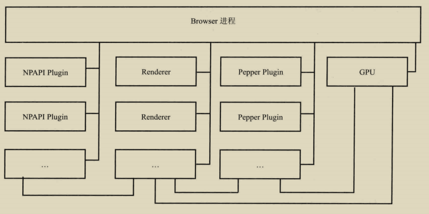

# 一、HTML

## 3、页面渲染过程

- 先向服务端请求 html 网页。对 html 内容由上至下进行扫描，然后从头加载。
- 由上至下将内容构建 DOM 树和 CSSOM 树。
- 如果中途遇到 css 请求资源的加载会先请求 css 资源，然后加入到 cssom 树的构建中。
- 若中途遇到 js，会先阻塞 DOM 树，因为 js 可以操作 DOM。
- 两颗树构建完成之后会构建渲染树，由 cssom 树和 dom 树合并而成。
- [参考学习地址。](https://www.cnblogs.com/chenyoumei/p/9156849.html)

**页面的重绘与重排**（回流）：元素颜色的改变、css3 的一些变换等会引起页面的重绘，不过重绘速度非常快。而元素大小、display、position、float、overflow，js 的 resize 等会导致对页面的重新布局，即重排（也称回流）。无论是渲染树构建过程和渲染完毕后。回流比重绘需要的时间多得多，**所以应该尽量避免重排**。

## 4、资源加载标签

很多加载资源的标签：`iframe,video,audio,img,script,link` 等是用 src 属性或是用 href 属性，一些标签不能跨域加载资源多数标签允许跨域加载资源。除了 link 和 script 外其它标签几乎都有 onload 事件和 onerror 事件可在元素上添加这两个事件做加载成功和加载失败后的处理。js 代码中的函数块语句需要达到相应的条件才能触发（body，head 中添加的 onload 和`<script></script>`中的 `window.onload=“”`除外)就算是 onmouseout 指定的函数也不行，因为它运行的前提就是有 onmouseover 被触发。
**link 标签**：link的加载是同步的，会阻塞渲染。

```html
<link href="http://a...pp.jpg" rel="prefetch" /><!--prefetch表示预加载-->
<link href="http://a...pp.css" rel="stylesheet" /><!--导入css-->
```

**外部资源引入标签**：
`<embed></embed>、<iframe></iframe>、<object></object>`
`<embed type="image/svg+xml" codebase="http:"></embed>`标签是 H5 新标签所有主流浏览器都支持，codebase 属性中写资源路径,可以引入脚本;类似 iframe 标签用于引入外资源(`<iframe>`标签只在大部分浏览器可用，但规范的 xhtml 和 html 中不支持`<embed>`标签.`<object data="rect.svg" type="image/svg+xml" codebase="http">`
`</object>`标签是 H4 的新标签，浏览器支持性差，但不能引入脚本.(引入的文件中的 js 对象和本页的 js 对象是不能共用的,且在引入的文件中获取的 url 也不是该页的)
**引入页面中刷新父页面更改浏览器 url**：
在`<iframe><embed><object>`标签中若是有用到跳转页面使用 window.location.href 或 window.open()或 a 标签中的跳转，页面跳转后还是只是显示在\<iframe>...这些标签之中
但使用` window.parent.frames.location.href = ""`能让上一个页面跳转或直接`window.parent.location.href,window.top.location.href`让最外层的页面跳转，
a 标签中的跳转可用 `target="parent"和 target="top"`来实现。获取前一页 `url：document.referrer`包括传参也会获取到
**iframe 属性：**[参考地址](https://www.cnblogs.com/hzb462606/p/11394683.html)

```html
<iframe frameborder="0" sandbox=""></iframe>
<!--sandbox:
allow-same-origin：允许 iframe 内容被视为与包含文档有相同的来源；
allow-top-navigation：允许 iframe 内容从包含文档导航（加载）内容；
allow-forms：允许表单提交；
allow-scripts：允许脚本执行；
-->
```

## 5、概念

**位图与矢量图**：位图又叫做点阵图，是一个个很小的颜色小方块组合在一起的图片。一个小方块代表 1px（像素）。矢量图是由一个个点链接在一起组成的，是根据几何特性来绘制的图像，和位图的分辨率是没有关系的。因此图片放大后也不会失真，不会出现位图的马赛克的样子，也就是说可以无限放大图片。

图片处理专项：(png 转为 jpg 后一般能缩小一半，但 png 色彩更丰富，且透明背景属性，所以项目中一般使用的是 png)
jpg：全名是 JPEG，是数码相机的常用格式，特点呢就是色彩还原性好，天生适合风景照，可以在照片不明显失真的情况，大幅度降低体积。
png：png 是最适合网络的图片，色彩丰富，png 不适用于颜色很少，或亮度差异十分明显的较简单的图片。

**各设备屏幕尺寸**：手机屏宽范围：300 – 768 px; 平板屏宽范围: 769 – 1199px;笔记本屏宽范围:1200 – 1400px; 台式，一体机屏宽范围:1401 – 1920px;广场电视机:1921 – 99999px。


**CDN**：Content Delivery Network，即内容分发网络。CDN 是构建在现有网络基础之上的智能虚拟网络，依靠部署在各地的边缘服务器，通过中心平台的负载均衡、内容分发、调度等功能模块，使用户就近获取所需内容，降低网络拥塞，提高用户访问响应速度和命中率。CDN 的关键技术主要有内容存储和分发技术。<b c=v>中小企业使用 CDN 一般是使用其它服务商提供的 CDN 服务，类似在域名解析处更改 DNS 地址即可。</b>

- bucket：存储空间。同一个存储空间的内部是扁平的，没有文件系统的目录等概念，所有的对象都直接隶属于其对应的存储空间。存储空间的名称在 OSS 范围内必须是全局唯一的，一旦创建之后无法修改名称。

- 对象/文件：对象是 OSS 存储数据的基本单元，也被称为 OSS 的文件。对象由元信息（Object Meta），用户数据（Data）和文件名（Key）组成。对象由存储空间内部唯一的 Key 来标识。对象元信息是一个键值对，表示了对象的一些属性，比如最后修改时间、大小等信息，同时用户也可以在元信息中存储一些自定义的信息。

- 访问域名：Endpoint 表示 OSS 对外服务的访问域名。OSS 以 HTTP RESTful API 的形式对外提供服务，当访问不同的 Region 的时候，需要不同的域名。

- AccessKey：AccessKey，简称 AK，指的是访问身份验证中用到的 AccessKeyId 和 AccessKeySecret。OSS 通过使用 AccessKeyId 和 AccessKeySecret 对称加密的方法来验证某个请求的发送者身份。AccessKeyId 用于标识用户，AccessKeySecret 是用户用于加密签名字符串和 OSS 用来验证签名字符串的密钥。

  

## 6、web 安全

1. **sql 注入**：通过输入框中输入一些 sql 的插入、删除等语句，在传到后台时被运行，然后操作数据库。**防御**：做一些正则匹配，替换输入中的特殊字符等，后台做一些站位等措施。
2. **XSS**： (Cross-Site Scripting)，跨站脚本攻击,因为缩写和 CSS 重叠，所以只能叫 XSS。跨站脚本攻击是指通过存在安全漏洞的 Web 网站注册用户的浏览器内运行非法的 HTML 标签或 JavaScript 进行的一种攻击。

- 可能造成以下影响：利用虚假输入表单骗取用户个人信息。利用脚本窃取用户的 Cookie 值，被害者在不知情的情况下，帮助攻击者发送恶意请求。显示伪造的文章或图片。
- 非持久型 XSS：（反射型 XSS ），有通过 url 传参的网页，攻击者可以直接通过 URL (类似：`https://xxx.com/xxx?default=<script>alert(document.cookie)</script>`) 注入可执行的脚本代码，如果目标网页获取该参数放于页面的话就会执行该脚本内容。不过一些浏览器如 Chrome 其内置了一些 XSS 过滤器，可以防止大部分反射型 XSS 攻击。

3. 持久型 XSS：（存储型 XSS）持久型 XSS 漏洞，一般存在于 Form 表单提交等交互功能，如文章留言，提交文本信息等，黑客利用的 XSS 漏洞，将脚本内容经正常功能提交进入数据库持久保存，当访问该文章时，前端页面获得后端从数据库中读出的内容放到页面上，就会将其渲染执行。

```js
//可以先对代码转码
console.info(
  btoa(`document.getElementById('tt').innerHTML="进来的人放弃一切希望!"`)
);
// 然后将转码的代码放到提交内容中。
; //这样放到页面中后就能执行onerror里的js代码，并绕过一部分检查。
```

- **防御**：Web 页面渲染的所有内容或者渲染的数据都必须来自于服务端。尽量不要从 URL，document.referrer，document.forms 等这种 DOM API 中获取数据直接渲染。尽量不要使用 eval, new Function()，document.write()，document.writeln()，window.setInterval()，innerHTML，document.createElement() 等可执行字符串的方法。<b c=gy>前后端都对输入做检查，检查是否有`<script>`等和一些特殊字符。对于混合开发类的 web 应用对放置页面的数据进行编码。</b>

  ```js
  // 对所怀疑数据用encodeURIComponent 进行过滤
  var arg = encodeURIComponent(req.query.q);
  // 或者替换掉那些 <、& 等特殊字符
  function encodeHTML(str) {
    return str
    .replace(/&/g,'&amp;')
    .replace(/"/g,'&quot;')
    .replace(/'/g,'&apos;')
    .replace(/</g,'&lt;')
    .replace(/>/g,'&gt;')
  }
  ```

  

- **禁止用户 js 代码中操作 DOM**：

```js
//将用户js代码放到匿名函数中任然无法禁止调用window下的document中。
(function (window, document) {
  "use strict";
  console.log(this, window, document); // {}, null, null
  const win = (function () {
    return this;
  })();
  console.log(win); // undefined
  setTimeout(function () {
    console.log(this); // Window
  });
}.call({}, null, null));
```

**使用 worker**：利用 worker 中不能操作 DOM 的特性，将用户代码放于 worker 中执行。
**使用 Shadow DOM**：[参考学习地址](https://zhuanlan.zhihu.com/p/355785418)

```js
(function () {
  const root = document.body.attachShadow({ mode: "closed" });

  let list;

  function init() {
    root.innerHTML = `
      <h1>Todo List</h1>
      <ul></ul>
    `;
    list = root.querySelector("ul");
  }

  function addTask(desc) {
    const task = document.createElement("li");
    task.textContent = desc;
    list.appendChild(task);
    return list.children.length - 1;
  }

  function removeTask(index) {
    const task = list.children[index];
    if (task) task.remove();
  }

  window.init = init;
  window.addTask = addTask;
  window.removeTask = removeTask;
})();

init();
addTask("task1");
```

4. **CSRF**：CSRF(Cross Site Request Forgery)，即跨站请求伪造，是一种常见的 Web 攻击，它利用用户已登录的身份，在用户毫不知情的情况下，以用户的名义完成非法操作。
   完成 CSRF 攻击必须要有三个条件：用户已经登录了站点 A，并在本地记录了 cookie。在用户没有登出站点 A 的情况下（也就是 cookie 生效的情况下），访问了恶意攻击者提供的引诱危险站点 B (B 站点要求访问站点 A)。站点 A 没有做任何 CSRF 防御
   **防御**：防范 CSRF 攻击可以遵循以下几种规则：
   （1）Get 请求不对数据进行修改。
   （2）不让第三方网站访问到用户 Cookie。==阻止第三方网站请求接口==。
   （3）请求时附带验证信息，比如验证码或者 Token.
   （4）双向cookie：用户打开网页时后台向浏览器注入1个加密的cookie，客户端请求时在头部添加给后端验证。
5. **点击劫持**：是一种视觉欺骗的攻击手段。攻击者将需要攻击的网站通过 iframe 嵌套的方式嵌入自己的网页中，并将 iframe 设置为透明，在页面中透出一个按钮诱导用户点击。（解决如下：禁止嵌套，或指定部分域名使用）
   
   ```html
   <!--content项：
   DENY 禁止，SAMEORIGIN：相同域名页面的 frame 中展示，ALLOW-FROM uri：指定来源的 frame
   -->
   <meta http-equiv="X-Frame-Options" content="DENY" />
   ```
   
   [web 端安全问题及应对方法。](https://www.cnblogs.com/pretty-sunshine/p/11442326.html)

响应头中可设置的一些安全属性：（后端服务设置）<a href="#http-head">可查看这里</a>


## 7、常用标签

### V、H5规范

H5是新一代HTML规范，也是现代==富web内容的相关技术总称==。

- `<!DOCTYPE>` ：是指示 web 浏览器关于页面使用哪个 HTML 版本进行编写的指令。在 HTML 4.01 中，<!DOCTYPE> 声明引用 DTD，因为 - HTML 4.01 基于 SGML。DTD 规定了标记语言的规则，这样浏览器才能正确地呈现内容。

- HTML5 不基于 SGML，所以不需要引用 DTD。[doctype 类型参考学习地址。](https://blog.csdn.net/Whisper_a/article/details/38706901)
- html5 中加了一些新的规范，如下示例：[H5 的一些新标签的使用学习地址。](https://www.cnblogs.com/nuanai/p/8856814.html)
- 带有 id 的元素其 id 名，在 js 中可直接使用（等同于选择了元素）
- 引入原生多媒体支持。
- 元素拥有 name 属性，且是`a,form,frame,img,iframe,..`等标签中的一个，则 js 中其 name 名可直接使用

```html
<! DOCTYPE html>
//声明使用H5规范来解析文档。
<html>
  // html5中标签名可以用大写，但推荐使用小写。不要省略html,head,body标签。
  <head>
    <link rel="stylesheet" type="text/css" href="./ff.css" />
    <!--带“defer”属性的script可以异步加载，页面渲染完成后执行，且能按顺序异步加载-->
    <script src="cc.js" defer></script>
    <!--带async的script也是异步加载，不过其加载完后会立即执行，然后继续渲染，且不能保证按顺序加载-->
    <script src="vv.js" async></script>
    <!--ES6 模块的写法，内部有export；与defer效果等同-->
    <script type="module" src="./foo.js"></script>
  </head>
  <body>
    // 如果父元素中的子元素个数很少时可以不用缩进。每个标签都必须关闭。
     //alt能在图片加载失败时代替图片显示。 //
    一行代码尽量少于80个字符。少一些不必要的空行和缩进。
  </body>
</html>
```


### 1、meta 标签

```html
<meta name="keywords" content="标签,属性,seo优化" />
<!--html是否进行缓存的控制-->
<meta http-equiv="Expires" content="0">
<meta http-equiv="Pragma" content="no-cache">
<meta http-equiv="Cache-control" content="no-cache">
<meta http-equiv="Cache" content="no-cache"

<meta
  http-equiv="Content-Type"
  content="text/html;charset=utf-8"
/><!--指定编码-->
<!--all：文件将被检索，且页面上的链接能够被查询。none时页面上的文件、连接将不能被查询。-->
<meta name="robots" content="All|None|Index|Noindex|Follow|Nofollow" />
<meta
  name="viewport"
  content="width=device-width, initial-scale=1.0"
/><!--viewport 是用户网页的可视区域-->
<meta
  http-equiv="X-UA-Compatible"
  content="chrome=1"
/><!--用以声明当前页面用chrome内核来渲染。-->
<meta
  name="renderer"
  content="webkit"
/><!--强制浏览器使用webkit内核渲染，当然前提是有该内核-->
<meta http-equiv="Cache-Control" content="cache" /><!--no-cache是不缓存该页面-->
<meta
  name="apple-mobile-web-app-capable"
  content="yes"
/><!--设置Web应用是否以全屏模式运行,content的默认值是no-->
```

注释常用语：`//TODO`(待实现的功能)、`//FIXME`(需要修正的功能)、`//XXX`(需要改进的功能)

1.2、link标签

使用下面自定义可用`<link>`导入html页面展示；

```js
class HtmlImport extends HTMLLinkElement {
    constructor () {
        super();
    }
    static get observedAttributes () {
        return ['href'];
    }
    load () {
        fetch(this.href).then(res => res.text()).then(html => {
            this.style.display = 'block';
            this.innerHTML = html;         
        });
    }
    attributeChangedCallback () {
        this.load();
    }
}
if (!customElements.get('ui-import')) {
    customElements.define('ui-import', HtmlImport, {
        extends: 'link'
    });
}
// 然后使用
// <link rel="import" href="header.html" is="ui-import">
```


### 2、hr 标签

```html
<hr class="hr" data-content="分隔线" />
<!--文字会显示在正中-->
<style>
  .hr {
    border: 0;
    padding: 3px;
    /*/斜纹分隔线*/
    background: repeating-linear-gradient(
      135deg,
      #a2a9b6 0px,
      #a2a9b6 1px,
      transparent 1px,
      transparent 6px
    );
  }
  /*波浪线效果*/
  .hr::before {
    content: "\2000\2000";
    /* IE浏览器实线代替 */
    text-decoration: overline;
    /* 现代浏览器 */
    text-decoration: overline wavy;
  }
  .hr::after {
    /*attr()函数可让样式作用与元素的某个属性上，IE8 需要声明 !DOCTYPE 才可以支持 attr() 函数。*/
    content: attr(data-content); /*这里对文字内容进行装饰*/
    position: absolute;
    padding: 4px 1ch;
    top: 50%;
    left: 50%;
    transform: translate(-50%, -50%);
    color: transparent;
    border: 1px solid #d0d0d5;
  }
</style>
```

### 3、marquee 标签

◎direction 表示滚动的方向，值可以是 left，right，up，down，默认为 left
◎behavior 表示滚动的方式，值可以是 scroll（连续滚动）slide（滑动一次）alternate（往返滚动）
◎loop 表示循环的次数，值是正整数，默认为无限循环
◎scrollamount 表示运动速度，值是正整数，默认为 6
◎scrolldelay 表示停顿时间，值是正整数，默认为 0，单位似乎是毫秒
◎align 表示元素的垂直对齐方式，值可以是 top，middle，bottom，默认为 middle
◎bgcolor 表示运动区域的背景色，值是 16 进制的 RGB 颜色，默认为白色
◎height、width 表示运动区域的高度和宽度，值是正整数（单位是像素）或百分数，默认 width=100% height 为标签内元素的高度
◎hspace、vspace 表示元素到区域边界的水平距离和垂直距离，值是正整数，单位是像素。
◎onmouseover=this.stop() onmouseout=this.start()表示当鼠标以上区域的时候滚动停止，当鼠标移开的时候又继续滚动。

### 4、input 标签

```html
<input
  type="text"
  maxlength="5"
  pattern="[a-z]{5}"
/><!--maxlength限制最大输入长度，pattern可写正则匹配-->
<input
  type="text"
  readonly="readonly"
  value="不可编辑"
  autofocus="autofocus"
/><!--readonly让内容为只读状态。-->
<input type="number" min="5" max="10" /><!--限制输入范围-->
<!--表单和一些特殊类型的输入，可以用autocomplete属性-->
<form method="get" autocomplete="on">
  <input type="email" name="email" autocomplete="off" />
</form>
<!--list可以指定datalist的id，效果相当于select标签，不过鼠标触碰时才显示倒三角。-->
<input type="url" list="url_list" name="link" />
<datalist id="url_list">
  <option label="W3School" value="http://www.w3school.com.cn" />
  <option label="Google" value="http://www.google.com" />
  <option label="Microsoft" value="http://www.microsoft.com" />
</datalist>
<!--文件选择
****可以主动触发文件的点击函数，不过必须在用户有点击事件发生后调用****
document.getElementById("file").click();
-->
<input id="file" type="file" multiple accept=".txt,.doc,.pdf"/><!--multiple可选多个-->
<input
  type="url"
  required="required"
/><!--required在没有输入，但触发submit时会自行提示-->
```

```html
<input type="radio" id="a" /> <label for="a">点我触发前面id为a的单选框</label>
<input type="checkbox" id="b" />
<label for="b">点我触发前面id为b的复选框</label> {
appearence:button;//设置单选框或复选框为正常状态。为none时无法使用 }
```

**textarea 标签**：resize 属性的的各个取值:none：用户不能操纵机制调节元素的尺寸、both：用户可以调节元素的宽度和高度、horizontal：用户可以调节元素的宽度、vertical：让用户可调节元素的高度;

改变复选框状态：`<input type="checkbox" checked='checked' value='1' id="ele"/>`写上 checked 表示默认为选中这与 value 值无关，动态改变复选框或单选框状态需要用 js 控制：

```js
ele = document.getElementById("ele");
ele.checked = false; //false表示没选中，true改为选中。
ele.checked; //获取复选框状态返回true/false(布尔值，非字符串)。
```

**input 所有 type 类型**：
tel、number、email、text、radio、checkbox、image、date、color、button、submit、hidden、month、password、range、reset、search、time、url、week、file、month、datetime-local

### 5、table 的使用

其直接属性控制的样式与 css 样式不同一。

```html
<table
  border="1"
  cellspacing="0"
  cellspadding="0"
  rules="rows"
  bordercolor="#e3e3e3"
>
  <!--
    - border: 为线宽;
    - cellspacing: 为格间距
    - rules：规定内侧边框的哪个部分是可见的。 【包括width、align等很多属性H5不再支持】
    - frame：规定外侧边框的哪个部分是可见的；    //border为0时这两个属性不生效。
    将table元素中的表格间距取消：border-collapse:collapse;
-->
  <thead>
    <tr>
      <th></th>
    </tr>
  </thead>
  <tbody>
    <!--width可直接调整该列宽-->
    <tr>
      <td rowspan="2" colspan="3" width="150"></td>
    </tr>
  </tbody>
</table>
<style>
    // css设置border类型
    table{
        border-collapse: collapse;
    }
    td{border: 1px solid gray;}
</style>
```

### 6、资源加载标签

`<script>`标签：

**阻塞行为**：<i c=gn>遇到脚本时，浏览器会先**下载**（非内嵌情况）脚本，然后执行。**执行结束后才会继续渲染下方元素**。</i>
**defer 属性**：带有 defer 属性的脚本表示内部没有 DOM 操作，可与其它资源`并行下载`，页面加载完成后（onload）才会执行这个脚本
推荐的无阻塞模式：使用一个下载文件的 js 脚本（下载其它 js 文件，动态生成 script 标签插入）并内嵌到页面底部。

```html
<script type="text/javascript">
  function loadScript(file) {}
</script>
<script type="text/javascript" src="acc.js"></script>
<script type="text/javascript" src="acb.js" defer></script>
```

`<link rel="" href=""/>`标签：加载资源时==会阻塞后面的加载或执行==。（为prefetch时未知）

`img\a`：图片的加载**为异步**

```html
<!--
-alt：加载失败时显示的提示
-crossOrigin: 开启跨域；相应的服务端也需要配Access-Control,Allow-Credentials属性
    'anonymous': 使用此值时请求的header中会带上Origin属性；
    'use-credentials': 会带上cookie和一些其它认证信息；
-->

<!--只要设置了 ping 属性，用户点击此链接元素的时候，浏览器就会自动发送一个 POST 请求给 ping 属性值地址-->
<a href="" ping="https://www.xxx.cn/notify.php">发送</a>
<h2>消除img图片间隙</h2>
<style>
img {
  -webkit-user-drag: none;
  vertical-align: top;/*消除行内元素的间隙（仅对 img 元素有用）*/ 
}
</style>
```

`<inframe>`：加载一个网页到此容器中，允许它有完整的文档对象。

```html
<!--
name：直接作为该iframe window的名称。
allow="fullscreen": 可以通过调用 <iframe> 的 requestFullscreen() 方法激活全屏模式
allow="payment": 跨域的 <iframe> 就可以调用 Payment Request API。
importance="height|low": 资源加载优先级，height表示高。
referrerpolicy：表示在获取 iframe 资源时如何发送 referrer 首部（Document.referrer 当前页面就是从这个 URI 所代表的页面跳转或打开的）
	- no-referrer: 不发送 Referer 首部。
	- origin: referrer 首部中仅包含来源页面的源
	- same-origin: 对于 same origin（同源）请求，发送 referrer 首部，否则不发送。
	- unsafe-url: 始终在 referrer 首部中包含源以及路径
sandbox：对呈现在 iframe 框架中的内容启用一些额外的限制条件。
	- allow-forms: 允许嵌入的浏览上下文提交表单。
	- allow-modals: 允许嵌入的浏览上下文打开模态窗口
	- allow-orientation-lock: 允许嵌入的浏览上下文锁定屏幕方向
	- allow-downloads-without-user-activation 实验性: 允许在没有征求用户同意的情况下下载文件。
	- allow-popups: 允许弹窗 (例如 window.open
	- allow-same-origin: 如果没有使用该关键字，嵌入的浏览上下文将被视为来自一个独立的源
	- allow-scripts: 允许嵌入的浏览上下文运行脚本
	- allow-storage-access-by-user-activation 实验性: 允许嵌入的浏览上下文通过local/session使用父级的。
	- allow-top-navigation: 允许嵌入的浏览上下文导航（加载）内容到顶级的浏览上下文
srcdoc: 该属性是一段 HTML 代码，这些代码会被渲染到 iframe 中。
-->
<iframe name="iframeWindow" allow importance sandbox width="100%" height="700" src="" srcdoc></iframe>
<!--主文档对象与嵌套文档对象
主文档脚本可以通过 contentWindow 访问内联框架的 window 对象。
内联的框架，就像 <frame> 元素一样，会被包含在 window.frames 伪数组。
在框架内部，脚本可以通过 window.parent 引用父窗口对象。
【消息通信】使用window.postMessage，两个窗口间都能很好的通信。
-->
```


### 8、MathML

HTML5 可以在文档中使用 MathML 元素，对应的标签是 `<math>...</math>`
MathML 是数学标记语言，是一种基于 XML（标准通用标记语言的子集）的标准，用来在互联网上书写数学符号和公式的置标语言。

```html
<math xmlns="http://www.w3.org/1998/Math/MathML">
  <mrow>
    <msup><mi>a</mi><mn>2</mn></msup>
    <mo>+</mo>
    <msup><mi>b</mi><mn>2</mn></msup>
    <mo>=</mo>
    <msup><mi>c</mi><mn>2</mn></msup>
  </mrow>
  <!--矩阵写法-->
  <mfenced open="[" close="]">
    <mtable>
      <mtr>
        <mtd><mi>x</mi></mtd>
        <mtd><mi>y</mi></mtd>
      </mtr>
      <mtr>
        <mtd><mi>z</mi></mtd>
        <mtd><mi>w</mi></mtd>
      </mtr>
    </mtable>
  </mfenced>
</math>
```

# 二、CSS

简介：`css(Cascading Style Sheets)`层叠样式表，1996-12-17css1 诞生，2003 年 1 月 svg 被定为 w3c 规范，但当时的网页只是图文内容，css 更受偏爱。

## 1、基础

- **流**：俗称文档流，指的是 css 中的基本的定位和布局机制，css 中的布局规则。所以从上而下从左至右的描述只是 css 的一个默认流而已。

- **自适应布局**：对凡是具有自适应布局的一类统称，流体布局是自适应布局的一部分，但**流体布局**狭窄的多，如 div+css 就是流布局，而 table 布局则不属于流布局，因为 css 真正是从 css2.1 开始的，IE8 开始支持它，在这之前 table 就已经存在，所以 ie8 前的浏览器多数使用 table 布局。

- **元素的 4 个盒子**（盒模型）：content-box、border-box、padding-box(`padding`的百分比值是根据**元素宽来计算**的)、margin-box;
  元素的两个元素：每个标签有两个元素组成，内部元素控制宽，高、尺寸等；因此有“行内快”属性（`display:inline-block;`）
  Box-sizing:`border-box`;可以将宽度作用到哪一个盒子，无法作用到 margin-box；
  
- **未定义行为**：相同的 css 代码在不同浏览器可能效果不一样，甚至不显示，这并非 bug。因为各浏览器厂商去实现 css 时有一些自己的理解和定义，导致一些特殊情况未在其规则内导致的差异，繁杂多变的情况总有遗漏。<b class="gray">如伪类::activity 元素上同时绑定事件，事件中使用`event.preventDefault()`#这样能使拖动之类的效果更流畅，但火狐上不会显示 active 定义的行为。</b>

- FOUC(无样式内容闪烁)：Flash Of Unstyled Content ，`<style type="text/css" media="all">@import "../fouc.css";</style> `而引用 CSS 文件的@import 就是造成这个问题的罪魁祸首。IE 会先加载整个 HTML 文档的 DOM，然后再去导入外部的 CSS 文件，使用`<link/>`标签代替即可。<b c=gy>link 属于 HTML 标签，而@import 是 CSS 提供的、页面被加载的时，link 会同时被加载，而@import 引用的 CSS 会等到页面被加载完再加载。</b>

- **BFC**：（块级格式化上下文），是一个独立的渲染区域，让处于 BFC 内部的元素与外部的元素相互隔离，使内外元素的定位不会相互影响。
  
  BFC 的特性：bfc 就是页面上的一个独立容器，容器里面的子元素不会影响外面元素。
  
  形成 BFC 的条件：`<html>`根元素；
  （1）float 的值不为 none；
  （2）overflow 的值为 auto、scroll 或 hidden；
  （3）display 的值为 table-cell、table-caption 和 inline-block 中的任何一个；
  （4）position 的值不为 relative 和 static
  
- **css 选择器**：`div+p`#两个紧挨者的元素，`[attribute]`#选择带有 arrtibute 属性的元素。`[attribute=value]`选择等于指定值的。[attribute~=value]属性值中包含该值的。[attribute|=value]属性值中以该 value 开头的。
  
  - `p:first-child`#选择 p 的父元素的第一个子元素(属于 p 元素)。`p:last-child`#选最后一个子元素。
  - `p:nth-child(n)`#选择第 n 个子元素(属于 p 元素)。
  - `p:nth-last-child(2)`#从最后子元素开始计数。[css 选择器全部](http://www.w3school.com.cn/cssref/css_selectors.asp)
  **选择器优先级**：带`!important>内嵌样式>id>类名==属性选择器>标签选择器>通配符(\*)>继承(继承父元素的属性)>浏览器默认属性`。子选择器用 id 选择时比 id 选择器优先级高。
  - **选择器的解析**：解析选择器时是==从右往左==的（如使用`#div>.cc`时是先取.cc 再取#div 的顺序去构建树【更容易把公共样式放在一个节点】）少用一些子选择器。
  - **同时包含两个类名写法**：`.el-menu-item.is-active`（==紧挨一起即可==）
  
- **鼠标样式**：cursor:pointer;//手指,提示可点击。hand//IE5 使用的手指样式、wait;//等待、help;//帮助、no-drop;//无法释放、text;//文字，暗示为文字内容、move;//提示可移动对象、crosshair;//十字准心、n-resize;//向上改变大小箭头、s-resize;//向下改变大小箭头、e-resize;//向右改变大小箭头、w-resize;//向左改变大小箭头、ne-resize;//向右上改变大小箭头、nw-resize;//向左上改变大小箭头、se-resize;//向右下改变大小箭头、not-allowed;//禁止、progress;//处理中、default;//提示可移动对象、url();//引入外部文件作为鼠标样式，文件格式必须为.cur 或.ani。

- **边框样式**：

```css
border:1px dotted red;
border-style:dotted:点线、dashed:虚线、double:双边框、groove:3d凹槽、ridge:菱形边框、insert:3d凹边、//outset:3d凸边。
border-width:think;/*think=1px,medium=3px,thick=4px*/
/*用border优雅的放大点击区域*/
border:10px solid transparent;
```

外边框：`outline:#00FF00 solid thick;`#样式，样式，宽度。

**滚动相关**：

- 平滑滚动：`scroll-behavior:smooth;`//发生滚动时更平滑(锚点跳转、改变 scrollTop 值)
- **滚动锚定**：滚动时或点击加载更多，新的内容导致滚动条位置变化，
  `overflow-anchor:auto;`状态会保持当前观看内容处于用户视线内，用户感觉不到滚动条位置变化。
  `overflow-anchor:none;`关闭时则会优先显示加载的内容（最底部插入情况无效）。

- **滚动条样式**：

```css
.scrollbar ::-webkit-scrollbar-thumb {
  /*滚动条里面小方块*/
  background: #c1c1c1;
  border-radius: 8px;
}
.scrollbar ::-webkit-scrollbar-track {
  /*滚动条里面轨道*/
  background: #f4f4f4;
  border-radius: 8px;
}
.scrollbar ::-webkit-scrollbar {
  /*滚动条整体样式*/
  width: 8px; /*高宽分别对应横竖滚动条的尺寸*/
  height: 8px;
}
.scrollbar::-webkit-scrollbar-thumb {
  /*滚动条里面小方块*/
  background: #c1c1c1;
  border-radius: 8px;
}
.scrollbar::-webkit-scrollbar-track {
  /*滚动条里面轨道*/
  background: #f4f4f4;
  border-radius: 8px;
}
.scrollbar::-webkit-scrollbar {
  /*滚动条整体样式*/
  width: 8px; /*高宽分别对应横竖滚动条的尺寸*/
  height: 8px;
}
```
- **input 选中后样式**：

```css
input:foucs {
  outline: none;
  border: 1px solid green;
}
/*修改placeholder字体样式*/
input::-webkit-input-placeholder {
  color: revert;
}
```

- **媒体查询器**：`@media only screen and (min-width: 300px) and (max-width: 768px) {}`
- **box-shadow充当遮罩层**：
```css
div{
  position: absolute;
  top: 50%; left: 50%;
  transform: translate(-50%, -50%);
  box-shadow: 0 0 0 50vmax rgba(0, 0, 0, .8);
}
```

- **文本控制**：
  （1）调整字间距：letter-spacing:5px；
  （2）两端对齐：text-align：justify;和 text-align-last:justify;(一起使用)。最好将要对其子元素设置为 inline-block 元素。
  （3）**自动换行**：word-break：break-all 或 white—space：normal 来实现自动换行。
  （4）删除线：text-decoration:line-through;
  （5）**超出隐藏**：

```css
/*文字超出省略*/
el {
  overflow: hidden;
  text-overflow: ellipsis;
  white-space: nowrap; //3个属性一起设置可以让超出的文本变为省略号。
}

el {
  overflow: hidden;
  text-overflow: ellipsis;
  display: -webkit-box;
  -webkit-line-clamp: 2; //设置行数
  -webkit-box-orient: vertical;
}
/***********禁止点击**********/
 {
  pointer-events: none; /**点击穿透，所有css,js的hover，点击等事件**/ 
}
/*===============
    禁止选择文本
=================*/
 {
  -moz-user-select: none; /*火狐*/
  -webkit-user-select: none; /*webkit浏览器*/
  -ms-user-select: none; /*IE10*/
  -khtml-user-select: none; /*早期浏览器*/
  user-select: none;
}
/*===============
    禁止拖拽
=================*/
img {
  -webkit-user-drag: none;
  vertical-align: top;/*消除行内元素的间隙（仅对 img 元素有用）*/ 
}
/*背景图片设置*/
background: url(" ") no-repeat;
background-position: 50% 0; //图片居中
background-size: cover; //占满
/*===============
vertical-align使用【文字，图片居中】
vertical-align只作用于“内联”或table-cell的元素
<div class="box"><span class="children-word">我要居中</span></div>
=================*/
.box {
  height: 30px;
}
/*根据情况，自行调整百分比值*/
.children-word {
  vertical-align: -25%;
}
.children-img {
  vertical-align: -40%;
}
```

- **引入外部文件夹中的字体**：
  [字体图标的使用]若是使用阿里图标库的话,头部 link 引入资源,元素中写上类名 iconfont,元素内容中写上对应的 unicode 编码。下载到本地使用的话引入下载的 iconfont.css 和 iconfont.js(那些 eot,svg,ttf...文件也要放到项目中)。[css 中自带的字体。](https://www.cnblogs.com/fozero/p/6087513.html)

```css
@font-face {
  font-family: sAir; // 自定义的字体名字
  src: url(../font/okj.otf); //一般是otf文件
}
div {
  font-family: "sAir";
} //使用字体
```

- marker 伪元素：

```css
ul::marker {
  /*marker用于定义ul，li中项目符号的颜色、大小甚至内容。普通元素也可以用：display:list-item;然后使用。*/
  content: "▶";
  color: blue;
  font-size: 14px;
}
```

- static 默认定位下元素**宽可以占满剩余空间**。

```html
<div class="main">
  <div class="left"></div>
  <div class="right"></div>
</div>
<style>
  .main {
    height: 100%;
  }
  .main > .left {
    height: 100%;
    left: 0;
    top: 0;
    width: 210px;
    background-color: red;
    position: fixed;
  }
  .main > .right {
    height: 100%;
    background: blue;
    margin-left: 210px; /*设置该属性，使用默认定位*/
  }
</style>
```

- **关键字**：几乎可用于所有属性，浏览器上

```css
div {
  color: initial; /*initial表示使用浏览器默认属性值*/
  line-height: inherit; /*inherit表示该属性值继承它的父元素的（非继承属性也可使用）*/
  all: revert; /*all表示所有属性，revert表示该属性值重置为浏览器默认*/
  font-size: unset; /*如果该属性是默认继承属性，该值等同于 inherit。如果该属性是非继承属性，该值等同于 initial*/
}
```

- **css变量**：用于使用自定义的 css 变量。IE9.1 开始支持。

```css
/*:root中定义自己的遍历【全局可访问】*/
:root {
  /*必须要--开头*/
  --wcs-bg: red;
  --wcs-size: 80px;
}
/*var()中调用对应的变量值*/
.div {
  background-color: var(--wcs-bg);
}
/****某个元素内使用【若与上层元素的变量有冲突则会覆盖上层的】****/
.div{
    --hh: 20px;
    --cc: blue;
}
.div .a{
    color: var(--cc); /**使用其父的变量**/
}
/**也可以内嵌使用**/
<div style="--num:50;"></div>
/****currentColor变量会跟随其父元素的color颜色值变化***/
/**js设置css变量： dom.style.setProperty('--color','red')**/
<div style="color:blue;">
  	<svg fill="currentColor"><rect fill="currentColor"/></svg>  
</div>
```

- **展开/折叠动画**：展开折叠时一般要知道具体高才能设置 height 来完成过渡动画。这里使用 max-height 变化来绕开。

```css
p {
  max-height: 0;
}
p::hover {
  /*设置一个安全高度，设得太大，在收起时会有明显速度不统一的问题*/
  max-height: 100px;
}
```

## 1.1：无 js 的选项卡

```html
<div class="box">
  <div class="list"><input id="one" />1</div>
  <div class="list"><input id="two" />2</div>
  <div class="list"><input id="three" />3</div>
  <div class="list"><input id="four" />4</div>
</div>
<div class="link">
  <label class="click" for="one">1</label>
  <label class="click" for="two">2</label>
  <label class="click" for="three">3</label>
  <label class="click" for="four">4</label>
</div>
<style>
  .box {
    height: 10em;
    border: 1px solid #ddd;
    overflow: hidden;
  }
  .list {
    height: 100%;
    background: #ddd;
    position: relative;
  }
  .list > input {
    position: absolute;
    top: 0;
    height: 100%;
    width: 1px;
    border: 0;
    padding: 0;
    margin: 0;
    clip: rect(0 0 0 0);
  }
</style>
```

## 2、尺寸单位

- **em**：是根据当前元素字体大小而变化的,列入当前元素 font-size:14px;width:10em,此时 width 为 140px(每 1em 为字体大小)。
- **rem**：是继承根部元素(html)的字体大小的,例:html{font-size:16px;}.div{width:10rem;}//width 为 160px。用以下代码修改根元素大小。

```js
function transfer(win, doc) {
  var W = win.innerWidth;
  var UIW = 750;
  var RATIO = 100; // 1rem = 100px

  if (W < 1000) {
    doc.documentElement.style.fontSize = W / (UIW / RATIO) + "px";
  }
}
window.onResize = transfer;
transfer();
```

- **vw**：视窗宽度，1vw 相对于视窗宽度的 1%。
- **vh**：视窗高度，1vh 相对于视窗高度的 1%。
- vmin 和 vmax：vw 和 vh 中选择最小/最大那个。

## 3、css3

### a、倒影&剪切

```css
el {
  box-reflect: below 1px linear-gradient();
  /*box-reflect属性为元素添加倒影
    //效果，第一个值设置方向，第二个值为倒影与元素的距离，第三个值为线性渐变，将
    //渐变设为透明度逐渐增加的白色效果较好，做兼容处理时box-reflect前和渐变前
    //都加上前缀。
    */
}
/********css3 剪切******/
el {
  clip-path: polygon(50% 0, 10px 100px, 150px 100px); //多边形剪切，点位置
  clip-path: circle(50% at 50% 50%); //圆形剪切,半径，圆心坐标
  clip-path: ellipse(30% 20% at 50% 50%); // 椭圆剪切，宽，高，圆心位置
  clip-path: react(); //矩形剪切，写入位置，宽高。
}

/*css3实现毛玻璃效果(高斯模糊)：*/
el {
  -webkit-filter: blur(10px);
  -moz-filter: blur(10px);
  -ms-filter: blur(10px);
  filter: blur(10px);
}
```

### b、渐变&阴影

```css
i {
  /*第一个值为方向，可为：to right,to left,to top,to bottom,10deg*/
  /*默认为to top，使用角度时为顺时针旋转*/
  background: linear-gradient(
    70deg,
    #9b3675 15%,
    #1597bb 40%,
    #6155a6 90%,
    #364547 100%
  );
  /*shape: circle, ellipse
      size: farthest-cor,closest-side,closest-corner,fathest-side
      position: center,top,bottom
    */
  background: radial-gradient(shape size at position, color);
  background: radial-gradient(
    closest-side at 50% 60%,
    rgba(100, 90, 80, 0.2),
    transparent 60%
  );
  /********repeating-linear-gradient********/
  /*可利用此模板来绘制条纹背景*/
  background:repeating-linear-gradient(50deg,red 0px,red 10px,blue 10px blue 20px);
}
/****************阴影*********************/
div {
  /*x轴偏移度，y轴偏移度，阴影模糊度，阴影范围*/
  box-shadow: 1px 2px 10px 5px black;
  /*常用写法（4边相同）*/
  box-shadow: 1px 2px 15px black;
  /*实现内边框原角*/
  box-shadow: 0 0 0 5px black;
  border-radius: 10px; /*可以作用在阴影上，结合实现边框效果*/
  /*各边分开写法*/
  box-shadow: inset 15px 0 5px -10px rgba(0, 0, 0, .2), inset 13px 0 2px -10px rgba(0, 0, 0, .2), inset 0 -3px 5px 0 rgba(250, 241, 220, .5), inset 0 -20px 10px 1px rgba(255, 255, 255, .3), inset -23px 10px 5px -20px rgba(0, 0, 0, .3), inset -20px 15px 10px -20px rgba(0, 0, 0, .2), inset 0 25px 20px -5px rgba(0, 0, 0, .3), 0 2px 1px -1px rgba(245, 227, 183, .8), -17px 10px 5px -20px black, 14px 20px 5px -20px black, 16px 14px 5px -20px black, -2px 27px 5px -20px rgba(255, 255, 255, .3), -1px 14px 3px -5px rgba(0, 0, 0, .5), -1px 18px 3px -5px rgba(0, 0, 0, .4), 0 -1px 5px 0 rgba(85, 85, 85, .5);
}
```
### c、变换&过渡&动画

```css
div{
  transition: height 2s;
  transform:translate(10px,20px);
  transform: rotate(30deg);
  transform: skew(30deg,20deg);
  -ms-transform:scale(2,3);
}
```
**matrix()使用**：`transform:matrix(a,b,c,d,e,f);`,matrix()以上几个的综合，a,b,c,d,e,f都是数值；作用在元素的==每1个像素点上==
变换过程如下(用于2d变换)：结果第1行为变换后的**水平坐标**x，第2行值为变换后的**垂直坐标**y值
$$
\left[\begin{matrix}a&c&e\\b&d&f\\0&0&1\end{matrix}\right]*\left[\begin{matrix}
x \\ y \\ 1\end{matrix}\right]=\left[\begin{matrix}
  ax+cy+1 \\ bx+dy+f \\ 0+0+1\end{matrix}\right]
$$
==移动情况==：水平移动的话，只需修改`e，f`即可

```css
div{
  transform:matrix(1,0,0,1,x,y);
}
```
​		==缩放情况==：修改第`a，d`值即是缩放；
```css
div{
  transform:matrix(sx,0,0,sy,0,0);
}
```
**动画**：

```css
/******动画填充模式*****
none	默认值。动画在动画执行之前和之后不会应用任何样式到目标元素。
forwards	在动画结束后（由 animation-iteration-count 决定），动画将应用该属性值。
backwards	动画将应用在 animation-delay 定义期间启动动画的第一次迭代的关键帧中定义的属性值。这些都是 from 关键帧中的值（当 animation-direction 为 "normal" 或 "alternate" 时）或 to 关键帧中的值（当 animation-direction 为 "reverse" 或 "alternate-reverse" 时）。
both	动画遵循 forwards 和 backwards 的规则。也就是说，动画会在两个方向上扩展动画属性。

*/
div{
  animation: fadeShow 0.3s forwards;
}
@keyframes fadeShow {
    0%{
      transform: translate(100px,0);
    }
    100%{transform: translate(0,0);}
  }
```

- **禁止重复点击实现**：

  ```css
  button{
      animation: forbide 1s step-end forwards;
  }
  /*利用动画的变化，实现禁止点击的过渡*/
  button:active{animation:none;}
  @keyframes forbide {
      from{pointer-events:none;}
      to{pointer-events:all;}
  }
  ```


### d、杂项

- **图片遮罩**：mask-image 优化 png 图片加载。如果是不需要透明属性的 png 图片我们可以直接转为 jpg，但如果有透明要求转为 jpg 后就会透明部分变成白色。
  所以使用 css 的 mask-image 属性有一张纯色 png 图(轮廓与原 png 一样，纯色填充后是以前的 1/100 大小)遮在 jpg 图上(png 转化后的)，这样使用 jpg 图片就能代替 png 了。

```css
img {
  // 不用担心兼容性问题。
  -webkit-mask-image: url(card-mask.png);
  mask-image: url(card-mask.png);
  /**用渐变做遮罩**/
  mask: linear-gradient(transparent, #000);
}
/******贝塞尔速度曲线******/
el {
  /*默认的贝塞尔速度曲线是从(0,0)到(1,1)的一条匀速直线，括号中的四个数值是.
    perspective-orign:50% 50%;//改变视角位置坐标
  //贝塞尔曲线中的两个点的位置，通过这两个点拉扯曲线，速度安装曲线弯曲度改变。*/
  transition: all 1s cubic-bezier(0.7, 0.1, 0.9, 1);
}
/***过渡transition:对svg,<path/>的d属性也可生效****/
path{
  /*<path d="M0 0Q40 20,100 80"/>*/
  transition: d 1s;
}
```

- **灰度**：`html{filter:grayscale(1);}`

  

## 4、元素居中

- 使用 table 布局：

```css
.parent1 {
  display: table; /*加将元素变为table元素性质*/
  height: 300px;
  width: 300px;
  background-color: #fd0c70;
}
.parent1 .child {
  display: table-cell; /*display: table-row=>相当于“tr”标签；display: table-cell=>相当于“td”标签*/
  vertical-align: middle;
  text-align: center;
  color: #fff;
  font-size: 16px;
}
```

- inline-block 使用 vertical-align:middle;属性。

```css
#tip {
  position: absolute;
  z-index: 100;
  top: 40%;
  left: 50%;
  width: 300px;
  margin-left: -150px;
  text-align: center;
  padding-top: 1px;
  > p {
    display: inline-block;
    position: relative;
    vertical-align: middle;
    padding: 8px 20px;
    color: white;
    background: rgba(0, 1, 2, 0.6);
    border-radius: 8px;
    font-size: 14px;
    text-align: center;
  }
}
```

- 借助 css3 属性

```css
.parent3 .child {
  position: absolute;
  top: 50%;
  left: 50%;
  color: #fff;
  transform: translate(-50%, -50%);
}
```

- 使用弹性布局的：justify-content:center;align-items:center;

## 5、弹性布局

```less
.box {
  display: flex;
  display: -webkit-flex;
  flex-direction: row; //排列方向
  flex-wrap: wrap; //转行类型
  justify-content: space-between; //同一方向一根轴线时对其方式，space-evently:为所有间距等分
  // 多行时的对齐控制
  align-content: stretch; //同一方向多行元素时的对齐方式，属性值与justify-content一样。
  // 单行时的控制
  align-items: center; //元素垂直居中,控制的是另一个轴。stretch为占满高度。
}
.child {
  align-self: flex-end; // 其子元素对应align-item方向上的位置控制.
  order: 1; //定义子项目的所在顺序
  flex-basis: 500px; //定义了在分配多余空间之前，项目占据的主轴空间。若内部有内容则flex-basis不再生效。
  flex-grow: 2; //定义元素的放大比例
  flex-shrink: 0.5; //定义元素的缩小比例
  //flex:1;能让子元素自适应宽或高。
  flex: 0 1 auto; //flex-grow, flex-shrink 和 flex-basis的简写，默认值为0 1 auto。后两个属性可选。
}
```

[flex 布局学习地址。](https://www.runoob.com/w3cnote/flex-grammar.html)
**一排固定几个元素**：使用 `justify-content:space-between` 且给子元素宽度时，这时宽度不起用，需要加上：`flex-direction: row;flex-wrap: wrap;`这样每行就能像想象的个数显示。

## 6、栅栏布局

**简介**：栅栏布局也是 css3 的内容，是一种将元素分割为模块组合形式的布局方式。兼容性也还不错，ie9 中需要对父元素做清除浮动操作才能正常显示。

```html
<div class="grid">
  <div><p>1</p></div>
  <div><p>2</p></div>
  <div><p>3</p></div>
</div>
<style lang="less">
  .grid {
    display: grid; /*/该box使用grid布局。*/
    grid-template-columns: 150px 1fr 2fr; /*设置每列的宽，fr表示当前列是前一列的倍数。也能用auto*/
    grid-template-rows: [r1] 100px [r2] 100px [r3] auto [r4]; /*[r1]是为该位置的网格线起名*/
    grid-gap: 20px 10px; /*行间距、列间距*/

    justify-items: start; /*各单元格内水平方向位置，end/center/stretch*/
    align-items: center; /*垂直方向，place-items:center end;是两个属性的合并*/

    justify-content: start; /*整个内容区域在容器里面的水平位置，center/end/stretch/space-around/space-between/space-evenly*/
    align-content: center; /*垂直方向，place-content是两者合并*/

    div:nth-child(5) {
      /*定义该子元素所占行、列数,span表示跨越*/
      grid-column: span 2;
      grid-row: span 2;
    }
    div:nth-child(1) {
      /*定义该项目各网格线位置，达到控制该元素位置及大小的目的。*/
      grid-column-start: 1; /*左网格线位置,也可以使用上面定义的网格线名代替数字*/
      grid-column-end: 3; /*右网格线位置*/
      grid-row-start: 2; /*上网格线位置*/
      grid-row-end: 4; /*下网格线位置*/
    }
  }
</style>
```

- [学习地址。](http://www.ruanyifeng.com/blog/2019/03/grid-layout-tutorial.html)

## 6.3、常用布局

两列布局：一列用浮动，另一列用margin。（一列定/不定宽，一列自适应）

```html
<body>
<div id="left">左列定宽</div>
<div id="right">右列自适应</div>
</body>
<style>
#left {
    background-color: #f00;
    float: left;
    width: 100px;
    height: 500px;
}
#right {
    background-color: #0f0;
    height: 500px;
    margin-left: 100px; /*大于等于#left的宽度*/
    /*overflow:hidden; 或margin-left换成该属性，触发BFC机制实现自适应宽*/
}
</style>
```

**圣杯布局**：两边固定宽、中间自适应的3列布局（但中间列内容其实代码上放到最左边，优先渲染）

```html
<div class="container">
    <p class="center"></p><p class="left"></p><p class="right"></p>
</div>
<style>
/***浮动实现（利用负边距让浮动的左右盒子与中间盒子同一行）***/
    .container{padding:0 300px;} /*让中间盒子安全显示*/
			.center,.left,.right{
				height: 200px;
				float: left;
			}
			.left,.right{width: 300px;}
			.center{
				width: 100%;
				background-color: red;
			}
			/* 通过margin+相对定位设置位置 */
			.left{
				background-color: pink;
				margin-left: -100%;
				position: relative;
				left: -300px;
			}
			.right{
				background-color: grey;
				margin-left: -300px;
				position: relative;
				right: -300px;
			}
/***flex实现，用order重排顺序，自适应例用flex-grwo:1;即可***/
 	    .container {
            display: flex;
        }
        .main,.left,.right {
            min-height:200px;
            height: 47vw;
        }
        .main {
            order: 0;/*用来确定左中右的位置 数小在前*/
            background-color: red;
            flex-grow: 1;/*主轴剩余宽度全部给到，默认为0，不放大元素*/
            height: 100vw;
        }
        .left {
            order:-1;
            flex-basis: 200px;/*主轴左边固定宽度200px*/
            background-color: blue;
        }
        .right {
            order:1;
            flex-basis: 300px;/*主轴右边固定宽度300px*/
            background-color: green;
        }
</style>
```

**双飞翼布局**：与圣杯布局相似，在其上的优化；只是在center元素里面添加了一个inner子级元素，解决了，center元素被left和right元素覆盖的内容。
因此，给inner元素添加一个`margin-left和margin-right`就可以将内容显示在中间，==而不会被左右元素覆盖部分内容==；

```html
<div class="container">
    ...<div class="center"><div class="inner"></div></div>...
</div>
<style>
/*其它代码与圣杯布局相同*/
.inner{
            height: 300px;
            background-color: skyblue;
            margin-left: 300px;
            margin-right: 300px;
        }
</style>
```


## 7、预编译的 css

- **sass 与 scss**：scss 是 sass 的升级版。

```scss
//mixin可以定义一个你想重复使用的代码块，并可传参。
@mixin corner-icon($name, $top-or-bottom, $left-or-right) {
  background-image: url("/icons/#{$name}.svg");
  position: absolute;
  #{$top-or-bottom}: 0;
  #{$left-or-right}: 0;
}
@use 'foundation/code'; //导入指定目录下的scss文件，而且下方可以使用里面定义的变量。
@import "foundation/code", "foundation/lists"; //也用于导入文件。
.cir {
  $fs: 30px; //定义变量和使用
  width: $fs / 2;
  margin: {
    bottom: 10px; //有-的属性可以这样写成对象形式。
    top: 2px;
  }
  border-radius: if(
    $rounded-corners,
    5px,
    null
  ); //if函数，参数分别是条件，true对应的值，false对应的值。
  &:hover {
    font-size: 36px;
  } //伪类写法
  @include corner-icon("mail", top, left); //用include调用该代码块。
}
// 定义函数
@function px2vw($p) {
  @return ($p/1920) * 100vw;
}
.ff {
  width: px2vw(150);
}
/*-----使用deep来改变第三方组件库中的样式*/
/deep/.el-input {
  .el-input_count {
    height: 50px;
  }
}
/*==========
    最新语法使用:deep代替/deep/
============*/
::v-deep .el-input {
}

// 定义变量
$menuBg: #9966ff;
$subMenuBg: #9933ff;
$subMenuHover: #9900ff;
// 使用export将它们导出，js可使用。import variable from "var.scss";//variable.menuBg
:export {
  menuBg: $menuBg;
  subMenuBg: $subMenuBg;
}
```

- [sass 中文档](https://www.sasscss.com/documentation/syntax/parsing)
- **less**：

```less
@import "typo.css";//导入文件。
@width: 10px;
@imgurl: 'http://xxx/s';
@logoImg: "@{imgurl}/cc.png";

.bordered {
  border-top: dotted 1px black;
  border-bottom: solid 2px black;
}
#menu a {
  color: #111;
  .bordered();//less中的混合。
  &:after {
    content: " ";
    display: block;**
  }
}
// 函数使用
#colors() {
  primary: blue;
  secondary: green;
}
.button {
  color: #colors[primary];
  border: 1px solid #colors[secondary];
  width: @width + 20px;
}
```

- [less 文档。](https://less.bootcss.com/#概览)


## 8、元素的两个盒子

  元素都有两个盒子，外面的盒子是 inline 级别，里面的盒子是 block 级别，<b c=gn>display 作用于外层，width，height 作用于内盒，所以</b>inline-block 能与文字一行又能设置尺寸。

```css
.inline-table {
  display: inline-table; //内联盒子
  width: 128px;
  margin-left: 10px;
  border: 1px solid #cad5eb;
}
```


## 10、css reset和normalize

- 两者都是通过重置样式，保持浏览器样式的一致性
- 前者几乎为所有标签添加了样式，后者保持了许多浏览器样式，保持尽可能的一致
- 后者修复了常见的桌面端和移动端浏览器的bug：包含了HTML5元素的显示设置、预格式化文字的font-size问题、在IE9中SVG的溢出、许多出现在各浏览器和操作系统中的与表单相关的bug。
- 前者中含有大段的继承链
- 后者模块化，文档较前者来说丰富

# 三、gitHub

## a、安装

1. 进入 gitHub 官网先注册一个账号,进入菜鸟教程点击 git 本地命令工具下载[链接下载](https://git-scm.com/download/win)。git Barsh 安装成功后打开(是一个命令行工具)；
2. **生成 SSH 公钥**：输入`ssh-keygen -t rsa -C "1815161966@qq.com"`回车会提示要在/c/Users/Administrator/.ssh/id_rsa 生成秘钥，之后一直回车到生成为止,此时在该路径下找到`id_rsa.pub`(公钥)文件用记事本打开复制里面的所有内容;
3. 再在 gitHub 官网用户设置中找到 SSH 和 GPG 项将复制内容粘到键文本域中(title 随意),回到命令行工具输入`SSH -T git@github.com`若成功会有提示成功信息。
4. 把本地项目上传到 github 在 github 上创建一个仓库(点击加号选择第一个 New repository),复制第一项中的 url 地址,然后打开 Git Bush 进入一个想放项目的文件目录中使用 cd 进入(cd G:/web)
5. 使用语句：git clone https://github.com/master,之后会在该目录下生产一个与你的仓库名同名的一个文件夹,将代码文件复制到该文件夹中;
6. 然后命令进入该文件夹(cd GanMa)再输入 git add .(把文件添加进来)再输入 git commit -m"xiaoswuwei"读入完文件后输入 git push -u origin master（传入到仓库中）.使用 git clone +地址，也能下载别人仓库中的文件。http://www.runoob.com/w3cnote/git-guide.html

## b、基本操作

权限：项目创建时 master 默认受保护，分支锁定：锁定后分支也是受保护状态。受保护状态的分支所有者有全部权限，其余开发人员只可拉取，不能再直接推送，只能使用发起合并请求的方式来推送。

1、**查看操作**：

- **查看文件状态**：git status
- **查看具体改动**：git diff (红色是改动前，绿色是改动后)
- **查看 commit 记录**：commit 历史：`git log`#会显示 commitID、人员、时间。最新的一个 commit：`git show`。查看指定人员 id 的提交记录：`git show 32cbad...`。查看指定文件修改情况：`git show 3241abk... src/avn.vue`。
- **查看指定日期的日志**：`git log --since="2022-10-01"`；=2.months（近两月）=2.days（近两天）
- 查看所有分支：git branch -a //，-r 查看远程分支。
- 查看远程信息：git remote -v
- **查看分支关联关系**：`git branch -vv`

2、**新建操作**：

- **新建本地分支**：`git checkout -b main origin/main` 是本地分支，第二个是指从哪条源拉取代码，不写的话默认是 master。
- **新建远程分支**：网站上手动新建可直接指定源与哪个分支，命令式需要新建一个本地分支，然后：`git push origin new_dev:new_dev`#推到远程。
- 提交：`git add filename，git commit -m` ，备注，`git push origin second `。将本地分支推送到远程
- **提交时丢弃修改**：
  （1）==add之前丢弃==：`git checkout -- src/av.js`（丢弃指定文件）`git checkout -- .vue`（可用正则项）
  （2）add之后：`git reset HEAD src/views/index.vue`丢弃指定文件
  （3）commit之后：直接回退到上一个版本
- 分支跟踪：git branch --set-upstream-to=origin/wcs //从 master 拉取代码，当前分支跟踪（提交时提交到该分支）远程分支 wcs
- 切换分支：git checkout master
- 拉取代码：git pull

3、**删除/回退**：

- **丢弃 commit**：[参考地址](https://blog.csdn.net/zzyy1234/article/details/92429203)。
- 删除本地分支：git branch -D second
- 删除远程分支：git push origin --delete yc
- **回退到前一个版本** ：git reset --hard HEAD^ //^^回退两个 ~100 回退多个

4、**合并**：

- **合并过程中的撤销**：git merge --abort
- **本地分支合并**：git merge WCS //合并 WCS 分支到当前分支，再 git push origin master//更新
- **远程分支合并**：一般在网站上申请合并到哪个分支，相关人员去审核，然后拉取到本地打包等操作。
- **合并发生冲突**：会提示冲突的文件，找到该文件并处理标记了冲突的地方然后 add，commit 即可。
- **合并冲突解决**：协商解决冲突的页面，然后 git add /src/...将冲突的页面加入，git commit -m 'merge'提交即可。

## c、tag使用

tag是一个记录点,可以用于对某个commit点或分支进行标记

- 创建tag

```
git tag <tag名字> // 创建 tag
git tag -a <tag名字> -m <注释文字> //创建带注释的tag
```

- 查看tag

```
git tag //查看本地所有tag
git ls-remote --tags origin //查看远程所有tag
git show <tag名字> //查看 tag 详细信息
```

- 提交tag

```
git push origin <tag名字> // 推送单个tag到远程
git push origin --tags // 推送所有本地tag到远程
```

- 删除tag

```
git tag -d <tag名字> //删除本地tag
git push origin :<tag名字> //删除远程tag
```

## d、其它

**修改仓库地址**：如仓库被迁移到另一个服务器。

1. .git/config 文件修改 url 即可。url 格式：`ssh://git@119..123/path1/project.git`
2. `git remote set-url origin xxxxxxx` #命令修改。

**全局配置用户名和密码**：如果没使用 sshKey 或使用了但不生效，那么每次 push 时都要求输密码和用户名，使用全局配置，一次性搞定。

```js
//注意这里的用户名和密码是对应所在的平台，如马云、github、gitee
git config --global user.name "wcs-ai"
git config --global user.password "34342"
```

**非克隆项目关联到 git 仓库**：本地没有修改、连接等设置，步骤如下：
`git init` #先将本地项目变为一个 git 仓库。
`git remote add origin https://xxxx.com`#关联远程仓库，
`git add .`>`git commit -m 'new'`>`git pull`#合并到本地。
此时会提示输入账号、密码，若输入错误，第二次可能不会再提示错误，而是直接报错(使用了第一次的缓存)。解决如下：
win10/控制面板/用户账户/凭据管理器/windows 凭据。最下方找到 git 的缓存，删除。
**内网中使用 git**：单独搭建一个 git 平台。封闭的内网环境内无法访问到外部网络，这需要自己在内网内指定一个 git 服务，做远程仓库用于存放代码。这也是众多代码托管平台，但多数是基于 git 或 svn 的原因。

**项目资源搜索**：awesome 接想搜索的资源。[搜索技巧学习地址。](https://blog.csdn.net/csdnnews/article/details/86570635)
git-gui 的使用：在安装目录下的 cmd/下。不过是英文的，且没 sourceTree 那样全面。
[merge 时提示：refusing to merge unrelated histories 解决](https://blog.csdn.net/lindexi_gd/article/details/52554159)

## e、gitignore

**手动添加.gitignore 并使其生效**：git rm -r --cached . // 删除本地缓存，然后 add,commit。
**.ignore 文件格式**：

```js
# 此为注释 – 将被 Git 忽略
*.a # 忽略所有 .a 结尾的文件
!lib.a # 但 lib.a 除外
/TODO # 仅仅忽略项目根目录下的 TODO 文件，不包括 subdir/TODO
build/ # 忽略 build/ 目录下的所有文件
doc/*.txt # 会忽略 doc/notes.txt 但不包括 doc/server/arch.txt
```

**.gitignore 文件忽略设置**：(任何时候更改忽略文件都会有效)从主目录开始算路径。

```
index.html //忽略文件
/dist/   //忽略整个dist文件夹
front/dist/  //忽略front文件夹下的整个dist文件夹
front/index.html  //忽略front文件夹下的Index.html文件
**git 分支管理策略**
```

## f、分支模式

指对分支的控制，管理项目的版本。现已有多种分支模式，对应不同开发情形可用，如下：

**TBD**：一般用于简单的项目管理

- 只保留1条长期稳定的开发分支，不允许新建任何长期存在的开发分支。
- master：任何代码更新都更新到主干（master），即：所有功能开发，缺陷修复都在主干进行。
- release：需要发布版本时根据版本号新建1个分支（如`release-v1`）通过merge或`cherry-pick`将代码提交到该发布分支
- 特点：要求每次变动小且可控，同时要快速验证所改部分。
- **优点**：分支少，合并冲突小，方便管理；
- **缺点**：要求较高的团队协作熟练度，一般**不适合开发持续时间长及功能复杂的业务**。

**Git-Flow**：一般用于==敏捷开发，不同需求并行开发，业务复杂的情况==。

- **基线**：指将某个版本作为一个项目基线标志，以后可方便回退（可打tag）。
- `master`：稳定分支，保存最新的已发布的代码（每次回退都是1个已发布的线上版本）一般**正式版本发布后**将代码合并到该分支来。
- `dev`：开发用的主干分支，包含所有特性功能。
- `feture`：功能开发分支，新需求功能时从`dev`**拉取**，完成后**合并到dev**，然后删除（`git merge --no-ff dev`，会执行正常合并）
- `release`：预发布分支，一般要发布版本时**从dev拉取**，然后测试环境测试，有问题需要**在该分支上修复缺陷**；
  最后无问题了再用此分支发布正式版，然后合并到`master`和`dev`分支。（有大版本发布时都拉1个`release-vx`，多个大版本拉多个该类分支）
  某个大版本的小版本发布时依然在对应release分支上更新等操作。（一般app项目有多个release分支，web端则只有1个）
- `hotfix`：**缺陷分支**，从==master上拉取==（线上问题）修复后**分别合并到master和dev**

**GitHub-Flow**：Git-Flow的简化，仅保留了功能分支与主干

- master：分支上所有代码都是可以部署的最新版本；
- feature：开发新功能时从master拉取新功能分支，对应功能bug修复也在对应分支进行，功能测试版本也直接使用此分支，完成后合并如master
- 特点是持续部署。

**GitLab-Flow**：

- master：部署在集成环境下的代码分支。
- feature：开发功能的分支。
- pre-production：部署在预发环境下的代码分支。
- production：最新部署在生产环境下的代码分支。
- feature开发完成后使用merge request，审核过后可合如master。
- master有改变时将其合入pre-production，并部署到预发环境。
- 预发环境验证无问题后，在将其合并入production。

## g、提交范式

好的提交规范可以帮助进行日志排除，历史回退排除功能问题。

- feat：完成某特定功能（`git commit -m 'feat: 新增首页'`）
- fix：修复缺陷（`git commit -m 'fix: 首页加载bug'`）
- style：普通的代码样式变化（空格缩进，删除空行等；`git commit -m 'style: 代码格式化'`）
- docs：修改文档相关内容（`git commit -m 'docs: update README.md'`）
- test：测试代码部分改动（`git commit -m 'test: 添加组件单元测试'`）
- refactor：重构（`git commit -m 'refactor: 重构用户页面'`）
- chore：一些琐碎的调整（`git commit -m 'chore: a'`）
- perf：性能优化（`git commit -m 'pref: 优化首页加载'`）
- revert：由于代码回滚（`git commit -m 'revert: feat(pages):add homepage'`）

**commitlint**：一个用于检测commit信息的工具，安装：`npm install --save-dev @commitlint/config-conventional @commitlint/cli`；

## h、git Hook

git在提交的各个阶段有对外暴露了一些钩子供开发人员使用，有本地钩子和服务端钩子。

**本地钩子**：`.git/hooks`目录下，`.git`目录是==不会被提交到远程仓库==。

`pre-commit`：提交commit信息之前运行，一般用此做一些代码检测，运行测试等，以非0值退出会放弃提交；
`prepare-commit-msg`：commit提交后，信息保存前运行；
`commit-msg`：接收存有当前提交信息的临时文件路径并将其作为参数，如果该钩子脚本==以非0值退出那么git会放弃提交==；

```js
"husky":{"commit-msg":"eslint --ext .js,.vue src --fix"} //eslint报error退出会触发放弃提交
```

`post-commit`：提交完成后运行，不接受任何参数，一般用于提交通知触发一些自定义行为；
`pre-push`：push时，接受远程分支的名字和位置作为参数，如果以**非0值退出**则会终止推送；

**钩子目录**：各钩子脚本文件会放到`.git/hooks`文件夹下，使用对应钩子时将对应文件的`.sample`后缀**删除**，并写上自己要执行的语句。

```
applypatch-msg.sample       pre-push.sample
commit-msg.sample           pre-rebase.sample
post-update.sample          prepare-commit-msg.sample
pre-applypatch.sample       update.sample
pre-commit.sample
```

**linst-staged**：提供在git暂存文件上操作（`git add`的文件）结合钩子让它们**只在add之后的文件上进行操作**，安装：`npm install -D lint-staged`

**husky**：开源社区的git hook工具，安装：`npm install -D husky`，==与eslint使用的示例==：

```json
{
    "script":{"precommit": "lint-staged"}
    "husky":{
        "pre-commit":"lint-staged",
    },
    "lint-staged": {
    	"src/**": ["eslint --ext .js,.vue src --fix","git add"]
  	}
}
```

复制一份`.git/hooks/pre-commit.sample`文件，改名为`pre-commit`，删除里面的示例内容，改为：`npm run precommit`。
**新版本husk**：使用了从git 2.9开始引入的一个新功能core.hooksPath。core.hooksPath可以让你指定git hooks所在的目录而不是使用默认的.git/hooks/。这样husky可以使用`husky install`将git hooks的目录指定为`.husky/`，然后使用`husky add`命令向.husky/中添加hook。

**服务端钩子**：推送到达服务端后执行的钩子，有如下：

- **pre-receive**：更新仓库的提交引用之前被执行。这个钩子脚本应该放置于远程仓库，用于接收推送，而不是发起推送的仓库。
  适合用于强制开发规范。对于诸如谁不能执行推送到什么分支，提交信息格式不合规范时，可以通过该脚本对其进行拒绝操作。
- `update`：在`pre-receive`之后被触发执行，该钩子仍然是在发生任何改变之前被执行，但它是根据推送的多个引用分别被调用。
- `post-receive`：在成功推送操作之后被触发，因此适合用于发送通知。

# 四、nodejs


**简介**：js 只能运行在浏览器内，相比于其它 python，java 之类的编程语言可以运行在桌面环境，js 弱了很多，而 node 提供了 js 可在系统运行的环境，内部加了一些内置 api，提供文件 io 等功能。node.js 的最大优点是处理并行访问，如果一个 web 应用程序同时会有很多访问连接，就能体现使用 node.js 的优势。另一个好处是，使用 javascript 作为服务器端脚本语言，可以消除答一些与浏览器端 js 脚本的冲突。甚至发挥 javascript 动态编程的特性，在服务器与浏览器之间建立直接的动态程序。而 npm 是其自带的一个包管理工具。[node中文档](https://www.nodeapp.cn/cli.html)

**windows 上安装**：官网下载 node 的 zip 包，解压后将路径添加到 path 路径即可。
**linux 上安装**：官网上下载 nodejs 的 linux 压缩包，解压进入，将 node_v...包拿出来放到相放的位置并重命名，然后建立软链接`ln -s /home/wcs/software/nodejs/bin/npm /usr/local/bin/ `(usr/local/bin 下的命令是可直接访问到的，不然要加入环境变量才行)再`ln -s /root/hone/wcs/software/bin/node /usr/local/bin/`#然后 node -v 安装成功。
**脚本语言**：又被称为扩建的语言，或者动态语言，是一种编程语言，用来控制软件应用程序，脚本通常以文本（如 ASCII)保存，只在被调用时进行解释或编译。

## a0、配置文件

package.json文件如下：

```js
{
  "name": "@jeecg/antd-online-mini",
  "version": "3.0.0-beta",
  // 导入该项目时，默认导入的文件，一般做依赖包时配置
  "main": "./dist/OnlineForm.umd.min.js", // 浏览器、node.js环境均可使用
  "module": "./dist/cc.js", // ESM规范入口文件，浏览器、node.js环境均可使用
  "browser": "./dist/bb.js", // 浏览器时文件入口
  /****可运行的命令项：其使用的是node_modules/.bin下的命令工具***/
  "scripts": {
    "serve": "vue-cli-service serve --open",// 相当于node_modules/.bin vue-cli-service serve --openv
    "build": "vue-cli-service build",
    /*******【一些会自动触发的钩子】https://www.npmjs.cn/misc/scripts/ ******/
    "prepare": "", // install 之后会自动执行
  },
  /**安装此包时会在对方项目下生成node_modules/.bin/create-project文件，可直接scripts中使用**/
  "bin": {
    "create-project": "bin/create-project" // create-project是无后缀名的
  },
  // npm安装1个依赖时，会安装依赖包的package.json中的dependencies项所列依赖
  // 所以项目当做1个npm包使用时才体现出两者区别（前者的包放入后者则依赖下载不全，后者的包放入前者则是不必要的）
  "dependencies": {}, // 放置生产环境必须使用的依赖
  "devDependencies": {}, // 只放置开发环境使用的依赖
}
```

`package-lock.json`的作用：保存依赖包解析的信息，**锁定安装模块的版本号**

## a1、npm

**npm install安装机制**：（npm各版本安装算法，策略不同，因此`package.json, package-lock.json`两个文件才能锁定统一）
（1）`npm install`》检查config获取配置（配置文件优先级：`项目.npmrc>用户级.npmrc > 全局.npmrc > npm内置.npmrc`）
（2）检查有无`package-lock.json`文件，有则检查其与`package.json`中包版本是否一致（package.json中会用==网络请求获取包信息==）
 一致：直接使用`package-lock.json`中的信息，从缓存或网络资源中加载依赖。
**不一致**：根据npm版本有不同的处理（5.4.2以上是：两文件中依赖的两个版本兼容时根据`package-lock.json`安装，不兼容则根据`package.json`安装（有兼容计算，依赖树构建等操作）并更新`package-lock.json`文件）
（3）无`package-lock.json`文件：则根据`package.json`的下载，下载时会检查是否有缓存，之后生成`package-lock.json`文件。

**npm ci安装机制**：比npm install更加快速稳定。特性如下
（1）只根据`package-lock.json`安装，因此安装过程中不进行依赖树构造分析等，速度更快。
（2）`package-lock.json`与package.json记录有不同时直接报错，不过该命令不会对这两个文件进行任何更新。
（3）安装时会先删除node_modules目录，重新安装。但它不能单独指定安装某个文件。

`package-lock.json`**要不要提到仓库**：若是开发项目，根据上面的介绍==应该提交它==。**若是开发1个npm包**，公共库则可以不提交（最大化利用项目安装时的依赖）

**依赖间结构**：
（1）v3之前的依赖结构：按照依赖树结构，每个依赖下又安装它们自己的子依赖。==这造成过多重复的包==，很占用资源。
（2）v3及之后的依赖：做了优化处理，每个依赖包会优先放在顶层，若有重复但版本不同也不兼容的依赖包还是会按照到其它依赖下。（在加上更新，卸载一些列操作，==还是会有一些重复的包按照==）可用`npm dedupe`==简化掉重复的包==（**yarn安装时会自动执行该命令**）

**缓存机制**：初次下载依赖时会先将其放到缓存中，然后解压到项目。根据`package-lock.json`下载时则会用`integrity,version,name`信息生成1个key，它能对应到index-v5下的**缓存记录**，有缓存资源则会hash值查找`tar`包。（无`package-lock.json`文件==则不会使用缓存==）

**npm link使用**：在1个npm包目录下使用`npm link`再`npm ls -g deepth=0`可查看该包被链接到全局。
（b）想使用的项目下：`npm link 包名`将该包链接过来，使用完后`npm unlink`取消链接。（这样可很方便的对一个包进行测试）

**npx**：解决npm面临快速开发，调试，项目内使用全局模块的痛点。且其安装完依赖后会进行删除
位于`node_modules/.bin`下的脚本可直接使用`npx`调用。

**pnpm**：其将项目下载的依赖存到同一个系统磁盘位置，当其它项目有下载依赖时到此位置检查是否存在，若存在则使用链接的方式链接到此引用（所以其速度和磁盘节约比yarn，npm都要好。缺点也明显：存储中1个依赖有改动则影响全部项目）
（1）安装：`npm install -g pnpm`。
（2）安装依赖：`pnpm install`。

**cnpm**：npm 本身指定的安装源是外国的，`npm install -g cnpm --registry=https://registry.npm.taobao.org`#安装淘宝镜像,使用时直接 cnpm install 即可
**npm 指令**：

```cmd
# 官方镜像源：https://registry.npmjs.org
npm config set registry https://registry.npm.taobao.org // 设置安装源(非临时)
npm config get registry #获取当前使用的镜像源
npm install --save lodash  #--save表示生产环境的依赖，--save-dev表示开发环境的依赖。
npm cache clean -f       //清除缓存。
npm get config cache // 得到配置缓存的根目录
npm dedupe // 简化重复的安装包
npm remove eslint        //移除包内的某个依赖。
npm install vue@3.0      //安装指定版本写法
npm unpdate xxx --save   //升级包的版本【对于已经安装的包，没有明确版本号的它会升级，npm install则会忽略】
npm list -g --depth 0 	//查看全局安装的依赖
```


## a2、nvm

[windows 版 nvm 下载地址，下载 nvm-setup.zip 包](https://github.com/coreybutler/nvm-windows/releases)。安装后 cmd 使用 nvm 命令

- 查看可安装的NodeJS版本： `nvm list available`（LTS项为长期支持版本）
- 安装node版本：`nvm install 8.16.0`
- 切换 node 版本：`nvm use 8.16.0` （需要管理员权限）
- 卸载指定版本：`nvm uninstall 8.16.0`

## a3、yarn

**简介**：并行安装、离线模式、安装版本统一、多注册来源处理，也拥有缓存机制。npm v3时就已经出现

**安装机制**：检测环境》解析包》获取包》链接包》构建包
（1）检测环境：检测项目中是否有npm相关文件（如`package-lock.json`提示可能会导致冲突）获取系统信息等
（2）解析包：解析依赖树；从当前项目依赖包开始，再解析这些依赖下的依赖；`yarn.lock`中没有找到该包的信息则会网络请求包信息，然后添加到`yarn.lock`
（3）获取包：先判断是否存在该包的依赖，存在则不用下载，否则从网络获取。
（4）链接包：用扁平化原则，若出现同一个依赖包的多个版本安装，yarn会按照兼容策略，尽量安装1个版本的包。
（5）构建包：若依赖包中存在二进制的包，则需要对它们进行编译。

安装yarn：`npm install yarn -g`；
**yarn 使用**：安装好依赖后会生成`yarn-lock.json`（npm安装时，该文件不生效。因此==一个项目最好不要混用两者==）
（1）安装全部依赖：yarn install。
（2）安装单个依赖：`yarn add package@4.2 --dev`；
（3）清除缓存：`yarn cache clean`；yarn cache dir（查看缓存目录）
（4）移除依赖：`yarn remove xxx`
（5）更新依赖：`yarn upgrade pack@version`

## a4、项目依赖管理

1、第一次搭建项目时使用`npm install`安装好所有包，无问题后`package.json, package-lock.json`都提到仓库。
2、其它成员拉下来后，使用`npm ci`进行所有包的安装。
3、依赖更新：小版本更新用`npm update`，大版本更新用`npm install package@version`，或修改版本号后重新npm install；确认无问题后，更新的`package-lock.json`依然提交到仓库，其它成员再次用`npm ci`安装。
4、降级依赖：直接使用`npm install package@version`安装，再按上面同样方法处理；
5、删除依赖：用`npm uninstall package`，无问题后按上同样处理。
6、任何时候都不要手动修改`package-lock.json`文件，该文件出现冲突后需删除它，重新`npm install`生成；
7、不要出现两个成员同时安装依赖的情况；
8、安装依赖后推荐使用`npm dedupe`简化重复的包；
9、项目成员最好完全统一node，npm/yarn版本，且不要出现混用包管理工具的情况；

## a5、私服搭建与发包

**安装verdaccio**：`npm install -g verdaccio`。这是1个开源的npm私服工具（更适合小服务使用）
**启动**：`verdaccio`，启动后会提示配置文件位置（启动后可根据提示地址**打开管理网页**）

```yaml
storage: ./storage # 包存放地址
auth:
  htpasswd:
    file: ./htpasswd
# 定义可用镜像源
uplinks:
  npmjs:
    url: https://registry.npmjs.org/
# 可定义哪些规则的包使用哪个镜像源
packages:
  '@*/*':
    access: $all
    publish: $authenticated
    proxy: npmjs # 私服上找不到该包时会从此镜像源下载
  '**': # 表示所有的包
  	access: $all
    publish: $authenticated
    proxy: npmjs # 私服上找不到该包时会从此镜像源下载
log: { type: stdout, format: pretty, level: http }
listen:
  - 0.0.0.0:4873 # 注释解开（同局域网其它人可访问）
```

**发包**：大致过程如下（先**配置镜像源为本机**的`npm config set registry http://本机ip:4873`，否则下面都要用`--registry`指定源来操作）
（1）若要将别人的公共包发布到自己的私有平台上需要先将上面`packages`配置下面的`proxy`**注释掉**（不然发包时会去这些平台检测是否存在该包）
（2）`npm adduser`先按指示添加信息（已有想要的用户则可跳过）
（3）`npm login`根据提示登录。
（4）在要发布的包下用`npm publish`，到网页上刷新可看到发布的包。
（5）注：npm包的格式只需含有`package.json`就可发包。

**使用pm2**：用于提供一个较文档的verdaccio服务（服务不易卡顿，终止）

[文档地址](https://verdaccio.org/docs/setup-npm)、[参考地址](https://zhuanlan.zhihu.com/p/585897251)

## b、文件操作

**读写操作**：

```js
var fs = require("fs");
// 判断目录/文件 是否存在
fs.existsSync('./field');
// 读取指定目录下的所有一级目录或文件。
fs.readdir(MODULE_PATH, function (err, files) {
  if (err) {
    console.error(err);
  } else {
    pages = files;
  }
});
/*几乎所有的这类放发都有Sync，为同步读取*/
var pages = fs.readdirSync(MODULE_PATH);

const option = { flag: "w", encoding: "utf-8", mode: "0666" }; //flag指定使用的模式。
// 写
fs.writeFile("test.text", "内容", option, function (err) {
  if (err) {
    console.log("写入错误" + err);
  } else {
    console.log("写入成功" + err);
  }
});
// 一般使用writeFileSync()完成文件复制操作。
/***读，readFileSync为同步读取***/
fs.readFile(
  "test.text",
  { flag: "r", encoding: "utf-8" },
  function (err, data) {
    if (!err) {
      console.log("文件数据" + data);
    }
  }
);
```

**移动&删除**：

```js
const fs = require('fs');
/***文件或目录判断***/
fs.stat(path,function(err,stat){
    if (err) {
        console.error(err);
        throw err;
    }
    console.info(path+"是一个"+stat.isFile());
    console.info(path+"是一个"+stat.isDirectory());
});
/***复制文件***/
fs.copyFile('a.text','b.text');
// recursive: true时可复制目录，否则只能复制文件
fs.cp('./aa', './bb', { recursive: true }, (err) => {
  if (err) { // 移动成功时err为null
    console.error(err);
  }
});
/****删除文件****/
fs.unlink('../a.txt',(e)=>{});
fs.unlinkSync('../a.txt'); // 同步的删除
/**删除目录（目录为空时才能删除）**/
fs.rmdir(path, callback); // 异步
fs.rmdirSync(path); // 同步
```


## c1、常用模块

1、**chalk 的使用**：一个给字体添加样式的包，支持模板使用：

```js
const chalk = require("chalk");
//字体颜色、粗体、背景色。
console.log(chalk.red.bold.bgWhite("内容"));
//模板写法
console.info(chalk`{blue.bold 内容}`);
```

2、**path**：路径处理相关

```js
var path = require("path");
/*resolve() 的作用是拼接路径（基础路径加上参数路径），参数个数无限制
基础路径是当前工作路径（执行命令时的所在目录，即process.cwd()）
*/ 
const p = path.resolve("demo","img");
const p2 = path.resolve(__dirname,"demo","img"); // 若参数中有绝对路径开头则不会再拼接基础路径

/*****node执行环境属性****/
__dirname //获取当前文件所属目录的绝对路径
__filename //获取当前文件的绝对路径
// 返回path的最后一部分
path.basename('/foo/bar/baz/asdf/quux.html'); // 返回: 'quux.html'
// 将路径联合起来格式化path路径
path.join('///foo', 'bar', '//baz/asdf', 'quux', '..');   // 返回 '/foo/bar/baz/asdf'
```

3、**execa**：命令执行作用

```js
const execa = require('execa');
// 第1个参数是脚本名，后面的数组接相当于参数‘空格’隔开的
const subprocess = execa('babel',['--config-file',p,'packages/jsTools/utils','--out-dir','dist']).then(()=>{
    // 执行完成进入
}).catch(er=>{
    console.log('执行失败',er);
});
subprocess.close(); // 取消执行
// 可同步执行
execa.sync('babel',[]);
```


## c2、进程

process是node线程的一个容器。

1、**属性**：

```js
process.env; // 当前线程的用户环境变量
process.argv; // 当前进程中，在命令行中输入的命令的数组
process.pid //获取当前进程id
process.ppid //当前进程对应的父进程
process.platform //获取当前进程运行的操作系统平台
process.uptime() //当前进程已运行时间
process.cwd(); // 工作目录（输入命令时的目录路径）
process.exit(200); // 退出程序，可传1个状态码
process.nextTick(()=>{}); // NodeJs是基于事件轮询，在这个过程中，同一时间只会处理一件事情
```

2、**输入输出**：

```js
//方法一
process.stdin.resume();
process.stdin.setEncoding("utf-8"); //设置字符集
process.stdout.write("请输入:"); //标准输出
process.stdin.on("data", function (data) {
  var str = data.slice(0, -2); //slice选取字符。不使用也可
  process.stdin.emit("end"); //输入结束，触发
  process.stdout.write("输入的:" + str);
});
process.stdin.on("end", function () {
  //    监听上面的end事件。
  process.stdin.pause();
});
//------- 方法二
const readline = require("readline");
const rl = readline.createInterface({
  input: process.stdin,
  output: process.stdout,
});
//获取输入
read.on("line", (line) => {
  inputArray.push(line);
  console.warn(">", inputArray);
  if (inputArray.length === 2) read.close();
});
rl.question("你认为 Node.js 中文网怎么样？", (answer) => {
  // 对答案进行处理
  console.log(`多谢你的反馈：${answer}`);
  rl.close();
});
rl.on("close", function () {
  process.exit(); //退出命令行。
});
```

## c3、网络部分

```js
const net = require('net')
/*****监听某端口号是否被使用****/
function isPortOccupied(port) {
    // 创建1个服务
    var server = net.createServer().listen(port)
    return new Promise((resolve, reject) => {
        // 如果监听成功，表示端口没有被其他服务占用，端口可用，取消监听，返回端口给调用者。
        server.on("listening", () => {
            console.log('未使用端口 ' + port)
            server.close(); // 关闭该服务
            resolve(port)
        })
        // 如果监听出错，端口+1，继续监听，直到监听成功。
        server.on("error", (err) => {
            if (err.code === 'EADDRINUSE') {
                resolve(isPortOccupied(port + 1))
                console.log('端口已被占用')
            } else {
                reject(err)
            }
        })
    })
}
/*****获取本机ip****/
function getIpAddress() {
  /**os.networkInterfaces() 返回一个对象，该对象包含已分配了网络地址的网络接口 */
  var interfaces = os.networkInterfaces();
  for (var devName in interfaces) {
    var iface = interfaces[devName];
    for (var i = 0; i < iface.length; i++) {
      var alias = iface[i];
      if (
        alias.family === "IPv4" &&
        alias.address !== "127.0.0.1" &&
        !alias.internal
      ) {
        return alias.address;
      }
    }
  }
}
```

# 五、库&工具

## 1、jsDoc

**简介**：jsDoc是一个用于JavaScript的**API文档生成器**，类似于Javadoc或phpDocumentor。他可以将文档注释直接添加到源代码中，就在代码本身旁边。JSDoc工具可以将扫描源代码并为您成一个HTML文档网站。==引用这些方法时vscode会根据其进行友好的提示==
**安装**：`npm install jsdoc -g`

**使用**：vscode已内置jsDoc插件，按其语法编写注释时其会自动高亮。

```js
/**
 * @desc 作用简短描述
 * @typedef {Object} Book	// 定义1个通用类型,其它地方可使用（@property 与其功能相同）
 * @param {Object} book 
 * @param {string} book.title
 * @param {string} book.author
 * @param {Book} aBook
 * 
 * @return {number} 描述
 * @return {Promise<number>}  // promise情况
 */
function buyBook(book,aBook) {    

}
```

**生成文档**：`jsdoc book.js`

## 2、杂项

**禅道**：文档、任务、bug的管理，[文档地址](https://www.zentao.net/book/zentaopmshelp/40.html)

 动画开发：[anime.js 文档](https://www.animejs.cn/documentation/#direction)

## 3、IDE 工具

### a、vscode

支持各种语言的开发,但需要对应的插件来支持,所以会有一定缺陷。打开 vscode 点击第四个图标(方形)，安装 python 在点右边的安装。
**快速打开**`settings.json`：左下角齿轮/设置/右上角文本按钮。
`.vscode`作用：统一团队的 vscode 配置，可放入`settings.json`配置文件，`ftp.json`等。

- **快捷键**: 参考地址:https://www.cnblogs.com/pleiades/p/8146658.html
  首先是 F1/Ctrl+Shit+P 万能键。Ctrl+P：文件切换。Ctrl+空格：自动提示。
  F12/Ctrl+左键：跳转到定义。Shift+F12：预览定义。Ctrl+G：跳转行号。Ctrl+/：注释切换
  Alt+↑↓：整行上下移动。Ctrl+↑↓：编辑器垂直滚动条上下移动，光标不动。Ctrl+Backspace/Delete：整词/连续空白删除。Ctrl+→←：光标整词移动
  Ctrl+F 查找/Ctrl+Shift+F 在文件中查找，这都属于通用的。F5：运行代码。Ctrl+F5：运行当前文件代码。Shift+Alt+F：触发默认格式化。
  选择下一个相同字符：ctrl+D
  选择全部相同字符：ctrl+shift+L

- **部分插件配置**：vscode 上一款不错的颜色主题：搜索 Code Blue 点击 install 右界面点击 Reload 使用
  vscode 下载项输入框搜索 Live Serve 点击下载安装后右界面点击 Reload to Active 后在 html 文件页面点击最下方(软件脚部)的 Go Live(也可能是@go live)会在浏览器打开页面此时浏览器地址栏就变成了 ip 地址而不是本地路径地址，(使用默认浏览器时有效)。
  **好用的插件**：Dracula(颜色样式插件)、city Lights icon package(icon 插件)、vue、Anaconda。
  **插件使用**：左侧栏最后一个功能搜索下载，下载好后右边界面上方有设置使用按钮。
  
- Markdown 插件：Markdown Preview 插件，支持全屏预览，目录和一些附加功能（ctrl+shift+v 预览）；还有一些其它 md 插件，自己搜索探索；（源码页，上方状态栏可点目录）

- **Powern Model 插件**：在选择颜色主题栏最下方选择安装其它主题，下载 Power Model 插件然后在左下角点击设置打开 user settings 文件或按 F1 输入 user settings，界面右半部分大括号中加上"powermode.enabled":true,就能使用该插件了,"powermode.enableShake":false//桌面是否震动
  ，"powermode.presets":"particles"/"fireworks"/"magic"/"flames"/样式。
  (配置的文件是 json 文件一定要用双引号)然后点击 Reload to Active 载入即可使用。
  
- **vscode-icons**：颜色主题安装列表中安装 vscode-icoons，点击 Reload to Active 然后按 F1 输入 icon 在弹出的列表中点击激活 vscode icons 即可使用该插件。[同时选中多个相同的字符]ctrl+shift+L 选中该页中所有相同的字符。ctrl+D 选择下一个相同的字符

- markdown+math：支持 markdown 中书写数学公式，右上角预览按钮查看效果。上班偷学数学使用

- GIT Graph：左下角可点击该字样，查看分支合并流程

- GIT HISTORY插件使用：

  （1）编辑时右键可查看该**文件历史改动**，或某1行的历史改动

  

​				（2）右上角两个按钮作用

​									

​				（3）左侧工具栏点击分支按钮：可查看此次commit改动的文件；以前的commit记录；分支等。

​				（4）左下角分支按钮：可切换分支

​				（5）左下角同步按钮可提交并pull代码

**格式化**：默认格式化设置（右键/Format with/default Format选择prettier即可）

- **editor 格式化配置**（setting.js）：

```js
{
  //editor是vscode自带的格式化配置方法，有这些配置时vs就会使用。
  //!项目根目录下的.editorconfig文件就是editor的配置，vs会优先使用这个配置。
  "editor.suggestSelection": "first",
  "editor.fontSize": 16,
  "editor.tabSize": 2,//table为几个字符长。
  "editor.detectIndentation": false,
  "editor.formatOnSave": true,//保存时自动格式化。！！就算使用了其它格式化插件，也请开启此项。
  //"eslint.autoFixOnSave": true,
  "editor.codeActionsOnSave": {
    "source.fixAll.eslint": true
  },
  "editor.fontLigatures": false,
}
```

- **.editorconfig 格式**：安装 EditorConfig 插件后可用

```
[{*.js,*.vue}]    #用来匹配文件，匹配到的遵守下面规则。
indent_style = tab  #设置缩进风格(tab是硬缩进，space为软缩进)
indent_size = 4   #用一个整数定义的列数来设置缩进的宽度，如果indent_style为tab，则此属性默认为tab_width
tab_width = 4    #用一个整数来设置tab缩进的列数。默认是indent_size
end_of_line = lf   #设置换行符，值为lf、cr和crlf
charset = utf-8     #设置编码，值为latin1、utf-8、utf-8-bom、utf-16be和utf-16le，不建议使用utf-8-bom
trim_trailing_whitespace = true #设为true表示会去除换行行首的任意空白字符。
insert_final_newline = true   #设为true表示使文件以一个空白行结尾
root = true    　　　#表示是最顶层的配置文件，发现设为true时，才会停止查找.editorconfig文

#其它匹配符号：
*        匹配除/之外的任意字符串
**        匹配任意字符串
?        匹配任意单个字符
[name]      匹配name中的任意一个单一字符
[!name]     匹配不存在name中的任意一个单一字符
{s1,s2,s3}    匹配给定的字符串中的任意一个(用逗号分隔)
{num1..num2}  　匹配num1到num2之间的任意一个整数, 这里的num1和num2可以为正整数也可以为负整数
```

- **使用 prettier 格式化**：主要格式化js代码，其它类型参考：[prettier 官网](https://prettier.io/docs/en/configuration.html)。[prettier 配置大全](https://segmentfault.com/a/1190000012909159)。

```js
//prettier.config.js or .prettierrc
module.exports = {
  trailingComma: "none", // 对象最尾无逗号。
  tabWidth: 2,
  semi: true, // 句尾分号
  singleQuote: false,
  useTabs: false, // 空格缩进
  printWidth: 160, // 每行最大长度
  arrowParens: "avoid", // 箭头函数参数只有一个时是否要有小括号。avoid：省略括号
  bracketSpacing: true, // 在对象，数组括号与文字之间加空格 "{ foo: bar }"
  eslintIntegration: false, // 不让prettier使用eslint的代码格式进行校验
};
```

**ignore**：忽略一些不想格式化的代码。可在项目根目录下建一个.prettierign 文件忽略不格式的文件，写法与其它 git 等的忽略一样。

```vue
<!-- prettier-ignore -->
#html部分的忽略写法，会忽略下面这个html的格式化
<pop v-model="(fm['ac'] = vb || ac[0])" />

{/* prettier-ignore */} #jsx中的忽略写法 // prettier-ignore #js部分的忽略写法
var c=89;
```

- **vetur 格式化**：支持 vue 文件语法高亮，主要格式化vue代码。[vetur 官网](https://vuejs.github.io/vetur/guide/highlighting.html#custom-block)

```js
{
    "vetur.format.defaultFormatter.html": "prettier",//可设置哪部分代码使用指定插件格式化。
    "vetur.validation.template": false,//关闭vetur的检测。这样不和eslint的检测冲突。
    "vetur.format.defaultFormatterOptions": {
		"js-beautify-html": {
			//"wrap_attributes": "force-aligned" //属性强制折行对齐
			"wrap_attributes": "auto"
		},
		"prettier": {
			"semi": true,// 结尾使用分号。    ！！！这里的优先级更高。
			"singleQuote": false    //关闭单引号代替双引号。
		},
		"vscode-typescript": {
			"semi": false,
			"singleQuote": false
		}
	},
	// 格式化stylus, 需安装Manta's Stylus Supremacy插件
    "stylusSupremacy.insertColons": false, // 是否插入冒号
    "stylusSupremacy.insertSemicolons": false, // 是否插入分好
}
```


**修改 python 环境**：设置中搜索 python.python path 将框内的路径修改为自己想要的(worker pace 和 user 项都修改)，如果不成功则参考 35 中的注意事项。
控制台打印中文乱码问题：点击左侧工具栏第四个按钮，左上角点击生成 launch.json 文件，选择 python 环境，然后在生成的文件中以下位置填入：

```
  "version": "0.2.0",
  "configurations": [
    {
      "name": "Python: 当前文件",
      "type": "python",
      "request": "launch",
      "program": "${file}",
      "console": "integratedTerminal",
      "env":{/*添加这个env配置*/
        "PYTHONIOENCODING":"GBK"
      }
    }
```

Anaconda 环境设置：插件安装栏搜索 anaconda 安装运行即可。
写 python 代码没有提示和补全：先确保安装了 kite Autocomplete(一个 python 和 javascript 的自动补全插件)插件(顺便安装 kiteConnect 插件)，若安装重启 vscode 后还未生效，右下角会有 kite query install ...的提示，点击 install 按钮跳到 git 地址，下方有各系统下载地址，按照教程安装，使用即可，安装后重启 vscode 即可生效。[git 地址。](https://github.com/kiteco/vscode-plugin#installation)

### b、sublim 编辑器

sublim 使用起来在提示方面和运行速度方面都很不错，要使用 Anaconda 中的环境需要安装一些插件:
CTRL+SHIFT+p 打开输入框输入 install Package Control 回车安装再：install Package 都安装好后就可以在搜索框中搜索 Anaconda 回车安装了(左下角)
[ctrl+Tab]鼠标放在一个调用的函数括号中按 ctrl+Tab 能还呼出该函数的所有参数。
去除白框：anaconda 插件，用户设置中添加："anaconda_linting": false
sublim3 配置 python 环境：https://blog.csdn.net/Ti__iT/article/details/78830040
https://www.jianshu.com/p/0ad5625e9717
[选中多个相同字符]ctrl + d,一直按，从当前向下查找相同字符。
[改变运行环境]anaconda 插件，默认设置下修改 python_interpreter 后的值为想要设置的 python.exe
文件所在的目录，注意使用\\。然后工具栏>编译系统中选择 Anaconda Python Build
[新建一个编译系统]选择编译系统后，sublim 会按指定的编译系统解析文件中的代码。编译系统,新建: #修改下面 python.exe 所在的路径 path 即可。

```json
{
  "cmd": ["python.exe", "-u", "$file"],
  "path": "E:\\somtwar\\Anaconda\\plateform\\envs\\wcs",
  "file_regex": "^[ ]*File \"(...*?)\", line ([0-9]*)",
  "selector": "source.python"
}
```

### c、jetBring 公司产品

**主题样式下载**：http://www.riaway.com/theme.php。
**更换主题后字体会变小问题**：在 setting>Editor>Color Scheme>color scheme Font 中设置字体大小。注意不是 consol Font
**主题的使用**：setting/color scheme/右侧齿轮按钮点击选：Import setting 导入自己下载的 jar 包，应用即可。

- **pycharm 插件**：[插件资源 1](https://www.cnblogs.com/jfdwd/p/11137798.html)、[插件资源 2](https://www.2bboy.com/archives/153.html)
- **快捷键**：[常用快捷键。](https://www.cnblogs.com/sui776265233/p/10200809.html)
  Ctrl + F(当前文件查找 )。Ctrl + R(当前文件替换)。Ctrl + Shift + F(全局查找)。
  Ctrl + Shift + R(全局替换)。
  隐藏左边的文件栏：shift+esc 。 打开左侧项目目录：ALT+1
  Shift + F10#运行。Shift + F9#调试。Alt + Shift + F10 运行模式配置。Alt + Shift + F9 调试模式配置
  同时选择相同字符串的下一个：Alt+j。
  选中当前文件所有相同字符串：Ctrl+Alt+shift+j。

- [linux 上安装 pycharm。](https://blog.csdn.net/xiaoxiaofengsun/article/details/82257391)
  **使用 Anaconda 环境**：setting>project:name>Project interpreter 下拉框中选择运行的环境，添加新的运行环境：下拉框点 show all 后点击+号>选第二个单选文件夹中选择 Anaconda 安装目录>envs>wcs>python.exe(envs 是自己在 anaconda 创建的所有环境,wcs 是自己创建的一个环境,每个环境下都有一个 python.exe)不过似乎还会要下载点东西，网速不好就恼火咯，包括 sublim 中切换环境也是切换 python.exe 的位置。

### d、jupyter

一个 web 式的 ide 工具，通过电脑上安装 jupyter notebook 工具，运行后会开通一个本地服务，按照其给出的链接进入 web 页面，在上面进行编辑代码。支持 50 多种语言。

- 安装：`pip install jupyter`。
- 使用：命令行`jupyter notebook`直接运行会出现一个链接，在 web 中打开。#windows 端应该是一个虚拟机形似的运行工具。
  进入 web 页面后会将当前用户下所有的目录显示出来，右侧的 view 选项中选择 python3 进入一个编辑页面。
- 问题：pip install -i https://pypi.mirrors.ustc.edu.cn/simple/ prompt-toolkit==1.0.15 # prompt-toolkit 的版本过高致使与 Jupyter-notebook 的版本不兼容
  e、visual studio：
  下载安装：到官网下载社区版，社区版可免费使用。选中安装位置、下载位置、工具位置。
  新建项目：左上角新建项目。源文件下新建 c++文件。

## 4、调试

**真机调试**：

**方法一**：同一局域网内，用手机直接访问 node 开启的 web 服务地址(ip 地址使用电脑 ipv4 地址，而不是 localhost)。
**方法二**：使用 google 浏览器。
pc 端和手机端都下载 google 浏览器，手机上打开开发者选项并允许使用 usb 调试(可按链接中教程一样使用安装驱动也可以 pc 端下载手机助手),手机和 pc 用数据线连接,然后打开手机端 chrome 浏览器(确认连接,连接成功后手机助手会显示手机页面),在 pc 端 google 浏览器地址栏中输入 chrome://inspect 进入如下

若下面没有显示手机型号可以多等待一会试试，输入框中输入要打开的网页,如果是打开自己做的项目地址要写成 pc 地址加文件名(例:浏览器中带服务打开网页为
127.0.0.1:5500/self.html,需要输入 192.168.1.12:5500/self.html)这里的 192.168.1.12 是你 pc 的 ipv4 地址。(注:虽然在手机浏览器上能看到效果但其实在 pc 端浏览器上运行的效果,并不是在手机端浏览器环境下运行出来的)。[参考地址 1。](https://www.cnblogs.com/meakchen/p/5665887.html)[参考地址 2。](https://www.cnblogs.com/imwtr/archive/2016/09/18/5881039.html)
**问题**：如果方法一无法打开页面，那么可以尝试设置防火墙，设置里有控制各服务允许通过防火墙的设置，找到 node,javascript 相关字样的，勾选允许即可。
[解决该问题参考地址。](https://www.cnblogs.com/AwenJS/p/12840924.html)

**浏览器调试**：（google ）

- 模拟弱网环境：netWork/wifi 形状左侧，可选择 slow3G；
- 禁用 js：右上角设置/右下角 Disable javascript；
- 打断点：source栏，点击调试的文件，点击行号，再刷新页面；
- 日志类型：console栏，点击几种类型的输出，更精准查看；
- 请求记录：network栏，点击all/fetch/XHR/JS/CSS，查看各种类型，网络请求记录

## 5、uni-app 的使用

**介绍**：uni-app 是一个使用 Vue.js 开发所有前端应用的框架，开发者编写一套代码，可发布到 iOS、Android、H5、以及各种小程序（微信/支付宝/百度/头条/QQ/钉钉/淘宝）、快应用等多个平台。结合 Hbuilder x 使用，文件新建一个项目选择 uni-app 项目(网站、app、小程序都选这个)。[uni-app 官网。](https://uniapp.dcloud.io/)[插件市场](https://ext.dcloud.net.cn/search?q=uni-ui)。
**项目目录结构**：pages 文件夹存放业务页面，pages/index/index.vue 页面是 app 打开时的引导页面。创建其它页面时新建一个文件夹然后在文件夹内建页面，可以多个页面放一个文件夹。
static 文件夹存放静态资源文件。main.js 文件是 vue 实例化入口。APP.vue 页面写全局样式，生命周期函数。manifest.json 文件配置应用名、appid、图标等。package.json 配置路由，选项卡、插件、导航条等。
**插件、组件的使用**：在插件市场中可以搜索想要的插件，点击 hbuildx 导入能直接调用 hbuilderx 安装插件，安装好后会放在目录下的 components 中，当作组件调用即可，示例：

```html
<pop type="text"></pop> //不用:来表示绑定。
<script>
  import pop from "@/components/load.vue"; //导入。
  //-------使用注释#ifndef和#endif包围的代码只在，编译或打包到该端时使用。
  // #ifndef H5
  const vv = 10;
  // #endif
  export default {
    data() {
      return { text: "hh" };
    },
  };
</script>
```

一些常用插件地址：[弹出框(顶、中、底弹出)。](https://ext.dcloud.net.cn/plugin?id=329)[头部导航插件。](https://ext.dcloud.net.cn/plugin?id=52)[时间、日期、城市联动选择器。](https://ext.dcloud.net.cn/plugin?id=273)[cool 组件库文档地址，功能还算比较全面。](http://uni.cooljs.vip)
cool 组件库的大体使用：从[git 地址](https://github.com/cool-team-official/cool-uni)下载到本地，把里面的 src/cool 文件夹复制到项目根目录中，然后 pages.json 文件加入以下配置：

```js
{
    "easycom": {
        "autoscan": true,
        "custom": {
            "cl-(.*)": "@/cool/ui/components/$1/$1.vue"
        }
    },
    pages:[]
}
```

然后在 APP.vue 页面的 style 引入它的 css 文件，如下：

```
<style lang="scss">
@import "cool/ui/static/css/index.scss";
</style>
// 其它单页面中导入组件：然后可以按照文档中的教程使用了。
import clButton from "@/cool/ui/components/button/button"
```

**app 唤醒页和引导页**：app 中打开都有一个广告页面，第一次使用 app 都有一个引导页面，在 uni-app 开发 app 时需要新建一个页面来放置它们=》在 index 文件夹下新建一个 Introduct.vue 页面，然后在 package.json 文件设置如下：

```js
{
    "pages":[{
        "path":"pages/index/introduct",
        "style":{
            "app-plus":{"titleNView":false} //静用掉自带的顶部，这样才能全屏显示。（index页面首页也可以设置这个）
        }
    }]
}
```

建议将唤醒页和引导页放在同一个页面。在生命周期函数中写一个定时器，3 秒后跳到首页。

```
onReady(){
	setTimeout(()=>{
		this.$router.replace('../index/index')
	},3000);
},
```

**页面生命周期函数**：

```js
onLoad(){}//	监听页面加载，其参数为上个页面传递的数据，参数类型为Object（用于页面传参
onShow()//	//监听页面显示
onReady(){}//	监听页面初次渲染完成
onHide(){}	//监听页面隐藏
onUnload(){}	//监听页面卸载
onPullDownRefresh(){}//	监听用户下拉动作 ，一般用于下拉刷新
onReachBottom(){}//	页面上拉触底事件的处理函数
onPageScroll(){}//	监听页面滚动 ，参数为 Object
onTabItemTap(){}//	当前是 tab 页时，点击 tab 时触发。
onShareAppMessage(){}//用户点击右上角分享
/*============
{   子组件中，周期函数使用vue语法。
    mounted(){}
}
==============*/
```

**尺寸单位**：uni-app 中使用 upx 为自适应单位，与小程序一样，750upx 占满屏宽，设计稿不是 750 大小的需要与 750 算一个比例，然后在量一个元素大小时乘以该比例转化为 upx 大小即可。

- H5 端的 rpx 被转为 px，但随机型变化也会变化（所以不用使用 rem 做适应）！暂时不知道怎么实现的。
- **转换 upx**：只要  在 manifest.json 里配置下面"transformPx" : true。
- H5 端 rem 使用：[rem 使用的特别解决方案](https://www.jianshu.com/p/62e399f4aa2e)
- [uni-app 中的跨域解决。](https://blog.csdn.net/paopao79085/article/details/91948809)、[全局可用的 api](https://uniapp.dcloud.io/api/README)

**app 调用微信小程序**：[参考地址](https://ask.dcloud.net.cn/question/67412)

```js
function gowx() {
  if (plus.os.name == "Android") {
    // 需先在manifest.json中配置微信分享。
    plus.share.getServices(
      function (res) {
        var sweixin = null;
        for (var i = 0; i < res.length; i++) {
          var t = res[i];
          if (t.id == "weixin") {
            sweixin = t;
          }
        }
        if (sweixin) {
          sweixin.launchMiniProgram({
            id: "小程序原始id", //非小程序id
            type: 1.1, // 版本号
            path: "pages/index/index",
          });
        }
      },
      function (res) {
        console.log(JSON.stringify(res));
      }
    );
  } else {
    plus.runtime.launchApplication(
      {
        action: "weixin://dl/business?t=Kjl-...",
      },
      function (e) {
        console.log("Open system default browser failed: " + e.message);
      }
    );
  }
}
```

路由及传参：
getApp().globalData.idenInfo = res;

- 问题集合：
  （1）H5 端，页面刷新有时会有无法回退、页面不加载等问题。
  （2）打开小程序报：errno: -4083：维新开发工具/设置/安全/打开服务端口


## 6、html2canvas 使用

用于将页面的 html 节点转化为图片，注意若其中包含图片，使用 img 标签而不要使用背景图。否则生成的图片不清晰。

```js
import html2canvas from "html2canvas";
const _el = document.getElementById("img");
new html2canvas(_el, {
  scale: 3, //缩放数，大于1表示生成高清。
  backgroundColor: "#fff",
  allowTaint: true, //允许跨域
  useCORS: true,
  height: 100,
  width: 200,
  scrollY: 0,
  scrollX: 0,
}).then((canvas) => {
  // canvas为转换后的Canvas对象
  let oImg = new Image();
  oImg.src = canvas.toDataURL(); // 导出图片
});
```

# 六、移动端开发

1、**移动H5开发**：手机浏览器显示的前端项目。一般也要求在app打开正常使用，一些兼容性问题如下：

1. **时间兼容性**：将时间转换为时间戳时，ios 端得到 NaN 问题。解决：安卓用 Date.parse(new Date('2018-03-30 12:00:00'))，iosDate.parse(new Date('2018/03/30 12:00:00'))。
2. **input 框聚焦**：有时候，ios 有时候会出现 outline 或者阴影，安卓则是显示正常的。解决：`input:focus{outline:none} input:{-webkit-appearance: none;}`
3. input 输入框的 placeholder：也就是输入框的提示性文字。会出现不在输入框的中间位置，导致位置偏上。解决：`line-height：normal`
4. 安卓手机可以点击图片：解决：用 img{ pointer-events: none; }来禁止。
5. 键盘挡住下方输入框问题：解决：用`document.querySelector('#inputId').scrollIntoView();`选中对应元素滚动到可视范围。

- [参考地址 1](https://zhuanlan.zhihu.com/p/83969781)。[参考地址 2](https://zhuanlan.zhihu.com/p/47584892)。

- **java/ios与js的交互原理**：Android的webview是基于webkit内核的,**webview中集成了js与java互调的接口函数**,通过`addJavas criptInterface`方法,==可以将Java的类注册进webkit==,给网页上的js进行调用,而且还可以通过loadUrl方法是给webkit传递一个URL,供浏览器来进行解析,实现Java和js交互

2、**微信公众号**：

- 准备：先用超级管理员账号登录微信公众号平台，开发>开发者工具>微信开发者工具>绑定开发者(将自己的微信号绑定为开发者账号)。
  开发>接口权限>网页服务>网页授权>修改下把目标网站域名添加为公众号授权网页(先上传那个 txt 文件到服务器项目根目录)。
- **授权登录步骤**：

> 跳转文档中指定的地址（地址中加上 appid 之类的参数）。分静默和非静默两种。
> 对应页面用户手动点击授权登录后会将 code 放到 url 中返回，且会刷新刚才那个页面。
> 获取到 code（为 openId）上传给后台，后台会与微信服务器换取信息，返回 token 给前端。
> 用该 token 作为用户已登录的凭证，存于本地。注意跳转页面时判断 token 是否过期。

- **微信支付**：使用 H5 支付需要先在商户号开通 H5 支付，还需要填写支付域名。前端调用自己后台的下单接口成功后跳转到后台返回的支付页 url 即可。
  **注意**：url 地址处理使用 encodeURIComponent(url)函数处理,这个 url 中不能加端口号，所以只能是刚才配置的授权网页域名。
- [配置、获取 openid、授权登录。](https://www.jianshu.com/p/b7e2100b56e4)

3、**微信小程序**：[微信开放平台](https://developers.weixin.qq.com/miniprogram/dev/framework/)

- **大致原理**：视图层和逻辑层是分开的，**双线程同时运行**，视图层的界面使用 `WebView` 进行渲染，逻辑层运行在 `JSCore` 中。
  视图层和逻辑层之间的沟通则需要借助 `系统层(WeixinJsBridage)` 进行通信，逻辑层把数据变化通知到视图层，触发视图层页面更新，视图层把触发的事件通知到逻辑层进行业务逻辑处理。[参考学习地址](https://juejin.cn/post/6976805521407868958)
  
- 创建：先下载微信开发者工具，用其创建1个模板项目。

- **配置**：`app.json`为整个应用的配置，`page.json`每个页面目录下有1个页面配置文件。

  ```js
  // app.json
  {
    "pages":[
      "pages/index/index",
      "pages/logs/logs"
    ],
    "window":{
      "backgroundTextStyle":"light",
      "navigationBarBackgroundColor": "#fff",
      "navigationBarTitleText": "Weixin",
      "navigationBarTextStyle":"black"
    },
    // 底部导航栏
    "tabBar": {
      "list": [{
        "pagePath": "pages/index/index",
        "text": "首页"
      }, {
        "pagePath": "pages/logs/index",
        "text": "日志"
      }]
    },
    "networkTimeout": {
      "request": 10000,
      "downloadFile": 10000
    },
  }
  // page.json
  {
    "navigationBarBackgroundColor": "#ffffff",
    "navigationBarTextStyle": "black",
    "navigationBarTitleText": "微信接口功能演示",
    "backgroundColor": "#eeeeee",
    "backgroundTextStyle": "light"
  }
  ```

- **页面示例**：

```html
<view class="container">
  <view class="userinfo">
    <!--if,else的使用；事件绑定-->
    <button wx:if="{{!hasUserInfo && canIUse}}" bindtap="clickMe"> 获取头像昵称 </button>
    <block wx:else>
      <image src="{{userInfo.avatarUrl}}" background-size="cover"></image>
      <text class="userinfo-nickname">{{userInfo.nickName}}</text>
    </block>
    <!--用model绑定的value是双向的，普通的value绑定则只是单向-->
    <input model:value="{{value}}" /><input value="{{value}}" />
  </view>
  <view class="usermotto">
    <text class="user-motto">{{motto}}</text>
  </view>
</view>
<script>// 这里用script标签方便展示
Page({
  data: { // 参与页面渲染的数据
    logs: []
  },
  onLoad: function () {
    // 页面渲染后 执行
	var appInstance = getApp();// 全局方法，globalData是其中用于存储全局变量的
	console.log(appInstance.globalData)
  },
  clickMe: function() {
    // 使用setData改变数据
    this.setData({ msg: "Hello World" });
    // 使用pageRouter代替wx下的同名路由操作较好
    this.pageRouter.navigateTo({
      url: './new-page'
    })
  }
})
</script>
```

- **组件**：

```js
Component({
  behaviors: [],
  // 属性定义（接收父组件的传参）
  properties: {
    myProperty: { // 属性名
      type: String,
      value: '',
      observer: function(newVal, oldVal) {
        // 属性值变化时执行
      }
    },
    myProperty2: String // 简化的定义方式
  },
  data: {}, // 私有数据，可用于模板渲染
  lifetimes: {
    // 生命周期函数，可以为函数，或一个在methods段中定义的方法名
    attached: function () { },
    moved: function () { },
    detached: function () { },
  },
  // 生命周期函数，可以为函数，或一个在methods段中定义的方法名
  attached: function () { }, // 此处attached的声明会被lifetimes字段中的声明覆盖
  ready: function() { },
  pageLifetimes: {
    // 组件所在页面的生命周期函数
    show: function () { },
    hide: function () { },
    resize: function () { },
  },
  methods: {
    onMyButtonTap: function(){
      this.setData({
        // 更新属性和数据的方法与更新页面数据的方法类似
      })
    },
    // 内部方法建议以下划线开头
    _myPrivateMethod: function(){
      // 这里将 data.A[0].B 设为 'myPrivateData'
      this.setData({
        'A[0].B': 'myPrivateData'
      })
    },
    _propertyChange: function(newVal, oldVal) {}
  }
})
```


- 微信支付：向后台获取时间戳、签名串等，然后：

```js
wx.requestOrderPayment({
  timeStamp: "",
  nonceStr: "",
  package: "",
  signType: "MD5",
  paySign: "",
  success(res) {}, //拉起微信支付，支付成功后调用。
  fail(res) {},
});
```

- **获取 openId**：

```js
wx.login({
  success(res) {
    if (res.code) {
      // 这里调用自己后台接口，用code交换openId。
    } else {
      console.log("登录失败！" + res.errMsg);
    }
  },
});
```

- **调起微信小程序**：小程序需要已正式上线发布。
  - 通过 url scheme 跳转进来（公众平台/工具，生成类似 weixin://dl/business?t=Ljf-...），ios，网页中可直接 location.href 打开。
  - android App 调用：android 无法通过 scheme 调起小程序，不过可以提供**小程序原始 id**（公众平台/设置，查看。非小程序 id）、线上版本号、页面路径，供其 app 打开。

- **文件 formData 上传**：小程序无有 formData 对象，使用以下方式与 formData 对象上传文件对象

```js
wx.chooseImage({
  count: 1, //默认9
  sizeType: ["original"], //可以指定是原图还是压缩图，默认二者都有
  sourceType: ["album"], //从相册选择
  success: function (res) {
    //console.log(JSON.stringify(res.tempFilePaths),config.baseUrl + "/system/user/profile/avatar");
    wx.uploadFile({
      url: "http://xxx.com/system/user/profile/avatar",
      filePath: res.tempFilePaths[0],
      header: {
        "content-type": "multipart/form-data", //'application/json',
        token: uni.getStorageSync("token"),
        Authorization: uni.getStorageSync("token"),
      },
      name: "avatarfile",
      formData: {
        id: 11, //TODO:放置额外的参数
      },
      success(rq) {
        let data = JSON.parse(rq.data); // TODO:返回的是JSON
        if (data.respCode === "00") {
          _s.userInfo.avatar = data.imgUrl;
          uni.showToast({
            title: "修改成功",
            icon: "none",
          });
        }
      },
    });
  },
});
```

3.1、**小程序跨端方案**

编译时方案：编译阶段将源码编译为各端的小程序代码。
运行时方案：比如在各端放置1个vue.js运行时脚本，在vue初始化时手动调用各端的构建页面方法生成1个页面实例显示，数据变更时也调用各端的api更新。
基于react的编译和运行时方案：

4、**混合式(hybrid)app开发**

简介：app主体使用原生开发（android，ios），H5开发部分使用全多页面应用的开发（每一个模块按照一个页面应用来打包），每个模块开发完成后单独打包压缩放置到服务器，原生app点入某个模块时通过下载对应H5离线包的方式在app内使用。

5、H5+app开发：

基于 **WebView UI** 的基础方案，市面上大部分主流 App 都有采用，例如微信JS-SDK，通过 JSBridge 完成 H5 与 Native 的双向通讯，从而赋予H5一定程度的原生能力，**页面渲染使用的web**（一般不做处理的话用手指长按可以直接选中复制）

6、uni-app开发app：

7、reactNative 开发app：

基于 **Native UI** 的方案，例如 React-Native、Weex。在赋予 H5 原生API能力的基础上，进一步通过 JSBridge 将js解析成的虚拟节点树(Virtual DOM)传递到 Native 并使用**原生渲染**。

页面渲染过程：react框架》虚拟dom》native层映射渲染到原生app页面。
**与原生交互**：react框架层调用》native层》`JavaScriptCore`》bridge调用原生api（即js与native层交互，具体如下：）

- **API注入**，原理其实就是 Native 获取 JavaScript环境上下文，并直接在上面挂载对象或者方法，使 js 可以直接调用，Android 与 IOS 分别拥有对应的挂载方式。
- **WebView 中的 prompt/console/alert 拦截**，通常使用 prompt，因为这个方法在前端中使用频率低，比较不会出现冲突；
- WebView URL Scheme 跳转拦截；


8、Flutter开发app

是Google开发的一套全新的跨平台、开源UI框架，支持iOS、Android系统开发，并且是未来新操作系统Fuchsia的默认开发套件。
渲染引擎依靠**跨平台的Skia图形库**来实现，依赖系统的只有图形绘制相关的接口，可以在最大程度上保证不同平台、不同设备的体验一致性，逻辑处理使用支持AOT的Dart语言，执行效率也比JavaScript高得多。
在Android Studio和VS Code两个IDE上都提供了全功能的支持。Flutter所使用的Dart语言同时支持AOT和JIT运行方式


# 七、测试

单元测试：对软件中的最小可测试单元进行检查和验证。
功能测试：对产品的各功能进行验证。
集成测试：在单元测试的基础上，将所有模块按照设计要求（如根据结构图）组装成为子系统或系统，进行集成测试。

**1、jest 做单元测试**：[jest 中文档](https://www.jestjs.cn/docs/getting-started)

- 安装：
  （1）全局安装：`npm install jest -g`
  （2）初始化一个配置：`jest --init` #项目下会生成一个 `Jest.config.js` 配置文件。
  （3）命令指定配置：自定义配置文件使用。需要注意与 babel 版本有关，一下是一个合适版本的组合。
  （4）项目也安装：`npm install -D jest`。
  
  ```json
  {
    "scripts": {
      "test": "jest --config test/config.js"
    },
    "devDependencies": {
      "babel-jest": "^21.0.2",
      "jest": "^22.0.4",
      "jest-serializer-vue": "^0.3.0"
    }
  }
  ```

- 配置文件：`Jest.config.js`，[配置文档地址](https://jestjs.io/docs/expect#expectvalue)

```js
module.exports = {
  clearMocks: true,
  // Indicates whether the coverage information should be collected while executing the test
  collectCoverage: true,
  coverageDirectory: "coverage",
  coverageProvider: "v8",
  testEnvironment: "node", //测试脚本所在环境，js-dom为六浏览器环境。
  testMatch: [
    "**/__tests__/**/*.js", //设置匹配测试用的脚本文件，默认放在：跟目录/__tests__/sj.js
    "**/?(*.)+(spec|test).[tj]s?(x)",
  ],
};
```

- **测试编写**：一些常用的

```js
// 将项目中的函数导入进来测试
import { varType } from "../examples/utils/jsCool";
// 比较两个map的数据
const { diff } = require('jest-diff');
const a = {a: {b: {c: 5}}};
const b = {a: {b: {c: 6}}};
const result = diff(a, b);
// 测试钩子
beforeEach(()=>{
  // TODO:每个test实例运行前的操作
});
afterEach(()=>{
  // TODO:每个test实例运行后执行的操作
});
// 所有测试模块，运行前或都运行结束后（只执行一遍）
beforeAll(() => {
  return initializeCityDatabase();
});
afterAll(() => {
  return clearCityDatabase();
});
// 一个测试模块
test('测试模块名', () => {
  const data = {one: 1};
  data['two'] = 2;
  // expect(数据).toEqual(期望得到的结果)
  expect(data).toEqual({one: 1, two: 2});
  const n = null;
  expect(varType(n)).toBeNull();
  expect(n).toBeDefined();
  expect(n).not.toBeUndefined();
  expect(n).not.toBeTruthy();
  expect(n).toBeFalsy();
  // it用于断言
  it('1 is true', ()=>{
    expect(1).toBeTruthy()
  })
  //包含检测
  expect(['a','link','pre','spect','ive']).toContain('spect');
  // 检测抛错
  expect(()=>{throw new Error('fff')}).toThrow(Error);
  /***异步测试***/
  expect((function(){
    return Promise.resolve(true);
  })()).resolves.toBe(true);
  done(); // 有异步操作时，可能异步代码每运行完该测试块就结束了，使用done()可以告诉什么时候结束
});
/***describe中的钩子函数只会在该模块中运行，更是测试模块的分组作用***/
describe('matching cities to foods', () => {
  // Applies only to tests in this describe block
  beforeEach(() => {
    return initializeFoodDatabase();
  });

  test('Vienna <3 veal', () => {
    expect(isValidCityFoodPair('Vienna', 'Wiener Schnitzel')).toBe(true);
  });

  test('San Juan <3 plantains', () => {
    expect(isValidCityFoodPair('San Juan', 'Mofongo')).toBe(true);
  });
});
/***检测回调函数的次数，回调结果（常用于模拟接口请求逻辑）****/
function forEach(items, callback) {
  for (let index = 0; index < items.length; index++) {
    callback(items[index]);
  }
}
test('回调检测',()=>{
    const mockCallback = jest.fn(x => 42 + x); // 创建可用于监听的回调（42+x是回调函数的返回结果值）
	forEach([0, 1], mockCallback); // 运行
	expect(mockCallback.mock.calls.length).toBe(2); // 回调的次数
	expect(mockCallback.mock.calls[0][0]).toBe(0); // 第0次回调结果
})
```

组件测试：

- **错误集**：
  jest SecurityError: localStorage is not available..：配置文件中将环境改为 node 即可，`testEnvironment: "node"`。

**2、mock 数据做测试**：mock 也可用作直观的测试使用。

1. 使用 mockjs：其只能代理ajax的接口，feth的代理需要使用`mock-fetch`依赖

- 安装：npm i mockjs -D。建立一个放置数据的目录，用 json 文件存放数据，新建一个 mock.js 文件。
- mock.js 文件配置请求的路径和对应的数据：

```js
const Mock = require("mockjs");
const _url = "https://nb.com"; //如果使用了axios，这里路径要与axios配置的baseUrl一致。
//请求路径、请求类型、数据。
Mock.mock(`${_url}/index/test`, "get", require("./moc.json"));
Mock.mock(`${_url}/index/use`, "post", require("./moc.json"));
// 数据部分可替换为函数，根据不同的条件来返回数据
Mock.mock(`${_url}/index/add`, "post", function(arg){
  /***arg是传来的接口配置******
   body: "{\"varType\":\"03\"}"
   type: "POST"
   url: "/api/varInfo/varList"
  */
  const dt = JSON.parse(arg.body);
  if(dt.varType=='03') return 0;
  else return 1;
});
```

- **导入**：main.js 将其导入即可。

```js
// 使用环境判断，开发时才导入
if (process.env.NODE_ENV !== "production") {
  require("@/mock");
}
```

2. 利用 ajax 可请求文件的方法。
3. 使用 node 在开一个本地服务用于返回 mock 数据，让代理目标地址更改为该服务地址。
   [使用本地 mock 数据。](https://blog.csdn.net/zhushikezhang/article/details/104447438)
   **mock 与测试环境切换**：可以在运行命令多添加一个参数，用于判断是否 mock 环境。
   `"dev:mock": "cross-env DEV_ENV=mock webpack-dev-server --inline --progress --config build/webpack.dev.conf.js mock"`
   config/index.js 文件中检测环境，修改 url，然后 axios 配置文件中使用该文件的 url，mock.js 文件中的地址写为固定即可。

```js
// process.argv获取传入的所有参数。
if (process.env.DEV_ENV === "mock") {
  // mock数据地址。
  url = "http://mock_test.com";
} else if (process.env.DEV_ENV === "sit") {
  // 测试环境
  url = "http://test_env.com";
} else {
  // 正式环境
  url = "http://127.0.0.1:3000";
}

module.exports = {
  dev: { url: url },
};
```

**3、e2e 测试**：把整个系统当作一个黑盒，测试人员模拟真实用户在浏览器中操作 UI，测试出的问题可能是前端也可能是后端导致的。
**cypress**：

- 安装：npm install cypress --save-dev，项目下自动生成 cypress 文件夹。
- 运行：script 添加运行命令："test:view": "cypress open"，npm run test:view 打开 cypress 测试界面。
- [cypress 英文档](https://docs.cypress.io/guides/overview/why-cypress)

# 八、性能检测

1、**加载时间获取**

```js
// 包含从请求页面，到页面加载完成各个环节的时间明细。
const navTimes = performance.getEntriesByType('navigation');// 1个数组
// 资源加载耗时情况
const [{ startTime, responseEnd }] = performance.getEntriesByType('resource');// 1个数组，每条资源的加载信息
const loadTime = responseEnd - startTime;
// 筛选加载太久的资源
const SEC = 1000
const TIMEOUT = 10 * SEC
const setTime = (limit = TIMEOUT) => time => time >= limit
const getLoadTime = ({ requestStart, responseEnd }) => responseEnd - requestStart;
const getName = ({ name }) => name;
pMonitor.getTimeoutRes = (limit = TIMEOUT) => {
  const isTimeout = setTime(limit)
  const resourceTimes = performance.getEntriesByType('resource')
  return resourceTimes.filter(item => isTimeout(getLoadTime(item))).map(getName)
}
```

2、**检测白屏**：白屏是资源未加载完全造成的，可以通过定时获取app内的某一元素来判断，如果未获取到，说明还未加载出来，属于白屏。
3、**资源重载**：可监听若某个资源加载失败，对其重新加载；

```js
const jsSource = [];
const RELOAD_SOURCE_COUNT = {};
var scriptTimer = null;
window.addEventListener('error',function(e){
    if(!(e instanceof ErrorEvent)){
        if(window.navigator.onLine===false) return; // 离线情况则不处理
        const target = e.target || {};
        // 这里是对css资源的重载
        if(target.tagName==='LINK'){
            const url = target.href;
            // 防止资源反复加载失败造成循环
            if(url in RELOAD_SOURCE_COUNT){
                if(RELOAD_SOURCE_COUNT[url]>2) return;
            }else{
                RELOAD_SOURCE_COUNT[url] = 0;
            }
            const link = document.createElement('link');
            link.href = url;
            link.rel = 'stylesheet';
            link.type = 'text/css';
            document.body.appendChild(link); // 插入标签进行重试
            RELOAD_SOURCE_COUNT[url]++; // 加载次数增加
        }else if(target.tagName==='SCRIPT'){
            // 添加完所有加载失败的js后再按顺序重载
            scriptTimer && window.clearTimeout(scriptTimer);
            jsSource.push(target.src); // 保存所有加载错误的js脚本
            scriptTimer = window.setTimeout(()=>{
                reloadJsResources(jsSource,0);
            },250);
        }
    }
},true);
// js资源需要按顺序重载，因为其可能有依赖关系
function reloadJsResources(urls,index){
    const url = urls[index];
    const script = document.createElement('script');
    script.src = url;
    script.onload=()=>{
        // 加载完后继续重载下一个资源
        if(urls[index+1]) reloadJsResources(urls,index+1);
    }
    document.head.appendChild(script);
}
```

4、**资源地址切换**：若几次重载失败可再尝试其余备用的资源地址。

# 玖、格式化与检查

简介：eslint有检测代码是否符合规则，和代码格式（较弱）的能力。`prettier`则是专门格式化代码的工具（两者均有依赖和vscode插件可用）

**综合运用**：prettier可与eslint结合使用（`vscode的eslint`插件在代码多，格式复杂时处理较差）可尝试格式化部分全部用prettier，其它用eslint配合使用。
**安装eslint依赖**：`npm install eslint -D`，还有一些结合vue等的依赖，可看情况安装。
**安装eslint插件**：vscode中搜索安装，配置中设置启动，如下：

```json
{
  "editor.formatOnSave": true,
  "editor.formatOnType": true,
  "eslint.format.enable": true,
  "eslint.lintTask.enable": true,
  "eslint.enable": true,
  "editor.codeActionsOnSave": {
    "source.fixAll.eslint": true
  },
}
```

资源：[学习地址](https://blog.csdn.net/Jsoning/article/details/103577402)。[prettierpeiz 官网](https://prettier.io/docs/en/options.html)。[prettier与eslint冲突相关](https://zhuanlan.zhihu.com/p/347339865)、[eslint中文网](http://eslint.cn/docs/user-guide/configuring)
**eslint命令**： 

- `--ext`：检测指定文件，`package.json`配置如下：可在 scripts 中添加：`"lint": "eslint --ext .js,.vue src"`#这样来单独运行检查文件。
- `--fix`：对不满足的代码进行修复，且保存结果（一般只能修复格式化部分）
- `--fix-dry-run`：对不满足的进行修复，但结果不会保存，而是让文件处于编辑状态。

```js
{
  "script":{
    "prettier": "prettier --write .",
    "lint": "eslint --ext .js,.vue src --fix"
  }
}
```

**eslint 配置**：常用如下`.eslintrc.js`（以下这些配置也可在package.json中的`eslintConfig`下写）

```js
/***数值1表示警告色，2为红色，0则不标记颜色***/
module.exports = {
  enable: true, // 是否开启eslint（vscode设置中也可控制）
  // env指定环境后，这些环境自带的全局变量是可被eslint识别的（其它还有commonjs,es6,jquery等）
  env:{"browser":true,"node":true},
  // ts项目时加上parser,parserOptions配置，且npm i vue-eslint-parser @typescript-eslint -D
  parser: 'vue-eslint-parser', // 指定使用的解析器（解析代码的eslint规则）默认是'espree'
  parserOptions: {
      "ecmaVersion": 6, // 指定你想要使用的 ECMAScript 版本
      "ecmaFeatures":{jsx:true}, // 表示你想使用的额外的语言特性
      'parser':'@typescript-eslint/parser', // 将 TypeScript 转换成与 estree 兼容的形式，以便在ESLint中使用
  },
  // 为特定文件指定其它解析器
  "overrides": [
        {
            "files": ["*.md"],
            "processor": "a-plugin/markdown", // 解析器名称
        }
  ],
  // 第三方插件，辅助解析
  plugins: ['vue', '@typescript-eslint'],
  // extends中可添加一些第3方配置的规则，"eslint:recommended"则是一些常用规则
  "extends": ["eslint:recommended","prettier"],
  rules: {
    indent: [1, "tab"], //缩进，等价于[1,2]#2表示缩进字符个数。
    quotes: [1, "double"], //引号使用：2表示error，1表示warning。单引号single
    semi: [1, "always"], //分号结尾，/nenver。
    // 控制html部分的缩进
    "vue/html-indent": [
      "error",
      "tab", //vue页html元素的缩进，默认使用2个空格。
      {
        attribute: 1,
        baseIndent: 1,
        closeBracket: 0,
        alignAttributesVertically: true,
        ignores: [],
      },
    ],
    "plugin1/rule1": 0, // 对插件项中的某个规则
    "eqeqeq": 1, // 使用全等
    no-alert: 0,// 禁止使用alert 
    no-constant-condition: 2,// 禁止在条件中使用常量表达式 if(true) if(1)
    no-implicit-coercion: 1,// 禁止隐式转换
    "max-depth": [0, 4],//嵌套块深度
    "max-nested-callbacks": [0, 2],//回调嵌套深度
    "max-params": [0, 3],//函数最多只能有3个参数
    "max-statements": [0, 10],//函数内最多有几个声明
    "no-with": 2,//禁用with
    'no-unused-vars':0, // 已定义但未使用 
    "no-use-before-define": 2,//未定义前不能使用
    "space-after-keywords": [0, "always"],//关键字后面是否要空一格
    "space-before-blocks": [0, "always"],//不以新行开始的块{前面要不要有空格
    "no-spaced-func": 1,// 函数名与()之间不能有空格
    "no-debugger": 2,// 禁止使用debugger
    "no-dupe-args": 2,// 禁止 function 定义中出现重名参数
    "no-dupe-keys": 2,// 禁止对象字面量中出现重复的 key
    "no-empty": 1,// 禁止出现空语句块
    "use-isnan": 2, // 使用isNAN()检查NAN
    "no-unmodified-loop-condition": 2, // 禁用一成不变的循环条件
    "no-empty-function": 1, // 禁止空函数
    "no-new-wrappers": 2, // 禁止对 String，Number 和 Boolean 使用 new 操作符
    "curly":[1,"multi"],// 括号风格，multi表示1行代码时不用括号，多行时才用
    // 使用esm模块规范时
    "ecmaVersion": 6,
   	"sourceType": "module"
  },
  //一些定义了全局的变量，这样这些变量不会被检测为未定义。
  globals: {
    app: true,
    AlipayJSBridge: true,
    process: true,
  },
};
```

**文件忽略**：`.eslintignore`（指定部分文件不使用eslint检测）

```
# Valid
/root/src/*.js
# Invalid
\root\src\*.js
// 在文件顶部设置（忽略整个文件）
/* eslint-disable */

/* eslint-disable */
console.log('这里的代码不会被eslint规则校验');
/* eslint-enable */
```

**保存修复**：可在项目`.vscode/settings.json`或自己的设置中配置如下（保存时使用eslint规则修复）

```json
{
	"editor.codeActionsOnSave": {
    	"source.fixAll.eslint": true
  	},
}
```

**问题集**：可以鼠标放在提示错误的地方，点击`Peek Problem`，然后点击规则`eslint(...)`，跳到该规则相应的配置介绍，去学习它的使用。

- 提示一些规则没有找到（顶部红色波浪线）：该版本没有对应的规则支持，尝试升级版本。

# 九、华为鸿蒙

1. 系统层次：[文档学习地址](https://developer.harmonyos.com/cn/docs/documentation/doc-guides/ability-service-lifecycle-0000000000044472)

- 内核层（进程/线程管理、内存管理、文件系统、网络外设管理等）。
- 服务层：
  （1）分布式任务调度：基于分布式软总线和分布式数据管理，可对设备应用进行远程调用、远程启用、远程连接等操作；
  （2）分布式数据管理：（属于框架层）对数据流动时对数据分类、分级保证使用数据正确。对数据生成、存储等各生命周期保护，保证数据安全。支持多设备下的数据存储、共享、访问；
  （3）分布式软总线：（任务总线和数据总线）多设备互联、自发现连接、为设备之间的无感发现和零等待传输创造了条件。
  （4）分布式设备虚拟化：可以实现不同设备的资源融合、设备管理、数据处理，多种设备共同形成一个超级虚拟终端。
  （4）基础软件服务子系统：事件通知服务子系统、电话服务子系统、多媒体子系统、DFX 子系统、MSDP&DV 子系统。
- 框架层：UI 框架，可 java/js 语言、用户程序框架，支持 c/c++/java/js、多种语言框架 api、ability 框架。
- 应用层：应用部署（根据硬件形态和需求可选择所需组件、根据硬件资源情况和功能需求，选择配置组件中的功能集、根据编译链关系自动生成组件依赖关系）。
- DVID： 分布式虚拟设备标识符。设备登录了 HarmonyOS 账号后，应用程序信息生成分布式虚拟设备 ID。
  > 场景一：应用程序一键式登录。场景二：应用程序管理多设备
- UUID：应用在其生命周期内可以用该标识唯一识别相同设备。应用使用情况统计分析。（当应用卸载后该标识销毁。再次重新安装后调用获取 UUID 接口时会重新生成不同的 ID）

2. 开发：安装华为 IDE 工具，下载 SDK，新建一个 app 项目：一个 app 只有一个 entry 类

- entry/src/main/resource
  代码部分：

```java
/*部分文件目录
Resource/
--base/
---layout/    //存放布局文件。java中用ResourceTable.Layout_前缀调用
---graphic/   //作为背景使用
---media/     //存放图片，java中用ResourceTable.Media_前缀调用
java/
--com/
----ttjy/
------stxd/
- - - --a.java            //这是一个java ability
- - - --b.java
--------slice/
- - - - - -PaySlice.java    //PaySlice.java是a.java的一个子ability，一般在这个页面绘制java ui界面
--------util/
- - - - - -c.java
*/

/*==========================
slice/PaySlice.java文件（java page）        文件所属模块：包名相同的文件，其文件所有公共类，在其它文件可直接使用。将其它项目文件拷贝过来时，记得更改这里
=========================*/
package com.ttjy.stxd.slice;

import com.ccb.paycard.ResourceTable;
import ohos.aafwk.ability.AbilitySlice;
import ohos.aafwk.content.Intent;
import ohos.aafwk.content.Operation;
// 日志部分
import ohos.hiviewdfx.HiLog;
import ohos.hiviewdfx.HiLogLabel;
// 布局部分
import ohos.agp.components.Image;
import ohos.agp.components.Component;
import com.ttjy.stxd.slice.Success;
import com.ttjy.stxd.MainAbility;

public class PaySlice extends AbilitySlice {
    private static final HiLogLabel LABEL = new HiLogLabel(HiLog.LOG_APP, 0x230, "MY_TAG");    //建立日志
    @Override
    public void onStart(Intent intent) {
        super.onStart(intent);
        super.setUIContent(ResourceTable.Layout_pay);                                          //设置使用的布局xml文件
        // 获取intent的参数值，还有getBoolParam,getIntParam()等方法
        String formOrder = intent.getStringParam("formOrder");
        findComponentById(ResourceTable.Id_header_back).setClickedListener(this::goBack);      //绑定点击事件
        // 在选中元素前加类型，得到对应的元素类，这样才能使用相应类下的函数。
        Image lonImg = (Image) findComponentById(ResourceTable.Id_radio_img);
        lonImg.setPixelMap(ResourceTable.Media_checked);                                       //设置图片
    }
    public void goBack(Component v){ terminate();}                                             //页面返回
    public toSuccess(){
        Intent itt = new Intent();itt.setParam("res","justice");
        present(new Success(),itt);                                                            //page内跳转方法
    }
    public void goHome(Component v){
        Intent intent = new Intent();
        Operation operation = new Intent.OperationBuilder().withDeviceId("")
        .withBundleName(getBundleName()).withAbilityName(MainAbility.class.getName()).build();
        intent.setOperation(operation);startAbility(intent);                                   //不同ability间的跳转。
    }
}
/*===========================
    b.java文件，service
=============================*/
package com.ttjy.stxd;

public class ComputeServiceAbility extends Ability {
    private MyRemote remote = new MyRemote();
    // FA在请求PA服务时会调用Ability.connectAbility连接PA，连接成功后，需要在onConnect返回一个remote对象，供FA向PA发送消息
    @Override
    protected IRemoteObject onConnect(Intent intent) {
        super.onConnect(intent);
        return remote.asObject();
    }
    // 远程链接类
    class MyRemote extends RemoteObject implements IRemoteBroker {
        private static final int PLUS = 1001;
        MyRemote() {super("MyService_MyRemote");}
        // 调用监听
        @Override
        public boolean onRemoteRequest(int code, MessageParcel data, MessageParcel reply, MessageOption option) {
            switch (code) {
                case PLUS: {
                    /*结果返回*/
                    Map<String, Object> result = new HashMap<String, Object>();
                    result.put("code", 0);
                    result.put("abilityResult", 20);
                    reply.writeString(ZSONObject.toZSONString(result));            //回复js结果。
                    break;
                }
            }
        }
    }
}
```

js 页面代码：

```js
export default {
  // js FA调用java PA
  async js2java() {
    // 向java PA传输的参数
    var actionData = {};
    actionData.firstNum = 1024;
    actionData.secondNum = 2048;
    // 必须先声明map，再向其中添加数据，不然无法调用
    var action = {};
    action.bundleName = "com.ttjy.stxd";
    action.abilityName = "com.ttjy.stxd.b";
    action.messageCode = ACTION_MESSAGE_CODE_PLUS;
    action.data = actionData;
    action.abilityType = ABILITY_TYPE_EXTERNAL;
    action.syncOption = ACTION_SYNC;

    // 调用PA能力
    var result = await FeatureAbility.callAbility(action);
    var ret = JSON.parse(result);

    this.money = ret.abilityResult;
  },
};
```

配置部分：

```js
{
  //app: "全局配置信息",（最外层大致有哪些要记）
  "app": { "bundleName": "com.example.phonedemo","vendor": "example","version": {}},
  "deviceConfig": {},//设备恢复、网络安全等
   //HAP包配置信息
  "module": {
    //自定义权限申请,（内部字段要记）
    "defPermissions":{
        "name":"come.myability.permision.MYPERMISION",//记住格式
        "grantMode":"system_grant",
        "avaliableScope":["signature"]
    },
    "package": "com.ttjy.stxd",//应用包名，唯一
    "name": ".MyApplication",
    "mainAbility": "com.ttjy.stxd.a",
    "deviceType": ["phone"],
    "abilities": [{
        // 入口页面，entity.system.home表示入口页面。
        "skills": [
          {
            "entities": [
              "entity.system.home"
            ],
            "actions": [
              "action.system.home"
            ]
          }
        ],
        "visible": true,
        "name": "com.ttjy.stxd.a",
        "icon": "$media:icon",
        "description": "$string:mainability_description",
        "label": "$string:entry_MainAbility",
        "type": "page",
        "launchType": "standard",
        "metaData": {
          "customizeData": [{
            "name": "hwc-theme",
            "value": "androidhwext:style/Theme.Emui.Light.NoTitleBar" //去掉页面顶部标题
          }]
        }
    },{
        "name": "com.ttjy.stxd.b",
        "icon": "$media:icon",
        "description": "$string:skippay_description",
        "type": "service"   //一个service ability
      },],
    //对权限进行逐个声明（部分非敏感权限）。敏感权限（通讯录、位置等）需要代码中动态申请
    "reqPermissions":{},
    //jsUI应用时，使用使用web来构建页面
    "js": [
      {
        "pages": ["pages/index/index"],
        "name": "default",
      }
    ]
  }
}
```

**NFC 功能**：

1. NFC 基础查询：在进行 NFC 功能开发之前，开发者应该先确认设备是否支持 NFC 功能、NFC 是否打开等基本信息。
2. 访问安全单元（Secure Element，简称为 SE）：SE 可用于保存重要信息，应用可以访问指定 SE，并发送数据到 SE 上。
3. 卡模拟：设备可以模拟卡片，替代卡片完成对应操作，如模拟门禁卡、公交卡等。
4. NFC 消息通知：通过这个模块，开发者可以获取 NFC 开关状态改变的消息以及 NFC 的场强消息。

**界面 ui**：界面元素由**组件**和**布局**构成。可用 xml 布局和 java 代码布局。【javascript ui 框架属于应用层】

- 组件：绘制在屏幕上的一个对象。Component（界面中所有组件的基类）。
  > 常用：（1）Text：、Image、Clock、TickTimer、ProgressBar。
- 布局：容纳其它组件和布局的容器。ComponentContainer（容器，容纳 Component 和其它 ComponentContainer）。
  > 常用：PositionLayout、DirectionalLayout（水平垂直布局）、StackLayout（层叠布局，用`moveChildToFront`可将子视图移到顶层）、DependentLayout（相对于其它元素定位）、TableLayout（表格布局）、AdaptiveBoxLayout 等。

```xml
<!--=========background_button.xml==========-->
<?xml version="1.0" encoding="utf-8"?>
<shape xmlns:ohos="http://schemas.huawei.com/res/ohos" ohos:shape="oval">
    <corners ohos:radius="10"/>
    <solid ohos:color="#007CFD"/>
</shape>
<!--===================
        另一个xml文件
=======================-->
<?xml version="1.0" encoding="utf-8"?>
<!--部分属性：
match_content：表示自适应内容大小
ohos:truncation_mode="ellipsis_at_middle"：表示文本超长时在文本框中间位置使用省略号截断。
$graphic:background_button：表示引用上面定义的xml文件中的样式。
ohos:scale_mode="zoom_center"：图像缩放类型。stretch、center（不缩放）、inside（原比列缩放）、clip_center等
ohos:alpha="0.5"：设置透明度。
Button,TextField都继承自Text组件。
-->
<DirectionalLayout
    xmlns:ohos="http://.."
    ohos:width="match_content"
    ohos:height="match_parent"
>
    <Text ohos:text="内容部分" ohos:text_alignment="center" ohos:truncation_mode="ellipsis_at_middle"/>
    <Button ohos:margin="20" ohos:background_element="$graphic:background_button"/>
    <Image
        ohos:id="$+id:imageComponent"
        ohos:height="200vp"
        ohos:width="200vp"
        ohos:alpha="0.5"
        ohos:scale_mode="zoom_center"
        />
<!--动画-->
    <animation-list xmlns:ohos="http://schemas.huawei.com/res/ohos" ohos:oneshot="false">
        <item ohos:element="$media:01" ohos:duration="100"/>
        <item ohos:element="$media:02" ohos:duration="100"/>
        <item ohos:element="$media:03" ohos:duration="100"/>
    </animation-list>
</DirectionalLayout>
```

- 动画：
  > 静态动画：核心是 transform 样式，主要可以实现以下三种变换类型，一次样式设置只能实现一种类型变换。translate、scale、rotate
  > 连续动画：静态动画只有开始状态和结束状态，没有中间状态，如果需要设置中间的过渡状态和转换效果，需要使用连续动画实现。连续动画的核心是 animation 样式，它定义了动画的开始状态、结束状态以及时间和速度的变化曲线。通过 animation 样式。

**Ability**：能力的抽象。功能、页面。

- **FA**：支持 page Ability，提供用户交互能力。`page Ability`，java 程序生命周期如下：

```java
package com.example.phonedemo;

import ohos.ace.ability.AceAbility;
import ohos.aafwk.content.Intent;
// page Ability生命周期
public class MainAbility extends AceAbility {
    @Override
    public void onStart(Intent intent) {}     // 首次创建page实列触发
    @Override
    public void onActive(Intent intent) {}    // 页面进入活跃状态时触发
    @Override
    public void onInactive() {}               // 页面失去焦点触发
    @Override
    public void onBackground() {}             // 页面不可见时触发
    @Override
    public void onForeground() {}             // 后台重新回到前台时
    @Override
    public void onStop() {super.onStop();}    // 销毁页面时触发
}
```

- AbilitySlice 间导航：
  > 同一 Page 内导航：
  > （1）当发起导航的 AbilitySlice 和导航目标的 AbilitySlice 处于**同一个 Page 时**，您可以通过`present()`方法实现导航。
  > （2）希望在用户从导航目标**AbilitySlice 返回**时，能够获得其返回结果，则应当使用`presentForResult()`实现导航。
  > （3）系统为每个 Page 维护了一个 AbilitySlice 实例的栈，每个进入前台的 AbilitySlice 实例均会**入栈**。当开发者在调用 present()或 presentForResult()时指定的 AbilitySlice 实例已经在栈中存在时，则栈中位于此实例之上的 AbilitySlice 均会**出栈**并终止其生命周期。

**PA**：`particle Ability`#支持 Service 模板（后台任务运行，service 中用`terminateAbility()`停止，其它用 stopAbility()停止）和 Data 模板（对外提供对数据的增、删、查、改，文件等）。

- service Ability ：后台运行程序。生命周期如下：terminateAbility()停止。
  > 启动类型的 service：`startAbility()`时创建、stopAbility()来停止。
  > 连接类型的 service：该 Service 在其他 Ability 调用`connectAbility()`时创建（可连接 startAbility 创建的）、disconnectAbility​()断开连接、onStop 停止。
- Data Ability：用于管理数据。

**Intent**：是对象之间传递信息的载体。例如，当一个 Ability 需要启动另一个 Ability 时，或者一个 AbilitySlice 需要导航到另一个 AbilitySlice 时，可以通过 Intent 指定启动的目标同时携带相关数据。

- 获取 intentAgent：`getIntentAgent`(Context context, IntentAgentInfo paramsInfo)
- 激发：triggerIntentAgent()触发通知。
- 取消：cancel(IntentAgent agent)取消一个 IntentAgent 实例。
- 常用场景：即时消息、广告 、导航

3. **管理**：
   **线程管理**：运行时，系统为应用启动一个主线程，所有 UI 操作都在主线程执行，所以也叫 UI 线程。

- 进程通信：通过`EventRunner`创建线程（可创建多个 EventHandler）。进程通信机制`EventHandler`（只能与一个 EventRunner 绑定。将`EventInner`和`Runnable`投递到其它线程进行处理）。EventHandler 创建的子类中通过重写 processEvent 来处理事件。
- EventRunner：有托管方式（系统自动调用 run(),stop()等方法控制）。手动方式（自己调用控制）。
- 任务分发器：TaskDispatch。
  > 分发器类型：GlobalTaskDispatch（全局并发任务分发器）、ParallelTaskDispatch（并发任务分发器）、SerialTaskDispatch（串型）、SpecTaskDispatch（专有）。
  > 任务派发方法：（1）SyncDispatch()：同步派发，使用不但可能死锁。（2）asyncDispatch()：异步派发。（3）delayDispatch()：异步延迟派发。（4）group()：成组派发。

**数据管理**：使用关系型数据库概念来增、删、查等操作数据。
（1）用`@Database`注解，继承 OrmDatabase 类，对应关系型数据库。
（2）用`@Entity`注解，继承 OrmObject，使用对应表。`Preference.flush()`#异步写入。`Preference.flushSync()`#同步写入。

- 关系型数据库，对象关系映射数据库都是基于 SQLite。轻量偏好数据库是 NoSQL 型数据库。

**网络管理**：数据连接管理、数据网络管理、流量统计、创建本地套接字。

- 需要权限：ohos.permission.GET_NETWORK_INFO（获取网络连接信息）、ohos.permission.SET_NETWORK_INFO（修改网络连接状态）、ohos.permission.INTERNET（允许网络连接）。
- 主要功能：数据连接管理：网卡绑定、数据链路参数查询、打开 url。数据网络管理、提供网络访问、socket 等 api。
- 连接方式：WLAN、蓝牙和 BLE、NFC（卡模拟）、电话服务。

```java
NetManager netManager = NetManager.getInstance(null);    //获取网络管理实列对象
NetHandle netHandle = netManager.getDefaultNet();        //获取默认数据网络
```

**日志管理**：5 种级别：DEBUGGER、INFO、WARN、INFO、ERROR、FATAL。

```java
static final HiLogLabel LABEL = new HiLogLabel(HiLog.LOG_APP,0X00201,"MY_TAG");
HiLog.warn("warn");//输出一条日志
```

调试：预览器、模拟器、真机。
**应用发布**：顺序如下：

1. 准备签名文件：生成密钥和证书请求文件、创建 AGC 项目、创建 HarmonyOS 应用、申请发布证书和 Profile 文件。
2. 编译构建 APP：配置签名信息、编译构建 App、
3. 上架应用市场

# 十、nginx

**正向代理**：代理服务器模仿客户端，转发客户端请求到原服务器，获取到资源后返回给客户端（**如资源文件还是从原服务器拿取**）。
**反向代理**：代理服务器模仿服务端，处理客户端的请求（==如资源文件从代理服务器拿取==）

**简介**：是一个高性能的 HTTP 和反向代理 web 服务器，同时也提供了 IMAP/POP3/SMTP 服务。Nginx 是一款轻量级的 Web 服务器/反向代理服务器及电子邮件（IMAP/POP3）代理服务器，在 BSD-like 协议下发行。其特点是占有内存少，并发能力强，事实上 nginx 的并发能力在同类型的网页服务器中表现较好。

- 安装：解压后进入目录，sudo ./configure 运行配置生成 Makefile 文件，当前目录下再 make,make install 编译安装，在/usr/local 下会出现 nginx 目录。
- 配置如下：似乎新版 nginx 默认支持

```bash
#工作模式及连接数上限
events {
    worker_connections 1024;    #单个后台worker process进程的最大并发链接数
}

#设定http服务器，利用它的反向代理功能提供负载均衡支持
http {
    # 可配置多个server
    server {
        listen 443;     # 监听本机所有ip上的 443 端口
        listen 80;      # 可设置监听多个端口
        server_name  aa.xx.com; # 域名地址

        #反向代理的路径（和upstream绑定），location 后面设置映射的路径
        location / {
            proxy_pass http://zp_server1;
        }
        # -----root作用：使用了root时，实际路径是：访问路径/root路径。如：http://localhost/bank,->http://localhost/bank/html->访问D:/.../bank/html下文件。
        location /bank/page/ {
            root html;//实际寻找路径：http://localhost/bank/page/html
            #alias D:\WEB\dist; #别名使用的路径,不与root使用。
            try_files $uri $uri/ /bank;
        },
        #文件服务写法：
        #-----alias作用：url路径与本地寻文件路径不影响。
        location /download {
            autoindex on;# 显示目录
            autoindex_exact_size on;# 显示文件大小
            autoindex_localtime on;# 显示文件时间
            alias D:\\download;//访问路径变化：http://localhost/download->访问D:\Download
        }
        # 配置多个webapp时location后面的路径与前端配置的history的base路径一致。
        location /bank2/page/ {
            try_files $uri $uri/ /bank2;
        }

        error_page  500 502 503 504  /502.html;
        location = /50x.html {
            root   html;
        }
    }
}
```

- [windows 端下载地址](http://nginx.org/en/download.html)
- [参考地址 1](https://www.cnblogs.com/goloving/p/13501265.html)、[配置学习地址](https://www.cnblogs.com/jingmoxukong/p/5945200.html)、[缓存配置参考地址](https://juejin.cn/post/6945797654458662919)

**缓存配置**：强制缓存一般对几乎不怎么变动的文件使用，html、部分页面js、css等可考虑使用协商缓存。

```bash
location /test/ {
  ...
  #其他配置
  ...
  #【强制缓存配置】
  if ($request_uri ~* .*[.](js|css|map|jpg|png|svg|ico)$) {
    add_header Cache-Control "public, max-age=2592000";#非html缓存1个月
  }
  #【协商缓存配置，配置no-cache后nginx默认使用协商缓存，完全无缓存可配置no-store】
  if ($request_filename ~* ^.*[.](html|htm)$) {
    add_header Cache-Control "public, no-cache";
    #html文件协商缓存，也就是每次都询问服务器，浏览器本地是是否是最新的，是最新的就直接用，非最新的服务器就会返回最新
  }
}
```

# 十1、工程化

## a、模块规范

目前js有浏览器和node两种运行环境，为在两个环境的模块化使用，或混用指定的一些导入规则。[参考地址](https://zhuanlan.zhihu.com/p/366726480)

1、浏览器端：浏览器端较慢，所以模块导入一般都是设计为异步的。
（1）**AMD规范**：”Asynchronous Module Definition”，称为异步模块加载规范（==加载完就使用==），异步加载库[RequireJS](http://www.requirejs.org/)（[中文网站](http://www.requirejs.cn/)）

```js
/* define是AMD规范用来声明模块的接口
第一个参数是一个数组，表示当前模块的依赖。第二个参数是一个回调函数，表示此模块的执行体。
只有当依赖数组中的所有依赖模块都是可用的时，AMD模块加载器（比如RequireJS）才会去执行回调函数并返回此模块的暴露接口*/
define(['jquery', 'underscore'], function ($, _) {
    function a(){};    //    private because it's not returned (see below)
    function b(){};    //    public because it's returned
    function c(){};    //    public because it's returned
    //    exposed public methods
    return {
        b: b,
        c: c
    }
});
```

（2）**CMD规范**：全称”Common Module Definition”，称为通用模块加载规范（==先预加载，使用时再执行==），浏览器端异步加载库[Sea.js](http://seajs.org/docs/)实现

```js
define(function (require, exports, module) {
    // load dependence
    var $ = require('jquery');
    //    methods
    function myFunc(){};
    //    exposed public methods
    return myFunc;
})
```

（3）**ESM规范**：EcmaScript Module，即es6的模块；
**特点**：import模块名只能是字符串常量，只能在模块顶层出现、它依赖的内容不可变；支持静态分析。
`.mjs`**文件**：node支持的，表示一个使用 `ECMAScript `模块（ESM）规范编写的 JavaScript 文件。相对于普通的 .js 文件.mjs 文件采用了更现代化的模块化编程方式。工程中可直接使用

```js
// a.js
export default {a:1,b:2};
// b.js
import aa from './a.js';
// .mjs使用
import {aa} from './tool.mjs';
```

2、Node端
（1）**CommonJS规范**：（`CJS`）一个单独的文件就是一个模块。每一个模块都是一个单独的作用域；
一般应用于服务端（Node.js平台）采用的是**同步方式**（因为服务端模块**加载一般很迅速**）；
只有在执行代码后才能**动态确定依赖模块**，不大具备可静态分析能力；
`.cjs`文件：node支持的 commonjs 规范文件，且只能是该规范。

```js
// 导出写法
function myFunc(){};
module.exports = myFunc;
// 导入模块
var $ = require('jquery');
```

3、两端兼容
（1）**UMD规范**：支持AMD和CommonJS规范，同时还支持古老的全局模块模式；

```js
(function (root, factory) {
    if (typeof define === 'function' && define.amd) {
        // AMD
        define(['jquery'], factory);
    } else if (typeof exports === 'object') {
        // Node, CommonJS-like
        module.exports = factory(require('jquery'));
    } else {
        // Browser globals (root is window)
        root.returnExports = factory(root.jQuery);
    }
}(this, function ($) {
    //    methods
    function myFunc(){};
 
    //    exposed public method
    return myFunc;
}));
```

## b1、解析得AST

简介：源码编译的过程中需要先对源码进行解析，解析的结果就是==得到源码的AST==（**源码的结构，内容等描述**）

**acorn**：解析功能中比较出色的一个解析器。**解析过程**：源码》词法分析》分词结果》语法分析》AST。

```js
// （利用acorn的能力，可以很方便的自己开发loader，插件等）
let acorn = require('acorn');
let code = 1+2;
console.log(acorn.parse(code));
```

**postCss**：其接收1个css文件，得到css的AST，利用此点可方便开发css相关插件。

## b2、打包

简介：源码解析之后，第二个步骤就是进行打包（将多个js打包为1个bundle）

**webpack的打包**：使用modul map放置各模块，并描述它们的依赖，入口；再用`webpackBundle`方法将它们合成最终bundle。

```js
// bundle.js
const modules = {
    // 文件路径作为键，该文件内容放到1个函数中隔离
    'circle.js': function(exports,require){
        const PI = 3.141;
        exports.default = function area(radius){
            return PI*radius*radius;
        }
    },
    // 每个模块得到1个exports，require功能（这里的require是webpack的，不属于CJS规范）
    'square.js': function(exports,require){
        exports.default = function area(side){
            return side *side;
        }
    },
    entry: 'square.js', // 入口文件
}
/***webpackBundle方法将所有内容整合****/
function webpackBundle({modules,entry}){
    const moduleCache = {};
    const require = moduleName => {
        // 已缓存过的情况
        if(moduleCache[moduleName]) return moduleCache[moduleName];
        const exports = {};
        moduleCache[moduleName] = exports; // 可防止循环引用
        moduleCache[moduleName](exports,require); // 执行模块内容
        return moduleCache[moduleName];
    }
    require(entry);
}
```

**Rollup的打包**：与webpack的稍有不同，rollup不会对各模块进行包裹，而是直接拍平放到bundle中，为不使它们的变量名发生冲突，rollup会替换掉它们的变量名（vite使用的此种打包）

**esBUild**：也是1个模块打包工具，但拥有很高的性能（使用go语言编写，已经被编译为了机器码）

**一个完整的打包过程如下**：（webpack）
（1）读取入口文件。
（2）基于AST分析入口文件，并产出依赖列表。
（3）使用babel将相关模块编译为复合ES5规范的代码。
（4）为每个依赖产出1个唯一ID，方便后续读取模块内容。
（5）将每个依赖及结果babel编译后的内容存储在1个对象中进行维护。
（6）遍历上一步中的对象，构建1个依赖图。 
（7）将各依赖模块内容合成为bundle产出。

## q1、core-js

（1）它支持最新的 ECMAScript 标准，让你能在低版浏览器中使用新特性api（兼容处理）
（2）最大限度的模块化：你能仅仅加载你想要使用的功能
（3）它能够不污染全局命名空间
（4）它和babel紧密集成：这能够优化core-js的导入

内容：`core-js、core-js-pure、core-js-compact、core-js-builder、core-js-bundle`，各作用如下：
（1）`core-js-pure`提供不污染全局变量的polyfill能力
（2）`core-js-compact`维护了遵循Browserslint规范的polyfill需求数据，找到符合目标环境的polyfill需求集合；
（3）`core-js-builder`利用webpack能力，根据需求打包core-js代码；

```js
// 全部引入
import 'core-js';
// 部分引入方式
import _form from 'core-js-pure/features/array/from';
import _flat from 'core-js-pure/features/array/flat'
```

## q2、Babel

JavaScript编译器，庞大且复杂，有与core-js结合（babel根据配置的`browsers`**浏览器支持范围**，引入合适的polyfill方案）。[babel官网](https://www.babeljs.cn/docs/config-files)
（1）`@babel/core`：babel实现转换的核心，根据配置进行源码的编译转换；
（2）`@babel/cli`：babel提供的命令行，可在中断通过命令行方式运行，编译文件，获取配置等；
（3）`@babel/standalone`：可支持在非Node环境下编译type为`text/bebel或text/jsx`的script标签；
（4）`@babel/parser`：对js代码进行解析的解析器（==解析得到js的一个AST==），`@babel/core`会使用此包
（5）`@babel/traverse`对AST进行遍历。
（6）`@babel/types`对AST各节点进行修改（兼容性转换）
（7）`@babel/generator`对处理后的AST进行聚合，生成js代码；
（8）`@babel/polyfill`：是core-js与`regenerator-runtime`（对编译/转译`async`函数的运行时支持）两个包的结合；
（9）`@babel/preset-env`：暴露给开发者==配置编译选项==，可根据配置==按需引入polyfill==
（10）`@babel/plugin-transform-runtime`：可重复使用babel注入的helper函数，节省空间；（需要与`@babel/run-time`结合使用）
（11）`@babel/runtime`：有babel编译所需的一些运行时helper函数，且提供regenerator-runtime包，duigenerator和async语法编译降级；
（12）`@babel/plugin`：babel插件集合；
（13）`@babel/plugin-syntax-*`：这一系列是babe语法插件，用于扩展`@babel/parser`能力
（14）`@babel/plugin-proposal-*`：对于提议阶段的语言特性进行编译转换；
（15）`@babel/plugin-transform-*`：转换插件，如`@babel/plugin-transform-react-display-name`自动适配react组件的displayName；
（16）`@babel/template`：封装了基于AST的模板能力，可将字符串代码转为AST，生成一些辅助代码时会用到此包。
（17）`@babel/node`：提供了命令行执行高级语法的环境。
（18）`@babel/register`为require增加了1个hook，使用后所有被node应用的文件都会先被babel转码。
（19）`@babel/loader`：同样是编译作用（默认会忽略node_modules下文件），不过是专门与webpack结合使用的（如此的还有很多）
（20）`@babel/eslint-parser`：配合eslint检查合法babel代码的解析器

**babel编译模块规范**：babel默认会将`ESM`规范编译为`CJS`规范。其会根据两者规范导入导出时使用的属性，行为来兼容另一种规范使用（多数npm包也是被编译为cjs规范，但兼容esm规范使用的形式，所以你才可以在项目中使用esm导入它们）

- `import react from 'react'`【会被翻译成】`const react = require('react').default`。
- 对于cjs中使用 `module.exports = function() {};`导出的包，esm只能用 `import * as React from 'react';`方式使用
- ==babel的处理esm为cjs==，如下：

```js
/********编译前（ESM）*********/
import './src/utils/index';

export var q = 10;
export var b = 20;

export default {
  q,b
}
/********编译后（CJS）*********/
'use strict';
/*********添加1个__esModule属性标记，处理时特殊处理
function _interopRequireDefault(obj) {
  return obj && obj.__esModule ? obj : { default: obj };
}
如此：导入的模块有__esModule时则直接返回，不然则再包裹一层作为cjs规范处理
*/
Object.defineProperty(exports, "__esModule", {
  value: true
});
exports.default = void 0;
// import的导入被编译成了require导入
require("./src/utils/index");
// exports.q的方式可支持其它文件使用 import {q} from 'index';的方式按需引入。
exports.q = 10;
exports.b = 20;
// 在exports上挂载default属性才能支持esm的 import tool from 'index';方式使用
var _default = {
  q:10,b:20
};
exports.default = _default;
```

**babel编译第三方库**：可能部分npm包中还存在es6语法，低端浏览器时无法解析；这是多数打包工具打包时默认忽略node_modules下依赖造成的。
（a）详细问题：`plugin-transform-runtime`会根据sourceType选择注入import还是require（默认注入import）；而webpack不会处理包含import/export中的`module.exports`导出；
（b）解决：需要让babel自动判断sourceType，决定向文件中注入import/require。配置如下

```js
module.exports={
	... // 其它配置
    overrides:[{
        include:'./node_modules/package/lib/xxx.js', // 第三方库位置
        sourceType:'unambiguous', // 表示让babel根据文件上下文处理
    }]
}
```

**babel配置文件**：可在项目下使用babel.config.json / .babelrc文件配置参数

```json
{
　　// 此项指明，转码的规则，预设好的配置
  "presets": [
    [
      "@babel/env",
      {
        "targets": { //列出一个最小支持版本。或"targets": "> 0.25%, not dead"
          "edge": "11",
          "firefox": "60",
          "chrome": "67",
          "safari": "11.1",
        },
        "useBuiltIns": "usage",//usage会有一些优化作用。
      }
    ],
    "stage-2"
  ],
  "plugins": [
    // 下面这个选项是引用插件来处理代码的转换，transform-runtime用来处理全局函数和优化babel编译
     "transform-runtime",//transform-runtime为node_modules中已安装的插件（带babel-plugin-前缀）。
     "transform-remove-console", //编译后移除console
     //自定义的plugin。component是作为参数传入。还有import，对应的需要安装babel-plugin-component和babel-plugin-import
     ["component", [{
        "libraryName": "element-ui",           //按需引用element-ui插件
        "libraryDirectory": "src/components",    //指定从哪导入。
        //"styleLibraryName": "theme-default"   //按需引用element-ui主题
     }]]
  ],
  "comments": false,// 在生成的文件中，不产生注释
    // 下面这段是在特定的环境中所执行的转码规则，当环境变量是下面的test就会覆盖上面的设置
  "env": {
    // test 是提前设置的环境变量，如果没有设置BABEL_ENV则使用NODE_ENV，如果都没有设置默认就是development
    "test": {
      "presets": ["env", "stage-2"],
      "plugins": [ "istanbul" ]    // instanbul是一个用来测试转码后代码的工具
    }
  }
}
```

## c、按需加载/打包

**按需打包**：是使用ES Module支持的`Tree Shaking`机制，打包时判断某个导出有无被使用，来决定是否打包进去；==影响==`Tree Shaking`有如下因素：
（1）使用CJS规范不利于`Tree Shaking`机制（因为CJS是动态的，不可静态分析）
（2）有副作用的模块或函数不利于`Tree Shaking`机制（该机制内部对有副作用的较难分析）
（3）导出1个包含多个属性的对象/类不利于`Tree Shaking`的分析。
（4）使用`export default`导出也不利于分析。
最佳写法如下：（尽量原子化，纯函数，纯模块使用）

```js
export const aa = 10;
export function bb(){return 20;}
```

手动指定可Tree Shaking：`package.js`配置如下（比如哪些文件用了副作用，但仍想它可Tree Shaking的）

```js
{
    //"sideEffects": false, // 指所有文件都用Tree Shaking
    "sideEffects": ["./src/util/aa.js","*.css"], // 指定文件不需要treeshaking
}
```

结合Babel配置：由于babel默认将ESM规范编译为CJS规范，故需如下配置

```js
production:{
    presets:[['@babel/preset-env',{modules:false}]]
}
// 测试环境时
test:{
    presets:[['@babel/preset-env',{modules:'commonjs'}]]
}
```

css的Tree Shaking：较为简单，利用post-css的抽象能力，遍历筛选出未使用的删除即可。

**按需加载**：大致原理是利用动态创建script标签来实现，如下：

```js
const dynamicImport = url =>{
    return new Promise((resolve,reject)=>{
        const script = document.createElement('script');
        const tempGlobal = '__tempModuleLoadingVariable'+Math.random().toString(32).substring(2);
        script.type = 'module'; // 用es6模块方案引入（该模块中需要有export导出）
        script.textContent = `import * as m from "${url}";window.${tempGlobal}=m;`; // 拼接内容
        script.onload = ()=>{
            resolve(window[tempGlobal]);
            // 移除操作
            delete window[tempGlobal];
            script.remove();
        }
        script.onerror = ()=>{
            reject(new Error('Failed to load module script ...'));
            delete window[tempGlobal];
            script.remove();
        }
        document.documentElement.appendChild(script); // 放到html中
    })
}
```


## d1、vite

基于浏览器原生ES imports的开发服务器；（开发环境使用`esbuild`，生产打包使用`rollup`）[参考](https://github.com/Sorryhx/xixi/blob/master/package.json)
（1）开发环境：利用浏览器解析imports（es6模块）服务端按需编译返回，完全跳过打包概念。
（2）和浏览器建立socket连接，用watcher监听文件变动，推送新模块给浏览器，完成HMR（热更新）

```js
import { fileURLToPath, URL } from "node:url";
import legacy from '@vitejs/plugin-legacy';
import { defineConfig } from "vite";
import vue from "@vitejs/plugin-vue";
import vueJsx from "@vitejs/plugin-vue-jsx";

// https://vitejs.dev/config/
export default defineConfig({
  plugins: [
    vue(),vueJsx(),
    // legacy中使用了@babel/preset-env
    legacy({
      targets: ['defaults', 'not IE 11'],
    })
  ],
  resolve: {
    alias: {
      "@": fileURLToPath(new URL("./src", import.meta.url)),
    },
  },
  build: {
    // 代码分割配置
    rollupOptions: {
      output: {
        manualChunks(id) {
          if (id.includes("style.css")) {
            // 需要单独分割那些资源 就写判断逻辑就行
            return "src/style.css";
          }
          if (id.includes("HelloWorld.vue")) {
            // 单独分割hello world.vue文件
            return "src/components/HelloWorld.vue";
          }
          // // 最小化拆分包
          if (id.includes("node_modules")) {
            return id
              .toString()
              .split("node_modules/")[1]
              .split("/")[0]
              .toString();
          }
        },
      },
    },
  },
});
```

## d2、webpack

**模块化规范**：commonJS：需要通过转换位 es5 才能在浏览器环境运行。AMD：异步方法加载依赖模块，用于解决浏览器环境模块化问题。现在使用 es6 也有模块化(但大部分浏览器还不支持)，也需要转换为 es5。

**require 与 import 区别**：require 是赋值过程并且是==运行时才执行，但是同步加载==。`import` 是解构过程并且是==编译时执行，但是异步的==。

- require 属于 commonjs 规范的东西社区方案，提供了服务器/浏览器的模块加载方案。只能在**运行时确定模块的依赖关系**及输入/输出的变量，无法静态优化
- import 是 es6 语法规范，可以解构，语言规格层面支持模块功能。支持编译时静态分析，便于 JS 引入宏和类型检验。

==与vite对比==：**webpack是先打包再启动开发服务器，vite是直接启动开发服务器，然后按需编译依赖文件**，在==HRM方面==，当某个模块内容改变时，让浏览器去重新请求该模块即可，而不是像webpack重新将该模块的所有依赖重新编译

### 1、原理

Webpack 的构建流程可以分为以下三大阶段：在每个大阶段中又会发生很多事件，Webpack 会把这些事件广播出来供给 Plugin 使用。

- 初始化：启动构建，读取与合并配置参数，加载 Plugin，实例化 Compiler。
- 编译：从 Entry 发出，针对每个 Module 串行调用对应的 Loader 去翻译文件内容，再找到该 Module 依赖的 Module，递归地进行编译处理。
- 输出：对编译后的 Module 组合成 Chunk，把 Chunk 转换成文件，输出到文件系统。如果只执行一次构建，以上阶段将会按照顺序各执行一次。
- webpack 不会对多次引入的文件重复打包。

- [原理学习地址。](https://www.jianshu.com/p/44e6741e3b7e)[webpack 中文文档地址。](https://webpack.docschina.org/concepts/)

```js
//commonJS的导入导出。
const moduleA = require("./moduleA");
moduleA.exports = moduleA.someFun;

//AMD的模块定义，和导入使用。
define("module", ["dep"], function (dep) {
  return exports;
});
require(["module"], function (module) {});
```

**安装**：npm install webpack -g#全局安装。目录下使用：npm init#会在当前路径下生成一个 mypackage 文件夹，里面有 package.json 文件、webpack.config.js 文件和 src 文件夹。

**热更新过程**：
1、当修改了一个或多个文件；
2、文件系统接收更改并通知`webpack`；
3、`webpack`重新编译构建一个或多个模块，并通知HMR服务器进行更新；
4、HMR Server 使用`webSocket`通知HMR runtime 需要更新，HMR运行时通过HTTP请求更新jsonp；
5、HMR运行时替换更新中的模块，如果确定这些模块无法更新，则触发整个页面刷新

### 2、loader

- css-loader：一般 vue-loader 解析过后结果 css-loader,处理过后会把样式都变成 module 形式，然后直接导出这个模块，模块中包含了 css 的源码跟模块的 id。
- style-loader：会引用 css-loader 生成的模块，然后在 Html 的 head 中加入 style 标签，当然也支持 link 引入等其它方式。
- postcss-loader：把 CSS 解析成 JavaScript 可以操作的 AST，第二个就是调用插件来处理 AST 并得到结果，还能自动添加 css 前缀，如果要与 MiniCssExtractPlugin 的 loader 一起使用还要配置其它选项。所以一般是放在 css-loader 之后，less-loader 等之前。
- less-loader,sass-loader,scss-loader：css 的预处理使用。scss 是 sass 的 3.0 版本引入的语法，去除了之前的一些严格规则，且规则与 css 一致。
- `style-resource-loader`：向样式文件中添加全局的样式属性。
- `thread-loader`：webpack4开始可安装该loader内置，==使用多线程来出来该项==（放置在对应loader之前）`npm i thread-loader -D`
- **自动导入插件**：`unplugin-auto-import`（暂时支持vue3钩子函数，vue-route等）

```js
const TerserPlugin = require("terser-webpack-plugin");
const threads = os.cpus().length;
//这三个loader均可以类似如下配置。
module: {
  rules: [
    {
      test: /\.js$/, // 匹配指定的文件类型。
      //use: ['babel-loader?cacheDirectory'],//use指定对文件使用的插件，可以多项，配置规则。
      use: [
        {
            loader:'thread-loader',
            options: {
                  workers: threads, //开启个进程数量
            },
        }, // 放在babel-loader前
        {
          loader: "babel-loader", //指定使用的插件。
          options: {
            // 这里可以写.bablesrc中的格式配置。
            cacheDirectory: true,
          },
          // enforce:'post' 的含义是把该 Loader 的执行顺序放到最后。还可以是 pre，代表把 Loader 的执行顺序放到最前面
          enforce: "post",
        }
      ],
      // 只命中src目录里的js文件，加快 Webpack 搜索速度
      include: path.resolve(__dirname, "src"),
      exclude: /node_modules/, //指定不需要编译的目录。
    },
    ];
},
plugins:[
    new TerserPlugin({
      parallel: threads // 开启多进程
    })
]
```

**编写 loader**：loader文件hello-loader.js （最后只使用此文件）

```js
// 每个文件都会调用一次该loader
module.exports = function loader(source) {
  // source文件的源码
  console.info(source);
  var cc = "hello loader！"
  // 返回处理后的结果
  return `export default ${ JSON.stringify(cc) }`;
};
```
入口文件：main.js

```js
// webpack根据导入的依赖，检测到此文件角给loader
import data from './test.hello';
function test() {
    // main.js中的代码也会被打包到最后的bundle.js
    let element = document.getElementById('app');
    console.log(data);
    element.innerText = data;
}
test();
```
webpack.config.js

```js
const path = requ ire("path"); // node的方法

module.exports = {
  entry: "./src/main.js",
  //mode: "development",
  //target: "node",
  output: {
    // 导入文件配置，也是index.html 引入的
    filename: "bundle.js",
    path: path.resolve(__dirname, "output"),
  },
  module: {
    rules: [
      {
        test: /\.hello$/, // 需要加载的文件类型，正则匹配
        loader: path.resolve(__dirname, "./loader/hello-loader.js"), // 我们的loader文件
      },
    ],
  },
};
```

[参考地址 1](https://www.lmlphp.com/user/16516/article/item/464591/)、[参考地址 2](https://wenku.baidu.com/view/51088c0dccc789eb172ded630b1c59eef8c79a61.html)

### 3、Plugin

<b c=b>plugin 在 loader 之后执行，目的在于解决 loader 无法实现的其他事。</b>这些 plugin 除了 webpack 自带的，其它插件还是需要 npm 安装的。

- **DefinePlugin**：用于配置可用的==全局变量==。也可以额外 npm install -D dotenv 然后根目录下创建.env 文件编写，配置中使用 require('dotenv').config()，然后一样插件中配置。
- **HtmlWebpackPlugin**：根据原 html 文件配置，打包后==生成一个 html 文件==，里面可以配置一些生成明细相关。[详细参数](https://www.cnblogs.com/wonyun/p/6030090.html)。
- **CopyWebpackPlugin**：（==转移文件==）用于将指定文件放到编译或打包后的文件中去，然后 html 页面可以引入使用：`<script src="<%=htmlWebpackPlugin.options.prefix %>static/jquery.min.js"></script>`。然后单页内可直接使用$()方法。
- FriendlyErrorsPlugin：友好**提示插件**，允许 webpack 编译成功和失败后输出的信息。
- HotModuleReplacementPlugin：热更新使用插件。
- CommonsChunkPlugin：分离公共模块使用的插件，具体见 f。
- UglifyJsPlugin：用于**压缩 js 代码**。会拖慢编译速度，建议打包时使用。`npm install uglifyjs-webpack-plugin --save-dev`#需要安装
- ExtractTextPlugin：主要是为了**抽离 css** 样式,防止将样式打包在 js 中引起页面样式加载错乱的现象。

```js
const webpack = require('webpack')
const HtmlWebpackPlugin = require('html-webpack-plugin')
const CopyWebpackPlugin = require('copy-webpack-plugin')

// #####windows中使用set设置一个临时的环境变量
"dev": "set NODE_ENV=development &&  webpack-dev-server --open --hot"
// mac中使用：export
"dev": "export NODE_ENV=development &&  webpack-dev-server --open --hot",
// ————————为了统一两个系统，便于开发，使用一个第三方包:cross-env
"dev":"cross-env DEV_ENV=test webpack-dev-..."//注意cross-env要放在命令开头。
//但是运行程序中虽然能拿到变量名，但无法匹配到，进行如下设置：
//webpack.dev.conf.js的插件中.使用vue-cli-server还可以在最外层文件中添加环境变量。

module.exports = {
    ...
    plugins:[
        new webpack.DefinePlugin({
            'process.env':require('../config/dev.env'),//使用dev.env文件导出的环境变量。
            "process.env.DEV_ENV": JSON.stringify(process.env.DEV_ENV),//添加该项!!猜测其它地方如此使用也可。
        }),
        new HtmlWebpackPlugin({    //配置多页时需要使用多个该plugin。
            title:"测试app",//网页title，相应的html文件中使用<title><%= htmlWebpackPlugin.options.title %></title>才会有效
            filename: 'index.html',//输出后的名字
            template: '../src/index.html', //原html路径
            inject: true,//向template或者templateContent中注入所有静态资源
            chunks:'all' //指定导入的模块，多个写法》['vendor']
       }),
       new CopyWebpackPlugin([{    //一个数组的形式，所以可以写成多项。
        from: path.resolve(__dirname, '../static'),// from与to都可以是指定的文件或目录。
        to: 'static', //编译或打包后的项目下的目录。
        ignore: ['.*'] //可忽略匹配到的文件。
      }]),
      new UglifyJsPlugin({
        uglifyOptions: {
           compress: {
              warnings: false
           }
        },
        sourceMap: true,
        parallel: true
     }),
    ],
    modules:{
        rules:[{
            test: /\.css/,
            loader: ExtractTextPlugin.extract({
                use: ['css-loader'],
                fallback: 'vue-style-loader',
                publicPath: '../../'    //解决打包后背景图找不到问题。vue-cli脚手架的话在utils文件中添加。
            })
        }]
    }
}
//#-----dev.env文件如下内容
module.exports = {NODE_ENV:'"development"',NUM:'20'}//注意对应变量是字符串的话需要 '"字符串"',而'20'则该变量是数值。
```
**实现1个plugin**：

```js
// plugin配置中引入使用文件即可
class CopyrightWebpackPlugin {
    constructor(options) {
        console.log('插件被使用了, 传入的参数为：'， options)
    }
    // 参数 compiler 是 webpack 的一个实例
    // compiler 存放着所有配置内容，包括所有打包的相关内容
    // compiler.hooks 定义了打包过程中的时刻值（钩子）
    // emit 时刻：将打包的资源输出到 输出目录(dist) 前,是一个异步的时刻值
    apply(compiler) {
        // compile 时刻是同步的时刻
        // 同步的时刻的参数中， 第二个方法参数只传一个 compilation 参数
        compiler.hooks.compile.tap('CopyrightWebpackPlugin', (compilation) => {
            console.log('compiler')
        })
        // compilation 存放着这一次打包的内容
        compiler.hooks.emit.tapAsync('CopyrightWebpackPlugin', (compilation, callback) => {
            // 打包生成的内容存放在compilation.assets
            // console.log(compilation.assets)
            // 打包输出前添加一个 copyright.txt 文件
            compilation.assets['copyright.txt'] = {
                source: function() {
                    return 'copyright output by plugin'
                }
                size: function() {
                    return 26
                }
            };
            // 使用 tapAsyns 时 最后一定要调用一下 callback
            callback()
        })
    }
}
module.exports = CopyrightWebpackPlugin;
```
### 4、常用配置

resolve 与 output

```js
/**三种hash的区别：（3种hash都是应对浏览器缓存而建立的）
hash：是跟整个项目的构建相关，只要项目里有文件更改，整个项目构建的hash值都会更改
chunkhash：只要我们不改动公共库的代码，就可以保证其哈希值不会受影响。
contenthash: 文件有改动时只修改与该文件相关的打包文件
*/
{
    output:{
        clean: true, // 在生成文件之前清空 output 目录
        filename:"[name].js",//为从入口处涉及到的bundle命名，name为占位，[fullhash]为使用hash。
        chunkFilename:"chunk[hash].js",//为按需加载类型的js命名。可以在路由处import给chunk命名。
        path:__dirname + '/dist',// 输出位置
        publicPath:process.env==='development' ? "./":"/" //各个资源路径前面添加的前缀【生产环境一定要用绝对路径】
    },
    // 项目中
    resolve:{
        extensions:['.js','.vue','.json'],
        //--------【配置引入路径资源时使用的别名】
        alias:{'vue$':"vue/dist/vue.esm.js"}
    }
}
//-----路由配置
export default new Router({
    routes:[{
        path: '/textEdit',
        name: 'textEdit',
        //注释中为chunk命名。
        component: () =>
            import ( /*webpackChunkName:"wangeditor"*/  //可以多个路由命名为同一个名字，这样它们会被打包到同一个块。
                     /* webpackMode: "lazy" */
                     /* webpackPrefetch: true */ //这个是预先加载资源使用的注释。与 <link rel="prefetch"> 相同的特性
                     '../pages/textEdit.vue'),
        info: { login: true, title: "富文本编辑" }
    }]
});
```

- [其它注释学习参考地址。](https://webpack.js.org/api/module-methods/#magic-comments)

**devtool**：

为便于调试的设置。编译打包后的代码出错时难以找到编译前的位置调试，设置 devtool 可以让其找到编译前报错位置。

```js
{
  //有5个值：cheap,eval,module,inline,source-map。这些可以互相组合
  devtool: "cheap-module-eval-source-map";
}
```

- eval：不生成.js.map 文件，仅仅是在每一个模块后，增加 sourceURL 来关联模块处理前后对应的关系。
- source-map：打包后有 map 文件，相应的要在浏览器设置中开启：设置齿轮`/preference/Sources/Eable javascript sources`。
- inline：该属性不会生成独立的 .map 文件，而是将 .map 文件以 dataURL 的形式插入。
- cheap：该属性在打包后同样会为每一个文件模块生成 .map 文件
- module：该属性的配置也是生成一个没有列的信息的 sourceMaps 文件，同时 loader 的 sourcemap 也被简化成为只包含对应行的。
- 开发环境常用：cheap-module-eval-source-map。
- 生产环境常用：cheap-module-source-map。
- [详细学习地址。](https://www.cnblogs.com/jkr666666/p/11067189.html)

**devServer**：

**正向代理**：代理是处于客户端和服务器中间的一台计算机，正向代理是接受客户端的链接，然后向目标服务器请求资源，逐步返回给客户端。正向代理的服务器与目标服务器不在同一网段内，面向服务器。如 vpn。
**反向代理**：面向的是客户端，对外表现为一台服务器，目标服务器放在内网，而反向代理服务器作为网关，访问内网中的服务器需要经过代理服务器，<i class="green">所以目标服务器更安全且压力变小，代理服务器还负责分发内容，缓存前端资源，因此也能优化前端性能。</i>
vue 中使用代理来处理跨域，在 config 文件夹下的 Index.js 文件中配置，这个文件是配置运行、打包的一些具体属性的，exports 中对应的键值与 package.json 中的 scripts 里设置的运行命令对应，用 vue-cli 初始化的项目则默认是 dev 和 build。
**webpack-dev-server 参数**：--hot#热更新，修改代码后，只会替换原来块的代码，而不会整个刷新页面。--open#启动后打开浏览器。--config#指定使用的配置文件。
**注**：proxy 下面是按顺序来匹配的，一个项目配置了多个映射的话，如果上面的映射项匹配到接口路径满足，那么下面的映射配置就不在生效，然而代理信息 devServer 也不会打印出来，所以注意自己的接口路径是否会被前面的映射匹配到。

```js
// 一般在webpack.base.config.js文件。注意是使用0.0.0.0而不是Localhost，不然无法ipv4访问。
const HOST = process.env.HOST || '0.0.0.0';

const devWebpackConfig = merge(baseWebpackConfig, {
  devServer: {
      host:HOST,  // 设置可访问的地址。process.env.HOST表示本机ip可访问。
      port:3320, //访问网页的端口号。
      hot:true,//模块热替换功能,默认是又变动后刷新整个页面
      open:true,//服务启动后打开浏览器。
      onListening:function(server){},//提供监听触发请求时的一个自定义操作。
      historyApiFallback:true,//历史请求信息
      // 浏览器访问的是，本机ip:端口+路径。终端会显示代理访问记录
      proxy:{
          "/api": {
            bypass: function (req, res, proxyOptions) {},
            target: "'http://10.18.110.107",//代理地址，反向代理的服务器不需要端口。
            changeOrigin: true,// 是否跨域
            secure: false,// https请求需要该设置
				 ws:true,// 是否使用https，！！如果target中使用https的话依然还是会使用。
				 pathRewrite: {// 设置此项。将满足'^/api'的替换为空。
					'^/api': '', //如请求http://localhost:3000/main时写成=》/api/main即可。
				}
			}
      },
      // dev环境一般使用‘/’
      publicPath:"/" //引用静态资源的公共路径。静态资源最终访问路径 = output.publicPath + 资源loader或插件等配置路径
  },
  build:{}
}
//     axios.get('/api/tasktime')
```

- [devserver 配置部分](https://www.cnblogs.com/wb336035888/p/10448873.html)

**代码分割**：

用于将更多的公共模块从大的模块中分离出来。<b c=v>不过尽量将功能中依赖的 js 都放在一个 bundle，这样只用一次 http 请求。</b>

- 添加入口的方法来分离代码块：entry 多加一个想要分离的 js 文件，如果这个文件也使用了一些其它公共的模块，同样会同这个 js 文件进入一个 bundle 中。
- 使用 CommonsChunkPlugin：插件部分添加该插件和规则，示例如下：<b c=r>webpack4.x 后被废弃。改用 splitChunkPlugin</b>

```js
{
  plugins: [
    new webpack.optimize.CommonsChunkPlugin({
      name: "tools",
      // minChunks可以是数值，Infinity时表示无限制。
      minChunks(module, count) {
        // module.resource为文件路径，count是引用的次数。
        // 将/utils下的tools.js文件分离出来。    ！！为true时表示进入该chunk。
        return (
          module.resource &&
          /\.js$/.test(module.resource) &&
          module.resource.indexOf("/utils/tools.js") !== -1
        );
      },
      chunks: [], //也可以直接指定哪几个chunk在这个bundle
      minSize: 3, //最小包含的模块数量
    }),
  ];
}
```

- 使用 CopyWebpackPlugin 将 js 文件直接从 html 引入，将 js 文件放到对应的静态资源文件夹中即可。[Index.html 文件引入 js 文件。](https://blog.csdn.net/qq_15253407/article/details/89491255)
- 使用 commonsChunkPlugin 或新版的 splitChunk 都只能分割主入口同步导入的和各页面的代码，而各页面 import 等导入的不能控制。[import()使用](https://www.cnblogs.com/dahe1989/p/11543832.html)


## e、require

**原理**：其大致原理是将require的文件单独作为1个模块，挂载到变量上（这里的require是CJS规范中的，而不是webpack本身的）

1、同步使用：`var a = require('./a');a.show();`

2、异步加载：可以在打包的时候进行代码分片，并异步加载分片后的代码

```js
require.ensure([], function(require){
  var list = require('./list');// 此文件会被单独打包（引入多个文件时会打包到一起）
  list.show();
},'filename'); // 最后1个参数可以在输出的文件上加个前缀名
```

3、**预加载懒执行**：执行到这里的时候list.js会被浏览器下载下来，但是并不会执行list.js模块中的代码

```js
// 第1个参数就是预加载的列表
require.ensure(['./list'], function(require){
  var list = require('./list');
  require.include('./list2');//include方法有单独的预加载作用
  list.show();
});
```

4、require.context：获取1个文件夹下的多个文件

```js
// 参数说明如下
require.context(
  (directory: String), // 检索目录
  (includeSubdirs: Boolean), // 是否检索子文件夹，默认 true
  (filter: RegExp), // 匹配文件的正则表达式，默认值是 /^\.\/.*$/，所有文件
  (mode: String), // 可选的， 'sync' | 'eager' | 'weak' | 'lazy' | 'lazy-once'，默认值是 'sync'
)
```

获取多个组件实例：

```js
const context = require.context("@/components", false, /\.vue$/);
//keys()方法可以获取所有匹配到的模块 ID 的数组
const modules = context.keys().reduce((accu, file) => {
  accu[file] = context(file).default;
  return accu;
}, {});

export default {
  components: modules
}
// 全局注册示例
context.keys().forEach(filename=>{
   // 获取组件实例
  const component = context(filename);
  // 获取组件名
  const componentName = component.name;
  Vue.component(componentName, component.default);
});
```

# 十2、构建公共库

**初始化**：`npm init`生成1个package.json文件，再编写个index.js作为库的入口（内容用`export default`导出）

```json
{
    "main": "index.js", // 使用该库时默认引入该文件
    "module": "/lib/index.js", // ESM规范入口，让其编写更好支持Tree shaking机制的方法
	"scripts": {
    	"test": "jest",
    	"build": "babel index.js -d lib"
  	},
}
```

**支持降级编译**：安装`npm install --save-dev jest @babel/core @babel/preset-env @babel/cli`

```js
// babel.config.js配置
module.exports = {
  presets: [
    '@babel/preset-env',
    {
      targets:{node:'current'}
    }
  ],
  plugins: [
    ['@babel/plugin-transform-modules-umd', {
      exactGlobals: true,
      // 设置对应的全局变量
      globals: {index:'AnimalApi'}
    }]
  ]
}
```

**支持script标签引入**：安装`npm install --save-dev @babel/transform-modules-umd`，打包后可用script标签引入`/lib/index.js`文件
入口文件：编写一个js入口文件，需要ESM导出

```js
function abc(a){console.info(a)}
export default {
    abc
}
```

webpack配置：先安装`npm install --save-dev webpack webpack-cli`，然后正常配置入口，输出等；
**其它**：开发环境和生产环境的依赖需要严格分隔安装，不要提交`package-lock.json`。

**monoRepo**：这是一种仓库风格。多个子仓库代码放到1个大仓库中统一管理。将所有子项目放到packages下，大致结构如下。

```shell
.
├── packages
│      ├─ module-a
│      │    ├─ src            # 模块 a 的源码
│      │    └─ package.json   # 自动生成的，仅模块 a 的依赖
│      └─ module-b
│           ├─ src            # 模块 b 的源码
│           └─ package.json   # 自动生成的，仅模块 b 的依赖
├── tsconfig.json             # 配置文件，对整个项目生效
├── .eslintrc                 # 配置文件，对整个项目生效
├── node_modules              # 整个项目只有一个外层 node_modules
└── package.json              # 包含整个项目所有依赖
```

在主项目的`package.json`中配置`weokspace`属性将它们软链接到当前依赖下使用（`install`就生效）

```json
{
	"workspaces": [
    	"packages/*"
  	],
    "private": true,
}
```

**安装依赖**：主项目下安装即可`yarn install`若要使用npm，则需`node>16`==以上配置才会生效==（子项目指定的依赖也**会被安装到主项目**的`node_modules`中，其是1个软链接，因此修改这些依赖包只需在`packages/`对应的代码改动即可）

**打包**：主项目打包时可==遍历各子项目，将它们分别打包==，可分为3种打包类型，组件库类（由于涉及到vue,css图片等较多资源**可用webpack打包**）js方法类（此几乎只涉及到js，**可单独用babel编译即可**）其它静态资源（如图片，完全可用的js等直接复制到结果目录）然后放到同1个目录下，再合并出`package.json`。
资源：[参考地址1](https://juejin.cn/post/7065141885576151070)、[参考地址2](https://zhuanlan.zhihu.com/p/65533186)

**组件库类依赖包**：

- 文档生成：可使用`vitePress`，支持markdown文件中编写文档，并支持使用vue，配置型的生成一个静态网站。
- 样式处理：各组件的样式文件单独拿出来，打包时可全部打到一个样式文件中。

# 十3、脚手架开发

**用到的关键依赖如下**：

- `inquirer, enquirer, prompts`：处理复杂的用户输入；
- `chalk, kleur`：让终端可以输出彩色信息文案；
- `ora`：使命令行可以输出好看的Spinners；`listr`：可在命令行中画出进度列表；
- `meow, arg`：可以进行基础的命令行参数解析；
- `commander, yargs`：可进行更加复杂的命令行参数解析；
- `ncp`：跨平台（不同系统）拷贝文件；
- `execa`：使用类似gei的外部命令；`pkg-install`：用Yarn/npm安装依赖；

思路：读取用户输入的命令行参数、获取用户选择的模板，功能等参数、根据这些参数拷贝模板功能等文件。

**命令解析部分参考**：

```js
import arg from 'arg';
import inquirer from 'inquirer';
import { createProject } from './main';

// 解析命令行参数
function parseArgumentsInstoOptions(rawArgs) {
  // arg解析
  const args = arg({
    '--git': Boolean,
    '--yes': Boolean,
    '--install': Boolean,
    '-g': '--git',
    '-y': '--yes',
    '-i': '--install'
  }, {
    argv: rawArgs.slice(2)
  });

  return {
    skipPrompts: args['--yes'] || false,
    git: args['--git'] || false,
    template: args._[0],
    runInstall: args['--install'] || false
  }
}

// 询问用户的选择
async function promptForMissingOptions(options) {
  const defaultTemplate = 'javascript';
  // 使用默认模板则直接返回
  if (options.skipPrompts) {
    return {
      ...options,
      template: options.template || defaultTemplate,
    }
  }

  const questions = [];
  if (!options.template) {
    questions.push({
      type: 'list',
      name: 'template',
      message: 'please choose which project template to use',
      choices: ['javascript', 'typescript'],
      default: defaultTemplate,
    })
  }
  // 用inquirer进行交互式查询
  const answers = await inquirer.prompt(questions);
  return {
    ...options,
    template: options.template || answers.template,
    git: options.git || answers.git
  }
}

export async function cli(args) {
  let options = parseArgumentsInstoOptions(args);
  options = await promptForMissingOptions(options);
  await createProject(options)
}
```

**项目创建部分参考**：

```js
import chalk from "chalk";
import fs from "fs";
import ncp from "ncp";
import path from "path";
import { promisify } from "util";
import execa from 'execa';
import Listr from 'list';
import { projectInstall } from 'pkg-install';

const access = promisify(fs.access);
const copy = promisify(ncp);

// 递归拷贝文件
async function copyTemplateFiles(options) {
  return copy(options.templateDirectory, options.targetDirectory, {
    clobber: false,
  });
}

// 初始化git
async function initGit(options) {
  const result = await execa('git', ['init'], {
    cwd: options.targetDirectory,
  });
  if (result.failed) {
    return Promise.reject(new Error('failed to initialize git'));
  }
  return;
}

// 创建项目
export async function createProject(options) {
  options = {
    ...options,
    targetDirectory: options.targetDirectory || process.cwd(),
  };
  // 当前模块url
  const currentFileUrl = import.meta.url;
  const templateDir = path.resolve(
    new URL(currentFileUrl).pathname,
    "../../templates",
    options.template.toLowerCase
  );
  options.templateDirectory = templateDir;

  try {
    // 模块是否存在
    await access(templateDir, fs.constants.R_OK);
  } catch (err) {
    console.error("%sInvalid template name", chalk.red.bold("ERROR"));
    process.exit(1); // 退出
  }
  const tasks = new Listr([{
    title: 'copy project',
    task: () => copyTemplateFiles(options)
  }, {
    title: 'initialize git',
    task: () => initGit(options),
    enabled: () => options.git
  }, {
    title: 'install dependencies',
    task: () => projectInstall({ cwd: options.targetDirectory }),
    skip: () => !options.runInstall ? 'pass --install to autma' : undefined
  }]);
  await tasks.run();
  // 拷贝模板
  //await copyTemplateFiles(options);

  console.log("%s project ready", chalk.green.bold("DONE"));
  return true;
}
```


# 十4、浏览器原理

这里记录的是《webkit技术内幕》一书内容，及部分其它知识来源。下面多数指的是webkit内核支持的使用，而非网页开发可直接控制。
**资源**：[webkit源码地址](www.webkit.org)、[chromium源码地址](www.chromium.org)
**注1**：webkit是1个基础内核，chromium则是google在webkit基础上改造的
**注2**：以下未提及内核时默认指webkit，提及chromium有不同之处时会单独指明。

## a、多进程模型

以下是所包含的进程及关系，有线连接的表述它们之间有进程通信。

**browser主进程**：浏览器的主进程，负责界面显示，页面管理，其它进程的销毁创建，是其它所有**其它类型进程的祖先**，有且只有1个。



**Rendere渲染进程**：**负责页面的渲染**工作，可以有多个，但其数量不一定与打开的页面数量一致，其设计上比较灵活。几种创建方式如下：

- process-per-site-instance：为每个页面创建独立的渲染进程，即使它们来自同一域，好处是各页面不会互相影响，坏处是创建会重新渲染，较浪费资源
- process-per-site：属于**同一域**的页面**共享一个进程**，不同域的分属不同进程，这样**同一域的新页面不会耗费资源小**，渲染快。启动参数`--process-per-site`
- process-per-table：**默认行为**，为每个浏览器都创建1个独立进程。
- single process：不会为新页面创建独立线程，都是在主进程中进行，==Android webview中使用的该模式==。

**NPAPI插件进程**：每个类型的插件会被创建1次，即使多个页面使用了同一插件。
**GPU进程**：只有1个，调用GPU加速时才会被创建，主要用于对3D图形的加速。
**Pepper插件进程**：与NPAPI插件进程类似，不过是为了pepper类型的插件创建的。
其它进程：还有一些sandbox安全机制，等进程。

**设计特点**：
（1）broser进程和页面的渲染是分开的，这使得页面的执行，渲染等崩溃不会影响主界面。
（2）每个网页是独立的进程，这使得各页面不会互相影响，更加安全。
（3）插件进程与GPU进程也独立，它们出现问题都不会影响到页面。

## b、多线程模型

上面每个浏览器进程都**有多个线程**，其如此设计主要是为了**保持用户界面的高响应度**，保证ui线程不被其它费时操作而影响用户操作
**如**：browser进程包含：ui线程，io线程等。render进程包含：渲染线程，io线程等。

**运行过程**：
（1）browser进程收到用户请求，首先由ui线程处理，文件下载等任务交给io线程，它随即会将该任务传递给render进程。
（2）render的io线程经过简单解释后**交给渲染线程**。
（3）渲染线程接到请求后进行加载网页和渲染，然后render进程**将结果由io线程传递**给browser进程。
（4）browser将结果**绘制**出来。

## c、资源&网络

**可加载的资源类型**：html文件、js文件、css样式表、css shader、图片、svg文件、音视频、字体文件、xsl样式表（xslt语言编写）

**资源缓存**：webkit有建立一个资源缓存池，每次获取资源都会先从缓存池中尝试获取（内存，非外存）若缓存池中存在则携带资源信息先发起请求。
**若后端配制**了协商缓存等策略，**且资源未过期**，那么==返回的状态码是304==，则使用缓存资源，**状态200的都是非缓存资源**。
（`html`文件浏览器是默认会缓存的，其不需要配置协商缓存）

**资源加载器**：webkit中有3类资源加载器，如下
（1）针对每种资源的**特定加载器**，此类资源加载其某有公共基础类。
（2）有缓存机制的加载器(`CachedResourceLoader`类)，所有特定加载器都共享它来查找插入缓存资源，特定加载器会先通过它来查找是否有缓存。
（3）通用资源加载器(`ResourceLoader`类)，需要从网络或文件系统中获取资源时使用，该类只获取数据，被特定加载器所共享
**同异步加载**：资源加载较为耗时，图片，css类文件一般是异步加载的，部分文件是同步加载（如js未设置异步加载的情况），不然阻塞进程。

**chrominum多进程加载资源**：render进程中就会涉及到加载资源，但考虑到**安全性**（沙箱机制）和**资源共享**等问题==render进程并没有权限获取资源==，而是通过进程通信告知`browser`进程来执行获取。

**webkit网络设施**：webkit中仅有一些消息头，MIME消息，状态码等信息的描述，因此各浏览器的网络实现部分差异较大。

**chromium网络栈**：包含有http支持、udp支持、ssl支持、安全证书模块、spdy协议支持、ftp文件传输、android系统特殊网络支持等。
DNS解析：解析过的域名浏览器也会有所缓存。
磁盘缓存：单独设计的一个线程来访问磁盘，且支持文件缓存到磁盘中。
**DNS预取和TCP预连接**：chromium会扫描网页中的链接，判断对哪些进行预解析DNS和TCP预连接。
HTTP管线化：指同时将多个http请求提交（多个请求填充到1个TCP数据包）只有GET,HEAD等请求可用，且需要后端支持。
**SPDY协议支持**：使用后时间消耗可比http减少`64%`，http2.0中有实现，其是位于http与tcp之间。其大致原理是多路复用，整个网页中的请求是通过一个连接来传输

## d、HTML解释器

解释过程：字节流》字符流》词语》节点》DOM树。
（1）整个文档是Document类，其下有HTMLDocument类和XMLDocument类，有不同的规范。
（2）`DocumentLoader`类：帮助加载html文档。
（3）`DocumentWrite`类：辅助类，它会创建dom树**根节点**`HTMLDocument`对象。
（4）`HTMLDocumentParser`类：一个管理类，有词法分析器，检查类等。
（5）`EventTarget`类：（每个节点类都会继承这个类）用于处理节点的事件及行为。

**解析详细**：
（1）`ResourceLoader`类和`CachedRawLoader`类接收到字节流；
（2）然后它们调用`DocumentLoader`类，再用`DocumentWrite`类创建1个`HTMLDocument`对象。
（3）然后将数据输送到`HTMLDocumentParser`类，解释成词语，创建节点。
（4）词法分析：检查网页定义的编码格式，用其将字节流转成字符串。使用`HTMLTokenizer`类词法分析。
（5）验证词语：词法分析结果交给`XSSAuditor`验证词语（会做一些**防XSS攻击**的验证）
（6）dom树：最后交给`HTMLConstructionSite`构建（cssom树在dom树之后建立，在渲染树之前建立）
（7）**线程化**：render进程中会单独启一个线程来完成此任务。

**执行js**：HTML解析过程中会遇到js脚本，若不含有async属性，则会先调用`HTMLScriptRunner`类执行，由于js中可以有修改dom的行为，所以设计成阻塞后面的节点创建。

**影子DOM**：为了方便HTML中使用控件，比如`<video>,<audio>`元素，一个标签就呈现了复杂的界面和功能，而这些==控件也是由一些HTML元素组成==的。
（1）影子DOM技术就是将这些内部的DOM封装隐藏，在网页结构中不会呈现其内部dom结构。
（2）也**不会受普通css样式的直接影响**，使得其可以很好的任意位置使用。
（3）只有通过一些其特定的接口来改变其样式，功能等。

**web开发中用影子DOM**：（**安全性方面**可考虑使用）普通元素下的dom树被称为光明树，而影子DOM所在dom树称为影子树。

```js
// 为新元素创建一个类
class WordCount extends HTMLParagraphElement {
  constructor() {
    // 在构造器中先调用一下 super
    super();
    // 计数器指向元素的父级
    var wcParent = this.parentNode;
    function countWords(node){
      var text = node.innerText || node.textContent
      return text.trim().split(/\s+/g).length;
    }
    var count = 'Words: ' + countWords(wcParent);
    /*************创建一个 shadow root**
    若不放在类中，则这里的this替换成某个元素就行
    */
    var shadow = this.attachShadow({mode: 'open'});
    // 创建文本节点并向其添加计数器
    var text = document.createElement('span');
    text.textContent = count;
    // 将其添加到 shadow root 上
    shadow.appendChild(text);
    // 当元素内容发生变化时更新计数
    setInterval(function() {
      var count = 'Words: ' + countWords(wcParent);
      text.textContent = count;
    }, 200);
  }
}

// customElements可以定义新元素（<word-count></word-count>使用即可）
window.customElements.define('word-count', WordCount, { extends: 'p' });

/*******webkit内核中使用方式**/
var div = document.getElementById('div');
var root = div.webkitCreateShadowRoot(); // 创建影子root节点
roo.appendChild(document.createElement('img')); // 在下面添加节点即可。
```

shdowDom中添加插槽等：[学习地址](https://www.w3cschool.cn/qoyhx/qoyhx-fac93q8k.html)

## d1、渲染基础

**渲染树**：对于可视的节点会创建`renderObject`，对非可视节点（`head,meta`等元素）则不会创建。

==renderLayer==：
（1）网页是**有层次结构设计**的，一是为开发者方便控制，也方便webkit方便处理。
（2）webkit会为网页层次创建`renderLayer`对象（当遇到**某些css样式**【==如transform==】或部分`renderObject`时会进行分层）

以下`renderObject`型节点会触发创建`renderLayer`：==renderLayer能较好的减少重新渲染的开销==。
（1）网页根节点。
（2）显示指定css位置的`renderObject`（定位样式，transform等）
（3）有益处或反射效果的`renderObject`节点（overflow，alpha等css属性）
（4）canvas，video元素。
（5）有透明效果的。

**层的渲染**：
（1）上面提到的多数层中都是使用的CPU渲染。
（2）webkit**会根据情况**，可以使用cpu，gpu结合的渲染，纯gpu的渲染。
（3）两种渲染方式各有优劣，比如网页中1个动画只用更新其中一部分区域，cpu可能只计算这一小部分，而gpu则可能计算全部再更新。
（4）gpu资源一般较为宝贵，gpu使用占用较多的情况还强制使用的话其效果不一定比cpu快。
（5）一般都是2d图形使用cpu，3d图形使用gpu。

**对renderObject的渲染**：分为3个阶段进行
（1）首先是渲染其边框和背景。
（2）再次渲染其内部的浮动的部分。
（3）最后渲染它的内容。

合成器：一个网页会有多个`renderLayer`组成，合成器对它们进行合成为一张图展示出来。
**合成过程**：
（1）创建输出结果的目标对象surface（合成结果的存放）
（2）开始一个新的帧，计算网页布局，滚动，绘制每个合成层等
（3）Layer树中的变动同步到LayerIml树中。
（4）合成LayerIml树中的各个层，并交换前后帧缓冲区，完成一帧的绘制显示。
**性能优化建议**：根据以上的描述可以得到一些开发中的推荐如下
（1）适当的给页面划分层次，特别是动画，过渡效果部分视图。
（2）`css3d`是通过**合成层来**计算得到的效果，而**不需要进行布局，滚动等计算**。因此使用它速度更快。
（3）复杂的动画中可以将不变的部分分到一层，常变化的放到另一层（无论是普通dom，还是canvas）

## e、JS引擎

**性能问题**：js的主要性能影响就是因为其是无类型语言，只有在运行时才能知道其值具体是什么类型。
**比如**：`c++`这中已知数据类型的，其在执行获取一个对象数据时就知道各属性所占字节长，只需用**初始位置加上所取属性的偏移量**即可。甚至编译时直接计算其存储地址。而js这种只能取读取地址）

**js引擎组成**：`javascriptCore`引擎是webkit的默认引擎。
（1）编译器：主要工作是将源代码编译成抽象语法树，某些引擎中还包含有将语法树转成字节码的功能。
（2）解释器：主要是接收字节码，解释执行这些字节码的同时也依赖垃圾回收机制等。
（3）JIT工具：（`JUST-IN-TIME`）可将抽象语法树或字节码转成本地代码（汇编代码可直接被CPU运行）
（4）垃圾回收器和分析工具：负责收集分析引擎信息，辅助改善性能。

**桥接接口**：js引擎和渲染引擎是两个独立模块，js要访问渲染引擎的信息则需要提供桥接接口，渲染引擎在其中调用，回传给js引擎。
js的三种指针：隐藏类指针、属性值表指针、元素表指针。
（1）v8引擎隐藏类：假如有两个对象，它们中有部分相同的属性名和值，那它们就会被分为1个组即隐藏类，它们有相同的偏移值。
（2）内嵌缓存：内部有对已使用的数据，它们的位置做缓存。
（3）`JIT`编译：引擎会对部分js代码做jit编译为本地代码。

开发中的性能提升：
（1）在对象中尽量放置少量类型数据，以方便js引擎使用隐藏类对它们做位置偏移共享，分析等。
（2）开发中尽量少出现修改变量类型的操作。

## f、安全机制

网络安全：默认不允许不同的域之间互相访问
（1）可以控制不被iframe嵌套，也不可以访问iframe嵌套的网页元素（其它域）
（2）http头中可支持配置各种协议控制，如下：（<b id="http-head">调转标记</b>）

```shell
# nginx中的配置
server {
		# 安全策略，简称CSP，主要的思想是通过内容来源白名单机制，使浏览器仅渲染或执行来自这些来源的资源。CSP 可能是创建和维护花费时间最多的而且也是最容		易出问题的(较少使用)
        add_header Content-Security-Policy "default-src: 'self'";
        add_header X-Frame-Options "SAMEORIGIN";  # 表示该页面可以在相同域名页面的 frame 中展示。
        add_header X-Content-Type-Options "nosniff"; # 禁用MIME类型嗅探。
        add_header X-XSS-Protection "1; mode=block"; # 启用XSS过滤。如果检测到 XSS 攻击，浏览器将不会清除页面，而是阻止页面加载。
}
```

**沙箱模型**：
（1）主要是保证浏览器及其所在系统的安全
（2）以进程为单位（两个进程，**代理进程与目标进程**），对当前程序内的能力进行限制（访问本地资源，功能调用等）
（3）比较各系统提供的安全机制，因此各系统上的实现，效果各不相同。
（4）linux上：第一层阻止某个或某些进程能访问的资源。第二层防止进程访问能攻击内核的接口或面。
（5）**资源访问功能**：渲染进程中不能访问系统资源，因此诸如文件获取这类操作都是由代理进程（**Browser进程**）实现，然后通信。
（6）linux为新进程分配不同的uid组id，linux本身就将不同用户的数据隔离。
（7）`android`虽是由linux编写而来，但其并未实现（4）中所说的第二层机制。
（8）windows上则是利用**令牌**、winJob对象、winDesktop对象，每个进程有1个令牌，令牌中有1个`SID`,多个组的SID，**资源ACE标记**中描述了可由哪些SID访问，执行操作等。
