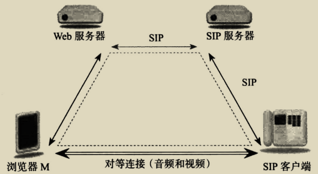
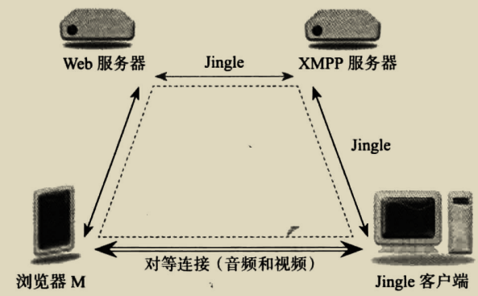

# 一、webGIS

## a、坐标系

用于定义实际位置的坐标框架，地球是一个椭球体，需要将位置展现在一个平面上，必然会出现一些偏差。

**地理坐标系**：直接建立在椭球体上，用经度和纬度表达地理对象位置。与投影坐标系==共同完成整个坐标体系==

**投影坐标系**：建立在平面上。将地球上的经纬度表示投影到平面上。
（a）实际投影时先将一些经线和纬线的交点展绘在平面上，再将相同经度的线连成经线，相同纬度的连成纬线形成经纬网。
（b）依靠这个经纬网，再在平面上去描绘具体的位置。
（c）**等角投影**：投影过程角度没有变形，**便于测量方向和角度**，但**面积变形很大**，不能做测量面积使用。
（d）**等积投影**：等面积投影，**便于面积的比较和量算**，常用于对面积测量要求高的情况。
（e）任意投影：以上两种投影的综合。

## b、底图

webGIS的二维底图主要有矢量地图和瓦片地图两种形式，可以读取本地数据文件解析，也可以从服务端拉取图片（常用）

**瓦片地图**：通过将影像数据进行预处理，采用高效缓存机制（金字塔结构）形成。
（a）web端使用时通过地图的级数（放大程度）行列号向服务端分别获取对应图片
（b）按照请求空间，行列号结构组织瓦片图在视图中显示。
（c）瓦片图是预先裁剪的缓存图片集，因此**加载速度一般较快**。

**矢量图**：
（a）web端通过网络请求gis服务，请求到矢量数据，前端实时生成矢量地图。
（b）矢量图**更能满足**web端上的**数据处理，分析要求**（如改变底图颜色）

# 二、webRTC

## a、简介

webrtc并非只用于互联网，或者简单的浏览器与服务器之间，**使用的传输协议是**`UDP、DTLS、RTP/SRTP`，音视频编码是`I420/VP8、iLIBC/iSAC、G722、PCM16`等。下面是它可以搭配的一些设备及其场景。

**webrtc三角形**：两个浏览器从同一个服务器下载同一份webrtc程序运行，==两个浏览器之间建立对等连接，直接传输数据==，但浏览器与服务器都有连接（webrtc中信令并未实现标准化。有时候将浏览器与服务器之间的连接称为信令）

**webrtc梯形**：两个浏览器分别连着两台不同的web服务器，两台服务器之间有标准信令连接，两个浏览器间直接传输音视频数据（一些复杂场景也可以改为通过一些介质设备来传递数据）

**SIP启动协议**：web服务器内有一个内置的**信令网关**，浏览器与**SIP客户端**之间通过此网关来建立连接**形成媒体流**（建立对等连接会与SIP用户代理建立标准的**实时传输协议**`RTP`）

**jingle**：web服务器具有一个内置的可扩展消息现场协议（`XMPP[RFC6120]`也称jabber）服务器，该内置服务器通过另一个XMPP服务器与jingle客服端通信。

**webrtc和公共交换电话网**(`PSTN`)：PSTN 网关是纯音频媒体流的终结点，负责将 PSTN 电话呼叫与媒体相连。在 Web 服务器与 PSTN 网关之间需要有某种形式的信令，具体可以是 SIP，也可以是主/从控制协议。

 

**webrtc多方会话**：
（1）**全网状模式：**多个浏览器之间都建立一个对等连接。**优劣**：不需要服务器基础架构，延迟最低，质量也最高，但不适合大型多方会议（带宽过高）
（2）**集中模式：**多个浏览器只用和一个服务器建立连接，然后服务器将多方的数据通过混合或不处理发送给各浏览器。**优劣**：适合大型会话，但会话人数少时效率反而显得较低。

**建立会话过程**：获取本地媒体，建立对等连接，关联媒体或数据，交换会话描述。

## b、获取本地媒体

**轨道**：(`MediaStreamTrack `)是 WebRTC 中的基本媒体单元。此轨道**代表**一种**设备或录制内容**(称为“源”) 可返回的单一类型的媒体。
（a）单个立体声源或 6 声道环绕声音频信号均可视为-个轨道，尽管二者都由多个音频声道构成。
（b）在使用对等连接进行传输时，**轨道的各个声道将被视为一个单元**，即使其在本地处于启用 /禁用或静音状态

**流**：(`MediaStream`) 是 MediaStreamTrack 对象的集合。有两种方式可用于创建这些 MediaStream对象
（a）一是通过从现有 MediaStream 中**复制轨道来请求**对本地媒体的访问。
（b）二是使用对**等连接来接收**新的流。
（c）请求和访问本地媒体只有一种方式，即通过调用` getUserMedia()`

```html
<video id="video">调用摄像头</video>
<canvas id="canvas"></canvas>
<button onclick="get()">打开摄像头</button>
<button onclick="show()">拍照</button>
<button onclick="deviceClose()">关闭所有设备</button>
```

**js部分**：只有本地文件(`file://, localhost://`)，和`https`情况才能访问

```js
var width = window.innerWidth;
var height = window.innerHeight;
var video = document.getElementById("video");
var stream = null;

// 点击调用摄像头【可以只获取音频/视频】
function get() {
  // obj传到getUserMedia()方法中
  var obj = {
    // 设置视图大小，允许录制音频
    video: {
      width: width,
      height: height,
      bitrate: 1500 * 1000,
      keyInterval: 2,
      // 帧率设置
      frameRate: {
        min: 5,
        ideal: 10, // 期望最合适的帧率
        max: 15,
      },
      facingMode: "user", // 前后置摄像头设置，user:前，environment:后
    },
    audio: true,
  };
  /*=======兼容性处理==================*/
  let photo =
    navigator.mediaDevices.getUserMedia(obj) ||
    navigator.webkitGetUserMedia(obj) ||
    navigator.mozGetUserMedia(obj) ||
    navigator.msGetUserMedia(obj);
  // 会先获取权限(用户控制)，调用成功的话则运行then()方法
  photo.then(function (MediaStream) {
    // srcObject属性，兼容性处理。
    stream = MediaStream;
    
     var t = stream.getVideoTracks()[0];
    console.log("capabilit--", JSON.stringify(t.getCapabilities()));
    /*****设置约束*****/ 
    var constraints = {
      mandatory: { aspectRatio: 1.33333333 },
      optional: [{ width: { min: 640 } }, { height: { max: 400 } }],
    };

    t.applyConstraints(constraints,() => {
        console.info("success--", JSON.stringify(t.getSettings()));
      },() => {
        console.error("err--");
    });
      
    if ("srcObject" in video) {
      video.srcObject = stream; //图像显示到video元素中
    } else {
      video.src = window.URL.createObjectURL(stream);
    }
    // 导入完毕时显示。
    video.onloadedmetadata = function (e) {
      video.play();
    };
  });
  // 调用失败则运行catch()方法
  photo.catch(function () {
    alert("调用摄像头失败");
  });
}
// 点击拍照
function show() {
  var canvas = document.getElementById("canvas");
  var ctx = canvas.getContext("2d");
  // 上面获取到的but是RGB数组对象。
  ctx.drawImage(video, 0, 0, width, height);
}
// 关闭所有设备
function deviceClose() {
  const devices = stream.getTracks();
  /**数据格式。
        [{contentHint: ""
        enabled: true
        id: "0f4862bc-40cf-4e12-9134-a87f88f8a5b0"
        kind: "audio"
        label: "默认 - 麦克风 (Realtek(R) Audio)"
        muted: false
        onended: null
        onmute: null
        onunmute: null
        readyState: "ended"
        }]
    */
  devices.forEach((v) => v.stop());
}
```

## c、信令

**信令作用**：浏览器与服务端的连接
（1）协商媒体功能和设置。
（2）标识和验证会话参与者的身份
（3）控制媒体会话、指示进度、更改会话和终止会话
（4）当会话双方同时尝试建立或更改会话时，实施双占用分解 (Glare Resolution)
（5）**注：**两个浏览器与服务器的**信令协议可以不同**，但信令或控制服务器==无法向终端设备中推送信令代码==。因此，**实现互操作功能**的唯一方式是，让两个终端使用**同一标准化信令协议**例如 SIP 或 Jingle 。

**信令传输**：
（1）http传输。
（2）websocket传输。

**信令协议**：
（1）各协议都有信令状态机（空闲、正在连接、已连接）
（2）`SIP`：一种信令协议，通常用于IP 语音 ( Voice over IP，VoIP) 和视频会议系统。
（3）`Jingle`：是对可扩展消息传递和联机状态协议的扩展，又称为 Jabber，它向XMPP 中添加了媒体信令功能。利用Jingle,可将SDP会话描述映射至XML格式，再通过TCP或TLS 传输至XMPP 服务器。

**信令通道建立**：可以在获取“本地媒体流”之前，执行此步操作（这是一个webrtc三角形例子）
（1）开始：可将状态机（自定义的）设置为**空闲状态**。
（2）本地浏览器先向web服务器发送一个`密钥key`。
（3）本地浏览器等待web服务器告知“另一个端浏览器”是否有响应（是否已准备进行连接）【可使用http轮询，或websocket】
（4）未得到对方浏览器的应答（来自服务器），则都将状态机状态置为**“等待状态”**。
（5）收到另一方浏览器应答后（来自服务器），将状态机状态设置为**“已连接”**。
（6）然后向web服务器发送信令相关信息（web服务器要将其发送给对端浏览器）

## d、对等连接

WebRTC 对等连接并不是TCP 意义上的那种连接。它是一组路径建立进程(ICE)以及一个可确定应建立哪些媒体和数据路径的协商器。RTCPeerConnection 对象的构造函数有一个配置对象，该配置对象包含一系列属性其中最重要的是 iceServers，此属性是一个服务器地址列表，用于帮助通过 NAT 和防火墙建立会话。

**NAT**：用于将1个IP地址空间映射到另一个空间，通常人们使用NAT让多个设备共享1个ip地址。
（a）位于 NAT 之后(NAT“内部”)的IP 地址是“私有”IP 地址。
（b）分配给 NAT 的IP 地(可能有多个地址)是“公共”IP 址。
（c）NAT 每次从内部向外部转发数据包时，都使用公共地址。

**STUN服务器**：用于帮助遍历 NAT 的服务器，称为 NAT 话遍历实用工具 
（1）每个浏览器通过发送 STUN 数据包来查询STUN 服务器。STUN 服务器做出响应，指示其在测试数据包中监测到的 IP 地址
（2）对于从 STUN 服务器获取的这一 IP 地址，将与另一端的浏览器所共享此地址将成为潜在的“候选”地址。

**TURN服务器**：名为使用中继型 NAT 遍历，
（1）浏览器通过查询 TURN 服务器来获取媒体中继地址。媒体中继地址是一个公共 IP 地址，
（2）用于转发从浏览器收到的数据包，或者将收到的数据包转发给浏览器。
（3）如果两个对等端之间单纯因为 NAT 的类型而无法建立直接的对等媒体会话，则可以使用中继地址。

**打洞技术**： 靠将要建立的会话中的每个对等端来收集一组可通过Internet 访问它们的潜在方式。

**提议/应答协商**：要在双方之间建立媒体会话，必须在二者之间协商会话。协商之所以不可或缺，是因为双方==需要为会话确定一组通用的功能特性==。
（a）这组功能特性事先并不明确，因为它**取决于双方**使用的具体浏览器版本、浏览器上运行的 JavaScript 以及用户双方各自的选择WebRTC 中使用的协商方式称为“`提议/应答`”，这是一种“**一次性通过**”型协商机制。
（b）首先，一方针对要建立的媒体会话类型创建描述，以此来发起媒体会话，此过程称为“`提议`”。第一方使用信令通道将提议发送给另一方。
（c）随后，另一方予以回应，此过程称为“`应答`”此**应答将列出**，在第一方提议的会话功能特性中，另一方能够或愿意在此会话中==支持或使用哪些功能特性==。
（d）应答将被发送回第一方，并且也**通过信令通道传输**。从生成提议到收到应答的整个交换过程就称为**“提议 /应答协商”**
（e）比如确定媒体的类型（是只有音频还是视频）使用的解码器，及其参数。
（f）复杂的情况可能要进行多次 提议/应答协商。webrtc中使用专门的`RTCSessionDescription`来进行这一描述。

**建立对等连接实现**：这里只给出相关部分代码逻辑

```js
const config = []; // 连接配置
var doNothing = function() {};
var constraints = {
    mandatory: {OfferToReceiveAudio: true,OfferToReceiveVideo: true}
};
if (stunuri) {
    // 谷歌的一台 stun服务器
    config.push({"url":"stun:stun.l.google.com:19302"});
  }
  if (turnuri) {
    if (stunuri) {
      // 不能使用仅支持turn的 turn服务器（google中有bug） 需要使用同时有 stun的服务器
      config.push({"url":"turn:user@turn.webrtcbook.com","credential":"test"});
    } else {
      // 一台仅有turn的服务器
      config.push({"url":"turn:user@turn-only.webrtcbook.com","credential":"test"});
    }
}
/***创建 对等连接 实体****/
var pc = new RTCPeerConnection({iceServers:config});
pc.onicecandidate = onIceCandidate;
pc.onaddstream = onRemoteStreamAdded;
pc.onremovestream = onRemoteStreamRemoved;

// 如果有另一个候选项，则发送给对等端 （？？？）
function onIceCandidate(e) {
  if (e.candidate) {
    // 用网络发送给对等端，对等端接收到后会添加该候选项。
    rpc.send({type: 'candidate',mlineindex: e.candidate.sdpMLineIndex,candidate: e.candidate.candidate});
  }
}

// 检测到另一端加入了媒体流，则将其显示出来
function onRemoteStreamAdded(e) {
  var yourVideoStream = e.stream;
  var yourVideoDom = document.getElementById("yourVideo");
  attachMediaStream(yourVideoDom, yourVideoStream);
}

// 对等端 移除了媒体流时触发
function onRemoteStreamRemoved(e) {}

// 告诉浏览器要将 本地流加入对等连接，但实际还不会真正的产生流
pc.addStream(myVideoStream);

// 为提议生成会话描述【连接之后可主动调用，也可让用户点击按钮触发】
function call() {
  pc.createOffer(gotDescription, doNothing, constraints);
}

// 为应答生成会话描述
function answer() {
  pc.createAnswer(gotDescription, doNothing, constraints);
}

/*
生成的会话描述都要添加到本地，用于发送给另一端。
设置了本地描述浏览器才能 两端之间发送媒体流。
*/
function gotDescription(localDesc) {
  pc.setLocalDescription(localDesc);
  rpc.send(localDesc);
}

/***连接过程中的消息处理***/
function rpcConnect(){
    ...
    // 连接中接收到 会话描述 时进行相应的操作
    if (msg.type === "offer") {
      pc.setRemoteDescription(new RTCSessionDescription(msg));
      answer();
    } else if (msg.type === "answer") {
      // 设置远程会话描述
      pc.setRemoteDescription(new RTCSessionDescription(msg));
    } else if (msg.type === "candidate") {
      // 添加候选项！！
      pc.addIceCandidate(new RTCIceCandidate({sdpMLineIndex:msg.mlineindex,candidate:msg.candidate}));
    }
    ...
}
```

## f、搭建 STUN/TURN

目前比较流行的 STUN/TURN 服务器是 [coturn](https://link.juejin.cn/?target=https%3A%2F%2Fgithub.com%2Fcoturn%2Fcoturn)，使用它搭建 STUN/TURN 服务非常的方便。

```
git clone https://github.com/coturn/coturn.git
// 编译
cd coturn
./configure --prefix=/usr/local/coturn
sudo make -j 4 && make install

// 配置
listening-port=3478        #指定侦听的端口
external-ip=39.105.185.198 #指定云主机的公网IP地址
user=aaaaaa:bbbbbb         #访问 stun/turn服务的用户名和密码
realm=stun.xxx.cn          #域名，这个一定要设置

// 启动 stun/turn 服务
cd /usr/local/coturn/bin
turnserver -c ../etc/turnserver.conf
```


# 三、流传输方法

## 1、RTSP

**介绍**：实时流[传输协议](https://link.juejin.cn/?target=https%3A%2F%2Fbaike.baidu.com%2Fitem%2F%E4%BC%A0%E8%BE%93%E5%8D%8F%E8%AE%AE%2F8048821%3FfromModule%3Dlemma_inlink)（RTSP）是**公有**协议，流媒体传输协议。

- 是`TCP/IP`协议体系中的一个应用层协议。
- 该协议定义了[一对多](https://link.juejin.cn/?target=https%3A%2F%2Fbaike.baidu.com%2Fitem%2F%E4%B8%80%E5%AF%B9%E5%A4%9A%2F1327103%3FfromModule%3Dlemma_inlink)[应用程序](https://link.juejin.cn/?target=https%3A%2F%2Fbaike.baidu.com%2Fitem%2F%E5%BA%94%E7%94%A8%E7%A8%8B%E5%BA%8F%2F5985445%3FfromModule%3Dlemma_inlink)如何有效地通过IP网络传送多媒体数据。
- 服务端可以自行选择使用TCP或UDP来传送串流内容。
- 它的语法和运作跟HTTP 1.1类似，但并**不特别强调时间同步**，所以比较能容忍网络延迟。
- url格式：类似`rtsp://host[:port]/[abs_path]/content_name`。
- **无法直接使用**现有的web技术进行播放rtsp直播数据流的（`hls，rtmp`其实是对该方案的替代实现）

## 2、HLS

**介绍**：常用与流媒体**播放**，也有利用其推流的技术（==web端只能拉流播放==）
（1）的工作原理是把整个流**分成一个个小的基于 HTTP 的文件**来下载，每次只下载一些。
（2）当媒体流正在播放时，客户端可以选择从许多不同的备用源中以不同的速率下载同样的资源，
（3）允许流媒体会话适应不同的数据速率。
（4）客户端首先需要下载描述不同码流元数据的**M3U8索引文件**
（5）**m3u8**：该文件实质是一个播放列表（playlist）其可能是一个媒体播放列表（Media Playlist），或者是一个主列表（Master Playlist）。但无论是哪种播放列表，其内部文字使用的都是 utf-8 编码。

```js
/*===*-----  直播端逻辑  ----*===*/
var stream = await navigator.mediaDevices.getUserMedia({ audio, video });
var rtc = new RTCPeerConnection(null);
// 将每帧流添加到rtc中。
stream.getTracks().forEach(function (track) {
  //将一个新的媒体音轨添加到一组音轨中，这些音轨将被传输给另一个对等点。
  rtc.addTrack(track);
});
var offer = await rtc.createOffer(); // 返回一个本地会话描述。
await rtc.setLocalDescription(offer); // 设置本地描述,然后通过其信令通道将此会话描述发送
// 将信令sdp发送，并获取服务端用于与该客户端连接的sdp。
const sdp = await ajax({ url, data: { sdp: offer.sdp, streamurl: "" } });
// 将此获取到的sdp设为远程会话描述。
await offer.setRemoteDescription(
  new RTCSessionDescription({ type: "answer", sdp: sdp })
);
/*=========
    收看端
===========*/
// 使用hls.js进行拉流，内部原理暂未了解！。
if (video.canPlayType("application/vnd.apple.mpegurl")) {
  video.src = "http://fjjla.m3u8";
  video.play();
} else if (Hls.isSupported()) {
  // hls.js播放m3u8视频流
  that.flvPlayer = new Hls();
  that.flvPlayer.loadSource("http://fjjla.m3u8");
  that.flvPlayer.attachMedia(video);
  video.play();
}
```

## 3、FLV

**介绍**：用于在Web浏览器中播放FLV格式的视频文件（==只能播放==）
（a）`flv`的原理是通过将FLV文件从HTTP请求中通过AJAX异步请求获取到，然后将FLV文件转换成JavaScript对象的形式，
（b）然后将音视频数据按照FLV协议解析出来，并通过HTML5的Video组件或Flash组件进行展示播放。
（c）是**使用WebSocket**在服务端和客户端之间进行数据传输

**HLS与FLV的区别如下**：

- 分片方式不同：HLS将视频分成5秒~10秒的视频小分片，然后用m3u8索引表进行管理；FLV只是在大块的视频帧和音视频头部加入一些标记头信息。
- 延迟不同：HLS由于客户端下载到的视频都是5秒-10秒的完整数据，**故视频的流畅性很好**，但也同样**引入了很大的延迟**（HLS的一般延迟在10秒~30秒左右）；FLV在延迟表现和大规模并发方面都很成熟，唯一的不足就是在手机浏览器上的支持非常有限，但是用作手机端App直播协议却异常合适。
- 支持不同：相比于FLV，HLS在iPhone和大部分Android手机浏览器上的支持非常给力，所以常用于QQ和微信朋友圈的URL分享。

## 4、GB28181

**介绍**：是**视频监控**领域的国家标准。

- 该标准规定了公共安全视频监控联网系统的互联结构， 传输、交换、控制的基本要求和安全性要求， 以及控制、传输流程和协议接口等技术要求，是视频监控领域的国家标准。GB28181协议信令层面使用的是SIP（Session Initiation Protocol）协议。
- 流媒体传输层面使用的是实时传输协议（Real-time Transport Protocol，RTP）协议。
- 因此可以理解为GB28181是在国际通用标准的基础之上进行了私有化定制以满足视频监控联网系统互联传输的标准化需求。本文旨在说明在FFmpeg中增加对GB28181协议的支持，使其可以与支持GB28181协议的设备进行通信与控制，实现设备的注册、保活以及流媒体的传输。

## 5、RTMP

**介绍**：是`Adobe`的**私有协议**，流媒体传输协议（==web端没有找到rtmp推拉流方法==，一些收费的第三方暂未了解）

- 推流协议使用 rtmp，之前的借助` flash` 插件实现 rtmp 推流，但 flash 插件各浏览器几乎已不支持。
- 其主要作用为直播。
- 其传输协议为`TCP`协议，可以在一定程度上保证传输质量。RTMP采用了`FLV`作为封装格式，`H.264`作为视频编码格式，`AAC`作为音频编码格式。
- web端中也==有一些第三方库支持rtm==p，如`video.js`

## 6、RTP&RTCP

**RTP**：全称实时传输协议

- 应用场景主要包括交**互式视频音频**或模拟数据的传输，可以在组播或单播网络服务下进行数据传输。
- 本身并**没有提供按时发送机制**或其他服务质量保证，它依赖于底层服务去实现这一过程。
- RTP并不保证传送或防止无序传送，也不确定底层网络的可靠性。
- RTP为**直播或会议等实时传输**应用提供了端到端的服务，其可以与一些传输协议（如UDP或TCP）配合使用，在网络中实现多媒体数据流的传输。

**RTCP**：实时传输控制协议 是由IETF定义的一个与`RTP`配套的协议（==RTCP负责质量控制，RTP负责传输==）

- 负责管理传输质量，提供流量控制和拥塞控制服务。
- RTCP为RTP流媒体提供信道外控制。RTCP**本身并不传输数据**，但是和RTP一起合作将多媒体数据打包和发送。
- RTCP在RTP会话期间，每个会话参与者周期性地向所有其他参与者**发送RTCP控制信息包**。
- 功能是为应用程序提**供会话质量**或者广播性能质量的信息。

## 7、编码/压缩

**H.265**：ITU-T国际标准之一，全称是`High Efficiency Video Coding（High-Efficiency Video Coding）`，是一种针对**视频编码**技术的高级**视频压缩格式**。H.265是一种新的视频压缩格式，它继承了`H.264`的高压缩率、高实时性以及低延迟等优点，同时引入了新的编码工具和算法，使得其在相同压缩率下比H.264具有更高的画质和性能。

## 8、库与工具

**srs音视频服务器**：支持RTMP、WebRTC、HLS、HTTP-FLV、SRT等多种实时流媒体协议。[官网](http://www.ossrs.net/lts/zh-cn/docs/v5/tutorial/srs-server)、[一篇web端博客参考](http://lihuaxi.xjx100.cn/news/1454821.html?action=onClick)、[webrtc推服务端](https://juejin.cn/post/7158670561906786311?searchId=20230904094835C3F484E35148A8D12263)、

**webrtc相关库**：[腾讯的一套 webrtc 直播 sdk](https://github.com/tencentyun/tweblive)、[一个开源webrtc](https://github.com/mpromonet/webrtc-streamer)、[方案参考](https://juejin.cn/post/7210574986780426277?searchId=2023082311312768B28DB46AC2D3039196)、

`FFmpeg`：一套可以用来记录、转换[数字音频](https://baike.baidu.com/item/数字音频/5942163?fromModule=lemma_inlink)、视频，并能将其转化为流的开源计算机[程序](https://baike.baidu.com/item/程序/13831935?fromModule=lemma_inlink)。它提供了**录制、转换以及流化音视频的完整解决方案**。有非常强大的功能包括[视频采集](https://baike.baidu.com/item/视频采集/3430654?fromModule=lemma_inlink)功能、[视频格式转换](https://baike.baidu.com/item/视频格式转换/9399376?fromModule=lemma_inlink)、视频[抓图](https://baike.baidu.com/item/抓图/317285?fromModule=lemma_inlink)、给视频加水印等。

`flv.js`：flv的实现，封装实现不占体积，且已是一个较成熟的库。

`easyPlayer.js`：一个较新于`flv.js`的库，支持`HTTP-FLV/WS-FLV, m3u8/HLS，mp4`播放，还有截屏、录像、自动重连，播放质量似乎也高于`flv.js`

## 9、总结

**各种协议使用/转换/特点总结**：

- **GB28181**：是主要用于**视频监控**，因此它对**音频的支持较弱**，且其有许多坑点，但多数摄像头都会支持该协议。
- **hls与flv**：这两个浏览器端都可以支持，一般做直播收看端可用，或播放些流媒体数据，`hls比flv`更稳定，但延迟更高。
- **webrtc**：点对点传输方案是**所有流传输方案**中==延迟最低的==，但成功率只有`85%`。也可与服务端传输，一般对接其它流传输协议，或多人音视频会议时使用。
- **流转换**：服务端一般都可以对以上各种流传输协议转换，但部分可能转换比较麻烦。
- **web端推流**：目前只有webrtc推流一种方案。
- **rtmp**：其使用的http传输，因此实时性不如webrtc，主要用途是直播。
