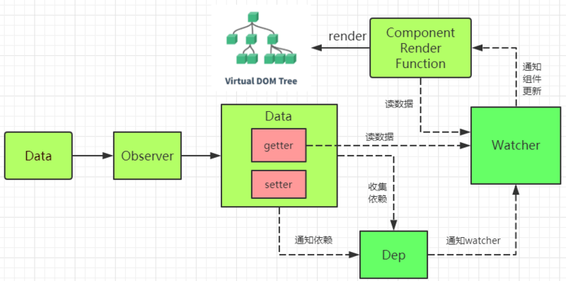
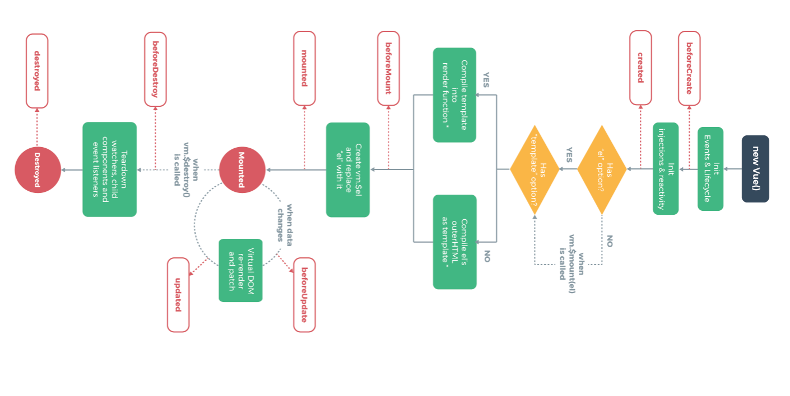
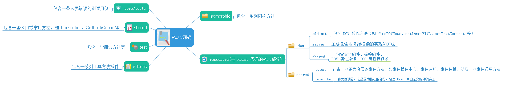
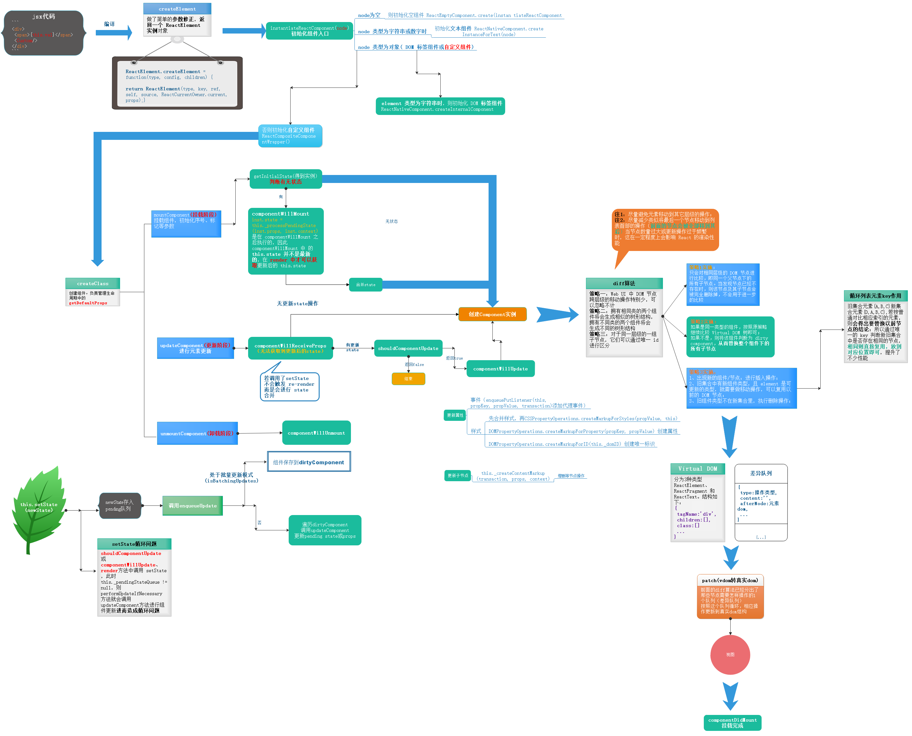
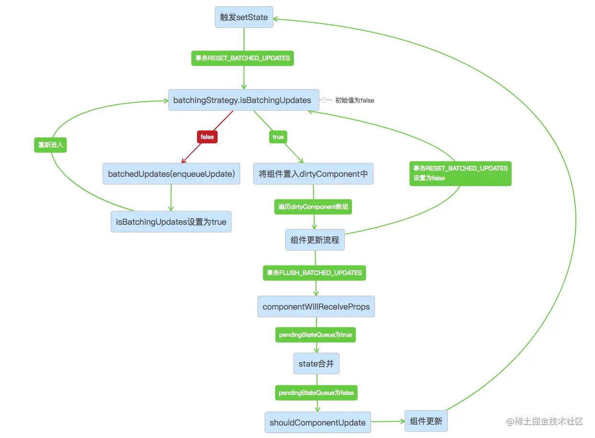
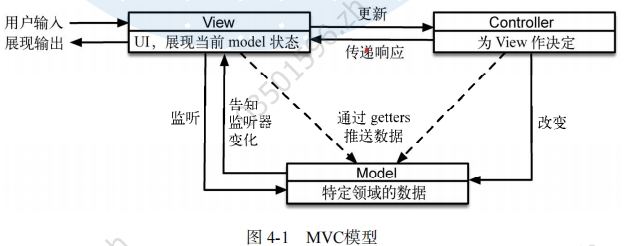
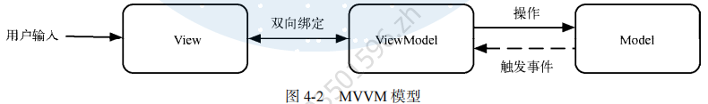
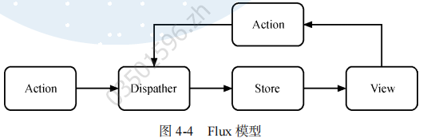

# 一、离线web应用
**html部分离线定义**：
```html
<!DOCTYPE HTML>
<!--cache.appcache放在与该html文件同目录下；文件中指定缓存相关的控制信息-->
<html manifest="cache.appcache"></html>
```
cache.appcache内容如下：以后规范中会被废弃
- 开头为默认区域；CACHE后面定义要缓存的文件；
- FALLBACK定义未被离线缓存的资源，使用的默认；支持匹配；
- NETWORK：定义不缓存的文件；
```
CACHE MANIFEST

index.html
abc.png

CACHE:
hello.png

FALLBACK:
*.png default.png
* offline.html    #点击的目标链接未被缓存时，使用的默认页面

NETWORK:
acc.jpg
```
**接口的离线处理**：

```js
/******状态判断******/
if(window.navigator.onLine){
    alert("在线状态");
}else{
    alert("离线状态");
}
/*使用离线，返回的属性如下：
update()        更新缓存
swapCache()    交换当前缓存与较新缓存
status        缓存的状态
*/
var cs = window.applicationCache;

/******离线时使用代理处理接口********/
// index.js
if (navigator.serviceWorker) {
  navigator.serviceWorker
    .register('sw.js')
    .then(function(registration) {
      console.log('service worker 注册成功')
    })
    .catch(function(err) {
      console.log('servcie worker 注册失败')
    })
}
// ---------sw.js
// 监听 `install` 事件，回调中缓存所需文件
self.addEventListener('install', e => {
  e.waitUntil(
    caches.open('my-cache').then(function(cache) {
      return cache.addAll(['./index.html', './index.js'])
    })
  )
})

// 拦截所有请求事件
// 如果缓存中已经有请求的数据就直接用缓存，否则去请求数据
self.addEventListener('fetch', e => {
  e.respondWith(
    caches.match(e.request).then(function(response) {
      if (response) {
        return response
      }
      console.log('fetch source')
    })
  )
})
```

# 二、vue2

**核心实现**：每个组件实例会有一个渲染 watcher，用于收集页面上的绑定的属性。计算属性和监听属性建立后都会各有一个 watcher 用于手机相应的依赖，并同时向 Dep 中发布订阅，添加到 Dep.subs 中，然后各 watcher 收集到的响应式对象会交给 Observe，其使用 Object 方法集为这些响应式对象添加 getter，setter 属性，当发生改动时会触发 setter，然后 setter 内根据其绑定的相关 watcher 通知 Dep，触发 Dep 的 notify()函数，去遍历 Dep.subs 中的订阅者，触发相关 watcher 的 update 方法重新计算、渲染。

  

## a1、原理:

**初始化阶段**(这个阶段主要是把普通对象转化为响应式对象)、**编译阶段**(编译阶段会把 options.template 编译成 render 函数，解析 template 中的数据，事件绑定等)、**挂载阶段**(这个阶段会执行 render 函数以获取 vnode。然后模板引擎根据 vnode 去生成真实 DOM)、**监听阶段**(挂载阶段之后，模板引擎已经渲染好网页，这时就进入了监听阶段。patch 函数还会对比新旧 vnode，并计算出更新 DOM 需要的操作。最后由框架更新到网页上)、**注销阶段**(注销过程会先触发 beforeDestroy，然后注销掉 watchers、child components、event listeners 等，之后是 destroyed 钩子函数)。
**vue 生命周期**：生命周期函数运行顺序如下：注意各阶段对应的钩子函数。

- **beforeCreate**：new 一个 vue 实例后，只有一些默认的生命周期钩子和默认事件，其他的东西都还没创建。data 和 methods 中的数据都还没有初始化。因此不能在此调用 methods 的方法和 data 的数据。

- created：data 和 methods 都已经被初始化好了。

- beforeMount：在内存中已经编译好了模板了，但是还没有挂载到页面中。

- mounted：Vue 实例已经初始化完成了。进入运行阶段，页面渲染完成，可在此进行操作 dom。

- beforeUpdate：页面中的显示的数据还是旧的，data 中的数据是更新后的， 页面还没有和最新的数据保持同步。

- updated：页面显示的数据和 data 中的数据已经保持同步了，都是最新的。

- beforeDestroy：进入到了销毁阶段，这个时候上所有的 data 和 methods ， 指令， 过滤器 ……都是处于可用状态。还没有真正被销毁。

- destroyed(组件已经被销毁)。

- **单个组件中为什么 data 是一个函数**：由于组件可以复用，而对象又是引用型的，如果改成 map，会造成互相污染，函数则是返回一个全新的。

- **vue 怎么监听数组的**：与v3的处理一致，都需要对`map,splice,forEach`等方法重写，处理产生的副作用问题。

- **虚拟 DOM**：vue 中的虚拟 DOM 是根据对编译后的模板，生成一个用 js 对象描述节点内容，属性的抽象。

- **nextTick**：vue 用异步队列的方式来控制 DOM 更新和 nextTick 回调先后执行，nexTick 中的操作是放于微任务队列，若浏览器不支持则会使用 setTimeout(fn,0)来处理。

- **diff 算法**：用于新老虚拟 DOM 之间找到最小更新部分，然后进行更新。

  （1）比较新旧节点是否为同一节点（使用 key 或选择器）若不是同一节点则以旧节点为基准插入这个新节点，然后删除旧节点。

  （2）若是同一节点且文本属性等都相同则不作处理，若只有文本差异则替换文本即可。

  （3）若新节点有子节点，则清空老节点，将新节点的子节点插入老节点中即可。

**vue-cli**：
是一个构建项目的工具，一个平台，也是一个 npm 包。它提供一套初始的项目模板，内部规定好哪些文件夹的功能。打包时使用的 webpack，webpack 的配置，vue-cli 中也写了一些初始的配置，webpack 做为项目的一个依赖而安装。其它安装的一些依赖都放在 node_modules 下，一些 less-loader,file-loader 的东西是在编译打包时运行的，其配置也作为 webpack 的 plugin。这些工程化项目的过程中 node 只是作为一个让其独立运行的环境，当然这当中也使用 node 一些自带的功能。所以不使用 vue-cli,自己定义一个目录，编写配置也是可以的，也由此有很多 cli 工具。**vue-cli 中使用的服务时 webpack 的服务**。

- 安装：`npm install vue-cli -g`#全局安装 vue-cli 工具，安装后可以使用 vue 命令初始化项目。
- 初始化：`vue init webpack test `#配置更开发，适合中大型。`vue create project`#配置较简单。
- **vue-cli-service**：该 service 相当于是使用 node 语言书写的一个本地服务，包括默认从 vue.config.js 读取配置（所以与 webpack-service 使用时的配置有些差异），运行 webpack 这些操作。所以也可以根据这些逻辑自己写一个恶脚手架。
- **可视化管理**：cmd/输入：vue ui 打开 vue 的开始化管理界面，导入项目，然后进去查看详细。

相关资源：

- [package.json 文件各种属性解释](https://zhuanlan.zhihu.com/p/33928507)、[使用 ts 的创建。](https://zhuanlan.zhihu.com/p/99343202)
- [vuejs 官网。](https://cn.vuejs.org/v2/guide/)、[vue 深入原理参考学习地址](https://zhuanlan.zhihu.com/p/101330697)、[生命周期解释](https://www.cnblogs.com/wzndkj/p/9612647.html)、[具体介绍学习地址。](https://blog.csdn.net/weixin_34023863/article/details/87945630)

**问题集**：

- linux 上：安装 vue-cli 后会在所的 nodejs/bin 下看到 vue。(npm config list#可以查看这个文件的位置)。为这个 vue 建立一个软链接将其放到/usr/local/bin 下，`sudo ln -s /home/wcs/software/nodejs/bin/vue /usr/local/bin/vue`
- windows 上：将`C:\Users\wcs\AppData\Roaming\npm`#vue 被下载到该文件，添加到环境变量即可。

## a2、基本使用

**$attrs 与\$listeners**：

```html
<!--子组件-->
<label>输入框：</label><input v-bind="$Allattrs" v-on="$listenserAll" />
<script>
  export default {
    name: "pop",
    computed: {
      $Allattrs() {
        return this.$attrs; //this.$attrs表示绑定在该组件上的所有属性。
      },
      $listenserAll() {
        //this.$listeners也是表示从父组件接收到的所有绑定事件。
        return Object.assign({}, this.$listeners, {
          input: (event) => this.$emit("input", event.target.value),
        });
      },
    },
  };
</script>
<!--父组件,native修饰符的事件不会出现在$listeners中-->
<pop
  placeholder="$attrs支持不使用bind写法传值"
  @focus="focus"
  @input="inp"
  @change.native="change"
/>
```

- **循环**：

```html
<li v-for="i in is">
  <h5>{{ i }}</h5>
  <div v-if="i == 0" v-html="a">这是i</div>
  <div v-else-if="i == 1" v-html="b">这是else</div>
  <div v-else v-html="c"></div>
</li>
// 常用情况,key尽量使用一个唯一的值，不使用索引。
<p v-for="(val,idx) in phones" :key="idx">{{ val.text }}</p>
```

**注**：由于 vue2.x 使用 Object.defineProperty 监听对象，数组数据无法监听到改变，尽量使用 Array 自带方法：splice/push 等操作数组，或$forceUpdate 强制刷新。

- **method**：

```js
var v = new Vue({
  el: "#view",
  data: { name: "error" },
  method: {
    alter: function () {
      this.name = "vue";
    },
  }, // 这里的this指向的是method
  //所以data中的数据已被逐一放置到method中
  component: { template: "<h3>dkl</h3>" },
});
v.alter(); //直接运行函数
```

调用方法集中的函数：v.alter()直接调用，或原始中`<p v-on:click="alter()"></p>`，v-on 绑定的事件是动态绑定的所以使用 v-for 循环出来也能使用。

- **样式绑定**：

```html
<div v-bind:class="{a:isa,b:isb}"></div>
<!--isa为true时将类名a绑定-->
<p v-bind:class="[a,b]"></p>
// 绑定多个类名
<a v-bind:style="styObj"></a>//styObj是js中定义好的变量，内嵌样式
<b v-bind:style="{ width: w + 'px',color: col }"> </b>
```

- **计算属性与监听属性**：与 methods 是一个函数集对象，不过 computed 中的函数可以直接放到模板中<b class="violet">computed 一般用于页面渲染的数据，watch 一般监听一个值改变影响较大情况。</b>

```js
//<p>{{ name }}</p>// name对应cmputed中对应的函数名，会将函数返回值作为name值。也可以写成{{ name() }}
...
data:{
    b:22,
    vb:89
},
computed:{
    name:function(){
        a = this.b + 1;
        return a;// 这里的返回值a依赖于this.b，只有当this.b发生变化时才会重新运行该函数，
        //如果这里时一系列复杂庞大的数据操作，每次调用name时也能快速获取到值(所以这是一个缓存效果)。如果不希望缓存的话可以用methods中的方法。
    },
    age:{
        // 像上面的name函数在创 建后，会被vue实例转化为一个对象，默认有一个get属性获取值。
        get:function(){return 35;},// getter该数据时触发。
        set:function(){// 可以以这样的方式来添加一个set操作。set该数据时触发。
            return this.b + 10;
        }
    }
},
watch:{// watch中的函数名对应data中想要监听的数据名。
    vb:function(newVal,oldVal){// 会传入两个参数。在vb这个数据变化时触发。
        this.b = 29;
    },
    a(){//a发生了变化},
    obj:{
        // 监听一个对象的变化，需要加deep属性。
        heandler(nw,old){
            //发生变化时触发
        },
        deep:true
    },
    "obj.name"(){
        //也可以这样来监听一个对象的属性。
    }
}
```

- **事件绑定中传入 event 参数**：

```js
<p v-on:click="get($event)"></p>;
function get(e) {
  // 使用此法来获取当前元素。*********注意！就算get中不传入$event对象，也会默认传入。
  e.target.style.color = "red"; //若绑定事件的元素中有多个子元素请用
  //currentTarget,因为可能点Z中的是子元素，触发事件的却是因为事件冒泡
}
```

**插件**：

```js
//plugin.js放置 插件格式,一个对象。
export plugin = {
    install(vue,params){//第一个会被传入vue对象。
        vue.prototype.plugin = function(){}
    }
}
//main.js
import {plugin} from "./plugin.js";
vue.use(plugin,"hello");//use方法会调用plugin的install()函数
```

## a3、组件：

第三方的组件一般安装后可直接单个页面按需引入，对应的插件安装后也可以单页面直接引入使用。子组件使用的数据最好是在父组件 mounted 之前就生成。

```js
<script>
// 全局注册，写在main.js文件中
Vue.component("wcs",{
    template:'<h1>{{ info }}</h1>',
    props:['info'],
    data:{},
    props:[],
    methods:{}
});// 页面中直接<wcs></wcs>即
</script>
/*======================
    父组件值改变，子组件不刷新问题
========================*/
<child :key="dateStream" :forms="useForm"/>
<script>
alter(){
    this.ajaxRequest();
    this.dialogOpen = true;                        //会先打开子组件，但数据还没拿到。
},
ajaxRequest(){
    ajax({..}).then(r=>{
        this.useForm = {...};
        this.dataStream = new Date().getTime();    //更改子组件key值，此时会再次刷新子组件。
    })
}
</script>
```

**局部注册**：

```html
<!--av是子组件test中的props中定义的值，当是一个对象时可以直接v-bind。:av="nm"(mpvue中的简写)。
.async表示组件内修改值也改变组件外的值，两者同步。
-->
<test v-bind:av="nm" v-bind="post" :varray.async="datas"></test>
import test from '../component/test' ... components:{test}
```

<i class="label2">prop 验证</i>在父组件向子组件中的 props 传递值时，props 的值可以预先写定一个类型数据来做验证，若传来的值不满足验证则会有 warn 提示。

```js
// 子组件中的props内容。
props:{
    age:Number,
    propB: [String, Number],// 多个可能的类型
    propC: {// 必填的字符串
      type: String,
      required: true
    },
    propD: {
      type: [Number,String],//接受多个类型的写法
      default: 100
    },
    propE: {// 带有默认值的对象
      type: Object,
      // 对象或数组默认值必须从一个工厂函数获取
      default: function () {
        return { message: 'hello' }
      }
    },
    propF: {    // 自定义验证函数
      validator: function (value) {
        // 这个值必须匹配下列字符串中的一个
        return ['success', 'warning', 'danger'].indexOf(value) !== -1
      }
    }
}
// 父组件内容
<test :age="age"></test>
data:{age:'fdsf'}//与子组件要求的数据类型不一致时会在控制台有warn提示。
```

**keep-alive 的使用**：用于缓存组件，具体如下：

- **原理**：根据组件 ID 和 tag 生成缓存 Key,并在缓存对象中查找是否已缓存过该组件实例。如果存在,直接取出缓存值并更新该 key 在 this.keys 中的位置。在 this.cache 对象中存储该组件实例并保存 key 值,之后检查缓存的实例数量是否超过 max 的设置值,超过则根据 LRU 置换策略删除最近最久未使用的实例。

```html
<!--include和exclude用于匹配组件的name，满足匹配项的才会缓存或不缓存，也可以是一个列表-->
<keep-alive :include="[/login/,'/acc/']" :exclude="/acc/">
  <login />
</keep-alive>
```

- **两个额外的钩子函数**：由于组件被缓存起来，再次使用到该组件时不会触发它的一系列生命周期函数，可用如下钩子判断是否处于使用中。

```js
export default {
  activated() {
    //活跃状态，在使用时触发,即使第一次进入页面也会触发。
  },
  deactivated() {
    //不使用时触发
  },
};
```

**组件中使用插槽**：有时候我们定义一个组件不能完全应付所有场景，比如一个底部弹出框，有的有选择项，有的是展示商品内容，如果靠传值来控制显示，会导致子组件内东西非常多。而分为多个组件来写，它们之间又有一些共用的东西，所以产生了插槽。

```html
// 第一个子组件的内容
<template v-slot:head
  >// v-slot的值对应第三个子组件中slot的name属性。具名插槽可以缩写为#head
  <div>第一个子组件内容{{ name }}</div>
</template>
// 第二个子组件的内容
<template v-slot:[slotType]
  >//
  只能用在template标签上。用[]时就是使用动态插槽名，改变slotType值可以改变要插入的插槽。
  <div>第二个子组件内容。</div>
</template>
// 第三个子组件的内容，设置了slot
<template>
  <div>
    <slot name="head"></slot>// 对应的v-slot值会放到对应的name值位置。
    <slot name="body"></slot>// 这种指明了插槽名的情况被叫做具名插槽。
  </div>
</template>
// 一个单页面中的内容
<template v-slot:head>
  <div>
    <hello>
      //这里的hello是子组件3
      <c1></c1> //这是子组件1，也可以这这个标签中写v-slot:head属性。
    </hello>
  </div>
</template>
```

**插槽作用域**：用于子组件中的数据想提供给父组件任意展示。[学习地址。](https://blog.csdn.net/lzl980111/article/details/104783252/)

```html
<!--子组件中-->
<template>
  <div><slot :data="dts"></slot></div>
  <!--绑定一个数据上去-->
</template>
<script>
  export default {
    name: "child",
    data() {
      return { dts: [1, 2, 3] };
    },
  };
</script>

<!--父组件中-->
<template>
  <div>
    <child slot-scope="slot"
      ><!--数据都在slot下-->
      <span>{{ slot.dts.join('-') }}</span>
    </child>
  </div>
</template>
```

**动态组件和异步组件**：使用 component 标签和 v-bind:is 属性来切换组件。

```js
<keep-alive>// 外面套上keep-alive标签后，加载过的组件会被缓存下来，再切回去的时候不会重新渲染。
  <component v-bind:is="name"></component> //component是vue内部自带的已注册的标签名，修改name值(对应组件名称)来在这个位置切换组件。
</keep-alive>
data:{
    name:'test'
},
components:{
    test,
    vv:()=>import("../components/vv"),//该组件会被单独打包成代码块，使用时才会被以<script>的形式引入页面。
    cc:() => ({    //定义异步组件加载时的一些其它行为。
      // 需要加载的组件 (应该是一个 `Promise` 对象)
      component: import('./MyComponent.vue'),// 异步组件加载时使用的组件
      loading: LoadingComponent,// 加载时使用的组件
      error: ErrorComponent,// 失败时使用的组件。
      delay: 200,// 如果提供了超时时间且组件加载也超时了，
      // 则使用加载失败时使用的组件。默认值是：`Infinity`
      timeout: 3000 //超过该时间不再加载。毫秒
    }),
   // 直接使用渲染函数
   abc: {
      render(cre) {
        return cre(
          "h1",
          {style: { color: "red" }},
          "content-ccc"
        );
      },
    }
}
```

**异步组件原理**：内部调用 createComponent()方法创建组件，异步的写法是一个函数，判断到组件是一个函数的情况会将组件内容赋值给 asyncFactory(一个 promise)，然后传给 resolveAsyncComponent()，其内部会执行 asyncFactory 创建一个空的虚拟节点，加载完之后会调 factory 函数传入 resolve 和 reject 两个参数，执行后返回一个成功的回调和失败的回调，promise 成功了就会调 resolve，resolve 中就会调取 forceRender 方法强制更新视图重新渲染。<b c=gn>异步组件被打包成单独的 bundle，如 v-if 使用组件时，才会从服务器下载相应的 js 文件。</b>[参考学习地址](https://blog.csdn.net/qq_42072086/article/details/109642272)。
**边界情况**：官网中将以下子组件访问父组件，父组件访问子组件数据等称为边界情况。
<i class="label3">访问根实例</i>

```
// 在子组件中用$root访问根组件的data或computed中的数据。
a = this.$root.foo;
this.$root.foo = 5;// 修改数据。
```

<i class="label3">访问父组件实例</i>

```
// 与访问根实例，类似。
var map = this.$parent.map || this.$parent.$parent.map
```

<i class="label3">父组件访问子组件数据、事件等</i>
**元素选择器**：`<p ref="aa"></p>` ref 标记元素，`this.$refs.aa选中元素，如果绑定的是一个组件还可以继续this.$refs.aa.get()`调起组件内的方法。
<i class="label3">依赖注入</i>类似访问父组件实例的情况，不过依赖注入可以在后代组件中都访问到，而且不用暴露所有父组件实例。

```js
// 父组件内容。
data:{},
provide: function () {
  return {
    getMap: this.getMap
  }
}
//子组件内容
props:{},
inject: ['getMap']
```

依赖注入还是有负面影响的。它将你应用程序中的组件与它们当前的组织方式耦合起来，使重构变得更加困难。同时所提供的属性是非响应式的。这是出于设计的考虑，因为使用它们来创建一个中心化规模化的数据跟使用 $root 做这件事都是不够好的。
**组件上使用 v-model 与 sync 修饰符**:

```html
<!--父组件-->
<pop
  v-model="stateContent"
  :cs.sync="[1,2,3]"
/><!--sync修饰的数据其子组件内可以直接更改，且父组件也会跟着变化-->
<!--子组件-->
<template>
  <div class="pop">
    <!--注意，绑定value，而不是v-model-->
    <div>
      <input :value="state" v-on:input="alt($event)" placeholder="请输入" />
    </div>
  </div>
</template>
<script>
  export default {
    props: {
      state: { default: "" },
      cs: Array,
    },
    model: {
      // model中需要指定改变的props中的值和使用哪个事件改变。
      prop: "state",
      event: "change",
    },
    methods: {
      alt(e) {
        let c = e.target.value;
        this.cs.push("h");
        this.$emit("change", c); // 子组件中使用触发事件更改父组件的值，即props中的值。
      },
    },
  };
</script>
```
## a4、vuex 的使用：

一个全局变量管理控件。[vuex 使用学习地址。](https://segmentfault.com/a/1190000015782272)[vuex 官网。](https://vuex.vuejs.org/zh/guide/)
安装：`npm install vuex --save`#然后在 src 文件夹下新建一个 store 文件夹，store 内再建一个 Index.js 文件，文件内容如下：

```js
import Vue from "vue";
import Vuex from "vuex";
Vue.use(Vuex);

const state = {
  //要设置的全局访问的state对象
  showFooter: true,
  changableNum: 0,
  //要设置的初始属性值
};

/**-----当state中数据量，结构比较复杂时，要获取state中一些较深结构的值会比较麻烦
而且从设计原则上考虑也应该用一些函数来单独获取值。
*/
const getters = {
  //实时监听state值的变化(最新状态)
  isShow(state) {
    //承载变化的showFooter的值
    return state.showFooter;
  },
  getChangedNum(state) {
    //承载变化的changebleNum的值
    return state.changableNum;
  },
};
const mutations = {
  show(state) {
    //自定义改变state初始值的方法，这里面的参数除了state之外还可以再传额外的参数(变量或对象);
    state.showFooter = true;
  },
  hide(state) {
    //同上
    state.showFooter = false;
  },
  newNum(state, sum) {
    //同上，这里面的参数除了state之外还传了需要增加的值sum
    state.changableNum += sum;
  },
};
const actions = {
  //异步运行
  hideFooter(context) {
    //自定义触发mutations里函数的方法，context与store 实例具有相同方法和属性
    context.commit("hide");
  },
  showFooter(context) {
    //同上注释
    context.commit("show");
    context.commit("user/login"); //使用斜杆方法调用其它模块的方法
  },
  getNewNum(context, num) {
    //同上注释，num为要变化的形参
    context.commit("newNum", num);
  },
};
const store = new Vuex.Store({
  state,
  getters,
  mutations,
  actions,
});
export default store;

// main.js文件中。
import store from "./store"; //引入store

new Vue({
  el: "#app",
  router,
  store, //使用store
  template: "<App/>",
  components: { App },
});
// 使用
this.store.state.changebleNum; //可直接获取到值。
this.store.commit("newNum", 6); //运行mutation中定义的函数。
this.$store.dispatch("hideFooter"); //运行actions中定义的函数。
// 有多模块情况使用：
this.$store.dispatch("user/getInfo");
```

大多数的项目中，我们对于全局状态的管理并不仅仅一种情况的需求，有时有多方面的需求，比如写一个商城项目，你所用到的全局 state 可能是关于购物车这一块儿的也有可能是关于商品价格这一块儿的；像这样的情况我们就要考虑使用 vuex 中的 modules 模块化了。在 store 文件夹下面新建一个 modules 文件夹，然后在 modules 文件里面建立需要管理状态的 js 文件

```js
// main.js入口文件。使用时稍做改变。
import Vue from 'vue';
import Vuex from 'vuex';
// 这些单独的js文件导出的是字典，而不是vuex对象。export default {state,mutations,actions.getters}
import footerStatus from './modules/footerStatus'
import collection from './modules/collection'
// 需要在创建实例前use()
Vue.use(Vuex);

const store = new Vuex.Store({
    modules:{    //    放到模块中。
         footerStatus,
         collection
    }
})

new Vue({...,store})
// 页面中使用
<span class="joinStatus" @click="invokePushItems(item)"></span>
import {mapState,mapGetters,mapActions} from 'vuex'; //先要引入
computed:{
    //这里的...是超引用，ES6的语法，意思是state里有多少属性值我可以在这里放多少属性值
    ...mapState({
    // 一般不适应mapState来取值。
         isShow:state=>state.footerStatus.showFooter //注意这些与上面的区别就是state.footerStatus,
                                                      //里面定义的showFooter是指footerStatus.js里state的showFooter
      }),
      //你也可以用下面的mapGetters来获取isShow的值，貌似下面的更简洁
       ...mapGetters('footerStatus',{ //footerStatus指的是modules文件夹下的footerStatus.js模块
         isShow:'isShow' //第一个isShow是我自定义的只要对应template里v-if="isShow"就行，
                         //第二个isShow是对应的footerStatus.js里的getters里的isShow
      }),
      //使用this.store.dispatch()有时会牵扯的事件的触发及传值，那就会有下面的mapActions用法了
      ...mapActions('collection',[ //collection是指modules文件夹下的collection.js
          'invokePushItems'  //collection.js文件中的actions里的方法，在上面的@click中执行并传入实参
      ])
   }
```

## a5、路由：

```js
import Vue from 'vue';
import Router from 'vue-router';
Vue.use(Router); //全局注册路由，这样<router-view/>才会生效

const router = new Router({...});
new Vue({
    el: '#home',
    router,//放到vue中，之后可使用路由函数。
    ...
});
```

在 router 文件夹下的 index.js 文件中为每个页面添加路由。路由还提供一些钩子函数供控制跳转页面使用：

```js
{// 这是Index.js文件中配置路由时的一个页面。单个路由里的钩子函数：
    path:'/',
    name:'aa',
    //使用import实现路由的懒加载，webpack中会以import做分割点将单独路由分割成块快，访问该页面时才会请求该js文件，渲染路由。
    component:import('../pages/av.vue'),
    beforeEnter:(to,from,next)=>{    //钩子函数。准备进入路由时触发
        console.log(from,to);//from，to分别是当前页，要跳转的目标页，的信息。可以获取其中信息做一些限制。
        next(false);//传入false的话则不能跳转。
    },
    alias:'/b' //别名，跳转到该页时使用的路径名
}

//组件路由：和上面的钩子函数类似，不过这个是写在每个页面的组件里的：
export default {
    name:'ww',
    data:{},
    beforeRouteEnter:(to,from,next)=>{
        //这些参数和上面的一样。准备进入路由时触发
    },
    beforeRouteLeave:(to,from,next)=>{
        //准备离开路由组件时触发。
    }
}
```

**全局路由钩子**：在 main.js 页面添加。

```js
// main.js添加
router.beforeEach((to, from, next) => {
  //每个页面跳转时都会调用。改变标题
  window.document.title = to.meta.title;
  router.addRoutes(newRoutes); //可以添加一些新的路由
  next(); //next({path:"/"}),还可以传路径来重定向路由，传false则禁止跳转。
});
//离开页面后触发，可在此关闭加载动画。
router.afterEach((to, from) => {
  loading = false;
});
```

<i class="label1">router 的两种模式：</i>hash 模式背后的原理是 onhashchange。因为 hash 发生变化的 url 都会被浏览器记录下来，从而你会发现浏览器的前进后退都可以用了，同时点击后退时，页面字体颜色也会发生变化。这样一来，尽管浏览器没有请求服务器，但是页面状态和 url 一一关联起来，后来人们给它起了一个霸气的名字叫前端路由，成为了单页应用标配。[学习地址。](https://www.cnblogs.com/imgss/p/7492333.html)

**模式切换**：<b c=v>history 模式是配合服务端渲染使用。一般服务端将所有路径都重定向到首页，路由交给前端处理。</b>

```js
export default new Router({
  mode: "history", // 默认是hash
  base: "/base", //hash和history模式使用的基础路径。打包放到部署时，包名与此一致。
  routes: [
    {
      path: "/",
      name: "HelloWorld",
      component: HelloWorld,
      // 重定向也可以使用函数，做假跳转。！！！如果对应的重定向路径也是一级路由，那么会直接跳转该页。
      direct: "/child", //访问该页面时路径变为/index（得在children配置），但router-view显示的是component的。
      children: [{ path: "/index", name: "index" }],
    },
  ],
});
```

**声明式路由**：页面使用`<router-link :to="{path:'/test',query:{}}"/>`跳转。
**编程式路由**：如下。

```js
this.$router.push('/home');
this.$router.push({name:'home',params:{uid:33}}); //得到：/home/33  #刷新页面后，33会消失。
this.$router.push({path:'/home/login',query:{uid:23}}); //得到：/home/login?uid=23#path存在时params不生效。
//---另一个页面获取参数：this.$route.params.uid，或对应的使用this.$route.query.uid。
//***页面栈中跳转路由：
this.$router.go(n); //n可正可负
this.$router.replace('/home');//与push用法一致，不过是替换当前页面。
this.#router.back(-1);
// *****返回上一个页面传参只能用一些特别的方法。

//------****动态路由，路由配置页面如下
{
    path:"/book/:id",// :id为占位。必须用name跳转，
    //path:"/hello/:nav(.*)"
    name:"book",
    component:()=>import('../book')
}
this.$router.push({name:"book",params:{id:110}}); //页面地址变为/book/110。注意这些页面使用的是同一个页面。
```

**子路由/二级路由**：在单页面上再加一个`<router-view/>`，示例如下：

```vue
<router-view />
<!--App.vue页面使用一个路由标签-->
//---路由中将二级路由配置在children中 { path:"home", children:[{ path:"er" }] }
```

home 页面再使用路由标签，**对路由使用 keep-alive**:

```html
<template>
  <router-link to="/er">到er页面</router-link>
  <router-view /><!--二级路由页面显示在这里。-->
</template>
<transition name="fade" mode="in-out">
  <keep-alive
    ><!--这是个更好的使用方法，返回页面时滚动条位置不变-->
    <router-view v-if="$route.meta.keepAlive" />
  </keep-alive>
</transition>
<transition name="fade" mode="in-out">
  <router-view v-if="!$route.meta.keepAlive" />
</transition>
```

**动态添加路由**：

```js
import Router from 'vue-router';
router = new Router({mode:"",base:"",routes:[..]});
// 动态添加路由配置：
router.addRoutes([{path:"/",component:require('@cmp/eye.vue'),name:""}]);
```

## b1、混入：

混入 (mixin) 提供了一种非常灵活的方式，来分发 Vue 组件中的可复用功能。[学习地址。](https://www.jianshu.com/p/1bfd582da93e)

```js
// 局部混入。mixin中的像建立一个vue实例时那样创建created,mounted等属性，这些会被合并到vue实例中，发生冲突时与组件中定义的为准。
var mixin = {
  created: function () {
    console.log("混入对象的钩子被调用");
  },
};

new Vue({
  mixins: [mixin],
  data: {},
});
// 全局混入
Vue.mixin({
  created: function () {
    var myOption = this.$options.myOption;
    if (myOption) {
      console.log(myOption);
    }
  },
});
```

## b2、自定义指令：

有的情况下，你仍然需要对普通 DOM 元素进行底层操作，这时候就会用到自定义指令。

```js
<input v-focus />
// 注册一个全局自定义指令 `v-focus`
Vue.directive('focus', {
  // 当被绑定的元素插入到 DOM 中时……
  inserted: function (el) {
    // 聚焦元素
    el.focus()
  }
})
// 局部自定义指令
directives: {
  focus: {
    // 指令的定义
    inserted: function (el) {
      el.focus()
    }
  }
}
```

**钩子函数**：

- **bind**：只调用一次，指令第一次绑定到元素时调用。在这里可以进行一次性的初始化设置。
- **inserted**：被绑定元素插入父节点时调用 (仅保证父节点存在，但不一定已被插入文档中)。
- **update**：所在组件的 VNode 更新时调用，但是可能发生在其子 VNode 更新之前。指令的值可能发生了改变，但是你可以通过比较更新前后的值来忽略不必要的模板更新 (详细的钩子函数参数见下)。
- **componentUpdated**：指令所在组件的 VNode 及其子 VNode 全部更新后调用。
- **unbind**：只调用一次，指令与元素解绑时调用。

**钩子函数参数**：指令钩子函数会被传入以下参数

- el：指令所绑定的元素，可以用来直接操作 DOM。
- binding：一个对象，包含以下属性：
- name：指令名，不包括 v- 前缀。
- value：指令的绑定值，例如：v-my-directive="1 + 1" 中，绑定值为 2。
- oldValue：指令绑定的前一个值，仅在 update 和 componentUpdated 钩子中可用。无论值是否改变都可用。
- expression：字符串形式的指令表达式。例如 v-my-directive="1 + 1" 中，表达式为 "1 + 1"。
- arg：传给指令的参数，可选。例如 v-my-directive:foo 中，参数为 "foo"。
- modifiers：一个包含修饰符的对象。例如：v-my-directive.foo.bar 中，修饰符对象为 { foo: true, bar: true }。
- vnode：Vue 编译生成的虚拟节点。移步 VNode API 来了解更多详情。
- oldVnode：上一个虚拟节点，仅在 update 和 componentUpdated 钩子中可用。

## b3、渲染函数&jsx：

Vue 推荐在绝大多数情况下使用模板来创建你的 HTML。然而在一些场景中，你真的需要 JavaScript 的完全编程的能力。这时你可以用渲染函数，它比模板更接近编译器。

```js
Vue.component("anchored-heading", {
  data() {},
  functional: true, //为true时，render函数的第二个参数可以使用，来获取同级的data，props参数等；
  render: function (createElement, context) {
    // render渲染函数，在生命周期函数中也是使用该函数来解析组建的。
    return createElement(
      "h1", // 标签名称
      {
        //这个对象内部定义一些模板的事件、指令、插槽类的东西。
        class: { foo: true, bar: false },
        // 与 `v-bind:style` 的 API 相同，// 接受一个字符串、对象，或对象组成的数组
        style: { color: "red", fontSize: "14px" },
        // 普通的 HTML attribute
        attrs: { id: "foo" },
        // 组件 prop
        props: { myProp: "bar" },
        // DOM 属性
        domProps: { innerHTML: "baz" },
        // 事件监听器在 `on` 属性内，// 但不再支持如 `v-on:keyup.enter` 这样的修饰器。// 需要在处理函数中手动检查 keyCode。
        on: { click: this.clickHandler },
        // 仅用于组件，用于监听原生事件，而不是组件内部使用/ `vm.$emit` 触发的事件。
        nativeOn: { click: this.nativeClickHandler },
        // 自定义指令。注意，你无法对 `binding` 中的 `oldValue`// 赋值，因为 Vue 已经自动为你进行了同步。
        directives: [
          {
            name: "my-custom-directive",
            value: "2",
            expression: "1 + 1",
            arg: "foo",
            modifiers: { bar: true },
          },
        ],
        // 作用域插槽的格式为// { name: props => VNode | Array<VNode> }
        scopedSlots: { default: (props) => createElement("span", props.text) },
        // 如果组件是其它组件的子组件，需为插槽指定名称
        slot: "name-of-slot",
        // 其它特殊顶层属性
        key: "myKey",
        ref: "myRef",
        // 如果你在渲染函数中给多个元素都应用了相同的 ref 名，// 那么 `$refs.myRef` 会变成一个数组。
        refInFor: true,
      },
      [
        "先写一些文字", // 这是h1标签的一个文本节点。
        createElement("h1", "一则头条"),
        createElement(MyComponent, {
          // 相当于创建一个组件的子组件。
          props: {
            someProp: "foobar",
          },
        }),
      ]
    );
  },
});
```

## b4、插件：

vuejs 的插件是与 vue 实例分开的，使用时与 vue 原型绑定在一起。

```js
vue.use(vuex)//使用use方法来导入插件。
// 单独开发插件步骤。
MyPlugin.install = function (Vue, options) {
  // 1. 添加全局方法或属性
  Vue.myGlobalMethod = function () {
    // 逻辑...
  }
  // 2. 添加全局资源
  Vue.directive('my-directive', {
    bind (el, binding, vnode, oldVnode) {
      // 逻辑...
    }
    ...
  })

  // 3. 注入组件选项
  Vue.mixin({
    created: function () {
      // 逻辑...
    }
    ...
  })
  // 4. 添加实例方法
  Vue.prototype.$myMethod = function (methodOptions) {
    // 逻辑...
  }
}
```

## b6、过渡，动画：

vuejs 有提供元素在插入，移除时做动画封装，使用起来还算方便。

```js
//fade开头的类名控制动画。
.fade-enter-active, .fade-leave-active {
  transition: opacity .5s;
}
.fade-enter, .fade-leave-to /* .fade-leave-active below version 2.1.8 */ {
  opacity: 0;
}
<transition name="fade">    //transition是自带的已注册组件，说功能更贴切。
    <p v-show="show"></p>    //在show状态改变后，会触发过渡效果(name指定的类名的开头)
</transition>
// 列表的过渡，使用transition-group
<transition-group name="list" tag="p">
    <span v-for="item in items" v-bind:key="item" class="list-item">
      {{ item }}
    </span>
</transition-group>
```

在进入/离开的过渡中，会有 6 个 class 切换。
v-enter：定义进入过渡的开始状态。在元素被插入之前生效，在元素被插入之后的下一帧移除。
v-enter-active：定义进入过渡生效时的状态。在整个进入过渡的阶段中应用，在元素被插入之前生效，在过渡/动画完成之后移除。这个类可以被用来定义进入过渡的过程时间，延迟和曲线函数。
v-enter-to：2.1.8 版及以上定义进入过渡的结束状态。在元素被插入之后下一帧生效 (与此同时 v-enter 被移除)，在过渡/动画完成之后移除。
v-leave：定义离开过渡的开始状态。在离开过渡被触发时立刻生效，下一帧被移除。
v-leave-active：定义离开过渡生效时的状态。在整个离开过渡的阶段中应用，在离开过渡被触发时立刻生效，在过渡/动画完成之后移除。这个类可以被用来定义离开过渡的过程时间，延迟和曲线函数。
v-leave-to：2.1.8 版及以上定义离开过渡的结束状态。在离开过渡被触发之后下一帧生效 (与此同时 v-leave 被删除)，在过渡/动画完成之后移除。

## c1、vue.config.js

```js
module.exports = {
  devServer: {},
  publicPath: "./",
  //如果是一个对象(这里写成函数形式)，则config中配置的属性会合并到最终配置上。
  configureWebpack: (config) => {
    config.outputDie = "dist";
  },
  chainWebpack: (config) => {
    // 配置title
    config.plugin("html").tap((args) => {
      args[0].title = "进销存系统";
      return args;
    });
    //这里配置loader
    config.module
      .rule("vue")
      .use("vue-loader")
      .loader("vue-loader")
      .tap((options) => {
        return options;
      })
      .end();
    //这样配置plugin。
    config
      .plugin("define")
      .tag((arg) => {
        arg[0]["process.env"] = "dev";
        return arg;
      })
      .end();
  },
  css: {
    extract: true, //组件内css抽取到一个单独css文件
    sourceMap: true, //开启css的sourceMap
    loaderOptions: {
      //css相关的loader部分配置。
      css: {}, //这个配置传递给css-loader
      postcss: {}, //这个配置会传递给postcss-loader
    },
  },
};
```

**添加环境**：package.json/scripts 中添加：`"vue-cil server --mode mock"`，根目录中可添加`.env.mock`来写一些要用的全局变量。默认有 development 和 production。

- `process.env.NODE_ENV`的值默认也会变为`--mode`后面的环境值。

```py
# 可在此处再次更改其值。
NODE_ENV = "production"
# 在vue.config.js均可使用
MODE = "dev"
# 要在vue项目中使用，必须前缀是VUE_APP。
VUE_APP_BASE_API = '/base-api'

VUE_APP_BG_API = '/bg-api'
```

- [vue.config.js 官方配置文档](https://cli.vuejs.org/zh/config/#outputdir)

## c2、常用修饰符：

```html
<child-component
  :data.sync="tables"
/><!--sync让子组件可以修改该prop的值，且同步到父组件-->
<div @click.once="hh"></div>
<!--once：事件只能用一次-->
<div @click.prevent="hh"></div>
<!--prevent：阻止默认行为-->
<div @click.self="hh"></div>
<!--self:只有元素本身触发时才触发方法，-->
<div @click.stop="hh"></div>
<!--stop：阻止事件冒泡-->

<input
  v-model.lazy="val"
/><!--lazy:这个修饰符会在光标离开input框才会更新数据-->
<input v-model.trim="val" /><!--trim:输入框过滤首尾的空格-->
<input
  v-model.number="val"
/><!--number:先输入数字就会限制输入只能是数字，先字符串就相当于没有加numbe-->
```

## c3、extend()使用：

```js
import locp from "@/components/loading/loading.vue";
import Vue from "vue";
//https://blog.csdn.net/qq_39024012/article/details/108152290
const loade = Vue.extend(locp); //解析组件生成一个实列

const control = new loade();
control.$mount(document.body); //将组件挂载到页面元素上
// 控制
const loading = {
  show() {
    control.show = true; //show是组件locp,data中的数据
  },
  cancel() {
    control.show = false;
  },
};

export default loading; //导出后可在ajax拦截器，等全局使用。
```

# 三、vue3使用

## 1、性能优化

1、函数式组件

**介绍**：该类型组件不支持响应式，不能通过this关键字引用，一般用于定义没有响应数据，只接收props参数，显示组件内容情况；

函数式组件和普通的对象类型的组件不同，它不会被看作成一个真正的组件，我们知道在 `patch` 过程中，如果遇到一个节点是组件 `vnode`，会递归执行子组件的初始化过程；而函数式组件的 `render` 生成的是普通的 `vnode`，不会有递归子组件的过程，因此渲染开销会低很多；

```html
<!--functional声明其为函数式组件(vu2用法)-->
<template functional>
  <div class="cell">
    <div v-if="props.value" class="on"></div>
    <section v-else class="off"></section>
  </div>
</template>
```

2、无需实时的任务放到子组件：若父组件刷新频率可能较高，那些不用实时跟随变动的操作可以放与子组件中，且里面不设响应式数据，这样父组件刷新时子组件并不会刷新；

3、尽量少的响应式变量：每次使用this获取响应式变量时都会触发getter的一系列执行，将其保存为局部变量使用，或部分使用全局变量；

4、组件延时渲染：子组件过多时，异步组件也同样可能卡顿，可用延时来渲染部分组件

## 2、vue3使用

**v2到v3的改变**： （创建项目：`npm init vue@latest`）

- 删除：过滤器、部分修饰符（keyCode/native等）、`$listeners` 被移除或整合到 `$attrs`、`<template>`的functional属性移除，等待。
- 新特性：组合式API（reactive、ref等钩子）、setup、`<Telport>`组件、fragment组件、支持TreeShaking等。
- 其它：[函数式组件只能通过纯函数进行创建](https://v3-migration.vuejs.org/zh/breaking-changes/functional-components.html)、[异步组件现在需要通过 `defineAsyncComponent` 方法进行创建](https://v3-migration.vuejs.org/zh/breaking-changes/async-components.html)、等待。

**基础使用**：[v3 直达](https://v3.cn.vuejs.org/guide/migration/introduction.html#%E5%BF%AB%E9%80%9F%E5%BC%80%E5%A7%8B)、[vite.config.js 配置](https://vitejs.dev/config/#server-port)

```html
<Suspense>
  <!--Suspense对异步组件做1个同步操作：会触发三个事件：pending、resolve 和 fallback-->
  <Dashboard />
  <!-- 在 #fallback 插槽中显示 “正在加载中” -->
  <template #fallback>
    Loading...
  </template>
</Suspense>
<div ref="el"></div>
<script setup>
import { reactive,ref,refs,toRef,toRefs,defineAsyncComponent,nextTick,watch,watchEffect,computed } from "vue";
import {defineProps,defineExpose,toRaw} from "vue";
/***定义接收的参数***/
const props = defineProps({
  isActive: {
    type: Boolean,
    default: false
  }
});
const items = [1,2,3]; // 模板中可直接使用该数据，但它不是响应式的({a:1,b:2}); 
const uu = reactive({a:1,b:2}); // 一个响应式对象
/******ref系列使用********/
let cc = ref(9); // 非原始值的响应创建
let hhhh = refs({a:1,b:2,c:3}); // 批量的转换
...hhh;
const fooRefc = toRef(uu, 'a');// 更改该 ref 会更新源属性，更新原属性也会更新ref（结合props参数使用较好）
fooRefc.value++
console.log(uu.a) // 2
const opop = toRefs(uu);// 批量调用toRef
console.info('原始数据',toRaw(opop));
/****异步组件****/
const AsyncComp = defineAsyncComponent(() =>
  import('./components/MyComponent.vue')
)
// 或者
const AsyncComp = defineAsyncComponent({
  // 加载函数
  loader: () => import('./Foo.vue'),
  // 加载异步组件时使用的组件
  loadingComponent: LoadingComponent,
  // 展示加载组件前的延迟时间，默认为 200ms
  delay: 200,
  // 加载失败后展示的组件
  errorComponent: ErrorComponent,
  // 如果提供了一个 timeout 时间限制，并超时了
  // 也会显示这里配置的报错组件，默认值是：Infinity
  timeout: 3000
})
/*******watchEffect：立即运行一个函数，同时响应式地追踪其依赖，并在依赖更改时重新执行******/
watchEffect(async (onCleanup) => {
  const { response, cancel } = doAsyncWork(id.value)
  // `cancel` 会在 `id` 更改时调用
  // 以便取消之前未完成的请求
  onCleanup(cancel)
  data.value = await response
})
/***defineEmits定义触发函数，与defineExpose可直接使用，无须导入（只能在<script setup>）***/
const emit = defineEmits(['change', 'delete']);
emit('change',3434); // 使用
/***监听props数据变化****/
watch(() => props.source, function (nVal) {
  yieldView(nVal);
});
/***<script setup>中使用，决定组件要暴露出去的属性***/
defineExpose({
    items,
    uu
});
</script>
```

组件`v-model`使用：v3支持多个v-model

```vue
<!--子组件-->
<div>
    <span @click="vv">{{ modelValue }}</span>
</div>
<script setup>
const props = defineProps({
    // 一个默认的v-model值时必须使用此名称
    modelValue:{
        default:""
    },
    name:{
        default:""
    }
});
/*使用watch来监听变化*/
watch(props.modelValue,(newVal,oldVal)=>{
   console.info('变化后的值',newVal); 
});
const emitor = defineEmits(['update:modelValue']);
function vv(){
    // update:前缀必须使用
    emitor('update:modelValue','新值')
}
function bb(){
    // update:前缀必须使用
    emitor('update:name','新值2')
}
</script>
<!--父组件使用-->
<div>
    <!--默认值与指定名称使用的情况-->
    <child v-model="qq" v-model:name="tq"/>
</div>
<script setup>
const qq = ref('');
const tq = ref('');
</script>
```

**函数式组件**：无状态，用1个函数返回虚拟dom

```html
<script >
import { h } from "vue";
function Heading(props, ctx) {
  //context 包含三个属性：attrs、emit 和 slots
  console.log(ctx);
  return h(`div`, ctx.attrs, [h('p',{id:'s'},[...]),h(...)]);
}
export default Heading;
</script>
```

**全量属性绑定**：

```jsx
<!--父组件传入整个attrs-->
<Auth v-bind="attrs"></Auth>
const attrs = {name:'afd',color:345};
// 子组件中获取
import {getCurrentInstance} from 'vue';
const { proxy } = getCurrentInstance();
console.info(proxy.$attrs);
```

## 3、大菠萝

（pinia）[官网地址](https://pinia.vuejs.org/zh/core-concepts/)

```js
/***定义1个store***/
export const useCounterStore = defineStore('counter', {
  state: () => ({ count: 0 }),
  getters: {
    double: (state) => state.count * 2,
  },
  actions: {
    increment() {
      this.count++; // 通过this访问state数据
    },
    async update(params){} //params:使用时传入的参数
  },
});
/****另一个文件使用*****/
import { mapState,mapWritableState } from 'pinia'
import {useCounterStore} from 'store/index';

const store = useStore();
store.count++; // 使用
store.$reset(); // 重置
store.double; // 【使用上面getters中的函数】
store.increment(); // 【使用action中的函数】
/***或如下使用***/
export default {
  computed: {
    // 可以访问组件中的 this.count
    // 与从 store.count 中读取的数据相同
    ...mapState(useCounterStore, ['count'])
    // 与上述相同，但将其注册为 this.myOwnName
    ...mapState(useCounterStore, {
      myOwnName: 'count',
      // 你也可以写一个函数来获得对 store 的访问权
      double: store => store.count * 2,
      // 它可以访问 `this`，但它没有标注类型...
      magicValue(store) {
        return store.someGetter + this.count + this.double
      }
    }),
        
  },
}
/*******修改*******/
store.$patch({
  count: store.count + 1,
  age: 120,
});
// 或传入函数
store.$patch((state) => {
  state.items.push({ name: 'shoes', quantity: 1 })
  state.hasChanged = true
});
/******监听state变化******/
store.$subscribe((mutation, state) => {
  // import { MutationType } from 'pinia'
  mutation.type // 'direct' | 'patch object' | 'patch function'
  // 和 cartStore.$id 一样
  mutation.storeId // 'cart'
  // 只有 mutation.type === 'patch object'的情况下才可用
  mutation.payload // 传递给 cartStore.$patch() 的补丁对象。
  // 每当状态发生变化时，将整个 state 持久化到本地存储。
  localStorage.setItem('cart', JSON.stringify(state))
})
```

`vue-router`使用：[官网地址](https://router.vuejs.org/zh/guide/essentials/navigation.html)，[vite官网](https://cn.vitejs.dev/guide/)

**SSR**：与SSG不同的是每次请求其渲染的内容可能不同，且Vue 也支持将组件在服务端直接渲染成 HTML 字符串，作为服务端响应返回给浏览器，最后在浏览器端将静态的 HTML“激活”(hydrate) 为能够交互的客户端应用。<a href="#ssg">SSG概念</a>

**监听页面回退**：在路由钩子中扩展

```js
//离开页面后触发，可在此关闭加载动画。
router.afterEach((to, from) => {
  console.info('[router后]', to, from, router);
  const _matched = to.matched;
  if (!_matched || !_matched.length) return;
  // 获取页面实例
  const _component = _matched[0].components.default;
  /***先拿到页面栈，判断该跳转是否是回退***/
  // 实例中有监听返回函数则触发
  _component.resume && _component.resume('hello');
});
```

# 四、vue3原理

## 1、基础

**命令式框架**：更注重过程的框架，如JQuery，这类框架一般性能较好（编写的明确的操作），但不易维护（结果看起来不那么直观）

**声明式框架**：开发者对想要的结果进行声明编辑，实现的过程有框架处理，（较易维护，但框架需要对查找变化的地方进行渲染，因此性能稍差）

**渐进式框架**：指的是可以按照需求渐进的引入附加功能（如自定义指令，原型上添加功能、vue插件机制、treeShaking机制等）

**副作用**：相对于纯函数的概念，相同的输入有时候会造成不同的输出，或是会对外部环境的变量，状态等改变（比如里面用了全局变量）。就称之为有副作用

## 2、原始值响应

**副作用函数**：`function effect(){document.body.innerText=obj.ok ? obj.text : 'not';}`（obj是响应式数据，数据变动需要重新执行该函数）
**说明**：响应式系统除了使用代理监听数据外，对如上的副作用函数也**需要进行处理**（触发数据的get时收集该函数，set操作时再执行）

### a、移除依赖

将当前副作用函数从它所在的依赖集合中移除（如上的副作用函数中用到多个响应数据的值，就会==造成被多次收集==，按理其只需收集和执行一次）

```js
function cleanup(effectFn){
    for(let i=0;i<effectFn.deps.length;i++){
        const deps = effectFn.deps[i];
        deps.delete(effectFn);
    }
    effectFn.deps.length = 0;// 重置deps数组
}
```

### b、封装副作用函数

对副作用函数进行一层封装，为其增添一些可控能力

```js
function effect(fn,options={}){
    // 新建的副作用函数
    const effectFn = ()=>{
        cleanup(effectFn);
        activeEffect = effectFn;
        effectStack.push(effectFn);
        fn(); // 执行真正的副作用函数
        // 执行完后，当前副作用函数弹出栈
        activeEffect = effectStack[effectStack.length-1];
    }
    effectFn.options = options;
    // deps存储所有与该副作用函数相关的依赖集合
    effectFn.deps = [];
    if(!options.lazy) effectFn(); // 执行新的副作用函数（带惰性）
    return effectFn;
}
```

### c、调度函数

可执行副作用函数（可决定副作用函数调度时间、次数）

```js
function trigger(target,key,type,newVal){
    const depsMap = bucket.get(target);
    if(!depsMap) return;
    const effects = depsMap.get(key);
    
    const effectsToRun = new Set();
    // 如果操作目标是数组，且修改了length属性
    if(Array.isArray(target) && key==='length'){
        // 与length相关联的副作用函数添加进去
        depsMap.forEach((effects,key)=>{
            if(key>=newVal){
                effects.forEach(effectFn=>{
        			if(effectFn!==activeEffect) effectsToRun.add(effectFn);
                }
        	}
    	});
    }
    // ADD操作时才触发
    if(type==='ADD'){
        // 取得与ITERATE_KEY相关联的副作用函数（与for in循环拦截有关）
    	const iterateEffects = depsMap.get(ITERATE_KEY);
        // 与ITERATE_KEY关联的副作用函数也添加
    	iterateEffects && iterateEffects.forEach(effectFn=>{
        	if(effectFn!==activeEffect){effectsToRun.add(effectFn);}
   		});
    }
    
    effectsToRun.forEach(effectFn=>{
        // 如果一个副作用函数存在调度器，则调用该调度器
        if(effectFn.options.scheduler){
            effectFn.options.scheduler(effectFn); // 支持传入调度属性，执行参数中的调度函数
        }else{
            effectFn();
        }
    })
}
```

### d、追踪变化函数

将传入的key与其副作用函数建立响应联系。
副作用函数的获取：函数体内用`arguments.callee`可得到当前运行的函数。

```js
function track(target,key){
    if(!activeEffect || !shouldTrack) return target[key];
    let depsMap = bucket.get(taget);
     // 存放depsMap 
	if(!depsMap){bucket.set(target,{depsMap = new Map()})}
	let deps = depsMap.get(key);
	if(!deps){depsMap.set(key,(deps=new Set()))}
	// 当前激活的副作用函数添加到桶里
	deps.add(activeEffect);
}
```

### e、代理

以下是一个简单的实现并非最终版本；（proxy只能代理对象的基本语义操作，**复合操作无法代理**，如`obj.fn()`）

- `in`操作符的拦截：`'key' in obj`这也是一种读取操作，但get不能拦截到，但in操作符**实质**是调用obj的`HasProperty`方法实现的,而该方法对应的拦截函数为`has`，因此可通过==在has中进行拦截==。
- **删除操作拦截**：使用`deleteProperty`即可；
- map数据的`for in`循环拦截：源码内部实现主要是一个==生成迭代器对象==的`EnumerateObjectProperties`,内部使用`ownKeys()`方法**无法正常触发**get或has操作，**需要单独处理**（在proxy中使用`ownKeys()`拦截，响应数据新增一个`ITERATE_KEY`键，即可利用track()函数将`ownKeys`操作与ITERATE_KEY绑定响应联系）
- 合适的响应：如果设置的值前后相同，依然会触发set函数，可以`set`中**对比前后值是否相同**，决定是否触发。
- **继承属性的响应问题**：如果更新一个继承来的属性值，会造成连续两次更新问题（由于其继承的父对象也是响应式对象，它们对应的副作用函数也就**被收集了两次**，导致**会触发两次set**）==解决办法==：set中判断receiver是不是target的代理对象，屏蔽原型引起的更新
- **深浅响应**：当一个属性有多层对象时，还需要对其里层再构建响应，用一个参数来控制是否需要进行深层响应
- 只读的处理：对设置只读的数据也依然可用下面的方法，只需多加个参数，设置与删除操作中拦截即可。
- Set与Map的代理：（未看！！）
- **代理数组**：数组是一种异质对象，proxy代理数组也可正常触发`a[0],a[0]=1`这种操作，但它一些操作仍难以触发。
  - **length变化的拦截**：`a=[0]`而`a[1]=1`会导致a的length属性+1，应该引起使用了`a.length`的副作用函数，还需要改造set函数；
  - 数组的`for in`循环拦截：还需要在`ownKeys()`拦截函数中判断数组；
  - **重写部分数组方法**：`const obj={a:1};let cc=reactive([obj]);`此时`cc.includes(obj)`**结果为false**，因为reactive内会逐层为对象创建响应式，==cc[0]就变成了一个Proxy对象==，在查找原`obj`当然会为false，需要重写数组includes方法改善；
  - **部分方法隐式修改length问题**：使用`push,pop,splice`等部分方法不仅会读取length属性，还会修改length属性值，导致代理的get函数中**收集副作用函数**，**set函数也会触发**，进而反复执行副作用函数，导致上溢。（==解决办法==：重写这类方法，执行时不对其相关副作用函数追踪）

```js
function EnumerateObjectPropertyies(obj){
    const visited = new Set();
    // ownKeys()获取所有属于自身的键值
    for(const key of Reflect.ownKeys(obj)){
        if(typeof key==='symbol') continue;
        const desc = Reflect.getOwnPropertyDescriptor(obj,key);
        if(desc){
            visited.add(key);
            if(desc.enumerable) yield key;
        }
    }
    const proto = Reflect.getPrototypeOf(obj);
    if(proto===null) return;
    for(const protokey of EnumerateObjectProperties(proto)){
        if(!visited.has(protokey)) yield protokey;
    }
}
/***数组部分方法重写***/
const originMethod = Array.prototype.includes;
const arrayInstrumentations = {
    includes:function(...args){
        // 先使用原includes方法执行
        let res = originMethod.apply(this,args);
        if(res===false){
            // this.raw读取原始数据，进行执行
            res = originMethod.apply(this.raw,args);
        }
        return res;
    },
    indexOf:function(...args){/*与上类似*/},
    lastIndexOf:function(...args){/*与上类似*/}
}
let shouldTrack = true; // 是否进行追踪的标记
['push','pop','shift','unshift','splice'].forEach(method=>{
    const originMethod = Array.prototype[method];
    arrayInstrumentations[method] = function(...args){
        shouldTrack = false; // 不进行追踪（track()函数中使用）
        let res = originMethod.apply(this,args); // 可正常触发set拦截
        shouldTrack = true; // 恢复状态值
        return res;
    }
});
/*****创建响应对象,isShallow=true表示用浅响应*****/
function createReactive(obj,isShallow=false,isReadonly=false){
	return new Proxy(data,{
		get(target,key,receiver){
        	// 可用raw访问原始数据
        	if(key==='raw') return target;
			track(target,key);
             /***数组includes一类方法的处理***/
             if(Array.isArray(target) && arrayInstrumentations.hasOwnProperty(key)){
                 return Reflect.get(arrayInstrumentations,key,receiver);
             }
			// 浅响应则直接返回原始值
			if(isShallow) return res;
			// 若其key对应的是一个对象，则为其构建响应返回
             /***只读时，还需要对其深层对象也做只读处理***/
			if(typeof res==='object' && res!==null) return isReadonly?readonly(res): reactive(res);
    	},
    	// receiver是target的代理对象
    	set(target,key,newVal,receiver){
            // 如果是只读设置，打印警告，返回即可
            if(isReadonly){
                console.warn(`属性${key}是只读的`);
                return true;
            }
        	target[key] = newVal;
        	// 判断新，旧值是否相同
        	const oldVal = target[key];
            /***数组时，还需要判断是否新增操作***/
        	const type = Array.isArray(target)
            	? Number(key)<target.length ? 'SET' : 'ADD'
            	: Object.prototype.hasOwnProperty.call(target,key) ? 'SET':'ADD';
        	const res = Reflect.set(target,key,newVal,receiver);
        	// target===receiver.raw则说明receiver就是target的代理对象【屏蔽由原型引起的更新】
        	if(target===receiver.raw){
            	if(oldVal!==newVal && (oldVal===oldVal || newVal===newVal)){
            		trigger(target,key,type,newVal);
        		}
        	}
        	// 根据target从桶中取得副作用函数
        	const depsMap = bucket.get(target);
        	if(!depsMap) return;
        	const effects = depsMap.get(key);
        	// 执行副作用函数
        	effects && effects.forEach(fn=>fn());
        	return res;
    	},
    	// in 类的查找操作拦截
    	has(target,key){
        	track(target,key);// 建立响应联系
        	return Reflect.has(target,key);/****window自带Reflect与Proxy中的方法一致（）****/
    	},
    	// 删除操作拦截
    	deleteProperty(target,key){
            // 如果是只读设置，打印警告，返回即可
            if(isReadonly){
                console.warn(`属性${key}是只读的`);
                return true;
            }
            const hadkey = Object.prototype.hasOwnProperty.call(target,key);
            const res = Reflect.deleteProperty(target,key);
            if(res && hadkey) trigger(target,key,'DELETE');
        	return res;
    	},
    	ownKeys(target){
        	// 副作用函数与ITERATE_KEY关联
            // 如果target是数组，则使用length属性作为key，并建立响应联系
        	track(target,Array.isArray(target)?'length':ITERATE_KEY);
        	return Reflect.ownKeys(target);
    	}
	});
}
/***供开发使用的api***/
// reactive用于创建深度响应对象
function reactive(obj){
    return createReactive(obj);
}
// 创建的是浅度响应对象
function shallowReactive(obj){
    return createReactive(obj,true);
}
function readonly(obj){
    return createReactive(obj,false,true);
}
```

## 3、computed实现

**懒惰计算**：（获取值时才会执行）在上面的“封装副作用函数”中进行改造：option中添加lazy属性，为true时不用立即执行副作用函数即可
**缓存效果**：多次获取计算值时需要缓存之前已经计算的结果，避免不必要的开销（==原理就是使用闭包的特性==）

```js
function computed(getter){
    // getter即是副作用函数
    let value;let dirty = true; /******value用于缓存效果，dirty标志是否要重新计算*****/
    // 封装的副作用函数
    const effectFn = effect(getter,{
        lazy:true,
        // 传入调度函数（响应数据有改变时触发副作用函数执行，进而执行该调度函数将dirty置为true，表示要重新计算）
        scheduler(){
            // 计算属性依赖的响应式数据变化时，trigger触发响应
            if(!dirty){dirty = true;trigger(obj,'value');}
        } 
    }); 
    const obj = {
        get value(){
            if(dirty){value = effectFn();dirty = false;}
            track(obj,'value'); // 读取value时，用track对其进行追踪
            return value;
        }} // 触发value操作时才会执行
    return obj;
}
```

**运行流程**：依赖有变化》响应系统执行副作用函数》运行调度函数，将dirty标记为true（表示有更新，获取值触发get时要重新取值）
获取值时》执行get函数》获取value值，dirty标记为false（若依赖数据未有变化，则下次获取触发get时就是用的缓存）

## 4、watch实现

利用封装了的副作用函数effect，并传入回调，利用effect执行时调用scheduler回调（还要处理watch内使用了网络请求时可能出现的“竞态”问题）

```js
// source:要监听的数据。cb:用户写的watch函数
function watch(source,cb,options){
    let getter; 
    if(typeof source==='function'){
        getter = source; // source可以是1个函数
    }else{
        // traverse读取所有属性,监测每个属性的变化
        getter = ()=>traverse(source);
    }
    let oldValue,newValue;
    // cleanup用来存储用户注册的回调
    let cleanup;
    /***供用户传入过期回调，解决watch内使用网络请求导致的可能获取到旧请求数据问题***/
    function onInvalidate(fn){
        cleanup = fn; // 存储回调
    }
    const job = ()=>{
        new Value = effectFn();
        if(cleanup) cleanup(); // 若用户传入了过期回调函数，先调用过期回调
        // onInvalidate作为参数供开发者使用
        cb(newValue,oldValue,onInvalidate);
        oldValue = newValue; // 更新旧值
    }
    const effectFn =effect(()=>getter(),{
        lazy:true,
        scheduler(){
            if(options.flush==='post'){
                const p = Promise.resolve();
                p.then(job);
            }else{job();}
        }
    });
    if(options.immediate){job();}
    else{
         // 手动调用副作用函数得到是旧值
        oldValue = effectFn();
    }
}
// 对监听数据中的每个属性都监听其变化
function traverse(value,seen=new Set()){
    if(typeof value!=='object'||value===null||seen.has(value)) return;
    seen.add(value);
    for(const k in value){traverse(value[k],seen)}
    return value;
}
```

**运行流程**：为监听的数据再建立1个副作用函数，并传入调度函数》用户传入的watch函数放入调度中执行》先手动运行副作用函数得到旧值；
监听的数据改变时》执行调度函数可得到最新的值》执行用户传入的watch函数；

## 5、非原始值的响应

非原始值指：`Number,Boolean,String,null`等这一类值。无法直接对其拦截，只能在外在包裹一层成为非原始值一样来实现。

```js
// ref可供使用的接口，对val建立响应
function ref(val){
    const wrapper = {
        value:val
    }
    return reactive(wrapper);
}
```

**扩展符破坏响应的问题解决**：在对象外在套一层封装

```js
// 这样newObj或者是...newObj都可以正常使用了
const newObj = {
    foo:{
        get value(){return obj.foo;}// 返回原始值
    }
}
/****使用toRefs批量完成以上转换***/
function toRef(obj,key){
    const wrapper = {
        get value(){return obj[key];},
        set value(val){obj[key] = val;}
    }
    Object.defineProperty(wrapper,'__v_isRef',{value:true});
    return wrapper;
}
function toRefs(obj){
    const ret = [];
    for(const key in obj){
        ret[key] = toRef(obj,key);
    }
    return ret;
}
// 使用示例
const newObj = {...toRefs(obj)}
```

**脱去ref**：上面为了解决扩展符带来的问题，需要`newObj.foo.value`才能拿到值，使用一层代理来处理，如下：

```js
function proxyRefs(target){
    return new Proxy(target,{
        get(target,key,receiver){
            const value = Reflect.get(target,key,reciver);
            // 判断是否读取value属性
            return value.__v_isRef ? value.value:value;
        },
        set(target,key,newValue,receiver){
            const value = target[key];
            if(value.__v_isRef){
                value.value = newValue;
                return true;
            }
            return Reflect.set(target,key,newValue,receiver);
        }
    })
}
```

**数据的双向绑定**：指`v-model`，输入框`onInput`事件改变数据，数据的响应变化再渲染到输入框。

## 6、渲染器

**虚拟dom**：使用js对象描述的元素，还让渲染器有跨平台的能力
`抽离dom操作api`：这些api使用参数传入，做到与浏览器平台的解耦
渲染器与响应式结合：将render函数放在副作用函数中即可，所以组件==任何响应值改变都是触发整个组件的render==，也因此vue是1个**组件级框架**（渲染器部分代码量较大，以下多只例出关键部分。）

```js
/***渲染器部分***/
function createRender(options){
    // 传入的dom操作方法
    const {createElement,insert,setElementText} = options;
    // 挂载操作
    function mountElement(vnode,container){}
    // 新旧dom的处理
    function patch(n1,n2,container){}
    function render(vnode,container){}
    return {render}
}
// n1为旧节点，n2为新节点
function patch(n1,n2,container){
    if(n1 && n1.type!==n2.type){
        unmount(n1);
        n1 = null;
    }
    const {type} = n2;
    if(typeof type === 'string'){
        if(!n1){mountElement(n2,container)}
        else{patchElement(n1,n2);}
    }else if(type ===Text){
        // 如果没有旧节点，则进行挂载
        if(!n1){
            const el = n2.el = document.createTextNode(n2.children);
            insert(el,container);
        }else{
            const el = n2.el = n1.el;
            if(n2.children!==n1.children){el.nodeValue = n2.children;}
        }
    }
    else if(type===Fragment){
        if(!n1){
            n2.children.forEach(c=>patch(null,c,container));
        }else{
            // 如果旧vnode存在，则只需进行更新Fragment的children
            patchChildren(n1,n2,container);
        }
    }// 函数式组件处理
    else if(type==='object' || typeof type==='function'){
        if(!n1) {
            // 是缓存组件时进行激活
            if(n2.keptAlive) n2.keepAliveInstance._activate(n2,container,anchor);
            else mountComponent(n2,container,anchor)
        }
        else patchComponent(n1,n2,anchor)
    }
}
const render = createRender({
    createElement(tag){
        return document.createElement(tag);
    },
    setElementText(el,text){
        el.textContent = text;
    },
    insert(){...}
});
/**使用**/
const count = ref(1);
effect(()=>{
    render(`<h1>${count.value</h1}`,document.getElementById('app'));
})
```

简单diff：利用虚拟`dom`的描述功能，查找新旧节点的差异，最大化减少`dom`操作，通过key标记找到那些可复用的节点。
双端diff：新旧节点列表，各首尾标记四个索引，比较步骤如下：
（1）新旧节点列表的第1个子节点对比，若不相同，则什么都不做；
（2）新旧节点列表的最后1个子节点对比，若不相同，则什么都不做；
（3）新节点列表第1个与旧节点列表最后一个比较，若不相同，则什么都不做；
（4）新节点列表最后1个与旧节点列表第1个比较，若不相同，则什么都不做；
**快速diff**：一个while循环，**从头开始**比较新旧两个列表，遇到相同的节点则复用（但还是要检查属性的变化）再开启1个while循环，**从尾开始比较**，同样的处理逻辑（两端都进行比较是为了==避免新旧两端相同，只是新列表中间有插入新元素的情况==）

## 7、组件

组件会被生成一个特殊的虚拟节点，使用type标记它与普通`dom`的不同，然后分别处理。
**状态初始化**：（1）取得组件的data函数并执行，使用reactive()将data数据包装为响应式（2）调用render函数，将其this指向为响应式数据，同时将state作为render的第1个参数。
自更新：将渲染任务放到`effect`函数中（副作用函数）利用它建立响应联系。
**避免多次渲染**：连续的多个响应式式数据修改会触发多次渲染，但应该只渲染一次就行，因此还需要为render设计1个调度器，控制执行（副作用函数要执行时，将它缓冲到1个微任务队列，有任务队列就可方便对去控制）
**子组件更新**：父组件更新时，也要检测子组件是否需要更新，因为props（==解决==：为整个子组件实例创建1个代理，里面有改变时都检测）
**setup**：用来建立组合逻辑，创建通用函数等
emit实现：自定义事件会被当做props参数传入，触发时拿出来运行即可
**函数式组件**：它是无状态的，与有状态组件**性能相差微小**；它本质是一个普通函数，返回虚拟`dom`。

```js
const queue = new Set(); // 任务缓冲队列
let isFlushing = false; // 是否正在刷新任务队列
const p = Promise.resolve();
function queueJob(job){
    queue.add(job);
    if(!isFlushing){
        isFlushing = true;
        // 微任务中刷新缓冲队列
        p.then(()=>{
            try{
                queue.forEach(job=>job()); // 执行
            }finally{
                isFlushing = false;
                queue.clear = 0;
            }
        })
    }
}
function mountComponent(vnode,container,anchor){
    const componentOptions = vnode.type;
    const {render,data,props:propsOption,setup} = componentOptions;
    const state = reactive(data());
    // 解析出最终的props和attrs
    const [props,attrs] = resolveProps(propsOption,vnode.props);
    // 定义组件实例
    const instance = {
        state,
        props:shallowReactive(props), // props数据添加浅响应
        isMounted:false,
        subTree:null
    };
    vnode.componenet = instance; // 组件实例放到vnode
    /***event为事件名，payload为传递给事件的参数***/
    function emit(event,...payload){
        const eventName = `on${event[0].toUpperCase()+event.slice(1)}`;
        const handler = instance.props[eventName];
        if(handler){handler(...payload)}
        else {console.error('error')}
    }
    const setupContext = {attrs,emit};
    // 获取setup的返回结果
    const setupResult = setup(shallowReadonly(instance.props),setupContext);
    let setupState = null; // 用来存储setup的返回
    if(typeof setupResult==='function'){
        if(render) console.error('不能返回渲染函数');
        render = setupResult;
    }else{
        setupState = setupResult;
    }
    const renderContext = new Proxy(instance,{
        get(t,k,r){
            const {state,props} = t;
            // 判断key在props还是state
            if(state && k in state) return state[k];
            else if(k in props) return props[k];
            // 渲染上下文需要增加对setup的支持
            else if(seupState && k in setupState) return setupState[k];
            else console.error('不存在')
        },
        set(t,k,v,r){
            const {state,props} = t;
            if(state && k in state){
                state[k] = v;
            }else if(k in props) console.warn('unable set props');
            else if(setupState && k in setupState) setupState[k] = v;
            else{
                console.error('error')
            }
        }
    });
    created && created.call(renderContext);
    effect(()=>{
        const subTree = render.call(state,state);
        if(!instance.isMouted){ // 是否已挂载
            patch(null,subTree,container,anchor);
            // 这样当更新发生时就不会再次进行挂载操作
            instance.isMounted = true;
        }else{
            patch(instance,subTree,container,anchor);
        }
        instance.subTree = subTree; // 更新组件实例的子树
    },{
        scheduler:queueJob // 加入到调度器中
    })
}
```

==父子组件生命周期执行过程==：

1. 加载渲染过程
   `父beforeCreate->父created->父beforeMount->子beforeCreate->子created->子beforeMount->子mounted->父mounted`
2. 子组件更新过程
   `父beforeUpdate->子beforeUpdate->子updated->父updated`
3. 父组件更新过程
   `父beforeUpdate->父updated`
4. 销毁过程
   `父beforeDestroy->子beforeDestroy->子destroyed->父destroyed`

## 8、内建组件

如`<keepAlive>,<Teleport>,<transition>`这一类自带组件；
`<keepAlive>`实现：传入`<keepAlive>`的组件会在卸载时会**放入一个隐藏容器**（视图及组件实例，并非真正销毁组件），挂载时只是从这个隐藏容器放入以前的位置（查看上方patch函数代码）
`include与exclude`：使用正则表达式，通过组件的name名，决定哪些缓存和不缓存
**缓存策略**：`<keepAlive>`中可同时缓存多个子组件，可设置max最大缓存多少个（超出时默认缓存最新的），==可支持传入一个cache函数==，实现用户自定义缓存哪些组件。

```js
const keepAlive = {
    __iskeepAlive:true,
    setup(props,{slots}){
        // 创建一个缓存
        const cache = new Map();
        const instance = currentInstance;// 当前组件实例
        // keepAliveCtx由渲染器注入
        const {move,createElement} = instance.keepAliveCtx;
        /***隐藏容器***/
        const storageContainer = createElement('div');
        // 实例上添加处理活跃，和非活跃状态的两个函数钩子(渲染器中调用
        instance._activate = (vnode,container,anchor)=>{move(vnode,container,anchor);}
        instance._deActivate = (vnode)=>{move(vnode,storageContainer)}
        return ()=>{
            let rawVNode = slots.default(); // 传入keepAlive的组件
            const cachedVNode = cache.get(rawVNode.type);
            // 有缓存情况
            if(cachedVNode){
                rawVNode.component = cachedVNode.component;
                rawVNode.keptAlive = true;
            }else{
                cache.set(rawVNode.type,rawVNode); // 还未缓存情况
            }
            rawVNode.shouldKeepAlive = true; // 告知渲染器不能卸载
            rawVNode.keepAliveInstance = instance;
            return rawVNode;
        }
    }
}
/***卸载时调用_deActivate完成组件的搬运***/
function unmount(vnode){
    if(vnode.type===Fragment){
        vnode.children.forEach(c=>unmount(c));
        return;
    }else if(typeof vnode.type==='object'){
        // 被缓存的的组件处理
        if(vnode.shouldKeepAlive){
            vnode.keepAliveInstance._deActivate(vnode);
        }else {
            unmount(vnode.component.subTree);
        }
        return;
    }
    const parent = vnode.el.parentNode;
    if(parent){parent.removeCChild(vnode.el)}
}
```

`<Teleport>`实现：（可将插槽内容渲染到指定元素下）该组件内再特殊定义1个process函数，渲染时检测到是该组件则，调用process，将渲染权利完全交接。

```js
const Teleport = {
    __isTeleport: true,
    /*渲染逻辑*/
    process(n1,n2,container,anchor,internals){
        const {patch,patchChildren,move} = internals;
        if(!n1){/***挂载操作***/}
        else {
            // 更新操作
            patchChildren(n1,n2,container);
        }
    }
}
```

`<Transition>`实现：DOM元素挂载时将动效附加上去，卸载时等其动效执行完成再卸载（通过监听`transitioned`事件）

## 9、编译器

从vue文件的模板到真实渲染函数的过程需要编译器处理，与编程语言的编译器一样，需要句法、词法分析，不过`vue`模板的编译与其相比较简单。

`vue`模板编译过程：【模板】【`parse(str)`(词法分析、语法分析)】【模板AST】【`transform(ast)`】【`javaSscript AST`】【`generate(JSAST)`】【渲染函数】

**有限状态自动机**：顺序扫描模板，解析为对象形式的AST（**大致原理为**：顺序扫描，将遇到的开始标签放入栈中，遇到结尾标签则弹出栈顶标签，若两者为统一类型则完成1个标签，放入树中），如下：

```html
<div>
	<h1 v-if="ok">vue</h1>
</div>
// 编译为
const ast = {
	type: 'Root',
	children:[{type:'Element',tag:'div',children:[...]}]
}
```

**模板AST转为javascriptAST**：结合渲染函数的特性，jsAST需要有函数名、参数、返回值的描述，如下：

```js
// javascript AST
const FunctionDeclNode = {
    type:'FunctionDecl', // 代表该节点是函数声明
    id:{type:'Identifier',name:'render'}, // name存储表标识符名称
    params: [], // 函数参数
    body:[{
        type:'ReturnStatement',
        return: {
            type: 'CallExpression',
            callee:{type:'Identifier',name:'h'},
            arguments:[{type:'StringLiteral',value:'div'},{...}], // 节点的描述
        }
    }]
}
```

**代码生成**：JavaScript AST转为渲染函数的过程。转换函数如下：

```js
function generate(node){
    const context = {
        code: '', // 存储最终代码
        push(code){context.code += code},
        currentIndent: 0, // 当前缩进级别
        newLine(){context.code += '\n'+' '.repeat(context.currentIndent)},
        indent(){context.currentIndent++;context.newLine();}, // 用来缩进
        deIndent(){context.currentIndent--;context.newLine();}, // 取消缩进
    }
    genNode(node,context); //代码生成，对各种类型节点返回对应描述
    return context.code;
}
// 函数的拼接
function genFunctionDecl(node,context){
    const {push,indent,deIndent} = context;
    push(`function ${node.id.name}`);
    push(`(`);
    genNodeList(node.params,context); // 代码生成
    push(`)`);push('{');indent();
    node.body.forEach(n=>genNode(n,context));
    deIndent();
    push('}');
}
```


## 10、状态管理

**vuex原理**：大致是利用vue的`computed`功能对store中的数据进行监听，使用时分别注入到各页面实例使用即可（Vuex的注入代码比较简单，调用了一下`applyMixin`方法，现在的版本其实就是调用了`Vue.mixin`，在所有组件的 **beforeCreate**生命周期注入了设置 **this.$store**这样一个对象）

```js
function applyMixin (Vue) {
    var version = Number(Vue.version.split('.')[0]);
    /***用mixin向vue中注入beforeCreate函数***/
    if (version >= 2) {Vue.mixin({ beforeCreate: vuexInit });}
    else {
      var _init = Vue.prototype._init;
      Vue.prototype._init = function (options) {
        if ( options === void 0 ) options = {};
        options.init = options.init? [vuexInit].concat(options.init): vuexInit;
        _init.call(this, options);
    };
}
/***初始化时向实例中添加this.$store***/
function vuexInit () {
      var options = this.$options;
      // store injection
      if (options.store) {
        this.$store = typeof options.store === 'function'? options.store(): options.store;
      } else if (options.parent && options.parent.$store) {
        this.$store = options.parent.$store;
      }
    }
}

function normalizeNamespace (fn) {
    return function (namespace, map) {
      if (typeof namespace !== 'string') {
        map = namespace;
        namespace = '';
      } else if (namespace.charAt(namespace.length - 1) !== '/') {
        namespace += '/';
      }
      return fn(namespace, map)
    }
}
var mapState = normalizeNamespace(function (namespace, states) {
    var res = {};

    normalizeMap(states).forEach(function (ref) {
      var key = ref.key;
      var val = ref.val;
	  // 添加使用的store数据
      res[key] = function mappedState () {
        var state = this.$store.state;
        var getters = this.$store.getters;
        if (namespace) {
          var module = getModuleByNamespace(this.$store, 'mapState', namespace);
          if (!module) {return}
          state = module.context.state;
          getters = module.context.getters;
        }
        return typeof val === 'function'? val.call(this, state, getters): state[val];
      };
      // mark vuex getter for devtools
      res[key].vuex = true;
    });
    return res
});
```

[参考学习地址](https://juejin.cn/post/6844903661793984526)

大菠萝`pinia`：抛弃了`vuex`中的mutation，良好的`ts`支持，每个store独立互不影响；重要部分源码解析如下

```js
var vueDemi = require('vue-demi'); // 用于兼容vue2,3
const piniaSymbol = (Symbol()); // 标记pinia实例
// 创建pinia
function createPinia() {
    const pinia = vueDemi.markRaw({
        install(app) {
            setActivePinia(pinia);
            if (!vueDemi.isVue2) {
                pinia._a = app;
                app.provide(piniaSymbol, pinia); // 【pinia实例挂载到vueApp上】
                app.config.globalProperties.$pinia = pinia;
                toBeInstalled.forEach((plugin) => _p.push(plugin));
                toBeInstalled = [];
            }
        },
    	use(plugin) {...}
    });
    return pinia;
}
// 定义store实例
export const defineStore(idOrOptions, setup, setupOptions){
    function useStore(pinia, hot) {
        /***从vue中获取挂载了的pinia实例****/
        pinia = (currentInstance && vueDemi.inject(piniaSymbol));
        if (!pinia._s.has(id)) {
            // 两种创建
            if (isSetupStore) createSetupStore(id, setup, options, pinia);
            else createOptionsStore(id, options, pinia);
        }
        const store = pinia._s.get(id); // 根据传入的id，从pinia中获取实例
        // StoreGeneric cannot be casted towards Store
        return store;
    }
    useStore.$id = id;
    return useStore;
}
```


# 五、React使用

react使用的架构模式并非mvc/mvvm，类似flux，但不是完全的遵循flux规则

## d1、安装
- create-react-app安装：`npm install create-react-app -g`（使用node 14.0以上版本）
- 创建react-app：`create-react-app react-demo`
## d2.1、class组件

**简介**：使用es6类语法完成，适合功能较多，状态较多的场景。

```jsx
import React,{useRef,useState} from 'react';
import Child from "./Child";
//*********** demo类***********
class Demo extends React.Component{
  // 定义队props的类型加测
  static propTypes = {name:React.ProtoTypes.string} // string|number|func|boolean
  constructor(props){
    // props是使用该组件时传递来的参数map
    super(props);
    this.state = {
      name:'wcs',
      age:'unknown',
      val:3,
      dom:this.yieldAchieveList(),
    };
    this.ffc = 11;
    // 类组件的ref使用
    this.childRefs = React.createRef();
    this.inpRef = React.createRef();
    // ******如此绑定的事件，handleBtn()才能访问到本类实例
    // 或者绑定时：<button onClick={(e) => this.handleClick(e)}>
    this.handleBtn = this.handleBtn.bind(this);
    //*******供子组件调用的方法也绑定this
    this.parentFun = this.parentFun.bind(this);
  }
  componentWillMount(){console.log('[生命周期-组件挂载之前执行(可以使用setState)]');}
  componentDidMount() {console.log('[生命周期-创建dom后触发]');}
  componentWillUpdate(){console.log('[生命周期-将要更新]');}
  componentDidUpdate(){console.log('[生命周期-更新完成]');}
  componentWillReceiveProps(nextProps,nextContext){console.log('[传入的props有改变后触发（初次渲染不会执行）]');}
  componentWillUnmount() {console.log('[生命周期-卸载组件后触发]')}
  shouldComponentUpdate(nextProps,nextState){
    console.log('[钩子函数-反回false时不会渲染组件]')
    return true;
  }
  yieldAchieveList(){
    // ******jsx中的样式写法和列表
    let arr = [];
    ['web','java','python','c++'].map((v,ix)=>{
      arr.push(<span style={{margin:'0 10px'}} key={v}>{v}</span>);
    });
    return arr;
  }
  //*****事件：e是组合的事件 */
  handleBtn(e){
    /********设置状态：
    setState()只在合成事件和钩子函数中是“异步”的(模拟的异步)，在原生事件和 setTimeout 中都是同步的。
    */
    this.setState({age:'86'});
    /*******current下面才是子组件实例*/
    var x = this.childRefs.current.getCount();
  }
  // *********input框必须绑定change事件 或readOnly
  inputChange(event){
    this.setState({
      val: event.target.value
    });
  }
  parentFun(v){
    console.info('[子组件来信]',this.state);
  }
  //*******使用函数的方法来绑定ref
  bindRef =(ref)=>{
      this.refCase = ref;
  }
  //******渲染视图使用（每次渲染都会运行该函数，这里尽量避免与视图无关的logic）
  render(){
    const batchProp = {page:1,size:10,useTable:false};
    return(
      <div className="user-info">
        {/*普通内容渲染*/}
        <p>用户名：{this.state.name}；年龄：{this.state.age}
        {/****普通元素也可以用ref选择*/}
        <input ref={this.inpRef} value={this.state.val} onChange={(e)=>this.inputChange(e)}/> 
        <button onClick={this.handleBtn}>生成列表</button>
        </p>
        <p>{this.state.dom}</p>
        {/******向子组件传递方法，供子组件触发向父组件通信
          后面是多个prop是一次性批量传入
        ***/}
        <Child ref={this.bindRef} name='aa' pfn={this.parentFun} {...batchProp}/>
      </div>
    );
  }
}

export default Demo;
```
**事件绑定**：注意绑定的事件执行时的作用域，还有==列表循环中的事件传参==。处理如下

```jsx
class Page extends React.Component{
    click(){console.info(this);}
 
    render(){
        function ppp(sid){console.info(sid);}
        let dataList = [{id:9}];
		dataList.map(item=>{
            // 使用bind保留住参数
        	return (<p onClick={ppp.bind(this,item.id)}></p>)
    	})
        return (<div onClick={click.bind(this)}></div>);
    }
}
```

**PureComponent**：与Component类似，但在比较state，props使用的是**浅比较**，`class Index extends React.PureComponent{}`
**memo**：`const NewComponent = React.memo(Index,(preProps,nextProps)=>{return true;})`第2个参数返回true时表示不渲染(类，函数组件都可用)
**Fragment**：用于包裹多个直接子节点使用`<React.Fragment><i></i><i></i></React.Fragment>`
StrictMode：严格模式，用于检测`react`项目中的潜在的问题`<React.StrictMode><App/></React.StrictMode> `

**profile组件**：一般用于开发阶段，性能检测，检测一次`react`组件渲染用时，性能开销。

```jsx
const index = () => {
  const callback = (...arg) => console.log(arg);
  return <div >
    <div >
      <Profiler id="root" onRender={ callback }  >
        <Router></Router>
      </Profiler> 
    </div>
  </div>
}

```


## d2.2、函数式组件

一般只显示一些静态数据，无响应式，不过可以通过一些hooks添加状态（变为右状态组件）
**注**：不要在外层直接使用`setXX`改变数据，这回导致循环执行渲染函数

```jsx
import React,{useEffect,useState,useRef} from 'react';

function Detail(props){
  // data是状态数据，setData是用于改变其值的函数
  const [data,setData] = useState([]);
  /***可传入初始函数，只会执行一次***/
  const [count,setCount] = useState(()=>{
     const qq = 1;
     return qq+10;
  });
  /****set值后获取最新数据：set值后只有在下一轮执行渲染函数时才能获取到最新值，可用如下方式***/
  function upu(){
      setCount((preValue)=>{
          const val = preValue+10; // 使用此作为最新的值
          return val;
      });
  }
  const v = useRef();
  //useEffect相当于生命周期作用
  useEffect(()=>{
    console.info('组件挂载后执行一次,和数组中有值发生改变时执行');
	/**这里拿到的state数据是最新的**/
    },[data]);

  return (<div ref={v}>hello</div>);
}
```
**ref**：函数式组件不能用ref获取其实例，可用`forwardRef`

```js
import {forwardRef} from 'react';
// 多1个ref参数，将其绑到dom上
function Sub(props,ref){return <div ref={ref}>aa</div>;}
export default forwardRef(Sub);
```

**lazy**：用于实现组件懒加载，函数返回的1个promise对象

```jsx
const LazyComponent =  React.lazy(()=> new Promise((resolve)=>{
      setTimeout(()=>{
          {/*default对应的返回的组件*/}
          resolve({default: ()=> <Test />});
      },2000)
}));
/****** Suspense表示等待内部的异步组件加载完成后再继续向下渲染********/
const ProfilePage = React.lazy(() => import('./ProfilePage')); // 懒加载
<Suspense fallback={<Spinner />}>
  <ProfilePage />
</Suspense>
```


## d2.3、高阶组件

将一个组件作为传入，经过处理后，返回一个React组件（桥接模式一样，在外面再包一层处理共同数据）
```js
//****withData.js
const WithData = (Component,url)=>{
  const UseComponent = ()=>{
    const d = url + '?arg';
    return <Component data={d}/>;
  }
  return UseComponent;
}
export default WithData;
//*******Demo.js使用
import WithData from './WithData';
class Demo extends React.Component{
  render(){...}
}

export default WithData(Demo,'/home/login');
```
## d2.4、组件插槽
（父组件渲染时子组件也会跟着渲染）
```jsx
import React, { Component } from 'react'

class Child extends Component {
    //********钩子函数，用来控制是否渲染
    shouldComponentUpdate(nextProps,nextState){
      // true时表示进行渲染，false则不会
      return true;
    }
    render() {
        return (
            <div>
                传入的所有插槽在children中
                {this.props.children[0]}
                {this.props.children[1]}
                {this.props.children[2]}
            </div>
        )
    }
}
export default class Children extends Component {
  render() {
    return (
      <div><Child><div>11111</div><div>22222</div><div>33333</div></Child></div>
    )
  }
}
```
[父子组件交互](https://blog.csdn.net/qq_44472790/article/details/124994164)
## d3、react-route
基本配置：
```js
import { Switch, Route } from 'react-router-dom';
import Home from './pages/home/Home';
// Switch：匹配到1个路由时即匹配停止（6版本之后已被丢弃）
<Switch>
  <Route path='/home' component={Home}/>
</Switch>

//************home页面，二级路由写法（包含缓存写法）
import React from 'react';
import  {Route,Navigate,Redirect,NavLink,Switch} from "react-router-dom";
import About from './About';
import Serve from './Serve';

class Home extends React.Component{
  constructor(props){
    super(props);
    this.state = {
      routes:[]
    }
    this.addAboutRoute = this.addAboutRoute.bind(this);
    this.addServeRoute = this.addServeRoute.bind(this);
  }
  //******** 路由缓存实现**********
  //*******需要动态的注册路由，不然会一次性执行所有路由(二级路由用Switch包裹时)
  addAboutRoute(){
    let routes = Array.from(this.state.routes);
    routes.push(
      <Route path='/home/about' key='about' children={
        (({match,...restProps})=>{
          return (<div style={{display:match ? 'block':'none'}}><About/></div>)
        })
      }/>
    )
    this.setState({routes:routes});
  }
  addServeRoute(){
    //...
  }
  render(){
    return (<div className='home-page'>
        <button onClick={this.addAboutRoute}>添加ABOUT</button><button onClick={this.addServeRoute}>添加Serve</button>
        {/*********这里不使用Switch包裹，不然切换时依然会卸载其它路由，还是没有缓存效果*/}
        {this.state.routes}
        <NavLink to='/home/about'>to about page</NavLink><i>__</i>
        <NavLink to='/demo'>to demo page</NavLink>
      </div>)
  }
}

export default Home;
```

路由跳转：

```js
import {NavLink,useNavigate,useParams,useSearchParams} from 'react-router-dom';
<NavLink to="/home/help" />
// 编程式跳转
const navigate = useNavigate();
navigate('/login',{replace:true});//replace 指定是否是替换
navigate(-1);// 回退
//*****传参方式1
navigate.push('/single-blog/123');
const parmas = useParams();
// 传参方式2
navigate.push('/single-blog?hello=rrr');
const search = useSearchParams();
```
**react-router-redux**：

```js
import { browserHistory } from 'react-router' 
import { syncHistoryWithStore } from 'react-router-redux' 
import reducers from '<project-path>/reducers' 
const store = createStore(reducers); 
const history = syncHistoryWithStore(browserHistory, store);
```

[中文档](http://react-guide.github.io/react-router-cn/docs/API.html)
[参考学习地址](https://blog.csdn.net/ZHANGYANG_1109/article/details/126022959)
[页面缓存参考](https://github.com/CJY0208/react-router-cache-route/blob/master/README_CN.md)

## d4、redux

**简介**：reduce与flux架构模式的结合，有actions，和reducer构成，[官方文档](https://www.redux.org.cn/docs/basics/UsageWithReact.html)，[原理查看](##5、redux原理)
**注意**：开发复杂的应用时，不可避免会有一些数据相互引用。建议你尽可能地把 state 范式化，==不存在嵌套==。把应用的 state 想像成数据库；

1、**action类型**： 用于标记1个action，redux内容稍多时一般将其单独抽出来。

```js
/*action 类型*/
export const ADD_TODO = 'ADD_TODO';
export const TOGGLE_TODO = 'TOGGLE_TODO'
export const SET_VISIBILITY_FILTER = 'SET_VISIBILITY_FILTER'
/*其它的常量*/
export const VisibilityFilters = {
  SHOW_ALL: 'SHOW_ALL',
  SHOW_COMPLETED: 'SHOW_COMPLETED',
  SHOW_ACTIVE: 'SHOW_ACTIVE'
}
```
2、**action创建函数**：用于生成1个action对象，里面的属性都用来描述该action（Action 创建函数也**可以是异步非纯函数**）

```js
/*action 创建函数（type是必须的）*/
export function addTodo(text) {
  return { type: ADD_TODO, text }
}
export function toggleTodo(index) {
  return { type: TOGGLE_TODO, index }
}
export function setVisibilityFilter(filter) {
  return { type: SET_VISIBILITY_FILTER, filter }
}
```

3、**reducer**：就是一个纯函数，接收旧的 state 和 action，返回新的 state（通过`dispatch(action创建函数())`）来触发，但**尽量避免**在其中做api请求、修改参数等

```js
//所做的只是生成一个函数，这个函数来调用你的一系列 reducer，每个 reducer 根据它们的 key 来筛选出 state 中的一部分数据并处理
import { combineReducers } from 'redux'
import {ADD_TODO,TOGGLE_TODO,SET_VISIBILITY_FILTER,VisibilityFilters} from './actions'
const { SHOW_ALL } = VisibilityFilters
// 每个reducer函数都是，匹配对应的state时做对应的事
function visibilityFilter(state = SHOW_ALL, action) {
  switch (action.type) {
    case SET_VISIBILITY_FILTER:
      return action.filter
    default:
      return state
  }
}
function todos(state = [], action) {
  switch (action.type) {
    case ADD_TODO:
      return [
        ...state,
        {
          text: action.text,
          completed: false
        }
      ]
    case TOGGLE_TODO:
      return state.map((todo, index) => {
        if (index === action.index) {
          /***用Object.assign()创建1个新的副本，而不是直接修改state***/
          return Object.assign({}, todo, {
            completed: !todo.completed
          })
        }
        return todo
      })
    default:
      return state
  }
}
// combineReducers用于合并它们（分支语法较多时一般使用它简化）
const todoApp = combineReducers({
  visibilityFilter,
  todos
})
export default todoApp;
```
4、**store**： **Redux 应用只有一个单一的 store**。当需要拆分数据处理逻辑时，你应该使用 [reducer 组合](https://www.redux.org.cn/docs/basics/Reducers.html#splitting-reducers) 而不是创建多个 store

```js
import { createStore, combineReducers, compose, applyMiddleware } from 'redux'; 
import { routerReducer,routerMiddleware } from 'react-router-redux'; 
import ThunkMiddleware from 'redux-thunk'; 
import rootReducer from './reducers';
/*******
创建一个请求 middleware 的示例,放入applyMiddleware
这样，我们的应用就能正确识别任何异步请求的 action 了
*/
const FetchMiddleware = createFetchMiddleware(); 
// compose进行增强
// applyMiddleware可以让 Redux 解析各种类型的 action（可以是方法、 promise等等）
const finalCreateStore = compose(applyMiddleware(ThunkMiddleware,FetchMiddleware,routerMiddleware))(createStore); 
/*
加入routerMiddleware后，可直接使用redux跳转路由，如下：
import { push } from 'react-router-redux'; 
// 在任何可以拿到 store.dispatch 方法的环境中
store.dispatch(push('/'));
*/
const reducer = combineReducers(Object.assign({}, rootReducer, { 
 routing: routerReducer, 
})); 
export default function configureStore(initialState) { 
 const store = finalCreateStore(reducer, initialState); 
 return store; 
}
```

5、**创建和发起action**：

```js
import ReactDOM from 'react-dom'; 
import React from 'react'; 
import configureStore from './redux/configureStore'; 
import { Provider } from 'react-redux'; 
import { syncHistoryWithStore } from 'react-router-redux'; 
import { hashHistory } from 'react-router'; 
import routes from './routes'; 
const store = configureStore();
/* 
react-router-redux 需要对这个 history 对
象进行强化，以此保证 React Router 与 Redux store 的一致和统一
*/
const history = syncHistoryWithStore(hashHistory, store); 
/*****Provider作为整个App的容器，传入Store，
 * 作为props，和放入整个应用的context中（为其创建contextType后，其它组件可引入使用）
*/
ReactDOM.render(( 
 <Provider store={store}> 
 {routes(history)} 
 </Provider> 
), document.getElementById('root'));
```

6、**connect**

用于从 UI 组件生成容器组件，返回了一个高阶组件生成器，而这个生成器会基于原始组件生成一个全新的组件，并给这个组件添加额外的 props

- [参考地址](https://blog.csdn.net/yoonerloop/article/details/112058929)

```js
import { connect } from 'react-redux';
import React from 'react';
class AppUI extends React.component{
  constructor(props){super(props);console.log(props.a)}
}
//******mapStateToProps：更新props作为输入源。返回一个对象，value为state处理的结果;
const mapStateToProps = (state) => {
    // 会订阅redux中的state数据；此对象将被添加到ui组件的props中
    return {value: state.count}
}
//*****mapDispatchToProps用于对state做修改的操作
const mapDispatchToProps = (dispatch, ownProps) => {
    return {
        onIncreaseClick: () => dispatch({type: 'increase'}),
        onReduceClick: () => dispatch({type: 'reduce'})
    }
//可以省略mapStateToProps参数：那样的话，UI 组件就不会订阅Store
export default connect(mapStateToProps, mapDispatchToProps)(AppUI);
```
**redux-devtool**：用于调试redux

安装：`$ npm install --save-dev redux-devtools redux-devtools-log-monitor redux-devtools-dock-monitor`
配置： src/redux/DevTools.js

```js
import React from 'react'; 
import { createDevTools } from 'redux-devtools'; 
import LogMonitor from 'redux-devtools-log-monitor'; 
import DockMonitor from 'redux-devtools-dock-monitor'; 
const DevTools = createDevTools( 
 <DockMonitor toggleVisibilityKey='ctrl-h' changePositionKey='ctrl-q'> 
 <LogMonitor theme='tomorrow' /> 
 </DockMonitor> 
); 
export default DevTools;
```

## d6、context使用

创建context类型
```js
// 自定义Context  ThemeContext.js
import React from 'react';
const ThemeContext = React.createContext('light'); //初始化值为‘light’
export default ThemeContext;
```
修改及使用
```js
import ThemeContext from './context/ThemeContext.js';
import ThemedButton from './ThemedButton.js';

function App() {
  return (
    //使用了自定义Context的Provider，传入value覆盖了默认值，之后子组件读到的ThemeContext的值就是'dark'
    <ThemeContext.Provider value='dark'>
      <div className="App">
        <header className="App-header">
          <ThemedButton />
        </header>
      </div>
    </ThemeContext.Provider>
  );
}
// 子组件使用类似
class ThemedButton extends Component {
	static contextType = ThemeContext;
	render() {
		return <button>{this.context}</button>;
	}
}
```

# 六、React原理

**简介**：react使用flux架构模式，react相比vue，少了一层模板解析（`export default{}` 到创建类组件这1步），所以react创建会稍快一点。
react的每次更新都是从应用根节点开始的，所以它是一个**应用级框架**。

**react结构**：`reconciler`（协调器，VDOM的实现，负责根据自变量的变化计算出UI变化）；`render`（渲染器：将ui变化渲染到宿主环境）；
`scheduler`（调度器：react16新增，调度任务的优先级，高级别任务优先进入reconciler）

**3种节点类型**：react元素、react组件、`FiberNode`（组成Fiber架构的节点类型）

```jsx
// react组件
const App = ()=>{return <h3>hello</h3>;}
// react元素
const ele = <App/>;
// 在react运行时内部，包含App对应的FiberNode
ReactDOM.createRoot(rootNode).render(ele);
```


## 1、源码目录



## 2、运行流程

<div style="height:700px;overflow:scroll;"></div>

## 3、Scheduler

简介：对任务的调度、优先级的定义、计算的分片在这一层发生。
**5种优先级**：由高到底依次为`ImmediatePriority, UserBlockingPriority, NormalPriority, LowPriority, IdlePriority`

```js
// 单个任务描述
const task1 = {
    count:100, // 执行次数
    expirationTime: startTime + timeout, // 该任务的过期时间
    priority: NormalPriority, // 任务优先级类型
    callback: perform.bind(null,work), // 使用此回调执行该任务
}
// 任务队列
const workList = [];
let prevPriority = IdlePriority; // 上一次执行perform的work对应优先级
let curCallback; // 当前调度的callback
/***调度：获取优先级最高的任务》取消上一次的任务调度》获取当前的回调函数****/
function schedule(){
    // 尝试获取当前正在调度的callback
    const cbNode = getFirstCallbackNode();
    // 按任务优先级排序后去最大的
    const curWork = workList.sort((w1,w2)=>{
        return w1.priotiry-w2.priority;
    })[0];
    // 没有work需要调度的情况
    if(!curWork)
        curCallback = null;
        cbNode && cancelCallback(cbNode);
        return;
    }
    const {priority:curPriority} = curWork; // 获取当前最高优先级work的优先级
    if(curPriority===prevPriority){return;} // 优先级不同则不需要重新调度
    cbNode && cancelCallback(cbNode); // 调度之前如果有工作正在进行则中断它
    // 调度当前最高优先级的work
    curCallback = scheduleCallback(curPriority,perform.bind(null,curWork));
}
// 取消度操作
function cancelCallback(task){task.callback = null;}
/*******执行：执行所传任务的工作》若执行完毕则删除该任务》再次执行schedule获取最新的任务********/
function perform(work){
    // 是否需要同步执行
    const needSync = work.priority === ImmediatePriority || didTimeout;
    while(work.count){
        work.count--;
        insertItem(); // 工作任务
    }
    prevPriority = work.priority; // 上一次优先级
    // 已执行完当前任务则删除该任务，并重置相关参数
    if(!work.count){
        const workIndex = workList.indexOf(work);
        workList.splice(workIndex,1); // 删除该work
        prevPriority = IdlePriority; // 重置优先级
    }
    const prevCallback = curCallback;
    // 重新执行schedule，获取最新的任务和回调函数
    schedule();
    const newCallback = curCallback;
    // 回调函数是否有发生变化
    if(newCallback && prevCallback===newCallback){
        // callback不变，代表是同一个work
        return perform.bind(null,work); // 返回的函数会被scheduler继续调用
    }
}
```


## 4、Reconciler

**简介**：16版本之后改名为fiber reconciler，主要作用就是计算出用于更新的wip Fiber Tree。

**组件间的运行机制**：先运行父组件render，再运行子组件render，==只要修改state中的数据，都会运行render函数==，修改父组件中的state数据，==仍然会再次运行子组件的render函数==（无论该state值是否传入了子组件）

**react-15及之前的问题**：组件树过深过大时需要运行一系列子组件的render，这时间多半较长，导致更新缓慢，视图出现卡帧情况

**Fiber**：本质上是一个虚拟的堆栈帧，新的调度器会按照优先级自由调度这些帧，从而将之前的==同步渲染改成了异步渲染==，在不影响体验的情况下去分段计算更新，Fiber 把当前需要执行的任务分成一个个宏任务，**安排优先级**，然后依次处理，每过一段时间（非常短，毫秒级）就会**暂停当前的任务**，==查看有没有优先级较高的任务，然后暂停==（也可能会完全放弃）掉之前的执行结果，跳出到下一个微任务。

- **任务优先级**：react按照人类对不同操作上卡顿的感知来分优先级（如人对输入框的卡顿较敏感）

- `FiberNode`：Fiber架构由多个FiberNode组成的树状结构，也==就是新版本的VDOM==。

  ```js
  function FiberNode(tag,pendingProps,key,mode){
      this.tag = tag;this.key = key;this.elementType = null;
      this.return = null; // 指向它的父FiberNode
      this.child = null; // 指向第1个子FiberNode
      this.sibling = null; // 指向邮编的FiberNode
  }
  ```

- **双缓存机制**：react借助显卡的工作原理（设置**前缓冲区与后缓冲区**，合成图形并写入后缓冲区，一旦后缓冲区被写入图像，前后缓冲区就互换）react中则对应的使用两颗`FiberTree`，真实UI对应的`FiberTree`是前缓冲区，正在内存中构建的`FiberTree`是后缓冲区。

- `Fiber Tree`：由`FiberNode`构成的一颗树形dom树的描述。

**流程**：根据scheduler调度的结果不同，render会分别执行两个不同方法（current为前缓冲区`FiberTree`，`workInProgress`简称wip，为**后缓冲区**`FiberTree`)

```js
function workLoopSync(){
    // performUnitOfWork方法会创建1个fiberNode并赋值给wip
    while(workInprogress!==null){performUnitOfWork(workInProgress);}
}
function workLoopConcurrent(){
    // wip===null时代表构建结束
    while(workInprogress!==null && !shouldYield()){performUnitOfWork(workInProgress);}
}
```

**beginWork**：用于创建FiberNode，并赋值给wip。

```js
function beginWork(current,workInProgress,renderLanes){
    if(current!==null){...}
    else{/*...*/}
	// 根据tag不同进入不同处理逻辑
    switch(workInProgress.tag){
        case IndeterminateComponent:
            // ...
        case LazyComponent:
            // ...
    }
}
```


## 5、setState

若 `isBatchingUpdates `为 true，则把当前组件放入 `dirtyComponents `数组中；否则 `batchUpdate `所有队列中的更新，如下图：



`RESET_BATCHED_UPDATES`：这个`wrapper`的作用是设置`isBatchingUpdates`也就是组件更新状态的值，组件有更新要求的话则设置为更新状态
`FLUSH_BATCHED_UPDATES`：到`flushBatchedUpdates`方法循环遍历所有的`dirtyComponents`，又通过事务的形式调用`runBatchedUpdates`方法。

- 一是通过执行`updateComponent`方法来更新组件
- 二是若`setState`方法传入了回调函数则将回调函数存入`callbackQueue`队列

```js
function enqueueUpdate(component) {
  // ...
  if (!batchingStrategy.isBatchingUpdates) {
    /***队列状态设置为true，再用事务执行该函数***/
    batchingStrategy.batchedUpdates(enqueueUpdate, component);
    return;
  }
  dirtyComponents.push(component);
}
var batchingStrategy = {
  isBatchingUpdates: false,
  batchedUpdates: function(callback, a, b, c, d, e) {
    // ...
    batchingStrategy.isBatchingUpdates = true;
    transaction.perform(callback, null, a, b, c, d, e);
  }
};
```

## 6、事务(Transaction)

（保证数据的一致性，以及出错时候的回滚）将需要执行的 method 使用 wrapper **封装起来**，再通过 Transaction 提供的 perform 方法执行。而在 perform 之前，先执行所有 wrapper 中的 initialize 方法；perform 完成之后（即 method 执行后）再执行所有的 close 方法。==一组 initialize 及 close 方法称为一个 wrapper==；

```js
// Transaction源码
var TransactionImpl = {
  perform: function (method, scope, a, b, c, d, e, f) {
    var errorThrown;
    var ret;
    try {
      this._isInTransaction = true;
      errorThrown = true;
      this.initializeAll(0);
      ret = method.call(scope, a, b, c, d, e, f);
      errorThrown = false;
    } finally {
      try {
        if (errorThrown) {try {this.closeAll(0);} catch (err) {}} 
        else {this.closeAll(0);}
      } finally {
        this._isInTransaction = false;
      }
    }
    return ret;
  },
  // 执行所有 wrapper 中的 initialize 方法
  initializeAll: function (startIndex) {},
  // 执行所有 wrapper 中的 close 方法
  closeAll: function (startIndex) {}
};
module.exports = TransactionImpl;
//*****一个wrapper示例*****
var ON_DOM_READY_QUEUEING = {
      initialize: function () {
        this.reactMountReady.reset();
      },
      close: function () {
        this.reactMountReady.notifyAll();
      }
};
```

7、编译

参考脚本语言与非脚本语言的两种编译方式，前端也有这两种编译方案，如下：
（1）AOT（Ahead Of Time）提前编译，宿主环境获得的已经是编译好了的代码。（vue的模板较为固定，用的就是此种方法）
（2）JIT（Just In Time）即时编译，代码在宿主环境中运行时才编译。（Angular则可支持这两种类型，开发时用JIT，生产时用AOT）

## 8、redux原理

**运行过程**：`React组件`首先调用`ActionCreators`里事先定义好的方法，得到一个`actoion`,通过`dispatch(action)`达到派发`action`给`Reducer`的目的。`Reducer`通过接受的不同的`action`来对`state`数据进行处理，处理完成后，返回一个新的`state`,`state`变化后`React组件`进行重新渲染。

**middlewar**：`middleware` 就是对dispatch的功能做了扩展，拦截 action -> reducer 的过程，变为 `action -> middlewares -> reducer`。（Redux 提供了==applyMiddleware 方法来加载 middleware==）每一个 middleware 处理一个相对独立的业务需求，通过串联不同的 middleware 实现变化多样的功能。`applyMiddleware`源码如下：

```js
import compose from './compose'; 
export default function applyMiddleware(...middlewares) { 
 return (next) => (reducer, initialState) => { 
 	let store = next(reducer, initialState); 
 	let dispatch = store.dispatch; 
 	let chain = []; 
 	var middlewareAPI = { 
 		getState: store.getState, 
 		dispatch: (action) => dispatch(action), 
 	}; 
 	chain = middlewares.map(middleware => middleware(middlewareAPI)); 
 	dispatch = compose(...chain)(store.dispatch); 
 	return { ...store,dispatch}; 
 }
}
```

`Provider`组件：将store注入整个React应用的某个入口组件，通常是应用的顶层组件。`Provider`组件使用context向下传递store

```js
// 内部组件获取redux store的键
const storeKey = 'store'
// 内部组件
const subscriptionKey = subKey || `${storeKey}Subscription`
class Provider extends Component {
  // 声明context，注入store和可选的发布订阅对象
  getChildContext() {
    return { [storeKey]: this[storeKey], [subscriptionKey]: null }
  }
  constructor(props, context) {
    super(props, context)
    // 【缓存store】
    this[storeKey] = props.store;
  }
  render() {
    // 渲染输出内容
    return Children.only(this.props.children)
  }
}
```

**connect**：连接store和组件，将store，或其操作注入组件进行使用（大致是通过从`reactContext`中查找store进行操作）

9、useState实现

```js
function useState(initialState){
    let hook;
    if(isMount){
        /*mount时逻辑，创建hook*/
        hook = {
            queue:{
            	pending:null
        	},
            memoizedState:initialState,
            next:null
        }
        workInprogressHook.next = hook;
    }
    else{
        /*update时逻辑*/
        hook = workInprogressHook;
        workInProgressHook = workInprogressHook.next;
    }
    let baseState = hook.memoizedState;
    if(hook.queue.pending){
        // 根据queue.pending中保存的update更新state
    }
    hook.memoizedState = baseState;
    return [baseState,dispatchSetState.bind(null,hook.queue)];
}

```


# 七、几种结构模式

## 1、MVC

MVC 强制将业务数据（Model）与用户界面（View）隔离，用控制器（Controller）管理逻辑和用户输入

- Model 负责保存应用数据，和后端交互同步应用数据，或校验数据。

- View 是 Model 的可视化表示，表示当前状态的视图。前端 View 负责构建和维护 DOM 元素。一个 View 通常对应一个 Model；

- **controller**负责连接 View 和 Model，Model 的任何改变会应用到 View 中，View 的操作会通过 Controller 

  应用到 Model 中。



## 2、MVVM

MVVM 出现于 2005 年，在mvc基础上的改进，最大变化在于 VM（ViewModel）代替了 C（Controller）其关键“改进”是**数据绑定**；即View 的数据状态发生变化可以直接影响 VM，反之亦然（指的是在view层代码是上添加功能描述，VM层可自行实现）。



## 3、MVC问题

当**项目越来越大**、逻辑越来越复杂的时候就非常明显，那就是**混乱的数据流动方式**；由于 Model 对外直接暴露了 set 和 on 方法，导致 View 层可以随意改变Model 中的值，也可以随意监听 Model 中值的变化。这样的设定最终会导致一个庞大的 Model 中某个字段变化后，可能触发无数个 change 事件；（mvvm与mvc是一类，任然有此问题）

## 4、FLUX

【1】Flux 的核心思想就是数据和逻辑永远单向流动。
【2】各个角色之间不会像前端 MVC 模式中那样存在交错的连线。 
【3】Flux 的 dispatcher 定义了严格的规则来限定我们对数据的修改操作。虽然每次 view 的渲染都是重渲染，但并不会影响页面的性能，因为重渲染的是 Virtual DOM
【4】对于一些**逻辑复杂的前端应用**，Flux 已经证明了自己确实能够极大地降低复杂度。但是对于许多原本使用 MVC 方式架构都绰绰有余的项目来说，Flux 看起来像是杀鸡用牛刀。



**构成**：

1、dispatcher 负责分发事件；
2、store 负责保存数据，同时响应事件并更新数据；
3、view 负责订阅 store 中的数据，并使用这些数据渲染相应的页面。

## 5、组件设计原则

a、无论框架，尽量使用函数式组件；
b、根据组件的体量，使用 情况，考虑要不要再拆分成多个子组件；
c、静态类数据（传入后不再改变，或子组件只用其显示，不再操作的）通过props传递，动态类数据（父组件数据改变，要触发子组件相应行为的）可通过  `ref.function()` 调用子组件函数时传入；
d、数据单向流动，父组件传入子组件的数据，子组件不要直接修改（用于修改展示时需要copy）若要改变父组件数据，用`dispatch(父组件function)`的方式
e、一般涉及到网络请求，或需要改变父组件数据的操作都**需要emit出来**，让父组件去操作，以此解耦；

# 九、前端架构

## 1、架构准备

（1）目标分解：了解要搭建的项目需要满足哪些类型的项目，哪些可以替换，稳定性/性能/开发速度等更重与哪一项指标等。
（2）需求分解：对业务部分的需求将其分解为1或多个功能对应。
（3）指标分解：使用“性能”、稳定性、可维护性（灵活扩展等）、安全性、开发速度等来指导技术的选择。
（4）**分层化思想**：一般所架构的框架是需要支持多种业务项目（比如同样的后台管理项目，有金融后台、商品管理后台等等）

## 2、工程化

1. 选择稳定的node版本；
2. 选择合适的构建工具：vite速度快，但目前生态还比不了webpack，根据项目的稳定性决定选用。
3. 常规配置：babel编译、代码分割、代码压缩、资源压缩、别名、环境变量；
4. 具体参看web笔记篇中的工程化。

## 3、模块化布局

a、**OOCSS**：（Object-Oriented CSS，面向对象的 CSS）有**两个主要的原则**：**分离结构和外观**（意味着将视觉特性定义为可复用的单元，可以套用很多不同的外观样式），以及**分离容器和内容**（指的是不再将元素位置作为样式的限定词）

b、**SMACSS**：（Scalable and Modular Architecture for CSS，模块化架构的可扩展 CSS）方法；把样式系统划分为五个具体类别

- 基础：如果不添加 CSS 类名，标记会以什么外观呈现。
  布局：把页面分成一些区域。
  模块：设计中的模块化、可复用的单元。
  状态：描述在特定的状态或情况下，模块或布局的显示方式。（如下面的`is-active`）
  主题：一个可选的视觉外观层，可以让你更换不同主题。

```html
<div class="toggle toggle-simple"> 
 <div class="toggle-control is-active"> 
 <h2 class="toggle-title">Title 1</h2> 
 </div> 
 <div class="toggle-details is-active"> 
 ... 
 </div> 
 ... 
</dl>
```

c、**BEM**：（Block Element Modififier，块元素修饰符）BEM 只是一个 CSS 类名命名规则。它不涉及如何书写你的 CSS 的结构；

- 块名：所属组件的名称。
  元素：元素在块里面的名称。
  修饰符：任何与块或元素相关联的修饰符。

d、**一些原则**：

- **单一职责原则**：比如每一个类名的样式只对应一种标题的处理，重复性少的两种样式尽量不要使用同一类名来处理（且：用一个 CSS 类来设置元素的**盒模型**的属性，另一个设置**排版**，还有一个设置**颜色和背景**）
- 单一样式来源：在一个模块化设计中，任何组件的设计必须由**组件本身决定**，而不应该被它的父类名限制；（注意：修饰符与上下文对标签样式的任何改变都会和标签的原始样式定义在==同一个地方==）
- 组件修饰符：`.btn--small{width:20%;}`这种修饰符的类名可以用来放可修改以前样式的代码。

e、**几个模块化布局规则参考**：

- （1）永远不要给布局的子内容强加内边距和元素样式。布局只关注垂直对齐、水平对齐和文字间距。

  （2）主题和别的数据属性值永远不要强制改变外观；它们必须保持布局、组件和元素可以应用于其上。

  （3）组件总是贴着它的父容器的四个边，元素都没有上外边距和左外边距，所有的最后节点（最右边和最下边的节点）的外边距都会被清除。

  （4）组件本身永远不要添加背景、宽度、浮动、内边距和外边距的样式，组件样式是组件内元素的样式。

  （5）每个元素都有且只有一个唯一的且作用域只在组件内的 CSS 类名。
  （6）所有的样式都是直接应用到这个选择器上，并且只有上下文和主题能修改元素的样式。

  （7）永远不要在元素上使用上外边距，第一个元素总是贴着它所在组件的顶部。

  （8）JavaScript 永远不要绑定任何元素的 CSS 类名，选中元素通过数据属性实现。

f、**类名与数据属性的组合使用**：上面提到的修饰符一般都用于改变原类名所定义的部分样式，可考虑修饰符用**数据属性代替**（结合它可修改值的特性），或结合使用，更加直观。（结合sass语法，写起来也更顺手）

```html
<div class="medal-content" data-medal-theme="dark"><span>content</span></div>
<style>
.medal-content{
	background:orange; /*这样只要切换属性值，即可完成主题切换*/
	&[data-medal-theme~="dark"]{color:black;}
	&[data-medal-theme~="light"]{color:white;}	
}
</style>
```

**总结**：对以上方法论可以结合使用，按以下总结的点是1个不错的选择。

```html
<!--1、容器盒子以"-box"结尾；2、全局css类名以“-g”结尾；-->
<div class="user-info-box scroll-bar-g">
    <!--3、外观盒子以"-view"结尾；4、带可选可切换功能的，使用与数据属性结合的方式；-->
    <div class="user-info-view" data-user-theme="dark">
        <!--5、子模块元素使用“_”分割；6、一个内容模块需按照以上规则编写，对模块内较细小的部分可不用完全遵循（不想太多的嵌套标签）；-->
        <h2 class="user-info_title">user name</h2>
        <p class="user-info_introduce">user detail</p>
    </div>
</div>
<style>
/*7、容器盒子内只写边距、宽高、边框属性；*/
.user-info-box{
	padding: 10px;
 	border: 4px outset gray;
	width: 25%;
	max-height: 300px;
	overflow: auto;
}
/*8、外观盒子内只写背景色、字体色、文字样式等内容；*/
.user-info-view{
    background-color: white;
    font-size: 14px;
    padding: 4px 5px;
    /*结合sass等的预编译，切换功能写法*/
    &[data-user-theme~="dark"]{
        color: white;
    	background-color: black;
    }
    &[data-user-theme~="light"]{color:black;background-color:white;}
}
/*修饰符作为切换样式时的写法*/
.user-info-view--dark{color: white;background-color: black;}
.user-info_title,.user-info_introduce{margin: 0;}
/*9、子组件编写时可使用上面“布局规则参考”中的1、3、7*/
</style>
```

## 4、js部分

**代码规范**：写好js代码的编写规则，并借助编辑器定制检测规则，具体的做法在web/IDE工具，和提交检测中有。注意那些可以提高性能的写法也把它加入到代码规范中。
必要的设计模式：单体模式是必须的（每个项目都或多或少的需要一些全局变量）、再根据一些项目功能来编写必要的设计模式。

**组件设计**：组件化是必不可少的，注意针对不同框架的组件编写要求；

- 每个页面组件放置各自所有使用到的**数据请求逻辑**，业务相关逻辑。除非父组件内容较多，或子组件较固化可高度封装情况
- 子组件几乎只放置显示用的`html,css`，直接显示用的数据，涉及到触发请求的操作再触发父组件即可。

缓存模块：统一使用封装了的“local/sessionStorage”的处理，（可添加存储时间控制）

**字典模块**：使用的字典稍多时有必要建立一个字典管理模块，优先从本地缓存获取，若没有则从远程请求，所以统一使用Promise返回

```js
function getDict(type){
    return new Promise((resolve,reject)=>{
        ...获取逻辑
        resolve(data);
    });
}
// 使用,vue还是react都适合
getDict("USER_TYPE").then(res=>{this.dict = res.data;});
```

再统一使用1个字典选择组件（[八中提到](#八、系统功能)），字典值查询方法即可。

**公共方法库**：部分小的功能不适合使用设计模式，如表单校验函数、金额计算函数、拷贝方法等；
网络请求的封装：网络请求的请求拦截器和响应拦截器中考虑是否要添加（加密功能、统一错误码处理、业务上的错误码时提示、耗时计算等）
时间处理库：统一使用moment


## 3、工作流

常规：产品需求》项目设计》原型》前端开发》版本管理》测试》部署（探讨原型的环节前端工程师就应该开始参与其中）
工作流工具：有一些集成了上面比较多的流程步骤的工具，如jinkings，有待学习。

4、测试

以前的笔记中已经提到过测试的知识，不过还不系统，需要一遍重新的梳理

5、文档

文档也是开发中必不可少的。常写文档：项目规范文档、架构文档、各页面，组件使用文档、应用使用文档、部署文档、需求文档、交接文档等。读文档来熟悉项目比直接读项目代码了解快许多，对于项目描述类文档可以使用一些插件，可以读取项目中的注释生成文档，这样可保证文档一直是最新的。

# 十、NUXTJS

**ssr 实现原理**：ssr 有两个入口文件，client.js 和 server.js 。webpack 通过两个入口文件分别打包成给服务端用的 server bundle 和给客户端用的 client bundle。当服务端接受到来自客户端的请求后，会创建一个渲染器 bundleRender, 这个 bundleRenderer 会读取上面生成的 server bundle 文件，并且执行它的代码，然后发送一个生成好的 html 到浏览器，等客户端加载了 client bundle 之后，会和服务端生成的 DOM 进行 Hydration (判断这个 DOM 和自己即将生成的 DOM 是否相同，如果相同就是将客户端的 vue 实例挂载到这个 DOM 上，否则会提示警告)。一般只做首屏渲染。

创建：`yarn create nuxt-app`（node版本要求16）

**模板**：在项目跟目录新建一个 app.html 模板，可被用于最后生成的 html 文件。默认模板如下：

```html
<!DOCTYPE html>
<html {{ HTML_ATTRS }}>
  <head {{ HEAD_ATTRS }}>
    {{ HEAD }}
  </head>
  <body {{ BODY_ATTRS }}>
    {{ APP }}
  </body>
</html>
```

**layouts**：该目录下的页面相当于普通 vue 项目中的 APP.vue 最外层 vue 页面，所以需要在页面中放置一个<Nuxt/>加载其它页面的标签。当然在 layouts 中放置 error 页面之类的可不用
**components**：该目录下的为组件，各页面中不用导入，注册，直接按照组件文件名称使用即可。
**plugins**：对应的是 vue 中使用的 plugin，无论是自定义的还是第三方的都可以放置在 plugins 目录下，然后 nuxt.config 中配置使用。例如：plugins 下建立一个 axios 全局配置的 js 文件，其它文件直接引用即可。

```js
//-----plugins/element-ui.js内容如下：
import Vue from "vue";
import Element from "element-ui";
Vue.use(Element);

//-----nuxt.js内容如下：
module.exports = {
  plugins: [
    {
      src: "@/plugins/element-ui", //src指定文件地址。
      ssr: true, //若为false时则只会在客户端被打包引入，为true则会直接在服务端渲染。
    },
  ],
};
```

**路由**：nuxt 会自动根据 pages 下的结构转为路由，示例如下：！路由的跳转方法不变。

- pages/index.vue =>变为`{name:"index",path:"/"}`。
- pages/user/index.vue =>变为`{name:"user",path:"/user"}`#index 文件名不计。
- pages/user/cord.vue =>变为`{name:"user-cord",path:"/user/cord"}`。
- pages/user/\_id.vue =>变为`{name:"user-id",path:"user/:id"}`#下划线会变为动态路由标志。且文件名变为参数名。
  loading：有一个默认的顶部进度条加载动画，在 nuxt.config.js 中设置 loading:false 可以将其关闭，当然也可以是一个字典定义进度条的一些外观。也可以自己定制一个加载动画页面，然后`loading:'~/components/loading.vue'`使用。

```js
export default {
  mounted() {
    //使用$nextTick()函数<用于延迟执行一段代码>，确保loading被调用。
    this.$nextTick(() => {
      this.$nuxt.$loading.start();
    });

    setTimeout(() => {
      this.$nuxt.$loading.finish();
    }, 1000);
  },
};
```

**middleware**：该目录用于存放中间件，中间件允许您定义一个自定义函数运行在一个页面或一组页面渲染之前。

```js
//middleware/state.js内容：
export default function ({ req, redirect, route }) {
  if (req.adfgasd) {
    if (req.url === "/") {
      return redirect("/homepage"); //重定向路径。
    }
  }
}

//nuxt.config.js内容：
module.exports = {
  //...,路由变化时使用中间件。
  router: {
    middleware: "stats", //stats对应文件名。
  },
};
```

store：该目录下存放 vuex 文件，像平常一样建立，使用即可。
**额外的键**：nuxt 提供的一些 vue 框架之外的键，如下：

```js
export default {
  //asyncData在组件化之前调用，可在这里做数据请求，return或callback返回的值会与data中的合并。
  asyncData({ params, req, res, error }, callback) {
    //params可获取上个页面传来的参数。
    if (params.name) {
      callback(null, { message: "success" });
    } // 或者return {message:"success"}也是一样的。
    else {
      // 显示错误页面（layouts目录下的error.vue页面）。
      error({ statusCode: 404, message: "Post not found" }); //或者callback({ statusCode: 404, message: 'Post not found' })
    }
  },
  //用于在渲染页面之前获取数据填充应用的状态树,不会设置组件的数据。
  async fetch({ store, params }) {
    //store为vuex中的对象。
    await store.dispatch("GET_STARS");
  },
  //	配置当前页面的 Meta 标签等。
  head() {
    return {
      title: this.title,
      meta: [{ hid: "description" }],
    };
  },
};
```

[参考学习地址。](https://segmentfault.com/a/1190000021050814?utm_source=tag-newest)、[NUXTJS 中文网。](https://www.nuxtjs.cn/guide/configuration)、[nuxt 部署](https://www.jianshu.com/p/bbe874c32f90)

# 十1、静态站点生成

**SSG**：**静态站点生成** (Static-Site Generation，缩写为 SSG)，也被称为预渲染（==打包时就生成了完整页面内容==，用户请求时直接发给客户端即可，不像SSR那样每次请求要在服务端组装html后再发送，**SSG性能最佳**，但每次==要更改那些静态内容则需要重新构建部署==）。
预渲染的页面生成后作为静态 HTML 文件被服务器托管。`Gridsome,NUXTJS`都可使用。（常用于==文档、博客、营销推广==等网站）【<em id="ssg">跳转点</em>】

**Gridsome**：（专门用于静态生成）会为每个页面构建一个 .html 文件和一个 .json 文件。加载第一页后，它只使用` .json` 文件==为下一页预取和加载数据==，它还为每个需要它的页面 构建了一个.js 包。（可以添加ajax请求）

- **组成**：使用vue框架(`2.x版本`)， vue-router 进行 `SPA`（**单页面应用**） 路由，并使用 vue-meta 管理` <head>`、graphql管理数据。
- **工作方式**：每个页面打包都生成1个`html`文件，url对应的那个页面就==请求哪个页面的html==，切换页面后**不会请求新的html文件**，而是vue管理的页面切换。
- **GraphQL** ：对你的 API 中的数据提供了一套易于理解的完整描述，使得客户端能够准确地获得它需要的数据。可以通过一次请求就获取你应用所需的所有数据
- **资源**：[教程](https://zhuanlan.zhihu.com/p/407698871)、[Gridsome英文网](https://gridsome.org/docs/config/)

**创建**：

```
npm install --global @gridsome/cli #安装脚手架
gridsome create my-gridsome-site #创建项目
npm install #若创建时依赖没下全，在项目下重新安装即可
gridsome develop #启动本地服务
```

**路由规则**：pages 目录下的每个 vue 文件都对应一个路由。

**新建页面**：可文件式和编程式创建页面。==嵌套文件则生成嵌套路由==，`src/pages/404.vue`可代替默认的404页面

```html
// src/pages FirstPage.vue
<template>
  <Layout>
    <!-- Learn how to use images here: https://gridsome.org/docs/images -->
    <g-image alt="Example image" src="/favicon.png" width="135" />
    <h1>{{ hello }}</h1>
    <p>
      文字信息<button @click="onGetHello">变更hello</button>
    </p>
    <p class="home-links">
      <a href="https://gridsome.org/docs/" target="_blank" rel="noopener">Gridsome Docs</a>
      <a href="https://github.com/gridsome/gridsome" target="_blank" rel="noopener">GitHub</a>
    </p>
  </Layout>
</template>
<page-query>
  query{
    // 多个数据中间用“逗号”隔开
    metadata{
      siteName,
      userName
    }
  }
</page-query>
<script>
export default {
  name: "first-page", //页面路径  http://localhost:8080/first-page就是该页
  metaInfo: {
    title: "Hello,World!", // 这里面写页面的头部信息
    meta: [{ name: "authro", content: "John Doe" }],
  },
  data() {
    return {
      hello:'Hello, world!'
    }
  },
  methods: {
    onGetHello() {
      this.hello = '你好呀';
    }
  }
};
</script>
```

**数据管理**：在`gridsome.server.js ,  gridsome.config.js`都可添加静态数据，接口请求得的数据。配置后要重启服务才生效

```js
//gridsome.server.js 主用于配置服务端
module.exports = function (api) {
  /***网络请求数据示例***/
  api.loadSource(({ addCollection }) => {
    // Use the Data Store API here: https://gridsome.org/docs/data-store-api/
    const collection = addCollection('Post')
	const { data } = await axios.get('https://jsonplaceholder.typicode.com/posts');
     /****将数据添加到collection中*****/
	for (const item of data) {
        // 作为1条数据
    	collection.addNode({
      		id: item.id,
      		title: item.title,
      		content: item.content
    	})
  	}
  });
  /****添加静态数据示例***/
  api.loadSource(async store => {
    store.addMetadata('message', 'This is a global text');// 页面中query{metada{message}} 查询到
  });
  /****页面创建示例****/
  api.createPages(({ createPage }) => {
    // Use the Pages API here: https://gridsome.org/docs/pages-api/
  })
}
//gridsome.config.js 主用于配置客户端（metadata中的数据，和部分指定属性数据在页面中用query{metadata{...}}）可获取到
module.exports = {
  siteName: '应用名',
  siteUrl: 'https://www.gridsome.org',
  siteDescription: '描述应用的',
  metadata: {userName:'wcs'},
  plugins: []
}

```

 **在页面和模板中获取 GraphQL 数据**：page-query 中直接编写 GraphQL 查询语句，可以设置变量。查询结果默认存入` $page` 变量中

```html
<template>
  <div>
    <h1 v-html="$page.post.title" />
    <div v-html="$page.post.content" />
  </div>
</template>

<page-query>
query ($id: ID!) {
  post(id: $id) {
    title
    content
  }
}
</page-query>
```

**在组件中获取 GraphQL 数据**：

```html
<template>
  <div v-html="$static.post.content" />
</template>
<static-query>
query {
  // 查询id为1的那条数据
  post (id: "1") {
    content
  }
  // 查询静态数据
  metadata {
    message
  }
}
</static-query>
```

**编译**：`gridsome build`，直接将dist包拿去部署即可。（`npm i serve -g`然后`serve dist`尝试）

# 十2、React Native

简介：React Native以1个npm包的形式来创建项目，使用它的脚手架创建即可。

## a、基础

**初始**：node版本`>14`（推荐16.20）
（1）卸载以前的脚手架：`npm uninstall -g react-native-cli @react-native-community/cli`
（2）创建项目：`npx react-native init AwesomeProject --version x.xx.x`；（--version指定使用的版本，`0.71`开始默认为ts模板）
（3）或者：`npx react-native init AwesomeTSProject --template react-native-template-typescript`（--template可指定模板）

**环境配置**：（详细过程看中文档）
（1）安装Android Studio / 里面安装`android sdk`（） / 下载一个android虚拟机 / 按照官网配置环境变量
（2）`yarn install`安装package.json指定的依赖；
（3）JDK：具体版本号根据react native的版本而定；
（4）`yarn android`(react-native run android)运行到android，期间会下载一些依赖（gradle管理）耗时较久，失败再重下，反复如此即可。
（5）诊断：**在项目下使用**`npx react-native doctor`给出所欠缺的配置（可用其提供的命令来解决问题）。
（6）`react-native start`：app服务（文件改动到app界面变化是此服务负责）

**vscode插件**：辅助react native项目开发；

- `React Native Tools`（智能提示）
- `ES7 React / Redux / GraphQL / React-Native snippets `：一些快速语法生成；
- `react-beautify`：格式化代码

**页面开发基础**：

```jsx
import { StyleSheet, View,Text,Image,ToastAndroid,TouchableNativeFeedback } from 'react-native';
/***布局使用此api创建***/
const styles = StyleSheet.create({
  loginPage: {
    height: '100%',
    backgroundColor: 'rgb(108,146,234)',
    /***多使用flex布局（内部支持不错）***/
    flexDirection: 'column',
    justifyContent: 'flex-start',
    alignItems: 'center',
    paddingTop: 20
  },
  btn:{backgroundColor: 'red'}
});

function Page(props){
    function handleClick(){}
    // 安装上的提示
    ToastAndroid.showWithGravity('请输入账号和密码', ToastAndroid.SHORT, ToastAndroid.CENTER);
    return (<View style={styles.loginPage}>
         {/***多个样式来源时写法，后面的同属性样式可以覆盖前面的***/}
         <View style={[styles.loginPage,styles.btn]}></View>
         <Text>文字必须放在该标签中</Text>
         {/***非button元素想支持点击等手指事件必须使用该组件包裹
         且一些不可触屏的设备上时，该组件支持【按键移动选择】
         ***/}
         <TouchableNativeFeedback onPress={handleClick}><View></View></TouchableNativeFeedback>
    </View>);
}
```

## b、路由

**navigate-gation基础使用**：

```jsx
import {NavigationContainer,NavigationActions} from '@react-navigation/native';
import {createNativeStackNavigator} from '@react-navigation/native-stack';
import HomeScreen from './pages/index';

function DetailsScreen({ navigation,route }) {
  const { itemId, otherParam } = route.params; // 获取页面参数
  return (
    <View style={{ flex: 1, alignItems: 'center', justifyContent: 'center' }}>
      <Text>Details Screen</Text>
      {/**路由跳转***
      navigation.navigate('Details',{arg:'f',id:'hh'}); // 会添加到路由栈
      navigation.goBack(); // 返回
      // 或者直接使用
      NavigationActions.navigate('Detail');
      */}
      <Button title="Go to Details" onPress={() => navigation.navigate('Details')}/>{/*不会保存到路由栈*/}
    </View>
  );
}

const Stack = createNativeStackNavigator();

function App() {
  return (
    <NavigationContainer>
      <Stack.Navigator initialRouteName="Home" 
        screenOptions={{
          headerStyle: {backgroundColor: '#f4511e',},
          headerTintColor: '#fff',
          headerTitleStyle: {fontWeight: 'bold'},
      	}}>
        <Stack.Screen name="Home" component={HomeScreen} options={{title:'页面顶部标题'}}/>
        <Stack.Screen name="Details" component={DetailsScreen} options={{headerTitle: (props) => <LogoTitle {...props}/>}}/>
      </Stack.Navigator>
    </NavigationContainer>
  );
}
```

**嵌套的路由**（多级路由）

```jsx
function Home() {
  return (<Tab.Navigator>
      <Tab.Screen name="Feed" component={Feed} />
      <Tab.Screen name="Messages" component={Messages} />
    </Tab.Navigator>);
}

function App() {
  return (
    <NavigationContainer>
      <Stack.Navigator>
        {/***嵌套路由放到另一个Screen中即可**/}
        <Stack.Screen name="Home" component={Home} options={{ headerShown: false }} />
        <Stack.Screen name="Profile" component={Profile} />
        <Stack.Screen name="Settings" component={Settings} />
      </Stack.Navigator>
    </NavigationContainer>
  );
}
```

**带底部导航路由**：`yarn add @react-navigation/bottom-tabs`

```jsx
import { createBottomTabNavigator } from '@react-navigation/bottom-tabs';
function BottomNaviGator() {
  const TabNavigator = createBottomTabNavigator();
  const secondPages = yieldRoutes(tabRouteList, TabNavigator);
  // CustNav为自己写的导航条组件
  return (<TabNavigator.Navigator tabBar={(props) => <CustNav {...props} />}>
    {secondPages}
  </TabNavigator.Navigator>);
}
```

**字体图标使用**：
（1）到阿里巴巴矢量库下载想要的图标（`symbol`格式）
（2）放置到`项目/android/app/src/main/assets/fonts`下。
（3）`android/build.gradle`文件下添加：

```shell
buildscript{
	...
	project.ext.vectoricons=[
        iconFontNames:['iconfont.ttf']
    ]
}
```

（4）**使用**：

```jsx
import { StyleSheet, View,Text,Image } from 'react-native';

(<Text style={{fontFamily: 'iconfont'}}>&#xe750;</Text>)
```

**全局变量与弹层**：`global`为默认的全局变量，将自己的属性挂载即可。
全局的toast框、加载动画等可以将其组件放到`App.jsx`，然后用全局变量，方法控制其显示即可。

```js
// global.js文件 用户信息
export const userInfo = {
  account: '',
  token: '',
};

// 添加到全局变量
global.userInfo = userInfo;
// App.jsx中导入此文件即可
import './src/utils/global.js';
```

**获取设备id**：
（1）下载依赖：`npm i react-native-device-info -S`
（2）使用：`import { getUniqueId } from 'react-native-device-info';console.log("设备id", getUniqueId())`

**获取设备宽高**：

```js
import { Dimensions } from "react-native";
const windowWidth = Dimensions.get("window").width;
const windowHeight = Dimensions.get("window").height;
```

**打包**：两端需要分别打包
android打包：项目`android`目录下有`gradlew`文件，windows系统直接执行`gradlew clean`即可（清除之前的包并重新打包）
（1）修改app名称：`android/app/src/main/AndroidManifest.xml`中可修改app名称（改为==中文名称后开发环境似乎有问题==【最好是开发时改为原名】）
（2）**修改图标**：`app/src/main/res`下的各尺寸图标替换，到[图标生成网站](https://icon.wuruihong.com/)可生成各尺寸的图标。
（3）生成密钥并配置在项目中：官网上查看详细过程。
（4）android目录下使用：`gradlew assembleRelease`打包（第一次会下载资源，较慢）
（5）apk文件位置：`android/app/build/outputs/apk/release/app-release.apk`
（6）**注**：打包前尽量删一下`app/build`目录（部分静态文件可能不会被替换）

## h、资源&问题

**资源**：[react-native中文档](https://reactnative.cn/docs/getting-started)、[第三方组件等资源](https://github.com/jondot/awesome-react-native)、[navite-gation文档](https://reactnavigation.org/docs/hello-react-navigation)、[Elements组件库](https://reactnativeelements.com/docs)、[图表使用](https://blog.csdn.net/iambool/article/details/129255879)、[两端可用的toast](https://blog.csdn.net/oihezz/article/details/107787792)、[底部导航条](https://blog.csdn.net/isKelel/article/details/123142013)、[native-echart官网](https://wuba.github.io/react-native-echarts/)
**问题集**：

- 初始时安卓依赖下载缓慢问题：`android/build.gradle`中更换下国内镜像，反复下载即可。
- **无法找到android SDK**：确保是先下载了所有gradle依赖，执行过一次`yarn android`后（对sdk编译后才会正常），若还显示找不到可用`doctor`诊断中的修复尝试，或用android studio打开项目下的`android`目录，会生成local.properties文件。
- 端口8081被占用问题：android服务框里`a`重启app即可。
- 出现`'Error: EPERM: operation not permitted'`：android/目录下，`gradlew clean`，`react-native run-android`运行。
  或再尝试重新安装`node_modules`下依赖，重新编译运行。
- node窗口经常退出问题：先尝试`yarn start`。可能是版本太高或太底导致，尝试更换不同版本试试。
- please make sure your development：项目下`npx react-native doctor`没问题则先**重启电脑服务**反复尝试（3）即可。
- 虚拟机提示`system ui isn't responding`：studio打开`View/Tool Window/Device Manager`对应虚拟机倒三角选择Wipe Data，再关闭虚拟机重启
- app红屏提示`unable to load script`：下方提示缺少index.android.bundle情况，项目下使用`npx react-native bundle --platform android --dev false --entry-file index.js --bundle-output android/app/src/main/assets/index.android.bundle --assets-dest android/app/src/main/res`。等待它执行完成，再`yarn android`
- 注：一般依赖，android资源有改变**需要重新打包**，若这些未改变则每次`yarn start`启动就好。
- HAXM安装失败：`biso`中要开启虚拟化，程序功能中关闭`hypv`
- **键盘顶起底部元素问题**：`android/app/src/main/AndroidManifest.xml`，修改`android:windowSoftInputMode` 属性为`stateAlwaysHidden|adjustPan`
- 打包提示`app/src，app/build`下有资源冲突：build目录下每次打包都会生成。将src/main/res下冲突的部分删除，关闭当前cmd窗口，重新打开执行。
- **打包后无法访问网络问题**：[参考地址](https://www.freesion.com/article/4333752490/)

  ```xml
  <!--android/app/src/main/res下添加xml目录，xml下创建network_security_config.xml文件，内容如下-->
  <?xml version="1.0" encoding="utf-8"?>
  <network-security-config>
      <base-config cleartextTrafficPermitted="true" />
  </network-security-config>
  <!--res/AndroidManifest.xml中添加如下配置-->
  <application
        ...
        android:networkSecurityConfig="@xml/network_security_config" // 添加此行
        android:label="@string/app_name">
  	  ...
  </application>
  ```

  
