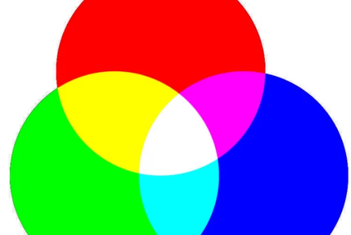
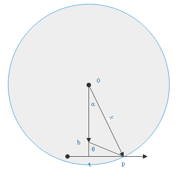
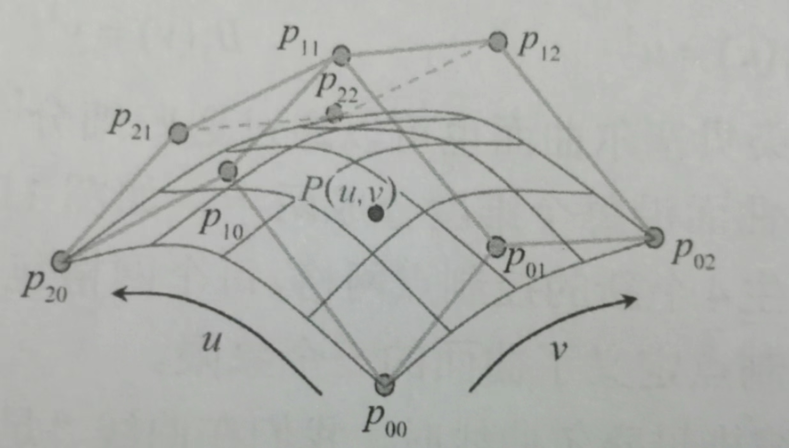
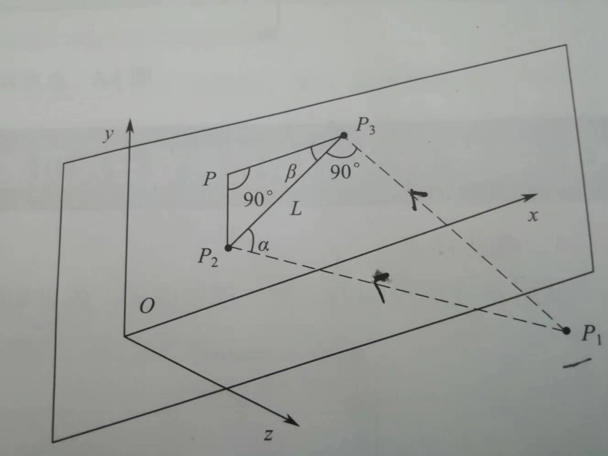
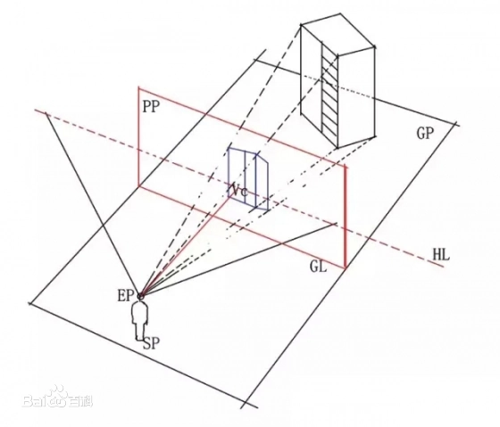
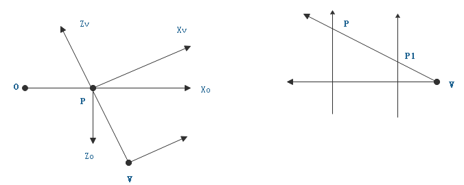
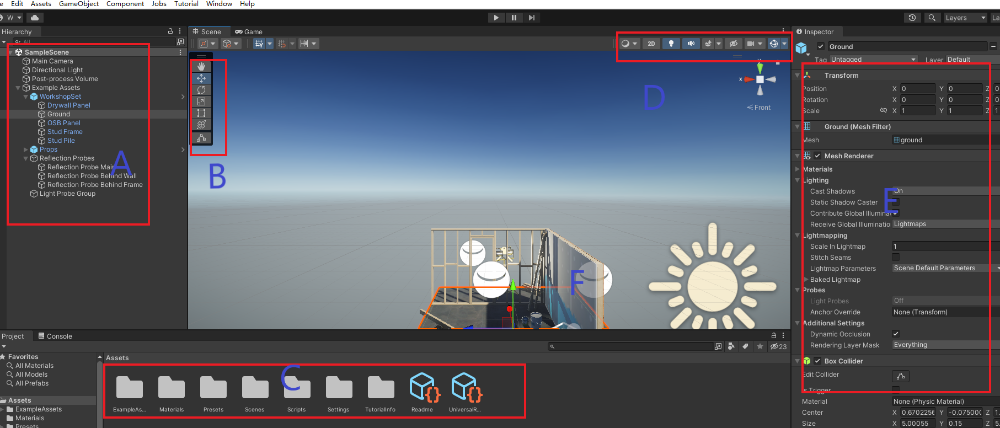
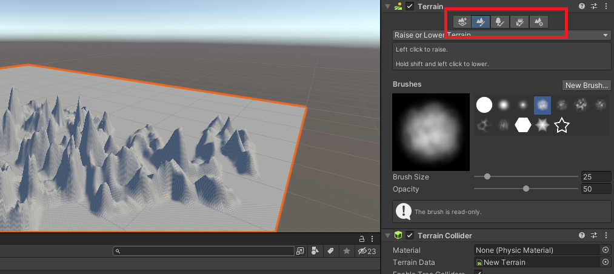

# 零、图形学

也称计算机图形学，它是研究图形的输入、模型(图形对象)的构造和表示、图形数据库管理、图形[数据通信](https://baike.baidu.com/item/数据通信/897073?fromModule=lemma_inlink)、图形的操作、[图形数据](https://baike.baidu.com/item/图形数据/5199438?fromModule=lemma_inlink)的分析，以及如何以[图形信息](https://baike.baidu.com/item/图形信息/5199461?fromModule=lemma_inlink)为媒介实现人机交互作用的方法、技术和应用的一门学科。它包括图形系统硬件(图形输入-输出设备、[图形工作站](https://baike.baidu.com/item/图形工作站/7557182?fromModule=lemma_inlink))图形软件、算法和应用等几个方面。

## 1、术语

**抗锯齿**：是一种能够消除显示器输出的画面中图物边缘出现凹凸锯齿的技术，在开启抗锯齿后会使得图像边缘看起来更平滑，更接近实物的物体
**图像alpha通道**：是指一张[图片](https://baike.baidu.com/item/图片?fromModule=lemma_inlink)的[透明](https://baike.baidu.com/item/透明?fromModule=lemma_inlink)和[半透明度](https://baike.baidu.com/item/半透明度?fromModule=lemma_inlink)。
**色调**：各种图像色彩模式下原色 的明暗程度（**红、绿、蓝**三种原色的明暗程度）
**色相**：就是颜色，调整色相就是调整景物的颜色。
**饱和度**：指图像中颜色的浓度。饱和度越高，颜色越饱满，即所谓的青翠欲滴的感觉。饱和度越低，颜色就会显得越陈旧、惨淡。
**对比度**：指不同颜色之间的差别。对比度越大，不同颜色之间的反差越大。
**亮度**：各种图像色彩模式下原色的明暗程度。图像亮度增加时，就会显得耀眼或刺眼，亮度越小时，图像就会显得灰暗。

**渲染管线**：对象从原始定义空间通过一系列的中介空间直至最终映射至屏幕对的象数据转换操作（如高效的光照计算、视椎体擦除）

物理渲染：物理渲染器采用光谱的计算原理，是一个基于真实光线物理特性的全新渲染引擎，按照完全精确的算法和公式来重现光线的行为。

实时渲染：对图形数据的实时计算和输出。要求能在短时间内渲染出一张图片。

离线渲染：根据预定的数据 设置对场景进行渲染生成，一般用于影业特效，超真实的渲染。

**空间**：有纹理空间、三维空间、屏幕空间等术语。三维空间到屏幕空间显示是一个**透视投影的操作**。物体空间（曲面体常用参数`(Θ,φ)`表示，也称**参数空间**）

视点：指用户观察三维场景时所处的点，一般用摄像机的理念来代替，视线：指视点观察的方向，用一条线描述。上方向：与视点，视线一起
**坐标系**：
（1）世界坐标系：定义三维场景的方向参考，z轴正方向垂直指向屏幕。
（2）物体坐标系：定义物体本身的方向参考，物体变换后坐标方向也跟着旋转。
（3）观察坐标系：观察者即视点的坐标系，z轴正方向是从==外部指向屏幕内部==的。
（4）屏幕坐标系：用于表示三维对象透视，投影到屏幕的最终显示结果。z轴坐标一般都默认为0，==正方向指向屏幕内==。
（5）纹理坐标系：`(u,v)，0~1`表示的标准纹理坐标，对应到真实纹理坐标。

**VR**：虚拟现实技术(英文名称：Virtual Reality，缩写为[VR](https://baike.baidu.com/item/VR/764830?fromModule=lemma_inlink))，又称[虚拟实境](https://baike.baidu.com/item/虚拟实境/10403543?fromModule=lemma_inlink)或灵境技术，是20世纪发展起来的一项全新的[实用技术](https://baike.baidu.com/item/实用技术/9916621?fromModule=lemma_inlink)。虚拟现实技术囊括计算机、[电子信息](https://baike.baidu.com/item/电子信息/5578438?fromModule=lemma_inlink)、[仿真技术](https://baike.baidu.com/item/仿真技术/7181700?fromModule=lemma_inlink)，其基本实现方式是以[计算机技术](https://baike.baidu.com/item/计算机技术/1127562?fromModule=lemma_inlink)为主，利用并综合[三维图形](https://baike.baidu.com/item/三维图形/5612976?fromModule=lemma_inlink)技术、[多媒体技术](https://baike.baidu.com/item/多媒体技术/143527?fromModule=lemma_inlink)、仿真技术、[显示技术](https://baike.baidu.com/item/显示技术/5851114?fromModule=lemma_inlink)、伺服技术等多种高科技的最新发展成果，借助计算机等设备产生一个逼真的三维视觉、触觉、嗅觉等多种感官体验

**AR**：增强现实([Augmented Reality](https://baike.baidu.com/item/Augmented Reality/5372911?fromModule=lemma_inlink)，[AR](https://baike.baidu.com/item/AR/3404706?fromModule=lemma_inlink))技术是一种将虚拟信息与[真实世界](https://baike.baidu.com/item/真实世界/631440?fromModule=lemma_inlink)巧妙融合的技术，广泛运用了多媒体、[三维建模](https://baike.baidu.com/item/三维建模/4672401?fromModule=lemma_inlink)、实时跟踪及注册、智能交互、传感等多种技术手段，将计算机生成的文字、图像、[三维模型](https://baike.baidu.com/item/三维模型/6846264?fromModule=lemma_inlink)、音乐、视频等虚拟信息模拟仿真后，应用到真实世界中，两种信息互为补充，从而实现对真实世界的“增强”

## 2、颜色

**光谱**（spectrum）
（1）是[复色光](https://baike.baidu.com/item/复色光/1169071?fromModule=lemma_inlink)经过色散系统（如棱镜、光栅）[分光](https://baike.baidu.com/item/分光/8370907?fromModule=lemma_inlink)后，被[色散](https://baike.baidu.com/item/色散/862554?fromModule=lemma_inlink)开的[单色光](https://baike.baidu.com/item/单色光/1168886?fromModule=lemma_inlink)按波长（或频率）大小而依次排列的图案，全称为光学频谱。
（2）光谱中最大的一部分**可见光谱**是[电磁波谱](https://baike.baidu.com/item/电磁波谱/907208?fromModule=lemma_inlink)中人眼可见的一部分，在这个[波长范围](https://baike.baidu.com/item/波长范围/5463020?fromModule=lemma_inlink)内的[电磁辐射](https://baike.baidu.com/item/电磁辐射/484252?fromModule=lemma_inlink)被称作可见光。
（3）光谱并没有包含人类大脑视觉所能区别的所有颜色，譬如褐色和粉红色。
（4）**红外光谱**：在一些[可见光谱](https://baike.baidu.com/item/可见光谱/10914339?fromModule=lemma_inlink)的`红端之外`，存在着波长更长的[红外线](https://baike.baidu.com/item/红外线/115851?fromModule=lemma_inlink)；
（5）**紫外光谱**：同样，在紫端之外，则存在有波长更短的[紫外线](https://baike.baidu.com/item/紫外线/95551?fromModule=lemma_inlink)。红外线和紫外线都不能为肉眼所觉察，但可通过仪器加以记录
（6）SPD（光谱功率分布）如下图，不同的波长有对应不同的颜色，因此需要一个`SPD函数`来**表达它们之间的关系**。


**颜色表示**：有rgb，cmyk，hsl表示法

- rgb：10进制的表示方法，将rgb转hsl只需每位转为16进制再拼接在一起即可。

- hsl：16进制的表示方法，hsl转rgb只需每两位分开，各转为10进制，对应的就是rgb色值。

  ```js
  /****rgb转为hsl格式***/
  function rgb2hls(that) {
        //var that = this;
        //十六进制颜色值的正则表达式
        var reg = /^#([0-9a-fA-f]{3}|[0-9a-fA-f]{6})$/;
        // 如果是rgb颜色表示
        if (/^(rgb|RGB)/.test(that)) {
          var aColor = that.replace(/(?:\(|\)|rgb|RGB)*/g, "").split(",");
          var strHex = "#";
          
          for (var i = 0; i < aColor.length; i++) {
            var hex = Number(aColor[i]).toString(16);
            if (hex.length < 2) {
              hex = '0' + hex;
            }
            strHex += hex;
          }
          if (strHex.length !== 7) {
            strHex = that;
          }
          return strHex;
        } else if (reg.test(that)) {
          var aNum = that.replace(/#/, "").split("");
          if (aNum.length === 6) {
            return that;
          } else if (aNum.length === 3) {
            var numHex = "#";
            for (var i = 0; i < aNum.length; i += 1) {
              numHex += (aNum[i] + aNum[i]);
            }
            return numHex;
          }
        }
        return that;
  };
  /***hsl转为rgba格式***/
  function hsl2rgb(rcolor, opacity) {
        const _opc = typeof opacity === "number" ? opacity : 1;
        var sColor = rcolor.toLowerCase();
        // 十六进制颜色值的正则表达式
        var reg = /^#([0-9a-fA-f]{3}|[0-9a-fA-f]{6})$/;
        // 如果是16进制颜色
        if (sColor && reg.test(sColor)) {
          if (sColor.length === 4) {
            var sColorNew = "#";
            for (var i = 1; i < 4; i += 1) {
              sColorNew += sColor.slice(i, i + 1).concat(sColor.slice(i, i + 1));
            }
            sColor = sColorNew;
          }
          // 处理六位的颜色值
          var sColorChange = [];
          for (var i = 1; i < 7; i += 2) {
            sColorChange.push(parseInt("0x" + sColor.slice(i, i + 2)));
          }
          return "rgba(" + sColorChange.join(",") + "," + _opc + ")";
        }
        return sColor;
  };
  const qp = rgb2hls('rgb(255,255,255)');
  const pc = hsl2rgb('#ffffff');
  ```
  
  **rgb表示原理**：r表示红色，g为绿色，b为蓝色。取值范围都为0~255。所有的颜色都有这3种颜色值组合而来，如下：
  （1）`rgb(255,0,0)，rgb(0,255,0)，rgb(0,0,255)`为红色、绿色、蓝色。
  （2）`rgb(255,250,0)`安照下图所示为深黄色，==b值逐渐增加时逐渐变为明亮==（淡黄向白色逼近）其它两种情况也是如此。
  （3）按照这种规律，看到色值时可以大致判断出它的颜色。
  （4）与SPD的映射计算：
  $$
  \left[\begin{matrix} r\\g\\ b\end{matrix}\right]=\left[\begin{matrix}\int R(λ)X(λ)d_λ &\int R(λ)Y(λ)d_λ&\int R(λ)Z(λ)d_λ \\ \int G(λ)X(λ)d_λ&\int G(λ)Y(λ)d_λ &\int G(λ)Z(λ)d_λ \\ \int B(λ)X(λ)d_λ &\int B(λ)Y(λ)d_λ &\int B(λ)Z(λ)d_λ   \end{matrix}\right]\left[\begin{matrix} x_λ\\ y_λ\\ z_λ\end{matrix}\right]
  $$
  
  
  **xyz颜色**： 就是在[RGB](https://baike.baidu.com/item/RGB/342517?fromModule=lemma_inlink)系统的基础上，用数学方法，选用三个理想的原色来代替实际的三原色，与rgb对应，值范围都在`0~1`
  
  

## 3、线相关

这里记录的是底层绘制直线的实现相关方法。主要解决的是**线段穿过两像素点之间时**，怎么取y值用**上/下**侧的像素点。

**DDA算法**：使用微分思想计算下一个y值：$\begin{cases}x_{i+1}=x_i+\Delta x\\ y_{i+1}=y_i+k*\Delta x\end{cases}$绘制时$\Delta x$都是取1（即每次增加1个像素单位）DDA算法根据k值来取使用哪一个y位置的像素点，如下：$y_{i+1}=\begin{cases}y_i+1 &,k>=0.5\\ y_i &,k<0.5\end{cases}$（yi表示上一个点的y值）
【缺点】：涉及浮点运算，对y取整要花费时间，不利于硬件实现。

**Bresenham算法**：起始点`(xi,yi)`主方向增加1个单位（这里用`y'`表示直线数学公式计算的理想y值，`di=-0.5`）
（1）主方向增量加1后，计算$d_{i+1}=y^{'}_{i+1}-y_i$。然后：$y_{i+1}=\begin{cases}y_i+1 &,d_{i+1}>=0\\ y_i &,d_{i+1}<0\end{cases}$
（2）再下一个增量，若$y_{i+1}-y_{i}<0$,则计算$d_{i+2}=y^{'}_{i+2}-y_{i+1}+d_i-0.5$
（3）若$y_{i+1}-y_{i}>=0$则将刚计算的$d_{i+2}-1$。
（4）d的计算每次都会`-0.5`这里为了消除浮点数的影响（不同DDA算法中那样用了浮点数0.5）
【缺点】计算中$y_{i+1}-y_{i}$依然会出现浮点数，比纯整数计算慢。

**整数Bresenham算法**：对上面的改进（消除小数部分）初始的$d_i=-\Delta x=-1$,差值计算$d_{i+1}=d_{i}+2(y'_{i+1}-y_i)
$。
主方向xi+1后，$y_{i+1}=\begin{cases}y_i+1 &,d_{i+1}>=0\\ y_i &,d_{i+1}<0\end{cases}$。

**渐变色直线**：使用颜色线性插值公式
（1）公式$p=(1-t)p_0+tp_1$，将p0为直线1起点p1为终点，将x，y分别代入。
（2）`t`就是中间点离两断点距离的一个比例。延y方向插值时$t=\frac{y-y_0}{y_1-y_0}$（==p点逐渐移动y值改变==，【<i id="cha_mark1">跳转标记</i>】）
（3）再根据这个公式$c=c_0(1-t)+tc_1$代入颜色，即可得到各点处的颜色值（rgb）

**反走样**：当绘制非垂直、水平、45度直线时由于上面类似算法的像素点选择会**分部在理想直线两侧**，当分辨率不够高时就易看出来。
这是数字化图像无法避免的问题，只能改善。硬件的改善就是靠增加分辨率（由于制作成本等很少会）

**反走样算法思想**：线两侧的像素点都参与显示直线，如背景白色，线黑色，若理想点直接计算在像素点上那直接显示黑色就行，若计算得在**两像素点中间**，那上下两个像素点颜色根据靠近理想点的距离决定（**靠得近越黑，离得远越灰色**，它们==总值和要为1==，实现中可用透明度控制）
可就用`Bresenham算法`中的计算d决定（但不再减去0.5）

**曲线**：二维，3维图形中用到的曲线，曲面多都是用2阶/3阶贝塞尔曲线完成，

**二阶贝塞尔**：用3个点p0，p1，p2控制
（1）p0，p1之间插值：$p_{01}=(1-t)p_0+tp_1$。系数`0<t<1`求两个点的中间某一点。
（2）p1，p2之间进行插值：$p_{12}=(1-t)p_1+tp_2$。
（3）合并1,2中俩式得：$p=(1-t)^2p_0+(-2t^2+2t)p_1+t^2p_2$，t可从`0~1`逐渐取值（如`0.05,0.1,0.15,...`），x，y坐标都使用此计算。

**三阶贝塞尔**：用4个点p0，p1，p2，p3控制，p1，p2是中间控制弯曲的点。
（1）p0，p1间插值：$p_{01}=tp_1+(1-t)p_0$。
（2）p1，p2间插值：$p_{12}=tp_2+(1-t)p_1$。
（3）p2，p3间插值：$p_{23}=tp_3+(1-t)p_2$。
（4）p01，p12间插值：$p_{01-12}=tp_{12}+(1-t)p_{01}$。
（5）p12，p23间插值：$p_{12-23}=tp_{23}+(1-t)p_{12}$。
（6）合并以上得：$p=(1-t)^3p_0+(3t^3-6t^2+3t)p_1+(-3t^3+3t^2)p_2+t^3p_3$。t同上使用。

## 3.1、面相关

**表面模型**：使用三角形可以逼近任意的面。
（1）点元表示法：使用三角形的3个顶点来表示，但进行填充时需要计算哪些点在其内。
（2）片元表示法：使用三角形内所有像素点来表示这个三角形，可直接进行填充。

**三角形着色模式**：
（1）平面着色模式：即使三角形各点颜色不一样，也只取其中一个颜色填充整个三角形。边界处会出现明显的对比度。
（2）光滑着色模式：从一个顶点向另外两个点的方向使用**双线性插值**（两个方向都计算插值）
（3）边界处理：填充三角形时对于边界，应只绘制其下侧边界，其它边界由其它三角形绘制时填充。

**生成球体**：
（1）设置1个角度`angle`（可被180整除，angle越小越精度越高），按该角度从下向上做切面。
（2）每个切面依然按`angle`划分，可得到`360/angle`个点。
（3）将球心坐标设置为`(0,0,0)`方便计算，且可省去各点法向量的计算（`球面点 - 球心`）
（4）按以下两个角度直接计算出各点的坐标（用α和R计算bp，再利用角θ计算p点的`x,z`坐标）


（5）为了保证一致的索引读取，得保证每个切面的点数相同，因此 最上/下端切面即使只有1个点，也复制多个保存。

```js
// 顶点生成
function SphareArray(r, precision) {
  const a = 0, b = 0, c = 0;
  const angle = precision; // 每份所占角度
  const hudu = (s) => (s / 180) * Math.PI;
  const directorFen = 180 / angle + 1;
  const horizonFen = 2 * directorFen - 1;
  const sin = Math.sin, cos = Math.cos;
  const points = []; // 球面顶点
  const normalization = []; // 各点法向量
  // 底部顶点（全同）
  for (let i = 0; i < horizonFen; i++) {
    points.push(a, b - r, c);
    //normalization.push(0, 1, 0);
  }
  // 第1个 和最后1个 单独添加
  for (let i = 1, by, br; i < directorFen - 1; i++) {
    by = (b - r * cos(hudu(i * angle))).toFixed(4); // y坐标
    br = Math.abs(r * sin(hudu(i * angle)));
    for (let j = 0, bx, bz; j < horizonFen; j++) {
      bx = (a + br * sin(hudu(j * angle))).toFixed(4);
      bz = (c + br * cos(hudu(j * angle))).toFixed(4);
      points.push(Number(bx), Number(by), Number(bz));
      //normalization.push(Number(bx) - a, Number(by) - b, Number(bz) - c);
    }
  }
  // 顶部顶点（全同）
  for (let i = 0; i < horizonFen; i++) {
    points.push(a, b + r, c);
    //normalization.push(0, -1, 0);
  }
  return {
    points, directorFen, horizonFen
  };
}
// 按三角形 读取索引
function SphareIndexs(arrayData) {
  /***
   * 5, 6, 7, 8, 9,
   * 0, 1, 2, 3, 4,
   * -----0,1,5为第1个三角形。1,5,6位第2个
   * 第1个三角形 i,i+1,i+horizonFen。第2个三角形 i+1, i+1+horizonFen, i+horizonFen
   * ***/
  const { directorFen, horizonFen, points } = arrayData;
  const indexs = [];

  for (let j = 0, i; j < directorFen - 1; j++) {
    let s = j * horizonFen;
    for (let m = 0; m < horizonFen; m++) {
      i = s + m;
      indexs.push(i, i + 1, i + horizonFen, i + 1, i + 1 + horizonFen, i + horizonFen);
    }
  }
  return indexs;
}
const data = SphareArray(5,20);
SphareIndexs(data);
```

**二次贝塞尔曲面**：二次贝塞尔曲线的延伸，一个曲面需要9个顶点来进行控制。参数上也需要两个参数（`u,v`）控制，替代之前的t。

$$
p(u,v)=\sum^2_{i=0}\sum^2_{j=0}p_{ij}B_i(u)*B_j(v),~~\begin{cases}B_0(u)=(1-u)^2 \\ B_1(u)=-2u^2+2u ,~~ B_2(u)=u^2 \\ B_0(v)=(1-v)^2\\ B_1(v)=-2v^2+2v ,~~ B_2(v)=v^2 \end{cases},~~ u,v\in[0,1]
$$
利用此公式在曲面中绘制多个点。实现如下：可用上面球体中读取索引生成三角形的方式来读取下方曲面的三角形。

```js
function Bezier2Plain() {
  /*
    p20     p21      p22
    p10     p11      p12
    p00     p01      p02
    */
  const pmap = {
      p20: [-1.0, 0, -1.0],p21: [0, 0, -1.0],p22: [1.0, 0, -1.0],
      p10: [-1.0, 0.4, 0],p11: [0, 0.8, 0],p12: [1.0, 0, 0],
      p00: [-1.0, 0, 1.0],p01: [0, 0.2, 1.0],p02: [1.0, 0, 1.0],
  };
  // 插值序数
  const B = [
    (t) => Math.pow(1 - t, 2),
    (t) => -2 * Math.pow(t, 2) + 2 * t,
    (t) => Math.pow(t, 2)
  ];

  function _calc(tu, tv) {
    let s = [0, 0, 0];
    for (let i = 0; i < 3; i++) {
      for (let j = 0; j < 3; j++) {
        s[0] += pmap[`p${i}${j}`][0] * B[i](tu) * B[j](tv);
        s[1] += pmap[`p${i}${j}`][1] * B[i](tu) * B[j](tv);
        s[2] += pmap[`p${i}${j}`][2] * B[i](tu) * B[j](tv);
      }
    }
    return s.map(v => Number(v.toFixed(4)));
  }
    
  let points = [], point;
  // 插值参数从0开始
  for (let u = 0; u <= 1; u += precise) {
    for (let v = 0; v <= 1; v += precise) {
      point = _calc(u, v);
      points.push(...point);
    }
  }
  // TODO: 计算周围三角的法向量平均值 作为各点法向量
  return points;
}
```

**三次贝塞尔曲面**：与二次类似，需要16个点来控制。
$$
p(u,v)=\sum^3_{i=0}\sum^3_{j=0}p_{ij}*B_i(u)*B_j(v),~~\begin{cases}B_0(u)=(1-u)^3,~~B_1(u)=-3u^3-6u^2+3u\\ B_2(u)=-3u^3+3u^2,~~B_3(u)=u^3\\ B_0(v)=(1-v)^3,~~B_1(v)=-3v^3-6v^2+3v\\ B_2(v)=-3v^3+3v^2,~~B_3(v)=v^3\end{cases}
$$
同二次曲面一样，生成出一些插值点，然后读取生成三角形绘制出来。**可优化**：足够平坦时可停止插值，使用简单的点就可绘制平坦的部分

## 4、变换

**二维变换**：有移动、旋转、缩放、反射、错切5种变换。
利用矩阵乘积后得到变换后的x，y值反推各矩阵值，如下：
$$
\left[\begin{matrix}a&c&e\\b&d&f\\0&0&1\end{matrix}\right]*\left[\begin{matrix}
x \\ y \\ 1\end{matrix}\right]=\left[\begin{matrix}
  ax+cy+e \\ bx+dy+f \\ 0+0+1\end{matrix}\right]
$$
==移动情况==：水平移动的话，只需修改`e，f`即可，a=d=1，c=b=0，其它为0

==缩放情况==：修改第`a，d`值即是缩放，其余值为0（这里的缩放中心是坐标原点，改变缩放中心可以通过`e,f`来调节）

**旋转变换**：通过正余弦表达计算旋转后的点，得$a=cos(β),c=-sin(β),b=sin(β),d=cos(β),e=f=0$（这里的旋转中心为原点，β为逆时针旋转角度）

**反射变换**：较为简单，用坐标轴做反射情况改变x，y正负即可。
（1）原点反射：$a=d=-1$其余为0。
（2）x轴反射：a=1，d=-1。其余为0。
（3）y轴反射：a=-1，d=1。其余为0。

错切变换：点p迎x，y轴发生不等量变换到p1的过程。a=d=1，e=f=0，控制c，b达到错切效果

**三维变换**：与二维类似。与css3中的变换矩阵同理（利用相乘得到变换后的坐标和计算过程**反推哪些值的作用即可**！）
$$
\left[\begin{matrix}x^`\\y^`\\z^`\\1\end{matrix}\right] = \left[\begin{matrix}a&b&c&d\\e&f&g&h\\i&j&k&l\\m&n&o&p\end{matrix}\right]*\left[\begin{matrix}
x \\ y \\z\\ 1\end{matrix}\right] 
&相当于\begin{cases}x^`=ax+by+cz+d\\ y^`=ex+fy+gz+h\\ z^`=ix+jy+kz+l\\ 1=mx+ny+oz+p\end{cases}
$$
平移效果：`d,h,l`为x，y，z轴上的平移量，主对角线为1，其它为0即可。
缩放效果：`a,f,k为x,y,z`轴的缩放程度，p=1，其余为0即可。

旋转效果：`a,b,e,f`为相关三角函数值，其余主对角线值为1，剩余值为0；绕各轴时具体情况如下：
$$
T_x=\left[\begin{matrix} 1&0&0&0\\ 0&\cos\beta &-\sin\beta &0\\0&\sin\beta&\cos\beta&0\\0&0&0&1 \end{matrix}\right],~~
T_y=\left[\begin{matrix} \cos\beta&0&\sin\beta&0\\ 0&1 &0 &0\\-\sin\beta&0&\cos\beta&0\\0&0&0&1 \end{matrix}\right],~~
T_z=\left[\begin{matrix} \cos\beta&-\sin\beta&0&0\\ \sin\beta&\cos\beta&0 &0\\0&0&1&0\\0&0&0&1 \end{matrix}\right]
$$

**层次模型**：对于一个复杂的联合模型（物理意义上一体）进行变换时控制比较复杂，如上手臂转动，下手臂也要转动，下手臂转动而上手臂无需转动
（a）对于这种模型可以按照它们的层次结构，控制关系来进行先后顺序的控制。
（b）==矩阵栈==：可以把有单独变换要求的模型的“变换”矩阵都放入一个栈中进行管理。
（c）如：绘制上手臂A时，将A的变换矩阵压入栈中（`ma`），对下手臂B进行绘制时其变换矩阵`mb`压入如栈中，对B进行的变换就是`mb * ma`。

## 5、投影

**正交投影**：坐标以垂直方向投影到对应的面，投影后与面垂直方向的轴坐标变得与平面此轴坐标一致，其它两个轴左边不变。

**斜投影**：向着所在的3维场景内投影，但投影方向不垂直与。例：点p1斜投影到xoy面的p2点，p3为其正交投影点，投影后的p2坐标计算：
$$
\left[\begin{matrix} x'\\y'\\z'\\1\end{matrix}\right]=\left[\begin{matrix} 1&0&-\cot\alpha\cos\beta &0 
\\0&1&-\cot\alpha\sin\beta &0\\0&0&0&0\\0&0&0&1 \end{matrix}\right]\left[\begin{matrix} x\\y\\z\\1\end{matrix}\right]~~,\alpha为
线(p1,p2)与xoy面夹角,\beta 为线(p2,p3)与x轴夹角
$$
 

**透视投影**：仅是使用三维变换操作物体得到的视图并不真实，通过透视投影后得到的图形**更接近人眼观察**到的有3维感。
在人与物体之间，设立一个**透明的平面**，称作画面(即投影面)，人眼的位置称**视点**(即投影中心)，由视点至物体上各个点连线。
（1）观察物体的各点到视点的连线称为**视线**。观察中只存==在一个视平面==（不一定用**屏幕**）**主视线**：中心视线向量，与视平面垂直
（2）==垂直于==`视平面`的视线与视平面的交点为**视心**。视点到视心的**距离**称为**视距**`d`。视点到观察点的**距离**称为**视径**`R`
（3）**确定观察坐标系**：需要用视点和观察点确定 观察坐标系的`z轴向量`，用人眼**上方向**确定观察坐标系的`y轴向量`。用这两个向量来计算观察坐标系的`x轴向量`。
（4）世界坐标系转观察坐标系：物体的世界坐标系方向，距离都是相对于原点的，需要将它们都改为观察坐标系中的方向及位置。（如图需要将p点处x0方向坐标映射到xv方向，z0方向变换到zv方向，y轴坐标也类似）


（4）观察坐标系到屏幕坐标系的变换：这一步通过投影完成，计算同斜投影方法类似。如p点映射到p1点。
（5）两步变换分别用两个矩阵表示，具体js代码如下：

```js

/**** 构造透视矩阵 ****/
function createViewMatrix(eyeX, eyeY, eyeZ, atX, atY, atZ, upX, upY, upZ) {
  // 向量归一化
  const normalize = (v) => {
    const length = Math.sqrt(v[0] * v[0] + v[1] * v[1] + v[2] * v[2]);
    return [v[0] / length, v[1] / length, v[2] / length];
  };
  // 相减生成向量
  const subtract = (v1, v2) => {
    return [v1[0] - v2[0], v1[1] - v2[1], v1[2] - v2[2]];
  };
  // 向量的叉乘得到它们的法向量
  const cross = (v1, v2) => {
    return [
      v1[1] * v2[2] - v1[2] * v2[1],
      v1[2] * v2[0] - v1[0] * v2[2],
      v1[0] * v2[1] - v1[1] * v2[0],
    ];
  };
  // 计算视向量，并归一化
  const zAxis = normalize(subtract([eyeX, eyeY, eyeZ], [atX, atY, atZ]));
  // 得到 视向量 与 上方向 的法向量 并归一化 （即：视觉坐标系的x轴方向）
  const xAxis = normalize(cross([upX, upY, upZ], zAxis));
  // 得到 视向量 与 x轴 的法向量 并归一化 （即：视觉坐标系的y轴方向）
  const yAxis = normalize(cross(zAxis, xAxis));

  return new Float32Array([
    xAxis[0],yAxis[0],zAxis[0],0,
    xAxis[1],yAxis[1],zAxis[1],0,
    xAxis[2],yAxis[2],zAxis[2],
    0,
    -(xAxis[0] * eyeX + xAxis[1] * eyeY + xAxis[2] * eyeZ),
    -(yAxis[0] * eyeX + yAxis[1] * eyeY + yAxis[2] * eyeZ),
    -(zAxis[0] * eyeX + zAxis[1] * eyeY + zAxis[2] * eyeZ),
    1,
  ]);
}

function angleToRadian(angle) {
  return (Math.PI * angle) / 180;
}

/***** 构建投影矩阵 ****
fov： 表示观察者的可视范围的角度。
aspect： 投影面的宽高比 ，一般就用 canvas.width / canvas.height
newar: 近距离，1。 far：观测最远距离 100
*/
function createPerspective(fov, aspect, near, far) {
  fov = angleToRadian(fov); // 角度转弧度
  const f = 1.0 / Math.tan(fov / 2);
  const nf = 1 / (near - far);
  // prettier-ignore
  return new Float32Array([
        f / aspect, 0, 0, 0,
        0, f, 0, 0,
        0, 0, (far + near) * nf, -1,
        0, 0, 2 * far * near * nf, 0,
      ]);
}
// 透视矩阵
const viewMatrix = createViewMatrix(
        3, 4, 8, // 观察点
        0, 0, 0, // 视点
        0, 1, 0 // 上方向
      );
// 投影矩阵
const projMatrix = createPerspective(30, canvas.width / canvas.height, 1, 100);

/****再用 透视矩阵 x 投影矩阵 x 物体坐标***/
```

**zBuffer算法**：透视投影时如果有多个物体互相遮挡，用于分清哪个点投影到视图上。
（1）设置帧缓冲器颜色为背景色，
（2）设置帧缓冲器的宽、高、初始深度（一般初始深度设为最大值）
（3）对多边形表面的每个像素`(x,y)`，计算其深度值`z(x,y)`。
	使用平面公式，代入该点的（x，y）就能求z。平面上任意两条交叉直线可计算出法向量（3个点）
$$
\begin{cases}A=(y_1-y_0)(z_2-z_0)-(z_1-z_0)(y_2-y_0)\\ B=(z_1-z_0)(x_2-x_0)-(x_1-x_0)(z_2-z_0)\\ 
C=(x_1-x_0)(y_2-y_0)-(y_1-y_0)(x_2-x_0)\end{cases}~~,平面某点深度z(x,y)=-\frac{Ax+By+D}{C}
$$
​	C为0时说明该面法向量与Z轴重合，投影的点不变，不用此式计算。

（4）将z与存储在深度缓冲器中（x,y）处的深度值`zBuffer(x,y)`进行比较。
（5）若`z(x,y)<=zBuffer(x,y)`说明其越接近视点，将此像素颜色写入帧缓冲器。
（6）**注**：zbuffer算法中，==z轴正半轴是指向屏幕内，视点在z负半轴==，因此进行自己拿来使用时得注意这与绘制时的坐标系不同。

**背面剔除算法**：利用平面的法向量与视向量计算它们的夹角，大于90度则视为背面不再渲染。
（1）==平面法向量==：$N=p_4p_5\times p_4p_6$（两向量叉乘）
（2）视向量：$V=(x_v-x_4,y_v-y_4,z_v-z_4)$（看向各点的视向量要单独计算）
（3）归一化：将N归一化为`n`，V归一化为`v`。
（4）计算夹角：$n\cdot v=cos\theta$，$0\leq\theta\leq 90时\cos\theta>0$，表面可见。$90\leq\theta\leq 180,\cos\theta <0$，表面不可见。

## 6、光照

**简述**：完善的光照处理非常复杂，这些因素都影响渲染效果：光源与物体的距离、光的颜色、光的类型（环境光、自发光）物体与视点的距离（距离远则看到的光照效果弱）材质对光的反射、透射、吸收，其它物体的反射光影响等等。

**全局光照模型**：接近真实世界的光照考虑，包括环境光、其它物体的反射光、本身的透光效果、反光效果多种最终的结合非常复杂。
**局部光照模型**：一个点光源，仅考虑光照射到物体表面所产生的效果。
（a）定义为$I=I_e+I_d+I_s$（环境光强+漫反射光强+镜面反射光强）以下均是简单光照模型部分

**材质属性**：指物体表面对光的吸收，反射、透射性能，也会影响光照效果。也由环境反射率、漫反射率、镜面反射率、高光（镜面反射光的汇聚程度）等组成，==各种反射率与对应的光计算==得结果（**各通道颜色**对应的反射率不一样，这对应光的颜色，不同颜色通道光照都要进行计算）

| 材质 | RGB分量 | 环境反射率 | 漫反射率 | 镜面反射率 | 高光指数 |
| ---- | ------- | ---------- | -------- | ---------- | -------- |
|      | R       | 0.247      | 0.752    | 0.628      | 50       |
| 金   | G       | 0.2        | 0.606    | 0.556      | 50       |
|      | B       | 0.075      | 0.226    | 0.366      | 50       |
|      | R       | 0.192      | 0.508    | 0.508      | 50       |
| 银   | G       | 0.192      | 0.508    | 0.508      | 50       |
|      | B       | 0.192      | 0.508    | 0.508      | 50       |

**发射光模型**：描述物体的自发光，不参与它附近物体的光照。
**环境光模型**：天空，大地，周围场景的投射光。简单光照模型中用一个常项来近似模拟。$I_e=K_aI_a~~,K_a\in [0,1]为材质反射率,I_a$为环境光强.

**漫反射光模型**：对于粗糙物体处理反射光的一种模型，其从一点照射，从个方向散射，漫反射光只与光源位置有光，==与视点位置无关==。
Lambert余弦定律给出的`p点`漫反射模型：$I_d=K_dI_p\cos\theta,~~\theta\in [0,2\pi],K_d\in[0,1],~~I_p$为点光源入射光强，K_d_为材质漫反射率，θ为入射光与表面p点的法向量夹角，可有$\cos\theta = N*L$，NL为p点法向量与入射光点积（==小于0时也取0，表示非正面照射到p点==）

**镜面反射光模型**：有很强的方向性，只有在反射方向才能看到反射光效果，因此与视点位置有关。
（a）`R`是反射向量，记入射向量`L=光点 - 当前点`（注意这个方向）`webgl 中 R=reflect(-L,N)`==负的入射向量拿去计算==
（b）`V`为当前点到视点向量：`V=视点 - 当前点`（注意这个方向）
$$
I_s=K_sI_p\cos^n\alpha~~,0\leq\alpha\leq2\pi,K_s\in [0,1]~~,\begin{cases}I_p为p点处入射光强\\ K_s为材质镜面反射率\\ 
\alpha为视点位置方向V与反射方向R的夹角\\ \cos\alpha=RV, 小于0时也取0 \\ n为材质的高光指数 \end{cases}
$$
 **光源衰减**：光源位置到照射点应该逐渐衰减光照强度（视点一般距离物体太远时都不再渲染物体，因此不考虑到视点的衰减）
（a）$f(d)=\min(1,\frac{1}{c_0+c_1d+c_2d^2})$，c0，c1，c2都为衰减因子，自己取值调节即可。

**最终简单光照模型Phong**：还要**添加颜色**，材质是有多种颜色的，因此计算上3个颜色通道都要进行如下公式计算。
（a）$I=K_aI_a+\sum^{n-1}_{i=0}f(d)*[K_dI_{p,i}*max(NL,0)+K_sI_{p,i}*max(RV,0)^n]$，求和是多个点光源时的写法。每个点将各颜色通道值代入此式计算
（b）对最终结果==再进行归一化处理==（其可能会超过色值）与物体材质对应像素点设置进行 乘 或 加的操作。

<span style="color:red;font-weight:600;">注：</span>渲染时，==让它们在同一坐标系中完成计算==。
（1）光源位置要变化到观察坐标系：`透视矩阵 x 光源位置`（若此光源有变换矩阵，中间也可以添加）
（2）当前像素点要转到观察坐标系：`透视矩阵 x 变换矩阵 x 当前点`。
（3）面的法向量也要转换：`转置(透视矩阵前3维) x 逆转置(变换矩阵) x 当前点的法向量`。
（4）注意视点位置与用于计算透视矩阵的那个 **视点向量一致**。

**多边形的光滑着色**：每个平面都单个颜色时着色效果依然是有马赫带的，虽然增添三角形数量可以改善，但这带来更多消耗。
**GrouraudShader算法**：相邻的三角形都有1个共享点，该共享点法向量使用这些相邻平面的法向量求平均得到（最后每个三角形点都有其法向量），在渲染光照效果时使用此法向量代替光照模型中使用到的法向量，具体过程如下：

- 计算三角形各顶点的法向量（用其周围三角形平面的法向量均值）相邻三角形法向量和比上它们的模$N=(\sum^{n-1}_{i=0}N_i) / |\sum^{n-1}_{i=0}N_i|$。

- 对三角形各顶点调用呱噪模型计算光强。

- 再依据3个顶点的光强，用插值算法计算各边界上各顶点的光强插值。

- 三角形内部点光强计算：使用扫描线，用同一水平扫描线上的两个边界点进行插值。t的意义与计算同 <a href="#cha_mark1">查看</a>
  $$
  如a，c两点间插值: ~~I_d=(1-t)I_a+tI_c=\frac{y_c-y_d}{y_c-y_a}I_a+\frac{y_d-y_a}{y_c-y_a}I_c
  $$
  依次扫描各个要插值的点，代入计算即可。

- 特点：由于顶点处用的是计算光强，而中间则是用的插值光强，在高光处会出现少许痕迹。

**PhongShader算法**：与GrouraudShader稍有区别。

- 计算各三角形顶点的平均法向量。
- 利用插值计算三角形边界点的法向量。再插值计算三角形面内各点的法向量。
- 然后对各顶点的法向量计算光强。
- 对比GrouraudShader算法，有**更柔和，更平滑**。

## 7、阴影

**投影阴影**：利用投影中的“斜投影”，来计算一个物体投影到平面上的图形。
（1）用点光源的位置与物体表面当前点，用斜投影计算其在平面上的位置。
（2）若当前点的法向量与当前点的光源向量夹角`>90`则不计算该点。
（3）用计算了投影的点按其以前的三角形顶点顺序绘制为阴影。
（4）优缺点：计算快，适合高性能要求的场景。但是只适合投影到平面上。

```js
/**
   * 投影阴影计算
   * @param {number[]} lightPoint 点光源位置
   * @param {{points,indexs,normalizations}} objData 图形数据（） 
   plainY: 投影面的 y值
  */
  function castShadow(lightPoint, objData,plainY=-1) { 
    const { points, indexs, normalizations } = objData;
    const len = points.length;
    // 利用空间直线方程，与平面相交的计算
    let ry;
    let shadowArr = [],ligNOrmal,ixs = [];
    for (let i = 0,j=0, x; i < len; i+=3,j++){
      x = i;
      // 计算是否光线可照射到
      ligNOrmal = Vector3.calc(lightPoint, points.slice(x, x + 3), '-');
      if (Vector3.dot(ligNOrmal, normalizations.slice(x, x + 3)) < 0) continue;
      // 这里假设投影的平面为 xoz 平面，因此 y=plainY
      ry = (points[x + 1] - plainY) / (lightPoint[1] - points[x + 1]);

      shadowArr.push(points[x] - (lightPoint[0] - points[x]) * ry, plainY, points[x + 2] - (lightPoint[2] - points[x + 2]) * ry);
      ixs.push(j);
    }
    // 检测每个索引三角，如果1个三角形的3个索引 都在
    let indexArr = [];
    for (let j = 0, xi, yi, zi; j < indexs.length; j += 3){
      xi = ixs.indexOf(indexs[j]);
      yi = ixs.indexOf(indexs[j + 1]);
      zi = ixs.indexOf(indexs[j + 2]);
      
      if (xi>-1 && yi>=-1 && zi>=-1) indexArr.push(xi,yi,zi);
    }

    return {shadowArr,indexArr};
  }
```

**阴影贴图**：光源看不到的点都在阴影中！
（1）第一轮：将摄像机放到光源位置，使用`z-buffer`来计算得到深度缓冲区（并不渲染出来，因此不用进行光照着色等计算）
（2）保存当前使用的`MVP`矩阵（`投影矩阵x透视矩阵x模型变换矩阵`）称为`shadowMVP`矩阵。
（3）第二轮：正常渲染场景，对于每个像素点使用`shadowMVP`矩阵**转换到第一轮时对于的点**，然后查找其深度缓冲区中对应的点。
（4）若光源到该像素点距离“大于” 其在深度缓冲区点点与光源的 距离，则说明该点在阴影中。
（5）对此点的光源计算可只**采用环境光**，然后`shadowS = z1>z2 ? 0.5 : 1.0`与其相乘得到最后颜色值。

- **注意1**：一些库获取到的**深度值**是特殊归一化过的，第2轮计算深度值时也要==同样方法归一化==（`opengl:`$z=(Position.xyz/Position.w)/2.0+0.5$）
- **注意2**：`opengl`使用的纹理需要是`2^n`大小，因此你第一轮生成的纹理也要如此大小。
- **注意3**：因为zbuffer算法的z轴与绘制时的z轴方向相反，所以比较深度值时要反过来。
- **伪影1**：一些非阴影的地方也会变成阴影。比较时要给纹理上得到的深度值加偏移量`0.005`，
  **因为：**纹理的RGBA分量都是8位，而第2次计算的深度值一般`>16`位，所以纹理中的深度值会稍小。
- **伪影2**：一个阴影面中可能会出现部分分离出去的阴影块，可以对得到的纹理设置到夹紧边缘。
  `gl.texParameteri(gl.TEXTURE_2D,gl.texture_wrap_S,gl.CLAMP_TO_EDGE);  gl.texParameteri( 同左侧 ,gl.texture_wrap_T, 同左侧);`
- 阴影锯齿：常因为光源离物体较远造成。

**柔和阴影**：以上两种阴影绘制中都是绘制出的硬阴影，柔和阴影也可以优化阴影锯齿问题。
（a）而生活中常见的阴影有距离物体近阴影重，距离阴影远淡的特点（有个渐变效果）
（b）因为生活中多数时候都是平行光，而非点光源（最真实情况是平行光面上 每个点都对物体上各点进行投影得到阴影）
（c）渲染实现中则需要使用更节省性能的方法。即使用`PCF`（百分比邻近滤波，**在阴影贴图上查找**其周围像素）
（d）**方法一**：对邻近阴影的**64个**像素点使用其周围像素的均值，采样像素点多则效果好（更耗性能）
（e）**方法二**：只对当前像素点的周围`4个`像素点采样，因为像素点少，直接使用邻近像素**会造成结块**情况，因此需要加入抖动（随机）决定

- 用当前像素点在阴影贴图上的位置`texture_coord mod 2`（**模运算**）会得到4种结果：`(0,0), (0,1), (1,0), (1,1)`对应采样点如下：
  结果`(0,0)`：$p_1=(s_x-1.5,s_y+1.5),~p_2=(s_x-1.5,s_y-0.5),~p_3=(s_x+0.5,s_y+1.5),~p_4=(s_x+0.5,s_y-0.5)$
  结果`(0,1)`：$p_1=(s_x-1.5,s_y+0.5),~p_2=(s_x-1.5,s_y-1.5),~p_3=(s_x+0.5,s_y+0.5),~p_4=(s_x+0.5,s_y-1.5)$
  结果`(1,0)`：$p_1=(s_x-0.5,s_y+1.5),~p_2=(s_x-0.5,s_y-0.5),~p_3=(s_x+1.5,s_y+1.5),~p_4=(s_x+1.5,s_y-0.5)$
  结果`(1,1)`：$p_1=(s_x-0.5,s_y+0.5),~p_2=(s_x-0.5,s_y-1.5),~p_3=(s_x+1.5,s_y+0.5),~p_4=(s_x+1.5,s_y-1.5)$
  得到的4个采样点坐标，获取它们是否在阴影中（如`shadow=在阴影中?0.5: 1.0`），`相加/4.0`作为光照中的系数使用。
  
- **注意**：1.5，0.5这些值对于物体模型中的坐标来说**太大，可以适当减小**。

  ```glsl
  float shadowFactor = 0.0;
  // 模型坐标点 都是 0.5 ,1.5 对于理论上提到的 —1.5， 0.5 有点大
  // 因此这里 对计算后的坐标进行缩小，这样柔和阴影的点就只会出现在 实质阴影附近
  float scale = 0.112;
  // 4中情况的偏移坐标 计算小技巧
  vec2 p1xy = vec2(-1.5+fxy.x,1.5-fxy.y) * scale;
  vec2 p2xy = vec2(-1.5+fxy.x,-0.5-fxy.y)  * scale;
  vec2 p3xy = vec2(0.5-fxy.x,1.5-fxy.y)  * scale;
  vec2 p4xy = vec2(0.5+fxy.x,-0.5-fxy.y)  * scale;
  // 4次纹理深度查找 得到
  shadowFactor += textz(p1xy);
  shadowFactor += textz(p2xy);
  shadowFactor += textz(p3xy);
  shadowFactor += textz(p4xy);
  shadowFactor = shadowFactor / 4.0;
  ```

  

**阴影体**：
（1）计算物体阴影所绘覆盖的空间范围，然后计算在次范围内的物体，给它们着色时绘制阴影效果
（2）此方法不容易产生伪影，但十分消耗性能。

## 8、纹理

**简介**：纹理定义在纹理空间中，用规范的`(u,v)`坐标表示（左下为`(0,0)`，右上为`(1,1)`**真实的纹理坐标**为其**图像的宽高空间**）纹理映射要建立物体表面各点与纹理各点的对应，取图像上各像素点的色值映射到物体。
（a）这需要两次映射，第一次是从纹理空间映射到参数空间（物体空间），第二次是从参数空间映射到屏幕空间（透射投影完成）

颜色纹理：定义好纹理的漫反射率，镜面反射率等，用光照渲染时依然可以呈现相应的明暗效果。
**简单纹理读入**：（曲面拉伸也会导致纹理随着拉伸）
（1）先得到真实纹理的坐标空间。
（2）确定当前曲面空间（如曲面x，y值的最大最小）
（3）曲面上某一点(x0,y0,z0)，用插值公式和当前曲面空间计算得出两个方向的`t`。
（4）再在纹理空间上，根据插值公式计算得出对应纹理坐标（u,v）取像素点色值。

**几何纹理**：适当的扰乱物体网格表面部分法向量，使光照渲染时产生阴暗，光亮交错产生凹凸效果。

**两步纹理映射**：先将纹理映射到一个中介曲面（`S映射`），再从其映射到三维物体上（`O映射`），解决了无参数化的纹理映射。
（1）目标物体为回转体，中介曲面一般选用圆柱。圆柱用参数公式（极坐标）表示：【1】$\begin{cases}x=r\sin\theta\\ y=hφ\\z=r\cos\theta\end{cases},~~0<\varphi <1,0<\theta <2\pi$。
（2）与纹理坐标空间的**对应关系**：$u=\frac{\theta}{2\pi},~~v=\varphi=\frac{y}{h}$。
（3）**3维物体**上一点$(x_w,y_w,z_w)$先计算对应的：$(\theta,\varphi)=(\arctan(x_w/z_w),y_w/h)$（==O映射中会得到该物体的点==）
（4）然后计算S映射：$(\theta,h)=[c(\theta,\theta_0),(h-h_0)/d]$，将**最后得到的**h，θ，φ代入【1】【2】中就可得到圆柱上那个点用哪个纹理像素
（5）上式中：`c,d`是纹理比例系数。$\theta_0,h_0$是初始值，对应纹理在柱面上的**初始位置**。
（6）O映射：可用此方法将其映射到任何物体上。有以下几个方法（把圆柱体放到空间中计算它们的相交？？）

- 反射光线法：视点出发向物体发出一条光线，跟踪其与物体表面发出的反射光线（这个点代入（3）中）直至其与中介曲面相交（**常用**）

- 物体法向法：跟踪物体表面的法线，直至其与中介曲面相交。然后将这个物体表面的点代入（3）

- 物体中心法：跟踪物体中心与物体上一点的连线，直至其与曲面相交。

- 中介曲面法向法：跟踪从中介曲面上的一点沿其法线方向发出的一条光线，与物体表面的交点。

  |                | 平面 | 圆柱面 | 立方体   | 球面     |
  | -------------- | ---- | ------ | -------- | -------- |
  | 物体法向法     | 冗余 | 不合适 | 不太合适 | 不太合适 |
  | 物体中心法     | 冗余 | 不合适 | 合适     | 合适     |
  | 中介曲面法向法 | 合适 | 合适   | 合适     | 冗余     |

**环境映射**：有镜面效果的材质需要映射出周围的环境。基于光线追踪的方法较为费时；速度快的方法是先将其它渲染好的物体作为一副场景图保存，然后渲染该物体计算环境映射时从其表面计算反射光线，用交于周围环境的点作为其映射上。

- **球面映射**：把物体当成球体看待，计算物体p点的法向量，然后计算其对应到的纹理坐标。
  （2）视向量V，p点处法向量N，p点反射向量R。$N=R+V=(r_x,r_y,r_z)$。（把已渲染好的场景当做一张纹理图）
  （3）N对应的**纹理坐标**为：$u=r_x/m + 1/2,~~v=r_y/m+ 1/2,~~m=2\sqrt{r^2_x+r^2_y+r^2_z}$。
  （4）在上下两极点处会出现比较严重的纹理变形。
- **立方体映射**：是闭球面映射更加常用的方法。
  （1）生成特殊的6张图形，对应立方体的6个面。通过物体点p处的反射向量`R=(rx,ry,rz)`（该物体形状的真实反射向量）
  （2）从R中找到绝对值最大的那个分量值（再根据正负号用对应那个方向的面的纹理图），然后其余两个分量 比上这个绝对值，再归一化处理。
  （3）如`R=(-3.2,5.1,-8.4)`则计算的纹理坐标：$u=(-3.2/8.4 + 1.0)/2,~~v=(5.1/8.4 + 1.0)/2$用==背面方向的纹理图==（-8.4为指向z负半轴）

**投影纹理映射**：该方法先将纹理投影到一个表面上，然后将这个表面投影到场景中。
（a）这不需要预先绑定纹理坐标，这与纹理图象无关，要更换纹理时改变投影机即可。
（b）可有效避免纹理扭曲。

**三维纹理**：平面纹理包裹曲面是一种非线性映射，3维物体为三角形拼接，在交点处很难保持连续性。三维纹理是计算机生成的纹理，在这些交点处使用特殊的处理函数。【！！待深入】

**MinMap纹理反走样**：一般纹理贴到3维物体上，如一个长方形透视投影后近处的纹理被放大，远处的缩小，所以常出现**摩尔纹**（数码相机也常遇到）
（1）MipMap思想是对原图进行几次缩小（每次缩小为原来一半）分别得到几张分辨率不同的纹理图片（缩小是用 ==每4个像素点的均值变为1个像素点==实现）
（2）然后如果哪个平面使用了此图，它会在**距离视点近的像素**部点部分使用高清的纹理图上的像素，**远离视点部分**使用分辨率较低的纹理图。
（3）可生成的不同分辨率图片数：$m=log_2n+1$，n为图片宽（一般用`256x256`的做原图，要满足$2^n$）
（4）所选取的高清，和低分辨率像素点的中间 部分，可使用线性插值完成填充。

## 9、天空&背景

入股使用普通的添加模型，背景，再透视投影为3d场景这将会非常消耗性能。

**天空盒**：使用立方体贴图，将有天空，地平线背景的图像作为纹理使用。
（1）实例化1个立方体对象。
（2）准备立方体贴图素材，因为放到立方体中看起来又不能是立方体效果，所以需要特殊处理过的6张纹理图（用工具处理）
（3）相机放置于立方体中，立方体并不需要绘制得特别大，只需要合适的大小。
（4）然后绘制立方体贴图时**禁用深度测试**，这样贴图部分深度值就始终为1（最小值）
（5）绘制场景内物体时再开启深度测试。
（6）立方体贴图容**易受到接缝处畸变**的影响。

**穹顶**：是用带纹理的球体或半球体实现天空效果。
（1）不易收到畸变、接缝的影响。
（2）比立方体贴图需要更多的点，更复杂。

# 零1、css特效

## 1、渐变可移动下划线

```html
<style>
  main {
    width: 100%;
    display: flex;
    flex-direction: column;
    align-items: center;
    padding: 39px 0;
    user-select: none;
    font: 16px / 1 Helvetica, sans-serif;
  }
  /***主要代码***/
  p > a {
    background: linear-gradient(#b4a078, #b4a078) no-repeat;
    background-size: 100% 1px;
    background-position: 0 1em;
    text-shadow: .05em 0 white, -.05em 0 white; /* avoid parts below the baseline*/
  }
  p > a:hover{
    animation: text-underline-slideInLeft 1.2s linear infinite forwards;
  }
  /**动画改变背景位置***/
  @keyframes text-underline-slideInLeft {
    from {
      background-position-x: -432px;
    }
    50% {
      background-position-x: 0;
    }
    to {
      background-position-x: 432px;
    }
  }
</style>
<template>
  <main ref="main">
    <p><a>CSS tricks web developerperpers need to know!</a></p>
  </main>
</template>
```

## 2、打字效果

`<p class="typing">简易中文打字效果，作者：张鑫旭</p>`

```css
.typing {
    width: 15em;
    white-space: nowrap;
    border-right: 2px solid transparent;
    animation: typing 3.5s steps(15, end), blink-caret .75s step-end infinite;
    overflow: hidden;
}
/* 打印效果 */
@keyframes typing {
  from { width: 0; }
  to { width: 15em; }
}
/* 光标闪啊闪 */
@keyframes blink-caret {
  from, to { box-shadow: 1px 0 0 0 transparent; }
  50% { box-shadow: 1px 0 0 0; }
}
```

## 3、隐藏滚动条

思路：在有滚动条元素外层再套一个元素用于遮掩其滚动条

```html
<style>
.scroll-box {
      width: 495px; /**比其父容器多宽15px**/ 
      height: 150px;
      position: relative;
      overflow: auto;
      line-height: 30px;
      z-index: 1;
      margin-right: -15px; /*-15将其滚动条用父容器隐藏*/
}

.scroll-out {
      width: 480px;
      height: 150px;
      overflow: hidden;
}
</style>
<div class="scroll-out">
    <div class="scroll-box">
      <p class="mm">fdsk李逵负荆但反</p>
	  ...
    </div>
</div>
```

**突出块**：用绘制阴影方向，模仿光照上去的效果

```css
.el{
box-shadow: 20px 20px 20px rgba(29, 36, 56, 0.05), -20px -20px 20px rgba(255, 255, 255, 0.5), 6px 6px 6px rgba(29, 36, 56, 0.05), -6px -6px 6px rgba(255, 255, 255, 0.5);
}
```


# 一、svg

## a、svg 标签

```html
<!--viewbox属性控制视图区域-->
<!--xmlns：xlink表示前缀为xlink的元素应该由理解该规范的UA使用xlink规范来解释.xmlns定义了默认命名空间,因此不需要前缀,-->
<svg width="300" height="300" xmlns="http://www.w3.org/2000/svg" version="1.1" viewbox="0 0 300 300">

<!--rx，ry控制圆角-->
<rect x="" y="" width="" rx="10" ry="20" height="" style="fill:red;stroke-width:2;stroke:blue;">
    <!--***animate:动画，放在元素中，则改动画会执行此动画【同一元素下可放多个控制不同属性】
    -from:开始位置；
    -to:结束位置；
    -begin:开始时间；
    -dur：持续时间；
    -fill:remove表示结束动画时，回到起始位置，freeze 表示动画结束时使用其最后的状态；
    -repeatCount:为执行的次数；indefinite为无限
    -path：有path的话则直接按path路线移动；
	  -attributeName：指定在哪个属性上变化；
	  -attributeType: 使用xml还是css样式变化；
    -->
    <animate id="one" attributeName="cx" attributeType="XML" from="30" to="470" begin="0s" dur="5s" fill="remove" repeatCount="1" />
    <!--animation: 可多个组合使用的动画-->
    <animateMotion path="M10,50 q60,50 100,0 q60,-50 100,0" begin="one.end" dur="10s" repeatCount="indefinite"></animateMotion>
    <!--animationTransform:transform属性类动画，additive为sum时可组合使用-->
    <animateTransform attributeName="transform" attributeType="XML" type="scale" from="1" to="3" begin="0s" dur="10s" repeatCount="indefinite" additive="sum"/>
    <!--水平旋转可用：from:"0 0 0"  to:"360 0 0" 后面两位0与元素本身位置中心一样时达到自转效果-->
    <animateTransform attributeName="transform" attributeType="XML" type="rotate" from="0 30 20" to="360 30 20" begin="0s" dur="10s" fill="freeze" repeatCount="indefinite" additive="sum"></animateTransform>
</rect>
//rect标签绘制矩形，x,y为位置,fill,stroke等属性可写在style外。
<circle cx="" cy="" r=""><title>hover提示作用标签</title><desc>描述作用，不显示，相当于文字注释</desc></circle>
<ellipse cx="" cy="" rx="" ry=""/>绘制椭圆，cx,cy为位置，rx,ry为宽高。
<line x1="0" y1="0" x2="20" y2="20"/>绘制线条，x1,y1,x2,y2为起始及结尾坐标。
<polygon points="10,10 20,20 150,320"/>绘制多边形，points中没两个值是一对坐标。
<!--set: 为元素设置属性值，一般配合动画使用-->
<polyline points=""><set attributeName="fill" to="green"></set></polyline>绘制折线

<!--****绘制任意路径、形状****
  - d: 路径绘制，属性如下：
    M：移动至起始点，必须。L：直线结束点。H：从当前点画水平线。
    V: 垂直线。C:三阶贝塞尔曲线。Q：二阶贝塞尔曲线。Z: 连接到起始点
  - stroke-dasharray: 50 20; 边的一个线段长，线段之间的距离；
  - stroke-dashoffset: 50; 指定dash模式到开始点的距离；
【可让二者值相同，实现绘制线条的动画效果】
-->
<path d="M10 5L100 15C19 60,50 99 C 20 20, 40 20, 50 10" style="stroke-dashoffset:330;stroke-dasharray:330;stroke:#000;"/>
<image xlink:href="firefox.jpg" x="0" y="0" height="50px" width="50px"/>
<g></g><!--其它元素可以放到里面，做一组使用，无其它实意-->
    
<!--/pattern是 SVG 的一个图案填充标签，可以在 pattern 中定义好图案，然后通过 id 引用来对某个图形进行填充/-->
<pattern id="imageFill" width="1" height="1" viewBox="0 0 300 300">
    <image xlink:href="data:image/svg+xml;u" />
</pattern>
    
<!--defs用于定义模板，一些效果类的东西可以放到里面，其它标签用xlink引用-->
<defs>
    <!--定义一个形状的裁剪;使用：clip-path="url(#cut)"【显示的是裁剪部分】-->
    <clipPath id="cut">
      <rect x="0" y="0" width="200" height="100" />
    </clipPath>
    <!--遮罩：可结合简便做淡入淡出动画-->
    <mask id="Mask">
      <rect x="0" y="0" width="200" height="200" fill="url(#Gradient)"  />
    </mask>
    <path id="a1" d="M0 50 C150 150 100 -50 300 50" stroke="#000" fill="none"/>
    <!--linearGradient定义一组线性渐变，(x1,y1)和(x2,y2)两点构成的方向即是渐变的方向（用%）-->
    <linearGradient id="gradient" x1="0%" y1="0%" x2="80%" y2="100%">
        <stop offset="0%" stop-color="green" stop-opacity="0.8"/>
        <stop offset="100%" stop-color="red" />
    </linearGradient>
    <!--
      定义一组圆形渐变
      -cx,cy: 定义渐变中心位置
      -fx,fy: 定义渐变焦点
      -使用示例：<circle cx="170" cy="170" r="30" fill="url(#eye_ra)"></circle>
    -->
    <radialGradient id="eye_ra" cx="50%" cy="50%" r="50%" fx="50%" fy="50%">
        <stop offset="0%" style="stop-color: rgb(249, 11, 11)" />
        <stop offset="90%" style="stop-color: rgb(117, 19, 19)" />
        <stop offset="100%" style="stop-color: rgb(58, 9, 9)" />
    </radialGradient>
</defs>
<!--text用于在svg中放置文字，xlink:href为引用模式-->
<text x="10" y="15">
    <textPath xlink:href="#a1">在平坦的路上曲折前行</textPath>
</text>
<!--一系列坐标点时，每个坐标对应的1个字符-->
<text x="0,20,40,60,70" y="0,20,40,60,70">This is some SVG</text>
<!--foreignObject可用于放置html元素，（只能放到g元素内和外层）
且显示其渲染效果，可利用其将dom转为图片（不过图片需用base64数据）
背景图也需要转为base64数据，且用单引号，使用；
【样式写在外面也能生效】
-->
<foreignObject width="200" height="300" x="100" y="200"><div class="aa" xmlns="http://www.w3.org/1999/svg">contend:声称</div><style>.aa{color:red;background:url('data:image/svg+..');}</style></foreignObject>

<!--强大特效，滤镜部分-->
<filter id="filter"><!--定义一组滤镜-->
<!--<feTurbulence/>滤镜：采用perlin算法（产生类似自然纹理）
    -baseFrequency:噪声基本频率参数（【0-1】频率越高噪声越密集【越扭曲】）；
    -numOctaves:倍频数量（只能为整数【1-3】，数值越大，噪声看起来越自然【颜色点越分散】），
    -seed:伪随机数生成的起始值（改变噪声形状和位置）
    -stitchTiles:定义噪声在边框外的行为表现；【no-Stitch(svg元素边界处不会平滑处理) / stitch(元素边界处会平滑处理)】
    -type:【turbulence(端流，混乱) / fractalNoise(分形噪声)】
-->
<feTurbulence type="fractalNoise" baseFrequency="0.015" numOctaves="4" />
<!--<feDisplacementMap/>滤镜：可让图形按R,G,B颜色通道进行位置的偏移；多和<feTurbulence/>一起使用
    -scale:控制偏移程度；
    -in:指输入，sourceGraphic表示原图像
    -in2:第二个输入，turbulence，表示原图像断流处理过后的图像
    -xChannelSelector:指定in2从哪个颜色通道在x轴移动in中的像素；
    -yChannelSelector:指定in2从哪个颜色通道在y轴移动in中的像素；
-->
<feDisplacementMap in="SourceGraphic" in2="turbulence" xChannelSelector="R" yChannelSelector="B" scale="170" />
<!--光源滤镜，有3种光源可选；上面的滤镜和光源滤镜使用会失效；
    -in:输入的初始图像
    -lighting-color:灯光的颜色
    -surfaceScale:值越大，灯光越亮
    -diffuseConstant:光点的大小
-->
<feDiffuseLighting in="SourceGraphic" lighting-color="red" surfaceScale="1" diffuseConstant="2">
    <!--fePointLight：点光源，x,y,z控制光源位置（z由低到高，光会逐渐变亮）-->
    <fePointLight x="150" y="60" z="20"/>
    <!--feDistantLight：环境光；azimuth为平行光角度；elevation为平行光的海拔-->
    <feDistantLight azimuth="240" elevation="20"/>
    <!--feSpotLight：聚光灯效果；x,y,z控制光源位置；pointsAtX/Y/Z为聚光灯照向的位置;limitingConeAngle是灯光范围角度-->
    <feSpotLight x="100" y="30" z="99" limitingConeAngle="20" pointsAtX="390" pointsAtY="80" pointsAtZ="0"/>
</feDiffuseLighting>
<!--高斯模糊滤镜：-in:输入的基础图像；-stdDeviation:控制模糊程度；-->
<feGaussianBlur in="sourceGraphic" stdDeviation="4" />
<!--fecomposite滤镜执行两个输入图像的智能像素组合
在图像空间中使用以下 Porter-Duff 合成操作之一：over、in、atop、xor
arithmetic 操作对组合来自<feDiffuseLighting>滤镜和来自<feSpecularLighting> 滤镜的输出以及组合纹理数据很有用。
arithmetic操作，每个结果像素都要经过下面的方程式的计算：result = k1*i1*i2 + k2*i1 + k3*i2 + k4
-->
<fecomposite in="light" in2="SourceGraphic" operator="arithmetic" k1="1" k2="0" k3="0" k4="0"></fecomposite>
<!--图片滤镜
- externalResourcesRequired：表示当前文档中是否需要外部资源。默认值为假
-->
<feImage x="" y="" width="" height="" externalResourcesRequired="" preserveAspectRatio="" xlink:href="http://cc.jpg"/>
<!--用于组合两个图像，mode为指定模式-->
<feBlend in="" in2="BackgroundImage" mode="screen"/>
<feMerge>
<!--feFlood: 生成一层连续的颜色，填充元素的过滤器基本区域-->
<feFlood width="" height="" x="" y="" flood-color="#fff" flood-opacity="0.7">
<feMorphology operator="erode" radius="1"/>
<!--对原图像进行偏移，多用于创建阴影-->
<feOffset in="blur" dx="4" dy="4" result="offsetBlur"/>
<!--也是一个光源滤镜-->
<feSpecularLighting in="offsetBlur" surfaceScale="5" specularConstant=".75" specularExponent="20" lighting-color="#bbbbbb" result="specOut">
  <fePointLight x="-5000" y="-10000" z="20000"/>
</feSpecularLighting>
<!--颜色变换过滤器
***作为一个线性变换，在输入的图像的颜色上进行变换操作****
- type: matrix，还有：saturate(饱和度)、hueRotate(色相旋转)
- values: 4x5维的矩阵数据，（这里是趟平传参）各列值分别是：r,g,b,a,偏移量；
    第一行控制“红色通道”，第二行控制“绿色通道”，第三行控制“蓝色通道”，最后一行为“透明通道”
-->
<feColorMatrix type="matrix" values="110 10 20 1 0
                                     210 12 21 0 1
                                     210 12 21 0 1
                                     210 12 21 0 0"/>
</filter>
<!--使用滤镜,指定滤镜元素id，css中也可以使用
.css{filter:url(#filter);font-size:14px;}
-->
<circle id="shape" cx="" cy="" r="" filter="url(#filter)"/>
<!--symbol: 定义一组模板元素，一般与use配合使用-->
<symbol id="symbol" width="10" height="20" viewBox="0 0 10 20">
    <circle id="shape2" cx="" cy="" r="" filter="url(#filter)"/>
</symbol>
<!--use元素，用于复用其它图形，且可以使用其它svg标签中的图形-->
<use xlink:href="#shape" x="50" y="50" />
<use xlink:href="#symbol" x="200" y="50" />

</svg>
```

[基础部分学习地址](http://www.mamicode.com/info-detail-1988813.html)

## b、svg 内联

css 的 background-img 的 url 可以显示链接图片和 base64 图片，将 svg 转为 base64 的也能在其中显示出来，部分版本较高的浏览器可以直接用 svg 代码，如下：
**svg 文件引入**：.svg 文件可直接使用==img 的 src==，或 background-img 引入使用；`或.el{background:url('./img/cc.svg');}`;(兼容性未知)

```html
<style>
  /*这种内联的svg渲染几乎无延迟*/
  .aa {
    background: url('data:image/svg+xml;utf8,<svg version="1.1" viewBox="0 0 200 200" xmlns="http://www.w3.org/2000/svg" version="1.1">...');
  }

  /*ie和一些浏览器中不能显示出来，但可以使用
-------js的encodeURIComponent()方法将其转码后使用,注意需要xmlns属性：
*/
  .bb {
    background: url("data:image/svg+xml,%3Csvg%...") no-repeat center;
  }
  svg {
    fill: currentColor;
  }
</style>
<script>
  // svg的fill设置为“currentColor”，其内部的元素“fill”（值为currentColor）的颜色可以跟随外层html元素的color变化；
  /*
  <div style="color:blue;">
  	<svg fill="currentColor"><rect fill="currentColor"/></svg>  
  </div>
  */
  var svg =
    '<svg fill="currentColor" width="300" height="300" xmlns="http://www.w3.org/2000/svg" version="1.1">..</svg>';
  console.log(encodeURIComponent(svg));
</script>
```

注：利用 svg 的`viewBox`属性和其内部图形比例来控制它们；

## c、svg 将 dom 转图片

```js
function dom2svgImage(dom) {
  if (!(dom instanceof Object)) return;

  var cloneDom = dom.cloneNode(true);
  var SVG =
    '<svg xmlns="http://www.w3.org/2000/svg" version="1.1" width=">' +
    dom.offsetWidth +
    '" height="' +
    dom.offsetHeight +
    '">';
  var FOREG_PRE = '<foreignObject x="0" y="0" width="100%" height="100%">';
  var FOREG_END = "</foreignObject></svg>";
  // TODO:查询EL中的所有图片，转为base64表示;更完美的情况需要读取每个元素的样式，将他们都写到内嵌或style中
  //cloneDom.setAttribute('xmlns','http://www.w3.org/2000/xhtml');
  // 拼接为完整的svg；new XMLSerializer().serializeToString(cloneDom)将元素序列化；
  var res =
    SVG +
    FOREG_PRE +
    new XMLSerializer().serializeToString(cloneDom) +
    FOREG_END;
  // FIXME:注意处理一些特殊符号
  res = res.replace(/\n/g, "").replace(/\t/g, ""); //.replace(/#/g,'%23')
  // 转为img可使用形式
  var svgImg = "data:image/svg+xml," + encodeURIComponent(res);

  return svgImg;
}
var tt = dom2svgImage(document.getElementById("www"));
// TODO:将数据写入图片；可再将此图片用canvas转为base64，然后下载至本地；
document.getElementById("img").src = tt;
```

**注**：本地路径的图片是无法显示出来的，可以使用内联的图片数据，或者使用 http：开头的网络图；

## d、工程化中使用 svgIcon

1. 写一个公共组件放置引用 svg 图标：

```html
<template>
  <div
    v-if="isExternal"
    :style="styleExternalIcon"
    class="svg-external-icon svg-icon"
    v-on="$listeners"
  ></div>
  <svg v-else :class="svgClass" aria-hidden="true" v-on="$listeners">
    <use :xlink:href="iconName"></use>
  </svg>
</template>
```

2. js 文件中用 require.context()返回所有 svg 文件

```js
/**svg文件示例：code.svg
<?xml version="1.0" standalone="no"?>
<!DOCTYPE svg PUBLIC "-//W3C//DTD SVG 1.1//EN" "http://www.w3.org/Graphics/SVG/1.1/DTD/svg11.dtd">
<svg class="icon" xmlns="..."><defs><style type="text/css"></style></defs>
<path d="..."/>
</svg>
*/
import Vue from "vue";
import SvgIcon from "@cmp/private/SvgIcon"; // svg component
// register globally
Vue.component("svg-icon", SvgIcon);

const req = require.context("./svg", false, /\.svg$/); //返回一个webpack环境上下文（函数），包含文件id，keys等属性。
const requireAll = (requireContext) =>
  requireContext.keys().map(requireContext);
requireAll(req); //全部遍历出来。
```

3. 入口引入，并在 webpack 中使用`svg-sprite-loader`，然后配置，处理这些 svg 文件。

## e、动态添加svg

SVG是基于XML格式定义图像的一种技术，因此创建节点的时候，需要指定命名空间（Namespace），也就是用createElementNS来代替createElement创建节点

```js
function makeSVG(tag, attrs) {
    const ns = 'http://www.w3.org/2000/svg';

    let el= document.createElementNS(ns, tag);
    if (tag==='svg'){
        el.setAttribute('xmlns:xlink', 'http://www.w3.org/1999/xlink');
    }
    for (let k in attrs) {
        if (k === 'xlink:href') {
            el.setAttributeNS('http://www.w3.org/1999/xlink', k, attrs[k]);
        } else {
            el.setAttribute(k, attrs[k]);
        }
    }
    return el;
}

window.addEventListener('load', function(){
    let svg = makeSVG('svg');
    let g = makeSVG('g');
    let rect = makeSVG('rect',{x:'0',y:'0',width:'20',height:'20',fill:'blue'});
    
    g.appendChild(rect);
    svg.appendChild(g);
    document.body.appendChild(svg);
});
```

## f、波纹特效

**原理**：使用`feimage`图形使用圆形渐变，加上`fedisplacementmap`的偏移效果，然后不断变换圆形渐变可达到波纹效果。代码如下：

```html
<svg>
	<defs>
        <!--放置滤镜-->
          <filter id="f" primitiveUnits="objectBoundingBox">
            <feimage result="pict2" xlink:href="data:image/svg+xml;"></feimage>
            <fedisplacementmap
              scale=".05"
              xChannelSelector="R"
              yChannelSelector="R"
              in2="pict2"
              in="SourceGraphic"
            ></fedisplacementmap>
          </filter>
     </defs>
</svg>
<script>
const filterFeImage = document.querySelector("#f feImage");
const xlink = "http://www.w3.org/1999/xlink";

let displacement = 0;
let speed = 0.2;

function setXlinkHref() {
  /****<svg><radialGradient>的转码结果***/
  let xlinkHref =
    "data:image/svg+xml;utf8,%3Csvg version='1.1' xmlns='http://www.w3.org/2000/svg' xmlns:xlink='http://www.w3.org/1999/xlink' width='300' height='300'%3E%3Cdefs%3E%3CradialGradient id='rg' r='.9'%3E";
  // 添加多个渐变条
  for (var i = 0; i < 11; i++) {
    xlinkHref += `%3Cstop 
                offset='${(i - 2) * 10 + displacement}%25' 
                stop%2Dcolor='%23${i % 2 == 0 ? "f00" : "000"}'%3E%3C/stop%3E`;
  }
  // <rect id="witness" width="300" height="300" fill="url(#rg)"></rect></radialGradient></svg>转码部分
  xlinkHref +=
    "%3C/radialGradient%3E%3C/defs%3E%3Crect id='witness' width='300' height='300' fill='url(%23rg)'%3E%3C/rect%3E%3C/svg%3E";
  return xlinkHref;
}
// 动画不断修改渐变色
function AnimateOffset() {
  let xlinkHref = setXlinkHref();
  filterFeImage.setAttributeNS(xlink, "href", xlinkHref);
  // 让每次渐变交替（红黑起始顺序）
  if (displacement <= 20) {
    displacement += speed;
  } else {
    displacement = 0;
  }
  window.requestAnimationFrame(AnimateOffset);
}

window.requestAnimationFrame(AnimateOffset);
</script>
```

# 二、canvas2D

## a、概念

**创建**：css设置宽高时是`canvas的大小`，但其**绘图面积大小**只能用内嵌`width,height`或js设置（默认绘图大小300x150）

```html
<style>
    #canvas{
        background: white; /*可设置canvas背景色*/
    }
</style>
<!--浏览器不支持时会显示中间文字-->
<canvas id="canvas" width="500" height="500">您的浏览器不支持canvas</canvas>
```

**2d上下文**：无论声明定义几个context，其实它们**都是一个**（全局上的操作是互相影响的）

**离屏canvas**：指将canvas设置为`display:none;`但绘制操作依然在上面进行，显示时使用`toDataURL`()放置到``/另一个canvas中（设置为none后canvas上不会再渲染，因此==可以大幅度提升性能==）
**注意**：canvas中**无法插入html代码**，因此许多canvas库都是再其上放置div来添加些额外功能。

**图层**：多数canvas库都有图层概念，其应是利用可将其它canvas绘制进来（==1个canvas做1个图层==使用，）<a href="#canvas-inner">查看详情</a>

**部分属性**：

- `globalCompositeOperation`：将物体绘制到其它物体上时的绘制方式
  "source-over"//图形重叠处理，source-in:重叠部分绘制，source-out:重叠位置不绘制、source-atop:重叠处类似遮罩的绘制；
  lighter:颜色叠加效果、copy:只显示新内容、xor:互相重叠部分为透明、multiply:顶层像素与底层像素相乘，一般得到黑暗图形、screen:重叠处像素反转
  overlay:multiply 与 screen 叠加效果、darken:变暗、lighten:叠加部分变量、color-dodge:底层像素值除顶层像素值、color-burn:颜色加深。

- `globalAlpha`：全局透明设置。
  `lineCap`：指示如何绘制线段的端点（有`butt/round/square`）
  `lineJoin`：两台线相交时如何绘制焦点（有`bevel/round/miter`）
  `miterLimit`：如何绘制miter形式的线段焦点
  `shadowBlur`：如何延伸阴影效果

## a1、保存和恢复

**save**：保存绘制的一些状态数据（如`fillStyle,stokeStyle,globalAlpha`等context，canvas的一些配置，状态数据）保存到栈中；

**restore**：从栈中弹出，则`fillStyle,stokeStyle`等一些状态数据恢复到了上一次保存的数据。

**两者作用**：由于可以保存和恢复，可以保存好此此使用的配置，后面的绘制可以恢复到这个状态而==不用再次去用赋值的方式改变那些属性==

```js
var cn = document.getElementById("canvas");
function play() {
  var cv = cn.getContext("2d");
  // 以下两个图形用一个2d对象绘制。
  cv.globalCompositeOperation = "copy";
  cv.beginPath();
  cv.moveTo(10, 20);
  cv.lineTo(150, 230);
  cv.stroke();
  // 绘制另一个图形中间添加globalCompositeOperation属性
  cv.globalCompositeOperation = "source-over";
  //cv.save();若只想用transform中的方法产生动画在这里加上save()末尾用
  //restore()即可产生想要的结果。
  cv.beginPath();
  cv.moveTo(50, 200);
  cv.lineTo(310, 430);
  cv.stroke();
  cv.restore();
  // 使用这种模式，以上值处改为动态值即可产生动画
  requestAnimationFrame(play);
}
```


## b、基础绘制

```js
const canvas = document.getElementById("canvas");
var ctx = canvas.getContext("2d"); //获取2d对象
/***清空区域内所有图形操作（重新设置canvas宽高也会清空所有）***/
ctx.clearRect(x, y, width, height);

/******文本部分******/
ctx.font = "20px Arial"; //定义字体大小及类型。
ctx.textAlign = "center"; //left,start,right,end
/**fillStyle可以是颜色值、渐变色、可复制的图像模式**/
ctx.fillStyle = "blue"; // 填充实体时使用的颜色（样式定义放到绘制前）
ctx.strokeStyle = "red";// 填充边框时使用的颜色
ctx.measureText("文本文字"); // 【返回这段文本所占的宽度】
ctx.fillText("颜色填充文本实体", x, y,maxWidth); //填充文字时不能填充其它且不能绘制形状。
ctx.strokeText("颜色填充文本边",x,y,maxWidth);
/******矩形******/
ctx.fillRect(x, y, width, height); //矩形填充颜色...
ctx.strokeRect(x, y, width, height); //绘制一个矩形框
/****椭圆***/
ctx.ellipse(100, 100, 50, 75, Math.PI / 4, 0, 2 * Math.PI);

/****线的绘制*****/
ctx.beginPath(); //绘制路径，不规则图圆时先调用
ctx.lineWidth = 3; //线框
ctx.filter = "blur(15px)"; //模糊滤镜。
ctx.lineCap = "butt"; //线头样式,round:圆形头、square:方形头。
ctx.setLineDash([2, 5, 20, 30]); //设置为虚线，断点距头位置。
ctx.lineDashOffset = 10; //设置虚线起始偏离起始点距离。
/*****贝塞尔曲线****/
ctx.quadraticCurveTo(10,10,20,20)//二次贝塞尔曲线，中转点，结束点
ctx.bezierCurveTo()//三次贝塞尔曲线
/***子路径连接处的样式***/
ctx.lineJoin = "bevel"; // "round"  "miter"
ctx.closePath(); // 当前点连接到路径起始点
ctx.stroke();

/***圆绘制***/
ctx.beginPath(); //绘制路径，不规则图圆时先调用
ctx.arc(x,y,r,stAngle,Math.PI*2)//绘制圆,控制第5个参数大小控制弧长。
ctx.ellipse(x,y,rx,ry,Math.PI/4)//绘制椭圆
ctx.stroke()//绘制所描绘的路径
```

## b1、效果绘制

```js
//-----HTMLCanvasElement//表示页面内所有canvas元素，其余元素也有此类似对象。
HTMLCanvasElement.toDataURL()//方法将画布转化为base64图片格式。
HTMLCanvasElement.toBlob()//方法将画布转化为Blob对象。
/****渐变****/
a = ctx.createLinearGradient(0,0,300,0);//创建一个线性渐变，参数为区域
a.addColorStop(0,"red");//渐变a中添加位置,颜色
ctx.fillStyle = a; // (将渐变赋值给fillStyle等就可使用)
b=ctx.createRadialGradient(x0,y0,r0,x1,y1,r1)//中心渐变，两个圆中间的区域
patt=ctx.createPattern(ctx1,null)//创建一个填充块，参数1是另一个canvas对象
/****阴影***/
ctx.shadowBlur=20//阴影模糊程度
ctx.shadowColor="red"//阴影颜色
ctx.shadowOffsetX=2,ctx.shadowOffsetY=3//阴影偏移
ctx.strokeStyle="orange"//设置边框颜色

/***********裁剪************
使用之前先绘制一个路径区域，“之后绘制的图形”后只局限在该区域内
【可控制裁剪区域大小变化来绘制伸缩式动画】
*/
ctx.clip()//裁剪
ctx.globalAlpha=0.2;//设置画布全局透明度

```


## b2、图片绘制

**基本使用**：图像数据的处理一般比较费时，可放到work中去做。

```js
/******
img.width、img.height、img.data//直接获取该图片的宽高，像素数据。
*/
img=new Image();
img.src = "http://xxx.jpg";
img.onload = function(){
    ctx.drawImage(img,sx,sy,sw,sh,dx,dy,dw,dh)//绘制图片,img可以是图片、svg、canvas的dom对象
}
// 获取指定画布区域数据
dat=ctx.getImageData(x,y,width,height);//【速度较慢】
/****获取像素矩阵***
长度为：width*height*4的一维数组 每相连4个值为一组 rgba值【4个值的范围都是0~255】，按横纵的顺序获取到的
*/
dat.data;
for (let i = 0, x, y; i < data.data.length; i += 4) {
        data.data[i] = 0;
        data.data[i + 1] = 0;
        data.data[i + 2] = 0;
        data.data[i + 3] = 100;
}
// 创建1个imgData对象
imgdata=ctx.createImageData(300,100)//创建一个全0像素矩阵,可操控每个点值
imgdata.data[0] = 122; // 在data中赋值
img.src =canvas.toDataURL(type,scl);//将整个canvas上的像素数据转换为
//base64格式,能直接显示到img中,type有图片格式,有:image/png(默认),
//image/jpeg,image/webp;scl为缩放值(更改图片质量0~1)
ctx.putImageData(imgdata,x,y)//【该方法不受一些全局设置的影响】
```

**绘图安全机制**：`drawImage`可允许你绘制其它域名的图片（`origin-clean`被设置为false），但不能用其它api修改它（如使用`toDataURL`后直接抛出异常）
（1）解决方法1：获取图片的base64数据再绘制。
（2）解决法2：可在其程序目下用：`chrome --allow-file-access-from-files`启动chrom浏览器。

**性能对比**：
（1）`drawImage()`方法比`putImageData()`方法性能更好；
（2）`drawImage(canvas)`比`drawImage(img)`的速度要稍快
（3）`getImageData`方法较耗时，尽量少使用。

**嵌套canvas**：利用上面的`drawImage(canvas,0,0)`可以将其它canvas图像绘制进来，很方便管理（动画等复杂情况不用考虑另一个canvas）【<b id="canvas-inner">标记</b>】

```js
// 第1个canvas绘制
context.beginPath();
context.fillStyle = 'green';
context.arc(100 + 100, 200, 50, 0, Math.PI * 2, false);
context.fill();
context.clip();
// 第2个canvas dom
var cc = document.createElement('canvas');
cc.width = canvas.width;
cc.height = canvas.height;
var ctx = cc.getContext('2d');

ctx.beginPath();
ctx.fillStyle = 'blue';
ctx.arc(100 + 40, 170, 50, 0, Math.PI * 2, false);
ctx.fill();
// 将第2个canvas加入进来（***最好先保存下添加之前的图形数据****）
context.drawImage(cc, 20, 20);
```

**获取图片色值**：利用 getImageData()得到的是 rgba 数据。

```js
function getColor(x, y) {
  var canvas = document.createElement("canvas");
  var ctx = canvas.getContext("2d");
  var img = new Image();

  img.src = require("@/assets/images/sj13.jpg");
  img.onload = function () {
    ctx.drawImage(img, 0, 0, img.width, img.height);
    var mgd = ctx.getImageData(0, 0, img.width, img.height);
    var dt = mgd.data;
    /*getImageData()得到的数据是一维数组，没相邻的4个值是一个点的rgba值，点是从左道右，从上到下排列的*/
    //像素开始位置：(W*y + x)*4
    var position = (img.width * Number(y) + Number(x)) * 4;

    console.info(dt[position], dt[position + 1], dt[position + 2]);
  };
}
```

**转灰度与反向**

```js
var img = new Image();
img.crossOrigin = 'anonymous';
img.src = './assets/rhino.jpg';

var canvas = document.getElementById('canvas');
var ctx = canvas.getContext('2d');

img.onload = function() {
    ctx.drawImage(img, 0, 0);
};
// 原图
var original = function() {
    ctx.drawImage(img, 0, 0);
};
// 反向色处理函数
var invert = function() {
    ctx.drawImage(img, 0, 0);
    const imageData = ctx.getImageData(0, 0, canvas.width, canvas.height);
    const data = imageData.data;
    // 每个通道取反向色值即可
    for (var i = 0; i < data.length; i += 4) {
        data[i]     = 255 - data[i];     // red
        data[i + 1] = 255 - data[i + 1]; // green
        data[i + 2] = 255 - data[i + 2]; // blue
    }
    ctx.putImageData(imageData, 0, 0);
};
// 置灰处理
var grayscale = function() {
    ctx.drawImage(img, 0, 0);
    const imageData = ctx.getImageData(0, 0, canvas.width, canvas.height);
    const data = imageData.data;
    // 每个像素点取均值
    for (var i = 0; i < data.length; i += 4) {
        var avg = (data[i] + data[i + 1] + data[i + 2]) / 3;
        data[i]     = avg; // red
        data[i + 1] = avg; // green
        data[i + 2] = avg; // blue
    }
    ctx.putImageData(imageData, 0, 0);
};

const inputs = document.querySelectorAll('[name=color]');
for (const input of inputs) {
    input.addEventListener("change", function(evt) {
        switch (evt.target.value) {
            case "inverted":
                return invert();
            case "grayscale":
                return grayscale();
            default:
                return original();
        }
    });
}
```


## b3、其它api

**选中检测**：
（1）==canvas中某一时刻只能存在一条路径==，一条路径可以有子路径（`beginPath`就是启用一条新的路径，`lineTo`等新加一条时就==是其子路径==）
（2）一般==最后一次绘制==的路径就是canvas的**当前路径**。
（3）**是否在路径上**：`ctx.isPointInPath`，对于路径，只有**绘制时的节点**才能用该方法检测到，==线条上的其它点不行==（如`ctx.moveTo(100,200),ctx.lineTo(200,200)`只有这两个坐标点才能检测到选中）`150,200`明显在该线上，但用该方法得到false。
（4）使用`closePath()`完成的路径，坐标在其中间也可判断出选中。
（5）**是否在路径的线上**：`ctx.isPointInStroke(x,y)`与`isPointInPath`相反。
（6）选中增强：对于比较细的线条选中比较困难，可以绘制一个透明的图形作为它的border，增强判断。

```js
cx.beginPath();
cx.moveTo(120, 130);
cx.lineTo(200, 130);
cx.lineTo(200, 200);
cx.closePath();
cx.stroke();

console.info(cx.isPointInStroke(150, 130), cx.isPointInPath(150, 140)); // true true

// 绘制重复图像源， repetition 参数在指定的方向上重复元图像
const pattern = ctx.createPattern(img, "repeat"); // 参数2值还有 repeat-x repeat-y no-repeat
ctx.fillStyle = pattern;
ctx.fillRect(0, 0, 300, 300);
// 重置transform
ctx.resetTransform();
```


## b4、常用绘制

**网格绘制**：

```js
function drawGrid(context,color,stepx,stepy){
      context.strokeStyel = color;
      context.lineWidth = 0.5;

      for(let i=stepx+0.5;i<context.canvas.width;i+=stepx){
        context.beginPath();
        // 向当前路径中增加1条子路径（不会从当前路径中清除其它子路径）
        context.moveTo(i,0);
        // 会加入1条新的子路径（当前无子路径时则与moveTo()一样）
        context.lineTo(i,context.canvas.height);
        context.stroke();
      }
      for(let i=stepy+0.5;i<context.canvas.height;i+=stepy){
        context.beginPath();
        context.moveTo(0,i);
        context.lineTo(context.canvas.width,i);
        context.stroke();
      }
}
drawGrid(ctx,'lightgray',10,10);
```

**绘制坐标轴**：

```js
const AXIS_MARGIN = 40;
const AXIS_ORIGIN = {x: AXIS_MARGIN,y:canvas.height-AXIS_MARGIN};
const AXIS_TOP = AXIS_MARGIN,AXIS_RIGHT = canvas.width-AXIS_MARGIN;
const HORIZONTAL_TICK_SPACING = 10,VERTICAL_TICK_SPACING = 10;
const AXIS_WIDTH = AXIS_RIGHT - AXIS_ORIGIN.x,AXIS_HEIGHT = AXIS_ORIGIN.y - AXIS_TOP;
const NUM_VERTICAL_TICKS = AXIS_WIDTH / VERTICAL_TICK_SPACING;
const NUM_HORIZONTAL_TICKS = AXIS_WIDTH / HORIZONTAL_TICK_SPACING;
const TICK_WIDTH = 10,TICKS_LINEWIDTH = 0.5,TICKS_COLOR = 'navy';
const AXIS_LINEWIDTH = 1.0,AXIS_COLOR = 'blue';
function drawAxes(){
      ctx.save();
      ctx.strokeStyel = AXIS_COLOR;
      ctx.lineWidth = AXIS_LINEWIDTH;
      drawHorizontalAxis();
      drawVerticalAxis();

      ctx.lineWidth = 0.5;
      ctx.lineWidth = TICKS_LINEWIDTH;
      ctx.strokeStyel = TICKS_COLOR;
      drawVerticalAxisTicks();
      drawHorizontalAxisTicks();
      ctx.restore();
}
// x轴
function drawHorizontalAxis(){
      ctx.beginPath();
      ctx.moveTo(AXIS_ORIGIN.x,AXIS_ORIGIN.y);
      ctx.lineTo(AXIS_RIGHT,AXIS_ORIGIN.y);
      ctx.stroke();
}
    // y轴
function drawVerticalAxis(){
      ctx.beginPath();
      ctx.moveTo(AXIS_ORIGIN.x, AXIS_ORIGIN.y);
      ctx.lineTo(AXIS_ORIGIN.x, AXIS_TOP);
      ctx.stroke();
    }
    // y轴刻度线
function drawVerticalAxisTicks(){
      let deltaX;
      for(let i=1;i<NUM_VERTICAL_TICKS;++i){
        ctx.beginPath();
        if(i%5===0) deltaX = TICK_WIDTH;
        else deltaX = TICK_WIDTH / 2;

        ctx.moveTo(AXIS_ORIGIN.x-deltaX,AXIS_ORIGIN.y-i*VERTICAL_TICK_SPACING);
        ctx.lineTo(AXIS_ORIGIN.x+deltaX,AXIS_ORIGIN.y-i*VERTICAL_TICK_SPACING);
        ctx.stroke();
      }
    }
    // x轴刻度线
function drawHorizontalAxisTicks(){
      let deltaY;
      for (let i = 1; i < NUM_VERTICAL_TICKS; ++i) {
        ctx.beginPath();
        if (i % 5 === 0) deltaY = TICK_WIDTH;
        else deltaY = TICK_WIDTH / 2;

        ctx.moveTo(AXIS_ORIGIN.x + i*HORIZONTAL_TICK_SPACING, AXIS_ORIGIN.y - deltaY);
        ctx.lineTo(AXIS_ORIGIN.x + i*HORIZONTAL_TICK_SPACING, AXIS_ORIGIN.y + deltaY);
        ctx.stroke();
      }
}
drawAxes();
```

**多边形绘制**：利用线段的绘制来实现即可。

**绘制弧形文本**：将一个文本中的每个字取出来单独绘制（利用旋转，移动等变换实现弧形效果）

## c、坐标系

**坐标处理**：将鼠标位置转换为canvas的坐标

```js
function windowTocanvas(canvas,x,y){
    var bbox = canvas.getBoundingClientRect();
    return {x:x-bbox.left*(canvas.width/bbox.width),y:y-bbox.top*(canvas.height/bbox.height)}
}
canvas.onmousemove = function(e){
    var loc = windowTocanvas(canvas,e.clientX,e.clientY);
}
```

**坐标变换**：先设置好变换后再绘制图形（与css3中先绘制好再变换**效果一样**）利用变换==可节省一些计算==。

```js
/***旋转操作****/
context.rotate(Math.PI / 4); // 注意这里的角度值是以PI（弧度制）使用的
context.beginPath();
context.moveTo(20, 20);
context.lineTo(100, 10);
context.stroke();
/****这些变换与fillStyle等属性一样都可被save()保存，恢复等****/
context.save();
/***偏移操作***/
context.translate(100, 150);
/***缩放操作***/
context.scale(0.5,0.5);// 两个参数相同时则是同比列放大/缩小，不同时则有css3中的扭曲函数一样作用
context.scale(-1,1);// -1,1则有水平镜像效果
context.scale(1,-1);// 1,-1则有垂直镜像效果
context.beginPath();
context.moveTo(20, 20);
context.lineTo(120, 105);
```

**变换矩阵**：有少数情况使用上面的几个变换不能满足（如错切）

```js
/*****与css3的matrix函数使用一样（a,d缩放，e,f管移动）
transform有累积作用，可在上一次的transform基础上变换
*/
context.transform(a,b,c,d,e,f);
// setTransform每次只在原状态上变换
context.setTransform(a,b,c,d,e,f);
/******计算公式******
对（x,y）得到：_x = a*x+c*y+e;  _y = b*x+d*y+f;
*/
```


## d、标绘

**图形的保存与恢复**：使用获取像素数据来操作（==尽量限制在1个小的区域内==，这样速度更快）

```js
function saveDrawingSurface() {
      drawingSurfaceImageData = context.getImageData(0, 0, canvas.width, canvas.height)
}
function restoreDrawingSurface() {
      context.putImageData(drawingSurfaceImageData, 0, 0);
}
```

**鼠标绘制**：思路如下
（1）鼠标按下时：调用上面的`saveDrawingSurface`先保存之前的图形数据。
（2）鼠标移动时：先调用上面的`restoreDrawingSurface`恢复之前的图像，再绘制出要绘制的图形。
（3）鼠标松开时：依然是先调用恢复，再次绘制完（可添加绘制物体的概念，如将绘制3角形，将其所有数据保存到1个对象中管理）

**选中检测**：
（1）法1：在一个离屏canvas（和显示用的canvas相同大小位置）中绘制图形，然后用`isPointInPath`方法检测是否在路径中（图形多时计算量较大）
（2）法2：给图形定1个中心点和最大半径，计算鼠标当前点与此图形中心点距离判断（对于不规则图形不算精确）
（3）法3：用算法实现检测一个点是否在一个面中，检测线条是否选中用其它算法。
（4）使用法1和2的结合，靠近某个图形时才用法1的方法检测是否选中。

**编辑图形**：思路如下（编辑图形A）
（1）点击编辑：用1个按钮给用户打开编辑，将所绘图形的点明显绘制出来（加大，颜色等）
（2）鼠标按下时：用`isPointInPath`方法判断（效果不好），再鼠标点与该图形所有点计算，离哪个最近就算是选中了哪个点（**小于一定距离才算选中也可**）；
（3）鼠标移动时：`restoreDrawingSurface`方法恢复绘制A图形之前时的画布图像，再修改当前选中点的坐标，与其它点再次绘制图形A（若画布上有多个图形，	有在A之后绘制的，那这里还要连这些图形都绘制出来）
（4）鼠标松开时：更新自己保存的图形A数据。

拖动图形：先使用选中检测，然后与清除，重绘的方式来实现拖动效果即可。

## e、动画

**剪辑区域实现动画**：这里主要利用`clip()`（所绘制**物体不多**，**涉及区域小时**考虑使用）
（1）先绘制背景数据，然后`context.save()`；
（2）然后绘制动画区域，再`context.clip()`设置该区域为剪辑；
（2）使用`requestAnimationFrame`执行清除区域操作，再绘制背景（只会在clip区域内擦除和绘制）；
（4）绘制动画图形，结束后用`context.restore()`（可==去除掉剪辑区域==）

**模块恢复实现动画**：使用绘制其它canvas数据的方法（这种方法多数情况**比剪辑实现的要快**，不过多占点缓存）
（1）建立1个离屏canvas，在离屏canvas中绘制背景。
（2）在显示的canvas中清除数据`context.clearRect(0,0,canvas.width,canvas.height)`，再将离屏canvas绘制进来
（3）绘制动画图形。

**双缓存实现的动画**：清除和重绘期间如果速度稍慢点，可能会看到一瞬间白屏，双缓存则是全部图形都在离屏中绘制好，主屏中不使用清除，而是直接绘制刚才离屏中的图形。（浏览器canvas==已自带这种机制，所以不需要用户手动实现==。这种思路可以借阅）

**时间动画**：让动画更平稳执行的方法（就算出现掉帧，也能保证其单位时间的像素移动量不变）
（1）`requestAnimationFrame`方法是请求浏览器调用执行，浏览器会**根据自身状态决定调用**
（2）因此几次调用间的时间间隔可能不一样（即`t2-t1,t1-t0`可能不等）而我们每次绘制数据又是与固定量变化的，这可能导致有时候动画不稳定运行。
（3）可以指根据动画之前的运行属性（每次运行间隔，像素变化），**计算**当前时间点其**按速率应该出现的位置**，然后进行绘制。

- 就算动画帧率低也==应该保证帧速的稳定性==。同时播放多个动画时无疑会降低它们的速度。

- 电脑屏幕一般刷新频率为75FPS，动画若赶不上这个速率可能有掉帧情况。

- 根据物体的运动速度计算出它在两帧之间移动的**像素数**，则可以运用此稳定运行动画。公式如下：
  $$
  像素 / 帧 = (像素 / 秒) * (秒 / 帧)
  $$

  ```js
  // discs是各动画的属性记录；lastTime是上一次计算的时间
  let discs = [{ x: 0, y: 0, velocityX: 20, velocityY: 20, radius: 5 }], lastTime = 0;
  // @time: 想计算的时间点，与lastTime越接近，其预测的运动轨迹越接近
  function updateTimeBased(time) {
    var disc = null, elapsedTime = time - lastTime;
  
    for (let i = 0; i<discs.length;++i){
      disc = discs[i];
      deltaX = disc.velocityX;
      /****计算两个方向的
       * 像素/帧 = (像素/秒) * (秒/帧)
       * */ 
      deltaX = disc.velocityX * (elapsedTime / 1000);
      deltaY = disc.velocityY * (elapsedTime / 1000);
      // 方向边界控制
      if (disc.x + deltaX + disc.radius > canvas.width || disc.x +deltaX-disc.radius<0) {
        disc.velocityX = -disc.velocityX;
        deltaX = -deltaX;
      }
      if (disc.y + deltaY + disc.radius > canvas.length || disc.y + deltaY - disc.radius < 0) {
        disc.velocityY = -disc.velocityY;
        deltaY = - deltaY;
      }
      // 得到下一次x，y方向的像素位置
      disc.x = disc.x + deltaX;
      disc.y = disc.y + deltaY;
      // 更新时间点，每个动画统一，所以使用1个时间
      lastTime = time;
    }
  }
  ```

**视差动画**：将背景分为几个层次，远处的移动慢，近的移动块从而产生的3d效果。

**canvas动画制作总结**：
（1）尽量保证动画播放的稳定性，为此**可使用时间动画**方式。
（2）不要在canvas动画中绘制带有阴影效果的绘制。
（3）不要在动画代码中分配内存（如`var a=10,let,const`的使用）可提前就创建好它们。
（4）尽量使用`requestAnimationFrame`方法运行动画。
（5）复杂动画情况多用“模块复制”的形式
（6）必要时使用1或多个离屏canvas提升背景绘制速度。

## f、物理效果

**重力下降**：主要模拟重力加速度效果（$g=9.81 m/s^2$）

```js
const GRAVITY_FORCE = 9.81; // 重力加速度
const pixelsPerMeter = canvas.height / 10; // 电脑上用的是像素，因此取其1/10作为重力加速度对应的“距离”
/********y位置计算
ball.velocityY 是该物体的y方向加速度。
fps 是动画帧率（每秒播放的帧数）
*/
const y += ball.velocityY / fps;
/*******更新加速度*/
ball.velocityY = GRAVITY_FORCE * (ball.moveTime/1000) * pixelsPerMeter;
```

抛物效果：

**碰撞检测**：检测两个物体边界间的距离是否靠近判断有无发生检测；
（1）外接圆判断法：给物体设定1个圆心，半径，这样比较容易计算；
（2）事先预测法：根据物体当前位置，速度等判断它们什么时候会碰撞；
（3）碰撞后处理法：碰撞后才检测到，但要对发生的碰撞做一些处理？

**分离轴定理**：检测凸多边形的碰撞可用
（1）如果两个物体不发生碰撞，则一定存在一条直线，能将两个物体分离，这条能够隔开两个物体的线称为**分离轴**。
（2）可以假想有**一束平行光**从不同的角度照射待检测的两个多边形，当有一个合适的角度使得两者的**影子没有重叠**
（3）投影的次数为两个物体的边数之和（如果有一个是圆，则取另一个图形来进行投影）
（4）每次投影取1个边的指向作为投影方向，取与其垂直的法线作为投影的位置（另一个图形是圆的情况可取圆心来投影，投影长为其直径）

检测凹边形碰撞情况：可计算两个多边形的每条边都不相交，则可检测出此种情况。

**另一个方案**：可计算两个多边形的各边是否存在相交，来判断两个面是否交叉。再判断一个面是否包含另一个面（可判断1个面的顶点是否都在另一个面内）如下

```js
/***判断两个线段是否相交***/
function judgeIntersect(x1, y1, x2, y2, x3, y3, x4, y4){
  //快速排斥：
  //两个线段为对角线组成的矩形，如果这两个矩形没有重叠的部分，那么两条线段是不可能出现重叠的
  
  //这里的确如此，这一步是判定两矩形是否相交
  //1.线段ab的低点低于cd的最高点（可能重合）
  //2.cd的最左端小于ab的最右端（可能重合）
  //3.cd的最低点低于ab的最高点（加上条件1，两线段在竖直方向上重合）
  //4.ab的最左端小于cd的最右端（加上条件2，两直线在水平方向上重合）
  //综上4个条件，两条线段组成的矩形是重合的
  //特别要注意一个矩形含于另一个矩形之内的情况
  
  if (!(Math.min(x1, x2) <= Math.max(x3, x4) && Math.min(y3, y4) <= Math.max(y1, y2) && Math.min(x3, x4) <= Math.max(x1, x2) && Math.min(y1, y2) <= Math.max(y3, y4)))
    return false;
  
  //跨立实验：
  //如果两条线段相交，那么必须跨立，就是以一条线段为标准，另一条线段的两端点一定在这条线段的两段
  //也就是说a b两点在线段cd的两端，c d两点在线段ab的两端
  var u, v, w, z;
  u = (x3 - x1) * (y2 - y1) - (x2 - x1) * (y3 - y1);
  v = (x4 - x1) * (y2 - y1) - (x2 - x1) * (y4 - y1);
  w = (x1 - x3) * (y4 - y3) - (x4 - x3) * (y1 - y3);
  z = (x2 - x3) * (y4 - y3) - (x4 - x3) * (y2 - y3);
  return (u * v <= 0.00000001 && w * z <= 0.00000001);
}
/***判断1个点是否在一个平面内***
point：{x:1,y:2}   polygon:[{x:11,y:23},{x:34,y:45},...]
*/
function isPointInPolygon(point, polygon) {
    //下述代码来源：http://paulbourke.net/geometry/insidepoly/，进行了部分修改
    //基本思想是利用射线法，计算射线与多边形各边的交点，如果是偶数，则点在多边形外，否则
    //在多边形内。还会考虑一些特殊情况，如点在多边形顶点上，点在多边形边上等特殊情况。

    var N = polygon.length;
    var boundOrVertex = true; //如果点位于多边形的顶点或边上，也算做点在多边形内，直接返回true
    var intersectCount = 0; //cross points count of x 
    var precision = 2e-10; //浮点类型计算时候与0比较时候的容差
    var p1, p2; //neighbour bound vertices
    var p = point; //测试点

    p1 = polygon[0]; //left vertex        
    for (var i = 1; i <= N; ++i) { //check all rays            
        if (p.x == p1.x && p.y == p1.y) {
            return boundOrVertex; //p is an vertex
        }

        p2 = polygon[i % N]; //right vertex            
        if (p.y < Math.min(p1.y, p2.y) || p.y > Math.max(p1.y, p2.y)) { //ray is outside of our interests                
            p1 = p2;
            continue; //next ray left point
        }

        if (p.y > Math.min(p1.y, p2.y) && p.y < Math.max(p1.y, p2.y)) { //ray is crossing over by the algorithm (common part of)
            if (p.x <= Math.max(p1.x, p2.x)) { //x is before of ray                    
                if (p1.y == p2.y && p.x >= Math.min(p1.x, p2.x)) { //overlies on a horizontal ray
                    return boundOrVertex;
                }

                if (p1.x == p2.x) { //ray is vertical                        
                    if (p1.x == p.x) { //overlies on a vertical ray
                        return boundOrVertex;
                    } else { //before ray
                        ++intersectCount;
                    }
                } else { //cross point on the left side                        
                    var xinters = (p.y - p1.y) * (p2.x - p1.x) / (p2.y - p1.y) + p1.x; //cross point of x                        
                    if (Math.abs(p.x - xinters) < precision) { //overlies on a ray
                        return boundOrVertex;
                    }

                    if (p.x < xinters) { //before ray
                        ++intersectCount;
                    }
                }
            }
        } else { //special case when ray is crossing through the vertex                
            if (p.y == p2.y && p.x <= p2.x) { //p crossing over p2                    
                var p3 = polygon[(i + 1) % N]; //next vertex                    
                if (p.y >= Math.min(p1.y, p3.y) && p.y <= Math.max(p1.y, p3.y)) { //p.y lies between p1.y & p3.y
                    ++intersectCount;
                } else {
                    intersectCount += 2;
                }
            }
        }
        p1 = p2; //next ray left point
    }

    if (intersectCount % 2 == 0) { //偶数在多边形外
        return false;
    } else { //奇数在多边形内
        return true;
    }
}
```

游戏引擎：[lufylegend](http://lufylegend.com/lufylegend)

## g、canvas与svg


# 三、webgl

**简介**：全写`Web Graphics Library`，是一种3D绘图协议，这种绘图技术标准允许把JavaScript和OpenGL ES 2.0结合在一起，通过增加OpenGL ES 2.0的一个JavaScript绑定。编写时也用到了js和`OpenGL ES`的语法结合。

**注**：默认情况`z轴坐标`**大于等于1** 是看不见的，三角形点顺时针的绘制是不会渲染的。

## a、基础

帧缓存：gup内部的缓存每帧的图像数据。包含：颜色缓存、z缓存、模块缓存。
颜色缓存：1个矩形阵列存储器，以`rgb / rgba`格式保存屏幕上每个像素的格式。

**webgl上下文**：从canvas中可获取到该上去文，注意兼容性写法如下：

```js
function createGLContext(canvas) {
  var names = ["webgl", "experimental-webgl"]; // 两种存在方式
  var context = null;
  for (let i = 0; i < names.length; i++) {
    try { context = canvas.getContext(names[i]);} catch (er) {}
    if (context) break;
  }
  // 可视区域
  if (context) {
    context.viewportWidth = canvas.width;
    context.viewportHeight = canvas.height;
  } else {
    console.error("failed to create webgl");
  }
  return context;
}
var canvas = document.getElementById('canvas');
var gl = createGLContext(canvas);
```

**坐标系**：webgl中为3维坐标，默认坐标原点（0,0,0）在视图中心。x正半轴指向右，y轴正半轴指向上，z轴正半轴垂直屏幕指向用户；
且视图内坐标范围是`-1.0-1.0`

**图元**：基本图元有“点、线、三角形”（三角形可组成任意形状的面）调用绘制方法时需要传入这些图元类型
（1）独立三角形：最基本的三角形，绘制时指定`gl.TRIANGLES`（每3个点被当做1个三角形绘制，不重用）
（2）**三角形带**：用连接一起的几个三角形组成的图形，用`gl.TRIANGLE_STRIP`指定，相邻三角形的顶点可以复用，因此传入顶点数据时默认使用此规则（如顶点`[v0,v1,v2,v3]`则`[v0,v1,v2]`是第1个三角形的，而`[v2,v1,v3]`是**第二个三角形**【==注意这里的顺序==】）
（3）三角形扇：如传入`[v0,v1,v2,v3,v4]`前3个点作为第1个三角形，第1个点v0作为扇的原点，`[v0,v2,v3]`为第2个三角形，`[v0,v3,v4]`为第3个，依次类推
（4）独立线：用`gl.LINES`指定，每两个点为一条线，不重用点
（5）线带：重用前一个顶点，用`gl.LINE_STIP`指定
（6）线环：最后两个点相同，如`[v0,v1,v2]`其绘制为`(v0,v1),(v1,v2),(v2,v0)`，用`gl.LINE_LOOP`
（7）**点精灵**：用`gl.POINTS`指定，可设置点的大小，这和硬件可支持程度有关，es代码中`gl_PoinstSize=5.0`就是指定其大小（一般用于粒子效果，**模拟真实**的自然环境特效）

**图形装配**：将传入的顶点坐标装配成几何图形；
**光栅化**：将装配好的几何图形转为片元。其实质是对图元**进行插值**，如我们传入的三角形，3个点不同颜色，其栅格化时使用双线性插值去**生成中间的色值**。

**顶点组绕顺序**：
（1）三角图形中按照顺逆时针，可分为**顺时针组绕的三角形**和**逆时针组绕的三角形**；（==逆时针绘制的才会显示出来==）
（2）规定朝==向观察者的为正面==，否则为负面（webgl中对正面会做光栅化处理，负面则不会【这可以==优化程序性能==】）
（3）webgl中可以定义哪种组绕顺序的面为正面，如下：

```js
// 定义那个组绕顺序用作正面
gl.frontFace(gl.CCW); //gl.CCW表逆时针组绕的（默认），gl.CW表顺时针组绕的
gl.enable(gl.CULL_FACE); //面的剔除功能，这里表示激活这个功能
gl.cullFace(gl.BACK); //表示剔除背面三角形（默认）
```

**顶点着色器**：对顶点进行着色（控制点的位置，大小），通过es语言创建；
**片段着色器**：对区域进行着色（控制像素颜色），通过es语言创建；（所有webgl程序都必须有一个顶点着色器和1个片段着色器）
**着色器对象**：把**着色器原代码装载进去**，然后**编译**、**链接**供渲染程序使用。
（注）下方`gl_Position`中第4个值为**齐次坐标**，一般为1.0时可以提高处理效率，==传入的只有3个值时其会默认添加这第4个值==

```js
function loadShader(type, shaderSource) {
  var shader = gl.createShader(type); /***创建1个着色器对象***/
  gl.shaderSource(shader, shaderSource); /***装载该着色器es代码***/
  gl.compileShader(shader); /***编译该着色器***/
  /***getShaderParameter()方法检查编译状态***/
  if (!gl.getShaderParameter(shader, gl.COMPILE_STATUS)) {
    alert("Error compiling shader" + gl.getShaderInfoLog(shader));
    g1.deleteShader(shader);
    return null;
  }
  return shader;
}

function setupShaders() {
  /****这里是顶点着色器，和片段着色器的es代码和创建***/
  var vertexShaderSource =
    "void main(){                                \n" + //用“/n”是其报错时方便定位
    "  gl_Position = vec4(0.0, 0.0, 0.0, 1.0);   \n" + // 设置点坐标
    "  gl_PointSize = 10.0;                      \n" + // 设置点大小
    "}                                           \n";
  var fragmentShaderSource =
    "precision mediump float;                      \n" + // 【指定精度，必须！】
    "void main(){                                  \n" +
    " gl_FragColor = vec4(1.0, 0.0, 0.0, 1.0);     \n" + // 颜色【不是rgb表示，0~1】
    "}                                             \n";
  var vertexShader = loadShader(gl.VERTEX_SHADER, vertexShaderSource);
  var fragmentShader = loadShader(gl.FRAGMENT_SHADER, fragmentShaderSource);
  /***创建1个程序对象，并将编译好的两个着色器对象放入该程序对象中***/
  shaderProgram = gl.createProgram();
  gl.attachShader(shaderProgram, vertexShader);
  gl.attachShader(shaderProgram, fragmentShader);
  gl.linkProgram(shaderProgram); // 链接操作
  /***检测链接状态***/
  if (!gl.getProgramParameter(shaderProgram, gl.LINK_STATUS)) {
    alert("Failed to setup shaders");
  }
  /***告诉webgl引擎可使用该程序绘制图形***/
  gl.useProgram(shaderProgram);
}
```

**buffer数据使用**：要传入的顶点数据，颜色数据等操作

```js
vertexBuffer = gl.createBuffer(); // 创建并初始化一个用于储存顶点数据或着色数据的WebGLBuffer对象
/**将给定的buffer，绑定到目标属性
参数1：gl.ARRAY_BUFFER: 包含顶点属性的 Buffer，如顶点坐标，纹理坐标数据或顶点颜色数据。
	  gl.ELEMENT_ARRAY_BUFFER: 用于元素索引的 Buffer。
*/
gl.bindBuffer(gl.ARRAY_BUFFER, vertexBuffer);
/*获取当前buffer的绑定
gl.getParameter(gl.ARRAY_BUFFER_BINDING);
gl.getParameter(gl.ELEMENT_ARRAY_BUFFER_BINDING);
*/

const data = new Float32Array([0.2,0.3])
/*创建并初始化了 Buffer 对象的数据存储区
参数1：指定绑定到的属性值。
参数2：设定 Buffer 对象的数据存储区大小。
参数3：指定数据存储区的使用方法。
	  gl.STATIC_DRAW: 缓冲区的内容可能经常使用，而不会经常更改。内容被写入缓冲区，但不被读取。
	  gl.DYNAMIC_DRAW: 缓冲区的内容可能经常被使用，并且经常更改。内容被写入缓冲区，但不被读取。
	  gl.STREAM_DRAW: 缓冲区的内容可能不会经常使用。内容被写入缓冲区，但不被读取。
参数4：指定读取缓冲时的初始元素索引偏移量。
*/
gl.bufferData(gl.ARRAY_BUFFER, data, gl.STATIC_DRAW,srcOffset);
```

**获取着色器变量&传递值**：上面的es代码中直接定义了点位置，颜色等数据，显然不够灵活。可在es中定义变量，然后js中绑定值。
（1）`attribute`型变量：用此属性声明那些要传输与顶点相关的数据。
（2）`uniform`型变量：声明那些对所有顶点都相同（或无关）的数据。

```js
// es部分
var vertexShaderSource =
    "attribute vec4 a_Position;    \n" + // 定义1个attribute,vec4型变量
    "attribute float a_PointSize;  \n" +
    "void main(){                  \n" + // 使用这个变量
    "  gl_Position = a_Position;   \n" + // 
    "  gl_PointSize = a_PointSize; \n" + // 设置点大小
    "}                             \n";
var fragmentShaderSource =
    "precision mediump float;                      \n" +
    "uniform vec4 u_FragColor;                     \n" + // 定义1个uniform类型的变量
    "void main(){                                  \n" +
    " gl_FragColor = u_FragColor;                  \n" + // 使用这个变量
    "}                                             \n";
// getAttribLocation()方法获取attribute变量“a_Position”的存储位置“shaderProgram”（上面定义的）
var a_position = gl.getAttribLocation(shaderProgram, "a_Position");
var a_PointSize = gl.getAttribLocation(shaderProgram, "a_PointSize");
var u_FragColor = gl.getUniformLocation(shaderProgram,"u_FragColor");
if(a_position<0) console.error('faild to get the storage of a_position');
/*【单个的传递】将顶点数据传输给该attribute变量****/
gl.vertexAttrib3f(a_position,0.0,0.0,0.0);
gl.vertexAttrib1f(a_PointSize,5.0);
gl.uniform4f(u_FragColor,1.0,0.0.0.0,1.0); // 赋予颜色值
/**区别如下（f/i）表数据类型，带v 表示传递一个数组***/                                    
void gl.uniform3f(location, v0, v1, v2);
void gl.uniform3fv(location, value);
void gl.uniform3i(location, v0, v1, v2);
void gl.uniform3iv(location, value);
/***同系列的还有vertexAttrib2f，vertexAttrib4f 方法
分别可传的精度值个数与其中数值一样。
*/

// 矩阵时多个参数
gl.uniformMatrix4fv(u_matrix,false,[0,1,2,34,...]); // 矩阵类型的值传递

/*【批量的传递】诉显卡从当前绑定的缓冲区（bindBuffer() 指定的缓冲区）中读取顶点数据
参数1：要传递的着色器变量。
参数2： 1/2/3/4 指定每个顶点属性的组成数量（如a_position是个3维坐标，就用3）
参数3：指定数组中每个元素的数据类型可能是
参数4：当转换为浮点数时是否应该将整数数值归一化到特定的范围。
参数5：以字节为单位指定连续顶点属性开始之间的偏移量（相当于每次读取的一组数据长度，比如我们设置一个点的坐标数据，颜色数据6个值，那这里就是6*单个字节长）
参数6：指定顶点属性数组中第一部分的字节偏移量（读取到的一组数据中，设置读取偏移量，参数5例中可以设置读取后面的颜色值，3*单个字节长）
*/ 
gl.vertexAttribPointer(a_position, 3, gl.FLOAT, false, stride, offset);
gl.enableVertexAttribArray(a_position); // 激活这个变量的使用
```

**绘制的api**：

```js
/*****绘制方法之一（没有顶点共享的情况时推荐使用）
参数1：表示绘制的图元类型；
	gl.POINTS: 绘制一系列点。
	gl.LINE_STRIP: 绘制一个线条。即，绘制一系列线段，上一点连接下一点。
	gl.LINE_LOOP: 绘制一个线圈。即，绘制一系列线段，上一点连接下一点，并且最后一点与第一个点相连。
	gl.LINES: 绘制一系列单独线段。每两个点作为端点，线段之间不连接。
	gl.TRIANGLE_STRIP：绘制一个三角带。【其内部会自动复用前两个点作为下一次三角形绘制的其中两个点】
	gl.TRIANGLE_FAN：绘制一个三角扇。
	gl.TRIANGLES: 绘制一系列三角形。【点数必须为3的倍数，即使配合drawElements方法】	
参数2：表示，用数组中的哪1个顶点作为第1个顶点；
参数3：为定义需要使用的顶点数量
*/
gl.drawArrays(gl.TRIABGLE_STRIP, 0, vertexBuffer.numberOfItems);// 利用TRIABGLE_STRIP的特性，4个顶点即可绘两个三角形
/***另一种绘制方法：按照顶点索引进行绘制的方法，部分重复的点可指定索引，这样可以节省空间和时间
参数1：绘制的图元类型
	gl.POINTS: 画单独的点。
	gl.LINE_STRIP: 画一条直线到下一个顶点。
	gl.LINE_LOOP: 绘制一条直线到下一个顶点，并将最后一个顶点返回到第一个顶点。
	gl.LINES: 在一对顶点之间画一条线。
	gl.TRIANGLE_STRIP
	gl.TRIANGLE_FAN
	gl.TRIANGLES: 为一组三个顶点绘制一个三角形。
参数2：指定要渲染的元素数量。
参数3：指定元素数组缓冲区中的值的类型。可能的值是：
	gl.UNSIGNED_BYTE
	gl.UNSIGNED_SHORT
参数4：指定元素数组缓冲区中的偏移量。必须是给定类型大小的有效倍数。
***/
gl.drawElements(mode,count,type,offst);
```

**渲染大致过程**：缓冲区对象点数据》赋值给顶点着色器》图形装配》光栅化》片元着色器（注意：==每个顶点都会执行一次这个过程==）


## b、纹理

**图元光栅化**：发生在顶点着色器和片元着色器之间的从图形到片元的转化。
**纹理**：将图形映射到图形或三维图对象 的表面上。
**图像映射**：也叫纹理，将图像映射到片元上。
**纹理坐标**：对图像定义的坐标，无论图片的像素大小还是比列如何，其纹理坐标都是x，y轴都为0-1（x,y用t，s称呼）
纹理单元：每个纹理单元有1个单元编号来管理一张纹理图象。

```js
var vertexShaderSource =
	"attribute vec4 a_Position;                  \n" +
	"attribute vec2 a_texcord;                 \n" + // 接收js传来的 纹理坐标
    "varying vec2 v_texcord; \n"+ // 定义1个片段着色器中的变量
	"void main(){                                \n" +
	"  gl_Position = a_Position; \n" + 
    "  v_texcord = a_texcord; \n" + // 颜色赋值
	"}                                           \n";
var fragmentShaderSource =
        "precision mediump float;         \n" + // 注意；这句要放在第一行
    	"uniform sampler2D u_sampler;" // 用于接收纹理数据
        "varying vec2 v_texcord;            \n" + // 与顶点着色器中同样声明后可以接收顶点着色器传值
        "void main(){                     \n" +
        " gl_FragColor = texture2D(u_sampler,v_texcord);     \n" + //2d纹理映射函数
        "}                                \n";
var a_texcord = gl.getAttribLocation(prgram,'a_texcord');
// 纹理坐标示例： [0.0,1.0,  0.0,0.0,   1.0,1.0,   1.0,0.0] 【0-1之间】
gl.vertexAttribPointer(a_texcord, vertexBuffer.itemSize, gl.FLOAT, 0, 0);// 传入纹理坐标数据

var u_sampler = gl.getUniformLocation(prgram,'u_sampler');
var texture = gl.createTexture(); // 创建纹理对象
gl.pixelStorei(gl.UNPACK_FLIP_Y_WEBGL,1);// 对纹理图象进行y轴翻转
gl.activeTexture(gl.TEXTURE0); // 开启0号纹理单元
gl.bindTexture(gl.TEXTURE_2D,texture); // 绑定
/**配置纹理参数
参数1：可以是
- gl.TEXTURE_CUBE_MAP: 立方体纹理。
- gl.TEXTURE_2D: 二维纹理。
参数2：要配置的目标参数。
- gl.TEXTURE_MAG_FILTER：纹理放大滤波器
- gl.TEXTURE_MIN_FILTER	纹理缩小滤波器
- gl.TEXTURE_WRAP_S	纹理坐标水平填充 
- gl.TEXTURE_WRAP_T	纹理坐标垂直填充
- ext.TEXTURE_MAX_ANISOTROPY_EXT	纹理最大向异性
- gl.TEXTURE_BASE_LEVEL	纹理映射等级
- gl.TEXTURE_COMPARE_FUNC	纹理对比函数
- gl.TEXTURE_COMPARE_MODE	纹理对比模式
- gl.TEXTURE_MAX_LEVEL	最大纹理映射数组等级 整数值
- gl.TEXTURE_MAX_LOD	纹理最大细节层次值 整数值
- gl.TEXTURE_MIN_LOD	纹理最小细节层次值 任何浮点型值。
- gl.TEXTURE_WRAP_R	纹理坐标r包装功能
参数3为该目标参数的值。
*/
gl.textParameteri(gl.TEXTURE_2D,gl.TEXTURE_MIN_FILTER,gl.LINER); 
gl.texImage2D(gl.TEXTURE_2D,0,gl.RGB,gl.RGB,gl.UNSIGNED_BYTE,image); // image是 new Image()；实例。
gl.uniformli(u_sampler,0); // 将0号纹理传递给着色器
```

**注**：对立方体这种有重用点的情况，你依然得定义每个面时它们使用的 纹理坐标。若读取纹理的时候为异步操作，最好是==同步绘制每个物体==

[立方体纹理使用](https://zhuanlan.zhihu.com/p/232102177)

## d、光照

主要在片段着色器计算各面的光照强弱，然后乘以纹理像素得到最终色值。

```js
<script id="point-shader" type="x-shader/x-vertex">
    attribute vec4 a_position; // 当前点位置
    attribute vec3 a_eyePosition; // 视点位置
    attribute vec2 a_textureCoordinates; // 纹理坐标
    attribute vec3 a_normalization; // a 点的法向量

    uniform mat4 u_transMatrix;  // 变换矩阵
    uniform mat4 u_ViewMatrix; // 视图矩阵
    uniform mat3 u_ViewMatrix3; // 视图矩阵 的3级子式（转置后）
    uniform mat4 u_ProjMatrix; // 正射投影矩阵
    uniform vec3 u_lightPosition; // 光源位置
    
    varying vec2 v_textureCorrdinates;
    varying vec3 v_position; // 当前计算点
    varying vec3 v_normalization; // 当前点的 点法向量
    varying vec3 v_lightPosition; // 点光源位置
    varying vec3 v_eyePosition; // 视点位置

    void main() {
     vec4 viewPosition = u_ViewMatrix * u_transMatrix * a_position;

     gl_Position = u_ProjMatrix * u_transMatrix * viewPosition;
     v_position = vec3(viewPosition.xyz / viewPosition.w); // 使用转换到观察坐标系的点

     vec4 lightPositionEye4 = u_ViewMatrix * u_transMatrix * vec4(u_lightPosition, 1.0); // 光源位置转换到 观察坐标系
     v_lightPosition = vec3(lightPositionEye4.xyz / lightPositionEye4.w); // 也是转到视坐标系？
     
     vec3 tfa = vec3(u_transMatrix * vec4(a_normalization,1.0));
     v_normalization = normalize(u_ViewMatrix3 * tfa); // 将法向量也变换到视坐标系中
     v_textureCorrdinates = a_textureCoordinates;

     v_eyePosition = a_eyePosition; // 传递给片元着色器
    }
  </script>
  <!--片段着色器vec4(v_color,1.0)-->
  <script id="grag-shader" type="x-shader/x-fragment">
    precision highp float;

    varying vec2 v_textureCorrdinates;
    varying vec3 v_position;
    uniform sampler2D uSampler;
    varying vec3 v_normalization; // v 点法向量
    varying vec3 v_lightPosition;
    varying vec3 v_eyePosition; // 视点位置

    vec3 v_pointLight = vec3(6.0,6.0,6.0); // 点光 (全 4.0~8.0 较正常)
    vec3 v_envLight = vec3(0.2,0.2,0.2); // 环境光
    vec3 km = vec3(0.45,0.40,0.42); // 漫反射率
    vec3 ke = vec3(0.10,0.1,0.1); // 环境光反射率
    vec3 kr = vec3(0.1,0.1,0.1); // 镜面反射率

    void main() {
      float d = distance(v_position,v_lightPosition);
      float fd = min(1.0,1.0/(0.5 + 0.1*d + 0.2*d*d )); // 光源衰减
      vec3 in_lightNormal = normalize(v_lightPosition - v_position); // 得到 光源<-当前点的 向量

      float point_cos = max(0.0,dot(v_normalization,in_lightNormal)); // 点光源部分

      vec3 eye_normalization = normalize(v_eyePosition - v_position); // 当前点 -> 眼睛 的视线向量

      vec3 ref_vector = normalize(reflect(-in_lightNormal,v_normalization)); // 光的反射方向 向量

      vec3 lightWeight = v_envLight*ke + fd * ( v_pointLight*km * point_cos + v_pointLight * kr * max(0.0,dot(eye_normalization,ref_vector)) );
      // 纹理处理
      vec4 texelColor = texture2D(uSampler, v_textureCorrdinates);

      gl_FragColor = vec4(lightWeight,1.0); // 无纹理情况的赋值
      //gl_FragColor = vec4(texelColor.rgb * lightWeight.rgb,texelColor.a); // 与纹理结合情况的赋值
    }
  </script>
```


## e、GLSL ES语言

webgl中的es并非支持所有的es语言特性

数据类型：只支持`整型、浮点型、布尔值`，类型转换：可用`int(),float(),bool()`

取样器：`sampler2D,samplerCube`

分支和循环：可以使用条件语句和for循环，与js用法一致。

**内置函数**：这些函数的使用，计算的操作都==必须放到 函数中执行==。
（1）三角函数：`sin,cos,tan,asin,acos,atan,,acos`等等。
（2）指数相关：`pow,log,sqrt,log2`。
（3）几何部分：`length()`矢量长度。`distance()`计算两点距离。`dot()`计算向量内积，`cross()`向量叉乘。`normalize()`归一化。`reflect(R,N)//N必须已经被归一化,faceforward()`
（4）通用函数：`max(), min(), mod(取余)，abs(), sign(取正负号)，floor(), ceil(), mix(线性内插), step()`
（5）纹理查询函数：`vec4 texture2D(sampler,vec[234] coord)`使用纹理坐标coord从sampler绑定的二维纹理中读取相应的纹素。
（6）阴影纹理函数：`vec4 texture2DProj(sampler,vec[34] coord,float bias)`阴影纹理使用，纹理坐标从coord的最后一个分量读出。
（7）立方体纹理：`vec4 textureCube(sampler,vec3 coord)`用纹理坐标coord从绑定的立方体纹理sampler中读取

**限定符**：
（1）修饰限定符

- `const`：修饰常量。
- `attribute`：声明全局变量，声明的变量可用于逐顶点操作（只能用于顶点着色器中）==可供js传递数据进来==
- `uniform`：声明数组，结构体之外的数据，只读属性。
- `varying`：全局变量，可从==顶点着色器向片元着色器传递数据==。
- 使用`attribute`定义的变量在栅格化过程中都是插值生成，而`uniform`变量则不会。

（2）类型修饰符：float、int，bool。

- **矢量类型**：`vec2,vec3,vec4`具有2,3,4个浮点数的元素矢量。
  `ivec2,ivec3,ivec4`具有2,3,4个整型的元素矢量。`bvec2,bvec3,bvec4`具有2,3,4个布尔值的。
  
  ```glsl
  vec3 v3 = vec3(1.0,2.0,3.0) * 1.5;
  float f = v3.x; // v3.y, v3.z , v3.xy, v3.yz 获取里面的值
  float f2 = v3.r; // v3.g , v3.b  ... v3.x == v3.r
  
  vec4 v4 = vec4(1.0,2.0,3.0,1.0); // 可以分别对应如下
  /*
  x, y, z, w
  r, g, b, a
  s, t, p, q
  */
  ```
  
- **矩阵**：`mat2,mat3,mat4`具有`2x2,3x3,4x4`尺寸的矩阵类型。矩阵相乘：`matrx1 * matrx2`
- 精度限定字：`low,mediump,highp`

**内置变量**：
（1）`gl_Position`：内置用于绘制位置，可以是一个矢量，矩阵。
（2）`gl_FragColor`：绘制颜色使用，可以是1个矢量，矩阵。
（3）`gl_PointSize`：点的大小控制，一个浮点 或 整型。
（4）`gl_FragCoord`：当前绘制片元的**屏幕坐标**，`gl_FragCoord.z`则是其zbuffer得到的深度值（$=(gl_Position.xyz/gl_Position.w)/2.0+0.5$）

## f、帧缓冲区

**简介**：
（1）其可以用来代替**颜色**缓冲区和**深度**缓冲区。
（2）绘制的图像会被保存到帧缓冲区中，而不会被绘制在canvas上。
（3）其只是作为一个载体，绘制操作并不是直接在帧缓冲区进行。
（4）一个帧缓冲区有3个关联对象，颜色关联对象、深度关联对象、模板关联对象，分别代替 **颜色缓冲区**、**深度缓冲区**、**模板缓冲区**。
（5）以上3个关联对象又有**两种类型**：纹理对象，渲染缓冲区对象。
（6）由于纹理对象要求`2^n`大小，渲染缓冲区范围**大小也要一致**，因此要保证canvas大小，或`viewport()`区域大小如此。

```js
/****创建帧缓冲区***/
var framebuffer = gl.createFramebuffer();
// gl.FRAMEBUFFER: 收集用于渲染图像的颜色，alpha，深度和模板缓冲区的缓冲区数据存储。
gl.bindFramebuffer(gl.FRAMEBUFFER, framebuffer); 


/***渲染缓冲区*****/ 
var renderbuffer = gl.createRenderbuffer();
// bindRenderbuffer：绑定一个渲染缓冲区。RENDERBUFFER：可渲染的内部格式对单个图像进行缓冲数据存储。
gl.bindRenderbuffer(gl.RENDERBUFFER, renderbuffer);


/****绑定一个纹理对象到帧缓冲区***/
const framebufferTexture = gl.createTexture()
// 将帧缓冲区中的【颜色关联对象】指定为一个纹理对象
gl.framebufferTexture2D(gl.FRAMEBUFFER, gl.COLOR_ATTACHMENT0, gl.TEXTURE_2D, framebufferTexture, 0);

/****创建一个renderBuffer的存储***
参数1：来源的数据
参数2：要存储的数据源的指定信息。gl.RGBA4（设置信息） DEPTH_COMPONENT16（深度值信息）
*/
gl.renderbufferStorage(gl.RENDERBUFFER, gl.DEPTH_COMPONENT16, 256, 256);
// 将帧缓冲区中的【深度关联对象】 指定为一个渲染缓冲区对象
gl.framebufferRenderbuffer(gl.FRAMEBUFFER, gl.DEPTH_ATTACHMENT, gl.RENDERBUFFER, depthBuffer);

// 检查是否配置正确
var frameStatus = gl.checkFramebufferStatus(gl.FRAMEBUFFER);
if (frameStatus != gl.FRAMEBUFFER_COMPLETE) {
      console.error('[帧缓冲区错误]')
}

// 清空绑定
gl.bindFramebuffer(gl.FRAMEBUFFER, null);
gl.bindTexture(gl.TEXTURE_2D, null);
gl.bindRenderbuffer(gl.RENDERBUFFER, null);
```

**使用示例**：绘制的帧缓存用于一下次绘制使用

```js
// 第一轮的 片段着色器部分
var shadowVertex = `
	precision highp float;

    void main() {
      // 这里只存储深度信息 gl_FragCoord.z， 存储颜色信息只要换成颜色即可
      gl_FragColor = vec4(gl_FragCoord.z,0.0,0.0,0.0);
    }`;
initFrameBuffer(); // 上面的 framebuffer创建及绑定
// 【开启帧缓冲区】
gl.bindFramebuffer(gl.FRAMEBUFFER, framebuffer);
gl.framebufferTexture2D(gl.FRAMEBUFFER,gl.COLOR_ATTACHMENT0,gl.TEXTURE_2D,framebufferTexture,0);
drawFirst(); // 要绘制的图形

// 第2轮片段着色器
var vertex = `
	uniform sampler2D shadowTexture; // 第一轮得到的纹理
	...
`;
// 【关闭帧缓冲】进行正常绘制
gl.bindFramebuffer(gl.FRAMEBUFFER, null);
// 正常绘制图形
drawSecond(){
    // 记得依然要进行 纹理开启操作。
    const shadowTexture = gl.getUniformLocation(gl.program, "shadowTexture");
    gl.bindTexture(gl.TEXTURE_2D, framebufferTexture);
    gl.activeTexture(gl.TEXTURE0);
    gl.uniform1i(shadowTexture, 0); // 0号纹理传递给着色器
    ...
}
```


# 四、Threejs

一个封装webGL的3d图形库。示例代码：`https://github.com/josdirksen/learning-threejs`

## a、概念

场景：一个保存所想绘制的物体的容器，一个模块的思维。
相机：观察场景的视角，决定绘制出的场景图形。
渲染器：整个程序的实例，控制渲染的时间，分配等。
光源：一个光源对象，定义光源类型、位置、颜色，模拟光照效果。
阴影：有光照就有阴影，各物体对象**需要设置是否接受阴影绘制**。对应光源对象每个物体所产生的阴影内部都是通过计算来控制（默认不渲染阴影）

```js
var scene = new THREE.Scene();
var camera = new THREE.PerspectiveCamera(45, window.innerWidth / window.innerHeight, 0.1, 1000);
var rendere = new THREE.WebGLRenderer();

// 场景中添加1个几何图形
scene.add(cube);
// 设置相机位置和观看的位置
camera.position.x = -30;
camera.position.y = 40;
camera.lookAt(scene.position);
// 需要渲染的东西
rendere.render(scene, camera);
```

## b、基本绘制

threejs封装了一些常用的几何图形，如球、立方体、平面等。语法类似dom对象，调用属性，直接赋值的形式。
**几何图形**：

```js
// 平面图形，样式对象
var planeGeometry = new THREE.PlaneGeometry();
// MeshBasicMaterial为基础材质，不会因接收光照色彩
var planeMaterial = new THREE.MeshBasicMaterial({ color: 0xcccccc });

var plane = new THREE.Mesh(planeGeometry, planeMaterial);
// 属性参数
plane.rotation.x = -0.5 * Math.PI;
plane.position.x = 15;
plane.position.y = 0;
plane.position.z = 0;
// 立方体

var cubeGeometry = new THREE.CubeGeometry(4, 4, 4);
var cubeMaterial = new THREE.MeshBasicMaterial({ color: 0xff0000 });
var cube = new THREE.Mesh(cubeGeometry, cubeMaterial);
cube.castShadow = true;; // 绘制其阴影
```

**光源**：物体是否受光源影响还需设置（查看阴影）

```js
// 光源对象
var spotLight = new THREE.SpotLight(0xffffff);
spotLight.position.set(-40, 60, -10);
scene.add(spotLight);
```

**相机**：不属于场景对象，因此不用添加到场景

```js
var camera = new THREE.PerspectiveCamera(45, window.innerWidth / window.innerHeight, 0.1, 1000);
// 设置相机位置，和照向的位置
camera.position.x = -30;
camera.position.y = 40;
camera.position.z = 30;
camera.lookAt(scene.position);
```

**阴影**：相关部分改变如下

```js
// render对象需要先开启阴影绘制
rendere.shadowMapEnabled = true;
/**MeshLambertMaterial为可接受光照影响的材质**/
var planeMaterial = new THREE.MeshLambertMaterial({ color: 0xffffff });
plane.receiveShadow = true; // 允许阴影绘制到该平面对象上。
cube.castShadow = true;; //几何对象上设置 绘制其阴影
/***光源对象上也要设置使用阴影**/
spotLight.castShadow = true;
```

## c、场景功能

获取场景中所有子对象：`scene.children()`；
查找场景中对象：需要先给对象添加name（`cube.name='cube-01'`）然后`scene.getChildByName('cube-01')`获取到对象实例。
移除场景中对象：`scene.remove(cube)`。
**雾化效果**：`scene.fog=new THREE.FogExp2(0xffffff,0.015,100)`（参数分别为：颜色，近处浓度，远处浓度）
材质覆盖：`scene.overrideMatrial=new THREE.MeshLamberMaterial({color:0xffffff});`可设置该属性让场景中所有对象使用此材质。

**自定义几何体**：

```js
// 定义用到点
var vertices = [
            new THREE.Vector3(1, 3, 1), new THREE.Vector3(1, 3, -1),
            new THREE.Vector3(1, -1, 1),new THREE.Vector3(1, -1, -1),
            new THREE.Vector3(-1, 3, -1),new THREE.Vector3(-1, 3, 1),
            new THREE.Vector3(-1, -1, -1),new THREE.Vector3(-1, -1, 1)
        ];
// 指定上面哪3个点作为1个面（1个点可作为多个面的点，以此节省数据）
var faces = [
            new THREE.Face3(0, 2, 1),new THREE.Face3(2, 3, 1),
            new THREE.Face3(4, 6, 5),new THREE.Face3(6, 7, 5),
            new THREE.Face3(4, 5, 1),new THREE.Face3(5, 0, 1),
            new THREE.Face3(7, 6, 2),new THREE.Face3(6, 3, 2),
            new THREE.Face3(5, 7, 0),new THREE.Face3(7, 2, 0),
            new THREE.Face3(1, 3, 4),new THREE.Face3(3, 6, 4),
        ];
// 赋值到创建的自定义集合体
        var geom = new THREE.Geometry();
        geom.vertices = vertices;
        geom.faces = faces;
        geom.computeFaceNormals();
// 多种材质情况的写法
        var materials = [
            new THREE.MeshLambertMaterial({opacity: 0.6, color: 0x44ff44, transparent: true}),
            new THREE.MeshBasicMaterial({color: 0x000000, wireframe: true})//wireframe是绘制其网格
        ];
/***多个材质会对应多个子对象****/
        var mesh = THREE.SceneUtils.createMultiMaterialObject(geom, materials);
        mesh.children.forEach(function (e) {
            e.castShadow = true
        });

scene.add(mesh);
```

**几何变换**：修改几何变换属性即可达到效果

```js
// 控制其绕某1个轴旋转
mesh.rotation.x = -0.5 * Math.PI; 
// 缩放
mesh.scale.x = 0.5;
// 移动
mesh.translateX(100);
```

**相机**：threejs中提供了两种相机，正投影相机和透视相机。
**透视相机**：比较接近自然的渲染，远处的物体渲染得更小。`new THREE.PerspectiveCamera()`
**正投影相机**：物体不受与相机的距离远近而改变渲染大小，一般用于一些横版游戏中。`new THREE.OrthographicCamera()`

## d、光源

有7种光源可供使用，大致如下：

- 环境光(`AmbientLight`)：它的颜色会添加到整个场景和所有对象当前颜色上。==一般与其它光源一起使用==，**可弱化阴影，增添些颜色**
- 点光源(`PointLight`)：空间中的一点，朝所有方向发射光线。
- 聚光灯(`SpotLight`)：吊灯，手电筒效果。常用，特别是当你想生成阴影时
- 方向光(`DirectionalLight`)：光线是平行的，如太阳光。

- 半球光(`HemisphereLight`)：可用于创建更加自然的室外光，模拟反光面和光线微弱的天空。
- 面光源(`AreaLight`)：可指定散发光线的光源是1个平面，而不是1个点。
- 镜头眩光(`LensFlare`)：一般为其它光源添加眩光效果。

```js
var ambientLight = new THREE.AmbientLight("#0c0c0c");
// 点光
var pointColor = "#ccffcc";
var pointLight = new THREE.PointLight(pointColor);
pointLight.intensity = 2; // 光照强度
pointLight.distance = 100;
// 聚光
var spotLight = new THREE.SpotLight(0xffffff);
spotLight.exponent = 5; // 光照强度从中心向周围衰减的速度
// 半球光，参数分别为：地面发出的光色，天空发出的光色，光强
var hemiLight = new THREE.HemisphereLight(0x0000ff, 0x00ff00, 0.6);
hemiLight.position.set(0, 500, 0);
// 眩光
var textureFlare0 = THREE.ImageUtils.loadTexture("../assets/textures/lensflare/lensflare0.png");
var textureFlare3 = THREE.ImageUtils.loadTexture("../assets/textures/lensflare/lensflare3.png");

var flareColor = new THREE.Color(0xffaacc);
var lensFlare = new THREE.LensFlare(textureFlare0, 350, 0.0, THREE.AdditiveBlending, flareColor);
lensFlare.add(textureFlare3, 60, 0.6, THREE.AdditiveBlending);
```

## e、材质

- `MeshBasicMaterial`(网格基础材质)：赋予一种简单的颜色，或网格颜色
- `MeshDepthMaterial`(网格深度材质)：根据与**相机的距离**其会决定如何绘制颜色（不受光照影响）
- `MeshNormalMaterial`(网格法向材质)：根据物体表面的法向量计算材质
- `MeshFaceMaterial`(网格面材质)：一个容器，可指定物体各面用不同的颜色
- `MeshLambertMaterial`(网格郎伯材质)：其会考虑光照影响，用来**创建颜色暗淡的不光亮的物体**
- `MeshPhongMaterial`(网格phong材质)：创建光亮的物体
- `ShaderMaterial`(着色器材质)：允许使用**自定义的着色器**，直接控制顶点的放置方式和像素着色方式
- `LineBasicMaterial`(直线基础材质)：用于`THREE.Line`几何体，创建着色直线。
- `LineDashedMaterial`(虚线基础材质)：虚线效果

**材质基类**：`THREE.Material`，属性如下：

- ID，name，opacity（0-1透明度）
- transparent：布尔值，是否透明。
- overdraw：布尔值，过渡描述（物体有缝隙时可用）
- visible：是否可见
- needsUpdate：为true后，threejs会用新的材质刷新它的缓存

**联合材质**：允许将上面的多种材质作用在同一几何对象上（其实是==复制多个图形对象，分别做操作==），完成更多样的效果

```js
var cubeMaterial = new THREE.MeshDepthMaterial();
var colorMaterial = new THREE.MeshBasicMaterial({
                    color: controls.color,
                    transparent: true, // 开启才会检测下面的融合
                    blending: THREE.MultiplyBlending // 融合模式
});
// 使用SceneUtils方法组合多个材质
var cube = new THREE.SceneUtils.createMultiMaterialObject(cubeGeometry, [colorMaterial, cubeMaterial]);
// 对其中一个对象缩小，不然完全重合在一起渲染时会出现闪烁情况
cube.children[1].scale.set(0.99, 0.99, 0.99);
```

**每个面指定不同材质**：也可以设置几何体分成更多的面。然后传入多个材质

```js
// 每个面不同颜色
var mats = [];
mats.push(new THREE.MeshBasicMaterial({color: 0x009e60}));
mats.push(new THREE.MeshBasicMaterial({color: 0x009e60}));
mats.push(new THREE.MeshBasicMaterial({color: 0x0051ba}));
mats.push(new THREE.MeshBasicMaterial({color: 0x0051ba}));
mats.push(new THREE.MeshBasicMaterial({color: 0xffd500}));
mats.push(new THREE.MeshBasicMaterial({color: 0xffd500}));
// 添加
var cubeGeom = new THREE.BoxGeometry(2.9, 2.9, 2.9);
var cube = new THREE.Mesh(cubeGeom, faceMaterial);
```

# 五、Unity3D

## a、介绍

**简介**：Unity3D可以制作2D，3D游戏，或者AR、VR、pc端、移动端、一些可视化项目等。制作风格为可视化的编辑，也可结合编程方式来开发项目。
其设计风格与Threejs的风格类似（都受opengl影响）

问题：unity3d，wating for unity's code to finish。[参考](https://blog.csdn.net/weixin_59312879/article/details/128013128)

安装：
（1）到[unity3D官网](https://unity.cn/)下载`Unit Hub`，进入后再`installs`下选择1个`Unit Editor`下载（其内置的unit渲染引擎版本不同，支持的功能有出入）
（2）其中（LTS）表示长期支持版本，最好选择这种。
（3）`Unit Editor`是开发项目时使用的可视化编辑器。
创建项目：Unit Hub中`project`项下点新建，选择1个模板然后即可开始。

**Unity Editor界面**：



（1）A区域：（`hierarchy`：层次）显示项目的目录结构，存在的几何对象等，可在此区域右键添加几何对象等。
（2）C区域：(project：项目)显示项目的外层目录和文件。
（3）B区域：便捷操作的工具，如手型（拖动界面）、选择框（选中1个几何体）等。
（4）D区域：基础工具条，可以切换2D视觉、视觉调整、部分属性筛选等。
（5）E区域：选中一个对象时显示该对象的属性（如位置、材质、光影等）可在此调整其属性。

**顶部工具栏**：
（1）File：新建/打开/保存/场景，文件等常规操作。
（2）Edit：撤销/删除/复制/播放/项目设置等。
（3）Assets：资源的创建，导入导出等。
（4）GameObject：对象的创建、灯光、声音、摄像机等创建。
（5）Component：为游戏对象添加事件、音效、材质等属性。

**快捷操作**：
（1）滚轮控制放大/缩小、按住Alt+移动鼠标（改变视觉）、双击点中物体可拖动
（2）单个物体的详细观察：hierarchy / 中间视图窗口中双击某个物体即可。
（3）`q/w/e/r`：快速切换拖拽、移动、旋转、伸缩几个快捷操作。
（4）**顶点吸附**：拖动物体与其它物体表面时，可选中一个物体按住`v`键，移动鼠标顶点会跟着移动，再向想放置的方向拖动鼠标，松开v键即可自动放置。

**渲染管线**：执行一系列操作来获取场景的内容，并将这些内容显示在屏幕上。概括来说，这些操作如下：剔除、渲染、后期处理。
不同的渲染管线具有不同的功能和性能特征，并且适用于不同的游戏、应用程序和平台。
将项目`从一个渲染管线切换到另一个渲染管线可能很困难`，因为不同的渲染管线使用不同的着色器输出，并且可能没有相同的特性。
Unity 提供以下渲染管线：
（1）内置渲染管线：Unity 较陈旧的渲染管线。它不可编程
（2）通用渲染管线：（Universal Render Pipeline, **URP**）Unity 制作的预构建**可编程**渲染管线
（3）高清渲染管线：可编程。借助 **HDRP** 可以为高端平台创建出色的高保真图形。
（4）自定义渲染管线：unit允许用户自己创建专门的渲染管线。

**插件**：`window/package manage`下选`unity registory`可搜索一些插件。
（1）polybrush：绘制地形用的笔刷。sample选项下有不同渲染管线使用的shader，选择同自己项目的即可。
（安装好后顶部菜单出现一个`Tool`菜单，点击选择使用。）
（第1项：为调整地形，点击为向上拉伸，按ctrl再点击则是降低。也可选择调整的轴方向）
（第3项：可为地形刷不同的颜色，早期规划区域时常用）。
（第4项：可支持把不同的预制体刷到地形上，不用再一个个拖拽。将一些预制体拖到该画盘上即可开始。按ctrl刷即可删除）

（2）universal：使用urp渲染管线的插件。
（**项目升级为URP**：`window/package manage/unity registory`右侧搜索`universal`安装该插件）。
（创建rendering：`project窗口/加号/rendering/Assetc(with universal`）`edit/project setting/graphic` 右侧选中它
（上project setting界面quality项，右侧的`render pipline assets`选中它使用）
（project窗口刚才生成的渲染管线选中它，检查器窗口可调整光照、阴影、抗锯齿等设置）

（3）probuild：扩建地形，图形创建等功能（同样的安装和渲染管线支持勾选。安装好后Tool项可使用）
（4）`cinemachine`：可跟随移动的物体。
（安装后一般在顶部导航栏，或GameObject菜单项下）
（点击创建虚拟相机，body选framing，aim选do nothing，将要跟随的物体拖拽到fllow）

**shader介绍**：
（1）类别：在 Unity 中，着色器分为三大类。每个类别的用途不同，使用方式也不同（可用shader创建`Material`）

- 第一类：作为[图形管线](https://en.wikipedia.org/wiki/Graphics_pipeline)一部分的着色器。它们执行一些计算来确定屏幕上像素的颜色。通常是通过 [Shader 对象](https://docs.unity.cn/cn/current/Manual/shader-objects.html)使用这种类型的着色器。
- 第二类：[计算着色器](https://docs.unity.cn/cn/current/Manual/class-ComputeShader.html)在常规图形管线之外，在 GPU 上执行计算。
- 第三类：光线追踪着色器执行与光线追踪相关的计

（2）**Shader 对象** - `Shader` 类的一个实例。Shader 对象是着色器程序和其他信息的封装器。
（3）**Shader Graph** - 一种无需编写代码即可创建着色器的工具（双击它可以开启编辑）。
（4）**ShaderLab** - 一种用于编写着色器的 Unity 特定语言。
（5）**着色器资源** - Unity 项目中扩展名为 `.shader` 的文件。它定义一个 Shader 对象。

**组件**：inspector窗口显示的都算是组件
（1）用来给物体增添功能，可以是自写的脚本、unity自带的组件（音频、视频、2d文本、图像等）
（2）新增组件：inspector窗口，最下方添加即可。

**prefab预设体**：将一些能够复用的对象制作成预设体（可以是模型，窗口，特效等），通过动态加载的方式加载到场景中并进行实例化。


## b、基础操作

**对象基础**：
（1）左侧Hierachy区域，可创建目录和对象。
（2）右键点击，选择2D，或3D，然后选择对象创建即可。
（3）**父子物体**：`Hierachy`窗口中，每个物体对象下可以再创建其它物体对象，这样它们就有了父子关系（有捆绑作用）
（4）**活跃状态**：点中物体，层级窗口左上角可勾选，不勾选时则是隐藏该物体（其所有组件，其它脚本对它的控制都会失效）
（5）**静态状态**：层级窗口右上角，unity中一些全局光照、遮挡、批处理等会根据其是静态来操作（代码中可控制静态属性）
（6）**标签 (Tag)**提供一种在场景中标记和识别 GameObject 类型的方式。
（7）**层 (Layer)**带功能作用的标签（例如[渲染](https://docs.unity.cn/cn/current/Manual/class-MeshRenderer.html)或[物理碰撞](https://docs.unity.cn/cn/current/Manual/CollidersOverview.html)）中包括或排除 GameObject 组。`ignore Raycast`可忽略射线碰撞

**导入模型文件**：
（1）unity支持`.fbx,.dec,.dxf,.obj`格式模型文件（**推荐fbx格式**）
（2）在资源区域（c）右键/选import newAssets然后导入模型。
（3）鼠标选中模型文件拖入到场景中即可显示。
（4）没有贴图情况：导出模型文件时其没有绑定贴图导致的，可以先导入贴图，再导入模型进来（同级目录下）

**资源商店使用**
（1）`window/Asset store`进入资源商店，登录，然后排序选价格由低到高，没有标价的就是免费资源。
（2）点击添加到我的资源（注意看该资源**是否支持**与你项目**同样的渲染管线**）
（3）在unity编辑器中`window/package manage/my Assets`可以找到，进行下载导入自己的项目。
（4）然后选择资源中有的模型文件拖入到场景中使用。
（5）预制体为**紫色**(prefeb/)：因为该素材还未升级到URP，一些素材包下有升级包（双击选导入，一些资源是不支持URP的，这不能直接转换到URP）
（6）`edit/rendering/metarias`转换素材（先选中一些素材才可装换）

**摄像机**：
（1）可以使用多个摄像机，然后点击播放按钮，用方向键切换不同摄像机视角。
（2）可以在脚本代码中禁用其它不用的摄像机，指剩余1个来显示当前视图。
（3）可以控制渲染哪些层级的物体。

**Shader Graph使用**：
（1）创建：project窗口中右键/shader graph/选各种渲染管线的shader。
（2）双击它打开编辑界面，左上角为变量创建（可拖到中间编辑区域使用），中间为节点逻辑，右上角为节点、变量的参数设置。
（4）节点：右键/创建，常用如下：

- `Fresnel Effect`可作为一个初始节点。
- `Multiply`节点（连接两个节点，将它们的结果相乘）。
- `Dither`节点（制造噪声效果）。
- `Feagment`节点：最终计算得到的片段。

**遮挡剔除**：可指定被物体遮挡时**不渲染这些物体**被遮挡住的部分。
（1）静态遮挡剔除：针对不会移动的静态物体。选中物体，检查器窗口static选择`Occluder Static`。
（2）动态遮挡剔除：动态对象只能是被遮挡剔除的对象，不能设置为遮挡的对象（可以在任何类型的渲染器组件上设置 Dynamic Occlusion 属性）
（3）动态部分遮挡：动态对象移动到静态物体后，对动态物体进行部分遮挡（如只显示其轮廓）

- 创建1个简单材质，遮挡时使用此材质显示）
- 渲染管线【_Render结尾】中添加1个`Render Feature/Render Objects`勾选`Depth`，Depth test选generate，选择刚才的材质。`Layer mask`选要mask的动态对象所在层级。该个Render Feature作为**遮挡时渲染使用**。
- 渲染管线中再添加一个`Render Feature/Render Objects`，选择Layer mask接口，作为**未遮挡时的渲染使用**。

**场景**：File下可新建场景，点击保存后将其放到scenes目录下，project窗口双击另一个场景即可切换过去。

**光照**：
（1）自发光：project窗口创建一个材质，inspector窗口将材质的`emmision`项勾选，选择发光颜色（`instencity`为强度）。将材质用于物体即可
（2）将物体勾选为静态属性（inspector窗口右上角）可以照亮其它静态物体，或被其它灯光影响。
（3）**光照探针**：可为自发光体上添加探照组，使其范围内**可以照亮非静态类物体**（物体上右键/light/light prob group，检测器窗口点击edit开启编辑）探针越密集则光照强度越高。
（4）自发光相关改变后，需要`window/reding/lighting/scene` 点击`generate lighting`重新计算光照效果。
（5）反射探测器：物体上创建后会增强可反射的图像。

## b1、材质&着色器

可以用着色器生成材质，不同渲染管线的材质，着色器实现、效果都有不同，一般低级的渲染管线材质可转为高级正常显示，但高级渲染管线的材质转为低级一般显示不了原来的效果，需要收到调整之类的。

**URP材质**：检查器窗口选项`Universal Render Pipeline`下的着色器类型如下

- 2D：开发2D项目时使用此着色器。
- Autodesk Interactive（Autodes交互）：着色器经过优化，可以在您在Autodesk应用程序中进行调整时向着色器**提供实时更新**，反之亦然。
- Nature（自然）：包含专用于速度树的着色器。
- Particles（粒子）：包含与粒子相同的四个轻型着色器。
- Terrain（地形）：与Unity的原始地形着色器相同。
- Baked Lit：将此Shader用于仅需要通过光照贴图和光探测器进行烤光的风格化游戏或应用。此着色器不使用基于物理的着色，也没有实时光照，因此从“着色器”代码中删除了所有与实时相关的着色器关键字和变体，从而可以更快地进行计算。
- `Lit`：Lit着色器”使您可以以**逼真的质量渲染**真实世界的表面，例如石头，木材，玻璃，塑料和金属。您的光线水平和反射看起来栩栩如生，并且在各种光照条件下（例如明亮的阳光或黑暗的洞穴）都可以正确反应。此着色器使用URP中计算量最大的着色模型。 
- `Simple Lit`（简化Lit）：当性能比真实感更重要时，请使用此着色器。此着色器使用简单的照明近似值。
- Unlit：一个无光着色器采样全局照明的选项。这将替换Unity的原始无光着色器。

**HDRP材质**：同URP类似，支持的着色器如下

- **Lit着色器：**可用于模拟大多数材质效果，是HDRP中最常用的着色器。后面部分我将会使用Lit着色器为大家讲解典型材质的制作方法。
  `Metallic`：（金属度）可控制金属质感。
  `Smoothness`：（光滑度）调节光滑度，光滑材质可以有镜面效果。
  `Base Map`：基础贴图（一般是基础的颜色形状纹理）。`Mask Map`：遮罩贴图，`Normal Map`：法线贴图。
  `surface type`：opaque（不透明）transparent（透明）
  `Material Type`：材质类型，标准（Standard）Subsurface Scattering（次表面散射），Anisotropy（各向异性），Iridescence（彩虹色），Specular Color（高光色），Translucent（半透明）。

  控制纹理的**平铺**（Tiling）和偏移（Offset）数值。
  `Alpha Clipping`：勾选后设置其`Threshold` 值（alpha通道低于该值时不渲染对应像素，制作**镂空效果**）

  **Detail Inputs**：可以关联一个额外的细节纹理，用于为物体表面添加更多微观细节。

  **Emission Inputs（自发光输入）：**此处用于控制所有与自发光相关的参数
  
- **Layered Lit着色器：**可在同一个材质上叠加多个Lit材质，并使用遮罩来对材质做分层，确保在需要的地方显示正确的材质。
- **Lit Tessellation着色器：**可用于为物体表面**添加更多自适应的顶点细节**而无需为模型添加更多的顶点。如图5所示，Lit Tessellation比Lit多了一个Tessellation Options选项区。Lit Tessellation可认为是Lit着色器的升级版本，当然性能上也会更费一些。
- **Layer Lit Tessellation着色器：**与Layered Lit着色器功能一样，区别是它使用的材质是Lit Tessellation而不是Lit。
- **Eye Shader（眼球着色器）：**眼球着色器可用于制作各种类型的眼睛。
-  **Hair Shader（头发着色器）：**用于模拟长毛和短毛。它是基于发卡（Hair Cards）方式来渲染毛发的。
- **Fabric（布料）着色器：**目前HDRP有两种布料相关的着色器。Cotton/Wool Shader（棉/毛着色器）Silk Shader（丝绸着色器）
- **Terrain Lit Shader（地形着色器）：**用于在HDRP中应用到Unity的Terrain上。此着色器是一个简化过的Lit着色器。
- **Decal Shader（贴花）：** 贴花可被用于为物体表面添加更多细节，而且使用起来非常灵活便利。我们可以使用同一个纹理。
- **Unlit Shader（无光照着色器）：**无光照着色器不受场景灯光的影响，因此非常适合**用于制作UI**这种不需要接受光照的组件。
-  **Shader Graph 中用于制作自定义着色器**


## b2、自然环境

1、**天空盒**
（1）新建1个材质：**Assets > Create > Material**。
（2）inspector检查器窗口的shader选择`skyBox/6 slide`，然后将准备好的6个方向（上下前后左右）图片放到显示的对应位置。
（3）获者shader选择`skyBox/cubeMap`，选一个全景图类型的导入（Texture shape材质形状选择cube，点击应用）。
（4）将创建好的天空和材质拖入场景即可。

3、**地形**：可以先到资源商店搜`Terrain Sample Asset Pack`导入使用，其有许多地形使用的资源
（1）创建：左侧`Hierarchy`区域`右键/3d Object/Terrains`。
（2）第1个图标：选中后显示附近区域，鼠标右键点击空区域可将当前地形拷贝一份过去。
（3）第2个图标：【a】`paint texture`先去搞几个适合地形的材质，`new brush`添加要用的贴图，`edit terrian layer/add layer`添加层，然后选择笔刷，贴图进行绘制；【b】`set Height`设置1个高后可刷出一个固定高地形；【c】`raise or lower`场景地图上按下鼠标拖动可以随机生成山丘（不断覆盖则高度增加）【d】`Paint Holes`选项可在地形上开洞，悬崖处理。
（4）第5个图标：设置地图的大小，距离等一些参数（`height`值与图标2中的`set Height`值相近时，这样**才能绘制凹地**）



## c、动画

一些简单的动画效果直接使用运动摄像头，3d变换即可完成。复杂的动画是通过帧形式的组合而成（如人形动画）

**动画控制器**：添加多个动画，控制动画之间的连接顺序，过渡条件等。
（1）物体对象上先创建1个`Animator`组件。
（2）project窗口可创建动画控制器，将其拖拽到刚才创建的Animator组件上的controller中。
（3）双击新建的动画控制器进行编辑（左侧为参数添加，中间为节点编辑，右侧inspector窗口为参数调整）
（4）中间`右键/create state/new form blender tree`，双击该节点进行节点编辑界面。
（5）左侧parameters栏添加一个参数，检查器窗口中选择该参数，下方添加motion（动画）将已有的动画拖到里面，设置不同的阀值。
（6）可修改各节点间指向，节点互有指向时表示指向完当前动画时切换到所指动画。
（7）各节点可设置是否循环，是否过渡到自身。可创建1个**默认动画**（什么都不做时显示使用，entry连接到该节点）
（8）**点击路径**可在检查器窗口编辑该路径参数复合的条件。
（9）脚本中通过控制参数的值，Animator组件自动切换动画。

**TimeLine**：与animation类似，不过timeline用来做复杂场景动画，可以将场景中的多个对象，各种复杂形式添加进去。
（1）`window/sequencing/timeline`点击，Asset窗口中创建一个空物体，用来挂载timeline动画（组件形式存在）
（2）选中该空物体，下方timeline窗口点击`create`，选择要保存的位置。
（3）比如相机镜头移动的动画：相机拖拽到timeline窗口左侧，选择创建animation点击红点开启录制，然后相机transform属性**右键add key**在动画帧中记录
（4）拖动帧到某个时序位置，再修改transform属性add key添加帧，即完成一段动画。
（5）帧空隙中也可以拖入人物动画等。

## d、脚本

unity中推荐`c#`编程【C# 是 .Net 框架的一部分】（可以为每个对象挂载一个脚本，==先停止游戏再改动代码==）。
**.Net 框架**：是多平台的应用程序。框架的设计方式使它适用于下列各种语言：C#、C++、Visual Basic、Jscript、COBOL 等等。所有这些语言可以访问框架，彼此之间也可以互相交互。

**创建**：主菜单选择 **Assets > Create > C# Script** 来新建脚本（文件名与类名一致）

```c#
using UnityEngine;
using System.Collections;
using UnityEngine.SceneManagement;
/*MonoBehaviour 的内置类派生而来*/
public class NewBehaviourScript : MonoBehaviour {
    void Awake(){
        // 脚本唤醒，用于脚本的初始化，在脚本生命周期中执行一次。
    }
    // 初始化此对象时触发
    void Start () {
    	Debug.Log("Hello world!");
        /*场景加载：先将场景拖到File/build setting中。
        第1个参数：场景的索引或 路径/文件名。第2个参数表示不销毁当前场景。
        */
        DontDestroyOnLoad(Cube); // 指定不需要销毁的对象（销毁当前场景，但部分物体想保存时）
        SceneManagement.LoadScene(1,LoadSceneMode.Additive);
        SceneManagement.LoadSceneAsync(1,LoadSceneMode.Additive); // 异步的加载
        
    }
    // 游戏的每帧更新会触发（这可能包括移动、触发动作和响应用户输入）
    void Update () {
    	Debug.Log("更新了");
    }
    // 推迟更新，此方法在 Update() 方法执行完后调用，每一帧都调用一次
    void LateUpdate(){}
	// 置于这个函数中的代码每隔一定时间执行一次
    void FixedUpdate(){}
	// 当前脚本销毁时调用
    void OnDestroy(){}
	// 当一个游戏对象与另外的游戏对象碰撞时执行这个函数
    OnCollisionEnter(){}
	//当鼠标在一个载有 GUI 元素（GUI Element）或碰撞器（Collider）的游戏对象上按下时执行该函数
    OnMouseDown(){}
	//...
}
```

**绑定到对象**：可将脚本资源拖动到层级视图面板中的游戏对象，或拖动到当前选定游戏对象的检视面板。

**主摄像机操作**：`transform`==指当前挂载的物体的transform属性==。这里是挂载在摄像机上操作

```c#
void start(){
    Debug.Log(transform.position); // transform可直接使用，获取摄像机位置。
    transform.Translate(Vector3(10,0,0)); // 向x轴移动
    transform.position = new Vector3(2,2,1); // 改变位置
    transform.Rotate(new Vector3(0,2,0)); // 向y轴旋转。
    transform.LookAt(Vector3(1,1,1)); // 设置摄像机观看这个位置
}
```

**查找&操作物体**：

```c#
public class NewBehaviourScript : MonoBehaviour {
    // 引用预制件（1个物体对象）。在右侧Inspector视图中会显示该变量，将预制件（物体对象）拖动到该字段中挂载。
    public GameObject myPrefab;
    
    void start(){
        // 实例化对象为位置 (0, 0, 0) 和零旋转。
        Instantiate(myPrefab, new Vector3(0, 0, 0), Quaternion.identity);
        // 查找物体,source是层级窗口的物体。FindGameObjectWithTag("name");//用标签名查找
        GameObject obj = GameObject.Find("source"); // 子物体加上路径即可，如“source/child1”
        obj.SetActive(false); // 隐藏物体
        obj.transform.position = Vector3.zero; // 改变其位置
        obj.transform.position += new Vector3(10,0,0); // 让其在x轴上移动
        obj.transform.localPosition = new Vector3(2,2,2); // 也是位置设置
        obj.transform.localScale = new Vector3(2,2,2); // 放大
        Destroy(obj，5); // 删除物体，第2个参数为延迟删除的时间
    }
}
```

**物理系统**：一些有过渡效果的移动、旋转可以使用物理的运动来完成。

```c#
public Rigidbody rig;
void start(){
    // 获取该物体的刚体组件
    rig = transform.GetComponent<Rigidbody>();
    // 向某个方向移动的速度
    rig.velocity = new Vector3(2, 0, 0); // 这里是x轴移动
    // 绝对力（方向是以世界坐标为准）
    rig.AddForce(new Vector3(10,0,0)); // x轴添加力移动
    // 相对力（方向是该物体的坐标方向）
    rig.AddRelativeForce(new Vector3(10,0,0));
    rig.AddTorque(new Vector3(10,0,0));// 绝对扭矩力
    rig.AddRelativeTorque(new Vector3(10,0,0)); // 相对扭矩力（自身坐标方向旋转）
    // 爆炸力
    rig.AddExplositionForce(100f,transform.position,12f); // 爆炸力度、位置、范围。
    // 开启与关闭
    rig.Sleep();
    rig.WakeUp();
}
```

**3d输入监听**：虚拟轴，unity有划分一些操作轴（水平、垂直等，`Edit/project setting/input manage`下可看到其所有轴，**每项有描述轴的名称、控制的键等**）

```c#
public class NewBehaviourScript : MonoBehaviour {
    void update(){
        // 获取水平轴
        float horizontal = Input.GetAxis("Horizontal");
        if(horizontal!=0){ Debug.Log("按了左/右按键"); } //a,d，左右方向键控制的 -1为左，1为右
        float vertical = Input.GetAxis("Vertical"); // 获取垂直轴，w/s/方向键可控制
        float mx = Input.GetAxis("Mouse X"); // 鼠标左右移动
        float my = Input.GetAxis("Mouse Y"); // 鼠标上下移动
        /***【键盘按键】持续按住键时会一直触发****/
        if(Input.GetKey("a")){
            Debug.Log("按下了A键");
        }
        Input.GetKeyDown("b"); // 按下时触发，只有再次被按下时才会触发下一次
        Input.GetKeyUp("b"); // 松开时触发。
        /****【鼠标按键】0：左键，1：右键，2：中键***/
        if(Input.GetMouseButtonDown(0)){ Debug.Log("鼠标左键"); }
        Input.GetMouseButtonUp(1);
        Input.GetMouseButton(2); // 一直按住会持续触发
        /***移动端***/
        Input.touchCount; // 手指数量
        Input.tourches; // 手指列表 [{fingerId,position:位置,deltaPosition:上一帧到这帧移动},{}]
    }
}
```

**UI处理**：获取输入，点击监听等。

```c#
using UnityEngine;
using UnityEngine.UI;
// 将此脚本挂载到canvas对象上
public class UiManage : MonoBehaviour
{
    InputField inp;
    Button btn;
    // Start is called before the first frame update
    void Start()
    {
        // 查找canvas下的子物体。
        inp = transform.Find("InputField").GetComponent<InputField>();
        btn = transform.Find("Button").GetComponent<Button>(); 
        // 向按钮绑定点击事件
        btn.onClick.AddListener(btnEvent); 
    }
    void btnEvent(){
        string aa = inp.text; // 获取输入的数据
    }
}
```

**常用类**：

- `NavMeshAgent`**导航代理**：此组件附加到游戏中的某个移动角色，以允许该角色使用导航网格在场景中导航（`UnityEngine.AI`下）

  ```c#
  private NavMeshAgent agent;
  agent = GetComponent<NavMeshAgent>(); // 获取当前物体的导航组件
  agent.velocity; // 获取 NavMeshAgent 组件的当前速度，或者设置一个速度来手动控制代理。
  agent.height; // 代理高度（为了从障碍物下穿过，等）
  agent.speed; // 遵循路径时的最大移动速度
  agent.pathStatus; // 当前路径的状态（完整、部分或无效）
  agent.destination; // 获取代理在世界坐标系单位中的目标或尝试设置代理在其中的目标。
  ```

- `UnityEvent<T0>`**事件监听器**：提供一个通用事件发布订阅模式，其它脚本类也可订阅它（`UnityEngine.Events`下）

  ```c#
  [System.Serializable]
  public class MyIntEvent : UnityEvent<Vector3>{} // 泛型<Vector3>表示可向下面的事件接收器传入对应类型的数据
  
  public MyIntEvent OnMouseClicked = new MyIntEvent();
  void fn(Vector3 point){}; // 可接事件触发时传来的值
  MyIntEvent.AddListener(fn); // 添加1个监听函数
  OnMouseClicked.Invoke(new Vector3(1,1,1)); // 触发事件并传入值
  ```

- `RaycastHit`**射线信息**：用于从射线投射获取信息的结构（`UnityEngine`下）

- `Ray`射线表示形式：射线是从 [origin](https://docs.unity.cn/cn/current/ScriptReference/Ray-origin.html) 开始并按照某个 [direction](https://docs.unity.cn/cn/current/ScriptReference/Ray-direction.html) 行进的无限长的线（`UnityEngine`下）

- `Camera`**摄像机**：获取摄像机实例（`UnityEngine`下）

  ```c#
  Camera.allCameras; // 获取所有摄像机
  Camera.main; // 主摄像机
  Camera.current; // 当前使用的摄像机
  // 摄像机实例可用方法
  Camera.main.enabled = true; // 可用于切换摄像机【切换时得把其它摄像机关闭】
  Ray ray = Camera.current.ScreenPointToRay(Input.mousePosition); // 从当前摄像机发送一条射线（到鼠标所点位置）
  ```

- `Physics`**物理计算**：全局物理属性和 Helper 方法（`UnityEngine`下）

  ```c#
  // 【Physics.Raycast】向场景中的所有碰撞体投射一条射线，该射线起点为 /origin/，朝向 /direction/，长度为 /maxDistance/。
  public static bool Raycast (Vector3 origin, Vector3 direction, out RaycastHit hitInfo, float maxDistance, int layerMask, QueryTriggerInteraction queryTriggerInteraction);
  // 两个点之间计算投射【这之间有物体则返回true】
  Physics.Raycast(transform.position, new Vector3(1,1,1), 10);
  Physics.Raycast(ray,out hitInfo); // 直接计算某条射线是否有碰撞物并“碰撞物输出给hitInfo”,Ray ray, RaycastHit hitInfo
  ```

- `Animator`动画组件：控制动画的切换（`UnityEngine`下）

  ```c#
  private Animator anim;
  anim = GetComponent<Animator>(); // 获取该物体的动画组件
  // 设置其参数，speed为存在的参数名。
  anim.SetFloat("speed",0.7);
  anim.speed; // 动画器的播放速度。1 为正常播放速度。
  anim.velocity; // 获取上一个已计算帧的化身速度。
  ```

  


## e、2dUI

**画布**：用于承载，绘制2维图形，每个2d对象都必须在1个画布上（初始使用时下方会**提示导入部分资源**）
（1）层级/ui下可创建ui元素。下方同时会创建1个事件系统。
（2）检查器窗口的`render mode`决定其与3d图形覆盖时的处理（`screen scpace-overly`：ui一直显示在相机前，一般显示在两侧）。
（3）画布`inspector`窗口可挂载一个摄像机到画布上，这样方便跳转。
（4）game窗口可以看到其实际位置。
（5）`render mode`选`world space`后画布可有3d属性，拥有x，y，z坐标设置其在场景中的位置。

**图像**：
（1）**图片设置为精灵图**：选中图片，检查器窗口选中设置为**精灵图**，之后可以放到画布的image上，也可作为材质使用。
（2）图像元素检查器窗口设置图片，下方勾选原生大小即可。

**显示中文**：unity edit未直接包含中文字体。
（1）`c:\windows\Fonts\`下找到一个简体中文的字体包，拖入项目中。
（2）选中刚才拖入的一个字体文件，`Asset/create/TextMeshPro/Font Asset`创建字体资源。
（3）相应使用的地方选中这个字体资源即可。

## f、物理系统

钢体组件：`Rigibody`包含物体质量、所受空气阻力、角阻力等的物理属性。检查器窗口点添加组件/选择刚体即可。`use gravity`表示是否受重力影响

恒力组件：`constant force`,如果不希望某些一次性对象以较大的速度开始而是逐渐加速（比如火箭），则很适合使用恒定力。

碰撞器：**collider**，组件的`physic`下可选各种类型的碰撞器（不同形状计算碰撞不同）；拥有碰撞器后可与有物理效果的物体产生物体效果；新建的一个cube，平面等会被默认添加碰撞器。

触发器：碰撞器上面勾选`is Trigger`即是触发器，其会丢失碰撞器的效果。

物理材质：添加摩擦力、反弹效果等。

**导航系统**：控制哪些物体，斜坡人物可以行走等
（1）打开window/ai，object项然后选中地形，勾选navigation static。
（2）然后选back选项，`max slope`项选择角度值（大于该角度不可通过）back按钮点击可查看蓝色部分为可行区域。
（3）物体的导航阻隔：同上选中想设置为障碍的物体，再勾选navigation static。
（4）人物导航：其检查器窗口`添加组件/navigation/nav mesh agent`，radius，height可调整其宽高，再次back（按F键可看人物尺寸范围）
（5）可移动的障碍：与地形的静态障碍不同，使用`添加组件/navigation/nav mesh obstacle`，勾选carve可切割其所在区域不可穿过。

# 六、webGPU

与 WebGL 不同，WebGPU 不是 OpenGL 的包装器。相反，它指的是当前的图形渲染技术，一种新的跨平台高性能图形界面。

它的设计更容易被三大图形框架实现，减轻了浏览器开发者的负担。它是一个精确的图形API，完全开放了整个显卡的能力。不再是像 WebGL 这样的上层 API。

更具体的优点如下：

- 减少 CPU 开销
- 对多线程的良好支持
- 使用计算着色器将通用计算 (GPGPU) 的强大功能引入 Web
- 全新的着色器语言——WebGPU Shading Language (WGSL)
- 未来将支持“实时光线追踪”的技术
