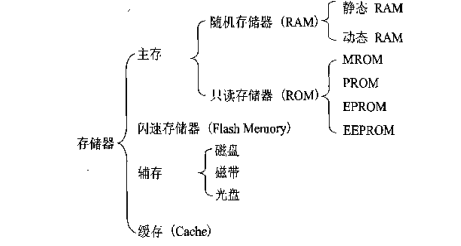

# 1、计算机组成：
这里的计算机知识多数来源与计算机组成原理一书，大致结构和运行这这里，其中详细原理，构成等暂未记录，更详细的知识可查看《计算机体系结构一书》。
## a1、基础概念：
**计算机体系**：能被程序员所进到的计算机系统属性（指令集、数据类型等），属于概念性的机构。
**计算机组成结构**：计算机内部的，一般不可见的，如机器如何取指令、计算、送结果、一个乘法电路的实现等等。
传统的冯诺依曼计算机结构：输入设备、存储器、运算器、控制器、输出设备。
现代计算机组成：io设备、cpu、主存储器（为了实现按地址访问方式，其内还有两个寄存器MAR[存储数据地址，对应存储单元个数]，和MDR[存储代码，对应位数为存储字长]）。cpu包含算术逻辑单元(ALU)和控制单元CU。`存储容量=主存(存储单元 x 存储字长) + 辅存`。

**MIPS**：(每秒百万次指令数)，衡量标量处理机性能。像是一个Intel80386 电脑可以每秒处理3百万到5百万机器语言指令，即我们可以说80386是3到5MIPS的CPU。
**MFLOPS**：(每秒百万次浮点数运算)，衡量向量处理机性能（科学计算）。
**时钟周期**：是计算机中最基本的、最小的时间单位。在一个时钟周期内，CPU仅完成一个**最基本的动作**。
- 时钟周期是一个时间的量。时钟周期表示了SDRAM所能运行的最高频率。更小的时钟周期就意味着更高的工作频率。
- 时钟周期是同步电路中时钟基础频率的倒数。它以时间动作重复的最小周期来度量，度量单位采用时间单位。
- 时钟周期是由CPU时钟定义的定长时间间隔，是CPU工作的最小时间单位，也称节拍脉冲或T周期。

主频：是指CPU时钟周期的倒数。
**机器周期**：也称为CPU周期。一条指令的若干个阶段（如取址、译码、执行等），每一阶段完成一个基本操作。完成一个基本操作所需要的时间称为机器周期。
><b c=r>每台机器的指令执行阶段可能不一样，所以一个指令周期所含机器周期数不一定相同</b>

**进制转换**：[参考学习地址](https://zhuanlan.zhihu.com/p/65554778)
- 十进制转二进制：（1）整数十进制转二进制：将整数除2，得到的余数为2进制位数，然后将商再除二，如此循环直到商除尽（2小于商时取1），得到的**所有余数组合即为其二进制**。（2）小数十进制转二进制：使用乘2取整法，先将整数部分转为二进制，再小数部分乘2，取整部分，再取整数部分，...最后结果不再小于1时停止。<b c=r>注意将结果反转后是最后的转化结果</b>（3）负整数二进制表示：在其对应的正整数二进制开头一位加1即可，如：`5=>00000101而-5=>10000101`
>**评估十进制需要的二进制位数**：寻找其介于2的指数次即可，<b c=r>如：`2^19 <999999<2^20`所以最少需要20位来表示。</b>
- 二进制转为16进制：从右到左，没4位为1组，每组的二进制表示为10进制数，10为A，11->B...15->F。转化完成后最后加H。[学习地址](https://jingyan.baidu.com/article/47a29f24292608c0142399cb.html)
- 十进制转为八进制：两种方法类似，整数除8取余数，再用商除8取余，商小于8时取1，然后结束。

八进制&十六进制：与二进制类似，不过逢8进1，逢16进1。
**8421码**：是最常用的BCD码，是十进制代码中最常用的一种。在这种编码方式中，每一位二值代码的“1”都代表一个固定数值。
- 例：$9=8+1=2^3+2^0=1000+0001=0101$#`2^3`转为二进制就表示1在从右数的第3位（从0计）。<b c=r>将10进制数用2的次数项相加表示，然后转换</b>
- 例：$1010=2^3+2^1=8+2=10$#反过来也一样。<b c=gn>用这种方法计算二，十进制互转很快，且不容易出错。</b>
<b c=r>对八进制和十六进制也可以这样快速计算，把2换为8和16即可</b>

**ascii码**：是基于拉丁字母的一套电脑编码系统，主要用于显示现代英语和其他西欧语言。使用7 位二进制数来表示所有的大写和小写字母，数字0 到9、标点符号，以及在美式英语中使用的特殊控制字符。
**字符集编码**：使用一些计算机可存储的二进制位来表示人类可读的文本等信息，比如用0001代表数字0，这样的编码方式有很多，如ascii，gbk。unicode码：是为了解决传统的字符编码方案的局限而产生的，它为每种语言中的每个字符设定了统一并且唯一的二进制编码，以满足跨语言、跨平台进行文本转换、处理的要求。有utf-8,utf-16,utf-32三种，其中utf-8占用一到四个字节，utf-16占用二或四个字节，utf-32占用四个字节。
**字节码**：字节码（Byte-code）是一种包含执行程序、由一序列 op 代码/数据对组成的二进制文件。字节码是一种中间码，它比机器码更抽象。字节码需要转译为机器码才能运行。

**机器字长**：cpu一次能处理数据的位数，因此系统分为32和64位之分。
- 机器字长与**主存储器字长**通常是相同的，但**也可以不同**。一般是主存储器字长小于机器字长，例如机器字长是32位，主存储器字长可以是32位，也可以是16位，当然，两者都会影响CPU的工作效率。
- 机器字长反映了计算机的运算精度，即字长越长，数的表示范围也越大，精度也越高。
- 现代计算机的机器字长一般都是8位的整数倍，如8位，16位、32位、64位和128位等，即字长分别为2个字节、4个字节或是16个字节，所以也可以用“字节”来**表示机器字长**。字长的值是不固定的，对于不同的CPU，字长的值也可能不一样。
- <b c=b>现代计算机机器存储字长一般都达到64位，不过需要软件（操作系统）也同样是64位才能发挥其最大作用</b>。64位存储字长的也可安装32位系统，不过就只能当32位用了。

x86与x64的区别：(X86就是我们一般用的32位的系统，X64就是64位的系统):
1. 设计初衷不同。64位操作系统的设计初衷是：满足机械设计和分析、三维动画、创作，以及科学计算和高性能计算应用程序等领域中需要大量内存和浮点性能的客户需求。换句简明的话说就是：它们是高科技人员使用本行业特殊软件的运行平台。而32位操作系统是为普通用户设计的。
2. 要求配置不同。64位操作系统只能安装在64位电脑上(CPU必须是64位的)。同时需要安装64位常用软件以发挥64位（x64）的最佳性能。32位操作系统则可以安装在32位(32位CPU)或64位(64位CPU)电脑上。当然，32位操作系统安装在64位电脑上，其硬件恰似“大马拉小车”：64位效能就会大打折扣。
3. 运算速度不同。64位CPU GPRs(General-Purpose Registers，通用寄存器)的数据宽度为64位，64位指令集可以运行64位数据指令，也就是说处理器一次可提取64位数据(只要两个指令，一次提取8个字节的数据)，比32位(需要四个指令,一次提取4个字节的数据)提高了一倍，理论上性能会相应提升1倍。
4. 寻址能力不同。64位处理器的优势还体现在系统对内存的控制上。由于地址使用的是特殊的整数，因此一个ALU（算术逻辑运算器）和寄存器可以处理更大的整数，也就是更大的地址。比如，Windows Vista x64 Edition支持多达128 GB的内存和多达16 TB的虚拟内存，而32位CPU和操作系统最大只可支持4G内存。(64位系统可以装到32位上，当32位的不能装到64位上)。


**位&字节**：`1byte=8bit=8b=1B,1KB=1024B,1kb=1024b` 。#<b c=r>注意kb与KB不一样，b与B不一样</b>，计算机一般用更长的位数表示1一个字。
<i c="gn">byte即为字节、bit为位，一个字母或单个数值占1个字节，一个汉字一般占两个字节。</i>传输速率用bit/s或者b/s或者bps。

cpu：中央处理器，电脑运算核心及控制中心，释放电脑指令、处理电脑软件中的数据。推荐使用i5的cpu为intel酷睿I5 4570
**计算机硬件结构**：硬件系统由中央处理器、存储器、IO系统、连接它们的系统总线。
**单机处理器**：只一个处理器，只有一个cpu。
**多机处理器**：一台计算机装了多个处理器，即多个cpu。多数电脑只有一个cpu。
**多核cpu**：在一枚处理器中集成两个或多个完整的计算引擎(内核)，此时处理器能支持系统总线上的多个处理器，由总线控制器提供所有总线控制信号和命令信号。

## a2、总线：
之前设备部件间使用的是分散连接方式(cpu即连接各种io又连接主存)，导致cpu效率很低，之后出现了总线连接方式，一条总线连接到cpu，其它io设备、主存连接到这条总线(单总线结构)，或者主存有单独一条总线与cpu连接(这样能加快数据的传输，面向cpu的总线结构)、还有在主存连接到cpu，主存连接到io总线的面向存储的双总线结构（这样与io设备想换数据不用经过cpu）。不过同一时刻只能允许一个设备向cpu传输信息，但多个设备可以同时接受线上传来的信息。**总线是在电路板上的**。总线分为系统和片内总线。如下：
- 片内总线：cpu内部连接寄存器、逻辑单元的总线。
- 系统总线：按功能又分为：
(1)、数据总线：常见的传输数据的总线，总线的宽度即是可传数据的位数，若总线宽8位要传一个16位的数据，那么cpu取数阶段必须两次访问主存，因此这是衡量电脑性能的一个重要参数。
(2)、地址总线：存储各数据、io设备位置的总线，如cpu在取数时还需要将数对应的地址传到数据总线上！。<b c=b>地址总线为20根，则存储单元个数为`2^20`个。</b>
(3)、控制总线：同样连接与各个设备，用于控制设备，保证同一时刻只有一个设备占用总线，有单向的双向的，传输诸如：时钟、io读、中断请求这类信号。

- 总线一次信息传送过程，大致分为：请求总线、总线仲裁、寻址、信息传送、状态返回。
- 系统中地址总线的位数与**最大存储单元个数有关**，一般与存储器地址寄存器**MAR位数**相同。也与其有关。
- **总线周期类型**：内存读取周期/写周期、I/O读周期、I/O写周期。
- 标准总线内部结构包含：数据传送总线、仲裁总线、公用总线。
>分布式仲裁控制逻辑不需要中央仲裁器、独立请求方式总线控制逻辑复杂，但响应时间最快。链式查询方式对电路故障最敏感。
>集中裁决方式包括：链式查询方式、独立请求方式、计数器查询方式。

- 同步传输控制：是指在总线上传送数据时，通信算法使用同一个时钟信号同步，通常由cpu总线控制逻辑部件提供。
- 异步传输控制：允许通信双方使用自己的时钟信号。
- 串行总线：数据在线上按位逐个进行传送，只需要一条数据线，成本低，但效率差。
- 并行总线：数据多位可一起传输。衡量并行总线最大的传输指标是**最大数据传输率**（单位时间内总线上传输的最大信息量）、

**接口功能**：
1. 数据转换：不同数据类型需要转换后才能被对方识别接收。
2. 数据缓冲与时序配合：接口电路中一般设置几个数据缓冲寄存器，从而使接口具备一定的缓冲存储能力。
3. 电平匹配和负载匹配。电平不同时需要经过接口电路进行电平转换。
4. 实现主机和外部设备之间的通信联络控制。
5. 提供外部设备和接口状态。

## a3、存储器：
**按使用的介质来分类**：如下，存储器件主要有半导体、磁性、光盘（CD-ROM）等。
半导体存储器：现代半导体存储器用大规模集成电路制成芯片，优点是体积小、功耗低。缺点：断电时，存储也会消失。半导体按材料又可以分为双极型（TTL，高速）、MOS（制造成本低、高集成、功耗小，较广泛使用）。

**按存取方式分类**：
随机存储器：Random Access Memory，RAM）可以在其存储单元随意存取，计算机主存中也有采用这种存储器。
按存储信息原理不同可分为**动态存储器**（`DRAM`，电容充放电原理）、静态存储器（`SRAM`，触发器原理）。

**按在计算机中的作用分类**：
分为主存储器（cpu与主存直接相连，速度快、容量小）、辅助存储器（主存的后援存储器，存放暂时不用的数据等，容量大、速度慢）、缓冲存储器（用在两个速度不同的部件中间，如cpu与主存之间）。
寄存器与主存的区别：寄存器内的数据可直接参与alu的逻辑运算，寄存器内的地址

                                 
<i class="label1">计算机中存储器的层次结构</i>存储容量越小，速度就越快，位价越高。计算机中各存储**结构排序**：寄存器、缓存、主存、辅存。从左至右，速度逐渐降低，容量逐渐增加、位价逐渐降低。详细解释如下：
- 寄存器：cpu内部，数据直接参与alu的计算，读取速度很快。`MAR`：地址寄存器，`MDR`：数据寄存器。

- 主存：可以认为主存就是所说的运行内存，cpu将要用到的数据会先存放到主存中，然后逐步移到缓存至寄存器。cpu可直接从寄存器、缓存、主存中读取数据，而且这三种结构的存储由于不长时间存储的特性，所以几乎使用半导体材料制作。内部结构大致如下图，其它类型存储器结构也类似。
- 主存地址字段组成=主存字块标记 | 缓存字块地址 | 字块内地址
- `SRAM`：是指这种存储器只要保持通电，里面储存的数据就可以恒常保持。
- `DRAM`：储存的数据就需要周期性地更新。由于在现实中晶体管会有漏电电流的现象，导致电容上所存储的电荷数量并不足以正确的判别数据，而导致数据毁损。因此周期性地充电是一个无可避免的要件。
    - **刷新**：指对DRAM中的存储电容重新充电。通过对存储单元进行读，但不输出的数据的操作来实现。有集中刷新、分散刷新、异步刷新。
    - 刷新期间不允许访存，这段时间称为访存死区。集中刷新的死时间，要大于异步刷新的“死时间”。
    - 刷新所需要的行地址有DRAM内部的刷新计数器给出。
    - 刷新操作按行进行，一次刷新一行中的全部存储单元。
- **对比**：`DRAM`**集成度更高**，**结构更简单**，同面积硅片能做出**更大容量**，所以相对**较便宜**，因为要经常刷新所以**性能较低**，**速度较慢**。

存储器的校验：数据存储过程中可能存在差错，为及时发现纠正错误，可将原数据转为汉明编码。


**cache**：cpu与主存之间的部分，任何时候cache中都有一些主存块在缓存中（cpu近期想使用的数据）。<b c=gn>cpu与cache是一次传送一个字，cache与主存是字块传送。</b>
- 快长变化：cpu使用到的字其附近的数据一般也更容易用到，导致更多附近数据装入cache对应字所在那个块，导致块变长，块总是就变少，甚至有新装入的块被覆盖的情况！
- cache远小于主存，但其中也有几个存储块，每个存储块有一个标记（相当于主存块的编号），<b c=b>表示存放了哪个主存块的数据。</b>
- cpu读取信息时，需要将主存地址的m位与cache中的各存储块标记对比，<b c=v>判断所读的信息是否已在缓存中</b>。
- 在则称为命中，不在则是没命中。`h=命中率=访问cache命中次数/(访问主存总次数+访问cache命中次数)`。`cache-主存平均访问时间=hx命中cache访问时间+(1-h)x未命中时访问主存时间`、

- 地址映射：将cpu送来的主存地址转换为cache地址。
- **地址位**：地址是用来指出所存数据的位置，地址位需要能指出每个字节的位置，所以地址位使用的位数就有容量决定，如：`总容量=4KB=2^12`#所以地址位用12位就能表示。
- 替换机构：cache内容已满，无法接受来自主存块信息时，由该机构按一定替换算法决定移除cache内哪个块。
- cache读写操作：`
    1. 写直达法：cpu执行写操作时直接将数据写入cache和主存，保持两者数据一致，但增加了访问次数。
    2. 写回法：数据只写入cache，cache数据被替换回去时才写入主存。

**cache的改进**：（1）单一缓存：将缓存制作在cpu内部，这样cpu与cache不再用总线通信，总线利用率提高，也称片内缓存。（2）**两级缓存**：片内缓存在cpu内部，所以体积受限，更多数据找不到则又会增加总线访问主存的次数，所以在片内缓存与主存间再加一个片外缓存（一般用SRAM），且使用**单独数据路径**与cpu通信，再次减轻总线负担，这称为片外缓存，也叫**第二级缓存**。
**统一缓存和分立缓存**：统一指指令和数据存到一个cache，分立指数据放数据cache，指令放指令cache，是否分离一般有以下原因：
- 由主存决定：主存是数据，指令分离情况，一般cache也分立，便于执行。
- 超前控制：指令执行尚未结束就将下一句指令调到cache中准备执行，需要使用分立缓存。
- 流水线控制：同时执行多条指令，译码，控制等电路也会有多个，可能会出现共同访问cache情况，更需要使用分立缓存。

**主存地址映射**：
- 直接映射：`i（缓存块号）= j（主存块号）mod c（缓存块数）`方法来计算，导致每个缓存块号固定与哪几个主存块对应，不够灵活。
>此模式下：<b c=v>主存地址字段组成=主存字块标记 | 缓存字块地址 | 字块内地址</b>，`主存字块标记=主存地址长度-cache地址长度`
- 全相联映射：允许主存中每一个字块映射到cache的任何一个位置。但所需逻辑电路较多，成本较高。
>此模式下：<b c=b>主存地址字段组成=主存字块标记 | 字块内地址</b>，`主存字块标记=主存地址长度-每个字长度`
- 组相联映射：上面两种映射方法的折中，将cache划分为Q组，每组有R个块。`i（缓存的组号）= j（主存的块号）mod Q`#mod即为模运算（取余）。
>此映射下：<b c=b>主存地址字段组成=主存字块标记 |  组地址 | 字块内地址</b>，`主存字块标记=主存地址长度-组地址长度-每个字长度`

**替换策略**：因为要将主存中的数据调入cache，而cache中相应块又可能已经存了数据，所以需要把之前的数据替换出来。<b c=gn>直接映射中一个主存块只对应一个缓存块，所以直接替换就行</b>，<b c=r>但全相联和组相联情况，一个主存块有对应多个cache地址情况，需要考虑替换哪一个出来。</b>常用替换算法如下：
- 先进先出算法（FIFO）：将最早调入cache的部分替换调。容易实现，但最早调入也很可能是常用到的，所以不能提高cache命中率。
- 近期最少使用（LRU）：记录各部分使用的次数（一般记录最近使用的时间），替换掉使用少的部分。平均命中率比FIFO高。
- 随机法：随机替换掉一部分，所以也不能提高命中率。

**外存/辅存**：
**磁表面存储器**：在金属或塑料载体上涂上一层磁性材料用于存储，工作时随载体一起高速运转，用磁头在上面进行读写，具有不易流失性。
>根据载体的形状不同，有磁带、磁盘（硬磁盘和软磁盘：速度慢）、磁鼓(矩形载体，由于共振磁原因，不能区分0，1因此现在几乎已被弃用)。
>上面有磁道记录信息，靠太近会产生影响，`道密度D=1/p(道距)`。`存储容量c=nxkxs`#n为盘面数，k为磁道数，s为每条磁道二进制代码数。
- 平均寻址时间：由寻道时间和寻到后的等待时间构成，两者每次时间都不一定相同，所以去均值来代替，$t_{寻址}=T_{寻道}+t_{等待}=(max(T)+min(T))/2+(max(t)+min(t))/2$
- 磁盘数据传输率：单位时间内向主机传送数据的位数或字节数。与记录密度和转速有关。<b c=gn>可用每秒转过的圈数 / 每秒数据传输量，得出每个磁道的容量</b>

**磁记录原理**：
1. 写：通过写入代码的要求，对写入线圈输入一定方向和大小的电流，使磁头磁化，产生一定方向和大小的磁场。磁头与磁层表面距离小，磁线可以穿透磁层，在磁头下方的磁层区域磁化（根据写入的电流方向和大小，磁化的磁极会不同，以此区分0和1）。
2. 读：记录介质在磁头下发匀速通过，对读出的一个个磁化单元做切割磁力线运动，在磁头读线圈中产生感应电势，感应电势方向不同，以此区分0和1。p126

磁记录方式：记录时并非只是按二进制数据记录磁性那么简单，中间还有经过一层编码来转为对应的磁状态，再写进去的。**编码方式**有：归零制、不归零制、调相制、调频制等。

**磁芯储器器**：磁性状态元件，中间有驱动线（通电流）和读出线，可进行读写，但由于功耗大，制作复杂，已几乎被弃用。
**光盘存储器**：用激光在介质上(磁性材料)上进行读写。可靠性高、互换性好、不易失。如下右图所示，每个磁道存储相同多的二进制位数（内圈密集）。

**关联存储器**：（相联存储器），是一种不根据地址而是根据存储内容来进行存取的存储器，可以实现快速地查找块表。既可以按照地址寻址也可以按照内容寻址（通常是某些字段），为了与传统寄存器作区别，称为按内容寻址的存储器。
- 实现技术相同的情况下，容量较小的相联存储器速度较快。
- 存储单元数目不变的情况下，存储字长变长，相联

**双端口存储器**：是指同一个存储器具有两组相互独立的读写控制线路,由于进行并行的独立操作，是一种高速工作的存储器。
- 当两个端口同时存取存储器，同一存储单元时便**发生读写冲突**。为解决此问题，特设置了BUSY标志。由片上的判断逻辑决定对哪个端口优先进行读写操作，而暂时关闭另一个被延迟的端口。
- 当两个端口的地址不相同时，在两个端口上进行读写操作，一定不会发生冲突。

**只读存储器**：（Read Only Memory，ROM）写入之后不可随便更改，常用于存储几乎不变化的数据，如系统数据，用于系统固化，是主存的一部分，构成主存的地址域。之后也派生出一些其它的只读存储器，可编程存储器、可擦除可编程存储器、flash memory等。
**串形访问存储器**：要读取一个数据必须按照其物理地址先后，读取，所以不同存储位置的数据读取时间不一样。如磁带。还有部分串形访问的存储器，如磁盘。

**虚拟存储器**：
- 电脑中所有运行的程序都需要经过内存来执行，如果执行的程序很大或很多，就会导致内存消耗殆尽。为了解决这个问题，Windows中运用了虚拟内存技术，即拿出一部分硬盘空间来充当内存使用，当内存占用完时，电脑就会自动调用硬盘来充当内存，以缓解内存的紧张。
- 在具有层次结构存储器的计算机系统中，自动实现部分装入和部分替换功能，能从逻辑上为用户提供一个比物理贮存容量大得多，可寻址的“主存储器”。虚拟存储区的容量与物理主存大小无关，而受限于计算机的地址结构和可用磁盘容量。
## a4、输入输出系统IO：
io分为3类：人机交互外设（鼠标、键盘等）、信息存储设备（u盘、光盘、磁带等）[所以系统自带的磁盘也是属于io设备]、通信设备（与另一台计算机通过调制解调器）。输入输出系统由io软件和io硬件组成。结构如下：
<i class="label1">IO软件</i>输入输出系统采用接口模块方式时，由io指令和相应管理程序使得io设备和主机协调工作。如果使用通道方式的话，则有IO指令、通道指令、操作系统共同协调。
- **IO指令**：属于cpu指令系统的一部分，格式为》`操作码 | 命令码 | 设备码`，一起构成。实现的功能诸如有：读取io设备输入的数据、将数据写入指定io设备等。
- **通道指令**：对于又通道的io系统专用的一套指令，用于指明传送的数据在主存中的首地址。通道程序由通道指令组成，用来执行io指令，它并不属于cpu操作指令，具有通道结构的计算机中其io指令只负责启停io设备、查询通道、io设备状态、控制通道操作。cpu一旦执行了启动io设备命令后，由通道来代替cpu管理io设备。
- IO设备编址方式：io设备作为外来连接设备需要为其设置地址并存放，这样cpu才能找到其位置进一步操作。有设备插入时，**寻址**：对应端口执行io指令中的设备码，指出该设备设备号。**统一编址**：设备地址也存于主存中，不过划出一块区域存放它们，凡是反问这一区域的都是当作访问io设备，这占用了主存的空间但可以用cpu的io指令操作。**非统一编址**：设备地址与主存分开，不占用主存空间，不过需要针对其写专门的io指令。这些由构建计算机时如何设计。
- **传送方式**：传送数据可以并形传送（如一个6位的数据可以永6根数据线一次性传输这一数据，速度极快）、串形传送（如一个6位的数据，用一根数据线每次传输一位）。一般短距离可以使用并行传送，较远距离考虑成本会使用串型传送。

<i class="label1">IO硬件</i>由io模块、io设备组成。
<i class="label1">IO与主机之间传送信息控制方式</i>io通道，io处理两种，如上。其余三种如下：
- 程序查询方式：cpu要对io读存操作时会先查询io设备状态，若设备状态一直是未就绪，则cpu会一直查询其状态，且期间不执行其它程序。很占cpu资源，**效率最低**！
- 程序中断方式：cpu直接执行io读取指令，可以与其它程序一起并行，直到io主动发起中断操作，此时cpu会中断操作，之后由继续其它指令。比起程序查询方式，中断方式更多的利用的cpu资源，但这需要io软件程序中写专门的中断程序，硬件中也要增加相应的电路。<b c=b>可与cpu并行，适合中低速设备！</b>
- 直接存读取(DMA)：io设备与主存之间直接有总线相连，进行读存操作时，io设备与主存之间直接进行数据传送，不经过cpu，不过期间它们会占据总线，此时cpu退出使用总线，但cpu仍然能计算寄存器、缓存中的数据，比起程序中断方式又更高效的利用的cpu。<b c=r>可与cpu并行，适于高速设备。</b>
>DMA接口包括：主存地址计数器、数据数量计数器、DMA请求触发器。
>DMA处理过程：（1）传输前得预处理由cpu完成，执行到调用设备语句时启动DMA传送（向DMA传送：内存地址初值、数据数等）。（2）传输交给DMA控制，向cpu请求使用总线，若总线空闲则直接启动传输。（3）传输过程中，DMA要进行内存地址计数、数据量计数。（4）计数器值为0时向cpu发送中断请求，cpu检查是否结束数据传输。

**通用可编程接口接口卡上有**：（没有指令寄存器）
- 接口命令寄存器：存放cpu发出来的控制命令。
- 状态寄存器：设备控制该值，cpu读取该值连接设备状态。
- 数据缓冲寄存器：适当降低cpu和设备运行速度不匹配的问题。
- 处理中断请求、屏蔽、判优逻辑电路等：主动向cpu提出操作要求。

编址方式：
- 独立编址：使用专门输入输出指令。
- 统一编址：将I/O地址看成存储器地址一部分，不需要专门I/O指令，将外设寄存器和主存单元统一编址。


## a5、逻辑单元：
计算方式：有符号数，无符号数的表示。加减乘除的运算、码位的转换。
大致运算流程：算术运算转换位逻辑运算，逻辑运算再经过相应电路得到结果，数值的表示都转位0，1表示，1位高电平，0位低电平。
ALU：现如今alu电路已被制成电路芯片，各种型号也有很多，其中74181芯片能完成4位二进制代码的逻辑运算，内又正反逻辑电路，如下图（左一位框架图）：
- alu是功能较强的组合电路，其基**本逻辑结构**是超前进位加法器。


**计算的运行**：这包括公示计算和一些，指令操作等内容。如要计算一个sinx的值，而计算机本身只提供了加、减、乘、除这类由逻辑门编制的基础运算逻辑，计算sinx则是由这些基础计算方法代替，可写为：`sinx = x-x^3/3! + x^5/5! +...`#分解这每一个步骤，按操作符，数据（两者都用二进制表示）为一组且按顺序存储起来，然后按顺序拿到运算器中计算后存储，直到结束。
**串行加法器**：即加法器执行位串行行操作，利用多个时钟周期完成一次加法运算，即输入操作数和输出结果方式为随时钟串行输入/输出。
**超前进位加法器**：是对普通的全加器进行改良而设计成的**并行加法器**，主要是针对普通全加器串联时互相进位产生的延迟进行了改良。
**定点加法器**：最普通的加法器——整数、分数部分界定明确，最高位的进位丢弃。而浮点意味着小数点浮动——保高位弃低位, 得追踪小数点跑到哪里了.

**逻辑运算**：[参考学习地址](https://wenku.baidu.com/view/87edf248effdc8d376eeaeaad1f34693dbef1014.html)
- 与：and/&&，同为真时为真，其余为假。
- 或：or/||，同为假时为假，其余为真。
- 非：not/!，假时为真，真时为假。
- 与非：同真时为假，其余为真。
- 或非：同假时为真，其余为假。
- 异或：相同为真，否则为假。

**定点数**：小数点固定在某一位置的数，小数点位于数值之后时为整数。其余则是定点小数。
**浮点数**：小数点位置可以浮点的数。当计算机计算两个相差极大的数时会使用浮点数计算。科学计数法表示，如：`0.1101x10^-10`。
- 两者比较：浮点数与定点数位数相同时，浮点数表示**范围大的多**，浮点数规格化之后**精度比定点数高**、浮点数计算较复杂，所以**计算较慢**。溢出处理比定点数好。

**原码**：原码是计算机机器数中最简单的一种形式，数值位就是真值的绝对值，符号位位“0”时表示正数，符号位为“1”时表示负数，原码又称带符号的绝对值。为了方便整数和小数区别，整数的符号位与数值位之间用“，”隔开，小数的符号位与数值位之间用“.”隔开。定义如下：[参考学习地址](https://www.cnblogs.com/lukelook/p/11274795.html)
$整数表示=\begin{cases} x & 0<x<2^{n-1} //n表示机器字长\\ 2^{n-1}-x & -2^{n-1}<x<=0 \end{cases}$
- 反码：通常是用来由原码求补码或者由补码求原码的过渡码。<b c=v>正数的反码与原码相同，负数的反码将原码取反（不含符号位），1变为0，0变为1</b>
- 补码：是计算机把减法运算转化为加法运算的关键编码。<b c=v>正数的补码与原码相同。负数的补码为：原码的反码的最后一位加1，最前加1符号位</b>，如+1010补码表示：0,1010#逗号分割开
- 移码：（又叫增码或偏置码）通常用于表示浮点数的阶码，其表示形式与补码相似，只是其符号位用“1”表示正数，用“0”表示负数，数值部分与补码相同。
>示例：若机器字长为8，`|+35|原 = 00100011` #直接二进制表示35即可，长为机器字长。`|-35|原 = 10100011`，`|+3|移=10011`，`|-3|移=01101`

源码加减：符号位要与数值分开，最后运算的结果的符号位与绝对值最大的数的符号位一致。
**源码乘法**：类似十进制的乘法，从下面的数最后一侧开始，是1则将上面的全写下来，是0则全为0，然后每行全部相加。如下图：

为使计算机便于实现，改进为：`AB=Ax0.1011=0.1A+0.00A+0.001A+0.0001A`#视为加法和移位两种的结合。

**定点数补码加减**：公式如下：<b c=r>这里的mod就是模运算，余数就是结果</b>
- 整数：$[A]_补+[B]_补=[A+B]_补 \space mod \space 2^{n+1}$
>如：A=-1001,B=-0101,$[A+B]_补=1,0111+1,1011=11,0010\space mod\space 2^{4+1}=1,0010$#0010正好是-14的补码。<b c=r>n为表示数的位数</b>
- 小数：$[A]_补+[B]_补=[A+B]_补 \space mod \space 2$#例：$[0.1011]_补+[-0.0101]_补=0.1011+1.1011=10.0110\space mod\space 2=0.0110$#表为补码时，小数前1位也是符号位。

- **双符号位**：00为正数，11为负数，01：正溢出（上溢），10：负溢出（下溢）。<b c=b>更容易检查出计算中的溢出情况，只有算术和逻辑运算部件中才采用</b>。
- **溢出**：主要指运算时由于进位，直接进到符号位的情况
（1）两个操作数符号位相同，运算时采用单符号位，结果的符号位与操作数不同。
（2）运算时采用单符号位，结果的符号位和最高数位不同时产生进位。
（3）运算时采用双符号位，运算结果的两个符号位不同。<b c=r>符号相同的两个数相减不会溢出，符号不同的两个数相加也不会溢出</b>
（4）<b c=gy>溢出代表无效计算，是计算错误的，超出计算机表示范围的表现。</b><b c=r>定点数只有溢出、正溢、负溢的概念。浮点数才说上溢，下溢</b>

**浮点数表示**：一般用科学计数法表示小数，如：`8.9527x10^3`#这里的指数3称为**阶码**，小数部分称为**尾数**，**规格化**是指将全部化为小数表示。
>如`0.89527x10^4`。(假如机器字长为8位)，`-0.1001=1.1001000`#8位表示，取反=>1.0110111，补码，加1=>`10111000`。
>计数法形式：$X=0.0110011\times 10^{11}=>101100110011$#前4位表示阶码，后8位表示尾数。$Y=0.1101101\times 10^{-10}=>011001101101$#负的阶码用补码表示。这里没加符号位。
- **浮点数加减**：对阶、尾数求和、规格化、舍入处理、判断溢出。[参考地址](https://www.cnblogs.com/l20902/p/10610920.html)
    1. 阶差：X,Y求阶差：`E=|1011-0110|=0101=5`#正常补码方式计算即可。
    2. 对阶：小阶向大阶靠齐，`Y=1011 00000 011001101101`#尾数部分右移5位（上面的阶差，前面补0实现）。
    3. 尾数相加：`0 0011001100000+0 000001101101=0 0011011001101`#前面加了一位符号位。
    4. 规格化：左规，尾数变为`011011001101`,阶码变为`1010`#<b c=gn>左规即为尾数左移1位，阶码-1</b>
    5. 舍入处理：0舍1入，尾数变为`01101100+1=01101101`#最后4位作为1入，其它计算中也看情况处理。
    6. 未发生溢出。<b c=r>浮点数的溢出指阶码部分的溢出，尾数上溢时，尾数右移1位，阶码+1，即右规</b>

- 浮点数乘法运算：$x=2^{-101},y=2^{011}求xy$#下面使用的是双符号位。
>$[x]_补=11,011;00.0110011，[y]_补=00,011;11.0001110$，然后步骤如下：
    1. 阶码相加：$[j_x+j_y]_移 = [j_x]_移+[j_y]_补=00,011+00,011=00,110$#经过-1反码之后可知其值为-2。
    2. 尾数相乘：$[s_x*s_y]_补=11,10100101001010$
    3. 左规：00,110;11,10100101001010=>00,101;11,01001010010100
    4. 舍入处理：最后7位尾数丢弃。
    5. 符号向异的两个阶码相加不会发生溢出。


## a6、指令系统：
机器指令：由**操作码**和**地址码**两部分组成。机器自带的能直接运行，能与人类沟通的语言。以一条条指令的形式呈现。一个指令又操作码和地址码组成，<b c=gn>形如：操作码 | 地址码</b>
- 长度：取决于操作码长度、操作数地址长度、操作数个数。一般整个**指令字长**为32位。

**操作码**：实现加减，移位等逻辑运算。最大位数与指令数有关：如操作码最大位数为7，指令数 = 2^7。操作码的位数是可以变化的，但这要求更复杂的控制器。
- 操作数类型：地址、数字、字符、逻辑数据。
- 操作类型：数据传送、算术逻辑运算、移位、转移、输入输出、其它。

**地址码**：根据地址码个数有：零、一、二、三、四地址码。
1. 四地址指令：`op | a1 | a2 | a3 | a4`#a1,a2为操作数地址，a3为结果地址，a4为下一条指令地址。完成一条四地址指令需要**4次访问存储器**（取操作数2次、存结果1次、取指令1次）
2. 三地址指令：`op | a1 | a2 | a3`#这里op表示操作码，a1，a2是要用到的数，a3是下一条指令的地址。`a1(op)a2->a3`。
3. 二地址指令：`op | a1 | a2 |`#a1(op)a2->a1。
4. 一地址指令：(ACC)OP(a1)->ACC#ACC存放参与运算的操作数，又存放运算的中间结果。
5. 零地址指令：没有地址码，如空操作、停机、中断这类操作。

**寻址方式**：指确定本条指令的数据地址，以及下一条将要执行的指令地址的方法（与硬件结构相关，且与指令格式有关）。地址可以是主存、寄存器、缓存，甚至io设备地址。
- 指令寻址：分为**顺序寻址**（程序计数器+1，自动形成下一指令地址）和**跳跃寻址**。
- **数据寻址**：种类繁多，指令字中必须设一字段来说明寻址方式。有如下：<b c=r>采用不同寻址方式的目的是：缩短指令长度、扩大寻址空间</b>
    - **立即寻址**（操作数以补码形式放在指令本身中，获取该指令时直接获取到数据，因此数的范围有限）。
    - **直接寻址**（指令中直接存放操作数的直接地址，操作数的值影响自己的地址，所以修改操作数才能修改地址）。
    - **隐含寻址**（部分地址在指令字中，部分地址在寄存器等存储中）。
    - **间接寻址**：指令字中的形式地址不直接指出操作数地址，（1）取出形式地址所指内容q。（2）取出地址q所指位置内容x。<b c=r>需要间接2次找到真实地址</b>
    - 寄存器寻址：地址码字段直接指出寄存器编号。
    - 寄存器间寻址：寄存器一次间接寻址效率高于变址寻址。（操作数在寄存器中）
    - 基址寻址：需要有基址寄存器BR，有效地址=指令字中形式地址+基地址寄存器中内容。<b c=r>基址寻址适合多道程序设计</b>
    - 变址寻址：与基址寻址很相似，指令字中形式地址+变址寄存器中内容。**有效数据存放在主存**。适合数组、编制循环程序。<b c=v>变址寻址效率高于一次间接寻址。</b>
    - 相对寻址：程序计数器中的当前地址+1+指令字中的形式地址。<i c=r>**转移指令**就是要的相对寻址</i>
    - 堆栈寻址：要求计算机中有堆栈。

设计指令格式考虑的因素：操作类型（指令数及操作难易程度）、数据类型（哪些数据类型可以参与操作）、指令字长、操作码位数、地址码个数、寻址方式、寄存器个数（影响h指令执行时间）。
计算机执行程序所需时间：`P=IxCxT`#参数如下：
- I：高级语音编译后在机器上运行的机器指令数。
- C：执行每条机器指令所需平均机器周期。
- T：机器周期所需时间。

RISC：精简指令系统计算机。用最常用的20%的简单指令，组合实现不常用的80%指令功能。特点如下：
1. 指令长度固定、指令格式种类少、寻址方式种类少。
2. 只有取数/存数操作访问存储器，其余操作在寄存器内完成。
3. CPU中有多个通用寄存器。
4. 流水线技术，大部分操作1个时钟周期内完成。
5. 控制器采用组合逻辑控制，不用微程序控制。
6. 采用优化的编译程序。

CISC：复杂指令系统计算机。与RISC差异大。指令系统庞大、各指令使用频率相差较大、指令字长不固定、指令格式多、多数指令要多个时钟周期才能执行完。
**RISC与CISC的比较**：RISC有点如下：
1. 充分利用VLSI芯片面积。
2. 提供计算机计算速度（指令编码有规律，因此译码快、通用寄存器多，减少访存次数、用组合逻辑控制，比cisc的微控制好。精简指令系统更适合流水线工作）。
3. 便于设计、可降低成本、提高可靠性。 
4. 有效支持高级语言程序。


## a7、cpu：
cpu一般由四部分组成：
- 负责计算的ALU逻辑单元。
- 负责取读指令，掉取数据的控制器cu。
- 负责存储计算中临时使用的程序和数据的寄存器。
- 为了程序运行正常和出错情况进行阻止的中断系统。包括运算器和控制器两大部分，运算器就是上面的ALU逻辑单元。

程序进入存储器后，取、分析、执行都交由控制器执行：
<b c="gn">由于寄存器很小，CU,ALU等又只是逻辑控制，所以cpu被制作成一块普通芯片大小。</b>

**寄存器**：程序计数器PC（汇编语言可见）
1. 通用寄存器（可存放操作数，存放某种寻址所需的寄存器，如满足基址寄存器、变址寄存器等）
2. 数据寄存器（几乎只存操作数）
3. 地址寄存器（几乎只存放地址，做基址，变址等使用的寄存器）
4. 条件码寄存器（存放条件码，部分对用户透明，存放计算产生的一些结果等）。
5. 控制寄存器，存储微指令。

pc：（程序计数器）存放当前**指令**，欲执行**指令的地址**，计数功能，可自动形成下一条指令的地址。
MDR：存储器数据寄存器`MDR`，与数据总线相连。
IR：指令寄存器`IR`（存放当前执行指令）有配合指令间接寻址等作用。
MAR：存储器地址寄存器`MAR`，向地址总线发送命令也必须是MAR。

**cu**：控制器，提供完成计算机全部指令操作的**微操作命令**序列部件。执行程序过程中控制单元要发出一系列**微操作命令**有序的完成指令功能。

**指令周期**：cpu取指令，执行指令所需的全部时间。
- 取指令：能形成指令地址，发出取指令操作，将对应地址指令取到控制器中。
- 分析指令：分析取到的指令的作用，分析参与这次操作的操作数地址。
- 执行指令：分析产生的操作命令和操作数地址，形成控制星号序列，然后对各相关部件执行。

1. **取指周期数据流**：


- 取指周期的命令微操作过程：
（1）`pc->MAR`：现形指令地址送到MAR。
（2）`1->R`：向主存发送读命令。
（3）`M(MAR)->MDR`：mar所指地址数据发至MDR。
（4）`MDR->IR`：指令送至IR存储。
（5）`op(pc)->cu`：指令操作码送至cu译码。
（6）`(PC)+1->PC`：形成下一条指令地址。

2. 间指周期数据流：取指周期结束后，cu会检查IR中的数据，若有间指操作会取MDR显示地址的右N位，送至MAR然后访问存储器（获取有效地址村MDR）。<b c=b>完成取操作数有效地址的任务</b>
（1）`Ad(IR)->(MAR)`：指令地址码部分（形式地址）送至MAR。
（2）1->R：向主存发送读命令。
（3）M(MAR)->MDR
（4）`MDR->Ad(IR)`：将MDR中拿来的**有效地址**送至IR。
3. 执行周期数据流：执行时操作类型的多样，因此数据流并不统一。有以下几类：
a. **非访存指令**：执行周期中不访问存储器。
（1）`0->ACC`：【CLA】清除累加器指令。
（2）`ACC->ACC`：【COM】累加器取反指令。
（3）`L(ACC)->R(ACC)`：【SHR】算术右移一位指令，完成累加器算术运算右移一位。
（4）`R(ACC)->L(ACC)`：【CSL】循环左移1位指令
（5）`0->G`：【STP】停机指令。
b. **访存指令**：执行过程中会访问存储器。
（1）加法指令ADD X：【1】`Ad(IR)->(MAR)`【2】`1->R`，【3】`M(MAR)->MDR`，【4】`(ACC)+MDR->ACC`：给ALU发送加命令。
（2）存数指令STA X：【1】`Ad(IR)->(MAR)`【2】`1->W`：向主存发送写命令【3】`ACC->MDR`：累加器内容送至MDR。【4】`MDR->M(MAR)`：数据寄存器内容，送到MAR地址所指位置。
（3）取数指令LDA X：【1】`Ad(IR)->MAR`【2】`1->R`【3】`M(MAR)->MDR`【4】MDR->ACC
（4）转移类指令：无条件转移指令JMP X，`Ad(IR)->PC`。条件转移指令BAN X（根据上一条指令运行结果得出下一条指令地址）。

4. 中断周期数据流：中断服务会中断一个程序的执行，然后执行下一个程序。不过会保存被中断程序的。
>**过程**：cu将用于保存程序段点的特殊存储器地址送至MAR，MAR将地址发送到地址总线，cu在控制总线发出写命令，同时cu通知程序计数器pc，将pc内容（程序断点）送至MDR，MDR将数据发至数据总线，存储器会存入程序断点。
（1）0->MAR：0送至MAR。
（2）1->W（3）PC->MDR：程序断点送至MDR。（4）MDR->M(MAR)：写入MDR。
（5）->PC：向量地址形式部件送至PC。（6）0->EINT：关中断。若程序断点存入堆栈，则（1）改为(SP)-1->SP且SP->MAR

**指令流水**：不采用指令流水的计算机里，它们指令的执行是串行的，一条指令周期完成后才会开始取指令，执行指令的开始吓一条。但取指令时执行指令部件就是空闲的，执行时指令部件就是空闲的。指令流水就是在执行指令时可以同时取下一条指令的操作。（指令执行时间一般大于取指令时间）
影响流水性性能大的因素：
- 结构相关影响：大多数机器将指令和数据放在同一存储中，且只有一个访问口，单同一时钟周期执行和取操作都访问存储时并发生冲突，影响性能。
>解决：（1）一条指令访问存储时，暂停一个时钟周期，取后一条指令的操作。（2）设立两个独立存储，分别存放操作数和指令，以免发生冲突。
- 数据相关影响：有时指令重叠的操作导致对操作数的读、写数据顺序的改变。
- 控制相关影响：指令转移影响造成。

流水线性能：用吞吐率、加速比、效率3项评估。
- 吞吐率：流水线完成n条指令的实际吞吐率，若各功能段使用时间均为t。`则最大吞吐率=1/t`
- 效率：流水线中各**功能段**（如取址、译码、执行等）的利用率，用各功能段，效率 = 流水线处于工作时间的时空区 / 各段总的时空区

**流水线多发技术**：让在同一时钟周期内产生更多条指令。常用技术有：超标量技术、超流水线技术、超长指令技术。
- 超标量技术：同一时钟周期内可同时并发多条指令，以并行形式执行两条及以上指令（除去上面3种相关影响，可并行的放一起）。这需要cpu中配置多个译码电路、多个寄存器端口，总线等。
- 超流水线技术：将一些流水寄存器插入到各流水线段中，即将流水线再分段，相当于对时钟周期分得更细。使得比普通流水线周期更短。靠编译程序解决优化问题。
- 超长指令技术：由编译程序在编译时挖掘出指令间潜在的并行性，把多条可并行指令组合为一条（有多段操作码，指令长达几百位）。这样在执行时就相当于同时执行了几条指令。

中断系统：为了一些异常情况，多道处理程序的需要，提高系统效率。引起中断因素如下：
1. 认为设置中断。
2. 程序性事故：如定点溢出、浮点溢出、操作码不能识别等。
3. 硬件故障：插件接触不良、通风不良、磁表面损坏等。
4. IO设备准备就绪后会向cpu发出中断请求。
5. 外部事件：如用户通过鼠标、键盘来结束程序。

中断请求标记：记录中断源的请求，状态为1时表示有中断请求。
[一个计算机组成原理博客。](https://www.jianshu.com/p/23a926f0409b)

# 2、习题：
## (1)基本：

- 早期计算机以运算器为核心，后期计算机发展以存储器为核心。
- 工作站可以认为是一种高性能的微型计算机。
- 计算机的**指令系统**是计算机软件和硬件的接口。
- 移码主要用于**表示浮点数的阶码**。与+-0编码相同的是**补码和移码**。
- 计算机外围设备是指：cpu和内存以外的设备。
- 激光打印机打印原理：利用静电转印。
- 中断向量表：存放中断服务程序入口地址。

## (2)存储：
- **存储器存取周期与存取时间关系**：存取周期大于存取时间。
- 虚拟存储器理论上**最大容量**取决于**虚拟地址长度**。
- 信息按整数边界存储（对其方式存储）的含义是：信息单元的存储地址是其字节长度的整数倍。
- 虚拟存储器有快表和慢表之分。快表用高速存储器组成，所以速度更快。  
- 磁盘上靠内的磁道存储信息与靠外圈的磁道存储信息量**相等**。

## (3)指令：
- 对程序员完全透明的指令是：微指令。
- 控制信号序列的最小单位：微命令（不是指令 ）。
- 使用返回指令和中断返回指令时，都无须明显给出返回地址。
- 返回指令可以带一个操作数。中断返回指令IRET绝对没有操作数。
- 如果**指令字长与和机器字长**相等，那么**取指周期等于机器周期**。
- **CISC**：追求指令系统的功能复杂和完备，弥补高级语音和机器语言程序之间的差异。硬件实现复杂，指令条数多，并行度差。
- **RISC**：追求指令系统的精简、高效，精简高速的硬件组成，精简智能的编译软件。指令格式规整，指令条数少、实现简单、并行性高，但指令寻址种类少。
- **微指令**：其基本思想是:一条机器指令可分割成许多基本的操作序列, 这些操作可归为信息的传递, 而信息传递的关键是控制门的打开与关闭。因此, 可用存储阵列中的信息来控制这些门的开与关闭。故可将微程序控制信号以微码的形式构成微指令, 编成多微指令的微程序, 存于存储器中。于是, 取出一条微指令就产生一组微操作控制信号, 去打开一组控门, 控制完成一组微操作。每条机器指令对应一段微程序, 这段微程序执毕, 该指令规定的功能也就完成了。
>微程序是在**执行指令**时被执行的。微程序**存放在主存**中。微指令中的微地址表示：**后继微指令**地址。
>控制器**同步控制方式**是指由统一时序信号控制的方式。
>每一条机器指令由一个**微程序解释执行**。
>水平型微指令能充分利用数据通路的并行结构。
>一个微指令周期中能**并行执行多个**微操作。
>垂直型微指令中包含**微操作码**字段。

- **流水线**：取指令、执行指令的一些步骤控制，来达到较高的执行效率。所以指令流水线可以提高指令执行的吞吐量。
>流水线相关：结构相关、数据相关、控制相关。
>超标量处理器中一定有**多个不同的指令**执行单元。
>动态流水线执行指令的顺序不一定是输入指令的顺序。
>超标量处理器**不一定**都采用动态流水线。
>指令流水中，不同功能端的执行时间最好相等。
- CPU总线是一种局部总线！
- 系统总线是用来连接系统中各个功能模块和设备。

**题1**：CPU执行一段程序时，cache完成存取的次数为3800，主存完成的存取次数为200，cache存取周期为50ns，主存为250ns，那么cache或者说主存系统的效率为？
>解析：**cache命中率**：`H=3800/(3800+200)=0.95`。主存慢与cache的**倍数**：`r=tm/tc=250ns/50ns=5`，则**访问效率**：`e=1/[r+(1-r)H]=83.3%`。
>**平均访问时间=cache存取周期 / e(访问效率)**

题2：某总线在一总线周期中并行传输4个字节，假设一总线周期等于一个总线时钟周期，总线时钟频率为33MHz，则总线带宽是？
>解析：$4个字节=4B=0.004kB=0.004/1024 MB，时钟周期=T=1/f=1/(33*10^6)。带宽D=\frac{4*10^{-3}}{1024}*33*10^6=129MB/s$

**题3**：磁盘平均寻道时间为12ms，传输速率为10MB/s，磁盘控制器延时为2ms，一个转速为7200r/min的硬盘写1KB数据时间为？
>解析：7200r/min=120r/s，而穿速率为10MB/s，说明这120r中写或读的数据量为10MB，则每r（即每个磁道）容量为`1/12MB`。所以写入1KB数据无须换道。
>写入1KB时间=磁盘启动时间+寻道时间（找到对应的磁道）+数据传输时间=$2+12+\frac{1*10^3ms}{10*1024kB}=14.1ms$

**题4**：某CPU主频为8MHz，若已知每个机器周期平均包含4个时钟周期，该计算机平均指令执行速度为0.8MIPS。
（1）求该计算机平均指令周期及每个指令周期含有几个机器周期？
（2）若改用时钟周期为0.4μs的cpu芯片，则计算机平均指令执行速度会变为多少MIPS？
（3）若要得到平均每秒40万次的指令执行速率，应该采用主频为多少的cpu芯片？
>(1)解析：时钟周期=$\frac{1}{8*10^6Hz}=0.125\times 10^{-6}s=0.125\mu s$，机器周期=$0.125\mu s\times 4=0.5\mu s$，
>指令周期=$\frac{1\times 10^6次}{0.8\times 10^6次/s}=1.25\times 10^{-6}s=1.25\mu s$，每个指令周期包含$1.25\mu s/0.5\mu s=2.5$个机器周期。
>(2)解析：机器周期=$4\times 0.4\mu s=1.6\mu s$，指令周期所包含的机器周期数不变，指令周期=$2.5\times 1.6\mu s=4\mu s$,而1MIPS=1次指令执行周期/1μs，
>所以，该机器指令平均执行速度=$1/4MIPS=0.25MIPS$
>(3)解析：指令执行速度=0.4MIPS，则指令周期=$1/0.4=2.5\times 10^{-6}s=2.5\mu s$#机器周期=1μs，时钟周期=1/4=0.25μs，则主频=1/0.25=4MHz。#这里单位转化没写出。

题5：十进制数2000用十六进制表示。
>解析：$2000=1024+512+256+128+64+16=2^{10}+2^9+2^8+2^7+2^6+2^4=11111010000$源码表示为`011111010000`#加上了符号位，每4位一组转为十进制=>7D0，最后加上H=>7D0H。

题6：假设主存容量位512KB，cache容量为4KB，每个字块位16个字，每个字32位。求直接映射方式下主存地址各字段位数？
>解析：因为要将主存中的部分数据调入cache内，所以主存地址中自然要包含些cache地址对应的信息。
>cache容量为`4x1024B=2^12B`所以其地址位用12位表示，每个字块`16x(32/8B)=64B=2^6`#所以字块内地址用6位表示，`块数=4KB/64B=64=2^6`#所以字块地址也用6位表示。
>主存容量为`512x8=2^19B`#地址位用19位表示。主存字块标记=主存地址长度-cache地址长度=19-12=7。
>主存地址字段组成=主存字块标记 | 缓存字块地址 | 字块内地址 = 7 | 6 | 6

题7：假设主存容量为512Kx16位，cache容量为4096x16位，块长为4个16位的字，访存地址为字地址。（1）全相联映射方式下，设计主存地址格式。（2）二路组相联映射下，设计主存地址格式。
>(1)解析：cache块长为`4B=2^2`#所以块内地址为2位，16是存储字长（表1字节存储空间为16位），主存容量=`512x1024B=2^19`，所以主存地址为19位。
>主存字块标记=`主存地址长-字块内地址长`=19-2=17。主存地址表示=`主存字块标记 | 字块内地址`=17 | 2
>(2)解析：二路组相联表示每组2个块，`4096/(4x2)=512=2^9组`#所以组地址长为9。主存字块标记=主存地址长-组地址长-块内地址长=19-9-2=8
>主存地址表示=**主存块标记 | 组地址 | 字块内地址** = 8 | 9 | 2

题8：一8位机的主存采用半导体存储器，地址码为18位，若使用4kx4位的RAM芯片组成该机所允许的最大存储空间，并选用模块条的形式，问若每个模块条为32kx8位，要几个模块条，每个模块多少RAM芯片？
>解析：主存容量为`2^18B`,`模块条容量=2^5x1024=2^15B`，则块条数`=2^18/2^15=8`块。
>一个4位RAM要做8位1字的存储器，所以1个RAM只能按2K算，`块数=32/2=16块`。

题9：字长16位的某计算机，其主存容量为64KB，采用单字长单地址指令，共64条指令，设计以下指令：立即寻址时的指令格式、直接寻址时的指令格式、基址寻址时的、相对寻址时的。
>解析：字长16位，所以指令长也设为16位。这里有四种寻址方式，所以用2位表示寻址方式，6位表示操作类型，剩下的做操作数或操作数地址。
>格式：`op | xx | D`#xx=00为直接寻址，有效地址E=D。xx=01：间接寻址，`E=(D)(64k)`。xx=10:变址寻址，`E=(R)+D(64k)`#R为变址寄存器。xx=11:相对寻址，`E=(PC)+D`

**题10**：某计算机有变址寻址、间接寻址、相对寻址方式，当前指令地址码部分为001AH，正在执行的指令所在地址为1F05H，变址寄存器的内容为23A0H。存储器内容如下：
|  地址   |  内容   |  地址   |   内容  |  地址   |  内容   |
| :-: | :-: | :-: | :-: | :-: | :-: |
|  001AH   |  23A0H   |   1F05H  |  2400H   |   1F1FH  |  2500H   |
|  23A0H   |  2600H   |  23BAH   |  1748H   |     |     |
>执行的指令为变址寻址时：`操作数s=((Rx)+A)=(23A0H+001AH)=(23BAH)=1748H`#Rx为变址寄存器，括号`(地址/部件)`<b c=v>表示取出其或其地址所在的内容。</b>
>为间接寻址时：`操作数s=((A))=((001AH))=(23A0H)=2600H`#要访问两次存储器。
>执行转移指令时：`转移地址=(pc)+1+A=1F06H+1H+001AH=1F21H`#使用的相对寻址。

# 3、windows知识：
## a、基本：
内存条：属于内部存储器，存储速度快，关机时数据消失。
硬盘：属于外部存储器，断电后数据不会消失。
主板：用于连接各个模块，来实现功能。
右键文件属性中即可设置文件为共享。然后选择共享的用户或搜索。
查看共享：win+r弹出的框中输入 \\本机IP地址  回车即可看到共享的文件。
虚拟内存：虚拟内存是文件数据交叉链接的活动文件。CPU的L1和L2缓存速度最快，内存次之，硬盘再次之，当内存占用过大时可以将指定的硬盘空间当做内存使用。设置：
系统》高级设置》性能》高级》更改：不要勾选第一个选项，然后选自定义，初始化大小是默认的虚拟内存大小。
gpu、显卡、显存：显存占用和GPU利用率是两个不一样的东西，显卡是由GPU计算单元和显存等组成的。
显卡：主要用于图形渲染，将数据计算转为可显示的数字或信号，传输到显示屏上，计算速度比cpu快很多。最适合做计算的GPU计算的是GeForce GTX TITAN 和 Tesla K20，参数如下：
显卡类型：有入门级兼容级显卡、低端娱乐显卡、主流性能级显卡、高端多用途显卡和发烧级游戏卡等。主流性能级独显的意思是玩主流游戏大多没有压力，可以流畅应对目前的网络游戏和大部分3D游戏，性价比通常较高。
显存(显存容量)：(暂时存储的图像数据容量)2G，4G,...越大则说明能显示的最大分辨率越高。显存和GPU的关系有点类似于内存和CPU的关系。
TPU：深度学习专用的ASIC芯片，负责处理深度学习计算量最大的推断部分。目标是在保障响应时间的情况下，能够尽可能地提高能效比这个指标，也就是进行同样多数量的推断工作，花费的整体能源要显著低于 CPU 和 GPU。
TPU 并没有设计成一个独立的“CPU“，而是设计成一块像显卡一样，插在主板 PCI-E 接口上的板卡。更进一步地，TPU 甚至没有像我们之前说的现代 GPU 一样，设计成自己有对应的取指令的电路，而是通过 CPU，向 TPU 发送需要执行的指令。不过，这样一个 TPU，其实是第 26 讲里我们提过的 387 浮点数计算芯片，是一个像 FPU（浮点数处理器）的协处理器（Coprocessor）而存在，仅仅用来进行需要的各种运算。
## a、常用cmd命令：
SndVol // 打开音量调节
control // 打开控制面板
calc // 打开计算器。mstsc//打开远程连接
shutdown -f // 重启服务;-i//显示GUI界面;-l//注销
shutdown -s // 关机;-t 60//延迟60s关机;-r//重启计算机
net view ip //ip是计算机地址(知道ip地址查看其计算机名)，可能会被拒绝
ipconfig //查看本机ip，(第一个无线局域网适配器项)
ipconfig/all    //查看该局域网内所有在线等电脑
devmgmt.msc// 打开设备管理器
// cmd命令开启防火墙中可被访问的端口号
netsh firewall add portopening protocol = UDP port = 80 name = wcs
net stop mpssvc // 关闭防火墙
net start mpssvc // 开启防火墙
where python //查看相应的安装路径
time // 输入回车后可更改系统时间
systeminfo //查看电脑一些信息
netsh winsock reset //重置网络，重启后生效
net user //查看本机所有用户名   echo %username% //查看当前使用的用户
nvcc -V //查看cuda版本
services.mc //打开服务列表，windows update...项为系统更新。
https://www.cnblogs.com/accumulater/p/7110811.html
**常用快捷键**：
切换窗口：alt+Table 或 win然后鼠标点击。
关闭当前窗口：alt+F4。
返回桌面：win+D。

**文件目录相关命令**：
cd G:/web,cd..，dir //进入文件目录、反回上一级、查看当前目录下所有目录及文件
打开指定目录界面：explorer D:\DATA_FILE
删除文件夹：del package    #显示目录结构：tree
**查看mac/物理地址**：ipconfig/all    #显示物理地址的那行。
**查看系统型号**：win+r弹框中输入directx看到的系统型号即是电脑型号，或者鲁大师、电脑管家中的硬件检测工具中也会显示。
## b、win常见问题：
1. 有时常用的正常的网络会出现网速慢、无法连接等的问题这可以尝试打开设备管理器>网络适配器这下面是连接的网络点属性>高级,修改一下里面的值可能网速就会变得正常。连接不上网的话可以试试卸载该网的驱动再点检测硬件安装试试。
2. 网络连接处显示红叉，但是重新插入便携式路由器后也无反应，不一定是路由器出问题、试试重启
3. 右下角电脑图标显示正常但是连不上网，可以尝试cmd:netsh winsock reset  //重置网络然后重启。
4. 复制文件导u盘提示文件过大问题：u盘文件系统有NTFS，exfat等，NTFS文件限制大小为2T，其它限制在4G以下，手动格式化里选NTFS点确定，但会格式化优盘。【不格式化情况下修改文件系统cmd命令： convert h:fs/ntfs   //将u盘位置h转换为ntfs文件系统。
5. 桌面图标整齐排列]桌面空白右键》查看》
6. 安装cuda图像驱动程序时提示：此图形驱动程序无法找到兼容的图像硬件。https://www.iteye.com/blog/yuanlanxiaup-1330287
7. **磁盘分区**：一个盘分为多个盘=》win+r/输入diskmgmt.msc/选择c盘/右键/压缩卷
8. **笔记本电脑触摸板失灵问题**：设备管理器》鼠标和其它设备，正常情况下有一个mouse touch...类的设备，右键检测，看看是否有提示，若没有可以用驱动精灵检测驱动试试，若提示主板驱动异常，或触摸板驱动异常，安装后重启应该就能解决该问题。
9. **win10的wifi列表没有搜索到wifi列表**：尝试一下几种方法：
1、更改适配器选项(网络连接)》右键禁用wlan，再右键启用。
2、设备管理器/网络适配器/wln项网卡驱动/右键禁用，然后再启用。
3、设备管理器/网络适配器/wln项网卡驱动/右键诊断，按照诊断的去做（比如拔掉所有电源线、鼠标线，关机2分钟后重启）。
4、如果网络适配器下的网卡驱动有黄色感叹号，说明驱动有问题，这种情况不要去尝试卸载驱动。尝试从其他电脑下载驱动。还是失败可尝试恢复系统
10. 无法访问个别网站情况：[参考地址。](https://blog.csdn.net/qintaiwu/article/details/73129791)

## d、win安装centos双系统：
先制作一个centos的启动盘。在windows上用分区助手从windows中选择一些空间，然后删除这些空间的分区(删除分区后表示该硬盘空间不再属于windows)，然后重启进入bios界面选择u盘启动，开始安装centos，选择安装位置时选择最上面那个，总容量：546G，剩余空间：164G那个即可(不是固定大小哈)，其它正常安装即可。
安装了双系统之后，两个系统的性能会受到部分影响。如果没有用系统切换工具的话，每次要进入bios来切换进入系统。
双系统切换，win+r，输入msconfig，引导设置。
**快捷键提升操作速度**：
切换已经打开的软件：window+table,ctrl+o打开文件夹，win+D直接切换到桌面
浏览器中：
ctrl+table切换页面,ctrl+n新开窗口,ctrl+L选中地址栏,ctrl+p打印当前页
## e、虚拟机：
[vmware下载地址{选择user &项下面的Pro结尾的下载，里面有windows和linux版本}](https://my.vmware.com/cn/web/vmware/downloads)。[vmware各版本集或密钥。](https://m.zdfans.com/html/23250.html)
创建系统时选择镜像文件时会检查该镜像文件，不可用则会有提示。
**linux上安装虚拟机**：sudo  chmod  +x VMware-...x86_64.bundle。然后：sudo  ./VMware...x86_64.bundle
安装好并激活后点击新建虚拟机。新建完成后可能会报intel VT-X被禁用的问题： 若是win7的话重启电脑开机时一直按Del键，进入到bios(basic input output system基本输入输出系统标准固件接口)界面，点击高级项或security项(主板不同可能不一样)点击intel 虚拟化技术点击开启。
新建虚拟机时设置的用户名密码即是系统安装好后的默认用户名，密码。
创建好后点击编辑为虚拟机安装系统，使用下载好的ios文件，并且点击开启时连接选项。这样进入后会有系统安装界面，再安装即可。 安装过程可能会一直处在命令行界面，过程较慢，一直等待即可，安装好后输入密码登录进入即可。若忘记密码则重启，在读条时一直按住e即可进入修改。
**vm-tools安装**：在开启虚拟机内部安装的系统时，点击虚拟机上方第四个功能》点击install vmware tools。开机后如果虚拟机内安装的系统是windows则打开电脑，在磁盘旁会显示一个tools的驱动器，点击安装。如果是linux系统，该tools驱动会出现在桌面上，点击安装即可。
本机与虚拟机的共享：先安装vm-tools。安装完成后宿主机和虚拟机系统间可以直接复制粘贴操作。在虚拟机系统处于关闭状态：右键虚拟机系统>设置>选项>启用共享功能>添加主机中的指定路径。安装vmware-tools灰色问题：https://www.cnblogs.com/TM0831/p/11788018.html
不能连接网络问题：https://www.cnblogs.com/ustca/p/11729312.html。[vmware激活许可证。](https://www.52pojie.cn/thread-804891-1-1.html)
ubuntu 64位系统安装：https://ubuntu.com/download/desktop
# 4、linux系统的使用：
<i c="r">unix，linux，windows系统综述：</i>UNIX系统大多是与硬件配套的，也就是说，大多数UNIX系统如AIX、HP-UX等是无法安装在 x86 服务器和个人计算机上的。
Linux是一套免费使用和自由传播的类Unix操作系统，是一个基于POSIX和UNIX的多用户、多任务、支持多线程和多CPU的操作系统。
它能运行主要的UNIX工具软件、应用程序和网络协议。它支持32位和64位硬件。
Linux继承了Unix以网络为核心的设计思想，是一个性能稳定的多用户网络操作系统。
以上是专业的解释，简单说Linux是一个免费的操作系统，其也是非常的好的支持服务器环境，且其不太适合图形化操作更适合命令行操作。windows系统除了win7,8,10外还有windows server系列，这些服务器版本的windows和普通windows版本的不同在于其是根据服务器需求进行开发的，如支持更大的内存、支持一些服务器的策略设置、支持服务器集群等，这些功能都是针对服务器的功能，总之windows server版本就是一个适合服务器的操作系统版本，其功能大多都是针对服务器的。
<i c="b">服务器系统的选择：</i>一般服务器系统只会是linux系统和windows server系统中选择，对于不同的服务，如web网站、数据库等会选择不同的系统。
## a、linux的安装(非虚拟机)：
安装前需要先在准备一个u盘做启动盘(会格式化该u盘)，下载好想安装的ubuntu或其它版本iso文件(不要放到u盘)，然后使用usbWrite，rufus等工具制作启动盘<span class="gray">(这种是直接将映像文件写入u盘的方式，工具比较小，另一种是先制作启动盘然后将映像文件拷贝进去的方法，如果是ghost文件则只需要直接拷贝，若只是普通iso文件则还要下载其它引导安装的文件比较复杂，这适合windows系列的安装)</span>；
接下来进入bios界面使用u盘来启动电脑<span class="gray">boot项选择add boot option然后第一个输入框写名，第二项选择u盘中的efi文件夹下的合适的efi文件，然后点击下方的create，保存重启后选择刚才的那个boot option进入安装</span>。win10的u盘启动选项可以在：设置>系统更新>疑难问题部分下面选择。
- 如果安装界面分辨率不对的话，说明该iso没有带显卡驱动，建议下载那种附带很多工具、库的iso文件。
- centos7中的gnome，kde两种是对用户较为友好的。初始体验会较差，可以在设置中设置主题、外观、字体等优化体验。

## b、linux命令：
因为版本众多可能部分命令在不同版本中会不可用，特别是ubuntu，其自改的部分较多。
linux命令包下载网(搜索包名，对应的description中有下载地址)：https://pkgs.org
Ubuntu不再持rpm命令，因为它是debian的变种, 其软件以deb包或者源文件的形式出现。
命令行窗口：ctrl+alt+t
命令行操作：打开终端默认是在root位置(~表示)，即打开files(ubuntu系统左侧)的Home位置。且部分命令与windows的cmd命令一致。
ls  #查看当前文件夹下的所有一级文件夹及文件。
ls –l命令来显示一个文件的属性以及文件所属的用户和组。
mkdir #用于创建一个文件夹。sudo mkdir /java  #使用sudo能生成隐式文件夹。
cd #进入文件夹。pwd：显示目前的目录。rmdir：删除一个空的目录。rm: 移除文件或目录
/sbin/ifconfig   #第一项中的地址即是本机地址。(文件中看不到的文件夹进入时前加 /)
sudo su  #切换到root身份运行命令
ufw disable  #关闭防火墙，需要以root身份运行。ufw enable #开启防火墙
cp: 复制文件或目录。cp a.txt ~/file   #将a.txt文件复制到根目录的file文件夹下。若拷贝文件夹则要加上-r参数：cp -r a /opt/b
cp software/* ~/abs  #*表示将software下所有的文件复制到abs中*。
mv 移动文件与目录，或修改文件与目录的名称
sudo mv a.txt /java  #使用sudo开头能将文件移到到隐藏的根目录文件下。
tar -zxvf qq.tar.gz  #解压gz压缩包
vi a.txt  #使用vim编辑器打开文件，不过内容是显示在终端。
**查找文件**`sudo find / -name npm `#find命令查找指定目录和名的命令，/表示在根目录查找，/usr则表示在/usr这个目录下查找。
**删除和新建**`rmdir pckname` #删除文件夹。rm file #删除文件 mkdir pckname #新建文件夹。touch filename #新建文件
[重启]sudo reboot
[更形内核]sudo apt-get install --install-recommends linux-generic-hwe-18.04 #在遇到一些问题时可以试试这个。
**修改主机名**：终端里@后的名字是主机名。使用命令：sudo gedit /etc/hostname 后会打开该文件，里面只有一个主机名，修改它，保存，重启后生效。
**调整分辨率**：xrandr(显示所有可用分辨率)，xrandr -s 1920x1080 #更改分辨率，一般是第一个。
**图形显示文件夹**：`nautilus conf  `#nautilus命令打开conf文件夹所在位置，用另一个窗口显示出来。sudo nautilus  file#以root身份打开。

[编程相关]linux系统是为编程而生的，发行版本会自带几乎所有编程语言，多数会有多个编程版本。
**下载命令**：wget http://xxx.com/download #用wget命令从指定下载链接下载。下载后一般在/etc/apt/preferences.d/路径下。
[安装vim编辑器]sudo apt install vim #安装后可在终端用vim file编辑文件。i：插入操作。:w #保存。:wq #保存并退出。[详细使用](https://blog.csdn.net/weixin_38208741/article/details/78862368)
[查看和更改文件编码]file dm.yml #显示文件编码。转换：  iconv -f  文件编码格式  -t 想要转换的编码格式  要编码的文件名 -o 编码之后的文件名。-l #列出已知编码字符集。 -c :忽略输出的非法字符 -s :禁止警告信息，但不是错误信息。 --verbose :显示进度信息。
**截图**：prtsc(右上角)：截取整个屏幕，shift+prtsc #松开后用鼠标划好区域截图。
**修改文件权限命令**：
`chmod -R 777 software` #将software文件夹权限全开。`chmod -R jay:fefjay /my` # 加-R，修改文件所属用户为jay，所属用户组为fefjay
`chmod +x file.sh`  #赋予file.sh文件可作为程序执行的权限。之后用 ./file.sh直接运行文件。<i class="blue">如果权限不够就在前面加上sudo(chmod前和运行./前)</i>
- b1、yum包管理与centos类型系统：
**清理缓存数据**：`yum clean`。**移除包**：yum remove npm
**清理缓存**：`dnf clean packages`
<i class="label2">yum install时提示下载元数据失败问题</i>可能是网络问题，可以多运行几次试试，若一直提示失败可以看看这个方法。[repo 'base' 下载元数据失败解决地址。](http://www.linuxidc.net/thread-9716-1-1.html)
**更新yum安装源**：https://www.jb51.net/os/RedHat/499587.html
- b2、apt包管理与ubuntu类型系统：
**清理缓存**：`sudo apt autoremove`
**ubuntu上安装deb格式的包**：先要将其转为rpm格式的包，[deb包转为rpm包教程。](https://blog.csdn.net/cpongo3/article/details/96425227)`sudo dpkg software.deb ` #解包，设置，安装software.deb。
**安装工具**：`sudo apt-get install tool `#安装tool工具，安装工具时都使用该命令。部分工具可能无法安装，可能是已被废弃，可以使用upgrade更新apt-get后再。
**报依赖错误使用**：`sudo apt-get -f --fix-missing install`，然后再试。
**rpm包安装**：`rpm -i soft.rpm `#-i制定安装的包。需要验证的包可以：`rpm -ivh google.rpm`安装。
**rpm安装包时解决依赖问题**：在安装命令后加`--nodeps --force`。[rpm命令参数详解。](https://blog.csdn.net/ywl470812087/article/details/90140026)
[make的使用学习地址。](https://blog.csdn.net/professorman/article/details/81428113)
## c、系统问题集：
<i class="label2">查看系统状态</i>系统自带top命令可查看，或安装htop。sudo apt-get install htop。然后htop即可查看漂亮的显示界面,Mem是运行内存,swp是交换分区。[htop所有参数使用](https://blog.csdn.net/Dly_978812854/article/details/102223731)
<i class="label2">软件卸载</i>bian和ubuntu：dpkg --list #查看安装的所有包名。sudo apt-get --purge remove pckname  #--purge是可选参数，表示卸载相关配置，pckname是指定包名。centos：rpm -q -a #查看安装的所有软件及工具，`rpm -qa|grep anaconda*` #|grep是筛选操作，anaconda*表示卸载所有anaconda相关的软件包。
<i class="label2">进入TUI界面、grub节目、开机终端</i>登陆界面按ctrl+alt+f1可进入文本用户节目TUi。开机出现电脑图标时同时按esc和e键，然后选择第一个ubuntu...按enter进入然后按一下esc键就能进入有ubuntu、ubuntu高级选项、system setup。选择第二个进入后输入安全密码(之前没设在则不会有)，进入到tui界面选择boot按两次回车会在下方出现终端。
<i class="orange">环境变量查看与设置：</i><span class="violet">查看</span>：使用env或export或$PATH。<em class="violet">修改：</em>分为两种设置：
<span class="blue">终端中修改，当前终端中管用，之后会失效 </span>。<span class="blue">在当前用户下修改.bashrc文件，/etc/profile中修改能用于所有用户</span>，PATH中加入变量路径即可(Anaconda配置的python环境变量修改后，还需要在pip文件中第一行的路径修改)。[地址](https://blog.csdn.net/weixin_42185136/article/details/90768178)
\>python  #进入python2版本。>python3 #使用python3版本。ctrl+z退出python程序。
<i class="label2">网络连接问题</i>刚安装好系统由于没有驱动或部分包缺失导致无法上网，但要上网又必须先下载一些包安装，可以用这两种方式先联网》<em class="violet">usb网络共享：</em>将数据线连接手机和电脑，然后手机网络共享设置中开启usb共享，电脑上点右上角的连接。<em class="violet">蓝牙网络共享：</em>手机、电脑都开启蓝牙，然后配对连接，手机上网络共享设置中开启蓝牙网络共享，然后电脑右上角点击连接。如果这两种方法都失败可能是缺少蓝牙驱动之类的，剩下只能下载好驱动再u盘传到电脑进行安装了。
<i class="label3">无线网卡驱动下载</i>使用命令ifconfig -a #若列表中出现wlan0(类是的无线网卡)、enp2s0(有线网卡)、wlp5s0f4u2(类似的是便携路由的网卡)、benps0(类是的是蓝牙、usb开启的网卡)。如果出现对应项则说明相应的驱动已经安装，不然可能只会出现lo一项。linux上的驱动安装比较麻烦，很难找到下载地址。
[从启动盘中安装。](https://www.jianshu.com/p/83322b4ed22b)    [从官网下载。](https://www.cnblogs.com/RichardYao/p/9900207.html)
https://www.runoob.com/linux/linux-system-boot.html
<i class="label3">有线网连接</i>sudo vim /etc/sysconfig/network-scripts #然后添加以下几行(存在则修改)
```
IPADDR=192.168.0.253 # IPV4地址
NETMASK=255.255.255.0
GATEWAY=192.168.0.1 # 网关
#sudo vim /etc/resolv.conf #这里是打开另一个文件
nameserver 8.8.8.8
nameserver 114.114.114.114
#然后service network restart，如果还是不能连接就在设置》网络中点添加，不填写地址，mac地址选一个试试。
```
<i class="label2">使用sudo报错sudo:/etc/sudoers 可被任何人写 解决方案</i>sudoers的权限被改了，改回来就好了。pkexec chmod 0440 /etc/sudoers
<i class="label2">无法识别ntfs类型u盘问题</i>从：https://tuxera.com/opensource/ntfs-3g_ntfsprogs-2017.3.23.tgz 下载然后解压，进入目录执行：#./configure #make #make install 然后用命令`mount -t ntfs-3g /dev/sdb1 /home/wcs/usb`挂载u盘，只是每次开机都要这么做。
<i class="label2">没有中文输入问题</i>设置》language》添加汉语。若还是不行则：`sudo yum install ibus-libpinyin` 然后 `ibus restart` 然后再打开语言设置点添加应该会出现》
汉语(智能拼音)选项。
<i class="label2">ubuntu为到登陆界面就黑屏问题</i>刚安装好系统时没有显卡驱动，开机进入系统时容易黑屏，在3个选项那个界面，第一个按e进入编辑，将ro改为rw，在quit splish后加上nomodeset(因为没有安装显卡驱动只能调用集显)然后按F10保存并重启，进入系统后打开/etc/default/grub修改相应位置。如果是已经安装了驱动造成黑屏可以将nomodeset改为acpi_osi=linux试试<em class="green">显卡驱动未清理干净又安装先的显卡驱动造成的依赖错误也会导致开机黑屏</em>，此时卸载和安装驱动都会报依赖错误，使用以下命令解除指定显卡的所有依赖：
<i class="orange">LC_MESSAGES=C dpkg-divert --list '*nvidia-440*' | sed -nre 's/^diversion of (.*) to .*/\1/p' | xargs -rd'\n' -n1 -- sudo dpkg-divert --remove</i> #报(错误可用 \(\)
解除依赖后再`sudo apt --fix-broken install`然后按造提示sudo apt autoremove卸调不用的软件包。<span class="green">所有驱动软件包放在/var/cache/apt/archives/</span>。
<i class="label2">安装驱动时出现libglx-... 解包到 ...上 ... 处理归档 /var/cache/apt/arch...64.deb 时出错： 正试图覆盖 /usr/lib...direct.so.0，它同时被包含于软件包 nvi...</i>使用如下命令：
`sudo dpkg -i --force-overwrite 报错那个驱动包位置路径`，#这条命令是忽略上面出现的错误。然后sudo dkpg -i /var/...(驱动包路径) #安装，然后`sudo apt-get install -f` #排查软件包之间是否有问题。没有则重启(每次安装驱动后重启才能生效)。[linux系统驱动的安装，及相关命令。](https://blog.csdn.net/wf19930209/article/details/81877822)
<i class="label2">用命令来连接wifi</i>tui界面进入的终端也能用，的先确保已经安装了wifi驱动，`sudo service network-manager start`#先打开网络管理。`nmcli dev status`#显示所有本地网卡(红色那个是可用的，记住它的名字)。`nmcli dev wifi`#查看所有可用wifi。`nmcli d wifi connect "xsww" password "7578129qq" wlx30...(刚才看到的红色网卡名) `#连接wifi
<i class="label2">循环登陆问题</i>卸载调安装的nvidia显卡驱动：sudo apt remove nvidia-* 然后 sudo apt autoremove。<em class="green">调用集显进入出现likdm: error...问题，按照上面提示的路径，将文件报错的那一行alias ...删掉。</em>(可能是安装显卡驱动的时候使用了命令来忽略一些错误)。
<i class="label2">登陆进入图形界面后键盘鼠标失灵问题</i>`sudo apt install xserver-xorg-input-all`#相关的包在升级过程中被删了，需要重新安装。
<i class="label2">linux 自带命令制作启动盘</i>下载映像文件iso，插入u盘，使用命令df查看可用的u盘，插入的u盘被挂载到/dev/路径下，根据u盘名字和存储大小判断自己的u盘，然后使用命令：
 `sudo dd if=/home/.../debian...iso of=/dev/sda1` #if后面是映像文件所在位置，of后是u盘位置。<em class="orange">用命令移动东西到u盘</em>：`mount /dev/sda1 /home/wcs/usb` #先用命令将u盘挂载到一个空目录下，然后正常操作即可，umount /home/wcs/usb #卸载。
 <i class="label3">不能格式化u盘的问题</i>如果u盘插入能读但没有创建和删除权限，那么可能就不能直接格式化该u盘，使用gparted(一个分区工具且能各种操作u盘)来格式化：
```
//centos下安装
sudo yum install epel-release
sudo yum install gparted
//安装完成后直接输入gparted启动。
```
启动后会打开图形界面，右上角选择u盘，然后右键格式化为想要的u盘类型(ntfs是windows常用类型)。然后菜单栏点击勾(应用)。
 <i class="label1">gnome，kde桌面不能使用中文输入法的为问题</i>左下角搜索：im-chooser，选择出现的输入法选择，然后关闭，右下角会出现，再点击详细设置。
## d、linux nvidia显卡驱动的正确安装：
linux自带的是nouveau驱动比起nvidia驱动会差很多，而且使用cuda来调用gpu计算也需要指明的使用nvidia驱动，但是在linux上安装nvidia显卡驱动很坑，而且ubuntu和centos的稍有不同，安装步骤如下：
1、先查看自己电脑的显卡信息：lspci | grep VGA #第一行中的[nm1:nm2]冒号前的序号是商家代号，后半部分是pcid。(至今不知道怎么看，以后学习！)
2、去nvidia官网下载相应驱动：本台电脑选择Geforce系列、型号选Gforce GTX 16 series，如果是笔记本电脑选后面带(Notebook)的<span class="green">ubuntu中有软件更新项和命令直接安装，但不推荐，这很可能造成开机循环登陆情况</span>。[下载地址。](https://www.nvidia.cn/Download/index.aspx?lang=cn)
3、安装依赖：yum -y install gcc gcc-c++ wget#分别用yum安装gcc,gcc-c++,wget。不过多数情况是已经装好的。
4、安装nvidia检测工具：`rpm --importhttps://www.elrepo.org/RPM-GPG-KEY-elrepo.org`#导入key。`rpm -Uvhhttp://www.elrepo.org/elrepo-release-7.0-2.el7.elrepo.noarch.rpm`
#安装elrepo源。`yuminstall nvidia-detect`。nvidia-detect-v #会显示推荐的版本，不过不安装这个版本也是可以的。
5、禁用nouveau驱动：如果不禁用nouveau驱动在安装时会报错，而且也容易造成开机循环登陆情况， /etc/modprobe.d/blacklist.conf中禁用nouveau驱动，添加blacklist nouveau 和options nouveau modeset=0。若没有该文件可使用命令：`echo -e "blacklist nouveau\noptions nouveau modeset=0" > /etc/modprobe.d/blacklist.conf`生成，生成的是已经禁止了nouveau的。然后如果是ubuntu的话用sudo update-initramfs -u#更新一下，如果是centos的话使用命令：` mv/boot/initramfs-$(uname -r).img /boot/initramfs-$(uname -r).img.bak`#当前文件夹下备份一下镜象。` dracut/boot/initramfs-$(uname -r).img $(uname -r)`#生成一个新的境像文件(若要恢复的话，删除该镜像然后将备份的名字还原即可，然后blacklist.conf中注释调禁用的命令再重启即可)。然后用命令退出图形界面，使用纯文本模式(或开机时不登陆，ctrl+alt+f2进入纯文本界面)，重启。
6、安装驱动及过程中遇到的问题：lsmod | grep nouveau #查看是否已经禁用了nouveau驱动，禁用的话不会输出任何信息。chmod +x NVIDIA-...run #为文件赋予运行权限。./NVIDIA-L...run -no-opengl-files #最后一个命令是不安装opengl文件，安装了会造成开机循环登陆问题(<span class="green">安装前先关闭bios界面的securate boot选项</span>)。
<em class="violet">开头提示cant build kernel则可能是要求的一些包没有安装，可以看其结束时提示的日志文件位置查看解决办法。</em>提示安装完成后nvidia-smi查看显卡信息。<em class="red">nvidia-settings运行提示cant to init server情况且开机无法进入登陆界面(尝试这些办法)：</em>重启bios节目开启securate boot选项，选择内核启动界面e进编辑模式将ro改为rw然后F10进入。进入/etc/X11修改nvidia-xconfig.conf文件，环境变量中加入该文件位置。
7、成功进入图形界面，nvidia-settings仍然报错，但报错情况与之前不同，cuda运行示例显示成功。
 [centos的nvidia显卡驱动安装。](https://blog.csdn.net/qq_44906416/article/details/89281325)
 [nvidia驱动下载地址及各选项选择介绍。](https://jingyan.baidu.com/article/19020a0a6f8f44529d2842af.html)
 <i class="label1">centos纯文本模式和图形模型切换</i>`systemctl set-default multi-user.target`#纯文本模式。`systemctl set-default graphical.target `#图形模式。两种模式均在重启后生效。
## e、linux远程桌面：
yum install rdesktop #安装远程桌面工具。`rdesktop -g 1440x900 -r disk:wcs=/home/wcs -u Administrator 182.61.151.139`#-g控制远程桌面的窗口大小，全屏可使用-f然后去掉后面的分辨率大小。-r可以控制携带本地资源链接，wcs是为资源命名，后面接着想携带的本地资源路径，-u后面接目标电脑用户名，最后接着电脑ip。可以连接window系统。


linux熄屏无法唤醒问题：https://www.cnblogs.com/wly716/p/10957710.html
ubuntu目录结构及作用：https://blog.csdn.net/liajie/article/details/78616200
boostnet下载：https://github.com/BoostIO/boost-releases/releases/tag/v0.14.0
## f、linux重装为windows：
linux要重装系统只能用启动盘或光驱，不像windows那样能从本地启动安装程序，linux自带的制作启动盘的命令不会写入mbr引导，所以多数bios界面检测不到启动盘，不过linux上也有制作windows启动盘的软件：weousb。 [woeusb下载地址，下方有各linux版本下载地址(centos选第一个)](https://github.com/slacka/WoeUSB)。点进页面之后直接点下方任一个版本即可下载，下载下来的是rpm包，用：`rpm -ivh WoeUSB-3.33.0-1.fc29.x86_64.rpm`#安装woeusb。
`sudo fdisk -l `#列出所有的可用分区，u盘一般是sda1,sdb1等，但使用的是其上方显示的Disk后对应的sda和sdb等。
先要先卸载u盘后再使用woeusb，不然界面检测不到u盘，命令也会报错busy。命令制作：`woeusb --device 'win10.iso' /dev/sda --tgt-fs NTFS`#--tgt-fs后是转换为指定的文件系统，注意：FAT和NTFS都是windows可识别的模式，但在bios界面似乎知识别FAT的，所以建议转换为FAT格式。垃圾华硕。
[安装windows参考学习地址。](https://blog.csdn.net/qq_45440355/article/details/103179459)

## g、linux系统目录结构：
linux都是用文件目录来显示，包括设备。它定义了各个目录的功能，根目录下得一级目录具体如下：
/root：与系统的开机有关。
/bin：放置一些系统常用的指令，如mv,ls,yum等。
/boot：这里存放的是启动Linux时使用的一些核心文件，包括一些连接文件、Linux内核文件，以及镜像文件。
/dev：放置一些可用的设备，包括、usb设备、打印设备等都以文件形式显示。
/etc：这个目录用来存放所有的系统管理所需要的配置文件和子目录。如网卡的配置。
/home：用户的主目录，在Linux中，每个用户都有一个自己的目录，一般该目录名是以用户的账号命名的。
/media：linux 系统会自动识别一些设备，例如耳机、音响、光驱等等，当识别后，linux会把识别的设备挂载到这个目录下。
/mnt：我们可以将光驱，usb等挂载在/mnt/上，然后进入该目录就可以查看光驱里的内容了。
/opt：第三方协议软件存放位置。
/usr：软件的安装，软件的配置放在这个目录。
[目录结构详细内容学习地址。](https://blog.csdn.net/yup1212/article/details/82152106)