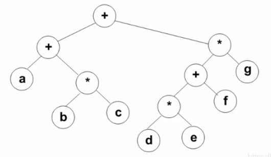
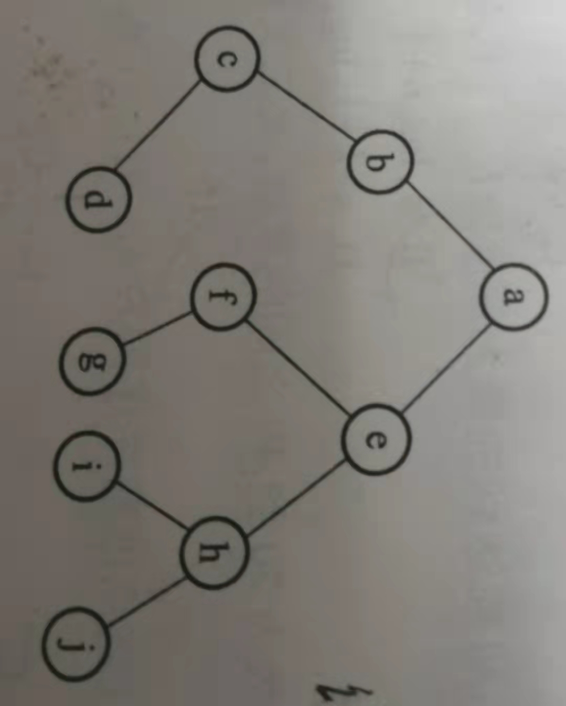
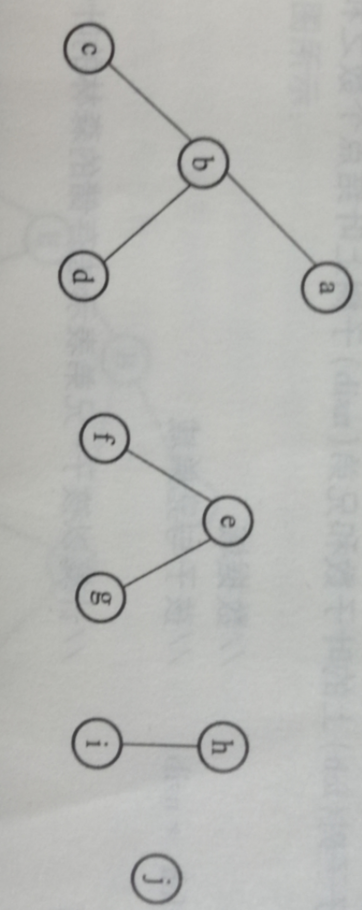
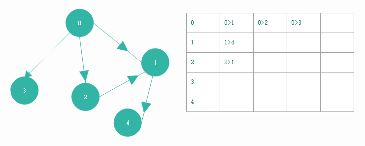
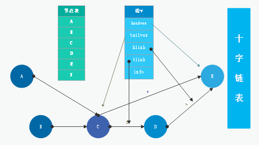
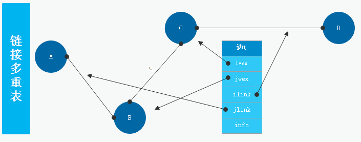
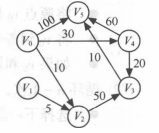
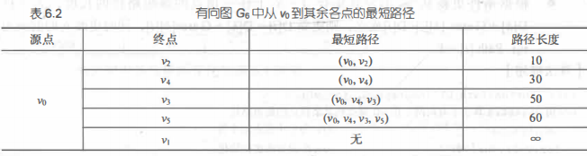
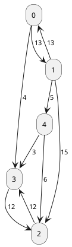

# 一、数据结构：

:::alert-info
**简述**：要解决一个现实问题，需要将其抽象，建模成数学模型，然后设计一个解此数学模型的算法，再用编程来实现，这个过程当中，不完全是数学公式的表达。数据结构是一门研究非数值计算的程序设计问题中，计算机的操作对象以及它们之间的关系和操作等的科学。1968 年国外开始设计。
:::

## a、概论

- 数据结构：数据的结构分为物理结构和逻辑结构。
  （1）是研讨数据的**逻辑结构和物理结构**，以及它们之间的相互关系，并对这种结构相应的**运算**，设计出相应的**算法**。
  （2）是带有结构的`数据元素`的集合。
  （3）研究内容包括：数据如何存储、数据如何组织、数据的运算如何实现。
- 数据类型：程序设计语音中的概念，如 c 中的整型、字符型。
- **散列表**：本质上是==顺序存储==方法的扩展。
- 抽象数据类型（ADT）：一个数学模型及定义在该模型上的一组操作，与计算机内部如何表示和实现无关。3 个组成部分分别为：数据对象、数据关系、基本操作。
- 数据的运算：对数据定义的一组操作，定义在逻辑结构上。
- 数据元素与数据项：数据元素包含数据项，如一个学生为数据元素，学生的姓名、性别、成绩为数据项
- **数据的物理结构**：循环队列、链表、顺序表、散列表、索引
  （1）是指数据在计算机内存储的实际形式。
  （2）数据结构中，数据的**基本单位**是`数据元素`，数据的**最小单位**是`数据项`
  （3）包括**数据元素**的表示和**数据元素间关系**的表示。
  （4）数据对象是指性质相同的数据元素的集合。
- 逻辑结构：可分为线性结构、非线性结构。也可分为线性结构、集合、树、图。（有序表是一种逻辑结构）
  （1）线性结构：栈、队列、字符串、线性表。
  （2）非线性结构：广义表、集合、树、图

**算法**：解决问题的步骤序列。（注意是问算法的特性，还是效率）

- 算法的 5 个特性：有穷性、确定性、可行性、有零个或多个输入、有一个或多个输出。**算法的可行性**是指指令不能有二义性。
- **评价算法质量**：正确性、易读性、强壮性、高效率。
- 算法复杂度：（算法的计算量大小）有时间复杂度和空间复杂度来衡量。
- **时间复杂度**：
  （1）取决于`问题的规模`，和`待处理数据的初态`。
  （2）有两种方法：**事后统计**(由于使用的编程语言不同，计算机硬件不同等会导致得到的时间不一样，所以往往不适应这种方法)、
  **事先预估**(一个算法由控制结构(顺序、分支、循环)和原操作(固有数据类型的操作(加、减、赋值、...))构成，算法时间取决于两者综合效果)。例如：

```c++
// 平方阶-->O(n^2)
for(int i=0;i<n;i++){
    for(int j=0;j<n;j++){c[i][j] = 0;}// 时间复杂度为O(n^2)
}
/*******注意,以下为O(n^2)*******/
for(i=n-1;i>1;i--){
  for(j=1;j<i;j++){}
}
// 对数阶-->O(log_2[n])
while(x<n){x = 2*x;}
// 对数阶-->O(nlog_2[n])
for(k<1;k<=n;k*=2){
    for(j=1;j<=n;j++){count++;}
}
// 根号阶-->o(\sqrt{n})
int s = 1;int i = 1;
while(s<n){s += ++i;}
//s的执行次数为：(n+3)(n-2) / 2
for (int i = 1; i < N - 1; i++) {
    for (int j = N; j >= i; j--) {
        System.out.print('>>', i, j, num);
        num += 1;//s
    }
}
```

（3）算法中基本重复执行的次数是问题规模 n 的某个函数 f(n)，算法时间度量记做：`T(n) = O(f(n))`。
（4）时间复杂度还可能呈现的形式有：O(1)、O(n)、O(n^2)、O(log(n))、O(2^n)#分别是常量阶、线性阶、平方阶、对数阶、指数阶。<b c=v>赋值、计算这些不用计算在时间复杂度之内</b>
如果遇到分支，可能某些基本操作就不需要执行，那么即使这个基本操作在循环中也是不计次数的，这种情况以算法最糟糕的情况来计算其时间复杂度。
即使有了这些方法，计算时间复杂度依然不是那么准确的，比如算法很复杂的情况，各编程语言中调用的内置函数的时间。
（5）相同规模 n 下复杂度 O(n)的算法，时间上总是优于复杂度`O(2^n)`的算法。
（6）同一算法语言实现的级别越高，效率越低。

- **用 f(n)表示的时间复杂度**：
  题中给出 f(n)=an+b，然后要求时间复杂度`O()`时，如下：
  （1）取出式子中随 n 增大而增大最快的项，然后把其==系数变为 1==；
  （2）若 f(n)是一个常数，则得到`O(1)`；
  > 如 1：f(n)=1000，则得到：O(1)
  > 如 2：$f(n)=2n^3+4n^2+7$,则最大项为$2n^3,得O(n^3)$
- **空间复杂度**：比较常用的有：O(1)、O(n)、O(n²)
（1）如果算法执行所需要的**临时空间**==不随变量n的大小而变化==，即此算法空间复杂度为一个常量 O(1)
（2）即输入==数据本身所占的空间，创建的临时变量==，不计入空间复杂度；
（3）如`int[] m = new int[n]`,这个数据占用的大小为n，因此空间复杂度为 O(n);==在循环中时再乘循环的次数==
## 一、线性表：

最常用，最简单的一种数据结构，一个线性表是 n 数据元素的有限序列，一个数据元素可以是一页书，可由若干数据项组成，这种情况下常把数据元素称为记录，含有大量记录的线性表又称文件。各编程语言中的列表型数据和线性表类似但两者定义有点区别。<i>(同一线性表中的元素有其相同特性，对线性表的数据不仅可以进行访问还可以插入、删除等。)</i>，==有限序列，可以为空==

**顺序存储**：是一种`随机存取`的存储结构。（所以逻辑顺序与物理顺序不一定一致）
（1）逻辑关系上相邻的两个元素在物理位置上也相邻，可随机存取表中任意元素，==存储单元地址连续==
（2）在插入和删除时需要对应位置后面所有的元素都需要向后或向前移动一位，这可能会需要移动大量元素，耗费很多时间。
（3）随机存取时的时间复杂度都是`O(1)`，插入删除时的时间复杂度都是`O(n)`.
（4）存取时根据==索引和起始点地址==，直接计算出目标地址，所以==存取时间复杂度O(1)==
（5）示例：某线性表最常用的操作是存取任一指定序号的元素，和在最后进行插入删除操作，则利用**顺序表**存储方式最节省时间。
（6）示例：一个链表常用的操作是在末尾插入和删除节点，则用**带头节点的双循环链表**最合适。==只在末尾进行插入/删除的话，顺序表存储也是比较合适的==
（7）**查找**：（未查找则到返回-1）
```c++
typedef struct Sqlist {
	int data[];
	int length;
}Sqlist;

int searchElem(Sqlist L,int e){
	int i;
	for(i=0;i>L.length;++i){
		if(e==L.data[i]) return i;
	}
	return -1; //未查找到的情况
}
```
（8）**插入**：在第i个位置插入（共n个元素）则元素移动次数为：`n-i+1`（注意这里描述的是==第i==个，不是指索引）
```c++
// 找到x的插入位置
int findElem(Sqlist L,int x){
	int i;
	for(i=0;i<L.length;++i){
		if(x<L.data[i]) return i; // 判断x在表中的大小顺序，来确定位置
	}
	return i; // 否则插到表尾
}
/******插入操作******/
void insertElem(Sqlist &L,int x){
	int p,i;
	p = findElem(L,x);
	// 从右向左，将元素逐个右移
	for(i=L.length-1;i>=p;--i){
		L.data[i+1]=L.data[i];
	}
	L.data[p] = x; // p处插入
	++(L.length);
} 
```
（9）删除：按查找的思路找到元素位置i，从i开始将其与右侧元素逐个替换，更新长度
**链式存储**：
（1）可以用一个任意的存储单元存储线性表数据元素，可连续也可不连续，为了表示出任意元素 ai 的后继节点，存储元素点时还会存储其后继元素点的位置：
（2）**存储密度**：数据元素所占的存储量和整个结点所占的存储量之比称作==存储密度==（链表至少还需要存储1个指针，所以链表存储密度<顺序表的）

| 存储地址 | 数据域 | 指针域 |
| :------: | :----: | :----: |
|    1     |   a    |   3    |
|    7     |   e    |   9    |
|    5     |   c    |   6    |
|    3     |   b    |   5    |
|    6     |   d    |   7    |
（3）插入：
```c++
/*===========================
    链表的表示，链表的基本操作
=============================*/
typedef struct LNode {
	int data;
	struct LNode* next;
}LNode,*LinkList;
// 初始化头结点。
bool Link_InitList(LinkList &L) {
	L = new LNode;
	L->next = NULL;
	return true;
}
// 插入：L为指针，i为插入位置，e为节点数据。
bool Link_Insert(LinkList& L, int i, int e) {
	LinkList p = L;
	int j = 0;
	// 将p指向第i-1个节点。
	while (p && (j < i - 1)) {
		p = p->next;
		++j;
	}
	if (!p || j > i - 1) return false;
	auto s = new LNode;			//新建一个节点。s变为指针
	s->data = e;
	s->next = p->next;		//指针更新
	p->next = s;			//插入
	return true;
}
```
（4）删除
```c++
// 取值：指针、位置、数据域
bool Link_Get(LinkList L, int i, int& e) {
	auto p = L->next;
	int j = 1;
	// 不断的指向下一个节点。
	while (p && j<i) {
		p = p->next;
		++j;
	}
	if (!p || j > i) return false;

	e = p->data;
	return true;
}
// 删除
int Link_delete(LinkList& L, int i) {
	auto p = L;
	int j = 0;
	while ((p->next) && (j<i-1)) {
		p = p->next;
		++j;
	}
	if (!(p->next) || (j > i - 1)) return false;
	auto q = p->next;
	p->next = q->next;
	delete q;
	return true;
}
```

（5）指针域指向的是其后继节点所在的存储地址。还需要一个头指正 H 来表示从哪一个开头，如 H=1，它们间的逻辑顺序就为：a →b →c →d →e →...。

（6）这种存储结构在逻辑相邻的元素其存储的物理位置上不紧邻，也称为链式映像。 插入和删除时只需要修改指正即可，不需要移动大量元素。这种链表也称为

（7）增加一个头节点目的是方便运算，统一插入、删除等运算。**线性链表**。

**循环链表** ：另一种形式的链式存储结构，特点是最后一个节点的指针域指向头指针，形成一个环，因此从任意位置出发都可以找到其它节点。
```c++
// 节点结构与单链表一样
typedef struct LNode {
	int data;
	struct LNode* next;
}LNode,*LinkList;
```

**双向链表**：单向链表中要从一个节点出发查找目标节点其时间复杂度在：O(1)~O(n-1)间，存储两个指针域，即后继节点位置和前驱节点位置
```c++
typedef struct {
	int data;
	struct DLNode *prior;// 指向它的前驱
	struct DLNode *next;
}DLNode;
```

**静态链表**：用数组来存储，指针==指向下一元素地址==（非数组索引）。==优点==：插入和删除方便，不需要移动较多元素。

## 二、栈和队列：

栈和队列也是线性表，其特殊性在于栈和队列的操作是线性表操作的子集，因此可以称为限定性的数据结构。
**栈**：是限定仅在表尾进行插入或删除操作的线性表，表尾端称为栈顶，表头端称为栈底。不含元素的空表称为空栈。所以栈又称为后进先出的线性表。
- n 个元素入栈，可得到：$\frac{(2n)!}{n!(n+1)!}$种==出栈顺序==
- **顺序栈**：将元素用顺序存储结构中。（初始指针：top=-1）
- 消除递归：一般会使用栈结构来代替递归操作（提升性能），==有时候循环也可以用来取消递归==
- **链栈**：将元素用链表形式存储，比起顺序栈来不会出现栈满情况。

```c++
/**********栈的链式表示************/
bool Inn_LinkInit(Inn_Link &S) {
	S = NULL;											//栈初始只要一个指针即可。
	return true;
}
// 入栈
bool Inn_LinkPush(Inn_Link &S,int e) {
	auto p = new Inn_Node;								//新的节点
	p->data = e;
	p->next = S;										//新的节点作为栈顶
	S = p;
	return true;
}
// 出栈
bool Inn_LinkPop(Inn_Link& S, int e) {
	if (S == NULL) return false;						//空栈情况！
	e = S->data;
	auto p = S;
	S = S->next;
	delete p;											//上面的赋值是为了这里释放？？
	return true;
}
int Inn_LinkGet(Inn_Link S) {
	if (S != NULL) return S->data;
	else return -999;
}
```

**共享栈**：
主要是为了提高内存利用率，减少内存溢出而设计；将两栈的==栈顶==（初始时）分别设在这片==连续==内存空间的两端;
- mind: ==两端是两个栈的栈底==，这样当==两个栈的栈顶在空间某点相遇时==才产生上溢
- 栈满判断：top1+1 == top2

**队列**：和栈相反，队列是一种先进先出的线性表，它只允许在表的一端进行插入，在表的另一端进行删除元素。只允许插入的一端是队尾。
**链队列**：和线性表一样，队列中也可存储指针域，不过还需要指定一个尾指针。

- 队满判断：由于是链式的，可以一直插入，所以不存在队满情况，除非其可用内存超出；
- 队空判断：`qu->rear==NULL || qu->front==NULL`（任何一个为空）；
- **入队**：`lqu->rear->next = p;lqu->rear = p;`（rear指向原队尾节点t，`rear->next=p等价于t->next=p`）
```c++
void enQueue(LiQue *lqu,int x){
	QNode *p;
	p = (QNode*)malloc(sizeof(QNode)); //分配指定空间的QNode
	p->data = x;
	p->next = NULL;
	// 队空的插入情况
	if(lqu->rear==NULL){lqu->front=lqu->rear=p;}
	else{
		// 不为空，队尾插入情况
		lqu->rear->next=p;
		lqu->rear=p;
	}
}
```
- **出队**: `p = lqu->front;lqu->front = p->data; free(p);`（p->data指向它的前1个节点）
```c++
int deQueue(LiQueue *lqu,int &x){
	QNode *p;
	if(lqu->rear==NULL) return 0; //队空情况
	else p=lqu->front;
	// 只有1个节点时（特殊处理）都置为空
	if(lqu->rear==lqu->front) lqu->front=lqu->rear = NULL;
	else lqu->front=lqu->front->next;

	x=p->data; // 返回其值，供外部使用
	free(p);
	return 1;
}
```

**双端队列**：在队列两端都允许插入和删除操作，或在这基础上自定义限制。能由输入受限的双端队列得到，但不能由输出受限的双端队列

**循环队列**：由于普通顺序队列（[0,1,2,3]）出队时队首指针-1，入队时队尾指针也-1（并非是 delete 元素 or extend 空间）最终会达到同时指向 max-1 处，导致无法再入队，因此使用循环队列，可以不改变顺序队列操作逻辑上又解决此问题；
- **mind**：循环队列只用==顺序存储==结构实现
- 队空判断：`qu.rear==qu.front`；两个指针指向同处；
- 队满判断：`(qu.rear+1)%maxSize==qu.front`，==a%b,若 `a<b` 得到的是 a==，所以 qu.rear=6，qu.front=7 得到的就是一种队满情况。
- 若有1个存储单元不用，则队满判断：`qu.rear+1=qu.front`
- ==元素个数计算==：(尾指针-头指针+表长) % 表长 = `(qu.rear-qu.front + n) % n`;
```c++
/**********队列操作(这里是顺序存储的队列)**********/
// 初始化；队首队尾指针重合指向0
void initQueue(seQueue &qu){qu.front=qu.rear=0;}
// 队空判断
int isQueueEmpty(seQueue &qu){
    if(qu.front==qu.rear) return 1;
    else return 0;
}
// 进队；判断队满，移动队尾指针，放入数据即可
int enQueue(seQueue &qu,int x){
    if((qu.rear+1)%maxSize==qu.front) return 1;
    qu.rear = (qu.rear+1) % maxSize;// 移动队尾指针
    qu.data[qu.rear] = x;
    return 0;
}
// 出队；判断队空，移动队首指针，放入数据
int deQueue(seQueue &qu,int x){
    if(qu.front==qu.rear) return 1;
    qu.front = (qu.front+1) % maxSize;// 移动队首指针
    qu.data[qu.front] = x;
    return 0;
}
```

部分使用场景：

- 判别表达式的左右括号（[]）是否成对出现，用`栈结构`最好。递归过程或函数调用时，处理其参数要用多维数组处理。
- 将递归算法转变成对应非递归算法时，需要使用`栈`，来保存中间结果。
- 普通队列的存储更适合使用`单向循环链表`。
- 树的前、中、后序遍历使用**栈**更容易实现。<b c=b>层次遍历使用队列更容易实现。</b>

## 三、串&数组&广义表

**字符串**：一般简称为串，在汇编和语言的编译程序中，源程序和目标程序都是字符串数据。由 0 个或多个字符组成的有限序列就称为串，一般记为 s='a1a2...an'。零个字符的串称为**空串**。串中任意连续个字符称为该串的**子串**，包含子串的串相应地称为**主串**。包含一个或多个空格的串称为**空格串**。子串起始字符在主串中出现的位置即为该子串的位置。
**串的存储**：也像线性表存储那样，串可以用顺序存储和链式存储，链式存储时，一些子串可以是多个字符。

**字符串的简单实现**：c/c++中为直接提供字符串类型，`<string>`头文件有实现较为好用的字符串；

```c++
// 结构体来存储字符串信息
typedef struct {
	char* ch;
	int length;
} Str;
// 赋值函数
int strassign(Str &str,char* ch){
	// ch的指针
	char* c = ch;
	int len = 0;
	// *c是取其值
	while (*c) {
		++len;
		// 地址位+1
		++c;
	}
	if (len == 0) {
		str.ch = NULL;str.length = 0;
		return 1;
	}
	else {
		// malloc （memory allocation动态内存分配）申请一块连续指定大小的内存区域，以void形式返回分配的地址;
		str.ch = (char*)malloc(sizeof(char) * (len + 1));
		// 申请空间失败时会返回NULL指针
		if (str.ch == NULL) return 0;
		else {
			c = ch;
			for (int i = 0;i < len; ++i, ++c) {
				// 每位字符存到字符地址数组中
				str.ch[i] = *c;
			}
			str.length = len;
			return 1;
		}
	}
}
char s2[] = "fdsfdsf";Str s3;
strassign(s3, s2);
std::cout << s3.length;
```

**字符串操作**：

```c++
//************获取串长度************
str.length;
//************比较两串是否相等*******
int strcompare(Str s1,Str s2){
    for(int i=0;i<s1.length && i<s2.length;i++){
        if(s1.ch[i]!=s2.ch[i]) return s1.ch[i] - s2.ch[i];
    }
    return s1.length - s2.length;
}
//************字符串拼接（建立一个新的str，将两个串的内容否放进去即可）*********************
//**********求子串（给定的索引位置和长度，去循环拿取即可）************
/**********模式匹配（在主串中找寻是否存在目标子串）***********
思想：循环主串，找到与子串第1个字母相同的则继续比对下1个字母，否则再从头循环
*/
```

**数组**：如果有一维中的一个元素是一个数据结构的话，那么其它元素也是相同的数据结构，且长度相同。
数组一旦被定义，它的维数和维界就不再改变，除了初始化和销毁之外，数组只有存取元素和修改元素值的操作。所以一般采用**顺序存储**的方式。二元数组称之矩阵；
- **写法表示**：`A[0..3,2..5]`表示1个4x4的二维数组（..代表1个维度）`B[0..4,-1..-3,5..7]`则是1个3维(5x3x3)，共45个元素。
- 数组的常见操作：查找和修改
- 三角矩阵压缩存储：一半三角元素相同的都可使用此法，按行依次存储第2半三角元素，在存入第1半三角元素的值（1个）
- **稀疏矩阵压缩存储**：方法一般有==3元组和十字链表==
	**三元组压缩法**：表示出数组中非 0 位置的值：`((1,5,1),(3,2,-1),(4,5,-2),...)`序号从 1 开始，前两个值为行号和列号，第 3 个值为存储值，**顺序存储表示**时将这些当行写在表里，然后最上面加上`行数|列数|数值个数`。
	三元组压缩后称为一个3元组结构，不再是索引对应数值的关系，所以==压缩后失去随机存储功能==
```c++
// **********建立3元组***********
void createtrimat(float A[][10],int m,int n,float B[][3]){
 	int k = 1;
    // 第0行存储矩阵信息
	B[0][1] = m;B[0][2] = n;
	for (int i = 0; i < m;++i) {
		for (int j = 0; j < n;++j) {
			// 不为0的存储进去即可
			if(A[i][j]!=0){
				B[k][0] = A[i][j];
				B[k][1] = i;B[k][2] = j;++k;
			}
		}
		B[0][0] = k-1;
	}
}
```
- **十字链表压缩法**：每个非0元素用1个节点表示（结构：`行标|列标|节点值|指针A|指针B`）A指向所在行的下一个元素,B指向列的下一个元素
	将所有行==第1个非0节点==存储到一个数组（rhead），将所有列的==第1个非0节点==存储到另一个数组（chead）中

- 行优先存储：先存储第 1 行，再存储第 2 行；因此求下标索引时以每行数量为基数计算。
- 列优先存储：先存储第 1 列，再存储第 2 列；==注意行例下标不一定从 0 开始，据情况而定==

  例：二维数组`A[6][10]`，每个元素占 4 个存储单元，若按优先顺序存放的数组元素`A[3][5]`的存储地址是 1000，求 A[0][0]存储地址；

  解：`A[3][5]`之前还有 3\*10+5=35 个元素，所占存储单元为 35x4=140，所以`A[0][0]`存储地址位 860
- ==三维数组地址计算公式==：`Loc(i,j,k)=Loc(0,0,0) + (i*m*k + j*k + k)*L`（L是每个元素所占存储字长，Loc(0,0,0)是第1个元素所在地址）
- 矩阵操作：

  （1）矩阵转置：如果是用`int A[2][3]`形式存放的的，转置必须重新建 1 个空数组存储（因为转置后行列数可能会发生变化）；如果是存到一维数组中，则按基数计算，交换就行；

  （2）矩阵相加：对应位置相加即可；

**广义表**：线性表的推广，也有人称其为列表，与数组不同的是，广义表中的==数据元素可以具有不同的结构==(如`(a,1,[0])`)，因此难以用顺序存储结构表示；
- 通常采用链式存储结构。所以广义表比线性表更灵活。程序语言设计中的列表可以说是一个广义表的设计。
- 广义表的深度：表展开后所含==括号的层数==
- 一个广义表的表尾总是一个==广义表==
**广义表的存储**：由于广义表的特殊结构需要两个存储结构，一个存储所有广义表数据，另一个存储各元素对应的数据类型，指针。数据存储：无论是原子数据还是列表数据，其中每个元素都被分开一个个存到物理地址中，一个列表中的数据连续的存储到地址中。指针域存储：一个 tag 指针表示该元素数据类型，一个头指针，一个尾指针(分别指向该列表的表头和表尾)，原点数据只需一个。

## 四、ADT

ADT：**抽象数据对象集**，只关心数据对象集、关系集、操作集的描述，并不关注实现；相当于一个项目的设计方案；也是论文等项目文档常用描述方式

例：设计一个图书馆 ADT；（无标准答案）

```
ADT书
{
	数据集对象：
		书名;
		书号;
		作者;
}
ADT书架
{
	数据集对象：
		图书馆名;
		书架 = {书架0,书架1,..,书架n};
	数据关系集:
		书架在图书馆中的排列方式={<书架0,书架1>,<书架1,书架2>,..,<书架n-1,书架n>};
	操作集:
		根据书架号查找书架;
		根据书号查找书;
		根据作者名查找书;
		添加书;
		删除书;
		借书;
		还书;
}
```

ADT 设计注意：关系集中的四种关系：没关系、顺序关系、树形关系、图关系；

## 五、树：

:::alert-info
堆、栈、队列等数据结构在查找时非常费时间，而用树数据结构可以提高查询效率，且现实中很多关系符合树的结构，树的第一层只有一个节点即根节点(没有父节点的节点)，其余为子节点，每个节点可有多个子节点和一个直接父节点。一种非线性的数据结构，树和二叉树最为常用。第一个节点为根节点，子节点数不为 0 的节点称为分支节点后非终端节点，字节点数为 0 的节点称为叶子节点或终端节点，节点的分支数称为度，字节点称为孩子节点，该节点称为其双亲。
:::

### a、术语

- 无序树：树中任意节点的子结点之间没有顺序关系,这种树称为无序树,也称为自由树;
- 有序树：树中任意节点的子结点之间有顺序关系，这种树称为有序树；
- **度**：每个节点拥有的子节点称为该节点的度，**树的度**指该树内节点度数最大的。可以发现一个有 N 个节点的树，其所有节点的**度数和为 N-1**。
- 节点的深度：根节点到该节点路径上的节点数；
- 节点的高度：该节点往下到所有叶子节点（该节点所属的）路径中，最长那条的节点数；
- 树的宽度：节点最多的那层，所含节点的数量；
- **相关问题**：

  - **中序序列个数**：中序序列为 1,2,..,n 的二叉树，其二叉树情况可能有$\frac{1}{n+1}\frac{2n!}{n!*n!}$种。
  - **m 叉树叶子节点数公式**：$S=1+\sum_{i=1}^{m}(i-1)n_i,\space n_i$是度 i 的节点数。m 是树的度
    例：一颗度为 4 点树 T 中，有 20 个度为 4 的节点，10 个度为 1 的节点，1 个度为 2 的节点，10 个度为 3 的节点，求叶子节点数？
    > 解析：`s=1+(1-1)*10+(2-1)*1+(3-1)*10+(4-1)*20=1+0+1+20+60=82`
  - 检测完全二叉树的算法：<b c=v>使用堆结构（利用堆特性）来存储遍历的树节点，若是完全二叉树最后必会有连续的空缺(>=0 个)。</b>
  - 若有不连续节点，或总节点数不在$(2^{n-1}-1,2^n - 1)$内则不是

### b、二叉树

与树一样具有递归性质。每个节点最多有两个子节点，节点有左右之分。

- 二叉树可以为空，但树不能为空。
- 第 k 层最多有`2^(k-1)`个节点，为 k 层的树最多有`2^k-1`个节点。 对于 3 叉，4 叉树等，第 k 层节点数公式，只要将 2 替换为对应数值即可。
- **满 k 叉树情况**：
     （1）将满 k 叉树节点分为叶子节点 a，分支节点（非叶子节点，包含根节点）b。
     （2）有节点总数`n=a+b=bk+1`
- 链表存储二叉树时，n 个节点的二叉树有 2n 个指针域(二叉链表存储)，==n-1 个空指针==。（**不要算上头指针**）
- **满二叉树**：除最后一层无子节点外其余层节点均有两个子节点；
- **完全二叉树**：二叉树的最后一层可以不完整但其余层的节点达到最大值且最后一层的节点全部集中在左侧。
- ==只有度为0和度为2的二叉树==: 叶子节点数n，则其**总结点数**=2n-1
### c、树的存储

- **顺序存储**：将各节点编号，依次从上到下，从左到右的存储节点即可。最坏的存储情况是：k 层只有 k 个节点，却需要一个`2^k-1`长的一维数组，因为遇到空的节点要用 0 或其它占位表示。
- **用链式存储**：存储每个节点时再存储左右指针域即可，这称为二叉链表，如果再多存一个父节点的指针域则称为三叉链表 。
- 存储方法上分为以下几种：

1. 双亲表示法：所有节点存储在一个连续空间，每个节点有数据域，还有一个**指向父节点的指针域**。优点：易于实现，容易求树的根。
2. 孩子表示法：使用多重链表，每个节点有多个指针，每个指针指向它的 1 个孩子节点。
3. 孩子兄弟法：每个节点有两个指针域，一个指向自己的第一个孩子，另一个指向下一个兄弟节点。<b c=v>优点：便于将一般的树转换为二叉树处理。</b>

```c++
// 树初始化
bool Tree_Init(cLink &B) {
	B = new cNode;
	B->lchild = NULL;
	B->rchild = NULL;
	return true;
}
/*递归创建树：将A中的值保存到每个节点。cLink B = new cNode。i为A的索引。*/
cLink Tree_Create() {
	int x;
	cLink bt;
	cout << "please input a number:";
	scanf_s("%d", &x);	//数据输入。
	if (x == 0) bt = NULL;
	else if (x > 0) {
		// malloc() 分配指定长度字节的内存空间。
		//bt = (cNode*)malloc(sizeof(cNode));
		bt = new cNode;
		bt->data = x;
		bt->lchild = Tree_Create();
		bt->rchild = Tree_Create();
	}
	else {
		// 退出输入
		system("exit");
	}
	return (bt);
}
// 计算二叉树深度
int Tree_Depth(cLink T) {
	if (T == NULL) return 0;
	else {
		// 到最后叶节点才会开始返回0，然后逐级返回+1。
		int m = Tree_Depth(T->lchild);
		int n = Tree_Depth(T->rchild);
		if (m > n) return (m + 1);
		else return (n + 1);
	}
}
```

### d、树的遍历

前，中，后属于深度优先遍历，层次遍历属于广度优先遍历
非二叉树的遍历: 只有前序遍历和后序遍历。
- 树的遍历：树的先序遍历对应二叉树的先序遍历，树的后序遍历对应二叉树的中序遍历（==树转为二叉树后的对应情况==）
- **森林的遍历**：

- 先序遍历：先前序遍历第 1 颗树，再按顺序先序遍历其它树；
- 后序遍历：先后序遍历最后 1 颗树，再从第 1 颗开始后序遍历其它树

- **二叉树的遍历**：有以下 3 种

1.  前序遍历：先排中间节点再排左子树节点最后排右子树节点；中 | 左 | 右
2.  中序遍历：先排左子树的节点再排中间节点然后排右子树节点；左 | 中 | 右
3.  后序遍历：先排左子树节点再排右子树节点最后排中间节点；左 | 右 | 中
4.  层次遍历：从上到下，从左到右读取节点；

mind：前中后序遍历得到的叶子节点的“==先后顺序==”总**是一样的**
```c++
/*【前序遍历实现】按照顺序递归访问即可*/
void preAccess(BTNode p){
    visit(p);
    if(p->lchild){visit(p->lchild);}
    if(p->rchild){visit(p->rchild);}
}
/*【层次遍历实现】：建立1个循环队列来进行辅助读取，第1个节点入队，访问该节点，其左孩子插入到队尾，右孩子插入到队尾，
循环读取，第2个索引节点，依次，直到头尾指针相同时结束；*/
void levelAccess(BTNode p){
	int front, rear;
	// 定义1个循环队列
	BTNode* que[maxSize];
	// 队列头，尾指针
	front = rear = 0;
	BTNode* q;

	if(p!=NULL){
		rear = (rear + 1) % maxSize;
		que[rear] = p;
		while (front != rear) {
			front = (front + 1) % maxSize;
			q = que[front];
			/*===================
				TODO:访问队头节点
				visit(q);
			=====================*/
			if(q->lchild!=NULL){
				rear = (rear + 1) % maxSize;
				que[rear] = q->lchild;
			}
			if (q->rchild != NULL) {
				rear = (rear + 1) % maxSize;
				que[rear] = q->rchild;
			}
		}
	}
}
```

**自定义栈结构遍历二叉树**：直接使用递归遍历其实是使用系统提供的栈实现的，由于系统栈存储的信息较多，往往不如自定义的栈遍历速度快

```c++
// *********前序遍历非递归实现***********
void preorderNonrecursion(BTNode *bt){
	if (bt!=NULL) {
		BTNode* Stack[maxSize];
		int top = -1;
		BTNode* p;
		Stack[++top] = bt;    // 头节点先入栈
		while(top!=-1){
			p = Stack[top--];	// 栈顶读取节点（出栈）
			// vision(p); // 这里可对节点p操作
			// 这里是做先序遍历，所以右节点先入栈，左节点再入栈
			if (p->rchild!=NULL) {
				Stack[++top] = p->rchild;
			}
			if (p->lchild!=NULL) {
				Stack[++top] = p->lchild;
			}
		}
	}
}
// *******中序遍历非递归方法实现**********
void middelAccess(BTNode *bt) {
	if (bt != NULL) {
		BTNode* Stack[maxSize];
		int top = -1; BTNode* p; p = bt;

		while(top!=-1 || p!=NULL){
			// 左节点一直存在的情况则进行入栈操作
			while (p!=NULL) {
				Stack[++top] = p;
				p = p->lchild;
			}
			// 最左侧节点已完成入栈，开始出栈操作
			if (top!=-1) {
				p = Stack[top--];
				// vision(p); //TODO:节点操作代码
				p = p->rchild;	// 赋予右子节点，进行该分支的入栈出栈操作
			}
		}
	}
}
// *********后序遍历非递归实现（稍难）**********
void endAccess(BTNode *bt){
	if (bt != NULL) {
		BTNode* Stack1[maxSize];
		BTNode* Stack2[maxSize];
		int top1 = -1; int top2 = -1;
		BTNode* p = NULL; Stack1[++top1] = bt;
		// 第1个循环先将所有右节点存入栈2，再左节点入栈
		while (top1!=-1) {
			//Stack1出栈的放入Stack2
			p = Stack1[top1--];
			Stack2[++top2] = p;
			// 左节点入栈1，右节点入栈2
			if(p->lchild != NULL) Stack1[++top1] = p->lchild;
			if(p->rchild != NULL) Stack2[++top2] = p->rchild;
		}
		// 对Stack2出栈顺序即为后序遍历的顺序
		while(top2!=-1){
			p = Stack2[--top2];
			// vision(p);
		}
	}
}
```

**从遍历序列恢复二叉树**：知道其中两种遍历的序列就可以反推出树的结构

```c++
/****先序，中序还原二叉树****
@pre 先序遍历列表
@in 中序遍历列表
*/
BTNode *CreateBT(char pre[],char in[],int L1,int R1,int L2,int R2){
	BTNode* s;
	int i;
	// 无元素情况
	if (L1 > R1) return NULL;
	// 申请1个节点空间
	s = (BTNode*)malloc(sizeof(BTNode));
	s->lchild = s->rchild = NULL;
	// 在中序中找中分节点
	for (i = L2; i <= R2;++i) {
		if (in[i] == pre[L1]) break;
	}
	// 找到了第1个节点
	s->data = in[i];
	// 两分范围，递归创建
	s->lchild = CreateBT(pre, in, L1 + 1, L1 + i - L2, L2, i - 1);
	s->rchild = CreateBT(pre, in, L1 + i - L2 + 1, R1, i + 1, R2);
	return s;
}
```

### e、线索二叉树

将空指针利用起来，使得对树的遍历不再借助栈空间，**可直接对树向进行链表遍历一般快速**；
缺点：插入和删除不方便。（==只用链式存储实现==）

- 线索二叉树基本结构：`| lchild | ltag | data | rtag | rchild |`
- 字段含义 1：`ltag=0`表示 lchild 为指针，指向左孩子；`ltag=1`表示 lchild 为线索，指向节点的直接**前驱**；
- 字段含义 2：`rtag=0`表示 rchild 为指针，指向右孩子；`rtag=1`表示 rchild 为线索，指向节点的直接**后继**；
- 线索化：对普通二叉树线索化，转为线索二叉树；
  （1）遍历的方法不同，得到的线索二叉树其**叶节点指向**也会不一样，**在叶节点前面的就是其前驱，在叶节点后面的也就做为其后继，没有则为空**；
  （2）所以分为前序线索二叉树、中序线索二叉树，后序线索二叉树，也就只**方便做对应的方法**遍历
- n个节点的线索2叉树上的==线索数==为n+1
```c++
// 线索二叉树节点定义
typedef struct TBTNode {
	char data;
	int ltag, rtag;
	struct TBTNode* lchild;
	struct TBTNode* rchild;
} TBTNode;
/*线索化，中序遍历二叉树，普通二叉树转为线索二叉树*/
void inThread(TBTNode *p,TBTNode *&pre){
	if(p!=NULL){
		inThread(p->lchild, pre);
		// 当前节点左子树为空时进行线索化
		if(p->lchild==NULL){
			p->lchild = pre;
			p->ltag = 1;
		}
		// 上一节点的右子树进行线索化
		if(pre!=NULL && pre->rchild==NULL){
			pre->rchild = p;
			pre->rtag = 1;
		}
		// 右侧递归
		pre = p;
		p = p->rchild;
		inThread(p,pre);
	}
}
// 第1个左节点
TBTNode* First(TBTNode* p){
	while(p->ltag==0){
		// 有左节点情况
		p = p->lchild;
	}
	return p;
}

TBTNode *Next(TBTNode *p){
	// 有右子树的情况
	if(p->rtag==0){
		// 返回右子树上的第一个左节点
		return First(p->rchild);
	}
	else {
		// 否则返回其后继
		return p->rchild;
	}
}
// ******对中序线索二叉树进行中序遍历*********
void accessLineTree(TBTNode* root){
	for (TBTNode* p = First(root); p != NULL;p=Next(p)) {
		// visit(p);
	}
}
```

### f、表达式

1. **前缀表达式**：注意乘除优先
   存入：从右至左扫描原式，遇到数字时，将数字压入栈中，遇到运算符时，先将与该运算符相关的子式存入栈中，再将该运算符存入。 如：`(a+b+c*d)/e` 变为 `/++ab*cde`
   运算：从右至左扫描前缀表达式，建一个空栈；数值压入栈，遇到运算符时，弹出栈顶的两个元素，若都是数值，则用运算符（栈顶元素 op 次顶元素）对它们做相应运算，并将结果入栈。
2. **中缀表达式**：与算式顺序一样，便于人类理解，但对计算机不友好。
3. **后缀表达式**：注意乘除优先
   存入：从左至右扫描原表达式，按符号优先级，与符号相关的数值先压入栈中，再压入其符号；如：`(a+b+c*d)/e` 变为 `abcd*++e/`
   运算：从左至右扫描存入好的后缀表达式，建一个空栈；数值压入栈，遇到运算符时，弹出栈顶的两个数，用运算符（次顶元素 op 栈顶元素）对它们做相应的计算，并将结果入栈；重复上述过程；

- **二元表达式树的存储**：<b c=v>叶节点都是数值，非叶节点都是字符</b>。
  （1）一般每个节点用`{left(左指针),val(数值),data(符号),right(右指针)}`格式存储。
  （2）先序遍历得到前缀表达式，中序遍历得到中序表达式，后序遍历得到后缀表达式。如下图，表达式为：`a+b*c + (d*e +f)*g`
  

- 计算树中存储的二元表达式：不在需要借助栈结构
- **给出中，后缀表达式顺序，求前缀**：根据中，后顺序还原为二叉树结构，再先序遍历即可
```c++
int calc(cNode p){
    // left:指向左节点；right：指向右节点；val:子表达式式值；data:子表达式中的字符
    int lv,rv;
    if(C){
        if(!p->left && !p->right) return p->val;              //左右节点为空的情况。开始返回
        else{
            lv = calc(p->left);
            rv = calc(p->right);                              //递归计算左右
            switch(p->data){
                case "+":p->val = lv + rv;break;              //左节点的值+右节点的值
                case "-":p->val = lv - rv;break;
                case "*":p->val = lv * rv;break;
                case "/":p->val = lv / rv;break;
            }
            return p->val;
        }
    }
}
```

### g、森林

多颗树放一起就是森林。下图为森林，树的互转。<b c=b>森林 F 中叶子节点个数等于树 T 中左孩子指针为空的节点个数</b>

- **树转二叉树**：将每个节点的右侧的节点链接都断开（左侧第 1 个不断），然后调整为二叉树形态
- **二叉树转树**：为左子节点的节点 A，其右子节点，右子节点的右子节点，..都当做同一层的节点，它们的父节点都是 A 的父节点，
  都与 A 的父节点链接起来，然后断掉这几个同层节点间的连接；
- **森林转二叉树**：森林 F={T1,T2,..Tn}，(T1,..中非二叉树的先用上面的方法转为二叉树)，转为二叉树 B。（结果二叉树的，左子树和根节点都为都来自第1颗树）
  **方法**：<b c=gn>每个 T 都用单链表表示（右节点部分连接到左兄弟节点上）</b>
  （1）若 F 为空，则 B 为空。
  （2）从 F 中取走 T1，T1 的根节点作为 B 的根节点，其余都在 B 的左节点上。
  （3）从 F 中取走 T2，作为 B 的右节点部分。
  （4）取走 T3，其根节点连接到 T2 的根节点右侧。依次递增执行 4。
- 二叉树转森林：<b c=b>只有右节点的，都连接到其爷爷节点上。</b>
  （1）若 B 为空，则 F 为空。
  （2）若 B 不为空，则 B 的根节点及其连接的左子树作为森林的第一颗树。B 右节点部分中，有右子树的都分开作为森林的一颗树。


【二叉查找树和平衡二叉树到七：查找中查看】
### h、哈夫曼树

mind1：哈夫曼树==并非一定是二叉树==，也可能是 n 叉树，每个节点有权重（没有则默认为 1），路没有权重。哈夫曼树是使带权路径长总和最小的树。

**术语**：
- 路径：1 个节点到另一个节点的分支构成的路线
- 路径长度：路径上的分支数目
- 带权路径长度：（WPL）节点权重 x 根节点到该点的最线路的路径数（==注意只计算最初的节点权值x路径，之和，后构建出来的节点不算在内==）
  （1）(如：根节点到叶节点 a 经过两条路径，a 点权重为 8，则该条路径长度`WPL=8*2`)。
  （2）整颗树的 WPL=各叶节点权重 x 各叶节点对应路径数 之和。（因为哈弗曼树是构建出来的非叶节点部分都是组合出来的，非自带节点）
- 树的路径长度：根节点到每个节点的路径之和
- 树的带权路径长度：所有**叶子节点**的带权路径长度之和

**构建二叉哈夫曼树**：
1. n 颗二叉树的集合：F={T1,T2,...}，其左右子树均为空(初始时全部是节点状态)，
2. 选最小的两个权值节点构建二叉树(作为左右节点，小在左，大在右)，两节点权值之和为它们的根节点的权值。(==即使F中已经存在1个相同权值的节点==)
3. 将这个==新构建好的二叉树放到 F 中==，删除 F 中之前用于构建二叉树的两个节点(二叉树)，重复步骤 a（==注意生成的新节点放到F中，每次选最小两个==）。
4. 如{2,5,7,9,13}构建成如下：
   [哈夫曼树构建](_v_images/hfm.PNG)

**构建n叉哈夫曼树**：
- n叉的哈夫曼，除了根节点层，==其余层都要有n个节点==；所以所给节点不一定能构成n叉哈夫曼；
- ==不足的节点数用0补替==，然后从头开始构建n叉哈夫曼；

**前缀编码**：编码方案中，若任一个编码都不是其它编码的前缀，则称为前缀编码。
**哈夫曼编码**：对一颗具有 n 个叶子的哈夫曼树，对树中每个左分支赋予 0，右分支赋予 1，从根节点到每个叶子路径上，各分支的赋值分别构成一个二进制串，该二进制串就称为哈夫曼编码。（哈夫曼编码不会出现共同前缀的情况）

- 性质1：哈夫曼编码时前缀编码，且是最优前缀编码。
- 性质2：度为m的哈夫曼树中（m个节点生成1个父节点），**叶子节点数n**，则非叶子节点数为`(n-1)/(m-1)`
- 理解：例如，在英文中，e 的出现机率最高，而 z 的出现概率则最低。当利用哈夫曼编码对一篇英文进行压缩时，e 极有可能用一个比特来表示，而 z 则可能花去 25 个比特。
  用普通的表示方法时，每个英文字母均占用一个字节，即 8 个比特。二者相比，e 使用了一般编码的 1/8 的长度，z 则使用了 3 倍多。
  倘若我们能实现对于英文中各个字母出现概率的较准确的估算，就可以大幅度提高无损压缩的比例。
  **示例**：保存文本`ACBDCBBAO`的时候每个字符占 1 个字节，所以一般会转为其对应的二进制编码 0001 形式的，这样每个字符只占四位或更短，为了最小化每个字符的前缀编码(能唯一识别每个字符的编码)，可以使用赫夫曼树，先计算各字母频率，同乘 10 或 100 转为整数作为它们的节点权重，建立最优二叉树，左分支为 0，右分支为 1，然后从根节点查找各个节点的路径表示就是各个字母的最小前缀编码。在解码时按照最短前缀到最长前缀从编码中一一扫描匹配。

### j、树的常用基本方法

- 递归：函数通过调用自身，达到一直循环处理数据的方法。
- 迭代：通过 for、while 循环，将上一次循环的结果，作为下一次循环的依赖。
- **分治法**：分治法可以通俗的解释为：把一片领土分解，分解为若干块小部分，然后一块块地占领征服，被分解的可以是不同的政治派别或是其他什么，然后让他们彼此异化。
  分治法的精髓：分--将问题分解为规模更小的子问题；治--将这些规模更小的子问题逐个击破；合--将已解决的子问题合并，最终得出“母”问题的解；
- **回溯法**：一种优先搜索法，又称为试探法，按优先条件向前搜索，但当探索到某一步时，发现原先选择并不优或达不到目标，就退回一步重新选择，这种走不通就退回再走的技术为回溯法，而满足回溯条件的某个状态的点称为“回溯点”。

**回溯与树的遍历**：回溯法也是设计递归过程的一种重要方法，例如：求集合 A={1,2,3}的所有子集，从根节点(空集)每次向前探索，左子树选择一个节点 a，而右子树放弃该节点，依次这样进行递归。

**红黑树**：一种自平衡二叉查找树，是在计算机科学中用到的一种数据结构，典型的用途是实现关联数组。在 1972 年由 Rudolf Bayer 发明的，当时被称为平衡二叉 B 树（symmetric binary B-trees）。后来，在 1978 年被 Leo J. Guibas 和 Robert Sedgewick 修改为如今的“红黑树”。
红黑树是一种特化的 AVL 树（平衡二叉树），都是在进行插入和删除操作时通过特定操作保持二叉查找树的平衡，从而获得较高的查找性能。 它虽然是复杂的，但它的最坏情况运行时间也是非常良好的，并且在实践中是高效的： 它可以在 O(log n)时间内做查找，插入和删除，这里的 n 是树中元素的数目。

- 红黑性质：节点是红色或者黑色、 根节点是黑色、每个叶子的节点都是黑色的空节点（NULL）、每个红色节点的两个子节点都是黑色的。从任意节点到其每个叶子的所有路径都包含相同的黑色节点。按这些性质组合起来几乎就是每条路径上红黑节点相间的状态。
- 插入与删除：在插入一个新的节点后可能会破坏上面红黑树的几条规则，比如一个值恰好插入到倒数第二层的一个节点(倒数第一层都是空节点黑色)，这个倒数第二层节点是红色，所以把新插入的这个节点着为红色或黑色都不符合规则。
- 调整：从下往上尝试改变每个点颜色，若到根节点颜色更改都失败则需要尝试旋转节点。
  [红黑树操作详解学习地址。](https://baijiahao.baidu.com/s?id=1641940303518144126&wfr=spider&for=pc)

**森林转为树**：森林中将各颗树的各节点保持只有一个子树（各节点的右子树放到其它节点右子树上）。然后拼接为一棵树。

<b c=v>最优二叉树编码文本实操。红黑树为什么引入红黑性质！</b>

## 六、图：

:::alert-success
**简介**：图是一种较线性表和树更为复杂的数据结构，图中任意两个数据元素之间都可能有关系，也可能图中的某个点和其它点都没有关系，图是一种数据结构，加上一组基本操作就构成了抽象数据类型。图的使用非常广。
:::

### a、概念

- 边/顶点/度：图中数据元素通常称作顶点，v,w 是两个顶点，若`<v,w>∈VR`(两顶点之间的关系集和)，v 为弧尾巴，w 为弧头，此时的图称为有向图。
  若`<v,w>∈VR`必有<w,v>∈VR 则此时的图为无向图。以节点 v 为弧头的弧的数目称为节点 v 的**入度**，以 v 为弧尾的弧的数目称为 v 的**出度**。

- 图的最大边数：n 个顶点的图的最大边数：$C ^2_n$#一个排列组合问题而已。
- **无向完全图**：用 n 表示图中节点，e 表示图中边或弧的数目，对于无向图，`e∈(0,n*(n-1) / 2)`,有`n*(n-1) / 2`条边的称为**无向完全图**。
- **有向完全图**：对于有向图，其`e∈(0,n*(n-1))`,而有`n*(n-1)`条边的是**有向完全图**。
- 稠密/稀疏：有很少的边的称为**稀疏图**，反之称为**稠密图**。与图的边或弧相关的数叫**权**，带权的图称为**网**。
- 生成树：按照图的顶点的连接，转化为树结构，一般去掉一条边就是一种生成树情况。
- **最小生成树**：根据图的结构来构建最小生成树，解决最低代价**构建连通图**问题。<b c=v>各节点的权重和最小的树称为最小生成树。</b>
- **环**：从点 v 到 v'经过一系列点`E={v,v0,...,v'}`则称该序列点为**路径**。
  （1）序列中点不重复出现的路径称为**简单路径**。
  （2）第一个节点和最后一个节点相同称为回路或**环**。
  （3）其它顶点不重复出现的回路为**简单回路**。
- **连通图**：若从顶点i到顶点j有路径相连（当然从j到i也一定有路径），则称i和j是连通的，如果 G 是有向图，那么连接i和j的路径中所有的边都必须同向。如果图中==任意两点都是连通的，那么图被称作连通图==（不必直接相连）
  （1）如果该无向图中任意两个点都是连通的则称该图为**连通图**，
  （2）无向图的极大连通子图称为该图的**连通分量**。
  （3）对于有向图则相应的称为**强连通图**和**强连通分量**。
	（4）==一个有 n 个节点的无向图最少有 1 个连通分量，最多有 n 个连通分量==

- 连通图特性：
  （1）无向连通图所有顶点的度之和为偶数。
	（2）n个顶点的连通无向图, ==至少需要 n-1 条边，最多n(n-1)/2条边==
	（3）n个顶点的有向强连通图，==最少n条边，最多n(n-1)条边==
- 图存储表达式：类似于树存储表达式，运算符与数值均存到图中，存储节点是否要重复，看是否能正确表示（多数不重复节点就可实现）
- **有向树**：是图论中使用最广泛的一类图形,如果有向图在**不考虑边的方向时**是一棵树，那么这个有向图称为有向树。特征如下：
（1）有且仅有一个结点的入度为0；
（2）除树根外的结点入度为1；
（3）从树根到任一结点有一条有向通路。
（4）如果有一颗有向树T，恰有一个顶点的入度为0，其余顶点的入度都为1，则称T为**根树**
（5）3个节点可以构造3种不同的有向树（不考虑左右次序）
### b1、邻接矩阵

由于最小边或弧数与最大数可能相差较大，这回浪费很多存储单元，而如果为不同边或弧数的分组存储又会为后面图的操作带来难度，因此很少使用该存储方式。
（1）用一个一维数组存储所有节点，再用一个二维数组存储各节点的关系。
（2）如果是一个无向图其得到的数组是对称的<i c=gn>(一般 0 表示无连接，1 表示有连接，主对角线用 0 表示。如果是带权的边可将 1 换成对应的权值)</i>
（3）观察它是不是一个对称的，来判断它存储的是有向图还是无向图，以此来还原。
（4）删除操作：由于矩阵创建之后元素不能再删除，所以这里的删除只是改变值，让其在意义上不再是边或点。
	**删除边**：只需要把对应位置的点置为 0 即可，无向图需要将对称位置也置 0。
	**删除点**：将该点对应行和列都置 0，然后将该顶点列、行移动最后。
（5）可以只存储一个上三角或下三角矩阵。得到的关系矩阵称为邻接矩阵。如下：上三角矩阵存储为一维为：`4|6|∞|∞|∞|5|∞|∞|∞|4|3|∞|∞|3|3`

> 解析：只存储了上三角部分，而主对角线都是 0，且是 6 个节点，所以还原为：
> $\left[\begin{matrix}0&4&6&∞&∞&∞\\∞&0&5&∞&∞&∞\\∞&∞&0&4&3&∞\\∞&∞&∞&0&∞&3\\∞&∞&∞&∞&0&3\\∞&∞&∞&∞&∞&0\end{matrix}\right]$ > **缺点**：不便于增加删除点、不利于统计边数、空间复杂度高。

```c++
// 邻接矩阵存储图。时间复杂度：O(n^2)
bool CreateUDN(cInfo &G) {
	int x, y;
	// 输入节点数、边数
	cin >> x >> y;

	G.vexnum = x;
	G.arcnum = y;
	int val;
	cout << "please node-data \n";
	// 初始化权重
	for (int i = 0; i < G.vexnum;++i) {
		cin >> val;
		G.vexs[i].data = val;

		for (int j = 0; j < G.vexnum; ++j) {
			G.arcs[i][j] = MAX;
		}
	}
	int v1, v2,w;
	for (int k = 0; k < G.arcnum;++k) {
		cin >> v1 >> v2 >> w;			//
		// 查找值索引。
		int i = nodeIndex(G.vexs,v1);
		int j = nodeIndex(G.vexs, v2);
		G.arcs[i][j] = w;
	}
	return true;
}
```
mind：存储有向图时，`aij`表示的是==顶点i指向顶点j的边==
### b2、邻接表

图的一种链式存储结构;
（1）邻接表中对图的每个顶点建立一个单链表，以每个顶点作为头节点都建立一个单链表（与其所连的边节点构成==存有向图则是存其出度的边==）。
（2）每条边用一个边节点存储。n 个顶点 e 条边进行广度优先遍历时，==时间复杂度：O(n+e)==
（3）路由表示适合用邻接表存储。
（4）所有顶点节点用1个列表存储


> **优点**：便于增加删除顶点、空间效率高、便于统计边数。**适合边稀疏**，边的信息较多的情况。
> **缺点**：不便于判断顶点间是否有边、存储有向图时不便于计算各节点的度（找入度时困难）。

- 存储无向图时，求边总数：遍历顶点表，每个顶点的边链表，最后边总数/2 即是所有边数（每条边存储了两遍）
- **存储有向图时**：顶点的`firstarc`指向其第一条出度边。【如上右图】
- **逆邻接表**：指存储有向图时，`firstarc`指向第一条==入度边==。
  > 邻接表转逆邻接表思路：循环遍历顶点表，读取各顶点的 firstarc 指针，根据其所指边节点的 adjvex，ilink 变换调整，重建个边节点保存，插入到对应位置即可
  >  

```c++
// 邻接表边节点定义
typedef struct ArcNode {
	int adjvex;	// 指向节点的位置
	struct ArcNode* nextarc;	// 指向下一条边
	int info;	// 边的相关信息
}ArcNode;
// 图节点定义
typedef struct {
	char data;
	ArcNode* firstarc;	// 指向下一条边
}VNode;
// 邻接表定义
typedef struct {
	VNode adjlist[maxSize];	// 邻接表
	int n, e;	// 顶点数，边数
}AGraph;
/***************创建邻接表，存储无向图(与上方的定义不相关)*******************/
bool CreatLinkTable(cInfo &G) {
	int idx = 0;
	cout << "\n p1ease input pointNum(<=BOX_LEN) vexNum\n";
	cin >> G.vexnum >> G.arcnum;
	cout << "p1ease number of BOX_LEN\n";
	// 存储节点表    《或者去除这步，下方输入边时再建立顶点，存入》
	for (int i = 0; i < G.vexnum; ++i) {
		cin >> G.vexs[i].data;
		G.vexs[i].lchild = NULL;
	}
	int v1, v2,i,j,weight;
	cout << "\nplease input node1 node2 vWeight\n";
	// 输入每条边信息
	for (int k = 0; k < G.arcnum;++k) {
		cin >> v1 >> v2 >> weight;
		i = nodeIndex(G.vexs,v1);
		j = nodeIndex(G.vexs,v2);

		auto p1 = new EBox;					//新建边节点
		p1->weight = weight;
		// 因为parent本身就是个指针，所以这里得取其地址。
		p1->ilink = G.vexs[i].firstarc;		//下一条边指向该节点的第一条边指针（这样省去了对该节点所有依赖边进行遍历）
		p1->adjvex = j;						//下一个节点在表中的序号。
		G.vexs[i].firstarc = p1;			//顶点第一条边指向pl

		auto p2 = new EBox;
		p2->weight = weight;
		p2->ilink = G.vexs[j].firstarc;
		p2->adjvex = i;
		G.vexs[j].firstarc = p2;
	}
	return true;
}
```

### b3、十字链表

**有向图**的一种链式存储结构。有顶点顺序表、边链表组成。

> **弧链表**：（1）尾域(tailvex 指示弧尾顶点所在位置)（2）头域(headvex 指示弧头所在位置)；（3）链域 hlink 指向弧头相同的下一条弧
> （4）tlink 弧尾相同的下一条弧（5）info 域存储该弧相关信息，弧头相同的在同一链表上，弧尾相同的也在同一链表上。
> **顶点表**：所有顶点，存储在一个顺序表中。<b c=r>每个顶点有`firstin`指向第一条入度边，`firstout`指向第一条出度边</b> >
>  

### b4、链接多重表

**无向图的存储结构**，在一些边的相关操作时邻接表很不方便，这时可以使用链接多重表。与十字链表差别不大
（1）顶点节点结构：`| vertex | firstedge |`,firstedge 指向第 1 条依附于该顶点的边；vertex 存储节点信息
（2）因为是无向图，所以一条边只有一个边节点存储（十字链表中，同一条边即存于尾链表又存于头链表）
（3）边节点结构：`| mark | ivex | ilink | jvex | jlink | info |`；中 mark 字段，用于表示是否被搜索过, Ivex 指向点 1，jvex 指向点 2，
ilink 指向节点 1 的下一条边，jlink 指向节点 2 的下一条边

```c++
void st(){
    ...
    // ---十字链表关键部分----
    bnode->headvex = i;              //弧头所指
    bnode->tailvex = j;              //弧尾所指
    bnode->hlink = G.vexs[i].firstin;     //相当于从其第一个所指边节点处插入，而不是从最后一个边节点添加
    G.vexs[i].firstin = bnode;            //替换节点所指的第一个边节点。
    // 弧尾所指节点更新。
    bnode.tlink = G.vexs[j].firstout;
    G.vexs[j].firstout = bnode;           //替换其第一个出度节点。
}
```

### c、图的遍历

类似树的遍历，不过更为复杂。<b c=b>对图中各顶点遍历一次，仅仅一次</b>

- 深度优先搜索：从当前点触发出发，如果有字节点，则遍历，若子节点还有字节点，则继续深入。
- 广度优先搜索：先遍历当前节点的所有一级字节点，再遍历其子节点的所有一级子节点。
- mind：注意左右顺序按照题中所绘图为依照
```c++
/*********邻接表的深度优先遍历***********/
int visit[maxSize];	// 访问标记

void DFS(AGraph *G,int v){
	ArcNode* p;
	visit[v] = 1;
	// op(v); //对顶点v的操作
	p = G->adjlist[v].firstarc;	// 指向v的第1条边
	while(p!=NULL){
		// 未访问过的情况
		if (visit[p->adjvex]==0) {
			DFS(G, p->adjvex);
		}
		p = p->nextarc;
	}
}
/********邻接表的广度优先遍历***********/
void BFS(AGraph *G,int v,int visit[maxSize]) {
	ArcNode* p;
	// 定义1个循环队列，辅助遍历
	int que[maxSize], front = 0, rear = 0;
	int j;
	// op(v); // 对v的操作
	visit[v] = 1;
	// v进队
	rear = (rear + 1) % maxSize;
	que[rear] = v;

	while(front!=rear){
		front = (front + 1) % maxSize;
		j = que[front];
		p = G->adjlist[j].firstarc; // p指向出队节点j的第一条边
		while(p!=NULL){
			if (visit[p->adjvex]==0) {
				// op(p->adjvex);
				visit[p->adjvex] = 1;
				rear = (rear + 1) % maxSize;
				que[rear] = p->adjvex;
			}
			p = p->nextarc;
		}
	}
}
```
**遍历生成树**：按深度优先或广度优先遍历的顺序，和树的原理来构建树即可

### d、最小生成树

根据图的信息，生成一颗边的代价最小的树。==代价总是唯一的，存在几条最小路径时，从各节点开始，最后结果可能不唯一,==边权值都不同时则生成树唯一

- **普里姆算法**：适合**边密集的情况**。步骤：
  （1）先从图中获取顶点集合`U={u0,...,un}`，边集合`V={u0-u1,...}`，每条边是有权值大小的，空集合 TV={}。
  （2）从 V 中选取最小的边 ui-uj，放入 VT，然后再从 V 中选择**与 ui 和 uj 相关**的边中最小的边放入 VT。==注意是从边开始，而不是顶点==
  （3）重复步骤 2<b c=v>（注意找与 VT 中相关的节点）</b>，==并注意不能形成回路。每个节点可以超过两条边==
  （4）时间复杂度：$O(n^2)$
- **克鲁斯卡尔算法**：适合于求**边稀疏的网**的最小生成树。步骤：
  （1）令最小生成树的初始状态为只有 n 个顶点而无边的非连通图 T=（V，{}），图中每个顶点自成一个连通分量。
  （2）在 E 中选择代价最小的边（==先用排序算法排序，在从小到大选取==），若该边依附的顶点分别在 T 中**不同的连通分量**上（避免回路），则将此边加入到 T 中（对应连通分量变大）；
  （3）否则，舍去此边而选择下一条代价最小的边；（一般对边按权值大小先排序）
  （4）依此类推，直至 T 中所有顶点构成一个连通分量为止
  （5）时间复杂度：与所用的排序算法有关

### e、最短路径问题

很多问题可以抽象成图的概念，我们需要从中选择最合适的路径来解决问题。

- **迪杰斯特拉算法**：<b c=r>求的是原点到其余各点的最短路径</b>。分为两个集合：
  （1）第一个集合 S 是已求出的到 v0（起始点）最短路径的终点集合。
  （2）第二个集合 V-S 是尚未求出最短路径的顶点集合。
  （3）按与 v0 直接/间接相连的最短路径递增次序，从 V-S 中选择顶点放入 S 中（如路径`<v0,v1>,<v0,v1,v3>`）。
  （4）整个过程保证 v0 到集合 S 中的各点路径都比到 V-S 中各点路劲要短。
   
  > **证明**此法的可行性：反证法证明
  > 假设：此路径上有一个顶点不在 S 中，则表示有 1 个终点不在 S，路径却比此路径短的路径。
  > 证：这不可能，因为算法是长度递增的次序来产生路径的，所以比此路径短的均已产生，其终点也在 S 中，与上面的假设相冲突。

```c++
// 迪杰斯特拉算法，对邻接矩阵求最短路径。
void Djstl(cInfo G,int v0,int path[BOX_LEN]) {
	/*
	D[]：记录权重。
	S[]：记录顶点是否已经访问过，对应算法中的集合S。
	path[]：存放对应位置顶点的前驱节点位置。本身即为引用型，所以不用&
	*/
	int D[BOX_LEN];
	bool S[BOX_LEN];

	int n = G.vexnum;
	// 初始化
	for (int v = 0; v < n;++v) {
		S[v] = false;	// 记录顶点是否访问过
		D[v] = G.arcs[v0][v];	//v0到各终点的最短路径初始为权值。
		if (D[v] < MAX) path[v] = v0;
		else path[v] = -1;
	}
	// 初始化v0点记录
	S[v0] = true;
	D[v0] = 0;
	// 主体部分，求v0到每个顶点v的最短路径。
	int v,min;
	for (int i = 1; i < n; ++i) {
		min = MAX;
		// 循环完成后可找到与点v0权重最短的点v（第1次；后面几次循环则不一定是与v0直接相连的，因为下面会更新D[]）
		for (int w = 0; w < n; ++w) {
			// 点w未访问过，且v0-w的权值<给定值时：
			if (!S[w] && D[w] < min) {
				v = w; // 临时记录点w
				min = D[w]; // 临时更新最小权重
			}
		}
		// 记录v为已访问过（每次最外层的1个循环才更新1次v）
		S[v] = true;
		// ****这1循环完成后可找到v0-w的最短路径，权重**
		for (int w = 0; w < n; ++w) {
      // 若w未访问过，且v0-v的权重 + v-w的权重 < 已记录的v0-w的权重时:
			if (!S[w] && (D[v] + G.arcs[v][w] < D[w])) {
				D[w] = D[v] + G.arcs[v][w];	// 更新v0-w的权重
				path[w] = v; // 更新v0-w的路径中的前驱节点
			}
		}
	}

}
```

- **佛洛依德算法**：将 Vi（起点）到 vj（终点）的最短路径长度初始化，然后进行 n 次比较和更新。<b c=r>求的是两个顶点间的最短路径</b>
  （1）在 Vi 和 VJ 间加入顶点 v。 比较 (Vi, Vj) 和 (Vi, Vo, VJ) 的路径长度，取其中较短者作为 Vi 到 VJ 的中间顶点序号不大于 0 的最短路径。
  （2）在 Vi 和 vj 间加入顶点 V1, 得到 (Vi,…V1) 和 (V1,…,Vj)， 其中 (Vi..V1) 是 Vi 到 VJ 的且中间顶点的序号不大千 0 的最短路径。找 vi-v1、v1-vj 之间的最短路径中间点;
  （3）得到（vi..v1..vj）与上一次求的最短路径（vi,v0,vj）比较，选较短的作为最短路径。
  （4）重复 2,3 步骤。

```c++
/*============================
D[[1,5,3,7],[4,5,3,1],..]        //矩阵存储各路径的权重
path[[1,5,3,7],[4,5,3,1],..]     //矩阵存储点Vi，到Vj时，需要经过的Vj的前驱节点序号。这样从Vj开始反向遍历，即可求出Vi-Vj完整路径
==============================*/
for (int i=0; i < G. vexnum; ++){
    for(j=0;j <G.vexnum;++j){
        D[ i ][ j ] = G.arcs[ i ][ j ] ;
        if(D[i][j]<Maxint) Path[i][j]=1; //如果 l.和］之间有弧，则将j的前驱置为l.
    }
}
/*
- 第1层是中间节点
- 第2层是开始节点
- 第3层是尾节点
*/
//如果 i和j之间无弧，则将j的前驱置为-1
for (int k=0; k < G. vexnum; ++k){
    for (int i=0; i <G.vexnum;++i) {
        for(int j=0;j <G.vexnum;++j){
            // Vi-Vk-Vj与Vi-Vj比较
            if(D[i] [k]+D[k] [j] <D[i] [j]) ｛
                D[i] [j]=D[i] [k]+D[k] [j];     //更新两点间路径大小
                Path[i] [j]=Path[k] [j];         //更新路径
            ｝
        }
    }
}
```

**例**：如图所示5个村庄，有向边代表交通路线，要建立1家医院，问在哪个村庄建立会代价最低？
解析思路：用佛洛依德求出最短路径矩阵，计算医院建立在各村庄时，==其它村庄到达此处所需的总代价==；最后比较可得结果


### f、AOV 网

activity on vertex network，活动在顶点上的网，边无权值，形象反映整个工程中各活动先后关系的**有向无环图**。

**拓扑排序**：aov 网中不应该存在环，为检测网中是否有环需要进行拓扑排序，还**可以利用深度优先遍历**算法（无环存在时得到的是拓扑排序的逆序）

- 在有向图中选一个无前驱的顶点且输出它。
- 从图中删除该顶点和所有以它为尾的弧。
- 重复 (1) 和 (2), 直至不存在无前驱的顶点。
- 若此时输出的顶点数小千有向图中的顶点数，则说明有向图中存在环， 否则输出的顶点序列即为一个拓扑序列。
  > **算法实现思路**：
  > （1）求出各顶点的入度数，存入数组 indegre 中，将入度为 0 的顶点入栈；
  > （2）只要栈不为空就将栈顶点 Vi 出栈，保存在拓扑序列数组 top 中；
  > （3）对 Vi 的每个邻接点入 Vk 度-1，如果 Vk 入度变为 0，则将 Vk 入栈；
  > （4）如果最后 top 中元素个数小于图中顶点数，则存在环，否则拓扑排序成功；

```c++
/*****拓扑排序实现******/
// 用此VNode替换原邻接表顶点
typedef struct {
	char data;
	int count; // 该顶点的入度数
	ArcNode* firstarc;
} VNode;

int TopSort(AGraph *G){
	int i, j, n = 0;
	int stack[maxSize], top = -1;
	ArcNode* p;
	// 将入度为0的顶点入栈
	for (i = 0; i < G->n;++i) {
		if (G->adjlist[i].count == 0) { stack[++top] = i; }
	}

	while(top!=-1){
		i = stack[top--];
		++n;
		std::cout << i << '\s';
		// 连接的边
		p = G->adjlist[i].firstarc;
		while(p!=NULL){
			j = p->adjvex; // 连接的顶点
			// 更新入度
			--(G->adjlist[j].count);
			if (G->adjlist[j].count==0) {
				stack[++top] = j;
			}
			p = p->nextarc;
		}
	}

	if (n == G->n) return 1;
	else return 0;
}

```

### g、AOE 网

活动在边上的网，边有权值，边代表活动持续时间，顶点表示事件，

> 关键路径：从开始点到终点，最长的路径称为关键路径。<b c=r>缩短关键路径可以加快完成整个活动，如果存在多条一样大的关键路径，需要都缩短才能加快</b>
> 关键活动：关键路径上的活动为关键活动。

**事件的最早最晚发生时间**：==最早与最晚发生时间相同的点为关键路径上的点==
- 最早：从起始点到当前点，==最长的1条路径==的边权重和为最早发生时间；
- 最晚：关键路径长 - ==最后节点==到当前点最长的1条路径的边权重和；

**活动的时间相关**:
- 最早发生时间：为当前边**起始节点**的最早发生时间；
- 最晚发生时间：等于当前边**指向结点**的最迟发生时间-当前边的权值；
- 最早完工时间：等于当前边指向结点的最早发生时间；
- 最晚完工时间：等于当前边指向结点的最迟发生时间；
## 七、查找：

**mind**：最后一次放入目标位置，也算1次探查次数。
- 查找成功时的平均长度：
> $ASL=\frac{1}{n}\sum_{i=1}^{n}C_i其中c_i$为查找到第i个时和给定值已经比较过的关键字的个数。
- 查找失败时的ASL：ci值不同，但同样的计算方法
- 失败和成功的ASL中关键字数n，取决于==成功时的位置个数==，==失败时所在位置的个数==
- 如1个二叉查找树末节点，查找失败则算2个关键字。
1. 顺序查找：从表头开始将关键字与给定值比较，一样则算查找成功。
   `ASL=`$\frac{1}{n}*[1+2+..+n]=\frac{n+1}{2}$
2. 折半查找：也称二分查找，要求线性表必须采用顺序存储结构。从表中间开始查找，若与给定值相同则查找成功，否则再查找剩下的一半的中间值，依次反复。
   时间复杂度：$O(\log_2N)$；`ASL=`$log_2n$（概率相同时）
	 取中间值：对$R[low,high],有:mid=\frac{low+high}{2}$（low,high是索引）low+high为**奇数**时：==(low+high+1)/2处理==
3. 分块查找：性能介于顺序查找和折半查找之间。将一整个表按长度均分为几个子表(块)，然后为各块建立一个索引表，内容为其子表开始值的指针及该子表最大关键字
查找时：先将给定值与索引表的比对，确定在哪一个字表中，然后在该子表范围顺序查找。
> 最佳分块数：假设共 n 个元素，每个块分为$\sqrt{n}，块数m=n/\sqrt{n}$是最合适的。
4. **查找二叉树**：（默认是左小右大分布）
- **建立**：逐个插入时满足：`左孩子<父节点<右孩子的规则插入`（所以不同的插入顺序，可能得到的二叉查找树不一样）
- 查找：递归遍历，目标值与当前值比较，决定从左遍历，还是从右遍历
- 插入：先按照大小递归查找，最后其查找不成功的位置，就是它的插入位置
- 删除：删除p，情况如下：
  （1）若p为**叶子节点**，直接删除即可；
	（2）若p只**有左子树或右子树**，删除p，将其子树链接上即可；
	（3）左右子树都存在情况：找到p左子树上最右侧的1个节点r，对r进行（1）（2）情况的判断删除；
1. 平衡二叉树：为了避免二叉搜索树变成“链表”，我们引入了平衡二叉树，即让树的结构看起来尽量“均匀”，左右子树的节点数尽量一样多。
- 建立：先按二叉查找树规则来插入节点，但每**插入一个节点**==如果破坏了平衡规则，就要立即调整==，然后再插入下1个节点（而不是构建好查找树后再调整）
- 又称 AVL 树，指的是左子树上的所有节点的值都比根节点的值小，而右子树上的所有节点的值都比根节点的值大，且左子树与右子树的高度差最大为 1。
- 同一关键字序列构造的不同二叉排序树：==形态不一定相同，平均查找长度也不一定相同==
- **平衡因子**：一个节点的平衡因子为：左子树高度-右子树高度
- 调整：主要有四种调整方式：LL（左旋）、RR（右旋）、LR（先左旋再右旋）、RL（先右旋再左旋）。==尽量满足完全二叉树结构，和左到右由小到大顺序排序即可==
- [详细构建参考学习地址](https://blog.csdn.net/winder9898/article/details/51098211)
- [平衡二叉树参考学习地址](https://baijiahao.baidu.com/s?id=1646617486319372351&wfr=spider&for=pc)
1. **B-树**：用于磁盘文件这种大数据量处理，B-树为系统最优化大块数据的读和写操作。

- **性质**：对于 m 层的 B 树
  （1）根节点至少有2颗子树，其余**非终端节点**，==至少有 m/2 棵子树，至多有 m 颗子树==。
  （2）所有叶子节点都在同一层上（体现平衡特点）。
	（3）每个节点关键字比其分支数==少1==，因此==叶子节点无关键字==
  （4）各关键字的间隔区间即是指向字节点的指针。每个节点中的关键字都有序。
- 查找：过程与二叉树查找树类似
  （1）从根节点开始遍历查找关键字为 30 的节点，查找该节点关键字
  （2）查找到关键字区间包含 30 的节点指针，顺着指针继续向下查找
  （3）比对该节点的关键字是否时 30，否则继续重复递归查找
- 插入：插入方法略有不同
  （1）按插入节点关键字，查找到在哪个节点插入
  （2）将关键字加入到该节点中，若关键字个数已经大于`m-1`则进入（3）
  （3）若该子字节点未满情况（`<m`）则拿出一个关键字来，重新建立一个子节点。否则进入（4）
  （4）子节点也已满的情况则向上个父节点加入关键字，父节点也满的情况则继续向上插入
1. **B+树**：B-树的变形，**差异**有如下：
- 有 n 棵子树的结点中含有 n 个关键字；
- 所有的叶子结点中包含了全部关键字的信息，以及指向含这些关键字记录的指针，且叶子结点本身依关键字的大小自小而大顺序链接；
- 所有的非终端结点可以看成是索引部分，结点中仅含有其子树（根结点）中的最大或最小关键字

B 与 B+相同点：都是平衡的多叉树、都可用于文件索引结构、都能有效地支持随机索引。
8. **散列表**：一个有限，连续的地址空间。查找时直接由给出的关键字，经过设计好的散列函数，计算映射出对应的存储地址。
- 散列值的冲突：因为关键字可以是任意的，但存储空间却有限。因此取关键字时应尽量都以让它们以==同等概率==被使用；
- 查找的时间复杂度：O(1)
- ASL=表的每个位置的比较次数和 / 表长
- **装填因子**：装填因子α = 填入表中的记录个数 / 散列表长度。表示散列表的==装满程度==，α 越大，产生==冲突的可能性就越大==。散列表的**平均查找长度**取决于装填因子，而不是取决于查找集合中的记录个数
- 冲突处理方法：(注意是生成表时==就逐个解决冲突==，而不是建好表后再逐个解决)
  1. 开放地址法：把记录都存储在散列表数组中，当某一记录关键字 key 的初始散列地址`=H0H(key)`发生冲突时，以 H0 为基础 ，采取合适方法计算得到另一个地址 H1。依次解决
  2. 线性探测法：将散列表假想成一个循环表，发生冲突时，从冲突地址的下一单元顺序寻找空单元，如果到最后 一个位置也没找到空单元，则回到表头开始继续查找。==容易产生堆积问题==
  3. 二次/平方探测法：如在d=5处冲突，则检测：$d+1^2,d-1^2,d+2^2,d-2^2,..$处索引位置，直到有空位（==注意是先计算+，再算-==）。
  4. 链地址法：把具有相同散列地址的记录放在同一个单链表中，称为同义词链表。有 m 个散列地址就有 m 个单链表，同时用数组 HT[O…m-1]存放各个链表的头指针。
- 散列函数设计：**设计考虑**：表长、关键字长、关键字分布情况、计算所需时间。**设计遵循**（函数计算简单、函数值域在表长范围内）
  1. 数字分析法：若提前知道关键字集合，且关键字由数字组合，可以选出分布较均匀的数字做关键字，以避免冲突。
  2. 平方取中法：一般关键字集合是未知的，一般取数与其平方的中间几位作为散列地址。
  3. 折叠法：将关键字分割成位数相同的几部分（最后一部分的位数可以不同），然后取这几部分的叠加和（舍去进位） 作为散列地址，这种方法称为折叠法。
  4. 除留余数法：假设散列表表长为 m, 选择一个不大千 m 的数 p, 用 p 除关键字，除后所得**余数**为散列地址

**例**：一组记录关键字{18,2,10,6,78,56,45,50,110,8},设装填因子a=0.77，散列函数`H(key)=key MOD 11`用线性探测法解决冲突，构造散列表！
解：记录个数n=10，则表长`L=n/a=10/0.77=13`，散列表如下：
（解决**冲突前**的哈希表）
| 下标(地址) |   0   |    1     |   2   |   3   |   4   |   5   |   6   |   7   |   8   |   9   |  10   |  11   |  12   |
| :--------: | :---: | :------: | :---: | :---: | :---: | :---: | :---: | :---: | :---: | :---: | :---: | :---: | :---: |
|     k      |  110  | 78/56/45 |   2   |       |       |       | 6/50  |  18   |   8   |       |  10   |       |       |
（使用线性探测法解决冲突后的哈希表）【按记录顺序插入表时就逐个解决冲突，所以这里8在50之后】
| 下标(地址) |   0   |   1   |   2   |   3   |   4   |   5   |   6   |   7   |   8   |   9   |  10   |  11   |  12   |
| :--------: | :---: | :---: | :---: | :---: | :---: | :---: | :---: | :---: | :---: | :---: | :---: | :---: | :---: |
|     k      |  110  |  78   |   2   |  56   |  45   |       |   6   |  18   |  50   |   8   |  10   |       |       |
|  探察次数  |   1   |   1   |   1   |   3   |   4   |       |   1   |   1   |   3   |   2   |   1   |       |       |
等概率情况下成功探察的`ASL=（1+1+1+3+4+1+1+3+2+2+1）/10=1.8`
等概率情况下失败探探的`ASL=(6+5+4+3+2+1+6+5+4+3+2)/11=3.73`（==探查的元素不在表中，探查到空元素时未找到算探查失败==，注意:失败时探查==总长+1==）
1. **索引存储**：分别存放数据元素和元素间关系的存储方式;所有的存储结点存放在一个区域。另设置一个**索引区域**存储结点之间的关系。
	例题：节点的==存储地址与其关键字之间存在某种映射关系==，则称这种存储结构为索引存储；
## 八、排序：

**分为两类排序**：非线性时间比较类排序(通过比较来决定元素间的排序)，线性时间非比较类排序(不通过比较来决定元素间的排序)。(以下均是以从小到大的排序为从下到大)
**排序的稳定性**：若要排序的各元素关键字是唯一的，哪么任何排序算法所得结果是一样的。若其中存在两个以上关键字是相等的情况，排序前 Ri=Rj，Ri 在 Rj 前，若排序后反过来了，则称排序算法是不稳定的。当然各情况下需要选择合适的算法，不存在哪种排序算法更好的说法
**内部排序外部排序**：要排序的内容稍小可以全部读取到内存中进行的排序情况称为内部排序，内容较多无法全部放入内存，需要向外存中依次读取的属于外部排序。

1. **冒泡排序**：`for(var i=0;i<arr.length-1;i++){for(var j=0;j<arr.length-i-1;j++){}}`对比相邻两个元素的大小排序，执行n-1 次即可排完
   > **特点1**：**稳定**排序，可用于**链式存储结构**数据，由于移动数多，平均耗时比插入排序多，**适合初始记录无序，n 不大时使用**。
	 >特点2：由于其实现，每次排序后都会有1个==最大的数沉底==（小到大排序情况），每次有1个数放到最终位置
2. **选择排序**：从中选择最大或最小的值放到开头，再从剩余之中重复次操作。**特点**：不稳定、可用于链式存储。简单选择排序**比较次数**与**移动次数**为`O(n^2)，O(n)`（==与初始序列无关==）。
3. **插入排序**：【直接插入】从数组位置 1 开始然后比较 0，1 位置排序，再选择 2 位置在 0，1，2 中比较排序，...【折半插入】将值选取到之后插入已排好的序列中时使用折半查找的思想。
   > **特点**：**稳定**排序、直接插入适用于**链式存储结构**、更适合**初始记录基本有序的情况**。折半插入由于折半查找算法原因适合**顺序存储结构**的，**适合初始记录无序，元素较多的情况**
4. **希尔排序**：(==不属于选择和交换类==)（1）取增量 `d1<n`，所有序号间隔为 d1 的分为一组，各组中分中别直接进行插入排序
   如：d1=2，则序号为:0,2,4,.的就是一组，1,3,5,..是另一组（==间隔值是多大，就会有几组==）
	 （2）取增量 d2 再分组，各组进行直接插入排序。（3）取到 dt=1 时即为所有元素放一起进行一次直接插入排序即可（增量值逐渐减小）
   > **特点**：记录跳跃式的移动导致算法**不稳定**，只能用于**顺序存储结构**的数据，**适合初始记录无序，n 较大情况**。
5. **快速排序**：从数列中挑出一个元素，称为 “基准”（pivot）；重新排序数列，所有元素比基准值小的摆放在基准前面，所有元素比基准值大的摆在基准的后面（相同的数可以到任一边）。在这个分区退出之后，该基准就处于数列的中间位置。
6. 这个称为分区（partition）操作；递归地（recursive）把小于基准值元素的子数列和大于基准值元素的子数列排序。
   > **特点**：不稳定的、排序过程中需要定位表的下界和上界，所以适合用于顺序结构，当 n 较大时，在平均情况下快速排序是所有内部排序方法中速度最快的一种，所以其适；合初始记录无序、 n 较大时的情况

**实现**：
（1）创建指向数组头尾的两个指针i,j，指定1个基数X；(==初始基准使用下标0处的值==)
（2）用j从==右向左扫描==，遇到==比x小==的，则与i所指位置的数**交换**，i+1;（注意是==先从右开始==）
（3）用==i从左向右扫描==，遇到==比x大等于==的，则与j当前所指位置的数**交换**,j-1；
（4）交替重复(2),(3)知道i，j指向同一位置时，此即为基数X的位置，**完成第1趟排序**；
（5）重复(1)-(5)n次，完成排序；
```c++
/*******对Low-high间的值排序*******/
void QuickSort(int R[],int low,int high){
	int temp; // 基准
	int i=low,j=high;
	if(low<high){
		temp = R[low];
		while(i<j){
			// 从右向左扫，找到1个小于temp的关键字
			while(j>i && R[j]>=temp) --j;
			 // 放在temp左边，i右移
			if(i<j){R[i]=R[j];++i;}
			// 从左往右扫，找到1个大于于temp的关键字
			while(i<j && R[i]<temp) ++i;
			if(i<j){R[j]=R[i];--j;}
		}
		R[i] = temp;
		QuickSort(R,low,i-1); // 递归对左侧进行
		QuickSort(R,i+1,high);// 递归对右侧进行
	}
}
```
1. **堆排序**：堆排序就是利用**堆**[^dui].这种数据结构建立的一种排序。属于树形排序，也是选择型排序（这里以大根堆为例，小根堆类似）
- (1)建立大根堆：从1个元素开始检测（`for(i=n/2;i>=1;--i){//调整堆代码}`循环调整n/2次），每个节点要比其左右孩子大，若不满足则将父节点==与其最大的子节点交换位置==；设最终排序结果集为T；
- (2)再调整堆：将堆顶元素`a`与最后一个元素b**交换位置**（==完成1次排序==），使用（1）方法将剩余的元素重新调整为大根堆。
- (3)重复步骤（2），知道F中放满所有元素，完成排序
- 特点：是不稳定排序、只能**用于顺序结构**、==记录较少时不建议使用==，时间复杂度：$O(nlog_2 n)$（==与初始记录是否有序无关==）
```c++
// low到high位置进行调整
void shift(int R[],int low,int high){
	int i=low,j=2*i; // R[j]是R[i]的左孩子（这里下标是从1开始，若从0开始，可改为2i+1）
	int temp = R[i];
	while(j<=high){
		if(j<high && R[j]<R[j+1]) ++j;// 两个字节点大小比较
		// 与其最大的孩子交换，更新位置
		if(temp<R[j]){
			R[i] = R[j];
			i = j;j = 2*i;
		}else break;
	}
	R[i] = temp; // 被调整节点放到最终位置
}
// 堆排序函数
void heapSort(int R[],int n){
	int i,temp;
	// n/2次循环，建立初始堆（从一半的位置开始！）
	for(i=n/2;i>=1;--i){
		shift(R,i,n);
	}
	// n-1次循环完成堆排序
	for(i=n;i>=2;--i){
		temp = R[1]; // 这里最开始下标从1开始
		R[1] = R[i]; // 最后1个元素位置换到第1个
		R[i] = temp; // 节省空间的做法，将派好的放到最后，之后不再参与调整堆
		shift(R,1,i-1); // 再次调整堆
	}
}
```
1. **计数排序**：例：有待排序的数组 a 和一个空数组 b，求出 a 的最大最小值确定 b 的长度，扫描 a 根据其值依次将其放到 b 中对应下标位置处(如 a[0]=12，a 中为 12 的值的有 3 个那 b[12]=3)全部放置完成后清空 a 将 b 中有值的位置根据其下标做为值放到 a 中。
```c++
#define Max 10 //最多记录个数
typedef int KeyType; // 关键字类型
typedef char infoType[10];
// 记录类型
typedef struct{
	KeyType key; // 关键字项
	infoType data; // 其它数据
} RecType;
/**计数排序
A: 为原表
B：为结果表
*/
void CountSort(RecType A[],RecType B[],int n){
	int i,jcount;
	for(i=0;i<n;i++){
		count = 0;
		// 计算小于索引“i"处值的个数
		for(j=0;j<n;j++){
			if(A[j].key<A[i].key) count++;
		}
		B[count] = A[i]; // 存到相应位置
	}
}
```

2. **桶排序**：桶排序是计数排序的升级版，求出带排数组的最大最小值确定好桶数(空数组数)，分段的将其分到这些空数组中(例：<50 的放到第 1 个空数组,>=50&&<110 的放到第二个空数组...)各子数组使用其它排序算法或继续使用桶排序方法排好序，再按顺序将这些排好序的子数组拼接起来。
3. **基数排序**：是一种用多个关键字来排序的方法（如牌的花色和面值共同决定牌的大小）有两种排序方法如下：
  **最高位优先法**：先按不同 “花色” 分成 有次序的 4 堆， 每堆再按面值大小整理有序（全部是数值时可按数值范围分桶，再每桶排序）
  **最低位优先法**：全体关键字参与。
**例**：对278，109，063，930，589，184，505，269，008，083进行从小到大的基数排序：
思想：关键字都是数值，所以==设置10个桶==，先以“个位”为关键字，方如对应序号的桶内，再从桶内拿出（每个桶`后->前的顺序`）完成1次排序
- 按个位为关键字排序，放入桶（注意==多个数在同1桶中时，它们的顺序==）

|  桶0  |  桶1  |  桶2  |   桶3   |  桶4  |  桶5  |  桶6  |  桶7  |   桶8   |     桶9     |
| :---: | :---: | :---: | :-----: | :---: | :---: | :---: | :---: | :-----: | :---------: |
|  930  |       |       | 083/063 |  184  |  505  |       |       | 008/278 | 269/589/109 |

- 从桶中拿出：930,063,083,184,505,278,008,269,589,109（注意没个桶多个数时拿出的顺序，==与原始序列一致==）
- 在第1趟排序结果上，再以“十位”为关键字排序，放入对应序号桶中，如此重复到对所有关键字都进行过排序

1.  **归并排序**：（1）1,2 进行对比排序，3,4 进行对比排序...（2）1,2 为一组，3,4 为一组，这两组进行排序（内整体再排序），依次如此...
   > **特点**：稳定、记录数大

**比较图表**：
| 排序方法     | 平均时间性能     | 最好时间性能     | 最坏时间性能     | 辅助存储空间 | 稳定性 |
| :----------- | :--------------- | :--------------- | :--------------- | :----------- | :----- |
| 直接插入排序 | $O(n^2)$         | $O(n)$           | $O(n^2)$         | $O(1)$       | 稳定   |
| 冒泡排序     | $O(n^2)$         | $O(n)$           | $O(n^2)$         | $O(1)$       | 稳定   |
| 简单选择排序 | $O(n^2)$         | $O(n)$           | $O(n^2)$         | $O(1)$       | 不稳定 |
| 快速排序     | $O(nlog_2n)$     | $O(nlog_2n)$     | $O(nlog_2n)$     | $O(log_2n)$  | 不稳定 |
| 堆排序       | $O(nlog_2n)$     | $O(nlog_2n)$     | $O(nlog_2n)$     | $O(1)$       | 不稳定 |
| 归并排序     | $O(nlog_2n)$     | $O(nlog_2n)$     | $O(nlog_2n)$     | $O(n)$       | 稳定   |
| 基数排序     | $O(d(n+raddix))$ | $O(d(n+raddix))$ | $O(d(n+raddix))$ | O(radix)     | 稳定   |

- 选择类排序：简单选择排序、堆排序
- 交换类排序：快速排序、冒泡排序
- **插入类排序**：直接插入排序、折半插入排序、希尔排序
- 归并类排序：二路归并排序
- 基数类排序：基数排序
- 外部排序：败者树、置换-选择排序、归并排序
- 特性集：
  （1）**交换类和选择类**排序，每次排序结果都==至少会有1个元素放在最终位置==
	（2）只选出**前几个元素**的排序结果时，堆排序最快
	（3）只选出**后几个元素**的排序时，冒泡排序最快
	（3）交换类的排序，循环遍数和**原始序列**状态有关（选择类不一定会与初状态有关）
	（4）关键字比较次数与记录初始排序无关的：==二分插入法、直接选择排序、归并排序==
# 二、习题：

**基本概念**：

- 从逻辑上可把数据结构分为<b c=o>线性结构和非线性结构</b>。
- **数据的物理结构**，
  （1）是指数据在计算机内存储的实际形式。
  （2）数据结构中，数据的**基本单位**是`数据元素`，数据的**最小单位**是`数据项`
  （3）包括**数据元素**的表示和**数据元素间关系**的表示。
  （4）数据对象是指性质相同的数据元素的集合。

- 数据结构：
  （1）是研讨数据的**逻辑结构和物理结构**，以及它们之间的相互关系，并对这种结构相应的**运算**，设计出相应的**算法**。
  （2）是带有结构的`数据元素`的集合。
  （3）研究内容包括：数据如何存储、数据如何组织、数据的运算如何实现。

- 计算机**算法**指的是**解决问题的步骤序列**，它必须有<b c=r>可执行性、确定性、有穷性</b>这 3 个特性。
- 算法的 5 个特性：有穷性、确定性、可行性、有零个或多个输入、有一个或多个输出。**算法的可行性**是指指令不能有二义性。
- **评价算法质量**：正确性、易读性、强壮性、高效率。健壮的算法不会因输入异常的数据而出现奇怪的状态。
- **时间复杂度**是指最坏情况下估算算法执行时间的一个上界。算法时间复杂度的数量级是指，根据时间复杂度，估计它处理的数据的量（如数组长度）。如：一个算法的时间复杂度为`(n3+n2log2n+14n)/n2`,其数量级表示为 o(n)。解析：原式<=>n+log2n+14/n，最大的是 n。

**数据的结构相关**：

- **栈**是一种实现数据流动方式的方法，**与存储数据无关**。**串、队列、堆、栈**是线性结构的。有序表只是逻辑结构。
- n 个元素入栈，可得到：$\frac{(2n)!}{n!(n+1)!}$种**出栈顺序**。
- 两个栈**共享一个内存空间**时，把它们栈底分别设在空间地址两端。**栈满条件**：`top[1]+1=top[2]`
- 节点 M,N 的关系时 M:N，这是一种图的数据结构。
- 数据结构的抽象操作的定义与具体实现**无关**。数据结构的基本操作设置的**最重要准则是**，实现应用程序与存储结构的独立。
- 对 n 个元素可构造出的逻辑结构有：集合、线性结构、树形结构、图状结构。
- 一个数据结构在计算机中的**表示(映像)**称为存储结构。
- **抽象数据类型**的定义仅取决于它的一**组逻辑特性**，与在**计算机内部如何表示和实现无关**，只要其数学特性不变，都不影响在外部的使用。3 个组成部分分别为：数据对象、数据关系、基本操作。
- 开放地址法处理散列表冲突时，其平均长度**高于链接法处理冲突**。
- 链表存储二叉树时，n 个节点的二叉树有 2n 个指针域，n-1 个空指针。（**不要算上头指针**）
- 二叉树中，<b c=r>度为 0 的节点个数总是比度为 2 的节点个数多 1.</b>
- n 个节点，e 条边的有向图和无向图的邻接表的边节点是，e 和 2e。（因为有向图邻接表中只指向箭头方向，所以无向图的是其 2 倍）
- **输出受限的双端队列**：是指删除限制在一段进行，但两端都可以插入的队列
- 链接方式存储的队列，插入时**可能队首队尾指正都要修改**！？？

- 快速排序在最坏情况下的时间复杂度为 o(n^2)。
- 进行二分查找时，二分的序列以 floor()后结果为准。
- (2,5,8,20,25,36,40,60)中折半查找 60 的比对顺序为：`20,36,40,60`

题 1：表达式`a*(b+c)-d`的后缀表达式是：`abc+*d-`#栈底-栈顶。中缀表达式：`(A+B)*(C-D)/(E-F*G)`的后缀表达式：`AB+CD-*EFG*-/`#注意按从左到右的顺序扫描来。
题 2：已知循环队列存储在一维数组`A[0,..,n-1`]中，队列非空时 front 分别指向队头和队尾元素，若初始时队列为空，要求第 1 个入队元素存储在 A[0]，则此时的 front，rear 分别指向哪？

> 解析：队列都是从**队尾插入**，但要求第 1 个存在 A[0]，所以此时`front=0,rear=n-1`

题 3：循环队列存放在一维数组 A[0,..,M-1]中，end1 指向队头元素，end2 指向队尾元素的后一个位置，队列最多容纳 M-1 个元素，则判断队空和队满的条件？

> 解析：为空时，end2 也只能指向 0，队满时因为只能容纳 M-1 个，此时 end2=M-1。
> 队空条件：`end1==end2`，队满条件：`end1==(end2+1) mod M`

题 4：程序如下：用栈保存其调用过程，则栈中内容？

```c++
int s(int n){return n<=0 ? 0 : s(n-1) + n;}
void main(){cout << s(1);}
```

> 解析：注意问的是栈保存调用的流程，而不是执行顺序。执行顺序是：main()->s(1)->s(0)，所以保存后，栈底-栈顶：main()->s(1)->s(0)

题 5：设计一个判别表达式，求其中左右括号（[]）是否成对出现，用**栈结构**最好。递归过程或函数调用时，处理其参数要用**多维数组**处理。

**题 6**：一颗完全二叉树有 768 个节点，则该二叉树中叶节点是

> 解析：`2^9-1<768<2^10-1`所以该二叉树是 10 层，满二叉树情况应该有`2^10-1=1023`个节点，说明第 10 层少了`1023-768=255`个节点，一般根节点都算在内的
> 最后一层的叶节点数`=2^9-255=257`个，255 是奇数，说明第 9 层有一个节点只有 1 个左节点，所以第 9 层叶节点数 `=(255+1)/2 - 1= 127`
> 所有叶节点数=257+127=384

**试题资源**：[资源 1](https://wenku.baidu.com/view/3bc3c1ba3d1ec5da50e2524de518964bce84d2e7.html)。[资源 2](https://wenku.baidu.com/view/da5218f06429647d27284b73f242336c1eb93085.html)、[资源 3](https://wenku.baidu.com/view/56e70f5277c66137ee06eff9aef8941ea76e4b23.html)

[^dui]:
    **堆**：计算机科学中一类特殊的数据结构的统称。堆通常是一个可以被看做一棵树的**数组对象**{k1,k2,...,kn}，堆中某个节点的值总是不大于或不小于其父节点的值。满足性质：$k_i>=k_{2i}且k_i>=k_{2i+1}或k_i<=k_{2i}且k_i<=k_{2i+1}$（第k个节点的左孩子2k+1,右孩子2k+2，k从0开始）
    **堆总是一棵完全二叉树**。将根节点最大的堆叫做最大堆或大根堆，根节点最小的堆叫做最小堆或小根堆。常见的堆有二叉堆、斐波那契堆等。堆是**非线性数据结构**，相当于一维数组，有两个直接后继。

[^bigdui]: 大根堆：任1个节点的值都不小于其左右孩子节点的值;

[^smalldui]: 小根堆：任1个节点的值都比其左右孩子的值小
