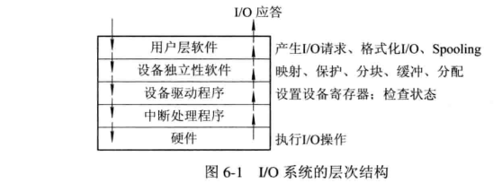
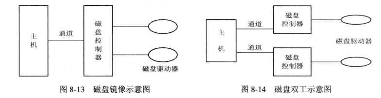
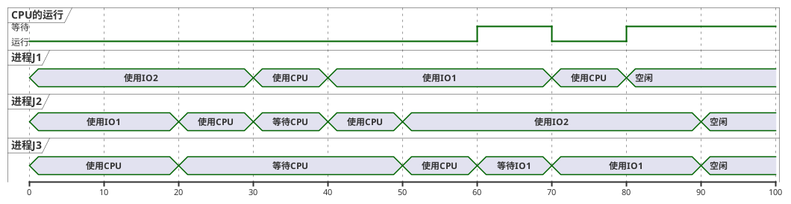

# 1、操作系统原理：
:::alert-info
简介：操作系统（operator system,os）是在计算机上的一层软件，原计算机只提供了基础功能的实现，用户想在其基础上使用各种功能得编写汇编语言来实现，而os上提供了汇编，支持用户使用高级语言编程，还提供了图形界面，让普通用户也可以轻松使用，当然os不知是因为提供易用性而诞生还有，提高资源管理、系统吞吐量、扩展性、规范性等功能。
:::
## a、发展：
**单道批处理系统**：20世纪50年代当时的计算机非常昂贵（==晶体管实现==），为了提高cpu利用率设计了单批道处理系统，先将要执行的所有作业都写入磁盘，然后设计一个监视器，将第一个作业从磁盘写入内存，第一个作业处理完成之后，将控制器交给监视器，监视器将第二个作业写入内存，依次这样执行。但是由于一次作业完成-》io中断-》io就绪-》传输数进内存这段时间cpu几乎是空闲的，依然浪费了不少计算机资源，由于当时的计算机只支持单条程序的运行。
**多道批处理系统**：20世纪60年代IBM公司生产出一台小规模集成电路计算机，IBM360可同时执行多到程序，由此多道批处理系统也产生了，可同时执行多条程序，将数据并列传入，第一个作业空挡期间执行第二个作业的程序，依次如此，cpu就能一直处于繁忙状态。（只有1个alu，控制器的原因？？）
**分时系统**：多用户可共享一台主机，如一个主机连接多台显示屏。处理多道批处理系统中计算机运行作业后，人无法与计算机交互的问题，因此提供了多个终端，且计算机能及时回应用户的操作。因为要满足同一段时间内多个用户的操作都要回应，所以引入时间片概念，每个用户的作业运行一段时间后转为运行下一个用户的。
**实时系统**：相比于普通操作系统，在接收和处理信号能更及时和精准。分类：工业控制系统（工业制造、军事设备控制等）、信息查询系统（天气、火车票查询等）、多媒体系统、嵌入式系统（制作为芯片嵌入到各种设备上实现的智能设备等）。对控制要求实时的成为**实时控制系统**，对信息实时处理的为**实时信息处理系统**。

- 实时任务类型：按是否呈周期性划分：周期性实时任务、非周期性实时任务。按截止时间划分：硬实时任务、软实时任务。

**微机操作系统**：配置在微型机器上的操作系统简称，1974年出现第一代8位微机操作系统。1981年IBM推出11位，2001年出现windows xp。
**编程语言的演化**：
早期发明计算机之后只能编写二进制代码在机器上运行称为机器语言。
20世纪50年代产生了符号式程序设计语言称之为汇编语言（用户编写汇编语言经过编译转为二进制代码到机器上运行，这个编译/翻译环境称其为虚拟机），但如果是不同的指令系统(如win与LInux)汇编语言对应的语句也会不一样，要在不同系统得到同一效果，需要编写两份汇编程序。
20世纪60年代出现高级程序设计语言，再通过一个虚拟机将高级程序编译为汇编，汇编编译/翻译为计算机语言。高级语言翻译为机器语言的程序称之为翻译程序，翻译程序分为编译程序(将源程序编译为机器语言在目标机器上运行，源程序不变则不会再编译)，和解释程序（每运行一句就翻译一句，直接翻译为机器语言运行。再次运行程序也会重新翻译）两种。

## b、基本特性：
**操作系统的两种服务方式**：**系统调用**（由若干指令构成的过程）、**系统程序**（系统提供了大量程序解决带有共用性的问题，并为程序的开发和执行提供了一个好的环境）。
**操作系统必须具有的功能**：<b c=b>用户接口、处理机管理、存储管理、设备管理、文件管理</b>
**处理机管理功能**：进程控制、进程同步、进程通信和调用。

**并行与并发**：并行指多道程序在同一时刻运行，并发则是指多道程序在同一时间段内都运行，由于同一时刻计算机只能运行一个程序，所以多道程序一起运行时其实是交替运行的。
**共享**：同一资源供多个设备同时使用，有共用方式、互斥共享方式。
**时分复用**：利用一个服务空闲的时间转去服务另一个服务的这种思想（不止用于服务上）。
**空分复用**：利用存储器的空闲空间来存放和有运行其它程序（如果程序大小超过空闲程序可以使用先运行部分然后替换下一部分运行的方法），以此来提高效率。
**虚拟**：早期用于通讯系统，使用空分复用或时分复用技术，将一条物理线道划分多条逻辑线道。os中同时使用时分复用和空分复用技术实现虚拟。

**进程通信**：当多个进程需要合作完成一个大的任务时，往往需要合作，如计算进程得出结果，打印进程将结果打印。进程的通信由源进程发送消息到目标进程的消息队列，再利用目标进程读取消息队列的功能读出。
**调度**：**作业调度**：用户建立的作业放在一个队列中，选择若干个作业为他们分配资源，建立进程，调入内存，放入就绪队列。**进程调度**：从进程队列中选择一个，将处理机分配给它，使其投入执行。
**内存分配**：计算机需要为每个作业分配内存，静态分配：每个作业装入时确定其使用内存，在该内存内运行。动态分配：作业运行过程中，依然可以动态的申请所需要的内存。
**内存保护**：各作业在自己分配的内存空间运行，不允许访问其它进程的数据。
**地址映射**：每个程序在编译和链接后其可装入程序的地址都是从0开始的，但不能从0的物理地址开始装入，因此程序的逻辑地址与物理地址并不一致，由此产生了地址映射（逻辑地址转换为内存空间中对应的物理地址）。
**os结构**：（1）整体结构：早期编写的操作系统程序较整体，只注重功能的实现，但拓展很差。（2）模块结构：按功能结构将它们划分为块，将操作系统模块化。（3）分层结构：采用模块结构的基础上，将它们分层，每个层有1个或多个软件，一个程序要到达目标，需要经过多个层的校验。易扩展，保证系统正确性，但耗性能，效率较低。
**os内核**：现代os不仅是采用的模块化设计，也采用层次化设计方法，哪些层次较高，紧靠硬件的软件会被常驻内存使用，它们称之为os内核。为防止os中关键数据被有意或无意的破坏，将执行处理器分为用户态（操作受限）和系统态（可运行一切指令）两种。
原语操作：一组操作指令，要么全部执行，要么不执行，执行中不可中断。

## c、进程：
定义：是一组有序的指令集合。进程是进程实体的独立运行过程，是系统进行资源分配和调度的一个独立单位。进程独立运行，os为每个进程配置一个专门的数据结构，进程控制模块（process control block）。撤销进程实际上是撤销进程的pcb。所拥有的状态如下：
- **创建状态**：进程的创建需要向pcb中写入对应的指令集，然后os为它们分配所需的资源，将它们转为就绪状态，插入就绪队列，此时可被调度。而如果由于资源不足，os无法将其装入，此时的进程创建就不算完成，属于创建状态，也无法被调度。这样既方便了资源的管控，也保证了每个运行的进程是完整的。
- **挂起状态**：作用：（1）少数时候，用户想要暂停进程，以观察其对应程序，或配合其它进程。（2）有时操作系统需要挂起一些进程，以便检查其数据资源等。实时系统中，若负荷较重可由os先将一些不重要的进程挂起，保证实时任务的正常运行。（3）有时候父进程需要挂起子进程，以便协调其它子进程协作。因此而引入的一个状态。
- **就绪状态**：已获得资源，获得cpu后可立即运行，放在就绪队列中。引入挂起状态后又分为：活动就绪（被挂起的就绪状态的进程）、静止就绪（用suspend挂起的就绪状态进程，不会再调度）。
- **执行状态**：进程已经获得cpu，处于执行状态。
- **阻塞状态**：执行状态的程序由于io申请、访问的资源已在使用、申请缓存区失败等情况，程序会变为阻塞状态，进入阻塞队列。被挂起的阻塞进程称为活动阻塞，被suspend挂起的称为静止阻塞。
- **终止状态**：程序正常结束应该是等待os善后处理，将pcb清零，pcb空间返还系统。如果程序由于遇到os无法解决的错误，或被os其它进程终止，那么此时的该进程救属于终止状态，并不会被立即清除，其过程中涉及的数据被其它所需进程获取后才会清除该进程。
- **pcb**：记录了进程信息和os所需要的数据，具有间断运行属性，阻塞后保存进程的现场信息，再次运行后可以恢复现场。拥有实现进程通信的区域，和队列指针。
- 进程标识符：外部标识符，用于用户访问控制使用（通常数字和字母组成），内部标识符（通常系统分配的一个唯一序号）。
- 进程的创建：unix中一个进程可以创建另一个进程（层次关系），形成一个进程树（子进程继承父进程的资源，父进程可控制子进程）。而**windows**中进程都是同等的，只有在a进程创建b进程时，a获得令牌，可控制b进程。
- **进程同步**：多个进程相互合作时需要进程同步的实现，如进程a完成一部分后阻塞a，b进入缓冲区读取a写入的数据，然后唤醒a。将这些缓冲区资源称为临界区资源。用软件方法控制进程同步有一定难度，现在多数硬件上有提供相应指令进行进程同步的控制。
## d、线程：
ALS技术的发展，出现了对称多处理机（SMP），由于进程本身太重，切换调度很耗费时空间，因此重新设计了线程，线程包含在进程内，因此它变成了调度分配的基本单位。<b class="red">线程的并发实现与进程的实现类似，使用轮转调度算法，每个线程沦落执行一个时间片段。</b>
- **更小的开销**：线程在进行切换时仅需保留和设置少量寄存器内容，远比进行的消耗低（甚至不需要os内核干预），不过一个进程的线程切到另一个进程的线程时依然会引起进程的切换。
- **更好的并发**：没有线程概念时，一个进程也可以理解为单线程的。一个进程中的多个线程可以并发，且能更好的利用资源。<b class="blue">比如：一个网络服务用于接收客户请求，之前只有一个线程，一次只能处理一个，而多线程情况可同时处理多个用户。</b>
- 拥有少量资源：运行资源依然是分配给进程的，线程只含有一些少量的运行资源，如：控制线程的tcb，保存少量变量、参数的一组寄存器和堆栈。
- 共享：进程的线程可共享进程中的资源。
- 独立性：线程也有独立运行的特性，不过它本是为了同一进程合作产生的，所以独立性比起进程自然差很多，一个线程甚至可以清楚另一个线程。
- **支持多处理机**：进程只能运行在一个处理机上，但它里面的线程可以分配到多个处理机上，所以多处理机几乎都支持了线程。
- **内核支持线程**：内核也使用线程来运行，处于系统态，这类线程的运行，切换内核都会参与。！！该类线程切换比用户态线程开销大。
- **用户线程**：用户态的线程，切换、创建、撤销都无需内核的参与，即内核完全不知道用户线程存在。
- 两种类型线程的组合：部分os系统将两者组合使用，提供UTL/KST线程。这是用户及线程通过时分多路复用内核支持线程实现的。有一对一、一对多、多对一。

## e、调度与死锁：
**调度**：实质是系统资源的分配，分配算法对各资源进行分配。一个作业从创建，获得资源，到运行结束可能要经过多层调度。调度层次如下：
1. 低级调度：对进程的调度，决定进程队列中那个进程得到处理机。多道批处理、分时、实时os中都设有该调度。
2. 中级调度：将那些暂时不能运行的进程先调至外存放置，提高内存利用率和系统吞吐量。等那些进程有运行条件，且内存有空间时再由中级调度决定是否将它们调入内存，并更改状态为就绪状态。
3. 高级调度：(长程/作业调度)主要用于调度作业，将放在外存的作业为它们创建进程，分配资源、调入内存，放进就绪队列。主要用于多道批处理系统中，**分时和实时系统不设高级调度**。
4. 作业：作业是比程序更为广泛的概念，作业中包括使用的程序，数据和作业说明书，指定了os应该怎样控制程序。调度作业过程包括编译作业步、链接装配作业步和运行作业步。批处理系统中一般以作业为基本单位调入。<b class="violet">作业是用户给计算机的任务，是调度的对象，而进程，线程是用于调度的方法。</b>
5. 作业控制块：JCB，用于控制作业的一个数据结构，内容包含：作业所属用户名、作业标识、作业状态、调度信息、作业使用情况等。每个作业进入系统时，作业注册程序为它们分配jcb

<i class="label3">调度算法</i>
1. FCFS：先来先优先规则，最简单的调度算法。
2. SJF：短作业优先原则。
3. PSA：优先级调度算法。等待时间越长，作业的优先级约高，越早进行调度。
4. HRRN：（HIghest Response Ratio Next）高响应比优先调度算法。`优先权 = (等待时间 + 要求服务时间) / 要求服务时间`。
5. RR：**轮转调度法**，使用FCFS将进程队列排序，将cpu分给首进程，然后按照时间片大小轮流运行每个进程。
- 时间片大小的选择：过小的时间片会导致频繁切换进程上下文，也会造成不小的消耗，但过大的时间片会出现部分进程任务少但运行时间较长的情况。一般选择一个略大于一次典型的交互时间。
- 进程切换时机：虽然给定了时间片，但存在部分进程未等到时间片完就早已结束的情况，这时应该直接结束该时间片，切换进程，并启动一个新的时间片。
6. 多队列调度算法：以上调度算法都是只能在一个处理机上运行，且只有一个进程队列，而为了不同用户对调度策略的要求，和更好的适合多处理机，多队列调度算法更加适合，它将进程分成多个进程队列，可以对每个队列使用不同的调度算法，且可以为每个处理机都分配一个进程队列，如果一个进程里面有多线程，可以控制它们都在一个处理机上执行。
7. 多级反馈队列：
8. 基于公平原则的调度算法：
9. **可抢占优先权调度**：系统把处理机分配给优先权最高的进程，使之执行·但在其执行期间，只要又出现了另一个其优先权更高的进程，进程调度程序就立即停止当前进程（原优先权最高的进程）的执行，重新将处理机分配给新到的优先权最高的进程。

**Belady现象**：为进程分配的内存页增加，缺页率反而增加的异常现象。**先进先出算法**（非基于堆栈实现）`FIFO`容易产生这种现象。
**死锁**：
- 原因：竞争资源、**进程推进顺序非法**都可能会造成死锁。
- 示例：一个典型的场景是扫描仪c1，光盘刻录机c2，进程p1，p2都要使用扫描c1将信息用c2刻录下来，p1请求到了c1，p2请求到了c2，双方都希望对方把资源让出来，但双方都没有收到对方的让步会**一直变为阻塞**，因此两者一直僵持，形成死锁。
- 可重用资源：可供用户多次使用，不过只允许一个进程使用，不能共享，且使用需要是：请求资源、使用资源、释放资源的步骤。
- 可消耗资源：临时性资源，一般由进程自己创建消耗，运行结束后也不归还资源类，如进程通信使用的资源。
- 可抢占资源：进程使用资源中可以被其它进程抢占使用的资源，如cpu、主存，可抢占资源不会引起死锁。
- 不可抢占资源：一旦被一个进程使用就会等到其释放才能再次使用。如打印机、光盘刻录、扫描等。

<i class="label3">处理死锁</i>
- 预防死锁：用规则去限制四个条件中的一个，较容易，已被广泛使用。相应的两种协议：
>**第一种协议**：规定所有进程在运行前必须请求所有需要使用的资源，只要有一种未请求到都不允许该进程运行。（这回造成资源浪费）
>**第二种协议**：是第一种的改进，它允许进程在获得初期需要的资源后即可运行，但在后期请求新资源时必须先释放掉自己已获得的且已不再使用的资源。
- 避免死锁：在资源动态分配过程中，避免资源进入某种不安全状态。
- 检测死锁：通过运行检测机构，及时将进程从死锁中解脱出来。
- 解决死锁：已经发生死锁，os通过撤销进程所属线程，为它们分配一些资源，使它们挣脱死锁。

**死锁的必要条件**：
（1）互斥条件：进程竞争的资源必须互斥使用。
（2）请求与保持条件：拥有当前资源的进程，仍能继续请求资源。需要的资源被占用，自己仍然不释放自己的资源。
（3）不可剥夺：进程申请的资源，只能在使用完后释放。
（4）循环等待条件：存在一个至少含有两个进程的循环等待链，都在等待双方放弃资源。

**pv操作**：又称wait,signal原语。主要是操作进程中对进程控制的信息量的加减控制。
- **信号量**：mutex，用来控制资源，一般1个资源设计两个信号量（表可使用和不可使用的状态），1个信号量控制进程运行。<b c=r>`wait(mutex)`和`signal(mutex)`需要成对出现</b>
- AND信号量：多个wait,signal时的简写。即`Swit(a,b)<=>wait(a);wait(b)`和`Ssignal(a,b)<=>signal(a);signal(b)`
- 为什么设计成原语：进程使用资源都有一个使用标识符号（用于告诉其它进程是否在使用），如果一个进程已在使用，但进程可以被暂停甚至结束，但此时使用标识符已为true；
另一个进程就会一直等待，因此在程序进入临界区时使用`wait(MARK);`等待，操作完后用`signal(MARK2)`。
- wait用法：wait(num),num是目标参数，wait的作用是使其（信息量）**减一**。如果信息量<=0，则该进程继续执行；否则该进程置为等待状态，排入等待队列。
- signal用法：signal(num),num是目标参数，signal的作用是使其（信息量）**加一**。如果信息量>0，则该进程继续执行；否则释放队列中第一个等待信号量的进程。

## f、存储相关：
**磁盘缓存**：磁盘与主存间的读写速度也相差很大。与高速缓存类似，也是存储磁盘到主存常用的数据，不过磁盘缓存其实并不是一个独立的部分，它是利用主存的一部分来存储的。
**内零头&外零头**：分配给用户而未被使用的分区部分称为**内零头**，一般原因是分区大小不是根据作业大小分配的。位于各分区之间不能再利用的小空闲区间为**外零头**，一般是要求作业运行前一次全部装入主存，且必须占用连续存储空间。

**程序的装入**：**编译程序**对程序进行编译、形成若干个目标模块，由**链接程序**将编译后形成的块及所需函数库链接在一起，形成一个完整的装入模块，由**装入程序**装入内存。
- 绝对装入(静态分配)：
（1）在一个很小的os系统中，完全可以知道运行的程序存放的地址，编译完成后将所有地址转为绝对地址。
（2）程序中使用的数据地址一般是符号地址，因为如果使用绝对地址，内存中数据一旦修改或删除，就得重写所有地址）
（3）单道程序可使用绝对装入方法
- **重定位装入**：多道程序运行时，并不能得知程序编译后的模块存放地址，而重定位装入可以将它们放到合适的位置<b c=gn>(再次将程序中用到的逻辑地址转为物理地址)</b>。
- **动态运行时装入**(动态分配)：动态重定位
（1）可重定位装入方式在程序编译后确定了绝对地址，不能再变化。
（2）但实际情况中由于程序存在于进程，而进程涉及到切入切出，这时它们的绝对地址将不再可用。
（3）而动态装入是程序编译后并不将逻辑地址转为绝对地址，而是在程序真正运行时才转换地址。为使转换地址不影响命令的执行，<b c=v>需要一个重定位寄存器的支持。</b>
>动态重定位：为在程序运行时，将要访问的数据和程序的逻辑地址转为物理地址。（2）用重定位寄存器存放程序运行时再内存中的起始地址。<b c=b>在转变地址时，=相对地址+重定位寄存器中的地址</b>
- **静态链接**：装入前就建立所有连接。编译后的各模块有自己原始的地址，主入口模块默认地址为0，需要使用相对地址来连接它们。比如：a导入b，b导入c，那么a逻辑地址为0，b为0+L，c为L+M。然后将每个模块所用的外部调用符也换为相对地址。
- 装入时动态连接：在装入时，如果要导入指定模块，再去修改模块的链接地址，便于实现对布标模块的共享，便于修改和更新。
- **动态运行时连接**：如果按照以上两种链接方法，在程序选择性情况导入模块时，它会将所有模块都导入，但可能有些模块是整个运行中都不会用到的。这显然是低效的。而动态运行时链接会等到程序运行时，如果发现需要的模块未导入才会让os去寻找，然后链接装入。

**内存分配方法**：
1. **连续分配存储管理方式**：这里是为程序分配内存时相关的方式。得将程序装入连续的分区中。！**会形成许多碎片**（一个分区内未装满的部分）。
- **单一连续分配**：早期单程序时的分配方式，当时是将内存分为系统区和用户区，用户运行一个程序会让其独占所有用户区的内存。
- **分区式分配方式**：
    1. 固定分区分配：多道程序出现时，需要为每个程序分配内存，将用户分区划分为多个分区，然后将每个程序分到一个分区实现多程序运行。（分区时确定长度，保持不变）。
    2. 动态分区：根据进程的实际需要，动态的将之分配为连续的内存空间，常用**三种分配算法**：首次适应FF（易留下难以利用的小空闲分区）、循环首次适应（使内存中空闲分区均匀）、最佳适应（将空闲区按长度递增次序登记在空闲区表。易留下难以利用的小空闲分区）。
    - **首次适应算法**：为一u作业选择分区时总是寻找接近作业大小的存储空间。
    >回收分区时：
    （1）若会收区与插入点前一个分区相邻接，则回收区与插入点前一分区合并。不再为回收分区分配新表项。
    （2）回收区与插入点后一分区相邻接，则合并两区，回收区首址作为新空闲区首址。
    （3）回收区同时与插入点前后两分区邻接，合并3分区。
    （4）回收区插入点前后都无邻接。则为回收区单独建立一个链表项。<b c=r>按地址顺序，从头开找，找到一个满足的空闲区即可。</b>
    - 最佳适应算法：从多个空闲区中找出最合适作业要求大小的那个。
    - 最差适应算法：选择最大的那个空闲区用于作业使用。

2. **离散分配存储管理方式**：连续分配上的改进，将各程序可以装入不相邻的分区中（os会为每个进程在创建一个页表，页面号对于内存块号）。不过最后一页也常不能装满，因此也形成了业内碎片。
- **分页存储管理**：下方左图为页表。主要为便于系统，减少内存中的琐碎空闲部分。
（1）将程序按逻辑地址空间分为若干页（大小固定），将内存分为若干块，块与页大小相同。
（2）程序的每个块对应页表中的页号，而页表的每个页号对应内存的各个块号，如此来寻找地址。<b c=b>地址转换工作由硬件（地址转换机构）完成</b>
（3）两级页表：每个进程配有一张页表。但难与找到大的连续空间来存放页表，将每个页表大小设计成与物理块号大小相同，然后再用一个页表指向这些其它页表。
（4）多级页表：对于32位及以上系统，两级页表已经不够表示，因此采用多级页表。
（5）反置页表：为避免页表占用大量内存空间，引入反置页表，为内存的物理块号编号，页号——》该块号所属进程标识。
（6）**获取物理地址过程**：cpu产生的每一个逻辑地址，有硬件地址变换机构将其分为：页号，页内位偏移量，两部分。`页表始址和页号计算出物理块号`，物理块号与页内位偏移量连接形成最终地址。

                                

- **分段存储**：按程序各功能模块划分存储。如上，右图所示。
（1）引入：程序一般都可以分为若干个段，如主程序段、子程序段、数据段等。这样按段来划分更符合程序，更直观。
（2）实现：将程序按段划分，每个段都从0开始编址，并使用一段**连续的物理空间**。各段的长度由相应的逻辑信息组决定，所以没段长度几乎都不一样。
（3）优点：方便编程、更易实现信息共享、信息保护、更容易应对动态增长问题、更易动态链接。
（4）地址变换：用段表寄存器来辅助转换逻辑地址。

- **段页存储**：两者优点的结合。
1. 实现：先按用户程序进行分段，决定好各段大小后，再对各段分页，生成页表。
2. 地址转换过程：
（1）段表控制寄存器，确定段表在主存中的位置。
（2）虚拟地址中的段号和控制寄存器中的段表大小比较，确保访问的有效性。
（3）通过段表，找到该段对应页表位置，根据虚拟地址中的页号，找到该页表中，页号对应的内存地址。

**分段分页主要区别**：
1. **页**是信息的物理单位，分页只为实现离散分配，是系统上的需要。**段**则是信息的逻辑单位，目的在于更好满足用户需求。
2. 页的大小固定，且由系统决定。段大小不固定，有程序各段情况决定。
3. 分页的用户程序地址空间是一维的。分段的则是二维的。

**常规存储器管理缺点**：上面的段、页式存储都属于传统管理方法。
1. 一次性：作业需要一次性全部装入内存才能运行。导致大作业不能在小的内存中运行。
2. 驻留性：作业全部运行完毕才会被换出，内存利用不高。


**虚拟存储**：具有请求调入功能和置换功能，能从逻辑上对内存容量加以扩充的一种存储器系统。
1. 多次性：将程序分为多部分，可以只将当前要运行部分的程序及其要用的数据调入。
2. **页面置换算法**：
如果一个进程占用大量的内存，但由于某个原因阻塞了，而其它进程又因为内存不足无法运行，这是极其糟糕的事，所以有了对换，可以**将阻塞的进程先切换到外存等待**。
进程中发生缺页时也需要从辅存调入对应分页。若主存已没空闲块时，此时也需要替换页出去<b c=gn>(若是修改位为1的页还需要将其写入相应辅存)</b>
(拥有对换的os系统会将磁盘分为对换区和文件区两种，当然文件区占大部分)。几个页面置换算法如下：
    - **最佳置换算法**：它所选取的页面将是最长时间不再访问的页面，但这是未知的，不过它可以用来衡量其它算法。
    - 先进先出页面置换算法LRU：选取在内存中最久的页面。
    - **CLOCK算法**：虚拟存储中有对页表标志**引用位**（该页是否引用过）和**修改位**（该页是否修改过），置换选择依据如下：
（1）没有引用和没有修改过的页面最新淘汰。
（2）没有引用，但修改了的页面齐次。
（3）再次是淘汰引用了，但没有修改的页面。
（4）最后是淘汰既引用了又修改了的。有多个这种页面时随机选一个即可。
3. 虚拟性：从逻辑上扩展内存，让大作业也能在小内存运行，让用户感觉到是内存变大了。
4. 地址转换：根据逻辑地址，计算出页号和页内偏移量，找到页号对应记录的页框号，物理地址=业内偏移量+页框号。（有疑问！！）
5. **页面缓冲算法PBA**：
    - 空闲页面链表：一个空闲的空间块链表，用于服务常发生缺页额进程，这些进程进行页面换出时，实际并未换出内存，而是存储到该空闲链表的最后一个物理块中，而且是有数据存在的页面，当再次使用它是便    不再需要繁复的磁盘io操作。
    - 修改页链表：与空闲页链表一样，也是一个物理块构成的链表。为了减少修改页换出的频率，当一个进程将已修改的页面换出时，并不会将其立刻换出内存，而是将其所在物理块挂到修改页链表的末尾，减少频繁的换出。
6. 虚拟存储实现如下：
（1）分页请求系统：在分页基础上增加请求调页和页面置换功能，允许程序只装入一部分分页就可以运行，之后再通过调页和置换把需要的页调入，置换出不需要的页到外存。
（2）请求分段系统：与分页请求实现类似。


**抖动**：当os中存在的进程数很多时，使用上面的分页式虚拟存储方法就会产生频繁置换的现象，称之为抖动。
工作集：为了防止抖动而产生的概念，如果能够提取预知进程一段时间内需要访问的页面，将这些页面先导入到内存，就能减少进程缺页，减少抖动。称这段时间的页面为工作集。不过还是无法预知进程哪个时刻会访问哪个页面，只能像置换算法那样根据进程过去一段时间的行为来预测。
预防抖动：局部置换策略、引入工作集算法、选择暂停的进程、L=S准则调节。p172

## g、输入输出系统：
**I/O软件层次结构**：
1. 用户层i/o软件：用户可直接调用与i/o操作相关的函数进行操作设备。
2. 设备驱动程序：实现系统对设备发出的操作指令，驱动i/o设备工作。与硬件直接相关。
3. 设备独立性软件：用户程序与设备驱动的统一接口。
4. 中断处理程序。



块设备：数据读取和存储都以块的方式来传输，这种方式更快，如磁盘。
字符设备：传输的数据都是以字符为单位的，传输效率低，如打印机。
设备控制器：可控制多个I/O设备，控制cpu与I/O的数据交换。基本功能如下：
接收和识别命令、数据交换、地址识别、标识和报告设备状态、数据缓冲区、差错控制。
磁盘的访问：磁盘由磁头读写其数据，工作时一般是磁盘旋转到指定扇区，磁头开始从指定位置在磁盘上读写。所以有如下访问时间：
- 寻道时间：磁头移动到指定磁道上所经历的时间。
- 旋转延迟时间：扇区移动到磁头下所使用的时间，不同磁盘类型费时不一致。
- 传输时间：磁头在磁道上进行读写的时间。

**磁盘调度算法**：为了能较少进程对磁盘频繁的调度资源，也需要在这里使用调度算法。
- 先来先服务(`FCFS`)：公平且简单的算法。
- 最短寻道时间(`SSTF`)：要求访问的磁道与当前所在磁头位置最近，使得寻道时间最短，不过不能保证平均寻道时间最短。
- 扫描算法(`SCAN`)：基于优先级调度算法改进的，进程优先级调度算法中，优先级低的进程会出现饥饿现象，而SCAN不仅考虑要访问的磁道离当前磁道的距离，还考虑到磁头移动方向
**它们优先移动到距离最近且是最外层的磁道**，当最外层没有要访问的磁道时在移至内一侧的磁道。从内向外也是如此。
- 循环扫描(`CSCAN`)：SCAN中如果该圈磁道都读取完毕，但此时又有新的进程访问该圈的磁道，那么SCAN会先让其等待，**等到磁头到最内圈完结时，再从内向外扫描**。这会导致极端情况，该进程会等待很长时间。<b c=gn>CSCAN规定磁头单向移动，由外向内读完时，磁头立刻移到最外圈读取</b>，这样就能保证最长等待时间只有一个循环的时间。

逻辑设备：用户程序中所涉及的该类物理设备特性的抽象。
物理设备：实际使用的设备。
逻辑设备到物理设备的变换：（1）使用作业控制语音中的DD语句，实现逻辑设备到物理设备的对应关系。（2）使用逻辑设备到物理设备的印象表来转换。

字节多路通道：有许多非分配型子通道并分别连接在低速、中速io设备上。子通道按时间片轮转共享，按字节方式数据传送。**可并行操作**
数组选择通道：只有一个分配型子通道，用于连接多台高速设备，按数组方式进行数据传送。**传输速率高**
数组多路通道：以上两种的结合。有许多非分配型子通道并分别连接在低速、中速io设备上。子通道按时间片轮转共享，按数组方式进行数据传送。

**假脱机系统**：（SPooling）将一台物理io设备虚拟为多台逻辑io设备。
实现：预输入程序，把作业流中作业信息传到“输入井”保存，执行时从输入井中读取，执行中产生的结果也存放到“输出井”，作业结束后由“缓输出程序”将结果打印输出。
## h、文件系统：
文件系统也是一个内部服务，他提供给用户一个程序接口，可用该接口操作文件。
文件名：不同的os系统对文件名的要求可能会不一样，早期的某些os限制文件名不超过8字符，14字符等。
扩展名：用于协助用户分辨文件类型的后缀名，一般1-4个字符长度。
1. **文件类型**：按不同的属性有不同的分发。
>按用途分：系统文件(用户可调用，其它没有任何权限)、用户文件、库文件(用户可调用，但不可修改)。
>按数据形式分：源文件（源程序和数据组成，通常由终端或输入设备输入的源程序和数据组成。常为ASCII和汉字）、目标文件（源文件经过编译程序编译，但未经过连接程序链接，后缀名为obj）、可执行文件：经过编译和链接的可直接运行文件，windows上后缀名为.exe。

2. **文件结构**：分为逻辑结构，物理结构。

**逻辑结构**：描述文件信息的一层。（可显示出来的，用户可见的文件的存放结构）<b c=r>而逻辑结构可分为结构文件和非结构文件。</b>
- **结构文件**：每个记录用于描述实体集中的一个实体，按记录长度可分为定长（文件中所有记录长度相同，每个记录有相同的顺序和记录，这种利于检索和排序，常用于数据处理）
和不定长（每个记录的长度不相同，不利于检索，广泛用于商业领域）。
文件目录：一种数据结构，为便于管理文件而引入的。作用：按文件名存取、提供对目录的额检索速度、文件共享、允许文件重名。
文件控制块(FCB)：控制文件存取的一个数据结构。包含文件基本信息类、控制信息类、使用信息类。
- **无结构文件**：系统中运行的源程序、可执行文件、库函数等都是无结构的，即流式文件。文件长度以字节为单位，根据指针来指出其下一个字符位置。

**物理结构组织**：<b c=gn>指逻辑文件在物理存储空间的存放方法和组织关系</b>，而不是指文件本身的数据！
一、**顺序文件**：逻辑上连续的信息依次存放到存储介质中形成顺序结构。文件有多个记录项构成，这些记录在物理结构上是相邻的。文件中的记录项是定长的也可以是不定长的。结构如下：
- **串结构**：各记录在逻辑上不一定相邻。用指针指向下一个文件，第一个文件物理地址系统会给出。`缺`：仅适用于顺序结构，性能差。
- 特点：`优`：读取快，系统文件使用多。`缺`：增、删等操作麻烦，分配时需要预先知道使用多少空间。

二、**连接文件**：（顺序文件）
- 优点：文件逻辑记录顺序与它所在空间物理记录顺序完全独立开来，克服了顺序文件不宜增删、改得特点。
- 缺点：仅适用于顺序存储，性能较低。
 - 隐式寻址：文件有多项记录，设置一个指针，开始时指向文件下一记录的首地址，顺序读完一个记录时，指针加上记录的长度，形成下一个记录的地址。【这种顺序访问是比较慢的】
 - 显式寻址：
（1）对定长记录文件的寻址，用数字为每个记录编号，查找第i个记录时，只需要用ix记录长度+首址，即可得出。
（2）利用关键字：为每个记录分配一个关键字，查找某个记录时对比关键字查找即可。这在不定长记录文件中也经常使用。

三、**索引文件**：文件中必须使用专门的存储空间存放索引表，读取该类文件时也要读取索引表，才能知道相应逻辑文件在外存块上的位置。
`缺`：增加了索引表空间的开销，大型文件的索引表甚至可能超出文件本身大小。优点：便于增、删、改
（1）索引文件：为顺序文件的开始记录项地址，选择一个关键字建立索引。很定长和不定长文件都容易**实现随机查找**
（1）索引顺序文件：顺序文件和，克服了变长记录的顺序文件不能随机访问，不变插入、删除的缺点。p230
- 一级索引顺序文件：将不定长记录文件分为多组（如50个记录为1组）变为顺序文件，然后**为每组中的第一个记录**在索引表中建立索引。
- 二级索引顺序文件：对于很大的文件，可以在一级索引上在对其分组，再建立一个索引表。

四、**直接文件**：更加关键字直接指向文件的物理地址。
- 优点：可用于次序乱，又需要极短时间内存取的场合。实时处理文件，系统目录文件操作等情况使用
- 缺点：冲突问题多，如解决hash冲突。
- 哈希文件：用hash法将记录关键字与地址对应。`优`：对实时处理文件、操作系统目录文件很友好。`缺`：如何设置让hash函数生成结果不冲突是个问题。

- 文件存放到存储介质上时，采用的组织形式与**存储介质特性**有关。**数据库文件**的逻辑结构形式是**记录式文件**。
- 操作系统是通过**按文件名**来操作文件的。文件的逻辑的记录大小随使用要求变化。
- 硬件有关文件是**特别文件**。unix系统，文件存储器管理采用**成组链接法**。
- 记录式文件，存取信息的最小单位是记录。

4. **树形目录结构**：当代os中普遍使用的结构，每个文件或目录只能有一个父目录，数据文件称为树叶，其它目录称为树的节点。
>路径名：每个文件有一个唯一的路径位置，从根目录起，每个节点用/隔开。
>当前目录：如果进程每次访问文件都要从根目录开始访问的话会很低效，而且多数时候都只是使用局部文件，所以为每个进程设置一个工作目录，所有操作基于该目录进行。
>**文件查找**：
（1）线性检索法：单级目录中根据用户给的文件名，直接与每一个相比。树形目录中，按照给的路径，每个目录匹配相应名称，再逐级进入查找。
（2）hash查找法：建立一张hash文件索引目录，然后将用户给的文件名转化为索引值，进行查找，很高效。但是使用模式匹配的方法还得使用线性检索才能支持。
5. **文件共享**：一台计算机是可以多用户的，如果不使用文件共享，那么同一个文件多个用户要使用会需要复制多份，显然非常浪费资源。之后的文件共享不仅局限于单机的文件共享，而且发展到多机、计算机网络的共享。
- **有向无循环图实现共享**：树形目录下的某个目录只能有一个父目录，但要实现共享意味着有多个用户可操作，即有多个父目录，这两者是相冲突的。
有向无环图的方法将在多个用户访问一个文件时，<b c=gn>将该文件链接到多个用户的父目录中</b>，不过如果共享文件中添加新的内容则不能被共享。
- 利用索引节点：使用文件物理地址、文件属性等信息，文件目录中只设置文件名，及指向相应索引节点的指针。
- 利用符号链接：允许一个文件或目录有多个父目录，但只有一个是主父目录，其它几个父目录用符号链接。

6. **文件保护**：计算机中多少会保存比较重要的数据，造成数据安全的有人为因素、系统因素、自然因素。
>保护措施：存取控制机制防止人为因素。系统容错技术防止系统因素。建立后备系统，防止自然因素。
>访问权：一个进程对某个对象进行执行的权利。
>保护域：进程对一组对象的访问权的集合。
>访问矩阵：行是域，列是访问对象，交叉处表示，该域内该对象可进行操作的权限。
>允许不同用户有相同文件名：<b c=gn>常采用多级目录方法处理</b>

7. **文件系统模型**：
- 最底层：对象（文件、目录、磁盘）和其属性的说明。
- 中间层：对对象进行操作管理的软件集合，拥有文件管理、地址映射、共享、保护等诸多功能。
- 最高层：文件系统提供给用户的接口，分为命令接口、程序接口、图形化用户接口。

直接寻址：直接给出物理地址，然后计算物理块号。
间接寻址：指在分页系统中，按字节偏移量，计算逻辑块号，和块内偏移量。**多级分页系统**中，一次间接寻址指最上层找到页表，然后再进入该页表找到页号。
>若页表长256，那么两次间接寻址就能找到`256^2`个。（自己的理解）

## i、磁盘存储器的管理：
<i class="label3">存储管理部分</i>
- **连续组织方式**：在磁盘上为每个文件分配一个连续的物理空间，它们的物理地址是连续的。采用连续组织方式时，将记录顺序地存储到各物理盘中，这样形成的物理文件称为顺序文件，磁头在进行读取时不需要移动。这种方式存储的文件顺序访问快，但**缺点**是：连续的存储会导致外部碎片。必须先事先知道文件的大小才能进行一些操作（然而多数时候只能靠预估）这导致浪费很多空间。不能灵活的删除和插入记录。
- **链式组织方式**：记录可以随意的存储到盘上，只需要前一个磁盘上添加指向下一个盘块的指针即可。插入与删除，动态扩展都很方便。不过只适合顺序访问，对于随机访问则低效。
>隐式链接：文件目录的每个目录项中都必须有指向第一个文件盘块和最后一个文件盘块的指针。（随机读取一个文件项时需要找到第一个盘块，然后顺序查找，所以低效）
>显示链接：在内存中存放一张链表来存放每一个盘块号和指向下一个文件的指针。（每个FCB有文件的第一个盘块位置，以此查找文件）整个磁盘的都存在这张表中，因为在内存，所以检索时速度快，也省了频繁的读取磁盘。

**磁盘数据读取**：磁臂通过在磁盘上扫描，读取磁盘上的数据，相关算法如下：
- 最短寻道距离优先算法：磁臂从外向内扫描或从内向外扫描时，若发现附近磁道数据有改变，且是此次需要的数据，那么让磁臂就近读取（即使与原方向相反）。
- 电梯调度算法：依据需求每次单向扫描结束，然后反方向扫描，中途顺便扫描新加入的扫描任务。
- 循环扫描算法：电梯调度算法的改进，无论扫描到的数据位置在哪，每次都是从头到尾的扫描（扫描结束后立即返回另一端），这样比较平均。

- FAT技术：磁盘、u盘上常见到的文件系统类型。微软一直在其系统中使用的技术。
>早期的FAT12：以盘块为基本存储单位，每个分区中存放着两张FAT表，每个表项是下一个盘块号，用于做链接指针。一个物理磁盘能支持四个逻辑磁盘分区。簇：增加盘块的容量并不灵活，因此引入了簇的概念。簇是一组相邻的扇区，FAT中它是一个虚拟扇区，进行盘块分配时使用簇为基本单位分配。
>FAT32：FAT16上的改进，也是FAT系列的最后一个版本。磁盘容量的增加，簇的数量也会增加，为减少簇内零，需要拓宽FAT表宽度。
- NTFS：专门为windows NT开发的文件系统。优点：使用64位磁盘地址，支持更长的文件名，有系统容错功能。

**空闲空间磁盘管理**：
1. 空闲表法：os在磁盘存储文件时，为各空闲分区建立空闲表（包括空闲区的第一个盘块号等信息），然后需要在磁盘空间中查找空闲表，寻找能存放目标文件的**连续的磁盘空间**。
2. 空闲链表法：将所有空闲盘区拉成一条链，根据链中所用基本元素不同可分成：空闲盘块链（所有空闲区以盘块为基本单位，每个盘块有指向后继盘块的位置）、空闲盘区链（空闲的盘区连成的链，一个盘区有多个盘块组成，每个盘区上有下一个盘区的指针）。
3. 位示图法：用来表示一个盘块的情况（一个表状）。0表示对应的盘块空闲，1表示已分配。所有盘块对应的这些位构成的集合为示图。
>盘块分配：<b c=gn>一般n与机器字长相同，即一个存储字长存储1行</b>
（1）顺序扫描位示图，从中找出一个或一组其值为0的的二进制位。
（2）根据找到的二进制号，据位示图转为行i，列j表示，盘块号`b=n(i-1)+j`#n为每行位数，一般与机器字长相同。
（3）修改位示图`map[i][j]=1`设为使用状态。
>盘块回收：（1）根据盘块号b，转为对应行i，列j。`i=(b-1) / (n+1)，j=(b-1) mod (n+1)`（2）设置`map[i][j]=0`。
4. 成组链接法：UNIX系统使用该法。<b c=gn>空闲表法，空闲链表法都不适合大型文件系统</b>

**提高磁盘io速度**：
- 3方面考虑：（1）改进文件目录结构，和检索目录的方法（2）选取好的文件存储结构，提高对文件访存速度。（3）提高io缓存速度，能将磁盘文件快速传到内存。

- **廉价磁盘冗余阵列**：磁盘io的速度是影响计算机速度的一个重要因素，采用量变达到质变的思想对此依然有效。利用一台磁盘阵列控制器来管理多台磁盘驱动器，形成一个大型磁盘系统，增加了io读取速度，和可靠性。**并行交叉存取**：使用于大、中型机中，将每一个磁盘数据分为若干个子盘数据，每一个子盘的数据**存储到各盘的相同位置上**，读取数据时采用并行传输，各盘块相同位置数据同时传输，大大减少了时间。
<i class="label3">增强可靠性技术</i>
**第一级容错技术**：防止一些自然和人为造成的数据丢失。
- 备份：准备两份的文件目录和FAT表，其中一份损坏时，使用另一份也依然可以保证读存数据。
- 热修复：磁盘上空出一块区域用于存放放置在指定盘块时有问题，用该部分区域来做一个记录，并存放下来。
- 写后校验：吸入磁盘的数据同时写入到缓冲区，然后两份数据，如果一致，则认为写入成功。

**第二级容错技术**：用于防止磁盘控制器，磁盘驱动器出错时的问题解决。
- 磁盘镜像：在磁盘控制器下再加一个磁盘驱动器，写入主磁盘的数据同样写入另一个磁盘驱动器对应的磁盘中，当主磁盘及相应磁盘驱动器损坏时使用该备份。
- 磁盘双工：如果是os到磁盘控制器部分出错，磁盘镜像将不能解决问题，不过实现与镜像一样，再添加一个磁盘控制器连接到主机上，并且保证两份数据一致。




基于集群技术的容错：由多个计算机互连组成的一个统一的计算机系统，让人感觉仍然是一台机器。
1. 双机热备份模式：平时主服务器运行，副服务器监视主服务器的运行，主服务器出现问题副服务器会立刻接代，修复后的服务器又作为副服务器。两台服务器使用一条镜像链路，且使用高速通信信道相连。
2. 双机互为备份模式：两台服务器，每台负责不同的功能，它们互相接受对方发来的备份数据（所以建议每台使用两个硬盘，一个装载应用程序，一个接收备份数据）。
3. 公用磁盘模式：多台计算机使用公共的一个磁盘系统，该磁盘被分为若干个卷，每台计算机使用一个卷，其中一个计算机损坏之后，整个系统使用调度算法进行重新分配，新的机器获得该卷的所有权。<b class="blue">减少了数据的复制，节省了大量时间。</b>

<i class="label3">数据一致性控制</i>
要依据一整个流程来修改多个文件的数据，但要避免修改到一半而发生系统崩溃或其它原因导致修改结束而提出的技术。
- 事务：一系列相关读写操作，修改各个数据项的一个程序单位。修改过程中其它程序访问到的是未修改的数据，事物修改完结后才可提交，若中途发生中断则需要进行退回操作，这与之前的原子操作有相同的特性。
- 恢复算法：事务记录会被存储到存储器中，利用事务记录表来修复故障可以避免一些数据的损失。事务中会保存undo（修改前的记录）和redo（修改后的记录，若中途退出则不会有该记录）两个记录，恢复算法去事务记录中查找即有undo又有redo记录的，将redo的修改后的数据设为新值。而只有undo记录的将其数据作为新值。
- 检查点：由于系统时常记录事务，如果等到发生故障再去执行恢复，到时可能会已经有很多事务非常耗时，所以系统每隔一段时间就将内存中的事务表中的记录放到稳定存储器中去，且事务修改后的数据，检查点放到稳定存储中去，然后执行一次恢复操作，并清除一些之前的事务记录。
- 并发控制：因为事务是原子性操作，多用户系统中需要等一个用户对该文件执行的事务结束后其它用户才能访问，所以引入共享锁和互斥锁处理（执行事务时获得互斥锁锁定）。

## j、保护和安全：
实现环境安全的主要目标和威胁：
1. 数据机密性：数据为保密状态，仅允许授权用户进行查看。攻击者可能进行假冒或伪装来进入系统。
2. 数据完整性：包括数据本身信息的准确性和其来源的正确性。需要防止被篡改甚至伪造。
3. 系统可用性：保证系统正常运行，正常用户的请求都会得到响应和提供服务。需要防止被损坏软硬件，修改正常用户信息变为非发用户等让计算机拒绝服务的攻击。

**数据加密**：使用密码学的加密算法对数据进行加密，即使数据被得到也无法被使用。一些加密方法如下：
- **易位加密**：基本的简单加密方法之一，任意指定一个密钥：MEGABUCK，然后将明文please...按如下顺序排列，按密文中字母的前后位置确定列号，然后按该列好顺序逐列读出，得到密文，密文长度与明文长度一致，所以解密时可以知道最后一个字符在矩阵中的位置，而解除明文。


- **置换法**：通过将明文的字母替换为其它字母而得到，abcd...xyz对应一个打乱顺序的26个字母组成的密文(不重复)，然后将明文对应位置换为密文即可，26个字母组成的密文很多，看似很安全，不过由于自然语言统计规律（英语中单词有很多常见组合）导致其安全性一般。
- **对称加密算法**：加密算法与解密算法之间有一定联系，知道了加密密钥之后能较轻松的推出解密密钥。该类算法代表有DES。
- **非对称加密算法**：将明文A使用加密算法E和加密密钥Ke加密得到密文B，另一端用解密算法D和解密密钥Kd解密出密文，Ke和Kd，E和D几乎没有联系，由Ke推出Kd几乎不可能，所以加密密钥可以直接公开，称为公钥。常用非对称加密算法有：RSA，DSA，ECDSA。

**数字签名**：金融，商业等场景中很多时候需要在协议上签名，盖章，传统方法是使用纸质。使用电子的签名方式高效且节省纸张，不过要保证电子签名的可靠性需要满足：接受者能够核实发送者发送的报文的正确性。发送者不能事后抵赖。接收者不能伪造。
- 简单数字签名：保证以上几点要求的一种简单签名方法》发送者A使用私钥ks加密密文p，接收者使用A的公钥Km解密得到密文。（私钥只有A知道，所以A不能抵赖，B也无法伪造）。
- 保密数字签名：在简单数字签名的基础上多加了两层加解密(A，B双方都有一对公私钥)。A用自己的私钥对密文加密得到Dp，再用B的公钥加密Dp得到Dq，然后发送给B，B先用自己的私钥解密得到Qa，再用A的公钥解密得到Qb。
- **数字证明书**：由于公钥的持有者是否为合法持有者是可怀疑的，所以一般将公钥给一个公开的可信任机构，该机构为该公钥发放一个公钥证明书。其它人在请求获取公钥时，该机构会给一份数字证明书，供他们使用。如下是一个保密签名申请数字证明书的流程：
>A向机构CA请求获取公钥Ka（A需要提供自己的身份信息）。
>CA向A发送**Ka和一份数字证明书**（这两样都用CA的私钥Sc加密的，用Mp代替）。
>A向B发送报文信息，将明文p用自己的私钥Sa加密得到Ma，和Mp一起发给B。
>B请求CA的公钥Kb。B用Kb解密Mp得到Ka，并确定数字证明书的有效性。
>B用得到的Ka解密A发来的密文Ma得到密文。

**基于物理标志验证**：平时使用的银行卡，公交卡等内部多是使用磁条存储已有的身份信息等数据，可以存储一些身份标识的东西来作为门禁之类的验证。不过它可以用磁卡读写器读出，然后再写到另一张磁卡中，由此伪造身份。所以用磁卡做为身份验证时还会增设口令。
基于ic卡验证：ic卡可装入cpu和存储芯片，还可以使用加密算法对数据进行加密，ic卡有以下3类：（1）存储器卡：只有一个可编程只读存储器卡，没有装入微处理器芯片，智能靠终端，所以一般。（2）微处理器卡：有微处理器和存储芯片，支持加密，用途广泛。（3）密码卡：有加密运算和RAM，具有更高的安全性。
**生物识别验证技术**：利用生物的一些唯一性的标志且不易伪造的特点来作为验证，有指纹、声音、眼纹、人脸。
早期常用攻击方式：
- 窃取尚未清除的有用信息：进程结束后可能还会有些有用的信息没有回收，攻击者会尝试请求大量内存来获取它们。
- 搅乱系统：通过非法的调用，用参等搅乱系统的运行。
- 使os自己封杀校验口令程序：一些os中输入口令时一直按delete或backspace，使得系统不再校验口令。
- 尝试操作手册上许多没有的操作，尝试破坏系统。
- 在os中添加陷阱门，使得可以绕过口令检查直接进入系统。
- 骗取口令：假装成某个用户，让系统管理员帮忙找回密码，甚至进行贿赂。

<i class="label1">内部攻击</i>
恶意软件：独立运行类》可通过os直接调度执行，蠕虫、僵尸等。寄生类》逻辑炸弹、特洛伊木马等。
- 逻辑炸弹：早期某公司程序员为防止被解雇，在os中放入了一个破坏程序，每天输入一个指定指令后并不会发作，若哪天中断，则该程序会进行随机删除文件等破坏性行为。一般设置的满足爆炸的条件：时间、触发事件、计数器。
- **陷阱门**：程序员进行开发时往往会为便于调试，在开发过程中写一些一键跳过验证的后门，因为多数产品是迭代的，所以不会删除，被恶意者发现会利用其绕过口令。
- 特洛伊木马：寄生于正常应用程序内，可以继承这个程序的标识，因此能获得该程序同样的权限，所以它能在合法情况下进行非法操作，如修改文件权限，读写属性等，之后容易让这些资源受到其它攻击。例如：系统操作员使用了寄有特洛伊的正常软件，因为该操作员是有很高的权限，所以特洛伊就能对口令文件进行复制，传到骇客的电脑。
- 欺骗登录：与web安全中的点击劫持一样，绘制一个假的与系统登录界面一样的图像，然用户输入账号，密码，然后获取到密码后关闭该界面，打开真正的登录界面，用户可能会以为电脑突发的异常，或密码输入错误之类的不会有过多怀疑。
- **缓冲区溢出**：c语言的编译存在某些漏洞，如编写时指定某数组长度为1000，但编译时并不会检测其实际长度，所以即使是1200长度的数组也能正常编译，攻击者们可以利用这个漏洞进行攻击，如程序A想获取一个文件名，保存下来以便后续调用，os为A分配一个大小为1000的缓冲区，但如果用户提供的文件名操作该大小就会发生缓冲区溢出，超出的部分会覆盖其它区域，之后一般再执行3条指令后就会系统崩溃。

<i class="label1">外部攻击</i>
1. 病毒：一段计算机程序，能够自我复制，感染其它程序和系统，然后这些程序和系统又不断传播。隐蔽性：病毒设计者为了逃避反病毒软件的查杀，一般将自己伪装成正常应用程序、隐藏在正常应用程序中或程序不太访问的地方，自身不断的改变状态。
>文件型病毒：一般从可执行文件的后端装入，放到程序的末端，然后改变文件头中的起始地址为病毒的始端，这样就感染了那些程序。
>常用伪装办法：感染文件后会使原有执行文件长度变长，所以感染后压缩文件使其变小，病毒程序中得包含压缩和解压缩程序。修改文件的修改时间。
>隐藏手段：隐藏于注册表和目录、隐藏于程序业内零头（程序是被分页装入的，最后一页往往有剩余空间，病毒将自己添加到此，且不会改变页长）。更改坏扇区列表：将病毒藏于一个扇区内，然后修改坏扇区列表中将该扇区修改为坏的可以躲过病毒查杀。
2. 蠕虫：也能进行自我复制，但它是一个独立的运行程序，且感染性较弱，主要是在os内发现os的缺陷或其它程序的漏洞进行攻击。蠕虫借助邮件等网络传输工具进行传播，将自己的副本带到远程计算机上，然后两台计算机就能进行连接，如此循环传播。
3. 移动代码：一个程序在运行时能够在不同机器之间来回迁移就称为移动代码，如网页中的小应用程序，浏览器使用沙盒技术对它们进行控制，限制它们只使用沙盒内的数据。另一则是采用解释执行，这样在运行一句代码时解释器都能进行检查，所以js被设计为解释运行。

基于病毒数据库的病毒检测：将各种病毒收录于数据库中，病毒软件查杀时针对那些可执行文件，有疑虑的文件，模糊查询的方法搜索病毒。
安全核心数据库：存放访问控制模型和信息控制流模型。
**信息流控制**：将文件分等级（内部、秘密级、机密、绝密），用户也分为同种级别的4个等级，信息流动时遵循两条规则：不能上读（密级k层中运行的进程只能访问同等和小于其级别的文件）、不能下写（密级k层中的可以写入更高级别的文件，但不能写入同级且更下级的文件中）。
访问监视器：TCB中的一个重要组成部分，进程进行数据访问时，访问监视器会调用安全核心数据库中的两个控制模型进行检验（不允许任何程序更改核心数据库相关的信息），这样系统的安全性变得很高，不高却变得低效，所以现在的os系统一般不会使用访问监视器。
**设计安全操作系统原则**：
- 微内核原则：内核简单则不容易出错，将机制放于内核内，策略放于内核外，内核向外只提供一个接口。
- 策略与机制分离原则：<b class="green">(策略是方法，而机制是具体的去实施，这里可理解为软件是策略，硬件是机制)。</b>策略是规定系统要达到的一个目标，而机制是完成特定策略的办法，由一组专门的软件或硬件实施。
- 部分硬件实现原则：用软件实施的功能容易被绕过攻击，而硬件实现的功能则安全得多，不过经济负担较大。
- 安全入口原则：安全内核往往提供多个接口服务于各项功能，如果只提供一个安全接口，所有往来信息都要检测，那安全性就能极大提高。
- 分离原则：（1）物理分离：安全要求较高的任务是要专门的电脑完成。（2）时间分离：让各进程在不同时间运行。（3）密码分离：加密密钥与解密密钥分开保管。（4）逻辑分离：安全内核与其它部分的硬件和软件分开。
- 分层设计原则：硬件、安全内核、os、用户。


# 2、习题：
## (1)基础
1. 操作系统是扩充**裸机**的第一层系统。操作系统为用户提供的接口：<b c=r>终端命令、图标菜单、系统调用</b>
2. 操作系统的**3个职能**：管理系统软硬件资源、合理组织计算机工作流程、为用户提供良好的工作环境接口。
3. 使用操作系统提供的**系统调用**接口，能在用户程序中将一字符串送到显示器上。
4. 操作系统中**临界区**是指访问临界资源的一段代码。一段时间内只允许一个进程访问的资源称为**临界资源**。
5. 多道批处理系统是在单道批处理系统上的改进，优点是资源利用率高、系统吞吐量大，缺点是平均周转时间长，无交互能力。
6. 脱机IO：解决计算机cpu和io设备不匹配的问题，用一台外围机控制从输入设备将数据提前输入到磁盘上，需要时从磁盘转移到内存，计算后的输出也到磁盘上，如果输入输出都在一台主机控制下则称为联机io
7. **为什么说操作系统是由中断驱动的**：
    - 所有并发程序都是由中断（特别是时钟中断）驱动的。操作系统中属于这一类的程序是有中断驱动的。
    - 第二类是面对用户态，被动地为用户服务的程序，系统初启后这段程序一般不运行，用户态程序执行相应调用时才运行。而系统调用是经过指令调用，指令调用又是经过中断机构处理的。
    - 第三类是既不主动运行也不面对用户态的程序，它们是有前两类程序调用的的。前两类都是由中断驱动的，所以这一类也是。
8. 中断系统判断是否有中断发生，应该是在执行完一条指令后就进行判断。
9. linux通过vfs支持多种不同文件系统，linux缺省文件系统是`Ext系列`。
## (2)进程相关：
1. 进程处于**等待操作系统分配cpu时间**时处于非阻塞状态。一次时间片用完退出处理机后，进入就绪状态。输入输出状态也可能让进程变为阻塞。
2. 进程调度是从**就绪队列**选择一个进程投入运行。进程被创建后进入就绪队列。UNIX中进程调度采用的技术是**动态优先数**。
3. PCB即是系统感知进程存在的唯一标志，也是唯一实体，程序只是描述了进程应该完成的功能。
4. 进程和程序的本质区别是：动态和静态特征。多道程序的基本特征是**制约性**。
5. 进程创建原语的任务是为进程**创建PCB表**。
6. 最高响应比优先调度算法可以兼顾短作业和长作业。
7. **作业调度**程序是从处于**收容**状态的作业中选取一个作业装入主存。
8. 与资源相关联的信号量，就是当前可用资源的数量。进程请求的一次打印输出结束后，`由等待状态变为就绪状态`。
9. **Belady现象**：为进程分配的内存页增加，缺页率反而增加的异常现象。**先进先出算法**（非基于堆栈实现）FIFO容易产生这种现象。
## (3)存储相关：

- **可变分区管理**为进程分配连续内存。固定分区分配方式属于连续内存分配方式。
- 联想存储器：提高变换速度、可按内存寻址、不增加太多硬件投资。

- 按资源分配方式可将外设分为：虚拟设备、独占设备、共享设备。
- I/O操作控制方式**经历阶段**：程序直接控制（cpu需要不断测试一台设备是否繁忙），程序中断I/O，DMA控制、I/O通道控制。
- 中央处理机**启动外设过程**：准备阶段、中央处理机执行、通道向中央处理机汇报情况。
- 设备分配策略与：I/O设备固有属性、设备分配中的安全性、与设备的无关性、系统所采用的分配策略有关。
- 小根堆：(5,18,12,19,28,20,15,22)加入一个3后的调整过程如下：


题1：有3个并发进程read、move、print。两个缓冲区B1,B2只存储一条数据，read读取数据存入B1，move从B1读取数据，加工后放入B2，print从B2读出，输出。要求输出顺序一致，用wait，singal原语表示
```js
B1;B2;        //缓冲区
SR=1;SM1=0;SP=0;SM2=1;    //让几个进程互相得知是否执行的变量。

process read:
    x = R;            //获取到的资源
    wait(SR);         //SR=0;等待资源获取完毕，read进程可运行
    B1.push(x);       //加入到B1。
    signal(SM1);      //SM1=1;
process move:
    wait(SM1);        //SM1=0;move进程可运行。
    y = B1.pop();     //取出数据
    signal(SR);       //SR=1;B1已为空，表示进程read可以再次向B1写入数据了！
    B2.push(op(y))    
    signal(SP);       //SP=1;告诉print可以运行了
process print:
    wait(SP);         //SP=0;print开始运行！
    z = B2.pop();
    print(z);
end;
```
题2：程序PA,PB单独执行时需要时间分别为TA=1h，TB=1.5h。若采用多道程序，让PA,PB并行工作，时间变为，TA=18min,TB=27min。处理器利用率为50%，系统开销为15min，问系统效率能提高多少。
>解析：计算其先后时间比，来确定其效率。`效率=并行运行时间 / 串形运行时间 = [(18+27)x2+15] / 60 / 2.5 = 70%`#/60是转换时间单位，x2是处理器实际运行的实际。提高了`1-70%=30%`

题3：某多道程序设计系统配有一台处理器和两台外设IO1,IO2，现有3个优先级由高到低的J1,J2,J3都装入了主存，它们使用资源的先后顺序和时间为：
`J1[IO2(30ms),CPU(10ms),IO1(30ms),CPU(10ms)]`，`J2[IO1(20ms),CPU(20ms),IO2(40ms)]`，`J3[CPU(30ms),IO1(20ms)]`,计算各作业所完成时间。
>解析：优先可抢占是，优先级高的进程可以抢占自己要的资源。如图所示，J1用时80ms，J2,J3用时90ms。3个作业全完成时IO1利用率：`(20+30+20)/90=78%`。`cpu利用率=(10+20+30+10)/90=78%`


题4：某采用页式存储的管理系统中，主存容量1MB，被分成256块，问主存地址应该用多少位表示？作业每页长度为多少？逻辑地址中，页内地址应占多少位？
>解析：`1MB=2^10KB=2^10 x 2^10B`#应该用20位表示主存地址。页数与内存块数一致，`每页容量=2^20 / 256 = 2^12B`。所以页内逻辑地址用12位表示即可。

题5：一个UNIX文件F的存取权限为`rwxr-x---`，该文件文件主uid=12,gid=1，另一个用户的uid=6，gid=1是否允许该用户执行文件？
>解析：`rwxr-x---`是写、读、执行权限。文件主一般都有对文件进行所有操作权限的能力，同组用户对同文件有除修改之外的权限，其它组用户**如果gid相同，则有执行的能力**。

题6：磁带卷上记录了若干文件，假定当前磁头停在第j个文件的文件头标前，现要按名读出文件i，给出读文件i的步骤。
>解析：磁带上的文件表示为：`|---|文件头标|*文件体*|文件尾标|---|文件头标|*文件体*|文件尾标|---|`#磁头每次会停在文件头标处【最后一个-后】。其中`-`（横干）为1个带标。
>1、文件与文件用3个带标隔开。当i>=j时要正走磁带。（1）组织通道程序正走磁带，走过“带标”个数为`3x(i-j)`个。（2）组织通道程序读文件i的文件头标。（3）根据文件i的头标信息组织读文件信息。
>2、i<j时反走磁带，但要走过`3x(j-i)+1`其余步骤一致。

题7：某操作系统磁盘文件空间共有500块，若用字长为32位的位示图管理空间，问（1）位示图需多少个字（2）第i字第j位对应的块号是多少（3）写出申请/归还一块的工作流程。
>解析：每个块号1位表示，存储字长位32位，则500/32=16字。对应块号=32x(i-1)+j。

题8：UNIX中，如果一个盘块的大小为1KB，盘块号占4B，请转换文件字节偏移量9999，420000为物理地址。
>解析：字节偏移量表为物理地址，由盘块号和块内偏移量构成。所以：盘块号=9999 / 1024 = 9 + 783。
>`420000 /1024  =410 +160`#410大于一级页表(256)，所以必定有二级页表(<512)，需要**两次间接寻址**。

**题9**：如果一个索引节点为128B，指针长4B，状态信息占68B，每盘块大小8KB，索引节点中有多少空间给指针？用直接、一次间接、二次间接、3次间接指针，分别可表多大文件。
>解析：给指针的空间=128B-68B=60B。1次，2次，3次间接只占12B。直接指针项数=60/4-3=12。`所有直接指针可表文件=12x8KB=96KB`(一个指针指向一个盘块)。<b c=r>所有表格式</b>
>每页与每个盘块大小相同，页号与块号大小相同，每页页号数=8KB / 4B = 2048，而每个页号装一个指针，`一次间接可表文件大小=2048 x 8KB=16MB`

题10：某文件系统空间最大容量为4TB，以磁盘为基本分配单位，磁盘块大小为1KB，文件控制块FCB包含一个512B的索引表区，则（1）假设索引表区仅仅采用直接索引结构，索引表区存放文件占用的磁盘块号，索引表项中块号至少占多少字节？可支持的单文件最大长度是多少？（2）..
>（1）解析：$1TB=2^{40}B,4TB/1KB=2^{32}$个盘块，所以盘块号要用32位，即4个字节长表示，512B/4B=128个索引项，因此能表示的最大文件=128 x1KB=128KB。

题11：一磁盘有200个柱面，编号为0-199，当前存取臂位置在143，如果请求队列先后顺序86,147,91,94,150,102试问：下列算法存取臂移动总量？，移动顺序？FCFS,SSTF,SCAN,CSCAN。
>解析：总量就是每次移动经过的柱面数，所有的和。
FCFS（先来先服务）：143->86->147->91->94->150->102，总量 = 143-86+147-86+147-91+94-91+150-94+150-102
SSTF（短距离优先）：143->147->150->102->94->91，总量 = 147-143+150-147+..+94-91
SCAN（扫描）：143->147->150->102->94->91
CSCAN（循环扫描）：143->147->150->91->94->102

题12：某一计算机系统采用虚拟存储管理，当前处理机上某一进程的页表如下表示（数值为十进制）每一项起始编号是0，所有地址机构按字节编址（8位一字节）每页大小为1024B。

| 逻辑页号 | 存在位 (是否已调入内存) | 引用位 | 修改位 | 页框号 |
| :------: | :-------------------: | :----: | :----: | :----: |
|    0     |           1           |   1    |   0    |   4    |
|    1     |           1           |   1    |   1    |   3    |
|    2     |           0           |   0    |   0    |   -    |
|    3     |           1           |   0    |   0    |   1    |
|    4     |           0           |   0    |   0    |   -    |
|    5     |           1           |   0    |   1    |   5    |
问（1）将下列逻辑地址转为物理地址，0793,1197,2099,3320,4188,5332。（2）若程序访问第2页，页面置换算法改进为CLOCK算法，问该淘汰哪页，如何改页表？
>解析(1)：<b c=gn>题中说到按字节编址，且没说存储字长，所以存储字长就按8算</b>，没页大小1024B，题中可看出使用的是2级页表，`超出1024需要再起一页`。
>页框号可以说是，为各逻辑页分配起始物理地址的一个乘法基数（所以各页叶匡号唯一）。计算如下：

|  逻辑地址   |  逻辑页号 (逻辑地址%1024)  |  页内偏移量   |  页框号   |  物理地址 (叶匡号x1024+偏移量)   |
| :-: | :-: | :-: | :-: | :-: |
|  0793   |  0   |  793   |  4   |   4889  |
|  1197   |  1   |  173（1197-1024）   |   3  |  3245   |
|  2099   |  2   |  51（2099-2x1024）   |  -   |   缺页中断  |
|  3320   |   3  |  248   |   1  |  1272   |
|   4188  |  4   |  92   |  -   |  缺页中断   |
|   5332  |  5  |  212   |  5   |  5332   |
>解析(2)：如表可知，页号2,4未调入内存，自然不用替换，根据CLOCK算法，应该最先置换页号3出去（若要改表，则该页：存在位`1->0`，页框号`1->-`）
