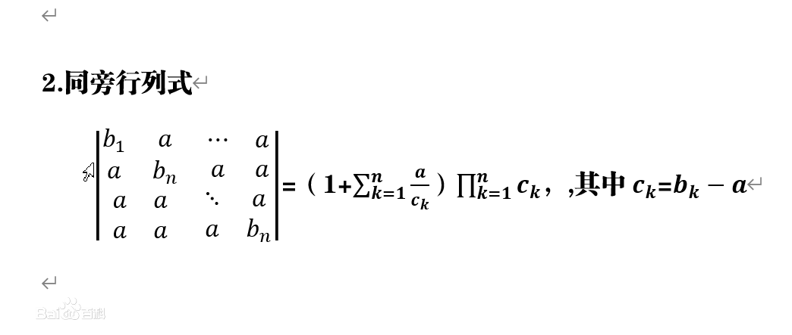

文本型数学符号集：← ↑ → ↓ ↖ ↗ ↘ ↙ ↔ ⇒ ⟺ ∞ € Œ œ Š š Ÿ ∫ ∬∮ ² ƒ × ÷ √ ± ≠ ‖ ≡ ≌ ∈ ⊆ ⊂ ⊇ ⊃ ≥ ≤ ∪ ∩ ⊙▽⊙ ∑ ∏ λ μ σ η ω ρ ξ α β θ Ω Φ ζ ψ ∂ ε π Λ ∀ ∃ △ ㏒㏑

# 零、所有计算公式

**行列式&矩阵全部运算关系**：($A^T,A'$均表示转置)

- $|AB|=|A|*|B|$（|A+B|是不能分散开求的）
- $|kA|=k^n|A|, ~~|A^*|=|A|^{n-1}~,~|A^{-1}|=\frac{1}{|A|}$
- 伴随矩阵1：$AA^*=A^*A=|A|E~,~(kA)^*=k^{n-1}A^*$，$(A^*)^{-1}=(A^{-1})^*=\frac{1}{|A|}A$
- 伴随矩阵2：$(A^*)^T=(A^T)^*,~~|A^*|=|A|^{n-1}~,~(A^*)^*=|A|^{n-2}A$
- 伴随矩阵3：$A^*=|A|A^{-1},~~A^{-1}=A^*/|A|$$|A^*|=|A|^{n-1}~~,|A^{-1}|=|A|^{-1}$，
- A是n阶**正交**矩阵：$AA^T=A^TA=E,|A|=1,A^T=A^{-1}$
- 逆相关：$(2A)^{-1}=A^{-1}/2。(A')^{-1}=(A^{-1})'。(AB)^{-1}=B^{-1}A^{-1}$（$(A+B)^{-1}$是**不能分开**求的）
- 转置相关1：$|A^T|=|A|~,~(A + B)' = A' + B'~,~(AB)' = B'A' ~,~ (A'B)' = BA'~~,(A+B)^T=A^T+B^T$
- 转置相关2：$A+A^T,AA^T,A^TA$都是对称矩阵，$A^TA\ne AA^T$
- 矩阵加乘：$A(B+C)=AB+AC~,~(AB)C=A(BC)~,~(A+E)(A-E)=A^2-E$
- 平方相关：$(A^2)^T=(A^T)^2~,~(A^2)^*=(A^*)^2$
- a1,a2,a3 是 1 维列向量：`A[a1,a2,a3]=[Aa1,Aa2,Aa3]`;
- 矩阵的 n 次方计算：$A^n=A*A*..*A$（而不是对 A 每个元素 n 次方）
- 若 A,B 相似，则可以有：$|A+kE|相似于|B+kE|,C^{-1}A^nC=B^n$
- 方阵迹相关：$tr(A+B)=tr(A)+tr(B)~,~tr(A^T)=tr(A)~,~tr(AB)=tr(BA)~,~tr(kA)=k*tr(A)$
- 分块矩阵加：$\left[\begin{matrix}A_1 & A_2\\A_3 & A_4\end{matrix}\right]+\left[\begin{matrix}B_1 & B_2\\B_3 & B_4\end{matrix}\right]=\left[\begin{matrix}A_1+B_1 & A_2+B_2\\A_3+B_3 & A_4+B_4\end{matrix}\right]$
- 分块矩阵行列式：$\left|\begin{matrix}A & B\\C & D\end{matrix}\right|=|A|*|D|+(-1)^{mn}|B|*|C|（m,n是B,C的阶数）$
- 分块矩阵转置：$\left[\begin{matrix}A & B\\C & D\end{matrix}\right]^T=\left[\begin{matrix}A^T & C^T\\B^T & D^T\end{matrix}\right]$
- 分块矩阵逆运算：$\left[\begin{matrix}A & B\\C & D\end{matrix}\right]^{-1}=\left[\begin{matrix}A^{-1} & C^{-1}\\B^{-1} & D^{-1}\end{matrix}\right]$
- 分块矩阵 n 次方：$\left[\begin{matrix}A & O\\O & B\end{matrix}\right]^n=\left[\begin{matrix}A^n & O\\O & B^n\end{matrix}\right]$

# 一、计算行列式

**Laplace 展开定理**：将 n 阶行列式 P 化为 4 个块$\left|\begin{matrix}_A & B\\C & D\end{matrix}\right|$它们的行列可以不全等（**这几个块是矩阵**）A 和 D 行列式是方形

- **若 A 可逆**，则行列式$P=|A|*|D-CA^{-1}B|$，因此**B 或 C 为全 0 时有**：`P=|A||D|`
- 若 D 可逆，则行列式$P=|A-BD^{-1}C|*|D|$，因此**B 或 C 为全 0 时有**：`P=|A||D|`
- 若 AD 均可逆，则：$P=|A-BD^{-1}C|=\frac{|A|}{|D|}|D-CA^{-1}B|$

## 1、简单形式计算

- 直接展开计算：（没行/列可先做 1 次初等变换，使尽可能的元素为 0）
  $\left|\begin{matrix}1&2&3\\4&5&6\\7&8&9\end{matrix}\right|=1*5*9+2*6*7+3*4*8-3*5*7-2*4*9-1*6*8$#<b c=r>4 阶及以上都可用展开式方法</b>
- **按行/列展开计算**：在行列式中划去元素 aij 所在的第 i 行与第 j 列，剩下的(n-1)^2 个元素按原来的排法构成一个 n-1 级行列式，称为 aij 的余子式，记为 Mij，如下：
  $$\begin{matrix}a_{11}&a_{12}&a_{13}\\a_{21}&a_{22}&a_{23}\\a_{31}&a_{32}&a_{33}\end{matrix}=a_{11}A_{11}+a_{12}A_{12}+a_{13}A_{13}=a_{11}M_{11}-a_{12}M_{12}+a_{13}M_{13}$$
  $a_{ij}后的每项用A_{ij}表示，M_{ij}$是去除了第 i 行 j 列后，剩下元素按原位置排列的矩阵，$A_{ij}=(-1)^{i+j}M_{ij}$
- 3 阶及以下：可初等变换为上/下三角形式，再直接计算（三阶以上不能使用）
- 各行/列值总和相同情况：都加到第 1 行/列，然后其它列/行再减去第 1 例/行，达到简化效果

## 2、降阶与升阶法

较高阶的行列式，可以把行列式的某行/例，或多行/例元素**变换为尽可能多的 0**，然后再按行/列展开，计算得到整个升阶后的行列式后，在用之前的展开式==反计算出原行列式==；

将 n 阶行列式增加一行一列变成 n+1 阶行列式，使之更便于计算

## 3、递推法

:::alert-success
使用其较低阶，但形式与其高阶相同的来表示，使用数学归纳法将其推导到高阶成立；
:::

## 4、借用范德蒙德行列式

$\left[\begin{matrix}_1&1&\cdots&1\\x_1&x_2&\cdots&x_n\\x^2_1&x^2_2&\cdots&x^2_n\\ \vdots&\vdots&\vdots&\vdots\\x^{n-1}_1&x^{n-1}_2&\cdots&x^{n-1}_n\end{matrix}\right]=\prod_{1\leq j<i\leq n}(x_i-x_j)$

注意矩阵中的1不参与到计算（**前提是**该范德蒙是nxn的，才能有以上的行列式值）

## 5、几个特殊行列式的计算

1. **普通箭形行列式**：有特殊计算方法的行列式的一种，除第一行、第一列及主对角线外的元素都是0的行列式。

2. **同旁行列式**：主对角线元素相同（**除a11外**），其它位置元素相同

3. **同旁同角行列式**：主对角线元素全相同，其它位置元素相同

4. **三对角行列式**：对角线的元素全相同，对角线上和下侧斜线元素各全相同（==使用递推法==）

$$例：计算D_n=\left[\begin{matrix}a&b&0&\cdots &0&0\\ c&a&b&\cdots &0&0\\
0&c&a&\cdots &0&0\\ \vdots&\vdots&\vdots &{}&\vdots &\vdots\\
0&0&0 &\cdots &a&b \\ 0&0&0&\cdots &c&a \end{matrix}\right]$$

解：按第1例展开$D_n=aD_{n-1}-bcD_{n-2}$,内容太多...

# 二、线性相关问题

1、**直接给出nxn实数矩阵情况**：直接计算其行列式的值`|A|，|A|=0`则说明其是线性相关的。

2、抽象表示情况：由子式表出的情况，`AB=C`，**AB都线性无关则C也线性无关**，==若A线性无关，C线性相关，则B线性相关==

>如：已知$a_1,a_2,a_3$线性无关，若$a_1+2a_2+a_3,a_1+aa_2,3a_2+a_3$线性相关,求a；
>解析：令$A=[a_1,a_2,a_3]~,~C=[a_1+2a_2+a_3,a_1+aa_2,3a_2+a_3]$,C可由A右乘1个矩阵变换而来
>$A*\left[\begin{matrix}1&1&0\\2&a&3\\1&0&1\end{matrix}\right]=C$，|B|必须为0才能满足，得a=-1

3、利用向量组转成行列式表示（以上两种如下）：<b c=r>注意要求解的行列式是 a 本身的，还是组成其部分的“向量表达式”</b>

| 线性组合问题    | 向量组 a（每个都是一列向量） | 向量组 b            | 行列式表现为                                                            |
| :-------------- | :--------------------------- | :------------------ | :---------------------------------------------------------------------- |
| a 线性相关      | nxn 维(a1,a2,..,an)          | --                  | $(k_1a_1,..,k_na_n)=Ka,~~ a的行列式 =0$（a 的秩<n）解出的 k 不全为 0    |
| a 线性无关      | nxn 维(a1,a2,..,an)          | --                  | $(k_1a_1,..,k_na_n)=Ka,~~ a的行列式 ≠0$（a 的秩=n）解出的 k 全为 0      |
| a=bA,a 线性无关 | nxn 维(a1,a2,..,an)          | nxn 维(b1,b2,..,bn) | ` b的行列式 和A的行列式`（即 b 要是线性无关的），A 的行列式要是非退化的 |
|||||

注：a1,a2,a3,b线性无关；a1,a2,a3,y线性相关，则`a1,a2,a3,b+cy`==线性无关==；（c为常数）

4、**不是nxn维的情况**：不可用行列式性质分析，需要用矩阵/向量，相关性质推导；
如：a1,a2,a3是==4维==的，可构成1个==4x3==的矩阵`A=[a1,a2,a3]`，**它们线性无关**，则有r(A)=3;

5、做题中：最好是秩和行列式结果，两种都要满足要求，两种方法都去计算。

# 三、解线性方程组

:::alert-info
当行数与列数不同时，所提到的**n 都是指列数**； 先使用**消元法**（==初等行变换==）去掉多数变量。
:::

**齐次线性方程组**：常数项（**指各方程的结果值**，而不是自变量常数）全为 0 的线性方程组，否则为非齐次。<b c=r>这里只是齐次情况</b>。

- **非零解情况**：`mxn阶`齐次的方程组，利用其系数行列式，`m<n`时，AX=0 必有非零解。`m=n且|A|=0`时它们**会有非 0 解**,==注意同时还要满足不是满秩==

- **线性无关解**：若齐次方程的系数矩阵`r(A)=r<n`，则该方程组有==n-r 个线性无关的解==（==列数与行数不等时，n 以列数为准==，因为每列是一个向量）
- **基础解系**：$a_1,a_2,..,a_{n-r}$中(`a1=[x1,x2,..,xm]`m 是列数)，每个都是方程组的一个解，**每个解之间线性无关**（<b c=gn>因为只有 n-r 个线性无关的解，所以解出解系也只有 n-r 个</b>）
- **通解**：若$a_1,a_2,..,a_{n-r}$是齐次方程组`Ax=0`的一个基础解系，那$k[a_1,a_2,..,a_{n-r}]$是`Ax=0`的**通解**;
- 无穷多解：就是“通解”的情况；
- **0 解**：系数矩阵行列式`|A|!=0`时，只有 0 解；（==n个列向量线性无关时==，只有0解）
- 求解方法：将系数行列式进行“初等行/列变换”得到上三角矩阵和秩（r），然后从下往上的每个式子去推断它的解，推断出 r 个线性无关的解；

**非齐次线性方程组**：

- **有解判别定理**：线性方程组的**系数矩阵与增广矩阵有相同的秩**。<b c=r>两者秩相同时有解，不同时无解</b>
- **唯一解**：系数矩阵为**满秩**时（`|A|!=0`），解唯一。
- **线性无关解**：<b c=r>这里指相对于其增广矩阵而言</b>，若其**增广矩阵**秩为 r，则其线性无关解个数为（n-r）【这个 n 是==增广矩阵的列数==】
  所以，其对应的`AX=0`时，若有k个线性无关解，则其`AX=b`就有==k+1==个线性无关解
- **基础解系**：是指其增广矩阵，而非它的齐次方程组；
- **通解**：若$a_1,a_2,..,a_{n-r}$是齐次方程组`Ax=0`的一个基础解系，**a 是 Ax=b 的一个解**，那$a+k[a_1,a_2,..,a_{n-r}]$是`Ax=b`的**通解**;
- a1,a2,a3 是 Ax=b 的 3 个线性无关解，<b c=b>则 a1-a2，a1-a3 是 Ax=0 的 2 个线性无关解。</b>
- 无穷多解：就是“通解”的情况；
- ==注意==：Ax=0有非0解，==推不出==`Ax=b`有无穷多解，其甚至可能无解。
- 求解方法：直接对增广矩阵进行“**初等行变换**”（因为涉及到结果列，求秩时可用列变换）尽量化为上三角矩阵，然后推断基础解系；或者：先求齐次方程组的基础解系，非齐次情况的一个特解

**例1**：非线性方程组：（1）求 a,b 的值及方程组的通解。
$\begin{cases}x_1+x_2+x_3+x_4=-1\\4x_1+3x_2+5x_3-x_4=-1\\ax_1+x_2+3x_3+bx_4=1\end{cases}$有 3 个线性无关的解
(1)解析：对系数行列式化为上三角可得：a=2,b=-3，拼凑得出 a=(2,-3,0,0)是 Ax=b 的解，`b1=(-2,1,1,0),b2=(4,-5,0,1)`是 Ax=0 的解，则非齐次方程组通解：`a+kb1+kb2`
**例2**：A是mxn矩阵，a1,a2是非齐次线性方程组Ax=b的两个不同解，证明a1,a1-a2线性无关。
解：设有k1,k2令它们$k_1a_1+k_2(a_1-a_2)=0$,两边同时乘A得$k_1Aa_1+k_2(Aa_1-Aa_2)=0⇒k_1b+k_2(b-b)=0$
得出k1=0,因为`a1-a2!=0`，所以k2=0，得出其线性无关。

# 四、求解矩阵与关系证明

1. 简单明了的情况：直接运用矩阵运算方法计算即可；

2. 给出抽象关系式，求矩阵情况：一般利用左/右乘逆矩阵，或将式中部分替换，抽取公因式方法计算；

3. 求证矩阵/某子式可逆：在目标式子中先转化出该矩阵/所求子式，然后想办法让其乘另一个子式=E；

4. **求逆矩阵**：行列式非退化的才有逆矩阵
   （1）将 A 与 E 行连接：B=A|E，然后只做初等行变换，将左侧化为（A 区域）单位矩阵，得到的**E 区域处的部分就是 A 的逆矩阵**。
   （2）利用与伴随矩阵的关系：$A^*=|A|A^{-1}$

   **Mind**：如果存在逆矩阵，用初等行/列变换的方法是一定可以求出的，不过注意先把哪些元素消为 0，再消去哪些元素

   Mind2：若A的每行元素之和均为k，其**逆矩阵**的每行元素之和均为`1/k`

5. **求相似性**：

- 利用性质：（1）两者的**秩相等**（2）两者的**行列式值相等**（3）**两者拥有同样的特征值**，尽管相应的特征向量一般不同（4）==相似于同一矩阵==（5）是否都有k个==线性无关的特征向量==
- <b c=v>证明它们都相似于同一矩阵，也可证明相似</b>
- 利用定义：n 阶方阵 A,B，若存在可逆矩阵 P，使得$B=P^{-1}AP$则称矩阵 A,B 相似。

6. 初等变换：一次初等**列变换**，相当于“**右乘一个矩阵**”，一次初等**行变换**，相当于“**左乘一个矩阵**”，用此特性来给出题中的变换矩阵，辅助求解；

8. 利用求可逆矩阵的方法：
   > **例**：下面左侧矩阵 A，E 为 3 阶单位矩阵求，AB=E 中的矩阵 B。<b c=gn>方阵和非方阵，是否可逆都能用这种方法</b>

$$
(A|E)=\left[\begin{matrix}_1 &-2&3&-4&\vdots&1&0&0 \\0 &1&-1&1&\vdots&0&1&0 \\ 1 &2&0&-3&\vdots&0&0&1
\end{matrix}\right]=[只做初等行变换]=\left[\begin{matrix}_1 &0&0&1&\vdots&2&6&-1 \\0 &1&0&-2&\vdots&-1&-3&1 \\ 0 &0&1&-3&\vdots&-1&-4&1
\end{matrix}\right]
$$

> 右侧每一列加 AX=0 的通解 a，就是 B 的通解。(2,-1,-1,0)+k1a，(6,-3,-4,0)+k2a，(-1,1,1,0)+k3a。（最后一个用 0 补）

# 五、求矩阵的秩

1. 简单情况：使用初等行列变换，将其化为上三角矩阵，不全为 0 的行数即是它的秩；
2. 满秩的几种说法：
   （1）方阵 A 是满秩的；（2）方阵 A 是非奇异方阵；（3）方阵 A 是可逆的；（4）方阵 A 的行列式`|A|≠0`
3. **两矩阵计算后的秩变化**：

| 矩阵 A | 矩阵 B |                        合式 T                        | r(T)与 r(A),r(B)关系 |
| :----: | :----: | :--------------------------------------------------: | :------------------: |
| mxn 维 | nxs 维 |                         T=AB                         | r(T)≤min(r(A),r(B))  |
| mxn 维 | nxs 维 |                        T=AB=O                        |     r(A)+r(B)≤n      |
| mxn 维 |   --   |                        T=A+B                         |    r(T)≤r(A)+r(B)    |
| mxn 维 | mxs 维 |                       T=[A,B]                        |    r(T)≤r(A)+r(B)    |
| mxn 维 | sxn 维 |                     $T=[A,B]^T$                      |    r(T)≤r(A)+r(B)    |
| mxn 维 | sxt 维 | $T=\left[\begin{matrix}_A&O\\O&B\end{matrix}\right]$ |    r(T)=r(A)+r(B)    |
| mxn 维 | sxt 维 | $T=\left[\begin{matrix}_A&O\\C&B\end{matrix}\right]$ |    r(T)≥r(A)+r(B)    |

4. 利用特征值：当矩阵**可以相似对角化时**，非 0 特征值的个数即是它的秩；（<b c=r>不可对角化情况，不可使用该方法</b>）
5. **两矩阵相乘秩的关系**：设A,B都是4阶非零矩阵，且AB=O，则有如下关系：
   - $r(A)+r(B)\leq 4$
   - r(A)=3时有r(B)=1;
   - r(A)=4时r(B)=0;
   - r(A)=1时，r(B)为1，2，3都可能；
6. 用==k阶子式==推断矩阵秩的范围：
   - 若A有k阶子式不为0，则有$r(A)\geq k$
   - 若A的秩为r，则A中存在r阶子式不为0；
   - 若A的秩为r，则A中r+1阶子式全为0；
7. 利用伴随矩阵与原矩阵秩的关系：
$r(A^*)=\begin{cases}n&r(A)=n\\1&r(A)=n-1\\0&r(A)<n-1\end{cases}$
8. **相乘可逆情况**：AB,若A可逆，则有==r(AB)=r(BA)=r(B)==
# 六、求特征值特征向量

- 用特征矩阵求特征值：用`|kE-A|=0`,解出所有特征值 k。注意：无论是求特征值或根，都不要在==求之前或之后==对矩阵做任何变换（其中的`aλ-b`这种复杂项先不要乘开，最后化简即可）
- **用迹与特征值关系**：==主对角线之和等于特征值之和==，$\sum λ_i=\sum a_{ii}$来辅助求特征值
- 选择题情况：直接将答案的特征值代入特征矩阵，最为保险，且应首选此法
- 特征值与行列式关系：**矩阵可相似对角化时**，其特征值之积就等于其行列式的值；
- 利用其相似矩阵的特征值与本身的特征值相等；
- **可逆与特征值关系**：可逆矩阵其特征值都不等于 0，若 λ 是 A 的一个特征值,`a`是λ的1个特征向量，那么`1/λ`是其逆矩阵的一个特征值，`a`依然是`1/λ`对应的==逆矩阵的特征向量==；
- ==伴随矩阵的特征值==：λ为A的特征值，则$A^*$的特征值是`|A|/λ`
- 求特征向量：将特征值代入**特征多项式**中：`|λA-E|`#化简后，把该多项式当做齐次线性方程组来求解，得到的全部解就是该特征值的特征向量。
- 利用定义求特征值：一般给出的是抽象表达式时，利用定义中“矩阵，特征值，特征向量的关”求解；
  > **例**：A 为 4 阶实对称矩阵，且 A^2+A=0（0 矩阵），若 A 的秩为 3，则 A 的特征值为？
  > 解析：使用**特征值定义**，$Aa=ra,\space A^2a=r^2a,而A^2+A=0=>(r^2+r)a=0$#特征向量 a 不为 0，所以特征值 r 只有-1 和 0 两种，而 A 的秩又是 3，所以 r1=r2=r3=-1,r4=0
- **利用不同特征值的特征向量正交**：给出了所有特征值，给出了其它的特征向量，剩余1个未知，可设这个特征向量，利用与其它特征向量正交性质解；
- **mind**：若a1,a3是A==不同特征值的特征向量==，那么a1+a3则不会是A的特征向量；若a1,a2是A同一特征值的特征向量则a1+a2也是A的..；**用定义即可证明**
- **利用秩与行列式判断**：
  （1）若|A|=0则A至少有1个特征值为0
  （2）若A是3x3阶的，r(A)=1,那么A至少有两个为0的特征值（即全为0也有可能）
# 七、对角化

- 可对角化的条件：ξ 的矩阵可以在某一组基下为对角矩阵的**充分必要条件**：<b c=r>ξ 有 n 个线性无关的特征向量。</b>
- 特征值与对角化关系：若某线性变换/矩阵，有 n 个不同的特征值（则有 n 个不同的特征向量）则其是可对角化的；
- **已知可对角化情况**：其所有特征值，放置于其主对角线上，就是它的对角矩阵；(==与其对角矩是相似的，相似矩特征值相同==)
- 用求二次型标准型的方法
- mind1：当$P^{-1}AP=Λ时,P^{-1}和P$都由A的特征向量组成，Λ由特征值组成，==且特征值摆放顺序与P的特征向量顺序一致==。
- mind2: $A=P^{-1}BP,则A^n=P^{-1}B^nP$（而==不是放到外面==）
**命题相关**：以下A,B是n阶矩阵

|             命题              | 结论 |              证明              |
| :---------------------------: | :--: | :----------------------------: |
| $AB\neq O⟺A\neq O且B\neq O$  | 错误 | 如对角线是1，0和0，1的两个矩阵 |
|   如果AB=O,则`|A|=0或|B|=0`   |  对  |       因为`|AB|=|A||B|`        |
| 如果$A^2=E$,则必有$A=E或A=-E$ | 错误 | 如主对角线为1,-1其余为0的矩阵  |
|  如果$A^2=A且A\neq 0,则A=E$   | 错误 |               --               |
|      如果$A^TA=O,则A=O$       |  对  |               --               |
|        $A^TA\ne AA^T$         |  对  |               --               |

# 八、求二次型

1. 二次型化矩阵形式：合并化简后，平方项放在主对角线，系数不变；非平方项按下标放对应行列，系数除以 2；
2. 正交变换方法求标准型：
   （1）求出二次型中的矩阵 A；
   （2）用|λE-A|=0 的方法求 A 的所有特征值 λ1,λ2,...然后求出特征向量，将特征向量 a1,a2,...,an**正交化**[^zj]，
   （3）每个向量都进行**单位化**[^dwh]，得 b1,b2,...bn，记 C=(b1,...,bn)，最后 $C^{-1}AC$ 就是标准型矩阵（C 就是正交矩阵），将其写为标准型形式即可（注意A中特征值顺序与C中==特征变量顺序对应==）
3. **配方法求标准型**：一般称为可逆线性变换
   - 若二次型中不含有平方项：则先凑出平方项，常用：令`x1=y1+y2，x2=y1-y2`，则 x1x2 = y1^2-y2^2
   - 若二次型中含有平方项x1: 则将含x1的所有项放入一个平方项里，接着处x2、以此类推。例下：
   $X^TAX=x^2_1+2x_1(x_2-2x_3)+5x^2_2+5x^2_3,整合为平方项形式:(x_1+x_2-2x_3)^2-(x_2-2x_3)^2+5x^2_2+5x^2_3$
   $=(x_1+x_2-2x_3)^2+(2x_2+x_3)^2,~~令x_1+x_2-2x_3=y_1,2x_2+x_3=y_2,x_3=y_3即可得到:y^2_1+y^2_2$
4. 求规范型：在已求出标准型的情况下，使用代换`y1=z1/5`等形式的，来替换，将平方项系数化为 1/-1 即可。
5. 求正惯性指数：规范型中，正项的个数即是正惯性指数（==0不算正负==）
6. 判断正定矩阵：正惯性指数与其维度相同时，矩阵是正定的；也可用==全部顺序主子式>0==判定。
7. ==两矩阵合同的充要条件==：它们的正负惯性指数相同
8. ==正交矩阵==：A是正交矩阵，则各列间互相正交；即$A^TA=E,A^{-1}=A^T$（也可以==用此来证明A正交==）且`|A|=1`

[^zj]:	 正交化：(施密特正交化)是将线性无关转为线性相关的方法。

$$
如向量 a1,a2,a3 线性无关，正交化则为：(a2,b1)这是向量的乘积，结果是一个值。\\
（1）令b_1=a1\\
（2）b_2=a_2-\frac{(a_2,b_1)}{(b_1,b_1)}b_1\\
（3）b_3=a_3-\frac{(a_3,b_1)}{(b_1,b_1)}b_1-\frac{(a_3,b_2)}{(b_2,b_2)}b_2\\
如果有更多向量，依次类推即可。（括号内表示两个向量做成绩）
$$

[^dwh]:单位化：矩阵比上它们的行列式的开方。$a_1=\frac{b_1}{||b_1||}，这里||b_1||$表示行列式的开方

$$
向量单位化则是每个元素平方和然后开方，如：
a=(-1,2,-1)<单位化>\frac{1}{\sqrt{(-1)^2+2^2+(-1)^2}}(-1,2,-1)
$$

