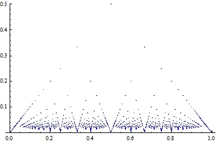
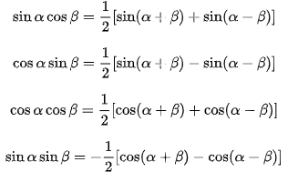

文本型数学符号集：← ↑ → ↓ ↖ ↗ ↘ ↙ ↔ ⇒ ⟺ ∞ € Œ œ Š š Ÿ ∫ ∬∮ ² ƒ × ÷ √ ± ≠ ‖ ≡ ≌ ∈ ⊆ ⊂ ⊇ ⊃ ≥ ≤ ∪ ∩ ⊙▽⊙ ∑ ∏ λ μ σ η ω ρ ξ α β θ Ω Φ ζ ψ ∂ ε π Λ ∀ ∃ △ ㏒㏑

# a、数列与排列组合：

**等差数列求和公式**：$s_n=na_1+\frac{n(n-1)}{2}d和s_n=\frac{n(a_1+a_n)}{2}$
等比数列求和公式：$S_n=\frac{a_1(1-q^n)}{1-q}=\frac{a_1-a_nq}{1-q}$
排列公式：$A^n_m=\frac{m!}{(m-n)!},全排列A^n_n=n!$。
组合公式：$C^n_m=\frac{A^n_m}{n!}=\frac{m!}{n!(m-n)!},\space\space C^0_n=C^n_n=1$#==0 的阶乘为 1（人为规定）==

# b、特殊函数：

1. **反函数**：
   一般来说，设函数 y=f(x)(x∈A)的值域是 C，若找得到一个函数 g(y)在每一处 g(y)都等于 x，这样的函数 x= g(y)(y∈C)叫做函数 y=f(x)(x∈A)的反函数，记作 x=f-1(y) 。反函数 x=f -1(y)的定义域、值域分别是函数 y=f(x)的值域、定义域。最具有代表性的反函数就是对数函数与指数函数。

- 单射：函数的映射中，映射关系只能一对一，不可一对多。
- 满射：函数其值域 Y 中每个 y 值都有对应的 x 映射。
- 双射：映射既满足单射，又满足满射的情况。
- **充分必要条件**：<b c=gn>一个函数满足双射条件，则其有反函数</b>（x，y唯一对应）

2. **显函数与隐函数**：显函数表达式大多是自变量的某个算式，如：`y=x2+1,u=e^x`等。而**隐函数**则是其自变量与因变量之间对应的法则写成的一个方程。如：x^2+y-2xy=0。

   > **隐函数定义**：设 E 属于 R^2，函数 F：E->R 对于方程：F(x,y)=0 如果存在 i,j 属于 R，对任何 x 属于 I 有唯一确定的 y 属于 j 使得(x,y)属于 E，且满足上述方程，则说该方程定义了一个定义在 I 上值域含于 J 的隐函数。

   ==隐函数存在定理1==：如果能满足隐函数求导公式即可

   隐函数存在定理2：设函数F(x,y,z)在点P(x0,y0,z0) 的某一邻域内具有连续偏导数，且 $F(x0,y0,z0)=0,F'_z(x0，y0,z0)≠0$。

   则方程：F(x,y,z)=0在点 (x0,y0,z0)的某一邻域内恒**能唯一确定一个**连续且具有连续偏导数的函数`z=f(x,y)`

3. **函数奇偶性**：一般对于函数 f(x)有：f(x)=f(-x)那么它是偶函数。如果 f(-x)=-f(x)那么它是奇函数。
   常见奇函数：$sinx,tanx,arcsinx,arctanx,\ln\frac{1-x}{1+x},\ln(x+\sqrt{1+x^2}),\frac{e^x-1}{e^x+1},f(x)-f(-x)$
   常见偶函数：$x^2,|x|,cosx,f(x)+f(-x)$。
   **奇偶运算**：奇+奇=奇，偶+偶=偶，奇x奇=偶，偶x偶=偶，奇x偶=奇。
4. **凸函数与凹函数**：国内和国外对两者的定义是相反的。
   定义 0.1：**国内**(根据几何图形的定义)：x1 和 x2 是函数上的两个点，若 x1 与 x2 中间任意一点都在 x1 和 x2 连线的上方则是凸函数，反之为凹函数。
   定义 0.2：**国外**(根据函数来定义)：若 f(x)在[a,b]上连续，在(a,b)内具有一阶和二阶导数，若在(a,b)内 f''(x)>0 则 f(x)在[a,b]上的图形是凹的，若 f''(x)<0 则是凸的。
   **定义 1**：（`use`）函数 f(x)在区间 i 上有定义，若对 i 中任意两点 x1，和 x2 和任意 r 属于(0,1)有：`f(r*x1+(1-r)*x2)<=r*f(x1)+(1-r)*f(x2)`则 f 为 i 上的**凸函数**，==<号成立则称为严格凸函数==，相反>=为凹
   **定义 2**：设函数 f(x)在区间 i 上有定义，当且仅当 ∀x1,x2∈I，有`f([x1+x2]/2)≤[f(x1)+f(x2)] / 2`，则 f(x)在 I 上为凸函数；
   定义 3：设函数 f(x)在区间 i 上有定义，当且仅当 ∀x1,x2,..,xn∈I，有$f(\frac{x_1+x_2+..+x_n}{n})\leq\frac{f(x_1)+f(x_2)+..+f(x_n)}{n}$,则 f(x)在 I 上为凸函数；定义 2 可推出定义 3；
   **几何意义**：凸函数上两点 x1<x2，(x1,x2)这段**曲线上的点**总是**在直线段 x1-x2 下方**（图像是向下凹的）【与定义1对应】
   定理 1：定义 2 与定义 3 等价；
   定理 2：<b c=gn> 若 f(x)连续，则定义 1,2,3 等价</b>；
   定理 3：
   定理 4：设函数 f(x)在区间 i 上有定义，f(x)为 I 上的凸函数的**充要条件**：∀x0∈I，∃ 实数 a，使得`f(x)≥a(x-x0)+f(x0)`
   定理 5：f(x)在 I 上有导数，则在 I 上为凸函数的**充要条件**是：f'(x)单调递增；
   定理 6：
5. **黎曼函数**：即约分数即为最简分数。在很多情况下可以**作为反例来验证某些函数**方面的待证命题。
    
   **特征**：黎曼函数是区间上的==有界函数==，其上确界是 1/2，下界是 0、黎曼函数在有理点的图象关于直线 x=1/2 对称。
   连续性：黎曼函数在数轴上一切==无理点连续，有理点不连续==
   极限情况：黎曼函数在区间 内的==极限处处为0==
6. **周期函数**：
7. **取整函数**：类似$[5.8]=5,[-3.2]=-4$所进行的是**下舍**。
8. 复合函数：类似$y=ln(sinx)$，内层函数的值域与外层函数的定义域**交集不为空**即可复合（）

**质因子**：（或质因数）在数论里是指能整除给定正整数的质数。

**复数**：我们把形如 z=a+bi（a、b 均为实数）的数称为复数。其中，a 称为实部，b 称为虚部，<b c=b>i 称为虚数单位（i^2=-1）</b>。当 z 的虚部 b ＝ 0 时，则 z 为实数；当 z 的虚部 b≠0 时，实部 a ＝ 0 时，常称 z 为纯虚数。复数域是实数域的代数闭包，即任何复系数多项式在复数域中总有根。如$\sqrt{-4}=2i$
**共轭复数**：两个实部相等，虚部互为相反数的复数互为共轭复数(conjugate complex number)。当虚部不为零时，共轭复数就是实部相等，虚部相反,如果虚部为零，其共轭复数就是自身
**自然常数**：为数学中一个常数，是一个无限不循环小数，且为超越数，其值约为 2.718281828459045。

**数学归纳法**：一般在发现某种规律时使用。步骤大致如下：(单调有界求极限情况一般用的较多)

1. 假设当 n=1 时命题成立,n=2 时命题成立；
2. 证明如果在 n=m 时成立,那么可以推导`n=m+1`时命题也成立.
3. 从而可以证明此命题成立.

**二次方程**：ax^2^+bx+c=0
（1）$x_{1/2}=\frac{-b\pm\sqrt{b^2-4ac}}{2a}$（2）$x_1+x_2=-\frac{b}{a},x_1x_2=\frac{c}{a}$（3）$b^2-4ac$>0 则方程有两不等实根，=0 则有相等实根，<0 有共轭复根

# c、基础变换：

:::alert-success
利用这些集合数的性质来变换它们的形态！(基础中的基础)
:::

1. 平方和差公式变换：
   **n 次方公式**：

$$
\begin{cases}
（1）a^n-b^n=(a-b)(a^{n-1}+a^{n-2}b+a^{n-3}b^2+..+ab^{n-2}+b^{n-1}) \\
（2）a^n+b^n=(a+b)(a^{n-1}-a^{n-2}b+a^{n-3}b^2+..-ab^{n-2}+b^{n-1}) \\
（3）(a+b)^n=C^0_na^n+C^1_na^{(n-1)}b+..+C^k_na^{n-k}b^k+..+C^n_nb^n
\end{cases}
$$

- 常见的使用：$a^2-b^2=(a-b)(a+b),\space\space a^3-b^3=(a-b)(a^2+ab+b^2)$
- **对分数指数形式**：$\sqrt[3]{a}-\sqrt[3]{b}=a^{1/3}-b^{1/3}=\frac{a-b}{(\sqrt[3]{a})^2+\sqrt[3]{a}\sqrt[3]{b}+(\sqrt[3]{b})^2}$#n 用分母??

2. 十字相乘分解：$x^2-10x+16=>(1*1)和(-2*-8)=>(x-2)(x-8)$
3. 常用的不等式：

$$
\begin{cases}
【1】 a^2+b^2\geq 2ab \\
【2】 \frac{a}{b}<\frac{c}{d} & 且b,d同号，则\frac{a}{b}<\frac{a+c}{b+d}<\frac{c}{d} \\
【3】 \frac{a_1+a_2+...+a_n}{n}\geq \sqrt[n]{a_1a_2...a_n} & 平均值不等式;算术平均>几何平均 \\【4】 -|a|\leq a\leq|a| \\
【5】 sinx<x<tanx & x∈(0,\pi/2) \\【6】  \frac{x}{1+x}<ln(1+x)<x & x∈(0,+\infty)\\
【7】 s=a_1+a_2+..+a_n,\space\space nm<s<nM & m=Min(a_1,a_2,..,a_n),M=Max(a_1,a_2,..,a_n)\\
【8】 a^k+b^k<(a+b)^k & a>0,b>0,k>1,\space(k<0则反过来) \\
【10】(\sum^n_{i=1}a_ib_i)^2\le\sum^n_{i=1}a^2_i*\sum^n_{i=1}b^2_i & cauchy不等式 \\
【11】(\int^b_af(x)g(x)dx)^2\le\int^b_af^2(x)dx\int^b_ag^2(x)dx & schwarz不等式 \\
【12】\sum^n_{i=1}a_ib_i\le(\sum^n_{i=1}a^k_i)^{1/k}*(\sum^n_{i=1}b^{k'}_i)^{1/k'}~,~(k>1时) & Holder不等式，a_i,b_i≥0~~,k,k'为实数,1/k+1/k'=1;~~(k<1时符号反过来)
\end{cases}
$$

- 延伸 3.1：$\frac{1+3}{2}>\sqrt{1*3},\space\space\frac{3+5+6}{3}>\sqrt[3]{3*5*6}$
- 延伸 6.1：$\frac{\ln[n]}{n^2}=\frac{\ln[1+(n-1)]}{n^2}<\frac{n-1}{n^2}<\frac{1}{n}$
- 延伸 8.1：$n^k<n^k+1<(n+1)^k,\space[k>0,n>0],\space两边同时开指数-k=>n^{-1}>(n^k+1)^{-1/k}>(n+1)^{-1}$

4. **拼凑简化分数**：

- **乘化和**：$\frac{1}{i(i+1)}=\frac{1}{i}-\frac{1}{i+1},\space\space\frac{1}{i(i+1)(i+2)}=\frac{1}{2i}-\frac{1}{(i+1)}-\frac{1}{2(i+2)}$

- 形如：$\frac{k}{ab^2c}=\frac{A}{a}+\frac{B1}{b}+\frac{B2}{b^2}+\frac{C}{c}$。（**一般分母x次数高的**项，其分子较其它分数==分子x的次数高==）
  $$
  例：求\int\frac{3x+6}{(x-1)^2(x^2+x+1)}dx \\
  解：设\frac{3x+6}{(x-1)^2(x^2+x+1)}=\frac{A}{x-1}+\frac{B}{(x-1)^2}+\frac{Cx+D}{x^2+x+1} \\
  原式=-2\int\frac{1}{x-1}dx+3\int\frac{1}{(x-1)^2}dx+\int\frac{2x+1}{x^2+x+1}dx
  $$
  
- $\frac{2}{\sqrt{k}+\sqrt{k+1}}=2(\sqrt{k+1}-\sqrt{k})$

- 提公因子：

5. 特殊：
   （1）利用$\sum_{i=1}^n\frac{2i-1}{n^2}=1$特性：$a=\sum_{i=1}^n\frac{2i-1}{n^2}a$
   （2）**stirling 公式**：$n!=\sqrt{2\pi n}n^ne^{-n+θ/12n },~~(0\leqθ\leq1)$，θ 可看情况取值来简化式子。
   （3）利用`vieta`公式；
6. 借助指数与对数的转换：$a=e^{lna},\space\space a^n=e^{lna^n}=e^{n*lna}$
7. 利用对数运算规则：$（1）log_a\frac{M}{N}=log_aM-log_aN（2）log_aMN=log_aM+log_aN（3）log_aM^n=nlog_aM（4）log_aM=\frac{log_bM}{log_ba}$
8. 三角函数的变换：

$$
\begin{cases}
【1】cos(a+b)=cosa*cosb-sina*sinb,sin(a+b)=sina*cosb+cosa*sinb,tan(a+b)=[tana+tanb]/(1-tan(a)tan(b)) \\
【2】cos^2\frac{x}{2}=\frac{1+cosx}{2},sin^2(x/2)=\frac{1-cosx}{2},tan(x/2)=\frac{1-cosx}{sinx}=\frac{sinx}{1+cosx},tan^2(x/2)=\frac{1-cosx}{1+cosx} &半倍角 \\
【3】sin3a=3sina-4sin^3a &三倍角 \\
【4】sin^2 α＋cos^2 α＝1。1＋tan^2 α＝sec^2 α、1＋cot^2 α＝csc^2 α &其它
\end{cases}
$$

- 延伸 1.1：$asinx+bcosx=\sqrt{a^2+b^2}[\frac{a}{\sqrt{a^2+b^2}}sinx+\frac{b}{\sqrt{a^2+b^2}}cosx]=\sqrt{a^2+b^2}sinx(ψ+x)$#利用勾股定理边的关系
- 衍生 2.1：$\int\frac{1}{1+cosx}dx~,~令x=t/2⇒\int\frac{1/2}{1+cos(2*t/2)}dt=\frac{1}{4}\int\frac{1}{1/cos^2(t/2)}dt=(1/4)*\int sec^2(t/2)dt=(1/4)*tan(t/2)$

9. 精彩的转换：
   （1）$n=\frac{n}{n-1}*\frac{n-1}{n-2}*..*\frac{3}{2}*\frac{2}{1}$
   （2）$1\leq\sqrt[n]{n}=(\sqrt{n}*\sqrt{n}*1..*1)^{1/n}$
   （3）$\frac{a_n}{n}=\frac{a_1+..+a_n}{n}-\frac{a_1+..+a_{n-1}}{n-1}*\frac{n-1}{n}$
   （4）$(1^3+2^3+3^3+..+i^3)=(1+2+3+..+i)^2$#仅对 3 次方成立
   （5）==利用平方和==：$(1+x)(1+x^2)..(1+x^{2^n})=\frac{(1-x)(1+x)(1+x^2)..(1+x^{2^n})}{(1-x)}=\frac{1-x^{2^{n+1}}}{1-x}$
10. 等差等比数列化简：
    （1）等差：$S_n=na_1+\frac{n(n-1)}{2}d=n(a_1+a_n)/2$
    （2）等比：$S_n=\frac{a_1(1-q^n)}{1-q}$
11. 常用极限：

$$
\begin{cases}
【1】\lim_{x\rightarrow 0}(1+x)^{1/x}=e & 就是1的\infty型极限 \\
【2】\lim_{x\rightarrow 0}\frac{a^x-1}{x}=lna \\
【3】\lim_{n\rightarrow\infty}\frac{x_1+x_2+..+x_n}{n}=x_n & 还有疑问！\\
【4】\lim_{n\rightarrow\infty}(1+1/2+1/3+..+1/n-lnn)=C存在 & 利用这个Euler经典极限来替换子式（用级数方法可证明） \\
【5】\lim_{n\rightarrow\infty}n^{1/n}=1
\end{cases}
$$

# c1、vieta 公式

:::alert-warning
Vieta 公式是数学家 Vieta 在 1593 年发表的，这是数学史上第一次用无穷乘积来表示一个数，同时也是对于圆周率 π 的认识上的重大突破!
:::
**公式**：证明如下

$$
\frac{2}{\pi}=1/[\sqrt{\frac{1}{2}}*\sqrt{\frac{1}{2}+\frac{1}{2}\sqrt{\frac{1}{2}}}*\sqrt{\frac{1}{2}+\frac{1}{2}\sqrt{\frac{1}{2}+\frac{1}{2}\sqrt{\frac{1}{2}}}}*..]
$$

1. 利用$(θ=\pi/4),~~cosθ=\sqrt{\frac{1}{2}}~,~cosθ/2=\sqrt{\frac{1}{2}+\frac{1}{2}cosθ}$
2. 则原式可写成：$2/\pi=cosθ*cos(θ/2)*cos(θ/4)*..*cos(θ/2^n)*...。~~令x_n=cosθ*cos(θ/2)*..*cos(θ/2^n)$
3. $x_n=x_n*(2^nsin[x/2^n]/2^nsin[x/2^n])=sinx/2^nsin[x/2^n];~~~(2cos[x/2^n]sin[x/2^n]=sin[x/2^{n-1}])$#利用这个 sin2 倍角公式一直相乘，简化可得左侧结果
4. $x_n=\frac{sinx}{x}\frac{x/2^n}{sin[x/2^n]}\rightarrow\frac{sinx}{x};~~(n\rightarrow\infty)$#左侧分母使用等价替换即可得到
5. $x=\pi/2代入\frac{sinx}{x}就可得到2/\pi$#<b>似乎还缺点啥！</b>

# d、三角函数相关：

secα=斜边/邻边； cscα=斜边/对边；`sinα/cosα＝tanα＝secα/cscα`、`cosα/sinα＝cotα＝cscα/secα`。

- **展开形式**：
  $$
  cos(a+b)=cosa*cosb-sina*sinb,cos(a-b)=cosa*cosb+sina*sinb,\\
  sin(a+b)=sina*cosb+cosa*sinb,sin(a-b)=sina*cosb-cosa*sinb \\
  tan(a+b)=\frac{tan(a)+tan(b)}{tan(a)*tan(b)}
  $$
  
- **平方关系**：$sin^2 α＋cos^2 α＝1。1＋tan^2 α＝sec^2 α、1＋cot^2 α＝csc^2 α$。

- **二倍角关系**：$sin2a=2sina*cosa。cos2a=cos^2a-sin^2a=2cos^2a-1=1-2sin^2a。tan2a=2tana/(1-tan^2a)$

- 半倍角关系：$cos^2\frac{x}{2}=\frac{1+cosx}{2},sin^2(x/2)=\frac{1-cosx}{2},tan(x/2)=\frac{1-cosx}{sinx}=\frac{sinx}{1+cosx},tan^2(x/2)=\frac{1-cosx}{1+cosx},sin3a=3sina-4sin^3a$

- **反三角函数**：y=tanx 则 x=arctany。arcsin 与 arccos 也是如此。[三角函数公式大全。](https://wenku.baidu.com/view/55e809b9a517866fb84ae45c3b3567ec112ddcc3.html)

- 常用三角函数值：

|  a   |  0  |      30      |      45      |      60      | 90  |
| :--: | :-: | :----------: | :----------: | :----------: | :-: |
| 弧度 |  0  |     π/6      |     π/4      |     π/3      | π/2 |
| sina |  0  |     1/2      | $\sqrt{2}/2$ | $\sqrt{3}/2$ |  1  |
| cosa |  1  | $\sqrt{3}/2$ | $\sqrt{2}/2$ |     1/2      |  0  |
| tana |  0  | $\sqrt{3}/3$ |      1       |  $\sqrt{3}$  |  -  |

- **积化和差**：
  

**求**：$x=tant,arctan(sint)=T，sint=?$

> sin 与 tan 的关系用式子可以表示出来，$tant=x，则：tanT=sint=\frac{x}{\sqrt{1+x^2}}$#将一些 x 值代入式中发现是成立的。

# e、几何相关：

- **渐进线**：当曲线上一点 M 沿曲线无限远离原点或无限接近间断点时，如果 M 到一条直线的距离无限趋近于零，那么这条直线称为这条曲线的渐近线。**并不是所有曲线都有渐近线**，渐近线反映了某些曲线在**无限延伸时的变化情况**。按方向渐近线分为水平渐进线、垂直渐近线、斜渐进线。（注意==x→+/-∞==方向，可以有n条渐进线）

  1. 水平：如果当`x→∞时,f(x)→c`,则曲线 y=f(x)有一**水平渐近线**y=c。注意==x→-∞==时也要考虑
  2. 垂直：如果当`x→xℴ时,f(x)→∞`,则曲线 y=f(x)有一**铅直渐近线**x=xℴ。
  3. 斜：如果极限`x→+∞lim[f(x)/x]=a`存在,且极限`x→+∞lim[f(x)-ax]=b`，则存在一个**斜渐进线**y=ax+b。

- **点到平面、点、线的距离**：**平面表达式**：`ax+by+cz+D=0`。线 L 表达式：`ax+by+c=0,p(x0,y0)`。点 p(x0,y0,z0)，则距离公式为：
  `d=|ax0+by0+cz0+D|/sqrt(a^2+b^2+c^2)`。[到点]`sqrt((x1-x2)^2+(y1-y2)^2)`。`|ax0+by0+c|/sqrt(a^2+b^2)`[点到线]
- **椭圆标准方程**：当焦点在**x 轴**时，椭圆的标准方程是：`x^2/a^2+y^2/b^2=1`，(a>b>0)；当 b>a>0 时焦点在**y 轴**。
  焦点是绘制椭圆时使用的，椭圆圆心就在两个焦点中间，<b c=r>焦点在 x 轴时是：(c,0)和(-c,0)，`c^2=a^2-b^2`，对应的 x 轴上是俩个突出点。</b>
  > 椭圆面积：`s=πab`#a 为长半轴长，b 为短半轴长。2a 为总长，2b 为总宽。
  > 椭圆周长公式：L=2πb+4（a-b）
- **圆标准方程**：`(x-a)^2+(y-b)^2=r^2`#(a,b)就是圆心。
- 圆的直角坐标方程转为极坐标方程：无论何种形式，$x=ρcos\Theta,y=ρsin\Theta$代入直角坐标方程
  （1）类型$x^2+y^2=r^2<=>ρ^2cos^2\Theta + ρ^2sin^2\Theta =r^2$#此时 ρ=r，可将 ρ 替换为 r 表示。
  （2）圆心不在原点而是(a,0),r=a 时$ρ=2acos\Theta$
  （3）圆心在(0,a),r!=a 时，以上两种都可以表示：$ρ^2+a^2-2aρsin\Theta =r^2$

**空间曲线**：一般方程：$\begin{cases}F(x,y,z)=0\\G(x,y,z)=0\end{cases}的切向量：r=n1 * n2，n1=(F'x,F'y,F'z)，n2=(G'x,G'y,G'z)$

**曲率**：曲线的曲率（curvature）就是针对曲线上某个点的切线方向角对弧长的转动率，通过微分来定义，表明曲线偏离直线的程度。数学上表明曲线在某一点的弯曲程度的数值。

- 定义：弧 MM'的切线转角 △a，与弧长 △s 的比值，`k=△a/△s`。**直角坐标系下曲率公式**：`k=|y''|/(1+y'^2)^(3/2)`
- 曲率半径：点 M 处的曲率的倒数。

**曲率圆**：又称密切圆。在曲线上一点 M 的法线上，在**凹的一侧**取一点 D ，使**DM 等于该点处的曲率半径**，以 D 为圆心，DM 为半径作圆，这个圆边界贴近曲线叫做曲线在点处的曲率圆。

**直线方程**：根据已知条件建立一个方程。

> 点斜式：知道一个点和斜率，`y-y1 = k(x-x1)`。
> 斜截式：知道斜率和截距，`y=kx+b`。
> 两点式：知道两个点，`(y-y1) / (y2-y1) = (x-x1) / (x2-x1)`。
> 截距式：知道与两个坐标的截距，x/a + y/b = 1。
> 一般式：ax+by+c = 0。

**旋转面**：一条平面曲线绕平面上一条直线旋转。L 为 YOZ 平面上曲线：$\begin{cases}f(y,z)=0\\x=0\end{cases}$

- L 绕 y 轴所得旋转面方程：$f(y,+/-\sqrt{x^2+z^2})$, L 绕 y 轴所得旋转面方程：$f(+/-\sqrt{x^2+y^2},z)$

**柱面**：平行于定直线并沿定曲线 T 移动的直线 L 形成的轨迹。

- 准线为$T:\begin{cases}f(x,y)=0\\z=0\end{cases}$,母线平行于 z 轴的柱面方程：f(x,y)=0
- 准线为$T:\begin{cases}F(x,y)=0\\G(x,y)=0\end{cases}$,母线平行于 z 轴的柱面方程：F(x,y,z)=0 和 G(x,y,z)=0 联立消去 z 所得二元方程 H(x,y)=0。

**曲面的切平面与法线**：【曲面无切向量？】
$$\begin{cases}曲面F(x,y,z)=0 & 法向量：n=(F'_x,F'_y,F'_z) \\ 曲面z=f(x,y) & 法向量：n=(f'_x,f'_y,-1)\end{cases}$$

- 平面方程：一般形如：`Ax+By+Cz+D=0`；
- **法向量**：曲面某一切点(x0,y0,z0)处，的法向量为：$(Fx(x_0,y_0,z_0),Fy(x_0,y_0,z_0),Fz(x_0,y_0,z_0))$。曲面 z=f(x,y)的**法向量**：`n=(f'x,f'y,-1)`
- **切面方程**：(x0,y0,z0)处的切面方程：`Fx(x-x0)+Fy(y-y0)+Fz(z-z0)=0`
- 法线方程：$\frac{x-x_0}{F_x(x_0,y_0,z_0)}=\frac{y-y_0}{F_y(x_0,y_0,z_0)}=\frac{z-z_0}{F_z(x_0,y_0,z_0)}$

**曲线的切线与法平面**：
（1）曲线$\begin{cases}x=x(t)\\y=y(t)\\z=z(t)\end{cases}，切向量：r=(x'(t_0),y'(t_0),z'(t_0))$
（2）曲线$\begin{cases}F(x,y,z)=0\\G(x,y,z)=0\end{cases}，切向量：r=n_1 * n_2其中n_1=(F'_x,F'_y,F'_z),n_2=(G'_x,G'_y,G'_z)$#向量叉乘[^b]

圆球：$V_体=\frac{4}{3}\pi R^3，S_表=4\pi R^2$。梯形面积公式：$S=\frac{(L_1+L_2)H}{2}$#L1,L2 是上下底长。
圆柱：$S_侧=2\pi Rh，V=S_底h$。平行四边形面积公式：$S=LH$#L 是一条边，H 是与该边垂直的到另一条边的高。
圆锥：$V=\frac{1}{3}S_底h,\space S_侧=\pi RL$#L 为母线（侧面斜线长）。
圆台：侧面积$S=\pi(R_1+R_2)L,\space 体积V=\frac{1}{3}\pi H(R^2_1+R^2_2+R_1R_2)$#R1,R2 是上下底的半径。

# e1、极坐标

二维坐标系，指在平面内取一个定点 O，叫极点，引一条射线 Ox，叫做极轴，再选定一个长度单位和角度的正方向（通常取逆时针方向）。<b c=gn>极坐标圆心与直接坐标圆心重合。</b>

> 对于平面内任何一点 M，用 ρ 表示线段 OM 的长度（有时也用 r 表示），θ 表示从 Ox 到 OM 的角度，ρ 叫做点 M 的极径，θ 叫做点 M 的极角，有序数对 (r,θ)就叫点 M 的极坐标。
> <b c=r>无论任何图形，极坐标中都是用角度和点到原点的距离 ρ 表示的。</b><b c=b>所以任何图形用极坐标表示都是将`x=ρcos(t),y=ρsin(t)`代入</b>【画 ρ 与 x，y 的关系图就知道】
