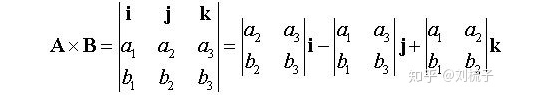

# Q、常用符号：
文本型数学符号集：† ← ↑ → ↓ ↔ €  Œ œ Š š Ÿ ƒ ⊗  σ η ω ρ ∈ ⊙▽⊙ ∑  λ μ ξ α β θ ≠ ∞ ∂ △ π

# 一、基础数学：
## a、几何相关：                       
- **渐进线**：当曲线上一点M沿曲线无限远离原点或无限接近间断点时，如果M到一条直线的距离无限趋近于零，那么这条直线称为这条曲线的渐近线。**并不是所有曲线都有渐近线**，渐近线反映了某些曲线在**无限延伸时的变化情况**。按方向渐近线分为水平渐进线、垂直渐近线、斜渐进线。
    1. 水平：如果当`x→∞时,f(x)→c`,则曲线y=f(x)有一**水平渐近线**y=c。
    2. 垂直：如果当`x→xℴ时,f(x)→∞`,则曲线y=f(x)有一**铅直渐近线**x=xℴ。
    3. 斜：如果极限`x→+∞lim[f(x)/x]=a`存在,且极限`x→+∞lim[f(x)-ax]=b`，则存在一个**斜渐进线**y=ax+b。

- **点到平面、点、线的距离**：**平面表达式**：`ax+by+cz+D=0`。线L表达式：`ax+by+c=0,p(x0,y0)`。点p(x0,y0,z0)，则距离公式为：
`d=|ax0+by0+cz0+D|/sqrt(a^2+b^2+c^2)`。[到点]`sqrt((x1-x2)^2+(y1-y2)^2)`。`|ax0+by0+c|/sqrt(a^2+b^2)`[点到线]
- **椭圆标准方程**：当焦点在**x轴**时，椭圆的标准方程是：`x^2/a^2+y^2/b^2=1`，(a>b>0)；当b>a>0时焦点在**y轴**。
焦点是绘制椭圆时使用的，椭圆圆心就在两个焦点中间，<b c=r>焦点在x轴时是：(c,0)和(-c,0)，`c^2=a^2-b^2`，对应的x轴上是俩个突出点。</b>
>椭圆面积：`s=πab`#a为长半轴长，b为短半轴长。2a为总长，2b为总宽。
>椭圆周长公式：L=2πb+4（a-b）
- **圆标准方程**：`(x-a)^2+(y-b)^2=r^2`#(a,b)就是圆心。
- 圆的直角坐标方程转为极坐标方程：无论何种形式，$x=ρcos\Theta,y=ρsin\Theta$代入直角坐标方程
（1）类型$x^2+y^2=r^2<=>ρ^2cos^2\Theta + ρ^2sin^2\Theta =r^2$#此时ρ=r，可将ρ替换为r表示。
（2）圆心不在原点而是(a,0),r=a时$ρ=2acos\Theta$
（3）圆心在(0,a),r!=a时，以上两种都可以表示：$ρ^2+a^2-2aρsin\Theta =r^2$

**空间曲线**：一般方程：$\begin{cases}F(x,y,z)=0\\G(x,y,z)=0\end{cases}的切向量：r=n1 * n2，n1=(F'x,F'y,F'z)，n2=(G'x,G'y,G'z)$

**曲率**：曲线的曲率（curvature）就是针对曲线上某个点的切线方向角对弧长的转动率，通过微分来定义，表明曲线偏离直线的程度。数学上表明曲线在某一点的弯曲程度的数值。
- 定义：弧MM'的切线转角△a，与弧长△s的比值，`k=△a/△s`。**直角坐标系下曲率公式**：`k=|y''|/(1+y'^2)^(3/2)`
- 曲率半径：点M处的曲率的倒数。

**曲率圆**：又称密切圆。在曲线上一点M的法线上，在**凹的一侧**取一点D ，使**DM等于该点处的曲率半径**，以D为圆心，DM为半径作圆，这个圆边界贴近曲线叫做曲线在点处的曲率圆。

**直线方程**：根据已知条件建立一个方程。
>点斜式：知道一个点和斜率，`y-y1 = k(x-x1)`。
>斜截式：知道斜率和截距，`y=kx+b`。
>两点式：知道两个点，`(y-y1) / (y2-y1) = (x-x1) / (x2-x1)`。
>截距式：知道与两个坐标的截距，x/a  + y/b = 1。
>一般式：ax+by+c = 0。

**旋转面**：一条平面曲线绕平面上一条直线旋转。L为YOZ平面上曲线：$\begin{cases}f(y,z)=0\\x=0\end{cases}$
- L绕y轴所得旋转面方程：$f(y,+/-\sqrt{x^2+z^2})$,   L绕y轴所得旋转面方程：$f(+/-\sqrt{x^2+y^2},z)$

**柱面**：平行于定直线并沿定曲线T移动的直线L形成的轨迹。
- 准线为$T:\begin{cases}f(x,y)=0\\z=0\end{cases}$,母线平行于z轴的柱面方程：f(x,y)=0
- 准线为$T:\begin{cases}F(x,y)=0\\G(x,y)=0\end{cases}$,母线平行于z轴的柱面方程：F(x,y,z)=0和G(x,y,z)=0联立消去z所得二元方程H(x,y)=0。

**曲面的切平面与法线**：【曲面无切向量？】
$$\begin{cases}曲面F(x,y,z)=0 & 法向量：n=(F'_x,F'_y,F'_z) \\ 曲面z=f(x,y) & 法向量：n=(f'_x,f'_y,-1)\end{cases}$$
- 平面方程：一般形如：`Ax+By+Cz+D=0`；
- **法向量**：曲面某一切点(x0,y0,z0)处，的法向量为：$(Fx(x_0,y_0,z_0),Fy(x_0,y_0,z_0),Fz(x_0,y_0,z_0))$。曲面z=f(x,y)的**法向量**：`n=(f'x,f'y,-1)`
- **切面方程**：(x0,y0,z0)处的切面方程：`Fx(x-x0)+Fy(y-y0)+Fz(z-z0)=0`
- 法线方程：$\frac{x-x_0}{F_x(x_0,y_0,z_0)}=\frac{y-y_0}{F_y(x_0,y_0,z_0)}=\frac{z-z_0}{F_z(x_0,y_0,z_0)}$

**曲线的切线与法平面**：
（1）曲线$\begin{cases}x=x(t)\\y=y(t)\\z=z(t)\end{cases}，切向量：r=(x'(t_0),y'(t_0),z'(t_0))$
（2）曲线$\begin{cases}F(x,y,z)=0\\G(x,y,z)=0\end{cases}，切向量：r=n_1 * n_2其中n_1=(F'_x,F'_y,F'_z),n_2=(G'_x,G'_y,G'_z)$#向量叉乘[^b]

**定积分的应用**：
- **旋转体表面积公式**：平面光滑曲线f(x)>=0，绕x轴旋转一周所得曲面侧面积为：
$dS=2\pi yds=2\pi f(x)\sqrt{1+f'^2(x)}<积分后得旋转体侧面积>S=2\pi \int ^b_a f(x)\sqrt{1+f'^2(x)}dx$
- **上面旋转体**`x=t`处的**底面积**：$F(t)=\pi f^2(x)|^{}_{x=t}$

- **x轴旋转体体积**：若区域D有曲线y=f(x)(f(x)>=0)，和直线x=a,x=b(0<=a<b)及x轴所围成，则：
>**D绕x轴旋转**：转一周得到的旋转体体积：$V_x=\pi\int ^b_a f^2(x)dx,绕y轴旋转得到的体积：V_y=\int ^b_a xf(x)dx$
- **y轴旋转体体积**：函数是在y1,y2内绕y轴旋转的情况。<b c=r>比如圆，可以计算其反函数（转为x=y类型表示的函数）然后绕y轴转，求Vy就用上面绕x轴转时的公式</b>

- 函数$\begin{cases}x=cos^3t \\y=sin^3t\end{cases},则V_x=\pi\int^b_a y^2dx=\pi\int^b_a sin^3t \space d(cos^3t)$#将x，y更换即可。

- 两函数所围面积旋转的体积：用两函数旋转的体积相减即可。
- 平面区域D截立体几何V得到的体积：截到的立体曲顶方程依然用V公式表示，然后求关于D积分：$\int\int ^{}_DVdp$#尝试使用极坐标转化，积分范围是D。
- **平面图形面积**：若平面区域D由曲线`y=f(x),y=g(x)(f(x)>=g(x))，x=a,x=b(a<b)`所围成，则D面积：`S=\int ^b_a f(x)-g(x)dx`。#该面积D绕x，y旋转的体积也如下处理，不过把f(x)-g(x)当成一个整体。
- **曲线弧长**，如下：
 1. $C:y=y(x),a\leq x\leq b得弧长s=\int ^b_a \sqrt{1+(y')^2}dx$
 2. $C:\begin{cases}x=x(t)\\y=y(t)\end{cases},a\leq t\leq b得弧长s=\int ^b_a \sqrt{(x')^2+(y')^2}dt$
 3. $C:p=p(\Theta),a\leq\Theta\leq b得弧长s=\int ^b_a f(x)\sqrt{p^2+(p')^2}d\Theta$

圆球：$V_体=\frac{4}{3}\pi R^3，S_表=4\pi R^2$。梯形面积公式：$S=\frac{(L_1+L_2)H}{2}$#L1,L2是上下底长。
圆柱：$S_侧=2\pi Rh，V=S_底h$。平行四边形面积公式：$S=LH$#L是一条边，H是与该边垂直的到另一条边的高。
圆锥：$V=\frac{1}{3}S_底h,\space S_侧=\pi RL$#L为母线（侧面斜线长）。
圆台：侧面积$S=\pi(R_1+R_2)L,\space 体积V=\frac{1}{3}\pi H(R^2_1+R^2_2+R_1R_2)$#R1,R2是上下底的半径。

**极坐标**：二维坐标系，指在平面内取一个定点O，叫极点，引一条射线Ox，叫做极轴，再选定一个长度单位和角度的正方向（通常取逆时针方向）。<b c=gn>极坐标圆心与直接坐标圆心重合。</b>
>对于平面内任何一点M，用ρ表示线段OM的长度（有时也用r表示），θ表示从Ox到OM的角度，ρ叫做点M的极径，θ叫做点M的极角，有序数对 (r,θ)就叫点M的极坐标。
><b c=r>无论任何图形，极坐标中都是用角度和点到原点的距离ρ表示的。</b><b c=b>所以任何图形用极坐标表示都是将`x=ρcos(t),y=ρsin(t)`代入</b>【画ρ与x，y的关系图就知道】

多元积分在几何/物理上的应用公式：
|  所求量\几何体   |  平面板   |   空间体  |  曲线   |  曲面   |
| :-- | :-- | :-- | :-- | :-- |
|  几何度量   |   面积$S=\int\int_Dda$  |  体积$V=\int\int\int_vdv$   |  弧长$L=\int_cds$   |   面积$S=\int\int_xdS$   |
|  质量   |  $m=\int\int_Dp(x,y)da$   |  $m=\int\int\int_vp(x,y,z)dv$   |  $m=\int\int_cf(x,y,z)ds$   |  $m=\int\int_xp(x,y,z)dS$   |
|  质心   |  $x=\frac{\int\int_D xp(x,y)da}{\int\int_D p(x,y)da}$   |  $x=\frac{\int\int\int_v xp(x,y,z)dv}{\int\int\int_v p(x,y,z)dv}$   |  ..类推   |   ..类推  |
|  转动惯量   |  $I_x=\int\int_Dp(x,y)da$   |  $I_x=\int\int\int_v (x^2+y^2)p(x,y,z)dv$   |  $I_x=\int_c (x^2+y^2)p(x,y,z)ds$   |   $I_x=\int\int_xp(x^2+y^2)p(x,y,z)dS$  |
- 变力做工：力$F=Pi+Qj+Rk,\space W=\int_{AB}pdx+Qdy+Rdz$
- 通量：向量场$U(x,y,z)=Pi+Qi+Rk,通量C=\int\int_{\sum}pdydz+Qdzdx+Rdxdy$

## b、三角函数相关：
secα=斜边/邻边； cscα=斜边/对边；`sinα/cosα＝tanα＝secα/cscα`、`cosα/sinα＝cotα＝cscα/secα`。
- **展开形式**：$cos(a+b)=cosa*cosb-sina*sinb,cos(a-b)=cosa*cosb+sina*sinb,sin(a+b)=sina*cosb+cosa*sinb,sin(a-b)=sina*cosb-cosa*sinb$
- **平方关系**：$sin^2 α＋cos^2 α＝1。1＋tan^2 α＝sec^2 α、1＋cot^2 α＝csc^2 α$。
- **二倍角关系**：$sin2a=2sina*cosa。cos2a=cos^2a-sin^2a=2cos^2a-1=1-2sin^2a。tan2a=2tana/(1-tan^2a)$
>$cos^2\frac{x}{2}=\frac{1+cosx}{2},sin^2(x/2)=\frac{1-cosx}{2},tan(x/2)=\frac{1-cosx}{sinx}=\frac{sinx}{1+cosx},tan^2(x/2)=\frac{1-cosx}{1+cosx},sin3a=3sina-4sin^3a$
- **反三角函数**：y=tanx则x=arctany。arcsin与arccos也是如此。[三角函数公式大全。](https://wenku.baidu.com/view/55e809b9a517866fb84ae45c3b3567ec112ddcc3.html)
- 常用三角函数值：

| a    |  0   |   30  |  45   |  60   |   90  |
| :-: | :-: | :-: | :-: | :-: | :-: |
|  弧度   |  0   |  π/6   |  π/4   |  π/3   |  π/2   |
|  sina   |  0   |   1/2  |  $\sqrt{2}/2$   |   $\sqrt{3}/2$  |  1   |
|  cosa   |   1  |   $\sqrt{3}/2$  |   $\sqrt{2}/2$  |  1/2   |   0  |
|  tana   |   0  |  $\sqrt{3}/3$   |  1   |  $\sqrt{3}$   |  -   |
**求**：$x=tant,arctan(sint)=T，sint=?$
>sin与tan的关系用式子可以表示出来，$tant=x，则：tanT=sint=\frac{x}{\sqrt{1+x^2}}$#将一些x值代入式中发现是成立的。


## c、其它：
**等差数列求和公式**：$s_n=na_1+\frac{n(n-1)}{2}d和s_n=\frac{n(a_1+a_n)}{2}$
等比数列求和公式：$S_n=\frac{a_1(1-q^n)}{1-q}=\frac{a_1-a_nq}{1-q}$
排列公式：$A^m_n=\frac{n!}{(n-m)!},全排列A^n_n=n!$。
组合公式：$C^m_n=\frac{A^m_n}{m!}=\frac{n!}{m!(n-m)!}$

**反函数**：
:::alert-info
一般来说，设函数y=f(x)(x∈A)的值域是C，若找得到一个函数g(y)在每一处g(y)都等于x，这样的函数x= g(y)(y∈C)叫做函数y=f(x)(x∈A)的反函数，记作x=f-1(y) 。反函数x=f -1(y)的定义域、值域分别是函数y=f(x)的值域、定义域。最具有代表性的反函数就是对数函数与指数函数。
:::

- 单射：函数的映射中，映射关系只能一对一，不可一对多。
- 满射：函数其值域Y中每个y值都有对应的x映射。
- 双射：映射既满足单射，又满足满射的情况。
- **充分必要条件**：<b c=gn>一个函数满足双射条件，则其有反函数。</b>

**显函数与隐函数**：显函数表达式大多是自变量的某个算式，如：`y=x2+1,u=e^x`等。而**隐函数**则是其自变量与因变量之间对应的法则写成的一个方程。如：x^2+y-2xy=0。
>**隐函数定义**：设E属于R^2，函数F：E->R对于方程：F(x,y)=0如果存在i,j属于R，对任何x属于I有唯一确定的y属于j使得(x,y)属于E，且满足上述方程，则说该方程定义了一个定义在I上值域含于J的隐函数。

**函数奇偶性**：一般对于函数f(x)有：f(x)=f(-x)那么它是偶函数。如果f(-x)=-f(x)那么它是奇函数。
**质因子**：（或质因数）在数论里是指能整除给定正整数的质数。
**因式分解**：
- 十字相乘法：一般用于分解二次三项式（一元:ax^2+bx+c）将二次项系数和常数项各分解为乘积形式，然后十字相乘相加得到bx（一直尝试不同的分解）。如：$x^2-10x+16=>(1*1)和(-2*-8)=>(x-2)(x-8)$
- 分式变换：$\frac{k}{ab^2c}=\frac{A}{a}+\frac{B1}{b}+\frac{B2}{b^2}+\frac{C}{c}$#分母上每个乘因式都列出来。
- **对数计算**：$（1）log_a\frac{M}{N}=log_aM-log_aN（2）log_aMN=log_aM+log_aN（3）log_aM^n=nlog_aM（4）log_aM=\frac{log_bM}{log_ba}$

**复数**：我们把形如 z=a+bi（a、b均为实数）的数称为复数。其中，a 称为实部，b 称为虚部，<b c=b>i 称为虚数单位（i^2=-1）</b>。当 z 的虚部 b＝0 时，则 z 为实数；当 z 的虚部 b≠0 时，实部 a＝0 时，常称 z 为纯虚数。复数域是实数域的代数闭包，即任何复系数多项式在复数域中总有根。如$\sqrt{-4}=2i$
**共轭复数**：两个实部相等，虚部互为相反数的复数互为共轭复数(conjugate complex number)。当虚部不为零时，共轭复数就是实部相等，虚部相反,如果虚部为零，其共轭复数就是自身
**自然常数**：为数学中一个常数，是一个无限不循环小数，且为超越数，其值约为2.718281828459045。
**基本不等式**：
```mathjax
$$\begin{cases}
a^2+b^2\geq 2ab \\
\frac{a}{b}<\frac{c}{d} & 且b,d同号，则\frac{a}{b}<\frac{a+c}{b+d}<\frac{c}{d} \\
\frac{a_1+a_2+...+a_n}{n}\geq \sqrt[n]{a_1a_2...a_n} \\-|a|\leq a\leq|a| \\
sinx<x<tanx & x∈(0,\pi/2) \\ \frac{x}{1+x}<ln(1+x)<x & x∈(0,+\infty)
\end{cases}
$$
```
**n次方公式**：
```mathjax
$$
（1）a^n-b^n=(a-b)(a^{n-1}+a^{n-2}b+a^{n-3}b^2+..+ab^{n-2}+b^{n-1}) \\
（2）a^n+b^n=(a+b)(a^{n-1}-a^{n-2}b+a^{n-3}b^2+..-ab^{n-2}+b^{n-1}) \\
（3）(a+b)^n=C^0_na^n+C^1_na^(n-1)b+..+C^k_na^{n-k}b^k+..+C^n_nb^n
$$
```

**数学归纳法**：一般在发现某种规律时使用。步骤大致如下：(单调有界求极限情况一般用的较多)
1. 假设当n=1时命题成立,n=2时命题成立；
2. 证明如果在n=m时成立,那么可以推导`n=m+1`时命题也成立.
3. 从而可以证明此命题成立.

**凸函数与凹函数**：国内和国外对两者的定义是相反的，**国内**(根据几何图形的定义)：x1和x2是函数上的两个点，若x1与x2中间任意一点都在x1和x2连线的上方则是凸函数，反之为凹函数。**国外**(根据函数来定义)：若f(x)在[a,b]上连续，在(a,b)内具有一阶和二阶导数，若在(a,b)内f''(x)>0则f(x)在[a,b]上的图形是凹的，若f''(x)<0则是凸的。**统一的判断方法**：设函数f(x)在区间i上有定义，若对i中任意两点x1，和x2和任意r属于(0,1)都有：`f(r*x1+(1-r)*x2)<=r*f(x1)+(1-r)*f(x2)`则f为i上的凸函数，>号成立则称为严格凸函数，相反<=为凹函数。
**黎曼函数**：即约分数即为最简分数。在很多情况下可以**作为反例来验证某些函数**方面的待证命题。

特征：黎曼函数是区间上的有界函数，其上确界是1/2，下界是0、黎曼函数在有理点的图象关于直线x=1/2对称。

**二次方程**：ax^2^+bx+c=0
（1）$x_{1/2}=\frac{-b\pm\sqrt{b^2-4ac}}{2a}$（2）$x_1+x_2=-\frac{b}{a},x_1x_2=\frac{c}{a}$（3）$b^2-4ac$#>0则方程有两不等实根，=0则有相等实根，<0有共轭复根
# 二、数学分析知识：

## 1、极限：
**一元函数极限**：
- **定义**：设f为定义在`[a,正无穷]`的函数，A为定数，若对任给的q>0，存在正数`M(>=a)`,使得当x>M时<b c=b>(因为M可以无穷大，所以x也需要趋于无穷大方向，这要求x逐渐增大f(x)趋于一个值，所以需要x>M这个条件)</b>有：`|f(x)-A|<q`。则称函数f当x区于正无穷时以A为极限，记为：`lim(x->正无穷)f(x)=A`。

- $\lim_{x\rightarrow \infty}f(x)$极限存在的**充要条件**：$\lim_{x\rightarrow -\infty}f(x)=\lim_{x\rightarrow +\infty}f(x)$且两者极限都存在。
- **左右极限**：若对任意给定的a>0,总存在b>0，当`x0-b<x<x0`时恒有`|f(x)-A|<a`则称常数A为函数f(x)当x->x0时的左极限。相应的可以定义右极限。
- 极限$\lim_{x\rightarrow x0}f(x)$存在的**充要条件**：左极限$\lim_{x\rightarrow x0^-}f(x)与\lim_{x\rightarrow x0^+}f(x)存在且相等$。
- 需要考虑左右极限的几种情况：
（1）分段函数在分界点处，且两个段函数表达式不同，包括有绝对值情况。
（2）$e^{\infty}$型极限，如$lim_{x\rightarrow0^-}e^{1/x}=0,lim_{x\rightarrow0^+}e^{1/x}=+\infty$#则它的极限不存在。
（3）$arctan^{\infty}$型极限，如$lim_{x\rightarrow0^-}arctan(1/x)=-\frac{\pi}{2},lim_{x\rightarrow0^+}arctan(1/x)=\frac{\pi}{2}$#极限也不存在。

**夹逼准则**：若存在N，当n>N时，$x_n<=y_n<=z_n，且lim_{n\rightarrow\infty}xn=lim_{n\rightarrow\infty}zn=a则lim_{n\rightarrow\infty}zn=a$
**单调有界准则**：单调有界数列必有极限。<b c=r>夹逼准则一般用于数列多项求和时求极限，单调有界一般用于数列求第n项的极限，当然这些也可以用于函数求极限</b>
**极限保号性**：函数极限的保号性是指满足一定条件（例如极限存在或连续）的函数在<b c=v>局部范围内函数值的符号保持恒正或恒负的性质。</b>**定义**：函数f在x->c时极限存在，则存在c的某去心领域内(c-a,c+a)，该极限任然存在。

- **无穷小量**：x->x0时，极限趋于0的函数或数列。
- **无穷小量比值**：两个无穷小的极限不确定，<i c=b>f与g两个无穷小量收敛速度不同，所以需要比对它们的收敛快慢在做出判断，因此引出该概念。</i>
>**定义**：设f在某U(x0)上有定义，f与g均为无穷小量，若`lim(x->x0)f(x)/g(x)=0`，称x->x0时，f为g的**高阶无穷小量**，或称g为f的**低阶无穷小量**。
><b c=gn>若f(x)是g(x)高阶无穷小的话，则f(x)的收敛速度比g(x)快</b>，这才复合为0的结果。所以如果f(x),g(x)都趋于0，但`lim(x->x0)f(x)/g(x)=∞`说明g(x)收敛速度更快，f(x)是g(x)的低阶无穷小。
>如果两个无穷小量的比值不是有界值，则不能进行这种阶的比较。<b c=v>这里提到的高阶无穷小量也是后面导数、微分概念中用到的。</b>

- **等价无穷小量**：结合上面无穷小比值的理解，等价是指它们收敛速度差不多。
    - 定义：当`lim(x->x0)f(x)/g(x)=1`则f与g称为**等价无穷小量**。利用等价无穷小量，在求极限时可用其等阶替换，这更容易求极限。
    - 注：<b c=r>并非任何两个无穷小量都能进行这种比较！如xsin(1/x)与x^2，当x->0时它们都不是有界量，不能进行阶的比较。</b>
>**等价无穷小性质**：（1）有限个无穷小的和任是无穷小。（2）有限个无穷小的积任是无穷小。（3）无穷小量与有界量积任然是无穷小量。
- 常用的等价无穷小：x->0有如下：以下=号仅表示可替换。
`x ~ sinx ~ tanx ~ arcsinx ~ arctanx ~ ln(x+1) ~ e^x-1`#x部分是一个式组成，但该式在x趋于0下为0的也可使用，示例如下：
$(1+x)^a-1=ax,~~~~~,1-cosx=x^2/2,~~~~~~,a^x-1=xlna,~~~~~,x-sinx=x^3/6,~~~~~,tanx-x=x^3/3,~~~~~,x-ln(1+x)=x^2/2,~~~~,arcsinx-x=x^3/6,~~~~~,x-arctanx=x^3/3$
>$\lim_{x\rightarrow 0}[e^{[xln(2+cosx)/3]}-1/x^3]<-分母等价无穷小->\frac{ln(2+cosx)/3}{x^2}=ln[1+\frac{cosx-1}{3}]/x^2=\lim_{x\rightarrow 0}\frac{cosx-1}{3x^2}=\lim_{x\rightarrow 0}\frac{-x^2/2}{3x^2}$

- **同阶无穷小**：lim F(x)=0,lim G(x)=0，但lim`F/G = c!=0`。

- **四则运算法则**：若x->x0，它们的极限f(x)=A与g(x)=B，$\lim[f(x)\pm g(x)]=A\pm B,\space\lim[f(x)/g(x)]=A/B,\space\lim[f(x)g(x)]=AB,\lim[f(x)^{g(x)}]=A^B$
- **定理1**：设函数f，g，h在U(x0)上有定义，且有f(x)~g(x)（x->x0）（1）若lim(x->x0)f(x)h(x)=A则lim(x->x0)g(x)h(x)=A（2）若lim(x->x0)h(x)/f(x)=B则lim(x->x0)h(x)/f(x)=B，证如下：(可利用此定理求两个无穷小量比相乘或相除的极限)。
$\lim_{x\rightarrow x_0}g(x)h(x)=\lim_{x\rightarrow x_0}\frac{g(x)}{f(x)}*\lim_{x\rightarrow x_0}f(x)h(x)=1*A=A$
- **一些常见函数极限**：
（1）$\lim_{n\rightarrow\infty}\frac{3n^2}{n^2-3} = 3$  （2）  $\lim_{n\rightarrow\infty}\frac{a^n}{n!} = 0$（3）$\lim_{x\rightarrow0}\frac{\sin(x)}{x} = 1$（4）$\lim_{x\rightarrow\infty}(1+\frac{1}{x})^x = e$

`∞^0`型极限：将其化为$e^{alnx}型求解，如：(1/x)^{tanx}=e^{tanx*ln1/x}$然后用等价无穷小替换，洛必达法则等计算。
`1^∞`**型极限**：求解步骤一般如下：
>（1）写标准型：$1^∞=lim(1+a)^b（2）求极限:limab=A（3）写结果:1^∞=e^A$#示例如下：<b c=gn>不能先求括号内极限</b>
>$lim_{n\rightarrow ∞}(\frac{n-2}{n+1})^n=lim_{n\rightarrow ∞}(1+\frac{-3}{n+1})^n，按步骤（2）lim_{n\rightarrow ∞}(\frac{-3n}{n+1})=-3,所以结果=e^{-3}$

**洛必达法则**：洛必达法则是在一定条件下通过**分子分母分别求导再求极限**来确定未定式值的方法  。两无穷小之比或两个无穷大之比的极限可能存在，可能不存在。因此，求这类极限时往往需要适当的变形。[参考学习地址](https://baike.baidu.com/item/%E6%B4%9B%E5%BF%85%E8%BE%BE%E6%B3%95%E5%88%99/7646700?fr=aladdin)
- **零比零型**：若函数f(x)和g(x)满足条件：（1）$lim_{x\rightarrow a}f(x)=0,lim_{x\rightarrow a}g(x)=0$（2）a的某去心领域内两者都可导。（3）$\lim_{x\rightarrow a}\frac{f'(x)}{g'(x)}=A$。则
有$\lim_{x\rightarrow a}\frac{f(x)}{g(x)}=\lim_{x\rightarrow a}\frac{f'(x)}{g'(x)}=A$
- 无穷比无穷型：若函数f(x)和g(x)满足：（1）x->a时f(x)和g(x)都趋于无穷。（2）a的某去心领域内两者都可导。（3）两函数导的比，在x->a时也存在，则和上面一样的推论。
- 其它不定式：例如0*∞型，∞-∞型等都可以化为以上两种求解。


**多元函数极限**：由于自变量由1个增加至了多个，产生了某些新的性质，先研究二元函数再推广到多元上。
- 平面点集：一元的定义域是在实轴上，多元的则是一个点集，坐标平面上满足某种条件p的点的集合称为平面点集，计作：`E={(x,y)|(x,y)满足条件p}`。
- 内点：若存在点A的某领域U(A)，使得U(A)含于E，则称点A是点E的内点。
- 外点：若存在点A的某领域U(A)使得与E的交集为空，则A为E的外点。
- 界点：若A的任何邻域即包含属于E的点，又有不属于E的点。
- 聚点：若点A的任何空心邻域U(A)内都含有E中的点，则称A是E的聚点，**聚点本身可能属于E，也可能不属于E**。
- 孤立点：若点A属于E，但不是E的聚点，则存在某一正数a，使得U(A;a)交E为空，则称A是E的孤立点。
- 开集：若平面点集所属的每一个点都是E的内点，则称E为开集。
- 闭集：若E的所有聚点都属于E，则E为闭集。
- 开域：若非空开集E具有连通性（E中任意两点间都可以一条完全含于E的有限折线相连接），则E为开域。
- **定义1**：设f为定义在D含于R^2上的二元函数，p0为D的一个聚点，A是一个确定的实数，若对任给正数a，总存在某正数b，使得当p属于U(p0;b)与D的交集，有：|f(p)-A|<a，则称f在D上当p->p0时以A为极限。
- **定理1**：p∈D，lim(p->p0)f(p)=A的充要条件是：对于D的任一子集E，只要p0是E的聚点，就有p∈E,lim(p->p0)f(p)=A。
>推论1：设E1含于D，p0是E1的聚点，若p∈E1,lim(p->p0)f(p)不存在，则p∈D,,lim(p->p0)f(p)也不存在。
>推论2：设E1,E2都含于D，p0是它们的聚点，若存在极限p∈E1,lim(p->p0)f(p)=A1和p∈E2,lim(p->p0)f(p)=A2，但A1!=A2则p∈D,lim(p->p0)f(p)不存在。
## 2、函数连续性：
**一元函数连续性**：
- **定义**：设函数f在某U(x0)上有定义，若`lim(x->x0)f(x)=f(x0)`则称f在点x0连续。
另一种表述：记sx=x-x0，称为自变量x在点x0的增量或改变量，设y0=f(x0)相应的函数y在点x0的增量记为：`△y=f(x)-f(x0)=f(x0+△x)-f(x0)=y-y0`即为：lim(△x->0)△y=0

**间断点**：若函数f在某区间u上**有定义**，但在x0不连续或无定义，则称点x0为函数f的间断点。
1 .**第一类间断点**：间断点处左右极限都存在。
- 可去间断点：间断点处左右极限都存在且相等的点。
- 跳跃间断点：间断点处左右极限都存在但不等的点。
2. **第二类间断点**：左右极限至少有一个不存在的间断点。
- 无穷间断点：$\lim_{x\rightarrow x^+_0}=\infty$#则x0就是其无穷间断点。


**多元函数连续性**：
- 定义：设f为定义在点集D含于R^2上的二元函数，p0∈D，对于任给的正数a，总存在相应的正数b只要p∈U(p0;b)，就有|f(p)-f(p0)|<a。则称f关于集合D在点p0连续。
- 复合函数连续性：设函数u=a(x,y)和v=b(x,y)，在xy平面上点p0的某邻域上有定义，并再点p0连续；函数f(u,v)在uv平面上点Q(u0,v0)的某邻域上有定义，并在点Q连续，其中u0=a(x0,y0)，v0=b(x0,y0)，则复合函数g(x,y)=f[a(x,y),b(x,y)]在点p0连续。

**拐点**：指改变曲线向上或向下方向的点，条件如下：<b c=r>f''(x0)左右异号即可，所以不要求x0处二阶可导（左右导相等）</b>
- 充分条件1：设函数f（x）在点 的某邻域内具有二阶连续导数，**若x0的两侧f''(x)异号**，则（ x0，f(x0)）是曲线y=f(x)的一个拐点；若x0的两侧 f''(x)同号，则（ x0，f(x0)）不是曲线的拐点。
- 充分条件2：`f''(x0)=0且f'''(x0)!=0`则(x0,f(x0))是f(x)的一个拐点。

零点：使得函数为0处的点。
**极值点**：若f(a)是函数f(x)的极大值或极小值，则a为函数f(x)的极值点。<b c=r>所以极值点不一定是可导点，不过肯定要是连续点</b>。第二充分条件如下（`f'(x0)=0`）:
    - 若`f''(x0)<0`则x0为f(x)的极大值点。
    - 若`f''(x0)>0`则x0为f(x)的极小值点。
    - `f''(x0)=0`，不能判定x是否为极值点。

**驻点**：函数的一阶导数为0地点(驻点也称为稳定点，临界点)
**三者区别**：
    1. 极值点不一定是驻点。如y=|x|，在x=0点处**不可导**，故不是驻点，但是极(小)值点。
    2. 驻点也不一定是极值点。如y=x³，在x=0处导数为0，是驻点，但没有极值，故不是极值点。
    3. 驻点和极值点与函数的一阶导数有关，拐点与函数的二阶导数和三阶导数有关。

**介质定理**：如果定义域为[a，b]的连续函数f，那么在该区间内的函数值肯定介于最大值和最小值之间。
**凸凹性定理**：函数f(x)在[a,b]上连续，(a,b)内可导，则：
（1）若在(a,b)内`f''(x)>0`则f(x)在[a,b]上的图形是凹的。
（2）若在(a,b)内`f''(x)<0`则f(x)在[a,b]上的图形是凸的。

## 3、导数：
- **由来**：导数的思想最初是由法国数学家费马为研究极值问题而引入的，但与其概念有直接联系的是已知运动规律求速度和已知曲线求它的曲线，从而推导出的导数概念：
- **定义**：设函数y=f(x)在点x0的某领域内有定义，若极限：`lim(x->x0)(f(x)-f(x0)) / (x-x0)` 存在。这称函数f在点x0处的导数f'(x0)。
还可以写作：`lim(△x->0)△y / △x = lim (f(x0+△x)-f(x0)) / △x = f'(x0)`。(该极限可能是该函数某点的切线斜率等等)。
- **注**：越是高阶可导函数曲线越是光滑。存在处处连续但处处不可导的函数。函数在某点可导的**充要条件**是在该点存在左右导数，且相等。
- **基础函数求导法则**：<b c=b>分数形式求导法则和指数形式求导，最后化简得的结果是一样的，用指数形式求导一般是更简便的！</b>
（1）(sin x)'=cos x	（2）(cos(x))'=-sin(x)（3）`(tanx)'=sec^2 x`（4）(cot x)'=-csc^2 x（5）`(sec x)'=secx*tan x`（6）(csc x)'=-csc xcot x（7）(arcsin x)'=1/sqrt(1-x^2)（9）`(arctan x)'=1/(1+x^2)`（10）(arccot x)'=-1/(1+x^2)（10.1）$arccos'(x)=(\pi/2-arcsin)'=-\frac{1}{\sqrt{1-x^2}}$
（11）`(a^x)'=a^x * lna`（12）(e^x) = e^x（13）(x^n)'=n*x^(n-1)（14）`(log(a,x))'=1/(x*lna)`（15）(lnx)'=1/x
（16）`[g(x)/h(x)]'=[g(x)'h(x)-h(x)'g(x)]/h(x)^2`（17）`[f(x)*g(x)]' = f(x)'g(x)+g(x)'f(x)`（18）`(f(g(x)))'=f(g(x))'*g(x)' `

**两边同时求导**：若在区间[a,b]上每点横有f(x)=g(x)，那么该区间上两边同时求导`f'(x)=g'(x)`也是满足的。两边同时积分也是满足的！

**拉格郎日中值定理**：又称拉氏定理，是微分学中的基本定理之一，它反映了可导函数在闭区间上的整体的平均变化率与区间内某点的局部变化率的关系。拉格朗日中值定理是罗尔中值定理的推广，同时也是柯西中值定理的特殊情形，是泰勒公式的弱形式（一阶展开）。
>**定义**：如果函数f(x)满足：（1）在闭区间`[a,b]`上连续；（2）在开区间(a,b)内可导；那么在`开区间(a,b)`内至少有一点c使等式`f(b)-f(a)=f'(c)(b-a)`成立。

**柯西中值定理**：是拉格朗日中值定理的推广，是微分学的基本定理之一。其几何意义为，用参数方程表示的曲线上至少有一点，它的切线平行于两端点所在的弦。
>**定义**：函数f(x)，g(x)满足：
（1）在闭区间`[a.b]`上连续。（2）在开区间`(a,b)`上可导。
（3）对任意`x∈(a,b)有g'(x)!=0`，则有在`(a,b)内`至少有一点c∈(a,b)使得$\frac{f(b)-f(a)}{g(b)-g(a)}=\frac{f'(c)}{g'(c)}$成立

**偏导数**：多元函数中有多个自变量，只对其中一个自变量求导，其余自变量看成常数即为对该自变量求偏导，也是多元函数微分中对应的增量前的乘数。
**二阶导**：二阶导小于0部分说明原函数这个区间是向上凸的，相反则是向下凹的。
**二元函数求极值点**：设函数$z=z(x,y),\space z(x,y)由函数(x^2+y^2)z+lnz+2(x+y+1)=0$决定，有一阶及二阶连续偏导数，求该函数的极值：
>（1）求偏导$Z'_x=0,Z'_y=0$会得到x,y,z的一个关系式。代入原式中可**计算出x,y,z的值**x0,y0,z0。
>（2）计算点$(x_0,y_0,z_0)处,A=\frac{\partial^2 z}{\partial x^2}, B=\frac{\partial^2 z}{\partial y^2}, C=\frac{\partial^2 z}{\partial xy}$的值，然后：
1. `AC-B^2>0`时，f(x,y)取极值，且当A<0时取极大值，当A>0时取极小值。
2. `AC-B^2<0`时不取极值。
3. `AC-B^2=0`时不一定。
>（3）将坐标`(x0,y0)`代入原函数计算出z的值即可。

**导函数与原函数关系**：以下原函数可导
- 偶函数导数为奇函数。奇函数导函数为偶函数。
- 奇函数原函数**都是偶函数**，但偶函数的原函数只有**之一**是奇函数（原函数可能有一个常数，但对偶函数情况不影响！）。-
- 周期函数的导函数任为周期函数，但周期函数原函数不一定是周期函数。如：`f(x)=cosx+1,原函数F(x)=sinx+x+1`,#f(x)是偶函数，周期函数，但F(x)不是奇函数也不是周期函数。
- <b c=b>可导可推出可微，可微可推出可导</b>

## 4、微分：
**一元函数微分**：
- **由来**：设一边长为x的正方形，它的面积S=x^2，若边长由x0增加△x，相应地方正方形的面积的增量为：`△S=(x0+△x)^2 - x0^2 = 2x0*△x + (△x)^2`。从这个例子中观察出来当给x0一个微小增量△x，由此引起的正方形面积增量△S可以近似的 用第一部分△x的线性部分来代替，由此产生的误差是一个关于△x的高阶无穷小量(△x)^2。
- **定义**：设y=f(x)定义在点x0的某领域U(x0)上，当给x0一个增量△x，x0+△x属于U(x0)时相应得到函数的增量为：`△y=f(x0+x△)-f(x0)`，如果存在常数A使得△y能表示成`△y=A*△x+o(△x)`则称函数f在点x0可微，<b c=r>称`A*△x`为f在点x0的微分</b>。所以**微分是表示函数的增量**。而f(x)可表示成：`f(x) = f(xo) + A*△x+o(△x)`。
- 可微的充要条件：函数在点x0可导，且f'(x0)等于上面定义中的A，即`△y=f'(x0)*△x+o(△x)`。
- 函数微分：若函数y=f(x)，在区间上每一点都可微，则称f为i上的可微函数，y=f(x)在I上任一点x处的微分计作：`dy=f'(x)△x`。当y=x时，dy=dx=△x，即此时**自变量微分dx**就等于自变量的增量，因此`dy=f'(x)dx`。

**罗尔定理**：如果f(x)满足如下条件：
（1）闭区间[a,b]上连续。（2）开区间(a,b)内可导。（3）f(a)=f(b)。则在(a,b)内至少**存在一点a使得f'(a)=0**。

**泰勒展开**：（麦克劳林公式）由上面的微分可知，x上的增量引起y的增量可表示成一个高阶无穷小量和一个△x的线性表示，加上f(x0)可近似表示为f(x)，但很多时候只取一次多项式逼近f(x)是不够的
><b c=v>如果题目中要求直接求展开式，没说在何点展开的话，</b><b c=r>就是默认指在x=0处展开。</b>
>公式：`Tn(x)=f(x0)+f'(x0)*(x-x0) / 1! + f''(x0)*(x-x0)^2 / 2! + ... + f'n(x0)*(x-x0)^n / n!`#称为f(x)在x0处的泰勒多项式，x-x0前面的项为泰勒系数。
- 莱布尼兹公式：$uv乘积的n阶导：(uv)^{(n)}=\sum ^{n}_{k=0}C ^k_nu^{(k)}v^{(n-k)}注:C ^k_n表示排列组合$#如u在第3次导后为0，不能再求导，则k=3。
- 导数极限定理：f在x0的某邻域U(x0)上连续且可导，且lim(x->x0)f'(x)存在，则f在点x0可导且lim(x->x0)f'(x)=f'(x0)
- 高阶微分：$一阶微分dy=f'(x)dx的二阶微分为:d^2y=f''(x)dx^2,注意这里的dx^2是(dx)^2，而d(x^2)是x^2的微分$这几个不能混淆。

**多元函数微分**：
- **定义1**：设函数z=f(x,y)在点p0(x0,y0)的某邻域U(p0)上有定义，对于U(p0)中的点p(x,y)=(x0+△x,y0+△y)，若函数f在点p0出的全增量△z可表示为：
△z=f(x0+△x,y0+△y)-f(x0,y0)=A△x+B△y+o(p)。A,B是仅与点p0有关的常数，p=sqrt(△x^2+△y^2)，A△x+B△y是函数f在点p0的全微分。
- **可微充分条件**：若函数z=f(x,y)的偏导数在点(x0,y0)的某邻域上存在，且fx与fy在点(x0,y0)连续，则函数f在点(x0,y0)可微。
- **可微的必要条件**：若二元函数f在其定义与内一点(x0,y0)可微，则f在该点关于每个自变量的偏导数都存在。

**复合函数微分法**：与复合函数求导类似。$z=f(x,y)，x=A(s,t)，y=B(s,t)$
- **对x，y一阶微分**：$\frac{\partial z}{\partial s}=\frac{\partial z}{\partial x}\frac{\partial x}{\partial s}+\frac{\partial z}{\partial y}\frac{\partial y}{\partial s}$
- 函数式情况：若上方能看到具体的f(x,y)的表达式，那么按照上方求微分自然无事。但函数式情形：$z=f(x^2-y^2,e^{xy})，令f_1=x^2-y^2，f_2=e^{xy}$写法如下：
- $\frac{\partial z}{\partial x}=2xf'_1+ye^{xy}f'_2$#<b c=r>注意`f1中的f任然表示函数z=f`，f1表示的第一个参数部分，f1=x^2-y^2的表述并不准确。</b>
- $\frac{\partial z}{\partial x\partial y}=2x[-2yf''_{11}+xe^{xy}f''_{12}]+(e^{xy}+xye^{xy})f'_2+ye^{xy}[-2yf''_{21}+f''_{22}xe^{xy}]。f_1,f_2$再求导时需要与第一部分，第二部分关联情况。
- 求$\frac{\partial z}{\partial x\partial x},\frac{\partial z}{\partial y\partial y}$也是如此思想求法。

**隐函数微分法**：<b c=b>由函数F(x,y)=0确定的隐函数y=y(x)</b>，若函数F(x,y)在点p(x0,y0)的某一领域内有连续偏导数，且F(x0,y0)=0,F'y(x0,y0)!=0，则方程F(x,y)=0在点(x0,y0)的某领域可唯一确定一个有连续导数的函数y=f(x)并有：`y'=-F'x/F'y`
- 由方程F(x,y,z)=0确定的隐函数z=z(x,y)，若F在点p(x0,y0,z0)领域内有连续偏导数，且F(x0,y0,z0)=0，F'_p!=0那么在点p领域内可唯一确定一个有连续偏导的函数，
且：$\frac{∂z}{∂x}=-\frac{F'_x}{F'_z}，\frac{∂z}{∂y}=-\frac{F'_y}{F'_z}$

- 形式为p=p(x),s=(x)，求$\frac{d^2p}{ds^2}$的微分：$\frac{dp}{ds}=\frac{dp/dx}{ds/dx},\frac{d^2p}{ds^2}=\frac{d(dp/dx)}{dx}\frac{dx}{ds}$
- 形式为：$\begin{cases}x=x(t)\\y=y(t)\end{cases}$的**微分**：$\frac{dy}{dx}=\frac{dy/dt}{dx/dt},\frac{d^y}{dx^2}=d\frac{dy/dx}{dt}*\frac{dt}{dx}$
<b c=r>以上两者都是将s(x),x(t)又看做关于x的函数来微分。dt/dx可用隐函数微分法求出！</b>

**全微分形式**：函数z=f(u,v),u=u(x,y),v=v(x,y)都有连续的一阶偏导数，该复合函数的全微分：
$dz=\frac{∂z}{∂x}dx+\frac{∂z}{∂y}dy=\frac{∂z}{∂u}du+\frac{∂z}{∂v}dv$#表示为关于那个参数的，全微分形式都不会变。


**微分方程**：含有未知函数的导数或微分的方程称为为微分方程。
- 阶：微分方程中出现未知函数最高阶导数的阶数，是该微分方程的阶。
- 通解：方程解中若含有任意常数，且任意常数的个数与微分方程的阶数相同，则为该微分方程的通解。
- 特解：解中不含任意常数，即为特解。

可分离变量方程：能表示为`g(y)dy=f(x)dx`的方程，求解方法是两边都积分。<b c=r>由于求积分会有未知参数C，所以才会有通解，当C确定后即是特解。</b>
齐次微分方程：能化为dy/dx=Œ(y/x)形式的微分方程。<b c=r>齐次与非齐次区分与线性方程那一样，常数项为0是齐次，不为0则是非齐次。</b>
- 求解方法：令u=y/x，则y'=u+xu'，将原方程化为：xu'=Œ(u)-u这种分离变量方程。
- 示例：求微分方程`x^2y'+xy=y^2`满足初始条件y(1)=1的特解。
>解：原方程可以化为$y'=(\frac{y}{x})^2-y/x,所以是齐次微分方程，则令u=y/x$
>得：$xu'+u=u^2-u<=>xu'=u^2-2u$#<b c=r>将x，u各移到一边再两端求积分（注意两端的微分号不一样），可分离变量方程如此计算</b>
>$=>\frac{du}{u^2-2u}=\frac{1}{x}dx两端同时求积分后=>\frac{u-2}{u}=Cx^2=>y(1)=1时y=\frac{2x}{1+x^2}$

- 知道解求通解示例：$y1=e^{3x}-xe^{2x},y2=e^x-xe^{2x},y3=-xe^{2x}$是某常系数非齐次线性微分方程的3个解求通解：<b c=v>!!有待新的认识</b>
>解析：通解中一般都会有解中一些公共的部分。$y1=y3=e^{3x},y2-y3=e^x$，则齐次微分方程通解为：$y=c_1e^{3x}+c_2e^x,非齐次微分方程通解:y=c_1e^{3x}+c_2e^x-xe^{2x}$

**一阶线性微分方程**：形如`y'+p(x)y=Q(x)`的方程。（非齐次）
求通解：常用公式$y=e^{-\int p(x)dx}[\int Q(x)e^{\int p(x)dx}dx+C]$

**高阶常系数线性微分方程**：形式如下：[参考学习地址](https://zhuanlan.zhihu.com/p/146679886)
$$\begin{cases} y''+p(x)y'+q(x)y=0 & (1)二阶齐次方程\\y''+p(x)y'+q(x)y=f(x) & (2)二阶非齐次方程 \end{cases}$$
- 定理1：如果y1(x)和y2(x)是齐次方程（1）的两个线性无关特解，那么：`y=c1y1(x)+c2y2(x)`是方程（1）的通解。<b c=gn>(1)的两个解线性无关的充要条件时它们之比不为常数。</b>
- 定理2：如果y3是齐次方程（2）的一个特解，y1(x)和y2(x)是（1）的两个线性无关特解，则：`y=c1y1(x)+c2y2(x)+y3(x)`是（2）的通解。
- 定理3：如果y3(x),y4(x)是（2）的两个特解，则y(x)=y4(x)-y3(x)是（1）的解。
- 定理4：如果y3(x),y4(x)分别是：y''+p(x)y'+q(x)y=f1(x)和y''+p(x)y'+q(x)y=f2(x)的特解，则y3(x)+y4(x)是y''+p(x)y'+q(x)y=f1(x)+f2(x)的特解。

**二阶齐次性解法**：形如：`y''+py'+qy=0`(3),其特征方程为：`r^2+pr+q=0`#解出两个根r1和r2，（3）的解情况如下：
```mathjax
$$\begin{cases}
y=C_1e^{r_1x}+C_2e^{r_2x} & 若r_1!=r_2时 \\
y=(C_1+C_2x)e^{r_1x} & r_1=r_2时 \\
y=e^{ax}(C_1cos(bx)+C_2sin(bx))& r_1=a+ib,r_2=a-ib为一对共轭复根时
\end{cases}$$
```

**二阶非齐次解法**：形如`y''+py'+qy=f(x)`(4)，先去除f(x)即它的齐次形式，按照上面的方法解出通解。然后：
- 将通解+Q带入方程得到化简后形式，如：$y_通=c_1e^{2x}+c_2e^{-x}+Q$带入方程，然后大致猜测Q的可能形式。
- 一般Q形式类似f(x)，如：$f(x)=2e^x，可设Q=ke^x，f(x)=3xe^{2x}，则可设Q=kxe^{3x}$#这比下面的方法**更靠谱一些**。
- 下面是找到的一些设最后一个通解项Q的一些方法，但只能做参考用。
```mathjax
$$\begin{cases}
1、若f(x)=P_m(x)e^{λx},P_m(x)为x的m次多项式，则（4）的特解可设为：y^*=x^kQ_m(x)e^{λx}，\\
 Q_m(x)是与P_m(x)同次的多项式(常数项部分)，f(x)中没有e^x形式的话，λ自然为0，k是特征方程根有λ的个数（如λ=r_1=r_2时k=2），\\
2、若f(x)=e^{ax}[P_l^{(1)}(x)cos(bx)+P_n^{(2)}(x)sin(bx)],则（4）的特解可设为：y*=x^ke^{ax}[R_m^{(1)}(x)cos(bx)+P_m^{(2)}(x)sin(bx)] ，【根据上面的定理3得出通解】\\
P_l^{(1)}(x),P_n^{(2)}(x)是x的l次和n次多项式。R_m^{(1)}(x),R_m^{(2)}(x)是两个x的m次多项式。m=max(l,n)。\\
当a+ib不是方程（3）的特征根时，取k=0，当其是（3）的单特征根时取k=1。
\end{cases}$$
```
<b c=r>特解非常数项部分一般是与f(x)一致，得到特解大体形式后，可将通解+特解形式代入式子中，确定特解常数项部分的值</b>

三阶齐次微分方程：
- 化为特征方程，求的3个解：r1=a,r2,3=b+/-ci。r3是共轭复根：
- 通解y=$C_1e^x+C_2e^{bx}cos(cx)+C_3e^{bx}sin(cx)$#示例如下：
$y'''+y=0,特征方程:r^3+r=0=>(r-1)(r^2+r+1)=0=>r_1=1,r_2=-1/2+\sqrt{3}i/2,r_3=-1/2-\sqrt{3}i/2$则通解为：
$y=C_1e^x+C_2e^{-x/2}cos(\sqrt{3}x/2)+C_3e^{-x/2}sin(\sqrt{3}x/2)$

- 欧拉方程、差分方程？


## 6、方向导数：
- 作用：导数表示函数在某个坐标轴上的变化率，而在3维和高维空间中有时想要了解函数具体在某一方向上的变化率，所以引入方向导数概念，因此其定义和导数的定义很像。
- **定义**：设三元函数f在点p0(x0,y0,z0)的领域U(p0)内有定义,l为从点p0出发的一条射线，p(x,y,z)为线l上且含与U(p0)内的任意一点,p与p0的距离为d，若极限：lim(d趋于0的右极限)(f(p)-f(p0))/d = lim(d趋于0的右极限)f'/d则称此极限为函数f在点p0迎着l的方向导数。
- **定理**：若函数f在点p0(x0,y0,z0)可微则f在p0沿任意方向l的方向导数都存在且：`fl(p0) = fx(p0)cosa+fy(p0)cosb+fz(p0)cosc`,cosa,cosb,cosc为方向l的反向余弦。证明可从距离公式开始：x-`x0=d*cosa,y-y0=d*cosb,z-z0=d*cosc`

**多元函数极值与最值**：
- 定义：函数z=f(x,y)在点p(x0,y0)的某领域内有定义，若对该邻域内**任意**的p(x,y)均有`f(x,y)<=f(x0,y0)或f(x,y)>-f(x0,y0)`#则(x0,y0)为f(x)的极大值点或极小值点。
- 极值必要条件：z=f(x,y)在点(x0,y0)存在偏导数，且(x0,y0)是极值点，则$f_x'(x_0,y_0)=0.f_y'(x_0,y_0)=0$
- **充分条件**：z=f(x,y)在点p(x0,y0)的某邻域内有二阶连续偏导数，$f_x'(x_0,y_0)=0.f_y'(x_0,y_0)=0,记A=f_{xx}''(x_0,y_0),B=f_{xy}''(x_0,y_0),C=f_{yy}''(x_0,y_0)$#则：
（1）若`AC-B^2>0`,则(x0,y0)为f(x,y)的**极值点**。A<0，该点为极大值点。A>0，该点为极小值点。
（2）AC-B^2<0，则(x0,y0)不是f(x,y)的极值点。
（3）AC-B^2=0，则不能确定是否为极值点。


- **拉格朗日乘数法**： 对于非条件类的极值一般求其偏导来解(费马大定理)，对于有条件限制的求极值称为条件极值，以前的求条件极值是用消元法将条件式转变为函数式中一个已有变量来表示，然后求出稳定点求解。但不都是所有条件式中都能求出变元的表达式。先看下例：
**求**：函数z=f(x,y)的极值，(x,y)**受条件c:r(x,y)=0限制**。设c上点p(x0,y0)为函数f在条件c下的极值点，且在点p0某领域上条件c方程能唯一确定可微的隐函数y=g(x),那么z=f(x0,g(x0))=h(x0),由于在p0可微可得：`h'(x0,y0)=fx(x0,y0)+fy(x0,y0)g'(x0)=0`，假设对g(x)求导可写成：`g'(x0)=rx(x0,y0)/ry(x0,y0)`带入式子后得：`fy(p0)ry(p0)-fy(p0)rx(p0)=0`
引入一个参数表示为：$L(x,y,t)=f(x,y)+t*r(x,y)$，所以对于有条件的极值可直接写成这一步，然后**对各个变量求偏导**得方程组：
$\begin{cases} L'_x=f'x(x,y)+t*r'_x(x,y)=0，\\	L'_y=f'y(x,y)+t*r_y(x,y)=0，\\L'_t=r(x,y)=0\end{cases}$然后解出3个变量求出极值。
所以拉格朗日乘数法就是将有条件的n个变量k个约束的条件极值**变为求无条件约束的**n+k个变量的极值问题。<b c=v>其中引入的新的变量t叫做拉格朗日乘数。</b>

## 7、梯度：
是函数在某点的3个坐标轴的变化率的统一向量表示。若f(x,y,z)在点p0(x0,y0,z0)存在对所有自变量的方向导数则称向量(fx(p0),fy(p0),fz(p0))为函数f在点p0的梯度，记做:`gradf = (fx(p0),fy(p0),fz(p0))`,向量gradf的长度为：`|gradf| = math.sqrt(fx(p0)^2+fy(p0)^2+fz(p0)^2)`。根据定理17.6记l方向上的单位向量l0=(cosa,cosb,cosc)
方向导数公式可写成：`fl(p0)=gradf(p0)*l0=|gradf(p0)|*cosh`  (向量相乘公式)，h为0时cosh达最大值则此时梯度为最大值，所以f在点p0可微时f在p0的梯度方向是f增长最快的地方，且沿这一方向的变化率就是梯度的模。【我们求完一个点的梯度值此时并没有加上方向(根据方向导数的定义就知道)而如果有方向就用上面推导出的了一个方向导数公式表示，所以我们手动为梯度值乘上一个值后就是向着对应的方向求梯度下降或上升。】

## 8、级数：
:::alert-info
**简介**：级数是指数列的项依次用加号连接起来的函数(有些函数是用其它多个函数相加表示的)。典型的级数有正项级数、交错级数、幂级数、傅里叶级数等。
:::
- **定义1**：级数是指将数列un的项u1,u2,...un依次用加号连接起来的函数，是数项级数的简称。如：（1）`u1+u2+...+un=∑un=Sn`,如果Sn有极限s则说级数收敛，否则说该级数发散。 正项级数：sm=u1+u2+...。un>=0。正负项相间的级数为**交错级数**。各项符号都为正的为正项级数。
- **定义2**：若数项级数的部分和数列{Sn}收敛与S，则称该数项级数收敛，称**S为该数项级数的和**。
- **级数收敛的柯西准则**：级数（1）**收敛的充要条件**是任给正数a，总存在正整数N，使得当m>N以及对任给的正整数p有：`|Um+1 +,...,+Um+p|<a`。所以（1）**发散的充要条**件是存在某正整数a0对任何正整数N，总存在正整数m0>N和p0，都有`|Un+1 + Un+2 +...+Un+p|<a0`。<b c=r>用来求收敛域端点处，x值固定时级数是否收敛。</b>
>调和级数1+1/2 + 1/3 + ...+1/n + ...是发散的。
- **定理1**：若级数∑Un与∑Vn都收敛，则对任意常数c，d级数∑(cUn+dVn)也收敛。
- **定理2**：去掉、增加或改变级数的有限个项并不改变级数的敛散性，在收敛级数的项中任意加括号既不会改变它的收敛性也不会它的和。
- 比较原则：设∑Un和∑Vn是两个正项级数，如果存在某正数N，对一切n>N都有：Un<=Vn，若级数∑Vn收敛则∑Un也收敛，∑Un发散则∑Vn也发散。
- $推论：\lim_{n\rightarrow\infty}\frac{U_n}{V_n}=L,判断方法如下$
>当0<L<+∞，级数Un，Vn同时收敛或同时发散。
>当级数L=0，且级数Vn收敛时级数Un也收敛。
>当L=+∞且级数Vn发散时，级数Un也发散。
- **比式判别法**：设∑Un为**正项级数**，且存在某正整数N0及常数q（0<q<1）。
>若对一切n>N0成立不等式：Un+1 / Un <=q，则级数∑Un收敛。
>若对一切n>N0,成立不等式：Un+1 / Un >=1，则级数∑Un发散。
- $推论：设∑Un为正项级数,若\lim_{n\rightarrow\infty}\frac{U_{n+1}}{U_n}=q<1则级数收敛，若>1则级数发散$
- **柯西判别法/根式判别法**：设∑Un为正项级数，且存在某正数Nn，及正常数L。
>$若对一切n>N_n成立不等式\sqrt[n]{U_n}<=L<1,则级数\sum U_n收敛$
>$若对一切n>N_n成立不等式\sqrt[n]{U_n}>=L,则级数\sum U_n发散$
- $积分判别法：设f为[1,+∞]上非负减函数，那么正项级数∑f(n)与反常积分\int ^{+\infty}_{1} f(x)dx同时收敛或同时发散$
- **拉贝判别法**：设∑Un为正项级数，且存在某正整数N0及常数r，若对一切n>N0，成立不等式：n(1-Un+1 / Un)>=r>1则该级数收敛。<=1则发散。

交错级数：级数各项符号交错即为交错级数。若满足|Un|单调递减，lim(n->∞)Un = 0则该交错级数收敛。
**幂级数**：序列{an(x-x0)^n}所产生的函数项级数（2）：a0+a1(x-x0)+...+an(x-x0)^n+...称为幂冥级数。任一各幂级数在0处总是收敛的。
- 阿贝尔定理：若（2）在x=x1!=0处收敛，则对满足不等式|x|<|x1|的任何x（2）收敛且绝对收敛。若（2）在x=x1处发散，则对满足不等式|x|>|x1|的任何x（2）发散。由此定理知道（2）的收敛域是以原点为中心的区间，用R表示其收敛半径。R=0时，幂级数（2）仅在x=0处收敛。R=+∞时（2）在(-∞,+∞)收敛。0<R<+∞时幂级数（2）可能收敛也可能发散。
- $定理3：对于幂级数（2）若\lim_{n\rightarrow\infty}\sqrt[n]{|a_n|}=p$
>当0<p<+∞时，幂级数（2）的收敛半径R=1/p。
>当p=0时，（2）的收敛半径R=+∞。
>p=+∞时，（2）的收敛半径R=0。
- **定理4**：冥级数（2）的和函数是(-R,R)上的连续函数，若（2）在收敛区间的左/右端点上收敛，则其和函数也在这一端点上右/左连续。
- **定理5**：设幂级数（2）在收敛区间（-R，R）上的和函数为f，若x为(-R,R)上任意一点，则f在x可导，且f在0与x之间的区间上可积。
- **柯西阿达马定理**:
>$对于幂级数（2）设p=\lim_{n\rightarrow\infty}\sqrt[n]{|a_n|}则$
>0<p<+∞时，收敛半径R=1/p。p=0时R=+∞。p=+∞时R=0。
## 9、积分：
:::alert-info
**积分**：积分是微分的逆运算。对于一个给定正实值函数，在区间(a,b)的定积分表示为该函数从a到b的函数曲线与垂线和坐标轴围成的面积。分为**定积分**(给定了积分式子的区间，求原函数在该区间的积分值)和**不定积分**(是求给定积分式子的原函数)。
:::
**不定积分**：
- **定理1**：若函数f在区间I上连续，则f在I上存在原函数F，即F'=f(x)，称f在I上可积。
- **基本积分表**：记录了一部分难推测的积分
$1、\int a^x dx=\frac{a^x}{ln a} + C（2）\int sec^2x dx=tanx+C（3）\int csc^2 dx=-cotx + C（4）\int secx*tanx dx=sec x+C（5）\int \frac{1}{cosx}dx=ln|secx+tanx|+c$
$6、\int cscx*cotx dx=-csc x+C （7）\int \frac{dx}{\sqrt{1-x^2}}=arcsin x+C=-arcos x+C1（8）\int \frac{dx}{1+x^2}=arctanx+C=-arccotx+C1（9）\int \frac{1}{sinx}dx=ln|cscx-cotx|+c$
$（10）\int sin^2xdx = \int \frac{1-cos2x}{2}dx=\frac{x}{2}-\frac{1}{4}sin2x+C（11）\int cos^2xdx=\frac{x}{2}+\frac{1}{4}sin2x+C$
$(sinx)^4=(sin²x)²=[(1-cos2x)/2]²=(1+cos²2x-2cos2x)/4=[1+(cos4x)/2-1/2-2cos2x]/4$

- **定理2**：若函数f与g在区间I上都存在原函数，k1,k2为两个任意常数，则**k1f+k2g在I上也存在原函数**，且k1,k2不同时为零时可以拿到积分号外部来。
- **换元积分**：由复合函数求导法可以导出换元积分法。设函数f(x)在区间I上有定义，<b c=gy>Œ(t)在区间J上可导，且Œ(J)值域含于I</b>。
>第一换元积分：如果不定积分\int f(x)dx=F(x)+C在I上存在，则不定积分`\int f(Œ(t))Œ'(t) dt`在J上也存在。且`\int f(Œ(t))Œ'(t) dt=F(Œ(t))+C`。
>第二换元积分：如果x=Œ(t)在J上存在反函数t=Œ^-1(x),x属于I，且不定积分\iint f(x)dx在I上存在，则不定积分`\int f(Œ(t))Œ'(t) dt=G(t)+C`在J上存在时有：`\int f(x)dx=G(Œ^-1(x)) + C`。
>万能代换：令tan(x/2)=t。则x=2arctant，dx=2/(1+x^2)，用`tan(x/2)=(1-cosx)/sinx`等变换。
<b c=gn>第一换元是在被积函数中找到一个因式的导数，还原导微分号中去(2xdx=dx^2)。第二换元是直接将自变量替换(`dx->[t=2+4x]->4dt`)。</b>
>被积函数中含有：$\sqrt{a^2-x^2}尝试令x=asint，含有:\sqrt{a^2+x^2}尝试令x=atant,含有\sqrt{x^2-a^2}尝试令x=asect$。


- **分部积分法**：若u(x)与v(x)可导，不定积分\int u'(x)v(x)dx存在，则\int u(x)v'(x)dx也存在。并有：
$\int u(x)v'(x)dx=u(x)v(x)-\int u'(x)v(x)dx$

**分段函数的原函数问题**：<b c=gn>如果函数f(x)的分段点处不连续，那么分段求它的原函数即可</b>。<b c=b>如果分段点处连续，那么他的原函数在分段点处也要连续，以此求出原函数的常数C</b>
$f(x)=\begin{cases}2(x-1) &x<1\\ lnx &x\geq 1\end{cases},\space=原函数>F(x)=\begin{cases}(x-1)^2+C_1&x<1\\ x(lnx-1)+C_2&x\geq 1\end{cases}$
分段点处要连续$\lim_{x\rightarrow 1^-}[(x-1)^2]+C_1=C_1=\lim_{x\rightarrow 1^+}[x(lnx-1)+C_2]=C_2-1,\space C1=0,C_2=1$就符合其解。


**积分求解经验**：<b c=r>被积函数中有绝对值时，最好是利用积分可加性，分情况积分</b>
1. 先尝试分解因式，拼凑得方法，来简化式子，特别是分数情况。如：$\int \frac{1-sinx}{1+sinx}dx$#上下同时乘以(1-sinx)。
2. 尝试换元积分：看看式子中有没有一些公共的子式，是否能较容易点找到它们的原式，或变换成常见积分公式中的形式，然后换元。如：$\int sec^4xdx=\int sec^2xd(tanx)=\int tan^2x+1d(tanx)$
3. 被积函数中直接含有lnx,1/(1+x^2),sinx等这些较直观的因式时也可多考虑用分部积分。
4. 较复杂的不定积分不是只使用上面一种方法就可以搞定的，尝试组合使用它们。
5. 先思考用哪种方式去解，再动手尝试。

**反常积分**：指含有无穷上限/下限，或者被积函数含有瑕点的积分，前者称为无穷限广义积分，后者称为瑕积分。
<i class="label1">定积分</i>
- **定义1**：设闭区间[a,b]上有有n-1个点，依次为a=x0<x1<x2<...<xn=b把[a,b]分成n个小区间△i=[x_i-1,xi]，i=1,2,...,n这些分点或闭子区间构成每一个分割记为T，小区间△i的长度为`△xi=xi-x_i-1`且`||T||=max{△xi}`。
- **定义2**：设f是定义在[a,b]上的一个函数，对于[a,b]的一个分割T={△1,△2,...,△n}，任取点ξ∈△i，并做和式：
$\sum_{i=1}^{n} f(ξ_i)\Delta x_i称此和式为函数f在[a,b]上的一个积分和，也称黎曼和$
- 牛顿莱布尼姿公式：若函数f在[a,b]上连续，且存在原函数F，即F'(x)=f(x)，x∈[a,b]，则f在[a,b]上可积，且\int ^a_b f(x)dx=F(b)-F(a)。
- **定理3**：若函数f在[a,b]上可积，则f在[a,b]上必定**有界**。
- **定理4**：可积准则。若用定积分的定义根据定积分是否无限接近一个常数来判断函数是否可积会比较麻烦，因此寻找一种新的办法来确认，如下：
$f关于分割T的上和S(T)=\sum_{i=1}^{n}M_i \Delta x_i与下和s(T)=\sum_{i=1}^{n}m_i \Delta x_i。M_i是T分割的每份\Delta_i的上界，而m_i是下界$
函数f在[a,b]上**可积的充要条件**是，任给ξ>0，存在相应的一个分割T使得S(T)-s(T)<ξ。设`ωi=Mi-mi`#称为△i上的振幅，可积的充要条件就可表示为：`\sum ωi △i <ξ`。

- **性质**：
    1. $若f,g在[a,b]上可积，则f+g,f-g,f*g也在[a,b]上可积。但一般情形下\int ^a_b f(x)g(x)dx \neq \int ^a_b f(x)dx \times \int ^a_b g(x)dx$
    $f在[a,b]上可积的充要条件是：任给c∈(a,b)，f在[a,c]与[c,b]上都可积，且：\int ^b_a f(x)dx=\int ^c_b f(x)dx+\int ^b_c f(x)dx$
    2. f为[a,b]上的可积函数，若f(x)>=0，则f在[a,b]上的积分也>=0。**|f|在[a,b]上也可积**。
    3. **定理5**：若f为[a,b]上的连续函数，则f在[a,b]上可积。
    4. **定理6**：若f是区间[a,b]上只有有限个间断点的有界函数，则f在[a,b]上可积。<b c=r>其原函数F在[a,b]上必定是连续的</b>
    5. **定理7**：若f是[a,b]上的单调函数<b c=gn>（即使其有无限多个间断点）</b>，则f在[a,b]上可积。
    6. 若M及m分别是f(x)在[a,b]上的最大值和最小值，则：$m(b-a)\leq\int ^b_a f(x)dx\leq M(b-a)$
    7. $|\int ^b_a f(x)dx|\leq \int ^b_a |f(x)|dx$
    8. 若区间[a,b]上$f(x)\leq g(x)则\int ^b_a f(x)dx\leq \int ^b_a g(x)dx$
    9. **对积分求导**：$[\int ^{g(x)}_{h(x)}f(x)dx]'=g'(x)f(g(x))-h'(x)f(h(x))，例2：[\int ^x_{10}f(x)dx]'=f(x)-0$<b c=r>对上下限也要求导，上下限为常数则对应的项直接为0。</b>

- **积分第一中值定理**：若f在`[a,b]`上连续，则至少存在一点ξ∈[a,b]使得：`f在[a,b]的积分=f(ξ)(b-a)`。<b c=r>注意连续条件，因为可积不一定连续！</b>
- 第一中值定理的推广：若f与g都在[a,b]上连续。且g(x)在[a,b]上**不变号**，则至少存在一点ξ∈[a,b]使得：
>$\int ^b_a f(x)g(x)dx=f(ξ)\int ^b_a g(x)dx$
- **积分中值定理证明**：设M与m为连续函数f(x)在区间[a,b]上的最大值和最小值，则$m\leq f(x)\leq M,x∈[a,b]$#由定积分性质得：$m(b-a)\leq\int ^b_a f(x)dx\leq M(b-a)$
则$m\leq\frac{\int ^b_a f(x)dx}{b-a}\leq M$#再根据连续函数介质定理得至少存在一点$q∈[a,b]使\int ^b_a f(x)dx=f(q)(b-a)$

**奇函数的定积分**：如果被积函数是一个奇函数（`f(-x)=-f(x)`），且积分上下限值相反，对应值相等（一般是函数关于原点对称情况），那么它的定积分为0，如：
$\int ^1_{-1}x^3dx=0,\int ^{\pi/2}_{-\pi/2}x^3cosxdx=0$这种情况可以不必计算其不定积分，直接求结果。

**极限与积分的转化**：[^a]
利用上面的定义1,和定义2，若有极限式类似极小分割单元|T~I~|与函数式相乘情况，$\sum[T_if(x)]$，如下：
$\lim_{n\rightarrow\infty}\frac{1}{n}(sin(1/n)+sin(2/n)+..+sin(n/n))=\int^1_0 sinxdx$#n趋于无穷时，`1/n~n/n为0~1`。

## 10、傅里叶分析：
包括傅里叶级数和傅里叶变换
[简谐震动：y=Asin(wx+L)].A:振幅、w:角频率、L：初相角、频率：T=2pi/w【傅里叶级数】
`yk = Aksin(kwx+Lk) >> y = sum(Aksin(kwx+Lk))` // k是下标。(只讨论w=1的情况[w!=a则用wx代替x，对无穷多个简谐震动yk叠加后得到：`a0+sum(akcos(ks)+bksin(kx))`  //这是由三角函数列产生的一般形式的三角级数。])这是一个函数项级数，我们需要讨论该级数其中的一些规律：
若该级数收敛则它的和一定是一个以2pi为周期的函数。三角函数系：1,cosx,sinx,cos2x,sin2x,...以上三角函数系中任何两个不同的函数的乘积在[-pi,pi]上的积分都是0；以上任何一个函数的平方在
[-pi,pi]上的积分都不等于0。
证明其收敛性定理如下：若级数`|a0|/2 + sum(|an|+|bn|)`收敛则以上级数在数轴上绝对收敛且一致收敛。>>(推理出，证明过程省略)若两个函数€,Œ在[a,b]上可积且
`(a~b)intel(€(x)*Œ(x))dx=0`则称函数函数€,Œ在[a,b]上是正交的。所以称三角函数系在[-pi,pi]上具有正交性。我们之所以提出此正较性是为了方便后面讨论三角级数的和函数和级数系数a0,an,bn之间的关系。傅里叶级数定理：
若在整个数轴上`f(x)=a0/2+(1-↑)∑(an*cos(nx)+bn*sin(nx))`其在等式右边级数一致收敛，则有：
`an=1/π * (-π~π)intel(f(x)cos(ns))dx   bn=1/π * (-π~π)intel(f(x)*sin(nx))dx`	  (10)
=>(证明过程省略)若f是以2π为周期且在[-π,π]上可积的函数，则按(10)计算出的an和bn称为函数f的傅里叶系数，以f的傅里叶系数为系数的称为傅里叶级数。
傅里叶变换：https://www.cnblogs.com/h2zZhou/p/8405717.html
## 11、曲线积分：
**第一型曲线积分**：定积分研究的是定义在直线段上函数的积分，而曲线积分则是研究定义在平面或空间曲线上函数的积分。
- **定义**：设L为平面上可求长度的曲线段，f(x,y)为定义在L上的函数，对曲线L做分割T，把L分成n个可求长度的小曲线段Li，弧长记为△Si，在Li上任取一点(ai,bi)，若有极限：（以下且J的值与分割T与点(a_i,b_i)的取法无关）
$\lim_{||T||\rightarrow 0}\sum_{i=1}^{n}f(a_i,b_i)\Delta S_i=J。则此极限为f(x,y)在L上的第一型曲线积分，计作\int ^{}_L f(x,y)ds$
- **性质**：
>$若\int ^{}_L f(x,y)ds存在，L的弧长为S_i，则存在常数c使得\int ^{}_L f(x,y)ds=cs$
>$若\int ^{}_L f(x,y)ds则\int ^{}_L |f(x,y)|ds也存在，且：|\int ^{}_L f(x,y)ds| \leq \int ^{}_L |f(x,y)|ds$
- **计算**：$设有光滑曲线L:\begin{cases} x=a(t) \\ y=b(t)\end{cases}，t∈[m,n]$f(x,y)为定义在L上的连续函数,得$\int ^{}_L f(x,y)ds=\int ^n_mf(a(t),b(t))\sqrt{a'^2(t)+b'^2(t)}dt$
>**证明**：定义中使用的是ds表示，这里是关于t的公式，所以要转为关于dt的公式
>由**弧长公式**知$L上t1-t2的弧长表示(积分计算法)>>\Delta s_i=\int ^{t2}_{t1} \sqrt{a'^2(t)+b'^2(t)}dt$
>$经过p211一些列推导的到：\int ^{}_L f(x,y)ds=\int ^d_c f(a(y),y)\sqrt{1+a'^2(y)}dy$
>L函数表达式如此的可以这样去解，如果是要转为dx/dy的需要按定义变化一下。<b c=r>转换为极坐标表示时也是如此</b>


**第二型曲线积分**：由一物理学场景引出，一物体受力F由A点弧线移动到B点，将F分为x，y两个方向的力P,Q，移动距离上将弧线A,B分为x，y方向分别移动△x,△y距离，再将AB用分割T分段，则F做的功：`W=\sum P(ai,bi)△xi + \sum Q(ai,bi)△yi`//aibi弧线对应△xi与△yi。
- **定义**：设函数P(x,y),Q(x,y)定义在平面有向可求长度曲线L上，对L的任一分割T，它把L分成n个小弧段。各小弧段Mi-1Mi的弧长△si，对应两个方向上的距离△xi,△yi,在每个小弧段上取一点(ai,bi),若极限：
$\lim_{||T||\rightarrow 0}\sum_{i=1}^{n}P(ai,bi)\Delta x_i + \lim_{||T||\rightarrow 0}\sum_{i=1}^{n}Q(ai,bi)\Delta y_i存在且与分割T与点(ai,bi)取法无关，则称此极限为函数P,Q沿有向曲线L上的第二型曲线积分，记为\int ^{}_L P(x,y)dx+Q(x,y)dy$
- **区别**：第二曲线积分与L方向有关，这在物理上才符合计算，所以若方向完全相反则要在积分号前加-。而第一型曲线积分与方向无关。
- **计算**：若Q，P中都是只关于x,y的表达式，则根据曲线L方程，将它们都转为x或y表示，或第三方t表示。
$平面曲线：L:\lbrace x=a(t),t∈[m,n] \\ y=b(t),t∈[m,n]\rbrace 点A,B坐标分别为(a(m),b(m))，(a(n),b(n))，又设P,Q为L上的连续函数，则沿L的第二曲线积分:$
$将dx,dy转为用t的积分表示:\int ^{}_L P(x,y)dx+Q(x,y)dy=\int ^n_m P(a(m),b(m))*P'(t) + Q(a(n),b(n))*Q'(t)dt$
## 12、重积分：
:::alert-info
**由来**：研究定义在**平面图形**上函数的积分。**思路**：平面x，y方向上都划线，形成小矩形来近似计算不规则平面的面积，在平面内部的小矩形的面积和s称为内面积，所有域平面有关的小矩形面积和S称为外面积。
:::
- **定义**：平面图形p的内面积A等于它的外面积B，则称p为可求面，它们的共同面积为p的面积。**p可求面积的充要条件**：对任给a>0总存在直线网T使S(T)-s(T)<a。
- **二重积分计算**：设f(x,y)在矩形区域D=[a,b]x[c,d]上可积，且对每个x∈[a,b],如下：<b c=v>f(x)是平面函数</b>
$\int ^d_c f(x,y)dy存在，则累次积分\int\int ^{}_D f(x,y)dc=\int ^b_a dx\int ^d_c f(x,y)dy可将积分次序$
>**x型区域**：把区域D的曲线换成因变量为y来表示，y=y(x)，dy部分积分**上下限**变为`[y0,y(x)]`。
>**y型区域**：把区域D的曲线换成因变量为x来表示，x=x(y)，dx部分积分**上下限**变为：`[x0,x(y)]`。
>**方向**：规定人沿边界行走时，区域D总在左侧。求解时需要选定曲线方向，确定积分上下界等。
- **格林公式**：<b c=r>描述区域D上的二重积分与D的边界曲线L上的第二型曲线积分关系</b>。若函数P(x,y),Q(x,y)在闭区域D上连续，且有连续的一阶偏导数，则有：
$\int\int ^{}_D \frac{\partial Q}{\partial x}-\frac{\partial P}{\partial y} d\partial = \int ^{}_L Pdx+Qdy注意P,Q与dx,dy的位置$
- **几何意义**：结合普通定积分和上面的定义理解，平面f(x)在x方向积分后又再y方向积分，所以几何上**表示平面f(x)图形的面积**。

**二重积分性质**：
- 性质1：若在D上f(x,y)<=g(x,y)则：$\int\int ^{}_D f(x,y)dp\leq\int\int ^{}_D g(x,y)dp$
- 性质2：若在D上$m\leq f(x,y)\leq M,则:mp\leq \int\int ^{}_D f(x,y)dp\leq Mp$#p为D的面积。
- 性质3：$|\int\int ^{}_D f(x,y)dp|\leq \int\int ^{}_D |f(x,y)|dp$
- 中值定理：f(x,y)在闭区域D上连续，p为区域D的面积，则在D上至少存在一点(a,b)使得：$\int\int ^{}_Df(x,y)dp=f(a,b)p$
- 轮换对称性：若积分区域D关于y=x堆成，则D的表达式中x和y可以互换。也可用奇偶性求解。
**计算重积分**：可以尝试用格林公式转为曲线积分计算，直接计算的话，<b c=r>不能像曲线积分那样将函数公式代入积分中</b>，不过遇到曲面公式中有$x^2,y^2$类型的重积分，可以尝试将$x=ρcosa,y=ρsina$相关的替换式（能还原原曲线函数）<b c=v>记得按照上面第一曲线积分转换证明的方式！</b>
- **极坐标计算二重积分**：当积分区域是园域，或园域的一部分，或者被积函数的形式为`f(x^2+y^2)`时转为极坐标：$T:\begin{cases} x=ρcos\theta \\y=ρsin\theta \end{cases}$
当f(x,y)满足条件，xy平面上有界闭区域D与$r\Theta平面上区域\Delta对应则成立\int\int ^{}_D f(x,y)dxdy=\int\int ^{}_\Delta ρ*f(ρcos\Theta,ρsin\Theta)dρd\Theta$所以便不是单纯的把微分dxdy转为drdθ，如果圆点在区域D内则：0<=θ<=2π，若在区域外则不一定，详情见**数下p251**。<b c=v>无论何种图形的被积函数，区域D，都可以用`x=ρcos(t),y=ρsin(t)`替换</b>
- 被积函数适合极坐标的：$f(\sqrt{x^2+y^2}),f(y/x),f(x/y)$<b c=r>注意转为极坐标时，是关于角度$\Theta和距离ρ$的范围，只有在区域面积圆心也在极坐标原点时ρ才能换成r</b>

所围面积计算：不是在某函数上的二重积分，而是计算所围面积，则去除被积函数即可：
>$\int^b_a\int^{f(x)}_0 dxdy$#解除一重积分后会变得和一重积分计算面积的情况一样。

# 三、习题：

## a、几何相关：
题1：$求y=\frac{x^2+x}{x^2-1}渐近线$
>**解析**：化简得`x / (x-1)`#x→∞时得1是一条水平渐近线。x→1时得∞是一条垂直渐近线。无斜渐近线。

题1.1：曲线$y=\frac{x+4sinx}{5x-2cosx}$的水平渐进线方程？
>解析：$\lim_{x\rightarrow\infty} \frac{1+4sinx/x}{5-2cosx/2}=1/5$#还是水平太菜！

**题2**、 位于第一象限的曲线 y=f(x)过点$(\sqrt{2}/2,1/2)$其上任一点 P(x,y)处的法线与 y 轴交点为Q，PQ 被 x 轴平分。(1)求 y=f(x)的方程。(2)已知曲线 y=sinx 在[0,\pi]上的弧长为 l，用 l 表示曲线 y=f(x)的弧长 s。

- 注：<b c=v>注意将式中得导数形式转化为微分形式，形式为 y=f(x)但不代表 f(x)只有关于 y 的 x 表达式，f(x)就是整个函数表达式</b>
> (1)解析：P 处的法线斜率为 `1/y'`写法线方程得 Q(0,y+x/y')，由$(y+y+x/y')/2=0<=>2y+x\frac{dx}{dy}<=>2ydy+xdx=0两边同时积分得x^2+2y^2=C$#将所过点带入方程得$x^2+2y^2=1$
- 思路：可以使用傅里叶变换来近似表示曲线的弧，但这里将曲线方程用其参数方程代替可以更容易
> (2)解析：y=sinx 的弧长：$\int ^{\pi}_0 \sqrt{1+cos^2t}dt$。y=f(x)的参数方程：$\begin{cases}x=cost,\\ y=\frac{\sqrt{2}}{2}sint \end{cases}$
> 则 y 的弧长：$s=\int ^{\pi}_0 \sqrt{x'^2+y'^2}dt=\sqrt{2}/2\int \sqrt{1+sin^2t}dt$

题3：设p=p(x)是抛物线$y=\sqrt{x}$上任一点M(x,y)(x>=1)处的曲率半径，s=s(x)是该抛物线上介于点A(1,1)与M之间的弧长，计算$3p=\frac{d^2p}{ds^2}-(\frac{dp}{ds})$的值。
- 思路：<b c=gn>根据曲率公式，定积分应用中的弧长公式，求出p,s表达式，然后按隐函数微分计算结果。</b>
> 解析：曲率半径=1/曲率=$\frac{(1+y'^2)^{3/2}}{|y''|}=\frac{(4x+1)^{3/2}}{2}$，弧长s=$s(x)=\int ^x_1 \sqrt{1+y'^2}dx$
>$\frac{dp}{ds}=\frac{dp/dx}{ds/dx},\frac{d^2p}{ds^2}=\frac{d(dp/dx)}{dx}\frac{dx}{ds}$<b c=b>这里与题3中的微分计算方法一样</b>

题4：一容器是由一曲线绕y轴旋转而成的，曲线由`x^2+y^2=2y(y>=1/2)与x^2+y^2=1(y<=1/2)`两个缺圆连接而成，相交于y=1/2处。求该容器容积。
>解析：计算其下半曲线旋转得的体积x2即可，**变化为用y表示**：$x=\sqrt{1-y^2},y1=-1,y2=1/2,\space V_x=2\pi\int ^{1/2}_{-1}1-y^2dy=\frac{9\pi}{4}$

题4.1：曲线f(x,y)=0的方程为：$(y+1)^2=(2-x)lnx,\space (1\leq x\leq 2)$求其绕`y=-1`旋转得的体积。<b c=b>绕非x,y轴旋转情况</b>
>解析：y=-1时只剩右侧，所以$V_{y=-1}=\pi\int^2_1 (2-x)lnxdx$

## b、求极限部分：
**题1**：如果f(x,y)在(0,0)连续，求证若极限：`lim(x->0,y->0)f(x,y)/(x^2+y^2)`存在，则f在(0,0)处可微。
>**解析**：因为`lim(x->0,y->0)f(x,y)/(x^2+y^2)`存在，f在(0,0)连续，所以lim(x->0,y->0)f(0,0)/(x^2+y^2)也存在。
>由极限的四则运算可知：`lim(x->0,y->0)(f(x,y)-f(0,0))/(x^2+y^2)`存在，即`lim(△x->0,△y->0)(f(x,y)-f(0,0))/(△x^2+△y^2)`存在，所以可导。
>$\lim_{x\rightarrow 0,y\rightarrow 0}\frac{f(x,y)-f(0,0)}{x^2+y^2}=\lim_{x\rightarrow 0,y\rightarrow 0}\frac{f(x,y)}{x^2+y^2} - \lim_{x\rightarrow 0,y\rightarrow 0}\frac{f(0,0)}{x^2+y^2} = 0$
>所以`lim(△x->0,△y->0)(f(x,y)-f(0,0))/sqrt(△x^2+△y^2)=0`得出`f(x,y)-f(0,0)=0*△x+0*△y+o(sqrt(△x^2+△y^2))`#可微的充要条件。

题1.1：函数$f(x)=\lim_{n\rightarrow\infty}\frac{1+x}{1+x^{2n}}$#讨论其间断点。<b c=gn>求左右极限时像为值大一点或小一点引起的变化</b>
>解析：特殊点有：$f(x)=\begin{cases}(1)\space1+x& |x|<1\\(2)\space0&|x|>1\\(3)\space0&x=-1\\(4)\space1&x=1\end{cases}$
>$x\rightarrow -1^-$时，明显是(2)情况，$\lim_{x\rightarrow -1^-}f(x)=0,同理\lim_{x\rightarrow -1^+}1+x=0$，
>而$\lim_{x\rightarrow 1^-}1+x=2,\lim_{x\rightarrow 1^+}f(x)=0$#所以x在-1是连续，在1是跳跃间断点，没有可去间断点和第二类间断点。

题1.2：$f(x)=\begin{cases}\frac{2}{3}x^3 & x\leq 1\\x^2 &x>1\end{cases}$则f在x=1处的左右导数情况？
>解析：直接求其左右导数，$\lim_{x\rightarrow 1^-}\frac{2x^3/3-2/3}{x-1}=2,\space \lim_{x\rightarrow 1^+}\frac{x^2-2/3}{x-1}=\infty$#
><b c=r>虽然求1+时是使用第2个函数式，但代入计算时还是x=1，而x=1是第1个函数式情况，所以是2/3！</b>

**题1.3**：an=1+1/2+1/3+..+1/n-ln(n)，n=1,2,..，证明数列{an}收敛。
>解析：$a_{n+1}-a_n=1/(n+1)-ln(1+1/n)<0$#所以数列{an}单减。
$a_n>ln(1+1)+ln(1+1/2)+..+ln(1+1/n)-ln(n)=ln2+ln3-ln2+ln4-ln3+..+ln(n+1)-ln(n)-ln(n)=ln(n+1)-ln(n)>0$#有界，所以收敛。

题1.4：函数$f(x)=\frac{e^{1/(x-1)}ln|1+x|}{(e^x-1)(x-2)}$的第二类间断点个数？
>解析：间断点为0,-1,1,2，第二类间断点为至少有一侧极限不存在的点。计算这几点处的极限
>$\lim_{x->-1}f(x)=\lim_{x->-1}\frac{e^{1/-2}ln|1+x|}{-3(e^{-1}-1)}=\infty ,\space \lim_{x->2}f(x)=\lim_{x->2}\frac{eln|3|}{(e^2-1)(x-2)}=\infty$
>$\lim_{x->1^+}f(x)=\lim_{x->1^+}\frac{e^{1/(x-1)}ln|2|}{-(e-1)}=\infty,\space \lim_{x->1^-}f(x)=\lim_{x->1^-}\frac{e^{1/(x-1)}ln|2|}{-(e-1)}=0$
>$\lim_{x->0}f(x)=-1/2e$#等价替换。所以有3个第二类间断点。

**题2**：<b tag>无穷小量与无穷小量比值求极限</b>：求`lim(x->0)(tanx-sinx)/sin(x^3)`的极限。
>**解析**：分子分母均是->0的无穷小量，由极限中定理1得知，可以使用等价无穷小量函数来替代式中的分子、分母。
>tanx-sinx = (sinx/cosx)(1-cosx)。`sinx~x（x->0）`，`1-cosx~x^2 / 2（x->0）`，`sin x^3~x^3（x->0）`，将这些带入式中如下：
>$\lim_{x\rightarrow 0}\frac{tanx-sinx}{sin x^3}=\lim_{x\rightarrow 0}\frac{x*\frac{x^2}{2}}{cos x}*\frac{1}{x^3}=\frac{1}{2}$

<b c=r>注</b>：要使用无穷小量函数替换得替换式中的因式部分，这个因式与其它因式**需要是乘/除关系**，而不能是加/减关系。
<b c=b>常用的等价无穷小替换</b>x->0时。`sinx~x`、`tanx~x`、`arcsinx~x`、`arctanx~x`、`1-cosx~x^du2/2`、`a^x-1~xlna`、`e^x-1~x`、`ln(1+x)~x`、`(1+Bx)^a-1~aBx`、`[(1+x)^1/n]-1~1/nx`、`loga(1+x)~x/lna`

题3：若g(x)在x=c处二阶导数存在，且g'(c)=0,g''(c)<0，证明g(c)为g(x)的一个极大值。<b c=r>求导极限证明相关</b>
>解析：因为g(x)存在二阶导，所以$\lim_{x\rightarrow c}\frac{f'(x)-f'(c)}{x-c}<=>\lim_{x\rightarrow c}\frac{f'(x)}{x-c}$极限存在，则根据**极限保号性**知：存在c的某去心领域(c-a,c+a)，当c-a<x<c时f'(x)>0，f(x)在c左侧单增，当c<x<c+a时f'(x)<0，f(x)在c点右侧单减，所以f(c)是f(x)的一个极大值。

**题 4**：设函数 f(x),g(x)时恒大于 0 的可到函数，且 f'(x)g(x)-f(x)g'(x)<0,则当`a<x<b`时，有：<b c=r>构造关系式来比对大小</b>

> 解析：令$F(x)=\frac{f(x)}{g(x)},则F'(x)=\frac{f'(x)g(x)-g'(x)f(x)}{g^2(x)}<0$
> 所以 F(x)在(a,b)上单调递减，所以$\frac{f(b)}{g(b)}<\frac{f(x)}{g(x)}$

题5：若$lim_{x\rightarrow 0}\frac{sin6x+xf(x)}{x^3}=0,求lim_{x\rightarrow 0}\frac{6+xf(x)}{x^2}$

> 解析：原式=$lim_{x\rightarrow 0}\frac{sin6x+xf(x)-6x}{x^3}+lim_{x\rightarrow 0}\frac{6+f(x)}{x^2}$

题6：f(x)是周期为5的连续函数，它在x=0的某领域满足：f(1+sinx)-3f(1-sinx)=8x+a(x)。a(x)是x趋于0时比x高阶的无穷小，且f(x)在x=1处可导，求曲线y=f(x)在(6,f(6))的切线方程。
- 思路：<b c=b>利用x趋于0，f在1处可导在式子中变化，利用周期性计算f(6)。</b>
>解析：$\lim_{x\rightarrow 0}f(1+sinx)-3f(1-sinx)=f(1)-3f(1)=8*0+0=0$得出f(1)=0，#a(x)是x的高阶无穷小，所以也趋于0。
>$\lim_{x\rightarrow 0}\frac{f(1+sinx)-1}{sinx}+3\frac{f(1-sinx)-f(1)}{sinx}=\lim_{x\rightarrow 0}\frac{8x}{sinx}+a(x)/sinx=8=4f'(1)$#用x~sinx替换。
>f(x+5)=f(x)得f(6)=f(1)=0，在利用上面的f'(1)=f'(6)得出切线方程。

题7：已知函数f(x)在(0,+∞)内可导，f(x)>0，$\lim_{x\rightarrow\infty}f(x)=1,\lim_{h\rightarrow 0}(\frac{f(x+hx)}{f(x)})^{1/h}=e^{1/x}$，求f(x)。
- 思路：<b c=r>原式中类似`1^∞`型极限，尝试写出它的形式，然后配合可导的定义式求解</b>
>解析：原式=$\lim_{h\rightarrow 0}[1+\frac{f(x+hx)-f(x)}{f(x)}]^{1/h}按该类型极限的求法得：\frac{f(x+hx)-f(x)}{f(x)}*1/h=\frac{x}{f(x)}*\frac{f(x+hx)-f(x)}{hx}$
>$原式=\frac{xf'(x)}{f(x)}得其极限后：e^{1/x}=e^{xf'(x)/f(x)}=>1/x=xf'(x)/f(x)$变换后两边求积分可得f(x)表达式。


**题8**：设函数f(x)连续，且f(0)!=0,求极限$\lim_{x\rightarrow 0}\frac{\int ^x_0 (x-t)f(t)dt}{x\int ^x_0 f(x-t)dt}$
>解析：原式=$\frac{\int ^x_0 f(t)dt}{\int ^x_0 f(x-t)dt}-\frac{\int ^x_0 tf(t)dt}{x\int ^x_0 f(x-t)dt}$#因为f(x)连续，所以可使用积分中值定理得：分子分母趋于0，用洛必达法则：
>这里虽然可以使用洛必达法则，但由于x->0，所以可完全用**积分中值定理变换**，能更快得到结果。
>原式=$1-\frac{xf(x)}{-xf(x)+\int ^x_0 f(x-t)}<继续洛必达法则=>\frac{1}{2}$#<b c=r>注意是对x求导，积分上下限中常数项因为积分过程中对应已经变为常数项，所以导之后是0！</b>

**题9**：数列$\lbrace x_n \rbrace满足0<x_1<\pi,x_{n+1}=sinx_n(n=1,2,..)$（1）证明$\lim_{n\rightarrow\infty}x_n$存在，并求极限。
- 思路：查看xn的变化，<b c=gn>用数学归纳法证明其特性，用单调有界证明其极限存在</b>。
>(1)解析：归纳法：由于sinx<x，0<x1<π知，0<x2=sinx1<x1<π，设0<xn<π则0<xn+1=sinxn<xn<π。所以{xn}单调减少且有下界，$\lim_{n\rightarrow\infty}xn=0$
>(2)计算$\lim_{n\rightarrow\infty}(\frac{x_{n+1}}{x_n})^{1/x^2_n}=\lim_{n\rightarrow\infty}(1+\frac{x_{n+1}-x_n}{x_n})^{1/x^2_n}$
>$\lim_{n\rightarrow\infty}\frac{x_{n+1}-x_n}{x^3_n}=\lim_{n\rightarrow\infty}\frac{sinx_n-x_n}{x^3_n}=\lim_{n\rightarrow\infty}\frac{-x^3_n/6}{x^3_n}=-1/6$
>原式极限=$e^{-1/6}$#<b c=r>以上分式虽然可以拆开，但若要使用等价替换则不能拆开他们，否则计算不一样。有争议！！！！！！！！！！</b>

题10：求极限$\lim_{x\rightarrow 0}\frac{[sinx-sin(sinx)]sinx}{x^4}=\lim_{x\rightarrow 0} \frac{sinx-sin(sinx)}{x^3}$
>法一$\lim_{x\rightarrow 0}\frac{cosx(1-cos(sinx))}{3x^2}=\lim_{x\rightarrow 0}cosx(1-cos(sinx))\frac{sin^2x/2}{3x^2}=1/6$
>法二$\lim_{x\rightarrow 0}\frac{t-sint}{t}=\lim_{x\rightarrow 0}\frac{1-cost}{3t^2}=1/6$#变量代换six=t，等价无穷小替换。
>法三$sinx=x-x^3/3!+o(x^2),sin(sinx)=sinx-sin^3x/3!+o(sin^2x)$这里是0处3阶展开，代入式中得。<b c=r>适当的将部分式子用泰勒展开，一般1~3阶</b>
>$\lim_{x\rightarrow 0}\frac{sinx-[sinx-sin^2x/6+o(x^2)]}{x^3}=1/6$#其中`o(x^2)`可忽略掉。

**题11**：（1）证明方程$x^n+x^{n-1}+..+x=1,\space(n>1)$在区间(1/2,1)内有且仅仅有一个实根。（2）求（1）中实根xn，证明$\lim_{n\rightarrow\infty}x_n$存在和极限。
>(1)解析：用等比数列求和公式求$f(1/2)=\frac{\frac{1}{2}(1-1/2^n)}{1-1/2}-1<0,f(1)=n-1>0$#有连续函数介质定理知，至少存在一个x∈(1/2,1)使f(x)=0。
>f'(x)>0所以在(1/2,1)单增，因此该区间内只有一个f(x)=0
>(2)解析：因为$x^n_n+x^{n-1}_n+..+x_n=1,\space x^{n+1}_{n+1}+x^{n}_{n+1}+..+x_{n+1}=1,\space 所以\{x_n\}$在单调减少，又xn>1/2，所以lim(xn)=1/2.


## c1、积分相关：
**题1**：$\int tanx dx=\int \frac{sin x}{cos x}dx=-\int \frac{(cos x)'}{cos x}dx=-\int \frac{1}{cos x} dcosx$#令u=cosx，g(u)=1/u则得`-ln|cos x|+C`。
题1.2：$\int \frac{x+5}{x^2-6x+13}dx=\frac{1}{2}\int \frac{d(x^2-6x+13)}{x^2-6x+13}+\int \frac{d(x-3)}{(x-3)^2+4}$
题1.3：$\int \frac{1}{1-sinx}dx=\int \frac{1+sinx}{cos^2x}dx=\int sec^2xdx+\int tanx*secxdx$#上下同时乘1+sinx。
题1.4：$\int \frac{1}{x}\sqrt{\frac{x+1}{x}}dx=>令\sqrt{\frac{x+1}{x}}=t得：\int (t^2-1)t\frac{-2t}{(t^2-1)^2}dt$
题1.5：求$\int ^{+\infty}_1 \frac{lnx}{(1+x)^2}dx$，<b c=r>思路：看到lnx想到用分部积分</b>
>解析：$原式=-\frac{lnx}{1+x}+\int ^{+\infty}_1 \frac{1}{x(1+x)}dx$#前一个式子为∞/∞型，用洛必达法则发现其趋于0，后一个式子可直接求出其不定积分
>$=0+ln\frac{x}{1+x}| ^{+\infty}_1=ln2$

题1.6：$\int \frac{1}{cosx}dx=\int \frac{1}{1-sin^2x}dsinx<=令t=sinx=>[\int \frac{1}{1+t}dt+\int \frac{1}{1-t}dt]/2=ln\frac{1+t}{1-t}*1/2$
题1.7：$\int ^x_0 \frac{te^t}{(e^t-1)^2}dt=\int \frac{te^t+e^t+1}{(e^t+1)^2}dt-\int \frac{1}{e^t+1}dt=\frac{t}{e^t+1}|^x_0-F$
>$F=\int \frac{e^t}{e^t(e^t+1)}dt=\int \frac{1}{e^t} det-\int \frac{1}{e^t+1} de^t$<b c=r>分子是乘积/平方的形式，多半都会用到这种拆开的因式分解。</b>

题1.8：$\int \frac{xe^{arctanx}}{(1+x^2)^{3/2}}dx<令x=tant>\int\frac{tante^t}{(1+tan^2t)\sqrt{1+tan^2t}}sec^2tdt=\int\frac{tante^t}{\sqrt{sec^2t}}dt$#【法一】
>$=\int e^tsintdt=e^t(sint-cost)/2 + C=e^t(\frac{x}{\sqrt{1+x^2}}-\frac{1}{\sqrt{1+x^2}})/2+C$
>【法2】连续对$式中\frac{e^{arctanx}}{1+x^2}做分部积分，可得:\int\frac{xe^{arctanx}}{(1+x^2)^{3/2}}dx=\frac{xe^{arctanx}}{\sqrt{1+x^2}}-\frac{e^{arctanx}}{\sqrt{1+x^2}}-\int\frac{xe^{arctanx}}{(1+x^2)^{3/2}}dx$左右两式合并可整理得结果。
<b c=r>法2这种右侧一直分部积分，得到和原式相同的情况很少，有可一直分部积分性质的式子，可这样尝试一番。</b>

题1.9：设$f(lnx)=\frac{ln(1+x)}{x},计算\int f(x)dx$。<b c=v>犯了dx替换为d(lnx)的思想错误！</b>
>解析：令t=lnx，则x=e^t，则：$\int ln(1+e^t)/e^tdt$计算不定积分。

题2.0：计算1. $\int ^{\pi}_0f(x)dx=0,\int ^{\pi}_0 f(x)cosx dx=0,求(0,\pi)内有f(a_1)=f(a_2)=0$

> 解析：$f(a_1)(\pi-0)=0,f(a_2)cos a_2(\pi-0)=0则>>f(a_1)=f(a_2)cosa_2=0$

题2.1：求$\int \frac{arcsin(e^x)}{e^x}dx$
>解析：这种有反三角函数的一般转化为正常三角函数是一个好方法。令`e^x=t`也是一种方法。
>$令arcsin(e^x)=t，x=lnsin[t]$得原式=$\int \frac{t}{sint}\frac{cost}{sint}dt=<分部积分>=-\frac{arcsin(e^x)}{e^x}+ln|1/e^x+\frac{\sqrt{1-e^{2x}}}{e^x}|+C$

题2.2：已知f(x)在[0,3π/2]上连续，在(0,3π/2)内是cosx / (2x-3π)的一个原函数，f(0)=0，求f(x)在区间[0,3π/2]的平均值。
>解析：该区域上的均值就是它的积分 / 区域长。直接求f(x)的原式颇有困难,交换积分次序易于计算。<b c=gn>注意，t和0范围都是[0,3π/2]，交换积分次序后，x范围自然就变成了`[t,3π/2]`</b>
>$T=\int^{3\pi/2}_0 f(x)dx=\int^{3\pi/2}_0\int^x_0 \frac{cost}{2t-3\pi}dt=\int^{3\pi/2}_0dt\int^{3\pi/2}_t \frac{cost}{2t-3\pi}dx=1/2$

**曲线&二重积分**：
**题3**：已知曲线L:{x=f(t),y=cost}，(0<=t<π/2)，f(t)具有连续导数，f(0)=0,f(t)>0,{0<t<π/2}，若曲线L的切线与x轴的交点到切点的距离恒为1，求f(t)的表达式，和曲线L与x轴y轴所围面积。<b c=v>由于f(0)=0，f(t)>0,{0<t<π/2}所以下面f'(t)取正</b>
>**解析**：因为f(t)的导数在[0,π/2)上连续，所以在该区间都可积，即原函数在该区间可微，所以f(t)在[0,π/2)都可导。
>$切线斜率：k=\frac{dy}{dx}=\frac{f'(t)}{-sint}，与L切点为(f(t),cost),则由点斜式得切线方程：y-cost=\frac{f'(t)}{-sint}(x-f(t))$
>$切线与x轴交点：(f'(t)cost+f(t),0)，交点与切点距离得：\sqrt{(f(t)-f'(t)cott-f(t))^2+sin^2t}=1得：f'(t)=\frac{sint}{cott}$
>$f(t)=\int \frac{sint}{cott}dt=\int \frac{1-cos^2t}{cost}dt=ln|sect+tant|-sint$
>$求定积分：\int ^{\frac{π}{2}}_0 f(t)dt=\frac{π}{4}为与坐标轴的面积$

题3.1：计算二重积分$\int\int^{}_D xyds$,区域D由曲线`r=1+cost(0<=t<=\pi)`与极轴围成。
>解析：直接将x=rcost,y=rsint替换xy计算。

**题4**：已知L是从第一象限中从点(0,0)沿圆周x^2+y^2=2x到点(2,0)，在沿圆周x^2+y^2=4到点(0,2)的曲线段，计算曲线积分：<b tag>曲线积分</b>
$J=\int ^{}_L 3x^2ydx+(x^2+x-2y)dy$
>**解析**：这里利用格林公式，补一个直线L1：x=0，与之前两个圆周围成区域D，用计算区域D的二重积分减去x=0的曲线积分得到J。方向取逆时针。
>由题中积分式子可知，P=3x^2y，Q=x^2+x-2y按照格林公式还原如下：
>$J=\int ^{}_{L+L1} 3x^2ydx+(x^2+x-2y)dy-\int ^{}_{L1} 3x^2ydx+(x^2+x-2y)dy$
>$\int\int ^{}_{D}(3x^2+1-3x^2)dxdy-\int ^0_2 -2ydy=\frac{π}{2}-4$

题5：计算二重积分$\int\int ^{}_D |x^2+y^2-1|d\partial,其中D=\lbrace (x,y)|0\leq x\leq 1,0\leq y\leq 1 \rbrace$
>解析：这是个简单正常的二重积分，但要注意x，y的取值范围会有影响，要分`x^2+y^2<=1`和>1情况积分。
><b c=v>形如$\int|f(x,y)|dq,\int max/min\lbrace f,g\rbrace dq$的都要分情况积分，式中有`x^2+y^2`的也一般要用三角函数形式替换</b>
>$D_1=\lbrace (x,y)|x^2+y^2\leq 1 \rbrace，D_2=\lbrace (x,y)|x^2+y^2>1 \rbrace$#再利用积分可加性分开：
>原式=$-\int\int ^{}_{D_1} x^2+y^2-1d\partial+\int\int ^{}_{D_2} x^2+y^2-1d\partial，用替换x=rsin\Theta,y=rcos\Theta$代入。
>$=\frac{\pi}{8}+\int\int ^{}_{D} x^2+y^2-1dxdy-\int\int ^{}_{D_1} x^2+y^2-1dxdy$#因为D2区域积分再用替换直接计算的话，其上限会出现两个不确定值，所以这里用**区域相减方法**

**题6**：平面$D=\lbrace (x,y)|x^2+y^2\leq 2y\rbrace$计算二重积分$I=\int\int ^{}_D (x+1)^2dxdy$
>解析：原式=$\int\int ^{}_D x^2+1+2xdxdy$用极坐标表示积分区域D：$\begin{cases}x=ρcos\theta \\y=ρsin\theta \end{cases}代入得:$
>$距离ρ\leq 2sin\theta，整个圆紧在坐标上方，所以\theta ∈[0,\pi]$
>原式=$2\int ^{\pi/2}_0d\theta\int ^{2sin\theta}_0ρ^2cos^2\theta dρ+0+\pi=\frac{5\pi}{4}$#2x是奇函数，而整个D区域关于y轴对称，所以为0。

题7：设平面区域$D=\lbrace (x,y)|1\leq x^2+y^2\leq 4,x\geq 0,y\geq 0 \rbrace,计算\int\int ^{}_D \frac{xsin(\pi\sqrt{x^2+y^2})}{x+y}dxdy$
>积分区域很明显关于y=x对称，可以利用轮换对称特性来减轻计算难度<b c=b>指（f(x,y)=f(y,x)）不是随便更换x，y</b>。
>原式=$\frac{1}{2}[\int\int ^{}_D \frac{xsin(\pi\sqrt{x^2+y^2})}{x+y}dxdy+\int\int ^{}_D \frac{ysin(\pi\sqrt{x^2+y^2})}{x+y}dxdy]$
>$=\frac{1}{2}\int\int ^{}_D sin(\pi\sqrt{x^2+y^2})dxdy=\frac{1}{2}\int ^{\pi/2}_0d\theta\int ^2_1 sin(\pi ρ)\sqrt{(ρcos\theta)'^2+(ρsin\theta)'^2}dρ$
>=$\frac{1}{2}\int ^{\pi/2}_0d\theta\int ^2_1 sin(\pi ρ)\sqrt{ρ^2sin^2\theta+ρ^2cos^2\theta}dρ=-\frac{3}{4}$<b c=r>角度取值范围还有疑问！</b>

题8：二元函数$f(x,y)=\begin{cases}x^2 & |x|+|y|\leq 1 \\ \frac{1}{\sqrt{x^2+y^2}}& 1<|x|+|y|\leq 2 \end{cases}$，
计算二重积分$\int\int ^{}_D f(x,y)dp,D=\lbrace (x,y)||x|+|y|\leq 2 \rbrace$
>解析：D区域包含分段函数的两种情况，需要分开积分，积分区域是一个角在坐标轴上的正方形环。f(x,y)=f(y,x)但表达式没变，所以这里用不上轮换对称了。
>$\int\int ^{}_D f(x,y)dp=4\int\int ^{}_{D_1}f(x,y)dp=4T$。$T=\int\int ^{}_{D_1}x^2dxdy+\int\int ^{}_{D_1} \frac{1}{\sqrt{x^2+y^2}}dp$#D1为第一象限部分。
>$T=\int\int ^{}_{D_1}x^2dxdy+\int ^1_0\int ^{2-x}_{1-x} \frac{1}{\sqrt{x^2+y^2}}dy+\int ^2_1\int ^{2-x}_{0} \frac{1}{\sqrt{x^2+y^2}}dy$
>$T=1/12+\sqrt{2}ln(1+\sqrt{2})$#注意在x=1处积分上下限发生变化。<b c=v>在直角坐标积分计算比较麻烦，但用极坐标ρ的范围又很难表示！！</b>

## c2、导数相关：

**题1**：设Ik=\int ^k_e e^(x^2) sinx dx，比较k=1,2,3时它们的大小。
>**解析**：`e^(x^2)`和sinx在(0,π)都大于0，所以e^(x^2) sinx在(0,π)上是单调函数，所以积分大小为：I1<I2<I3。

题1.1：函数$u(x,y)=p(x+y)+p(x-y)+\int ^{x+y}_{x-y} p(t)dt证\partial ^2u/\partial x^2=\partial ^u/\partial y^2$
>解析：$\frac{\partial u}{\partial x}=p'(x+y)+p'(x-y)+p(x+y)-p(x-y)，\frac{\partial u}{\partial y}=p'(x+y)-p'(x-y)+p(x+y)+p(x-y)$#<b c=r>注意这个积分求导</b>

题1.2：奇函数f(x)在[-1,1]上有二阶导数，f(1)=1，证明存在a∈(-1,1)使得：`f''(a)+f'(a)=1`。
>解析：奇函数的导数必是偶函数。f(-1)=-1，存在$f'(-b)=f'(b)=1令F(x)=(f'(x)-1)e^x$#F(b)=F(-b)=0，据罗尔定理知，有a∈(-b,b)使得`F'(b)=0=(f''(a)+f'(a)-1)=0`

题1.3：函数$f(x)=x^2ln(1-x),当n>=3时, \space f^{(n)}(0)=?$
>解析：看似求规律的情况，不过这里可用麦克劳林公式展开
>$ln(1+x)=x-x^2/2+x^3/3+..+(-1)^{n-1}x^n/n+o(x^n),\space 则ln(1-x)=1(x+x^2/2+..+x^n/n)+o(x^n)$
>$f(x)=x^2ln(1-x)=-(x^3+x^4/2+..+x^{n+2}/n)+o(x^{n+2})),\space f^{(n)}(0)=-n!/(n-2)$

**题2**：证明xln(1+x)/(1-x) + cosx>=1+x^2/2，-1<x<1。<b tag>函数式大小比对</b>
>$解析：令f(x)=x\ln\frac{1+x}{1-x}+cosx-1-\frac{x^2}{2}$
>$f'(x)=\ln\frac{1+x}{1-x}-sinx+\frac{2x}{1-x^2}-x，令f'(x)=0得x=0处是一个极值点。$
>$f''(x)=\frac{4}{(1-x^2)^2}>0，所以f'(x)在(-1,1)是单调递增的$
>所以在(-1,0)f'(x)<0，(0,1)上f'(x)>0，点x=0处是极小值点是(-1,1)上的最小值点。
>又f(0)>0，所以xln(1+x)/(1-x) + cosx>=1+x^2/2成立。

**题3**：设f(x)在(-∞,+∞)上有连续导数，且m<=f(x)<=M。求$\lim_{a\rightarrow 0^+}\frac{1}{4a^2}\int ^a_{-a}[f(t+a)-f(t-a)]dt$
>解析：该函数的条件，和题中的情形可以**尝试用积分中值定理**：$原式=\lim_{a\rightarrow 0^+}\frac{1}{4a^2}[f(c+a)-f(c-a)]*(a+a)$
>再对式中f使用拉个郎日中值定理：$原式=\lim_{a\rightarrow 0^+}\frac{1}{4a^2}*4a^2f'(q)=f'(0)$

**题4**：函数f(x)在[0,+∞)上可导，f(0)=1且满足等式：$f'(x)+f(x)-1/(x+1) \int ^x_0 f(t)dt=0$#求f'(x)。
- 思路：<b c=r>看着类似于微分方程，但别总想着用微分方程方法求解！</b>
>解析：乘(x+1)，然后两边求导，得：`(x+1)f''(x)+(2+x)f'(x)=0`#因为`\int ^x_0 f(t)dt=F(x)-F(0)`#后一个求导后为0，前一个导为f(x)与式中-f(x)和为0。
>`f''(x)=-(x+1)/(x+2) * f'(x)`#结合f'(0)=1推出`f'(x)=-e^-x/(x+1)`。
- 证明：当x>=0时,e^-x<=f(x)<=1。
>$\int -\frac{e^{-x}}{x+1}dx<=\int -e^{-x}dx=e^{-x}<=1$

**题5**：函数f(x)在闭区间[a,b]上连续，(a,b)上可导，且f'(x)>0，若极限$\lim_{x\rightarrow a^+}\frac{f(2x-a)}{x-a}$存在，证明：
- (1)在(a,b)内f(x)>0。<b c=r>洛必达法则是满足条件才能使用，这里是需要满足洛必达条件才能有极限，这个解法是可行的</b>
>解析：因为$\lim_{x\rightarrow a^+}x-a=0，所以\lim_{x\rightarrow a^+}f(2x-a)=0$才可能存在极限，不然会趋于无穷大。如此就可使用洛必达法则：$原式<=>2f'(2x-a)/1>0=>f(a^+)>0$
- (2)在(a,b)内存在点c，使$\frac{b^2-a^2}{\int ^b_a f(x)dx}=2c/f(c)$。<b c=gn>这种分式的形式类似于柯西中值定理形式，尝试使用</b>
>解析：令$F(x)=x^2，g(x)=\int ^x_a f(x)dx,(a\leq x\leq b)$#x代替b才能是一个函数。F(x)，g(x)自然满足[a,b]上连续，(a,b)内可导，则可以使用**柯西中值定理**。
>所以(a,b)内存在c使：$\frac{F(b)-f(a)}{g(b)-g(a)}=\frac{b^2-a^2}{\int ^b_a f(x)dx}=2c/f(c)$
- (3)在(a,b)内存在与(2)中与c相异的点q，使：$f'(q)(b^2-a^2)=\frac{2c}{c-a}\int ^b_a f(x)dx$#<b c=gn>任何时候思考都最好想想题中已有条件</b>
>解析：对(a,c)使用拉格朗日中值定理，`存在q属于(a,c)有f(c)-f(a)=(c-a)f'(q)`，因为（1）中证得$\lim_{x\rightarrow a^+}f(x)=0,所以f(c)-f(a)=f(c)$再根据（2）中所证关系有：
>$\frac{b^2-a^2}{\int ^b_a f(x)dx}=2c/f(c)=\frac{2c}{(c-a)f'(q)}=f'(q)(b^2-a^2)=\frac{2c}{c-a}\int ^b_a f(x)dx$

**题6**、设$f(x)=\int ^{x+\pi/2}_x |sint|dt$，（1）证明f(x)是以π为周期的函数。（2）求f(x)的值域。
- 注：<b c=r>这里的t与x没有关系，不要混在一起</b>。<b c=b>先积分再证也可行，但要分多种情况较麻烦。直接在积分区域上变化求证是可以的。</b>
>(1)解析：$f(x+\pi)=\int ^{x+3\pi/2}_{x+\pi}|sint|dt<令u=t+\pi>f(x+\pi)=f(x)=\int ^{x+\pi/2}_x |sinu|du$#利用微分性质，巧妙变换。
>(2)解析：在[0，π]上求值域即可。$f(x)=|sin(x+\pi/2)|-|sinx|=|cosx|-|sinx|$#求该区间内极值，最值。<b c=gn>保留与去除绝对值，效果一致，可以保留处理</b>

题7：函数$f(x)=\lim_{x\rightarrow\infty}\sqrt[n]{1+|x|^{3n}}$有几个不可导点？
>解析：2个，x在(-1,1)内$\lim_{x\rightarrow\infty}|x|^3n=0$明显在-1,1两点处左右极限不等，故不可导。<b c=r>小题虽整体不难，但有些小陷阱！</b>

题8：函数$y=\frac{1}{2x+3},则y^{(n)}(0)=?$
- 思路：这类似有规律的题可优先尝试归纳法，使用更简便的指数形式求导，更容易看出规律！
>解析：$n=1时：y'=-2(2x+3)^{-2}，n=2时：y''=(-2)^2*2*(2x+3)^{-3}$则n时$y^{(n)}=(-2)^nn(2x+3)^{-(n+1)},y^{(n)}(0)=..$

题9：函数z=f(x,y)的全微分dz=2xdx-2ydy，并且f(1,1)=2求f(x,y)在椭圆`D={(x,y)|x^2+y^2/4 <=1}`上的最大值和最小值。
>解析：从全微分知$\frac{∂z}{∂x}=2x,\frac{∂z}{∂y}=-2y$结合f(1,1)=2得原式：$f(x,y)=x^2-y^2+2$。
>令偏导为0，得到可能得极值点(0,0)，再计算：$A=\frac{∂^2z}{∂x^2}|^{}_{(0,0)}=2,B=\frac{∂^2z}{∂x∂y}|^{}_{(0,0)}=0,C=\frac{∂^2z}{∂y^2}|^{}_{(0,0)}=-2$
>AC-B^2<0所以点(0,0)不是极值点，这样就只能考虑边界情况，将`x^2+y^2/4=1`也加入用拉格朗日数乘法计算。

```mathjax
$$F(x,y,λ)=f(x,y)+λ(x^2+y^2/4-1),\begin{cases}
F'_x=\frac{∂f}{∂x}+2λx=2(1+λ)x=0 \\
F'_y=\frac{∂f}{∂y}+λy/2=-2y+λy/2=0 \\
F'_λ=x^2+y^2/4-1=0
\end{cases}，计算出几对x,y,λ值，带入选出最大值3最小值-2。$$
```

题10：f(x)是区间[0,π/4]上的单调，可导函数，满足：$\int ^{f(x)}_0 f^{-1}(t)dt=\int ^x_0 t\frac{cost-sint}{sint+cost}dt，f^{-1}是f的反函数$
>解析：两边同时求导$f'(x)f^{-1}(f(x))=x\frac{cosx-sinx}{sinx+cosx}$#由反函数定义知$f(x)=Q(x),f^{-1}(Q(x))=x，所以f^{-1}(f(x))=x$<b c=r>不要受其中的f(x)和右侧式子影响！</b>
>得：$f(x)=ln(sinx+cosx)+C$其反函数值域为[0,π/4]且也单调增加，所以x=0,y=0时都为0，有f(0)=0求出C=0（画出两者的图很容易理解！）。

**题11**：设函数$f(x)=\int ^1_0 |t^2-x^2|dt,(x>0)$,求f'(x)并求f(x)的最小值。<i tag=l1>带绝对值的积分求导情况</i>
>解析：积分中有绝对值情况，且有未知数t，<b c=gn>应该分情况去除绝对值</b>，<b c=r>且求定积分求出t值，才能求后面的极值。</b>

```mathjax
$$
f(x)=\begin{cases}\int^x_0 (x^2-t^2)dt+\int^1_x (t^2-x^2)dt=1/3-x^2+4x^3/3 & 0<x<1 \\ \int^1_0 x^2-t^2dt=x^2-1/3 &x\ge 1 \end{cases}
,\space f'(x)=\begin{cases}-2x+4x^2 &0<x<1 \\ 2x &x\ge 1\end{cases}
$$
```

## d、级数相关：
**题1**：求(n=1,∞)∑(x^n / n) * (-1)^{n-1}的收敛半径与收敛域。<b c=r>注意收敛域区间两端是否也收敛</b>
>**解析**：an=-1^(n-1)/n。|an|=1/n，|an+1|=1/(n+1)
>$\lim_{n\rightarrow\infty}\frac{|a_{n+1}|}{|an|}=\frac{n}{n+1}=p$
>R=1/p=1则收敛区间为(-1,1)，又x=-1时该级数发散，x=1时级数收敛，所以收敛域为：(-1,1]

**题2**：求(n=1,∞)∑(x-1)^n / n2^n。<b c=gy>注意这里将x-1作为一个整体</b>
>$解析：令x-1=t，\lim_{n\rightarrow\infty}\frac{a_{n+1}}{a_n}=1/2=p$
>得R=1/p=2，因为-2<t<2，所以-1<x<3。

**题3**：求幂级数(n=1,∞)∑(4n^2+4n+3)*x^2n/(2n+1)的收敛域及和函数。<b c=v>这种x的指数项不是n的属于缺项级数，可用柯西马达定理求收敛域。用逐项求积分的方法来求和函数，有时可以将求和符号化无，如p54例7</b>
>$解析：an=\frac{4n^2+4n+3}{2n+1},\lim_{n\rightarrow\infty}\frac{|a_{n+1}|}{a_n}=1=p$
>所以R=1/p=1，但x在1和-1处都是发散的，所以收敛域为(-1,1)。
>$用逐项求积分的方法来求和函数。S(x)=\sum_{n=1}^{\infty}\frac{4n^2+4n+3}{2n+1}\int ^x_0 x^{2n}dx=\sum_{n=1}^{\infty}\frac{4n^2+4n+3}{2n+1}x^{2n+1}$

题4：$\lim_{n\rightarrow \infty}\frac{1}{n^2+n+1}+\frac{2}{n^2+n+2}+...+\frac{n}{n^2+n+n}$
>解析：原式$>=\lim_{n\rightarrow \infty}\frac{1}{n^2+n+n}+...+\frac{n}{n^2+n+n}=\frac{n(n+1)/2}{n^2+n+n}=T$
>原式$<=\lim_{n\rightarrow \infty}\frac{1}{n^2+n+1}+...+\frac{n}{n^2+n+1}=\frac{n(n+1)/2}{n^2+n+1}=F$#T=F=1/2

## e、微分相关：
题1：设函$F(x,y)=\int ^{xy}_0 \frac{sint}{1+t^2}dt,则\frac{∂^2F}{∂x^2}| ^{x=0}_{y=z}=?$
>解析：$x的偏导:F'_x=\frac{∂F}{∂x}=\frac{ysinxy}{1+x^2y^2}$#被积函数直接是F的导，所以直接使用。
>$∂^2F是x的二阶偏导:F''_{xx}(x,y)=∂^2F=∂\frac{\frac{∂F}{∂x}}{∂x}=\frac{∂^2F}{∂x^2}=\frac{y^2cos(xy)(1+x^2y^2)-2xy^3sin(xy)}{(1+x^2y^2)^2}$#代入值求解即可。


题1.2：设f(u,v)为二元可微函数，`z=f(x^y,y^x)`则∂z/∂x=?
>解析：$u=x^y,v=y^x，∂z/∂x=\frac{∂z}{∂u}*\frac{∂u}{∂x}+\frac{∂z}{∂v}*\frac{∂v}{∂x}=yx^{y-1}f'_1+y^xlnyf'_2$#用f'1表示∂z/∂u，f'2表示

题1.3：已知$y=\frac{x}{lnx}$是微分方程$y'=y/x+p(x/y)$的解，求p(x/y)的表达式。
>解析：将y代入计算，p(x/y)中的y也要代入。<b c=gy>要求的就是p(x/y)所以没有想到替换p(x/y)中的y，导致思维卡住！！！</b>
>$\frac{lnx-1}{ln^2x}=1/lnx+p(lnx)得:p(lnx)=-1/ln^2x,令lnx=u代入：p(u)=-1/u^2,再讲u=x/y代入即可$

**题2**：函数y=y(x)满足微分方程`x^2+y^2y'=1-y'`且y(2)=0，求y(x)的极大值和极小值。
>解析：$y'(y^2+1)=1+x^2=>(y^2+1)dy=(1+x^2)dx$#两边求积分得$y^3+3y=3x+x^3+C$#代入y(2)的C，<b c=r>记得加常数C，常数1要放在dx一侧</b>

题3：设$\begin{cases}x=5(t-sint) \\ y=5(1-cost) \end{cases}求\frac{dy}{dx}和\frac{d^2y}{dx^2}$
>解析：$\frac{dy}{dx}=\frac{dy/dt}{dx/dt}=\frac{sint}{1-cost}而d^2y$是要求其关于x的二次微分，<b c=r>但dy/dx后式中只剩下t参数，所以要把t看成是关于x的复合函数来求</b>，于是：
$t=F(t)，\frac{d^y}{dx^2}=d\frac{dy/dx}{dt}*\frac{dt}{dx}隐函数微分法得dt/dx=x'/t'=\frac{1}{5(1-cost)}=>\frac{d^y}{dx^2} =\frac{1}{5(1-cost)^2}$

**题:5**：求微分方程$x\frac{dy}{dx}=x-y满足条件y| ^{}_{x=\sqrt{2}}=0$的特解。
>解析：化为复合一阶线性方程求通解公式形式：原式=>$\frac{dy}{dx}+\frac{1}{x}y=1$据公式得:$y=e^{-\int 1/xdx}[\int 1*e^{\int 1/xdx}+C]$
>=>$x^{-1}(\int xdx+C)$因为x=sqrt{2}时y=0，得出C=-1,得出特解：`y=x/2-1/x`

**题6**：函数y=y(x)满足微分方程y''-3y'+2y=2e^x，且其图形在(0,1)处的切线与曲线y=x^2-x+1在该点的切线重合，求该函数y=y(x)具体表达式。
>解析：微分方程对应的齐次微分方程为`y''-ey'+2y=0`，其对应的特征方程为：`λ^2-3λ+2=0`得 λ1=1, λ2=2。
>所以其通解为：$y_通=C_1e^x+C_2e^{2x}$按公式f(x)=2e^x所以，$y_特=Ae^{ax}x^k$#a=1,k=1，代入原方程计算$y_特''-3y_特'+2y_特=2e^x$得出A=-2
>又因为与曲线y=x^2-x+1在点(0,1)切线重合，计算y(0),y'(0)代入得出C1=1,C2-0得出y=(1-2x)e^x

**题7**：设f(x)在区间`[-a,a](a>0)`上具有二阶连续导数，f(0)=0，求如下：<b c=r>一个挺有难度的题</b>
- （1）写出f(x)的**带拉个郎日余项**的一阶麦克劳林公式：解析：`f(x)=f(0)+f'(0)x+f''(c)x^2/2!`，c在(0,x)之间。`f''(c)x^2`就是拉格朗日余项。
- （2）证明在(-a,a)上至少存在一点b，使$a^3f''(b)=3\int ^a_{-a}f(x)dx$
>解析：由（1）问中的麦克老林公式可以得到：$\int ^a_{-a} f(x)dx=\int ^a_{-a} f'(0)xdx+\int ^a_{-a}f''(x)x^2/2dx=\frac{1}{2}\int ^a_{-a}f''(x)x^2dx$
>f''(x)满足[-a,a]内：(s)`m<=f''(x)<=M`，可写成`m/3<=f''(x)<=M/3`#两边都积分，满足上面的形式：$m\int ^a_{-a} x^2dx<=3\int ^a_{-a}f(x)dx<=M\int ^a_{-a} x^2dx$#中间的式子是用上面的等价替换的。
>两边都用积分中值定理：$m<=\frac{3}{a^3}\int ^a_{-a}f(x)dx<=M$（任意值取a一样满足不等式）,再根据(s)就能有最后结果。

题8：函数f(x)在x=0的某领域内具有二阶连续导数，且f(0)!=0，f'(0)!=0,f''(0)!=0,f'''(0)!=0，证存在唯一一组实数，r1,r2,r3使`r1f(h)+r2f(2h)+r3f(3h)-f(0)是h^2`的高阶无穷小。
- 思路：<i tag=l2>利用泰勒展开</i>
>解析：因为f(x)在0某领域内二阶可导，所以对h趋于0，在0处进行二阶泰勒展开，如下：

```mathjax
$$\begin{cases}
f(h)=f(0)+f'(0)h+f''(0)(h-0)^2/2!+o(h^2) \\
f(2h)=f(0)+f'(0)2h+f''(0)(2h-0)^2/2!+o(h^2) \\
f(3h)=f(0)+f'(0)3h+f''(0)(3h-0)^2/2!+o(h^2) \\
\end{cases}
$$
```
>若要满足高阶无穷小，h趋于0时，原式趋于0。代入原式计算：$(r_1+r_2+r_3-1)f(0)+(r_1+2r_2+3r_3)f'(0)h+1/2 *(r_1+4r_2+9r_3)f''(0)h^2+o(h^2)$
>各项要为0，这可以组成关于r1,r2,r3的一个线性方程组，其系数行列式为满秩，且与增广矩阵秩相同，所以解唯一，证明r1,r2,r3的唯一性。

**题9**、设函数y=y(x)在(-∞,+∞)上具有二阶连续导数，y'!=0，x=x(y)是y=y(x)的反函数，（1）试将x=x(y)所满足的微分方程$d^2x/dy^2+(y+sinx)(dx/dy)^3=0$变换为满足y=y(x)满足的微分方程。
- 注：<b c=b>这种看似非复合函数得二阶微分，实际上x=x(y)就是一个特殊点的复合函数，按照平时的微分法即可</b>
>解析：据反函数求导知：$\frac{dx}{dy}=\frac{1}{y'},\frac{d^2x}{dy^2}=\frac{d(dx/dy)}{dy}=\frac{d(1/y')}{dx}\frac{dx}{dy}=\frac{-y''}{y'^2}*\frac{1}{y'}$
>带入原方程得到$y''-y=sinx$。#上面$\frac{d(1/y')}{dx}$就是再对`1/y'`求导（<b c=r>可根据求导定义得知</b>）

题10：$y=(1+sinx)^x,则dy|^{}_{x=\pi}=A\Delta x+o(x^2)=y'dx+o(x^2)=-\pi dx$#<b c=v>注意将△x用dx表示，这也是微分的表示形式！</b>

**题11**：用变量代换x=cost(0<t<π)，化简微分方程$(1-x^2)y''-xy'+y=0$，并求其满足$y|^{}_{x=0}=1,y'|^{}_{x=0}=2$时的特解。
>思路：<b c=r>微分方程中对x进行了代换，相当于加了复合函数，而y'等则是关于x的导，直接带入解除的话却变成了关于t的方程，显然是不对的</b>
>注：<b c=gn>下面的转微分表示每一步都需要结合微分定义式来理解，不然理解困难。</b>
>解析：$y'=\frac{dy}{dt}\frac{dt}{dx}=-\frac{1}{sint}\frac{dy}{dt}$#将x=cost用隐函数微分法求出，因为最后是求关于x的方程，所以不是$\frac{dy}{dx}\frac{dx}{dt}$。
>$y''=\frac{dy'}{dt}\frac{dt}{dx}=[-\frac{1}{sint}\frac{dy}{dt}]'\frac{dt}{dx}=[-\frac{-cost}{sin^2t}\frac{dy}{dt}-\frac{1}{sint}\frac{d^2y}{dt^2}]\frac{1}{sint}$
>代入原式得$\frac{d^2y}{dt^2}+y=0<变为正常微分方程>y''+y=0$#二次齐次方程求解得通解：$y=e^{0x}[C_1cos(1*x)+C_2sin(1*x)]$#再代入题中条件得$y=2x+\sqrt{1-x^2}$。

**题12**：求微分方程$y''(x+y'^2)$满足初始条件$y(1)=y'(1)=1$的特解。
- 思路：这种不含y的二阶微分方方程，<b c=v>将一阶导变换为一个变量p表示，将整个公式变为一个关于p的一阶微分来解</b>,将式子看成是x关于y的，**反过来求**，这样容易很多。
>设$y'=p,y''=p'$则原方程变为：$p'(x+p^2)=p<=>\frac{dx}{dp}=\frac{x}{p}+p<=>x'-x/p=p$#<b c=r>看成p关于x的比较难处理，看成x关于p的则变得容易</b>
>按一阶非其次微分公式得$x=p(p+c),p(1)=1带入：1=1(1+c)$得c=0所以$x=p^2=>y'=\sqrt{x}=>y=\frac{2}{3}x^{3/2}+C,y(1)=1带入得C=1/3$

题13：函数y(x)具有二阶导数，曲线L：y=y(x)与直线y=x相切于原点，记a为曲线l在点(x,y)处切线的倾角（x正半轴与上方直线方向夹角）若：`da/dx=dy/dx`，求y(x)表达式。
>解析：与y=x在原点相切，所以y(0)=0，y'(0)=1。且有`tana=dy/dx`。a看成是关于x的关系式。$y'=tana，所以a=arctan(y')，求导a'=\frac{y''}{1+y'^2}=y'$#因为y是关于x的关系式。
>右侧构成微分方程。$令p=y'，\frac{p'}{(1+p^2)p}=1=>\frac{p'}{(1+p^2)p}dy=dx两边积分：ln\frac{p^2}{1+p^2}=2x+lnc$#再代入上面的条件，可解。


## f、应用题：
题1、一质量为9000kg飞机在机场降落，着落时水平速度为700km/h，飞机所受总阻力与飞机速度成正比（比列系数`k=6x10^6`）从着陆点算，飞机滑行最长距离为多少？
- <b c=r>应用题，需要多联系实际，物理来考虑数学式中这些值的表述。</b>
>解析：设滑行距离x，速度v，所用时间t，总阻力F，加速度a。
>据牛顿第二定律知：$a=\frac{dv}{dt}，F=kv=-m\frac{dv}{dt}$#力与加速度方向相反，所以这里取负。
>$\frac{dv}{dt}=\frac{dv}{dx}\frac{dx}{dt}=v\frac{dv}{dx}$#这里的v是匀速$dx=-\frac{m}{k}dv$两边同时积分得$x(t)=-\frac{m}{k}v+C$
>变速运动，距离x，v都应该是关于t的，所以：$x(t)=\frac{-m}{k}v(t)+C$而$x(t)=0,v(t)=v_0代入得:C=\frac{m}{k}v_0$
>$v(t)\rightarrow 0时得到x(t)\rightarrow \frac{mv_0}{k}=1.05km$

**题2**：一平底容器，内侧壁是由曲线`x=g(y)`绕y轴旋转而成（由下向上逐渐变粗），容器底面半径为2m，当以`3m^2/min`速度注入液体时，液面面积以$\pi m^2/min$速度均匀增加。求：
 （1）求时间t与g(y)的关系。（2）求曲线`x=g(y)`的方程。
>(1)解析：$ds=V_sdt=>\pi g^2(y)-2^2\pi=\pi t$#绕y轴旋转，x自然就是其圆的半径。
>(2)解析：$V_y=\pi\int ^y_0 g^2(u)du，dv=V_vdt，则得：\pi\int ^y_0 g^2(u)du=3t=3g^2(y)-12$#因为这是定义域在y的方程，所以旋转体体积公式反过来。
<b c=r>这种只有一边有积分得等式，两边都求导来解。</b>
>$\pi g^2(y)=6g(y)g'(y)$解微分方程得：$g(y)=e^{\pi y/6}+C，g(y)=x=2得：g(y)=e^{\pi y/6}+1$
<b c=r>这种方程，函数式一般都是e指数次型得，可先从这方面尝试</b>

题3：某闸门上半部分由矩形构成，下半部分由二次抛物线和就行下边围成，水面到矩形上端时。要使矩形部分所受压力比下端部分所受压力为5:4，则矩形高h应为多少？
- 思考：大致的计算，高度只用取h/2即可，但这里是精确计算，得使用微分法。<b c=gn>各高度x处计算压力P=qgx，面积为当前高度物体宽（面积高取1）</b>
>解析：物理公式$F_{压力}=P_{压强}S_{面积}，P=qgh$#q是水密度。矩形受力面积有多处，使用微分形式表述：$F_{矩}=\int ^{h+1}_1 2qg[h+1-y]dy=qgh^2$#y表述受力点位置。2是边宽
>同样计算下半部分的：$F_{下}=\int ^1_0 2qg[h+1-y]\sqrt{y}dy=4qg[h/3+2/15]，\sqrt{y}$抛物线所围面积，<b c=r>不知怎么计算来的！</b>

题4：一半球体状雪堆，体积融化速率与半球面积S成正比，比列常数k>0，融化过程中雪堆始终保持半球体状，半径r0的雪堆开始融化的3h内，融化了其体积的7/8，雪堆全部融化需多少小时？
>解析：雪堆融化不是匀速的，所以不能按3h计算出的速度去推算，需得到一个相关方程。
>$\frac{V_速}{ds}=\frac{dv/dt}{ds}=\frac{2\pi r^3/3t}{2\pi r^2}=r/3t=-k=>rd=-kdt=>r=-kt+C$#3与k都是常数，干脆合并。dv是负数。
>$r(0)=r_0$体积变化7/8时r变化1/2, $r(3)=r_0/2得r=-r_0t/6+r_0$#6h可融化完。

题5：已知高温物体置于低温介质中，任一时刻该物体温度对时间的变化率与该时刻物体和介质的温差成正比，现将一初始温度为120度的物体，放在20度恒温介质中，30min后物体温度降至30度，若要继续降到21度，问还要多少时间？
>解析：根据所述关系来列出方程，T为温度，t为时间，k为比列，则：
>$\frac{dT}{dt}=k(T-20)=>T'=kT-20k$#按一阶非齐次微分公式求通解，再根据t=0时，T=120求常数，得最终表达式T(t)。

## g、证明题：
**题1**：函数f(x)在[0,1]上连续，在(0,1)可导，且f(0)=0,f(1)=1，证明：（1）存在a∈(0,1)使f(a)=1-a；（2）存在两个不同的点c,b使得`f'(c)f'(b)=1`。
- 思路：重新制造一个函数来辅助证明，这是不容易的事！
>（1）解析：令F(x)=f(x)-1+x，a∈(0,1)，可知F(0)=-1,F(1)=1，F(x)在[0,1]也是连续的。
>由连续函数零点定理可知，存在a∈(0,1),使得F(a)=0。代入得：`F(a)=f(a)-1+a=>f(a)=1-a`。
>（2）解析：利用1的证明，在[0,a],[a,1]上分别用拉格朗日中值定理：
$\begin{cases}\frac{f(a)-f(0)}{a-0}=f'(a)&c∈[0,a]\\ \frac{f(1)-f(a)}{1-a}=f'(b)&b∈[a,1] \end{cases}，f'(b)f'(c)=1*\frac{1-(1-a)}{a}=1$

题2：函数f(x)，g(x)在[a,b]上连续，在(a,b)内二阶内具有二阶导数且它们最大值相等，f(a)=g(a),f(b)=g(b)。证明存在c∈(a,b)使得f''(c)=g''(c)。
>解析：由拉格朗日中值定理知：存在d∈(a,b)使`f(b)-f(a)=f'(d)(b-a)，g(b)-g(a)=g'(d)(b-a)`#所以g(d)=f(d)。
><b c=b>函数在(a,b)内二阶可导，但在a,b点不一定连续，不能直接用拉格朗日中值定理。</b>
>存在e∈(a,d)，k∈(d,b)使得：`f(d)-f(a)=(d-a)f'(e)，f(b)-f(d)=(b-d)f'(k)`#g(x)也满足，所以有g'(e)=f'(e),f'(k)=g'(k)。
>在点e,和k显然是连续的，可再次使用拉格朗日中值定理，得出结论。
## S、题型总结：
1. **求积分**：<i tag=l1>分式拆开、化简</i><i tag=l2>怪异复杂的多考虑第一换元</i><i tag=l2>能无限分布积分的考虑是否能与左侧原式合并</i><i tag=l2>按形式相同的积分公式化简式子</i>
2. **求极限**：<i tag=l2>因式分解，化简</i><i tag=l1>`1^∞`型极限求法</i><i tag=l2>0/0型优先尝试等价无穷小替换</i><i tag=l2>∞，0单个或多个组合的考虑洛必达法则</i><i tag=l2>数列和情况多用夹逼定理</i><i tag=l2>极限非0常数可先求出极限</i><i tag=l2>数列值情况多用到单调性，结合最值决定</i><i tag=l1>泰勒展开替代部分因式</i><i tag=l1>其它</i>
3. 证明等式/不等式：<i tag=l2>两式相减，求导求极值</i><i tag=l2>拉格朗日中值定理，折半区间连续使用</i><i tag=l1>积分中值定理</i><i tag=l1>柯西中值定理</i><i tag=l2>构造一个新的函数包含该函数，更利于证明 </i>
4. 应用题：<i tag=l2>根据题目描述的关系，列出方程。需要用到物理知识的要运用相关物理公式才能构建好</i><i tag=l2>化简转为某变量的微分方程，按计算微分方程方法计算通解</i><i tag=l1>根据t=0，等初始状态的值，来求出常数C，得到最后的方程</i>
5. 求函数表达式：<i tag=l1>泰勒展开</i><i tag=l1>微分方程</i><i tag=l1>两边同时求积分、求导</i>
6. **求微分方程**：<i tag=l2>`y'换为dy/dx`表示，特别是简单的微分方程或有变量代换的</i><i tag=l1>高阶且无y时，用变量替换p=y'降为低阶来求</i><i tag=l1>如`y(y'-y)=x`这种难以拆开为正常形式的可反过来求`dx/dy=x'`而不是`dy/dx=y'`，或dx,dy放在两侧同时积分（注意常数反在dx一侧，最后+C）</i><i tag=l2>y'有n次方情况，可直接尝试求积分</i>


[^a]: 弱点：重要记忆部分；
[^b]: 向量的点乘和叉乘：但为了用数值坐标来表示向量，形式一般为：$A=a_ii+a_jj+a_kk$【点乘】向量乘积是一个数值：`A*B=|A||B|cosθ`，叉乘情况如下：

